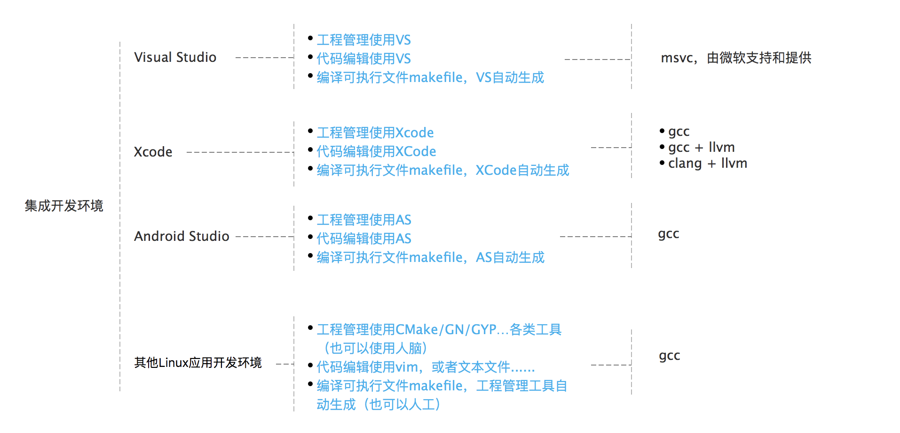
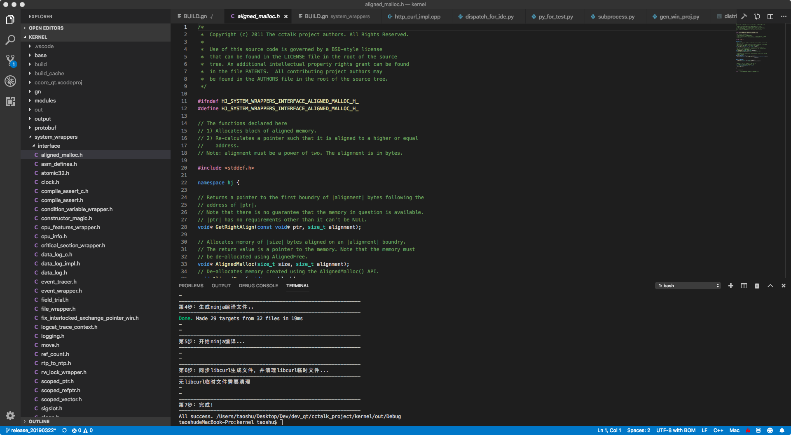
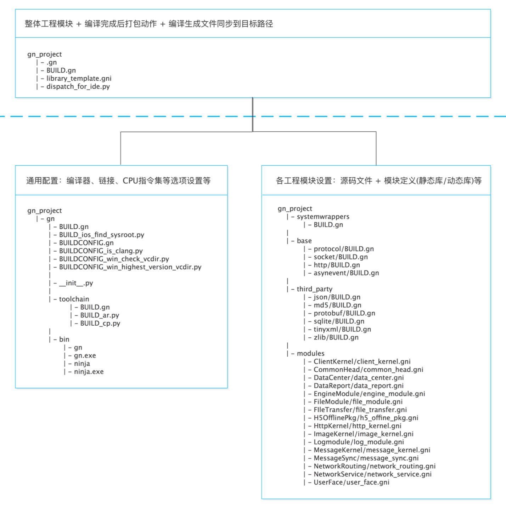
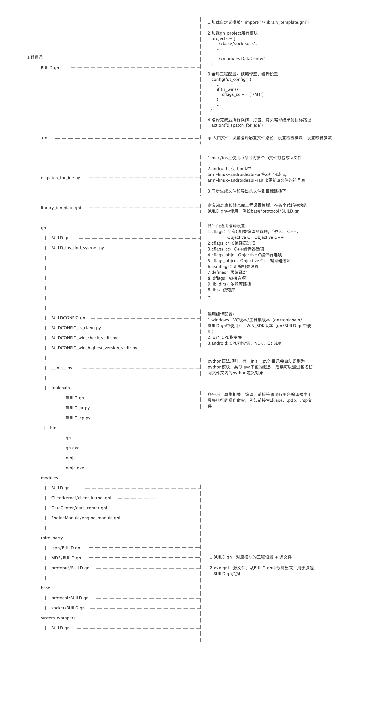
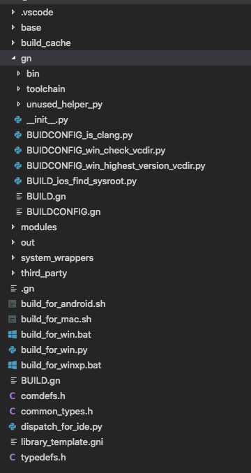
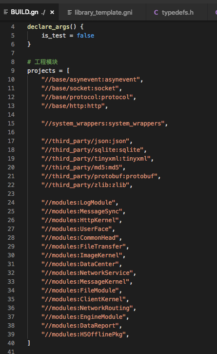
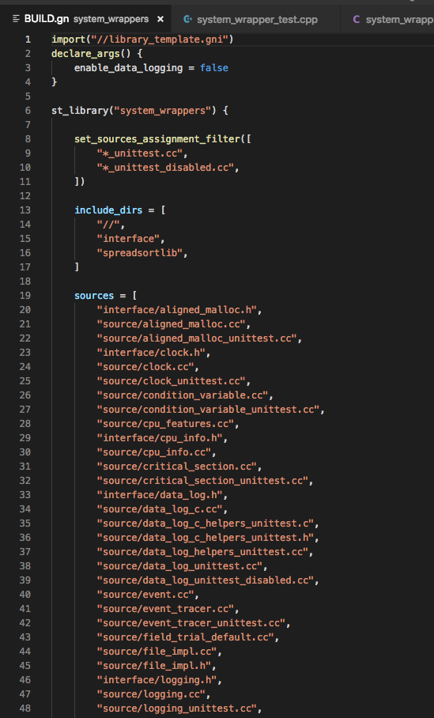
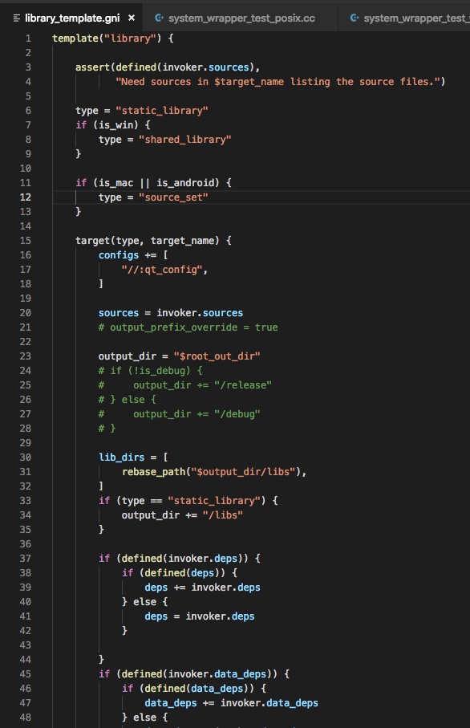
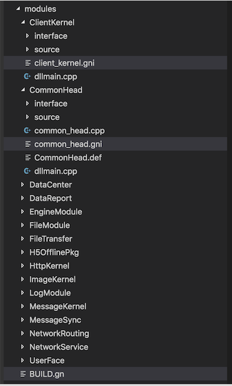

 
<!--BEGIN_DATA
{
    "create_date": "2022-01-02 10:30", 
    "modify_date": "2022-01-02 10:30", 
    "is_top": "0", 
    "summary": "GN快速入门指南<br/>GN语法和操作<br>跨平台：GN实践详解（ninja,编译,windows/mac/android实战）", 
    "tags": "工具", 
    "file_name": "Google gn工具.md"
}
END_DATA-->

[具体文档与工程：/file/zip/gn](/file/zip/gn)

#### <p>原文出处：<a href='https://blog.csdn.net/zhangtracy/article/details/79044004' target='blank'>GN快速入门指南</a></p>

## GN快速入门指南

  * GN快速入门指南
    * 内容
    * 运行GN
    * 建立一个构建
    * 传递构建参数
    * 交叉编译到目标操作系统或体系结构
    * 配置goma
    * 配置组件模式
    * 一步步
      * 添加一个构建文件
      * 测试你的添加
      * 声明依赖关系
      * 测试静态库版本
      * 编译器设置
      * 把设置放在配置中
      * 依赖配置
    * 添加一个新的构建参数
    * 不知道发生了什么事
      * 打印调试
      * desc命令
      * 性能

### 运行GN

你只需要从命令行运行`gn`。在`depot_tools`目录有一个同名脚本gn.py。这个脚本将在包含当前目录的源代码树中找到二进制文件并运行它。

### 建立一个构建

在GYP中，系统会为您生成`Debug`和`Release`建立目录并相应地进行配置。GN不这样做。相反，你可以使用你想要的任何配置来设置你想要的目录。当在该目录中构建时，如果Ninja文件过时会自动重新生成。

创建一个构建目录：

```
gn gen out/my_build
```

### 传递构建参数

通过运行以下命令在build目录中设置生成参数：

```
gn args out/my_build
```

这将启动一个编辑器。在这个文件中键入构建参数，如下所示：

```
is_component_build = true
is_debug = false
```

您可以通过输入以下命令来查看可用参数列表及其默认值

```
gn args --list out/my_build
```

请注意，您必须指定此命令的构建目录，因为可用的参数可以根据设置的构建目录进行更改。

Chrome开发人员还可以阅读[Chrome特定的构建配置](http://www.chromium.org/developers/gn-build-configuration)说明以获取更多信息。

### 交叉编译到目标操作系统或体系结构

运行`gn args out/Default`（根据需要替换您的构建目录），并为常见的交叉编译选项添加以下一行或多行。

```
target_os =“chromeos”
target_os =“android”
target_cpu =“arm”
target_cpu =“x86”
target_cpu =“x64”
```

有关更多信息，请参阅[GNCrossCompiles](cross_compiles.md)。

### 配置goma

运行`gn args out/Default`（根据需要替换您的构建目录）。加：

```
use_goma = true
goma_dir ="〜/foo/bar/goma"
```

如果你的goma在默认位置（`~/goma`），那么你可以省略该`goma_dir`行。

### 配置组件模式

这是一个像goma标志一样的构建参数。运行`gn args out/Default`并添加：

```
is_component_build = true
```

### 一步步

#### 添加一个构建文件

创建一个`tools/gn/tutorial/BUILD.gn`文件并输入以下内容：

```
executable("hello_world") {
  sources = [
    "hello_world.cc"
  ]
}
```

该目录中应该已经有一个`hello_world.cc`文件，包含你所期望的。就是这样！现在我们只需要告诉构建这个文件。打开`BUILD.gn`根目录中的文件，并将此目标的标签添加到其中一个根组的依赖关系（“组”目标是一个元目标，它只是其他目标的集合）：

```
group("root") {
  deps = [
    ...
    "//url"，
    "//tools/gn/tutorial:hello_world"
  ]
}
```

您可以看到您的目标标签是“//”（表示源根目录），后面是目录名称，冒号和目标名称。

#### 测试你的添加

从源根目录中打开命令行：

```
gn gen out/Default
ninja -C out/Default hello_world
out/Default/hello_world
```

GN鼓励目标名称不是全球唯一的静态库。要构建其中之一，您可以将不带前导“//”的标签传递给Ninja：

```
ninja -C out/Default tools/gn/tutorial:hello_world
```

#### 声明依赖关系

让我们来做一个静态库，它有一个函数向随机的人打招呼。该目录中有一个源文件`hello.cc`，它具有执行此操作的功能。打开`tools/gn/tutorial/BUILD.gn`文件并将静态库添加到现有文件的底部：

```
static_library（“hello”）{
  sources = [
    "hello.cc"
  ]
}
```

现在让我们添加一个依赖于这个库的可执行文件：

```
executable("say_hello"){
  sources = [
    "say_hello.cc"
  ]
  deps = [
    ":hello"，
  ]
}
```

这个可执行文件包含一个源文件，并依赖于前一个静态库。静态库在`deps`使用它的标签引用。您可以使用完整的标签，`//tools/gn/tutorial:hello`但是如果您在同一个构建文件中引用目标，则可以使用快捷方式`:hello`。

#### 测试静态库版本

从源根目录中运行命令行：

```
ninja -C out/Default say_hello
out/Default/say_hello
```

请注意，您**不必**重新运行GN。当任何构建文件发生变化时，GN将自动重建Ninja文件。当Ninja在执行开始时打印`[1/1]Regenerating ninja files`时，就是这种情况。

#### 编译器设置

我们的hello 库有一个新功能，能够同时向两个人打招呼。这个特性是通过定义`TWO_PEOPLE`来控制的。我们可以像这样添加定义：

```
static_library（“hello”）{
  sources = [
    "hello.cc"
  ]
  defines = [
    "TWO_PEOPLE"
  ]
}
```   

#### 把设置放在配置中

然而，库的用户也需要知道这个定义，并把它放在静态库目标中，只为那里的文件定义它。如果其他人包括`hello.h`，他们将不会看到新的定义。要看到新的定义，每个人都必须定义`TWO_PEOPLE`。

GN有一个叫“config”的概念封装设置。我们来创建一个定义我们的预处理器的定义：

```
config("hello_config"){
  defines = [
    "TWO_PEOPLE"
  ]
}
```

要将这些设置应用于目标，只需要将配置标签添加到目标中的配置列表中即可：

```
static_library（“hello”）{
  ...
  configs + = [
    “：hello_config”
  ]
}
```

请注意，您需要“+ =”而不是“=”，因为构建配置具有应用于每个设置默认构建内容的目标的默认配置集。你想添加到这个列表而不是覆盖它。要查看默认配置，可以使用`print`构建文件中的函数或`desc`命令行子命令（请参阅下面的两个示例）。

#### 依赖配置

这很好地封装了我们的设置，但仍然需要每个使用我们库的用户来设置自己的配置。如果依赖于我们的`hello`库的每个人都能自动获得这个信息，那就太好了。将您的库定义更改为：

```
static_library（“hello”）{
  sources = [
    “hello.cc”
  ]
  all_dependent_configs = [
    “：hello_config”
  ]
}
```

这应用`hello_config`于`hello`目标本身，加上所有目标的传递依赖于目前的目标。现在依赖我们的每个人都会得到我们的设置。你也可以设置`public_configs`只适用于直接依赖你的目标（不是过渡性）。

现在，如果您编译并运行，您将看到两个人的新版本：

```
> ninja -C out/Default say_hello
ninja: Entering directory 'out/Default'
[1/1] Regenerating ninja files
[4/4] LINK say_hello
> out/Default/say_hello
Hello, Bill and Joy.
```

### 添加一个新的构建参数

通过`declare_args`可以声明你接受哪些参数，并指定默认值。

```
declare_args（）{
  enable_teleporter = true
  enable_doom_melon = false
}
```

请参阅有关`gn help buildargs`如何工作的概述。请参阅`gn help declare_args`声明它们的具体内容。

在一个给定的范围内多次声明一个给定的参数是一个错误，因此应该在范围和命名参数中小心使用。

### 不知道发生了什么事？

您可以在详细模式下运行GN，以查看有关正在执行的操作的许多消息。使用`-v`。

#### 打印调试

有一个`print`命令仅写入标准输出：

```
static_library（"hello"）{
  ...
  print（CONFIGS）
}
```

这将打印适用于您的目标（包括默认的）的所有配置。

#### “desc”命令

您可以运行`gn desc <build_dir> <targetname>`以获取有关给定目标的信息：

```
gn desc out/Default //tools/gn/tutorial:say_hello
```

将打印出大量令人兴奋的信息。您也可以只打印一个部分。假设你想知道你的`TWO_PEOPLE`定义来自哪个`say_hello`目标：

```
> gn desc out/Default //tools/gn/tutorial:say_hello defines --blame
...lots of other stuff omitted...
  From //tools/gn/tutorial:hello_config
       (Added by //tools/gn/tutorial/BUILD.gn:12)
    TWO_PEOPLE
```

你可以看到，`TWO_PEOPLE`是由一个配置定义的，你也可以看到哪一行导致配置被应用到你的目标（在本例中，是`all_dependent_configs`行）。

另一个特别有趣的变量

```
gn desc out/Default //base:base_i18n deps --tree
```

通过`gn help desc`了解更多信息。

#### 性能

通过使用–time命令行标志运行它，可以看到花了多长时间。这将输出各种事物的时间统计。

您还可以跟踪构建文件的执行方式：

```
gn --tracelog = mylog.trace
```

并且您可以在Chrome的`about:tracing`页面中加载生成的文件来查看所有内容。

<hr>

#### <p>原文出处：<a href='https://blog.csdn.net/yujiawang/article/details/72627138' target='blank'>GN语法和操作</a></p>

## GN语法和操作

  * GN语法和操作
    * 介绍
      * 1使用内置的帮助
      * 2设计理念
    * 语法
      * 1字符串
      * 2清单
      * 3条件语句
      * 4循环
      * 5函数调用
      * 6作用域和执行
    * 命名
      * 1文件和目录名
      * 2 标识
    * 构建配置
      * 1总体构建流程
      * 2构建配置文件
      * 3构建参数
      * 4默认目标
    * 目标
    * CONFIGS
    * 工具链
      * 1工具链和构建配置
      * 2工具链例子
      * 3声明工具链
    * 模板
    * 其他功能
      * 1 Imports
      * 2 路径处理
      * 3 模式
      * 4 执行脚本
    * 与Blaze的区别和相似之处

### 1.介绍

本文描述了许多GN的语法细节和行为。

#### 1.1使用内置的帮助！

GN具有广泛的内置帮助系统，为每个函数和内置变量提供参考。 这个页面更高级。

```
GN help
```

您还可以阅读2016年3月的GN介绍的幻灯片。演讲者备注包含完整内容。

#### 1.2设计理念

  * 编写构建文件不应该有太多的创造性的工作。理想情况下，给定相同的要求，两个人应该生成相同的构建文件。除非确实需要，否则不应有灵活性。因为许多事情应该尽可能作为致命错误。

  * 定义应该更像代码而不是规则。我不想写或调试Prolog。但是我们团队中的每个人都可以编写和调试C ++和Python。 
  * 应该考虑构建语言应该如何工作。它没必要去容易甚至是可能表达抽象事物。我们应该通过改变源码或工具来使构建更加简单，而不是使构建加以复杂来满足外部需求（在合理的范围内）。

  * 像Blaze，它什么时候是有意义的（见下文“与Blaze的区别和相似之处”）。

### 2.语法

GN使用了一个非常简单的动态类型语言。的类型是：  
* 布尔（true，false）。   
* 64位有符号整数。   
* 字符串。   
* 列表（任何其它类型）。   
* 作用域（有点像字典，只是内置的东西）。   

有一些内置的变量，其值取决于当前的环境。参见gn help更多。  

GN中有许多故意的遗漏。例如没有用户定义的函数调用（模板是最接近的了）。 根据上述设计理念，如果你需要这种东西，已经不符合其设计理念了。  

变量sources有一个特殊的规则：当分配给它时，排除模式的列表会应用于它。 这是为了自动过滤掉一些类型的文件。 有关更多信息，请参阅`gn help set_sources_assignment_filter和gn help label_pattern`。  

书呆子似的GN的完整语法在gn help grammar中提供。

#### 2.1字符串

字符串用双引号和反斜线使用作为转义字符。唯一支持的转义序列是：

```
* \” （字符引用）   
* $ （字符美元符号）   
* \ （字符反斜杠）   
```
反斜杠的任何其他用法被视为字符反斜杠。 因此，例如在模式中使用的`\b`不需要转义，Windows路径，如`“C\foo\bar.h”`也不需要转义。  

通过支持简单的变量替换，其中美元符号后面的字替换为变量的值。如果没有非variable−name字符以终止变量名，可以使用选择性地包围名称。不支持更复杂的表达式，只支持变量名称替换。a=“mypath”b=“a/foo.cc” # b -> “mypath/foo.cc” c = “foo{a}bar.cc”  # c -> “foomypathbar.cc”  

你可以使用“0xFF”语法编码8位字符，所以带有换行符（十六进制0A）的字符串如下：`“look0x0Alike0x0Athis”`。

#### 2.2清单

我们是没有办法得到列表的长度的。 如果你发现自己想做这样的事情，那是你在构建中做了太多的工作。  
列表支持附加：

```
a = [ "first" ]
a += [ "second" ]  ## [ "first", "second" ]
a += [ "third", "fourth" ]  ## [ "first", "second", "third", "fourth" ]
b = a + [ "fifth" ]  ## [ "first", "second", "third", "fourth", "fifth" ]
```

将列表附加到另一个列表将项目附加在第二个列表中，而不是将列表附加为嵌套成员。  
您可以从列表中删除项目：

```
a = [ "first", "second", "third", "first" ]
b = a - [ "first" ]  ## [ "second", "third" ]
a -= [ "second" ]  ## [ "first", "third", "fourth" ]
```

列表中的 - 运算符搜索匹配项并删除所有匹配的项。 从另一个列表中减去列表将删除第二个列表中的每个项目。  

如果没有找到匹配的项目，将抛出一个错误，因此您需要提前知道该项目在那里，然后再删除它。

假定没有办法测试是否包含，主要用例是设置文件或标志的主列表，并根据各种条件删除不适用于当前构建的主列表。

在文体风格上，只喜欢添加到列表，并让每个源文件或依赖项出现一次。

这与Chrome团队为GYP提供的建议（GYP更愿意列出所有文件，然后删除在条件语中不需要的文件）相反。  

列表支持基于零的下标来提取值：

```
a = [ "first", "second", "third" ]
b = a[1]  ## -> "second"
```

`[]`运算符是只读的，不能用于改变列表。 主要用例是当外部脚本返回几个已知值，并且要提取它们时。  

在某些情况下，当你想要附加到列表时，很容易覆盖列表。

为了帮助捕获这种情况，将非空列表赋给包含非空列表的变量是一个错误。如果要解决此限制，请先将空列表赋给目标变量。如下：  

```
a = [ “one” ]  
a = [ “two” ] ## Error: overwriting nonempty list with a nonempty list.  
a = [] ## OK  
a = [ “two” ] ## OK  
```

注意，构建脚本执行时并不理解潜在数据的含义。这意味着它并不知道sources是一个文件名的列表。例如，如果你想删除其中一项，它必须字符串完全匹配，而不是指定一个不带后缀的名称，它并不会解析为相同的文件名。

#### 2.3条件语句

条件表达式看起来像C：

```
if (is_linux || (is_win && target_cpu == "x86")) {
  sources -= [ "something.cc" ]
} else if (...) {
  ...
} else {
  ...
}
```

如果目标只应在某些情况下声明，你就可以使用条件语句，甚至是整个目标。

#### 2.4循环

你可以用foreach遍历一个列表。

但不鼓励这样做。构建做的大多数事情应该都可以表达，而不是循环，如果你发现有必要使用循环，这可能说明你在构建中做了一些无用的工作。

```
foreach(i, mylist) {
  print(i)  ## Note: i is a copy of each element, not a reference to it.
}
```

#### 2.5函数调用

简单的函数调用看起来像大多数其他的语言：  

```
print(“hello, world”)  
assert(is_win, “This should only be executed on Windows”)  
```

这些功能是内置的，用户不能定义新的功能。  
一些函数接受一个由{}括起来的代码块：

```
static_library("mylibrary") {
  sources = [ "a.cc" ]
}
```

其中大多数定义目标。 用户可以使用下面讨论的模板机制来定义这样的functions。  

确切地说，这个表达式意味着该块变成用于函数执行的函数的参数。 大多数块风格函数执行块并将结果作为要读取的变量的字典。

#### 2.6作用域和执行

文件和函数调用后跟{}块将引入新作用域。 作用域是嵌套的。 当你读取变量时，将以相反的顺序搜索包含的作用域，直到找到匹配的名称。 变量写入始终位于最内层。  

没有办法修改除最内层之外的任何封闭作用域。 这意味着，当你定义一个目标，例如，你在块里面做的什么都不会“泄漏”到文件的其余部分。  

`if/else/foreach`语句，即使他们使用{}，不会引入一个新的作用域，所以更改会影响到语句之外。

### 3.命名

#### 3.1文件和目录名

文件和目录名称是字符串，并且被解释为相对于当前构建文件的目录。 有三种可能的形式：  

相对名称：

```
“foo.cc”
“SRC/foo.cc”
“../src/foo.cc”
```

Source-tree绝对名称：

```
“//net/foo.cc”
“//base/test/foo.cc”
```
    
系统绝对名称（很少，通常用于包含目录）：
    
```
"/usr/local/include/"
"/C:/Program Files/Windows Kits/Include"
```

#### 3.2 标识

标识是有着预定义格式的字符串，依赖图中所有的元素（目标，配置和工具链）都由标识唯一识别。通常情况下，标识看去是以下样子。  

```
“//base/test:test_support”  
```

它由三部分组成：source-tree绝对路径，冒号和名称。上面这个标识指示到/base/test/BUILD.gn中查找名称是`“test_support”`的标识。  

当加载构建文件时，如果在相对于source root给定的路径不存在时，GN将查找build/secondary中的辅助树。该树的镜像结构主存储库是一种从其它存储库添加构建文件的方式（那些我们无法简单地合入BUILD文件） 辅助树只是备用而不是覆盖，因此正常位置中的文件始终优先。  

完整的标识还包括处理该标识要使用的工具链。工具链通常是以继承的方式被默认指定，当然你也可以显示指定。  
“//base/test:test_support(//build/toolchain/win:msvc)”  

上面这个标识会去“//build/toolchain/win”文件查到名叫”msvc”的工具链定义，那个定义会知道如何处理“test_support”这个标
识。  

如果你指向的标识就在此个build文件，你可以省略路径，而只是从冒号开始。  

`“:base”`

你可以以相对于当前目录的方式指定路径。标准上说，要引用非本文件中标识时，除了它要在不同上下文运行，我们建议使用绝对路径。什么是要在不同上下文运行？举个列子，一个项目它既要能构造独立版本，又可能是其它项目的子模块。  

`“source/plugin:myplugin” ## Prefer not to do these.`
`“../net:url_request”`

书写时，可以省略标识的第二部分、第三部分，即冒号和名称，这时名称默认使用目录的最后一段。标准上说，在这种情况建议省略第二、三部分。（以下的“=”表示等同）  

`“//net” = “//net:net”`
`“//tools/gn” = “//tools/gn:gn”`

### 4.构建配置

#### 4.1总体构建流程

在当前目录查找.gn文件，如果不存在则向上一级目录查找直到找到一个。将这个目录设为”souce root”, 解析该目录下的gn文件以获取build
confing文件名称。  

执行build config文件（这是一个默认工具链），在chromium中是//build/config/BUILDCONFIG.gn;  

加载root目录下的BUILD.gn文件;  

根据root目录下的BUILD.gn内容加载其依赖的其它目录下的BUILD.gn文件，如果在指定位置找不到一个gn文件，GN将查找build/secondary 的相应位置；  

当一个目标的依赖都解决了，编译出.ninja文件保存到out_dir/dir，例如`./out/arm/obj/ui/web_dialogs/web_dialogs.ninja`;  

当所有的目标都解决了， 编译出一个根 build.ninja 文件存放在out_dir根目录下。

#### 4.2构建配置文件

第一个要执行的是构建配置文件，它在指示源码库根目录的“.gn”文件中指定。Chrome源码树中该文件是`“//build/config/BUILDCONFIG.gn”`。整个系统有且只有一个构造配置文件。  

除设置其它build文件执行时的工作域外，该文件还设置参数、变量、默认值，等等。设置在该文件的值对所有build文件可见。  

每个工具链会执行一次该文件（见“工具链”）。

#### 4.3构建参数

参数可以从命令行（和其他工具链，参见下面的“工具链”）传入。 你可以通过declare_args声明接受哪些参数和指定默认值。  

有关参数是如何工作的，请参阅gn help buildargs。 有关声明它们的细节，请参阅`gn help declare_args`。

在给定作用域内多次声明给定的参数是一个错误。 通常，参数将在导入文件中声明（在构建的某些子集之间共享它们）或在主构建配置文件中（使它们是全局的）。

#### 4.4默认目标

您可以为给定的目标类型设置一些默认值。 这通常在构建配置文件中完成，以设置一个默认配置列表，它定义每个目标类型的构建标志和其他设置信息。  

请参阅`gn help set_defaults`。

例如，当您声明`static_library`时，将应用静态库的目标默认值。 这些值可以由目标覆盖，修改或保留。

```
## This call is typically in the build config file (see above).
set_defaults("static_library") {
  configs = [ "//build:rtti_setup", "//build:extra_warnings" ]
}
## This would be in your directory's BUILD.gn file.
static_library("mylib") {
  ## At this point configs is set to [ "//build:rtti_setup", "//build:extra_warnings" ]
  ## by default but may be modified.
  configs -= "//build:extra_warnings"  ## Don't want these warnings.
  configs += ":mylib_config"  ## Add some more configs.
}
```

用于设置目标默认值的其他用例是，当您通过模板定义自己的目标类型并想要指定某些默认值。

### 5.目标

目标是构造表中的一个节点，通常用于表示某个要产生的可执行或库文件。目标经常会依赖其它目标，以下是内置的目标类型（参考gn help ）：  

```
action：运行一个脚本来生成一个文件。  
action_foreach：循环运行脚本依次产生文件。  
bundle_data：产生要加入Mac/iOS包的数据。  
create_bundle：产生Mac/iOS包。  
executable：生成一个可执行文件。  
group：包含一个或多个目标的虚拟节点（目标）。  
shared_library：一个.dll或的.so。  
loadable_module：一个只用于运行时的.dll或.so。  
source_set：一个轻量的虚拟静态库（通常指向一个真实静态库）。  
static_library：一个的.lib或某文件（正常情况下你会想要一个source_set代替）。  
你可以用模板（templates）来扩展可使用的目标。Chrome就定义了以下类型。  
component：基于构造类型，或是源文件集合或是共享库。  
test：可执行测试。在移动平台，它用于创建测试原生app。  
app：可执行程序或Mac/iOS应用。  
android_apk：生成一个APK。有许多Android应用，参考//build/config/android/rules.gni。
```

### 6. CONFIGS

配置是指定标志集，包含目录和定义的命名对象。 它们可以应用于目标并推送到依赖目标。

```
config("myconfig") {
  includes = [ "src/include" ]
  defines = [ "ENABLE_DOOM_MELON" ]
}
```

将配置应用于目标：

```
executable("doom_melon") {
  configs = [ ":myconfig" ]
}
```

build config文件通常指定设置默认配置列表的目标默认值。 根据需要，目标可以添加或删除到此列表。 所以在实践中，你通常使用`configs + =“：myconfig”`附加到默认列表。  
有关如何声明和应用配置的更多信息，请参阅gn help config。

公共CONFIGS目标可以将设置应用于依赖它的目标。 最常见的例子是第三方目标，它需要一些定义或包含目录来使其头文件正确include。

希望这些设置适用于第三方库本身，以及使用该库的所有目标。  

为此，我们需要为要应用的设置编写config：

```
config("my_external_library_config") {
  includes = "."
  defines = [ "DISABLE_JANK" ]
}
```

然后将这个配置被添加到public_configs。 它将应用于该目标以及直接依赖该目标的目标。

```
shared_library("my_external_library") {
  ...
  ## Targets that depend on this get this config applied.
  public_configs = [ ":my_external_library_config" ]
}
```

依赖目标可以通过将你的目标作为“公共”依赖来将该依赖树转发到另一个级别。

```
static_library("intermediate_library") {
  ...
  ## Targets that depend on this one also get the configs from "my external library".
  public_deps = [ ":my_external_library" ]
}
```

目标可以将配置转发到所有依赖项，直到达到链接边界，将其设置为`all_dependent_config`。

但建议不要这样做，因为它可以喷涂标志和定义超过必要的更多的构建。 相反，使用`public_deps`控制哪些标志适用于哪里。  

在Chrome中，更喜欢使用构建标志头系统（`build/buildflag_header.gni`）来防止编译器定义导致的大多数编译错误。

### 7.工具链

Toolchains 是一组构建命令来运行不同类型的输入文件和链接的任务。  

可以设置有多个 Toolchains 的 build。 不过最简单的方法是每个 toolchains 分开 build同时在他们之间加上依赖关系。

这意味着,例如,32 位 Windows 建立可能取决于一个 64 位助手的 target。 他们每个可以依赖“//base:base”将 32 位基础背景下的 32 位工具链,和 64 位背景下的 64 位工具链。  

当 target 指定依赖于另一个 target,当前的 toolchains 是继承的,除非它是明确覆盖(请参见上面的“Labels”)。

#### 7.1工具链和构建配置

当你有一个简单的版本只有一个 toolchain，build config 文件是在构建之初只加载一次。它必须调用 `set_default_toolchain` 告诉 GN toolchain 定义的 label 标签。 此 toolchain定义了需要用的编译器和连接器的命令。 

toolchain 定义的 toolchain_args 被忽略。当 target 对使用不同的 toolchain target 的依赖， GN 将使用辅助工具链来解决目标开始构建。 GN 将加载与工具链定义中指定的参数生成配置文件。 

由于工具链已经知道， 调用 `set_default_toolchain` 将被忽略。所以 oolchain configuration 结构是双向的。 

在默认的toolchain（即主要的构建 target）的配置从构建配置文件的工具链流向： 构建配置文件着眼于构建（操作系统类型， CPU 架构等）的状态，并决定使用哪些 toolchain（通过 `set_default_toolchin`）。 

在二次 toolchain，配置从 toolchain 流向构建配置文件：在 toolchain 定义 `toolchain_args` 指定的参数重新调用构建。

#### 7.2工具链例子

假设默认的构建是一个 64 位版本。 无论这是根据当前系统默认的 CPU 架构， 或者用户在命令行上传递 target_cpu=“64”。 build config file 应该像这样设置默认的工具链：

```
## Set default toolchain only has an effect when run in the context of
## the default toolchain. Pick the right one according to the current CPU
## architecture.
if (target_cpu == "x64") {
  set_default_toolchain("//toolchains:64")
} else if (target_cpu == "x86") {
  set_default_toolchain("//toolchains:32")
}
```

如果一个 64 位的 target 要依靠一个 32 位二进制数， 它会使用 `data_deps` 指定的依赖关系（`data_deps` 依赖库在运行时才需要链接时不需要， 因为你不能直接链接 32 位和 64位的库）。

```
executable("my_program") {
  ...
  if (target_cpu == "x64") {
    ## The 64-bit build needs this 32-bit helper.
    data_deps = [ ":helper(//toolchains:32)" ]
  }
}
if (target_cpu == "x86") {
  ## Our helper library is only compiled in 32-bits.
  shared_library("helper") {
    ...
  }
}
```

上述（引用的工具链文件toolchains/BUILD.gn）将定义两个工具链：

```
toolchain("32") {
  tool("cc") {
    ...
  }
  ... more tools ...
  ## Arguments to the build when re-invoking as a secondary toolchain.
  toolchain_args = {
    current_cpu = "x86"
  }
}
toolchain("64") {
  tool("cc") {
    ...
  }
  ... more tools ...
  ## Arguments to the build when re-invoking as a secondary toolchain.
  toolchain_args = {
    current_cpu = "x64"
  }
```

工具链args明确指定CPU体系结构，因此如果目标依赖于使用该工具链的东西，那么在重新调用该生成时，将设置该cpu体系结构。

这些参数被忽略为默认工具链，因为当他们知道的时候，构建配置已经运行。 通常，工具链args和用于设置默认工具链的条件应该一致。  

有关多版本设置的好处是， 你可以写你的目标条件语句来引用当前 toolchain 的状态。构建文件将根据每个 toolchain 不同的状态重新运行。

对于上面的例子 `my_program`， 你可以看到它查询 CPU 架构， 加入了只依赖该程序的 64 位版本。 32 位版本便不会得到这种依赖性。

#### 7.3声明工具链

工具链均使用 toolchain 的命令声明， 它的命令用于每个编译和链接操作。 该toolchain 在执行时还指定一组参数传递到 build config 文件。 这使您可以配置信息传递给备用 toolchain。

### 8.模板

模板是 GN 重复使用代码的主要方式。 通常， 模板会扩展到一个或多个其他目标类型。

```
## Declares a script that compiles IDL files to source, and then compiles those
## source files.
template("idl") {
  ## Always base helper targets on target_name so they're unique. Target name
  ## will be the string passed as the name when the template is invoked.
  idl_target_name = "${target_name}_generate"
  action_foreach(idl_target_name) {
    ...
  }
  ## Your template should always define a target with the name target_name.
  ## When other targets depend on your template invocation, this will be the
  ## destination of that dependency.
  source_set(target_name) {
    ...
    deps = [ ":$idl_target_name" ]  ## Require the sources to be compiled.
  }
}
```

通常情况下你的模板定义在一个.gni 文件中， 用户 import 该文件看到模板的定义：

```
import("//tools/idl_compiler.gni")
idl("my_interfaces") {
  sources = [ "a.idl", "b.idl" ]
}
```

声明模板会在当时在范围内的变量周围创建一个闭包。 当调用模板时，魔术变量调用器用于从调用作用域读取变量。 模板通常将其感兴趣的值复制到其自己的范围中：

```
template("idl") {
  source_set(target_name) {
    sources = invoker.sources
  }
}
```

模板执行时的当前目录将是调用构建文件的目录，而不是模板源文件。 这是从模板调用器传递的文件将是正确的（这通常说明大多数文件处理模板）。

但是，如果模板本身有文件（也许它生成一个运行脚本的动作），你将需要使用绝对路径`（“// foo / …”）`来引用这些文件， 当前目录在调用期间将不可预测。

有关更多信息和更完整的示例，请参阅gn帮助模板。

### 9.其他功能

#### 9.1 Imports

您可以 import .gni 文件到当前文件中。 这不是 C++中的 include。 Import 的文件将独立执行并将执行的结果复制到当前文件中（C++执行的时候， 当遇到 include 指令时才会在当前环境中 include 文件）。 Import 允许导入的结果被缓存，并且还防止了一些“creative”的用途包括像嵌套 include 文件。通常一个.gni 文件将定义 build 的参数和模板。 命令 gn help import 查看更多信息。.gni 文件可以定义像_this 名字前使用一个下划线的临时变量， 从而它不会被传出文件外。。

#### 9.2 路径处理

通常你想使一个文件名或文件列表名相对于不同的目录。 这在运行 scripts 时特别常见的， 当构建输出目录为当前目录执行的时候， 构建文件通常是指相对于包含他们的目录的文件。您可以使用 `rebase_path` 转化目录。命令 `gn help rebase_path` 查看纤细信息。

#### 9.3 模式

Patterns 被用来在一个部分表示一个或多个标签。

```
命令：gn help set_sources_assignment_filter 
      gn help label_pattern 查看更多信息。
```

#### 9.4 执行脚本

有两种方式来执行脚本。 GN中的所有外部脚本都在Python中。第一种方式是构建步骤。这样的脚本将需要一些输入并生成一些输出作为构建的一部分。调用脚本的目标使用“action”目标类型声明（请参阅gn help action）。  

在构建文件执行期间，执行脚本的第二种方式是同步的。在某些情况下，这是必要的，以确定要编译的文件集，或者获取构建文件可能依赖的某些系统配置。构建文件可以读取脚本的stdout并以不同的方式对其执行操作。  

同步脚本执行由`exec_script`函数完成（有关详细信息和示例，请参阅`gn help exec_script`）。因为同步执行脚本需要暂停当前的buildfile执行，直到Python进程完成执行，所以依赖外部脚本很慢，应该最小化。  

为了防止滥用，允许调用exec_script的文件可以在toplevel .gn文件中列入白名单。 

Chrome会执行此操作，需要对此类添加进行其他代码审核。请参阅gn help dotfile。  

您可以同步读取和写入在同步运行脚本时不鼓励但偶尔需要的文件。典型的用例是传递比当前平台的命令行限制更长的文件名列表。有关如何读取和写入文件，请参阅`gn help read_file`和`gn help write_file`。如果可能，应避免这些功能。  

超过命令行长度限制的操作可以使用响应文件来解决此限制，而不同步写入文件。请参阅gn help response_file_contents。

### 10.与Blaze的区别和相似之处

Blaze是Google的内部构建系统，现在作为Bazel公开发布。它启发了许多其他系统，如Pants和buck。  

在Google的同类环境中，对条件的需求非常低，他们可以通过一些hacks（abi_deps）来实现。

Chrome在所有地方使用条件，需要添加这些是文件看起来不同的主要原因。  

GN还添加了“configs”的概念来管理一些棘手的依赖和配置问题，这些问题同样不会出现在服务器上。

Blaze有一个“配置”的概念，它像GN工具链，但内置到工具本身。工具链在GN中的工作方式是尝试将这个概念以干净的方式分离到构建文件中的结果。  

GN保持一些GYP概念像“所有依赖”设置，在Blaze中工作方式有点不同。这部分地使得从现有GYP代码的转换更容易，并且GYP构造通常提供更细粒度的控制（其取决于情况是好还是坏）。  

GN也使用像“sources”而不是“srcs”的GYP名称，因为缩写这似乎不必要地模糊，虽然它使用Blaze的“deps”，因为“dependencies”很难键入。 Chromium还在一个目标中编译多种语言，因此指定了目标名称前缀的语言类型（例如从cc_library）。

[https://chromium.googlesource.com/chromium/src/+/master/tools/gn/docs/language.md](https://chromium.googlesource.com/chromium/src/+/master/tools/gn/docs/language.md)

<hr>

#### <p>原文出处：<a href='https://blog.csdn.net/weixin_44701535/article/details/88355958' target='blank'>跨平台：GN实践详解（ninja,编译,windows/mac/android实战）</a></p>

### 目录

> 一、概览 
> 二、跨平台代码编辑器 
> 三、GN入门 
> 四、示范工程 
> 五、关键细节 
> 六、结语 [编译器选项]  

其中前两部分是前缀部分，原本没有跨平台构建经验和知识的同学可以借助来帮助理解，后四部分则是讲述GN工程的基本结构、如何搭建一个GN构建的工程、以及关键的一些GN知识

### 一、概览

如何开始这个话题是我比较在意的，因为对于部分人而言，真正从思维和理解上切入这篇文章真正要阐述的点是有困难的。这在于跨平台编译和开发这块，如果没有一定的经历，可能会很难理解这些跨平台工具出现的真正意义，它们所要解决的问题是什么，所以这里我需要做一点前缀工作，如果对GN/GYP/CMake这类话题已经有上下文的同学可以直接跳过这部分赘述内容，同时也希望借助对这篇文章的理解，大家往后对于跨平台工具的理解不局限于GN，而是有自己的认知。在不断发展和变化的大潮中，工具始终是在演变，能够始终抓住紧要的精髓，见到陌生的工具时对它从根上有淡定从容的认知，以最小的精力消耗掌握它，最快发挥它的价值服务于我们，才是我们的取胜之道。

#### 集成编译开发环境

以实际工作为例，我们在开发过程中需要接触到的有源代码工程管理、代码编辑、代码编译，而统一囊括了这几部分的开发环境就是集成开发环境，由于集成开发环境的存在，大部分人其实只需要重点关注代码编辑这块，工程管理和编译集成开发环境已经内置做了绝大部分工作，所以理所当然也就容易忽略它们，我们也有必要重新认识下这几部分工作。

**工程管理**：源代码包含、模块输出设置（动态库/静态库/可执行文件、模块依赖关系配置、编译选项设置、链接选项设置、生成后执行事件……等非常多的设置。  

**代码编辑**：自动补齐、格式对齐、定义跳转、关键字高亮、代码提示……等我们编写代码时用着很人性化的功能。  

**代码编译**：语法语音分析、代码优化、错误提示、警告提示、最终生成二进制代码和符号表。_

#### 各操作系统应用开发的集成开发环境

**Windows应用开发**：Visual Studio，简称VS，是微软提供和支持的集成开发编译环境，用于开发Windows上应用。  
**Mac/iOS应用开发**: Xcode，是苹果提供和支持的集成开发编译环境，用于开发Mac和iOS应用。  
**Android应用开发**：Android Studio，简称AS，是谷歌提供和支持的集成开发环境，用于开发Android应用。  
**Ubuntu等Linux应用开发**：没有集成开发环境，工程管理使用CMake/GN/GYP…各类工具（也可以使用人脑）、代码编辑使用vim等工具，编译器使用GCC。_

但实际上，这些集成开发环境都不约而同的将编译相关的细节很好的隐藏起来了，因为这块实在是太晦涩和繁琐，这里我们需要有一个很清晰的认知，那就是这些集成开发环境之下，隐藏的编译器基本上只有：微软的msvc，GNU的gcc，苹果的clang+llvm这三大类，让我们再次展开这几个集成开发环境，一窥的它的全貌  



其中蓝色部分就是跨平台工具的主战场，旨在脱离各平台开发环境的限制，统一进行工程管理和工程设置，最终由工具自动生成统一的各平台makefile文件，调用各平台编译器完成编译。

#### 沿途的风景

在通往终点的路上，总有一些风景值得欣赏，如果有感兴趣的同学，可以品味下编译器的技术历史，以及gcc+llvm这种畸形产物的闲闻逸事：  

1. msvc，对于微软而言，闭源是它一直以来的做派，如今有所改善，而编译器则是那时候的产物，所以理所当然，宇宙最强IDE中的编译器，只限于windows这个平台上  
  
2. gcc，是GNU开发的编程语言编译器，以GPL及LGPL许可证所发行的自由软件，开放给所有人，是最通用和广泛的编译器  
  
3. gcc+llvm，苹果早期使用的gcc，gcc非常通用，支持多种语言，但对苹果官方提出的Objective-C编译器优化的诉求爱答不理，导致苹果只能想办法自己来做，一般而言，按照保守的重构做法一部分一部分渐进式替换原有模块是比较理性的思路，苹果也是采用这种策略，将编译器分为前后两端，前端做语义语法分析，后端做指令生成编译，而后端则是苹果实现自己愿望的第一步，由此llvm横空出世。后端使用llvm，在编译期间针对性优化，例如以显卡特性为例，将指令转换为更为高效的GPU指令，提升运行性能。前端使用gcc，在编译前期做语义语法分析等行为  
4. clang+llvm，由于gcc语义语法分析上，对于Objective-C做得不够细致，gcc+llvm这种组合无法提供更为高级的语法提示、错误纠正等能力，所以苹果开始更近一步，开发实现了编译器前端clang，所以到目前为止xcode中缺省设置是clang+llvm，clang在语义和语法上更为先进和人性化，但缺点显而易见，Clang只支持C，C++和Objective-C，Swift这几种苹果体系内会用到的语言。

#### 跨平台开发遇到的问题

一般而言，如果一个应用需要在各个操作系统上都有实现，基本的方式都是将大部分能复用的代码和逻辑封装到底层，减少冗余的开发和维护工作，像微信、QQ、支付宝等知名软件，都是这种方式。由于各个操作系统平台的集成开发环境不同，这部分底层工程需要在各个集成开发环境中搭建和维护工程、编译应用，这样就会产生大量重复工作，任何一个源码文件的增加/删除、模块调整都会涉及到多个集成开发环境的工程调整。这个时候，大多数人都会想，如果有这么一个工具，我们用它管理工程和编译，一份工程能够自动编译出各个平台的应用或底层库，那将是多么美好的一个事情。

幸运的是，已经有前人替我们感受过这个痛苦的过程，也有前人为我们种好了树，我们只需要找好一个合适的树，背靠着它，调整好坐姿，怀着无比感恩的心情在它的树荫下乘凉。树有好多课，该选哪一颗，大家兴趣至上自行选择，这里我们主要介绍我个人倾向的GN这一棵。

**原始跨平台**：

编写makefile文件，使用各平台上的make（微软的MS nmake、GNU的make）来编译makefile文件，这种做法的缺点是各平台的make实现不同，导致这种原始的做法其实复用度并不高，需要针对各平台单独编写差异巨大的makefile文件，那为什么要介绍它呢，因为这是跨平台的根，所有跨平台工具，最终都是要依赖各平台应用的集成开发环境的编译器来执行编译，这是固定不变的，也就是说各平台的编译，最终还是需要各平台的makefile，这一点是无法逃避的，而怎么由人工转为自动化，才是跨平台编译的进阶之路。  

**进阶跨平台**：

使用cmake，编写统一的makefile文件，最后由cmake自动生成各平台相关的makefile文件执行编译，这一点上，cmake已经是比较好的跨平台工具了，一般的跨平台工程基本已经满足需求了。  

**现代跨平台**：

当工程规模增大到难以想象的量级时，编译速度和工程模块的划分变得尤为重要，其中chromium工程就遇到这两个问题，于是最初诞生了gyp，最后演化升级为gn，其旨在追求工程更加清晰的模块和结构呈现，以及更快的编译速度。前者通过语法层面实现，后者则依靠ninja来提升编译速度，因为大型工程的编译，很大一部分时间都花在了源文件编译依赖树的分析这块，而ninja更像是一个编译器的预处理，其主要目的是舍弃gcc、msvc、clang等编译器在编译过程中递归查找依赖的方式，因为这里存在很多重复的依赖查找，而ninja改进了这一过程，提前生成编译依赖树，编译期间按照编译依赖树的顺序依次编译，这样就大大减少了编译期间杂乱的编译顺序造成的重复依赖关系查找。  

**关于一点说明：**  

本文主要针对底层库领域的跨平台构建，这也是比较常见和通用的跨平台应用方式，但不排除有例外，像Qt就是一套从底层开发到UI框架，再到代码编辑、工程管理的C++整体跨平台解决方案，它的涵盖面更大，只有应用层使用Qt的UI框架时才能发挥它的真正威力（有兴趣的同学可以研究它，目前我所在团队研发的CCtalk客户端Windows和Mac，以及即将外发的Chromebook版都是使用它，我也打算在一个合适的时机从我最擅长的UI框架领域来介绍Qt的实战应用），而这篇文章寻求的是目前为止更通用化的跨平台方式，也就是C++跨平台底层+原生UI应用层的组合方式，所以本文跨平台的切入重点也是针对底层库这一块，做得好的应用，一般会把网络、数据、业务上下文状态管理归属到底层由跨平台实现，这部分可以达到整个应用程序代码量的60～70%，完成这块的复用是非常值得的。

### 二、跨平台代码编辑器

gn解决了跨平台编译问题，但是各平台的代码编辑，并不属于底层C++跨平台构建工具的范畴（全框架C++流程的Qt例外）。一种做法是，通过gn生成各个平台的工程（xcode工程、vs工程）然后再进行代码编写，源文件和工程模块的修改需要另外同步到gn工程文件中；另一种做法是使用vscode。显而易见，使用vscode+gn是最佳选择，这样就相当于一个各平台统一的集成开发环境，这里我给大家预览下vscode和gn配合之下的预览图：

* 代码编写使用vscode，有各种插件提供了语法提示和检测、自动补齐、高亮等编辑器功能
* 代码编译使用gn，在vscode中直接有内置的命令行，直接运行编译脚本执行编译，编译脚本中是gn的编译命令的调用
* 在vscode+gn的使用过程中，我们会慢慢体会到代码编辑、编译的白盒流程，而不是以前的黑盒，对编辑和编译流程的理解也将越来越深刻，这是软件开
发越来越上层的当下，最难能可贵的地方，是抱有一颗求知之心的人最珍视的东西。



### 三、GN入门

#### 官方文档

> [https://gn.googlesource.com/gn/+/master/docs](https://gn.googlesource.com/gn/+/master/docs)  

GN虽然有非常完善和详细的官方文档，但如果要真正搭建一个跨平台的工程，则往往寸步难行，这在于GN终究只是chromium的附产物，在于更好的服务chromium工程，所以缺少一些必要详细的入门模版，尤其是在各个编译器下的编译、链接选项设置这块，需要完全理解各个编译器的编译参数和设置，这对于我们的精力来说，几乎是不可能一下子就能了解清楚的，而这些编译选项往往是一次性工作，一旦配置好了，以后都不需要修改，或者仅需要修改个别选项。好在有大量成熟的跨平台开源项目，以chromium为例，我们从中扒出GN的最小集，再应用到我们一个自定义的工程中，搞清楚各个环节的含义，那么基本就算已经掌握了GN了。

#### 示例工程

为了能够对GN有一个全貌的了解，我准备了一个简单的demo工程，请大家务必下载下来，后续的介绍都是基于这个示例工程来做 

[示例工程](/file/zip/gn/gn_project.zip)

如果大家遇到下载不了或者最终编译错误的异常情况可以评论中联系我，目前已在windows、mac、android编译环境验证_

#### 鸟瞰一个GN工程

> 我们先从工程的全貌来看，这是我们demo工程的全局视图，GN组织一个跨平台工程分为3大块：  
> 第1部分：整体工程入口，这部分常年都不用做修改  
> 第2部分：GN通用文件，这部分常年都不用做修改  
> 第3部分：GN源代码工程文件，这部分与平常我们在集成开发环境中类似，源文件的组织和管理就在这个部分



#### 详解各GN文件职责



### 四、示范工程

一般而言，这一部分仔细阅读后，基本就可以依葫芦画瓢使用起GN了，更加细节的部分则需要靠大家阅读官方文档以及后续的第五部分内容

#### 准备环境

1. 安装vscode（主要是方便大家阅读工程结构，也可以跳过这一步，只是会增加工程的理解难度而已）

vscode的使用非常简单，指定打开某个文件夹，然后整个文件夹的目录结构就自动呈现在vscode的左侧了，同时插件安装异常方便，直接在vscode左侧最后一个tab中搜索关键字就会有插件的在线安装提示，根据提示安装好安装C++插件、gn插件等插件后，就可以作为代码编辑器编写代码了。  

2. 安装python3

关于python的语法，简单了解就好，遇到看不懂的稍微查下语法，脚本语言总是易于理解和使用的，大家要有信心。

#### 工程目录结构



#### 各平台编译脚本执行

```
windows：在gn_project目录下，命令行中运行（vscode内置的更方便）命令build_for_win.bat debug  
mac：gn_project目录下，命令行中运行（vscode内置的更方便）命令./build_for_mac.sh debug  
android: gn_project目录下，命令行中运行（vscode内置的更方便）命令./build_for_android.sh debug arm_
```

#### mac平台编译入口脚本

`./build_for_mac.sh`，关键脚本如下（只是截取部分关键代码，旨在让大家看到各平台下gn编译命令的调用）：

```
# ninja files
$gn gen $build_cache_path --args="is_debug=$debug_mode target_cpu=“x64"”
if [ $? != 0 ]; then
    echo “generate ninja failed”
    exit 1
fi
 
echo -
echo -
echo ---------------------------------------------------------------
echo 第4步：开始ninja编译…
echo ---------------------------------------------------------------
 
# build
$ninja -C $build_cache_path > $log_path
if [ $? != 0 ]; then
    echo “build failed. log: $log_path”
    exit 1
fi
```

#### windows平台编译入口脚本

`./build_for_win.sh` 和`./build_for_win.py`，关键脚本如下（只是截取部分关键代码，旨在让大家看到各平台下gn编译命令的调用）：

```
# --------------------------------------------------------------------------------
# 3. build kernel
# --------------------------------------------------------------------------------
# 1) generate ninja file for build
# 2) build
# 3) print end log
# --------------------------------------------------------------------------------
print(“build kernel …”)
gn_cmd = ‘"{}" gen “{}” --args=“is_debug={} target_cpu=\“x86\” win_vc=\”{}\" win_vc_ver=\"{}\" win_xp={}"’.format(gn, build_cache_path, debug_mode, win_vc, vs_ver, support_xp)
 
proc = subprocess.run(gn_cmd, stdout=subprocess.PIPE, stderr=subprocess.PIPE, universal_newlines=False)
stdout = buildtools.console_to_str(proc.stdout)
stderr = buildtools.console_to_str(proc.stderr)
if ‘Done.’ not in stdout:
    print(stdout)
    print(stderr)
    with open(os.path.join(build_cache_path, ‘build.log’), ‘w’) as log:
        log.write(stdout)
    sys.exit(1)
 
ninja_cmd = ‘"{}" -C “{}”’.format(ninja, build_cache_path)
proc = subprocess.run(ninja_cmd, stdout=subprocess.PIPE, stderr=subprocess.PIPE, universal_newlines=False)
stdout = buildtools.console_to_str(proc.stdout)
stderr = buildtools.console_to_str(proc.stderr)
if proc.returncode != 0:
    print(stdout)
    print(stderr)
    with open(os.path.join(build_cache_path, ‘build.log’), ‘w’) as log:
        log.write(stdout)
    sys.exit(1)
 
with open(os.path.join(build_cache_path, ‘build.log’), ‘w’) as log:
    log.write(stdout)
```

#### android平台编译入口脚本

`./build_for_android.sh`，关键脚本如下（只是截取部分关键代码，旨在让大家看到各平台下gn编译命令的调用）：

```
echo -
echo -
echo ---------------------------------------------------------------
echo 第5步：使用gn生成ninja文件
echo ---------------------------------------------------------------
 
# ninja file
$gn gen $build_cache_path --args="
        target_os = “android”
        target_cpu = “$target_config”
        use_qt_for_android = false
        ndk = “$ndk”
        qt_sdk = “$qt_sdk”"
if [ $? != 0 ]; then
    echo “generate ninja failed”
    exit 1
fi
 
 
echo -
echo -
echo ---------------------------------------------------------------
echo 第6步：使用ninja开始编译…
echo ---------------------------------------------------------------
 
# build
$ninja -C $build_cache_path > $log_path
if [ $? != 0 ]; then
    exit 1
fi
```

#### 整个工程的各个代码模块

工程总共有多少模块，需要在./BUILD.gn文件中配置，而各个模块的工程则在各个模块中，关键代码如下（只是截取部分关键代码，旨在呈现整体工程各个模块）：  



#### 具体代码模块

以整体工程文件./BUILD.gn中各个模块的配置为例，`"//system_wrappers:system_wrappers"`表示在`system_wrappers`目录下，寻找BUILD.gn文件，在这个BUILD.gn文件中定义了`system_wrappers`模块，以及该模块的源文件、编译选项设置等，具体代码如下：



#### library_template.gni文件

这是一个GN模版文件，是我们自定义的一个GN文件，文件名可以根据大家的喜好自行修改，确保在要使用的地方import进来即可，每个代码模块的编译选项设置其实是有蛮多编译选项和工程定义需要设置，而这些编译选项和定义的设置其实是重复的，如果每个模块都写一遍，会比较冗余，所以我们抽取了公共的模版，使得各个代码模块的BUILD.gn文件可以只关注源代码包含、附件包含目录、附加包含库等工程相关的事项。



### 五、关键细节

这是GN比较进阶的一部分，需要参考官方文档中语法部分进行解读

> [https://gn.googlesource.com/gn/+/master/docs/reference.md](https://gn.googlesource.com/gn/+/master/docs/reference.md)  

官方语法文档的查阅方法是，“关键字 + :”，例如需要看template的定义时，文档中搜索“template:”即可出现详细的定义和解释_

#### 1.template

template(模版)的作用是抽取公共gn代码，节省整体的gn代码量，使得工程文件更容易阅读，以`library_template.gni`为例，有几个关键语法我们需要熟知：

  * 模版中的变量和模版实例之间的数据传递，是通过invoker来承载，例如以sources的值为例，模版中可以通过sources = invoker.sources来传递值
  * 模版实例的名称，则通过`target_name`来承载，例如，我们定义了模版libaray，那么library(“aysnevent”)的`target_name`值就是”aysnevent"

```
template(“library”) {
    assert(defined(invoker.sources), “Need sources in $target_name listing the source files.”)
    type = “static_library”
    if (is_win) {
        type = “shared_library”
    }
    if (is_mac || is_android) {
        type = “source_set”
    }
    target(type, target_name) {
        configs += [
            “//:qt_config”,
        ]
        sources = invoker.sources
        # output_prefix_override = true
        output_dir = “$root_out_dir”
        lib_dirs = [
            rebase_path("$output_dir/libs"),
        ]
        if (type == “static_library”) {
            output_dir += “/libs”
        }
        if (defined(invoker.deps)) {
            if (defined(deps)) {
                deps += invoker.deps
            } else {
                deps = invoker.deps
            }
        }
        if (defined(invoker.data_deps)) {
            if (defined(data_deps)) {
                data_deps += invoker.data_deps
            } else {
                data_deps = invoker.data_deps
            }
        }
        if (defined(invoker.include_dirs)) {
            if (defined(include_dirs)) {
                include_dirs += invoker.include_dirs
            } else {
                include_dirs = invoker.include_dirs
            }
        }
        if (defined(invoker.configs)) {
            if (defined(configs)) {
                configs += invoker.configs
            } else {
                configs = invoker.configs
            }
        }
        if (defined(invoker.public_configs)) {
            if (defined(public_configs)) {
                public_configs += invoker.public_configs
            } else {
                public_configs = invoker.public_configs
            }
        }
        if (defined(invoker.cflags)) {
            if (defined(cflags)) {
                cflags += invoker.cflags
            } else {
                cflags = invoker.cflags
            }
        }
        if (defined(invoker.cflags_cc)) {
            if (defined(cflags_cc)) {
                cflags_cc += invoker.cflags_cc
            } else {
                cflags_cc = invoker.cflags_cc
            }
        }
        if (defined(invoker.del_configs) && defined(configs)) {
            configs -= invoker.del_configs
        }
        if (defined(invoker.del_cflags_cc) && defined(cflags_cc)) {
            cflags_cc -= invoker.del_cflags_cc
        }
        if (defined(invoker.libs)) {
            if (defined(libs)) {
                libs += invoker.libs
            } else {
                libs = invoker.libs
            }
        }
        if (defined(invoker.defines)) {
            if (defined(defines)) {
                defines += invoker.defines
            } else {
                defines = invoker.defines
            }
        }
}
```

#### 2.BUILD.gn和xxx.gni

BUILD.gn一般作为模块的工程入口文件，可以配合.gni文件来划分源码或模块。

  * 当模块比较大时，可以用.gni来划分内部子模块，减轻工程文件的负担；
  * 当多个模块之间差异很小时，可以利用BUILD.gn来统一管理这些模块的设置，利用.gni来专属负责各个模块源文件管理。

> 以./modules/BUILD.gn为例，它包含了多个代码模块，各个模块的源文件和工程配置则在各个.gni中管理



#### 3.source_set/static_library/shared_library

**source_set**：编译后的代码集合，它与静态库的唯一区别是没有链接的符号文件，就是一般编译后生成的.o文件，目前我们demo工程里头，非windows系统上使用的是`source_set`（具体参见`library_template.gni`），编译完成后，使用ar和ranlib命令重新打包成带符号表的.a静态库  

特别说明：最终打包出来的是.a库，那么为什么demo中不直接用`static_library`呢，这是因为，整个工程的各个模块，由于没有一个统一的地方调用这些模块，这就会导致编译出来的结果是各个分散的.a库，使用`source_set`，然后再手动打包生成符号表最终可以生成一个统一的.a库  

**static_library**：静态库，windows上是.lib库，其他平台是.a库  

**shared_library**: 动态库，windows上是.dll库，mac和iOS上是.dylib库，andorid是.so库

#### 4.”.gn“根文件

这是一个入口设置的文件，是GN中的固定规则文件，会自动被GN读取，但由于它没有文件名，只有扩展名，各个系统上如果没有打开文件夹选项中查看扩展名的设置，会看不到，这里需要注意。如果使用的vscode，则不需要担心这个问题，在vscode中可以默认看到该文件

#### 5.windows上对XP支持

如果windows上安装的是VS2010以上版本，默认编译出来的结果是不支持XP系统的，如果需要支持，则需要手动增加支持选项，在./gn/toolchain/BUILD.gn中对应修改即可  
具体参见关键代码（只截取了部分关键代码）

修改1：./gn/BUILDCONFIG.gn中`declare_args`中增加XP参数声明“win_xp = false”，这样windows上调用ninja编译命令时，传入是否支持XP的选项

```
# --------------------------------------------------------------------------------
# 3. build kernel
# --------------------------------------------------------------------------------
# 1) generate ninja file for build
# 2) build
# 3) print end log
# --------------------------------------------------------------------------------
print(“build kernel …”)
gn_cmd = ‘"{}" gen “{}” --args=“is_debug={} target_cpu=\“x86\” win_vc=\”{}\" win_vc_ver=\"{}\" win_xp={}"’.format(gn, build_cache_path, debug_mode, win_vc, vs_ver, support_xp)
```

修改2：./gn/toolchain/BUILD.gn中toolchain("msvc”)下tool(“cc”)中增加`”/D_USING_V110_SDK71_”`编译选项

```
# Label names may have spaces so pdbname must be quoted.
command = “cmd /c “$env_setup $cc_wrapper $cl /FS /nologo /showIncludes /FC @$rspfile /c {{source}} /Fo{{output}} /Fd”$pdbname”""
if (win_xp) {
    command += " /D_USING_V110_SDK71_"
}
```

修改3：./gn/toolchain/BUILD.gn中toolchain("msvc”)下tool(“cxx”)中增加`”/D_USING_V110_SDK71_”`编译选项

```
# Label names may have spaces so pdbname must be quoted.
command = “cmd /c “$env_setup $cc_wrapper $cl /FS /nologo /showIncludes /FC @$rspfile /c {{source}} /Fo{{output}} /Fd”$pdbname”""
if (win_xp) {
    command += " /D_USING_V110_SDK71_"
}
```

修改4：./gn/toolchain/BUILD.gn中toolchain(“msvc”)下tool(“alink”)中增加”/SUBSYSTEM:WINDOWS,5.01”编译选项

```
command = “cmd /c “$env_setup lib/nologo/ignore: 4221arflags/OUT:output@rspfile””
if (win_xp) {
    command += " /SUBSYSTEM:WINDOWS,5.01"
}
```

修改5：./gn/toolchain/BUILD.gn中toolchain(“msvc”)下tool(“solink”)中增加”/SUBSYSTEM:WINDOWS,5.01”编译选项

```
command = “cmd /c “$env_setup $lnk /nologo /IMPLIB:$libname /DLL /OUT:$dllname /PDB:$pdbname @$rspfile””
if (win_xp) {
    command += " /SUBSYSTEM:WINDOWS,5.01"
}
```

修改6：./gn/toolchain/BUILD.gn中toolchain(“msvc”)下tool(“link”)中增加”/SUBSYSTEM:WINDOWS,5.01”编译选项

```
command = “cmd /c “$env_setup $lnk /nologo /OUT:$exename /PDB:$pdbname @$rspfile””
if (win_xp) {
command += " /SUBSYSTEM:WINDOWS,5.01"
}
```

#### 6.是否生成调试信息

release编译选项下，生成调试信息的情况下，才会对应生成符号文件，用于crash时分析崩溃，例如windows上的pdb、mac上的dSYM

为了调用方便，我们在./gn/BUILD.gn中自定义了配置选项，具体代码如下

```
# -------------------------------------------------------------------------
# debug_symbols
# 调试符号文件
# -------------------------------------------------------------------------
config(“debug_symbols”) {
    # It’s annoying to wait for full debug symbols to push over
    # to Android devices. -gline-tables-only is a lot slimmer.
    if (is_android) {
        cflags = [
            “-gline-tables-only”,
            “-funwind-tables”, # Helps make in-process backtraces fuller.
        ]
        } else if (is_win) {
            cflags = [ “/Zi” ]
            ldflags = [ “/DEBUG” ]
        } else {
            cflags = [ “-g” ]
        }
}
```

然后在./gn/BUILDCONFIG.gn中，将该自定义配置增加到gn的缺省配置中，具体代码如下

```
# Default configs
default_configs = [
    “//gn:default”,
    # “//gn:no_exceptions”,
    # “//gn:no_rtti”,
    # “//gn:warnings”,
    “//gn:warnings_except_public_headers”,
]
if (!is_debug) {
    default_configs += [ “//gn:release” ]
}
default_configs += [ “//gn:debug_symbols” ]
default_configs += [ “//gn:extra_flags” ]
```

#### 7.dispatch_for_ide.py

这是我们自定义的编译完成后执行动作，通过python实现，主要实现非windows下.a库打包和生成文件同步到指定输出目录，这里有几个基础的概念需要理解，才能明白这个编译完成后事件调用的机制

**action**：gn中的执行动作，它用于定义一个执行的脚本，一般配合python来使用，在./BUILD.gn中，我们定义了action(`"dispatch_for_ide”`)，从而指定了需要执行的脚本是`dispatch_for_ide.py`。

**action中的deps**：指定脚本的执行需要在这些依赖项完成之后，而我们定义的action中依赖项是project，也就是整个工程编译完成后才能开始执行脚本。

我们可以从过官方文档中看到具体的定义描述（页面中查找关键字“action:”即可看到）  

the “deps” and “public_deps” for an action will always be completed before any part of the action is run so it can depend on the output of previous steps.

为了便于理解，我们先看下action("`dispatch_for_ide`”)的调用代码，代码位于./BUILG.gn

```
group(“ccore”){
    deps = projects
    deps += [ “//:dispatch_for_ide” ]
}
```

然后，我们再看action("`dispatch_for_ide`”)具体定义代码，代码位于./BUILG.gn中

```
# 编译完成后执行动作
action(“dispatch_for_ide”) {
    arg = [
        “–kernel”, rebase_path("//"),
        “–outpath”, rebase_path("//out"),
        “–cachepath”, rebase_path("$root_out_dir"),
    ]
    if (is_debug) {
        arg += [ “–buildmode”, “Debug” ]
    } else {
        arg += [ “–buildmode”, “Release” ]
    }
    if (is_mac) {
        arg += ["–platform", “mac”]
    } else if (is_ios) {
        arg += ["–platform", “ios”]
    } else if (is_android) {
        arg += ["–platform", “android”]
    } else if (is_win) {
        arg += ["–platform", “win”]
    }
    arg += ["–targetcpu", “${target_cpu}”]
 
    script = “dispatch_for_ide.py”
    outputs = [ “$root_out_dir/libccore.a” ]
    args = arg
    deps = projects
}
```

#### 8.data_deps和deps

**data_deps:**  

非链接依赖关系，如果依赖的模块是一个静态库，则需要代码中手动通过命令引入对应lib库，链接时才能成功，例如，代码中#pragma comment(lib, “xxx.lib”)，一般用于特指windows上隐式链接（静态链接）的dll时，需要代码中如是操作  

Specifies dependencies of a target that are not actually linked into the current target. Such dependencies will be built and will be available at
runtime.  

This is normally used for things like plugins or helper programs that a target needs at runtime.  

Note: On iOS and macOS, create_bundle targets will not be recursed into when gathering `data_deps`. See `“gn help create_bundle”` for details.  

**deps:**

私有链接依赖关系，如果依赖的模块是一个静态库，则不需要代码中再人工链入指定的lib库文件，一般特指依赖的静态库  

Specifies private dependencies of a target. Private dependencies are propagated up the dependency tree and linked to dependent targets, but do not grant the ability to include headers from the dependency. Public configs are not forwarded.

### 9.Android下编译环境

Android下编译，需要额外的环境依赖设置，具体在`./build_for_android.sh`中设置，然后在./gn/BUILDCONFIG.gn中应用

```
ndk="/Library/android-ndk-r16b"
PATH=$PATH:$ndk/toolchains/arm-linux-androideabi-4.9/prebuilt/darwin-x86_64/bin
echo ndk路径：$ndk
 
#qt_sdk="/Users/taoshu/Qt5.9.6/5.9.6"
#echo qt路径：$qt_sdk
 
…
 
# ninja file
$gn gen $build_cache_path --args="
        target_os = “android”
        target_cpu = “$target_config”
        use_qt_for_android = false
        ndk = “$ndk”
        qt_sdk = “$qt_sdk”"
 
if [ $? != 0 ]; then
    echo “generate ninja failed”
    exit 1
fi
```

**NDK路径设置：**

编译针对Android环境的目标文件时，NDK是必不可少的设置，它提供了各种针对Android标准库以及交叉编译的工具集

**Qt路径设置：**

**应用层是Qt框架时：**  

需要将编译参数`use_qt_for_android`设置为true，并设置好Qt路径，这是由于Qt的UI线程和java主线程不在一个线程，是自定义实现，所以多线程转异步处理依赖Qt的消息循坏实现  

**应用层是Java原声框架时：**  

需要将编译参数`use_qt_for_android`设置为false即可，Qt路径可以忽略

#### 10.Windows下Visual Stuido的版本

由于GN中需要指定windows下编译时使用的VS版本，这是GN之外我们需要做的事情，目前是通过python脚本去检查指定安装目录，从而自动获取本机的VS版本，这块理论上不会有问题，但电脑环境千差万别，难免会有问题，所以demo工程中，直接强制指定使用的是VS2015，如果大家需要修改VS版本，需要在如下脚本文件中做稍许调整

**`./build_for_win.py`：其中有参数指定强制使用VS2015**

```
# --------------------------------------------------------------------------------
# 3. build kernel
# --------------------------------------------------------------------------------
# 1) generate ninja file for build
# 2) build
# 3) print end log
# --------------------------------------------------------------------------------
print(“build kernel …”)
gn_cmd = ‘"{}" gen “{}” --args=“is_debug={} target_cpu=\“x86\” win_vc=\”{}\" win_vc_ver=\"{}\" win_xp={}"’.format(gn, build_cache_path, debug_mode, win_vc, vs_ver, support_xp)
proc = subprocess.run(gn_cmd, stdout=subprocess.PIPE, stderr=subprocess.PIPE, universal_newlines=False)
stdout = buildtools.console_to_str(proc.stdout)
stderr = buildtools.console_to_str(proc.stderr)
```

**./gn/BUILDCONFIG.gn：其中有根据用户安装目录去搜寻VS版本和VS环境的代码**

```
# *********************************************************************************
# Config msvc builder
# 配置MSVC编译，首先会尝试从系统中自动寻找vc编译器，
# 没有匹配到结果时，再从缺省硬编码配置路径中读取
# *********************************************************************************
msvc = win_vc_ver
if (target_os == “win”) {
    # By default we look for 2017 (Pro & Community), then 2015. If MSVC is installed in a
    # non-default location, you can set win_vc to inform us where it is.
    vc_2017_pro_default = “C:/Program Files (x86)/Microsoft Visual Studio/2017/Professional/VC”
    vc_2017_com_default = “C:/Program Files (x86)/Microsoft Visual Studio/2017/Community/VC”
    vc_2017_bt_default = “C:/Program Files (x86)/Microsoft Visual Studio/2017/BuildTools/VC”
    vc_2015_default = “C:/Program Files (x86)/Microsoft Visual Studio 14.0/VC”
    vc_2013_default = “C:/Program Files (x86)/Microsoft Visual Studio 12.0/VC”
 
    if (win_vc == “”) {
        if (“True” == exec_script("//gn/BUIDCONFIG_win_check_vcdir.py",
                                          [ “$vc_2017_pro_default” ],
                                          “trim string”)) {
            win_vc = vc_2017_pro_default
            msvc = 2017
        } else if (“True” == exec_script("//gn/BUIDCONFIG_win_check_vcdir.py",
                                                   [ “$vc_2017_com_default” ],
                                                   “trim string”)) {
           win_vc = vc_2017_com_default
           msvc = 2017
        } else if (“True” == exec_script("//gn/BUIDCONFIG_win_check_vcdir.py",
                                                   [ “$vc_2017_bt_default” ],
                                                   “trim string”)) {
            win_vc = vc_2017_bt_default
            msvc = 2017
        } else if (“True” == exec_script("//gn/BUIDCONFIG_win_check_vcdir.py",
                                                   [ “$vc_2015_default” ],
                                                   “trim string”)) {
            win_vc = vc_2015_default
            msvc = 2015
        } else if (“True” == exec_script("//gn/BUIDCONFIG_win_check_vcdir.py",
                                                   [ “$vc_2013_default” ],
                                                   “trim string”)) {
            win_vc = vc_2013_default
            msvc = 2013
        }
    }
    assert(win_vc != “”) # Could not find VC installation. Set win_vc to your VC directory.
 
    if (msvc == “”) {
        if (“True” == exec_script("//gn/BUIDCONFIG_win_check_vcdir.py", [ “$win_vc/Tools” ], “trim string”)) {
            msvc = 2017
        } else {
            msvc = 2015
        }
    }
}
 
if (target_os == “win”) {
    if (msvc == 2017 && win_toolchain_version == “”) {
        win_toolchain_version = exec_script("//gn/BUIDCONFIG_win_highest_version_vcdir.py",
                                                               [
                                                                  “$win_vc/Tools/MSVC”,
                                                                  “[0-9]{2}.[0-9]{2}.[0-9]{5}”,
                                                               ],
                                                               “trim string”)
    }
    if (win_sdk_version == “”) {
        win_sdk_version = exec_script("//gn/BUIDCONFIG_win_highest_version_vcdir.py",
                                                       [
                                                       “$win_sdk/Include”,
                                                       “[0-9]{2}.[0-9].[0-9]{5}.[0-9]”,
                                                       ],
                                                       “trim string”)
    }
}
```

### 六、结语 [编译器选项]

这篇文章讲到这里，使用GN已经不在话下，但是要真正做到无惑，则和GN无关，因为编译器选项不是跨平台工具要解决问题的范畴，文章开头也有做说明。在./gn/BUILD.gn和./gn/BUILDCONFIG.gn这两个文件中，有大量编译器相关的选项设置，这些选项设置由于各平台编译器的差异，导致千差万别，非常晦涩，包括我自己也只了解其中一小部分。幸运的是，这部分内容我们有大量的时间去慢慢熟悉它，我们也无需记住每一项，其中99%以上设置项是我们也许永远不会关注到的，我相信经过实际工作开发后，有那么一小部分选项我们会接触到，并去调整它，届时我们只需要掌握那一部分就可以了。

