 
<!--BEGIN_DATA
{
    "create_date": "2022-03-03 16:10", 
    "modify_date": "2022-03-03 16:10", 
    "is_top": "0", 
    "summary": "Google的TCP BBR拥塞控制算法深度解析", 
    "tags": "网络、算法", 
    "file_name": "Google的TCP BBR拥塞控制算法深度解析.md"
}
END_DATA-->

#### <p>原文出处：<a href='https://www.modb.pro/db/199906' target='blank'>Google的TCP BBR拥塞控制算法深度解析</a></p>

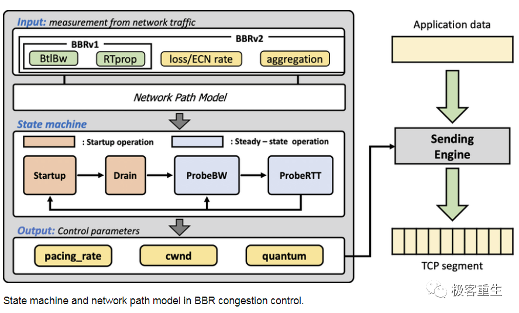

> 原作者：dog250，授权发布  
>
> 重新整理：极客重生

  
hi ，大家好，今天推荐一篇我认为在TCP BBR技术里面分析非常透彻的文章，希望大家可以学习到一些真正的知识，理解其背后的设计原理，才能应对各种面试和工作挑战！  

## 宏观背景下的BBR

1980年代的拥塞崩溃导致了1980年代的拥塞控制机制的出炉，某种意义上这属于见招拆招的策略，针对1980年代的拥塞，提出了1980年代的**拥塞控制算法**，分为四个部分：**慢启动、拥塞避免、快速重传、快速恢复**：

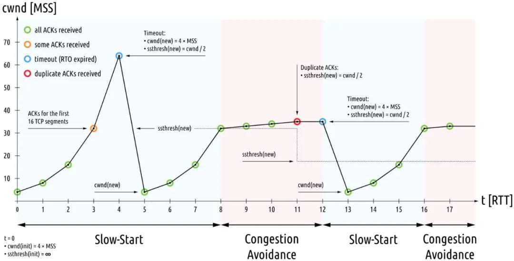

说实话，这些机制完美适应了1980年代的网络特征，**低带宽**，**浅缓存队列**，美好持续到了2000年代。

随后互联网大爆发，多媒体应用特别是图片，音视频类的应用促使带宽必须猛增，而摩尔定律促使存储设施趋于廉价而路由器**队列缓存猛增**，这便是BBR诞生的背景。换句话说，1980年代的CC已经不适用了，2010年代需要另外的一次见招拆招。

如果说上一次1980年代的CC旨在**收敛**，那么这一次BBR则旨在**效能E最大化**，这里的E就是本文上面大量篇幅描述的那个E，至少我个人是这么认为的，这也和BBR的初衷 **提高带宽利用率**相一致！

插个形象的gif：

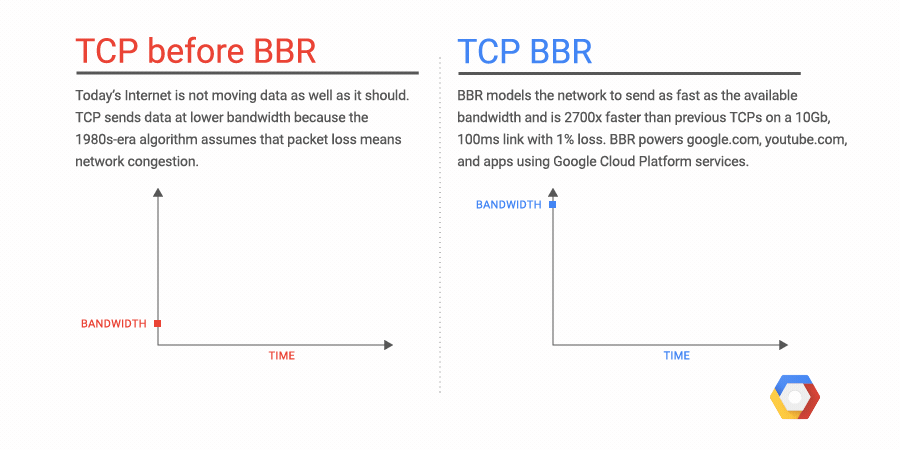

[图片来源](https://cloud.google.com/blog/products/networking/tcp-bbr-congestion-control-comes-to-gcp-your-internet-just-got-faster)

## 正文开始

国庆节前，我看到了**bbr**算法，发现它就是那个唯一正确的做法(可能有点夸张，但起码它是一个通往正确道路的起点！)，所以花了点时间研究了一下它，包括其patch的注释，patch代码，并亲自移植了bbr patch到更低版本的内核，在这个过程中，我也产生了一些想法，作为备忘，整理了一篇文章，记如下，多年以后，再看TCP bbr算法的资料时，我的记录也算是中文社区少有的第一个吃螃蟹记录了，也算够了！  

正文之前，给出本文的图例：

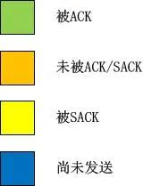

## BBR的组成

bbr算法实际上非常简单，在实现上它由5部分组成：

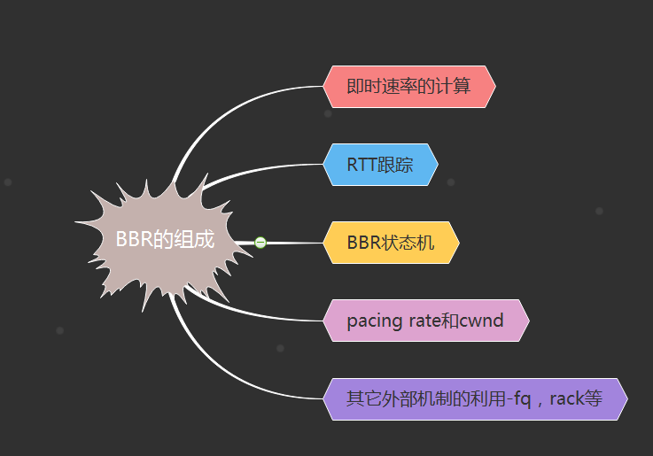

### BBR的组成

#### 1.即时速率的计算

计算一个即时的带宽bw，该带宽是bbr一切计算的基准，bbr将会根据当前的即时带宽以及其所处的pipe状态来计算pacing rate以及cwnd，后面我们会看到，这个即时带宽计算方法的突破式改进是bbr之所以简单且高效的根源。计算方案按照标量计算，不再关注数据的含义。在bbr运行过程中，系统会跟踪当前为止最大的即时带宽。

#### 2.RTT的跟踪

bbr之所以可以获取非常高的带宽利用率，是因为它可以非常安全且豪放地探测到带宽的最大值以及rtt的最小值，这样计算出来的BDP就是目前为止TCP管道的最大容量。bbr的目标就是达到这个最大的容量！这个目标最终驱动了cwnd的计算。在bbr运行过程中，系统会跟踪当前为止最小RTT。

#### 3.BBR状态机的维持

bbr算法根据互联网的拥塞行为有针对性地定义了4中状态：

即**STARTUP**，**DRAIN**，**PROBE_BW**，**PROBE_RTT**。bbr通过对上述计算的即时带宽bw以及rtt的持续观察，在这4个状态之间自由切换，相比之前的所有拥塞控制算法，其革命性的改进在于bbr拥塞算法不再跟踪系统的TCP拥塞状态机，而旨在用统一的方式来应对pacing rate和cwnd的计算，不管当前TCP是处在Open状态还是处在Disorder状态，抑或已经在Recovery状态，换句话说，bbr算法感觉不到丢包，它能看到的就是bw和rtt！

#### 4.结果输出-pacing rate和cwnd

首先必须要说一下，bbr的输出并不仅仅是一个cwnd，更重要的是pacing rate。在传统意义上，cwnd是TCP拥塞控制算法的唯一输出，但是它仅仅规定了当前的TCP最多可以发送多少数据，它并没有规定怎么把这么多数据发出去，在Linux的实现中，如果发出去这么多数据呢？简单而粗暴，突发！忽略接收端通告窗口的前提下，Linux会把cwnd一窗数据全部突发出去，而这往往会造成路由器的排队，在深队列的情况下，会测量出rtt剧烈地抖动。

bbr在计算cwnd的同时，还计算了一个与之适配的pacing rate，该pacing rate规定cwnd指示的一窗数据的数据包之间，以多大的时间间隔发送出去。

#### 5.其它外部机制的利用-fq，rack等

bbr之所以可以高效地运行且如此简单，是因为很多机制并不是它本身实现的，而是利用了外部的已有机制，比如下一节中将要阐述的它为什么在计算带宽bw时能如此放心地将重传数据也计算在内...

### 带宽计算细节以及状态机

#### 1.即时带宽的计算

bbr作为一个纯粹的拥塞控制算法，完全忽略了系统层面的TCP状态，计算带宽时它仅仅需要两个值就够了：

**1).应答了多少数据，记为delivered；**

**2).应答1)中的delivered这么多数据所用的时间，记为interval_us。**

**将上述二者相除，就能得到带宽：**

**bw = delivered/interval_us**

非常简单！以上的计算完全是标量计算，只关注数据的大小，不关注数据的含义，比如delivered的采集中，bbr根本不管某一个应答是重传后的ACK确认的，正常ACK确认的，还是说SACK确认的。bbr只关心被应答了多少！

这和TCP/IP网络模型是一致的，因为在中间链路上，路由器交换机们也不会去管这些数据包是重传的还是乱序的，然而拥塞也是在这些地方发生的，既然拥塞点都不关心数据的意义，TCP为什么要关注呢？反过来，我们看一下拥塞发生的原因，即数据量超过了路由器的带宽限制，利用这一点，只需要精心地控制发送的数据量就好了，完全不用管什么乱序，重传之类的。当然我的意思是说，拥塞控制算法中不用管这些，但这并不意味着它们是被放弃的，其它的机制会关注的，比如**SACK机制**，**RACK机制**，**RTO机制**等。

接下来我们看一下这个**delivered**以及**`interval_us`**的采集是如何实现的。还是像往常一样，我不准备分析源码，因为如果分析源码的话，往往难以抓住重点，过一段时间自己也看不懂了，相反，画图的话，就可以过滤掉很多诸如unlikely等异常流或者当前无需关注的东西：

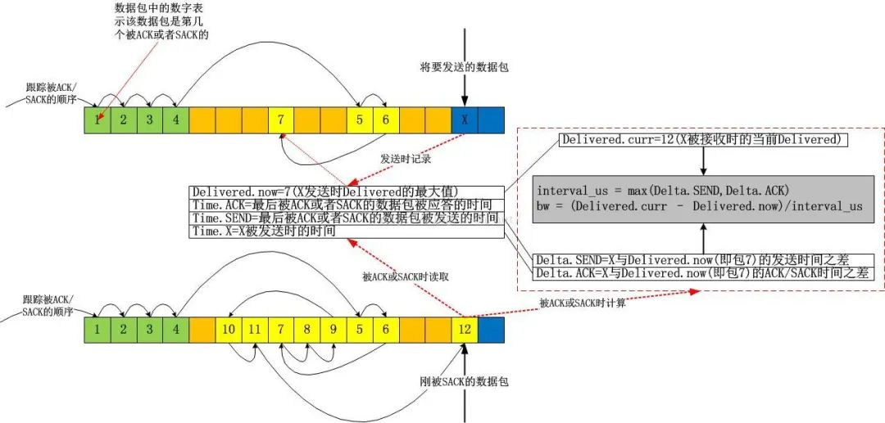

上图中，我故意用了一个极端点的例子，在该例子中，我几乎都是使用的SACK，当X被SACK时，我们可以根据图示很容易算出从Delivered为7时的数据包被确认到X被确认为止，一共有 12-7=5个数据包被确认，即这段时间网络上清空了5个数据包！我们便很容易算出带宽值了。我的这个图示在解释带宽计算方法之外，还有一个目的，即说明bbr在计算带宽时是不关注数据包是否按序确认的，它只关注数量，即数据包被网络清空的数量。实实在在的计算，不猜Lost，不猜乱序，这些东西，你再怎么猜也猜不准！

计算所得的bw就是bbr此后一切计算的基准。

#### 2.状态机

bbr的状态机转换图以及注释如下图所示：

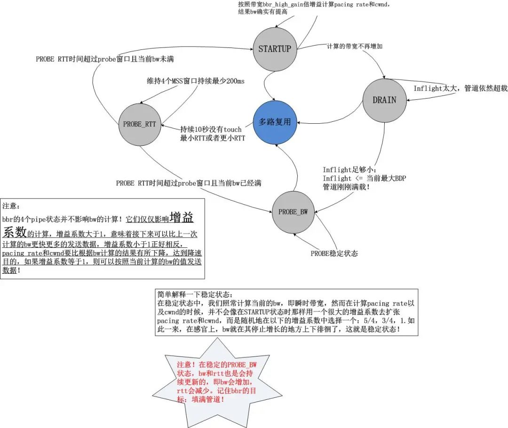

通过上述的状态机以及上一节的带宽计算方式，我们知道了bbr的工作方式：不断地基于当前带宽以及当前的增益系数计算pacing rate以及cwnd，以此2个结果作为拥塞控制算法的输出，在TCP连接的持续过程中，每收到一个ACK，都会计算即时的带宽，然后将结果反馈给bbr的pipe状态机，不断地调节增益系数，这就是bbr的全部，我们发现它是一个典型的封闭反馈系统，与TCP当前处于什么拥塞状态完全无关，其简图如下：

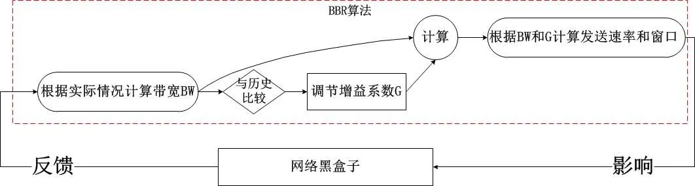

这非常不同于之前的所有拥塞控制算法，在之前的算法中，我们发现拥塞算法内部是受外部的拥塞状态影响的，比如说在Recovery状态下，甚至都不会进入拥塞控制算法，在bbr进入内核之前，Linux使用PRR算法控制了Recovery状态的窗口调整，即便说这个时候网络已经恢复，TCP也无法发现，因为TCP的Recovery状态还未恢复到Open，这就是根源！

**pacing rate以及cwnd的计算**

这一节好像是重点中的重点，但是我觉得如果理解了bbr的带宽计算，状态机以及其增益系数的概念，这里就不是重点了，这里只是一个公式化的结论。

pacing rate怎么计算？很简单，就是是使用时间窗口内(默认10轮采样)最大BW。上一次采样的即时BW，用它来在可能的情况下更新时间窗口内的BW采样值集合。这次能否按照这个时间窗口内最大BW发送数据呢？这样看当前的增益系数的值，设为G，那么BW*G就是pacing rate的值，是不是很简单呢？！

至于说cwnd的计算可能要稍微复杂一点，但是也是可以理解的，我们知道，cwnd其实描述了一条网络管道(rwnd描述了接收端缓冲区)，因此cwnd其实就是这个管道的容量，也就是**BDP**！

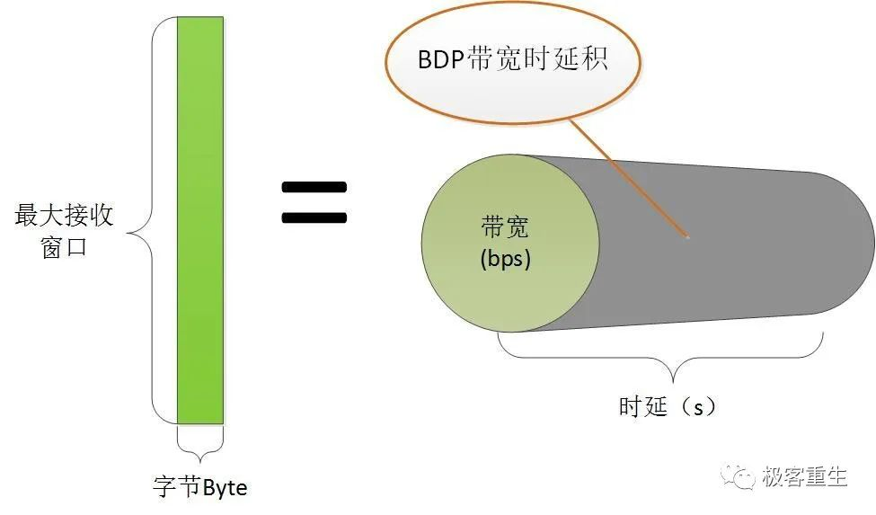

BW我们已经有了，缺少的是D，也就是RTT，不过别忘了，bbr一直在持续搜集最小的RTT值，注意，bbr并没有采用什么移动指数平均算法来“猜测”RTT(我用猜测而不是预测的原因是，猜测的结果往往更加不可信！)，而是直接冒泡采集最小的RTT(注意这个RTT是TCP系统层面移动指数平均的结果，即SRTT，但brr并不会对此结果再次做平均！)。我们用这个最小RTT干什么呢？

当前是计算BDP了！这里bbr取的RTT就是这个最小RTT。最小RTT表示一个曾经达到的最佳RTT，既然曾经达到过，说明这是客观的可以再次达到的RTT，这样有益于网络管道利用率最大化！

我们采用`BDP*G'`就算出了cwnd，这里的`G'`是cwnd的增益系数，与带宽增益系数含义一样，根据bbr的状态机来获取！

### BBR的细节浅述

该节的题目比较怪异，既然是细节为什么又要浅述？？

这是我的风格，一方面，说是细节是因为这些东西还真的很少有人注意到，另一方面，说是浅述，是因为我一般都不会去分析代码以及代码里每一个异常流，我认为那些对于理解原理帮助不大，那些东西只是在研发和优化时才是有用的，所以说，像往常一样，我这里的这个小节还是一如既往地去谈及一些“细节”。

#### 1.豪放且大胆的安全探测

在看到bbr之后，我觉得之前的TCP拥塞控制算法都错了，并不是思想错了，而是实现的问题。

bbr之所以敢大胆的去探测预估带宽是因为TCP把更多的权力交给了它！在bbr之前，很多本应该由拥塞控制算法去处理的细节并不归拥塞控制算法管。在详述之前，我们必须分清两件事：

1).传输多少数据？

2).传输哪些数据？

按照“上帝的事情上帝管，凯撒的事情凯撒管”的原则，这两件事本来就该由不同的机制来完成，不考虑对端接收窗口的情况下，拥塞窗口是唯一的主导因素，“传输多少数据”这件事应该由拥塞算法来回答，而“传输哪些数据”这个问题应该由TCP拥塞状态机以及SACK分布来决定，诚然这两个问题是不同的问题，不应该杂糅在一起。

然而，在bbr进入内核之前的Linux TCP实现中，以上两个问题并不是分得特别清。TCP的拥塞状态只有在Open时才是上述的职责分离的完美样子，一旦进入Lost或者Recovery，那么拥塞控制算法即便对“问题1)：传输多少数据”都无能为力，在Linux的现有实现中，PRR算法将接管一切，一直把窗口下降到ssthresh，在Lost状态则反应更加激烈，直接cwnd硬着陆！随后等丢失数据传输成功后再执行慢启动....在重新进入Open状态之前，拥塞控制算法几乎不会起作用，这并不是一种高速公路上的模式(小碰擦，拍照后停靠路边，自行解决)，更像是闹市区的交通事故处理方式(无论怎样，保持现场，直到交警和保险公司的人来现场处置)。

bbr算法逃离了这一切错误的做法，在bbr的patch中，并非只是完成了一个`tcp_bbr.c`，而是对整个TCP拥塞状态控制框架进行了大手术，我们可以从以下的拥塞控制核心函数中可见一斑：

```c
static void tcp_cong_control(struct sock *sk, u32 ack, u32 acked_sacked,  
                            int flag, const struct rate_sample *rs)  
{  
    const struct inet_connection_sock *icsk = inet_csk(sk);  
    if (icsk->icsk_ca_ops->cong_control) {  
    // 如果是bbr，则完全被bbr接管，不管现在处在什么状态！  
    /* 目前而言，只有bbr使用了这个机制，但我相信，不久的将来，  
             * 会有越来越多的拥塞控制算法使用这个统一的完全接管机制！  
             * 就我个人而言，在几个月前就写过一个patch，接管了tcp_cwnd_reduction  
             * 这个prr的降窗过程。如果当时有了这个框架，我就有福了！  
             */  
        icsk->icsk_ca_ops->cong_control(sk, rs);  
        return;  
    }  
    // 否则继续以往的错误方法！  
    if (tcp_in_cwnd_reduction(sk)) {  
        /* Reduce cwnd if state mandates */  
        // 非Open状态中拥塞算法不受理窗口调整  
        tcp_cwnd_reduction(sk, acked_sacked, flag);  
    } else if (tcp_may_raise_cwnd(sk, flag)) {  
        /* Advance cwnd if state allows */  
        tcp_cong_avoid(sk, ack, acked_sacked);  
    }  
    tcp_update_pacing_rate(sk);  
}  
```

在这个框架下，无论处在哪个状态(Open，Disorder，Recovery，Lost...)，如果拥塞控制算法自己声明有这个能力，那么具体可以传输多少数据，完全由拥塞控制算法自行决定，TCP拥塞状态控制机制不再干预！

#### 2.为什么bbr可以忽略Recovery和Lost状态

看懂了以上第1点，这一点就很容易理解了。

在第1点中，我描述了bbr确实忽略了Recovery等非Open的拥塞状态，但是为什么可以忽略呢？一般而言，很多人都会质疑，会说bbr采用这么鲁莽的方式，最终一定会让窗口卡住不再滑动，但是我要反驳，你难道不知道cwnd只是个标量吗？我画一个图来分析：

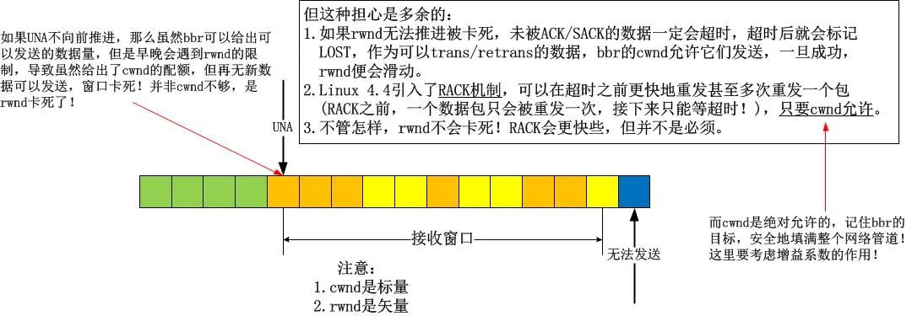

看懂了吗？不存在任何问题！基本上，我们在讨论拥塞控制算法的时候，会忽略流量控制，因为不想让rwnd和cwnd杂糅起来，但是在这里，它们相遇了，幸运的是，并没有引发冲突！

然而，这并不是全部，本节旨在“浅析”，因此就不会关注代码处理的细节。在bbr的实现中，如果算法外部的TCP拥塞状态已经进入了Lost，那么cwnd该是多少呢？在bbr之前的拥塞算法中，包括cubic在内的所有算法中，当TCP核心实现从将cwnd调整到1或者prr到ssthresh一直到恢复到Open状态，拥塞算法无权干预流程，然而bbr不。虽然说进入Lost状态后，cwnd会硬着陆到1，然而由于bbr的接管，在Lost期间，cwnd还是可以根据即时带宽调整的！

这意味着什么？ 这意味着bbr可以区别噪声丢包和拥塞丢包了！

**a).噪声丢包**

如果是噪声丢包，在收到reordering个重复ACK后，由于bbr并不区分一个确认是ACK还是SACK引起的，所以在bbr看来，即时带宽并没有降低，可能还有所增加，所以一个数据包的丢失并不会引发什么，bbr依旧会给出一个比较大的cwnd配额，此时虽然TCP可能已经进入了Recovery状态，但bbr依旧按照自己的bw以及调整后的增益系数来计算cwnd的新值，过程中并不会受到任何TCP拥塞状态的影响。

如此一来，所有的噪声丢包就被区别开来了！bbr的宗旨是：“首先，在我的bw计算指示我发生拥塞之前，任何传统的TCP拥塞判断-丢包/时延增加，均全部失效，我并不care丢包和RTT增加”，随后brr又会说：“但是我比较care的是，RTT在一段时间内(随你怎么配，但我个人倾向于自学习)都没有达到我所采集到的最小值或者更小的值！这也许意味着着链路真的发生拥塞了！”...

**b).拥塞丢包**

将a)的论述反过来，我们就会得到奇妙的封闭性结论。这样，bbr不光是消除了吞吐曲线的锯齿(ssthresh所致，bbr并不使用ssthresh！)，而且还消除了传统拥塞控制算法的判断滞后性问题。在cubic发现丢包进而判断为拥塞时，拥塞可能已经缓解了，但是cubic无法发现这一点。为什么？原因在于cubic在计算新的cwnd的时候，并没有把当前的网络状态(比如bw)当作参数，而只是一味的按照数学意义上的三次方程去计算，这是错误的，这不是一个正确的反馈系统的做法！

基于a)和b)，看到了吧，这就是新的拥塞判断机制！综合考虑丢包和RTT的增加：

**b-1).如果丢包时真的发生了拥塞，那么测量的即时带宽肯定会减少，否则，丢包即拥塞就是谎言。**

**b-2).如果RTT增加时真的发生了拥塞，那么测量的即时带宽肯定会减少，否则，时延增加即拥塞就是谎言。**

bbr测量了即时带宽，这个统一cwnd和rtt的计量，完全忽略了丢包，因此bbr的算法思想是TCP拥塞控制的正轨！事实上，丢包本就不应该作为一种拥塞的标志，它只是拥塞的表现。

#### 3.状态机的点点滴滴

我在上文已经呈现了关于**`STARTUP`**，**`DRAIN`**，**`PROBE_BW`**，**`PROBE_RTT`**的状态图以及些许细节，当时我指出这个状态图的目标是为了完成bbr的目标，即填满整个网络！在这个状态图看来，所有已知的东西就是当前的即时带宽，所有可以计算的东西就是增益系数，然后根据这两个元素就可以轻易计算出pacing rate和cwnd，是不是很简单呢？整体看来就是就是这么简单，但是从细节上看，不同的pipe状态中的增益系数的计算却是值得推敲的，以下是bbr处在各个状态时的增益系数：

**`STARTUP`：2~3**

**`DRAIN`：pacing rate的增益系数为1000/2885，cwnd的增益系数为1000/2005+1。**

**`PROBE_BW：5`/4，1，3/4，bbr在PROBE_BW期间会随机在这些增益系数之间选择当前的增益系数。**

**`PROBE_RTT`：1。但是在探测RTT期间，为了防止丢包，cwnd会强制cut到最小值，即4个MSS。**

我们可以看到，bbr并没有明确的所谓“降窗时刻”，一切都是按照状态机来的，期间丝毫不会理会TCP是否处在**Open**，**Recovery**等状态。在此前的拥塞控制算法中，除了**Vegas**等基于延时的算法会在计算得到的target **cwnd**小于当前**cwnd**时视为拥塞而在算法中降窗外，其它的所有基于丢包的算法中均是检测到丢包(RTO或者reordering个重复ACK)时降窗的，可悲的是，这个降窗过程并不受拥塞算法的控制，拥塞算法只能消极地给出一个**ssthresh**值，即降窗的目标，这显然是令人无助的！

**bbr不再关注丢包事件**，它并不把丢包当成很严重的事，这事也不归它管，只要TCP拥塞状态机控制机制可以合理地将一些包标记为LOST，然后重传它们便是了，bbr能做的仅仅是告诉TCP一共可以发出去多少数据，仅此而已！然而，如果TCP并没有把LOST数据包合理标记好，bbr并不care，它只是根据当前的bw和增益系数给出下一个pacing rate以及cwnd而已！

#### 4.关于Sched FQ

这里涉及的是bbr之外的东西，Fair queue!(公平队列）在bbr的patch最后，会发现几行注释：

**NOTE: BBR *must* be used with the fq qdisc ("man tc-fq") with pacing enabled, since pacing is integral to the BBR design andimplementation. BBR without pacing would not function properly, and may incur unnecessary high packet loss rates.**

记住这几行文字并理解它们。

这是bbr最为重要的一方面。虽然说Linux的TCP实现早就支持的pacing rate，但直到4.8版本都没有在TCP层面支持它，很大的一部分原因是因为借助已有的FQ可以很完美地实现pacing rate！TCP可以借助FQ来实现平缓而非突发的数据发送！

关于FQ的详细内容可以去看相关的manual和源码，这里要说的仅仅是，FQ可以根据bbr设置的pacing rate将一个cwnd内的数据的发送从“突发到网络”这种行为变换到“平缓发送到网路”的行为，所谓的平缓发送指的就是数据包是按照带宽速率计算的间隔一个个发送到网络的，而不是突发进网络的！

这样一来，就给了网络缓存以缓解的机会！记住，关键问题是bbr会在每收到ACK/SACK时计算bw，这个精确的测量不会漏掉任何可乘之机，即便当前网络拥塞了，它只要能在下一时刻恢复，bbr就可以发现，因此即时带宽通常可以表现这一点！

#### 5.其它

还有关于令牌桶监管发现(lt policed)的主题，long term采样的主题，留到后面的文章具体阐述吧，本文已经足够长了。

#### 6.bufferbloat问题

关于深队列，数据包如何如何长时间排队但不丢包却引发RTO，对于浅队列，数据包如何如何频繁丢包...谈起这个话题我一开始想滔滔不绝，任何人都知道端到端的QoS是一个典型的反馈系统，但是任何人都只是夸夸其谈，我选择的是闭口不说.

这是一个怎么说都能对又怎么说都能错的话题，就像股票预测那样，所以我选择不讨论。

bbr算法到来后，单单从公共测试结果上看，貌似解决了bufferbloat问题，也许吧，也许。bbr好像真的开始在高速公路上飚车了...最后给出一个测试图，来自《A quick look at TCP BBR》：

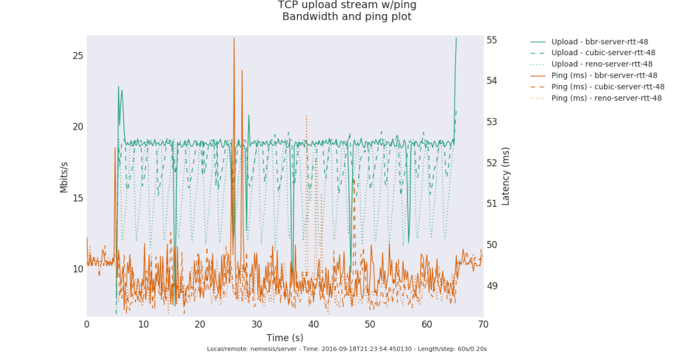

### bbr代码的简单性和复杂性

我一向觉得TCP拥塞控制算法太过复杂，而复杂的东西基本上就是用来发paper，直到遇到了bbr。

**Neal Cardwell**提供的patch简单而又直接，大家可以从该bbr的patch上一看究竟！在bbr模块之外，Neal Cardwell主要更改了tcp_ack函数里面关于delivered计数的部分以及拥塞控制主函数，这一切都十分显然，只要patch代码就可以一目了然。在数据包被发送的时候-不管是初次发送还是重传，均会被当前TCP的连接状况记录在该数据包的tcp_skb_cb中，在数据包被应答的时候-不管是被ACK还是被SACK，均会根据当前的状态和其tcp_skb_cb中状态计算出一个带宽，这些显而易见的逻辑相比任何人都应该知道哪里的代码被修改了！

[patch链接](https://patchwork.ozlabs.org/project/netdev/list/?submitter=10078&state=)

然而，这种查找和确认的工作太令人感到悲哀，读懂代码是容易的，移植代码是无聊的，因为时间卡的太紧！我必须要说的是，如果一件感兴趣的事情变成了必须要完成的工作，那么做它的激情起码减少了1/4，OK，还不算太坏，然而如果这个必须完成的工作有了deadline，那么激情就会再减少1/4，最后，如果有人在背后一直催，那么完蛋，这件事可以瞬间完成，但是我可以郑重说明这是凑合的结果！但是实际上，这件事本应该可以立即快速有高质量的完成并验收！
