 
<!--BEGIN_DATA
{
    "create_date": "2020-01-06 15:13", 
    "modify_date": "2020-01-06 15:13", 
    "is_top": "0", 
    "summary": "H.264/MPEG-4 AVC学习", 
    "tags": "WebRTC、C/C++", 
    "file_name": "H.264/MPEG-4 AVC学习.md"
}
END_DATA-->

####<p>原文出处：<a href='https://www.freehacker.cn/media/codec-h264/' target='blank'>H.264/MPEG-4 AVC学习</a></p>

>任何一个傻瓜都会写能够让机器理解的代码，只有好的程序员才能写出人类可以理解的代码。

H.264，又称为 MPEG-4 第10部分，高级视频编码（英语：MPEG-4 Part 10, Advanced Video Coding，缩写为MPEG-4 AVC）是一种面向块的基于运动补偿的视频编码标准 。

对于视频序列样本来说，使用 H.264 编码器能够比使用有运动补偿的 MPEG-4 编码器降低50%的比特率(bps)。在没有运动补偿的情况下，H.264
编码器的效率至少比 MPEG-4 编码器高3倍，比 M-JPEG编码器高6倍。除了能够显著的提高编码效率外，H.264的优点还包括：提供高质量的图像、容错能力强、网络适应性强、低时延等。

有关 H264 详细的介绍可以参考

  * **维基百科：H.264/MPEG-4 AVC**，[中文地址](https://zh.wikipedia.org/wiki/H.264/MPEG-4_AVC)/[英文地址](https://en.wikipedia.org/wiki/H.264/MPEG-4_AVC)
  * **H264相关标准**，中英对照版本见[文献](https://wenku.baidu.com/view/b650103310661ed9ad51f381.html)。

###H.264原理

视频编码的核心思想是是去除冗余信息，冗余信息包括以下几个方面：

  * 空间冗余：图像相邻像素之间有较强的相关性
  * 时间冗余：视频序列的相邻图像之间内容相似
  * 编码冗余：不同像素值出现的概率不同
  * 视觉冗余：人的视觉系统对某些细节不敏感
  * 知识冗余：规律性的结构可由先验知识和背景知识得到

视频编解码器（编码器/解码器）是指两个协同运行的压缩-解压算法。使用不同标准的视频编解码器通常彼此之间互不兼容。

H.264压缩方法如下：

  * 分组：把几帧图像分为一组(**GOP**，也就是一个序列)，为防止运动变化，帧数不宜取多；
  * 定义帧：将每组内各帧图像定义为三种类型，即I帧、B帧和P帧；
  * 预测帧：以I帧做为基础帧，以I帧预测P帧，再由I帧和P帧预测B帧;
  * 数据传输：最后将I帧数据与预测的差值信息进行存储和传输。

H.264编解码流程如下：

  * H.264编码流程

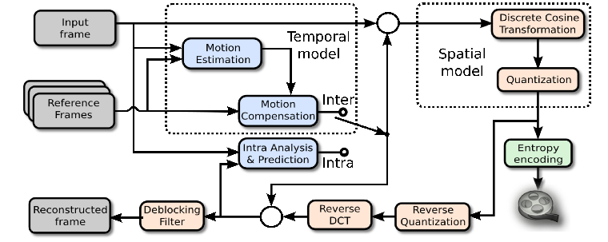

  * H.264解码流程

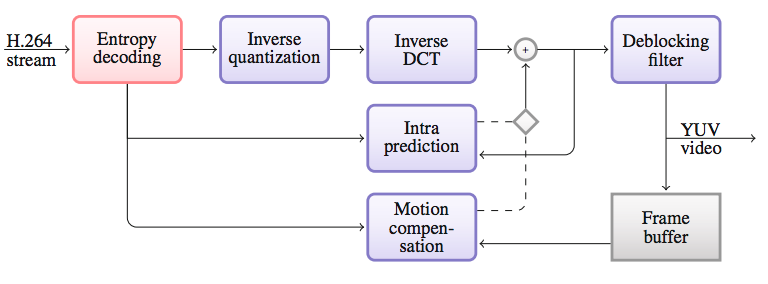

###H.264帧场

####帧与场

要想了解帧与场的概念，需先掌握**逐行扫描**和**隔行扫描**的区别。在英语中，逐行扫描为_Progressive Scanning_，隔行扫描为_Interlace Scanning_。

逐行比较好理解，假设一帧图像的大小是704x576，那么逐行的话就是576行。隔行图像，是早期电视信号中引入的概念，把一帧图像分为上下两场，两场图像在时间上具有先后，但传输时同时传送到显示端，显示端在显示按各自的时间分开进行显示。该方式主要是利用了人眼的余辉效应，通过隔行显示，提高了显示的流畅性。

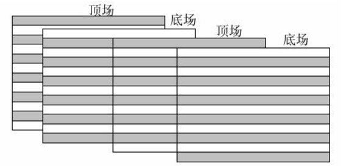

**场**（Field）和**帧**（Frame）的概念一目了然：

  * 隔行扫描得到场，场分为底场和顶场，底场包含偶数行数据，顶场包含奇数行数据；
  * 逐行扫描得到帧，帧包含一张图片完整的信息，底场和顶场一起包含完整的一帧信息。

对于一个具体的序列参数集来说，编码场的宽度和编码帧的宽度是相同的，而编码场的高度是是编码帧的高度的一半。

####帧组成

H.264多了个图像组成一个**视频系列**（GOP），每个图像由一**帧**（Frame）组成。帧又可以分成一个或几个**片**（Slice）。片由**宏块**（Macro Block）组成，一帧中每个片的宏块数不一定相同。每个宏块由一个16×16的亮度数组和两个8×8的色差数组组成。一个720×480分辨率的图像可以被划分为1350（45×30）个宏块。

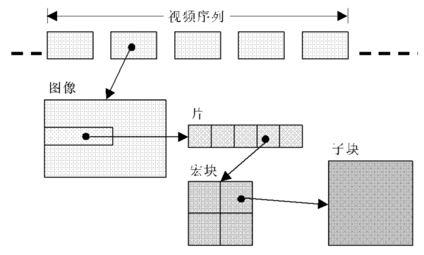

宏块是编码处理的基本单元。一个帧是可以分割成多个片来编码的，构成I\_Slice、P\_Slice、B\_Slice、SP\_Slice和SI\_Slice，而一个片编码之后被打包进一个NAL单元。编码片相互间独立，这样做的目的是为了限制误码的扩散和传输。

I\_Slice、P\_Slice和B\_Slice对应于I帧、P帧和B帧，三者之区别如下：

  * I\_slice ：只使用当前片中已解码的像素进行帧内预测。
  * P\_slice：可能使用当前片中的像素进行帧内预测，也可能使用前面参考帧进行帧间预测。
  * B\_slice：可能使用当前片中的象素进行帧内预测，也可能使用前后参考帧进行帧间预测。

####帧分类

根据H.264的不同类别，编码器会使用不同类型的帧，例如I帧、P帧和B帧。

  * **I帧**（帧内编码帧）是一种自带全部信息的独立帧，无需参考其它图像便可独立进行解码。

视频序列中的第一个帧始终都是I帧。如果所传输的比特流遭到破坏，则需要将I帧用作新查看器的起始点或重新同步点。I帧可以用来实现快进、快退以及其它随机访问功能。如果新的客户端将参与查看视频流，编码器将以相同的时间间隔或者根据要求自动插入I帧。I帧的缺点在于它们会占用更多的数据位，但从另一方面看，I帧不会产生可觉察的模糊现象。

  * **P帧**（帧间预测编码帧）需要参考前面的I帧和/或P帧的不同部分才能进行编码。

与I帧相比，P帧通常占用更少的数据位，但其缺点是，由于P帧对前面的P和I参考帧有着复杂的依赖性，因此对传输错误非常敏感。

  * **B帧**（双向预测编码帧）需要同时以前面的帧和后面的帧作为参考帧。

下图为带有I帧、B帧和P帧的典型视频序列。P帧只需要参考前面的I帧或P帧，而B帧则需要同时参考前面和后面的I帧或P帧。


当视频解码器逐个帧地对比特流进行解码以便重构视频时，必须始终从I帧开始解码。如果使用了P帧和B帧，则必须与参考帧一起解码。在H.264基准类中，仅使用I帧和P帧。由于基准类没有使用B帧，所以可以实现低延时，因此是网络摄像机和视频编码器的理想选择。

###H.264实现

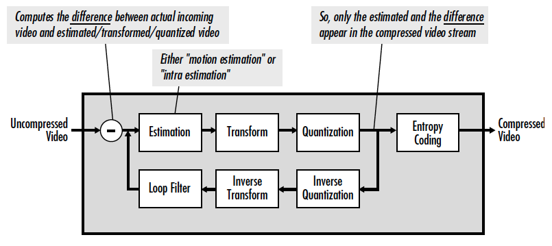

####帧内预测

在H.264中，将通过新的高级帧内预测方法对I帧进行编码。这种方法通过对帧中每个宏块内较小的像素块进行连续预测，通过一组不同方向上的相邻块来预测当前块，可以大大减少I帧所占的数据位并保持较高的质量。这一点可通过在与进行帧内编码的新4×4像素块相邻接的前几个编码像素中，寻找匹配的像素来实现。通过重复利用已编码的像素值，可以极大地减少需要编码的位数。

帧内预测编码的是预测块和实际块差值，这种方法能够有效减少平滑背景小的空间冗余。

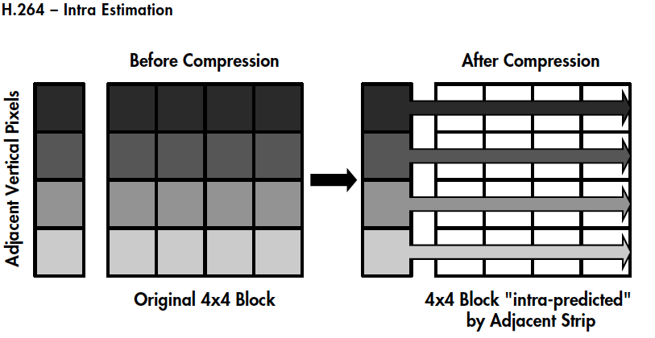

####帧间预测

H.264 通过差分编码来减少视频数据量，大多数视频压缩标准都采用这种方法：在差分编码中，会将一个帧与参考帧（即前面的 I 帧或 P 帧）进行对比，然后只对那些相对于参考帧来说发生了变化的像素进行编码。通过这种方法，可以降低需要进行编码和发送的像素值。

对差分编码（包括H.264在内的大多数视频压缩标准都采用这种方法）来说，只有第一个图像（I帧）是将全帧图像信息进行编码。在后面的两个图像（P帧）中，其静态部分（即房子）将参考第一个图像，而仅对运动部分（即正在跑步的人）使用运动矢量进行编码，从而减少发送和存储的信息量。

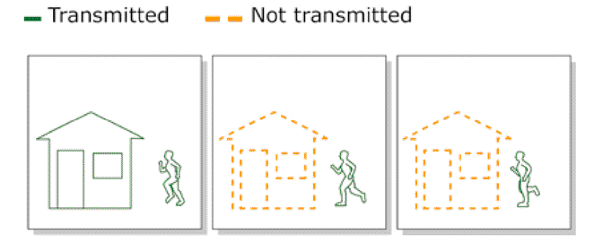

然而，如果视频中存在大量物体运动的话，差分编码将无法显著减少数据量。这时，可以采用基于块的**运动补偿**技术。基于块的运动补偿考虑到视频序列中构成新帧的大量信息都可以在前面的帧中找到，但可能会在不同的位置上。所以，这种技术将一个帧分为一系列的宏块。然后，通过在参考帧中查找匹配块的方式，逐块地构建或者”预测”一个新帧（例如P帧）。如果发现匹配的块，编码器只需要对参考帧中发现匹配块的位置进行编码。与对块的实际内容进行编码相比，只对运动矢量进行编码可以减少所占用的数据位。

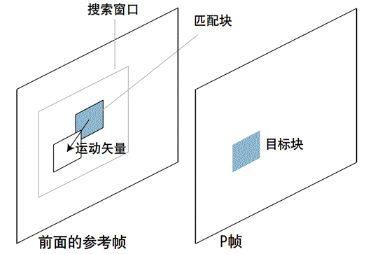

为了提高编码效率，宏块被分割成更小的子块，下图给出了 H.264、MPEG-4和MPEG-2运动补偿技术特性对比：

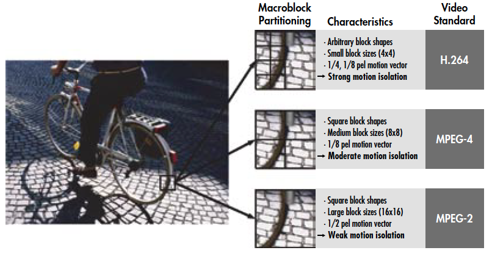

同时，由于运动是个持续的过程，拍摄运动图像时可能会出现偏移和遮挡，拍摄角度会不停的来回切换，H.264引入了多参考帧的概念。

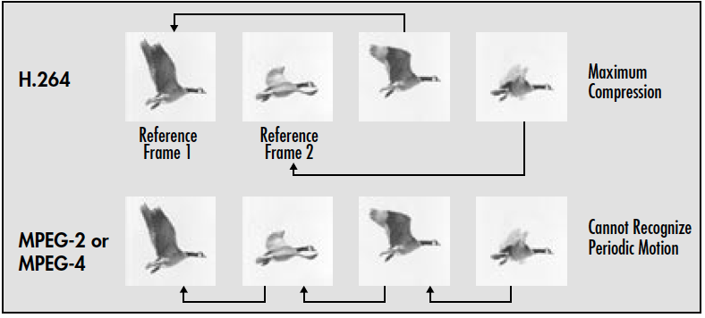

####整数变换

从帧间预测和帧内预测得到的结果需要从空域转换成频域，H.264/MPEG-4 AVC采用**4×4 DCT-like**整数变换。相对于MPEG-2和MPEG-4基于浮点系数的**8×8 DCT**变换，整数系数能够消除浮点系数固有的舍入误差，进而消除浮点系数引起的`drifting artifacts`。同时，H.264/MPEG-4 AVC较小的块大小也减少了阻塞和`ringing artifacts`。

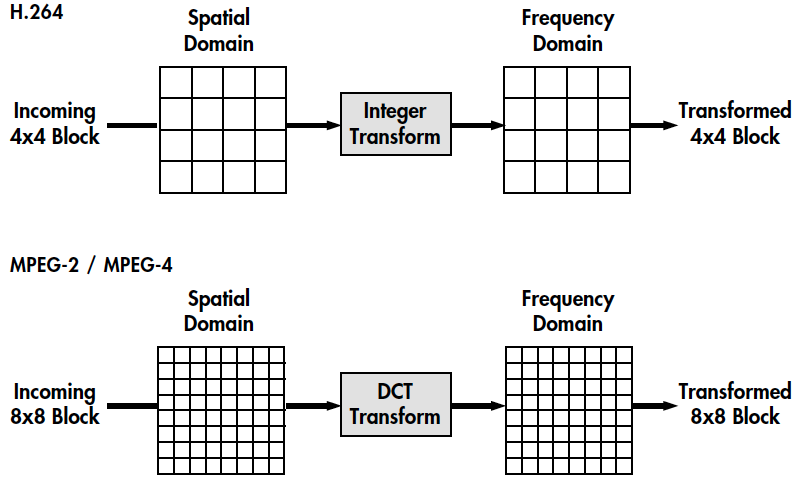

H.264协议中的变化方式主要有三种：4×4残差变化（整数DCT变换）、16×16帧内模式下4×4亮度直流系数变化（离散哈达玛变化）、2×2色度直流系数变化（离散哈达玛变化）。

####量化

从**整数变化**阶段得到的系数需要被**[量化](https://www.vcodex.com/h264avc-4x4-transform-and-quantization/)**，用以减少整数系数的整体精度，并趋向于消除高频系数，保持感知质量。量化的原则是在不降低视觉效果的前提下尽量减少图像编码长度，减少视觉恢复中不必要的信息。

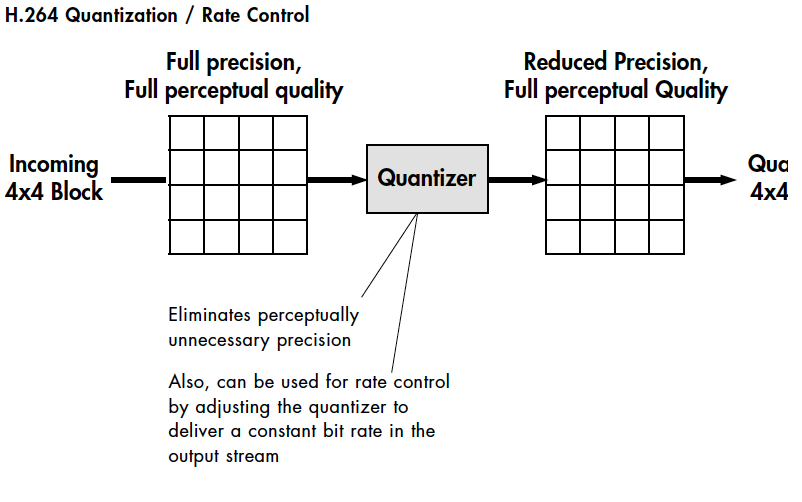

一般的标量量化器原理如下：

<span class="LaTex" alt="LaTex">
$$
Zij=round(Yij/Qstep)Zij=round(Yij/Qstep)
$$
</span>

其中，<span class="LaTex" alt="LaTex">$${Y}_{ij}$$</span>表示一个宏块经过整数DCT转换后的系数，<span class="LaTex" alt="LaTex">$${Z}_{ij}$$</span>是输出的量化系数，<span class="LaTex" alt="LaTex">$${Q}_{step}$$</span>是量化步长。**量化步长**决定了量化器的编码压缩率以及图像精度。如果量化步长较大，则量化值<span class="LaTex" alt="LaTex">$${Z}_{ij}$$</span>动态范围较小，其相应的编码长度较小，但反量化会损失较多的图像细节信息；如果量化步长较小，则量化值<span class="LaTex" alt="LaTex">$${Z}_{ij}$$</span>动态范围较大，其相应的编码长度较大，但图像损失较少。H.264编码器根据图像值实际动态范围自动改变量化步长值，在编码长度和图像精度之间折衷，达到整体最佳效果。

在H.264中，使用量化参数QP（Quantization Parameter）来标识量化步长的序号，亮度编码的量化步长<span class="LaTex" alt="LaTex">$${Q}_{step}$$</span>共有52个值，QP为0-51；色度编码的量化步长<span class="LaTex" alt="LaTex">$${Q}_{step}$$</span>共有39个值，QP为0-39。QP取最小值0 时，表示量化最精细；相反，QP取最大值51/39时，表示量化是最粗糙的。亮度编码的QP每增加6，量化步长<span class="LaTex" alt="LaTex">$${Q}_{step}$$</span>增加一倍。亮度编码的量化步长信息如下表：

<table>
<thead>
<tr>
<td style="text-align:center">
<strong>QP</strong>
</td>
<td style="text-align:center">
<span class="LaTex" alt="LaTex">$${Q}_{step}$$</span>
</td>
<td style="text-align:center">
<strong>QP</strong>
</td>
<td style="text-align:center">
<span class="LaTex" alt="LaTex">$${Q}_{step}$$</span>
</td>
<td style="text-align:center">
<strong>QP</strong>
</td>
<td style="text-align:center">
<span class="LaTex" alt="LaTex">$${Q}_{step}$$</span>
</td>
<td style="text-align:center">
<strong>QP</strong>
</td>
<td style="text-align:center">
<span class="LaTex" alt="LaTex">$${Q}_{step}$$</span>
</td>
<td style="text-align:center">
<strong>QP</strong>
</td>
<td style="text-align:center">
<span class="LaTex" alt="LaTex">$${Q}_{step}$$</span>
</td>
</tr>
</thead>
<tbody>
<tr>
<td style="text-align:center">0</td>
<td style="text-align:center">0.625</td>
<td style="text-align:center">13</td>
<td style="text-align:center">2.25</td>
<td style="text-align:center">22</td>
<td style="text-align:center">8</td>
<td style="text-align:center">33</td>
<td style="text-align:center">28</td>
<td style="text-align:center">44</td>
<td style="text-align:center">104</td>
</tr>
<tr>
<td style="text-align:center">1</td>
<td style="text-align:center">0.6875</td>
<td style="text-align:center">12</td>
<td style="text-align:center">2.5</td>
<td style="text-align:center">23</td>
<td style="text-align:center">9</td>
<td style="text-align:center">34</td>
<td style="text-align:center">32</td>
<td style="text-align:center">45</td>
<td style="text-align:center">112</td>
</tr>
<tr>
<td style="text-align:center">2</td>
<td style="text-align:center">0.8125</td>
<td style="text-align:center">13</td>
<td style="text-align:center">2.75</td>
<td style="text-align:center">24</td>
<td style="text-align:center">10</td>
<td style="text-align:center">35</td>
<td style="text-align:center">36</td>
<td style="text-align:center">46</td>
<td style="text-align:center">128</td>
</tr>
<tr>
<td style="text-align:center">3</td>
<td style="text-align:center">0.875</td>
<td style="text-align:center">14</td>
<td style="text-align:center">3.25</td>
<td style="text-align:center">25</td>
<td style="text-align:center">11</td>
<td style="text-align:center">36</td>
<td style="text-align:center">40</td>
<td style="text-align:center">47</td>
<td style="text-align:center">144</td>
</tr>
<tr>
<td style="text-align:center">4</td>
<td style="text-align:center">1</td>
<td style="text-align:center">15</td>
<td style="text-align:center">3.5</td>
<td style="text-align:center">26</td>
<td style="text-align:center">13</td>
<td style="text-align:center">37</td>
<td style="text-align:center">44</td>
<td style="text-align:center">48</td>
<td style="text-align:center">160</td>
</tr>
<tr>
<td style="text-align:center">5</td>
<td style="text-align:center">1.125</td>
<td style="text-align:center">16</td>
<td style="text-align:center">4</td>
<td style="text-align:center">27</td>
<td style="text-align:center">14</td>
<td style="text-align:center">38</td>
<td style="text-align:center">52</td>
<td style="text-align:center">49</td>
<td style="text-align:center">176</td>
</tr>
<tr>
<td style="text-align:center">6</td>
<td style="text-align:center">1.25</td>
<td style="text-align:center">17</td>
<td style="text-align:center">4.5</td>
<td style="text-align:center">28</td>
<td style="text-align:center">16</td>
<td style="text-align:center">39</td>
<td style="text-align:center">56</td>
<td style="text-align:center">50</td>
<td style="text-align:center">208</td>
</tr>
<tr>
<td style="text-align:center">7</td>
<td style="text-align:center">1.375</td>
<td style="text-align:center">18</td>
<td style="text-align:center">5</td>
<td style="text-align:center">29</td>
<td style="text-align:center">18</td>
<td style="text-align:center">40</td>
<td style="text-align:center">64</td>
<td style="text-align:center">51</td>
<td style="text-align:center">224</td>
</tr>
<tr>
<td style="text-align:center">8</td>
<td style="text-align:center">1.625</td>
<td style="text-align:center">19</td>
<td style="text-align:center">5.5</td>
<td style="text-align:center">30</td>
<td style="text-align:center">20</td>
<td style="text-align:center">41</td>
<td style="text-align:center">72</td>
<td style="text-align:center"></td>
<td style="text-align:center"></td>
</tr>
<tr>
<td style="text-align:center">9</td>
<td style="text-align:center">1.75</td>
<td style="text-align:center">20</td>
<td style="text-align:center">6.5</td>
<td style="text-align:center">31</td>
<td style="text-align:center">22</td>
<td style="text-align:center">42</td>
<td style="text-align:center">80</td>
<td style="text-align:center"></td>
<td style="text-align:center"></td>
</tr>
<tr>
<td style="text-align:center">10</td>
<td style="text-align:center">2</td>
<td style="text-align:center">21</td>
<td style="text-align:center">7</td>
<td style="text-align:center">32</td>
<td style="text-align:center">26</td>
<td style="text-align:center">43</td>
<td style="text-align:center">88</td>
<td style="text-align:center"></td>
</tr>
</tbody>
</table>


####循环滤波

H.264 / MPEG-4 AVC定义了一种**去块滤波器**（de-blocking filter ），其对16×16宏块和4×4块边界进行操作。在宏块的情况下，滤波器旨在去除可能由具有不同估计类型（例如，运动与帧内估计）的相邻宏块和/或不同的量化尺度产生的**伪像**。在块的情况下，滤波器旨在去除可能由变换/量化引起的伪像和相邻块之间的**运动矢量差异**。循环滤波器通常使用内容自适应非线性滤波器来修改宏块/块边界的任一侧上的两个像素。

####熵编码

在进行熵编码之前，必须对4x4量化系数进行序列化。 根据这些系数是否是原始的运动估计或帧内估计，选择不同的扫描模式来创建串行化流。扫描模式将系数从低频到高频排列。 然后，由于较高频率的量化系数趋向于零，所以使用游程长度编码来分组尾随零，导致更有效的熵编码。

熵编码将表示运动矢量、量化系数和宏块头的符号映射到实际位中，熵编码通过将较少数量的比特分配给频繁使用的符号和较大数量的比特到较不频繁使用的符号来提高编码效率。

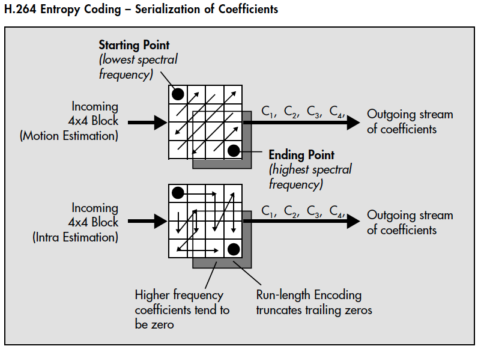

下列表格描述了两种主要类型的熵编码：**Variable Length Coding (VLC)**和**Context Adaptive Binary Arithmetic Coding (CABAC)**。

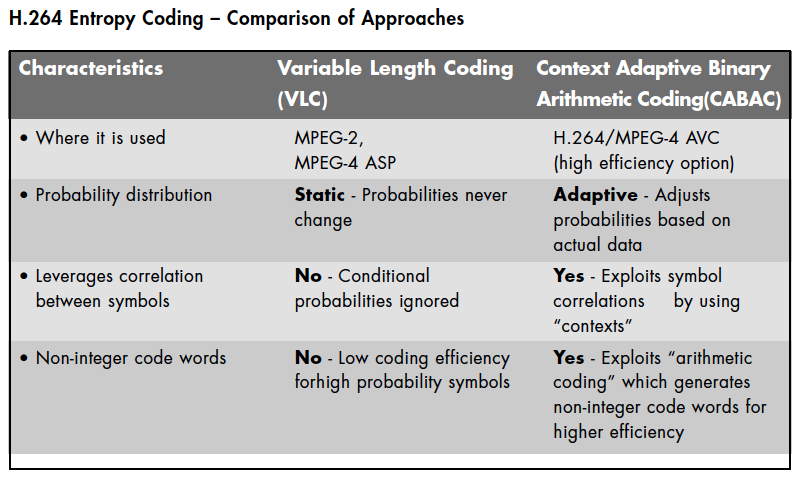

###Level 和 Profile

H.264 标准的一个重要方面是通过级别（Level）和档次（Profile）中提供的功能，以最佳的方式支持常见应用和通用格式。Profile 是对视频压缩特性的描述（CABAC 呀、颜色采样数等等），Level 是对视频本身特性的描述（码率、分辨率、帧率）。简单来说，Profile越高，就说明采用了越高级的压缩特性。Level 越高，视频的码率、分辨率、帧率越高。

H.264 从低到高划分了很多 Profile 和 Level，在维基百科英文版中能够看到详细的表格，在本节末尾会贴出相关表格内容。

H.264 支持四个 Profile，分别为：

  * BP（Baseline Profile）：提供I/P帧，仅支持Progressive和CAVLC，多应用于”视频会话”，如可视电话、会议电视、远程教学、视频监控等实时通信领域；
  * XP（Extended profile）提供I/P/B/SP/SI帧，仅支持Progressive和CAVLC，多应用于流媒体领域，如视频点播、基于网络的视频监控等；
  * MP（Main profile）提供I/P/B帧，支持Progressive和Interlaced，提供CAVLC和CABAC。多应用于数字电视广播、数字视频存储等领域；
  * HiP（High profile）在Main profile基础上新增8*8帧内预测，像素精度提高到10位或14位。多应用于对高分辨率和高清晰度有特别要求的领域。

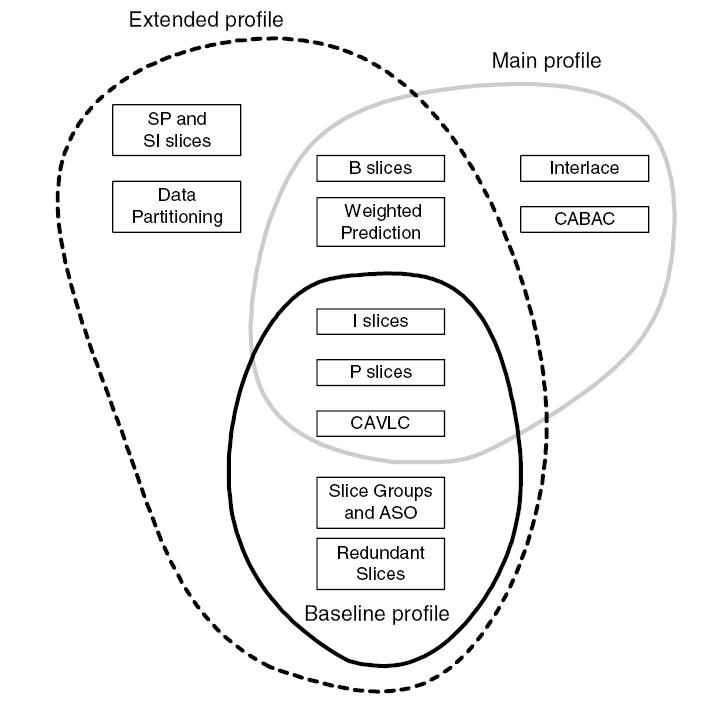

至于Level和Profile的相关表格如下：

  * H.264 Profile

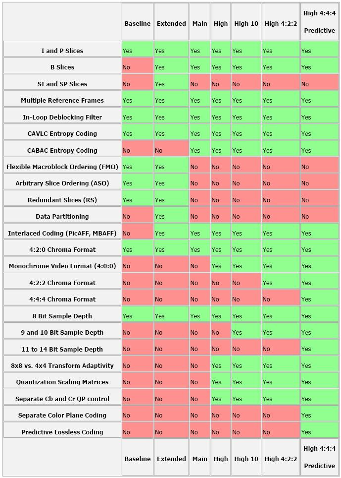

  * H.264 Level

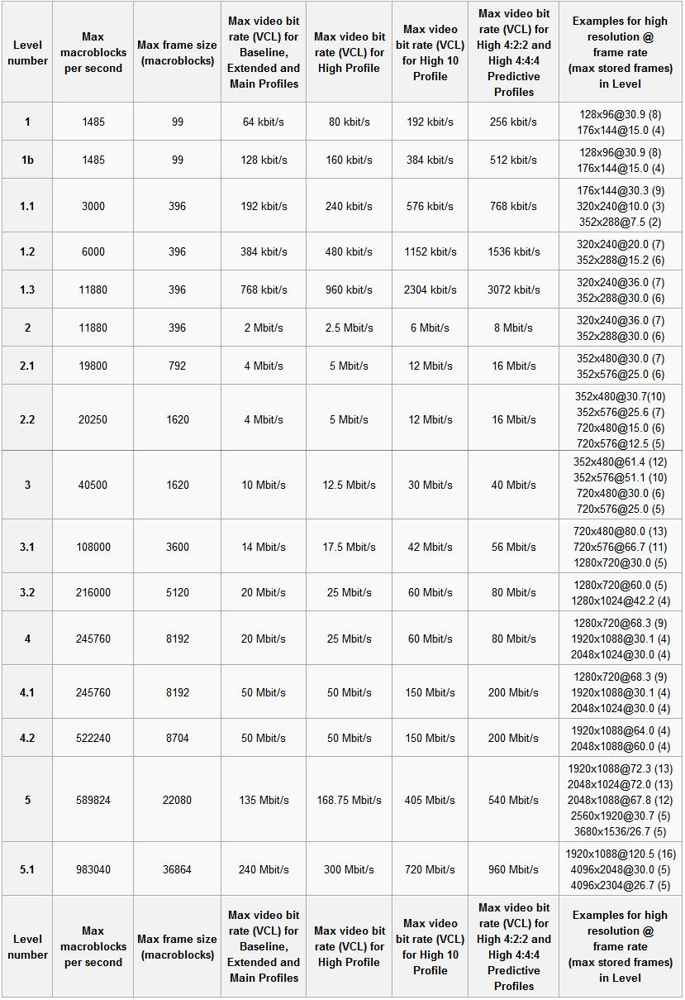

###H.264架构

####分层架构

制定H.264的主要目标有两个：

  * 得到高的视频压缩比；
  * 具有良好的网络亲和性。

为此，H.264的功能分为两层：视频编码层（VLC，Video Coding Layer）和网络抽象层（NAL，Network Abstraction Layer）。

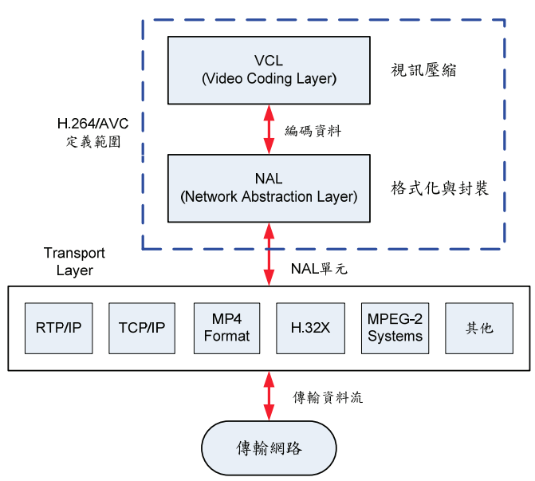

####数据格式

视频编码层进行视频数据压缩、解压缩操作，而网络抽象层专门为视频编码信息提供头文件信息，安排格式以方便网络传输和介质存储。VCL数据即编码处理的输出，它表示被压缩编码后的视频数据序列。在VCL数据传输或存储之前，这些编码的VCL数据，先被映射或封装进NAL单元中。每个NAL单元包含一个原始字节序列负载（RBSP，Raw Byte Sequence Payload）、一组对应于视频编码数据的NAL头信息。其具体结构如下图：

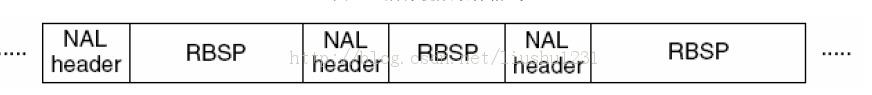

在H.264编码过程中，存在三种不同的数据形式：

  * SODB， String of Data Bits，数据比特串，是最原始的编码数据，即VCL数据；VCL层是对核心算法引擎，块，宏块及片的语法级别的定义，他最终输出编码完的数据SODB
  * RBSP，Raw Byte Sequence Payload，原始字节序列载荷，在SODB的后面填加了结尾比特（RBSP trailing bits 一个bit”1”）若干比特”0”,以便字节对齐；
  * EBSP，Encapsulation Byte Sequence Packets，扩展字节序列载荷，在RBSP基础上填加了仿校验字节（0X03）。

>加上仿校验字节的原因是：EBSP被封装为NALU时，需要为其添加开始前缀，如果该NALU对应的Slice为一帧的开始，则用’0x000000001’，否则使用’0x000001’。为了使NALU主体中不包括与开始码相冲突的，在编码时，每遇到两个字节连续为0，就插入一个字节的0x03。解码时将0x03去掉。也称为脱壳操作。

####码流结构


在H.264中图像以序列为单位进行组织，一个序列是一段图像编码后的数据流，以IDR帧开始，到下一个IDR帧结束，中间包含若干**访问单元**（Access Unit）。从宏观上来说，SPS、PPS、IDR 帧（包含一个或多个I-Slice）、P 帧（包含一个或多个P-Slice ）、B 帧（包含一个或多个B-Slice ）共同构成典型的H.264码流结构。

####SPS/PPS

SPS，Sequence Parameter Sets，序列参数集，是H.264码流序列的第一个NALU，PPS，Picture Parameter Set，图像参数集，是H.264码流序列的第二个NALU。

SPS和PPS中包含了初始化H.264解码器所需要的信息参数，包括编码所用的profile、level、图像的宽和高、deblock滤波器等。SPS语法单元存放一个视频序列共同特征，而PPS语法单元各个图像的典型特征。SPS和PPS都各自对应于一个NALU。

只有视频序列之间才能切换SPS，即只有IDR帧的第一个slice才可以切换SPS；只有图像之间才能切换PPS，即只有每帧图像的第一个slice才能切换PPS。

####IDR/P/B

IDR，Instantaneous Decoder Refresh，即时解码器刷新，是H.264码流序列的第三个NALU。

IDR帧都是I帧，但是I帧并不一定是IDR帧。H.264 引入 IDR 图像是为了解码的重同步，当解码器解码到 IDR 图像时，立即将参考帧队列清空，将已解码的数据全部输出或抛弃，重新查找参数集，开始一个新的序列。这样，如果前一个序列出现重大错误，在这里可以获得重新同步的机会。IDR图像之后的图像永远不会使用IDR之前的图像的数据来解码。

在IDR帧之后可能存在I帧、P帧和B帧，这个具体看使用的是哪种Profile。

###H.264语法结构

NALU，Network Abstract Layer Unit，是H.264的最高抽象层，H.264的所有语法结构最终都被封装成NALU，同时会加入一些网络相关信息。码流中的NALU单元必须定义合适的分隔符，否则无法区分。H.264 视频压缩标准的附录B采用前缀码`“00 00 01”/“00 00 0001”`作为NALU的分隔符，可以通过搜索前缀码`“00 00 01”/“00 00 00 01”`来识别一个NALU。

H.264视频流是以NAL单元传送的，但在一个NAL单元里面，可能既存放I-Slice（P-Slice或B-
Slice），也可能存放图像的其他信息，比如SPS、PPS。根据H.264语法结构，根据的NAL类型可以分为：
    
    
```  
NAL_SLICE     = 1   SLICE非IDR不分割

NAL_SLICE_DPA = 2   SLICE数据分割块A

NAL_SLICE_DPB = 3   SLICE数据分割快B

NAL_SLICE_DPC = 4   SLICE数据分割块C

NAL_SLICE_IDR = 5   SLICE关键帧

NAL_SEI       = 6   补充增强信息单元帧

NAL_SPS       = 7   序列参数集

NAL_PPS       = 8   图像参数集

NAL_AUD       = 9   分界符

NAL_EOSEQ     = 10  序列结束

NAL_EOSTREAM  = 11  码流结束

NAL_FILLER    = 12  填充

              = 13

              = ...

              = 23  13~23保留

              = 24

              = ...

              = 31  24~32不保留，RTP打包时会用到
```

将数据块分割为A、B、C，主要目的是为了对重要程度不同的数据进行不同程度的保护。其中24~32类型是不保留的，其在RTP打包时会用到：

<table>
<thead>
<tr>
<th style="text-align:center">类型取值</th>
<th style="text-align:center">对应类型</th>
<th style="text-align:center">功能</th>
</tr>
</thead>
<tbody>
<tr>
<td style="text-align:center">24</td>
<td style="text-align:center">STAP-A</td>
<td style="text-align:center">Single-time aggregation packet</td>
</tr>
<tr>
<td style="text-align:center">25</td>
<td style="text-align:center">STAP-B</td>
<td style="text-align:center">Single-time aggregation packet</td>
</tr>
<tr>
<td style="text-align:center">26</td>
<td style="text-align:center">MTAP16</td>
<td style="text-align:center">Multi-time aggregation packet</td>
</tr>
<tr>
<td style="text-align:center">27</td>
<td style="text-align:center">MTAP24</td>
<td style="text-align:center">Multi-time aggregation packet</td>
</tr>
<tr>
<td style="text-align:center">28</td>
<td style="text-align:center">FU-A</td>
<td style="text-align:center">Fragmentation unit</td>
</tr>
<tr>
<td style="text-align:center">29</td>
<td style="text-align:center">FU-B</td>
<td style="text-align:center">Fragmentation unit</td>
</tr>
<tr>
<td style="text-align:center">30-31</td>
<td style="text-align:center">undefined</td>
</tr>
</tbody>
</table>

####FU\_A

对于比较大的NALU单元，是无法一次通过RTP发送的（RTP的MTU为1500），所以必须要拆包，将较大的NALU拆分为FU-A包。这里面有拆包和解包两个概念：

  * 拆包：当编码器在编码时需要将原有一个NAL按照FU-A进行分片，原有的NAL的单元头与分片后的FU-A的单元头有如下关系：

>原始的NAL头的前三位为FU indicator的前三位，原始的NAL头的后五位为FU header的后五位，FU indicator与FU header的剩余位数根据实际情况决定。

  * 解包：当接收端收到FU-A的分片数据，需要将所有的分片包组合还原成原始的NAl包时，FU-A的单元头与还原后的NAL的关系如下：

>还原后的NAL头的八位是由FU indicator的前三位加FU header的后五位组成，即：nal\_unit\_type = (fu\_indicator & 0xe0) | (fu\_header & 0x1f)

###开源实现

H.264 的开源实现包括：OpenH264 和 x264。OpenH264 是思科实现的开源 H.264 编码，OpenH264 是思科实现的开源 H.264 编码。两者的对比如下：

  * OpenH264 CPU 的占用相对 x264 低很多；
  * OpenH264 只支持 baseline profile，x264 支持更多 profile；
  * x264 需要专利费用，而 OpenH264 不需要专利费用；
  * x264 的主要功能在于进行 H.264 的视频编码，而不是作为解码器之用。


###其他标准

目前能与H.264相提并论的编码算法包括：

  * HEVC/H.265：开源实现包括 libde265 和 x265，需专利费；
  * VP8：开源实现为 libvpx，无专利费；
  * VP9：开源实现为 ibvpx，无专利费。


几种编码方案中，HEVC 对 VP9 和 H.264 在码率上有较大优势，在相同 PSNR 下分别节省了 48.3% 和 75.8%。H.264在编码时间上有巨大优势，对比 VP9 和 HEVC(H.265) ，HEVC 是 VP9 的 6 倍，VP9 是 H.264 的将近 40 倍。

在H.264之前，还有一些前辈算法，包括：

  * H.261、H.263
  * MPEG-1、MPEG-2、MPEG-4
  * JPEG、JPEG2000
  * AVS

###参考文档


  * [ H.264/MPEG-4 AVC Video Compression Tutorial](http://web.cs.ucla.edu/classes/fall03/cs218/paper/H.264_MPEG4_Tutorial.pdf)
  * [Video Compression Video Coding for Next Generation Multimedia](http://lib.mdp.ac.id/ebook/Karya%20Umum/Video-Compression-Video-Coding-for-Next-generation-Multimedia.pdf)
  * [H.264/AVC 技術與應用簡介](http://www.cc.ntut.edu.tw/~shyang/Journal%20Papers/H264_AVC.pdf)
  * [The H.264/MPEG4 Advanced Video Coding Standard and its Applications](http://iphome.hhi.de/wiegand/assets/pdfs/h264-AVC-Standard.pdf)
  * [H.264/MPEG-4 Advanced Video Coding](http://tcs.rwth-aachen.de/lehre/Komprimierung/SS2012/ausarbeitungen/H264-MPEG4.pdf)
  * [Understanding the Application: An Overview of the H.264 Standard](http://www.springer.com/cda/content/document/cda_downloaddocument/9781461422297-c1.pdf)
  * [H.264 Advanced Video Compression Standard](https://www.ittiam.com/wp-content/knowledge-center/publications/2005/H.264_Advanced_video_compression_standard.pdf)
  * [Video coding with H.264/AVC: Tools, Performance, and Complexity](http://citeseerx.ist.psu.edu/viewdoc/download?doi=10.1.1.142.1068&rep=rep1&type=pdf)
  * [A STUDY OF MPEG-2 AND H.264 VIDEO CODING](https://engineering.purdue.edu/~ace/thesis/igarta/thesis-igarta.pdf)
  * [H.264 and MPEG-4 Video Compression Video Coding for Next-generation Multimedia](http://lib.mdp.ac.id/ebook/Karya%20Umum/Video-Compression-Video-Coding-for-Next-generation-Multimedia.pdf)
  * [The H.264 Advanced Video Compression Standard, Second Edition](http://files.cnblogs.com/files/irish/The_H.264_advanced_video_compression_standard.pdf)