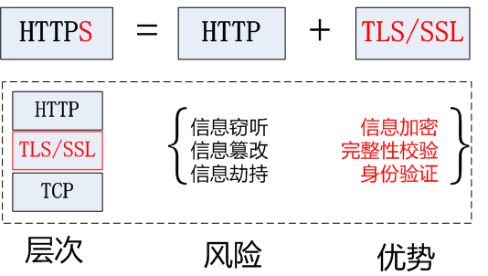
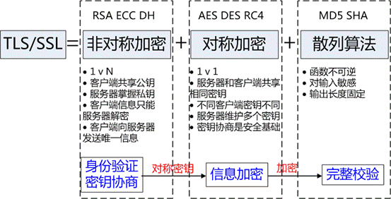

 
<!--BEGIN_DATA
{
    "create_date": "2016-09-02 14:07", 
    "modify_date": "2016-09-02 14:07", 
    "is_top": "0", 
    "summary": "HTTPS", 
    "tags": "Web、网络", 
    "file_name": "HTTPS.md"
}
END_DATA-->


- [Introduction](#introduction)
  - [Why HTTPS?](#why-https)
    - [中间人攻击与内容窃听](#%E4%B8%AD%E9%97%B4%E4%BA%BA%E6%94%BB%E5%87%BB%E4%B8%8E%E5%86%85%E5%AE%B9%E7%AA%83%E5%90%AC)
    - [报文篡改](#%E6%8A%A5%E6%96%87%E7%AF%A1%E6%94%B9)
      - [接收到的内容可能被做假](#%E6%8E%A5%E6%94%B6%E5%88%B0%E7%9A%84%E5%86%85%E5%AE%B9%E5%8F%AF%E8%83%BD%E8%A2%AB%E5%81%9A%E5%81%87)
      - [防篡改](#%E9%98%B2%E7%AF%A1%E6%94%B9)
    - [仿冒服务器/客户端](#%E4%BB%BF%E5%86%92%E6%9C%8D%E5%8A%A1%E5%99%A8%E5%AE%A2%E6%88%B7%E7%AB%AF)
      - [DDOS攻击与钓鱼网站](#ddos%E6%94%BB%E5%87%BB%E4%B8%8E%E9%92%93%E9%B1%BC%E7%BD%91%E7%AB%99)
      - [身份认证](#%E8%BA%AB%E4%BB%BD%E8%AE%A4%E8%AF%81)
  - [Definition](#definition)
  - [Performance](#performance)
  - [Reference](#reference)
- [SSL/TLS Protocol](#ssltls-protocol)
  - [密码学原理](#%E5%AF%86%E7%A0%81%E5%AD%A6%E5%8E%9F%E7%90%86)
    - [对称加密/非公开密钥加密](#%E5%AF%B9%E7%A7%B0%E5%8A%A0%E5%AF%86%E9%9D%9E%E5%85%AC%E5%BC%80%E5%AF%86%E9%92%A5%E5%8A%A0%E5%AF%86)
    - [非对称加密/公开密钥加密](#%E9%9D%9E%E5%AF%B9%E7%A7%B0%E5%8A%A0%E5%AF%86%E5%85%AC%E5%BC%80%E5%AF%86%E9%92%A5%E5%8A%A0%E5%AF%86)
    - [证书](#%E8%AF%81%E4%B9%A6)
      - [证书格式](#%E8%AF%81%E4%B9%A6%E6%A0%BC%E5%BC%8F)
      - [CA:第三方可信证书颁发机构](#ca%E7%AC%AC%E4%B8%89%E6%96%B9%E5%8F%AF%E4%BF%A1%E8%AF%81%E4%B9%A6%E9%A2%81%E5%8F%91%E6%9C%BA%E6%9E%84)
      - [Extended Validation SSL Certificate](#extended-validation-ssl-certificate)
    - [混合加密](#%E6%B7%B7%E5%90%88%E5%8A%A0%E5%AF%86)
  - [TLS HandShake](#tls-handshake)
    - [握手过程](#%E6%8F%A1%E6%89%8B%E8%BF%87%E7%A8%8B)
      - [Client Hello](#client-hello)
      - [Server Hello](#server-hello)
      - [Client Key Exchange](#client-key-exchange)
      - [Server Finish](#server-finish)
    - [基于RSA的握手](#%E5%9F%BA%E4%BA%8Ersa%E7%9A%84%E6%8F%A1%E6%89%8B)
    - [基于Diffie–Hellman的握手](#%E5%9F%BA%E4%BA%8Ediffie%E2%80%93hellman%E7%9A%84%E6%8F%A1%E6%89%8B)
- [HTTPS Tools](#https-tools)
  - [OpenSSL](#openssl)
  - [Let's Encrypt:免费SSL](#lets-encrypt%E5%85%8D%E8%B4%B9ssl)
    - [Installation](#installation)
    - [使用证书](#%E4%BD%BF%E7%94%A8%E8%AF%81%E4%B9%A6)
    - [auto-sni:自动构建基于HTTPS的NodeJS服务端](#auto-sni%E8%87%AA%E5%8A%A8%E6%9E%84%E5%BB%BA%E5%9F%BA%E4%BA%8Ehttps%E7%9A%84nodejs%E6%9C%8D%E5%8A%A1%E7%AB%AF)
  - [SSL Configuration Generator](#ssl-configuration-generator)
  - [SSL Server Test](#ssl-server-test)
- [HTTPS Configuration](#https-configuration)
  - [Apache](#apache)
  - [Nginx](#nginx)
  - [Lighttpd](#lighttpd)
  - [HAProxy](#haproxy)
  - [AWS ELB](#aws-elb)


# Introduction

> 前置阅读：


> - [Web应用安全基础](https://segmentfault.com/a/1190000004983446)


在进行 HTTP 通信时，信息可能会监听、服务器或客户端身份伪装等安全问题，HTTPS 则能有效解决这些问题。在使用原始的HTTP连接的时候，因为服务器与用户之间是直接进行的明文传输，导致了用户面临着很多的风险与威胁。攻击者可以用中间人攻击来轻易的 截获或者篡改传输的数据。攻击者想要做些什么并没有任何的限制，包括窃取用户的Session信息、注入有害的代码等，乃至于修改用户传送至服务器的数据。


我们并不能替用户选择所使用的网络，他们很有可能使用一个开放的，任何人都可以窃听的网络，譬如一个咖啡馆或者机场里面的开放WiFi网络。普通的 用户很有可能被欺骗地随便连上一个叫免费热点的网络，或者使用一个可以随便被插入广告的网路当中。如果攻击者会窃听或者篡改网路中的数据，那么用户与服务 器交换的数据就好不可信了，幸好我们还可以使用HTTPS来保证传输的安全性。HTTPS最早主要用于类似于经融这样的安全要求较高的敏感网络，不过现在日渐被各种各样的网站锁使用，譬如我们常用的社交网络或者搜索引擎。 HTTPS协议使用的是TLS协议，一个优于SSL协议的标准来保障通信安全。只要配置与使用得当，就能有效抵御窃听与篡改，从而有效保护我们将要去访问 的网站。用更加技术化的方式说，HTTPS能够有效保障数据机密性与完整性，并且能够完成用户端与客户端的双重验证。


随着面临的风险日渐增多，我们应该将所有的网络数据当做敏感数据并且进行加密传输。已经有很多的浏览器厂商宣称要废弃所有的非HTTPS的请求，乃 至于当用户访问非HTTPS的网站的时候给出明确的提示。很多基于HTTP/2的实现都只支持基于TLS的通信，所以我们现在更应当在全部地方使用 HTTPS。目前如果要大范围推广使用HTTPS还是有一些障碍的，在一个很长的时间范围内使用HTTPS会被认为造成很多的计算资源的浪费，不过随着现代硬件 与浏览器的发展，这点计算资源已经不足为道。早期的SSL协议与TLS协议只支持一个IP地址分配一个整数，不过现在这种限制所谓的SNI的协议扩展来解 决。另外，从一个证书认证机构获取证书也会打消一些用户使用HTTPS的念头，不过下面我们介绍的像Let's Encrypt这样的免费的服务就可以打破这种障碍。


## Why HTTPS?

HTTP日常使用极为广泛的协议，它很优秀且方便，但还是存在一些问题，如：

 – 明文通信，内容可以直接被窃听

 – 无法验证报文的完整性，可能被篡改

 – 通信方身份不验证，可能遇到假的客户端或服务器

### 中间人攻击与内容窃听

HTTP 不会对请求和响应的内容进行加密，报文直接使用明文发送。报文在服务器与客户端流转中间，会经过若干个结点，这些结点中随时都可能会有窃听行为。因为通信一定会经过中间很多个结点，所以就算是报文经过了加密，也一样会被窃听到，不过是窃听到加密后的内容。要窃听相同段上的通信还是很简单的，比如可以使用常用的抓包工具 Wireshark。这种情况下，保护信息安全最常用的方式就是采取加密了，加密方式可以根据加密对象分以下几种：

（1）通信加密

HTTP 协议基于 TCP/IP 协议族，它没有加密机制。但可以通过 SSL（Secure Socket Layer，安全套接层）建立安全的通信线路，再进行 HTTP 通信，这种与 SSL 结合使用的称为 HTTPS（HTTP Secure，超文本传安全协议）。

（2）内容加密

还可以对通信内容本身加密。HTTP 协议中没有加密机制，但可以对其传输的内容进行加密，也就是对报文内容进行加密。这种加密方式要求客户端对 HTTP 报文进行加密处理后再发送给服务器端，服务器端拿到加密后的报文再进行解密。这种加密方式不同于 SSL 将整个通信线路进行加密，所以它还是有被篡改的风险的。

### 报文篡改


#### 接收到的内容可能被做假

HTTP 协议是无法证明通信报文的完整性的。因此请求或响应在途中随时可能被篡改而不自知，也就是说，没有任何办法确认，发出的请求/响应和接收到的请求/响应是前后相同的。比如浏览器从某个网站上下载一个文件，它是无法确定下载的文件和服务器上有些话的文件是同一个文件的。文件在传输过程中被掉包了也是不知道的。这种请求或响应在传输途中，被拦截、篡改的攻击就是中间人攻击。比如某运营商或者某些DNS提供商会偷偷地在你的网页中插入广告脚本，就是典型的例子。

#### 防篡改

也有一些 HTTP 协议确定报文完整性的方法，不过这些方法很不方便，也不太可靠。用得最多的就是 MD5 等散列值校验的方法。很多文件下载服务的网站都会提供相应文件的 MD5 散列值，一来得用户亲自去动手校验（中国估计只有 0.1% 不到的用户懂得怎么做吧），二来如果网站提供的 MD5 值也被改写的话呢？所以这种方法不方便也不可靠。

### 仿冒服务器/客户端

#### DDOS攻击与钓鱼网站

在 HTTP 通信时，由于服务器不确认请求发起方的身份，所以任何设备都可以发起请求，服务器会对每一个接收到的请求进行响应（当然，服务器可以限制 IP 地址和端口号）。由于服务器会响应所有接收到的请求，所以有人就利用这一点，给服务器发起海量的无意义的请求，造成服务器无法响应正式的请求，这就是 Dos 攻击（Denial Of Service，拒绝服务攻击）。由于客户端也不会验证服务器是否真实，所以遇到来自假的服务器的响应时，客户端也不知道，只能交由人来判断。钓鱼网站就是利用了这一点。


#### 身份认证

HTTP 协议无法确认通信方，而 SSL 则是可以的。SSL 不仅提供了加密处理，还提供了叫做“证书”的手段，用于确定通信方的身份。证书是由值得信任的第三方机构颁发（已获得社会认可的企业或组织机构）的，用以证明服务器和客户端的身份。而且伪造证书从目前的技术来看，是一件极为难的事情，所以证书往往可以确定通信方的身份。以客户端访问网页为例。客户端在开始通信之前，先向第三机机构确认 Web 网站服务器的证书的有效性，再得到其确认后，再开始与服务器进行通信。


## Definition

**HTTPS = HTTP + 加密 + 认证 + 完整性保护**，HTTPS 也就是 HTTP 加上加密处理、认证以及完整性保护。使用 HTTPS 通信时，用的是 https://，而不是 http://。另外，当浏览器访问 HTTPS 的 Web 网站时，浏览器地址栏会出现一个带锁的标记。要注意，HTTPS 并非是应用层的新协议，而是 HTTP 通信接口部分用 SSL 协议代替而已。本来，HTTP 是直接基于 TCP 通信。在 HTTPS 中，它先和 SSL 通信，SSL 再和 TCP 通信。所以说 HTTPS 是披了层 SSL 外壳的 HTTP。SSL 是独立于 HTTP 的协议，所以其他类似于 HTTP 的应用层 SMTP 等协议都可以配合 SSL 协议使用，也可以给它们增强安全性。整个架构如下图所示：


## Performance

HTTPS 使用 SSL 通信，所以它的处理速度会比 HTTP 要慢。

一是通信慢。它和 HTTP 相比，网络负载会变慢 2 到 100倍。除去和 TCP 连接、发送 HTTP 请求及响应外，还必须进行 SSL 通信，因此整体上处理通信量会不可避免的增加。

二是 SSL 必须进行加密处理。在服务器和客户端都需要进行加密和解密的去处处理。所以它比 HTTP 会更多地消耗服务器和客户端的硬件资源。


## Reference

- [https://en.wikipedia.org/wiki/HTTP](https://en.wikipedia.org/wiki/HTTP)

- [https://en.wikipedia.org/wiki/Transport_Layer_Security](https://en.wikipedia.org/wiki/Transport_Layer_Security)

- [https://en.wikipedia.org/wiki/HTTPS](https://en.wikipedia.org/wiki/HTTPS)

- [https://en.wikipedia.org/wiki/RSA_(cryptosystem)](https://en.wikipedia.org/wiki/RSA_%28cryptosystem%29)


# SSL/TLS Protocol

SSL协议，是一种安全传输协议，最初是由 Netscape 在1996年发布，由于一些安全的原因SSL v1.0和SSL v2.0都没有公开，直到1996年的SSL v3.0。TLS是SSL v3.0的升级版，目前市面上所有的Https都是用的是TLS，而不是SSL。本文中很多地方混用了SSL与TLS这个名词，大家能够理解就好。


下图描述了在TCP/IP协议栈中TLS(各子协议）和HTTP的关系：


其中Handshake protocol，Change Ciper Spec protocol和Alert protocol组成了SSL Handshaking Protocols。

Record Protocol有三个连接状态(Connection State)，连接状态定义了压缩，加密和MAC算法。所有的Record都是被当前状态（Current State）确定的算法处理的。


TLS Handshake Protocol和Change Ciper Spec Protocol会导致Record Protocol状态切换。


```

empty state -------------------> pending state ------------------> current state

             Handshake Protocol                Change Cipher Spec


```


初始当前状态（Current State）没有指定加密，压缩和MAC算法，因而在完成TLS Handshaking Protocols一系列动作之前，客户端和服务端的数据都是**明文传输**的；当TLS完成握手过程后，客户端和服务端确定了加密，压缩和MAC算法及其参数，数据（Record）会通过指定算法处理。


## 密码学原理

数据在传输过程中，很容易被窃听。加密就是保护数据安全的措施。一般是利用技术手段把数据变成乱码（加密）传送，到达目的地后，再利用对应的技术手段还原数据（解密）。加密包含算法和密钥两个元素。算法将要加密的数据与密钥（一串数字）相结合，产生不可理解的密文。由此可见，密钥与算法同样重要。对数据加密技术可以分为两类：对称加密（对称密钥加密）和非对称加密（非对称密钥加密）。SSL 采用了 非对称加密（Public-key cryptography）的加密处理方式。

现在的加密方法中，加密算法都是公开的，网上都有各种算法原理解析的内容。加密算法虽然是公开的，算法用到的密钥却是保密的，以此来保持加密方法的安全性。加密和解密都会用到密钥。有了密钥就可以解密了，如果密钥被攻击者获得，加密也就没有意义了。


### 对称加密/非公开密钥加密

对称加密的意思就是，加密数据用的密钥，跟解密数据用的密钥是一样的。对称加密的优点在于加密、解密效率通常比较高。缺点在于，数据发送方、数据接收方需要协商、共享同一把密钥，并确保密钥不泄露给其他人。此外，对于多个有数据交换需求的个体，两两之间需要分配并维护一把密钥，这个带来的成本基本是不可接受的。

### 非对称加密/公开密钥加密

非对称加密方式能很好地解决对称加密的困难。非对称加密方式有两把密钥。一把叫做私有密钥（private key），另一把叫做非对称（public key）。私有密钥是一方保管，而非对称则谁都可以获得。这种方式是需要发送密文的一方先获得对方的非对称，使用已知的算法进行加密处理。对方收到被加密的信息后，再使用自己的私有密钥进行解密。这种加密方式有意思是的加密算法的神奇，经过这个公开的算法加密后的密文，即使知道非对称，也是无法对密文还原的。要想对密文进行解决，必须要有私钥才行。所以非对称加密是非常安全的，即使窃听到密文和非对称，却还是无法进行解密。

>   非对称加密算法用的一般是 [RSA 算法](https://en.wikipedia.org/wiki/RSA_%28cryptosystem%29)（这可能是目前最重要的算法了）。这个算法由3个小伙子在1977年提出，它的主要原理是：将两个大素数相乘很简单，但想要这个乘积进行因式分解极其困难，因此可以将乘积公开作为非对称。不过随着目前的分布式计算和量子计算机的快速发展，说不定在将来也许能破解这个算法了。


### 证书

在测试的时候我们可以自己创建配置一个证书用于HTTPS认证，不过如果你要提供服务给普通用户使用，那么还是需要从可信的第三方CA机构来获取可信的证 书。对于很多开发者而言，一个免费的CA证书是个不错的选择。当你搜索CA的时候，你可能会遇到几个不同等级的证书。最常见的就是Domain Validation(DV)，用于认证一个域名的所有者。再往上就是所谓的Organization Validation(OV)与Extended Validation(EV)，包括了验证这些证书的请求机构的信息。虽然高级别的证书需要额外的消耗，不过还是很值得的。


#### 证书格式

证书大概是这个样子：


（1）证书版本号(Version)
版本号指明X.509证书的格式版本，现在的值可以为:
    1) 0: v1
    2) 1: v2
    3) 2: v3
也为将来的版本进行了预定义

（2）证书序列号(Serial Number)
序列号指定由CA分配给证书的唯一的"数字型标识符"。当证书被取消时，实际上是将此证书的序列号放入由CA签发的CRL中，
这也是序列号唯一的原因。

（3）签名算法标识符(Signature Algorithm)
签名算法标识用来指定由CA签发证书时所使用的"签名算法"。算法标识符用来指定CA签发证书时所使用的:
    1) 公开密钥算法
    2) hash算法
example: sha256WithRSAEncryption
须向国际知名标准组织(如ISO)注册

（4）签发机构名(Issuer)
此域用来标识签发证书的CA的X.500 DN(DN-Distinguished Name)名字。包括:
    1) 国家(C)
    2) 省市(ST)
    3) 地区(L)
    4) 组织机构(O)
    5) 单位部门(OU)
    6) 通用名(CN)
    7) 邮箱地址

（5）有效期(Validity)
指定证书的有效期，包括:
    1) 证书开始生效的日期时间
    2) 证书失效的日期和时间
每次使用证书时，需要检查证书是否在有效期内。

（6）证书用户名(Subject)
指定证书持有者的X.500唯一名字。包括:
    1) 国家(C)
    2) 省市(ST)
    3) 地区(L)
    4) 组织机构(O)
    5) 单位部门(OU)
    6) 通用名(CN)
    7) 邮箱地址

（7）证书持有者公开密钥信息(Subject Public Key Info)
证书持有者公开密钥信息域包含两个重要信息:
    1) 证书持有者的公开密钥的值
    2) 公开密钥使用的算法标识符。此标识符包含公开密钥算法和hash算法。

（8）扩展项(extension)
X.509 V3证书是在v2的基础上一标准形式或普通形式增加了扩展项，以使证书能够附带额外信息。标准扩展是指
由X.509 V3版本定义的对V2版本增加的具有广泛应用前景的扩展项，任何人都可以向一些权威机构，如ISO，来
注册一些其他扩展，如果这些扩展项应用广泛，也许以后会成为标准扩展项。

（9）签发者唯一标识符(Issuer Unique Identifier)
签发者唯一标识符在第2版加入证书定义中。此域用在当同一个X.500名字用于多个认证机构时，用一比特字符串
来唯一标识签发者的X.500名字。可选。

（10）证书持有者唯一标识符(Subject Unique Identifier)
持有证书者唯一标识符在第2版的标准中加入X.509证书定义。此域用在当同一个X.500名字用于多个证书持有者时，
用一比特字符串来唯一标识证书持有者的X.500名字。可选。

（11）签名算法(Signature Algorithm)
证书签发机构对证书上述内容的签名算法
example: sha256WithRSAEncryption

（12）签名值(Issuer's Signature)
证书签发机构对证书上述内容的签名值


#### CA:第三方可信证书颁发机构

其实，非对称加密方式还存在一个很大的问题：它无法证明非对称本身是真实的非对称。比如，打算跟银行的服务器建立非对称加密方式的通信时，怎么证明收到的非对称就是该服务器的密钥呢？毕竟，要调包非对称是极为简单的。这时，数字证书认证机构（CA，Certificated Authority）就出场了。

数字证书认证机构是具有权威性、公正性的机构。它的业务流程是：首先，服务器的开发者向数字证书认证机构提出非对称（`服务器非对称`）的申请。数字证书认证机构在核实申请者的身份之后，会用自己的非对称（`数字签名非对称`）对申请的非对称做数字签名，再将 `服务器非对称`、数字签名以及申请者身份等信息放入公钥证书。服务器则将这份由数字证书认证机构颁发的公钥证书发送给客户端，以进行非对称加密方式通信。公钥证书也可做数字证书或简称为为证书。证书就相当于是服务器的身份证。

客户端接到证书后，使用 `数字签名非对称` 对数字签名进行验证，当验证通过时，也就证明了：1、真实有效的数字证书认证机构。2、真实有效的`服务器非对称`。然后就可能与服务器安全通信了。其实这里还是有一个问题的。那就是如何将 `数字签名非对称` 安全地转给客户端？难道再去另一个认证机制那确认（现在是真有的）？无疑，安全转交是一件困难的事。因此，常用的认证机关的非对称会被很多浏览器内置在里面。

#### Extended Validation SSL Certificate

证书作用这一是证明服务器是否规范，另一个作用是可以确认服务器背后的企业是否真实。具有这种特性的证书就是 EV SSL （Extended Validation SSL Certificate）证书。EV SSL 证书是基于国际标准的严格身份验证颁发的证书。通过认证的网站能获得更高的认可度。

EV SSL 证书在视觉上最大的特色在于激活浏览器的地址栏的背景色是绿色。而且在地址栏中显示了 SSL 证书中记录的组织名称。这个机制原本是为了防止用户被钓鱼攻击的，但效果如何还真不知道，目前来看，很多用户根本不清楚这是啥玩意儿。


### 混合加密

　　非对称加密很安全，但与对称加密相比，由于非对称加密的算法复杂性，导致它的加密和解密处理速度都比对称加密慢很多，效率很低。所以可以充分利用它们各自的优势，结合起来。先用非对称加密，交换对称加密会用的密钥，之后的通信交换则使用对称方式。这就是混合加密。

1) 使用非对称加密方式安全地交换在稍后的对称加密中要使用的密钥

2）确保交换的密钥是安全的前提下，使用对称加密方式进行通信

而下面所讲的具体的SSL协议的过程就是混合加密的一种体现。


## TLS HandShake

TLS的握手阶段是发生在TCP握手之后。握手实际上是一种协商的过程，对协议所必需的一些参数进行协商。


上图中的方括号为可选信息。

### 握手过程

#### Client Hello

由于客户端(如浏览器)对一些加解密算法的支持程度不一样，但是在TLS协议传输过程中必须使用同一套加解密算法才能保证数据能够正常的加解密。在TLS 握手阶段，客户端首先要告知服务端，自己支持哪些加密算法，所以客户端需要将本地支持的加密套件(Cipher Suite)的列表传送给服务端。除此之外，客户端还要产生一个随机数，这个随机数一方面需要在客户端保存，另一方面需要传送给服务端，客户端的随机数需 要跟服务端产生的随机数结合起来产生后面要讲到的Master Secret。

#### Server Hello


从Server Hello到Server Done，有些服务端的实现是每条单独发送，有服务端实现是合并到一起发送。Sever Hello和Server Done都是只有头没有内容的数据。


服务端在接收到客户端的Client Hello之后，服务端需要将自己的证书发送给客户端。这个证书是对于服务端的一种认证。例如，客户端收到了一个来自于称自己是 www.alipay.com的数据，但是如何证明对方是合法的alipay支付宝呢？这就是证书的作用，支付宝的证书可以证明它是alipay，而不是 财付通。证书是需要申请，并由专门的数字证书认证机构(CA)通过非常严格的审核之后颁发的电子证书。颁发证书的同时会产生一个私钥和公钥。私钥由服务端 自己保存，不可泄漏。公钥则是附带在证书的信息中，可以公开的。证书本身也附带一个证书电子签名，这个签名用来验证证书的完整性和真实性，可以防止证书被 串改。另外，证书还有个有效期。


在服务端向客户端发送的证书中没有提供足够的信息的时候，还可以向客户端发送一个Server Key Exchange。 此外，对于非常重要的保密数据，服务端还需要对客户端进行验证，以保证数据传送给了安全的合法的客户端。服务端可以向客户端发出Cerficate Request消息，要求客户端发送证书对客户端的合法性进行验证。跟客户端一样，服务端也需要产生一个随机数发送给客户端。客户端和服务端都需要使用这两个随机数来产生Master Secret。


最后服务端会发送一个Server Hello Done消息给客户端，表示Server Hello消息结束了。


#### Client Key Exchange


如果服务端需要对客户端进行验证，在客户端收到服务端的Server Hello消息之后，首先需要向服务端发送客户端的证书，让服务端来验证客户端的合法性。


在此之前的所有TLS握手信息都是明文传送的。在收到服务端的证书等信息之后，客户端会使用一些加密算法(例如：RSA,  Diffie-Hellman)产生一个48个字节的Key，这个Key叫PreMaster Secret，很多材料上也被称作PreMaster Key, 最终通过Master secret生成session secret， session secret就是用来对应用数据进行加解密的。PreMaster secret属于一个保密的Key，只要截获PreMaster secret，就可以通过之前明文传送的随机数，最终计算出session secret，所以PreMaster secret使用RSA非对称加密的方式，使用服务端传过来的公钥进行加密，然后传给服务端。


接着，客户端需要对服务端的证书进行检查，检查证书的完整性以及证书跟服务端域名是否吻合。ChangeCipherSpec是一个独立的协议，体现在数据包中就是一个字节的数据，用于告知服务端，客户端已经切换到之前协商好的加密套件的状态，准备使用之前协商好的加密套件加密数据并传输了。在ChangecipherSpec传输完毕之后，客户端会使用之前协商好的加密套件和session secret加密一段Finish的数据传送给服务端，此数据是为了在正式传输应用数据之前对刚刚握手建立起来的加解密通道进行验证。


#### Server Finish


服务端在接收到客户端传过来的PreMaster加密数据之后，使用私钥对这段加密数据进行解密，并对数据进行验证，也会使用跟 客户端同样的方式生成session secret，一切准备好之后，会给客户端发送一个ChangeCipherSpec，告知客户端已经切换到协商过的加密套件状态，准备使用加密套件和 session secret加密数据了。之后，服务端也会使用session secret加密后一段Finish消息发送给客户端，以验证之前通过握手建立起来的加解密通道是否成功。 


根据之前的握手信息，如果客户端和服务端都能对Finish信息进行正常加解密且消息正确的被验证，则说明握手通道已经建立成功，接下来，双方可以使用上面产生的session secret对数据进行加密传输了。


### 基于RSA的握手


1. [明文] 客户端发送随机数`client_random`和支持的加密方式列表

2. [明文] 服务器返回随机数`server_random `，选择的加密方式和服务器证书链

3. [RSA] 客户端验证服务器证书，使用证书中的公钥加密`premaster secret `发送给服务端

4. 服务端使用私钥解密`premaster secret `

5. 两端分别通过`client_random`，`server_random `和`premaster secret `生成`master secret`，用于对称加密后续通信内容


### 基于Diffie–Hellman的握手


使用Diffie–Hellman算法交换premaster secret 的流程


# HTTPS Tools

## OpenSSL

[OpenSSL](https://en.wikipedia.org/wiki/OpenSSL) 是用 C 写的一套 [SSL 和 TLS](https://en.wikipedia.org/wiki/Transport_Layer_Security) 开源实现。这也就意味着人人都可以基于这个构建属于自己的认证机构，然后给自己的颁发服务器证书。不过然并卵，其证书不可在互联网上作为证书使用。这种自认证机构给自己颁发的证书，叫做自签名证书。自己给自己作证，自然是算不得数的。所以浏览器在访问这种服务器时，会显示“无法确认连接安全性”等警告消息。

OpenSSL 在2014年4月，被爆出一个内存溢出引出的 BUG，骇客利用这点能拿到服务器很多信息，其中就包括私钥，也就使得 HTTPS 形同虚设。当时全世界大概有一百万左右的服务器有受到此漏洞的影响。由于 OpenSSL 举足轻重的作用，再加上足够致命的问题，使得这个 BUG 被形容为“互联网心脏出血”。这是近年来互联网最严重的安全事件。

> 记得OpenSSL的Heartbleed漏洞才出来的时候，笔者所在的安全公司忙成了一团糟，到处帮忙修补漏洞。


## Let's Encrypt:免费SSL

Let’s Encrypt是由ISRG（Internet Security Research Group）提供的免费SSL项目，现由Linux基金会托管，他的来头很大，由Mozilla、思科、Akamai、IdenTrust和EFF等组织 发起，现在已经得到Google、Facebook等大公司的支持和赞助，目的就是向网站免费签发和管理证书，并且通过其自身的自动化过程，消除了购买、 安装证书的复杂性，只需几行命令，就可以完成证书的生成并投入使用，甚至十几分钟就可以让自己的http站点华丽转变成Https站点。 


### Installation

（1）执行以下命令

```

 git clone https://github.com/letsencrypt/letsencrypt

 cd letsencrypt

 ./letsencrypt-auto certonly --email xxx@xx.com 

```

提示：

1、如果提示git命令无效的话，需要安装一下GIt，直接执行命令 yum install git-all 完成安装，

2、如果是RedHat/CentOs6系统的话，需要提前安装EPEL（  Extra Packages for Enterprise Linux ），执行命令  yum install epel-release  

3、 整个过程需要主机连接外网，否则会导致报以下错误 

```

IMPORTANT NOTES:     

 - The following errors were reported by the server:         

   Domain: on-img.com        

   Type:   urn:acme:error:connection

   Detail: Failed to connect to host for DVSNI challenge         


   Domain: www.on-img.com        

   Type:   urn:acme:error:connection        

   Detail: Failed to connect to host for DVSNI challenge

```

 4、Let's encrypt 是由python编写的开源项目，基于python2.7环境，如果系统安装的是python2.6，会提示升级 。也可以执行以下命令（官方不推荐） ./letsencrypt-auto certonly --email xxx@xx.com --debug  


（2）接下来提示输入域名 多个用空格隔开 

    

 出现以下提示说明证书生成成功 

    


### 使用证书 

进入/etc/letsencrypt/live/on-img.com/下，on-img.com是第二部中填写的域名，到时候换成自己的域名即可。 

- cert.pem 服务器证书 

- privkey.pem 是证书私钥


如果是云服务器+负载均衡的话，直接添加以上证书，绑定负载均衡，直接访问https:// xxx.com。如果是自己配置的Nginx的，需要以下配置 ：


```

server

{

    listen 443 ssl;   /

    server_name xxx.com;     //这里是你的域名

    index index.html index.htm index.php default.html default.htm default.php;

    root /opt/wwwroot/        //网站目录

    ssl_certificate /etc/letsencrypt/live/test.com/fullchain.pem;    //前面生成的证书，改一下里面的域名就行，不建议更换路径

    ssl_certificate_key /etc/letsencrypt/live/test.com/privkey.pem;   //前面生成的密钥，改一下里面的域名就行，不建议更换路径 

    ........

}

```

如果是使用的Apache服务器，

在生成证书后也需要修改一下apache的配置文件 /usr/local/apache/conf/httpd.conf ，查找httpd-ssl将前面的#去掉。

然后再执行：

```

cat >/usr/local/apache/conf/extra/httpd-ssl.conf<<EOF Listen 443

AddType application/x-x509-ca-cert .crt AddType application/x-pkcs7-crl .crl

SSLCipherSuite EECDH+AESGCM:EDH+AESGCM:AES256+EECDH:AES256+EDH SSLProxyCipherSuite EECDH+AESGCM:EDH+AESGCM:AES256+EECDH:AES256+EDH SSLHonorCipherOrder on

SSLProtocol all -SSLv2 -SSLv3 SSLProxyProtocol all -SSLv2 -SSLv3 SSLPassPhraseDialog builtin

SSLSessionCache "shmcb:/usr/local/apache/logs/ssl_scache(512000)" SSLSessionCacheTimeout 300

SSLMutex "file:/usr/local/apache/logs/ssl_mutex" EOF

```

并在对应apache虚拟主机配置文件的最后下面添加上SSL部分的配置文件：

```

<VirtualHost *:443>
    DocumentRoot /home/wwwroot/www.vpser.net   //网站目录
    ServerName www.vpser.net:443   //域名
    ServerAdmin licess@vpser.net      //邮箱
    ErrorLog "/home/wwwlogs/www.vpser.net-error_log"   //错误日志
    CustomLog "/home/wwwlogs/www.vpser.net-access_log" common    //访问日志
    SSLEngine on
    SSLCertificateFile /etc/letsencrypt/live/www.test.net/fullchain.pem   //改一下里面的域名就行，不建议更换路径
    SSLCertificateKeyFile /etc/letsencrypt/live/www.test.net/privkey.pem    //改一下里面的域名就行，不建议更换路径
    <Directory "/home/wwwroot/www.vpser.net">   //网站目录
        SetOutputFilter DEFLATE
        Options FollowSymLinks
        AllowOverride All
        Order allow,deny
        Allow from all
        DirectoryIndex index.html index.php
     </Directory>
</VirtualHost>
```

### [auto-sni](https://github.com/DylanPiercey/auto-sni):自动构建基于HTTPS的NodeJS服务端

（1）安装

```

npm install auto-sni
```

（2）创建服务器

```

var createServer = require("auto-sni");

var server = createServer({
    email: ..., // Emailed when certificates expire.
    agreeTos: true, // Required for letsencrypt.
    debug: true, // Add console messages and uses staging LetsEncrypt server. (Disable in production)
    domains: ["mysite.com", ["test.com", "www.test.com"]], // List of accepted domain names. (You can use nested arrays to register bundles with LE).
    forceSSL: true, // Make this false to disable auto http->https redirects (default true).
    ports: {
        http: 80, // Optionally override the default http port.
        https: 443 // // Optionally override the default https port.
    }
});

// Server is a "https.createServer" instance.
server.once("listening", ()=> {
    console.log("We are ready to go.");
});

//使用Express
var createServer = require("auto-sni");
var express      = require("express");
var app          = express();

app.get("/test", ...);

createServer({ email: ..., agreeTos: true }, app);

```

## SSL Configuration Generator

现在很多用户使用的还是低版本的浏览器，它们对于SSL/TLS协议支持的也不是很好，因此怎么为服务器选定一个正确的HTTPS也比较麻烦，幸好Mozilla提供了一个在线生成配置的[工具](https://github.com/mozilla/server-side-tls)，很是不错：


## SSL Server Test

在你正确配置了你的站点之后，非常推荐使用[SSL Labs](https://www.ssllabs.com/ssltest/analyze.html?d=kurt.ciqual.com)这个在线测试工具来检查下你站点到底配置的是否安全。


# HTTPS Configuration

## Apache

```

<VirtualHost *:443>
    ...
    SSLEngine on
    SSLCertificateFile      /path/to/signed_certificate_followed_by_intermediate_certs
    SSLCertificateKeyFile   /path/to/private/key
    SSLCACertificateFile    /path/to/all_ca_certs


    # HSTS (mod_headers is required) (15768000 seconds = 6 months)
    Header always set Strict-Transport-Security "max-age=15768000"
    ...
</VirtualHost>

# intermediate configuration, tweak to your needs
SSLProtocol             all -SSLv3
SSLCipherSuite          ECDHE-ECDSA-CHACHA20-POLY1305:ECDHE-RSA-CHACHA20-POLY1305:ECDHE-ECDSA-AES128-GCM-SHA256:ECDHE-RSA-AES128-GCM-SHA256:ECDHE-ECDSA-AES256-GCM-SHA384:ECDHE-RSA-AES256-GCM-SHA384:DHE-RSA-AES128-GCM-SHA256:DHE-RSA-AES256-GCM-SHA384:ECDHE-ECDSA-AES128-SHA256:ECDHE-RSA-AES128-SHA256:ECDHE-ECDSA-AES128-SHA:ECDHE-RSA-AES256-SHA384:ECDHE-RSA-AES128-SHA:ECDHE-ECDSA-AES256-SHA384:ECDHE-ECDSA-AES256-SHA:ECDHE-RSA-AES256-SHA:DHE-RSA-AES128-SHA256:DHE-RSA-AES128-SHA:DHE-RSA-AES256-SHA256:DHE-RSA-AES256-SHA:ECDHE-ECDSA-DES-CBC3-SHA:ECDHE-RSA-DES-CBC3-SHA:EDH-RSA-DES-CBC3-SHA:AES128-GCM-SHA256:AES256-GCM-SHA384:AES128-SHA256:AES256-SHA256:AES128-SHA:AES256-SHA:DES-CBC3-SHA:!DSS
SSLHonorCipherOrder     on
SSLCompression          off
SSLSessionTickets       off

# OCSP Stapling, only in httpd 2.3.3 and later
SSLUseStapling          on
SSLStaplingResponderTimeout 5
SSLStaplingReturnResponderErrors off
SSLStaplingCache        shmcb:/var/run/ocsp(128000)
```

## Nginx

```

server {
    listen 80 default_server;
    listen [::]:80 default_server;

    # Redirect all HTTP requests to HTTPS with a 301 Moved Permanently response.
    return 301 https://$host$request_uri;
}

server {
    listen 443 ssl http2;
    listen [::]:443 ssl http2;

    # certs sent to the client in SERVER HELLO are concatenated in ssl_certificate
    ssl_certificate /path/to/signed_cert_plus_intermediates;
    ssl_certificate_key /path/to/private_key;
    ssl_session_timeout 1d;
    ssl_session_cache shared:SSL:50m;
    ssl_session_tickets off;

    # Diffie-Hellman parameter for DHE ciphersuites, recommended 2048 bits
    ssl_dhparam /path/to/dhparam.pem;

    # intermediate configuration. tweak to your needs.
    ssl_protocols TLSv1 TLSv1.1 TLSv1.2;
    ssl_ciphers 'ECDHE-ECDSA-CHACHA20-POLY1305:ECDHE-RSA-CHACHA20-POLY1305:ECDHE-ECDSA-AES128-GCM-SHA256:ECDHE-RSA-AES128-GCM-SHA256:ECDHE-ECDSA-AES256-GCM-SHA384:ECDHE-RSA-AES256-GCM-SHA384:DHE-RSA-AES128-GCM-SHA256:DHE-RSA-AES256-GCM-SHA384:ECDHE-ECDSA-AES128-SHA256:ECDHE-RSA-AES128-SHA256:ECDHE-ECDSA-AES128-SHA:ECDHE-RSA-AES256-SHA384:ECDHE-RSA-AES128-SHA:ECDHE-ECDSA-AES256-SHA384:ECDHE-ECDSA-AES256-SHA:ECDHE-RSA-AES256-SHA:DHE-RSA-AES128-SHA256:DHE-RSA-AES128-SHA:DHE-RSA-AES256-SHA256:DHE-RSA-AES256-SHA:ECDHE-ECDSA-DES-CBC3-SHA:ECDHE-RSA-DES-CBC3-SHA:EDH-RSA-DES-CBC3-SHA:AES128-GCM-SHA256:AES256-GCM-SHA384:AES128-SHA256:AES256-SHA256:AES128-SHA:AES256-SHA:DES-CBC3-SHA:!DSS';
    ssl_prefer_server_ciphers on;

    # HSTS (ngx_http_headers_module is required) (15768000 seconds = 6 months)
    add_header Strict-Transport-Security max-age=15768000;

    # OCSP Stapling ---
    # fetch OCSP records from URL in ssl_certificate and cache them
    ssl_stapling on;
    ssl_stapling_verify on;

    ## verify chain of trust of OCSP response using Root CA and Intermediate certs
    ssl_trusted_certificate /path/to/root_CA_cert_plus_intermediates;

    resolver <IP DNS resolver>;

    ....
}
```

## Lighttpd

```

$SERVER["socket"] == ":443" {
    protocol     = "https://"
    ssl.engine   = "enable"
    ssl.disable-client-renegotiation = "enable"

    # pemfile is cert+privkey, ca-file is the intermediate chain in one file
    ssl.pemfile               = "/path/to/signed_cert_plus_private_key.pem"
    ssl.ca-file               = "/path/to/intermediate_certificate.pem"
    # for DH/DHE ciphers, dhparam should be >= 2048-bit
    ssl.dh-file               = "/path/to/dhparam.pem"
    # ECDH/ECDHE ciphers curve strength (see `openssl ecparam -list_curves`)
    ssl.ec-curve              = "secp384r1"
    # Compression is by default off at compile-time, but use if needed
    # ssl.use-compression     = "disable"

    # Environment flag for HTTPS enabled
    setenv.add-environment = (
        "HTTPS" => "on"
    )

    # intermediate configuration, tweak to your needs
    ssl.use-sslv2 = "disable"
    ssl.use-sslv3 = "disable"
    ssl.honor-cipher-order    = "enable"
    ssl.cipher-list           = "ECDHE-ECDSA-CHACHA20-POLY1305:ECDHE-RSA-CHACHA20-POLY1305:ECDHE-ECDSA-AES128-GCM-SHA256:ECDHE-RSA-AES128-GCM-SHA256:ECDHE-ECDSA-AES256-GCM-SHA384:ECDHE-RSA-AES256-GCM-SHA384:DHE-RSA-AES128-GCM-SHA256:DHE-RSA-AES256-GCM-SHA384:ECDHE-ECDSA-AES128-SHA256:ECDHE-RSA-AES128-SHA256:ECDHE-ECDSA-AES128-SHA:ECDHE-RSA-AES256-SHA384:ECDHE-RSA-AES128-SHA:ECDHE-ECDSA-AES256-SHA384:ECDHE-ECDSA-AES256-SHA:ECDHE-RSA-AES256-SHA:DHE-RSA-AES128-SHA256:DHE-RSA-AES128-SHA:DHE-RSA-AES256-SHA256:DHE-RSA-AES256-SHA:ECDHE-ECDSA-DES-CBC3-SHA:ECDHE-RSA-DES-CBC3-SHA:EDH-RSA-DES-CBC3-SHA:AES128-GCM-SHA256:AES256-GCM-SHA384:AES128-SHA256:AES256-SHA256:AES128-SHA:AES256-SHA:DES-CBC3-SHA:!DSS"

    # HSTS(15768000 seconds = 6 months)
    setenv.add-response-header  = (
        "Strict-Transport-Security" => "max-age=15768000;"
    )

    ...
}
```

## HAProxy

```

global
    # set default parameters to the intermediate configuration
    tune.ssl.default-dh-param 2048
    ssl-default-bind-ciphers ECDHE-ECDSA-CHACHA20-POLY1305:ECDHE-RSA-CHACHA20-POLY1305:ECDHE-ECDSA-AES128-GCM-SHA256:ECDHE-RSA-AES128-GCM-SHA256:ECDHE-ECDSA-AES256-GCM-SHA384:ECDHE-RSA-AES256-GCM-SHA384:DHE-RSA-AES128-GCM-SHA256:DHE-RSA-AES256-GCM-SHA384:ECDHE-ECDSA-AES128-SHA256:ECDHE-RSA-AES128-SHA256:ECDHE-ECDSA-AES128-SHA:ECDHE-RSA-AES256-SHA384:ECDHE-RSA-AES128-SHA:ECDHE-ECDSA-AES256-SHA384:ECDHE-ECDSA-AES256-SHA:ECDHE-RSA-AES256-SHA:DHE-RSA-AES128-SHA256:DHE-RSA-AES128-SHA:DHE-RSA-AES256-SHA256:DHE-RSA-AES256-SHA:ECDHE-ECDSA-DES-CBC3-SHA:ECDHE-RSA-DES-CBC3-SHA:EDH-RSA-DES-CBC3-SHA:AES128-GCM-SHA256:AES256-GCM-SHA384:AES128-SHA256:AES256-SHA256:AES128-SHA:AES256-SHA:DES-CBC3-SHA:!DSS
    ssl-default-bind-options no-sslv3 no-tls-tickets
    ssl-default-server-ciphers ECDHE-ECDSA-CHACHA20-POLY1305:ECDHE-RSA-CHACHA20-POLY1305:ECDHE-ECDSA-AES128-GCM-SHA256:ECDHE-RSA-AES128-GCM-SHA256:ECDHE-ECDSA-AES256-GCM-SHA384:ECDHE-RSA-AES256-GCM-SHA384:DHE-RSA-AES128-GCM-SHA256:DHE-RSA-AES256-GCM-SHA384:ECDHE-ECDSA-AES128-SHA256:ECDHE-RSA-AES128-SHA256:ECDHE-ECDSA-AES128-SHA:ECDHE-RSA-AES256-SHA384:ECDHE-RSA-AES128-SHA:ECDHE-ECDSA-AES256-SHA384:ECDHE-ECDSA-AES256-SHA:ECDHE-RSA-AES256-SHA:DHE-RSA-AES128-SHA256:DHE-RSA-AES128-SHA:DHE-RSA-AES256-SHA256:DHE-RSA-AES256-SHA:ECDHE-ECDSA-DES-CBC3-SHA:ECDHE-RSA-DES-CBC3-SHA:EDH-RSA-DES-CBC3-SHA:AES128-GCM-SHA256:AES256-GCM-SHA384:AES128-SHA256:AES256-SHA256:AES128-SHA:AES256-SHA:DES-CBC3-SHA:!DSS
    ssl-default-server-options no-sslv3 no-tls-tickets

frontend ft_test
    mode    http
    bind    :443 ssl crt /path/to/<cert+privkey+intermediate+dhparam>
    bind    :80
    redirect scheme https code 301 if !{ ssl_fc }

    # HSTS (15768000 seconds = 6 months)
    rspadd  Strict-Transport-Security:\ max-age=15768000
```

## AWS ELB

```

{
    "AWSTemplateFormatVersion": "2010-09-09",
    "Description": "Example ELB with Mozilla recommended ciphersuite",
    "Parameters": {
        "SSLCertificateId": {
            "Description": "The ARN of the SSL certificate to use",
            "Type": "String",
            "AllowedPattern": "^arn:[^:]*:[^:]*:[^:]*:[^:]*:.*$",
            "ConstraintDescription": "SSL Certificate ID must be a valid ARN. http://docs.aws.amazon.com/general/latest/gr/aws-arns-and-namespaces.html#genref-arns"
        }
    },
    "Resources": {
        "ExampleELB": {
            "Type": "AWS::ElasticLoadBalancing::LoadBalancer",
            "Properties": {
                "Listeners": [
                    {
                        "LoadBalancerPort": "443",
                        "InstancePort": "80",
                        "PolicyNames": [
                            "Mozilla-intermediate-2015-03"
                        ],
                        "SSLCertificateId": {
                            "Ref": "SSLCertificateId"
                        },
                        "Protocol": "HTTPS"
                    }
                ],
                "AvailabilityZones": {
                    "Fn::GetAZs": ""
                },
                "Policies": [
                    {
                        "PolicyName": "Mozilla-intermediate-2015-03",
                        "PolicyType": "SSLNegotiationPolicyType",
                        "Attributes": [
                            {
                                "Name": "Protocol-TLSv1",
                                "Value": true
                            },
                            {
                                "Name": "Protocol-TLSv1.1",
                                "Value": true
                            },
                            {
                                "Name": "Protocol-TLSv1.2",
                                "Value": true
                            },
                            {
                                "Name": "Server-Defined-Cipher-Order",
                                "Value": true
                            },
                            {
                                "Name": "ECDHE-ECDSA-CHACHA20-POLY1305",
                                "Value": true
                            },
                            {
                                "Name": "ECDHE-RSA-CHACHA20-POLY1305",
                                "Value": true
                            },
                            {
                                "Name": "ECDHE-ECDSA-AES128-GCM-SHA256",
                                "Value": true
                            },
                            {
                                "Name": "ECDHE-RSA-AES128-GCM-SHA256",
                                "Value": true
                            },
                            {
                                "Name": "ECDHE-ECDSA-AES256-GCM-SHA384",
                                "Value": true
                            },
                            {
                                "Name": "ECDHE-RSA-AES256-GCM-SHA384",
                                "Value": true
                            },
                            {
                                "Name": "DHE-RSA-AES128-GCM-SHA256",
                                "Value": true
                            },
                            {
                                "Name": "DHE-RSA-AES256-GCM-SHA384",
                                "Value": true
                            },
                            {
                                "Name": "ECDHE-ECDSA-AES128-SHA256",
                                "Value": true
                            },
                            {
                                "Name": "ECDHE-RSA-AES128-SHA256",
                                "Value": true
                            },
                            {
                                "Name": "ECDHE-ECDSA-AES128-SHA",
                                "Value": true
                            },
                            {
                                "Name": "ECDHE-RSA-AES256-SHA384",
                                "Value": true
                            },
                            {
                                "Name": "ECDHE-RSA-AES128-SHA",
                                "Value": true
                            },
                            {
                                "Name": "ECDHE-ECDSA-AES256-SHA384",
                                "Value": true
                            },
                            {
                                "Name": "ECDHE-ECDSA-AES256-SHA",
                                "Value": true
                            },
                            {
                                "Name": "ECDHE-RSA-AES256-SHA",
                                "Value": true
                            },
                            {
                                "Name": "DHE-RSA-AES128-SHA256",
                                "Value": true
                            },
                            {
                                "Name": "DHE-RSA-AES128-SHA",
                                "Value": true
                            },
                            {
                                "Name": "DHE-RSA-AES256-SHA256",
                                "Value": true
                            },
                            {
                                "Name": "DHE-RSA-AES256-SHA",
                                "Value": true
                            },
                            {
                                "Name": "ECDHE-ECDSA-DES-CBC3-SHA",
                                "Value": true
                            },
                            {
                                "Name": "ECDHE-RSA-DES-CBC3-SHA",
                                "Value": true
                            },
                            {
                                "Name": "EDH-RSA-DES-CBC3-SHA",
                                "Value": true
                            },
                            {
                                "Name": "AES128-GCM-SHA256",
                                "Value": true
                            },
                            {
                                "Name": "AES256-GCM-SHA384",
                                "Value": true
                            },
                            {
                                "Name": "AES128-SHA256",
                                "Value": true
                            },
                            {
                                "Name": "AES256-SHA256",
                                "Value": true
                            },
                            {
                                "Name": "AES128-SHA",
                                "Value": true
                            },
                            {
                                "Name": "AES256-SHA",
                                "Value": true
                            },
                            {
                                "Name": "DES-CBC3-SHA",
                                "Value": true
                            }
                        ]
                    }
                ]
            }
        }
    },
    "Outputs": {
        "ELBDNSName": {
            "Description": "DNS entry point to the stack (all ELBs)",
            "Value": {
                "Fn::GetAtt": [
                    "ExampleELB",
                    "DNSName"
                ]
            }
        }
    }
}
```


<hr>


####<p>原文出处：<a href='https://segmentfault.com/a/1190000004199917' target='blank'>全站 HTTPS 来了</a></p>

**！版权声明：** 本文为腾讯Bugly原创文章，转载请注明出处 

腾讯Bugly特约作者：刘强

最近大家在使用百度、谷歌或淘宝的时候，是不是注意浏览器左上角已经全部出现了一把绿色锁，这把锁表明该网站已经使用了 HTTPS 进行保护。仔细观察，会发现这些网站已经全站使用 HTTPS。同时，iOS 9 系统默认把所有的 http 请求都改为 HTTPS 请求。随着互联网的发展，现代互联网正在逐渐进入全站 HTTPS 时代。

因此有开发同学在给腾讯Bugly的邮件中问：

全站 HTTPS 能够带来怎样的优势？HTTPS 的原理又是什么？同时，阻碍 HTTPS 普及的困难是什么？

为了解答大家的困惑，腾讯Bugly特地邀请到了我们的高级工程师刘强，为大家综合参考多种资料并经过实践验证，探究 HTTPS 的基础原理，分析基本的 HTTPS 通信过程，迎接全站 HTTPS 的来临。

1.HTTPS 基础

HTTPS(Secure Hypertext Transfer Protocol)安全超文本传输协议 它是一个安全通信通道，它基于HTTP开发，用于在客户计算机和服务器之间交换信息。它使用安全套接字层(SSL)进行信息交换，简单来说它是HTTP的安全版,是使用 TLS/SSL 加密的 HTTP 协议。

HTTP 协议采用明文传输信息，存在信息窃听、信息篡改和信息劫持的风险，而协议 TLS/SSL 具有身份验证、信息加密和完整性校验的功能，可以避免此类问题。

TLS/SSL 全称安全传输层协议 Transport Layer Security, 是介于 TCP 和 HTTP 之间的一层安全协议，不影响原有的 TCP 协议和 HTTP 协议，所以使用 HTTPS 基本上不需要对 HTTP 页面进行太多的改造。



2.TLS/SSL 原理

HTTPS 协议的主要功能基本都依赖于 TLS/SSL 协议，本节分析安全协议的实现原理。

TLS/SSL 的功能实现主要依赖于三类基本算法：散列函数Hash、对称加密和非对称加密，其利用非对称加密实现身份认证和密钥协商，对称加密算法采用协商的密钥对数据加密，基于散列函数验证信息的完整性。



散列函数 Hash，常见的有 MD5、SHA1、SHA256，该类函数特点是函数单向不可逆、对输入非常敏感、输出长度固定，针对数据的任何修改都会改变散列函数的结果，用于防止信息篡改并验证数据的完整性；对称加密，常见的有 AES-CBC、DES、3DES、AES-GCM等，相同的密钥可以用于信息的加密和解密，掌握密钥才能获取信息，能够防止信息窃听，通信方式是1对1；非对称加密，即常见的 RSA 算法，还包括ECC、DH 等算法，算法特点是，密钥成对出现，一般称为公钥(公开)和私钥(保密)，公钥加密的信息只能私钥解开，私钥加密的信息只能公钥解开。因此掌握公钥的不同客户端之间不能互相解密信息，只能和掌握私钥的服务器进行加密通信，服务器可以实现1对多的通信，客户端也可以用来验证掌握私钥的服务器身份。

在信息传输过程中，散列函数不能单独实现信息防篡改，因为明文传输，中间人可以修改信息之后重新计算信息摘要，因此需要对传输的信息以及信息摘要进行加密；对称加密的优势是信息传输1对1，需要共享相同的密码，密码的安全是保证信息安全的基础，服务器和 N 个客户端通信，需要维持 N 个密码记录，且缺少修改密码的机制；非对称加密的特点是信息传输1对多，服务器只需要维持一个私钥就能够和多个客户端进行加密通信，但服务器发出的信息能够被所有的客户端解密，且该算法的计算复杂，加密速度慢。

结合三类算法的特点，TLS 的基本工作方式是，客户端使用非对称加密与服务器进行通信，实现身份验证并协商对称加密使用的密钥，然后对称加密算法采用协商密钥对信息以及信息摘要进行加密通信，不同的节点之间采用的对称密钥不同，从而可以保证信息只能通信双方获取。

3.PKI 体系

3.1 RSA 身份验证的隐患

身份验证和密钥协商是 TLS 的基础功能，要求的前提是合法的服务器掌握着对应的私钥。但 RSA 算法无法确保服务器身份的合法性，因为公钥并不包含服务器的信息，存在安全隐患:

客户端 C 和服务器 S 进行通信，中间节点 M 截获了二者的通信；

节点 M 自己计算产生一对公钥 pub_M 和私钥 pri_M;

C 向 S 请求公钥时，M 把自己的公钥 pub_M 发给了 C;

C 使用公钥 pub_M 加密的数据能够被 M 解密，因为 M 掌握对应的私钥 pri_M，而 C 无法根据公钥信息判断服务器的身份，从而 C 和 M 之间建立了”可信”加密连接;

中间节点 M 和服务器S之间再建立合法的连接，因此 C 和 S 之间通信被M完全掌握，M 可以进行信息的窃听、篡改等操作。

另外，服务器也可以对自己的发出的信息进行否认，不承认相关信息是自己发出。

因此该方案下至少存在两类问题：中间人攻击和信息抵赖。


3.2 身份验证-CA 和证书

解决上述身份验证问题的关键是确保获取的公钥途径是合法的，能够验证服务器的身份信息，为此需要引入权威的第三方机构 CA。CA 负责核实公钥的拥有者的信息，并颁发认证”证书”，同时能够为使用者提供证书验证服务，即 PKI 体系。

基本的原理为，CA 负责审核信息，然后对关键信息利用私钥进行”签名”，公开对应的公钥，客户端可以利用公钥验证签名。CA 也可以吊销已经签发的证书，基本的方式包括两类 CRL 文件和 OCSP。CA 使用具体的流程如下：


a.服务方 S 向第三方机构CA提交公钥、组织信息、个人信息(域名)等信息并申请认证；

b.CA 通过线上、线下等多种手段验证申请者提供信息的真实性，如组织是否存在、企业是否合法，是否拥有域名的所有权等；

c.如信息审核通过，CA 会向申请者签发认证文件-证书。

证书包含以下信息：申请者公钥、申请者的组织信息和个人信息、签发机构 CA 的信息、有效时间、证书序列号等信息的明文，同时包含一个签名；

签名的产生算法：首先，使用散列函数计算公开的明文信息的信息摘要，然后，采用 CA 的私钥对信息摘要进行加密，密文即签名；

d.客户端 C 向服务器 S 发出请求时，S 返回证书文件；

e.客户端 C 读取证书中的相关的明文信息，采用相同的散列函数计算得到信息摘要，然后，利用对应 CA
的公钥解密签名数据，对比证书的信息摘要，如果一致，则可以确认证书的合法性，即公钥合法；

f.客户端然后验证证书相关的域名信息、有效时间等信息；

g.客户端会内置信任 CA 的证书信息(包含公钥)，如果CA不被信任，则找不到对应 CA 的证书，证书也会被判定非法。

在这个过程注意几点：

a.申请证书不需要提供私钥，确保私钥永远只能服务器掌握；

b.证书的合法性仍然依赖于非对称加密算法，证书主要是增加了服务器信息以及签名；

c.内置 CA 对应的证书称为根证书，颁发者和使用者相同，自己为自己签名，即自签名证书；

d.证书=公钥+申请者与颁发者信息+签名；

3.3 证书链

如 CA 根证书和服务器证书中间增加一级证书机构，即中间证书，证书的产生和验证原理不变，只是增加一层验证，只要最后能够被任何信任的CA根证书验证合法即可。

a.服务器证书 server.pem 的签发者为中间证书机构 inter，inter 根据证书 inter.pem 验证server.pem 确实为自己签发的有效证书；

b.中间证书 inter.pem 的签发 CA 为 root，root 根据证书 root.pem 验证 inter.pem 为自己签发的合法证书；

c.客户端内置信任 CA 的 root.pem 证书，因此服务器证书 server.pem 的被信任。


服务器证书、中间证书与根证书在一起组合成一条合法的证书链，证书链的验证是自下而上的信任传递的过程。

二级证书结构存在的优势：

a.减少根证书结构的管理工作量，可以更高效的进行证书的审核与签发；

b.根证书一般内置在客户端中，私钥一般离线存储，一旦私钥泄露，则吊销过程非常困难，无法及时补救；

c.中间证书结构的私钥泄露，则可以快速在线吊销，并重新为用户签发新的证书；

d.证书链四级以内一般不会对 HTTPS 的性能造成明显影响。


证书链有以下特点：

a.同一本服务器证书可能存在多条合法的证书链。

因为证书的生成和验证基础是公钥和私钥对，如果采用相同的公钥和私钥生成不同的中间证书，针对被签发者而言，该签发机构都是合法的CA，不同的是中间证书的签发机构不同；

b.不同证书链的层级不一定相同，可能二级、三级或四级证书链。

中间证书的签发机构可能是根证书机构也可能是另一个中间证书机构，所以证书链层级不一定相同。

3.4 证书吊销

CA 机构能够签发证书，同样也存在机制宣布以往签发的证书无效。证书使用者不合法，CA 需要废弃该证书；或者私钥丢失，使用者申请让证书无效。主要存在两类机制：CRL 与 OCSP。

(a) CRL

Certificate Revocation List, 证书吊销列表，一个单独的文件。该文件包含了 CA 已经吊销的证书序列号(唯一)与吊销日期，同时该文件包含生效日期并通知下次更新该文件的时间，当然该文件必然包含 CA 私钥的签名以验证文件的合法性。

证书中一般会包含一个 URL 地址 CRL Distribution Point，通知使用者去哪里下载对应的 CRL 以校验证书是否吊销。该吊销方式的优点是不需要频繁更新，但是不能及时吊销证书，因为 CRL 更新时间一般是几天，这期间可能已经造成了极大损失。

(b) OCSP

Online Certificate Status Protocol,
证书状态在线查询协议，一个实时查询证书是否吊销的方式。请求者发送证书的信息并请求查询，服务器返回正常、吊销或未知中的任何一个状态。证书中一般也会包含一个 OCSP 的 URL 地址，要求查询服务器具有良好的性能。部分 CA 或大部分的自签 CA (根证书)都是未提供 CRL 或 OCSP 地址的，对于吊销证书会是一件非常麻烦的事情。

4.TLS/SSL 握手过程

4.1握手与密钥协商过程

基于 RSA 握手和密钥交换的客户端验证服务器为示例详解握手过程。


1. client_hello

客户端发起请求，以明文传输请求信息，包含版本信息，加密套件候选列表，压缩算法候选列表，随机数，扩展字段等信息，相关信息如下：

支持的最高TSL协议版本version，从低到高依次 SSLv2 SSLv3 TLSv1  TLSv1.1 TLSv1.2，当前基本不再使用低于 TLSv1 的版本；

客户端支持的加密套件 cipher suites 列表， 每个加密套件对应前面 TLS 原理中的四个功能的组合：认证算法 Au (身份验证)、密钥交换算法KeyExchange(密钥协商)、对称加密算法 Enc (信息加密)和信息摘要 Mac(完整性校验);

支持的压缩算法 compression methods 列表，用于后续的信息压缩传输；

随机数 random_C，用于后续的密钥的生成；

扩展字段 extensions，支持协议与算法的相关参数以及其它辅助信息等，常见的 SNI 就属于扩展字段，后续单独讨论该字段作用。

2. server_hello+server_certificate+sever_hello_done

(a) server_hello, 服务端返回协商的信息结果，包括选择使用的协议版本 version，选择的加密套件 ciphersuite，选择的压缩算法 compression method、随机数 random_S 等，其中随机数用于后续的密钥协商;

(b)server_certificates, 服务器端配置对应的证书链，用于身份验证与密钥交换；

(c) server_hello_done，通知客户端 server_hello 信息发送结束；

3. 证书校验

客户端验证证书的合法性，如果验证通过才会进行后续通信，否则根据错误情况不同做出提示和操作，合法性验证包括如下：

证书链的可信性 trusted certificate path，方法如前文所述；

证书是否吊销 revocation，有两类方式离线 CRL 与在线 OCSP，不同的客户端行为会不同；

有效期 expiry date，证书是否在有效时间范围；

域名 domain，核查证书域名是否与当前的访问域名匹配，匹配规则后续分析；

4. client_key_exchange+change_cipher_spec+encrypted_handshake_message

(a) client_key_exchange，合法性验证通过之后，客户端计算产生随机数字 Pre-master，并用证书公钥加密，发送给服务器；

(b) 此时客户端已经获取全部的计算协商密钥需要的信息：两个明文随机数 random_C 和 random_S 与自己计算产生的 Pre-master，计算得到协商密钥;

enc_key=Fuc(random_C, random_S, Pre-Master)

(c) change_cipher_spec，客户端通知服务器后续的通信都采用协商的通信密钥和加密算法进行加密通信;

(d) encrypted_handshake_message，结合之前所有通信参数的 hash 值与其它相关信息生成一段数据，采用协商密钥 session secret 与算法进行加密，然后发送给服务器用于数据与握手验证;


5. change_cipher_spec+encrypted_handshake_message

(a) 服务器用私钥解密加密的 Pre-master 数据，基于之前交换的两个明文随机数 random_C 和random_S，计算得到协商密钥:enc_key=Fuc(random_C, random_S, Pre-Master)；

(b) 计算之前所有接收信息的 hash 值，然后解密客户端发送的 encrypted_handshake_message，验证数据和密钥正确性；

(c) change_cipher_spec, 验证通过之后，服务器同样发送 change_cipher_spec以告知客户端后续的通信都采用协商的密钥与算法进行加密通信；

(d) encrypted_handshake_message, 服务器也结合所有当前的通信参数信息生成一段数据并采用协商密钥 session secret与算法加密并发送到客户端；

6. 握手结束

客户端计算所有接收信息的 hash 值，并采用协商密钥解密
encrypted_handshake_message，验证服务器发送的数据和密钥，验证通过则握手完成；

7. 加密通信

开始使用协商密钥与算法进行加密通信。

注意：

(a) 服务器也可以要求验证客户端，即双向认证，可以在过程2要发送 client_certificate_request 信息，客户端在过程4中先发送client_certificate与certificate_verify_message信息，证书的验证方式基本相同，certificate_verify_message 是采用client的私钥加密的一段基于已经协商的通信信息得到数据，服务器可以采用对应的公钥解密并验证；

(b) 根据使用的密钥交换算法的不同，如 ECC 等，协商细节略有不同，总体相似；

(c) sever key exchange 的作用是 server certificate 没有携带足够的信息时，发送给客户端以计算 pre-master，如基于 DH 的证书，公钥不被证书中包含，需要单独发送；

(d) change cipher spec 实际可用于通知对端改版当前使用的加密通信方式，当前没有深入解析；

(e) alter message 用于指明在握手或通信过程中的状态改变或错误信息，一般告警信息触发条件是连接关闭，收到不合法的信息，信息解密失败，用户取消操作等，收到告警信息之后，通信会被断开或者由接收方决定是否断开连接。

4.2会话缓存握手过程

为了加快建立握手的速度，减少协议带来的性能降低和资源消耗(具体分析在后文)，TLS 协议有两类会话缓存机制：会话标识 session ID 与会话记录session ticket。

session ID 由服务器端支持，协议中的标准字段，因此基本所有服务器都支持，服务器端保存会话ID以及协商的通信信息，Nginx 中1M内存约可以保存4000个 session ID 机器相关信息，占用服务器资源较多；

session ticket 需要服务器和客户端都支持，属于一个扩展字段，支持范围约60%(无可靠统计与来源)，将协商的通信信息加密之后发送给客户端保存，密钥只有服务器知道，占用服务器资源很少。

二者对比，主要是保存协商信息的位置与方式不同，类似与 http 中的 session 与 cookie。

二者都存在的情况下，(nginx 实现)优先使用 session_ticket。

握手过程如下图：


注意：虽然握手过程有1.5个来回，但是最后客户端向服务器发送的第一条应用数据不需要等待服务器返回的信息，因此握手延时是1*RTT。

1.会话标识 session ID

(a) 如果客户端和服务器之间曾经建立了连接，服务器会在握手成功后返回 session ID，并保存对应的通信参数在服务器中；

(b) 如果客户端再次需要和该服务器建立连接，则在 client_hello 中 session ID 中携带记录的信息，发送给服务器；

(c) 服务器根据收到的 session ID 检索缓存记录，如果没有检索到货缓存过期，则按照正常的握手过程进行；

(d) 如果检索到对应的缓存记录，则返回 change_cipher_spec 与 encrypted_handshake_message
信息，两个信息作用类似，encrypted_handshake_message 是到当前的通信参数与 master_secret的hash 值；

(f) 如果客户端能够验证通过服务器加密数据，则客户端同样发送 change_cipher_spec 与
encrypted_handshake_message 信息；

(g) 服务器验证数据通过，则握手建立成功，开始进行正常的加密数据通信。

2.会话记录 session ticket

(a) 如果客户端和服务器之间曾经建立了连接，服务器会在 new_session_ticket 数据中携带加密的 session_ticket信息，客户端保存；

(b) 如果客户端再次需要和该服务器建立连接，则在 client_hello 中扩展字段 session_ticket 中携带加密信息，一起发送给服务器；

(c) 服务器解密 sesssion_ticket 数据，如果能够解密失败，则按照正常的握手过程进行；

(d) 如果解密成功，则返回 change_cipher_spec 与 encrypted_handshake_message 信息，两个信息作用与session ID 中类似；

(f) 如果客户端能够验证通过服务器加密数据，则客户端同样发送 change_cipher_spec与encrypted_handshake_message信息；

(g) 服务器验证数据通过，则握手建立成功，开始进行正常的加密数据通信。

4.3 重建连接

重建连接 renegotiation 即放弃正在使用的 TLS 连接，从新进行身份认证和密钥协商的过程，特点是不需要断开当前的数据传输就可以重新身份认证、更新密钥或算法，因此服务器端存储和缓存的信息都可以保持。客户端和服务器都能够发起重建连接的过程，当前 windows 2000 & XP 与 SSL 2.0不支持。


1.服务器重建连接

服务器端重建连接一般情况是客户端访问受保护的数据时发生。基本过程如下：

(a) 客户端和服务器之间建立了有效 TLS 连接并通信；

(b) 客户端访问受保护的信息；

(c) 服务器端返回 hello_request 信息;

(d) 客户端收到 hello_request 信息之后发送 client_hello 信息，开始重新建立连接。


2.客户端重建连接

客户端重建连接一般是为了更新通信密钥。

(a) 客户端和服务器之间建立了有效 TLS 连接并通信；

(b) 客户端需要更新密钥，主动发出 client_hello 信息；

(c) 服务器端收到 client_hello 信息之后无法立即识别出该信息非应用数据，因此会提交给下一步处理，处理完之后会返回通知该信息为要求重建连接；

(d) 在确定重建连接之前，服务器不会立即停止向客户端发送数据，可能恰好同时或有缓存数据需要发送给客户端，但是客户端不会再发送任何信息给服务器；

(e) 服务器识别出重建连接请求之后，发送 server_hello 信息至客户端；

(f) 客户端也同样无法立即判断出该信息非应用数据，同样提交给下一步处理，处理之后会返回通知该信息为要求重建连接；

(g) 客户端和服务器开始新的重建连接的过程。

4.4 密钥计算

上节提到了两个明文传输的随机数 random_C 和 random_S 与通过加密在服务器和客户端之间交换的 Pre-
master，三个参数作为密钥协商的基础。本节讨论说明密钥协商的基本计算过程以及通信过程中的密钥使用。

1.计算 Key

涉及参数 random client 和 random server, Pre-master, Master secret, key material,
计算密钥时，服务器和客户端都具有这些基本信息，交换方式在上节中有说明，计算流程如下：


(a) 客户端采用 RSA 或 Diffie-Hellman 等加密算法生成 Pre-master；

(b) Pre-master 结合 random client 和 random server 两个随机数通过PseudoRandomFunction(PRF)计算得到 Master secret;

(c) Master secret 结合 random client 和 random server 两个随机数通过迭代计算得到 Key material；

以下为一些重要的记录，可以解决部分爱深入研究朋友的疑惑，copy的材料，分享给大家：

(a) PreMaster secret 前两个字节是 TLS 的版本号，这是一个比较重要的用来核对握手数据的版本号，因为在 Client Hello阶段，客户端会发送一份加密套件列表和当前支持的 SSL/TLS 的版本号给服务端，而且是使用明文传送的，如果握手的数据包被破解之后，攻击者很有可能串改数据包，选择一个安全性较低的加密套件和版本给服务端，从而对数据进行破解。所以，服务端需要对密文中解密出来对的 PreMaster 版本号跟之前 Client Hello 阶段的版本号进行对比，如果版本号变低，则说明被串改，则立即停止发送任何消息。(copy)

(b) 不管是客户端还是服务器，都需要随机数，这样生成的密钥才不会每次都一样。由于 SSL 协议中证书是静态的，因此十分有必要引入一种随机因素来保证协商出来的密钥的随机性。

对于 RSA 密钥交换算法来说，pre-master-key 本身就是一个随机数，再加上 hello 消息中的随机，三个随机数通过一个密钥导出器最终导出一个对称密钥。

pre master 的存在在于 SSL 协议不信任每个主机都能产生完全随机的随机数，如果随机数不随机，那么 pre master secret 就有可能被猜出来，那么仅适用 pre master secret 作为密钥就不合适了，因此必须引入新的随机因素，那么客户端和服务器加上 pre master secret 三个随机数一同生成的密钥就不容易被猜出了，一个伪随机可能完全不随机，可是三个伪随机就十分接近随机了，每增加一个自由度，随机性增加的可不是一。

2.密钥使用

Key 经过12轮迭代计算会获取到12个 hash 值，分组成为6个元素，列表如下：


(a) mac key、encryption key 和 IV 是一组加密元素，分别被客户端和服务器使用，但是这两组元素都被两边同时获取；

(b) 客户端使用 client 组元素加密数据，服务器使用 client 元素解密；服务器使用 server 元素加密，client 使用 server 元素解密；

(c) 双向通信的不同方向使用的密钥不同，破解通信至少需要破解两次；

(d) encryption key 用于对称加密数据；

(e) IV 作为很多加密算法的初始化向量使用，具体可以研究对称加密算法；

(f) Mac key 用于数据的完整性校验；

4.4 数据加密通信过程

(a) 对应用层数据进行分片成合适的 block;

(b) 为分片数据编号，防止重放攻击；

(c) 使用协商的压缩算法压缩数据；

(d) 计算 MAC 值和压缩数据组成传输数据；

(e) 使用 client encryption key 加密数据，发送给服务器 server；

(f) server 收到数据之后使用 client encrytion key 解密，校验数据，解压缩数据，重新组装。

注：MAC值的计算包括两个 Hash 值：client Mac key 和 Hash (编号、包类型、长度、压缩数据)。

4.5 抓包分析

关于抓包不再详细分析，按照前面的分析，基本的情况都能够匹配，根据平常定位问题的过程，个人提些认为需要注意的地方：

1.抓包 HTTP 通信，能够清晰的看到通信的头部和信息的明文，但是 HTTPS 是加密通信，无法看到 HTTP 协议的相关头部和数据的明文信息，

2.抓包 HTTPS 通信主要包括三个过程：TCP 建立连接、TLS 握手、TLS 加密通信，主要分析 HTTPS 通信的握手建立和状态等信息。

3.client_hello

根据 version 信息能够知道客户端支持的最高的协议版本号，如果是 SSL 3.0 或 TLS 1.0 等低版本协议，非常注意可能因为版本低引起一些握手失败的情况；

根据 extension 字段中的 server_name 字段判断是否支持SNI，存在则支持，否则不支持，对于定位握手失败或证书返回错误非常有用；

会话标识 session ID 是标准协议部分，如果没有建立过连接则对应值为空，不为空则说明之前建立过对应的连接并缓存；

会话记录 session ticke t是扩展协议部分，存在该字段说明协议支持 sesssion ticket，否则不支持，存在且值为空，说明之前未建立并缓存连接，存在且值不为空，说明有缓存连接。

4.server_hello

根据 TLS version 字段能够推测出服务器支持的协议的最高版本，版本不同可能造成握手失败；

基于 cipher_suite 信息判断出服务器优先支持的加密协议；

5.ceritficate

服务器配置并返回的证书链，根据证书信息并于服务器配置文件对比，判断请求与期望是否一致，如果不一致，是否返回的默认证书。

6.alert

告警信息 alert 会说明建立连接失败的原因即告警类型，对于定位问题非常重要。

5.HTTPS 性能与优化

5.1 HTTPS 性能损耗

前文讨论了 HTTPS 原理与优势：身份验证、信息加密与完整性校验等，且未对 TCP 和 HTTP
协议做任何修改。但通过增加新协议以实现更安全的通信必然需要付出代价，HTTPS 协议的性能损耗主要体现如下：

1.增加延时

分析前面的握手过程，一次完整的握手至少需要两端依次来回两次通信，至少增加延时2 _ RTT，利用会话缓存从而复用连接，延时也至少1_ RTT*。

2.消耗较多的 CPU 资源

除数据传输之外，HTTPS 通信主要包括对对称加解密、非对称加解密(服务器主要采用私钥解密数据)；压测 TS8 机型的单核 CPU：对称加密算法AES-CBC-256 吞吐量 600Mbps，非对称 RSA 私钥解密200次/s。不考虑其它软件层面的开销，10G 网卡为对称加密需要消耗 CPU 约17核，24核CPU最多接入 HTTPS 连接 4800；

静态节点当前10G 网卡的 TS8 机型的 HTTP 单机接入能力约为10w/s，如果将所有的 HTTP 连接变为HTTPS连接，则明显 RSA 的解密最先成为瓶颈。因此，RSA 的解密能力是当前困扰 HTTPS 接入的主要难题。

5.2 HTTPS 接入优化

1.CDN 接入

HTTPS 增加的延时主要是传输延时 RTT，RTT 的特点是节点越近延时越小，CDN 天然离用户最近，因此选择使用 CDN 作为 HTTPS 接入的入口，将能够极大减少接入延时。CDN 节点通过和业务服务器维持长连接、会话复用和链路质量优化等可控方法，极大减少 HTTPS 带来的延时。

2.会话缓存

虽然前文提到 HTTPS 即使采用会话缓存也要至少1*RTT的延时，但是至少延时已经减少为原来的一半，明显的延时优化；同时，基于会话缓存建立的 HTTPS 连接不需要服务器使用RSA私钥解密获取 Pre-master 信息，可以省去CPU的消耗。如果业务访问连接集中，缓存命中率高，则HTTPS的接入能力讲明显提升。当前 TRP平台的缓存命中率高峰时期大于30%，10k/s的接入资源实际可以承载13k/的接入，收效非常可观。

3.硬件加速

为接入服务器安装专用的 SSL 硬件加速卡，作用类似 GPU，释放 CPU，能够具有更高的 HTTPS 接入能力且不影响业务程序的。测试某硬件加速卡单卡可以提供 35k 的解密能力，相当于175核CPU，至少相当于7台24核的服务器，考虑到接入服务器其它程序的开销，一张硬件卡可以实现接近10台服务器的接入能力。

4.远程解密

本地接入消耗过多的 CPU 资源，浪费了网卡和硬盘等资源，考虑将最消耗 CPU 资源的RSA解密计算任务转移到其它服务器，如此则可以充分发挥服务器的接入能力，充分利用带宽与网卡资源。远程解密服务器可以选择 CPU 负载较低的机器充当，实现机器资源复用，也可以是专门优化的高计算性能的服务器。当前也是 CDN 用于大规模HTTPS接入的解决方案之一。

5.SPDY/HTTP2

前面的方法分别从减少传输延时和单机负载的方法提高 HTTPS 接入性能，但是方法都基于不改变 HTTP 协议的基础上提出的优化方法，SPDY/HTTP2利用 TLS/SSL 带来的优势，通过修改协议的方法来提升 HTTPS 的性能，提高下载速度等。

