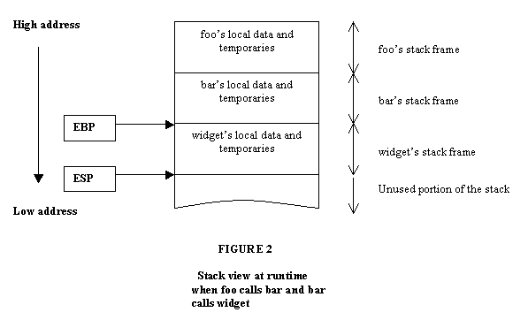
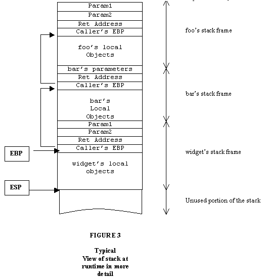
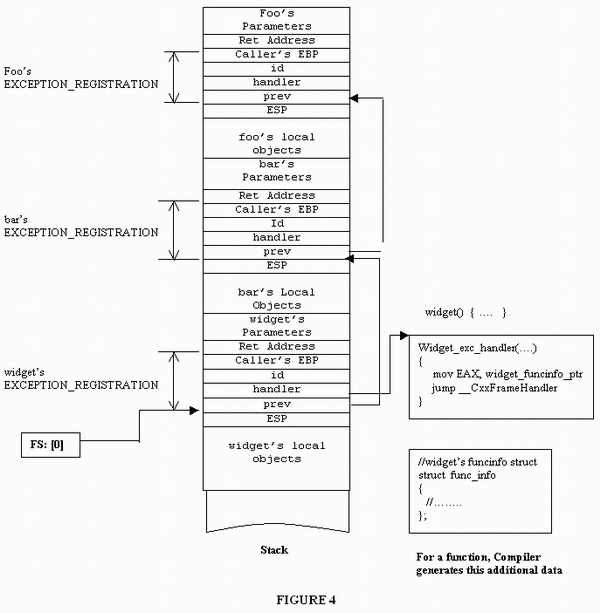
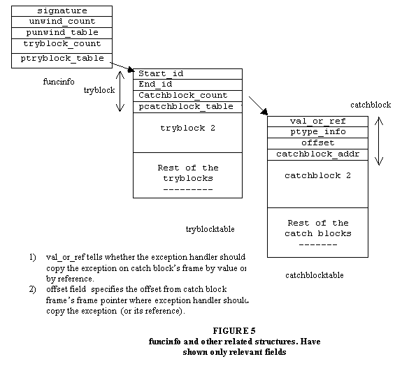
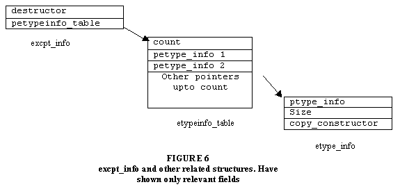
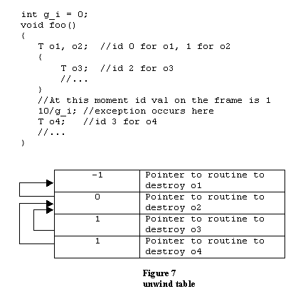

 
<!--BEGIN_DATA
{
    "create_date": "2016-07-22 16:39", 
    "modify_date": "2016-07-22 16:39", 
    "is_top": "0", 
    "summary": "How a C++ compiler implements exception handling", 
    "tags": "C/C++", 
    "file_name": "How a C++ compiler implements exception handling.md"
}
END_DATA-->

####<p>原文出处：<a href='http://www.codeproject.com/Articles/2126/How-a-C-compiler-implements-exception-handling' target='blank'>........</a></p>

An indepth discussion of how VC++ implements exception handling. Source code
includes exception handling library for VC++.


 * [Download source files - 19 Kb](./image/Exceptionhandler_src.zip)


###Introduction

One of the revolutionary features of C++ over traditional languages is its
support for exception handling. It provides a very good alternative to
traditional techniques of error handling which are often inadequate and error-
prone. The clear separation between the normal code and the error handling
code makes programs very neat and maintainable. This article discusses what it
takes to implement exception handling by the compiler. General understanding
of the exception handling mechanism and its syntax is assumed. I implemented
exception handling library for VC++ that is accompanied with this article. To
replace the exception handler provided by VC++ with my handler, call the
following function:

`install_my_handler();`

After this point, any exception that occurs with in the program - from
throwing an exception to stack unwinding, calling the catch block and then
resuming the execution - is processed by my exception handling library.

The C++ standard, like any other feature in C++, doesn't say anything about
how exception handling should be implemented. This means that every vendor is
free to use any implementation as he sees fit. I will describe how VC++
implements this feature, but it should be a good study material for those as
well who use other compilers or Operating Systems [1]. VC++ builds its
exception handling support on top of structured exception handling (SEH)
provided by Windows operating system [2].

###Structure exception handling - Overview

For this discussion, I will consider exceptions to be those that are
explicitly thrown or occur due to conditions like divide by zero or null
pointer access. When exception occurs, interrupt is generated and control is
transferred to the operating system. Operating System, in turn, calls the
exception handler that inspects the function call sequence starting from the
current function from where the exception originated, and performs its job of
stack unwinding and control transfer. We can write our own exception handler
and register it with the operating system that it would call in the event of
an exception.

Windows defines a special structure for registration, called
`EXCEPTION_REGISTRATION`:

    
    
    struct EXCEPTION_REGISTRATION
    {
       EXCEPTION_REGISTRATION *prev;
       DWORD handler;
    };

To register your own exception handler, create this structure and store its
address at offset zero of the segment pointed to by FS register, as the
following pseudo assembly language instruction shows:

`mov FS:[0], exc_regp`

prev field signifies linked list of `EXCEPTION_REGISTRATION` structures. When
we register `EXCEPTION_REGISTRATION` structure, we store the address of the
previously registered structure in prev field.

So how does the exception call back function look like? Windows requires that
the signature of exception handler, defined in EXCPT.h, be like:

    
    
    EXCEPTION_DISPOSITION (*handler)(
        _EXCEPTION_RECORD *ExcRecord,
        void * EstablisherFrame, 
        _CONTEXT *ContextRecord,
        void * DispatcherContext);

You can ignore all the parameters and return type for now. The following
program registers exception handler with the Operating System and generates an
exception by attempting to divide by zero. This exception is caught by the
exception handler which does not do much. It just prints a message and exits.

```
#include <iostream>
#include <windows.h>

    
using std::cout;
using std::endl;

struct EXCEPTION_REGISTRATION
{
   EXCEPTION_REGISTRATION *prev;
   DWORD handler;
};

EXCEPTION_DISPOSITION myHandler(
    _EXCEPTION_RECORD *ExcRecord,
    void * EstablisherFrame, 
    _CONTEXT *ContextRecord,
    void * DispatcherContext)
{
	cout << "In the exception handler" << endl;
	cout << "Just a demo. exiting..." << endl;
	exit(0);
	return ExceptionContinueExecution; //will not reach here
}

int g_div = 0;

void bar()
{
	//initialize EXCEPTION_REGISTRATION structure
	EXCEPTION_REGISTRATION reg, *preg = &reg;
	reg.handler = (DWORD)myHandler;
	//get the current head of the exception handling chain	
	DWORD prev;
	_asm
	{
		mov EAX, FS:[0]
		mov prev, EAX
	}
	reg.prev = (EXCEPTION_REGISTRATION*) prev;
	//register it!
	_asm
	{
		mov EAX, preg
		mov FS:[0], EAX
	}
	//generate the exception
	int j = 10 / g_div;  //Exception. Divide by 0. 
}

int main()
{
	bar();
	return 0;
}

/*-------output-------------------
In the exception handler
Just a demo. exiting...
---------------------------------*/
```

Please note that Windows strictly enforces one rule: EXCEPTION_REGISTRATION
structure should be on the stack and it should be at a lower memory address
than its previous node. Windows will terminate the process if it does not find
such to be the case.

###Functions and Stack

Stack is a contiguous area of memory which is used for storing local objects
of a function. More specifically, each function has an associated stack frame
that houses all the local objects of the function as well as any temporaries
generated by the expressions with in the function. Please note that this is a
typical picture. In reality, the compiler may store all or some of the objects
in internal registers for faster access. Stack is a notion that is supported
at the processor level. Processor provides internal registers and special
instructions to manipulate it.

Figure 2 shows how a typical stack may look like when function foo calls
function bar and bar calls function widget. Please note that in this case the
stack grows downwards. This means that the next item to be pushed on the stack
would be at lower memory address than the previous item.



The compiler uses EBP register to identify the current active stack frame. In
current case, widget is being executed and as the figure shows, EBP register
points at widget's stack frame. Function accesses its local objects relative
to the frame pointer. The compiler resolves at compile time all the local
object names to some fixed offset from frame pointer. For instance, widget
would typically access its local variable as some fixed number of bytes below
the frame pointer, say EBP-24.

The figure also shows the ESP register, stack pointer that points at the last
item in the stack, or in current case, ESP points at the end of widget's
frame. Next frame would be created after this location.

Processor supports two operations for the stack: push and pop. Consider:

`pop EAX`

means read 4 bytes from the location where ESP is pointing and increment
(remember, stack grows downwards in our case) ESP by 4 (in 32 bit processors).
Similarly,

`push EBP`

means decrement ESP by 4 and then write the contents of EBP register at the
location where ESP is pointing.

When compiler compiles a function, it adds some code in the beginning of the
function called prologue that creates and initializes the stack frame of the
function. Similarly, it adds code at the end of the function called epilogue
to pop the stack frame of the exiting function.

Compiler typically generates the following sequence for the prologue:

    
    
    Push EBP      ; save current frame pointer on stack
    Mov EBP, ESP  ; Activate the new frame
    Sub ESP, 10   ; Subtract. Set ESP at the end of the frame

The first statement saves the current frame pointer EBP on the stack. The
second statement activates the frame for the callee by setting EBP register at
the location where it stored the EBP of the caller. And the third statement
sets the ESP register at the end of the current frame by subtracting ESP's
value with the total size of all the local objects and the temporaries that
the function will create. Compiler knows at compile time the type and size of
all the local objects of a function, so it effectively knows the frame size.

The epilogue does the reverse of the prologue, It has to remove the current
frame from the stack:

    
    
    Mov ESP, EBP    
    Pop EBP         ; activate caller's frame
    Ret             ; return to the caller
    

It sets ESP at the location where its caller's frame pointer is saved (which
is at the location where callee's frame pointer points), pops it off in EBP
thus activating its caller's stack frame and then executes return.

When processor encounters return instruction, it does the following: it pops
off the return address from the stack and transfer's control at that address.
The return address was put on the stack when its caller executed call
instruction to call it. Call instruction first pushes the address of the next
instruction where control should be returned and then jumps to the beginning
of the callee. Figure 3 shows a more detailed view of the stack at runtime. As
the figure shows, function parameters are also part of the stack frame of the
function. The caller pushes callee's arguments on the stack. When the function
returns, the caller removes the callee's arguments from the stack by adding
the size of the arguments to the ESP which is known at compile time:

`Add ESP, args_size`

Alternatively, callee can also remove the parameters by specifying the total
parameter size in return instruction which again is known at compile time. The
instruction below removes 24 bytes from the stack before returning to the
caller, assuming total parameter size is 24:

`Ret 24`

Only one of these schemes is used at a time depending upon callee's calling
convention. Please note that every thread in a process has its own associated
stack.



###C++ and Exceptions

Recall that I had talked about `EXCEPTION_REGISTRATION` structure in the first
section. It is used to register the exception callback with the operating
system that it calls when exception occurs.

VC++ extends the semantics of this function by adding two more fields at the
end:

    
    
    struct EXCEPTION_REGISTRATION
    {
       EXCEPTION_REGISTRATION *prev;
       DWORD handler;
       int   id;
       DWORD ebp;
    };

VC++, with few exceptions, creates `EXCEPTION_REGISTRATION` structure for
every function as its local variable [3]. The last field of the structure
overlaps the location where frame pointer EBP points. Function's prologue
creates this structure on its stack frame and registers it with the operating
system. The epilogue restores the `EXCEPTION_REGISTRATION` of the caller. I
will discuss the significance of the id field in the next sections.

When VC++ compiles a function, it generates two set of data for the function:

a) Exception callback function.  
b) A data structure that contains important information about the function
like the catch blocks, their addresses, the type of exception they are
interested in catching etc. I will refer to this structure as `funcinfo` and
talk more about it in the next section.

Figure 4 shows a broader picture of how things look like at runtime when
considering exception handling. Widget's exception callback is at the head of
the exception chain pointed to by FS:[0] (which was set by widget's prologue).
Exception handler passes widget's `funcinfo` structure's address to
`__CxxFrameHandler` function, which inspects this data structure to see if
there is any catch block in the function interested in catching the current
exception. If it does not find any, it returns `ExceptionContinueSearch` value
back to the operating system. Operating system gets the next node off the
exception handling list and calls its exception handler (which is the handler
for the caller of the current function).



This continues until the exception handler finds the catch block interested in
catching the exception in which case it does not return back to the operating
system. But before it calls the catch block (it knows the address of the catch
block from `funcinfo` structure, see figure 4), it must perform stack
unwinding: cleaning up the stack frames of the functions below this function's
frame. Cleaning of the stack frame involves nice little intricacy: The
exception handler must find all the local objects of the function alive on the
frame at the time of the exception and call their destructors. I will discuss
more about it in a later section.

The exception handler delegates the task of cleaning the frame to the
exception handler associated with that frame. It starts from the beginning of
the exception handling list pointed to by FS:[0] and calls the exception
handler at each node, telling it that the stack is being unwound. In response,
the handler calls destructor for all the local objects on the frame and
returns. This continues until it arrives at the node that corresponds to
itself.

Since catch block is part of a function, it uses the stack frame of the
function to which it belongs. Hence the exception handler needs to activate
its stack frame before calling the catch block. Secondly, every catch block
accepts exactly one parameter, its type being the type of exception it is
willing to catch. Exception handler should copy the exception object or its
reference to catch block's frame. It knows where to copy the exception from
`funcinfo` structure. The compiler is generous enough to generate this
information for it.

After copying the exception and activating the frame, exception handler calls
the catch block. Catch block returns it the address where control should be
transferred in the function after try-catch block. Please note that at this
moment, even though the stack unwinding has occurred and frames have been
cleaned up, they have not been removed and they still physically occupy the
space on the stack. This is because the exception handler is still executing
and like any other normal function, it also uses the stack for its local
objects, its frame present below the last function's frame from where the
exception originated. When catch block returns it needs to destroy the
exception. It is after this point that the exception handler removes all the
frames including its own by setting the ESP at the end of the function's frame
(to which it has to transfer the control) and transfers control at the end of
try-catch block. How does it know where the end of function's frame is? It has
no way of knowing. That's why the compiler saves it (through function's
prologue) on function's stack frame for the exception handler to find it. See
figure 4. It is sixteen bytes below the stack frame pointer EBP.

The catch block may itself throw a new exception or rethrow the same
exception. Exception handler has to watch for this situation and take
appropriate action. If catch block throws a new exception, the exception
handler has to destroy the old exception. If catch block specifies a rethrow,
then the exception handler has to propagate the old exception.

There is one important point to note here: Since every thread has its own
stack, this means that every thread has its own list of EXCEPTION_REGISTRATION
structures pointed to by FS:[0].

###C++ and Exceptions - 2

Figure 5 shows the layout of `funcinfo` structure. Please note that the names
may vary from the actual names used by VC++ compiler and I have only shown the
relevant fields. Structure of unwind table is discussed in the next section.



When exception handler has to search for a catch block in a function, the
first thing it has to determine is whether the point from where the exception
originated from within a function has an enclosing try block or not. If it
does not find any try block, then it returns back. Otherwise, it searches the
list of catch blocks associated with the enclosing try block.

First, let's see how it goes about finding the try block. At compile time, the
compiler assigns each try block a start id and end id. These id's are also
accessible to exception handler through funcinfo structure. See > figure 5.
The compiler generates tryblock data structure for each try block with in the
function.

In the previous section, I had talked about VC++ extending the
`EXCEPTION_REGISTRATION` structure to include id field. Recall, this structure
is present on function's stack frame. See figure 4. At the time of exception,
the exception handler reads this id from the frame and checks the tryblock
structure to see if the id is equal to or falls in between its start id and
end id. If it does, then the exception originated from with in this try block.
Otherwise, it looks at the next tryblock structure in tryblocktable.

Who writes the id value on the stack and what should be written there? The
compiler adds statements in the function at various points that update id
value to reflect the current runtime state. For instance, the compiler will
add a statement in the function at the point where try block is entered that
will write the start id of the try block on the stack frame.

Once exception handler finds the try block, it can traverse the catchblock
table associated with the try block to see if any catch block is interested in
catching the exception. Please note that in case of nested try blocks, the
exception that originated from inner try block also originated from outer try
block. The exception handler should first look for the catch blocks for the
inner try block. If none is found, then it looks for the catch blocks of the
outer try block. While laying the structures in tryblock table, VC++ puts
inner try block structure before the outer try block.

How is the exception handler going to determine (from catchblock structure) if
a catch block is interested in catching the current exception? It does so by
comparing the type of the exception with the type of the catch block's
parameter. Consider:

    
    
    void foo()
    {
       try {
          throw E();
       }
       catch(H) {
          //.
       }
    }

The catch block catches the exception if H and E are the exact same type. The
exception handler has to compare the types at runtime. Normally, languages
like C provide no facility to determine object's type at runtime. C++ provides
run time type identification mechanism (RTTI) and has a standard way of
comparing types at runtime. It defines a class `type_info`, defined in
standard header `<typeinfo>` that represents a type at runtime. The second
field of the catchblock structure (see figure 5) is a pointer to the
`type_info` structure that represents the type of the catch block's parameter
at runtime. `type_info` has `operator ==` that tells whether the two types are
of exact same class or not. So, all the exception handler has to do is to
compare (call `operator ==`) the `type_info` of the catch block's parameter
(available through catchblock structure) with the `type_info` of the exception
to determine if the catch block is interested in catching the current
exception.

The exception handler knows about the type of the catch block's parameter from
`funcinfo` structure, but how does it know about the `type_info` of the
exception? When compiler encounters a statement like

`throw E();`

It generates `excpt_info` strcuture for the exception thrown. See figure 6.
Please note that the names may vary from the actual names used by VC++
compiler and I have only shown the relevant fields. As shown in the figure,
exception's `type_info` is available through `excpt_info` structure. At some
point of time, exception handler needs to destroy the exception (after the
catch block is invoked). It may also need to copy the exception (before
invoking the catch block). To help exception handler do these tasks, compiler
makes available exception's destructor, copy constructor and size to the
exception handler through `excpt_info` structure.



If the catch block's parameter type is a base class and the exception is its
derived class, the exception handler should still invoke that catch block.
However, comparing the typeinfo's of the two in this case would yield false as
they are not the same type. Neither does class `type_info` provide any member
function or operator that tells if one class is base class of the other. And
yet, the exception handler has to invoke this catch block. To help it do so,
the compiler has generated more information for the handler. If the exception
is a derived class, then `etypeinfo_table` (available through `excpt_info`
structure) contains `etype_info` (extended type_info, my name) pointer for all
the classes in the hierarchy. So the exception handler compares the
`type_info` of the catch block's parameter with all the type_info's available
through the `excpt_info` structure. If any match is found then the catch block
will be invoked.

Before I wrap up this section, one last point: How does the exception handler
become aware of the exception and the excpt_info structure? I will attempt to
answer this question in the following discussion.

VC++ translates throw statement into something like:

    
    
    //throw E(); //compiler generates excpt_info structure for E.
    E e = E();  //create exception on the stack
    _CxxThrowException(&e, E_EXCPT_INFO_ADDR);

`_CxxThrowException` passes control to the operating system (through software
interrupt, see function `RaiseException`) passing it both of its parameters.
The operating system packages these two parameters in `_EXCEPTION_RECORD`
structure in its preparation to call the exception callback. It starts from
the head of the `EXCEPTION_REGISTRATION` list pointed to by FS:[0] and calls
the exception handler at that node. The pointer to this
`EXCEPTION_REGISTRATION `is also the second parameter of the exception
handler. Recall that in VC++, every function creates its own
`EXCEPTION_REGISTRATION` on its stack frame and registers it. Passing the
second parameter to the exception handler makes important information
available to it like EXCEPTION_REGISTRATION's id field (important for finding
the catch block). It also makes the exception handler aware of the function's
stack frame (useful for cleaning the stack frame) and the position of the
`EXCEPTION_REGISTRATION` node on the exception list (useful for stack
unwinding). The first parameter is the pointer to the `_EXCEPTION_RECORD
`structure through which the exception pointer and its `excpt_info` structure
is available. The signature of the exception handler defined in EXCPT.H is:

    
    
    EXCEPTION_DISPOSITION (*handler)(
        _EXCEPTION_RECORD *ExcRecord,
        void * EstablisherFrame, 
        _CONTEXT *ContextRecord,
        void * DispatcherContext);

You can ignore the last two parameters. The return type is an enumeration (see
EXCPT.H). As I discussed before, if the exception handler cannot find catch
block, it returns `ExceptionContinueSearch` value back to the system. For this
discussion, other values are not important. `_EXCEPTION_RECORD` structure is
defined in WINNT.H as:

    
    
    struct _EXCEPTION_RECORD
    {
        DWORD ExceptionCode;
        DWORD ExceptionFlags; 
        _EXCEPTION_RECORD *ExcRecord;
        PVOID   ExceptionAddress; 
        DWORD NumberParameters;
        DWORD ExceptionInformation[15]; 
    } EXCEPTION_RECORD; 

The number and kind of entries in the `ExceptionInformation` array depends
upon the `ExceptionCode` field. If the `ExceptionCode` represents C++
(Exception code is 0xe06d7363) exception (which will be the case if the
exception occurs due to throw), then `ExceptionInformation` array contains
pointer to the exception and the `excpt_info` structure. For other kind of
exceptions, it almost never has any entry. Other kind of exceptions can be
divide by zero, access violation etc and their values can be found in WINNT.H.

Exception handler looks at the `ExceptionFlags` field of the
`_EXCEPTION_RECORD` structure to determine what action to take. If the value
is `EH_UNWINDING` (defined in Except.inc), that is an indication to the
exception handler that the stack is being unwound and it should clean its
stack frame and return. Cleaning up involves finding all the local objects
alive on the frame at the time of the exception and calling their destructors.
The next section discusses this. Otherwise, exception handler has to search
for the catch block in the function and invoke it if it is found.

###Stack Frame Cleanup

C++ standard says that when the stack is being unwound, destructor for all the
local objects alive at the time of exception should be called. Consider:

    
    
    int g_i = 0;
    void foo()
    {
       T o1, o2;
       {
           T o3;
       }
       10/g_i; //exception occurs here
       T o4;
       //...
    }

When exception occurs, local objects o1 and o2 exists on foo's frame while o3
has completed its lifetime. O4 was never created. Exception handler should be
aware of this fact and should call destructor for o1 and o2.

As I wrote before, the compiler adds code to the function at various special
points that register the current runtime state of the function as execution
proceeds. It assigns id's to these special regions in the function. For
instance, try block entry point is a special region. As discussed before, the
compiler will add statement in the function at the point when try block is
entered that will write the start id of the try block on function's frame.

The other special region in the function is where the local object is created
or destroyed. In other words, the compiler assigns each local object a unique
id. When compiler encounters object definition like:

    
    
    void foo()
    {
       T t1;
       //.
    }

It adds statement after the definition (after the point when object will be
created) to write its id value on the frame:

    
    
    void foo()
    {
       T t1;
       _id = t1_id; //statement added by the compiler
       //.
    }

The compiler creates a hidden local variable (designated in the above code as
_id) that overlaps with the `id` field of the `EXCEPTION_REGISTRATION`
structure. Similarly, it adds statement before calling the destructor for the
object to write the id of the previous region.

When exception handler has to clean up the frame, it reads the id value from
the frame (`id` field of the `EXCEPTION_REGISTRATION` structure or 4 bytes
below the frame pointer, EBP). This id is an indication that the code in the
function up to the point to which current id corresponds executed without any
exception. All the objects above this point were created. Destructors for all
or some of the objects above this point need to be called. Please note that
some of these objects may have been destroyed if they are part of a sub block.
Destructor for these should not be called.

Compiler generates yet another data structure for the function,
`unwindtable`(my name), which is an array of unwind structures. This table is
available through funcinfo structure. See figure 5. For every special region
in the function, there is one unwind structure. The structure entries appear
in the unwindtable in the same order as their corresponding regions appear in
the function. unwind structure corresponding to objects is of interest
(remember, each object definition denotes special region and has id associated
with it). It contains information to destroy the object. When compiler
encounters object definition, it generates a short routine that knows about
the object's address on the frame (or its offset from the frame pointer) and
destroys this object. One of the fields of unwind structure contains the
address of this routine:

    
    
    typedef  void (*CLEANUP_FUNC)();
    struct unwind
    {
        int prev;
        CLEANUP_FUNC  cf;
    };

unwind structure for try block has a value of zero for the second field. prev
field signifies that the unwintable is also a linked list of unwind
structures. When exception handler has to cleanup the frame, it reads the
current id from the frame and uses it as an index into the unwind table. It
reads the unwind structure at that index and calls the clean up function as
specified by the second field of the structure. This destroys the object
corressponding to this id. The handler then reads the previous unwind
structure from unwind table at an index as specified by prev field. This
continues until end of list is reached (prev is -1). Figure 7 shows how a
unwind table may look like for the function in the figure.



Consider case of the new operator:

`T* p = new T();`

The system first allocates memory for T and then calls the constructor. If
constructor throws an exception, then the system must free up the memory
allocated for this object. To achieve this, VC++ also assigns id to each new
operator for a type that has a non-trivial constructor. There is corresponding
entry in the unwind table, the cleanup routine frees the space allocated.
Before calling the constructor, it stores id for the allocation in
`EXCEPTION_REGISTRATION` structure. After constructor returns successfully, it
restores the id of the previous special region.

Furthermore, the object may have been partially constructed when the
constructor throws exception. If it has member sub objects or base class sub
objects and some of them had been constructed at the time of exception,
destructor for those objects must be called. Compiler generates same set of
data for a constructor as for any normal function to perform these tasks.

Please note that the exception handler calls the user-defined destructors
while unwinding the stack. It is possible for the destructor to throw an
exception. The C++ standard says that while the stack is unwinding, the
destructor may not throw an exception. If it does, the system calls
std::terminate.

###Implementation

This section talks about three topics that have not been discussed above:

a) Installing the exception handler.  
b) Catch block rethrowing the exception or throwing a new exception.  
c) Per thread exception handling support.

Please look at the Readme.txt file in the source distribution for build
instructions [1]. It also includes a demo project.

The first task is to install the exception handling library, or in other
words, replace the library provided by VC++. From the above discussion, it is
clear that VC++ provides `__CxxFrameHandler` function that is the entry point
for the all the exceptions. For each function, the compiler generates
exception handling routine that is called if the exception occurs with in this
function. This routine passes funcinfo pointer to the `__CxxFrameHandler`
function.

`install_my_handler()` function inserts code at the beginning of
`__CxxFrameHandler` that jumps to `my_exc_handler()`. But `__CxxFrameHandler`
resides in readonly code page. Any attempt to write to it would cause access
violation. So the first step is to change the access of the page to read-write
using `VirtualProtectEx` function provided by Windows API. After writing to
the memory, we restore the old protection of the page. The function writes the
contents of jmp_instr structure at the beginning of `__CxxFrameHandler`.

```
//install_my_handler.cpp

#include <windows.h>
#include "install_my_handler.h"
    
//C++'s default exception handler
extern "C" 

EXCEPTION_DISPOSITION  __CxxFrameHandler(
     struct _EXCEPTION_RECORD *ExceptionRecord,
     void * EstablisherFrame,
     struct _CONTEXT *ContextRecord,
     void * DispatcherContext
     );
     
namespace
{
    char cpp_handler_instructions[5];
    bool saved_handler_instructions = false;
}

namespace my_handler
{
    //Exception handler that replaces C++'s default handler.
    EXCEPTION_DISPOSITION my_exc_handler(
         struct _EXCEPTION_RECORD *ExceptionRecord,
         void * EstablisherFrame,
         struct _CONTEXT *ContextRecord,
         void * DispatcherContext
         ) throw();
#pragma pack(1)
    struct jmp_instr
    {
        unsigned char jmp;
        DWORD         offset;
    };
#pragma pack()
    
    bool WriteMemory(void * loc, void * buffer, int size)
    {
        HANDLE hProcess = GetCurrentProcess();
        //change the protection of pages containing range of memory 
        //[loc, loc+size] to READ WRITE
        DWORD old_protection;
        BOOL ret;
        ret = VirtualProtectEx(hProcess, loc, size, 
                         PAGE_READWRITE, &old_protection);
        if(ret == FALSE)
            return false;
        ret = WriteProcessMemory(hProcess, loc, buffer, size, NULL);
        //restore old protection
        DWORD o2;
        VirtualProtectEx(hProcess, loc, size, old_protection, &o2);
		return (ret == TRUE);
    }
    
    bool ReadMemory(void *loc, void *buffer, DWORD size)
    {
        HANDLE hProcess = GetCurrentProcess();
        DWORD bytes_read = 0;
        BOOL ret;
        ret = ReadProcessMemory(hProcess, loc, buffer, size, &bytes_read);
        return (ret == TRUE && bytes_read == size);
    }
    
    bool install_my_handler()
    {
        void * my_hdlr = my_exc_handler;
        void * cpp_hdlr = __CxxFrameHandler;
        jmp_instr jmp_my_hdlr; 
        jmp_my_hdlr.jmp = 0xE9;
        //We actually calculate the offset from __CxxFrameHandler+5
        //as the jmp instruction is 5 byte length.
        jmp_my_hdlr.offset = reinterpret_cast<char*>(my_hdlr) - 
                    (reinterpret_cast<char*>(cpp_hdlr) + 5);
        if(!saved_handler_instructions)
        {
            if(!ReadMemory(cpp_hdlr, cpp_handler_instructions,
                        sizeof(cpp_handler_instructions)))
                return false;
            saved_handler_instructions = true;
        }
        return WriteMemory(cpp_hdlr, &jmp_my_hdlr, sizeof(jmp_my_hdlr));
    }
    
    bool restore_cpp_handler()
    {
        if(!saved_handler_instructions)
            return false;
        else
        {
            void *loc = __CxxFrameHandler;
            return WriteMemory(loc, cpp_handler_instructions, 
                           sizeof(cpp_handler_instructions));
        }
    }
}
```

The `#pragma pack(1)` directive at the definition of `jmp_instr` structure
tells the compiler to layout the members of the structure without any padding
between them. Without this directive, size of this structure is eight bytes.
It is five bytes when we define this directive.

Going back to exception handling, when the exception handler calls the catch
block, the catch block may rethrow the exception or throw a completely new
exception. If catch block throws a new exception, then the exception handler
has to destroy the previous exception before moving ahead. If the catch block
decides to rethrow, the exception handler has to propagate the current
exception. At this moment, the exception handler has to tackle with two
questions: how does the exception handler know that the exception originated
from with in a catch block and how does it keep track of the old exception?
The way I solved this problem is that before the handler calls the catch
block, it stores the current exception in `exception_storage` object and
registers a special purpose exception handler, catch_block_protector. The
exception_storage object is available by calling `get_exception_storage()`
function:

    
    
    exception_storage* p = get_exception_storage();
    p->set(pexc, pexc_info);
    register catch_block_protector
    call catch block
    //....

If exception is (re)thrown from within a catch block, the control goes to
catch_block_protector. Now this function can extract the previous exception
from exception_storage object and destroy it if catch block threw new
exception. If the catch block did a rethrow (which it can find out by
inspecting first two entries of `ExceptionInformation` array, both are zero.
See code below), then the handler needs to propagate the current exception by
copying it in `ExceptionInformation` array. The following snippet shows
`catch_block_protector()` function.

    
    
    //-------------------------------------------------------------------
    // If this handler is calles, exception was (re)thrown from catch 
    // block. The  exception  handler  (my_handler)  registers this 
    // handler before calling the catch block. Its job is to determine
    // if the  catch block  threw  new  exception or did a rethrow. If 
    // catch block threw a  new  exception, then it should destroy the 
    // previous exception object that was passed to the catch block. If 
    // the catch block did a rethrow, then this handler should retrieve
    // the original exception and save in ExceptionRecord for the 
    // exception handlers to use it.
    //-------------------------------------------------------------------
    EXCEPTION_DISPOSITION  catch_block_protector(
    	 _EXCEPTION_RECORD *ExceptionRecord,
    	 void * EstablisherFrame,
    	 struct _CONTEXT *ContextRecord,
    	 void * DispatcherContext
    	 ) throw()
    {
        EXCEPTION_REGISTRATION *pFrame;
        pFrame = reinterpret_cast<EXCEPTION_REGISTRATION*>
        (EstablisherFrame);if(!(ExceptionRecord->ExceptionFlags & (  
              _EXCEPTION_UNWINDING | _EXCEPTION_EXIT_UNWIND)))
        {
            void *pcur_exc = 0, *pprev_exc = 0;
            const excpt_info *pexc_info = 0, *pprev_excinfo = 0;
            exception_storage *p = 
            get_exception_storage();  pprev_exc=
            p->get_exception();  pprev_excinfo=
            p->get_exception_info();p->set(0, 0);
            bool cpp_exc = ExceptionRecord->ExceptionCode == MS_CPP_EXC;
            get_exception(ExceptionRecord, &pcur_exc);
            get_excpt_info(ExceptionRecord, &pexc_info);
            if(cpp_exc && 0 == pcur_exc && 0 ==   pexc_info)
            //rethrow
                {ExceptionRecord->ExceptionInformation[1] = 
                    reinterpret_cast<DWORD>
                (pprev_exc);ExceptionRecord->ExceptionInformation[2] = 
                    reinterpret_cast<DWORD>(pprev_excinfo);
            }
            else
            {
                exception_helper::destroy(pprev_exc, pprev_excinfo);
            }
        }
        return ExceptionContinueSearch;
    }

Consider one possible implementation of get_exception_storage() function:

    
    
    exception_storage* get_exception_storage()
    {
        static exception_storage es;
        return &es;
    }

This would be a perfect implementation except in a multithreaded world.
Consider more than one thread getting hold of this object and trying to store
exception object in it. This will be disasterous. Every thread has its own
stack and own exception handling chain. What we need is a thread specific
exception_storage object. Every thread has its own object which is created
when the thread begins its life and destroyed when the threads ends. Windows
provides thread local storage for this purpose. Thread local storage enables
each object to have its own private copy of an object accesible through a
global key. It provides `TLSGetValue()` and `TLSSetValue()` functions for this
purpose.

Excptstorage.cpp file defines `get_exception_storage()` function. This file is
built as a DLL. This is due to the fact that it enables us to know whenever a
thread is created or destroyed. Every time a thread is created or destroyed,
Windows calls every DLL's (that is loaded in this process's address space)
`DllMain()` function. This function is called in the thread that is created.
This gives us a chance to initialize thread specific data, `exception_storage`
object in our case.

    
    
    //excptstorage.cpp
    
    #include "excptstorage.h"

###Conclusion

As discussed above, the C++ compiler and the runtime exception library, with
support from the Operating System, cooperate to perform exception handling.

###Notes and References

  1. As of this discussion, Visual Studio 7.0 is released. I compiled and tested the exception handling library primarily with VC++ 6.0 on Windows 2000 running on pentium processors. I also tested it with VC++ 5.0 and VC++ 7.0 beta release. There is small difference between 6.0 and 7.0. 6.0 first copies the exception (or its reference) on catch block's frame and then performs stack unwinding before calling the catch block. 7.0 library first performs stack unwinding. The behavior of my library is similar to 6.0 library in this respect.
  2. See excellent article on MSDN by Matt Pietrek on [ structured exception handling](http://www.microsoft.com/msj/defaultframe.asp?page=/msj/0197/exception/exception.htm&nav=/msj/0197/newnav.htm). 
  3. The compiler may not generate any exception related data for a function that does not have a try block and does not define any object that has a non-trivial destructor.


###License

This article, along with any associated source code and files, is licensed
under [The Code Project Open License(CPOL)](http://www.codeproject.com/info/cpol10.aspx)

