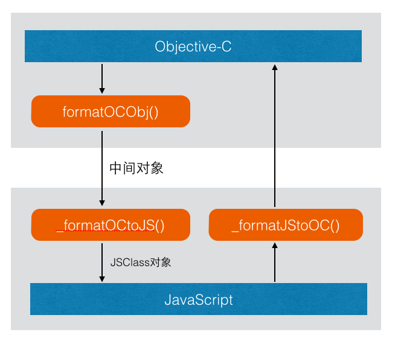
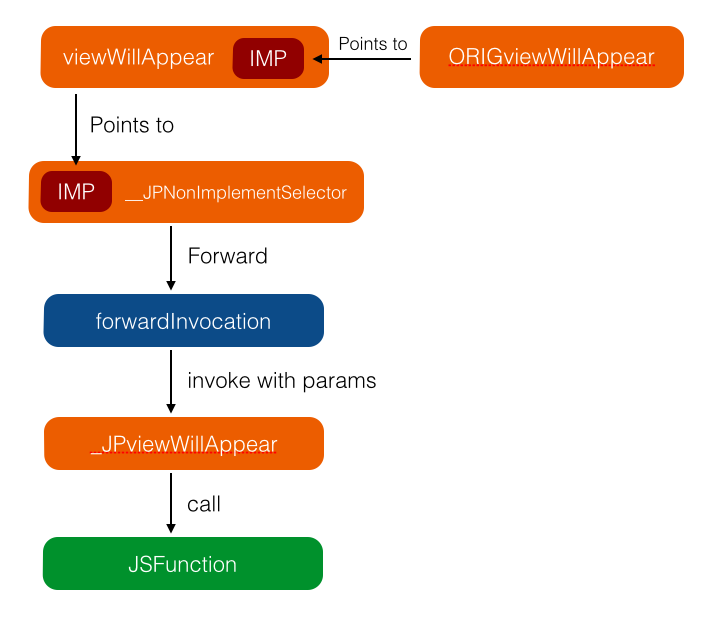

 
<!--BEGIN_DATA
{
    "create_date": "2016-07-22 10:51", 
    "modify_date": "2016-07-22 10:51", 
    "is_top": "0", 
    "summary": "JSPatch实现原理详解", 
    "tags": "iOS", 
    "file_name": "JSPatch实现原理详解.md"
}
END_DATA-->

####
原文出处：<a href='http://blog.cnbang.net/tech/2808/' target='blank'>JSPatch实现原理详解</a>

注：本文较早撰写，随着 JSPatch 的改进，有些内容已与最新代码对不上，建议转看重新整理后的[JSPatch实现原理详解](https://github.com/bang590/JSPatch/wiki/JSPatch-%E5%AE%9E%E7%8E%B0%E5%8E%9F%E7%90%86%E8%AF%A6%E8%A7%A3)。

* * *

[JSPatch](https://github.com/bang590/JSPatch)以小巧的体积做到了让JS调用/替换任意OC方法，让iOSAPP具备[热更新](http://blog.cnbang.net/works/2767/)的能力，在实现 JSPatch
过程中遇到过很多困难也踩过很多坑，有些还是挺值得分享的。本篇文章从基础原理、方法调用和方法替换三块内容介绍整个 JSPatch的实现原理，并把实现过程中的想法和碰到的坑也尽可能记录下来。

###基础原理

能做到通过JS调用和改写OC方法最根本的原因是 Objective-C 是动态语言，OC上所有方法的调用/类的生成都通过 Objective-C
Runtime 在运行时进行，我们可以通过类名/方法名反射得到相应的类和方法：

    
    Class class = NSClassFromString("UIViewController");
    id viewController = [[class alloc] init];
    SEL selector = NSSelectorFromString("viewDidLoad");
    [viewController performSelector:selector];
    

也可以替换某个类的方法为新的实现：
    
    static void newViewDidLoad(id slf, SEL sel) {}
    class_replaceMethod(class, selector, newViewDidLoad, @"");
    

还可以新注册一个类，为类添加方法：

    Class cls = objc_allocateClassPair(superCls, "JPObject", 0);
    objc_registerClassPair(cls);
    class_addMethod(cls, selector, implement, typedesc);
    

对于 Objective-C 对象模型和动态消息发送的原理已有很多文章阐述得很详细，例如[这篇](http://blog.csdn.net/kesalin/article/details/6689226)，这里就不详细阐述了。理论上你可以在运行时通过类名/方法名调用到任何OC方法，替换任何类的实现以及新增任意类。所以 JSPatch 的原理就是：JS传递字符串给OC，OC通过 Runtime接口调用和替换OC方法。这是最基础的原理，实际实现过程还有很多怪要打，接下来看看具体是怎样实现的。  

###方法调用

    require('UIView')
    var view = UIView.alloc().init()
    view.setBackgroundColor(require('UIColor').grayColor())
    view.setAlpha(0.5)
    

引入JSPatch后，可以通过以上JS代码创建了一个 UIView实例，并设置背景颜色和透明度，涵盖了require引入类，JS调用接口，消息传递，对象持有和转换，参数转换这五个方面，接下来逐一看看具体实现。

####1.require

调用 require('UIView') 后，就可以直接使用 UIView 这个变量去调用相应的类方法了，require
做的事很简单，就是在JS全局作用域上创建一个同名变量，变量指向一个对象，对象属性__isCls表明这是一个Class，__clsName保存类名，在调用方法时会用到这两个属性。

    var _require = function(clsName) {
      if (!global[clsName]) {
        global[clsName] = {
          __isCls: 1,
          __clsName: clsName
        }
      }
      return global[clsName]
    }
    

所以调用require('UIView')后，就在全局作用域生成了 UIView 这个变量，指向一个这样一个对象：
 
    
    {
      __isCls: 1,
      __clsName: "UIView"
    }
    

####2.JS接口

接下来看看 UIView.alloc() 是怎样调用的。

#####旧实现

对于这个调用的实现，一开始我的想法是，根据JS特性，若要让 UIView.alloc() 这句调用不出错，唯一的方法就是给 UIView 这个对象添加alloc 方法，不然是不可能调用成功的，JS对于调用没定义的属性/变量，只会马上抛出异常，而不像OC/Lua/ruby那样会有转发机制。所以做了一个复杂的事，就是在require生成类对象时，把类名传入OC，OC通过 Runtime方法找出这个类所有的方法返回给JS，JS类对象为每个方法名都生成一个函数，函数内容就是拿着方法名去OC调用相应方法。生成的 UIView 对象大致是这样的：
 
    
    {
        __isCls: 1,
        __clsName: "UIView",
        alloc: function() {…},
        beginAnimations_context: function() {…},
        setAnimationsEnabled: function(){…},
        ...
    }
    

实际上不仅要遍历当前类的所有方法，还要循环找父类的方法直到顶层，整个继承链上的所有方法都要加到JS对象上，一个类就有几百个方法，这样把方法全部加到JS对象上，碰到了挺严重的问题，引入几个类就内存暴涨，无法使用。后来为了优化内存问题还在JS搞了继承关系，不把继承链上所有方法都添加到一个JS对象，避免像基类NSObject 的几百个方法反复添加在每个JS对象上，每个方法只存在一份，JS对象复制了OC对象的继承关系，找方法时沿着继承链往上找，结果内存消耗是小了一些，但还是大到难以接受。

#####新实现

当时继续苦苦寻找解决方案，若按JS语法，这是唯一的方法，但若不按JS语法呢？突然脑洞开了下，CoffieScript/JSX都可以用JS实现一个解释器实现自己的语法，我也可以通过类似的方式做到，再进一步想到其实我想要的效果很简单，就是调用一个不存在方法时，能转发到一个指定函数去执行，就能解决一切问题了，这其实可以用简单的字符串替换，把JS脚本里的方法调用都替换掉。最后的解决方案是，在OC执行JS脚本前，通过正则把所有方法调用都改成调用 __c()函数，再执行这个JS脚本，做到了类似OC/Lua/Ruby等的消息转发机制：

  
    
    UIView.alloc().init()
    ->
    UIView.__c('alloc')().__c('init')()
    

给JS对象基类 Object 的 prototype 加上 __c 成员，这样所有对象都可以调用到 __c，根据当前对象类型判断进行不同操作：

 
    
    Object.prototype.__c = function(methodName) {
      if (!this.__obj && !this.__clsName) return this[methodName].bind(this);
      var self = this
      return function(){
        var args = Array.prototype.slice.call(arguments)
        return _methodFunc(self.__obj, self.__clsName, methodName, args, self.__isSuper)
      }
    }
    

_methodFunc() 就是把相关信息传给OC，OC用 Runtime 接口调用相应方法，返回结果值，这个调用就结束了。

这样做不用去OC遍历对象方法，不用在JS对象保存这些方法，内存消耗直降99%，这一步是做这个项目最爽的时候，用一个非常简单的方法解决了严重的问题，替换之前又复杂效果又差的实现。

####3.消息传递

解决了JS接口问题，接下来看看JS和OC是怎样互传消息的。这里用到了 JavaScriptCore 的接口，OC端在启动JSPatch引擎时会创建一个JSContext 实例，JSContext 是JS代码的执行环境，可以给 JSContext 添加方法，JS就可以直接调用这个方法：

 
    JSContext *context = [[JSContext alloc] init];
    context[@"hello"] = ^(NSString *msg) {
        NSLog(@"hello %@", msg);
    };
    [_context evaluateScript:@"hello('word')"];     //output hello word
    

JS通过调用 JSContext 定义的方法把数据传给OC，OC通过返回值传会给JS。调用这种方法，它的参数/返回值 JavaScriptCore
都会自动转换，OC里的 NSArray, NSDictionary, NSString, NSNumber, NSBlock
会分别转为JS端的数组/对象/字符串/数字/函数类型。上述 _methodFunc() 方法就是这样把要调用的类名和方法名传递给OC的。

####4.对象持有/转换

UIView.alloc() 通过上述消息传递后会到OC执行 [UIView alloc]，并返回一个UIView实例对象给JS，这个OC实例对象在JS是怎样表示的呢？怎样可以在JS拿到这个实例对象后可以直接调用它的实例方法(UIView.alloc().init())？

对于一个自定义id对象，JavaScriptCore 会把这个自定义对象的指针传给JS，这个对象在JS无法使用，但在回传给OC时OC可以找到这个对象。对于这个对象生命周期的管理，按我的理解如果JS有变量引用时，这个OC对象引用计数就加1，JS变量的引用释放了就减1，如果OC上没别的持有者，这个OC对象的生命周期就跟着JS走了，会在JS进行垃圾回收时释放。

传回给JS的变量是这个OC对象的指针，如果不经过任何处理，是无法通过这个变量去调用实例方法的。所以在返回对象时，JSPatch 会对这个对象进行封装。

首先，告诉JS这是一个OC对象：

    
    static NSDictionary *toJSObj(id obj)
    {
        if (!obj) return nil;
        return @{@"__isObj": @(YES), @"cls": NSStringFromClass([obj class]), @"obj": obj};
    }
    

用__isObj表示这是一个OC对象，对象指针也一起返回。接着在JS端会把这个对象转为一个 JSClass 实例：

    var JSClass
    var _getJSClass = function(className) {
      if (!JSClass) {
        JSClass = function(obj, className, isSuper) {
            this.__obj = obj
            this.__isSuper = isSuper
            this.__clsName = className
        }
      }
      return JSClass
    }
    var _toJSObj = function(meta) {
      var JSClass = _getJSClass()
      return new JSClass(meta["obj"], meta["cls"])
    }
    

JS端如果发现返回是一个OC对象，会传入 _toJSObj()，生成一个 JSClass 实例，这个实例保存着OC对象指针，类名等。这个实例就是OC对象在JSPatch 对应的JS对象，生命周期是一样的。

回到我们第二点说的 JS接口， 这个 JSClass 实例对象同样有 __c 函数，调用这个对象的方法时，同样走到 __c 函数， __c函数会把JSClass实例对象里的OC对象指针以及要调用的方法名和参数回传给OC，这样OC就可以调用这个对象的实例方法了。

接着看看对象是怎样回传给OC的。上述例子中view.setBackgroundColor(require('UIColor').grayColor())，
这里生成了一个 UIColor 实例对象，并作为参数回传给OC。根据上面说的，这个 UIColor 实例在JS中的表示是一个 JSClass实例，所以不能直接回传给OC，这里的参数实际上会在 __c 函数进行处理，会把对象的 .__obj 原指针回传给OC。

最后一点，OC对象可能会存在于 NSDictionary / NSArray等容器里，所以需要遍历容器挑出OC对象进行格式化，OC需要把对象都替换成JS认得的格式，JS要把对象转成 JSClass实例，JS实例回传给OC时需要把实例转为OC对象指针。所以OC流出数据时都会经过 formatOCObj() 方法处理，JS从OC得到数据时都会经过
_formatOCToJS() 处理，JS传参数给OC时会经过 _formatJSToOC() 处理，图示：

####5.类型转换

JS把要调用的类名/方法名/对象传给OC后，OC调用类/对象相应的方法是通过 NSInvocation 实现，要能顺利调用到方法并取得返回值，要做两件事：

1.取得要调用的OC方法各参数类型，把JS传来的对象转为要求的类型进行调用。  
2.根据返回值类型取出返回值，包装为对象传回给JS。

例如开头例子的 view.setAlpha(0.5)， JS传递给OC的是一个 NSNumber，OC需要通过要调用OC方法的
NSMethodSignature 得知这里参数要的是一个 float类型值，于是把NSNumber转为float值再作为参数进行OC方法调用。这里主要处理了 int/float/bool 等数值类型，并对CGRect/CGRange 等类型进行了特殊转换处理，剩下的就是实现细节了。

###方法替换

JSPatch 可以用 defineClass 接口任意替换一个类的方法，方法替换的实现过程也是颇为曲折，一开始是用 va_list的方式获取参数，结果发现 arm64下不可用，只能转而用另一种hack方式绕道实现。另外在给类新增方法、实现property、支持self/super关键字上也费了些功夫，下面逐个说明。

####基础原理

OC上，每个类都是这样一个结构体：
  
    
    struct objc_class {
      struct objc_class * isa;
      const char *name;
      ….
      struct objc_method_list **methodLists; /*方法链表*/
    };
    

其中 methodList 方法链表里存储的是Method类型：
 
    typedef struct objc_method *Method;
    typedef struct objc_ method {
      SEL method_name;
      char *method_types;
      IMP method_imp;
    };
    

Method 保存了一个方法的全部信息，包括SEL方法名，type各参数和返回值类型，IMP该方法具体实现的函数指针。

通过 Selector 调用方法时，会从 methodList 链表里找到对应Method进行调用，这个 methodList
上的的元素是可以动态替换的，可以把某个 Selector 对应的函数指针IMP替换成新的，也可以拿到已有的某个 Selector对应的函数指针IMP，让另一个 Selector 跟它对应，Runtime 提供了一些接口做这些事，以替换 UIViewController 的-viewDidLoad: 方法为例：

    
    static void viewDidLoadIMP (id slf, SEL sel) {
       JSValue *jsFunction = …;
       [jsFunction callWithArguments:nil];
    }
    Class cls = NSClassFromString(@"UIViewController");
    SEL selector = @selector(viewDidLoad);
    Method method = class_getInstanceMethod(cls, selector);
    //获得viewDidLoad方法的函数指针
    IMP imp = method_getImplementation(method)
    //获得viewDidLoad方法的参数类型
    char *typeDescription = (char *)method_getTypeEncoding(method);
    //新增一个ORIGViewDidLoad方法，指向原来的viewDidLoad实现
    class_addMethod(cls, @selector(ORIGViewDidLoad), imp, typeDescription);
    //把viewDidLoad IMP指向自定义新的实现
    class_replaceMethod(cls, selector, viewDidLoadIMP, typeDescription);
    

这样就把 UIViewController 的 -viewDidLoad 方法给替换成我们自定义的方法，APP里调用 UIViewController 的viewDidLoad 方法都会去到上述 viewDidLoadIMP 函数里，在这个新的IMP函数里调用JS传进来的方法，就实现了替换-viewDidLoad 方法为JS代码里的实现，同时为UIViewController 新增了个方法 -ORIGViewDidLoad 指向原来viewDidLoad 的IMP，JS可以通过这个方法调用到原来的实现。

方法替换就这样很简单的实现了，但这么简单的前提是，这个方法没有参数。如果这个方法有参数，怎样把参数值传给我们新的IMP函数呢？例如UIViewController 的 -viewDidAppear: 方法，调用者会传一个Bool值，我们需要在自己实现的IMP（上述的viewDidLoadIMP）上拿到这个值，怎样能拿到？如果只是针对一个方法写IMP，是可以直接拿到这个参数值的：
 
    
    static void viewDidAppear (id slf, SEL sel, BOOL animated) {
       [function callWithArguments:@(animated)];
    }
    

但我们要的是实现一个通用的IMP，任意方法任意参数都可以通过这个IMP中转，拿到方法的所有参数回调JS的实现。

####va_list实现(32位)

最初我是用可变参数va_list实现：
 
    
    static void commonIMP(id slf, ...)
      va_list args;
      va_start(args, slf);
      NSMutableArray *list = [[NSMutableArray alloc] init];
      NSMethodSignature *methodSignature = [cls instanceMethodSignatureForSelector:selector];
      NSUInteger numberOfArguments = methodSignature.numberOfArguments;
      id obj;
      for (NSUInteger i = 2; i < numberOfArguments; i++) {
          const char *argumentType = [methodSignature getArgumentTypeAtIndex:i];
          switch(argumentType[0]) {
              case 'i':
                  obj = @(va_arg(args, int));
                  break;
              case 'B':
                  obj = @(va_arg(args, BOOL));
                  break;
              case 'f':
              case 'd':
                  obj = @(va_arg(args, double));
                  break;
              …… //其他数值类型
              default: {
                  obj = va_arg(args, id);
                  break;
              }
          }
          [list addObject:obj];
      }
      va_end(args);
      [function callWithArguments:list];
    }
    

这样无论方法参数是什么，有多少个，都可以通过 va_list 的一组方法一个个取出来，组成NSArray在调用JS方法时传回。很完美地解决了参数的问题，一直运行正常，直到我跑在arm64的机子上测试，一调用就crash。查了资料，才发现arm64下 va_list的结构改变了，导致无法上述这样取参数。详见[这篇文章](https://blog.nelhage.com/2010/10/amd64-and-va_arg)。

####ForwardInvocation实现(64位)

后来找到另一种非常hack的方法解决参数获取的问题，利用了OC消息转发机制。

当调用一个 NSObject 对象不存在的方法时，并不会马上抛出异常，而是会经过多层转发，层层调用对象的 -resolveInstanceMethod:,-forwardingTargetForSelector:, -methodSignatureForSelector:,-forwardInvocation: 等方法，[这篇文章](http://bugly.qq.com/blog/?p=64)说得比较清楚，其中最后-forwardInvocation: 是会有一个NSInvocation 对象，这个 NSInvocation 对象保存了这个方法调用的所有信息，包括Selector 名，参数和返回值类型，最重要的是有所有参数值，可以从这个 NSInvocation对象里拿到调用的所有参数值。我们可以想办法让每个需要被JS替换的方法调用最后都调到-forwardInvocation:，就可以解决无法拿到参数值的问题了。

具体实现，以替换 UIViewController 的 -viewWillAppear: 方法为例：

  1. 把UIViewController的 -viewWillAppear: 方法通过 class_replaceMethod() 接口指向一个不存在的IMP: class_getMethodImplementation(cls, @selector(__JPNONImplementSelector))，这样调用这个方法时就会走到 -forwardInvocation:。
  2. 为 UIViewController 添加 -ORIGviewWillAppear: 和 -_JPviewWillAppear: 两个方法，前者指向原来的IMP实现，后者是新的实现，稍后会在这个实现里回调JS函数。
  3. 改写 UIViewController 的 -forwardInvocation: 方法为自定义实现。一旦OC里调用 UIViewController 的 -viewWillAppear: 方法，经过上面的处理会把这个调用转发到 -forwardInvocation: ，这时已经组装好了一个 NSInvocation，包含了这个调用的参数。在这里把参数从 NSInvocation 反解出来，带着参数调用上述新增加的方法 -JPviewWillAppear: ，在这个新方法里取到参数传给JS，调用JS的实现函数。整个调用过程就结束了，整个过程图示如下：

最后一个问题，我们把 UIViewController 的 -forwardInvocation:
方法的实现给替换掉了，如果程序里真有用到这个方法对消息进行转发，原来的逻辑怎么办？首先我们在替换 -forwardInvocation:方法前会新建一个方法 -ORIGforwardInvocation:，保存原来的实现IMP，在新的 -forwardInvocation:实现里做了个判断，如果转发的方法是我们想改写的，就走我们的逻辑，若不是，就调 -ORIGforwardInvocation: 走原来的流程。

实现过程中还碰到一个坑，就是从 -forwardInvocation: 里的 NSInvocation 对象取参数值时，若参数值是id类型，我们会这样取:

    
    
    id arg;
    [invocation getArgument:&arg atIndex:i];
    

但这样取某些时候会导致莫名其妙的crash，而且不是crash在这个地方，似乎这里的指针取错导致后续的内存错乱，crash在各种地方，这个bug查了我半天才定位到这里，至今不知为什么。后来以这样的方式解决了：
 
    void *arg;
    [invocation getArgument:&arg atIndex:i];
    id a = (__bridge id)arg;
    

其他就是实现上的细节了，例如需要根据不同的返回值类型生成不同的IMP，要在各处处理参数转换等。

####新增方法

在 JSPatch 刚开源时，是不支持为一个类新增方法的，因为觉得能替换原生方法就够了，新的方法纯粹添加在JS对象上，只在JS端跑就行了。另外OC为类新增方法需要知道各个参数和返回值的类型，需要在JS定一种方式把这些类型传给OC才能完成新增方法，比较麻烦。后来挺多人比较关注这个问题，不能新增方法导致action-target 模式无法用，我也开始想有没有更好的方法实现添加方法。一开始想到，反正新增的方法都是JS在用，不如新增的方法返回值和参数全统一成id类型，这样就不用传类型了，但还是需要知道参数个数，后来跟Lancy聊天时找到了解决方案，JS可以获得函数参数个数，直接封装一下把参数个数一并传给OC就行了。

现在 defineClass定义的方法会经过JS包装，变成一个包含参数个数和方法实体的数组传给OC，OC会判断如果方法已存在，就执行替换的操作，若不存在，就调用class_addMethod() 新增一个方法，通过传过来的参数个数和方法实体生成新的 Method，把 Method 的参数和返回值类型都设为id。

这里有个问题，若某个类实现了某protocol，protocol方法里有可选的方法，它的参数不全是id类型，例如 UITableViewDataSource的一个方法：

  
    - (NSInteger)tableView:(UITableView *)tableView sectionForSectionIndexTitle:(NSString *)title atIndex:(NSInteger)index;
    

若原类没有实现这个方法，在JS里实现了，会走到新增方法的逻辑，每个参数类型都变成id，与这个 protocol 方法不匹配，产生错误。后续会处理protocol 的问题，若新增的方法是 protocol 实现的方法，会取这个方法的 NSMethodSignature 获得正确的参数类型进行添加。

####Property实现
 
    
    defineClass('JPTableViewController : UITableViewController', {
      dataSource: function() {
        var data = self.getProp('data')
        if (data) return data;
        data = [1,2,3]
        self.setProp_forKey(data, 'data')
        return data;
      }
    }
    

JSPatch 可以通过 -getProp:， -setProp:forKey: 这两个方法给对象添加成员变量。实现上用了运行时关联接口objc_getAssociatedObject() 和 objc_setAssociatedObject() 模拟，相当于把一个对象跟当前对象 self关联起来，以后可以通过当前对象 self 找到这个对象，跟成员的效果一样，只是一定得是id对象类型。

本来OC有 class_addIvar()可以为类添加成员，但必须在类注册之前添加完，注册完成后无法添加，这意味着可以为在JS新增的类添加成员，但不能为OC上已存在的类添加，所以只能用上述方法模拟。

####self关键字

    
    defineClass("JPViewController: UIViewController", {
      viewDidLoad: function() {
        var view = self.view()
        ...
      },
    }
    

JSPatch支持直接在 defineClass 里的实例方法里直接使用 self 关键字，跟OC一样 self 是指当前对象，这个 self关键字是怎样实现的呢？实际上这个self是个全局变量，在 defineClass 里对实例方法 方法进行了包装，在调用实例方法之前，会把全局变量 self设为当前对象，调用完后设回空，就可以在执行实例方法的过程中使用 self 变量了。这是一个小小的trick。

####super关键字
   
    defineClass("JPViewController: UIViewController", {
      viewDidLoad: function() {
        self.super.viewDidLoad()
      },
    }
    

OC里 super 是一个关键字，无法通过动态方法拿到 super，那么 JSPatch 的super是怎么实现的？实际上调用 super的方法，OC做的事是调用父类的某个方法，并把当前对象当成 self 传入父类方法，我们只要模拟它这个过程就行了。

首先JS端需要告诉OC想调用的是当前对象的 super 方法，做法是调用 self.super时，会返回一个新的 JSClass实例，这个实例同样保存了OC对象的引用，同时标识 __isSuper=1。

  
    
    JSClass = function(obj, className, isSuper) {
        this.__obj = obj
        this.__isSuper = isSuper
        this.__clsName = className
    }
    JSClass.prototype.__defineGetter__('super', function(){
      if (!this.__super) {
        this.__super = new JSClass(this.__obj, this.__clsName, 1)
      }
      return this.__super
    })
    

调用方法时，__isSuper 会传给OC，告诉OC要调 super 的方法。OC做的事情是，如果是调用 super 方法，找到 superClass这个方法的IMP实现，为当前类新增一个方法指向 super 的IMP实现，那么调用这个类的新方法就相当于调用 super方法。把要调用的方法替换成这个新方法，就完成 super 方法的调用了。

    
    static id callSelector(NSString *className, NSString *selectorName, NSArray *arguments, id instance, BOOL isSuper) {
        ...
        if (isSuper) {
            NSString *superSelectorName = [NSString stringWithFormat:@"SUPER_%@", selectorName];
            SEL superSelector = NSSelectorFromString(superSelectorName);
            Class superCls = [cls superclass];
            Method superMethod = class_getInstanceMethod(superCls, selector);
            IMP superIMP = method_getImplementation(superMethod);
            class_addMethod(cls, superSelector, superIMP, method_getTypeEncoding(superMethod));
            selector = superSelector;
        }
        ...
    }
    

###总结

整个 JSPatch 实现原理就大致描述完了，剩下的一些小点，例如GCD接口，block实现，方法名下划线处理等就不细说了，可以直接看代码。JSPatch还在持续改进中，希望能成为iOS平台动态更新的最佳解决方案，欢迎大家一起建设这个项目，github地址：<https://github.com/bang590/JSPatch>

####
原文出处：<a href='http://blog.cnbang.net/tech/2855/' target='blank'>JSPatch实现原理详解<二></a>

注：本文较早撰写，随着 JSPatch 的改进，有些内容已与最新代码对不上，建议转看重新整理后的[JSPatch实现原理详解](https://github.com/bang590/JSPatch/wiki/JSPatch-%E5%AE%9E%E7%8E%B0%E5%8E%9F%E7%90%86%E8%AF%A6%E8%A7%A3)。

* * *

距离上次写的<[JSPatch实现原理详解>](http://blog.cnbang.net/tech/2808/)有一个月的时间，在这段时间里[JSPatch](https://github.com/bang590/JSPatch)在不断地完善和改进，代码已经有很多变化，有一些修改值得写一下，作为上一篇的补充。

###Special Struct

先说下 _objc_msgForward，在上一篇提到为了让替换的方法走 forwardInvocation，把它指向一个不存在的 IMP:class_getMethodImplementation(cls,@selector(__JPNONImplementSelector))，实际上这样实现是多余的，若class_getMethodImplementation 找不到 class / selector 对应的 IMP，会返回_objc_msgForward 这个 IMP，所以更直接的方式是把要替换的方法都指向_objc_msgForward，省去查找方法的时间。

接着出现另一个问题，如果替换方法的返回值是某些 struct，使用 _objc_msgForward（或者之前的@selector(__JPNONImplementSelector))会 crash。几经辗转，找到了解决方法：对于某些架构某些 struct，必须使用_objc_msgForward_stret 代替 _objc_msgForward。为什么要用 _objc_msgForward_stret呢，找到一篇说明 objc_msgSend_stret 和 objc_msgSend 区别的[文章](http://sealiesoftware.com/blog/archive/2008/10/30/objc_explain_objc_msgSend_stret.html)），说得比较清楚，原理是一样的，是C的一些底层机制的原因，简单复述一下：

大多数CPU在执行C函数时会把前几个参数放进寄存器里，对 obj_msgSend 来说前两个参数固定是 self /
_cmd，它们会放在寄存器上，在最后执行完后返回值也会保存在寄存器上，取这个寄存器的值就是返回值：

    
    
    
    -(int) method:(id)arg;
        r3 = self
        r4 = _cmd, @selector(method:)
        r5 = arg
        (on exit) r3 = returned int
    

普通的返回值(int/pointer)很小，放在寄存器上没问题，但有些 struct 是很大的，寄存器放不下，所以要用另一种方式，在一开始申请一段内存，把指针保存在寄存器上，返回值往这个指针指向的内存写数据，所以寄存器要腾出一个位置放这个指针，self / _cmd 在寄存器的位置就变了：

    
    
    
    -(struct st) method:(id)arg;
        r3 = &amp;struct_var (in caller&#39;s stack frame)
        r4 = self
        r5 = _cmd, @selector(method:)
        r6 = arg
        (on exit) return value written into struct_var
    

objc_msgSend 不知道 self / _cmd 的位置变了，所以要用另一个方法 objc_msgSend_stret 代替。原理大概就是这样。

上面说某些架构某些 struct 有问题，那具体是哪些呢？iOS 架构中非 arm64 的都有这问题，而怎样的 struct 需要走上述流程用xxx_stret 代替原方法则没有明确的规则，OC 也没有提供接口，只有在一个奇葩的接口上透露了这个天机，于是有这样一个神奇的判断：
  
    
    if ([methodSignature.debugDescription rangeOfString:@&quot;is special struct return? YES&quot;].location != NSNotFound)
    

在 NSMethodSignature 的 debugDescription 上打出了是否 special struct，只能通过这字符串判断。所以最终的处理是，在非 arm64 下，是 special struct 就走_objc_msgForward_stret，否则走 _objc_msgForward。

###内存泄露

先说下上一篇文章留下的一个问题，在从 NSInvocation 取返回值时，为什么这样取参数会 crash：

    id arg;
    [invocation getReturnValue:&amp;arg];
    

这是因为 &arg 传入 -getArgument:atIndex: 方法后 arg 就指向了返回对象，但并不持有它，不会对返回对象引用+1，但因为 id arg 在ARC下相当于 __strong id arg，arg 是 strong 类型局部变量，所以退出作用域时会调用一次release，不持有对象又对对象调 release，会导致对象多 release 了一次，所以 crash。只要把 arg 类型改成__unsafe_unretained，表明只是指向对象但不持有它，退出作用域时不 release 就没问题了：

    
    
    
    __unsafe_unretained id arg;
    [invocation getReturnValue:&amp;arg];
    

还可以通过 __bridge 转换让局部变量持有返回对象，这样做也是没问题的：

    
    id returnValue;
    void *result;
    [invocation getReturnValue:&amp;result];
    returnValue = (__bridge id)result;
    

double release 的问题解决了，但这里还有个大坑：内存泄露。某天 github issue 上有人提对象生成后没有释放，几经排查，定位到还是这里NSInvocation getReturnValue 的问题，当 NSInvocation 调用的是 alloc时，返回的对象并不会释放，造成内存泄露，只有把返回对象的内存管理权移交出来，让外部对象帮它释放才行：

    
    id returnValue;
    void *result;
    [invocation getReturnValue:&amp;result];
    if ([selectorName isEqualToString:@&quot;alloc&quot;] || [selectorName isEqualToString:@&quot;new&quot;]) {
        returnValue = (__bridge_transfer id)result;
    } else {
        returnValue = (__bridge id)result;
    }
    

这里想不明白为什么，从开源 Cocotron 里对 NSInvocation 的[实现](http://code.google.com/r/thedeathofjohnsmith-cocotron/source/browse/Foundation/NSInvocation.m?name=iTextView&r=19b717905d1438b5fc83b34c8ed8c14f7c74b5ab&spec=svn19b717905d1438b5fc83b34c8ed8c14f7c74b5ab)来看，NSInvocation 并不持有返回的对象，调用方法也是直接用msgSend，没什么特别的地方，让人怀疑这是 ARC 的 bug。

###‘_’的处理

JSPatch 用下划线’_’连接OC方法多个参数间的间隔：

    
    - (void)setObject:(id)anObject forKey:(id)aKey;
    <==>
    setObject_forKey()
    

那如果OC方法名里含有’_’，那就出现歧义了：

    
    - (void)set_object:(id)anObject forKey:(id)aKey;
    <==>
    set_object_forKey()
    

没法知道 set_object_forKey 对应的 selector 是 set_object:forKey: 还是
set:object:forKey:。

对此需要定个规则，在 JS 用其他字符代替 OC 方法名里的 _。JS 命名规则除了字母和数字，就只有 $ 和 _，看起来只能用 $ 代替了，但效果很丑：

 
    
    - (void)set_object:(id)anObject forKey:(id)aKey;
    - (void)_privateMethod();
    <==>
    set$object_forKey()
    $privateMethod()
    

于是尝试另一种方法，用两个下划线 __ 代替：

    
    set__object_forKey()
    __privateMethod()
    

但用两个下划线代替有个问题，OC 方法名参数后面加下划线会匹配不到

    
    - (void)setObject_:(id)anObject forKey:(id)aKey;
    <==>
    setObject___forKey()
    

实际上 setObject___forKey() 匹配到对应的 selector 是setObject:_forKey:。虽然有这个坑，但因为很少见到这种奇葩的命名方式，感觉问题不大，使用 $ 也会导致替换不了 OC 方法名包含$字符的，最终为了代码颜值，使用了双下划线 __ 表示。

###JPBoxing

在使用 JSPatch 过程中发现JS无法调用 NSMutableArray / NSMutableDictionary /NSMutableString的方法去修改这些对象的数据，因为这三者都在从 OC 返回到 JS 时 JavaScriptCore 把它们转成了 JS 的 Array / Object /String，在返回的时候就脱离了跟原对象的联系，这个转换在 JavaScriptCore 里是强制进行的，无法选择。

若想要在对象返回 JS 后，回到 OC 还能调用这个对象的方法，就要阻止 JavaScriptCore
的转换，唯一的方法就是不直接返回这个对象，而是对这个对象进行封装，JPBoxing 就是做这个事情的：

    @interface JPBoxing : NSObject
    @property (nonatomic) id obj;
    @end
    @implementation JPBoxing
    + (instancetype)boxObj:(id)obj
    {
       JPBoxing *boxing = [[JPBoxing alloc] init];
        boxing.obj = obj;  
        return boxing; 
    }
    

把 NSMutableArray / NSMutableDictionary / NSMutableString 对象作为 JPBoxing 的成员保存在JPBoxing 实例对象上返回给 JS，JS 拿到的是 JPBoxing 对象的指针，再传回给 OC 时就可以通过对象成员取到原来的NSMutableArray / NSMutableDictionary / NSMutableString对象，类似于装箱/拆箱操作，这样就避免了这些对象被 JavaScriptCore 转换。

实际上只有可变的 NSMutableArray / NSMutableDictionary / NSMutableString这三个类有必要调用它的方法去修改对象里的数据，不可变的 NSArray / NSDictionary / NSString 是没必要这样做的，直接转为 JS对应的类型使用起来会更方便，但为了规则简单，JSPatch 让 NSArray / NSDictionary / NSString也同样以封装的方式返回，避免在调用 OC 方法返回对象时还需要关心它返回的是可变还是不可变对象。最后整个规则还是挺清晰：NSArray /NSDictionary / NSString 及其子类与其他 NSObject 对象的行为一样，在 JS 上拿到的都只是其对象指针，可以调用它们的 OC方法，若要把这三种对象转为对应的 JS 类型，使用额外的 .toJS() 的接口去转换。

对于参数和返回值是C指针和 Class 类型的支持同样是用 JPBoxing 封装的方式，把指针和 Class 作为成员保存在 JPBoxing对象上返回给 JS，传回 OC 时再解出来拿到原来的指针和 Class，这样 JSPatch 就支持所有数据类型 OC<->JS 的互传了。

###nil的处理

####区分NSNull/nil

对于"空"的表示，JS 有 null / undefined，OC 有 nil / NSNull，JavaScriptCore 对这些参数传递处理是这样的：

  * 从 JS 到 OC，直接传递 null / undefined 到 OC 都会转为 nil，若传递包含 null / undefined 的 Array 给 OC，会转为 NSNull。
  * 从 OC 到 JS，nil 会转为 null，NSNull 与普通 NSObject 一样返回指针。

JSPatch 的流程上都是通过数组的方式把参数从 JS 传入 OC，这样所有的 null / undefined 到 OC 就都变成了NSNull，而真正的 NSNull 对象传进来也是 NSNull，无法分辨从 JS 过来实际传的是什么，需要有种方式区分这两者。

考虑过在 JS 用一个特殊的对象代表 nil，null / undefined 只用来表示 NSNull，后来觉得 NSNull 是很少手动传递的变量，而null / undefined 以及 OC 的 nil 却很常见，这样做会给日常开发带来很大不便。于是反过来，在 JS 用一个特殊变量 nsnull 表示NSNull，其他 null / undefined 表示 nil，这样传入 OC 就可以分辨出 nil 和 NSNull，具体使用方式：

    
    
    
    @implementation JPObject
    + (void)testNil:(id)obj
    {
         NSLog(@"%@", obj);
    }
    @end
    require("JPObject").testNil(null)      //output: nil
    require("JPObject").testNil(nsnull)      //output: NSNull
    

这样做有个小坑，就是显示使用 NSNull.null() 作为参数调用时，到 OC 后会变成 nil：

    
    require("JPObject").testNil(require("NSNull").null())     //output: nil
    

这个只需注意下用 nsnull 代替就行，从 OC 返回的 NSNull 再回传回去还是可以识别到 NSNull。

####链式调用

第二个问题，nil 在 JS 里用 null / undefined 表示，造成的后果是无法用 nil 调用方法，也就无法保证链式调用的安全：
   
    @implementation JPObject
    + (void)returnNil
    {
         return nil;
    }
    @end
    [[JPObject returnNil] hash]     //it’s OK
    require("JPObject").returnNil().hash()     //crash
    

原因是在 JS 里 null / undefined 不是对象，无法调用任何方法，包括我们给所有对象加的 __c()
方法。解决方式一度觉得只有回到上面说的，用一个特殊的对象表示 nil，才能解决这个问题了。但使用特殊的对象表示 nil，后果就是在 js 判断是否为 nil时就要很啰嗦：

    
    //假设用一个_nil对象变量表示OC返回的nil
    var obj = require("JPObject").returnNil()
    obj.hash()     //经过特殊处理没问题
    if (!obj || obj == _nil) {
         //判断对象是否为nil就得附加判断是否等于_nil
    }
    

这样的使用方式难以接受，继续寻找解决方案，发现 true / false 在 JS 是个对象，是可以调用方法的，如果用 false 表示nil，即可以做到调用方法，又可以直接通过 if (!obj) 判断是否为 nil，于是沿着这个方向，解决了用 false 表示 nil带来的各种坑，几乎完美地解决了这个问题。实现上的细节就不多说了，说"几乎完美"，是因为还有一个小坑，传递 false 给 OC 上参数类型是NSNumber* 的方法，OC 会得到 nil 而不是 NSNumber 对象：

    
    
    
    @implementation JPObject
    + (void)passNSNumber:(NSNumber *)num {
         NSLog(@"%@", num);
    }
    @end
    require("JPObject").passNSNumber(false) //output: nil
    

如果 OC 方法的参数类型是 BOOL，或者传入的是 true / 0，都是没问题的，这小坑无伤大雅。

题外话，神奇的 JS 里 false 的 this 竟然不再是原来的 false，而是另一个 Boolean 对象，太特殊了：
    
    
    Object.prototype.c = function(){console.log(this === false)};
    false.c() //output false
    

###新增方法

在 JS 给类添加 OC 上没有定义的方法，实现上有两个变化：

####1.流程

原先的做法是把新增的方法指向一个静态的 IMP，脱离了方法替换的流程，这样做的优点是调用新增方法时不需要走forwardInvocation的流程，提升性能，但缺点一是不能跟方法替换走一样的流程，需要额外的代码，二是参数个数有限制，由于不能用 va_list 可变参数的方式定义（详见上篇文章），所以需要对每种参数个数都单独定义一个方法，原来的实现中定义了5个方法，所以新增方法最多只能支持5个参数。权衡下，为了去除参数个数限制，最后还是改成了跟替换方法一样走 forwardInvocation 的流程。

####2.Protocol

现在 JSPatch 已支持 Protocol，这样在新增 Protocol 里已定义的方法时，参数类型会按照 Protocol里的定义去实现，Protocol 的定义方式跟 OC 上的写法一致：

    
    defineClass("JPViewController: UIViewController <UIAlertViewDelegate>", {
      alertView_clickedButtonAtIndex: function(alertView, buttonIndex) {
        console.log(&#39;clicked index &#39; + buttonIndex)
      }
    })
    

实现方式比较简单，先把 Protocol 名解析出来，当 JS 定义的方法在原有类上找不到时，再通过 objc_getProtocol 和protocol_copyMethodDescriptionList runtime 接口把 Protocol
对应的方法取出来，若匹配上，则按其方法的定义走方法替换的流程。

###扩展

当前 JSPatch 还有两个问题：

  1. JS 无法动态调用C函数，只能通过手动在代码上给每个要调用的C函数封装成 JS 函数，像 dispatch 几个函数的实现一样。
  2. struct 类型只支持原生的 NSRange / CGRect / CGSize / CGPoint 这四个，其他 struct 类型无法在 OC / JS 间传递。

这两个问题都无法一次到位全部解决，C函数需要逐个添加，struct 需要逐个手动转为 NSDictionary，这些直接写在 JSPatch里是不合适的，所以需要以扩展的形式给这些额外的需求提供支持。

扩展接口的设计上，我设想的效果是：

  1. 接口清晰
  2. 每个扩展独立存在，互不影响
  3. 不影响JPEngine的正常使用，尽量少暴露JPEngine的接口
  4. 扩展的接口可扩展，以后有其他扩展需求可以在其基础上添加
  5. 动态加载，扩展可能会给JS全局变量添加很多接口，最好能在真正使用到时才加载

最终的扩展接口：

    @protocol JPExtensionProtocol <NSObject>
    @optional
    - (void)main:(JSContext *)context;
    - (size_t)sizeOfStructWithTypeEncoding:(NSString *)typeEncoding;
    - (NSDictionary *)dictOfStruct:(void *)structData typeEncoding:(NSString *)typeEncoding;
    - (void)structData:(void *)structData ofDict:(NSDictionary *)dict typeEncoding:(NSString *)typeEncoding;
    @end
    @interface JPExtension : NSObject <JPExtensionProtocol>
    + (instancetype)instance;
    - (void *)formatPointerJSToOC:(JSValue *)val;
    - (id)formatPointerOCToJS:(void *)pointer;
    - (id)formatJSToOC:(JSValue *)val;
    - (id)formatOCToJS:(id)obj;
    @end
    @interface JPEngine : NSObject
    + (void)addExtensions:(NSArray *)extensions;
    ...
    @end
    

所有扩展都需要继承 JPExtension，-main: 方法会在加载扩展的时候执行，可以在 -main: 方法里为当前 JSContext 添加 JS方法，若要支持自定义的 struct 类型，需要实现 JPExtensionProtocol 的三个 struct相关方法（参考了[Robert的实现](https://github.com/Robert-Qiu/JSPatch/blob/custom_struct_support/JSPatch/JPEngineAttributes.h)），JSPatch会在参数转换时根据 typeEncoding 向扩展取得 struct<->NSDictionary 的互转。所有扩展都要继承JPExtension，基类提供了 OC<->JS 参数处理的几个方法，在添加 JS 方法传递参数时使用。JPEngine 添加了加载扩展的接口+addExtensions:，其他接口没变。

效果上基本实现了我的设想：

  1. 接口还算清晰，struct 接口麻烦一点，但看过示例应该也容易理解。
  2. 每个扩展都是独立的，都可以添加自己想支持的 struct 类型，添加 JS 方法，互不影响
  3. JPEngine 接口没有变化，参数处理和 JPBoxing 也没有暴露出来，都封装在 JPExtension 的方法里。
  4. 若以后有其他扩展需求，可以直接在 JPExtension 添加。
  5. 以接口 +addExtensions: 的方式添加扩展，不但可以在 OC 上使用，还可以在 JS 上动态加载：

	require("JPEngine").addExtensions(require("JPCGTransform").instance())
    

