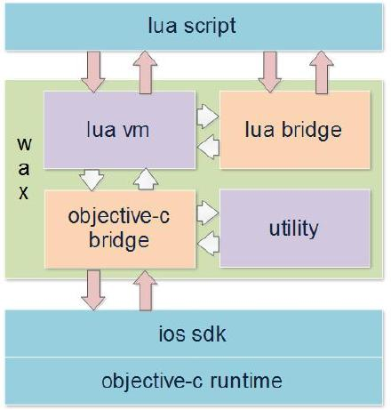
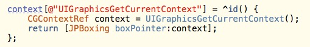
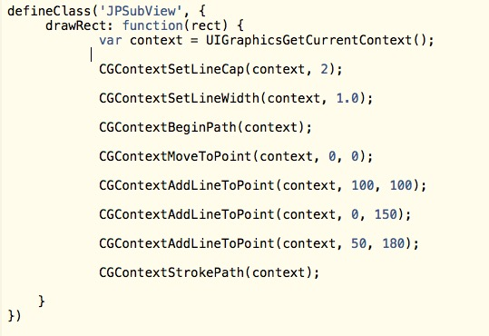

 
<!--BEGIN_DATA
{
    "create_date": "2016-08-06 14:48", 
    "modify_date": "2016-08-06 14:48", 
    "is_top": "0", 
    "summary": "JSPatch总结", 
    "tags": "iOS", 
    "file_name": "JSPatch总结.md"
}
END_DATA-->

####
原文出处：<a href='http://albert43.net/2015/07/12/JSPatch%E6%80%BB%E7%BB%93/' target='blank'>JSPatch总结</a>

###一、JSPatch介绍

####用途

iOS产品开发之中常常会遇到这种情况: 新版本上线后发现有个严重的bug，可能会导致crash率激增，可能会使网络请求无法发出，这时能做的只是赶紧修复bug然后提交等待漫长的AppStore审核，再盼望用户快点升级，付出巨大的人力和时间成本，才能完成此次bug的修复。

JSPatch的出现解决了这样的问题，只需要在项目中引入极小的JSPatch引擎，就可以使用JavaScript语言调用Objective-C的原生接口，获得脚本语言的能力：动态更新iOS APP，替换项目原生代码、快速修复bug。

####技术核心

JSPatch核心主要是JSBinding和Objective-C中的runtime技术。一方面，它采用Apple在iOS7中发布的JavaScriptCore.framework作为Javascript引擎解析JavaScript脚本，执行JavaSript代码并与Objective-C端的代码进行桥接。另一方面则是使用Objective-C runtime中的method swizzling的方式达到使用JavaScript脚本动态替换原有Objective-C方法的目的，并利用ForwardInvocation标准消息转发机制使得在JavaScript脚本中调用Objective-C的方法成为可能。

###二、JSPatch VS lua Wax

wax是可以实现动态打补丁快速修补Crash的另外一种解决方案，初衷是为了使用lua来编写iOS原生应用而诞生的一个框架。它利用lua的C语言API(可以让C代码与lua进行交互的函数集，包括读写lua全局变量的函数，调用lua函数的函数，运行lua代码片段的函数，注册C函数然后可以在lua中被调用的函数，等等)和 Objective-C 强大的runtime使lua能调用原生Objective-C接口，可以使用lua创建，继承，扩展oc类，使用lua实现oc所能实现的所有功能。

lua wax由几个部分组成:

  1. wax stdLib，是一个lua脚本库，利用前面提到的C API和Objective-C runtime向lua脚本提供与Objective-C类交互的接口;

  2. Wax Engine，提供使用Objective-C加载运行lua脚本和传递变量给lua脚本的接口;

  3. lua Compiler，即lua解释器，wax Engine调用解释器加载并编译运行lua脚本。 
   

相比于wax， JSPatch有以下的优势

  1. Javascript比lua在应用开发领域有更广泛的应用。 目前前端开发和终端开发有融合的趋势，作为扩展的脚本语言，JavaScript是不二之选。

  2. 更符合Apple的规则。iOS Developer Program License Agreement里3.3.2提到不可动态下发可执行代码，但通过苹果JavaScriptCore.framework或WebKit执行的代码除外，JS正是通过JavaScriptCore.framework执行的。

  3. 小巧。 使用系统内置的JavaScriptCore.framework，无需内嵌脚本引擎，体积小巧。而Wax需要导入c代码写的lua引擎。

  4. 支持block。  
wax在几年前就停止了开发和维护，不支持Objective-
C里block跟lua程序的互传，虽然一些第三方已经实现block，但使用时参数上也有比较多的限制。

  5. 不需要担心内存回收的问题。JavascriptCore.framework通过GC来对垃圾进行回收。而lua wax需要显式调用内存回收方法。

  6. 支持armv7 armv7s arm64框架。wax并不支持arm64框架。

而JSPatch也有自身的缺点:

  1. 不支持iOS6及以下，因为JSPatch依赖于iOS7及以后的JavascriptCore.framework (这点现在可以忽略，因为微信最低的版本要求已经是iOS7)

  2. 调用OC方法的性能慢于lua wax

  3. 启动JSPatch所占用的内存多于wax

###三、JSPatch核心原理解析

####startEngine

    [JPEngine startEngine];  
    NSString *sourcePath = [[NSBundle mainBundle] pathForResource:@"demo" ofType:@"js"];  
    NSString *script = [NSString stringWithContentsOfFile:sourcePath encoding:NSUTF8StringEncoding error:nil];  
    [JPEngine evaluateScript:script];  
    

使用JSPatch框架首先要调用`JPEngine`中的类方法`startEngine`，这个方法的是为了初始化JSContext，JSContext是J
S脚本的运行环境。JS脚本可以调用在JSContext中预先定义的方法，方法的参数/返回值都会被JavaScriptCore.framework自动转换，O
C里的NSArray，NSDictionary，NSString，NSNumber，NSBlock，[NSNull
null]会分别转为JS端的Array/Object/String/Number/function/null。

那其他无法通过JavascriptCore.framework进行bridge转换的数据类型，比如自定义的类的对象，Class类型，指针，要如何在JS和OC
两端进行传递呢？

JSPatch中使用了一个叫做JPBoxing的类去封装id、指针、Class类型变量，封装完以后这个Boxing对象会被放在一个NSDictionary里
(NSDictionary可转化为JS中的Object类型)，传递给JS代码。后面会对JPBoxing进行详细的介绍.

回到startEngine方法:

    context[@"_OC_defineClass"] = ^(NSString *classDeclaration, JSValue *instanceMethods, JSValue *classMethods) {  
            return defineClass(classDeclaration, instanceMethods, classMethods);  
        };  
          
    context[@"_OC_callI"] = ^id(JSValue *obj, NSString *selectorName, JSValue *arguments, BOOL isSuper) {  
            return callSelector(nil, selectorName, arguments, obj, isSuper);  
        };  
          
    context[@"_OC_callC"] = ^id(NSString *className, NSString *selectorName, JSValue *arguments) {  
            return callSelector(className, selectorName, arguments, nil, NO);  
        };  
    

在这里定义的函数主要是负责处理转换从JS端传过来的参数，然后在OC端运用runtime里的方法实现生成新的类、替换旧的类、调用方法等等功能。

其中`_OC_defineClass`负责定义新的类或替换原有的类，`_OC_callI`负责调用实例方法，`_OC_callC`负责调用类方法。

除了这三个函数之外，startEngine中还封装了一些常用GCD方法、console.log、sizeof、Javascript异常捕获函数等等。

准备完JSContext之后，就可以加载从网络中下载的JS补丁，调用`[JPEngeine evaluateScript:script]`方法执行脚本。

####defineClass

接下来讲解JSPatch中如何定义一个类以及怎么覆盖原方法或新增一个方法。

    defineClass('JPViewController', {  
      handleBtn: function(sender) {  
        var tableViewCtrl = JPTableViewController.alloc().init()  
        self.navigationController().pushViewController_animated(tableViewCtrl, YES)  
      }  
    }, {})  
    

`defineClass`函数可接受三个参数：

  1. 字符串:”需要替换或者新增的类名:继承的父类名 <实现的协议1，实现的协议2>”
  2. {实例方法}
  3. {类方法}

将这三个参数通过bridging传入到OC后，执行以下步骤:

  1. 使用NSScanner分离classDeclaration，分离成三部分
    * 类名 : className
    * 父类名 : superClassName
    * 实现的协议名 : protocalNames
  2. 使用NSClassFromString(className)获得该Class对象。
    * 若该Class对象为nil，则说明JS端要添加一个新的类，使用`objc_allocateClassPair`与`objc_registerClassPair`注册一个新的类。
    * 若该Class对象不为nil，则说明JS端要替换一个原本已存在的类
  3. 根据从JS端传递来的实例方法与类方法参数，为这个类对象添加/替换实例方法与类方法
    * 添加实例方法时，直接使用上一步得到class对象; 添加类方法时需要调用`objc_getMetaClass`方法获得元类。
    * 如果要替换的类已经定义了该方法，则直接对该方法替换和实现消息转发。
    * 否则根据以下两种情况进行判断
      * 遍历protocalNames，通过`objc_getProtocol`方法获得协议对象，再使用`protocol_copyMethodDescriptionList`来获得协议中方法的type和name。匹配JS中传入的selectorName，获得typeDescription字符串，对该协议方法的实现消息转发。
      * 若不是上述两种情况，则js端请求添加一个新的方法。构造一个typeDescription为”@@:\@*”(返回类型为id，参数值根据JS定义的参数个数来决定。新增方法的返回类型和参数类型只能为id类型，因为在JS端只能定义对象)的IMP。将这个IMP添加到类中。
  4. 为该类添加`setProp:forKey`和`getProp:`方法，使用`objc_getAssociatedObject`与`objc_setAssociatedObject`让JS脚本拥有设置property的能力
  5. 返回{className:cls}回JS脚本。

####overrideMethod方法

不管是替换方法还是新增方法，都是使用`overrideMethod`方法。 
 
它接受五个参数:

  * 类名
  * 要替换的方法名
  * JS中定义的方法
  * 是否类方法
  * 方法的typeDescription

原型如下
    
    static void overrideMethod(Class cls, NSString *selectorName, JSValue *function, BOOL isClassMethod, const char *typeDescription)  
    

逻辑步骤如下

  1. 初始化：更具selectorName获取对应的Selector；typeDescription获得NSMethodSignature方法签名。
  2. 保存原有方法的IMP，添加名为`@"ORIG" \+ selectorName`的方法，IMP为原方法的IMP。
  3. 将原方法的IMP设置为消息转发
    * 若该方法的返回值为特殊的struct类型，则需要将IMP设置为`(IMP)_objc_msgForward_stret`
    * 否则的话将IMP设置为`_objc_msgForward`
  4. 保存原有转发方法`forwardInvocation:`的IMP，添加selectorName为@”ORIGforwardInvocation:”，IMP为原转发方法IMP的方法。
  5. 将原转发方法替换为自己的转发方法`JPForwardInvocation`
  6. 根据替换/添加方法的返回类型，选择不同的替换IMP(使用宏的形式定义)，替换原方法。

####callSelector方法

在JS端调用OC方法时，都需要通过在OC端通过`callSelector`方法进行方法的查找以及参数类型、返回类型的转换和处理。

该方法接受五个参数

  * 调用对象的类名
  * 被调用的selectorName
  * JS中传递过来的参数
  * JS端封装的实例对象
  * 是否调用的是super类的方法

方法的原型：
    
    static id callSelector(NSString *className, NSString *selectorName, JSValue *arguments, JSValue *instance, BOOL isSuper)  
    

逻辑步骤如下

  1. 初始化
    * 将JS封装的instance对象进行拆装，得到OC的对象；
    * 根据类名与selectorName获得对应的类对象与selector；
    * 通过类对象与selector构造对应的NSMethodSignature签名，再根据签名构造NSInvocation对象，并为invocation对象设置target与Selector
  2. 根据方法签名，获悉方法每个参数的实际类型，将JS传递过来的参数进行对应的转换(比如说参数的实际类型为int类型，但是JS只能传递NSNumber对象，需要通过`[[jsObj toNumber] intValue]`进行转换)。转换后使用`setArgument方法`为NSInvocation对象设置参数。
  3. 执行invoke方法。
  4. 通过getReturnValue方法获取到返回值。
  5. 根据返回值类型，封装成JS中对应的对象(因为JS并不识别OC对象，所以返回值为OC对象的话需封装成{**className:className, **obj:obj})返回给JS端。

####JPForwardInvocation方法

JPForwardInvocation方法替换了原有`-forwardInvocation`方法的实现，使得消息转发都通过该方法，并将消息转发给JS脚本中定义的方法，通过JavascriptCore.frameWork中提供的`callWithArguments`方法调用JS方法达到替换原方法，添加新方法的目的。是实现替换和新增方法的核心。

它的原型与ForwardInvocation方法相同

    
    static void JPForwardInvocation(id slf, SEL selector, NSInvocation *invocation)  
    

它的内部逻辑并不复杂，主要是读取出传入的invocation对象中的所有参数，根据实际参数的类型将JSValue类型的参数转换成对应的OC类型，最后将参数添加到_TMPInvocationArguments数组以供JS调用。

那如果有一些类确实有用到这个方法进行消息转发（比如为了实现多继承），那原来的逻辑该怎么办？

JSPatch在替换`-forwardInvocation:`方法前会新建一个方法`-ORIGforwardInvocation:`，保存原来的实现IMP，在新的`-forwardInvocation:`实现里做了个判断，如果转发的方法是JS脚本中想改写的，就走`-JPForwardInvocation:`逻辑，若不是，就调用`-ORIGforwardInvocation:`走原来的流程。

####对象的持有/转换

> UIView.alloc() 通过上述消息传递后会到OC执行 [UIView alloc]，并返回一个UIView实例对象给JS，这个OC实例对象在JS是怎样表示的呢？怎样可以在JS拿到这个实例对象后可以直接调用它的实例方法(UIView.alloc().init())？
>
> 对于一个自定义id对象，JavaScriptCore会把这个自定义对象的指针传给JS，这个对象在JS无法使用，但在回传给OC时OC可以找到这个对象。对于这个对象生命周期的管理，按我的理解如果JS有变量引用时，这个OC对象引用计数就加1，JS变量的引用释放了就减1，如果OC上没别的持有者，这个OC对象的生命周期就跟着JS走了，会在JS进行垃圾回收时释放。传回给JS的变量是这个OC对象的指针，如果不经过任何处理，是无法通过这个变量去调用实例方法的。所以在返回对象时，JSPatch会对这个对象进行封装。
>
> 首先，告诉JS这是一个OC对象：
> 
>     static NSDictionary *toJSObj(id obj)  
>     {  
>         if (!obj) return nil;  
>         return @{@"__isObj": @(YES), @"cls": NSStringFromClass([obj class]),
@"obj": obj};  
>     }  
>  
>
> 用__isObj表示这是一个OC对象，对象指针也一起返回。接着在JS端会把这个对象转为一个 JSClass 实例：
>  
>  
>     var _formatOCToJS = function(obj) {  
>         if (obj === undefined || obj === null) return false  
>         if (typeof obj == "object") {  
>           if (obj.__obj) return obj  
>           if (obj.__isNull) return false  //注:这里是为了让JS能够链式调用  
>         }  
>         if (obj instanceof Array) {  
>           var ret = []  
>           obj.forEach(function(o) {  
>             ret.push(_formatOCToJS(o))  
>           })  
>           return ret  
>         }  
>         if (obj instanceof Function) {  
>           return function() {  
>             var args = Array.prototype.slice.call(arguments)  
>             return obj.apply(obj，_OC_formatJSToOC(args))  
>           }  
>         }  
>         if (obj instanceof Object) {  
>           var ret = {}  
>           for (var key in obj) {  
>             ret[key] = _formatOCToJS(obj[key])  
>           }  
>           return ret  
>         }  
>         return obj  
>       }  
>  
>
> 接着看看对象是怎样回传给OC的。上述例子中，view.setBackgroundColor(require(‘UIColor’).grayColor())，这里生成了一个 UIColor 实例对象，并作为参数回传给OC。根据上面说的，这个 UIColor 实例在JS中的表示是一个 JSClass实例，所以不能直接回传给OC，这里的参数实际上会在 **c 函数进行处理，会把对象的 .**obj 原指针回传给OC。

整个对象的持有/转换的流程图如下:

###四、JSPatch Extension机制

####如何在JSPatch中预定义C API供JS调用

上面已经介绍过JSPatch是运用Objective-C runtime和JSBinding技术来在JS中调用Objective-C的方法，但是C API是没法通过runtime技术来获取的。一开始的时候我想使用`dlsym`函数通过函数名来获取对应的函数指针，通过JS脚本传入C函数的函数名来进行函数调用。但实际上还需要预先定义一个相同类型的函数指针才能调用，做不到完全的动态调用。而且还有一个问题就是像CGRectMake这种，实质上是内联函数，并没有对应的函数地址。更关键的是，没有办法获取C函数的签名，而JS中调用函数是没有具体类型的，传递到OC是以JSValue对象的形式，必须通过转换才能调用对应的C函数。最后的解决方法便是预先在JSContext中提供JS方法和C函数的桥接方法。

这里以定义CGRectMake()来作为例子，如果想在JS中使用CGRectMake()函数，则需要在JPEngine启动的时候，将CGRectMake预定义在JSContext之中。

而且有一点要注意的，CGRectMake返回的并不是一个对象，而是一个struct类型的变量。struct类型是无法返回到JS环境的，所以要转换成NSDictionary的形式。

Extension中需要定义对应的方法来将struct转换成NSDictionary

    + (NSDictionary *)dictOfStruct:(void *)structData typeString:(const char*)type  
    {  
        if (strcmp(type，@encode(CGRect)) == 0) {  
            CGRect *rect = structData;  
            return @{@"x": @(rect->origin.x), @"y": @(rect->origin.y), @"width": @(rect->size.width)，@"height": @(rect->size.height)};  
        }  
        //下面接着定义其他类型的Struct  
        return nil;  
    }  
    

这样就可以在startEngine中定义CGRectMake方法了，具体如下
    
    context[@"CGRectMake"] = ^id(JSValue *x，JSValue *y，JSValue *width，JSValue *height){  
            CGRect rect = CGRectMake([x toDouble], [y toDouble], [width toDouble], [height toDouble]);  
            return [JPEngine dictOfStruct:&rect typeString:@encode(CGRect)];  
        };  
    

在JS中就可以如此调用桥接函数
    
    var frame = CGRectMake(0, 0, 200, 200)  
    

但是如果返回的值是一个**指针或者参数值为指针**要如何解决？

这时候就需要一个Boxing对象对指针和Class这些在JS中无法使用的变量类型进行装箱(box);在JS中调用OC或C方法后，传递回到Objective-
C端的再进行拆箱(unbox)。

Boxing对象的定义如下:

    
    @interface JPBoxing : NSObject  
    @property (nonatomic) id obj;  
    @property (nonatomic) void *pointer;  
    @property (nonatomic) Class cls;  
    - (id)unbox;  
    - (void *)unboxPointer;  
    - (Class)unboxClass;  
    @end  
      
    @implementation JPBoxing  
      
    #define JPBOXING_GEN(_name, _prop, _type) \  
    + (instancetype)_name:(_type)obj  \  
    {   \  
        JPBoxing *boxing = [[JPBoxing alloc] init]; \  
        boxing._prop = obj;   \  
        return boxing;  \  
    }  
      
    JPBOXING_GEN(boxObj, obj, id)  
    JPBOXING_GEN(boxPointer, pointer, void *)  
    JPBOXING_GEN(boxClass, cls, Class)  
      
    - (id)unbox  
    {  
        if (self.obj) return self.obj;  
        return self;  
    }  
    - (void *)unboxPointer  
    {  
        return self.pointer;  
    }  
    - (Class)unboxClass  
    {  
        return self.cls;  
    }  
    @end  
    

> 注意到unbox里的一个`return self`的写法，这里是一个trick。因为前面介绍到的`formatJSToOC`函数的定义如下
> 
>     id formatJSToOC(JSValue *jsval)  
> 
> 这个函数需要负责处理JS到OC端的类型转换，但是如果变量类型是指针或者Class类型的话就和无法和id类型写在同一个处理函数里。所以如果是JPBoxing中的obj为nil，则说明是非id类型，直接返回这个JPBoxing。外部得到的这个JPBoxing对象，则再进行相应类型拆箱。

使用这个Boxing类，调用Extension中的C API时，对指针拆箱，再调用实际的C方法; 返回时，对JS中无法使用的类型进行装箱后再返回;根据这个机制便可实现对大部分C API的封装。下面以`UIGraphicsGetCurrentContext()`为例:

  

效果如下：

####使用JPExtesnion扩展机制对C API和Struct进行扩展

在上一节，我对如何在JSPatch中调用C API进行了介绍。 但是面对大量的C API，需要一个满足以下需求的扩展机制：

  1. 可模块化加载
  2. js脚本可动态加载
  3. 可以在extension中添加struct类型

以下是JPExtension协议的定义，所有的C API扩展都需要继承JPExtension协议

    @protocol JPExtensionProtocol <NSObject>  
    @optional  
    - (void)main:(JSContext *)context;  
      
    - (size_t)sizeOfStructWithTypeName:(NSString *)typeName;  
    - (NSDictionary *)dictOfStruct:(void *)structData typeName:(NSString *)typeName;  
    - (void)structData:(void *)structData ofDict:(NSDictionary *)dict typeName:(NSString *)typeName;  
    @end  
    

开发者可在`\- (void)main:(JSContext *)context`中添加C API，C API会被添加到JS所在的执行环境中。而后面的三个方法从方法名可以知道，extension中如果要定义struct的话则需要实现这三个方法。因为JS中是无法定义和使用c struct的，所以需要提供相应的互相转换方法(struct与NSDictionary互相转换)，具体实现以`CGAffineTransform`为例：
    
    - (size_t)sizeOfStructWithTypeName:(NSString *)typeName  
    {  
        if ([typeName rangeOfString:@"CGAffineTransform"].location != NSNotFound) {  
            return sizeof(CGAffineTransform);  
        }  
        return 0;  
    }  
      
    - (NSDictionary *)dictOfStruct:(void *)structData typeName:(NSString *)typeName  
    {  
        if ([typeName rangeOfString:@"CGAffineTransform"].location != NSNotFound) {  
            CGAffineTransform *trans = (CGAffineTransform *)structData;  
            return [JPCGTransform transDictOfStruct:trans];  
        }  
        return nil;  
    }  
      
    - (void)structData:(void *)structData ofDict:(NSDictionary *)dict typeName:(NSString *)typeName  
    {  
        if ([typeName rangeOfString:@"CGAffineTransform"].location != NSNotFound) {  
            [JPCGTransform transStruct:structData ofDict:dict];  
        }  
    }  
    

实现了这三个方法后，JPEngine会将实现了这三个方法extesnion放入_structExtension内。当在JS中调用含有相关struct的方法时，JSEngine会遍历整个_structExtension，找到相应的转换方法。

根据JPExtension协议，模块化加载就变得非常简单：
    
    - (void)main:(JSContext *)context  
    {  
        NSArray *extensionArray = @[[JPCGTransform instance], [JPCGContext instance],   
                                                [JPCGGeometry instance], [JPCGBitmapContext instance],   
                                                [JPCGColor instance], [JPCGImage instance], [JPCGPath instance]];  
        [JPEngine addExtensions:extensionArray];  
    }  
    

在JS脚本则可以这样调用：
    
    
    (function init() {  
        var extensionArr = [require('JPCoreGraphics').instance(), require('JPUIKit').instance()]  
        require('JPEngine').addExtensions(extensionArr)  
    })()  
    

当然，为了提高项目的性能，你也可以只调用你需要的模块。

####C API定义时需要注意的问题

C API中，有大量的参数或者是返回类型都是指针，包括像CGContextRef这种也是指针，而OC对象在JS环境中也是无法使用的。上面的章节已经提到了从OC端返回给JS端时必须用一个封装对象(JPBoxing)来将指针和对象封装起来。JPExtension提供了以下API来封装OC中的对象和指针成JPBoxing和将JPBoxing对象。

    - (void *)formatPointerJSToOC:(JSValue *)val;  
    - (id)formatPointerOCToJS:(void *)pointer;  
    - (id)formatJSToOC:(JSValue *)val;  
    - (id)formatOCToJS:(id)obj;  
    

C API封装实例:
    
    context[@"UIGraphicsGetCurrentContext"] = ^id() {  
            CGContextRef c = UIGraphicsGetCurrentContext();  
            return [self formatPointerOCToJS:c];  
        };  
      
    context[@"UIGraphicsBeginImageContext"] = ^void(NSDictionary *sizeDict) {  
            CGSize size;  
            [JPCGGeometry sizeStruct:&size ofDict:sizeDict];  
            UIGraphicsBeginImageContext(size);  
        };  
    

注意到`UIGraphicsGetCurrentContext()`中返回的是一个CGContextRef类型，所以添加这个扩展API的时候需要将返回类型改为id类型，并将CGContextRef指针封装在JPBoxing中。而`UIGraphicsBeginImageContext()`需要的是一个CGSize参数，这时候需要在JS端传入一个`{x:100, y:100}`的Javascriptobject，这个object会在OC中被转换为NSDictionary.

C API的返回值也需要判断返回值的类型来进行不同的封装，当返回的结果是JavascriptCore.Framework所不支持转换的类型(NSArray，NSDictionary，NSString，NSNumber，NSBlock)，则需要通过`formatOCToJS:`方法来封装返回。而且返回类型是NSArray，NSDictionary，NSString时，如果你直接返回，JavascriptCore会将返回值转换为JS中的Array，Object，String，你就无法再使用OC的方法。如果你想在JS中使用这三种类型的方法，也需要用`formatOCToJS:`方法进行封装。

####在JSPatch中的操作内存与&取地址运算符

与C语言不同，Javascript不能显式的声明一个指向某块内存的指针，也没有`&`取地址运算符，Javascript是根据参数是引用类型还是基本类型决定传递引用还是传参。但是指针与取地址在C语言以及OC中都会时常被用到。比如如下的情况:

    ......  
    NSString *str = @"littleliang";  
    [invocation setArgument:&str atIndex:2];  
    ......  
    

JPMemory扩展解决了这个问题，其中封装了内存操作中常用的一些常用的c函数。包括`malloc`，`memset`，`free`，`memcpy`，`memncpy`，`memmove`。

而对`&`取地址运算符，JPMemory扩展也进行了函数封装，在JS补丁中可以对调用`getpointer`方法获取对象的指针、指针的指针，针对上述的代码，现在便可以以以下的形式调用。

    ......  
    var str = require('NSString').stringWithString('littleliang')  
    invocation.setArgument_atIndex(getpointer(str)，2)  
    ......  
    

getpointer的底层源码如下:
    
    - (void *)getPointerFromJS:(JSValue *)val  
    {  
        void **p = malloc(sizeof(void *));  
        if ([[val toObject] isKindOfClass:[NSDictionary class]]) {  
            if ([[val toObject][@"__obj"] isKindOfClass:[JPBoxing class]]) {  
                void *pointer = [(JPBoxing *)[val toObject][@"__obj"] unboxPointer];  
                if (pointer != NULL) {  
                    *p = pointer;  
                }else {  
                    id jpobj = [(JPBoxing *)[val toObject][@"__obj"] unbox];  
                    *p = (__bridge void *)jpobj;  
                }  
            }else {  
                id obj = [val toObject][@"__obj"];  
                *p     = (__bridge void *)obj;  
            }  
            return p;  
        }else {  
            NSAssert(NO, @"getpointer only support pointer and id type!");  
            return NULL;  
        }  
    }  
    

而通过JPMemory中的pval或添加pvalWithXXX便可获得指针所指的对象或XXX类型的变量。

     context[@"pval"]    = ^id(JSValue *jsVal) {  
            void *m = [self formatPointerJSToOC:jsVal];  
            id obj = *((__unsafe_unretained id *)m);  
            return [self formatOCToJS:obj];  
        };  
         
    context[@"pvalWithBool"] = ^id(JSValue *jsVal) {  
            void *m = [self formatPointerJSToOC:jsVal];  
            BOOL b = *((BOOL *)m);  
            return [self formatOCToJS:[NSNumber numberWithBool:b]];  
        };  
    

####include函数

在JSPatch最新的更新中，支持了在JS中调用include方法。可以在一个JS文件中加载其他JS文件，包括补丁脚本、第三方脚本。

使用方法如下:

   
    (function init() {  
        var extensionArr = [require('JPInclude').instance()]  
        require('JPEngine').addExtensions(extensionArr)  
        include('another.js')  
    })()  
    

在我自己的分支中，include函数支持加载选项。默认加载选项是兼容方式加载（为满足支持OC，会通过正则表达式替换部分函数的调用方法），而第三方库是不需要被改变的。第二个参数是加载选项，默认是0或者不传入第二个参数，加载第三方库是1。

    
    (function init() {  
        include('thridparty.js', 1)  
    })()  
    

###五、JSPatch中的实现技巧

####GCD的实现

JSPatch采用的是预先在JSContext中封装了对GCD的调用，才能在JS中使用GCD，其代码如下。

    __weak JSContext *weakCtx = context;  
      context[@"dispatch_after"] = ^(double time, JSValue *func) {  
          JSValue *currSelf = weakCtx[@"self"];  
          dispatch_after(dispatch_time(DISPATCH_TIME_NOW, (int64_t)(time * NSEC_PER_SEC)), dispatch_get_main_queue(), ^{  
              JSValue *prevSelf = weakCtx[@"self"];  
              weakCtx[@"self"] = currSelf;  
              [func callWithArguments:nil];  
              weakCtx[@"self"] = prevSelf;  
          });  
      };  
      context[@"dispatch_async_main"] = ^(JSValue *func) {  
          JSValue *currSelf = weakCtx[@"self"];  
          dispatch_async(dispatch_get_main_queue(), ^{  
              JSValue *prevSelf = weakCtx[@"self"];  
              weakCtx[@"self"] = currSelf;  
              [func callWithArguments:nil];  
              weakCtx[@"self"] = prevSelf;  
          });  
      };  
      context[@"dispatch_sync_main"] = ^(JSValue *func) {  
          if ([NSThread currentThread].isMainThread) {  
              [func callWithArguments:nil];  
          } else {  
              dispatch_sync(dispatch_get_main_queue(), ^{  
                  [func callWithArguments:nil];  
              });  
          }  
      };  
      context[@"dispatch_async_global_queue"] = ^(JSValue *func) {  
          JSValue *currSelf = weakCtx[@"self"];  
          dispatch_async(dispatch_get_global_queue(0, 0), ^{  
              JSValue *prevSelf = weakCtx[@"self"];  
              weakCtx[@"self"] = currSelf;  
              [func callWithArguments:nil];  
              weakCtx[@"self"] = prevSelf;  
          });  
      };  
    

其中有三点需要注意：

  1. 在block里是不能直接使用context的，因为会造成循环引用。所以在这里有两个处理方式，要么是使用__weak修饰符，要么就是使用JavascriptCore.framework提供的api `[JSContext currentContext]`。

  2. 在调用JSContext的`callWithArguments:`实例方法时，需要先保存JSContext中的实例对象`self`，调用完之后再重新赋值回去。否则在调用完JS方法后，`self`会变成nil

  3. 还有一点就是在`dispatch_sync_main`这个方法里，作者对代码所在的运行线程进行了一个判断，如果已经在主线程中就直接执行这个block，防止了死锁的发生。

####处理JS脚本的异常

如果JS脚本出现了异常的话，在OC这边是不会知道的，需要使用JavaScriptCore.framwork中的exceptionHandler才能捕获这个异常，具体代码如下

    context.exceptionHandler = ^(JSContext *con, JSValue *exception) {  
            NSLog(@"%@", exception);  
            NSAssert(NO, @"js exception: %@", exception);  
        };  
    

####使用#pragma来抑制warning

作者使用#pargama宏来对一些warning进行了抑制，详细的介绍可以看参考[Matt Thomson写的一篇关于clang diagnostics的文章](http://nshipster.cn/clang-diagnostics/)，里面提供了一个[网站](http://fuckingclangwarnings.com/)详细地记录了抑制各种warning的写法。

####使用宏来预定义IMP函数

由于要替换原有的函数实现，所以要预先定义好各种返回类型的IMP函数。如果全部写出来的话，将会耗费大量篇幅来写差不多的函数实现，这里作者使用了宏来进行替换，具
体代码如下
    
    #define JPMETHOD_IMPLEMENTATION(_type, _typeString, _typeSelector) \  
        JPMETHOD_IMPLEMENTATION_RET(_type, _typeString, return [[ret toObject] _typeSelector]) \  
      
    #define JPMETHOD_IMPLEMENTATION_RET(_type, _typeString, _ret) \  
    static _type JPMETHOD_IMPLEMENTATION_NAME(_typeString) (id slf, SEL selector) {    \  
        JSValue *fun = getJSFunctionInObjectHierachy(slf, selector);    \  
        JSValue *ret = [fun callWithArguments:_TMPInvocationArguments];  \  
        _ret;    \  
    }   \  
      
    #define JPMETHOD_IMPLEMENTATION_NAME(_typeString) JPMethodImplement_##_typeString  
      
    #pragma clang diagnostic push  
    #pragma clang diagnostic ignored "-Wunused-variable"  
      
    #define JPMETHOD_RET_ID \  
        id obj = formatJSToOC(ret); \  
        if ([obj isKindOfClass:[NSNull class]]) return nil;  \  
        return obj;  
      
    #define JPMETHOD_RET_STRUCT(_methodName)    \  
        id dict = formatJSToOC(ret);   \  
        return _methodName(dict);  
      
    JPMETHOD_IMPLEMENTATION_RET(void, v, nil)  
    JPMETHOD_IMPLEMENTATION_RET(id, id, JPMETHOD_RET_ID)  
    JPMETHOD_IMPLEMENTATION_RET(CGRect, rect, JPMETHOD_RET_STRUCT(dictToRect))  
    JPMETHOD_IMPLEMENTATION_RET(CGSize, size, JPMETHOD_RET_STRUCT(dictToSize))  
    JPMETHOD_IMPLEMENTATION_RET(CGPoint, point, JPMETHOD_RET_STRUCT(dictToPoint))  
    JPMETHOD_IMPLEMENTATION_RET(NSRange, range, JPMETHOD_RET_STRUCT(dictToRange))  
    ......  
    

