 
<!--BEGIN_DATA
{
    "create_date": "2017-01-18 13:53", 
    "modify_date": "2017-01-18 13:53", 
    "is_top": "0", 
    "summary": "JVM源码分析", 
    "tags": "Java", 
    "file_name": "JVM源码分析.md"
}
END_DATA-->

####<p>原文出处：<a href='http://www.jianshu.com/p/eaef248b5a2c' target='blank'>JVM内存的那些事</a></p>

对于C语言开发的程序员来说，在内存管理方面，必须负责每一个对象的生命周期，从有到无。  
对于Java程序员你来说，在虚拟机内存管理的帮助下，不需要为每个new对象都匹配free操作，内存泄露和内存溢出等问题也不太容易出现，不过也正是因为把内存管
理交给了虚拟机，一旦运行中的程序出现了内存泄露问题，给排查过程造成很大困难。所以只有理解了Java虚拟机的运行机制，才能够运筹帷幄于各种代码。本文以HotSpot为例说说虚拟机的那些事。

JAVA虚拟机把管理的内存划分为几个不同的数据区。  

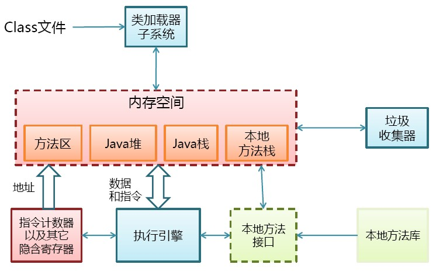  

#####Java堆

Java堆是被所有线程共享的一块内存区域，主要用于存放对象实例，Java虚拟机规范中有这样一段描述：所有的对象实例和数据都要在堆上进行分配。为对象分配内存就
是把一块大小确定的内存从堆内存中划分出来，通常有两种方法实现：

1 、**指针碰撞法**  
假设Java堆中内存时完整的，已分配的内存和空闲内存分别在不同的一侧，通过一个指针作为分界点，需要分配内存时，仅仅需要把指针往空闲的一端移动与对象大小相等的
距离。

2、**空闲列表法**  
事实上，Java堆的内存并不是完整的，已分配的内存和空闲内存相互交错，JVM通过维护一个列表，记录可用的内存块信息，当分配操作发生时，从列表中找到一个足够大
的内存块分配给对象实例，并更新列表上的记录。

对象创建是一个非常频繁的行为，进行堆内存分配时还需要考虑多线程并发问题，可能出现正在给对象A分配内存，指针或记录还未更新，对象B又同时分配到原来的内存，解决这个问题有两种方案：  
1、采用CAS保证数据更新操作的原子性；  
2、把内存分配的行为按照线程进行划分，在不同的空间中进行，每个线程在Java堆中预先分配一个内存块，称为本地线程分配缓冲（Thread Local Allocation Buffer, TLAB）;

#####Java栈

Java栈是线程私有的，每个线程对应一个Java栈，每个线程在执行一个方法时会创建一个对应的栈帧（Stack Frame），栈帧负责存储局部变量变量表、操作数栈、动态链接和方法返回地址等信息。每个方法的调用过程，相当于栈帧在Java栈的入栈和出栈过程。

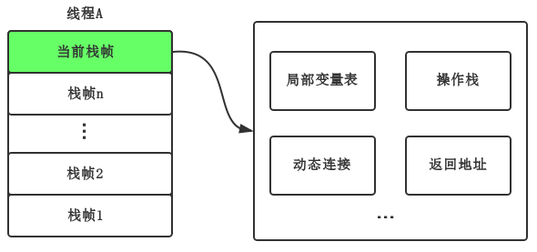  

**局部变量表** 用于存放方法参数和方法内部定义的局部变量，其大小在代码编译期间已经确定，在方法运行期间不会改变。局部变量表以变量槽（Slot）为最小存储单位，每个Slot能够存放一个boolean、byte、char、shot、int、float、reference和returnAddress类型的32位数据，对于64位的数据类型long和double，虚拟机会以高位对齐的方式为其分配两个连续的Slot空间。

在方法执行时，如果是实例方法，即非static方法，局部变量表中第0位Slot默认存放对象实例的引用，在方法中可以通过关键字 this 进行访问，方法参数按照参数列表顺序，从第1位Slot开始分配，方法内部变量则按照定义顺序进行分配其余的Slot。

    
    
    class test {
        public int calc(int a, int b, String operation) {
            operation = "+";
            return  a + b;
        }
        public void main(String args[]) {
            calc(100, 200, "+");
        }
    }

对应的局部变量表如下：  

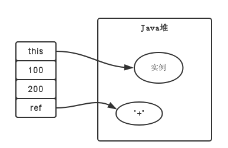  

  
使用 javap -c 命令查看方法calc的字节码  

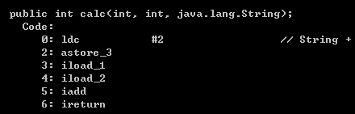  

其中iload_1和iload_2分别从局部变量表中的第1位和第2位中加载数据。

#####方法区

方法区和Java堆一样，是所有线程共享的内存区域，用于存放已被虚拟机加载的类信息、常量、静态变量和即时编译器编译后的代码等数据。  
运行时常量池是方法区的一部分，用于存放编译期间生成的各种字面常量和符号引用。

#####指令计数器

指令计数器是线程私有的，每个线程都有独立的指令计数器，计数器记录着虚拟机正在执行的字节码指令的地址，分支、循环、跳转、异常处理和线程恢复等操作都依赖这个计数器完成。如果线程执行的是native方法，这个计数器则为空。

#####对象的内存布局

对象在内存中布局可以分成三块区域：对象头、实例数据和对齐填充。  
1、**对象头**  
对象头包括两部分信息：运行时数据和类型指针，如果对象是一个数组，还需要一块用于记录数组长度的数据。

1.1、运行时数据包括哈希码（HashCode）、GC分代年龄、锁状态标志、线程持有的锁、偏向锁ID和偏向时间戳等，这部分数据在32位和64位虚拟机中的长度分别为32bit和64bit，官方称为"Mark Word"。Mark Word被设计成非固定的数据结构，以实现在有限空间内保存尽可能多的数据。  
32位的虚拟机中，对象未被锁定的状态下，Mark
Word的32bit中25bit存储对象的HashCode、4bit存储对象分代年龄、2bit存储锁标志位、1bit固定为0，具体如下：  

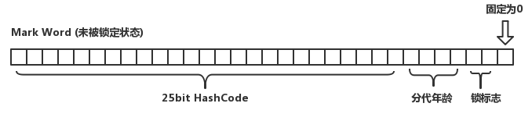  

  
其它状态（轻量级锁定、重量级锁定、GC锁定、可偏向锁）下Mark Word的存储内容如下：  

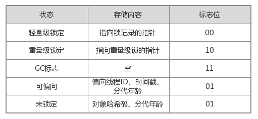  

  
1.2、对象头的类型指针指向该对象的类元数据，虚拟机通过这个指针可以确定该对象是哪个类的实例。

2、**实例数据**  
实例数据就是在程序代码中所定义的各种类型的字段，包括从父类继承的，这部分的存储顺序会受到虚拟机分配策略和字段在源码中定义顺序的影响。  

3、**对齐填充**  
由于HotSpot的自动内存管理要求对象的起始地址必须是8字节的整数倍，即对象的大小必须是8字节的整数倍，对象头的数据正好是8的整数倍，所以当实例数据不够8字节整数倍时，需要通过对齐填充进行补全。


<hr>


####<p>原文出处：<a href='http://www.jianshu.com/p/252e27863822' target='blank'>JVM源码分析之Java类的加载过程</a></p>

####背景

最近对Java细节的底层实现比较感兴趣，如Java类文件是如何加载到虚拟机的，类对象和方法是以什么数据结构存在于虚拟机中？虚方法、实例方法和静态方法是如何调
用的？本文基于openjdk-7的OpenJDK实现Java类在HotSpot的内部实现进行分析。

####HotSpot内存划分

在HotSpot实现中，内存被划分成Java堆、方法区、Java栈、本地方法栈和PC寄存器几个部分：  
1、Java栈和本地方法栈用于方法之间的调用，进栈出栈的过程；  
2、Java堆用于存放对象，在Java中，所有对象的创建都在堆上申请内存，并被GC管理；  
3、方法区分成PermGen和CodeCache：PermGen存放Java类的相关信息，如静态变量、成员方法和抽象方法等；CodeCache存放JIT编译
之后的本地代码；

更详细的相关内容可以阅读[《JVM内存的那些事》](http://www.jianshu.com/p/eaef248b5a2c)

####HotSpot对象模型

HotSpot JVM并没有根据Java对象直接通过虚拟机映射到新建的C++对象，而是设计了一个oop/klass model，其中oop为Ordinary
Object Pointer，用来表示对象的实例信息；klass用来保存描述元数据。

#####Klass

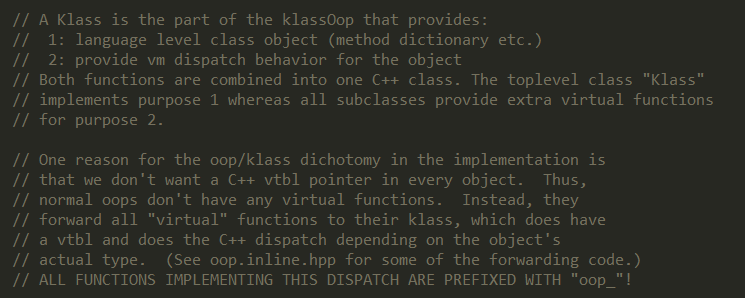  

关于为何要设计oop/klass这种二分模型的实现，一个原因是不想让每个对象都包含vtbl(虚方法表)，其中oop中不含有任何虚函数，虚函数表保存于klass中，可以进行method dispatch。

#####oop

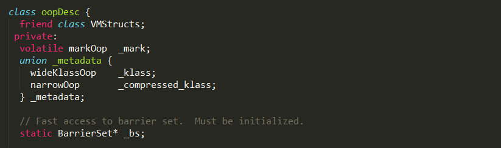  

oopDesc对象包含两部分数据：_mark 和 _metadata；  
1、_mark是markOop类型对象，用于存储对象自身的运行时数据，如哈希码（HashCode）、GC分代年龄、锁状态标志、线程持有的锁、偏向线程ID、偏向时间戳等等，占用内存大小与虚拟机位长一致，更具体的实现可以阅读
[java对象头的HotSpot实现分析](http://www.jianshu.com/p/9c19eb0ea4d8)。  
2、_metadata是一个结构体，wideKlassOop和narrowOop都指向InstanceKlass对象，其中narrowOop指向的是经过压缩的对象；  
3、_klass字段建立了oop对象与klass对象之间的联系；

####HotSpot如何加载并解析class文件

class文件在虚拟机的整个生命周期包括加载、验证、准备、解析、初始化、使用和卸载7个阶段，通过`ClassLoader.loadClass`方法可以手动加载一个Java类到虚拟机中，并返回Class类型的引用。  

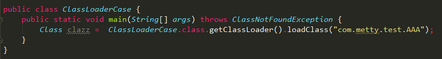  

这里并没有自定义类加载器，而是利用ClassLoaderCase的类加载器进行加载类AAA。

######loadClass方法实现

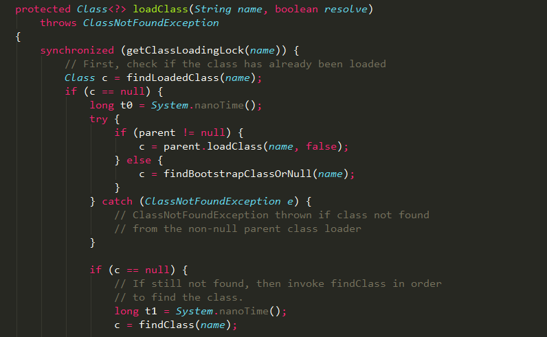  

1、loadClass方法实现了双亲委派的类加载机制，如果需要自定义类加载器，建议重写内部的findClass方法，而非loadClass方法；  
2、通过debug，可以发现loadClass方法最终会执行native方法`defineClass1`进行类的加载，即读取对应class文件的二进制数据到虚拟机中进行解析；

######class文件的解析

Java中的defineClass1方法是个native方法，说明依赖于底层的实现，在HotSpot中，其实现位于`ClassLoader.c`文件中，最终调用`jvm.cpp`中的`jvm_define_class_common`方法实现，核心的实现逻辑如下：

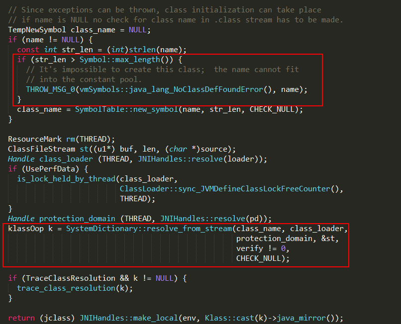  

1、验证全限定类名的长度，最大为`(1 << 16) -1`，如果长度超过**65535**，就会抛出`java/lang/NoClassDefFoundError`异常，主要原因是constant pool不支持这么长的字符串；  
2、`SystemDictionary::resolve_from_stream`处理stream数据流，并生成Klass对象。内部通过`ClassFile
Parser.cpp`的parseClassFile方法对class文件的数据流进行解析，代码实在实在实在实在太长，有兴趣的同学可以阅读完整的实现，大概的过
程如下：  
1、验证当前magic为`0xCAFEBABE`;  
2、获取class文件的minor_version、major_version，并判断当前虚拟机是否支持该版本；  
3、通过`parse_constant_pool`方法解析当前class的常量池；  
4、解析当前class的access_flags；  
5、解析当前class的父类；  
6、解析当前class的接口；  
7、....

好吧，我得承认这块逻辑很复杂...  
class数据流解析完成后，通过`oopFactory::new_instanceKlass`创建一个与之对应的instanceKlass对象，new_instanceKlass实现如下：  

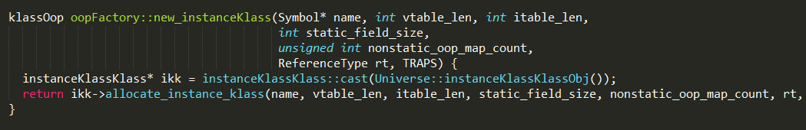  

1、其中`instanceKlassKlass::allocate_instance_klass`方法会初始化一个空instanceKlass对象，并由后续逻辑进行数据的填充；  
2、但是发现该方法的返回类型并非是instanceKlass，而是klassOop类型；  
3、allocate_instance_klass方法的实现如下：

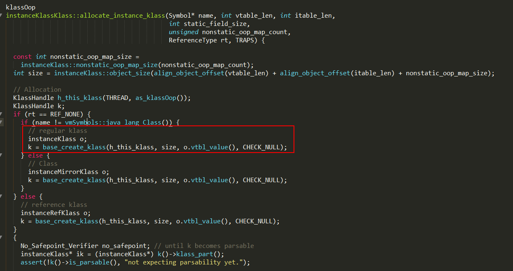  

1、base_create_klass方法最终通过`Klass::base_create_klass_oop`方法创建Klass对象，这里是instanceKlass对象，并返回对应的klassOop；  
2、`k()->klass_part()`获取对应的Klass对象，并强制转换成instanceKlass类型的对象；  
3、设置instanceKlass对象的默认值；

#####Klass对象如何创建？

上述的instanceKlass对象由`Klass::base_create_klass_oop`方法进行创建，实现如下：

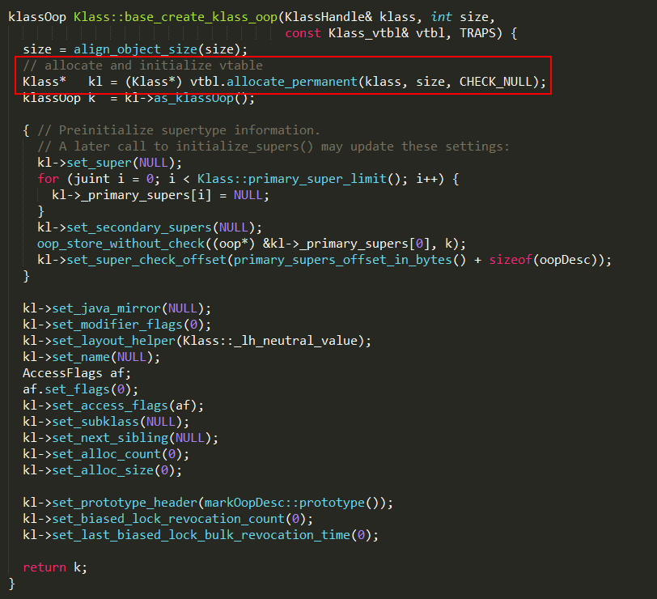  

1、`allocate_permanent`方法默认在PermGen分配内存，instanceKlass对象保存在永久代区域；  
2、Klass的as_klassOop方法可以获取对应的klassOop，那klassOop到底是什么？

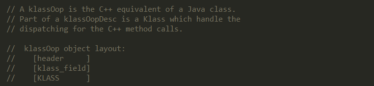  

klassOop相当于Java中的class，一个klassOop对象包含header、klass_field和Klass。

####instanceKlass

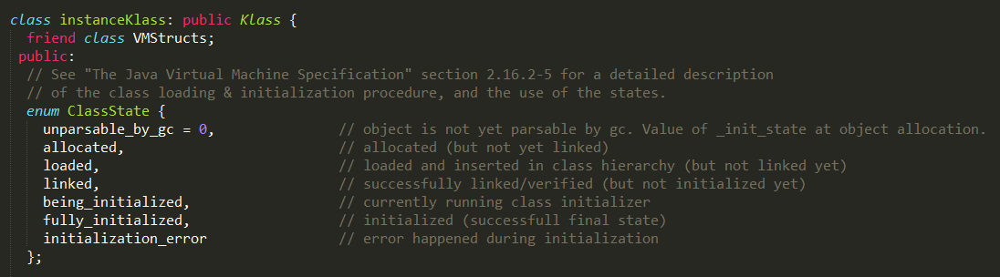  

可以发现，每个instanceKlass对象都有一个ClassState状态，用来标识当前class的加载进度，另外instanceKlass对象中包含了如
下字段，描述class文件的信息。

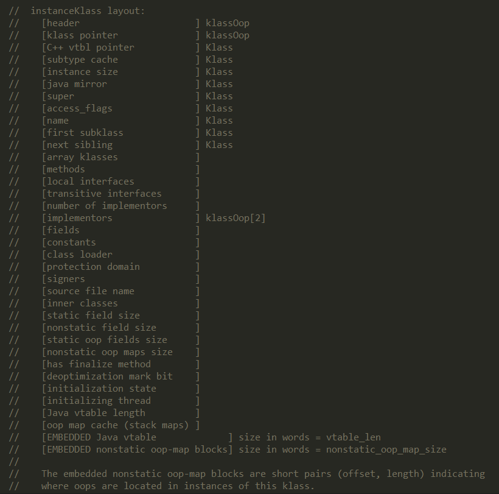  

####instanceKlassKlass

instanceKlassKlass在实现上继承了klassKlass类

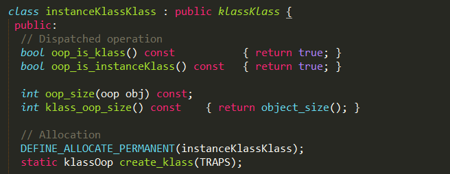  

全局只存在一个instanceKlassKlass对象，虚拟机启动时，会在`Universe::genesis`方法中初始化。

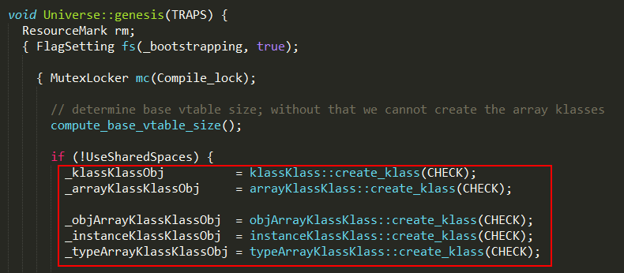  

虚拟机中所有instanceKlass对象的_klass字段都指向该instanceKlassKlass对象，其初始化过程如下：  

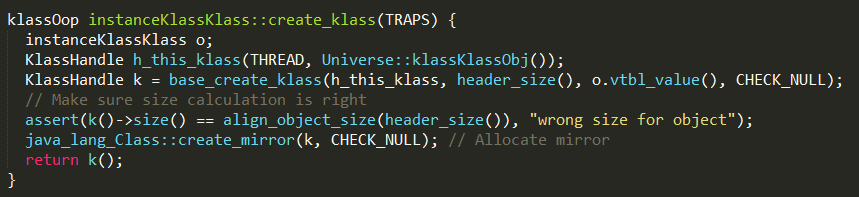  

1、方法`Universe::klassKlassObj()`获取klassKlass对象；  
2、方法`base_create_klass`负责创建instanceKlassKlass对象，并返回对应的klassOop；  
3、方法`java_lang_Class::create_mirror`分配mirror，类似于一个镜像，在java层面可以访问到；

####klassKlass

klassKlass在实现上继承了Klass类

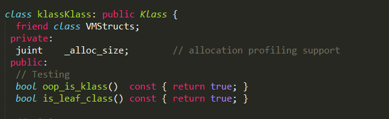  

和instanceKlassKlass一样，klassKlass对象也是全局唯一的，虚拟机启动时，会在`Universe::genesis`方法中初始化，其
初始化过程如下：  

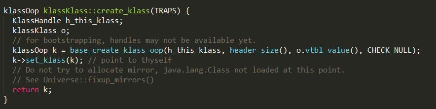  

1、通过`base_create_klass`创建klassKlass对象，并返回对应的klassOop；  
2、set_klass方法把自身设置成_klass；


<hr>


####<p>原文出处：<a href='http://www.jianshu.com/p/0009aaac16ed' target='blank'>JVM源码分析之Java对象的创建过程</a></p>

接着上篇[《JVM源码分析之Java类加载过程》](http://www.jianshu.com/p/252e27863822)，本文将基于HotSpot实现对Java对象的创建过程进行深入分析。

定义两个简单的类AAA和BBB  

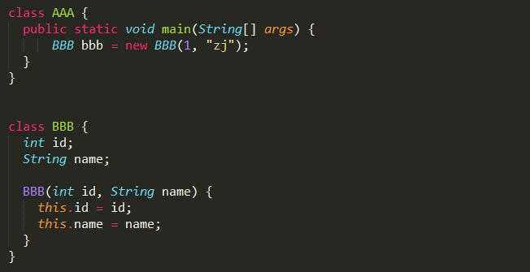  

通过``javap -c AAA```查看编译之后的字节码，具体如下：

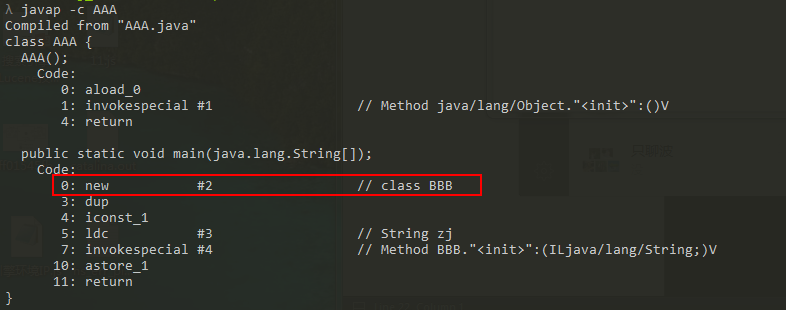  

Java中的new关键字对应jvm中的new指令，定义在InterpreterRuntime类中，实现如下：

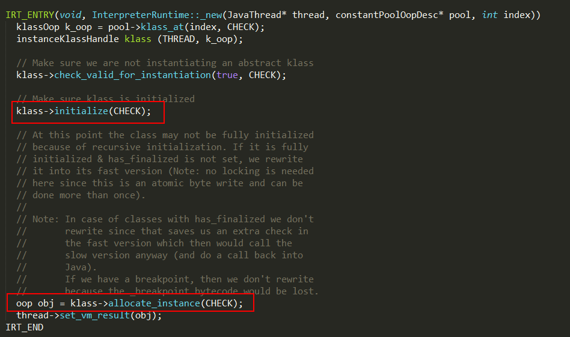  

new指令的实现过程：  
1、其中pool是AAA的constantpool，此时AAA的class已经加载到虚拟机中，new指令后面的`#2`表示BBB类全限定名的符号引用在constant pool的位置；  
2、方法`pool->klass_at`负责返回BBB对应的klassOop对象，实现如下：

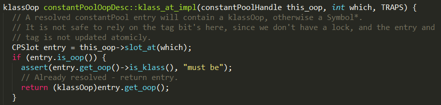  

如果常量池中指定位置（#2）的数据已经是个oop类型，说明BBB的class已经被加载并解析过，则直接通过`(klassOop)entry.get_oop()`返回klassOop；否则表示第一次使用BBB，需要解析BBB的符号引用，并加载BBB的class类，生成对应的instanceKlass对象，并更新constant pool中对应位置的符号引用；  
3、`klass->check_valid_for_instantiation`可以防止抽象类被实例化；  
4、`klass->initialize`实现如下：

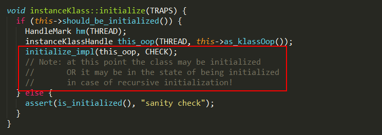  

如果BBB的instanceKlass对象已经初始化完成，则直接返回；否则通过`initialize_impl`方法进行初始化，整个初始化算法分成11步，具体实现如下：

######step1

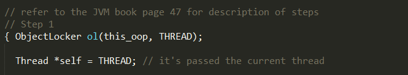  

通过ObjectLocker在初始化之前进行加锁，防止多个线程并发初始化。

######step2

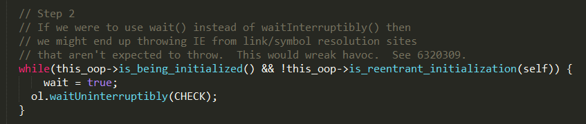  

如果当前instanceKlass处于being_initialized状态，且正在被其它线程初始化，则执行`ol.waitUninterruptibly`等待其他线程完成后通知。

######step3

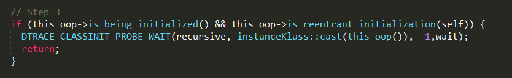  

如果当前instanceKlass处于being_initialized状态，且被当前线程初始化，则直接返回。  
其实对于这个step的处理我有疑问，什么情况会走到这一步？经过[RednaxelaFX大大](https://www.zhihu.com/people/rednaxelafx/answers)提点，如下情况会执行step3：  
例如A类有静态变量指向一个new B类实例，B类里又有静态变量指向new A类实例，这样外部用A时要初始化A类，初始化过程中又要触发B类初始化，B类初始化又再次触发A类初始化。

######step4

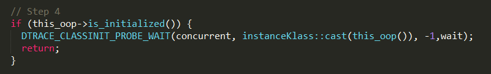  

如果当前instanceKlass处于fully_initialized状态，说明已经初始化完成，则直接返回；

######step5

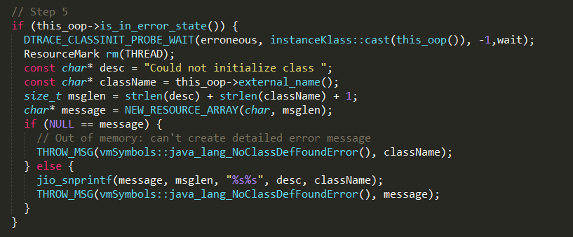  

如果当前instanceKlass处于initialization_error状态，说明初始化失败了，抛出异常。

######step6

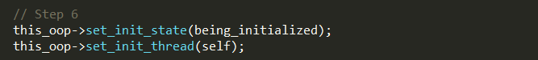  

设置当前instanceKlass的状态为 **being_initialized**；设置初始化线程为当前线程。

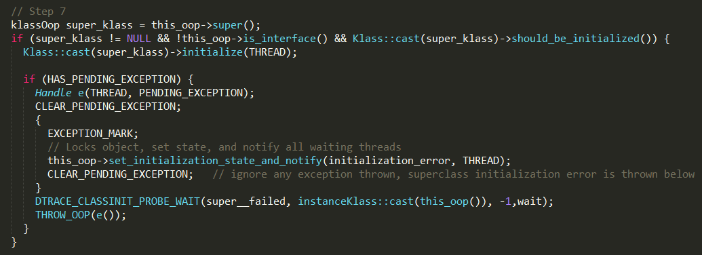  

如果当前instanceKlass不是接口类型，并且父类不为空，且还未初始化，则执行父类的初始化。

######step8

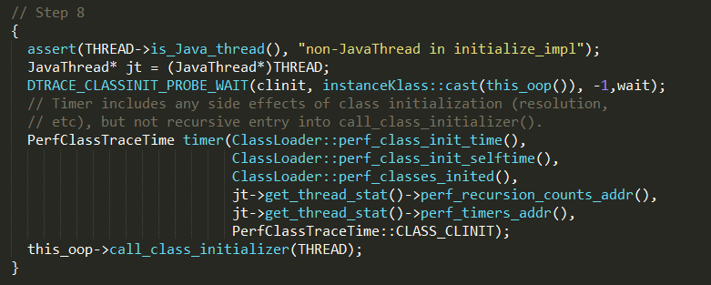  

通过`this_oop->call_class_initializer`方法执行静态块代码，实现如下：

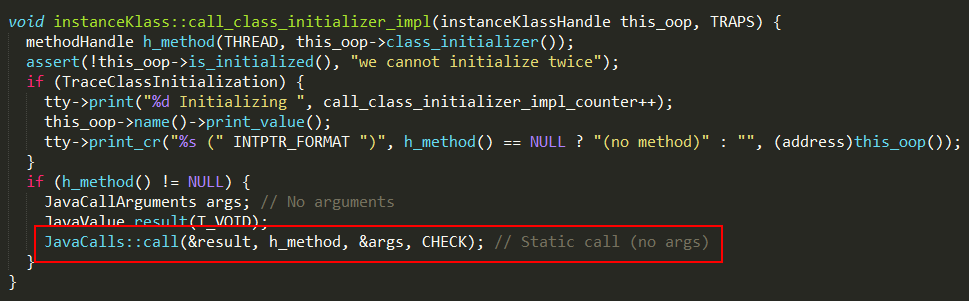  

`this_oop->class_initializer()`可以获取静态代码块入口，最终通过`JavaCalls::call`执行代码块逻辑，再下一层就是具体操作系统的实现了。

######step9

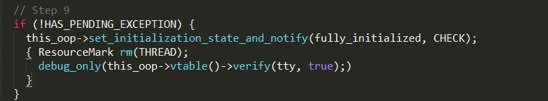  

如果初始化过程没有异常，说明instanceKlass对象已经初始完成，则设置当前instanceKlass的状态为**fully_initialized**，最后通知其它线程初始化已经完成；否则执行step10 and 11。

######step10 and 11

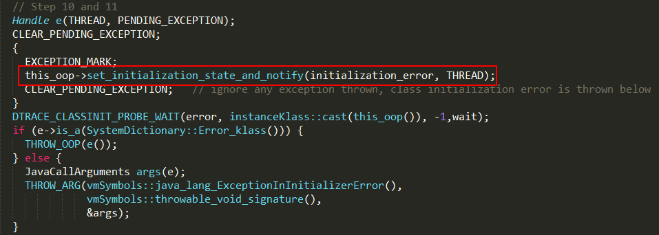  

如果初始化发生异常，则设置当前instanceKlass的状态为 **initialization_error**，并通知其它线程初始化发生异常。

5、如果instanceKlass初始化完成，`klass->allocate_instance`会在堆内存创建instanceOopDesc对象，即类的实例化；

#####instanceOopDesc

当在Java中new一个对象时，本质是在堆内存创建一个instanceOopDesc对象。  

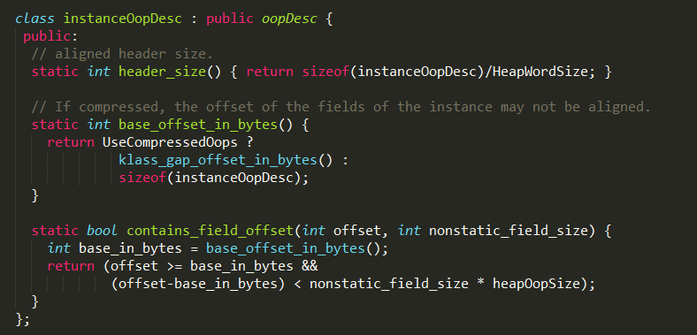  

instanceOopDesc在实现上继承自oopDesc，其中oopDesc定义如下：

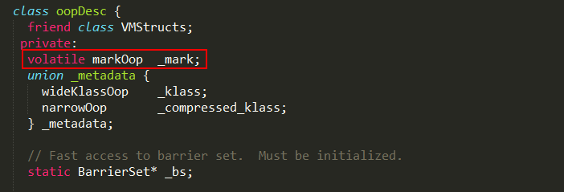  

当然，这只是 oopDesc的部分实现，oopDesc包含两个数据成员：_mark 和 _metadata。  
1、_mark是markOop类型对象，用于存储对象自身的运行时数据，如哈希码（HashCode）、GC分代年龄、锁状态标志、线程持有的锁、偏向线程ID、偏
向时间戳等等，占用内存大小与虚拟机位长一致，更具体的实现可以阅读
[《java对象头的HotSpot实现分析》](http://www.jianshu.com/p/9c19eb0ea4d8)  
2、_metadata是一个联合体，其中wideKlassOop和narrowOop都是指向InstanceKlass对象的指针，wide版是普通指针，narrow版是压缩类指针（compressed Class pointer）

#####instanceOopDesc对象的创建过程

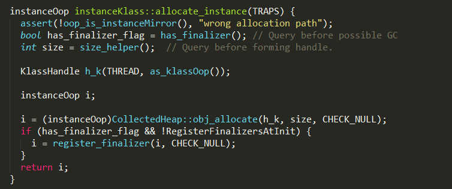  

instanceOopDesc对象通过`instanceKlass::allocate_instance`进行创建，实现过程如下：  
1、`has_finalizer`判断当前类是否包含不为空的finalize方法；  
2、`size_helper`确定创建当前对象需要分配多大内存；  
3、`CollectedHeap::obj_allocate`从堆中申请指定大小的内存，并创建instanceOopDesc对象，实现如下：

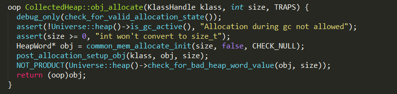  

4、如果当前类重写了finalize方法，且非空，需要把生成的对象封装成Finalizer对象并添加到Finalizer链表中，对象被GC时，如果是Finalizer对象，会将对象赋值到pending对象。Reference Handler线程会将pending对象push到queue中，Finalizer线程poll到对象，先删除掉Finalizer链表中对应的对象，然后再执行对象的finalize方法；


<hr>


####<p>原文出处：<a href='http://www.jianshu.com/p/b91258bc08ac' target='blank'>JVM源码分析之JVM启动流程</a></p>


####前言

执行Java类的main方法，程序就能运行起来，main方法的背后，虚拟机究竟发生了什么？如果你对这个感兴趣，相信本文会给你一个答案，本文分析的openjd
k版本为[openjdk-7-fcs-src-b147-27](http://www.java.net/download/openjdk/jdk7/promoted/b147/openjdk-7-fcs-src-b147-27_jun_2011.zip)

    
    
    class BootStrap {
        public static void main(String[] args) {
            for (String str : args) {
                System.out.println(str);
            }
        }
    }
    java BootStrap -Xms6G -Xmx8G -Xmn3G -Xss512k 
    -XX:+UseConcMarkSweepGC -XX:+UseParNewGC

虚拟机的启动入口位于`share/tools/launcher/java.c`的main方法，整个流程分为如下几个步骤：  
1、配置JVM装载环境  
2、解析虚拟机参数  
3、设置线程栈大小  
4、执行Java main方法

#####1、配置JVM装载环境

Java代码执行时需要一个JVM环境，JVM环境的创建包括两部分：JVM.dll文件的查找和装载。

######JVM.dll文件的查找

通过`CreateExecutionEnvironment`方法实现，根据当前JRE环境的路径和系统版本寻找`jvm.cfg`文件，windows实现如下：

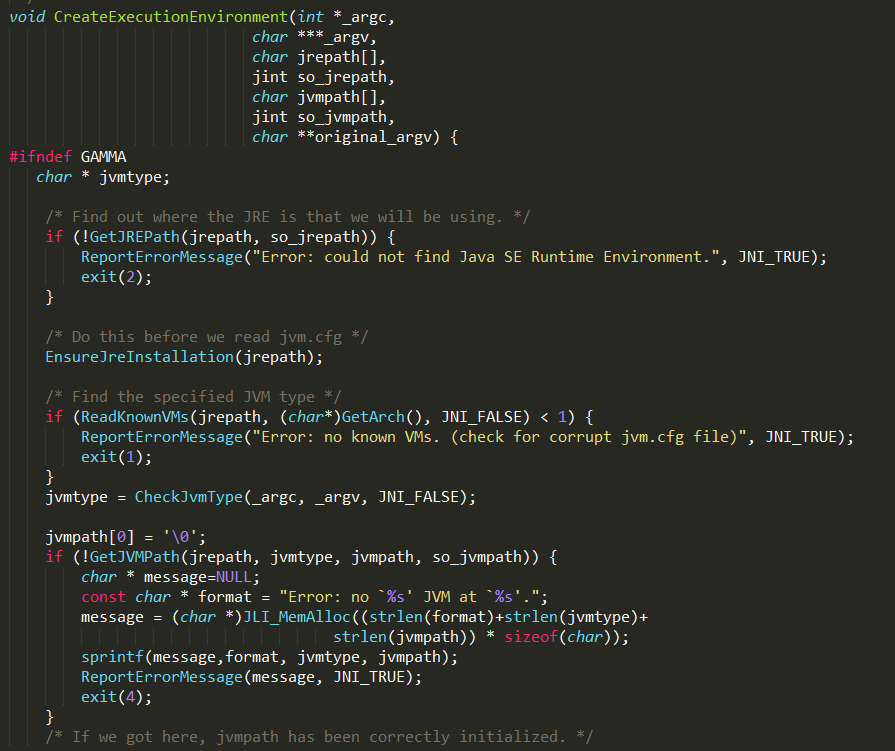  

大概实现逻辑：  
1、`GetJREPath`查找当前JRE环境的所在路径；  
2、`ReadKnownVms`读取`JRE路径\lib\ARCH(CPU构架)\JVM.cfg`文件，其中`ARCH(CPU构架)`通过`GetArch`
方法获取，在window下有三种情况：amd64、ia64和i386；  
3、`CheckJvmType`确定当前JVM类型，先判断是否通过`-J`、`-XXaltjvm=`或`-J-XXaltjvm=`参数指定，如果没有，则读取
JVM.cfg文件中配置的第一个类型；  
4、`GetJVMPath`根据上一步确定的JVM类型，找到对应的JVM.dll文件；

######JVM.dll文件的装载

初始化虚拟机中的函数调用，即通过JVM中的方法调用JVM.dll文件中定义的函数，实现如下：

  

1、`LoadLibrary`方法装载JVM.dll动态连接库；  
2、把JVM.dll文件中定义的函数`JNI_CreateJavaVM`和`JNI_GetDefaultJavaVMInitArgs`绑定到Invocati
onFunctions变量的`CreateJavaVM`和`GetDefaultJavaVMInitArgs`函数指针变量上；

#####2、虚拟机参数解析

装载完JVM环境之后，需要对启动参数进行解析，其实在装载JVM环境的过程中已经解析了部分参数，该过程通过`ParseArguments`方法实现，并调用`A
ddOption`方法将解析完成的参数保存到`JavaVMOption`中，`JavaVMOption`结构实现如下：

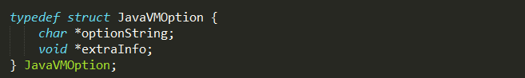  

AddOption方法实现如下：

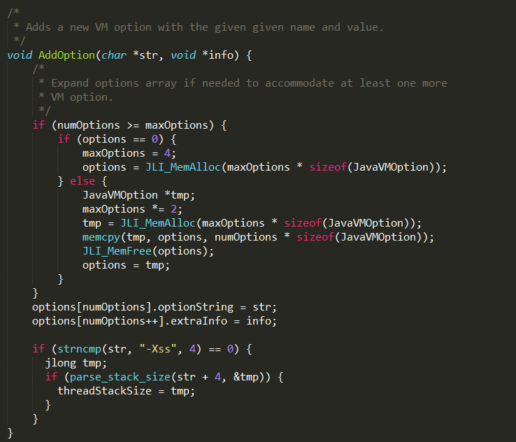  

这里对`-Xss`参数进行特殊处理，并设置threadStackSize，因为参数格式比较特殊，其它是key/value键值对，它是`-Xss512`的格式。后续`Arguments`类会对`JavaVMOption`数据进行再次处理，并验证参数的合理性。

#####参数处理

`Arguments::parse_each_vm_init_arg`方法负责处理经过解析过的JavaVMOption数据，部分实现如下：

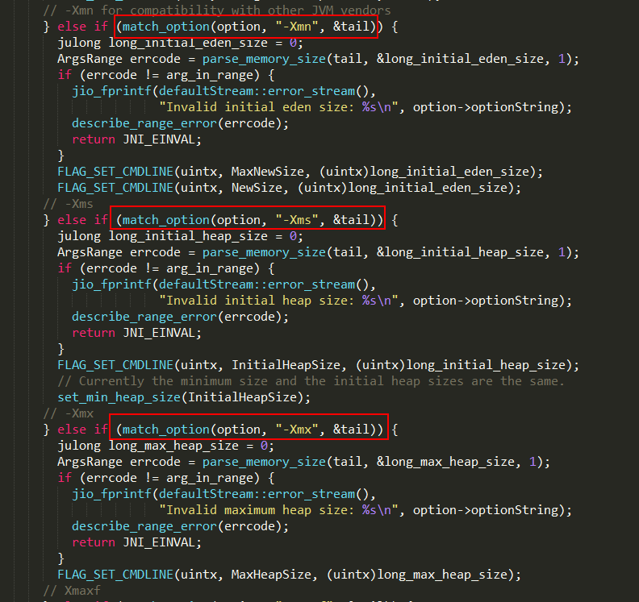  

这里只列出三个常用的参数：  
1、**-Xmn**：设置新生代的大小NewSize和MaxNewSize；  
2、**-Xms**：设置堆的初始值InitialHeapSize，也是堆的最小值；  
3、**-Xmx**：设置堆的最大值MaxHeapSize；

#####参数验证

`Arguments::check_gc_consistency`方法负责验证虚拟机启动参数中配置GC的合理性，实现如下：

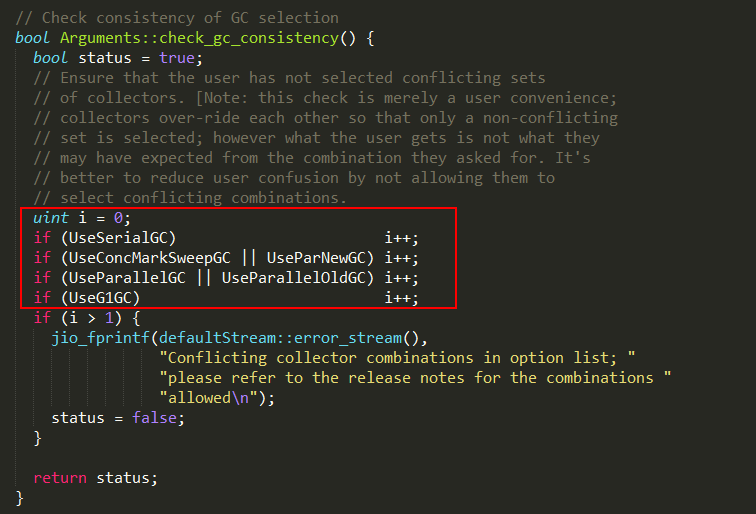  

1、如果参数为`-XX:+UseSerialGC
-XX:+UseParallelGC`，由于UseSerialGC和UseParallelGC不能兼容，JVM启动时会抛出错误信息；  
2、如果参数为`-XX:+UseConcMarkSweepGC
-XX:+UseParNewGC`，其中UseConcMarkSweepGC和UseParNewGC可以兼容，JVM可以正常启动；

#####3、设置线程栈大小

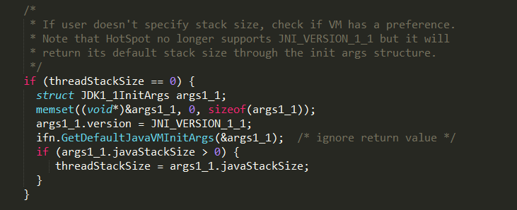  

如果启动参数未设置`-Xss`，即threadStackSize为0，则调用InvocationFunctions的`GetDefaultJavaVMIni
tArgs`方法获取JavaVM的初始化参数，即调用JVM.dll函数`JNI_GetDefaultJavaVMInitArgs`，定义在`share\vm
\prims\jni.cpp`，实现如下：

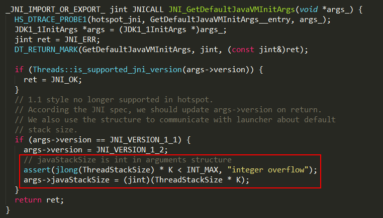  

`ThreadStackSize`定义在`globals.hpp`中，根据当前系统类型，加载对应的配置文件，所以在不同的系统中，`ThreadStackSi
ze`的默认值也不同。

#####4、执行Java main方法

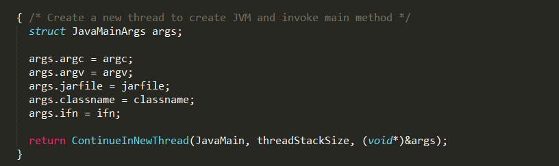  

线程栈大小确定后，通过`ContinueInNewThread`方法创建新线程，并执行JavaMain函数，JavaMain函数的大概流程如下：

######1、新建JVM实例

`InitializeJVM`方法调用InvocationFunctions的`CreateJavaVM`方法，即调用JVM.dll函数`JNI_Creat
eJavaVM`，新建一个JVM实例，该过程比较复杂，会在后续文章进行分析；

######2、加载主类的class

Java运行方式有两种：jar方式和class方式。

#######jar方式

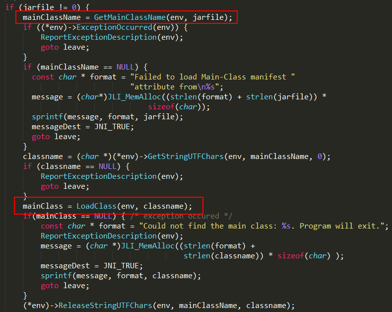  

1、调用`GetMainClassName`方法找到`META-INF/MANIFEST.MF`文件指定的Main-Class的主类名；  
2、调用`LoadClass`方法加载主类的class文件；

#######class方式

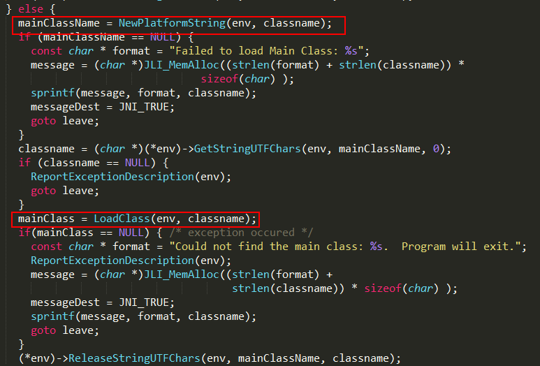  

1、调用`NewPlatformString`方法创建类名的String对象；  
2、调用`LoadClass`方法加载主类的class文件；

######3、查找main方法

通过`GetStaticMethodID`方法查找指定方法名的静态方法，实现如下：

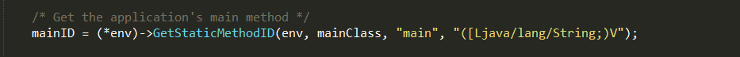  

最终调用`JVM.dll`函数`jni_GetStaticMethodID`实现

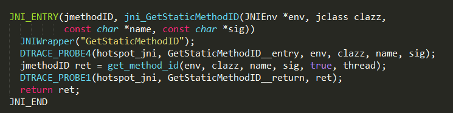  

其中`get_method_id`方法根据类文件对应的instanceKlass对象查找指定方法。

######4、执行main方法

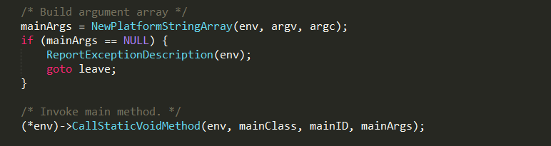  

1、重新创建参数数组；  
2、其中mainID是main方法的入口地址，`CallStaticVoidMethod`方法最终调用`JVM.dll`中的`jni_CallStaticV
oidMethodV`函数，实现如下

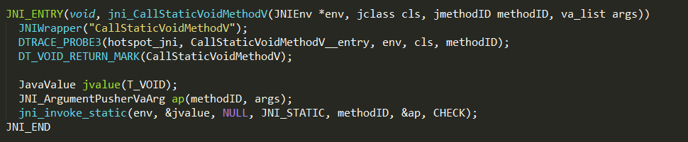  

jni_invoke_static实现如下：  

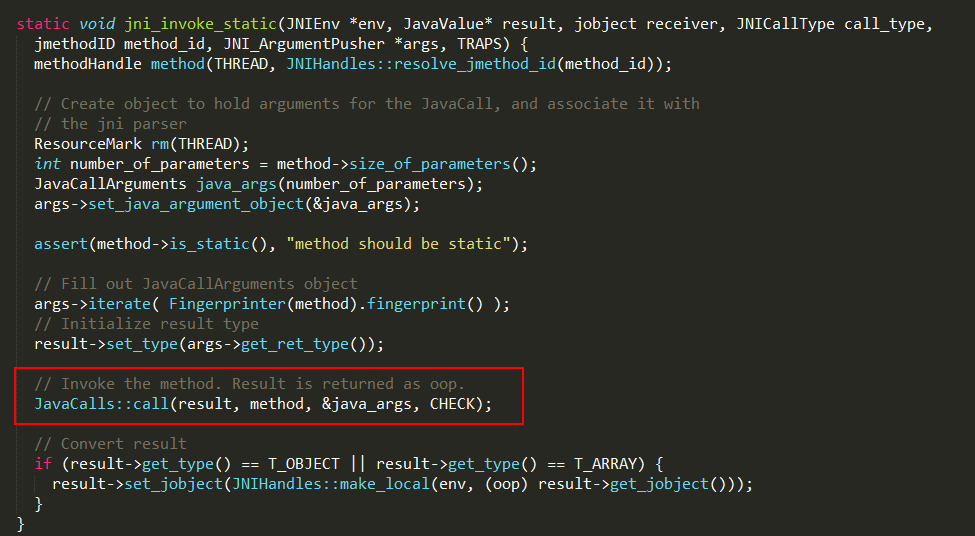  

最终通过`JavaCalls::call`执行main方法。


<hr>


####<p>原文出处：<a href='http://www.jianshu.com/p/0f7bed2df952' target='blank'>JVM源码分析之堆内存的初始化</a></p>

####前言

[《Java GC的那些事》](http://www.jianshu.com/p/6d1cbe38a54b)一文中说过：Java堆是被所有线程共享的一块内存区域，所有对象和数组都在堆上进行内存分配。为了进行高效的垃圾回收，虚拟机把堆内存划分成新生代、老年代和永久代（1.8中无永久代，使用metaspace实现）三块区域。

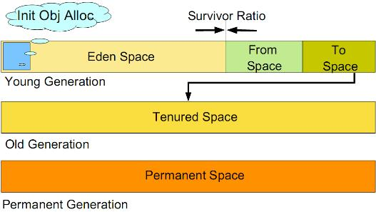  

####堆初始化

Java堆的初始化入口位于`Universe::initialize_heap`方法中，实现如下：

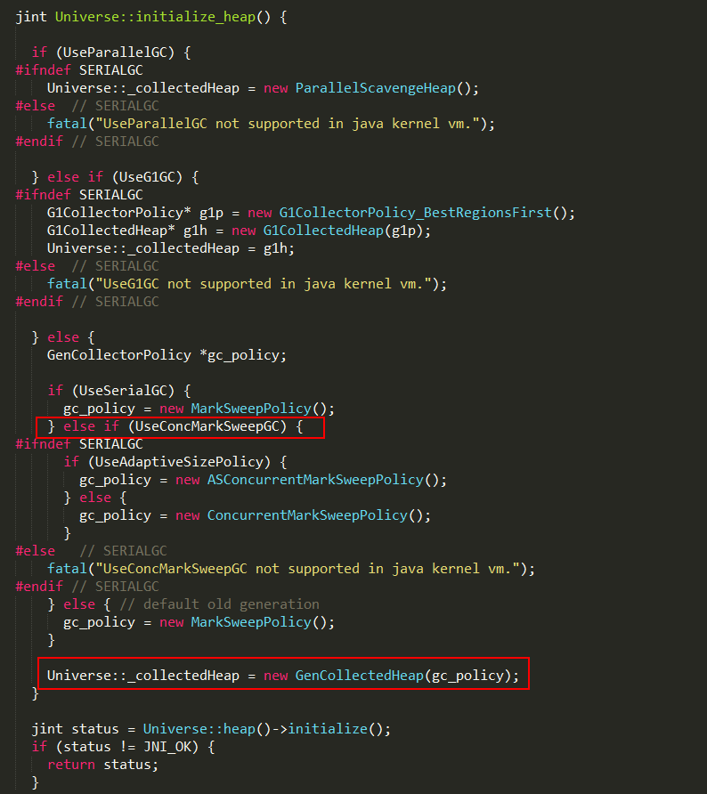  

其中UseParallelGC、UseG1GC、UseConcMarkSweepGC都可以通过启动参数进行设置，整个初始化过程分成三步：  
1、初始化GC策略；  
2、初始化分代生成器；  
3、初始化Java堆管理器；

#####GC策略初始化

HotSpot的GC策略实现如下：

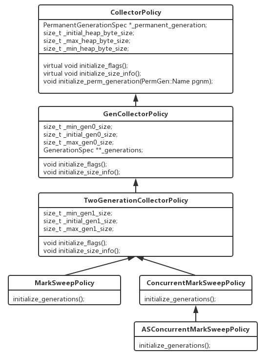  

其中`MarkSweepPolicy`是基于标记-清除思想的GC策略，如果虚拟机启动参数没有指定GC算法，则使用默认使用`UseSerialGC`，以`ASConcurrentMarkSweepPolicy`策略为例，对GC策略的初始化过程进行分析：

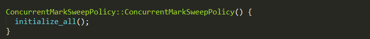  

调用父类`ConcurrentMarkSweepPolicy`构造方法，其中`initialize_all`定义在`GenCollectorPolicy`中，实现如下：

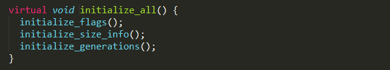  

######initialize_flags

负责对新生代、老年代以及永久代设置的内存大小进行对齐调整。

#######1、调整永久代

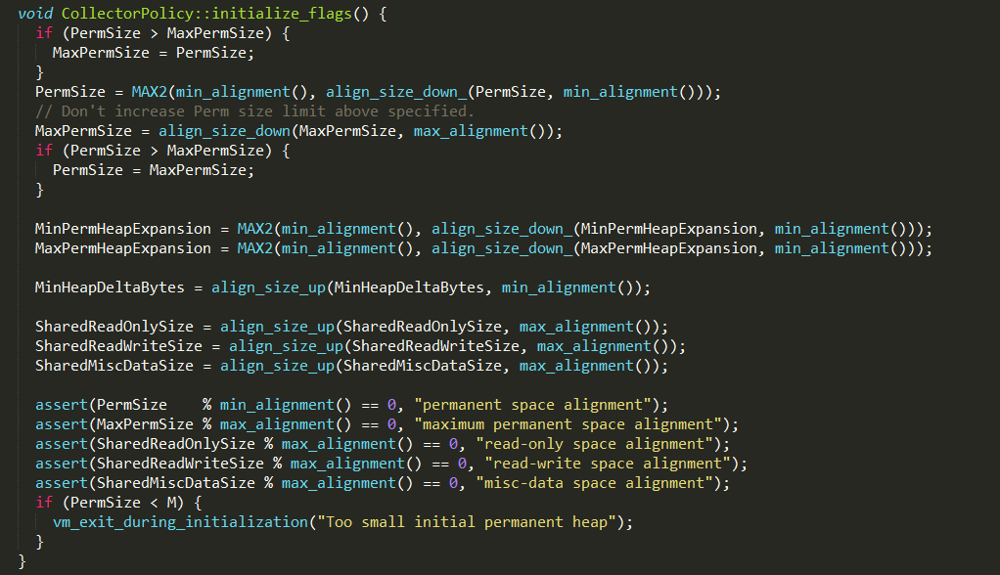  

由`CollectorPolicy::initialize_flags`实现，永久代的初始值默认为4M，最大值为64M，可以通过参数`-XX:PermSize`和`-XX:MaxPermSize`进行重新设置。

#######2、调整新生代

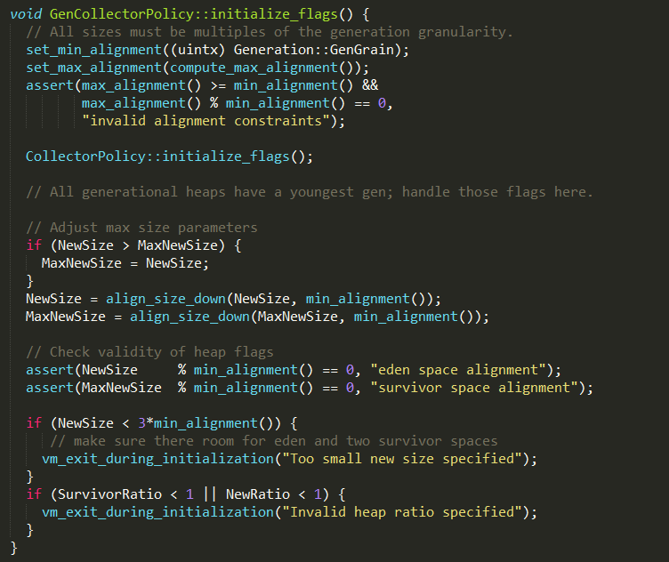  

由`GenCollectorPolicy::initialize_flags`实现：  
1、新生代的初始值`NewSize`默认为1M，最大值需要设置，可以通过参数`-XX:NewSize`和`-XX:MaxNewSize`或`-Xmn`进行设置；  
2、`NewRatio`为老年代与新生代的大小比值，默认为2；  
3、`SurvivorRatio`为新生代中Eden和Survivor的大小比值，默认为8；

#######3、调整老年代

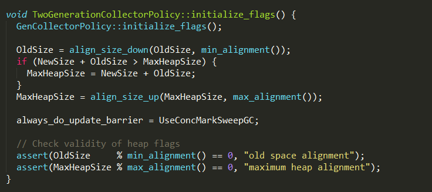  

由`TwoGenerationCollectorPolicy::initialize_flags`实现  
1、老年代的初始值OldSize默认为4M，可以通过参数`-XX:OldSize`进行设置；  
2、最大堆大小MaxHeapSize默认为96M，可以通过参数`-Xmx`进行设置；  
3、如果设置的新生代和老年代的内存容量大于MaxHeapSize，则重新设置MaxHeapSize；

######initialize_size_info

设置新生代、老年代以及永久代的容量，包括初始值、最小值和最大值

#######设置堆容量

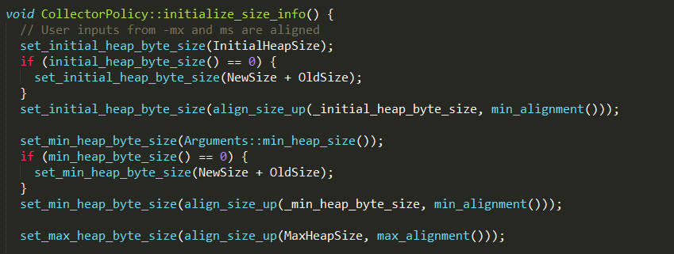  

其中`InitialHeapSize`和`Arguments::min_heap_size()`可以通过参数`-Xms`进行设置。  
1、设置初始堆容量`_initial_heap_byte_size`；  
2、设置最小堆容量`_min_heap_byte_size`；  
3、设置最大堆容量`_max_heap_byte_size`；

#######设置新生代

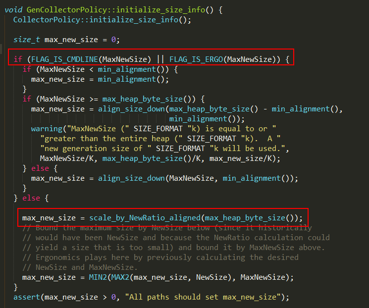  

1、如果`MaxNewSize`重新设置过，即设置`-Xmn`参数，则根据不同情况设置`max_new_size`；  
2、否则通过`scale_by_NewRatio_aligned`方法根据`NewRatio`和`_max_heap_byte_size`重新计算`max_
new_size`值，其中`NewRatio`默认为2，表示新生代的大小占整个堆的1/3；

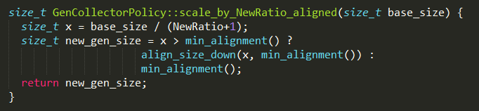  

3、如果最大堆`_max_heap_byte_size`等于最小堆`_min_heap_byte_size`，则设置新生代的初始值、最小值和最大值为`max
_new_size`，否则执行步骤4；

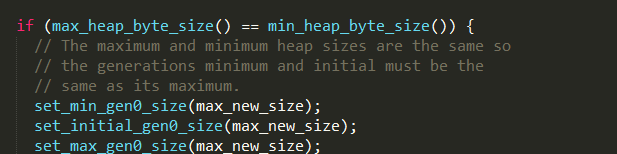  

4、如果`NewSize`重新设置过，即设置了`-Xmn`参数，则使用`NewSize`设置`_min_gen0_size`，否则使用`scale_by_N
ewRatio_aligned`方法重新计算新生代最小值和初始值，实现如下：

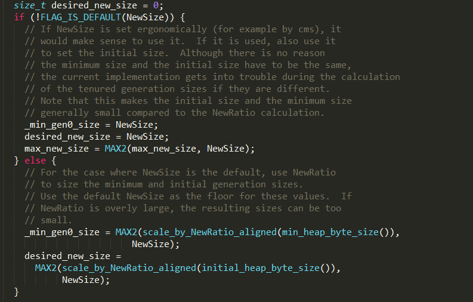  

######设置老年代

1、如果参数没有设置`OldSize`，则使用`min_heap_byte_size() -
min_gen0_size()`，即最小堆大小和新生代最小值之差设置老年代最小值，初始值类似；  
2、否则根据设置的`OldSize`，通过`adjust_gen0_sizes`方法重新设置新生代的最小值和初始值；

#####初始化分代生成器

分代生成器保存了各个内存代的初始值和最大值，新生代和老年代通过`GenerationSpec`实现，永久代通过`PermanentGenerationSpe
c`实现。

#######GenerationSpec实现

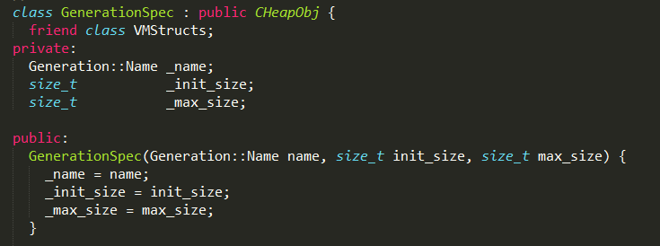  

每个生成器GenerationSpec实例保存当前分代的GC算法、内存的初始值和最大值。

#######PermanentGenerationSpec实现

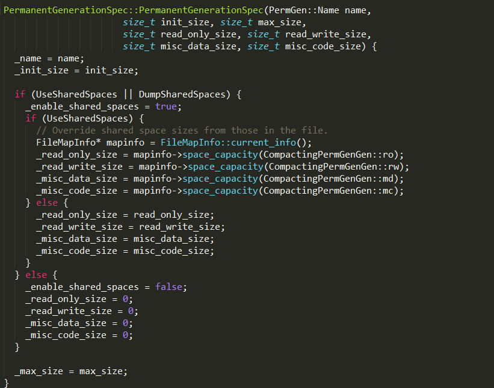  

除了`GenerationSpec`实例中的数据，如果设置`UseSharedSpaces`和`DumpSharedSpaces`，还需要保存额外的数据。

`ConcurrentMarkSweepPolicy::initialize_generations`方法实现了分代生成器的初始化，实现如下：

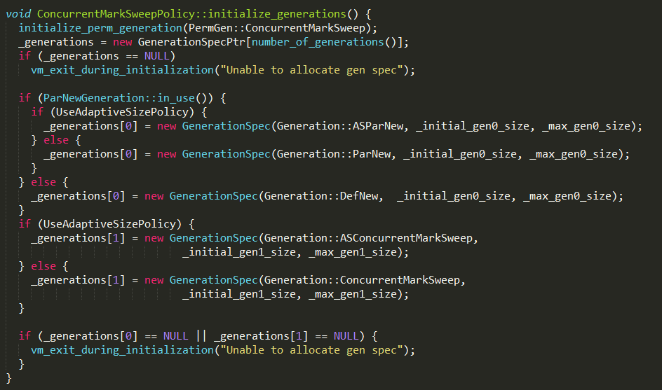  

创建新生代、老年代和永久代对应的生成器实例。

######初始化Java堆管理器

GenCollectedHeap是整个Java堆的管理器，负责Java对象的内存分配和垃圾对象的回收，通过initialize方法进行初始化，实现如下：

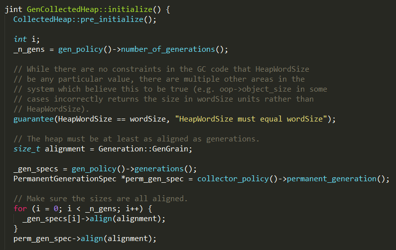  

1、通过GC策略的`number_of_generations`方法获取分代数量，如果使用ASConcurrentMarkSweepPolicy，默认分代数
为2；  
2、通过`align`方法对齐生成器的初始值和最大值（为什么需要一直对齐，我觉得前面初始化GC策略的时候已经对齐很多次了）；

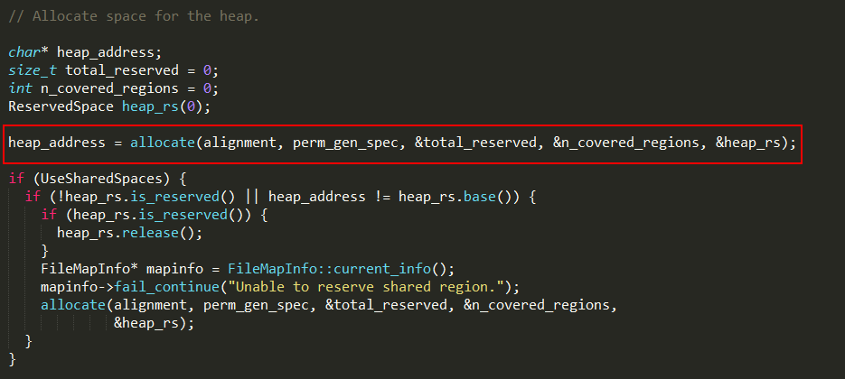  

3、通过allocate为堆申请空间；

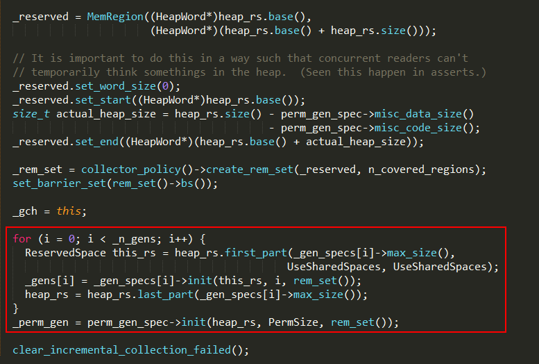  

4、通过分代生成器的`init`方法为对应的分代分配内存空间；

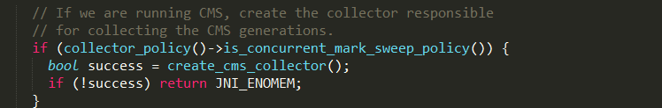  

5、如果当前的GC策略为ConcurrentMarkSweepPolicy，则通过`create_cms_collector`创建GC线程。


<hr>


 
<!--BEGIN_DATA
<table>
    <tr>
    <td id='create_date'>2017-01-18 14:17</td>
    <td id='modify_date'>2017-01-18 14:17</td>
    <td id='is_top'>0</td>
    <td id='summary'></td>
    <td id='tags'></td>
  </tr>
</table>
END_DATA-->

####<p>原文出处：<a href='http://www.jianshu.com/p/e56c808b6c8a' target='blank'>JVM源码分析之Java对象的内存分配</a></p>

接着上篇[《JVM源码分析之Java对象的创建过程》](http://www.jianshu.com/p/0009aaac16ed)，本文对Java对象的内
存分配过程进行深入分析，其中有以下几种分配方式：  
1、从线程的局部缓冲区分配临时内存  
2、从内存堆中分配临时内存  
3、从内存堆中分配永久内存

新建一个对象时，由对应的`instanceKlass`对象计算出需要多大的内存，并调用`CollectedHeap`的`common_mem_allocate_noinit`方法分配指定大小的内存，实现如下：

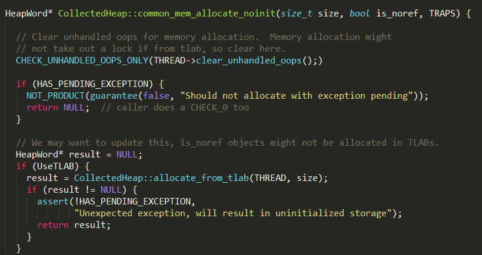  

######从线程的局部缓冲区分配临时内存

TLAB技术是每个线程在Java堆中预先分配了一小块内存，当有对象创建请求内存分配时，就会在该块内存上进行分配，而不需要在Java堆通过同步控制进行内存分配。如果`UseTLAB`为真，则使用TLAB技术（Thread-Local Allocation Buffers），将分配工作交由线程自行完成，实现如下：  

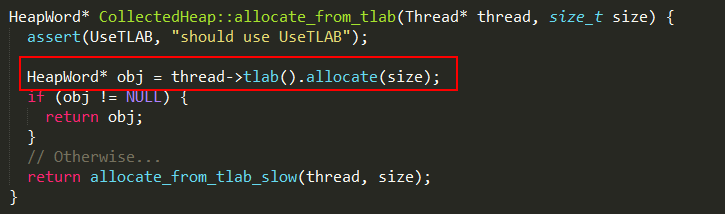  

1、如果线程的局部缓冲区可以分配指定大小的内存，则直接分配；  
2、否则执行`allocate_from_tlab_slow`在Java堆上进行分配，实现如下：

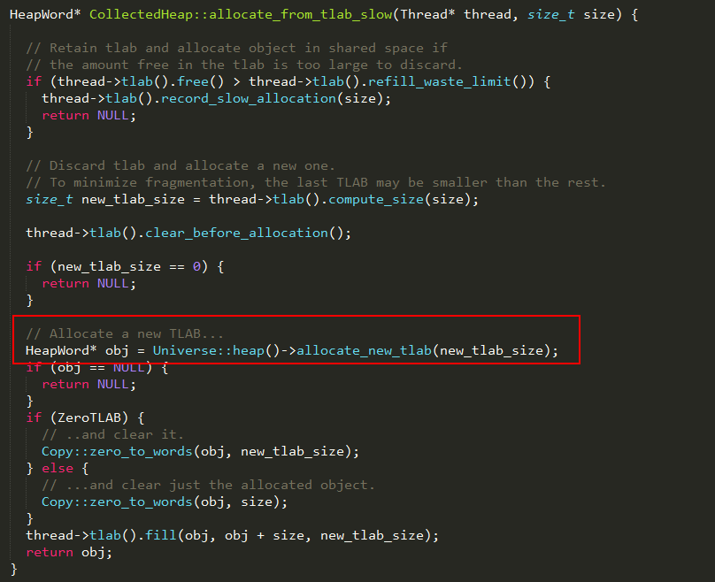  

3、通过`allocate_new_tlab`从Java堆上重新为线程分配一块局部缓冲区，实现如下：

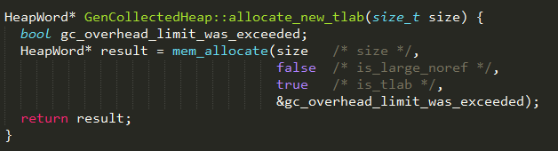  

其中`mem_allocate`方法实现从Java堆分配临时内存。

######从内存堆中分配临时内存

在内存堆管理器看来，为普通对象分配内存和为某一线程分配一块本地分配缓冲区在本质上都是一样的，这块内存都是临时的，只能从新生代或老年代中进行分配，通过gc策略`GenCollectorPolicy::mem_allocate_work`方法进行实现，大概步骤如下：

#######step 1

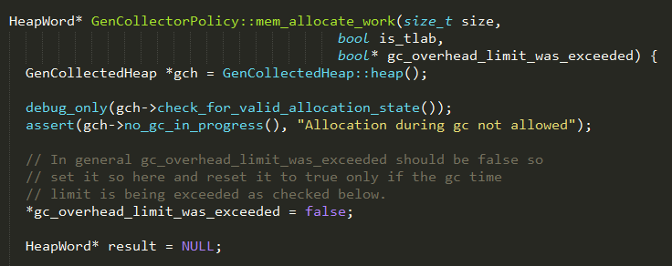  

1、`gch->no_gc_in_progress()`确保当前JVM没有正在进行gc；  
2、参数`gc_overhead_limit_was_exceeded`表示当前内存分配操作是否发生了gc，以及gc耗时是否超过设置限制，主要针对一些对延迟敏感的场景，当该参数为`true`时，抛出OOM的异常给上层；

#######step 2

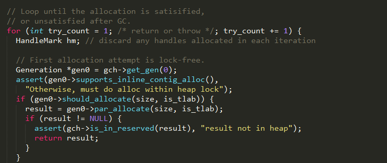  

通过重试机制确保内存能够分配成功：  
1、首先在新生代采用无锁的方式尝试分配内存，通过`Atomic::cmpxchg_ptr`的CAS操作对新生代空闲内存进行同步分配，最终实现如下：

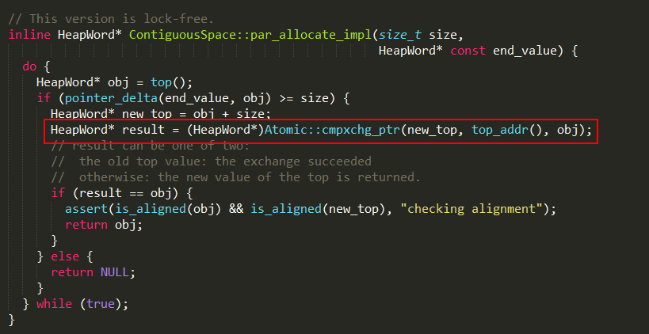  

2、如果分配失败，则执行step 3；

#######step 3

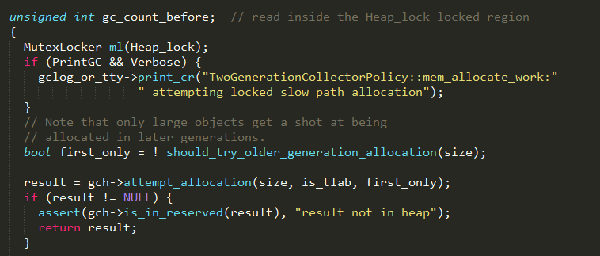  

1、如果在新生代中内存分配失败，则通过加锁方式进行分配；  
2、参数`first_only`表示当前是否只应该在新生代分配内存，如果新生代的剩余空间不够，则尝试在老年代进行分配；  
3、依次尝试从内存各个代中分配内存，实现如下：

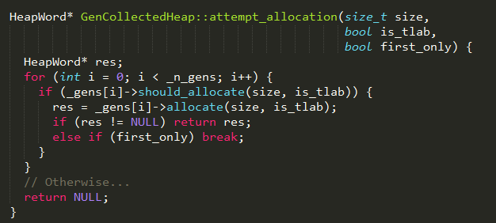  

4、如果内存分配成功，则返回，否则执行step 4；

#######step 4

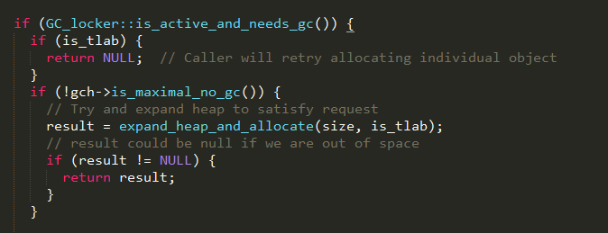  

1、`gc_locker::is_active_and_needs_gc()`为真时，表示当前其它线程已经触发了gc；  
2、如果`is_tlab`为真，表示当前线程正在为局部分配缓冲区申请内存；  
3、如果`!gch->is_maximal_no_gc()`为真，表示新生代或老年代可以进行内存扩展，扩展完成后，再次尝试从各代中进行分配，实现如下：

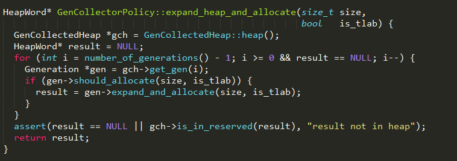  

4、如果内存扩展之后还是没有足够的内存满足分配需求，则执行step 5；

#######step 5

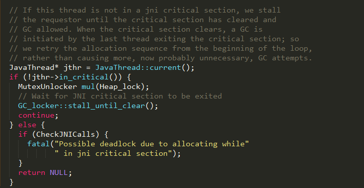  

如果当前线程没有位于jni的临界区，将释放Java堆的互斥锁，以使得请求gc的线程可以进行gc操作，等所有本地线程退出临界区和gc完成后，将继续循环尝试分配
内存。

#######step 6

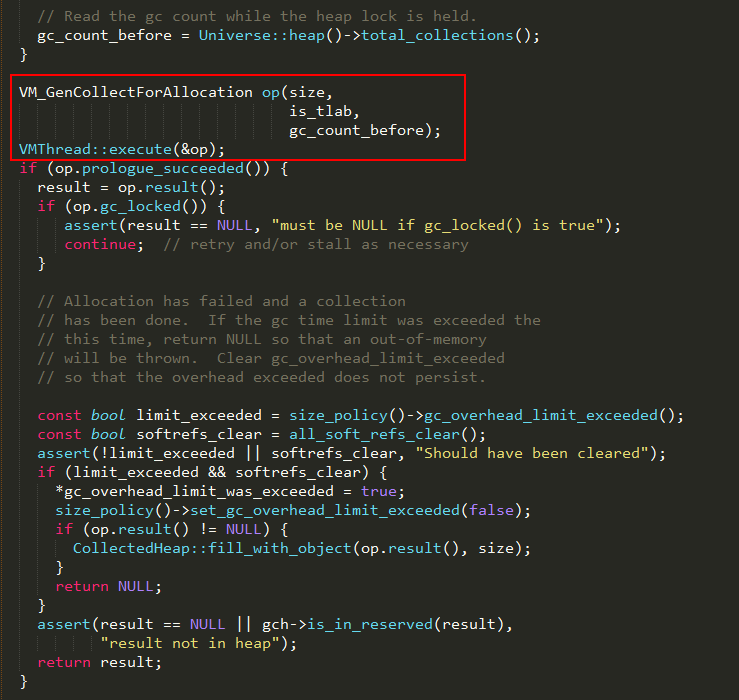  

1、如果各代无法分配对象的内存，说明需要触发一次gc操作，提交VM一个GenCollectForAllocation操作，最终由名为`VM
Thread`的JVM级线程调度执行；  
2、当操作执行成功并返回时，如果gc锁已被加锁，说明已经由其它线程触发了gc，则继续循环以等待gc完成；  
3、否则当前线程等待gc完成，判断gc耗时是否超过设置的gc超时上限，并执行软引用的清除；  
4、如果gc超时，则给上层调用返回NULL，让其抛出内存溢出错误；


<hr>


####<p>原文出处：<a href='http://www.jianshu.com/p/1544d3011ddb' target='blank'>JVM源码分析之如何触发并执行GC线程</a></p>

####前言

由于JVM中垃圾收集器的存在，使得Java程序员在开发过程中可以不用关心对象创建时的内存分配以及释放过程，当内存不足时，JVM会自动开启垃圾收集线程，进行垃圾对象的回收。对象的创建、使用，到最后的回收，整个过程就这样悄无声息的发生着，那么这些垃圾回收线程到底是什么时候触发，并如何执行的呢？本文将对openjdk的源码进行分析，了解一下相关的底层实现细节。

####VMThread

VMThread负责调度执行虚拟机内部的VM线程操作，如GC操作等，在JVM实例创建时进行初始化

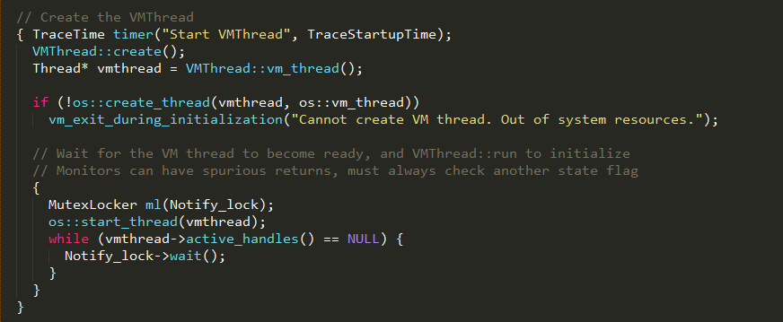  

`VMThread::create()`方法负责该线程的创建，实现如下：

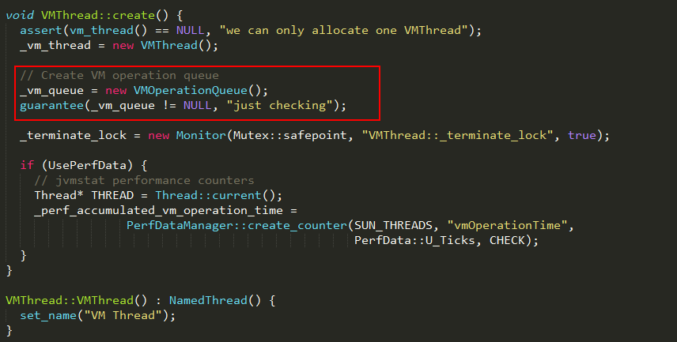  

1、`VMThread`内部维护了一个`VMOperationQueue`类型的队列，用于保存内部提交的VM线程操作`VM_operation`，在`VMThread`创建时会对该队列进行初始化。  
2、由于`VMThread`本身就是一个线程，启动后通过执行`loop`方法进行轮询操作，从队列中按照优先级取出当前需要执行的`VM_operation`对象并执行，其中整个轮询过程分为两步：

#######step 1

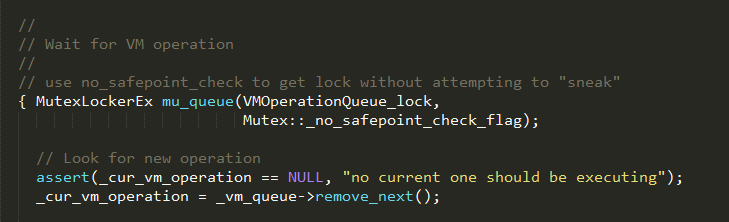  

如果队列为空，`_vm_queue->remove_next()`方法则返回空的`_cur_vm_operation`，否则根据队列中的`VM_operation`优先级进行重新排序，并返回队列头部的`VM_operation`。如果`_cur_vm_operation`为空，则执行如下逻辑：

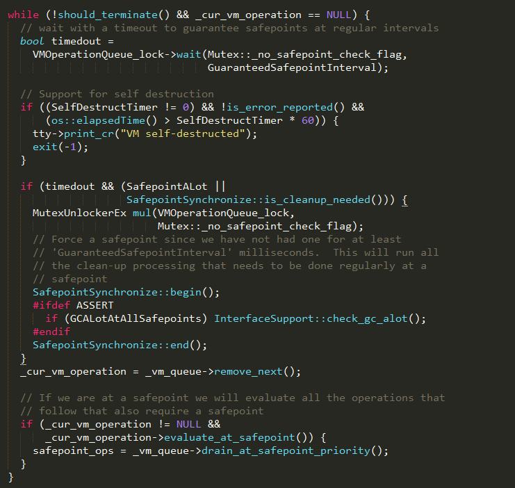  

通过执行`VMOperationQueue_lock->wait`方法等待`VM operation`.

#######step 2

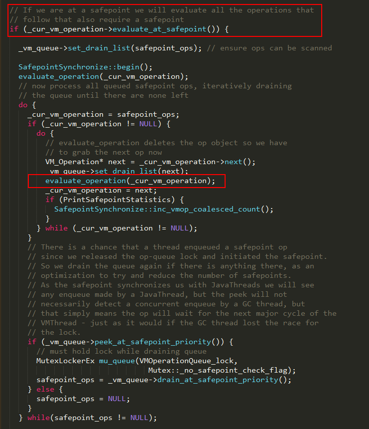  

如果当前`vm_operation`需要在安全点执行，如`FULL GC`，则执行上述逻辑，否则执行以下逻辑

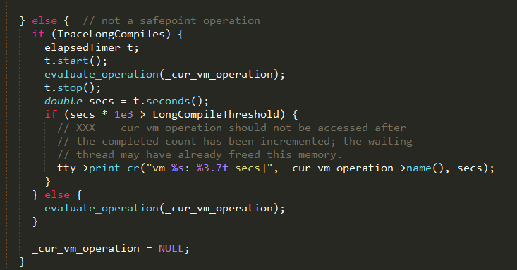  

通过`evaluate_operation`执行当前的`_cur_vm_operation`，最终调用`vm_operation`对象的`evaluate`方法，实现如下：

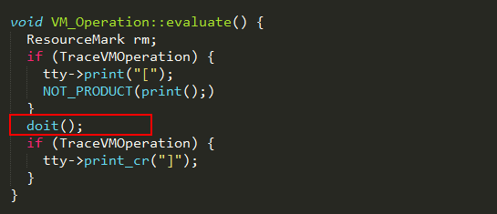  

子类通过重写`VM_Operation`类的`doit`方法实现具体的逻辑。

####如何触发YGC

在[《JVM源码分析之Java对象的内存分配》](http://www.jianshu.com/p/e56c808b6c8a)一文中已经分析过，当新生代不足以分配对象所需的内存时，会触发一次YGC，具体实现如下：

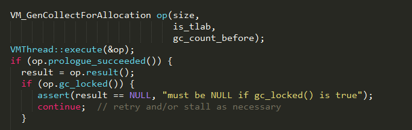  

创建一个`VM_GenCollectForAllocation`类型的`VM_Operation`，通过执行`VMThread::execute`方法保存到`VMThread`的队列中，其中`execute`的核心实现如下：

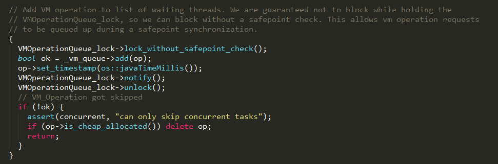  

YGC的`VM_Operation`加入到队列后，通过执行`VMOperationQueue_lock`的`notify`方法唤醒`VMThread`线程，等待被执行，其中`VM_GenCollectForAllocation`的`doit`方法实现如下：

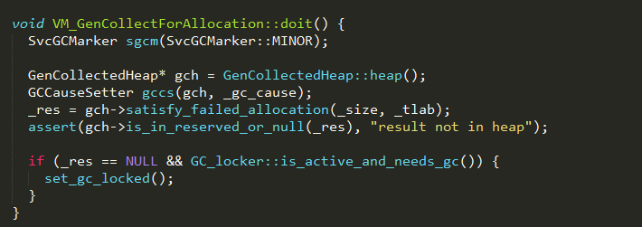  

本文不会对GC算法的具体实现进行分析。


<hr>


####<p>原文出处：<a href='http://www.jianshu.com/p/04eff13f3707' target='blank'>JVM源码分析之垃圾收集的执行过程</a></p>

接着上文[《JVM源码分析之如何触发并执行GC线程》](http://www.jianshu.com/p/1544d3011ddb)，本文对GC线程的执行过程进行分析，当新生代的可用内存不足时，会触发YGC操作，回收新生代的垃圾对象，具体实现是创建一个`VM_GenCollectForAllocation`类型的`VM_Operation`，并交由`VMThread`进行调度执行。

整个YGC的过程如下

######step 1

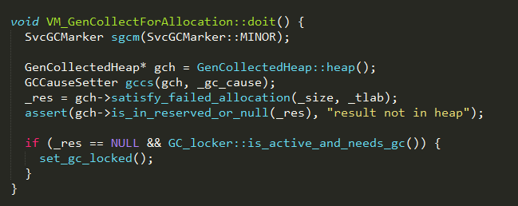  

通过`VMThread`调度执行gc操作，最终调用对应的`doit`方法  
1、利用`SvcGCMarker`通知`minor gc`操作的开始；  
2、设置触发gc的原因为`GCCause::_allocation_failure`，即内存分配失败；  
3、其中`GenCollectedHeap`的`satisfy_failed_allocation`方法会调用GC策略的`satisfy_failed_al
location`方法，处理内存分配失败的情况；

######step 2

从这一步开始是`satisfy_failed_allocation`方法的实现  

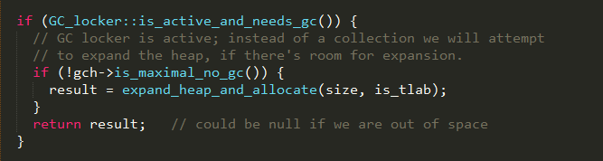  

如果其它线程触发了gc操作，则通过扩展内存代的容量进行分配，最后不管有没有分配成功都返回，等待其它线程的gc操作结束；

######step 3

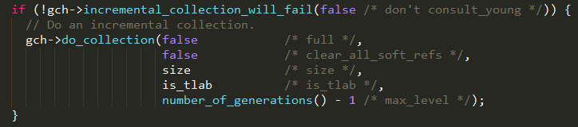  

如果增量式gc`incremental collection`可行，则通过`do_collection`方法执行一次`minor
gc`，即回收新生代的垃圾；

######step 4

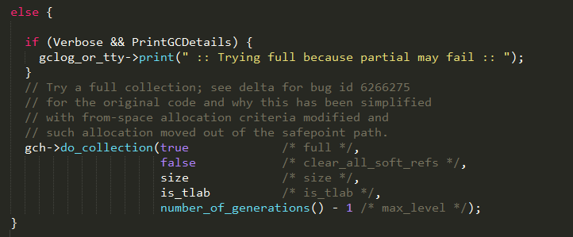  

如果增量式gc不可行，则通过`do_collection`方法执行一次`full gc`；

######step 5

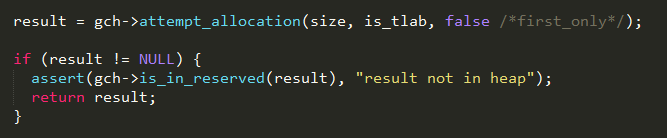  

gc结束之后，再次从内存堆的各个内存代中依次分配指定大小的内存块，如果分配成功则返回，否则继续；

######step 6

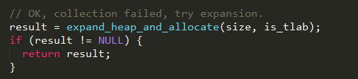  

如果gc结束后还是分配失败，说明gc失败了（这里写gc失败了，是因为代码注释上说`collection
failed`，但是为什么可以确定是gc失败呢？），则再次尝试通过允许扩展内存代容量的方式来试图分配指定大小的内存块；

######step 7

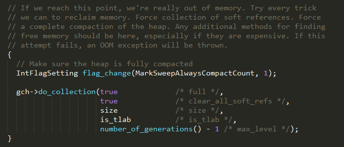  

如果执行到这一步，说明gc之后还是内存不足，则通过`do_collection`方法最后再进行一次彻底的gc，回收所有的内存代，对堆内存进行压缩，且清除软引
用；

######step 8

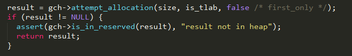  

经过一次彻底的gc之后，最后一次尝试依次从各内存代分配指定大小的内存块；


从上述分析中可以发现，gc操作的入口都位于`GenCollectedHeap::do_collection`方法中，不同的参数执行不同类型的gc，定义如下：

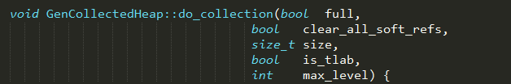  

参数说明：  
1、参数`full`标识是否需要进行`full gc`；  
2、参数`clear_all_soft_refs`标识gc过程中是否需要清除软引用；

方法`do_collection`的实现过程如下：

#######step 1

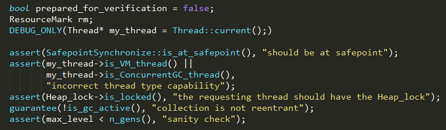  

执行gc操作必须满足四个条件：  
1、在一个同步安全点，`VMThread`在调用gc操作时会通过`SafepointSynchronize::begin/end`方法实现进出安全区域，调用
`begin`方法时会强制所有线程到达一个安全点；  
2、当前线程是VM线程或并发的gc线程；  
3、当前线程已经获得内存堆的全局锁；  
4、内存堆当前`_is_gc_active`参数为`false`，即还未开始gc；

#######step 2

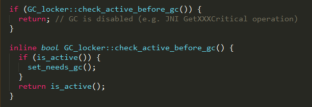  

如果当前有其它线程触发了gc，则终止当前的gc线程，否则继续；

#######step 3

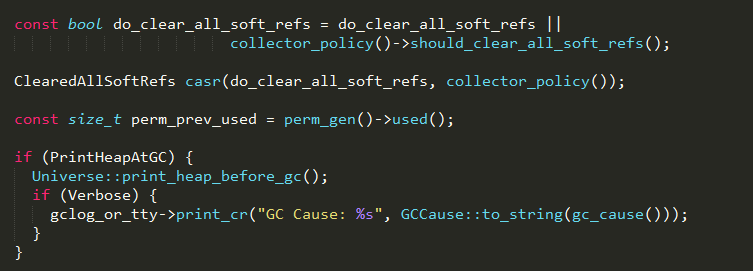  

1、根据参数`do_clear_all_soft_refs`和GC策略判断本次gc是否需要清除软引用；  
2、记录当前永久代的使用量`perm_prev_used`；  
3、如果启动参数中设置了`-XX:+PrintHeapAtGC`，则打印GC发生时内存堆的信息。

#######step 4

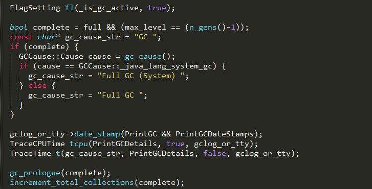  

1、设置参数`_is_gc_active`为真，表示当前线程正式开始gc操作；  
2、判断当前是否要进行一次`full gc`，并确定触发`full gc`的原因，如通过调用`System.gc()`触发；  
3、如果设置了`PrintGC`和`PrintGCDateStamps`，则在输出日志中添加时间戳；  
4、如果设置了`PrintGCDetails`，则打印本次gc的详细CPU耗时，如
`user_time`、`system_time`和`real_time`；  
5、`gc_prologue`方法在gc开始前做一些前置处理，如设置每个内存代的`_soft_end`字段；  
6、更新发生gc的次数`_total_collections`，如果当前gc是`full gc`，则还需更新发生`full
gc`的次数`_total_full_collections`；

#######step 5

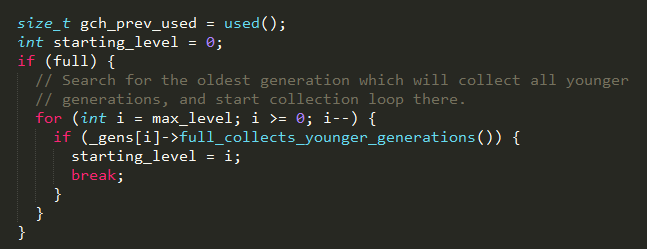  

1、获取当前内存堆的使用量`gch_prev_used`；  
2、初始化开始回收的内存代序号`starting_level`，默认为0，即从最年轻的内存代开始；  
3、如果当前gc是`full gc`，则从最老的内存代开始向前搜索，找到第一个可收集所有新生代的内存代，稍后从该内存代开始回收；

#######step 6

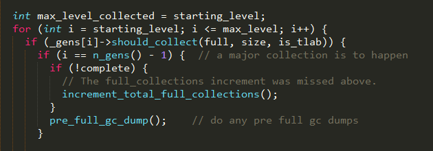  

1、从序号为`starting_level`的内存代开始回收；  
2、如果当前内存代不需要进行回收，则处理下一个内存代，否则对当前内存进行回收；  
3、如果当前内存代所有内存代中最老的，则将本次的gc过程升级为`full gc`，更新`full gc`的次数，并执行`full
gc`的前置处理，实现如下：

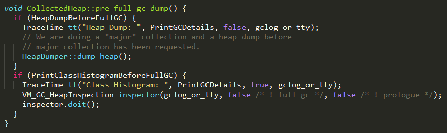  

在进行`FGC`之前：  
1、如果设置了参数`HeapDumpBeforeFullGC`，则对内存堆进行dump；  
2、如果设置了参数`PrintClassHistogramBeforeFullGC`，则打印在进行`FGC`之前的对象；

#######step 7

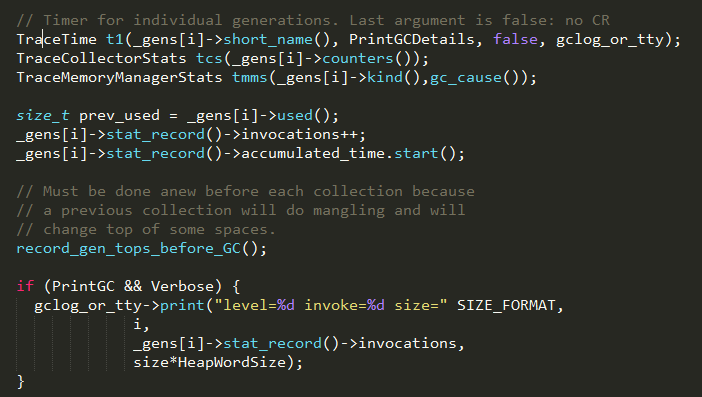  

1、统计各个内存代进行gc时的数据；  
2、如果开启了`ZapUnusedHeapArea`，则在回收每个内存代时都要对内存代的内存上限地址`top`进行更新；

#######step 8

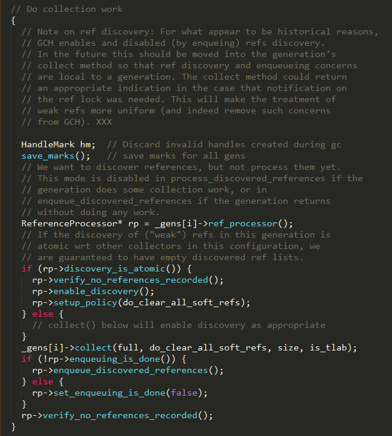  

这一步才开始真正的gc操作：  
1、设置当前内存代的`_saved_mark`值，即设置这些内存区域块的上限地址；  
2、通过每个内存代管理器的`collect`方法对垃圾对象的进行回收，垃圾收集算法的具体细节会在后文进行分析；

#######step 9

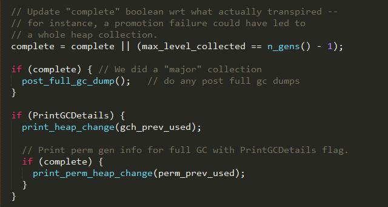  

1、如果当前是`FGC`，则调用`post_full_gc_dump`方法通知gc已经完成，可以进行后续操作，如果设置了参数`HeapDumpAfterFullGC`，则在gc后可以对堆内存进行dump；如果设置了参数`PrintClassHistogramAfterFullGC`，则在gc后可以打印存活的对象；  
2、如果设置了参数`PrintGCDetails`，则在gc后可以打印内存堆的变化情况；如果当前还是`FGC`，则还可以打印永久代的内存变化情况；

#######step 10

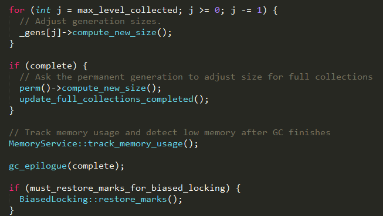  

1、gc完成后，调整内存堆中各内存代的大小；  
2、如果是`FGC`，则还需要调整永久代大小；获取`FullGCCount_lock`锁，对`_full_collections_completed`进行更新，并通过锁机制通知本次FGC已经完成；

#######step 11

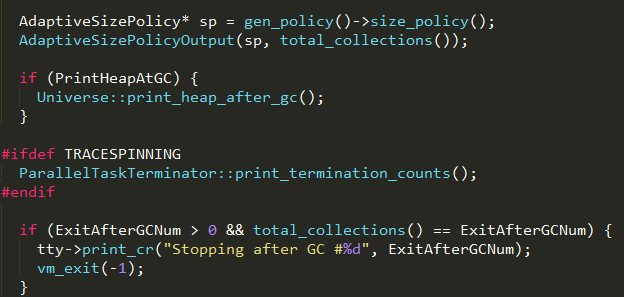  

1、打印内存堆的gc总次数和`FGC`次数；  
2、`ExitAfterGCNum`默认是0，如果设置`ExitAfterGCNum`大于0，且gc的总次数超过`ExitAfterGCNum`，则终止整个JVM进程；
