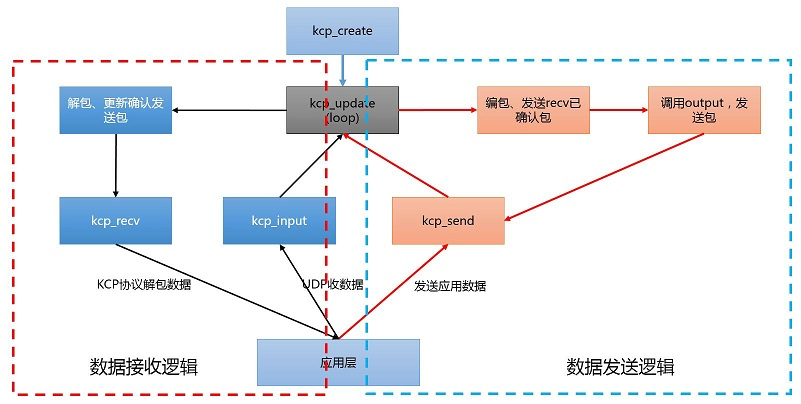
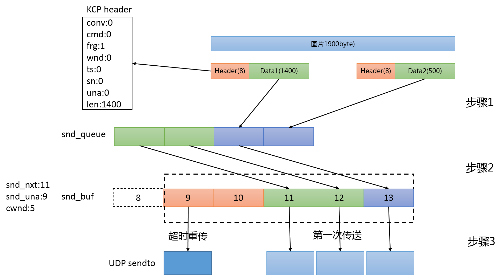
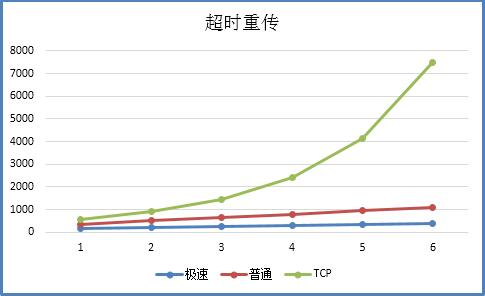
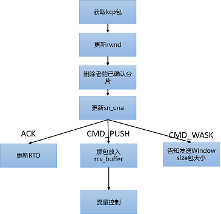
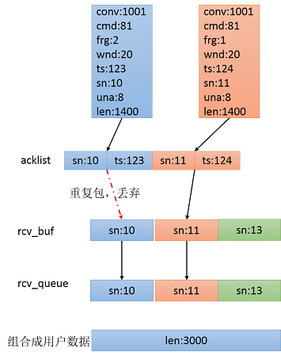
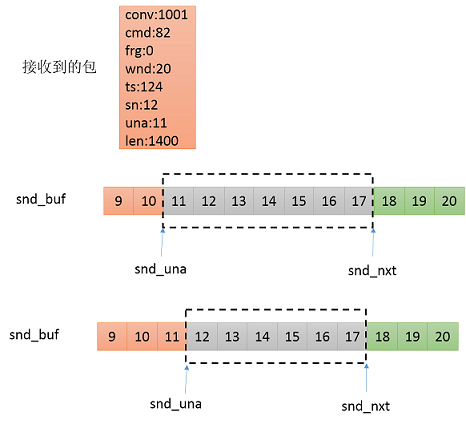
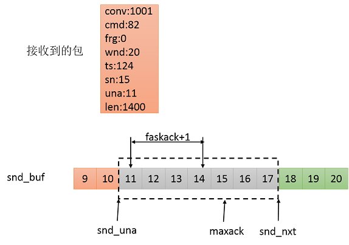
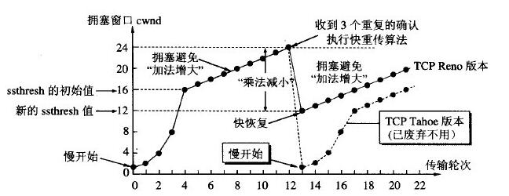
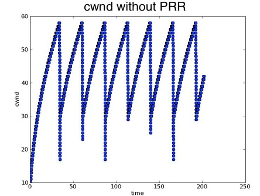

 
<!--BEGIN_DATA
{
    "create_date": "2019-10-31 17:59", 
    "modify_date": "2019-10-31 17:59", 
    "is_top": "0", 
    "summary": "KCP协议", 
    "tags": "C/C++、网络", 
    "file_name": "KCP协议.md"
}
END_DATA-->

####
原文出处：<a href='https://www.cnblogs.com/wetest/p/9190786.html' target='blank'>可靠UDP，KCP协议快在哪？</a>

<a href='https://github.com/skywind3000/kcp' target='blank'>GitHub</a>

**1 简介**

KCP是一个快速可靠协议，能以比 TCP浪费10%-20%的带宽的代价，换取平均延迟降低30%-40%，且最大延迟降低三倍的传输效果。纯算法实现，并不负责底层协议（如UDP）的收发，需要使用者自己定义下层数据包的发送方式，以callback的方式提供给 KCP。 连时钟都需要外部传递进来，内部不会有任何一次系统调用。本文传输协议之考虑UDP的情况。

名词说明（源码字段）：  
用户数据：应用层发送的数据，如一张图片2Kb的数据  
MTU：最大传输单元。即每次发送的最大数据  
RTO：Retransmission TimeOut，重传超时时间。  
cwnd:congestion window，拥塞窗口，表示发送方可发送多少个KCP数据包。与接收方窗口有关，与网络状况（拥塞控制）有关，与发送窗口大小有关。  
rwnd:receiver window,接收方窗口大小，表示接收方还可接收多少个KCP数据包  
snd\_queue:待发送KCP数据包队列  
snd\_nxt:下一个即将发送的kcp数据包序列号  
snd\_una:下一个待确认的序列号

**1.1****使用方式**

1\. 创建 KCP对象：

> // 初始化 kcp对象，conv为一个表示会话编号的整数，和tcp的 conv一样，通信双
>
> // 方需保证 conv相同，相互的数据包才能够被认可，user是一个给回调函数的指针
>
> ikcpcb *kcp = ikcp_create(conv, user);

2\. 设置传输回调函数（如UDP的send函数）：

> // KCP的下层协议输出函数，KCP需要发送数据时会调用它
>
> // buf/len 表示缓存和长度
>
> // user指针为 kcp对象创建时传入的值，用于区别多个 KCP对象
>
> int udp_output(const char *buf, int len, ikcpcb *kcp, void *user)
>
> {
>
>   ....
>
> }
>
> // 设置回调函数
>
> kcp->output = udp_output;

3\. 循环调用 update：

> // 以一定频率调用 ikcp_update来更新 kcp状态，并且传入当前时钟（毫秒单位）
>
> // 如 10ms调用一次，或用 ikcp_check确定下次调用 update的时间不必每次调用
>
> ikcp_update(kcp, millisec);

4\. 输入一个应用层数据包（如UDP收到的数据包）：

> //收到一个下层数据包（比如UDP包）时需要调用：ikcp\_input(kcp,received\_udp\_packet,received\_udp\_size);

处理了下层协议的输出/输入后 KCP协议就可以正常工作了，使用 ikcp\_send 来向远端发送数据。而另一端使用 ikcp\_recv(kcp, ptr, size)来接收数据。

[ kcp源码流程图 ]

总结：UDP收到的包，不断通过kcp\_input喂给KCP，KCP会对这部分数据（KCP协议数据）进行解包，重新封装成应用层用户数据，应用层通过kcp\_recv获取。应用层通过kcp\_send发送数据，KCP会把用户数据拆分kcp数据包，通过kcp\_output，以UDP（send）的方式发送。

**1.2 ****KCP的配置模式**

这部分KCP文档有介绍，理解KCP协议无需过于关注。协议默认模式是一个标准的 ARQ，需要通过配置打开各项加速开关：

1\. 工作模式：

> int ikcp_nodelay(ikcpcb *kcp, int nodelay, int interval, int resend, int nc)

  * nodelay ：是否启用 nodelay模式，0不启用；1启用。
  * interval ：协议内部工作的 interval，单位毫秒，比如 10ms或者 20ms
  * resend ：快速重传模式，默认0关闭，可以设置2（2次ACK跨越将会直接重传）
  * nc ：是否关闭流控，默认是0代表不关闭，1代表关闭。

**普通模式：** ikcp\_nodelay(kcp, 0, 40, 0, 0);

**极速模式：** ikcp\_nodelay(kcp, 1, 10, 2, 1)

1. 最大窗口

> int ikcp_wndsize(ikcpcb *kcp, int sndwnd, int rcvwnd);

该调用将会设置协议的最大发送窗口和最大接收窗口大小，默认为32. 这个可以理解为 TCP的 SND\_BUF 和 RCV\_BUF，只不过单位不一样 SND/RCV\_BUF 单位是字节，这个单位是包。

2\. 最大传输单元：

纯算法协议并不负责探测 MTU，默认 mtu是1400字节，可以使用ikcp\_setmtu来设置该值。该值将会影响数据包归并及分片时候的最大传输单元。

3\. 最小RTO：

不管是 TCP还是 KCP计算 RTO时都有最小 RTO的限制，即便计算出来RTO为40ms，由于默认的RTO是100ms，协议只有在100ms后才能检测到丢包，快速模式下为30ms，可以手动更改该值：  
kcp->rx\_minrto = 10;

**1.3 ****KCP为什么存在？**

首先要看TCP与UDP的区别，TCP与UDP都是传输层的协议，比较两者的区别主要应该是说TCP比UDP多了什么？

  
**面向连接：**TCP接收方与发送方维持了一个状态（建立连接，断开连接），双方知道对方还在。  
**可靠的：**发送出去的数据对方一定能够接收到，而且是按照发送的顺序收到的。  
**流量控制与拥塞控制：**TCP靠谱通过滑动窗口确保，发送的数据接收方来得及收。**TCP无私**，发生数据包丢失的时候认为整个网络比较堵，自己放慢数据发送速度。

  
TCP协议的可靠与无私让使用TCP开发更为简单，同时它的这种设计也导致了慢的特点。UDP协议简单，所以它更快。但是，UDP毕竟是不可靠的，应用层收到的数据可能是缺失、乱序的。KCP协议就是在保留UDP快的基础上，提供可靠的传输，应用层使用更加简单。

其他差别，TCP以字节流的形式，UDP以数据包的形式。很多人以为，UDP是不可靠的，所以sendto(1000),接收端recvfrom(1000)可能会收到900。这个是错误的。所谓数据包，就是说UDP是有界的，sendto(300),sendto(500)；接收到recvfrom(1000),recvfrom(1000)那么可能会收到300，500或者其中一个或者都没收到。UDP应用层发送的数据，在接收缓存足够的情况下，要么收到全的，要么收不到。

**总结：TCP可靠简单，但是复杂无私，所以速度慢。KCP尽可能保留UDP快的特点下，保证可靠。**

**2 KCP原理**

**2.1 ****协议简介**

KCP是一个可靠的传输协议，UDP本身是不可靠的，所以需要额外信息来保证传输数据的可靠性。因此，我们需要在传输的数据上增加一个包头。用于确保数据的可靠、有序。

> 0                         4      5     6      8 (BYTE)
>
> +-------------------+----+----+----+
>
> |      conv      | cmd | frg |  wnd |
>
> +-------------------+----+----+----+   8
>
> |         ts         |             sn           |
>
> +-------------------+----------------+  16
>
> |       una       |             len          |
>
> +-------------------+----------------+   24
>
> |                                                   |
>
> |            DATA (optional)          |
>
> |                                                   |
>
> +-------------------------------------+

conv:连接号。UDP是无连接的，conv用于表示来自于哪个客户端。对连接的一种替代cmd:命令字。如，IKCP\_CMD\_ACK确认命令，IKCP\_CMD\_WASK接收窗口大小询问命令，IKCP\_CMD\_WINS接收窗口大小告知命令，frg:分片，用户数据可能会被分成多个KCP包，发送出去wnd:接收窗口大小，发送方的发送窗口不能超过接收方给出的数值  
ts:时间序列  
sn:序列号  
una:下一个可接收的序列号。其实就是确认号，收到sn=10的包，una为11  
len：数据长度  
data:用户数据

后面的讲解，主要以极速模式： ikcp\_nodelay(kcp, 1, 10, 2,
1)为主，启用nodelay设置，刷新间隔控制在10ms，开启快速重传模式，关闭流量控制。

**2.2 ****数据发送过程**

**2.2.1 数据发送准备**

用户发送数据的函数为ikcp\_send。  
ikcp\_send(ikcpcb kcp, const char buffer, int len)  
该函数的功能非常简单，把用户发送的数据根据MSS进行分片。如上图，用户发送1900字节的数据，MTU为1400byte。因此，该函数会把1900byte的用户数据分成两个包，一个数据大小为1400，头frg设置为1，len设置为1400；第二个包，头frg设置为0，len设置为500。切好KCP包之后，放入到名为snd\_queue的待发送队列中。

注：流模式情况下，kcp会把两次发送的数据衔接为一个完整的kcp包。非流模式下，用户数据%MSS的包，也会作为一个包发送出去。

MTU，数据链路层规定的每一帧的最大长度，超过这个长度数据会被分片。通常MTU的长度为1500字节，IP协议规定所有的路由器均应该能够转发（512数据+60IP首部+4预留=576字节）的数据。MSS，最大输出大小（双方的约定），KCP的大小为MTU-kcp头24字节。IP数据报越短，路由器转发越快，但是资源利用率越低。传输链路上的所有MTU都一至的情况下效率最高，应该尽可能的避免数据传输的工程中，再次被分。UDP再次被分的后（通常1分为2），只要丢失其中的任意一份，两份都要重新传输。**因此，合理的MTU应该是保证数据不被再分的前提下，尽可能的大。**  
以太网的MTU通常为1500字节-IP头（20字节固定+40字节可选）-UDP头8个字节=1472字节。**KCP会考虑多传输协议，但是在UDP的情况下，设置为1472字节更为合理。**

**2.2.2 实际发送**

KCP会不停的进行update更新最新情况，数据的实际发送在update时进行。发送过程如下图所示：

[ KCP 发送过程 ]

**步骤1：待发送队列移至发送队列**  
KCP会把snd\_queue待发送队列中的kcp包，移至snd\_buf发送队列。移动的包的数量不会超过snd\_una+cwnd-snd\_nxt，确保发送的数据不会让接收方的接收队列溢出。该功能类似于TCP协议中的滑动窗口。cwnd=min(snd\_wnd,rmt\_wnd,kcp->cwnd)的最小值决定，snd\_wnd，rmt\_wnd比较好理解可发送的数据，可发送的数据最大值，应该是发送方可以发送的数据和接收方可以接收的数据的最小值。kcp->cwnd是拥塞控制的
一个值，跟网络状况相关，网络状况差的时候，KCP认为应该降低发送的数据，后面会有详细的介绍。  
如上图中，snd\_queue待发送队列中有4个KCP包等待发送，这个时候snd\_nxt下一个发送的kcp包序列号为11，snd\_una下一个确认的KCP包为9（8已经确认，9，10已经发送但是还没得到接收方的确认）。因为cwnd=5，发送队列中还有2个发送了但是还未得到确认，所以可以从待发送队列中取前面的3个KCP包放入到发送队列中，序列号分别设置为11,12,13。

**步骤2：发送发送队列的数据**  

发送队列中包含两种类型的数据，已发送但是尚未被接收方确认的数据，没被发送过的数据。没发送过的数据比较好处理，直接发送即可。重点在于已经发送了但是还没被接收方确认的数据，**该部分的策略直接决定着协议快速、高效与否。**KCP主要使用两种策略来决定是否需要重传KCP数据包，**超时重传、快速重传、选择重传。**

1、超时重传  
TCP超时计算是RTOx2，这样连续丢三次包就变成RTOx8了，而KCP非快速模式下每次+RTO，急速模式下+0.5RTO（实验证明1.5这个值相对比较好），**提高了传输速度。**

[ RTO算法对比图 ]

2、快速重传  
发送端发送了1,2,3,4,5几个包，然后收到远端的ACK: 1, 3, 4, 5，当收到ACK3时，KCP知道2被跳过1次，收到ACK4时，知道2被跳过了2次，此时可以认为2号丢失，不用等超时，直接重传2号包，**大大改善了丢包时的传输速度。**TCP有快速重传算法，TCP包被跳过3次之后会进行重传。  
注：可以通过统计错误重传（重传的包实际没丢，仅乱序），优化该设置。

3、选择重传  
老的TCP丢包时会全部重传从丢的那个包开始以后的数据，KCP是选择性重传，只重传真正丢失的数据包。但是，目前大部分的操作系统，linux与android手机均是支持SACK选择重传的。

**步骤3：数据发送**  
通过步骤2判定，kcp包是否需要发送，如果需要发送的kcp包则通过，kcp\_setoutput设置的发送接口进行发送，UDP通常为sendto。步骤3，会对较小的kcp包进行合并，一次性发送提高效率

**2.3 ****数据接收过程**

KCP的接收过程是将UDP收到的数据进行解包，重新组装顺序的、可靠的数据后交付给用户。

**2.3.1 KCP数据包接收**

kcp\_input输入UDP收到的数据包。kcp包对前面的24个字节进行解压，包括conv、 frg、 cmd、 wnd、 ts、 sn、 una、 len。根据una，会删除snd\_buf中，所有una之前的kcp数据包，因为这些数据包接收者已经确认。根据wnd更新接收端接收窗口大小。根据不同的命令字进行分别处理。数据接收后，更新流程如下所示：

[ 接收处理流程图 ]

**1、IKCP_CMD_PUSH数据发送命令**  

a、KCP会把收到的数据包的sn及ts放置在acklist中，两个相邻的节点为一组，分别存储sn和ts。**update时会读取acklist，并以IKCP_CMD_ACK的命令返回确认包**。如下图中，收到了两个kpc包，acklist中会分别存放10,123,11,124。  

b、kcp数据包放置rcv\_buf队列。丢弃接收窗口之外的和重复的包。然后将rcv\_buf中的包，移至rcv\_queue。原来的rcv\_buf中已经有sn=10和sn=13的包了，sn=10的kcp包已经在rcv\_buf中了，因此新收到的包会直接丢弃掉，sn=11的包放置至rcv\_buf中。  

c、把rcv\_buf中前面连续的数据sn=11，12，13全部移动至rcv\_queue，rcv\_nxt也变成14。

**rcv_queue的数据是连续的，rcv_buf可能是间隔的**  
d、kcp\_recv函数，用户获取接收到数据（去除kcp头的用户数据）。该函数根据frg，把kcp包数据进行组合返回给用户。

**2、IKCP_CMD_ACK数据确认包**  

两个使命：1、RTO更新，2、确认发送包接收方已接收到。

**正常情况：**收到的sn为11,una为12。表示sn为11的已经确认，下一个等待接收的为12。发送队列中，待确认的一个包为11，这个时候snd\_una向后移动一位，序列号为11的包从发送队列中删除。

[ 数据确认包处理流程 ]

**异常情况：**如下图所示，sn!=11的情况均为异常情况。sn<11表示，收到重复确认的包，如本来以为丢失的包重新又收到了，所以产生重复确认的包；sn>17，收到没发送过的序列号，概率极低，可能是conv没变重启程序导致的；112，则启动快速重传

[ KCP快速确认 ]

确认包发送，接收到的包会全部放在acklist中，以IKCP\_CMD\_ACK包发送出去

**3 流量控制与拥塞控制**

**3.1 ****RTO计算（与TCP完全一样）**

RTT：一个报文段发送出去，到收到对应确认包的时间差。  
SRTT(kcp->rx\_srtt)：RTT的一个加权RTT平均值，平滑值。  
RTTVAR(kcp->rx\_rttval)：RTT的平均偏差，用来衡量RTT的抖动。

**3.2 ****流量控制**

流量控制是点对点的通信量的控制，是一个端到端的问题。总结起来，就是发送方的速度要匹配接收方接收（处理）数据的速度。发送方要抑制自身的发送速率，以便使接收端来得及接收。

  
KCP的发送机制采用TCP的滑动窗口方式，可以非常容易的控制流量。KCP的头中包含wnd，即接收方目前可以接收的大小。能够发送的数据即为snd\_una与snd\_una+wnd之间的数据。接收方每次都会告诉发送方我还能接收多少，发送方就控制下，确保自己发送的数据不多于接收端可以接收的大小。

KCP默认为32，即可以接收最大为32*MTU=43.75kB。KCP采用update的方式，更新间隔为10ms，那么KCP限定了你最大传输速率为4375kB/s，在高网速传输大内容的情况下需要调用ikcp_wndsize调整接收与发送窗口。

KCP的主要特色在于实时性高，对于实时性高的应用，如果发生数据堆积会造成延迟的持续增大。建议从应用侧更好的控制发送流量与网络速度持平，避免缓存堆积延迟。（详见参考资料）

**3.3 ****拥塞控制（KCP可关闭）**

KCP的优势在于可以完全关闭拥塞控制，非常自私的进行发送。KCP采用的拥塞控制策略为TCP最古老的策略，无任何优势。完全关闭拥塞控制，也不是一个最优策略，它全是会造成更为拥堵的情况。  
网络中链路的带宽，与整条网络中的交换节点（路由器、交换机、基站等）有关。如果，所有使用该链路的流量超出了，该链路所能提供的能力，就会发生拥塞。车多路窄，就会堵车，车越多堵的越厉害。因此，TCP作为一个大公无私的协议，当网络上发送拥堵的时候会降低自身发送数据的速度。拥塞控制是整个网络的事情，流量控制是发送和接收两方的事情。  
当发送方没有按时接收到确认包，就认为网络发生了拥堵行为。TCP拥塞控制的方式，归结为慢开始、拥塞避免，如下图所示

[ 拥塞控制算法 ]

KCP发生丢包的情况下的拥塞控制策略与TCP Tahoe版本的策略一致。TCP
Reno版本已经使用快恢复策略。**因此，丢包的情况下，其实KCP拥塞控制策略比TCP更为苛刻。**

KCP在发生快速重传，数据包乱序时，采用的是TCP快恢复的策略。控制窗口调整为已经发送没有接收到ack的数据包数目的一半+resent。

注：目前kernel 3.2以上的linux，默认采用google改进的拥塞控制算法，Proportional Rate Reduction for TCP。该算法的主要特点为，的cwnd如下图所示：

####
原文出处：<a href='https://blog.csdn.net/qq_36748278/article/details/80171575' target='blank'>KCP原理及源码解析</a>

什么是KCP？为什么要使用KCP？  
KCP是一个快速可靠协议。它主要的设计目的是为了解决在网络拥堵的情况下TCP协议网络速度慢的问题，**增大网络传输速率**，但相当于TCP而言，会相应的牺牲一部分带宽。  
kcp没有规定下层传输协议，一般用UDP作为下层传输协议。kcp层协议的数据包在UDP数据报文的基础上增加控制头。当用户数据很大，大于一个UDP包能承担的范围时（大于MSS），kcp会将用户数据分片存储在多个kcp包中。因此每个kcp包称为一个分片。

首先我们先复习一下网络协议的一些基本的概念，这对我们理解KCP有很大的帮助。

**超时与重传**  
超时重传指的是，发送数据包在一定的时间内没有收到相应的ACK，等待一定的时间，超时之后就认为这个数据包丢失，就会重新发送。这个等待时间被称为RTO，即重传超时时间。

**滑动窗口**  
TCP通过确认机制来保证数据传输的可靠性。在早期的时候，发送数据方在发送数据之后会启动定时器，在一定时间内，如果没有收到发送数据包的ACK报文，就会重新发送数据，直到发送成功为止。但是这种停等的重传机制必须等待确认之后才能发送下一个包，传输速度比较慢。  
为了提高传输速度，发送方不必在每发送一个包之后就进行等待确认，而是可以发送多个包出去，然后等待接收方一 一确认。但是接收方不可能同时处理无限多的数据，因此需要限制发送方往网络中发送的数据数量。接收方在未收到确认之前，发送方在只能发送wnd大小的数据，这个机制叫做滑动窗口机制。TCP的每一端都可以收发数据。每个TCP活连接的两端都维护一个发送窗口和接收窗口结构。

###kcp结构体字段含义

snd_una：第一个未确认的包  
snd_nxt：下一个待分配的包的序号

KCP通过以下方式提高速率：  
（1）RTO。  
TCP的RTO是以2倍的方式来计算的。当丢包的次数多的时候，重传超时时间RTO就非常非常的大了，重传就非常的慢，效率低，性能差。而KCP的RTO可以以1.5倍的速度增长，相对于TCP来说，有更短的重传超时时间。  
（2）快速重传机制—无延迟ACK回复模式  
假如开启KCP的快速重传机制，并且设置了当重复的ACK个数大于resend时候，直接进行重传。 当发送端发送了1,2,3,4,5五个包，然后收到远端的ACK：1,3,4,5。当收到ACK3时，KCP知道2被跳过1次，当收到ACK4的时候，KCP知道2被跳过2次，当次数大于等于设置的resend的值的时候，不用等到超时，可直接重传2号包。这就是KCP的快速重传机制。  

下面是设置快速重传机制的源码：

    
    
    //nodelay:   0 不启用，1启用快速重传模式
    //interval： 内部flush刷新时间
    //resend:    0（默认）表示关闭。可以自己设置值，若设置为2（则2次ACK跨越将会直接重传）
    //nc:        是否关闭拥塞控制，0（默认）代表不关闭，1代表关闭
    int ikcp_nodelay(ikcpcb *kcp, int nodelay, int interval, int resend, int nc)
    {
    	if (nodelay >= 0)              //大于0表示启用快速重传模式
    	{             
    		kcp->nodelay = nodelay;
    		if (nodelay) {
    			kcp->rx_minrto = IKCP_RTO_NDL;	//最小重传超时时间（如果需要可以设置更小）
    		} else{
    			kcp->rx_minrto = IKCP_RTO_MIN;  
    		}
    	}
    	if (interval >= 0) {
    		if (interval > 5000) 
    			interval = 5000;
    		else if (interval < 10) 
    			interval = 10;
    		kcp->interval = interval;           //内部flush刷新时间
    	}
    	if (resend >= 0) {                     // ACK被跳过resend次数后直接重传该包, 而不等待超时
    		kcp->fastresend = resend           // fastresend : 触发快速重传的重复ack个数
    	}
    	if (nc >= 0) {
    		kcp->nocwnd = nc;
    	}
    	return 0;
    }
    
    
（3）选择重传  
KCP采用滑动窗口机制来提高发送速度。由于UDP是不可靠的传输方式，会存在丢包和薄、包的乱序。而KCP是可靠的且保证数据有序的协议。为了保证包的顺序，接收方会维护一个接收窗口，接收窗口有一个起始序号 **rcv_nxt（待接收消息序号）**以及尾序号 rcv\_nxt + rcv\_wnd（接收窗口大小）。如果接收窗口收到序号为 rcv\_nxt 的分片（刚好是接收端待接收的消息序号），那么 rcv\_nxt就加一，也就是滑动窗口右移，并把该数据放入接收队列供应用层取用。如果收到的数据在窗口范围内但不是 rcv\_nxt，那么就把数据保存起来，等收到rcv\_nxt序号的分片时再一并放入接收队列供应用层取用。  
当丢包发生的时候，假设第n个包丢失了，但是第n+1,n+2个包都已经传输成功了，此时只重传第n个包，二部重传成功传输的n+1,n+2号包，这就是选择重传。为了能够做到选择重传，接收方需要告诉发送方哪些包它收到了。比如在返回的ACK中包含rcv\_nxt和sn，rcv\_nxt的含义是接收方已经成功按顺序接收了rcv\_nxt序号之前的所有包，大于rcv\_nxt的序号sn表示的是在接收窗口内的不连续的包。那么根据这两个参数就可以计算出哪些包没有收到了。发送方接收到接收方发过来的数据时，首先解析rcv\_nxt，把所有小于rcv\_nxt序号的包从发送缓存队列中移除。然后再解析sn（大于rcv\_nxt），遍历发送缓存队列，找到所有序号小于sn的包，根据我们设置的快速重传的门限，对每个分片维护一个快速重传的计数，每收到一个ack解析sn后找到了一个分片，就把该分片的快速重传的计数加一，如果该计数达到了快速重传门限，那么就认为该分片已经丢失，可以触发快速重传，该门限值在kcp中可以设置。  
（4）拥塞窗口  
当网络状态不好的时候，KCP会限制发送端发送的数据量，这就是拥塞控制。拥塞窗口（cwnd）会随着网络状态的变化而变化。这里采用了慢启动机制，慢启动也就是控制拥塞窗口从0开始增长，在每收到一个报文段确认后，把拥塞窗口加1，多增加一个MSS的数值。但是为了防止拥塞窗口过大引起网络阻塞，还需要设置一个慢机制的的门限（ssthresh即拥塞窗口的阈值）。当拥塞窗口增长到阈值以后，就减慢增长速度，缓慢增长。  
但是当网络很拥堵的情况下，导致发送数据出现重传时，这时说明网络中消息太多了，用户应该减少发送的数据，也就是拥塞窗口应该减小。怎么减小呢，在快速重传的情况下，有包丢失了但是有后续的包收到了，说明网络还是通的，这时采取拥塞窗口的退半避让,拥塞窗口减半，拥塞门限减半。减小网络流量，缓解拥堵。当出现超时重传的时候，说明网络很可能死掉了，因为超时重传会出现，原因是有包丢失了，并且该包之后的包也没有收到，这很有可能是网络死了，这时候，拥塞窗口直接变为1，不再发送新的数据，直到
丢失的包传输成功。  
  
###KCP主要工作过程：

**把要发送的buffer分片成KCP的数据包格式，插入待发送队列中**。  
当用户的数据超过一个MSS(最大分片大小)的时候，会对发送的数据进行分片处理。KCP采用的是流的方式进行分片处理。通过frg进行排序区分，frg即message中的segment分片ID，在message中的索引，由大到小，0表示最后一个分片。比如3,2,1,0。即把message分成了四个分片，分片的ID分别
是4,3,2,1

**分片方式共有两种：**  
消息方式。将用户数据分片，为每个分片设置ID，将分片后的数据一个一个地存入发送队列，接收方通过id解析原来的包，消息方式一个分片的数据量可能不能达到MSS  流方式。检测每个发送队列里的分片是否达到最大MSS，如果没有达到就会用新的数据填充分片。  
网络速度：流方式 > 消息方式  
接收数据：流方式一个分片一个分片的的接收。消息方式kcp的接收函数会把自己原本属于一个数据的分片重组

    
    
    int ikcp_send(ikcpcb *kcp, const char *buffer, int len)
    {
    	IKCPSEG *seg;
    	int count, i;
    	assert(kcp->mss > 0);
    	if (len < 0) return -1;
    	//根据len计算出需要多少个分片
    	if (len <= (int)kcp->mss) 
    		count = 1;
    	else 
    		count = (len + kcp->mss - 1) / kcp->mss;   
    	if (count > 255) 
    		return -2;
    	if (count == 0) 
    		count = 1;
    	// fragment
    	for (i = 0; i < count; i++) {
    		int size = len > (int)kcp->mss ? (int)kcp->mss : len;   //获取当前分片的长度，存放到size中
    		seg = ikcp_segment_new(kcp, size);      
    		assert(seg);
    		if (seg == NULL) {
    			return -2;
    		}
    		if (buffer && len > 0) {
    			memcpy(seg->data, buffer, size);
    		}
    		seg->len = size;
    		seg->frg = count - i - 1;    //frg用来表示被分片的序号，从大到小递减
    		iqueue_init(&seg->node);
    		iqueue_add_tail(&seg->node, &kcp->snd_queue);   //把segment分片插入到发送队列中
    		kcp->nsnd_que++;
    		if (buffer) {
    			buffer += size;
    		}
    		len -= size;
    	}
    	return 0;
    }

  

**将发送队列中的数据通过下层协议UDP进行发送**  
`void ikcp_flush(ikcpcb *kcp)`主要处理一下四种情况：  
(1)发送ack

    
    
    // flush acknowledges
    count = kcp->ackcount;
    for (i = 0; i < count; i++) {
    	size = (int)(ptr - buffer);
    	if (size + IKCP_OVERHEAD > IKCP_OVERHEAD) {
    		ikcp_output(kcp, buffer, size);
    		ptr = buffer;
    	}
    	ikcp_ack_get(kcp, i, &seg.sn, &seg.ts);   //sn:message分片segment的序号,ts:message发送时刻的时间戳
    	ptr = ikcp_encode_seg(ptr, &seg);
    }
    kcp->ackcount = 0;
    

(2)发送探测窗口消息

    
    
    // probe window size (if remote window size equals zero)
    if (kcp->rmt_wnd == 0) {								//远端接收窗口大小为0的时候
    	if (kcp->probe_wait == 0) {                         //探查窗口需要等待的时间为0
    		kcp->probe_wait = IKCP_PROBE_INIT;              //设置探查窗口需要等待的时间
    		kcp->ts_probe = kcp->current + kcp->probe_wait; //设置下次探查窗口的时间戳 = 当前时间 + 探查窗口等待时间间隔
    	}	
    	else {
    		if (_itimediff(kcp->current, kcp->ts_probe) >= 0) { //当前时间 > 下一次探查窗口的时间
    			if (kcp->probe_wait < IKCP_PROBE_INIT) 
    				kcp->probe_wait = IKCP_PROBE_INIT;
    			kcp->probe_wait += kcp->probe_wait / 2;   //等待时间变为之前的1.5倍
    			if (kcp->probe_wait > IKCP_PROBE_LIMIT)
    				kcp->probe_wait = IKCP_PROBE_LIMIT;   //若超过上限，设置为上限值
    			kcp->ts_probe = kcp->current + kcp->probe_wait;  //计算下次探查窗口的时间戳
    			kcp->probe |= IKCP_ASK_SEND;         //设置探查变量。IKCP_ASK_TELL表示告知远端窗口大小。IKCP_ASK_SEND表示请求远端告知窗口大小
    		}
    	}
    }	else {
    	kcp->ts_probe = 0;
    	kcp->probe_wait = 0;
    }
    // flush window probing commands。IKCP_ASK_SEND表示请求远端告知窗口大小
    if (kcp->probe & IKCP_ASK_SEND) {
    	seg.cmd = IKCP_CMD_WASK;
    	size = (int)(ptr - buffer);
    	if (size + IKCP_OVERHEAD > IKCP_OVERHEAD) {
    		ikcp_output(kcp, buffer, size);     //KCP的下层输出协议，通过设置回调函数来实现
    		ptr = buffer;
    	}
    	ptr = ikcp_encode_seg(ptr, &seg);
    }
    // flush window probing commands。IKCP_ASK_TELL表示告知远端窗口大小
    if (kcp->probe & IKCP_ASK_TELL) {
    	seg.cmd = IKCP_CMD_WINS;
    	size = (int)(ptr - buffer);
    	if (size + IKCP_OVERHEAD > IKCP_OVERHEAD) {
    		ikcp_output(kcp, buffer, size);
    		ptr = buffer;
    	}
    	ptr = ikcp_encode_seg(ptr, &seg);
    }
    // flash remain no data segments
    size = (int)(ptr - buffer);
    if (size > 0) {
    	ikcp_output(kcp, buffer, size);
    	ptr = buffer;
    }
    kcp->probe = 0;
    

（3）计算拥塞窗口大小

    
    
    // calculate window size
    cwnd = _imin_(kcp->snd_wnd, kcp->rmt_wnd);    //cwnd = 发送窗口大小 和 远端接收窗口大小的最小值
    if (kcp->nocwnd == 0)                         //不取消拥塞控制
    	cwnd = _imin_(kcp->cwnd, cwnd);           //拥塞窗口 = 当前拥塞窗口和cwnd的最小值（也就是取当前拥塞窗口、发送窗口、接收窗口的最小值）

（4）将**发送队列中的消息存入发送缓存队列**(发送缓存队列就是发送窗口)

    
    
    while (_itimediff(kcp->snd_nxt, kcp->snd_una + cwnd) < 0) {
    	IKCPSEG *newseg;
    	if (iqueue_is_empty(&kcp->snd_queue)) 
    		break;
    	newseg = iqueue_entry(kcp->snd_queue.next, IKCPSEG, node);  //snd_queue：发送消息的队列
    	iqueue_del(&newseg->node);                      //从发送消息队列中，删除节点
    	iqueue_add_tail(&newseg->node, &kcp->snd_buf);  //然后把删除的节点，加入到kcp的发送缓存队列中
    	kcp->nsnd_que--; 
    	kcp->nsnd_buf++;
    	newseg->conv = kcp->conv;     //会话id
    	newseg->cmd = IKCP_CMD_PUSH;  //cmd：用来区分分片的作用。IKCP_CMD_PUSH:数据分片，IKCP_CMD_ACK:ack分片，IKCP_CMD_WASK：请求告知窗口大小，IKCP_CMD_WINS:告知窗口大小
    	newseg->wnd = seg.wnd;  
    	newseg->ts = current;           
    	newseg->sn = kcp->snd_nxt++;  //下一个待发报的序号
    	newseg->una = kcp->rcv_nxt;   //待收消息序号
    	newseg->resendts = current;   //下次超时重传的时间戳
    	newseg->rto = kcp->rx_rto;    //由ack接收延迟计算出来的重传超时时间
    	newseg->fastack = 0;          //收到ack时计算的该分片被跳过的累计次数
    	newseg->xmit = 0;             //发送分片的次数，每发送一次加一
    }
    

（5）检查缓存队列中当前需要发送的数据(包括新传数据和重传数据)

    
    
    // flush data segments
    for (p = kcp->snd_buf.next; p != &kcp->snd_buf; p = p->next) {
    	IKCPSEG *segment = iqueue_entry(p, IKCPSEG, node);
    	int needsend = 0;
    	if (segment->xmit == 0) {
    		needsend = 1;
    		segment->xmit++;     			//发送分片的次数
    		segment->rto = kcp->rx_rto; 	//该分片超时重传的时间戳
    		segment->resendts = current + segment->rto + rtomini;  //下次超时重传的时间戳
    	}
    	else if (_itimediff(current, segment->resendts) >= 0) {   //当前时间>下次重传时间。说明没有重传，即丢包了？
    		needsend = 1;
    		segment->xmit++;
    		kcp->xmit++;
    		if (kcp->nodelay == 0) {        //0：表示不启动快速重传模式
    			segment->rto += kcp->rx_rto;    //不启动快速重传模式，每次重传之后rto的时间就是之前的2倍
    		}	else {
    			segment->rto += kcp->rx_rto / 2;  //启用快速重传之后，rto变成原来的1.5倍
    		}
    		segment->resendts = current + segment->rto;
    		lost = 1;
    	}
    	else if (segment->fastack >= resent) {     //fastack：表示收到ack计算的该分片被跳过的累积次数
    		needsend = 1;
    		segment->xmit++;
    		segment->fastack = 0;
    		segment->resendts = current + segment->rto;
    		change++;
    	}
    	if (needsend) {
    		int size, need;
    		segment->ts = current;
    		segment->wnd = seg.wnd;       //剩余接收窗口大小。即接收窗口大小-接收队列大小
    		segment->una = kcp->rcv_nxt;  //待接收消息序号
    		size = (int)(ptr - buffer);
    		need = IKCP_OVERHEAD + segment->len;   //segment报文默认大小 + segment的长度
    		// 禁止数据包合包
    		if (size + need > IKCP_OVERHEAD) {
    			ikcp_output(kcp, buffer, size, IKCP_RETRY_FLAG);
    			ptr = buffer;
    		}
    		ptr = ikcp_encode_seg(ptr, segment);
    		if (segment->len > 0) {
    			memcpy(ptr, segment->data, segment->len);
    			ptr += segment->len;
    		}
    		if (segment->xmit >= kcp->dead_link) {
    			kcp->state = -1;
    		}
    		// 重试次数打日志
    		if (segment->xmit > 1)
    		{
    			ikcp_log(kcp, 0x80000000, "xmit: %d, sn: %d, rto: %u", segment->xmit, segment->sn, segment->rto);
    		}
    	}
    }
    // flash remain segments
    size = (int)(ptr - buffer);
    if (size > 0) {
    	ikcp_output(kcp, buffer, size, IKCP_RETRY_FLAG);
    }
    
   
（6）根据重传数据更新发送窗口大小

（7）在发生快速重传的时候，会将慢启动阈值调整为当前发送窗口的一半，并把拥塞窗口大小调整为kcp.ssthresh + resent，resent是触发快速
重传的丢包的次数，resent的值代表的意思在被弄丢的包后面收到了resent个数的包的ack，也就是我们在ikcp_nodelay方法中设置的resend
的值。这样调整后kcp就进入了拥塞控制状态。

    
    
    if (change) {
    	IUINT32 inflight = kcp->snd_nxt - kcp->snd_una;   //下一个要分配的包 - 第一个未确认的包
    	kcp->ssthresh = inflight / 2;                     //change=1说明发生过快速重传。当发生快速重传的时候，会将慢启动阈值调整为当前发送窗口的一半
    	if (kcp->ssthresh < IKCP_THRESH_MIN)
    		kcp->ssthresh = IKCP_THRESH_MIN;   
    	kcp->cwnd = kcp->ssthresh + resent;   //并把拥塞窗口大小 = 拥塞窗口阈值 + 触发快速重传的ack大小
    	kcp->incr = kcp->cwnd * kcp->mss;
    }
    
   
（8）如果发生的超时重传，那么就重新进入慢启动状态。

    
    
    if (lost) {
    	kcp->ssthresh = cwnd / 2;   //丢包了。窗口的大小需要减半
    	if (kcp->ssthresh < IKCP_THRESH_MIN)
    		kcp->ssthresh = IKCP_THRESH_MIN;
    	kcp->cwnd = 1;
    	kcp->incr = kcp->mss;
    }
    

**kcp接收到下层协议UDP传进来的数据底层数据buffer转换成kcp的数据包格式**  
`int ikcp_input(ikcpcb *kcp, const char *data, long size)`  
KCP报文分为ACK报文、数据报文、探测窗口报文、响应窗口报文四种。  
kcp报文的una字段（snd\_una：第一个未确认的包）表示对端希望接收的下一个kcp包序号，也就是说明接收端已经收到了所有小于una序号的kcp包。解析
una字段后需要把发送缓冲区里面包序号小于una的包全部丢弃掉。

**ack报文**则包含了对端收到的kcp包的序号，接到ack包后需要删除发送缓冲区中与ack包中的发送包序号（sn）相同的kcp包。
    
    
    if (cmd == IKCP_CMD_ACK) {
    	if ((_itimediff(kcp->current, ts) >= 0) && (_itimediff(sn, kcp->maxsn) >= 0)) {
    		ikcp_update_ack(kcp, _itimediff(kcp->current, ts));
    	}
    #if 0
    	{
    		ikcp_log(kcp, 0x80000000, "[ACK]conv: %d, sn: %d, ts: %u, current: %u", kcp->conv, sn, ts, kcp->current);
    	}
    #endif
    	ikcp_parse_ack(kcp, sn);
    	ikcp_shrink_buf(kcp);
    	if (ikcp_canlog(kcp, IKCP_LOG_IN_ACK)) {
    		ikcp_log(kcp, IKCP_LOG_IN_DATA, 
    			"input ack: sn=%lu rtt=%ld rto=%ld", sn, 
    			(long)_itimediff(kcp->current, ts),
    			(long)kcp->rx_rto);
    	}
    }
    
    static void ikcp_parse_ack(ikcpcb *kcp, IUINT32 sn)
    {
    	struct IQUEUEHEAD *p, *next;
    	if (_itimediff(sn, kcp->snd_una) < 0 || _itimediff(sn, kcp->snd_nxt) >= 0)
    		return;
    	for (p = kcp->snd_buf.next; p != &kcp->snd_buf; p = next) {
    		IKCPSEG *seg = iqueue_entry(p, IKCPSEG, node);
    		next = p->next;
    		if (sn == seg->sn) {
    			iqueue_del(p);
    			kcp->sumxmit += seg->xmit;
    			++kcp->sumseg;
    			ikcp_segment_delete(kcp, seg);
    			kcp->nsnd_buf--;
    			break;
    		}
    		else {
    			// 序号为sn的被跳过了
    			seg->fastack++;
    		}
    	}
    }

**收到数据报文时**，需要判断数据报文是否在接收窗口内，如果是则保存ack，如果数据报文的sn正好是待接收的第一个报文rcv\_nxt，那么就更新rcv\_nxt(加1)。如果配置了ackNodelay模式（无延迟ack）或者远端窗口为0（代表暂时不能发送用户数据），那么这里会立刻fulsh（）发送ack。
    
    
    else if (cmd == IKCP_CMD_PUSH) {    //数据报文
    	if (ikcp_canlog(kcp, IKCP_LOG_IN_DATA)) {
    		ikcp_log(kcp, IKCP_LOG_IN_DATA, 
    			"input psh: sn=%lu ts=%lu", sn, ts);
    	}
    	if (_itimediff(sn, kcp->rcv_nxt + kcp->rcv_wnd) < 0) {
    		ikcp_ack_push(kcp, sn, ts);     //sn:message分片segment的序号,ts:message发送时刻的时间戳
    		if (_itimediff(sn, kcp->rcv_nxt) >= 0) {
    			seg = ikcp_segment_new(kcp, len);
    			seg->conv = conv;
    			seg->cmd = cmd;
    			seg->frg = frg;
    			seg->wnd = wnd;
    			seg->ts = ts;
    			seg->sn = sn;
    			seg->una = una;
    			seg->len = len;
    			if (len > 0) {
    				memcpy(seg->data, data, len);
    			}
    			ikcp_parse_data(kcp, seg);
    		}
    	}
    }
    
  

如果snd\_una增加了那么就说明对端正常收到且回应了发送方发送缓冲区第一个待确认的包，此时需要更新cwnd（拥塞窗口）

    
    
    if (_itimediff(kcp->snd_una, una) > 0) {     //如果第一个未确认的包的序号>待接收消息序号
        if (kcp->cwnd < kcp->rmt_wnd) {          //用拥塞口大小 < 远端接收窗口大小
           IUINT32 mss = kcp->mss;
            if (kcp->cwnd < kcp->ssthresh) {     //拥塞窗口大小 < 拥塞窗口阈值
                kcp->cwnd++;                     //拥塞窗口+1
                 kcp->incr += mss;                //可发送最大数据量增加最大分片个大小
             }   else {
               if (_itimediff(kcp->snd_una, una) > 0) {
    		if (kcp->cwnd < kcp->rmt_wnd) {
    			IUINT32 mss = kcp->mss;
    			if (kcp->cwnd < kcp->ssthresh) {
    				kcp->cwnd++;
    				kcp->incr += mss;
    			}	else {
    				if (kcp->incr < mss) kcp->incr = mss;
    				kcp->incr += (mss * mss) / kcp->incr + (mss / 16);
    				if ((kcp->cwnd + 1) * mss <= kcp->incr) {
    					kcp->cwnd++;
    				}
    			}
    			if (kcp->cwnd > kcp->rmt_wnd) {
    				kcp->cwnd = kcp->rmt_wnd;
    				kcp->incr = kcp->rmt_wnd * mss;
    			}
    		}
    	}
  
  

**kcp将接收到的kcp数据包还原成之前kcp发送的buffer数据**  
`int ikcp_recv(ikcpcb *kcp, char *buffer, int len)`

<a href='https://blog.csdn.net/yongkai0214/article/details/85156452' target='blank'>KCP 协议与源码分析（一）</a>

<a href='https://blog.csdn.net/yongkai0214/article/details/85212831' target='blank'>KCP 协议与源码分析（二）</a>

####
原文出处：<a href='http://kaiyuan.me/2017/07/29/KCP%E6%BA%90%E7%A0%81%E5%88%86%E6%9E%90/' target='blank'>KCP: 快速可靠的ARQ协议</a>

这段时间看的东西有些杂，先是花了一个星期重新把 golang 的语法回顾了一遍，思考了一下 golang 与 C++ 不同的设计哲学；然后又陆陆续续地看了一些 lock-free 相关的论文以及与之相关的多线程内存模型，总体而言，这些内容在脑海在都还未成体系，因此都先暂时按下不表，今天先花点时间来记录一个简单的应用层 ARQ 协议 – [KCP](https://github.com/skywind3000/kcp)。

###KCP 简介

[KCP](https://github.com/skywind3000/kcp) 是一个快速可靠协议，能以比 TCP 浪费 10%-20% 的带宽的代价，换取平均延迟降低 30%-40%，且最大延迟降低三倍的传输效果。KCP 主要利用了如下思想来加快数据在网络中的传输：

  1. 相比于 TCP，KCP 启动快速模式后 超时 RTO 更新不再 x2，而是 x1.5，避免 RTO 快速膨胀。
  2. TCP 丢包时会全部重传从丢的那个包开始以后的数据，KCP 是选择性重传，只重传真正丢失的数据包。
  3. TCP 为了充分利用带宽，延迟发送 ACK（NODELAY 都没用），这样超时计算会算出较大 RTT 时间，延长了丢包时的判断过程。KCP 的 ACK 是否延迟发送可以调节。
  4. ARQ 模型响应有两种，UNA（此编号前所有包已收到，如TCP）和 ACK（该编号包已收到），光用 UNA 将导致全部重传，光用 ACK 则丢失成本太高，以往协议都是二选其一，而 KCP 协议中，除去单独的 ACK 包外，所有包都有 UNA 信息。
  5. KCP 正常模式同 TCP 一样使用公平退让法则，即发送窗口大小由：发送缓存大小、接收端剩余接收缓存大小、丢包退让及慢启动这四要素决定。但传送及时性要求很高的小数据时，可选择通过配置跳过后两步，仅用前两项来控制发送频率。

在理论上，以上的几点优化对于一个了解 TCP 协议的程序员都容易理解。在实践上，KCP 已被广泛地应用到游戏（例如 moba 类的王者荣耀）等领域，也证明了其降低传输延迟的有效性。但是从更高的角度而言，**KCP 协议牺牲了网络协议的公平性（TCP Fairness）来贪婪的占用网速，对于提升下一代网络环境而言并不是一个好的方案，其不应该成为 next-net 关注的目标**。相比之下，google 在不久前提出的 [BBR](https://github.com/google/bbr) 的目标则更加有意义：在下一代中替换 TCP 协议，实现保证传输延迟的前提下最大化地提升网络带宽。关于 BBR 协议的 motivation，以后有时间再慢慢说。

###KCP 实现

简单而言，我们可以把 KCP 协议当做一个应用层协议，这也是为什么 KCP 可以以非侵入式的方式集成到大部分已有的网络传输方案中。下图展示了 KCP 在协议栈中所处的位置（一般而言，KCP 底层均采用 UDP 传输）：

    
    
                            +-----------------+
                            | SESSION         |
                            +-----------------+
                            | KCP(ARQ)        |
                            +-----------------+
                            | UDP(PACKET)     |
                            +-----------------+
                            | IP              |
                            +-----------------+
                            | LINK            |
                            +-----------------+
                            | PHY             |
                            +-----------------+
    

#####KCP 基本数据结构

KCP 所使用的 Segment 定义如下，所有不同种类的 KCP 报文均使用相同的报文格式：

    
    
    struct IKCPSEG
    {
        struct IQUEUEHEAD node;  
        IUINT32 conv, cmd, frg;
        IUINT32 wnd, ts;
        IUINT32 sn, una;
        IUINT32 len;
        IUINT32 resendts, rto;
        IUINT32 fastack;
        IUINT32 xmit;
        char data[1];
    };
    

  1. `node` 节点用来串接多个 KCP segment，也就是前向后向指针；
  2. `conv` 是会话编号，通信双方必须一致才能使用 KCP 协议交换数据；
  3. `cmd` 表明当前报文的类型，KCP 共有四种类型： 
    * IKCP_CMD_PUSH : 传输的数据包
    * IKCP_CMD_ACK : ACK包，类似于 TCP中的 ACK，通知对方收到了哪些包
    * IKCP_CMD_WASK : 用来探测远端窗口大小
    * IKCP_CMD_WINS : 告诉对方自己窗口大小
  4. `frg` 分片的编号，当输出数据大于 MSS 时，需要将数据进行分片，frg 记录了分片时的倒序序号；
  5. `wnd` 填写己方的可用窗口大小，`ts` 记录了发送时的时间戳，用来估计 RTT；
  6. `sn` 为 data 报文的编号或者 ack 报文的确认编号；
  7. `una` 为当前还未确认的数据包的编号；
  8. `resendts` 为下一次重发该报文的时间，`rto` 为重传超时时间；
  9. `fastack` 记录了该报文在收到 ACK 时被跳过了几次，用于快重传；
  10. `xmit` 记录了该报文被传输了几次；
  11. `data` 为实际传输的数据 payload；

每一个 KCP 用户都需要调用 `ikcp_create` 创建一个 kcp 控制块 `ikcpcb`。`ikcpcb` 结构用来实现整个 KCP 协议，其成员变量众多，留待后续收发协议过程中介绍。

#####KCP 报文发送

由于 KCP 是应用层协议，在使用 KCP 之前，需要先设置底层的输出函数，也就是 `ikcpcb` 中的 `output` 函数，一般而言，KCP 使用者均采用 UDP 作为传输协议。

当设置好输出函数之后，上层应用可以调用 `ikcp_send` 来发送数据。`ikcpcb` 中定义了发送相关的缓冲队列和 buf，分别是 `snd_queue` 和 `snd_buf`。应用层调用 `ikcp_send` 后，数据将会进入到 `snd_queue` 中，而下层函数 `ikcp_flush` 将会决定将多少数据从 `snd_queue` 中移到 `snd_buf` 中，进行发送。我们首先来看 `ikcp_send` 的主要功能:

    
    
    int ikcp_send(ikcpcb *kcp, const char *buffer, int len) 
    {
        // 1. 如果当前的 KCP 开启流模式，取出 `snd_queue` 中的最后一个报文
        // 将其填充到 mss 的长度，并设置其 frg 为 0.
        if (kcp->stream != 0) {
            if (!iqueue_is_empty(&kcp->snd_queue)) {
                IKCPSEG *old = iqueue_entry(kcp->snd_queue.prev, 
                                     IKCPSEG, node);
                ...
        // 2. 计算剩下的数据需要分成几段
        if (len <= (int)kcp->mss) count = 1;
        else count = (len + kcp->mss - 1) / kcp->mss;
        if (count > 255) return -2;  // 一次最多发送 255 个报文
        if (count == 0) count = 1;
        // 3. 为剩下的数据创建 KCP segment
        for (i = 0; i < count; i++) {
            int size = len > (int)kcp->mss ? (int)kcp->mss : len;
            seg = ikcp_segment_new(kcp, size);
            assert(seg);
            if (seg == NULL) {
                return -2;
            }
            if (buffer && len > 0) {
                memcpy(seg->data, buffer, size);
            }
            seg->len = size;
            // 流模式情况下分片编号不用填写
            seg->frg = (kcp->stream == 0)? (count - i - 1) : 0;
            iqueue_init(&seg->node);
            iqueue_add_tail(&seg->node, &kcp->snd_queue); // 加入到 snd_queue 中
            kcp->nsnd_que++;
            if (buffer) {
                  buffer += size;
            }
            len -= size;
        }
    }
    

应用层调用 `ikcp_send` 之后将用户数据置入 `snd_queue` 中，当 KCP 调用 `ikcp_flush` 时才将数据从 `snd_queue` 中 移入到 `snd_buf` 中，然后调用 `kcp->output()` 发送。在介绍`ikcp_flush`的之前，我们先看一下 KCP 对于 ack 报文的管理。KCP 控制块 `ikcpcb` 中有如下几个成员：

  1. `acklist`： 当收到一个数据报文时，将其对应的 ACK 报文的 sn 号以及时间戳 ts 同时加入到`acklist` 中，即形成如 [sn1, ts1, sn2, ts2 …] 的列表；
  2. `ackcount`：记录 `acklist` 中存放的 ACK 报文的数量；
  3. `ackblock`：`acklist` 数组的可用长度，当 `acklist` 的容量不足时，需要进行扩容；

接下来看 `ikcp_flush` 的实现，主要可以分为如下几个部分：

  * 检查 kcp->update 是否更新，未更新直接返回。kcp->update 由 `ikcp_update` 更新，上层应用需要每隔一段时间（10-100ms）调用 `ikcp_update` 来驱动 KCP 发送数据；
  * 准备将 `acklist` 中记录的 ACK 报文发送出去，即从 `acklist` 中填充 ACK 报文的 `sn` 和 `ts` 字段；
  * 检查当前是否需要对远端窗口进行探测。由于 KCP 流量控制依赖于远端通知其可接受窗口的大小，一旦远端接受窗口 `kcp->rmt_wnd` 为0，那么本地将不会再向远端发送数据，因此就没有机会从远端接受 ACK 报文，从而没有机会更新远端窗口大小。在这种情况下，KCP 需要发送窗口探测报文到远端，待远端回复窗口大小后，后续传输可以继续：
    
    
        if (kcp->rmt_wnd == 0) {
            if (kcp->probe_wait == 0) {  // 初始化探测间隔和下一次探测时间
                kcp->probe_wait = IKCP_PROBE_INIT;
                kcp->ts_probe = kcp->current + kcp->probe_wait;
            }   
            else {
                if (_itimediff(kcp->current, kcp->ts_probe) >= 0) {
                    if (kcp->probe_wait < IKCP_PROBE_INIT) 
                        kcp->probe_wait = IKCP_PROBE_INIT;
                    kcp->probe_wait += kcp->probe_wait / 2;
                    if (kcp->probe_wait > IKCP_PROBE_LIMIT)
                        kcp->probe_wait = IKCP_PROBE_LIMIT;
                    kcp->ts_probe = kcp->current + kcp->probe_wait;
                    kcp->probe |= IKCP_ASK_SEND;  // 标识需要探测远端窗口
                }
            }
        }   
    

  * 将窗口探测报文和窗口回复报文发送出去，这一步用来完成 3 中所说的窗口探测协议；
  * 计算本次发送可用的窗口大小，这里 KCP 采用了可以配置的策略，正常情况下，KCP 的窗口大小由发送窗口 `snd_wnd`，远端接收窗口 `rmt_wnd` 以及根据流控计算得到的 `kcp->cwnd` 共同决定；但是当开启了 `nocwnd` 模式时，窗口大小仅由前两者决定；
  * 将缓存在 `snd_queue` 中的数据移到 `snd_buf` 中等待发送，这个两个 buf 的作用在前文中已经介绍；
  * 在发送数据之前，先设置快重传的次数和重传间隔；KCP 允许设置快重传的次数，即 `fastresend` 参数。例如设置 `fastresend` 为2，并且发送端发送了1,2,3,4,5几个包，收到远端的ACK: 1, 3, 4, 5，当收到ACK3时，KCP知道2被跳过1次，收到ACK4时，知道2被**“跳过”**了2次，此时可以认为2号丢失，不用等超时，直接重传2号包；每个报文的 `fastack` 记录了该报文被跳过了几次，由函数 `ikcp_parse_fastack` 更新。于此同时，KCP 也允许设置 `nodelay` 参数，当激活该参数时，每个报文的超时重传时间将由 x2 变为 x1.5，即加快报文重传：
    
    
        // 是否设置了快重传次数
        resent = (kcp->fastresend > 0)? (IUINT32)kcp->fastresend : 0xffffffff;
        // 是否开启了 nodelay
rtomin = (kcp->nodelay == 0)? (kcp->rx_rto >> 3) : 0;
    

  * 将 `snd_buf` 中的数据发送出去，这里分为几种不同的情况处理：
    
    
        if(segment->xmit == 0) {
            // 1. 如果该报文是第一次传输，那么直接发送
        }
        else if (_itimediff(current, segment->resendts) >= 0) {
            // 2. 如果已经到了该报文的重传时间，那么发送该报文
            if (kcp->nodelay == 0) { // 根据 nodelay 参数更新重传时间
                segment->rto += kcp->rx_rto;
            }   else {
                segment->rto += kcp->rx_rto / 2;
            }
            segment->resendts = current + segment->rto;
            lost = 1; // 记录出现了报文丢失
        }
        else if (segment->fastack >= resent) {
            // 3. 如果该报文被跳过的次数超过了设置的快重传次数，发送该报文
            segment->fastack = 0;
            segment->resendts = current + segment->rto;
            change++;  // 标识快重传发生
        } 
    

  * 根据设置的 `lost` 和 `change` 更新窗口大小；注意 快重传和丢包时的窗口更新算法不一致，这一点类似于 TCP 协议的拥塞控制和快恢复算法；

KCP 的报文发送流程到此已经分析完了，整个过程很容易理解，接下来我们结合上面的分析来看报文接收的流程。

#####KCP 报文接收

对应于 `ikcp_send` 的应用层接收函数为 `ikcp_recv`，其主要执行的流程如下：

  * 首先检测一下本次接收数据之后，是否需要进行窗口恢复。在前面的内容中解释过，KCP 协议在远端窗口为0的时候将会停止发送数据，此时如果远端调用 `ikcp_recv` 将数据从 `rcv_queue` 中移动到应用层 buffer 中之后，表明其可以再次接受数据，为了能够恢复数据的发送，远端可以主动发送 `IKCP_ASK_TELL` 来告知窗口大小；
    
    
        if (kcp->nrcv_que >= kcp->rcv_wnd)
            recover = 1;  // 标记可以开始窗口恢复
    

  * 开始将 `rcv_queue` 中的数据根据分片编号 `frg` merge 起来，然后拷贝到用户的 buffer 中。这里 `ikcp_recv` 循环遍历 `rcv_queue`，按序拷贝数据，当碰到某个 segment 的 `frg` 为 0 时跳出循环，表明本次数据接收结束。这点应该很好理解，经过 `ikcp_send` 发送的数据会进行分片，分片编号为倒序序号，因此 `frg` 为 0 的数据包标记着完整接收到了一次 send 发送过来的数据；
    
    
        for (len = 0, p = kcp->rcv_queue.next; p != &kcp->rcv_queue; ) {
            int fragment;
            seg = iqueue_entry(p, IKCPSEG, node);
            p = p->next;
            if (buffer) {
                memcpy(buffer, seg->data, seg->len);
                buffer += seg->len;
            }
            len += seg->len;
            fragment = seg->frg;
            ...
            if (fragment == 0)
                break;
        }
    

  * 下一步将 `rcv_buf` 中的数据转移到 `rcv_queue` 中，这个过程根据报文的 `sn` 编号来确保转移到 `rcv_queue` 中的数据一定是按序的：
    
    
        while (! iqueue_is_empty(&kcp->rcv_buf)) {
            IKCPSEG *seg = iqueue_entry(kcp->rcv_buf.next, IKCPSEG, node);
            // 1. 根据 sn 确保数据是按序转移到 rcv_queue 中
            // 2. 根据接收窗口大小来判断是否可以接收数据
            if (seg->sn == kcp->rcv_nxt && kcp->nrcv_que < kcp->rcv_wnd) {
                iqueue_del(&seg->node);
                kcp->nrcv_buf--;
                iqueue_add_tail(&seg->node, &kcp->rcv_queue);
                kcp->nrcv_que++;
                kcp->rcv_nxt++;
            }   else {
                break;
            }
        }
    

  * 最后进行窗口恢复。此时如果 recover 标记为1，表明在此次接收之前，可用接收窗口为0，如果经过本次接收之后，可用窗口大于0，将主动发送 `IKCP_ASK_TELL` 数据包来通知对方已可以接收数据：
    
            
        if (kcp->nrcv_que < kcp->rcv_wnd && recover) {
            kcp->probe |= IKCP_ASK_TELL;  // 将会在 ikcp_flush 中发送
        }
    

`ikcp_recv` 仅为上层调用的接口，KCP 协议需要从底层接受数据到 `rcv_buf` 中，这是通过函数 `ikcp_input` 实现。`ikcp_input` 中的所有功能都在一个外层的循环中实现：

  * 首先将接收到的数据包进行解码，并进行基本的数据包长度和类型校验；KCP 协议只会接收到前文中所介绍的四种数据包；
  * 调用 `ikcp_parse_una` 来确定已经发送的数据包有哪些被对方接收到。注意 KCP 中所有的报文类型均带有 `una` 信息。前面介绍过，发送端发送的数据都会缓存在 `snd_buf` 中，直到接收到对方确认信息之后才会删除。当接收到 `una` 信息后，表明 `sn` 小于 `una` 的数据包都已经被对方接收到，因此可以直接从 `snd_buf` 中删除。同时调用 `ikcp_shrink_buf` 来更新 KCP 控制块的 `snd_una` 数值。
  * 处理 `IKCP_CMD_ACK` 报文： 
    1. 调用 `ikcp_update_ack` 来根据 ACK 时间戳更新本地的 `rtt`，这类似于 TCP 协议；
    2. 之后调用函数 `ikcp_parse_ack` 来根据 ACK 的编号确认对方收到了哪个数据包；**注意KCP 中同时使用了 UNA 以及 ACK 编号的报文确认手段。UNA 表示此前所有的数据都已经被接收到，而 ACK 表示指定编号的数据包被接收到；**
    3. 调用 `ikcp_shrink_buf` 来更新 KCP 控制块的 `snd_una`；
    4. 记录当前收到的最大的 ACK 编号，在快重传的过程计算已发送的数据包被跳过的次数；
    
    
        if (cmd == IKCP_CMD_ACK) {
            if (_itimediff(kcp->current, ts) >= 0) {
                ikcp_update_ack(kcp, _itimediff(kcp->current, ts));
            }
            ikcp_parse_ack(kcp, sn);  // 更新 rtt
            ikcp_shrink_buf(kcp);     // 更新控制块的 snd_una
            if (flag == 0) {
                flag = 1;
                maxack = sn;          // 记录最大的 ACK 编号
            }   else {
                if (_itimediff(sn, maxack) > 0) {
                    maxack = sn;      // 记录最大的 ACK 编号
                }
            }
        }
    

  * 处理 `IKCP_CMD_PUSH` 报文： 
    1. 对于来自于对方的标准数据包，首先需要检测该报文的编号 `sn` 是否在窗口范围内；
    2. 调用 `ikcp_ack_push` 将对该报文的确认 ACK 报文放入 ACK 列表中，ACK 列表的组织方式在前文中已经介绍；
    3. 最后调用 `ikcp_parse_data` 将该报文插入到 `rcv_buf` 链表中；
  * 对于接收到的 `IKCP_CMD_WASK` 报文，直接标记下次将发送窗口通知报文；而对于报文 `IKCP_CMD_WINS` 无需做任何特殊操作;
  * 根据记录的最大的 ACK 编号 `maxack` 来更新 `snd_buf` 中的报文的 `fastack`，这个过程在介绍 `ikcp_flush` 中提到过，对于 `fastack` 大于设置的 `resend` 参数时，将立马进行快重传；
  * 最后，根据接收到报文的 `una` 和 KCP 控制块的 `una` 参数进行流控；

到此为止有关 KCP 整个协议的发送和接收逻辑都介绍完了。当然，使用 KCP 时还有两个关键的函数 `ikcp_update` 和`ikcp_checkout`，这两个函数在了解发送和接收流程之后容易理解，这里不在赘述了。后续如果有时间，再来讲一讲 google 的 BBR
协议，相比于 KCP，个人觉得 BBR 的意义似乎更加深远，设计也更加科学。

