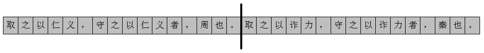
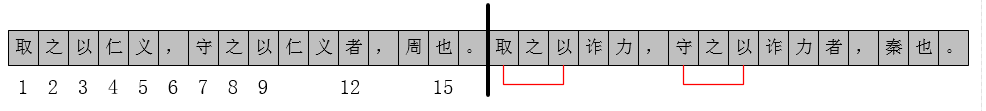
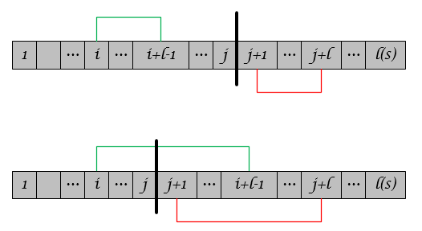
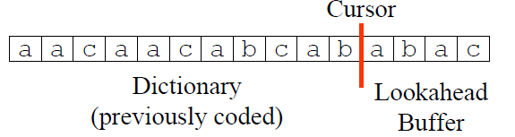
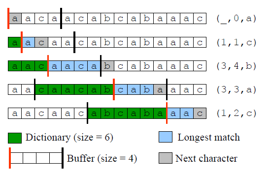
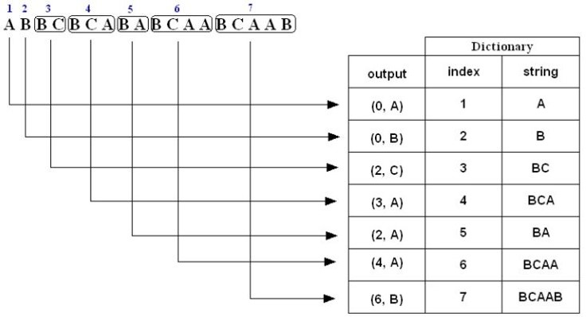
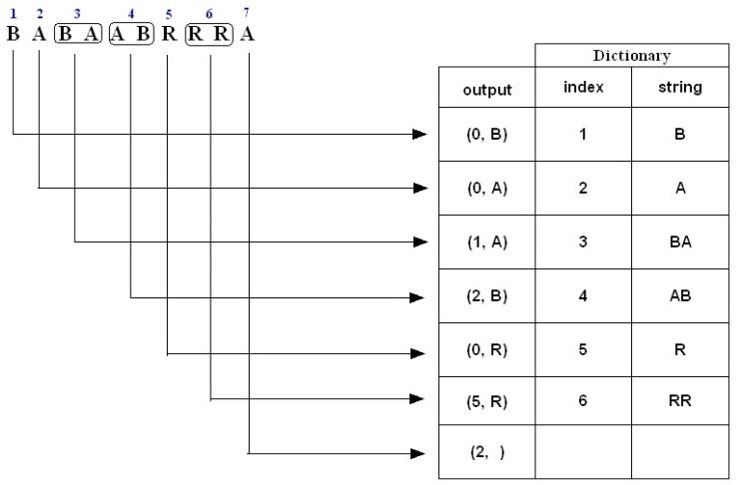
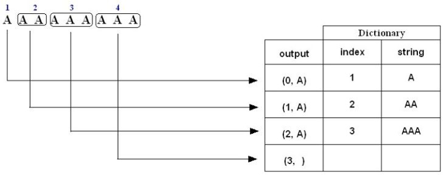
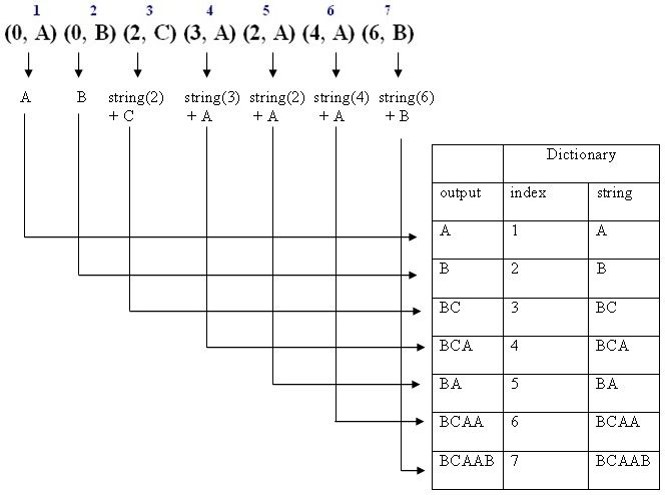

 
<!--BEGIN_DATA
{
    "create_date": "2021-02-28 22:30", 
    "modify_date": "2021-02-28 22:30", 
    "is_top": "0", 
    "summary": "LZ77算法原理及实现<br/>LZ78算法原理及实现", 
    "tags": "算法", 
    "file_name": "LZ77与LZ78算法原理及实现.md"
}
END_DATA-->

#### <p>原文出处：<a href='https://www.cnblogs.com/en-heng/p/4992916.html' target='blank'>LZ77算法原理及实现</a></p>

## 1. 引言

LZ77算法是采用字典做数据压缩的算法，由以色列的两位大神Jacob Ziv与Abraham Lempel在1977年发表的论文《A Universal Algorithm for Sequential Data Compression》中提出。

基于统计的数据压缩编码，比如Huffman编码，需要得到先验知识——信源的字符频率，然后进行压缩。但是在大多数情况下，这种先验知识是很难预先获得。因此，设计一种更为通用的数据压缩编码显得尤为重要。LZ77数据压缩算法应运而生，其核心思想：利用数据的**重复结构信息**来进行数据压缩。举个简单的例子，比如

> 取之以仁义，守之以仁义者，周也。取之以诈力，守之以诈力者，秦也。

`取之以`、`仁义`、`，`、`者`、`守之以`、`也`、`诈力`、`。`均重复出现过，只需指出其之前出现的位置，便可表示这些词。为了指明出现位置，我们定义一个相对位置，如图



相对位置之后的消息串为`取之以诈力，守之以诈力者，秦也。`，若能匹配相对位置之前的消息串，则编码为以其匹配的消息串的起始与末端index；若未能匹配上，则以原字符编码。相对位置之后的消息串可编码为：`[(1-3),(诈力),(6),(7-9),(诈力),(12),(6),(秦),(15-16)]`，如图所示：



上面的例子展示如何利用索引值来表示词，以达到数据压缩的目的。LZ77算法的核心思想亦是如此，其具体的压缩过程不过比上述例子稍显复杂而已。

## 2. 原理

本文讲主要讨论LZ77算法如何做压缩及解压缩，关于LZ77算法的唯一可译、无损压缩（即解压可以不丢失地还原信息）的性质，其数学证明参看原论文[1]。

### 滑动窗口

至于如何描述**重复结构信息**，LZ77算法给出了更为确切的数学解释。首先，定义字符串<span class="LaTex" alt="LaTex">$$S$$</span>的长度为<span class="LaTex" alt="LaTex">$$N$$</span>，字符串<span class="LaTex" alt="LaTex">$$S$$</span>的子串<span class="LaTex" alt="LaTex">$$S_{i,j},\ 1\le i,j \le N$$</span>。对于前缀子串<span class="LaTex" alt="LaTex">$$S_{1,j}$$</span>，记<span class="LaTex" alt="LaTex">$$L_i^j$$</span>为首字符<span class="LaTex" alt="LaTex">$$S_{i}$$</span>的子串与首字符<span class="LaTex" alt="LaTex">$$S_{j+1}$$</span>的子串最大匹配的长度，即：

<span class="LaTex" alt="LaTex">$$
L_i^j = \max \{ l | S_{i,i+l-1} = S_{j+1,j+l} \} \quad \text{subject to} \quad l \le N-j
$$</span>

我们称字符串<span class="LaTex" alt="LaTex">$$S_{j+1,j+l}$$</span>匹配了字符串<span class="LaTex" alt="LaTex">$$S_{i,i+l-1}$$</span>，且匹配长度为<span class="LaTex" alt="LaTex">$$l$$</span>。如图所示，存在两类情况：



定义<span class="LaTex" alt="LaTex">$$p^j$$</span>为所有情况下的**最长匹配**的<span class="LaTex" alt="LaTex">$$i$$</span>值，即

<span class="LaTex" alt="LaTex">$$
p^j = \mathop {\arg \max }\limits_{i} \{ L_i^j \} \quad \text{subject to} \quad 1 \le i \le j
$$</span>

比如，字符串<span class="LaTex" alt="LaTex">$$S=00101011$$</span>且<span class="LaTex" alt="LaTex">$$j=3$$</span>，则有

  * <span class="LaTex" alt="LaTex">$$L_1^j=1$$</span>，因为<span class="LaTex" alt="LaTex">$$S_{j+1,j+1}=S_{1,1}$$</span>, <span class="LaTex" alt="LaTex">$$S_{j+1,j+2} \ne S_{1,2}$$</span>;
  * <span class="LaTex" alt="LaTex">$$L_2^j=4$$</span>，因为<span class="LaTex" alt="LaTex">$$S_{j+1,j+1}=S_{2,2}$$</span>, <span class="LaTex" alt="LaTex">$$S_{j+1,j+2} = S_{2,3}$$</span>，<span class="LaTex" alt="LaTex">$$S_{j+1,j+3} = S_{2,4}$$</span>，<span class="LaTex" alt="LaTex">$$S_{j+1,j+4} = S_{2,5}$$</span>，<span class="LaTex" alt="LaTex">$$S_{j+1,j+5} \ne S_{2,6}$$</span>；
  * <span class="LaTex" alt="LaTex">$$L_3^j = 0$$</span>，因为<span class="LaTex" alt="LaTex">$$S_{j+1,j+1} \ne S_{3,3}$$</span>。

因此，<span class="LaTex" alt="LaTex">$$p^j = 2$$</span>且最长匹配的长度<span class="LaTex" alt="LaTex">$$l^j=4$$</span>. 从上面的例子中可以看出：子串<span class="LaTex" alt="LaTex">$$S_{j+1,j+p}$$</span>是可以由<span class="LaTex" alt="LaTex">$$S_{1,j}$$</span>生成，因而称之为<span class="LaTex" alt="LaTex">$$S_{1,j}$$</span>的**再生扩展**（reproducible extension）。LZ77算法的核心思想便源于此——用历史出现过的字符串做词典，编码未来出现的字符，以达到数据压缩的目的。在具体实现中，用滑动窗口（Sliding Window）字典存储历史字符，Lookahead Buffer存储待压缩的字符，Cursor作为两者之间的分隔，如图所示：



并且字典与Lookahead Buffer的长度是固定的。

### 压缩

用<span class="LaTex" alt="LaTex">$$(p,l,c)$$</span>表示Lookahead Buffer中字符串的**最长匹配**结果，其中

  * <span class="LaTex" alt="LaTex">$$p$$</span>表示最长匹配时，字典中字符开始时的位置（相对于Cursor位置），
  * <span class="LaTex" alt="LaTex">$$l$$</span>为最长匹配字符串的长度，
  * <span class="LaTex" alt="LaTex">$$c$$</span>指Lookahead Buffer最长匹配结束时的下一字符

压缩的过程，就是重复输出<span class="LaTex" alt="LaTex">$$(p,l,c)$$</span>，并将Cursor移动至<span class="LaTex" alt="LaTex">$$l+1$$</span>，伪代码如下：

    
    
    Repeat:
        Output (p,l,c),
        Cursor --> l+1
    Until to the end of string
    

压缩示例如图所示：



### 解压缩

为了能保证正确解码，解压缩时的滑动窗口长度与压缩时一样。在解压缩，遇到<span class="LaTex" alt="LaTex">$$(p,l,c)$$</span>大致分为三类情况：

  * <span class="LaTex" alt="LaTex">$$p==0$$</span>且<span class="LaTex" alt="LaTex">$$l==0$$</span>，即初始情况，直接解码<span class="LaTex" alt="LaTex">$$c$$</span>；
  * <span class="LaTex" alt="LaTex">$$p>=l$$</span>，解码为字典`dict[p:p+l+1]`；
  * <span class="LaTex" alt="LaTex">$$p<l$$</span>，即出现循环编码，需要从左至右循环拼接，伪代码如下：
    
```
for(i = p, k = 0; k < length; i++, k++)
    out[cursor+k] = dict[i%cursor]
``` 

比如，`dict=abcd`，编码为`(2,9,e)`，则解压缩为output=abcd**cdcdcdcdc**e。

## 3. 实现

bitarray的实现请参看[A Python LZ77-Compressor](https://github.com/manassra/LZ77-Compressor/)，下面给出简单的python实现。

```python
## coding=utf-8

class LZ77:
    """
    A simplified implementation of LZ77 algorithm
    """
    def __init__(self, window_size):
        self.window_size = window_size
        self.buffer_size = 4

    def longest_match(self, data, cursor):
        """
        find the longest match between in dictionary and lookahead-buffer
        """
        end_buffer = min(cursor + self.buffer_size, len(data))
        p = -1
        l = -1
        c = ''
        for j in range(cursor+1, end_buffer+1):
            start_index = max(0, cursor - self.window_size + 1)
            substring = data[cursor + 1:j + 1]
            for i in range(start_index, cursor+1):
                repetition = len(substring) / (cursor - i + 1)
                last = len(substring) % (cursor - i + 1)
                matchedstring = data[i:cursor + 1] * repetition + data[i:i + last]
                if matchedstring == substring and len(substring) > l:
                    p = cursor - i + 1
                    l = len(substring)
                    c = data[j+1]
        ## unmatched string between the two
        if p == -1 and l == -1:
            return 0, 0, data[cursor + 1]
        return p, l, c

    def compress(self, message):
        """
        compress message
        :return: tuples (p, l, c)
        """
        i = -1
        out = []
        ## the cursor move until it reaches the end of message
        while i < len(message)-1:
            (p, l, c) = self.longest_match(message, i)
            out.append((p, l, c))
            i += (l+1)
        return out

    def decompress(self, compressed):
        """
        decompress the compressed message
        :param compressed: tuples (p, l, c)
        :return: decompressed message
        """
        cursor = -1
        out = ''
        for (p, l, c) in compressed:
            ## the initialization
            if p == 0 and l == 0:
                out += c
            elif p >= l:
                out += (out[cursor-p+1:cursor+1] + c)
            ## the repetition of dictionary
            elif p < l:
                repetition = l / p
                last = l % p
                out += (out[cursor-p+1:cursor+1] * repetition + out[cursor-p+1:last] + c)
            cursor += (l + 1)
        return out

if __name__ == '__main__':
    compressor = LZ77(6)
    origin = list('aacaacabcabaaac')
    pack = compressor.compress(origin)
    unpack = compressor.decompress(pack)
    print pack
    print unpack
    print unpack == 'aacaacabcabaaac'
```

## 4. 参考资料

* [1] Ziv, Jacob, and Abraham Lempel. "A universal algorithm for sequential data compression." IEEE Transactions on information theory 23.3 (1977): 337-343.  
* [2] guyb, [15-853:Algorithms in the Real World](http://www.cs.cmu.edu/~guyb/realworld/slidesF08/suffixcompress.pdf).

<hr>

#### <p>原文出处：<a href='https://www.cnblogs.com/en-heng/p/6283282.html' target='blank'>LZ78算法原理及实现</a></p>

在提出基于滑动窗口的LZ77算法后，两位大神Jacob Ziv与Abraham Lempel于1978年在发表的论文[1]中提出了LZ78算法；与LZ77算法不同的是LZ78算法使用动态树状词典维护历史字符串。

## 1. 原理

### 压缩

LZ78算法的压缩过程非常简单。在压缩时维护一个动态词典Dictionary，其包括了历史字符串的index与内容；压缩情况分为三种：

  1. 若当前字符c未出现在词典中，则编码为`(0, c)`；
  2. 若当前字符c出现在词典中，则与词典做最长匹配，然后编码为`(prefixIndex,lastChar)`，其中，prefixIndex为最长匹配的前缀字符串，lastChar为最长匹配后的第一个字符；
  3. 为对最后一个字符的特殊处理，编码为`(prefixIndex,)`。

如果对于上述压缩的过程稍感费解，下面给出三个例子。**例子一**，对于字符串“ABBCBCABABCAABCAAB”压缩编码过程如下：  



```    
1. A is not in the Dictionary; insert it
2. B is not in the Dictionary; insert it
3. B is in the Dictionary.
    BC is not in the Dictionary; insert it.  
4. B is in the Dictionary.
    BC is in the Dictionary.
    BCA is not in the Dictionary; insert it.
5. B is in the Dictionary.
    BA is not in the Dictionary; insert it.
6. B is in the Dictionary.
    BC is in the Dictionary.
    BCA is in the Dictionary.
    BCAA is not in the Dictionary; insert it.
7. B is in the Dictionary.
    BC is in the Dictionary.
    BCA is in the Dictionary.
    BCAA is in the Dictionary.
    BCAAB is not in the Dictionary; insert it.
```

**例子二**，对于字符串“BABAABRRRA”压缩编码过程如下：  



```    
1.  B is not in the Dictionary; insert it
2.  A is not in the Dictionary; insert it
3.  B is in the Dictionary.
        BA is not in the Dictionary; insert it.    
4.  A is in the Dictionary.
        AB is not in the Dictionary; insert it.
5.  R is not in the Dictionary; insert it.
6.  R is in the Dictionary.
        RR is not in the Dictionary; insert it.
7.  A is in the Dictionary and it is the last input character; output a pair 
        containing its index: (2, )
```

**例子三**，对于字符串“AAAAAAAAA”压缩编码过程如下：  



```    
1.  A is not in the Dictionary; insert it
2.  A is in the Dictionary
        AA is not in the Dictionary; insert it
3.  A is in the Dictionary.
        AA is in the Dictionary.
        AAA is not in the Dictionary; insert it.
4.  A is in the Dictionary.
        AA is in the Dictionary.
        AAA is in the Dictionary and it is the last pattern; output a pair containing its index: (3,  )
```

### 解压缩

解压缩能更根据压缩编码恢复出（压缩时的）动态词典，然后根据index拼接成解码后的字符串。为了便于理解，我们拿上述**例子一**中的压缩编码序列`(0, A) (0, B) (2, C) (3, A) (2, A) (4, A) (6, B)`来分解解压缩步骤，如下图所示：  



前后拼接后，解压缩出来的字符串为“ABBCBCABABCAABCAAB”。

### LZ系列压缩算法

LZ系列压缩算法均为LZ77与LZ78的变种，在此基础上做了优化。

  * LZ77：LZSS、LZR、LZB、LZH；
  * LZ78：LZW、LZC、LZT、LZMW、LZJ、LZFG。

其中，LZSS与LZW为这两大阵容里名气最响亮的算法。LZSS是由Storer与Szymanski [2]改进了LZ77：增加最小匹配长度的限制，当最长匹配的长度小于该限制时，则不压缩输出，但仍然滑动窗口右移一个字符。Google开源的Snappy压缩算法库大体遵循LZSS的编码方案，在其基础上做了一些工程上的优化。

## 2. 实现

Python 3.5实现LZ78算法：

```python
## -*- coding: utf-8 -*-
## A simplified implementation of LZ78 algorithm
## @Time    : 2017/1/13
## @Author  : rain
def compress(message):
    tree_dict, m_len, i = {}, len(message), 0
    while i < m_len:
        ## case I
        if message[i] not in tree_dict.keys():
            yield (0, message[i])
            tree_dict[message[i]] = len(tree_dict) + 1
            i += 1
        ## case III
        elif i == m_len - 1:
            yield (tree_dict.get(message[i]), '')
            i += 1
        else:
            for j in range(i + 1, m_len):
                ## case II
                if message[i:j + 1] not in tree_dict.keys():
                    yield (tree_dict.get(message[i:j]), message[j])
                    tree_dict[message[i:j + 1]] = len(tree_dict) + 1
                    i = j + 1
                    break
                ## case III
                elif j == m_len - 1:
                    yield (tree_dict.get(message[i:j + 1]), '')
                    i = j + 1

def uncompress(packed):
    unpacked, tree_dict = '', {}
    for index, ch in packed:
        if index == 0:
            unpacked += ch
            tree_dict[len(tree_dict) + 1] = ch
        else:
            term = tree_dict.get(index) + ch
            unpacked += term
            tree_dict[len(tree_dict) + 1] = term
    return unpacked

if __name__ == '__main__':
    messages = ['ABBCBCABABCAABCAAB', 'BABAABRRRA', 'AAAAAAAAA']
    for m in messages:
        pack = compress(m)
        unpack = uncompress(pack)
        print(unpack == m)
```

## 3. 参考资料

* [1] Ziv, Jacob, and Abraham Lempel. "Compression of individual sequences via variable-rate coding." IEEE transactions on Information Theory 24.5 (1978): 530-536.  
* [2] Storer, James A., and Thomas G. Szymanski. "Data compression via textual substitution." Journal of the ACM (JACM) 29.4 (1982): 928-951.  
* [3] Welch, T. A. "A Technique for High-Performance Data Compression." Computer 17.17(1984):8-19.  
* [4] Jauhar Ali, [Unit31_LZ78.ppt](http://faculty.kfupm.edu.sa/ICS/jauhar/ics202/).  
* [5] guyb, [15-853:Algorithms in the Real World - Data Compression III](https://www.cs.cmu.edu/afs/cs/academic/class/15853-f00/slides/).

