 
<!--BEGIN_DATA
{
    "create_date": "2018-05-28 17:58", 
    "modify_date": "2018-05-28 17:58", 
    "is_top": "0", 
    "summary": "Learning OpenGL(ES) —— OpenGL Model, Pipeline and Practices", 
    "tags": "iOS、OpenGL", 
    "file_name": "Learning OpenGL(ES) —— OpenGL Model, Pipeline and Practices.md"
}
END_DATA-->

####<p>原文出处：<a href='https://niyaoyao.github.io/2018/05/23/learning_opengl(es)_opengl_model_pipeline_and_practices/' target='blank'>Learning OpenGL(ES) —— OpenGL Model, Pipeline and Practices</a></p>

###Introduction

这半年的时间都在做音视频合成的相关工作，项目研发过程中也遇到很多问题，但是网上优秀的技术资源也比较少，因此，想系统地学习和整理 OpenGL
图形图像处理的相关内容。

本篇文章基本包括以下内容：

  * OpenGL 的 C/S 模型架构。OpenGL 使用 Client - Server 模型，客户端（Client）运行在 CPU 上，服务端（Server）运行在 GPU 上，这部分会具体讨论 CPU 传输数据到 GPU 而造成的性能损耗，以及讨论离屏渲染会造成巨大性能开销的原因。

  * OpenGL 的 Pipeline 及重要的 Shader 简介。这一部分主要讨论 OpenGL 是以 C/S 为模型设计的架构，在这套架构之上，当数据由 CPU 传递给 GPU 之后，GPU 怎样对 CPU 提供的数据进行加工、处理最终形成 FrameBuffer（帧缓冲），交给屏幕驱动进行屏幕渲染的过程。

  * OpenGL（ES）编程实践。用具体的程序代码来详细学习和理解什么是 Shader（着色器），什么是 VBO（Vertex Buffer Object），什么是 EBO（Element Buffer Object），什么是 VAO（Vertex Array Object）。

以上三个部分是本文主要讨论的内容，前两部分用较多的笔墨着重介绍 OpenGL 理论基础。鄙人认为只有先理解了 OpenGL 的设计理念，才能更好的使用
OpenGL 提供的函数进行图形处理。阅读本文可以先带着这样几个问题来进行 OpenGL 的探究：

  * OpenGL 是按照什么架构设计的？
  * 什么是渲染上下文（Context）？
  * 什么是离屏渲染？
  * 为什么离屏渲染会造成性能损耗？
  * 什么是 OpenGL 管线（Pipeline）？
  * OpenGL 管线主要包含哪些部分？
  * 为什么说 OpenGL 管线中的着色器（Shader）是可编程管线？
  * 有哪些着色器可以由程序员进行编程？
  * 什么是 VBO、EBO 和 VAO？
  * Vertex Buffer Object 的布局格式是怎样的？
  * Vertex Array Object 的布局格式是怎样的？
  * 如何用 OpenGL 画一个三角形？
  * 如何在三角形的基础上修改为矩形？

当然以上所有问题会在本文内容中加以详细解释，如果对以上问题感兴趣，就和我一起开始学习 OpenGL 吧。

_注：我使用的是 macOS 系统，所以本文中 OpenGL 开发框架和代码示例都是基于 Cocoa（Cocoa Touch）框架来编写的。但 OpenGL
图形处理的理论是通用的，在学习过程中我也通过学习其他开发平台（Windows、Android、Linux 等）的资料来辅助自己对 OpenGL
原理的理解。_

###OpenGL Model

####Screen Rendering

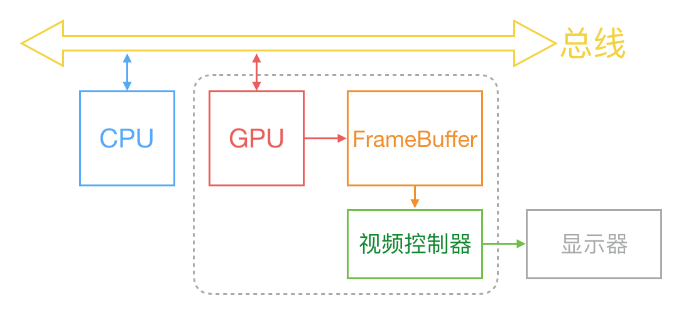  
图 1 屏幕显像过程图

在 ibireme 大佬的[《iOS 保持界面流畅的技巧》](https://blog.ibireme.com/2015/11/12smooth_user_interfaces_for_ios/)一文中，他是这样解释屏幕显像的过程的：

> 计算机系统中 CPU、GPU、显示器是以上面这种方式协同工作的。CPU 计算好显示内容提交到 GPU，GPU 渲染完成后将渲染结果放入帧缓冲区，随后视频控制器会按照 VSync 信号逐行读取帧缓冲区的数据，经过可能的数模转换传递给显示器显示。

在图 1 中我们可以看到数据从 CPU 到 GPU，经过 GPU 的处理形成
FrameBuffer，并交由视频控制器，最终控制显示器显像的过程。而在这整个过程中，CPU 与 GPU 的通讯，GPU 将 CPU 传递来的数据处理成
FrameBuffer 这个阶段，实际上就是 OpenGL 的任务，即 **OpenGL 的工作就是将 CPU 传递来的渲染数据，作为输入数据，经过 Pipeline 中的不同 Shader （可编程着色器）处理加工成 FrameBuffer 输出给底层硬件** 。所以，简单讲 OpenGL 图形处理过程就是，丢给 OpenGL 输入数据，OpenGL 吐出 FrameBuffer 输出数据的过程。

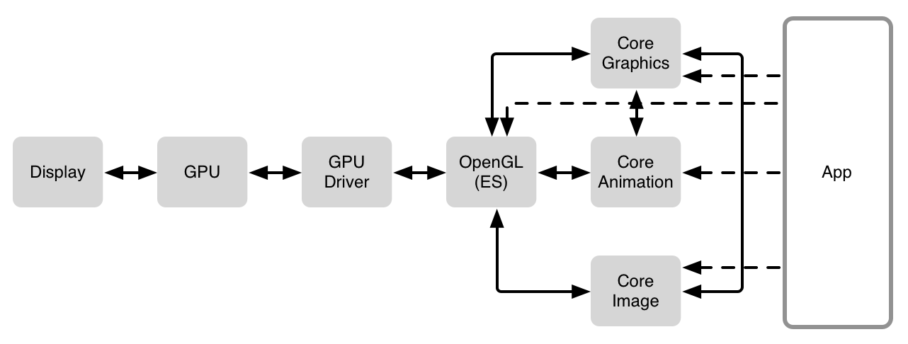  
图 2 屏幕显像过程软件组件图

上图是 [《Getting Pixels onto the Screen》](https://www.objc.io/issues/3-views/moving-pixels-onto-the-screen/) 文章中提供的显像过程图。应用程序利用 Core Graphics、Core
Animation、Core Image 等框架设定渲染图形所需要的数据，并交由 OpenGL(ES) ，然后，OpenGL 与 GPU 驱动进行通讯，最终 GPU 控制显示器进行渲染显示。

了解基本的屏幕显像原理之后，接下来就具体学习 OpenGL 是什么，OpenGL 的架构是如何设计，以及 OpenGL 是如何进行图形处理的。

####About OpenGL

OpenGL 是一个开放的、跨平台的拥有广泛工业支持的图形处理标准。OpenGL
通过提供一个成熟、文档完善的，支持现在和未来硬件加速的抽象概念的图形处理管道，令写实时 2D 或者 3D 的图形应用非常容易。

####Client-Server Model

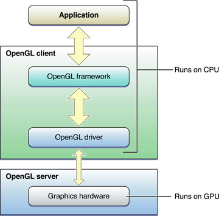  
图 3 OpenGL CPU and GPU

macOS 中的 OpenGL 使用通用的 OpenGL 框架和插件驱动实现了 OpenGL Client-Server 模型。如图 3 所示，框架和驱动联合一起，用来实现客户端 OpenGL 端口。专用的图形处理硬件支持了服务端。尽管这是通用场景，Apple 也在 CPU 上提供了全部的软件渲染实现。

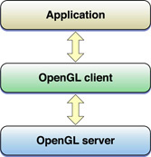  
图 4 OpenGL client-server model

如图 4 所示，最上层是应用层，中间是 OpenGL Client，下层是 OpenGL Server。当我们的应用调用 OpenGL API 的时候，它会先跟 OpenGL Client 进行通讯，然后，OpenGL Client 向 OpenGL Server 传递绘画指令。OpenGL Client-Server 模型设计的好处是，Client 能够在命令完成执行之前将控制权返回给应用程序，即 OpenGL 的命令能够异步执行。

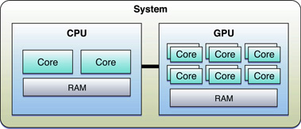  
图 5 Macintosh OpenGL Hardware Architecture

Client-Server 模型允许图形工作在客户端和在服务端之间被分开。例如，所有 Macintosh 计算机搭载了专属于图形处理的硬件，使运行图形处理的并行计算最优化。图 5 展示了一组 CPU 和 GPU 的通用布局。通过这样的硬件配置， **OpenGL 客户端在 CPU 上执行，而 OpenGL 服务端在 GPU 上执行** 。

####Rendering Context

OpenGL 提供了一套丰富的跨平台绘图命令，但并不定义它和操作系统的图形子系统交互的函数，而是 OpenGL 要求每个平台实现去定义一个接口用来创建
**渲染上下文（Context）** ，并且将它们和图形子系统相关联。渲染上下文保存所有在 **OpenGL 状态机（OpenGL State Machine）** 中存储的数据。程序可以维护多个上下文，允许一个上下文被应用改变机器中的状态，而不影响其他上下文。

那什么是渲染上下文呢？ **渲染上下文（Context），或者说简单上下文，包含 OpenGL 状态信息和应用的对象**。状态变量包括诸如绘图颜色、视图和投影转换、照明特性以及材质属性等内容。状态变量在每个上下文被设置。当你的应用创建 OpenGL 对象（如，纹理），这些都与渲染上下文相关。 **尽管应用程序可以维护多个上下文，但只有一个上下文能够在一个线程中成为当前上下文。当前上下文是接收应用发出 OpenGL 命令的渲染上下文** 。

当我们的应用程序调用 OpenGL 的函数时，OpenGL Client 在将控制权返回给应用程序之前，会拷贝任何一个在参数中提供的数据。因此，应用是自由改变他自己拥有的内存的，无需顾忌他对 OpenGL 的调用。
Client(CPU) 拷贝的数据，在传递给 Server(GPU) 之前经常会被重新格式化，故而向 Server(GPU) 拷贝、修改以及传递参数增加了调用 OpenGL 的开支。

####Offscreen Rendering

来看 CPU 和英伟达显卡之间进行数据通信的一张图片，以加深以上这段文字的理解。

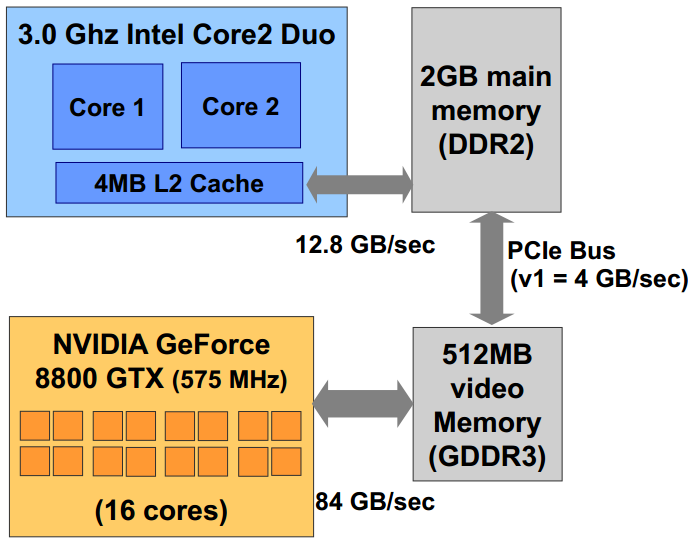  
图 6 现代计算机的硬件结构

上图中，CPU 中二级缓存（L2 Cache）和 2GB 主存（Main Memory）的数据交换速度为 12.8GB/sec，NVIDIA GPU 和显存（Video Memory）数据交换速度是 84 GB/sec，而主存和显存通过 PCI 总线之间的数据交换速度为 4GB/sec。显然，显存的带宽是内存的 5 倍以上，而 PCI 总线的带宽大约是内存速度的三分之一。

在上文的学习中，我们已经知道，渲染上下文（Context）包含 OpenGL 状态信息和用于应用对象，在调用任何 OpenGL 的接口前我们必须要先创建渲染上下文（Context），并且一个线程中只有一个上下文能够成为当前上下文。当 OpenGL Client(CPU) 拷贝数据时，由于显存和主存以及总线带宽之间速度的不匹配，如果频繁地由 CPU 向 GPU 传递数据，那么必然会增加调用 OpenGL 的开支。

在当前上下文不是屏幕所显示的上下文时，比如屏幕显示了一个列表视图，但是程序员需要调用 OpenGL 命令去绘制一张图片，创建新的渲染上下文，并把
OpenGL 的当前上下文切换到这张图片的上下文，此时就发生了 **离屏渲染** 。为了调用 OpenGL 命令来进行新图片的渲染运算，程序必须创建新的渲染上下文，所以，离屏渲染时，CPU 会对新创建的渲染上下文存储的数据进行拷贝，这些渲染数据再经由主存、总线、显存，最终传递到 GPU 进行大量并行计算，输出 FrameBuffer。而在这个数据传递和处理过程中，由于如图 6 所显示的 CPU 和主存、主存和显存，以及显存和 GPU 带宽速度不一致，导致 CPU
数据拷贝和传递的过程中，增加了调用 OpenGL 的开支。

以上便是什么是离屏渲染，以及在离屏渲染时会造成性能损耗的原因。另外，我节选了 Apple 文档中对离屏渲染的相关描述来加深理解。

> OpenGL applications may want to use OpenGL to render images without actually displaying them to the user. For example, an image processing application might render the image, then copy that image back to the application and save it to disk. Another useful strategy is to create intermediate images that are used later to render additional content. For example, your application might
want to render an image and use it as a texture in a future rendering pass.
For best performance, offscreen targets should be managed by OpenGL. Having OpenGL manage offscreen targets allows you to avoid copying pixel data back to your application, except when this is absolutely necessary.

上文是 Apple Document 对离屏渲染的介绍，译文如下。

> OpenGL 应用程序可能想要使用 OpenGL 来渲染图像，而无需将其实际显示给用户（显示到屏幕上）。
例如，图像处理应用程序可能会渲染图像，然后将该图像复制回应用程序并将其保存到磁盘。 另一个有用的策略是创建稍后用于呈现额外内容的中间图像。
例如，您的应用程序可能想要渲染图像，并将其用作未来渲染过程中的纹理。 为了获得最佳性能，屏幕外目标应由 OpenGL 管理。
使用OpenGL管理屏幕外目标可以避免将像素数据复制回应用程序，除非这是绝对必要的。

###OpenGL Pipeline and Shader

在本文的第一部分 OpenGL 模型内容中，我们主要学习了 OpenGL 基于 Client-Server 模型的架构，以及这样的架构会对渲染有怎样的影响。接下来，我们开始学习 OpenGL 在这个架构上具体如何处理输入的渲染数据并输出 FrameBuffer 的，即 OpenGL 的管线（Pipeline）。

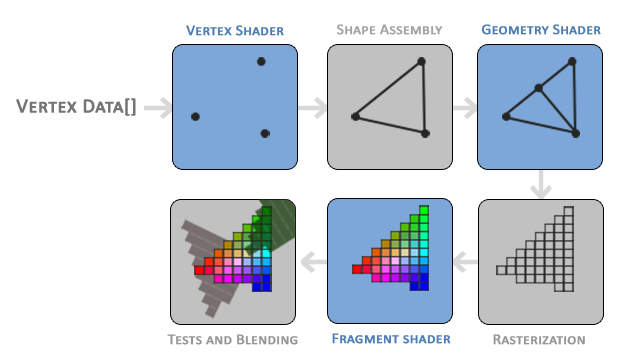  
图 7 OpenGL Graphics Pipeline

文章开头，我用比较浅白的语言描述 Pipeline 是什么，“OpenGL 图形处理过程就是，丢给 OpenGL 输入数据，OpenGL 吐出 FrameBuffer 输出数据的过程”。如果用规范的语言来描述应该是，“OpenGL 的图形渲染管线（Graphics
Pipeline）指的是一堆原始图形数据途经一个输送管道，期间经过各种变化处理最终出现在屏幕的过程。”

而我们程序员所要参与的过程，实际就是 Pipeline 这中间的几个可编程着色器（Shader）的阶段（Stage）。图 7 为我们简略展示了 Pipeline 的主要几个阶段。输入数据 Vertex Data 是一个一维数组，分别经过顶点着色器（Vertex Shader）、图元装配（Shape Assembly）、几何着色器（Geometry Shader）、光栅化（Rasterization）、片段着色器（Fragment Shader）、测试与混合（Tests and Blending）等阶段，最终输出帧缓冲（FrameBuffer）。

而在图 7 中蓝色底色的 **顶点着色器（Vertex Shader）、几何着色器（Geometry Shader）以及片段着色器（Fragment Shader）可以注入自己的编写着色器程序来达到程序所需的渲染效果。现代 OpenGL 要求我们，必须定义至少一个顶点着色器和一个片段着色器（因为GPU中没有默认的顶点/片段着色器）。所以，我们能够自己编写 Shader 对 Shader 源码进行编译等处理，然后对 Vertex Buffer Object、Element Buffer Object 以及 Vertex Array Object 进行绑定，最终输出 FrameBuffer 将图形绘制到屏幕上。这种用于编写 Shader 程序的类 C 的编程语言，称之为 GLSL（OpenGL Shading Language）。** 而这也是为什么称 Shader 为可编程管线的原因，在本文的第三部分 Practice 中，我们会编写两个比较简单的 Shader 程序，来绘制三角形和矩形，并且学习如何使用 OpenGL 进行图形处理的编程。

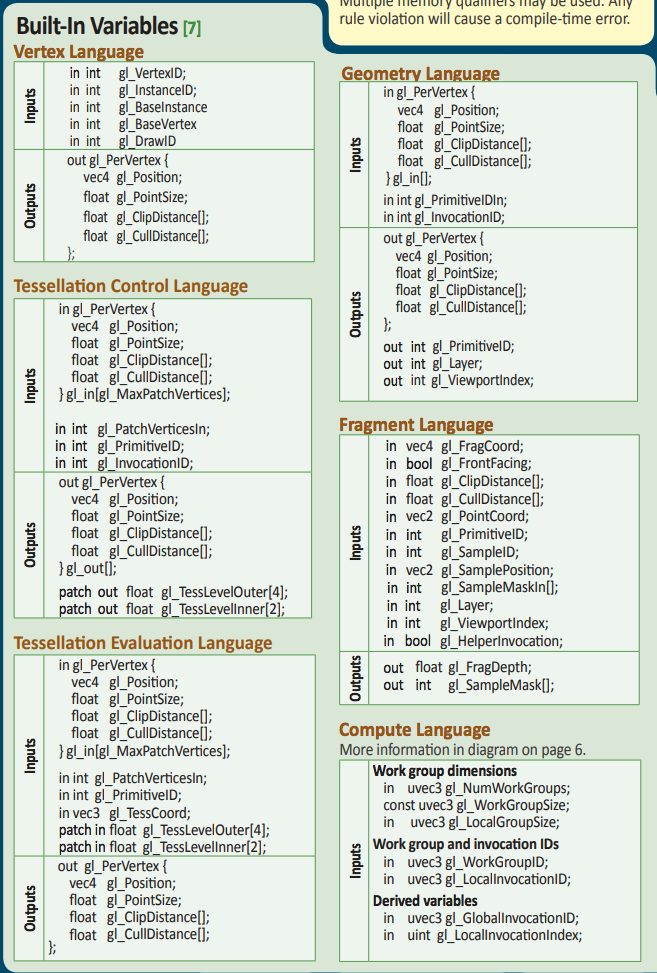  
图 8 Shader Inputs and Outputs

接下来，先分别看一下图中几个重要的 Shader 具体都做了些什么。图 8 中显示的是 OpenGL 4.5 版本的内置的输入和输出，从这个图表中，我们就可以比较清楚地了解具体着色器所需的输入数据，以及经过着色器处理后的输出数据。内置输入输出数据更加清楚地启示给我们，我们编写 Shader 源码需要向 OpenGL 输入什么数据，以及 OpenGL 最终输出怎样的数据。

####Programmable Vertex Processing

#####Vertex Shaders

图形渲染管线的第一个阶段是顶点着色器（Vertex Shader），顶点着色器进行有关顶点值和顶点数据的操作，主要是顶点齐次坐标变换和光照。

为了进行顶点处理，在编程过程中，我们需要先向 Vertex Shader 输入一组顶点数组，让 Vertex Shader 可以将顶点数据（Vertex
Data）设置成顶点属性（Vertex Attribute）。

#####Vertex Input

    
    float vertices[] = {
            0.5f,  0.5f, 0.0f,  // top right
            0.5f, -0.5f, 0.0f,  // bottom right
            -0.5f, -0.5f, 0.0f,  // bottom left
    };  
  
上段代码就声明（declare）了一个浮点型的顶点数组，这个数组将 9 个浮点数元素分三行编码，按照这样的格式编码的原因是，OpenGL 是在三维空间中进行渲染工作的，所以每三个浮点数就表示一个点在三维空间中的坐标(x, y, z)。由于我们渲染的图形是显示在平面的屏幕上，所以，z轴的坐标值始终为 0。

以上段代码为例，第一行的顶点坐标为(0.5, 0.5, 0)，第二行的顶点坐标为(0.5, -0.5, 0)，第三行的顶点坐标为(-0.5, -0.5, 0)。当我们完成绑定 Vertex Buffer Object、Vertex Array Object等操作，调用绘制图形命令后就会出现如下所显示的三角形。

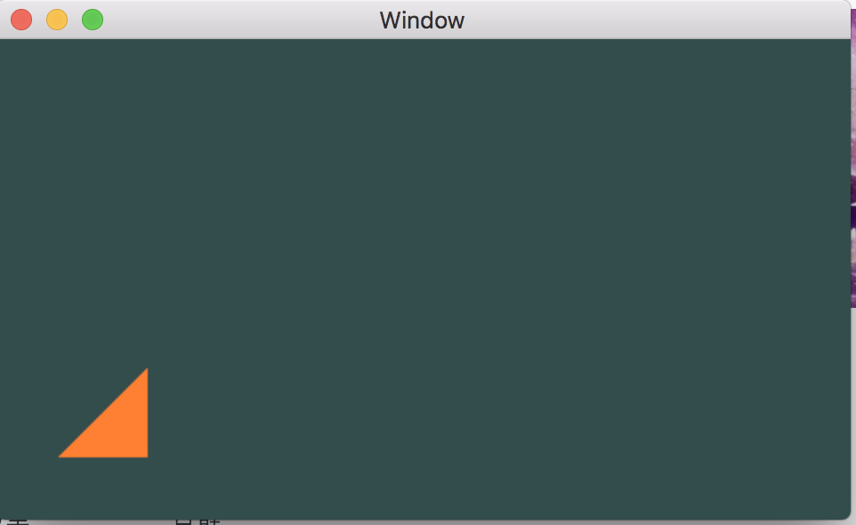  
图 9 Triangle

注意，在 OpenGL 的坐标系（标准化设备坐标，Normalized Device Coordinates, NDC）中，坐标的原点位于视口（View Port）的中心，这与 Cocoa（Cocoa Touch）框架中的窗体（Window）的坐标系原点不同。NDC 坐标系如下图所示。

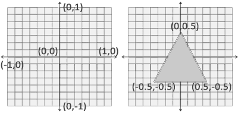  
图 10 Normalized Device Coordinates

在编程学习的部分中，我们会利用 GLSL 编写一个简单的 Vertex Shader 程序。Vertex Shader 顶点着色器允许我们指定任何以顶点属性为形式的输入。顶点坐标属性的输入数据是一组 4 字节 float 型的数组。

    
    #version 330 core
    
    layout (location = 0) in vec3 aPos;
    
    void main()
    {
        gl_Position = vec4(aPos.x, aPos.y, aPos.z, 1.0);  
    }  
  
  
上段代码就是一个 Vertex Shader 程序的代码。

  * 代码的第一行指定了 GLSL 的版本为 3.3，这就意味着程序在运行时，Shader 的编译器必须能够支持 3.3 的 GLSL 的版本。（直接使用 Cocoa 框架提供的 NSOpenGLView 来编译这段代码会报错，原因稍后具体解释。）

  * 代码第二行声明了一个指定为顶点属性的 float 类型三维向量 aPos，这个向量表示了输入的顶点坐标。这一步就将顶点数组 vertices 第一行所代表的顶点坐标 (0.5, 0.5, 0) 设置成了顶点属性。“顶点属性”意味着 GPU 中的 Shader 程序每调用一次，顶点缓冲区（Vertex Buffer）都会为其提供一个新的顶点数据，顶点属性的数据结构如下图所示。

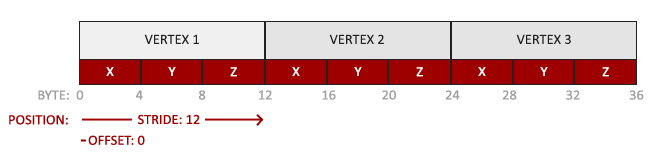  
图 11 Vertex Attribute

在上图中，0 ~ 12 BYTE 这一整个格子就表示了一个顶点属性的所有数据，这个顶点属性表示顶点的坐标，包括了顶点的 x、 y、 z 的坐标值。
**顶点属性除了顶点坐标，有时还可能包括其他属性，如颜色（RGB）、法向量（Normal）、 纹理坐标（Texture Coordinates）等属性**。如图 12，展示了包含颜色属性的顶点属性内存布局。

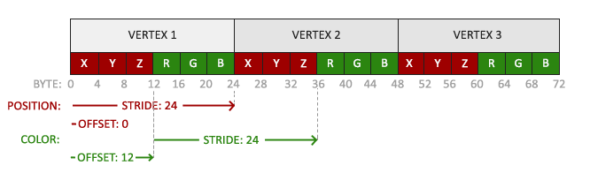  
图 12 Vertex Attribute with Color

添加额外的顶点属性，会增加顶点属性所占用的内存空间，但本篇文章并不对如何添加除坐标以外属性的方法做更多讨论，但文末会举一个简单示例。

  * 进入 GLSL 主函数之后，在代码第五行，调用 **gl_Position** 函数，使用顶点坐标属性创建的四维向量 vec4 赋值给 Shader 的 Position 作为输出。可以观察到，除了 aPos 向量的 x、y、z 三个坐标值，还有一个值 1.0，这个值代表的是深度（Depth），是用在所谓透视划分(Perspective Division)上，本文不做更多研究。

> 为了设置顶点着色器的输出，我们必须把位置数据赋值给预定义的 **gl_Position** 变量，它在幕后是 vec4 类型的。在 main
函数的最后， **我们使用 _gl_Position_ 设置的值会成为该顶点着色器的输出** 。

这样，一段简单的 Vertex Shader 代码就编写完成了。

#####Vertex Attribute Values

在之前的学习中，我们已经了解到顶点处理过程，顶点着色器会通过输入顶点数据的数组解析成顶点坐标，顶点属性还包括颜色、法向量（Normal）、纹理坐标（Texture Coordinates）等属性。具体详细介绍可以回顾上面的内容。

####Primitive Assembly

 _注：本节公示可以在[《OpenGL 4.6 Core Profile》](https://www.khronos.org/registry/OpenGL/specs/gl/glspec46.core.pdf) 454 页找到。_

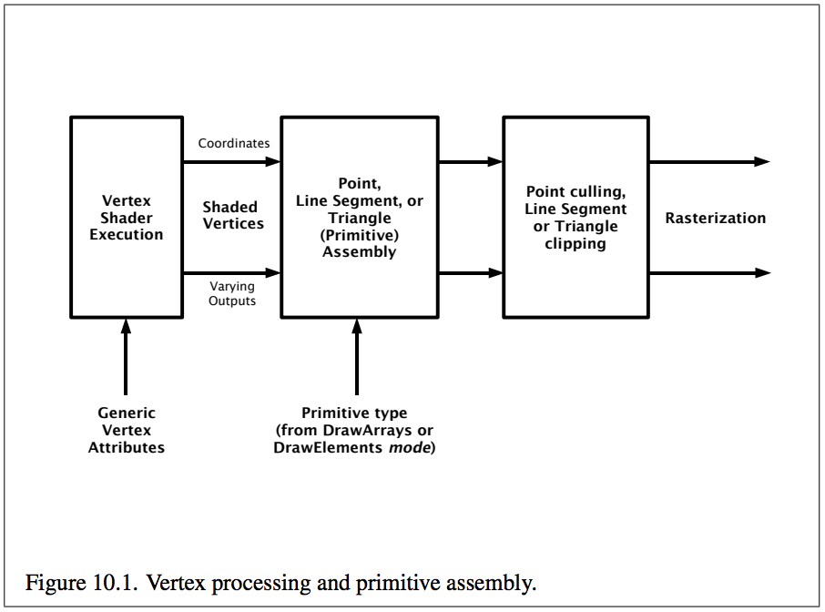  
图 13 Vertex Processing and Primitive Assembly

顶点处理完成后就进行图元装配（Primitive Assembly），图元装配场景包括图元装配、裁剪、透视除法、视口变换等。顶点处理或者顶点着色器的输出一个四维向量，输出的向量如下所示。  

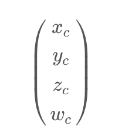

图元装配之后是裁剪（Clipping），裁剪公式如下。  

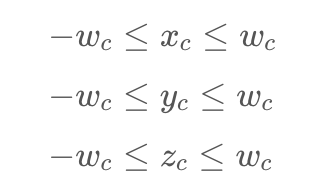

裁剪之后是透视除法（Perspective Division），公示如下。其中，  

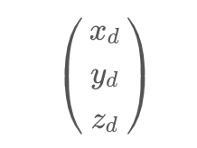

是设备（Device）显示的坐标向量。

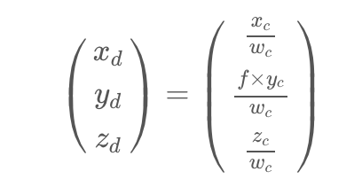

最后进行的是视口变换（Viewport Transformation）。视口转换由所选视口的宽度和高度（以像素为单位）确定，后面的编程学习中，我们将会利用
**glViewport** 对视口的 x、y 坐标，以及视口的宽度和高度进行设定。视口变换的公示如下。

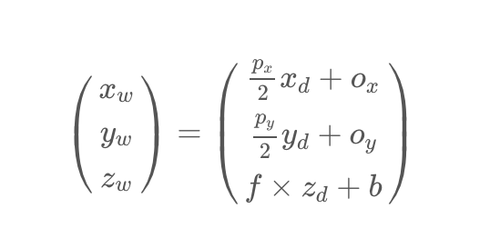

其中，$p_x$ 是程序员输入的宽度值，$p_y$ 是程序员输入的高度值。s 和 b 是裁剪控制深度模式的系数。

####Geometry Shader

图元装配之后，裁剪、透视除法、视口变换等操作之前，也可以由几何着色器对图元进行操作，即在图元装配之后插入几何着色器。

几何着色器是一个额外的流水线阶段，定义了进一步处理这些基元的操作。
几何着色器一次对单个图元进行操作，并发出一个或多个输出图元，它们都是相同的类型，然后像应用程序指定的等效 OpenGL 图元一样进行处理。几何着色器通过产生新顶点构造出新的（或是其它的）图元来生成其他形状，在图 7 的图形管线中，它生成了另一个三角形。

####Rasterization

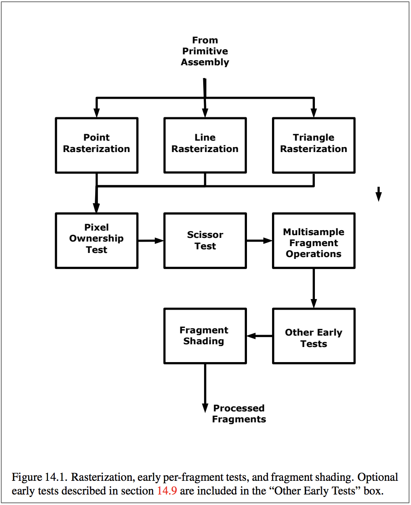  
图 14 Vertex Processing and Primitive Assembly

图元装配后输出的图元将交由光栅化处理。光栅化是将图元转换为二维图像的过程，此图像的每个点都包含颜色和深度等信息。

光栅化有两个任务：

  * 确定图元包含哪些由整数坐标确定的“小方块”（和屏幕像素对应，现在还不能叫片断，光栅化完成后才能叫片断）。
  * 确定这些小方块的 Depth 值和 Color 值（从图片顶点的 Depth 和 Color 插值得到），这些颜色后来可能被其他如纹理操作修改。

可以这样简单地理解光栅化过程，由于数学世界中线的函数是连续的，然而现实世界的物理设备屏幕是离散的。所以，光栅化的任务其实就是数学中连续的点转化成显示屏幕上不连续的小方块。

####Fragment Shader

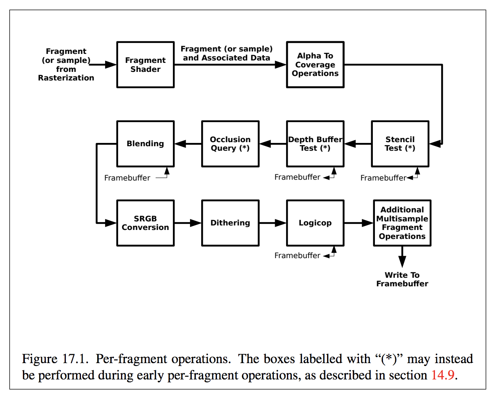  
图 15 Fragment Shader

光栅化的输出是一些列片断（Fragments，这些片断可能经过片断着色器处理），片断被称为“准像素”，要能想象出屏幕坐标系的一个整数坐标上只有一个像素，但可以前后“堆叠”多个片断。这些片断进入逐片断处理
（Per-Fragment Operations），首先进行各种测试。每步测试，不通过的片断将被丢弃从而不能进入后续操作，然后进行一些操作（如混合），最终通过所有处理的片断将被写入 FrameBuffer 用于最终屏幕显示。

上文中我们已经了解到， Fragment Shader 这个阶段中，我们也要编写一个 Shader 程序来实现着色器的具体操作，本文的 Fragment
Shader 示例代码如下。

   
    
    #version 330 core
    
    out vec4 FragColor;
    
    void main() 
    {
        FragColor = vec4(1.0f, 0.5f, 0.2f, 1.0f);
    }  
  
  
  * 代码第一行也是指定 GLSL 的版本为 3.3。
  * 代码第二行声明输出四维向量 FragColor。
  * 进入 Fragment Shader 主函数之后，设置 Fragment 的色值 RGB 为 (1, 0.5, 0.2)，并且 alpha 值为 1，即不透明。

这是一段比较简单的 Fragment Shader 示例代码。至此，OpenGL Graphics Pipeline 中比较重要的几个阶段就介绍完了，关于 OpenGL 的理论学习部分就暂时告一段落，接下来开始本文最后一部分编程实践。

###OpenGL Programming Practice

在本文前两部分中，我们已经学习了 OpenGL 的 Client-Server 模型架构及其影响。此外，还较为详细地学习了 OpenGL Graphics Pipeline 及几个重要的 Pipeline Shader。其中，Vertex Shader 和 Fragment Shader 需要我们编程实现，编写 Shader 程序的语言是 GLSL。

接下来，开始学习最简单的 OpenGL 绘图编程——如何利用 OpenGL API 绘制三角形和正方形（矩形）。

为了避免占用文章篇幅，我将项目放置在 GitHub 的[仓库](https://github.com/niyaoyao/Learning-OpenGL-OpenGLES)中。另外，完整源码可直接在 [OpenGL Programming: Draw Rectangle](./2018/05/26/openglcode/) 中阅读学习。这里我将按照完整代码中的实现文件（*.m 文件）进行逐代码块详解。

####OpenGL Profile

创建 MyOpenGLView 类并继承自 NSOpenGLView，覆写（override） MyOpenGLView 的初始化方法，实现 **initGL** 方法，方法函数体具体如下。并在 MyOpenGLView 初始化方法中调用（Call） **initGL** 方法。

```
- (void)initGL {
    NSLog(@"...was here");
    
    // 1. Create a context with opengl pixel format
    NSOpenGLPixelFormatAttribute pixelFormatAttributes[] =
    {
        NSOpenGLPFAOpenGLProfile, NSOpenGLProfileVersion4_1Core,
        NSOpenGLPFAColorSize    , 24                           ,
        NSOpenGLPFAAlphaSize    , 8                            ,
        NSOpenGLPFADoubleBuffer ,
        NSOpenGLPFAAccelerated  ,
        NSOpenGLPFANoRecovery   ,
        0
    };
    NSOpenGLPixelFormat *pixelFormat = [[NSOpenGLPixelFormat alloc] initWithAttributes:pixelFormatAttributes];
    super.pixelFormat = pixelFormat;
}
```
  
在使用 Cocoa 框架时，进行 OpenGL 的编程前必须先指定 OpenGL Profile，否则，就会出现如下报错。

```
ERROR::SHADER::VERTEX::COMPILATION_FAILED
ERROR: 0:1: '' :  version '330' is not supported
ERROR: 0:1: '' : syntax error: #version
ERROR: 0:2: 'layout' : syntax error: syntax error
```    
  
由于网上很多 OpenGL 开发资料是在 macOS 上使用跨平台的 GLFW 框架实现的，但我按照[stackoverflow](https://stackoverflow.com/questions/20931528/shader-cant-be-compiled), [知乎](https://www.zhihu.com/question/29745396)提供的方法修改了很久都没有解决这个问题。这是因为 Cocoa 框架的窗体系统（Window System）是 Apple 自己封装的系统，而非 GLFW 框架内部实现的窗体系统，所以，要解决报错需要先给 NSOpenGLView 的 pixelFormat 赋值，类型为
NSOpenGLPixelFormatAttribute。 **而在赋值过程中，Cocoa 框架就为我们创建了新的渲染上下文（Context）**，这也是调用任何 OpenGL API 的前提。

####Shader Rendering with VBO, EBO, VAO

初始化 MyOpenGLView 之后，覆写 **\- (void)drawRect:(NSRect)dirtyRect** 方法，实现 OpenGL的调用。

#####Current Context

首先要切换 OpenGL 当前上下文到 MyOpenGLView 的上下文。
  
    
    [[self openGLContext] makeCurrentContext];  
  
  
#####Vertex Shader, Fragment Shader, Shader Program

在 Graphics Pipeline 部分中，我们已经学习了如何利用 GLSL 语言编写 Vertex Shader 和 Fragment Shader
程序。这里，我们只把 Shader 用常量字符串来编写，而非创建单独文件（Shader 程序文件本质也是向应用程序提供常量字符串）。

```
GLuint  vs;
GLuint  fs;
const char *vss = "#version 330 core\n"
"layout (location = 0) in vec3 aPos;\n"
"void main()\n"
"{\n"
"    gl_Position = vec4(aPos.x, aPos.y, aPos.z, 1.0);\n"
"}\0";
const char *fss = "#version 330 core\n"
"out vec4 FragColor;\n"
"void main()\n"
"{\n"
"    FragColor = vec4(1.0f, 0.5f, 0.2f, 1.0f);\n"
"}\n\0";
```
  
有了 Shader 的源码字符串之后，我们就要先创建 Shader，加载 Shader 源码，编译 GLSL 程序。

```
vs = glCreateShader(GL_VERTEX_SHADER);
glShaderSource(vs, 1, &vss, NULL);
glCompileShader(vs);
fs = glCreateShader(GL_FRAGMENT_SHADER);
glShaderSource(fs, 1, &fss, NULL);
glCompileShader(fs);
```
  
当编译完 Shader 后，可以检查编译是否有报错，这里不做赘述。当 Shader 的源码（Source）编译成功后，就要创建 Shader
Program，并把 Shader 附加（Attach）在 Shader Program 上，最后链接 Shader Program。

```
// 4. Attach the shaders
shaderProgram = glCreateProgram();
glAttachShader(shaderProgram, vs);
glAttachShader(shaderProgram, fs);
glLinkProgram(shaderProgram);
```    
  
Shader Program 链接成功之后，就需要将一开始创建的 Vertex Shader 和 Fragment Shader 删除以释放不用的内存空间。
    
    glDeleteShader(vs);
    glDeleteShader(fs);  
  
  
通过观察以上代码，我们可以总结出有关 Shader 程序处理流程如下：

  * 创建 Shader， **glCreateShader** 。
  * 加载 Shader 源码， **glShaderSource** 。
  * 编译 Shader， **glCompileShader** 。
  * 创建 Shader Program， **glCreateProgram** 。
  * 附加 Shader 到 Shader Program 上， **glAttachShader** 。
  * 链接 Shader Program， **glLinkProgram** 。
  * 删除 Shader， **glDeleteShader** 。

完成 Shader 相关的编码之后，就要开始进行 Vertex Data 相关处理的编程了。

#####VBO, EBO, VAO

######VBO

在第二部分 Graphics Pipeline 中我们已经学习过，Pipeline 的 Vertex Shader根据顶点数据的数组，设置顶点属性，然后后续的 Shader 继续对顶点属性进行处理最终输出 FrameBuffer。而对于 OpenGL而言，承载顶点属性的载体是 Vertex Buffer Object（VBO），VBO 是顶点属性的内存缓冲区，用来存储顶点属性的相关数据。


在前文的图 11 Vertex Attribute 中，我们可以看到顶点属性在缓冲区中的内存布局。上文已经提到，顶点属性的数据为 4Byte 的 float 型，在本文的示例代码中，只存在顶点坐标属性，x、y、z 的字节数总共 12Byte，即 32bit。这里，12Byte 又称之为顶点属性的步长（Stride）。顶点之间没有空隙，在数组中紧密排列。

由于本文示例中，只存在顶点坐标属性，所以 offset 为 0。如图 12 当存在 Color 属性时，Color 属性的 offset 就为 12Byte。

对于图 11 的顶点属性缓冲图，我们可以这样形象的理解，灰色长条（VERTEX 1、VERTEX 2，VERTEX 3）存储的是顶点属性（Vertex Attribute），顶点属性包含了顶点坐标数据，而 **这整个存储顶点属性的区域就是顶点缓冲对象（Vertex Buffer Object, VBO）**。

当声明完顶点数组 vertices 之后，就可以创建顶点缓冲区 VBO，然后进行绑定，和设置缓冲区数据操作。其中 **GL_ARRAY_BUFFER** 是VBO 的缓冲区类型。  
    
    // VBO
    
        glGenBuffers(1, &VBO);
        glBindBuffer(GL_ARRAY_BUFFER, VBO);  
        glBufferData(GL_ARRAY_BUFFER, sizeof(vertices), vertices, GL_STATIC_DRAW);  
  
  
######VAO

了解了 VBO 之后，我们再来了解什么是 VAO。

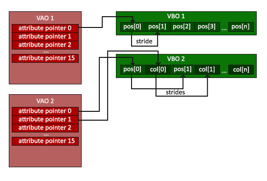  
图 16 Vertex Array Objects

图 16 为我们展示了顶点数组对象（Vertex Array Object, VAO）
绑定存储顶点属性的顶点缓冲对象（VBO）的操作。在图中我们可以观察到，VAO 中存储着 AttributePointer，即顶点属性的指针。这样的好处就是，当配置顶点属性指针时，你只需要将那些调用执行一次，之后再绘制物体的时候只需要绑定相应的 VAO 就行了。这使在不同顶点数据和属性配置之间切换变得非常简单，只需要绑定不同的 VAO 就行了。刚刚设置的所有状态都将存储在 VAO 中。所以， **VAO 实际上是存储顶点属性指针的数组** 。

**图 16中，我们可以明确，红色的一整块矩形区域代表的就是顶点数组对象（VAO）在内存中的存储形式，绿色的一整块矩形代表的就是顶点缓冲对象（VBO）。**

**如图 16 所示， VAO2 中的 attribute pointer 0 指向 VBO2 中代表顶点坐标的 pos[0]，加上属性的步长就能找到下一个 pos[1]，直到 pos[n]。而 VAO2 中的 attribute pointer 1 指向 VBO2 中代表顶点颜色的col[0]，加上属性的步长就能找到下一个 col[1]，直到 col[n]。**

> OpenGL 的核心模式要求我们使用 VAO，所以它知道该如何处理我们的顶点输入。如果我们绑定 VAO 失败，OpenGL 会拒绝绘制任何东西。

######EBO

在本文使用的示例代码中，绘制了一个正方形，并且使用了元素缓冲对象（Element Buffer Object, EBO）。之所以使用 EBO，是因为在顶点数组中，有重复的顶点坐标。在 OpenGL 的图形绘制中，实际上都是在绘制三角形。如果不使用 EBO 对象，让 OpenGL 绘制一个正方形，那么就需要输入 6
个顶点，这样就增加了顶点缓冲对象（VBO）占用内存空间，造成了内存浪费，所以并不推荐。根据这样的需求，我们大致修改下示例代码。

```  
static const GLfloat g_vertex_buffer_data[] = { 
    -0.5f, -0.5f, 0.0f,
     0.5f, -0.5f, 0.0f,
     0.5f,  0.5f, 0.0f,
    
    0.5f, 0.5f, 0.0f,
    -0.5f, -0.5f, 0.0f,
    -0.5f, 0.5f, 0.0f,
};
// some bind buffer code ...
// draw code
glDrawArrays(GL_TRIANGLES, 0, 6);
```

由此可见，使用 EBO 对减少从代码量和内存使用都有帮助，推荐使用 EBO 来优化 OpenGL 应用程序。

在本文示例代码中，vertices 是正方形的四个顶点，indices 是三角形的顶点索引。前文已经提到为了节省内存空间使用 EBO 来存储重复顶点的索引。例如下段代码中，正方形的第一个三角形的顶点为 (0.5, 0.5, 0.0)、 (0.5, -0.5, 0.0) 以及 (-0.5, -0.5, 0.0)，这个三角形顶点元素在 vertices 数组中的的索引（下标）为 0、 1、 3。同理，正方形的第二个三角形的顶点为 (0.5, -0.5, 0.0)、 (-0.5, -0.5, 0.0) 以及 (-0.5, 0.5, 0.0)，这个三角形顶点元素在 vertices 数组中的的索引（下标）为 1、 2、 3。

```
float vertices[] = {
    0.5f,  0.5f, 0.0f,  // top right
    0.5f, -0.5f, 0.0f,  // bottom right
    -0.5f, -0.5f, 0.0f,  // bottom left
    -0.5f,  0.5f, 0.0f   // top left
};
unsigned int indices[] = {  // note that we start from 0!
    0, 1, 3,  // first Triangle
    1, 2, 3   // second Triangle
};
```
  
与 VBO 相类似，当声明完 EBO 的变量之后，先生成 EBO 的缓冲区，然后绑定，最后设置缓冲区数据，缓冲区类型为**GL_ELEMENT_ARRAY_BUFFER** 。

```
glGenBuffers(1, &EBO);
glBindBuffer(GL_ELEMENT_ARRAY_BUFFER, EBO);
glBufferData(GL_ELEMENT_ARRAY_BUFFER, sizeof(indices), indices, GL_STATIC_DRAW);
```

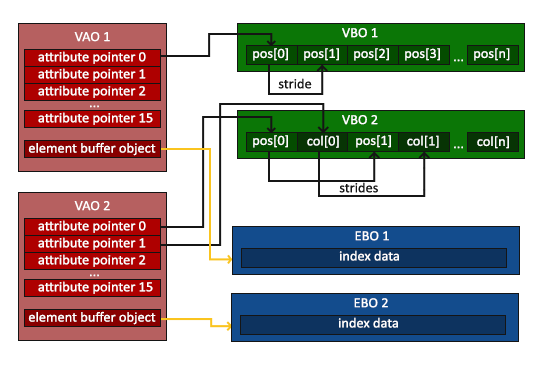  
图 17 Vertex Array Objects EBO

在内存中，EBO 位于 VAO 最后的 element buffer object，当调用 **glBindBuffer** 时，利用 GL_ELEMENT_ARRAY_BUFFER 进行绑定。

######Bind Buffer and Draw

完整的缓冲区绑定代码。在绑定缓冲区之前，必须要先生成 VAO，之后进行 VBO 和 VAO 的生成、绑定和设置。然后设置顶点属性的指针。其中
**glVertexAttribPointer** 函数用于向 OpenGL 解释如何解析顶点数据。

在 **glVertexAttribPointer** 函数中：

  * 第一个参数明确了 Position 的 location。在之前编写的 Vertex Shader 中，我们已经设置了固定的 location **layout(location = 0)** ，即顶点属性的位置值为 0。
  * 第二个参数为顶点属性的 size。顶点属性的顶点坐标属性是个三维向量 vec3 类型的数据，所以 size 大小为 3。
  * 第三个参数明确属性数据类型，这里是 GL_FLOAT，即 float 型。
  * 第四个参数定义是否希望数据被标准化（Normalize）。
  * 第五个参数是顶点属性的步长（Stride），其中 Position 有是 vec3 类型的变量，所以步长为 **3 * sizeof(float)** 。
  * 第六个参数表示位置数据在缓冲中起始位置的偏移量（Offset）。由于位置数据在数组的开头，所以这里是 0。

```
unsigned int VBO, VAO, EBO;
// bind the Vertex Array Object first, then bind and set vertex buffer(s), and then configure vertex attributes(s).
glGenVertexArrays(1, &VAO);
glBindVertexArray(VAO);
// VBO
glGenBuffers(1, &VBO);
glBindBuffer(GL_ARRAY_BUFFER, VBO);
glBufferData(GL_ARRAY_BUFFER, sizeof(vertices), vertices, GL_STATIC_DRAW);
// EBO
glGenBuffers(1, &EBO);
glBindBuffer(GL_ELEMENT_ARRAY_BUFFER, EBO);
glBufferData(GL_ELEMENT_ARRAY_BUFFER, sizeof(indices), indices, GL_STATIC_DRAW);
// Vertex Attribute Pointer
glVertexAttribPointer(0, 3, GL_FLOAT, GL_FALSE, 3 * sizeof(float), (void*)0);
glEnableVertexAttribArray(0);
```
  
上段代码就是生成（Generate）、绑定顶点数据有关 Buffer 的过程。通过对代码的观察，可以总结出以下规律：

  * 必须先生成 VAO， **glGenVertexArrays** 。
  * 绑定 VAO， **glBindVertexArray** 。
  * 生成 VBO， **glGenBuffers** 。
  * 绑定 VBO， **glBindBuffer** 。
  * 把顶点缓冲对象复制到缓冲中供 OpenGL 使用， **glBufferData** 。
  * 生成 EBO， **glGenBuffers** 。
  * 绑定 EBO， **glBindBuffer** 。
  * 把元素缓冲对象复制到缓冲中供 OpenGL 使用， **glBufferData** 。
  * 设置顶点属性， **glVertexAttribPointer** 。

当我们的顶点缓冲对象（VBO）、顶点数组对象（VAO）、元素缓冲对象（EBO）都生成并绑定，且 VBO、EBO 对象复制到缓冲中都完成后，我们就可以进行绘制了，代码如下。

```
glViewport(10, 10, 100, 100);
glClearColor(0.2f, 0.3f, 0.3f, 1.0f);
glClear(GL_COLOR_BUFFER_BIT);
// draw our first triangle
glUseProgram(shaderProgram);
glBindVertexArray(VAO);
glDrawElements(GL_TRIANGLES, 6, GL_UNSIGNED_INT, 0);

```    
  
视口变换在 Graphics Pipeline 中已经有介绍，这里，利用 **glViewport** 函数，对视口在窗体中的 x 坐标、y 坐标、宽度、高度进行设置，最终得到在窗体中的坐标（具体公示可以回顾 Primitive Assembly）。

**glClearColor** 设置背景颜色， **glClear** 清空屏幕。调用 **glUseProgram** 使用之前创建好并附加上我们编写过 Shader 的 Shader Program，最后调用 **glDrawElements** （使用了 EBO）绘制图形。

#####Additional

> 使用 location 这一元数据指定输入变量，这样我们才可以在 CPU 上配置顶点属性。也可以忽略 layout (location = 0) 标识符，通过在 OpenGL 代码中使用 **glGetAttribLocation** 查询属性位置值(Location)，但是我更喜欢在着色器中设置它们，这样会更容易理解而且节省程序员 和 OpenGL 的工作量。

例如下面这段 GLSL 代码示例。  

```
//VERTEX SHADER
 #version 110
 uniform mat4 ProjectionModelviewMatrix;
 uniform mat4 ModelviewMatrix;
 attribute vec4 InVertex;  //w will be set to 1.0 automatically
 attribute vec2 InTexCoord0;
 attribute vec3 InNormal;
 varying vec2 OutTexCoord0;
 //-------------------
 void main()
 {
   gl_Position = ProjectionModelviewMatrix * InVertex;
   OutTexCoord0 = InTexCoord0;
   vec3 normal = vec3(ModelviewMatrix * vec4(InNormal, 0.0));
   //Do lighting computation
   XXXXX
 }
```
  
定义了两个 4×4 矩阵 ProjectionModelviewMatrix 和 ModelviewMatrix，定义了 InVertex、 InTexCoord0 和 InNormal 三个属性。varying 变量 OutTexCoord0 是 Vertex 和 Fragment Shader
之间做数据传递用的。这段代码中没有使用 **layout(location = 0)** 来设置 Position 的 location。要获得属性的 location 可以使用 **glGetAttribLocation** API。

```    
vertexLoc = glGetAttribLocation(MyShader, "InVertex");
texCoord0Loc = glGetAttribLocation(MyShader, "InTexCoord0");
normalLoc = glGetAttribLocation(MyShader, "InNormal"); 
```
  
当设置顶点属性指针的时候，就可以类似下面这段代码一样。  

```
//Vertices, XYZ, FLOAT. We give GL_FALSE since we don't want normalization
 glVertexAttribPointer(vertexLoc, 3, GL_FLOAT, GL_FALSE, sizeof(MyVertex), BUFFER_OFFSET(0));
 //Normals, XYZ, FLOAT.
 glVertexAttribPointer(normalLoc, 3, GL_FLOAT, GL_FALSE, sizeof(MyVertex), BUFFER_OFFSET(sizeof(float)*3));
 //TexCoord0, XY (Also called ST. Also called UV), FLOAT. 
 glVertexAttribPointer(texCoord0Loc, 2, GL_FLOAT, GL_FALSE, sizeof(MyVertex), BUFFER_OFFSET(sizeof(float)*6));
 //BUFFER_OFFSET is defined as #define BUFFER_OFFSET(i) ((char *)NULL + (i))
 //Put that in one of your header files.
```
  
其中，本例中的 MyVertex 是一个成员变量都是只类型的结构体，那么 MyVertex 在内存中的物理存储位置就是连续的，定义的源码如下。  

```
struct MyVertex
{
  float x, y, z;
  float nx, ny, nz;
  float s0, t0;
}
```
  
由于结构体的物理存储是连续的，所以当设置顶点属性的指针的时候只需要得到属性位置，顶点属性大小，属性步长，offset 的指针，就能将顶点属性在 CPU
中配置完成。  
在 MyVertex 这个结构体中：

  * 顶点坐标为 (x, y, z)。
  * 法向量 $\vec{n}$ 为 (nx, ny, nz)。
  * 纹理坐标为 (s0, t0)。

###Summary

到这里，我们完成了 OpenGL 的一些基本概念的学习，并进行了简单的 OpenGL 编程练习。最后回顾总结一下本文的重要概念，并对应文章开头的提问来检验自己是否学有所获。

  * OpenGL 客户端在 CPU 上执行，而 OpenGL 服务端在 GPU 上执行。
  * OpenGL 本质上是一个状态机（OpenGL State Machine）。
  * 渲染上下文（Context），或者说简单上下文，包含 OpenGL 状态信息和应用的对象。
  * 尽管应用程序可以维护多个上下文，但只有一个上下文能够在一个线程中成为当前上下文。当前上下文是接收应用发出 OpenGL 命令的渲染上下文。
  * 调用 OpenGL 命令去绘制一张图片，创建新的渲染上下文，并把 OpenGL 的当前上下文切换到这张图片的上下文，此时就发生了离屏渲染。
  * 离屏渲染时，CPU 会对新创建的渲染上下文存储的数据进行拷贝，这些渲染数据再经由主存、总线、显存，最终传递到 GPU 进行大量并行计算，输出 FrameBuffer。而在这个数据传递和处理过程中，由于 CPU 和主存、主存和显存，以及显存和 GPU 带宽速度不一致，导致 CPU 数据拷贝和传递的过程中增加了调用 OpenGL 的开支。
  * OpenGL 的图形渲染管线（Graphics Pipeline）指的是一堆原始图形数据途经一个输送管道，期间经过各种变化处理最终出现在屏幕的过程。
  * OpenGL Graphics Pipeline 包括顶点着色器（Vertex Shader）、图元装配（Shape Assembly）、几何着色器（Geometry Shader）、光栅化（Rasterization）、片段着色器（Fragment Shader）、测试与混合（Tests and Blending）等阶段。
  * 顶点着色器（Vertex Shader）、几何着色器（Geometry Shader）以及片段着色器（Fragment Shader）可以注入自己的编写着色器程序来达到程序所需的渲染效果。现代 OpenGL 要求我们，必须定义至少一个顶点着色器和一个片段着色器（因为GPU中没有默认的顶点/片段着色器）。所以，我们能够自己编写 Shader 对 Shader 源码进行编译等处理，然后对 Vertex Buffer Object、Element Buffer Object 以及 Vertex Array Object 进行绑定，最终输出 FrameBuffer 将图形绘制到屏幕上。这种用于编写 Shader 程序的类 C 的编程语言，称之为 GLSL（OpenGL Shading Language）。
  * 顶点属性除了顶点坐标，有时还可能包括其他属性，如颜色（RGB）、法向量（Normal）、 纹理坐标（Texture Coordinates）等属性。
  * 使用 **gl_Position** API 设置的值会成为该顶点着色器的输出
  * 存储顶点属性的区域就是顶点缓冲对象（Vertex Buffer Object, VBO）。
  * 顶点数组对象（Vertex Array Object, VAO）实际上是存储顶点属性指针的数组。
  * 元素缓冲对象（Element Buffer Object, EBO）是存储重复使用的顶点的缓冲对象，用来减少 VBO 的内存损耗。

###Easter Eggs

前一段时间整理微信开发账号，用到网易邮箱，在翻看邮箱的时候，突然发现了自己十年前做的 Flash 小动画《[超越，为了最初的梦想](http://niyao.coding.me/FE/NYDream/player.html)》的源文件，开心到爆！这是我高三前的暑假做的小动画，当时疯了一样没日没夜的画，也不管复习，因此被老爸狠骂过。但是当时就是疯了一样做，偏执地做，最终获得了一个[二等奖](http://dm.sohu.com/20081208/n261086896.shtml)，但依然很开心，算是对自己两个月辛苦付出的认可。

现在再看之前画的小动画，觉得剧情超狗血，画风超级村，但依旧很欣慰很温暖。十年，转瞬即逝，人生又能有几个十年？这十年，我从未放弃过，一直一直坚持自己最热爱的技术，虽然还是离着大牛的层次差好远，但也算有了小小的进步。所以，想以此激励自己和正在读这篇文章的你，加油！感谢十年前的我们，努力造就了现在的自己，也希望现在的自己不论遇到怎样的困难，也要继续坚持，成就十年后的我们。加油，与君共勉！

**本文如有任何错误或问题欢迎到[这里](https://github.com/niyaoyao/niyaoyao.github.io/issues/new)提issue，一起交流学习，共同进步成长 😊 。**

###Donate

> 2018/05/28  
>
发文这两天陆续收到小伙伴扫码的赞赏款项，非常感谢捐赠小伙伴的认可，如果本文对阅读学习者有帮助是对我最大的支持。不管赞赏多少金额都是对我的的认可，这是我继续坚持学习技术最大的动力，就好像高山流水遇知音！  
> 今天收到一个 20 元的赞赏，实在太多了，感谢这位雯鑫同学的慷慨馈赠，但总觉得心有戚戚焉，寝食不能安。所以，如果您认可我，觉得这篇文章很有用，帮忙转发转发就非常感谢了，好文章分享给其他人，嘻嘻。我喜欢学技术，热爱开发工作，所以能通过写技术文章整理所学，还能增加个赚零食钱的方式挺开心。但金额有点大，我不好意思，所以我把赞赏入口设置小了，也不影响阅读体验。  
> 再次感谢所有抽时间阅读本文、帮忙转发以及赞赏我的您！非常感谢 🙏 ！

###Reference

  * OpenGL Programming Guide for Mac <https://developer.apple.com/library/content/documentation/GraphicsImaging/Conceptual/OpenGL-MacProgGuide/>

  * Learn OpenGL <https://learnopengl.com/Getting-started/Hello-Triangle>

  * OpenGL Registry <https://www.khronos.org/registry/OpenGL/index_gl.php>

  * OpenGL 4.6 API Reference Card <https://www.khronos.org/files/opengl46-quick-reference-card.pdf>

  * OpenGL 4.6 Core Profile <https://www.khronos.org/registry/OpenGL/specs/gl/glspec46.core.pdf>

  * iOS 保持界面流畅的技巧 <https://blog.ibireme.com/2015/11/12/smooth_user_interfaces_for_ios/>

  * OpenGL管线（用经典管线代说着色器内部）<http://www.cnblogs.com/liangliangh/p/4116164.html>

  * Getting Pixels onto the Screen <https://www.objc.io/issues/3-views/moving-pixels-onto-the-screen/>

  * OpenGL Tutorial <http://www.opengl-tutorial.org/beginners-tutorials/tutorial-1-opening-a-window/>

  * Tutorial 4: Shaders <http://ogldev.atspace.co.uk/www/tutorial04/tutorial04.html>

  * OpenGL ES Programming Guide <https://developer.apple.com/library/content/documentation/3DDrawing/Conceptual/OpenGLES_ProgrammingGuide/>

  * glVertexAttribPointer <https://www.khronos.org/registry/OpenGL-Refpages/gl4/html/glVertexAttribPointer.xhtml>

  * 超越，为了最初的梦想 <http://niyao.coding.me/FE/NYDream/player.html>

赞赏

感谢支持～ 😘
