 
<!--BEGIN_DATA
{
    "create_date": "2021-03-09 14:20", 
    "modify_date": "2021-03-09 14:20", 
    "is_top": "0", 
    "summary": "存储1：一目了然——数据库包含哪些文件<br/>存储2：井然有序——数据文件SSTable结构<br/>存储3：有备无患——WAL<br/>存储4：风驰电掣——MemTable<br/>存储5：按部就班——Iterator<br>/存储6：适者生存——Cache", 
    "tags": "数据库", 
    "file_name": "LevelDB源码剖析2.md"
}
END_DATA-->

#### <p>原文出处：<a href='https://zhuanlan.zhihu.com/p/234360222' target='blank'>存储1：一目了然——数据库包含哪些文件</a></p>

## 存储1：一目了然——数据库包含哪些文件

LevelDB在代码层面并没有区分数据库层和存储引擎层，不过这里把相关功能拆分为两个层面，我们先讲述存储引擎层。

存储引擎的作用是存储数据以及检索数据，核心就是数据是用怎么存储的。

LevelDB的存储引擎主要分为三个部件：

* SSTable，就是Sorted String Table，是一个持久化的、有序的SortedMap，存储在磁盘上；
* WAL，Write Ahead Log，数据库里面经常用的技术，要写数据时，不直接写数据文件，而是先写一条日志，这样可以把对磁盘的随机写转换成顺序写；
* MemTable，保存了最近写入的键值对，数据写入WAL后，会同时写入MemTable，这样便于查询。
* SSTable是数据最终落盘的地方，而WAL保存了最近写入的数据，持久化到磁盘上，MemTable则是WAL里数据的内存表示，因为日志的格式不便于查询，在内存中才便于快速查询。

### 数据库文件

使用Python的LevelDB客户端plyvel来操作LevelDB，可以使用pip来安装。

创建并且打开一个数据库，插入100000个键值对。

```python
>>> import plyvel
>>> db = plyvel.DB('/tmp/testdb/', create_if_missing=True)
>>> for j in range(100000):
...     db.put(bytes(j), 'hello:%d' % j)
...
>>>
```

查看一下，生成了哪些文件：

```
/tmp $ cd /tmp/testdb
/tmp/testdb $ ls -lh
total 1.7M
-rw-r--r-- 1 hzw hzw 595K Oct 22 19:58 000004.log
-rw-r--r-- 1 hzw hzw 721K Oct 22 19:58 000005.ldb
-rw-r--r-- 1 hzw hzw   16 Oct 22 19:58 CURRENT
-rw-r--r-- 1 hzw hzw    0 Oct 22 19:58 LOCK
-rw-r--r-- 1 hzw hzw  266 Oct 22 19:58 LOG
-rw-r--r-- 1 hzw hzw   96 Oct 22 19:58 MANIFEST-000002
```

发现生成了6个文件：

  * `000004.log`是WAL文件，写入的键值对，都会先写到这个日志文件中；
  * `000005.ldb`是SSTable文件，存储了持久化到磁盘的键值对；
  * `LOCK`文件是锁文件，一个LevelDB数据库同时只允许被一个进程操作，一个进程打开一个数据库时，会对这个文件加锁，防止其它进程并发打开这个数据库；
  * `LOG`是通用日志文件，在里面打印一些系统运行的信息；
  * `MANIFEST-000002`是资源文件，记录了版本信息，LevelDB有一系列的ldb文件，各个文件在不同的Level，而资源文件记录了当前各个文件在哪一层，下一个待分配的文件编号是什么等信息；
  * `CURRENT`，在进行一次Compaction后，生成新的版本信息，会将变化写入到MANIFEST文件中，如果MANIFEST太大，下次打开时会重写MANIFEST文件，会新增一个MANIFEST，而CURRENT则保存了当前使用的MANIFEST文件，是为了安全地重写MANIFEST文件。

以上文件有带编号和不带编号的，带编号的文件会同时存在多个，并且使用一个共用的单调递增的数字来赋予编号，而不带编号的文件只有一个。

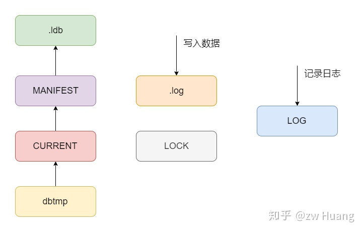

以下是文件类型的定义，发现还多了一个dbtmp文件，这个文件的作用是更换`CURRENT`时，不是直接覆盖`CURRENT`文件，而是先生成一个临时文件，然后将临时文件重命名为`CURRENT`文件，防止更新的时候出错。

```cpp
// db/filename.h
enum FileType {
  kLogFile,         // .log
  kDBLockFile,      // LOCK
  kTableFile,       // .ldb
  kDescriptorFile,  // MANIFEST
  kCurrentFile,     // CURRENT
  kTempFile,        // dbtmp
  kInfoLogFile      // LOG
};
```

对于WAL、SSTable和MemTable会在存储引擎的章节介绍，而对于MANIFEST文件，会在数据库层面介绍。

### 参考源码

```
db/filename.h db/filename.cc：存储文件类型、生成和解析
```

### 小结

* LevelDB里存储数据主要有磁盘上的WAL和SSTable以及内存中的MemTable；
* Compaction后，会生成新的版本，版本信息使用MANIFEST文件来保存，而为了安全的管理MANIFEST，使用了CURRENT文件，指向当前的版本信息。

<hr>

#### <p>原文出处：<a href='https://zhuanlan.zhihu.com/p/247832181' target='blank'>存储2：井然有序——数据文件SSTable结构</a></p>

## 存储2：井然有序——数据文件SSTable

LevelDB的键值对都持久化到扩展名为ldb的文件中，一个ldb文件存储了一定键范围内的键值对。

SSTable文件分为5个部分，从头到尾分别是Data Block、Filter Block、Meta Index Block、Index Block和Footer。

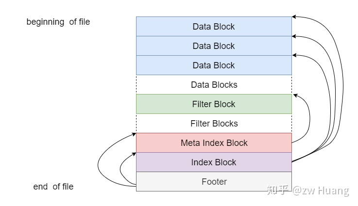

  * Data Block存储数据，Data Block有多个，LevelDB将一个ldb文件里的键值对划分为多个Data Block进行存储，每个Data Block具有一定的大小，并且按照键的顺序进行排序，也就是后面一个Data Block的第一个键大于前面一个Data Block的最后一个键，Data Block可支持压缩；
  * 在Data Block后是Filter Block，也设计成为多个，目前只使用了一个，存储了布隆过滤器的二进制数据；
  * 剩下三个是控制信息，Meta Index Block存储了指向Filter Block的指针，根据这个指针可以找到某个Filter Block开始的位置，以及其所占用的空间，这个指针的键是Meta Block的名称，值是一个`BlockHandler`，是一个文件指针；
  * Index Block存储了指向每一个Data Block的指针的数组，这个指针的键大于等于对应的Data Block的最后一个键，并且小于下一个Data Block的第一个键，通过Index Block可以实现二分搜索，快速定位键属于哪个Data Block，而不需要扫描所有的Data Block；
  * 因为Meta Index Block和Index Block的大小是不固定的，没法直接定位到这两个Block，所以最后有一个大小固定的Footer，保存两个`BlockHandler`，分别指向Meta Index Block和Index Block。

下面就从Footer开始来介绍每个结构，每个结构在内存里面会用一个类表示，为了表示方便，将它们转换为`Struct`。

### Footer

在介绍Footer之前，先介绍`BlockHandler`，它是一个文件指针，其中`offset`指向了文件的偏移量，而`size`表示这个Block的大小，通过`BlockHandler`就可以定位到文件里面的某一个Block。

```cpp
// table/format.h
struct BlockHandler {
    varint64 offset;
    varint64 size;
}
```

一个`varint64`最长占用10字节，所以一个`BlockHandler`最长占用20字节。

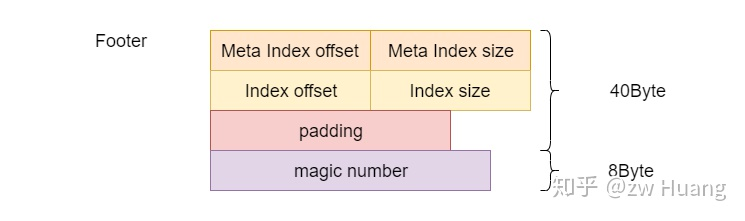

而Footer的结构如下:

```cpp    
// table/format.h
struct Footer {
    BlockHandler meta_index_block;  // 定位Meta Index Block
    BlockHandler index_block;       // 定位Index Block
    byte[n] padding;                // 补齐到48字节
    int64 magic;                    // 魔数
}
```

一个`BlockHandler`最长为20字节，魔数的大小是8字节，所以一个Footer最长为48字节，但是如果长度不固定的话，无法知道Footer开始的字节，所以通过`padding`将Footer固定为48字节的大小，而魔数则增加了校验功能。

拿到一个SSTable后，读取最后48个字节，就可以得到Footer，根据里面的信息就可以读取Meta Index Block和Index Block。

### Block

除了Footer，其它4个部分都是一种Block，`BlockHandler`可以读出某个Block的内容，这些Block都有一个通用的结构:

```cpp    
struct Block {
    byte[] data;
    byte compress_type;
    int32 crc;
}
```

`data`就是数据部分，而`compress_type`表示使用了什么压缩方式，而`crc`则是校验上面两个字段用的。

为了讨论方便，下面介绍各种Block的时候，只专注`data`里的内容，而忽略其它字段。

### Data Block的结构

Meta Index Block和Index Block的存储格式和Data Black一样，所以有必要先介绍Data Block的格式。

Data Block的大小默认是4KB（压缩前），当然也不是精确的4KB，有可能会超过4KB，因为每次插入一个键值对的时候会判断是否超过4KB，如果插入一个比较大的键值对，就会远超过4KB，一个键值对只会保存在一个Data Block里。

相邻的键很有可能包含相同的前缀，考虑到这个，Data Block做了优化，采用了前缀压缩，也就是后面一个键只需要记录前面一个键不同的部分，以及和前面一个键相同部分的长度，就可以通过前面一个键恢复出后一个键，这样可以节省空间。

多个`Kv`连续存放，如下图：

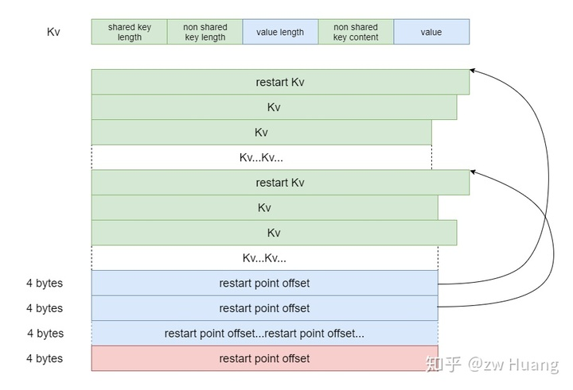

一个`Kv`的结构如下:

```cpp    
struct Kv {
    varint32 shared_key_length;       // 和前一个键相同的前缀长度
    varint32 non_shared_key_length;   // 不相同的键长度
    varint32 value_length;            // 值的长度
    byte[] non_shared_key_content;    // 不相同的键的内容
    byte[] value;                     // 值的内容
}
```

通过`shared_key_length`和前一个键的值可以得到当前键的前缀，然后根据这个`Kv`里面的后缀，便可以拼接得到这个键。

通过这种方式将多个`Kv`连续存放在Data Block里，可以进行键的前缀压缩。然而这样会有一个问题，不管得到哪一个键的值，都需要从Block的第一个键开始依次构造，搜索一个键的时候，也需要遍历整个Block，如果一个Block里有大量的键的话，效率会比较低。

针对这个问题，LevelDB设置了restart point，每16个Kv里第一个Kv是一个restart point，这个Kv的`shared_key_l ength`始终为0，也就是这个Kv不采用前缀编码，`non_shared_key_content`里的内容就是整个键的内容。这样就不需要从每一个Data Block的开头开始构造键了，只需要从每一个restart point开始构造。另外在每个Data Block的末尾存储了一个restart point数组，指向了每一个restart point所在Kv的在块中的偏移，这样便可以支持二分搜索，搜索出键属于哪一个restart point的组里，然后去搜索这个组里面的16个Kv就可以找到这个键。restart point数组就像是一个Data Block的稀疏索引，可以加快键的查找。

Data Block的结构如下:

```cpp
// table/block.h
struct DataBlock {
    Kv[] kv;                        // Kv数组
    int32[] restart_point_offsets;  // restart point偏移数组，指向每一个restart point
    int32 restart_point_count;      // restart point数量
}
```

根据这个结构，读取一个Data Block末尾的4个字可以获取`restart_point_count`，每个restart point的大小是4字节，从末尾`restart_point_count` * 4 + 4开始读取`restart_point_count` * 4个字节就可以读取到restart point的偏移数组。

搜索一个键：

  * 对restart point进行二分搜索，找到最大的小于等于搜索键的restart point；
  * 从这个restart point对应的键开始遍历，最多遍历16个键，找到Kv，或者确定键不存在。

### Index Block

知道Data Block的结构后，Index Block就非常简单了，它其实就是存储了一个Kv数组，每一个Kv对应一个Data Block，其中键大于等于对应的Data Block中最后一个键，值为一个`BlockHandler`，可以定位到一个`Data Block`。Index Block就是Data Block的索引，搜索时可以对Index Block二分搜索，找到键对应的Data Block。

Index Block里面每一个Kv都是一个restart point，也就是没有采用前缀压缩，相当于restart point是一个稠密索引，每一个Kv都有一个restart point对应。

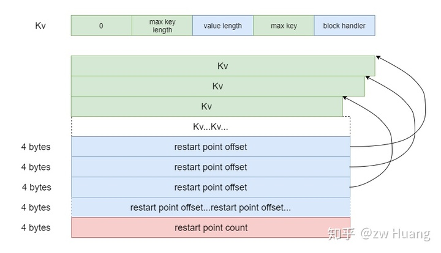

### Meta Index Block

和Index Block指向Data Block一样，Meta Index Block指向Filter Block，是Filter Block的索引。不过目前只有一个Filter Block，也就是里面只有一个Kv。键是Filter Block的名字，而值是一个`BlockHandler`，指向对应的Filter Block。

对于目前存在的Bloom Filter而言，键是`filter.leveldb.BuiltinBloomFilter2`。

Index Block的结构如下图：

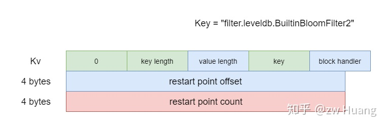

### Filter Block

目前存在的Filter Block只有一个，那就是布隆过滤器，如果没有开启布隆过滤器，那么就没有这个Filter Block。

布隆过滤器是一种数据结构，一种巧妙的概率型数据结构（probabilistic data structure），特点是高效地插入和查询，可以用来告诉你某个键一定不存在或者可能存在。相比`Map`和`Set`布隆过滤器占用的空间少很多，但是结果具有假阳性，如果返回键不存在，那么键一定不存在，如果返回键存在，那么键有可能不存在、又有可能存在。具体的可以自己去搜索相关文档。

如果为每个元素分配10bit，那么假阳率可以降低到1%，是个不错的数值。

那么为什么需要布隆过滤器呢？

布隆过滤器用于快速判断一个键是否在一个SSTable里。正常的查找流程如下:

  * 对Index Block进行二分搜索，查到键所属的Data Block；
  * 读取Data Block，对restart point进行二分搜索，查找对应的键所属的restart point；
  * 对restart point开始遍历进行键的查找。

理想情况下，Index Block可以缓存在内存中，但是Data Block很有可能没有缓存在内存中，这样就需要一次随机磁盘IO。

布隆过滤器比较小，可以缓存在内存中，这样就可以通过布隆过滤器快速判断对应的键有没有在这个SSTable里。另外如果判断键在SSTable，只有1%的可能性最后键不在这个SSTable里。这是典型的一种空间换时间的思想，选择布隆过滤器是因为布隆过滤器的空间占用非常小。

LevelDB采用了多个布隆过滤器，默认情况下，每2KB的数据开启一个布隆过滤器。

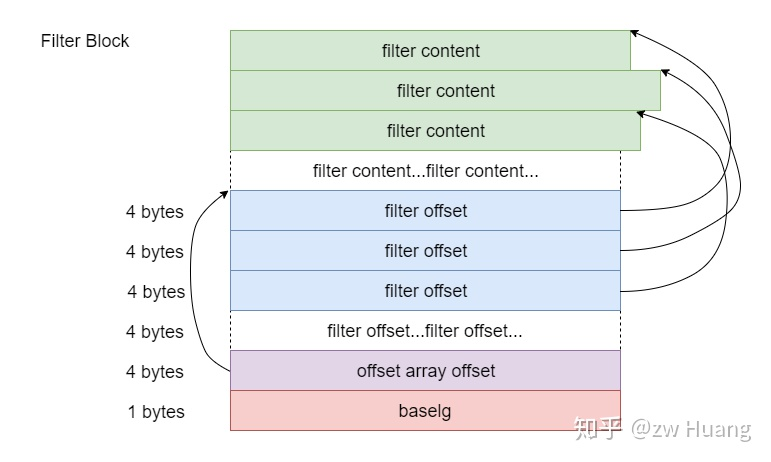

布隆过滤器的数据结构如下:

```cpp    
// table/filter_block.h
struct FilterEntry {
    byte[] filter_content;      // 表示一个布隆过滤器的内容
}

struct FilterBlock {
    FilterEntry[n] entries;     // 有多少个布隆过滤器
    int32[n] entry_offsets;     // 布隆过滤器数据的偏移数组
    int32 offset_array_offset;  // 偏移数组的偏移
    int8 baselg;                // 布隆过滤器的大小
}
```

其中`baselg`表示的是多少数据开启一个布隆过滤器，默认是11，表示每2KB（2 << 11）的数据开启一个布隆过滤器。这里的2KB是严格的间隔，这样查找一个键时，先查找到Index Block里相应的Data Block的偏移，根据这个偏移量，查找到对应的布隆过滤器，这就是这个Block里的键生成的布隆过滤器。对于Block大小为4K，而布隆过滤器每2K开启的情况，比如第一个Block的偏移是0，那么对应的就是第0个布隆过滤器，而第二个Block偏移是4K，对应的是第2(4k / 2k)个布隆过滤器，这样的情况下第1个布隆过滤器实际就是空的。`offset_array_offset`指向一个filter offset数组，这个数组保存了每个过滤器的开始位置，这样就可以快速定位到某个过滤器。

所以使用布隆过滤器的步骤如下:

  * 根据Data Block的偏移 `<< 11`找到对应的布隆过滤器序号；
  * 根据序号查找偏移数组，读取对应的布隆过滤器的偏移；
  * 根据偏移读取对应的布隆过滤器数据；
  * 根据布隆过滤器数据，判断键是否存在。

### 读取一个键的步骤

通过上面对SSTable的介绍，来总结一下在SSTable读取一个键的步骤。

要读取一个SSTable，首先需要打开这个SSTable，打开会有以下步骤:

  * 读取Footer，根据里面的读取Meta Index Block和Index Block，将Index Block的内容缓存到内存中；
  * 根据Meta Index Block读取布隆过滤器的数据，缓存到内存中。

读取一个键的步骤如下：

  * 根据键对Index Block的restart point进行二分搜索，找到这个键对应的Data Block的`BlockHandler`；
  * 根据`BlockHandler`的偏移计算出布隆过滤器的编号，读取相应的布隆过滤器；
  * 通过布隆过滤器的数据判断键是否存在，不存在就结束；
  * 否则读取对应的Data Block；
  * 对Data Block里的restart point进行二分搜索，找到搜索键对应的restart point;
  * 对这个restart point对应的键进行搜索，最多搜索16个键，找到键或者找不到键。

通过以上步骤可以看到Index Block和布隆过滤器的内容都是缓存在内存里的，所以当一个键在SSTable不存在时，99%的概率是不需要磁盘IO的。

### 参考源码

```    
table/format.h table/format.cc: 编解码BlockHandler，编解码Footer，根据BlockHandler读取一个键的内容
table/block_builder.h table/block_builder.cc: 不断添加键值对，逐渐构建一个Block，主要是添加键值对，然后生成Block的数据
table/block.h table/block.cc: 对一个Block进行读取相关的功能
table/filter_block.h table/filter_block.cc include/leveldb/filter_policy.h util/bloom.cc: 构建布隆过滤器数据，判断键是否存在的
include/leveldb/table.h table/table.cc：读取一个Table的内容，产生迭代器，或者根据一个键读取一个值
include/leveldb/table_builder.h table/table_builder.cc：不断添加键值对，逐渐构建一个Table
db/build.h db/build.cc：根据一个Iterator生成一个SSTable文件
```

### 小结

SSTable的结构比较复杂，也用到了不少小技巧，值得我们学习。SSTable和B+树的思想很像，就好像一个3层的B+树，Footer是根节点，定位到Index Block，Index Block是第二层，可以定位到Data Block。

SSTable的文件布局比较紧凑，查询效率也比较高，不需要像B+树这样复杂，因为SSTable只会整体生成，而不会增量修改，也就是SSTable是只读，这个结构就是利用了这个特性。

<hr>

#### <p>原文出处：<a href='https://zhuanlan.zhihu.com/p/258091002' target='blank'>[]</a></p>

## 存储3：有备无患——WAL

LevelDB写入一个Kv时，都会先向日志里写入一条记录，这种日志一般称为WAL，也就是Write Ahead Log，类似于MySQL的Redo Log。这种日志最大的作用就是将对磁盘的随机写转换成了顺序写。当故障宕机时，可以通过WAL进行故障恢复。控制每次WAL写入磁盘的方式，可以控制最多可能丢失的数据量。

WAL里的内容实际就是内存里MemTable内容的持久化，当一个MemTable写满后，开启一个新的MemTable时，也同时会开启一个新的WAL，当MemTable被Dump到磁盘后，相应的WAL可以被删除。

WAL的格式很简单，由一系列32KB的Block组成，当然最后一个块可能是不满的，正在写入中。

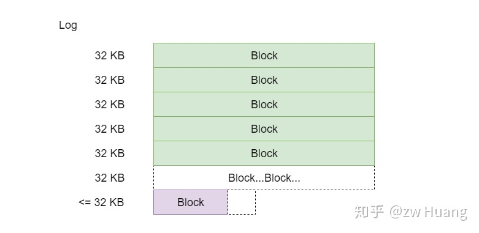

### Log Block结构

Log Block的结构如下：

```cpp
Struct LogBlock {
    LogRecord[] records;   // 一个Block包括一系列的LogRecord
    byte[] padding;        // 通过padding正好到32KB
}
```

每个Log Block由一系列的Log Record组成，每个Log Block大小为32KB，一个Log Record至少有7个字节，所以当距离32KB小于7个字节时，需要用padding补齐到32KB，padding都是`0x00`，再开始下一个Log Block。

Log Record的结构如下:

```cpp
struct LogRecord {
    uint32 checksum;    // 下面三个字段的checksum
    unint16 length;     // 数据的长度
    byte type;          // Log Record的类型
    byte data[length];  // 实际的数据
}

// db/log_format.h
enum RecordType {
    // Zero is reserved for preallocated files
    kZeroType = 0,
    kFullType = 1,
    // For fragments
    kFirstType = 2,
    kMiddleType = 3,
    kLastType = 4
};
```


每个Log Record都由7个字节的固定部分开头，4个字节是后面所有部分的checksum，2个字节是数据的长度，一个字节是这个Log Record的类型。数据是二进制的，需要自己解释，没有任何格式的要求。

对于`type`有几种情况，主要是为了解决写入数据时，Log Block里的空间不足以容纳数据的情况。一条记录可能很大，无法在一个Data Block里容纳，这时就需要拆分这个记录，例如：

  * 当前Log Block里的空间足以容纳写入的数据，`type`为`kFullType`，表示当前Log Record里包含所有的数据；
  * 当前的Log Block里的空间不足以容纳写入的数据时，将写入的数据拆分，用前面部分将当前Log Block填满，这时候`type`就是`KFirstType`，表示当前的Log Record是数据的第一个部分；
  * 接下来开始一个新的Log Block，如果这个Log Block依然不能容纳所有的数据，这时候`type`就是`kMiddleType`，表示这个Log Record保存了中间部分的数据，后面还有数据；
  * 当剩余的数据可以容纳到新的Log Block时，这时候`type`就是`kLastType`，表示这个记录的数据结束了，可以和前面的数据组合起来；
  * `kZeroType`是为了兼容`mmap`相关的代码，这种方式会先将数据分配好，置0，所以当读取日志的文件读取这些0时，就可以跳过这些数据，我们不会写入这种类型的日志记录。

### Log Block 举例

举个例子，假设从头开始，写入以下3个记录：

```    
A: length 1000
B: length 97270
C: length 8000
```

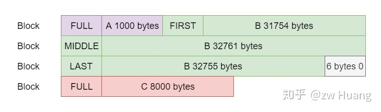

  * A记录会被写入到第一个Log Block，`type`为`kFullType`；
  * B记录会首先将第一个Log Block填满，`type`是`KFirstType`，然后第二个Log Block也会被填满，`type`是`kMiddleType`，最后使用第三个Log Block的前面部分，`type`是`kLastType`，表示B记录的数据结束了；
  * 记录C发现第三个Log Block只有6个字节了，所以置零，将数据放到第四个Log Block，`type`是`kFullType`。

### Log的内容

Log Record里的内容是自解释的。WAL里保存的是对键值对的操作，包括键值对的插入和删除。一个Log Record可能包括多个键值对的操作。

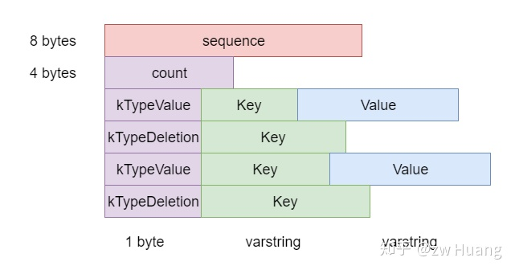

内容先是`SequenceNumber`，然后`count`表示有多少个操作记录，接着就是这`count`个`record`了。`record`分为两种，分别是插入和删除，插入需要指定键和值，删除只需要指定键。

Log的内容其实和后面介绍的`WriteBatch`的内容一样，这种结构可以实现一次性操作多个键值对。

### 参考源码

```    
db/log_format.h: 定义了RecordType和一些常量
db/log_writer.h db/log_writer.cc: 主要实现Writer::AddRecord，写一条记录到日志中
db/log_reader.h db/log_reader.cc: 主要实现Reader::ReadRecord，读取一条日志记录
```

### 小结

日志的实现非常简单，用32KB大小的块对日志进行分割，每个Log Record都有校验，对大的Log Record也不需要缓存。如果一个记录太大也不需要一次性全部读出，这种简单的实现对于LevelDB的场景完全够用。

实际的数据就是二进制数据，是由程序自己解释的，WAL没有规定需要什么格式。

除了WAL用这种日志格式以外，MANIFEST文件的记录也使用了这种格式。

<hr>

#### <p>原文出处：<a href='https://zhuanlan.zhihu.com/p/259857669' target='blank'>存储4：风驰电掣——MemTable</a></p>

## 存储4：风驰电掣——MemTable

MemTable是LevelDB的存储组件之一，是一个内存数据结构，它只需要满足一个`SortedMap`的特性即可：

  * 必须是一个`Map`，也就是可以快速根据键查询到值，`Map`的实现多用哈希或者红黑树；
  * `Map`中键是排序的，也就是可以对`Map`进行范围查询，或者按键的顺序迭代，这时候哈希就无法满足条件了。

### Skiplist

`SortedMap`的实现，一般会采用红黑树，不过LevelDB采用的是Skiplist。Skiplist是一种概率性的数据结构，支持`SortedMap`的所有功能，性能和红黑树相当。

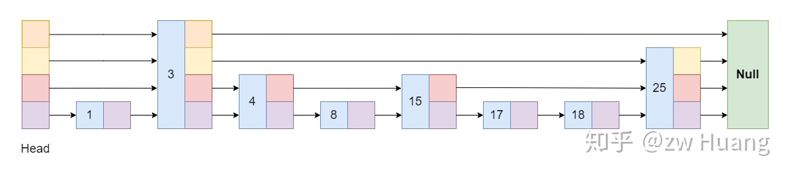

Skiplist每一个节点有一个随机产生的层数，从1层到N层。每一层的节点组成一个链表。第1层的链表包括所有的节点，并且是按照顺序排列的，从Head开始遍历第一层就可以遍历所有数据。上面的层的链表是稀疏的，层越高越稀疏。查找时从从Head节点的第N层开始逐渐下降，直到找到对应的节点。

假设要查找节点17:

  * Head节点最高层开始，下一个节点是3，小于17，所以定位到3这个节点;
  * 3节点的最高层的下一个节点是Null，所以在3这个节点下降一层;
  * 3节点的次高层的下一个节点是25，大于17，所以目标节点肯定在3和25节点之间，3这个节点再下降一层;
  * 3节点的第二层的下一个节点是4，小于17，就定位到节点4;
  * 节点4的最高层的下一个节点是15，小于17，就定位到节点15；
  * 节点15的下一层节点是25，大于17，所以在节点15再下降一层;
  * 节点15的下一个节点是17，就找到了目标节点。

Skiplist的原理大家可以查询相关的文件，不过多介绍。

采用Skiplist的最大理由还是Skiplist的实现比红黑树简单太多了。

LevelDB里面使用`SkipList`类表示一个Skiplist，它主要的接口是：

```cpp
void SkipList::Iterator::Seek(const Key& target);
void SkipList::Insert(const Key& key);
```

这个接口就是查找一个键，插入一个键，并没有提供删除接口，这是因为LevelDB里面没有实际的删除，删除也只是简单的插入一条记录，说明某个键被删除了。

### 内存分配

`SkipList`插入一个键时，需要分配内存给一个节点，`malloc`是一个比较耗时的系统调用，尤其对于小内存分配来说，而且会产生很多内存碎片。

LevelDB里面的`SkipList`和一般的Skiplist使用有很大的不同，只会分配内存，而不需要回收小部分内存。`SkipList`的内存是等待MemTable写满后，转换为Immutable MemTable，写入SSTable，写入完成后，一起被销毁。也就是内存的回收是针对整个Skiplist的。

针对这些特点，LevelDB为MemTable定制了`Arena`内存管理，前面有介绍过，这种内存分配有以下特点：

  * 每次申请一个较大的内存，供小内存分配使用，这时候只需要改变几个指针即可；
  * 对于较大的内存分配，直接调用系统调用进行分配；
  * 不会回收部分内存，只会整块回收;
  * 可能会有一些内存的浪费。

### 构造MemTable

MemTable的实现是比较简单的，对`SkipList`的实现做了一层封装，将对键的查找和插入的请求，代理到相应的`SkipList`，调用相应的接口。

在实现中有一点值得注意，LevelDB存储的是Kv，而`SkipList`存储的是键，所以在MemTable里需要做一个转换。

对于插入操作，MemTable会把键和值编码在一个字符串里面，如下图所示，先是键，再是值，使用了字符串的长度前缀编码，然后将这个字符串插入到`SkipList`里。

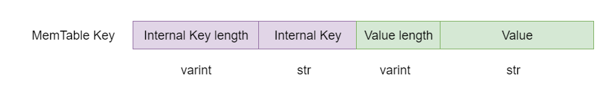

而对于查找操作，只会按照前缀编码键，构造上面图的前半部分，而`SkipList::Iterator::Seek`的实现，会将迭代器定位到大于等于查找键的第一个键的位置，读出这个键，然后比对里面的键和查找的键是否相同，相同的话，才会读取对应的值，否则就是键不存在。

### 参考源码

```    
db/skiplist.h: 跳跃表实现
db/memtable.h db/memtable.cc: MemTable的实现
```

### 小结

MemTable的实现很简单，主要就是对Skiplist的了解，相比红黑树来说，Skiplist实现的代码非常好，也很容易理解。

<hr>
 
#### <p>原文出处：<a href='https://zhuanlan.zhihu.com/p/260657347' target='blank'>存储5：按部就班——Iterator</a></p>

## 存储5：按部就班——Iterator

Level DB中，实现了各种Iterator，Iterator有以下功能：

* 按顺序对所有的元素进行迭代；
* 处理某一范围内的元素，正序或者逆序；
* 定位到某一个特定的元素进行处理。

LevelDB在以下部分使用了迭代器：

* 对MemTable进行迭代；
* 对于SSTable的Block进行迭代；
* 对整个SSTable进行迭代；
* Level File Num Iterator，因为LevelDB的SSTable是分层的，这个Iterator对某一个版本的某一层的SSTable的文件信息进行迭代；
* Concatenating Iterator，Level > 0的SSTable是有序的，Concatenating Iterator可以对这些有序的SSTable同时迭代；
* 对MemTable、Immutable MemTable和所有的SSTable同时迭代；
* DB Iterator对整个数据库进行迭代。

以上迭代器的实现，有些是从零开始实现的，有些是组合其它迭代器实现的。为了组合其它迭代器，LevelDB实现了两种迭代器的组合方式：

* Two Level Iterator，可以组合两个迭代器A和B，其中A里面的每个元素可以产生一个迭代器B，可以迭代A，取出一个元素产生迭代器B，然后迭代B，然后再产生A的下一个元素，再产生一个迭代器B，如此往复；
* Merger Iterator可以组合多个迭代器，同时对多个迭代器进行迭代，就好像对这些迭代器做了一次归并排序，产生结果。

### Iterator接口

```cpp
// include/leveldb/iterator.h

class LEVELDB_EXPORT Iterator {
public:
    ...

    // 当前迭代器是否有效
    virtual bool Valid() const = 0;

    // 定位到某个键，当键不存在时，定位到比这个键大的第一个键
    virtual void Seek(const Slice& target) = 0;

    // 定位到下一项
    virtual void Next() = 0;

    // 定位到前一项
    virtual void Prev() = 0;

    // 返回当前键
    virtual Slice key() const = 0;

    // 返回当前值
    virtual Slice value() const = 0;

    // 返回当前迭代器状态
    virtual Status status() const = 0;

    // 迭代器被销毁时的回调函数，注册后可在销毁时调用
    using CleanupFunction = void (*)(void* arg1, void* arg2);
    void RegisterCleanup(CleanupFunction function, void* arg1, void* arg2);

    ...
};
```

LevelDB的`Iterator`接口如上，里面有很多函数，但是最重要的还是`Seek`、`Prev`和`Next`这三个函数。

首先先来看看两个组合迭代器的实现方式，它们是很多迭代器的基础。

### Two Level Iterator

Two Level Iterator其实就是使用两个Iterator，第一个Iterator是第二个Iterator的索引。先在第一层的Iterator做迭代，每次拿出一个元素后，根据这个元素调用回调函数，生成第二层的一个Iterator，然后第二层的Iterator迭代完成后，再在第一层取下一个元素。

如图，左边的为第一层的Iterator，从上到下迭代，取出一个元素，根据这个元素找到第二层，也生成一个Iterator，然后迭代第二层的数据，完成这个Iterator的迭代后，再取出第一层的下一个元素继续。

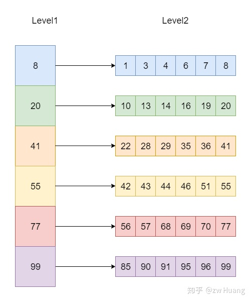

对使用Two Level Iterator有两个要求: 第一层的Iterator的元素是有序排序的； 根据第一层的Iterator生成的第二层的Iterator也是全局有序的，也就是第一层第n个元素生成的第二层Iterator的最大元素小于第一层第n +1个元素生成的第二层Iterator的最小元素，并且第二层的每个Iterator内部也是有序的。

Two Level Iterator使用就像一个二级索引，对第一级生成Iterator，然后Iterator里每个元素指向第二级里的数据，也可以生成一个Iterator。

### Merger Iterator

Merger Iterator可以用来组合多个Iterator，只需要保证每一个Iterator内部是有序，而不需要每一个Iterator都是全局有序的。Merger Iterator会对所有Iterator进行迭代，就好像归并排序一样。找到每个Iterator头部最小的元素，`next`时，将最小的元素所在的Iterator `next`，然后再次找到最小的元素。

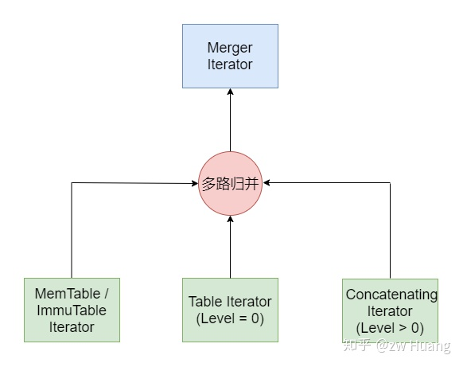

以下是生成一个Merger Iterator的方式：

```cpp
// table/merger.cc
Iterator* NewMergingIterator(const Comparator* comparator, Iterator** children,
                                int n) {
    if (n == 0) {
        return NewEmptyIterator();
    } else if (n == 1) {
        return children[0];
    } else {
        return new MergingIterator(comparator, children, n);
    }
}
```

可以看出，当输入超过1个Iterator时，会生成一个Merger Iterator。输入是一个Iterator数组，只需要实现Iterator接口，不用管具体的实现是什么，输出也是一个实现了Iterator接口的Merger Iterator。

先来看看`Next`的实现：

```cpp
// table/merger.cc
void MergingIterator::Next() override {
    // 改变方向
    if (direction_ != kForward) {
        for (int i = 0; i < n_; i++) {
            IteratorWrapper* child = &children_[i];
            if (child != current_) {
                child->Seek(key());
                if (child->Valid() &&
                        comparator_->Compare(key(), child->key()) == 0) {
                    child->Next();
                }
            }
        }
        direction_ = kForward;
    }
    current_->Next();
    FindSmallest();
}
```

  * 属性`current_`保存了当前迭代的键所在的子Iterator；  
  * 如果之前就是`Next`，这次再做一次`Next`很简单，只需要把当前的Iterator取一次`Next`，然后在所有的子Iterator的当前元素里面找到最小的那个元素，就是迭代的下一个元素，所在的迭代器更新为当前Iterator；  
  * 如果`direction_ != kForward`，说明变换了方向，之前是`Prev`，这时候需要将所有的子Iterator Seek到当前元素，使得除了`current_`的所有子Iteartor都指向大于当前键的下一个元素。  

`Prev`的实现和`Next`类似。

`Seek`操作只需要对所有的子Iterator做一次`Seek`操作，找到最小的那个元素，就是当前`Seek`游标所在。

### MemTable Iterator

MemTable的Iterator其实就是对Skiplist进行操作。

  * 对于`Seek`操作，其实只需要调用Skiplist的查找操作即可；
  * 对于`Next`操作，因为Skiplist的最低层是一个单链表，所以只需要取这个链表的`Next`即可定位到下一个元素；
  * 对于`Prev`操作，稍微复杂一点，需要用查找函数找到当前元素的前一个元素。

### Block Iterator

Block Iterator是用来迭代Block的，Block的数据部分是按照键的顺序排列的，所以`Next`的实现非常简单，只需要解析下一个Kv即可。

因为每个Kv的长度是不同的，没法直接定位到具体的某一个Kv，但是对于`Seek`操作，可以使用restart point来进行快速定位。之前说过restart point指向了某一个键，是一个稀疏索引。可以先对restart point进行二分搜索，找到restart point 对应的键小于等于target最大的那个restart point，如果键存在，则必在这个restart point开始的16个键中，再从这个位置开始搜索，就可以找到对应的键。

`Prev`的实现和`Seek`类似，只需要找到当前元素的前一个元素所在的restart point，然后搜索即可。

### SSTable Iterator

SSTable Iterator其实是一个Two Level Iterator。

SSTable是由Data Block和Index Block组成的，而且满足Two Level Iterator的两个条件，可以将对SSTable的迭代使用一个Two Level Iterator来实现。使用Index Block的Iterator成为第一层的Iterator，里面每取一个元素，都可以找到对应的Data Block，生成第二层的Iterator。

先来看一个SSTable的Iterator是怎样生成的：

```cpp
// table/table.cc
Iterator* Table::NewIterator(const ReadOptions& options) const {
    return NewTwoLevelIterator(
        rep_->index_block->NewIterator(rep_->options.comparator),
        &Table::BlockReader, const_cast<Table*>(this), options);
}
```

第一个参数是第一层的Iterator，第二个参数是一个回调函数，这个回调函数以第一个参数迭代返回的元素，以及第三个和第四个参数为参数进行调用，以此来获取索引值对应的第二层的Data Block的Iterator。

### Level File Num Iterator

LevelDB的SSTable是分层保存在一个数组里面，每一层一个数组，保存的是文件的File Number。

Level File Num Iterator其实非常简单，就是对每一层的文件信息数组，生成一个迭代器，将一个内存里的`vector`变成一个迭代器。

### Concatenating Iterator

除了Table的迭代，Two Level Iterator还用在另外一个地方：
    
```cpp    
// db/version_set.cc
Iterator* Version::NewConcatenatingIterator(const ReadOptions& options,
                                            int level) const {
    return NewTwoLevelIterator(
        new LevelFileNumIterator(vset_->icmp_, &files_[level]), &GetFileIterator,
        vset_->table_cache_, options);
}
```

这个迭代器可以对某一层（除了level 0）的SSTable进行迭代。第一层是一个Level File Num Iterator，可以返回这一层的SSTable文件信息，而第二层则是SSTable
Iterator，使用`GetFileIterator`可以获取第二层的SSTable Iterator。这样就可以对这一层的所有SSTable里的键从小到大迭代。

### Iteator整体结构概览

经过以上的讨论，可以把LevelDB里的Itertaor的层次结构，用一张图来表示。

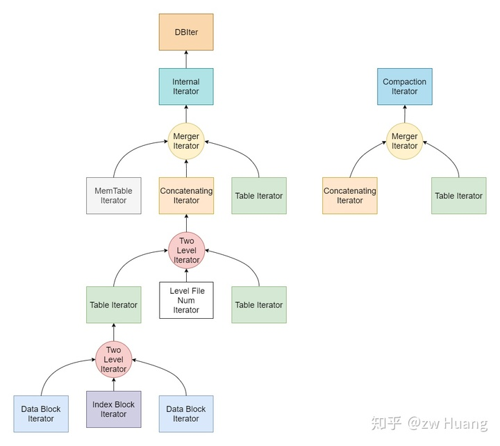

从上图可以看到： 

* Two Level Iterator可以将Index Block Iterator和Data Block Iterator组合成一个Table Iterator； 
* Two Level Iterator可以将Level File Num Iterator和Table Iterator组合成一个Concatenating Iterator，这个Iterator迭代某一Level（Level > 0）的所有SSTable； * * * Merger Iteator可以组成一个Internal Iterator，对整个数据库里的数据进行迭代，包括MemTable Iterator、Table Iterator（Level 0）和Concatenating Iterator（Level > 0)，注意这个Iterator是不会区分版本的，所有版本的数据都能看到； 
* Internal Iterator做一定的处理后可以生成DBIter迭代整个数据库； 
* Merger Iterator也可以组成一个Compaction Iterator，包括Table Iterator（Level 0）和Concatenating Iterator（Level > 0)，这主要是Compaction时使用。

以上Internal Iterator是会看到所有数据的，比如一个键覆盖了之前的值，这两个键值对都会看到。所以LevelDB里面还有一个DBIter，封装了对Internal Iterator的访问，根据当前的`SequenceNumber`，只会看到可见的那个键。DBIter会对Internal Iterator作封装，查找一个Key时会找到可见的`SequenceNumber`最大的那个Key，`Next`的话，会跳过所有User Key相同的Internal Key直到一个User Key不同的并且可见的Internal Key，这样迭代整个数据库不会出现重复的User Key。

### 参考源码

```    
include/leveldb/iterator.h：定义Iterator的接口
table/iterator.cc: 实现CleanUp的功能以及Empty Iterator
table/block.h table/block.cc: 实现了Block Iterator
db/skiplist.h: 实现了skiplist的Iterator
table/two_level_iterator.h table/two_level_iterator.cc： 实现了Two Level Iterator
table/merger.h table/merger.cc: 实现了Merger Iterator
table/iterator_wrapper.cc: 实现一个Iterator包装器，缓存valid()和key()的结果，避免虚函数调用和更好的cache locality
db/db_iter.h db/db_iter.h：实现对整个数据库的迭代器
```

### 小结

可以看到LevelDB里面大量使用了Iterator，而Iterator的统一都是使用了接口。Iterator是分层次的，多种Iterator可以进行组合，但是使用的时候的方式又是一样的，让代码更为简洁。

<hr>

#### <p>原文出处：<a href='https://zhuanlan.zhihu.com/p/264989942' target='blank'>存储6：适者生存——Cache</a></p>

## 存储6：适者生存——Cache

大多数磁盘数据库都提供了缓存，因为磁盘和内存的访问速度差了好几个数量级。如果整个数据库的工作集小于内存，那么热数据基本都可以缓存到内存里，这时候数据库表现得就像一个内存数据库，读写效率很高。

最完美的缓存就是将最近将要使用的数据缓存在内存里。然而，未来的访问数据是比较难估算的，一般会采取一些预读的方案将数据预先读取到内存中。而缓存的策略一般都是LRU，也就是根据过去的访问来决定缓存。遵循这样的原则：最近被访问过的数据未来有很大概率再次被访问。

LevelDB提供了一个Cache接口，用户可以实现自己的缓存方式。默认提供了一个LRU Cache，缓存最近使用的数据。

LevelDB的缓存使用在两个地方：

* 缓存SSTable里的Data Block，也就是缓存数据，数据的缓存不是以Kv为单位的，而是以Data Block为最小单位进行缓存，默认情况下会开启一个8MB的LRU Cache来缓存Data Block。考虑到一次扫描可能将所有的内存缓存都刷出去了，LevelDB支持在扫描时，不缓存数据；
* 缓存SSTable在内存中的数据结构Table，一个表在使用前需要先被Open，被Open时会将SSTable的元数据，比如Index Block和布隆过滤器，读取到内存中。缓存Table时是以个数计算的，缓存的个数是`max_open_files - kNumNonTableCacheFiles`，kNumNonTableCacheFiles表示给非SSTable预留的文件描述符数量，为10。

### 缓存的实现

#### 缓存接口

缓存有一个接口Cache，每个缓存需要实现这个接口，主要操作包括Insert、Lookup和Erase。

```cpp
// include/leveldb/cache.h

class LEVELDB_EXPORT Cache {
    ...

    struct Handle {};

    // 插入一个缓存项
    virtual Handle* Insert(const Slice& key, void* value, size_t charge,
                         void (*deleter)(const Slice& key, void* value)) = 0;

    // 查询一个缓存项
    virtual Handle* Lookup(const Slice& key) = 0;

    // 擦除一个缓存项
    virtual void Erase(const Slice& key) = 0;
    ...
}
```

#### 分段锁缓存

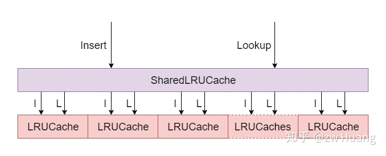
  
LevelDB默认的LRU缓存采用了类似于分段锁的设计方式：

  * 首先实现了一个`LRUCache`类，这个类实现了一个可以指定容量的LRU缓存，当达到容量后，会将旧的数据从缓存移除；
  * 为了实现线程安全，`LRUCache`在做一些操作时，会进行加锁，但是加锁操作会降低并发度，针对这个问题，LevelDB对外提供的实际是一个`ShardedLRUCache`缓存；
  * `ShardedLRUCache`包含一个`LRUCache`缓存数组，大小是16，根据缓存键的Hash值的高4位进行哈希，将缓存项分布到不同的`LRUCache`里，这样当并发操作时，很有可能缓存项不在同一个`LRUCache`里，不会冲突，大大提高了并发度；
  * `ShardedLRUCache`的实现只是简单的将对缓存的操作代理到相应的`LRUCache`里。

以下是`Insert`操作的实现，根据hash值计算出对应的`LRUCache`，然后代理到对应的`LRUCache`。

```cpp   
// util/cache.cc
Handle* ShardedLRUCache::Insert(const Slice& key, void* value, size_t charge,
                    void (*deleter)(const Slice& key, void* value)) override {
    const uint32_t hash = HashSlice(key);  // 计算哈希值
    return shard_[Shard(hash)].Insert(key, hash, value, charge, deleter);
}
```

所以接下来重点讨论`LRUCache`的实现。

### LRUCache实现

```cpp
// util/cache.cc
class LRUCache {
    size_t capacity_;                        // 缓存容量
    mutable port::Mutex mutex_;              // 包含缓存的锁
    size_t usage_ GUARDED_BY(mutex_);        // 当前使用了多少容量
    LRUHandle lru_ GUARDED_BY(mutex_);       // 缓存项链表
    LRUHandle in_use_ GUARDED_BY(mutex_);    // 当前正在被使用的缓存项链表
    HandleTable table_ GUARDED_BY(mutex_);   // 缓存的哈希表，快速查找缓存项
}
```

`LRUCache`的实现有以下特点：

  * 每一个缓存项都保存在一个`LRUHandler`里；
  * 每一个`LRUHandler`首先被保存在一个哈希表`table_`里面，支持根据键快速的查找;
  * `LRUCache`里面有两个双向链表`lru_`和`in_use_`，每一个`LRUHandler`可以在两个链表中的一个里，但是不会同时在两个里，也有可能有些`LRUHandler`被淘汰出缓存了，不在任何链表上；
  * `in_use_`保存当前正在被引用的`LRUHandler`，这个链表主要是为了检查；
  * `lru_`保存没有被使用的`LRUHandler`，按照访问顺序来保存，`lru_.next`保存最旧的，`lru_.prev`保存最新的，需要淘汰缓存时，会从`lru_`里的`next`开始淘汰；
  * 当一个`LRUHandler`被使用时，会从`lru_`移动到`in_use_`，使用完成后，会从`in_use_`重新移动到`lru_`里；
  * 每个`LRUCache`都有一个容量`capacity_`，表示这个缓存的大小，每次插入一个项时都会指定这个缓存项的大小，更新`usage_`字段，当`usage_`超过`capacity_`时，就淘汰最旧的缓存项，直到低于`capacity_`。

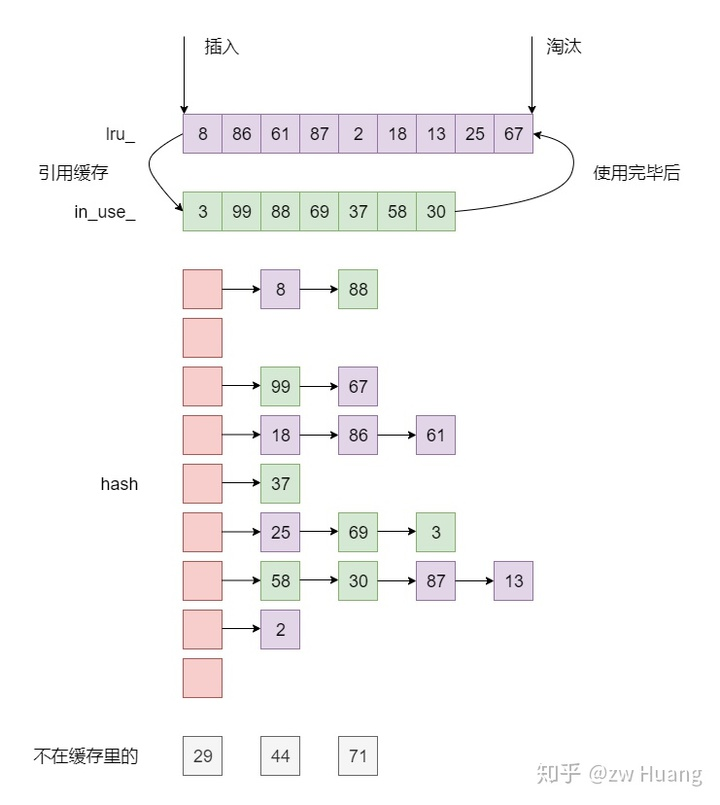
  
以下是`LRUHandler`的定义：

```cpp  
// util/cache.cc
struct LRUHandle {
    void* value;                                 // 值
    void (*deleter)(const Slice&, void* value);  // 数据项被移出缓存时的回调函数
    LRUHandle* next_hash;                        // 哈希表的链接
    LRUHandle* next;                             // 两个双向链表的链接
    LRUHandle* prev;
    size_t charge;                               // 缓存项的大小
    size_t key_length;                           // 键的长度
    bool in_cache;                               // 当前项是否在缓存中
    uint32_t refs;                               // 当前项的引用计数
    uint32_t hash;                               // 哈希值
    char key_data[1];                            // 键值
    Slice key() const {
        return Slice(key_data, key_length);
    }
};
```

LRUCache通过引用计数来管理`LRUHandler`。

```cpp
// util/cache.cc
void LRUCache::Ref(LRUHandle* e) {
    if (e->refs == 1 && e->in_cache) {  // 如果当前在lru_里，移动到in_use_里
        LRU_Remove(e);                  // 先从链表中移除
        LRU_Append(&in_use_, e);        // 插入到in_use_
    }
    e->refs++;
}

void LRUCache::Unref(LRUHandle* e) {
    e->refs--;
    if (e->refs == 0) {  // 销毁缓存项
        (*e->deleter)(e->key(), e->value);
        free(e);
    } else if (e->in_cache && e->refs == 1) {
        // 重新移动到lru_里
        LRU_Remove(e);
        LRU_Append(&lru_, e);
    }
}
```

通过引用计数，LRUCache有以下特点：

  * 当一个`LRUHandler`被加入到缓存里面，并且没有被使用时，计数为1；
  * 如果客户端需要访问一个缓存，就会找到这个`LRUHandler`，调用`Ref`，将计数加1，并且当此时缓存在`lru_`里，就移动到`in_use`里；
  * 当客户端使用完一个缓存时，调用`Unref`里，将计数减1，当计数为0时，调用回调函数销毁缓存，当计数为1时，移动到`in_use`里面；
  * 这样可以自动控制缓存的销毁，当一个`LRUHandler`被移出缓存时，如果还有其他的引用，也不会被销毁。

所以查找一个缓存就非常简单了:

```cpp
// util/cache.cc
Cache::Handle* LRUCache::Lookup(const Slice& key, uint32_t hash) {
    MutexLock l(&mutex_);                    // 加锁操作，使用分段缓存减少锁等待
    LRUHandle* e = table_.Lookup(key, hash);
    if (e != nullptr) {
        Ref(e);
    }
    return reinterpret_cast<Cache::Handle*>(e);
}

void LRUCache::Release(Cache::Handle* handle) {
    MutexLock l(&mutex_);
    Unref(reinterpret_cast<LRUHandle*>(handle));
}
```

  * 通过哈希表查找对应的`LRUHandler`；
  * 如果找到了，调用`Ref`，返回缓存项；
  * 使用完缓存项后，调用`Release`释放缓存。

插入缓存需要将缓存项插入到哈希表以及链表中，并且更新容量，如果缓存容量过多，需要淘汰旧缓存。插入一个缓存项的步骤如下：

  * 生成一个`LRUHandler`保存缓存的内容，计数为1；
  * 再将计数加1，表示当前缓存项被当前客户端引用，插入到`in_use_`链表中；
  * 插入时会指定插入项的大小更新`usage_`字段；
  * 插入到哈希表中；
  * 如果有相同值旧的缓存项，释放旧项；
  * 判断容量是否超标，如果超标，释放最旧的缓存项，直到容量不超标为止。

### 缓存使用

LevelDB里SSTable在内存中是以`Table`结构存在的，要使用一个SSTable，必须先进行`Open`操作，会将Index Block和Filter Data都读取到内存里，保存在`Table`里，但是Data Block依然保存在磁盘上。需要读取数据时，可以将数据放到缓存中，下次再次访问数据时，就可以从缓存里读取。所以缓存有两方面：

  * 每个`Table`结构都要占据一定的内存，被打开的`Table`放在一个缓存中，缓存一定数量的`Table`，当数量太多时，有一些`Table`需要被驱逐出内存，这样当需要再次访问这些`Table`时需要再次被打开；
  * 每个`Table`的Data Block可以被缓存，这样再次访问相同的数据时，不需要读磁盘。

### Table缓存

SSTable的文件名类似于000005.ldb，前缀部分就是一个`file_number`，`Table`就是用这个`file_number`作为键来缓存的。`Table`的缓存存储在`TableCache`类里面。

```cpp
// db/table_cache.cc
Status TableCache::FindTable(uint64_t file_number, uint64_t file_size,
                                Cache::Handle** handle) {
    Status s;
    char buf[sizeof(file_number)];
    EncodeFixed64(buf, file_number);
    Slice key(buf, sizeof(buf));     // key为file_number
    *handle = cache_->Lookup(key);   // cache_是LRUCache的实例
    if (*handle == nullptr) {        // 如果缓存没命中，则打开新的Table
        ...
        s = Table::Open(options_, file, file_size, &table);
        TableAndFile* tf = new TableAndFile;
        tf->file = file;
        tf->table = table;
        // 插入一个缓存项，大小为1
        *handle = cache_->Insert(key, tf, 1, &DeleteEntry);
    }
    return s;
}
```

查询一个`Table`时步骤如下:

  * 先从缓存里面找，键是`file_number`，如果找到了，就可以直接返回`Table`；
  * 如果没有找到，需要`Open`这个SSTable，然后插入到缓存里面；
  * 缓存的`capacity_`大小为支持打开的`Table`的个数，而每一个缓存项大小为1，这样当缓存的`Table`个数大于容量时，就会将最旧的`Table`淘汰。

### Data Block缓存

每个`Table`打开的时候，都会指定一个`cache_id`，这是一个单调递增的整数，每个`Table`都有一个唯一的`cache_id`。在每一个SSTable里面，每一个Data Block都有一个固定的文件偏移`offset`。所以每一个Data Block都可以由`cache_id`和`offset`来唯一标识，也就是根据这两个值生成一个键，来插入和查找缓存。

```cpp
// table/table.cc
// 根据一个Index读取一个Data Block
Iterator* Table::BlockReader(void* arg, const ReadOptions& options,
                                const Slice& index_value) {
    Table* table = reinterpret_cast<Table*>(arg);
    Cache* block_cache = table->rep_->options.block_cache;
    Block* block = nullptr;
    Cache::Handle* cache_handle = nullptr;
    BlockHandle handle;                   // 保存索引项
    Slice input = index_value;
    Status s = handle.DecodeFrom(&input);
    if (s.ok()) {
        BlockContents contents;
        // 使用缓存，则先读缓存
        if (block_cache != nullptr) {
            // 构造缓存键，使用cache_id和offset
            char cache_key_buffer[16];
            EncodeFixed64(cache_key_buffer, table->rep_->cache_id);
            EncodeFixed64(cache_key_buffer + 8, handle.offset());
            Slice key(cache_key_buffer, sizeof(cache_key_buffer));
            // 查找缓存是否存在
            cache_handle = block_cache->Lookup(key);
            // 存在则直接获取到block
            if (cache_handle != nullptr) {
                block = reinterpret_cast<Block*>(block_cache->Value(cache_handle));
            } else {
                // 否则从文件里读取Data Block
                s = ReadBlock(table->rep_->file, options, handle, &contents);
                if (s.ok()) {
                    block = new Block(contents);
                    if (contents.cachable && options.fill_cache) {
                        // 插入缓存
                        cache_handle = block_cache->Insert(key, block, block->size(),
                                                &DeleteCachedBlock);
                    }
                }
            }
        } else {
            // 不使用缓存，直接读取数据
            s = ReadBlock(table->rep_->file, options, handle, &contents);
            if (s.ok()) {
                block = new Block(contents);
            }
        }
    }
    ...
}
```

当要获取一个Data Block时：

  * 从这个Data Block的索引项出发，根据索引得到`offset`，然后根据`Table`得到`cache_id`，这样就得到了缓存键；
  * 在缓存里读取Data Block，如果存在就可以返回；
  * 否则从文件里读取Data Block，这里根据选项`fill_cache`，可以决定是否插入到缓存。

### 参考源码

```  
include/leveldb/cache.h: 定义Cache接口
util/cache.cc: 实现LRU缓存
table/table.cc: 读取Data Block时使用缓存
db/table_cache.cc：实现一个Table结构的缓存
```

### 小结

以上便是LevelDB里面缓存的实现，对于磁盘型的数据库，缓存是非常重要的，如果内存足够大，大到足以容纳所有数据，那么数据库的读效率就像内存数据库一样。除了数据部分，索引和元数据LevelDB一般是缓存在内存里面的，基于SSTable的结构和存储，这些数据都不会改变，只读不写。只有Compaction时，才会变化，但是是生成新文件，而不是写旧数据，所以也不会有缓存更新过期的问题。
