 
<!--BEGIN_DATA
{
    "create_date": "2021-03-09 16:30", 
    "modify_date": "2021-03-09 16:30", 
    "is_top": "0", 
    "summary": "数据库1：台前幕后——数据库层实现概览<br/>数据库2：所见非所得——三种Key<br/>数据库3：循序渐进——操作接口<br/>数据库4：日新月异——版本管理<br/>数据库5：兢兢业业——Compaction<br/>数据库6：复旧如初——Recover", 
    "tags": "数据库", 
    "file_name": "LevelDB源码剖析3.md"
}
END_DATA-->

#### <p>原文出处：<a href='https://zhuanlan.zhihu.com/p/267966016' target='blank'>数据库1：台前幕后——数据库层实现概览</a></p>

## 数据库1：台前幕后——数据库层实现概览

我们人为将LevelDB分为了数据库层和存储引擎层，在前面部分介绍了存储引擎相关的组件，包括：

  * SSTable存储结构实现，提供了在一个磁盘文件里读取一个键的功能，并且可以迭代一个SSTable的所有键；
  * MemTable内存结构的实现，提供了读取一个键和写入一个键的功能，迭代MemTable里所有的键，以及可以将一个MemTable转换为一个SSTable；
  * Log将写入持久化到磁盘上面，将随机写入转换为顺序写入；
  * 迭代器对各种存储组件迭代，以及定位某一个键。

利用这些组件提供的功能，就可以实现数据库层。可以将数据库层的功能分为两个部分：

  * `Get`、`Put`和`Delete`接口实现，这里是LevelDB对外提供的操作接口，分别实现键值对的查找、插入和删除；
  * 版本管理和Compaction，随着数据的写入，不断的有MemTable转换为SSTable，当有些键不断的更新删除，有些Level的文件太多时，影响了读性能，需要进行Compaction，将低Level的SSTable Compaction到高Level的SSTable里去，提高读的效率。而Compaction是通过版本来管理的，当一次Compaction完成时，就会生成一个新版本。

### 接口实现

应用程序使用数据库其实就是操作这些接口，接口是看得见的部分，这些接口的实现反而是比较简单的部分。

先说`Put`操作，这个操作其实是最简单的，就是向MemTable插入一条记录，同时向Log插入一条记录作持久化。而`Put`不但是一个插入操作，也是一个更新操作，当想更新一个Kv时，只需要插入一个相同键的Kv即可，数据库里存在相同键的多个值，通过读取来找到正确的值。

`Delete`操作和`Put`操作很像，当需要删除一个键，只需要写入包含这个键的一条记录，里面有一个标记，标记这个键为删除，当读取的时候读取到这条标识删除的记录时，就可以忽略之前的记录，返回这条记录不存在。

以上两个操作说明LevelDB并不会真的去更新或者删除一条记录，而只会插入记录，通过读取来合并多条记录。这样就不需要去修改一个SSTable，只需要顺序写数据，就减少了磁盘的随机读取和写入。

`Put`和`Delete`数虽然很简单，`Get`的操作就相对复杂了。因为`Put`和`Delete`都是插入一条记录，所以可能同一个键有多条记录存在，但是只有最新的那条记录有效的。如果最新的记录是一条删除记录，说明这个键是不存在的，否则值就是最新记录的值。所以LevelDB在`Get`一个键时会按照从新到旧开始查询：

  * 首先查询MemTable里看键是否存在，因为MemTable里数据是最新的数据；
  * 如果一个MemTable写满了，会生成一个新的MemTable，而这个写满的MemTable的数据会转换为一个SSTable，但是在转换过程中这些数据可能被访问，这时候这个MemTable就会转换成一个Immutable MemTable，这里面的数据是次新的数据，如果Immutable MemTable存在，就要查找里面是否包含需要的Kv；
  * 如果上面两个步骤都都没查找键的话，就要查找SSTable了，SSTable先被写到Level 0，然后再被Compaction到更高的层，所以Level越低，数据越新，就从Level 0开始查找，直到找到对应的键。

### 版本管理和Compaction

这一部分实际上是后台线程干的事情，是看不到的部分。

随着数据的不断写入，不断地将MemTable转换为SSTable，而这些SSTable都在Level 0。而Level 0和其它Level相比，具有特殊性，其它Level里SSTable的数据都是不重叠的，也就是当需要查找一个键时，可以找到唯一的一个SSTable，这个键只有可能在这个SSTable里，而Level 0的SSTable的键是有重叠的，也就是查找一个键时，这个键可能在多个SSTable里，就需要搜索多个SSTable。所以如果Level 0的SSTable太多了，`Get`的效率就会非常低。

对于更新和删除，是写入一条记录，如果对同一个键作多次更新和删除，那么只有最新的数据是有用的，这样就会存在大量冗余数据，浪费磁盘空间，并且降低了读取的效率。

针对以上两个问题，需要Compaction，Compaction就是将低Level的SSTable做归并移到高的Level，并且消除冗余的键值对。

LevelDB是支持快照的，也就是可以在某个时刻访问数据时，做一个快照，然后只能看到那个时刻的数据，而在那个时刻后写入和删除都是看不见的。查找时，就是指定那一时刻的所有SSTable，只查询这些SSTable里的数据。然而随着Compaction的进行，SSTable的分布会发生变化，这时就需要版本管理了。当在访问一个旧的快照时，有一个版本对应这个快照，当Compaction进行时，生成新的版本，但是旧的版本还需要保留着，这样旧快照就可以访问旧的版本。每一个快照就对应自己的版本，当一个版本不被任何快照引用时，这个版本就可以被删除了。

LevelDB是一个函数库，自己是无法自动起后台线程的，这些后台线程是要依赖于调用方进程的。LevelDB的方式就是在调用方调用`Get`、`Put`和`Delete`时，会检测一些条件是否符合，是否需要Compaction，如果需要的话，就会启动后台线程开始Compaction，这个后台线程是属于数据库使用方的线程。

### 小结

LevelDB的数据库层分为看得见的接口实现，以及看不见的后台Compaction，接下来会详细介绍这两部分的内容。

<hr>

#### <p>原文出处：<a href='https://zhuanlan.zhihu.com/p/272468157' target='blank'>数据库2：所见非所得——三种Key</a></p>

## 数据库2：所见非所得——三种Key

### 三种Key

首先来介绍一些基础知识，LevelDB里面用到了三种键，分别是User Key，Internal Key和Lookup Key，这三种Key是包含的关系。


### User Key

第一种是User Key，这种是最简单的情况，也就是读写键值对时提供的键，只是一个简单的字符串，一般用Slice来表示。

比如调用db->Put(key, value)插入一个Kv，这个键就是一个User Key。说简单点，应用程序和数据库之间的交互都是使用User Key来进行。

### Internal Key

第二种是Internal Key，是SSTable里实际存储的键值，也就是这个持久化有序的Map的键，定义如下：

```cpp
typedef uint64_t SequenceNumber;
static const SequenceNumber kMaxSequenceNumber = ((0x1ull << 56) - 1);

enum ValueType { kTypeDeletion = 0x0, kTypeValue = 0x1 };

struct ParsedInternalKey {
    Slice user_key;
    SequenceNumber sequence;
    ValueType type;
}
```

可以看到Internal Key在User Key的后面增加了一个64位的整数，并且将这个整数分为两部分，低位的一个字节是一个`ValueType`，高位的7个字节是一个`SequenceNumber`。

`ValueType`是为了区分一个键是插入还是删除，删除其实也是一条数据的插入，但是是一条特殊的插入，通过在User Key后面附上`kTypeDeletion`来说明要删除这个键，而`kTypeValue`说明是插入这个键。

`SequenceNumber`是一个版本号，是全局的，每次有一个键写入时，都会加一，每一个Internal Key里面都包含了不同的`SequenceNumber`。`SequenceNumber`是单调递增的，`SequenceNumber`越大，表示这键越新，如果User Key相同，就会覆盖旧的键。所以就算User Key相同，对应的Internal Key也是不同的，Internal Key是全局唯一的。当我们更新一个User Key多次时，数据库里面可能保存了多个User Key，但是它们所在的Internal Key是不同的，并且`SequenceNumber`可以决定写入的顺序。

当用户写入时，将User Key封装成Internal Key，保留版本信息，存储到SSTable里，当需要读取时，将User Key从Internal Key里提取出来，所有User Key相同的Internal Key里面`SequenceNumber`最大的Internal Key就是当前的键，它对应的值就是当前值。

另外Internal Key的比较方式和User Key是不一样的，`Options`提供的是User Key的比较方式，而LevelDB内部会生成一个根据这个User Key的比较方式得到的Internal Key的比较方式。

```cpp
int InternalKeyComparator::Compare(const Slice& akey, const Slice& bkey) const {
    // Order by:
    //    user key
    //    sequence number 倒序
    //    type 倒序，实际不需要，因为sequence number唯一的
    int r = user_comparator_->Compare(ExtractUserKey(akey), ExtractUserKey(bkey));
    if (r == 0) {
        const uint64_t anum = DecodeFixed64(akey.data() + akey.size() - 8);
        const uint64_t bnum = DecodeFixed64(bkey.data() + bkey.size() - 8);
        if (anum > bnum) {
            r = -1;
        } else if (anum < bnum) {
            r = +1;
        }
    }
    return r;
}
```

可以看到比较方式被改造了，当Internal Key里面包含的User Key不同时，直接用User Key的比较方式即可。否则，根据`SequenceNumber`比较，按`SequenceNumber`倒序排序。这样的好处就是，在全局有序的Map里，根据User Key排序，User Key相同的会排在一起，`SequenceNumber`大的Internal Key排在前面。当Seek一个User Key时，会定位到第一个符合条件的Internal Key，也就是具有最大的`SequenceNumber`的Internal Key。

除了比较器，布隆过滤器也会被改造，以适应User Key到Internal Key的转换。

Internal Key里的`SequenceNumber`主要是为了支持Snapshot的功能。当生成一个DB Iterator或者给一个Option显示设置一个Snapshot，只会读取那个时刻的数据。实现方式就是当读取的时候，如果Snapshot对应的`SequenceNumber`小于Internal Key的`SequenceNumber`，那么这个键就是不可见的，找到可见的`SequenceNumber`最大的Internal Key就是需要读取的键的值。

### Lookup Key

Lookup Key其实就是简单的在Internal Key前面加上键的长度，使用`varint32`编码，主要用在MemTable的查找上。为什么需要Lookup Key呢？


这主要还是要从MemTable的存储说起。MemTable的底层是一个Skiplist，而LevelDB的Skiplist只存储了一个键，而没有值。而LevelDB在存储Kv时，是将键和值编码在一起存储的，使用的就是字符串的长度前缀编码。所以在MemTable里查找Key时，提供的LookupKey就是编码值的一个前缀，刚好可以定位MemTable里相应的键。

### 参考源码

```    
db/dbformat.h db/dbformat.cc: 定义了Internal Key、Lookup Key、InternalKeyComparator和InternalFilterPolicy
```

### 小结

以上就是LevelDB的三种键，是包含的关系：

  * User Key是用户提供的键，是我们看到的键；
  * Internal Key是实际存储的键，支持版本号和Tag的功能；
  * Lookup Key则是为了查找MemTable而构造的键。

<hr>

#### <p>原文出处：<a href='https://zhuanlan.zhihu.com/p/275699183' target='blank'>数据库3：循序渐进——操作接口</a></p>

## 数据库3：循序渐进——操作接口

这一节将介绍数据库操作3个接口的实现，分别是Get、Put和Delete。介绍接口实现时，主要介绍数据的写入和读取，而先忽略这些操作可能触发的后台操作。

### Put和Delete

Put和Delete的实现惊人的相似：

```cpp
// db/db_impl.cc

Status DB::Put(const WriteOptions& opt, const Slice& key, const Slice& value) {
  WriteBatch batch;
  batch.Put(key, value);
  return Write(opt, &batch);
}

Status DB::Delete(const WriteOptions& opt, const Slice& key) {
  WriteBatch batch;
  batch.Delete(key);
  return Write(opt, &batch);
}
```

这两个操作都先生成一个`WriteBatch`，然后调用`Write`将内容写入到数据库，只是`WriteBatch`的内容不同，`WriteBatch`是一个内存结构，保存了写入的内容。

### WriteBatch

`WriteBatch`只是一个辅助结构，可以将多个Kv的写入按顺序累积起来，然后一次性写入提高效率。

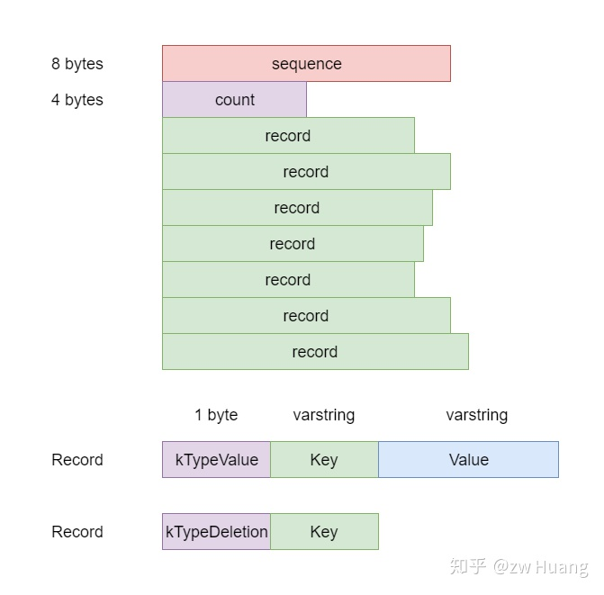

`WriteBatch`主要由三部分组成：

  * `sequence`是整个`WriteBatch`写入时当前的`SequenceNumber`，按顺序逐个赋予`record`，比如第一个`record`的`SequenceNumber`是`sequence`，第二个是`sequence + 1`，以此类推；
  * `count`是`record`的数量；
  * 最后就是一个`record`数组，`record`数组有两种类型；
  * 一种是代表写入的Kv，用1 byte的`kTypeValue`开头，后面跟上两个`varstring`分别表示键和值；
  * 一种代表删除操作，只需要指定键，用1 byte的`kTypeDeletion`后跟一个`varstring`。

调用`WriteBatch`的`Delete`和`Put`时，会更新`count`的值，并且追加一条`record`，`sequence`并不先设置，而是开始写入前才设置成为当前的`SequenceNumber`。

`WriteBatch`在内存里面的表示，类似于以下的结构：

```cpp
struct WriteBatch {
    uint64 sequence;
    uint32 count;
    Record record[count];
};
```

简单来说，`WriteBatch`保存了需要写入的内容。

### Write

`Write`就是真实写入的函数了，将一个`WriteBatch`的内容写入到数据库，LevelDB的写入分为两步：

  * 写入数据到日志；
  * 写入数据到MemTable。

写入过程中，如果MemTable太大会触发MemTable写入到SSTable，不过这个后面再介绍，首先只专注于以上两个步骤。

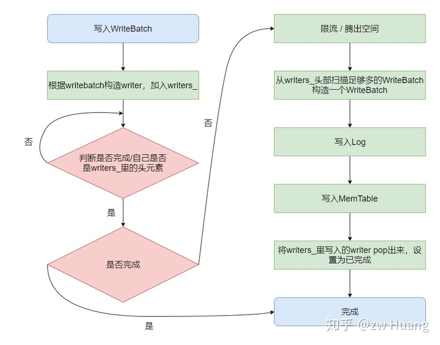

为了实现线程安全，每个线程在写入时，都需要获取锁，但是这样会阻塞其它的线程，降低并发度。针对这个问题LevelDB做了一个优化，写入时当获取锁后，会将`WriteBatch`放入到一个`std::deque<Writer*> DBImpl::writers_`里，然后会检查`writers_`里的第一个元素是不是自己，如果不是的话，就会释放锁。当一个线程检查到`writers_`头元素是自己时，会再次获取锁，然后将`writers_`里的数据尽可能多的写入。一次写入会涉及到写日志，占时间比较长，一个线程的数据可能被其它线程批量写入进去了，减少了等待。

总结来说，一个线程的写入有两种情况：一种是恰好自己是头结点，自己写入，另外一种是别的线程帮助自己写入了，自己会检查到写入，然后就可以返回了。

大概的代码流程如下（根据需要删除不重要的代码）：

```cpp
// db/db_impl.cc
// 用来封装一个WriteBatch，用来标识状态
struct DBImpl::Writer {
    explicit Writer(port::Mutex* mu): batch(nullptr), sync(false), done(false), cv(mu) {}
    Status status;        // 写入的状态
    WriteBatch* batch;    // 对应的WriteBatch
    bool sync;            // 写日志时，是否需要sync
    bool done;            // 写入是否要完成
    port::CondVar cv;     // 用来等待其它线程的通知
};

Status DBImpl::Write(const WriteOptions& options, WriteBatch* updates) {
    // step1：构造一个writer，插入到wrtiers_里，注意插入前需要先获取锁
    Writer w(&mutex_);
    w.batch = updates;
    w.sync = options.sync;
    w.done = false;
    MutexLock l(&mutex_);
    writers_.push_back(&w);

    // step2: 检查done判断是否完成，或者自己是否是writers_队列里的第一个成员。有可能其它线程写入时把自己的内容也写入了，
    // 这样自己就是done，或者当自己是头元素了，表示轮到自己写入了
    while (!w.done && &w != writers_.front()) {
        w.cv.Wait();
    }

    // step3: 判断写入是否完成了，完成了就可以返回了
    if (w.done) {
        return w.status;
    }

    // step4：如果写入太快，进行限流，如果MemTable满了，生成新的MemTable
    Status status = MakeRoomForWrite(updates == nullptr);
    if (status.ok() && updates != nullptr) {
        // step5：从writers_头部扫描足够多的WriteBatch构造一个WriteBatch updates，last_writer保存了最后一个写入的writer
        // 设定新的WriteBatch的SequenceNumber
        WriteBatch* updates = BuildBatchGroup(&last_writer);
        WriteBatchInternal::SetSequence(updates, last_sequence + 1);
        last_sequence += WriteBatchInternal::Count(updates);
        // 注意这一步解锁，很关键，因为接下来的写入可能是一个费时的过程，解锁后，其它线程可以Get，其它线程也可以继续将writer
        // 插入到writers_里面，但是插入后，因为不是头元素，会等待，所以不会冲突
        mutex_.Unlock();
        // step6: 写入log，根据选项sync
        status = log_->AddRecord(WriteBatchInternal::Contents(updates));
        if (status.ok() && options.sync) {
            status = logfile_->Sync();
        }
        // step7: 写入到MemTable里
        if (status.ok()) {
            status = WriteBatchInternal::InsertInto(updates, mem_);
        }
        // 加锁需要修改全局的SequenceNumber以及writers_
        mutex_.Lock();
        // 更新全局的SequenceNumber
        versions_->SetLastSequence(last_sequence);
    }

    // step8: 从writers_队列从头开始，将写入完成的writer标识成done，并且弹出，通知这些writer
    // 这样这些writer的线程会被唤醒，发现自己的写入已经完成了，就会返回
    while (true) {
        Writer* ready = writers_.front();
        writers_.pop_front();
        if (ready != &w) {
            ready->status = status;
            ready->done = true;
            ready->cv.Signal();
        }
        if (ready == last_writer) break;
    }
    // 如果writers_里还有元素，就通知头元素，让它可以进来开始写入
    if (!writers_.empty()) {
        writers_.front()->cv.Signal();
    }
    return status;
}
```

`MakeRoomForWrite`主要是限流和触发后台线程等工作：

  * 首先判断Level 0的文件是否>=8，是的话就sleep 1ms，这里是限流的作用，Level 0的文件太多，说明写入太快，Compaction跟不上写入的速度，而在读取的时候Level 0的文件之间可能有重叠，所以太多的话，影响读取的效率，这算是比较轻微的限流，最多sleep一次；
  * 接下来判断MemTable里是否有空间，有空间的话就可以返回了，写入就可以继续；
  * 如果MemTable没有空间，判断Immutable MemTable是否存在，存在的话，说明上一次写满的MemTable还没有完成写入到SSTable中，说明写入太快了，需要等待Immutable MemTable写入完成；
  * 再判断Level 0的文件数是否>=12，如果太大，说明写入太快了，需要等待Compaction的完成；
  * 到这一步说明可以写入，但是MemTable已经写满了，需要将MemTable变成Immutable MemTable，生成一个新的MemTable，触发后台线程写入到SSTable中。

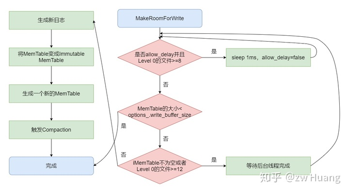

代码比较简单，就省略了。

接下来是`BuildBatchGroup`，这个函数是批量写入的关键，它会从`writers_`头部开始扫描，将尽可能多的`writer`生成一个新的`WriterBatch`，将这些`writer`的内容批量写入。步骤如下：

  * 首先计算出一个`max_size`，表示构造的`WriterBatch`的最大尺寸；
  * 然后开始扫描`writers_`数组，直到满足`WriterBatch`超过`max_size`，或者；
  * 第一个`writer`的`sync`决定了这整个`write`是不是`sync`的，如果第一个writer不是`sync`的，碰到一个sync的writer，表面这个writer无法加入到这个批量写入中，所以扫描就结束了。

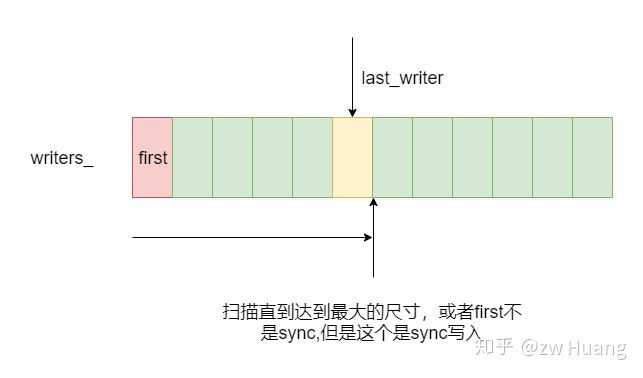
    
```cpp
// db/db_impl.cc
WriteBatch* DBImpl::BuildBatchGroup(Writer** last_writer) {
    Writer* first = writers_.front();
    WriteBatch* result = first->batch;
    // 计算writebatch的最大size，如果第一个的size比较小的话，限制最大的size，以防小的写入太慢
    size_t size = WriteBatchInternal::ByteSize(first->batch);
    size_t max_size = 1 << 20;
    if (size <= (128 << 10)) {
        max_size = size + (128 << 10);
    }
    *last_writer = first;
    std::deque<Writer*>::iterator iter = writers_.begin();
    ++iter;
    for (; iter != writers_.end(); ++iter) {
        Writer* w = *iter;
        // 如果这是一个sync的写入，但是第一个元素不是sync的话，那么就结束了，因为整体的写入都不是sync的
        if (w->sync && !first->sync) {
            break;
        }
        if (w->batch != nullptr) {
            size += WriteBatchInternal::ByteSize(w->batch);
            // 如果太大，就结束
            if (size > max_size) {
                break;
            }
            // 追加到result
            if (result == first->batch) {
                result = tmp_batch_;
                WriteBatchInternal::Append(result, first->batch);
            }
            WriteBatchInternal::Append(result, w->batch);
        }
        // 更新最后一个writer
        *last_writer = w;
    }
    return result;
}
```

### Get

了解写入后，再来说读取，LSM Tree里面，读取往往比写入更复杂，写入往往只涉及一次磁盘IO，但是读取可能涉及多次磁盘IO。

LevelDB的数据可能存在三个地方:

  * 最新的写入在MemTable里；
  * 如果上一次MemTable写满后，转换为Immutable MemTable，如果还没有完成写入到SSTable里，那么就有可能存在于Immutable MemTable里；
  * 存在于SSTable里，SSTable里的数据从Level 0开始从新变旧，Level越低，数据越新。Level 0里的SSTable比较特殊，因为是MemTable转换过来的，虽然每个SSTable都是有序的，但是每个SSTable的键的范围可能有重叠，也就是一个键可能存在于多个SSTable里，文件名下标越大的SSTable里的键越新。而非level 0的SSTable，都是后台生成的，保证了SSTable之间的数据无重叠，一个键只有可能存在于一个SSTable里。

所以读取一个键时：

  * 先读取MemTable，存在就读到数据了；
  * 不存在的话，看看Immutable MemTable是否存在，存在的话，读取数据；
  * 否则，从SSTable的Level 0开始读取，如果Level 0还没有找到话，读Level 1，以此类推，直到读到最高层。

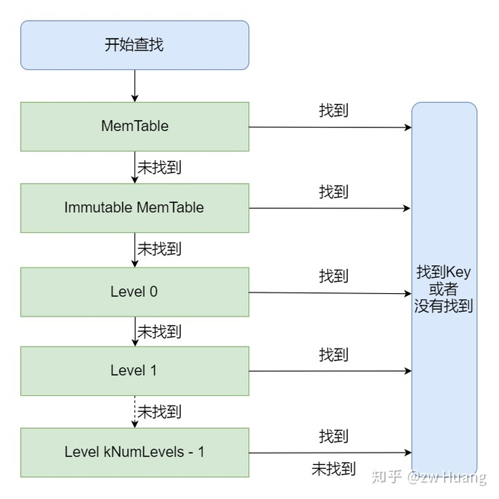
    
```cpp
// db/db_impl.cc
Status DBImpl::Get(const ReadOptions& options, const Slice& key, std::string* value) {
    Status s;
    // 加锁，读取元数据，Ref操作
    MutexLock l(&mutex_);
    // 设定snapshot，其实就是一个SequenceNumber，这是实现Snapshot的关键，设置成选项中的snapshot，或者
    // 当前最近的SequenceNumber
    SequenceNumber snapshot;
    if (options.snapshot != nullptr) {
        snapshot = static_cast<const SnapshotImpl*>(options.snapshot)->sequence_number();
    } else {
        snapshot = versions_->LastSequence();
    }
    // mem是MemTable，imm是Immutable MemTable，
    // SSTable则由当前的version代表，一个version包含了当前版本的SSTable的集合
    MemTable* mem = mem_;
    MemTable* imm = imm_;
    Version* current = versions_->current();
    // 这里都调用了Ref，LevelDB里大量使用了这种引用计数的方式管理对象，这里表示读取需要引用这些对象，假设在读取过程
    // 中其他线程发生了MemTable写满了，或者Immutable MemTable写入完成了需要删除了，或者做了一次Compaction，生
    // 成了新的Version，所引用的SSTable不再有效了，这些都需要对这些对象做一些改变，比如删除等，但是当前线程还引用着
    // 这些对象，所以这些对象还不能被删除。采用引用计数，其它线程删除对象时只是简单的Unref，因为当前线程还引用着这些
    // 对象，所以计数>=1，这些对象不会被删除，而当读取结束，调用Unref时，如果对象的计数是0，那么对象会被删除。
    mem->Ref();
    if (imm != nullptr) imm->Ref();
    current->Ref();
    {
        // 实际读取时解锁
        mutex_.Unlock();
        // 构造一个Lookup Key搜索MemTable
        LookupKey lkey(key, snapshot);
        // 搜索MemTable
        if (mem->Get(lkey, value, &s)) {
        // 搜索Immutable
        } else if (imm != nullptr && imm->Get(lkey, value, &s)) {
        // 搜索SSTable
        } else {
            s = current->Get(options, lkey, value, &stats);
        }
        mutex_.Lock();
    }
    // Unref释放
    mem->Unref();
    if (imm != nullptr) imm->Unref();
    current->Unref();
    return s;
}
```

### 读取MemTable

首先来看`mem`和`imm`的读取，这其实就是读取Skiplist，具体读取Skiplist的过程不介绍了。

```cpp    
// db/memtable.cc
bool MemTable::Get(const LookupKey& key, std::string* value, Status* s) {
    // Lookup Key的内容，搜索的Key
    Slice memkey = key.memtable_key();
    // 构建迭代器搜索
    Table::Iterator iter(&table_);
    iter.Seek(memkey.data());
    if (iter.Valid()) {
        const char* entry = iter.key();
        uint32_t key_length;
        const char* key_ptr = GetVarint32Ptr(entry, entry + 5, &key_length);
        // 看查找到的键里面包含的User Key是否和搜索的User Key相同
        // 这里需要这个判断是因为迭代器Seek时，指向大于等于搜索键的位置，所以有可能这个键是大于搜索的键的
        // 这边不需要判断SequenceNumber，便可实现snapshot功能，原因是搜索的键里面是包含SequenceNumber
        // 的，并且User Key相同时，SequenceNumber大的排在前面。所以Seek时跳过了User Key相同，但是SequenceNumber
        // 大于当前搜索的键的SequenceNumber的键，所以找到的就是那个snapshot之前的状态。
        if (comparator_.comparator.user_comparator()->Compare(Slice(key_ptr, key_length - 8),  key.user_key()) == 0) {
            // User Key匹配
            const uint64_t tag = DecodeFixed64(key_ptr + key_length - 8);
            switch (static_cast<ValueType>(tag & 0xff)) {
                // 如果tag是一个插入，那么解析值，返回
                case kTypeValue: {
                    Slice v = GetLengthPrefixedSlice(key_ptr + key_length);
                    value->assign(v.data(), v.size());
                    return true;
                }
                // 如果tag是一个删除，表示键找不到返回
                case kTypeDeletion:
                    *s = Status::NotFound(Slice());
                    return true;
            }
        }
    }
    return false;
}
```

### 读取SSTable

再来看SSTable的读取，`version`保存了SSTable，是一个分层的SSTable的集合，这其实就是LevelDB名字的由来。

`version`里SSTable的集合有以下特点：

  * 数据从Level 0开始由新变旧，所以最新的数据在最低层，也就是如果一个键有多个值的话，新的肯定在低层，旧的在高层；
  * 因为 Level 0里的SSTable是MemTable 写入的，Level 0里的每个SSTable的键之间可能有重叠，所以一个键可能存在于多个SSTable里；
  * 而其它Level，SSTable都是Compaction产生的，键没有重叠，一个键只有可能存在于一个SSTable里；
  * 对于Level 0的SSTable，文件编号越大的，里面的键越新。

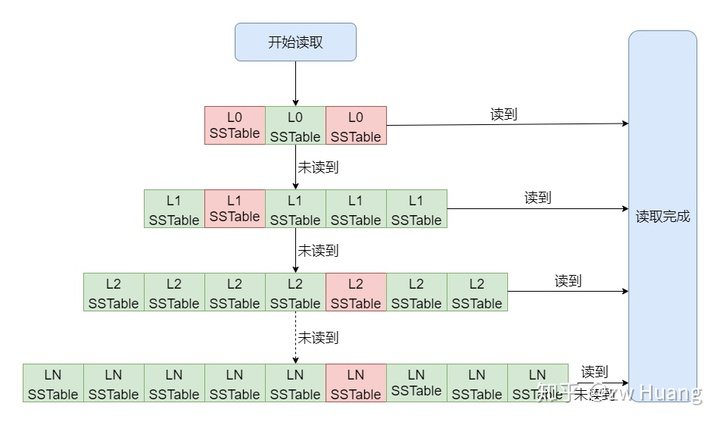

如图，红色是需要读取的SSTable，当读取时，Level 0可能有多个SSTable需要读取，而其它Level最多只有一个SSTable需要读取。

一个SSTable在内存里使用`FileMetaData`来表示：

```cpp
// db/version_edit.h
struct FileMetaData {
    FileMetaData() : refs(0), allowed_seeks(1 << 30), file_size(0) {}
    int refs;
    int allowed_seeks;     // 判断什么时候可以Compaction
    uint64_t number;       // 文件编号
    uint64_t file_size;    // 文件大小bytes
    InternalKey smallest;  // 这个SSTable里最小的Internal Key
    InternalKey largest;   // 这个SSTable里最大的Internal Key
};

std::vector<FileMetaData*> Version::files_[config::kNumLevels];
```

可以看到每个`FileMetaData`都有一个键的范围，所以在读取时可以快速判断键是否可能在这个SSTable里，这样就可以选出相应的键。

而一个`Version`里的SSTable保存在一个`vector`数组里，每一个Level对应一个`vector`，每个`vector`保存了`FileMetaData`，对于非Level 0，这些`FileMetaData`是有序的，也就是第n个SSTable的最大键小于第n + 1个SSTable的最小键，所以可以通过二分搜索找到某个键位于哪个SSTable。

接下来来看看在SSTable集合里是如何查询的：

```cpp
// db/version_set.cc
Status Version::Get(const ReadOptions& options, const LookupKey& k, std::string* value, GetStats* stats) {
    Slice ikey = k.internal_key();
    Slice user_key = k.user_key();
    const Comparator* ucmp = vset_->icmp_.user_comparator();
    Status s;
    // 这边从Level 0开始，因为当在低Level发现了一个键后，可以忽略高Level的键
    std::vector<FileMetaData*> tmp;
    FileMetaData* tmp2;
    for (int level = 0; level < config::kNumLevels; level++) {
        size_t num_files = files_[level].size();
        if (num_files == 0) continue;
        // 开始搜索当前的level
        FileMetaData* const* files = &files_[level][0];
        // 对于Level 0，需要做特殊处理，因为每个文件都有可能包含键，所以需要逐个检查
        if (level == 0) {
            // 这里将符合键在smallest和largest之间的FileMetaData都加入tmp
            tmp.reserve(num_files);
            for (uint32_t i = 0; i < num_files; i++) {
                FileMetaData* f = files[i];
                if (ucmp->Compare(user_key, f->smallest.user_key()) >= 0 && ucmp->Compare(user_key, f->largest.user_key()) <= 0) {
                    tmp.push_back(f);
                }
            }
            if (tmp.empty()) continue;
            // 排序，让最新的文件排在前面，因为后写入的键在更新的文件里，一个个文件搜索时，可以先处理新文件
            std::sort(tmp.begin(), tmp.end(), NewestFirst);
            files = &tmp[0];
            num_files = tmp.size();
        } else {
            // 对于其它的level，只需要通过二分搜索找到相应的文件。
            uint32_t index = FindFile(vset_->icmp_, files_[level], ikey);
            // 未找到
            if (index >= num_files) {
                files = nullptr;
                num_files = 0;
            } else {
                tmp2 = files[index];
                if (ucmp->Compare(user_key, tmp2->smallest.user_key()) < 0) {
                    // 这个文件里最小键大于user_key
                    files = nullptr;
                    num_files = 0;
                } else {
                    files = &tmp2;
                    num_files = 1;
                }
            }
        }
        // 经过以上步骤，files开始的num_files个文件就是需要搜索的SSTable，非Level 0层num_files=1
        // 开始逐个搜索SSTable
        for (uint32_t i = 0; i < num_files; ++i) {
            FileMetaData* f = files[i];
            Saver saver;
            saver.state = kNotFound;
            saver.ucmp = ucmp;
            saver.user_key = user_key;
            saver.value = value;
            // 通过table_cache_查询键
            s = vset_->table_cache_->Get(options, f->number, f->file_size, ikey,
                                    &saver, SaveValue);
            // 检查状态
            switch (saver.state) {
                case kNotFound:
                    break;  // 没有找到键的话，继续搜索下一个
                case kFound:
                    return s;  // 找到的话，就可以返回了
                case kDeleted:
                    s = Status::NotFound(Slice());  // 表示键被删除了，也就是可以确定这个键不存在，返回
                    return s;
                case kCorrupt:
                    s = Status::Corruption("corrupted key for ", user_key);  // 错误也返回
                    return s;
            }
        }
    }
    return Status::NotFound(Slice());  // 搜索完所有的键都没找到就返回。
}
```

最后再看看如何从一个SSTable里搜索一个键：

```cpp    
// db/table_cache.cc
Status TableCache::Get(const ReadOptions& options, uint64_t file_number,
                        uint64_t file_size, const Slice& k, void* arg,
                        void (*handle_result)(void*, const Slice&,
                                                const Slice&)) {
    Cache::Handle* handle = nullptr;
    // 从表缓存里找到相应的file_number对应的文件
    Status s = FindTable(file_number, file_size, &handle);
    if (s.ok()) {
        Table* t = reinterpret_cast<TableAndFile*>(cache_->Value(handle))->table;
        // 实际的查询
        s = t->InternalGet(options, k, arg, handle_result);
    }
    return s;
}
```

`TableCache::Get`比较简单，只是从缓存里找到对应的表结构，然后从这个表结构里查询键。

而对于`Table::InternalGet`，基于前面介绍的SSTable的内存结构是比较好理解的：

  * 先搜索索引块，找到对应的索引，根据索引找到对应的Data Block；
  * 查找Data Block。
    
```cpp 
// table/table.cc
Status Table::InternalGet(const ReadOptions& options, const Slice& k, void* arg,
                            void (*handle_result)(void*, const Slice&,
                                                const Slice&)) {
    Status s;
    // 搜索索引
    Iterator* iiter = rep_->index_block->NewIterator(rep_->options.comparator);
    iiter->Seek(k);
    // 找到一个索引项
    if (iiter->Valid()) {
        Slice handle_value = iiter->value();
        FilterBlockReader* filter = rep_->filter;
        BlockHandle handle;
        // 如果使用了布隆过滤器，则先查找布隆过滤器，如果没有发现，就直接返回了
        if (filter != nullptr && handle.DecodeFrom(&handle_value).ok() && !filter->KeyMayMatch(handle.offset(), k)) {
            // Not found
        } else {
            // 读取一个Data Block
            Iterator* block_iter = BlockReader(this, options, iiter->value());
            block_iter->Seek(k);
            if (block_iter->Valid()) {
                // 找到对应的键，调用回调函数
                (*handle_result)(arg, block_iter->key(), block_iter->value());
            }
            s = block_iter->status();
            delete block_iter;
        }
    }
    if (s.ok()) {
        s = iiter->status();
    }
    delete iiter;
    return s;
}
```

因为SSTable里保存的是Internal Key，但是搜索的是User Key，而Iterator Seek的是第一个大于等于待搜索的键的数据项，如果某个User Key不存在，是会定位到下一个User Key上面的，所以找到Internal Key后，还需要比较里的User Key是否相同，这就是回调函数的作用了。

```cpp
// db/version_set.cc
static void SaveValue(void* arg, const Slice& ikey, const Slice& v) {
    Saver* s = reinterpret_cast<Saver*>(arg);
    ParsedInternalKey parsed_key;
    if (!ParseInternalKey(ikey, &parsed_key)) {
        // 如果无法解析键，表示数据损坏
        s->state = kCorrupt;
    } else {
        // 比较对应的User Key是否相同
        if (s->ucmp->Compare(parsed_key.user_key, s->user_key) == 0) {
            s->state = (parsed_key.type == kTypeValue) ? kFound : kDeleted;
            if (s->state == kFound) {
                s->value->assign(v.data(), v.size());
            }
        }
    }
}
```

### 参考源码

```    
include/leveldb/db.h db/db_iter.h db/db_iter.cc: 实现了GET/PUT/DELETE
db/version_set.h db/version_set.cc: 实现从一个version的SSTable里读取一个键
db/memtable.h db/memtable.cc: 实现从MemTable读取一个键
inlclude/leveldb/table.h db/table_cache.h db/table_cache.cc db/table.cc: 定义从一个SSTable读取一个键
```

### 小结

以上就是LevelDB三个操作接口的实现，事实上是两个，可以看到，还是比较简单的。

对于写入，如果不用`sync`的方式写入，其实基本就是写内存，而对于`sync`的方式，每次`write`都需要做一次磁盘IO，但是磁盘IO是写文件，是顺序IO，所以也是相当快的。而且在写入时，后面来的写请求，都会堆积起来，在后一个写入中批量写入，这样的一次磁盘IO其实是被平摊了。这就是为什么LSM Tree写入快的原因了。

对于读取，如果键刚好在MemTable里，那么就是内存访问会非常快。否则就和需要读取的SSTable数量有关。前面说过SSTable里索引等数据是读入内存的，所以每次读取SSTable时，最多只需要一次磁盘IO，读取一个Data Block。一般Level 0的文件最多为4个，而Level最高为7层，这样就需要10次IO。对于一个不存在的键或者一个很早就写入的键，但是键在多个SSTable的范围内，往往需要花费最大的磁盘IO。然而这是最坏的情景，实际上有优化来减少了磁盘IO：

  * Data Block的缓存，如果在缓存里发现了要读取的Data Block，那么不需要磁盘IO；
  * 布隆过滤器，对于不存在的键有很好的优化，默认情况下99%的正确率，可以宣告一个键不在这个SSTable里，那么也无需缓存，典型的空间换时间。

所以很多读只需要一次磁盘IO，或者不需要磁盘IO。

<hr>

#### <p>原文出处：<a href='https://zhuanlan.zhihu.com/p/299015729' target='blank'>数据库4：日新月异——版本管理</a></p>

## 数据库4：日新月异——版本管理

在说版本管理实现前，有两个问题得先问问自己：

  * 什么是版本？
  * 为什么需要版本管理？

版本其实就是LevelDB数据库的元数据，之前提到过，在MemTable读取不到键时，需要去SSTable读取。SSTable的文件有哪些，每一个文件分别在哪一个Level上面，每个文件里面包含的键的最小值最大值是什么。需要知道这些信息，才可以快速的从SSTable里读取出相应的键的值。而版本就保存了这些信息，让我们通过版本读取SSTable。

那么为什么要版本管理呢？ 在数据不断写入后，MemTable写满了，这时候就会转换为Level 0的一个SSTable，或者Level n的一个文件和Level n + 1的多个文件进行Compaction，会转换成Level n + 1的多个文件。这会使SSTable文件数量改变，文件内容改变，也就是版本信息改变了，所以需要管理版本。

那么有一个版本就够了吗？在文件数量和内容改变时，修改当前的版本就行了。但是并不是，假设使用了整个数据库的迭代器，LevelDB在迭代数据库时，是提供了一个一致性的视图，也就是只能看到迭代前的写入，而迭代后的写入是看不到，在实现的时候，迭代器会引用这个版本，以及里面的SSTable，直到迭代结束。如果在迭代过程中，有文件删除了，那么就无法引用到这个文件了，就会出错。所以需要多个版本，有一个版本是当前版本，当新生成版本后，旧的版本如果有被其它线程引用，也需要保留，直到不被引用后，才会被删除，所以一个时刻可能有多个版本存在。

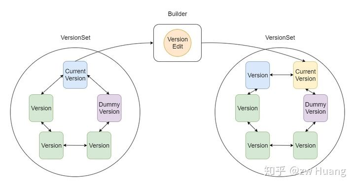

先看看LevelDB的版本管理架构图，可以看到主要用到了4个类:

  * `Version`标识了一个版本，主要信息是这个版本包含的SSTable信息；
  * `VersionSet`是一个版本集，里面保存了`Version`的一个双链表，其中有一个`Version`是当前版本，因为只有一个实例，还保存了其它的一些全局的元数据，Dummy Version是链表头；
  * `VersionEdit`保存了要对`Version`做的修改，在一个`Version`上应用一个`VersionEdit`，可以生成一个新的`Version`；
  * `Builder`是一个帮助类，帮助`Version`上应用`VersionEdit`，生成新版本。

版本管理的基本工作流程如下：

  * `VersionSet`里保存着当前版本，以及被引用的历史版本；
  * 当有Compaction发生时，会将更改的内容写入到一个`VersionEdit`中；
  * 利用`Builder`将`VersionEdit`应用到当前版本上面生成一个新的版本；
  * 将新版本链接到`VersionSet`的双链表上面；
  * 将新的版本设置为当前版本；
  * 将旧的当前版本`Unref`，就是引用计数减1。

版本控制中使用了引用计数来管理历史版本：

  * 假设一个没有被访问的数据库，这时候只有一个版本，也就是当前版本v1，它的引用计数是1；
  * 假设有一个迭代器开始访问数据库，这时候它会对当前版本v1 `Ref`，引用计数变成了2；
  * 其它线程不断写入，导致了Compaction的生成，这时候生成了一个新的版本v2成为了当前版本，引用计数为1，然后对v1 `Unref`，这时候v1的引用计数为1；
  * 因为v1的引用计数为1，所以不会被删除，迭代器线程还可以继续访问v1；
  * 迭代器结束后，对v1进行`Unref`，这时候v1的引用计数变为0，就会从链表上删除了，这时候又只剩下v2版本了；
  * 版本里面的SSTable也是采用引用计数来管理的，每个版本引用一个SSTable会`Ref`，删除版本时会`Unref`，如果一个SSTable的计数为0，那么这个SSTable就可以被删除了。

接下来讨论版本控制，以及这几个类的实现。

### Version

`Version`标识了一个版本，读取数据库时都需要使用`Version`里面的版本信息，主要保存的是SSTable的文件信息：

```cpp
// db/version_edit.h
struct FileMetaData {
    FileMetaData() : refs(0), allowed_seeks(1 << 30), file_size(0) {}
    int refs;
    int allowed_seeks;     // Compaction时会介绍这个字段
    uint64_t number;
    uint64_t file_size;    // 文件大小
    InternalKey smallest;  // 文件里最小的internal key
    InternalKey largest;   // 文件里最大的internal key
};

class Version {
    VersionSet* vset_;  // 版本集的引用
    Version* next_;     // 版本在版本集里的next_指针
    Version* prev_;     // 版本在版本集里的prev_指针
    int refs_;          // 引用计数
    // SSTable的信息，每一项代表相应Level的SSTable信息
    // 除了Level 0外，每个Level里的文件都是按照最小键的顺序排列的，并且没有重叠
    // 通过这个数据项，搜索SSTable时，就可以从Level 0开始搜索
    std::vector<FileMetaData*> files_[config::kNumLevels];
}
```

可以看到`Version`是比较简单的，最重要的信息就是这个版本包含的SSTable的信息。通过这些信息，版本提供了接口`Status Version::Get(const ReadOptions&, const LookupKey& key, std::string* val, GetStats* stats)`，也就是上一篇介绍的，可以在这些SSTable里读取出相应的键的值。

### VersionSet

`VersionSet`听名字就是一个`Version`的集合，实际上也就是这样，里面包含了一个当前存活的`Version`的双链表。不过除了`Version`以外，`VersionSet`还保存了一些全局的只有一份的元数据。`VersionSet`只有一个实例。

先来看看`VersionSet`的字段：

```cpp
// db/version_set.h
class VersionSet {
    Env* const env_;                      // 封装部分操作系统调用，包括文件、线程操作等
    const std::string dbname_;            // 数据库名称，Open时传入
    const Options* const options_;        // 数据库选项，Open时传入
    TableCache* const table_cache_;       // 打开的SSTable的缓存，Open时创建
    const InternalKeyComparator icmp_;    // 根据User Key生成的Internal Key的Comparator
    uint64_t next_file_number_;           // ldb、log和MANIFEST生成新文件时都有一个序号单调递增
    uint64_t manifest_file_number_;       // 当前的MANIFEST的编号
    uint64_t last_sequence_;              // 上一个使用的SequenceNumber
    uint64_t log_number_;                 // 当前的日志的编号
    WritableFile* descriptor_file_;       // MANIFEST打开的文件描述符
    log::Writer* descriptor_log_;         // MANIFEST实际存储的格式是WAL日志的格式，所以这里用来写入数据
    Version dummy_versions_;              // Version链表的头结点
    Version* current_;                    // 当前的Version
    // 这是用来记录Compact的进度，Compact总是从某一Level的最小的键开始到某个键结束，
    // 下次再从下一个键开始，所以这个就是下一次这个Level从哪个键开始Compact
    std::string compact_pointer_[config::kNumLevels];
}
```

可以看到，`VersionSet`除了保存了`Version`的双链表以外，还保存了其它的一些元数据。有些元数据，比如当前的版本，当数据库关闭后，再次打开的时候还是需要的，这些信息就持久化到MANIFEST文件中。

### VersionEdit

`VersionEdit`记录了一次版本变更有哪些改变，先看看有哪些字段：

```cpp    
// db/version_edit.h
class VersionEdit {
    typedef std::set<std::pair<int, uint64_t>> DeletedFileSet;
    std::string comparator_;             // 比较器的名称，持久化后，下次打开时需要对比一致
    uint64_t log_number_;                // 日志文件的编号
    uint64_t next_file_number_;          // ldb、log和MANIFEST下一个文件的编号
    SequenceNumber last_sequence_;       // 上一个使用的SequenceNumber
    bool has_comparator_;                // 记录上面4个字段是否存在，存在才会持久化的MANIFEST中
    bool has_log_number_;
    bool has_next_file_number_;
    bool has_last_sequence_
    // 和VersionSet里面的compact_pointers_相同
    std::vector<std::pair<int, InternalKey>> compact_pointers_;
    // 有哪些文件被删除，就是Version里哪些SSTable被删除
    DeletedFileSet deleted_files_;
    // 有哪些文件被增加，pair的第一个参数是Level，第二个参数是文件的元信息
    std::vector<std::pair<int, FileMetaData>> new_files_;
};
```

`VersionEdit`不仅仅包含了增加了哪些文件，减少了哪些文件，这是`Version`的内容变更，还有其它的一些`VersionSet`里的信息，这些信息主要是为了持久化到MANIFEST。

`VersionEdit`主要有两个作用一个就是应用到版本上作版本变迁，这个就是`Builder`做的事情，这主要发生在内存的数据结构中。另外一个作用就是持久化到MANIFEST记录版本变迁的内容，这里会记录更多的内容，包括`last_sequence_`、`next_file_number`等，由`VersionEdit::EncodeTo`完成。

先看看`VersionEdit`的内容是如何持久化到MANIFEST里的。

首先定义了一些常量标志：

```cpp
// db/version_edit.cc
enum Tag {
    kComparator = 1,            // 记录Comparator的名字
    kLogNumber = 2,             // 记录当前时刻的log_number
    kNextFileNumber = 3,        // 记录当前时刻的next_file_number_
    kLastSequence = 4,          // 记录当前时刻的last_sequence
    kCompactPointer = 5,        // 记录compact_pointer
    kDeletedFile = 6,           // 记录删除的文件信息
    kNewFile = 7                // 记录新增的文件信息
};
```

主要有两个地方需要持久化：

  * 初始写入，需要写入当前数据状态的信息；
  * 版本变迁写入，写入的是每一次版本变化的写入。

初始写入，由`VersionSet::WriteSnapshot`完成，当打开一个已存在的数据库，读取完现有的MANIFEST后，如果要新建一个MANIFEST替换现有的MANIFEST，就要先调用这个函数，将现有的数据库状态写入，主要包括三部分内容：

  * 比较器的名称;
  * `compact_pointer_`数组，可能有多条记录，有Level和对应的Internal Key，表示Size Compaction的进程；
  * 当前存在的SSTable文件，包含元数据，包括在哪一Level，文件编号，文件大小，里面的最小键和最大键。

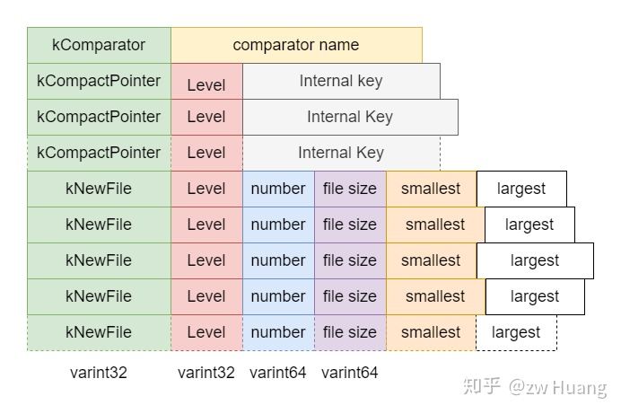

版本变迁写入，就是当需要生成一个新版本时，都会向MANIFEST写入一条新纪录，记录了新版本相对旧版本有哪些变化，和旧版本合并后可以得出当前的状态，主要包括以下几部分：

  * 写入时刻的日志编号；
  * 写入时刻下个可用文件的编号；
  * 写入时刻上一个用掉的`SequenceNumber`；
  * `compact_pointer_`数组，可能有多条记录，有Level和对应的Internal Key；
  * 记录删除了哪些文件，只记录了Level和对应的file number；
  * 当前存在的SSTable文件，包含元数据，包括在哪一Level，文件编号，文件大小，里面的最小键和最大键。

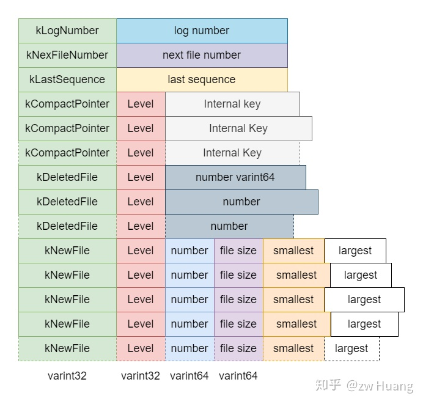

以上就是`VersionEdit`的持久化，记录MANIFEST相关的内容，接下里介绍`VersionEdit`如何应用到当前版本生成新版本。

### Builder

我们可能会问为什么还需要`Builder`，当有`VersionEdit`改变版本时，直接引用到当前的`Version`生成一个新的`Version`即可。这其实是为了效率，才引入了`Builder`。正常情况下，一次Compaction或者MemTable写入后，会产生一个`VersionEdit`，将这个`VersionEdit`应用到当前`Version`上生成一个新的`Version`，这没有什么问题。不过在版本变更时，也会将`VersionEdit`的内容写入MANIFEST中。当重新打开一个数据库时，需要读取MANIFEST重新构造版本信息，这个版本信息由初始的`Version`和多个`VersionEdit`生成，如果直接用`VersionEdit`应用会生成多个版本，降低了效率。所以使用了`Builder`，将多个`VersionEdit`的内容累积到`Builder`上，然后一次性应用到当前`Version`即可生成新的`Version`。

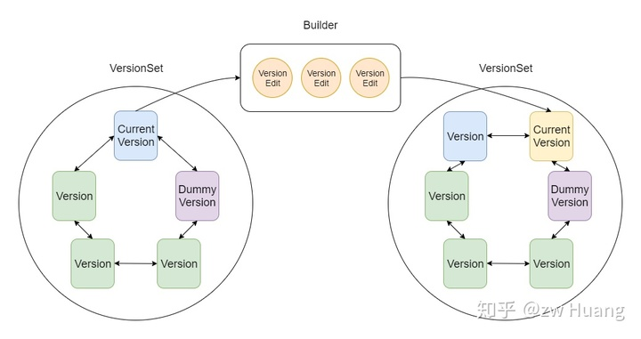

生成新`Version`的过程大体如下：

```cpp
VersionSet::Builder builder(&vset, curr_version);  // 创建一个builder
builder.Apply(version_edit1);                      // 应用VersionEdit，可应用多个
builder.Apply(version_edit2);
Version new_version;               
builder.SaveTo(&new_version);                      // 将之前的Version和VersionEdit生成一个新的Version
vset.AppendVersion(new_version);                   // 将新Version添加到VersionSet
```

先来看看`Builder`有哪些字段：

```cpp
// db/version_set.cc
class VersionSet::Builder {
    typedef std::set<FileMetaData*, BySmallestKey> FileSet;
    // 表示某一Level，删除的文件和增加的文件
    struct LevelState {
        std::set<uint64_t> deleted_files;
        FileSet* added_files;
    };
    VersionSet* vset_;    // 对应的VersionSet
    Version* base_;       // 变化前的Version，均作为参数传入
    // 表示每一Level删除的文件和增加的文件，VersionEdit Apply时都累积到这里
    LevelState levels_[config::kNumLevels];
}
```

可以看到`Builder`最重要的信息，就是`VersionEdit`里删除的文件和添加的文件的累积。

再来看看`Apply`做了哪些工作：

```cpp    
// db/version_set.cc
void Builder::Apply(VersionEdit* edit) {
    // 首先更新comact_pointer_，这个直接在VersionSet里更新，因为这个的信息只有一份
    // 新版本肯定是覆盖旧版本的，所以直接更新即可
    for (size_t i = 0; i < edit->compact_pointers_.size(); i++) {
        const int level = edit->compact_pointers_[i].first;
        vset_->compact_pointer_[level] = edit->compact_pointers_[i].second.Encode().ToString();
    }
    // 把VersionEdit里删除的文件插入到levels_相应Level里面去
    for (const auto& deleted_file_set_kvp : edit->deleted_files_) {
        const int level = deleted_file_set_kvp.first;
        const uint64_t number = deleted_file_set_kvp.second;
        levels_[level].deleted_files.insert(number);
    }
    // 把VersionEdit里添加的文件插入到levels_相应的Level里去
    for (size_t i = 0; i < edit->new_files_.size(); i++) {
        const int level = edit->new_files_[i].first;
        // 因为是新文件，构造一个FileMetaData
        FileMetaData* f = new FileMetaData(edit->new_files_[i].second);
        f->refs = 1;
        levels_[level].deleted_files.erase(f->number);
        levels_[level].added_files->insert(f);
    }
}
```

`Apply`非常简单，更新`VersionSet`的`comact_pointer_`以及`Builder`的`levels_`。

最后再来看看`SaveTo`如何生成一个新版本：

```cpp    
// db/version_set.cc
// 尝试将一个文件插入到新版本
void Builder::MaybeAddFile(Version* v, int level, FileMetaData* f) {
    if (levels_[level].deleted_files.count(f->number) > 0) {
        // 文件已删除
    } else {
        // 插入到Version的files里面
        std::vector<FileMetaData*>* files = &v->files_[level];
        f->refs++;
        files->push_back(f);
    }
}

void Builder::SaveTo(Version* v) {
    BySmallestKey cmp;
    cmp.internal_comparator = &vset_->icmp_;
    for (int level = 0; level < config::kNumLevels; level++) {
        // 拿出原本Version里的文件，以及Builder里累积的，添加的文件
        const std::vector<FileMetaData*>& base_files = base_->files_[level];
        std::vector<FileMetaData*>::const_iterator base_iter = base_files.begin();
        std::vector<FileMetaData*>::const_iterator base_end = base_files.end();
        const FileSet* added_files = levels_[level].added_files;
        v->files_[level].reserve(base_files.size() + added_files->size());
        // 按顺序进行合并
        for (const auto& added_file : *added_files) {
            // 找到base里面比added_file小的文件，添加到新的Version里
            // 采用MaybeAddFile，让被删除的文件无法添加
            for (std::vector<FileMetaData*>::const_iterator bpos =
                    std::upper_bound(base_iter, base_end, added_file, cmp);
                base_iter != bpos; ++base_iter) {
                MaybeAddFile(v, level, *base_iter);
            }
            MaybeAddFile(v, level, added_file);
        }
        // 添加剩下的文件
        for (; base_iter != base_end; ++base_iter) {
            MaybeAddFile(v, level, *base_iter);
        }
    }
}
```

可以看到`Builer`的作用就是将多个`VersionEdit`里添加的文件和删除的文件信息合并到原本的`Version`里生成新的`Version`，而对于旧的那些文件，在`Version`被删除时，对应的`FileMetaData`的引用计数会变为0，也会被自动删除。最后只剩下了新的`Version`和对应的SSTable文件。

### 版本变迁怎么做

介绍了前面的基本数据结构，来看看版本变迁到底是怎么做的，这是通过函数`VersionSet::LogAndApply`来完成的。

```cpp    
// db/version_set.cc
// 输入参数edit表示的是改变的内容，比如一次Compaction可以得到edit
Status VersionSet::LogAndApply(VersionEdit* edit, port::Mutex* mu) {
    // 设定当前的log number
    if (edit->has_log_number_) {
    } else {
        edit->SetLogNumber(log_number_);
    }
    // 设定当前的next_file_number和last_sequence，这些都会被持久化到MANIFEST
    edit->SetNextFile(next_file_number_);
    edit->SetLastSequence(last_sequence_);
    // 创建一个新版本，新版本是current_和edit的结合
    Version* v = new Version(this);
    {
        Builder builder(this, current_);
        builder.Apply(edit);
        builder.SaveTo(v);
    }
    Finalize(v);
    std::string new_manifest_file;
    Status s;
    // 这里只有Open数据库的时候才会走到，如果需要保存新的MANIFEST，此时这个变量为null
    // 会创建一个新的MANIFEST，然后将当前的状态写入
    if (descriptor_log_ == nullptr) {
        new_manifest_file = DescriptorFileName(dbname_, manifest_file_number_);
        edit->SetNextFile(next_file_number_);
        s = env_->NewWritableFile(new_manifest_file, &descriptor_file_);
        if (s.ok()) {
            descriptor_log_ = new log::Writer(descriptor_file_);
            s = WriteSnapshot(descriptor_log_);
        }
    }
    {
        // 写文件时释放锁
        mu->Unlock();
        std::string record;
        edit->EncodeTo(&record);
        s = descriptor_log_->AddRecord(record);
        ...
        mu->Lock();
    }
    // 安装新版本，会把v放到VersionSet的链表中，然后将当前Version指向v
    AppendVersion(v);
    ...
    return s;
}
```

版本变迁基本的流程如下：

  * 首先有了一个准备好的`VersionEdit`实例，包含了版本变迁的内容，然后设置其它的一些字段；
  * 然后生成一个新的`Version`，使用`Builder`将当前的版本和`VersionEdit`应用生成一个新的`Version`；
  * 如果当前MANIFEST的描述符不存在，新生成一个MANIFEST文件，将当前状态写入；
  * 将`VersionEdit`的内容写入到MANIFEST文件；
  * 将新生成的`Version`加入到`VersionSet`，替换当前的`Version`。

### 参考源码

```cpp    
version_edit.h version_edit.cc: 实现VersionEdit
version_set.h version_set.cc：实现Version、VersionSet和Builder
```

### 小结

以上便是版本管理的实现了，可以看到版本管理最主要管理的是SSTable的删除和添加，生成新的Version。其它的一些全局元数据的管理往往是直接更新VersionSet对应的字段的。

介绍了版本管理，接下来将介绍Compaction，里面将用到版本管理的概念。

<hr>

#### <p>原文出处：<a href='https://zhuanlan.zhihu.com/p/337091228' target='blank'>数据库5：兢兢业业——Compaction</a></p>

## 数据库5：兢兢业业——Compaction

上一篇介绍了版本管理，版本管理最终是为了服务Compaction的，这一节让我来揭开Compaction的面纱。

之前的一篇 LevelDB基本原理中，介绍了为什么需要Compaction，总结下来，是为了如下目的：

  * 当MemTable写满后，需要将MemTable的数据写入磁盘，生成一个Level 0的SSTable；
  * Level 0的SSTable的键范围可能有重叠，读取一个Key的时候，可能需要读取多个SSTable，Compaction将Level 0的SSTable推向Level 1，使得Level 0的SSTable数量保持在一个较低的水平；
  * 经过Compaction后，Level 0以上的层的SSTable是有序没有重叠的，一个Key只有可能在一个文件里面；
  * Level 1的文件数量可能太多，导致一次Compaction消耗太多磁盘IO，所以需要将Level 1的文件继续Compaction到更高Level去。

最终，Compaction的目的是抵消为了提高写数据的效率而导致读数据效率的降低，Compaction后，读取数据的效率更高了，将一次Key查找读取SSTable的数量控制在常数级。

### Compaction原理

根据Compaction涉及的数据，Compaction可以分为两种类型：

  * Minor Compaction;
  * Major Compaction。

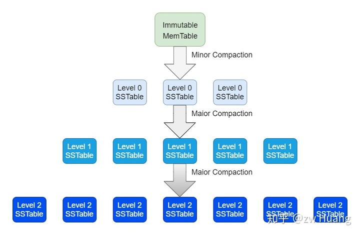

当MemTable写满后，会转换为Immutable MemTable，写入到Level 0的一个SSTable，这个过程就叫Minor Compaction，这其实就是把一个内存结构序列化为磁盘结构。

当某个Level的SSTable数量太多或者总文件大小太大时，需要将部分SSTable推向更高的Level，这个过程是Major Compaction。注意无法直接将一个SSTable移动到更高的Level，因为需要保证Level 0以上的每个SSTable有序无重叠，所以这需要和更高的Level的某些文件做一次多路归并。

之所以这样区分，是因为Minor Compaction速度快资源消耗少，只需要将MemTable序列化到磁盘即可。而Major Compaction会涉及到多个SSTable之间的合并，耗费IO多，速度慢，需要读写相当多的文件。

Minor Compaction会在MemTable写满后触发，没有太多可以讨论的，所以重点介绍Major Compaction的过程。

Major Compaction的目标是将SSTable移到更高的Level去，需要保证Level 0以上的SSTable之间的键有序无重叠。

Major Compaction其实就是一个归并排序的过程，对多个输入的SSTable，多路归并，输出多个连续的SSTable，代替原来的文件。根据Level 0的特殊性，可以分为两种类型。

### Level 0 -> Level 1

因为Level 0的SSTable是MemTable写入的，所以Level 0的SSTable的键范围之间可能有重叠的。而Level 0以上的SSTable是多路归并生成的，生成过程中，保证了SSTable的键范围不会重叠。

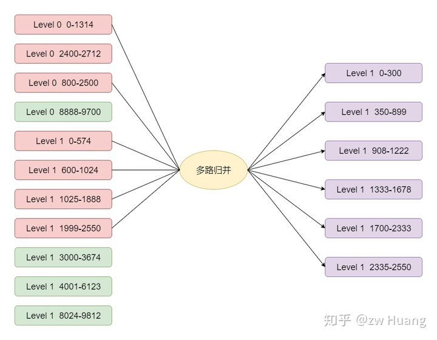

如图，假设需要Compaction键范围是800-2500的Level 0的文件到Level 1，会通过以下步骤选择文件：

  * 首先选定800-2500的SSTable；
  * Level 0的文件是重叠的，所以只Compaction 800-2500的文件的话，可能造成有更旧的数据在Level 0，而新的数据在Level 1，这样就会导致读取的时候出错，还需要将和800-2500有重叠的文件加入，这需要选定0-1314，2400-2712的文件；
  * 最终Level 0选定了3个文件，键的范围是0-2712；
  * 要保证Level 1的文件之间都是有序的并且没有重叠，那么需要选定Level 1和0-2712范围有重叠的文件，这样就选择下面4个红色文件；
  * 最终选择了7个红色的文件，做多路归并，生成了7个紫色的文件，这些文件逐个生成，有序，并且键无重叠；
  * 用7个紫色文件代替7个红色文件，做一次版本变更，就成功将Level 0的SSTable移动到了Level 1。

经过这样的文件选择和多路归并，Level 1的文件依然是有序并且无重叠的。

### Level n -> Level n + 1 （n > 0)

这种情况更简单一点，因为在Level 0以上的层，选择一个文件进行Compaction时，不可能有其它同层的文件有重叠，所以只需要一个文件即可，然后选择Level n + 1和Level n有重叠的文件，后面的步骤都是一样的。

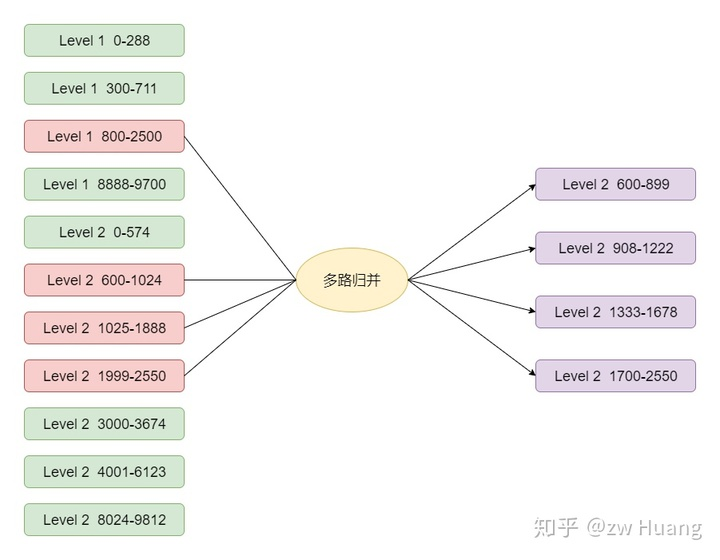

### Compaction触发的方式

要开始一次Compaction，需要选定Level n的一个SSTable，Compaction到Level n + 1去，那么这个SSTable是如何选择的呢？

LevelDB里有三种方式选择Compaction，分别是：

  * Manual Compaction；
  * Size Compaction；
  * Seek Compaction。

### Manual Compaction

Manual Compaction，和名字一样，就是手动触发一次Compaction，通过`DBImpl::TEST_CompactRange`触发，为了测试而存在。接口如下：

```cpp   
void DBImpl::TEST_CompactRange(int level, const Slice* begin, const Slice* end)
```

可以看出一次手动触发，需要指定Level，以及Compaction键的范围。

Manual Compaction的信息使用`ManualCompaction`保存：

```cpp    
// db/db_impl.h
struct ManualCompaction {
    int level;
    bool done;                 // 表示这次Manual Compaction是否完成
    const InternalKey* begin;  // 开始键，null表示最小键
    const InternalKey* end;    // 结束键，null表示最大键
    InternalKey tmp_storage;   // 保存Compaction的进度
};
```

调用`DBImpl::TEST_CompactRange`，会构造一个ManualCompaction，然后循环完成Compaction。

```cpp    
// db/db_impl.cc
void DBImpl::TEST_CompactRange(int level, const Slice* begin,
                                const Slice* end) {
    // 构造ManualCompaction实例manual，保存Manual Compaction的信息
    MutexLock l(&mutex_);
    while (!manual.done) {
        // 如果manual.done为false，一直循环
        if (manual_compaction_ == nullptr) {
            // manual_compaction_是DBImpl的一个字段，后台线程会去检查这个字段，如果不为空，会触发Compaction
            // 所以将manual_compaction_赋值manual，后台线程就会检查触发Compaction
            manual_compaction_ = &manual;
            // 可能调度一次Compaction
            MaybeScheduleCompaction();
            // 设置完成后，会重新下一次循环，然后等待本次Compaction完成
        } else {
            // manual_compaction_已经被设置，表示已经有Manual Compaction进行中了
            // 等待后台线程完成，完成后，会重新执行循环
            background_work_finished_signal_.Wait();
        }
    }
    ...
}
```

Manual Compaction会先构造一个`manual`，开始循环，将`manual`赋值给`DBImpl::manual_compaction_`，后台线程检查这个变量，开始一次Compaction。

这里使用一个循环不仅仅是为了等待Compaction完成，`begin`和`end`之间的文件可能非常多，为了保证Compaction的效率，不会一次Compaction完所有的文件，会先选择一个`middle`，然后Compaction `begin`和`middle`之间的文件，完成后将`begin`设置成`middle`，将`DBImpl::manual_compaction_`设置为`null`，这样下次循环的时候会继续Compaction `middle`->`end`。当最后一次Compaction完成后，`done`设置为`true`，循环就退出了。

### Size Compaction

Size Compaction的思想是比较简单直观的，对于Level 0的SSTable，因为键范围可能有重叠，所以需要控制文件不超过4个，而对于Level n（n > 0）的SSTable，总大小不能超过`10^n`MB，一旦这些条件不满足了，需要Compaction，将文件推向更高的Level，使得条件继续满足。

Size Compaction就是根据这个思想触发的，计算每一Level实际大小相对于最大大小的比率，优先Compaction比率最大的Level。

SSTable文件的增减，只会在版本变更的时候出现，所以只需要在版本变更完成时，计算比率最大的Level，这个计算过程由`VersionSet::LogAndApply`里面的`void VersionSet::Finalize(Version* v)`来完成（打开数据库的时候也会计算一次）。

```cpp
// db/version_set.cc
void VersionSet::Finalize(Version* v) {
    int best_level = -1;     // 最大的比率的Level
    double best_score = -1;  // 最大的比率
    for (int level = 0; level < config::kNumLevels - 1; level++) {
        double score;
        if (level == 0) {
            // Level 0特殊处理，使用文件的个数，而不是大小来确定比率，因为对于大的writer-buffer
            // Level 0的文件会更大，这时候如果限定总大小，Compaction会偏多
            // 对于小的Level 0文件，数量会太多，影响读取的速度
            score = v->files_[level].size() /
                    static_cast<double>(config::kL0_CompactionTrigger);
        } else {
            // 计算文件总大小相对于最大大小的比率 
            const uint64_t level_bytes = TotalFileSize(v->files_[level]);
            score = static_cast<double>(level_bytes) / MaxBytesForLevel(options_, level);
        }
        if (score > best_score) {
            best_level = level;
            best_score = score;
        }
    }
    // 将计算得到的最大的score和level赋值，后台线程看到赋值后会开始Compaction
    v->compaction_level_ = best_level;
    v->compaction_score_ = best_score;
}
```

Size Compaction是对一整个Level进行的，一个Level的SSTable可能会很多，无法在一次Compaction中完成，需要分多次完成。第一次完成最小键到某个键的范围内的Compaction，下一次再从某个键继续完成，以此类推。那么，需要记录下一次这个Level的Compaction从哪个键开始，以下结构便记录这个进度信息：

```cpp
std::string VersionSet::compact_pointer_[config::kNumLevels];
```

### Seek Compaction

相比Size Compaction的直观，Seek Compaction则更难理解一些。

在搜索SSTable时，会找到键范围包含待搜索键的SSTable，从Level 0开始搜索，如果一个SSTable没有找到，会搜索下一个SSTable，直到找到或者确定无法找到为止。假设一次搜索，搜索了超过一个SSTable，那么标记第一个SSTable搜索了一次，假设这种情况出现了多次，说明这个文件和多个其它的文件键范围有重叠，影响了搜索的效率，需要Compaction这个文件，使得这种重叠减少，进而提高读取的效率。

Seek Compaction就是基于这个原理实现的Compaction，是精确到每个SSTable的，一个`FileMetaData`里面包含一个字段`allowed_seeks`，会被设定为一个初始值，每当搜索SSTable时，如果第一个文件没有搜到，就会对第一个SSTable的`allowed_seeks`减1，当某个SSTable的`allowed_seeks`变为0时，那么这个SSTable就需要被Compaction。

`allowed_seeks`的减小发生在两个地方：

  * `DB::GET`接口；
  * `DBIter`数据库迭代过程中。

每次调用`DB::GET`时，如果需要搜索超过1个SSTable，就会对第一个SSTable的`allowed_seeks`减一。

而`DBIter`更特别一点，因为是迭代SSTable的，所以不会存在搜索一个键读取多个SSTable的情况，这边为了将Seek Compaction考虑进去，采用了抽样的方式，每读取2MB的数据，会抽样一个键，模拟读取的情况，更新相应的`allowed_seeks`。

当某个文件的`allowed_seeks`减小到0了，就会将当前`Version`的`file_to_compact_`和`file_to_compact_level`设置为这个文件以及它的Level，后台线程就会来处理。

`allowed_seeks`的初始值设置就非常关键，它决定了一个文件多少次Seek后，才会被Compaction，LevelDB将这个值设为:

```cpp
static_cast<int>((f->file_size / 16384U))
```

这是有依据的，首先假设：

  * 一次Seek花费10ms；
  * 读写1MB的花费10ms （100MB/s）；
  * 而Compaction 1MB的数据花费25MB左右的IO：当前Level读取1MB，上一个Level读取10-12MB，上一个Level写入10-12MB。

所以25次Seek的开销和Compaction 1MB数据的开销一样，也就是1次Seek和40KB数据Compaction的开销一样，我们比较保守，假设1次Seek和16KB的数据的开销一样。那么设置为上面的值后，Seek的操作和Compaction操作的开销相同，那么Compaction不会过于频繁，影响性能。

### Compaction实现

Compaction是比较耗资源的操作，为了不影响在线服务的读写，Compaction是由后台线程异步地完成的，这个过程由`void DBImpl::BackgroundCompaction()`来完成。

上面介绍的三种触发Compaction的方式，都会在读写数据库时，更新相应的字段，表示需要Compaction的内容，而Compaction后台线程会检查这些字段，开始相应的Compaction任务。

### Compaction类

Compaction相关的信息会保存在一个`Compaction`类里面：

```cpp    
// db/version_set.h
class Compaction {
    ...
    int level_;                      // Compaction文件所在的Level
    uint64_t max_output_file_size_;  // 生成的文件的最大值
    Version* input_version_;         // Compaction发生时的Version
    VersionEdit edit_;               // Compaction结果保存的VersionEdit
    std::vector<FileMetaData*> inputs_[2];
}
```

`Compaction`的文件在两个Level，假设为`level_`和`level_ + 1`，选定一个或几个SSTable Compaction时，就是选定了`level_`的文件，然后调用`void VersionSet::SetupOtherInputs(Compaction* c)`可以获取到`level_ + 1`中与`level_`中选定的文件有重叠的文件，这样输入的SSTable就选好了，一次Compactdoin要做的工作也就确定了。

### 选择一个Compaction

`void DBImpl::BackgroundCompaction()`首先会选定构造一个`Compaction`类的实例，也就是选定Compaction的任务。

```cpp
// db/db_impl.cc
void DBImpl::BackgroundCompaction() {
    ...
    Compaction* c;
    bool is_manual = (manual_compaction_ != nullptr);
    InternalKey manual_end;
    if (is_manual) {
        // 先处理Manual Compaction
        ManualCompaction* m = manual_compaction_;
        // 这里根据manual_compaction_的信息构造一个Compaction实例，表示需要完成的Compaction任务
        c = versions_->CompactRange(m->level, m->begin, m->end);
        // c为nullptr表示完成了
        m->done = (c == nullptr);
        if (c != nullptr) {
            // manual_end赋值为当前Compaction范围的结尾
            // 因为需要Compaction一个Level，防止一次Compaction太多数据，需要从最小键开始分段进行Compaction
            manual_end = c->input(0, c->num_input_files(0) - 1)->largest;
        }
    } else {
        c = versions_->PickCompaction();
    }
    ...
}

Compaction* VersionSet::PickCompaction() {
    Compaction* c;
    int level;
    const bool size_compaction = (current_->compaction_score_ >= 1);
    const bool seek_compaction = (current_->file_to_compact_ != nullptr);
    if (size_compaction) {
        // 优先考虑Size Compaction
        level = current_->compaction_level_;
        c = new Compaction(options_, level);
        // 根据compact_pointer_[level]找到下一个Compaction的文件f
        c->inputs_[0].push_back(f);
    } else if (seek_compaction) {
        // 对于Seek Compaction，文件已经确定了
        level = current_->file_to_compact_level_;
        c = new Compaction(options_, level);
        c->inputs_[0].push_back(current_->file_to_compact_);
    } else {
        return nullptr;
    }
    ..
    // 如果c->inputs_里的文件是Level 0，那么同一Level其它文件也有可能有重叠，则找到其它重叠的文件
    // 找到上一层Level和选定的Level有重叠的文件，这样就找到了两层需要Compaction的文件
    SetupOtherInputs(c);
    return c;
}
```

选择Compaction时，按照以下优先级从高到低选择：

  * Manual Compaction;
  * Size Compaction;
  * Seek Compaction。

对于前两种Compaction，是对一整个Level进行Compaction的，需要根据之前的进度，选择一个SSTable文件，而Seek Compaction的SSTable文件只有一个，是确定的。

选择Compaction时，需要选择某一个需要Compaction的文件，然后需要找到上一个Level和这个文件有重叠的文件，这些文件一起进行多路合并。

### Do Compaction

当选定Compaction后，就可以开始实际的Compaction了。

```cpp    
// db/db_impl.cc
void DBImpl::BackgroundCompaction() {
    ...
    if (c == nullptr) {
        // 表示没有需要Compaction的内容
    } else if (!is_manual && c->IsTrivialMove()) {
        // 处理一种特殊情况，也就是参与Compaction的文件，level_有一个文件，而level_ + 1 没有
        // 这时候只需要直接更改元数据，然后文件移动到level_ + 1即可，不需要多路归并
    } else {
        // CompactionState保存Compaction的状态
        CompactionState* compact = new CompactionState(c);
        // 实际的Compaction
        status = DoCompactionWork(compact);
        // 清理操作
    }
    ...
}
```

`DBImpl::BackgroundCompaction`做了这些事：

  * 处理特殊情况，看能否只更改元数据就完成Compaction；
  * 调用`DBImpl::DoCompactionWork`做实际的Compaction；
  * 清理Compaction。

`DBImpl::DoCompactionWork`则完成实际的多路归并过程，生成新的版本。

```cpp    
// db/db_impl.cc
Status DBImpl::DoCompactionWork(CompactionState* compact) {
    // 取当前最小的使用中的SequenceNumber
    if (snapshots_.empty()) {
        compact->smallest_snapshot = versions_->LastSequence();
    } else {
        compact->smallest_snapshot = snapshots_.oldest()->sequence_number();
    }
    // 参与Compaction的SSTable组成一个迭代器
    Iterator* input = versions_->MakeInputIterator(compact->compaction);
    input->SeekToFirst();
    ParsedInternalKey ikey;
    std::string current_user_key;       // 记录当前的User Key
    bool has_current_user_key = false;  // 记录是否碰到过一个同样的User Key
    SequenceNumber last_sequence_for_key = kMaxSequenceNumber;
    while (input->Valid()) {
    ...
        Slice key = input->key();
        if (compact->compaction->ShouldStopBefore(key) && compact->builder != nullptr) {
            // ShouldStopBefore判断生成的SSTable和level_ + 2层的有重叠的文件个数，如果超过10个，
            // 那么这个SSTable生成就完成了,这样保证了新生产的SSTable和上一层不会有过多的重叠
            // 创建一个新的SSTable，写入文件
            status = FinishCompactionOutputFile(compact, input);
        }
        bool drop = false;
        if (!has_current_user_key || user_comparator()->Compare(ikey.user_key, Slice(current_user_key)) != 0) {
            // 如果第一次碰到一个User Key
            current_user_key.assign(ikey.user_key.data(), ikey.user_key.size());
            has_current_user_key = true;
            last_sequence_for_key = kMaxSequenceNumber;
        }
        // 如果上一个Key的SequenceNumber <= 最小的存活的Snapshot，那么
        // 这个Key的SequenceNumber一定 < 最小的存活的Snapshot，那么这个Key就不
        // 会被任何线程看到了，可以被丢弃，上面碰到了第一个User Key时，设置了
        // last_sequence_for_key = kMaxSequenceNumber;保证第一个Key一定不会
        // 被丢弃。
        if (last_sequence_for_key <= compact->smallest_snapshot) {
            drop = true;  // (A)
        } else if (ikey.type == kTypeDeletion &&
                    ikey.sequence <= compact->smallest_snapshot &&
                    compact->compaction->IsBaseLevelForKey(ikey.user_key))  {
            // 如果碰到了一个删除操作，并且SequenceNumber <= 最小的Snapshot，
            // 通过IsBaseLevelForKey判断更高Level不会有这个User Key存在，那么这个Key就被丢弃
            drop = true;
        }
        last_sequence_for_key = ikey.sequence;
        if (!drop) {
            ...
            // 没有被丢弃就添加Key
            compact->builder->Add(key, input->value());
            // 达到文件大小，就写入文件，生成新文件
            if (compact->builder->FileSize() >=
                    compact->compaction->MaxOutputFileSize()) {
                status = FinishCompactionOutputFile(compact, input);
            }
        }
        input->Next();
    }
    ...
    // 安装Compaction的结果
    status = InstallCompactionResults(compact);
    ...
}
```

`DBImpl::DoCompactionWork`构造了一个迭代器，开始多路归并的操作，会考虑以下几点：

  * 迭代按照Internal Key的顺序进行，多个连续的Internal Key里面可能包含相同的User Key，按照SequenceNumber降序排列；
  * 相同的User Key里只有第一个User Key是有效的，因为它的SequenceNumber是最大的，覆盖了旧的User Key，但是无法只保留第一个User Key，因为LevelDB支持多版本，旧的User Key可能依然有线程可以引用，但是不再引用的User Key可以安全的删除；
  * 碰到一个删除时，并且它的SequenceNumber <= 最新的Snapshot，会判断更高Level是否有这个User Key存在。如果存在，那么无法丢弃这个删除操作，因为一旦丢弃了，更高Level原被删除的User Key又可见了。如果不存在，那么可以安全的丢弃这个删除操作，这个键就找不到了；
  * 对于生成的SSTable文件，设置两个上限，哪个先达到，都会开始新的SSTable。一个就是2MB，另外一个就是判断上一Level和这个文件的重叠的文件数量，不超过10个，这是为了控制这个生成的文件Compaction的时候，不会和太多的上层文件重叠。

最后通过`DBImpl::InstallCompactionResults`安装Compaction的结果：

```cpp    
// db/db_impl.cc
Status DBImpl::InstallCompactionResults(CompactionState* compact) {
    ...
    // 将改删除的文件和改添加的文件更新到VersionEdit里
    compact->compaction->AddInputDeletions(compact->compaction->edit());
    const int level = compact->compaction->level();
    for (size_t i = 0; i < compact->outputs.size(); i++) {
        const CompactionState::Output& out = compact->outputs[i];
        compact->compaction->edit()->AddFile(level + 1, out.number, out.file_size,
                                            out.smallest, out.largest);
    }
    // 应用一次版本变更，安装新版本
    return versions_->LogAndApply(compact->compaction->edit(), &mutex_);
}
```

### 参考源码

```    
Version_set.h version_set.cc: Compaction类的实现，更新Compaction的统计信息，确定Compaction的内容
db_impl.h db_impl.cc: Compaction实际操作的实现
```

### 小结

Compaction整个过程还是比较复杂的。总结一下Compaction的目的：

* 将低Level的文件移到更高Level，提高读取的效率；
* 如Compact的字面意思一样，因为LevelDB的删除和更新都是简单的插入，Compaction消除以前冗余的数据。

<hr>

#### <p>原文出处：<a href='https://zhuanlan.zhihu.com/p/340804308' target='blank'>数据库6：复旧如初——Recover</a></p>

## 数据库6：复旧如初——Recover

前面已经介绍了LevelDB的存储层和数据库层，LevelDB的知识已经比较完备了，我们脑中应该可以构思出LevelDB整个系统的架构。本篇将介绍如何打开一个LevelDB数据库，结束这个系列。

LevelDB打开需要做以下事情：

* 如果数据库目录不存在，创建目录；
* 加文件锁，锁住整个数据库；
* 读取MANIFEST文件，恢复系统关闭时的元数据，也就是版本信息，或者新建MAINFEST文件；
* 如果上一次关闭时，MemTable里有数据，或者Immutable MemTable写入到SSTable未完成，那么需要做数据恢复，从WAL恢复数据；
* 创建数据库相关的内存数据结构，如Version、VersionSet等。

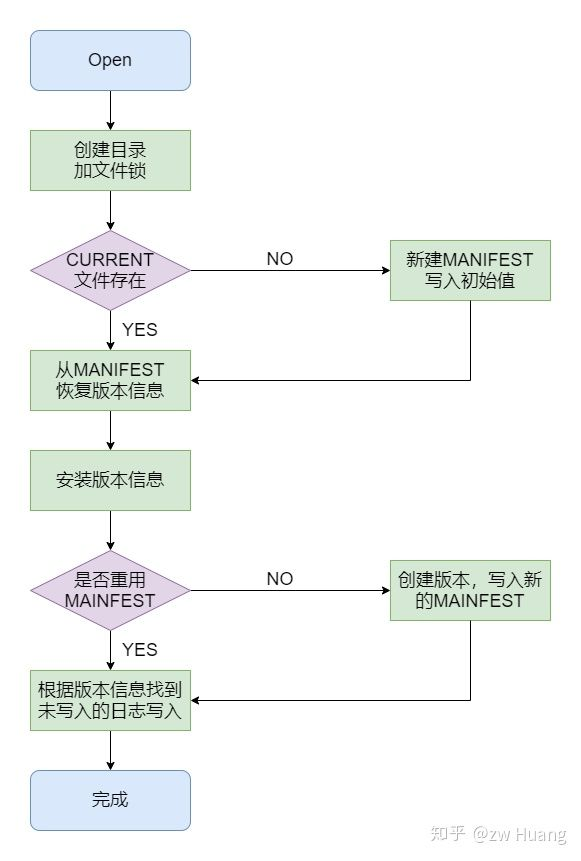

### DB::Open

根据LevelDB数据库接口的使用方式：

```cpp
Status DB::Open(const Options& options, const std::string& dbname, DB** dbptr)
```

`DB::Open`是打开数据库的入口函数：

```cpp
// db/db_impl.cc

Status DB::Open(const Options& options, const std::string& dbname, DB** dbptr) {
    *dbptr = nullptr;

    DBImpl* impl = new DBImpl(options, dbname);
    VersionEdit edit;
    bool save_manifest = false;
    // 调用DBImpl::Recover完成MANIFEST的加载和故障恢复
    Status s = impl->Recover(&edit, &save_manifest);
    if (s.ok() && impl->mem_ == nullptr) {
        // 创建日志和相应的MemTable
    }
    if (s.ok() && save_manifest) {
        // 如果需要重写MANIFEST文件，那么做一个版本变更，这里面会创建一个新的MANIFEST
        // 将当前的版本信息写入，然后将edit的内容写入。
        edit.SetLogNumber(impl->logfile_number_);
        s = impl->versions_->LogAndApply(&edit, &impl->mutex_);
    }

    ...

    if (s.ok()) {
        *dbptr = impl;
    } else {
        delete impl;
    }
    return s;
}
```

`DB::Open`比较简单，调用`DBImpl::Recover`来完成主要的工作，如果调用成功，则创建MemTable和WAL相关的数据结构，重写MANIFEST文件。

### DBImpl::Recover

`DBImpl::Recover`是Open一个数据库时主要的函数：

```cpp
// db/db_impl.cc
Status DBImpl::Recover(VersionEdit* edit, bool* save_manifest) {
    env_->CreateDir(dbname_);  // 创建数据库目录
    // 加文件锁，防止其他进程进入
    Status s = env_->LockFile(LockFileName(dbname_), &db_lock_);
    if (!env_->FileExists(CurrentFileName(dbname_))) {
        // 如果CURRENT文件不存在，说明需要新创建数据库
        s = NewDB();
    }
    // 读取MANIFEST文件进行版本信息的恢复
    s = versions_->Recover(save_manifest);
    // 之前的MANIFEST恢复，会得到版本信息，里面包含了之前的log number
    // 搜索文件系统里的log，如果这些日志的编号 >= 这个log number，那么这些
    // 日志都是关闭时丢失的数据，需要恢复，这里将日志按顺序存储在logs里面
    // 逐个恢复日志的内容
    for (size_t i = 0; i < logs.size(); i++) {
        s = RecoverLogFile(logs[i], (i == logs.size() - 1), save_manifest, edit, &max_sequence);
        ...
    }
    ...
    return Status::OK();
}
```

`DBImpl::Recover`做了以下事情：

  * 创建数据库目录；
  * 对这个数据库里面的LOCK文件加文件锁，LevelDB是单进程多线程的，需要保证每次只有一个进程能够打开数据库，方式就是使用了文件锁，如果有其它进程打开了数据库，那么加锁就会失败；
  * 如果数据库不存在，那么调用`DBImpl::NewDB`创建新的数据库；
  * 调用`VersionSet::Recover`来读取MANIFEST，恢复版本信息；
  * 根据版本信息，搜索数据库目录，找到关闭时没有写入到SSTable的日志，按日志写入顺序逐个恢复日志数据。`DBImpl::RecoverLogFile`会创建一个MemTable，开始读取日志信息，将日志的数据插入到MemTable，并根据需要调用`DBImpl::WriteLevel0Table`将MemTable写入到SSTable中，这里不过多介绍。

接下来介绍`DBImpl::NewDB`和`VersionSet::Recover`，就可以了解`Open`一个数据库做了哪些事情。

### DBImpl::NewDB

`DBImpl::NewDB`出人意料的简单，一个新的数据库没有任何数据，所以不需要日志和SSTable，只需要有一个MANIFEST文件，包含一些元数据。

```cpp    
// db/db_impl.cc
Status DBImpl::NewDB() {
    VersionEdit new_db;
    // 保存比较器的名称，下次打开时需要用相同的名称打开
    new_db.SetComparatorName(user_comparator()->Name());  
    new_db.SetLogNumber(0);  // 分配日志文件的编号为0                      
    new_db.SetNextFile(2);   // 下一个待分配的文件编号是2，因为1分配给了MANIFEST文件
    new_db.SetLastSequence(0);
    // 创建MANIFEST文件，将VersionEdit写入
    const std::string manifest = DescriptorFileName(dbname_, 1);
    WritableFile* file;
    Status s = env_->NewWritableFile(manifest, &file);
    log::Writer log(file);
    std::string record;
    new_db.EncodeTo(&record);
    s = log.AddRecord(record);
    // 让CURRENT文件指向这个MANIFEST文件
    s = SetCurrentFile(env_, dbname_, 1);
    ...
    return s;
}
```

可以看到`DBImpl::NewDB`非常简单，就是创建一个MANIFEST文件，将以下信息写入到MANIFEST文件：

  * 比较器名称；
  * 当前日志的编号;
  * 下一个使用的文件编号；
  * 上一个使用的SequenceNumber；

最后CURRENT指向新创建的MANIFEST文件。

### VersionSet::Recover

`VersionSet::Recover`完成MANIFEST文件的读取和版本的构造，需要知道数据库里有哪些SSTable文件，每个文件处于哪个Level，当前日志的编号等等信息。

```cpp
// db/version_set.cc
Status VersionSet::Recover(bool* save_manifest) {
    // 读取CURRENT文件的内容，获取当前使用的MANIFEST文件
    // 读取MANIFEST文件，将里面的VersionEdit读取应用到一个builder里
    Version* v = new Version(this);      // 创建一个新版本版本
    builder.SaveTo(v);                   // 将builder里面的内容应用到新版本里
    Finalize(v);                         // 更新Size Compaction的统计信息
    AppendVersion(v);                    // 安装新版本成为当前版本
    if (ReuseManifest(dscname, current)) {
        // 如果MANIFEST可以重用，那么不需要保存MANIFEST
        // 这里主要判断MANIFEST的大小，如果大于2M，那么就不会重用MANIFEST文件，
        // 而是将当前状态写入到一个新的MANIFEST文件里，这样可以避免打开的时候读取
        // 太大的MANINFEST，使得打开时间太长
    } else {
        *save_manifest = true;
    }
    return s;
}
```

上面代码省略了如何读取MANIFEST文件，我们知道MANIFEST使用和WAL相同的格式，并且之前的版本变更介绍了`Builder`里应用多个`VersionEdit`，所以这里不过多介绍。恢复出版本信息后，安装这个版本，那么数据库的元数据就恢复到了关闭时候的状态，这个数据库就准备好了可以读写了。

### 参考源码

```    
db/db_impl.h db/db_impl.cc: `DB:Open`的入口
db/version_set.h db/version_set.cc: 完成MANIFEST文件的读取和构造版本信息
```

### 小结

以上便是LevelDB Open一个数据库的流程了，对于新数据库，只需要创建相应的数据结构和文件。而对于旧数据库，其实目标就是将数据库的状态恢复到关闭时刻的状态，主要涉及两个方面：

* 恢复元数据，读取MANIFEST文件，构造出版本信息；
* 对于没有应用的WAL文件，进行应用，恢复数据。
