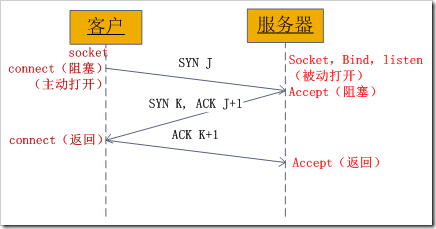
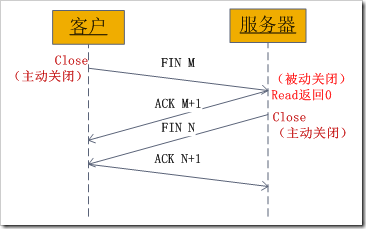

 
<!--BEGIN_DATA
{
    "create_date": "2016-07-14 13:08", 
    "modify_date": "2016-07-14 13:08", 
    "is_top": "0", 
    "summary": "Linux多线程编程（不限Linux）与Linux Socket编程（不限Linux）", 
    "tags": "C/C++、Linux", 
    "file_name": "Linux多线程编程（不限Linux）与Linux Socket编程（不限Linux）.md"
}
END_DATA-->

####<p>原文出处：<a href='http://www.cnblogs.com/skynet/archive/2010/10/30/1865267.html' target='blank'>Linux多线程编程（不限Linux）</a></p>

----本文一个例子展开，介绍Linux下面线程的操作、多线程的同步和互斥。

##前言

线程？为什么有了进程还需要线程呢，他们有什么区别？使用线程有什么优势呢？还有多线程编程的一些细节问题，如线程之间怎样同步、互斥，这些东西将在本文中介绍。我在某QQ群里见到这样一道面试题：

> 是否熟悉POSIX多线程编程技术？如熟悉，编写程序完成如下功能：

>

> 1）有一int型全局变量g_Flag初始值为0；

>

> 2） 在主线称中起动线程1，打印"this is thread1"，并将g_Flag设置为1

>

> 3） 在主线称中启动线程2，打印"this is thread2"，并将g_Flag设置为2

>

> 4） 线程序1需要在线程2退出后才能退出

>

> 5） 主线程在检测到g_Flag从1变为2，或者从2变为1的时候退出

我们带着这题开始这篇文章，结束之后，大家就都会做了。本文的框架如下：

  * 1、进程与线程 
  * 2、使用线程的理由 
  * 3、有关线程操作的函数 
  * 4、线程之间的互斥 
  * 5、线程之间的同步
  * 6、试题最终代码

##1、进程与线程

进程是程序执行时的一个实例，即它是程序已经执行到何种程度的数据结构的汇集。从内核的观点看，进程的目的就是担当分配系统资源（CPU时间、内存等）的基本单位。

线程是进程的一个执行流，是CPU调度和分派的基本单位，它是比进程更小的能独立运行的基本单位。一个进程由几个线程组成（拥有很多相对独立的执行流的用户程序共享应用程序的大部分数据结构），线程与同属一个进程的其他的线程共享进程所拥有的全部资源。

> "进程----资源分配的最小单位，线程----程序执行的最小单位"

进程有独立的地址空间，一个进程崩溃后，在保护模式下不会对其它进程产生影响，而线程只是一个进程中的不同执行路径。线程有自己的堆栈和局部变量，但线程没有单独的地址空间，一个线程死掉就等于整个进程死掉，所以多进程的程序要比多线程的程序健壮，但在进程切换时，耗费资源较大，效率要差一些。但对于一些要求同时进行并且又要共享某些变量的并发操作，只能用线程，不能用进程。

##2、使用线程的理由

从上面我们知道了进程与线程的区别，其实这些区别也就是我们使用线程的理由。总的来说就是：进程有独立的地址空间，线程没有单独的地址空间（同一进程内的线程共享进程的地址空间）。（下面的内容摘自[Linux下的多线程编程](http://fanqiang.chinaunix.net/a4/b8/20010811/0905001105.html)）

使用多线程的**理由之一**是和进程相比，它是一种非常"节俭"的多任务操作方式。我们知道，在Linux系统下，启动一个新的进程必须分配给它独立的地址空间，建立众多的数据表来维护它的代码段、堆栈段和数据段，这是一种"昂贵"的多任务工作方式。而运行于一个进程中的多个线程，它们彼此之间使用相同的地址空间，共享大部分数据，启动一个线程所花费的空间远远小于启动一个进程所花费的空间，而且，线程间彼此切换所需的时间也远远小于进程间切换所需要的时间。据统计，总的说来，一个进程的开销大约是一个线程开销的30倍左右，当然，在具体的系统上，这个数据可能会有较大的区别。

使用多线程的**理由之二**是线程间方便的通信机制。对不同进程来说，它们具有独立的数据空间，要进行数据的传递只能通过通信的方式进行，这种方式不仅费时，而且很不方便。线程则不然，由于同一进程下的线程之间共享数据空间，所以一个线程的数据可以直接为其它线程所用，这不仅快捷，而且方便。当然，数据的共享也带来其他一些问题，有的变量不能同时被两个线程所修改，有的子程序中声明为static的数据更有可能给多线程程序带来灾难性的打击，这些正是编写多线程程序时最需要注意的地方。

除了以上所说的优点外，不和进程比较，多线程程序作为一种多任务、并发的工作方式，当然有以下的优点：

  * 提高应用程序响应。这对图形界面的程序尤其有意义，当一个操作耗时很长时，整个系统都会等待这个操作，此时程序不会响应键盘、鼠标、菜单的操作，而使用多线程技术，将耗时长的操作（time consuming）置于一个新的线程，可以避免这种尴尬的情况。 
  * 使多CPU系统更加有效。操作系统会保证当线程数不大于CPU数目时，不同的线程运行于不同的CPU上。 
  * 改善程序结构。一个既长又复杂的进程可以考虑分为多个线程，成为几个独立或半独立的运行部分，这样的程序会利于理解和修改。 

=============================

从函数调用上来说，进程创建使用fork()操作；线程创建使用clone()操作。Richard Stevens大师这样说过：

  * `fork` is expensive. Memory is copied from the parent to the child, all descriptors are duplicated in the child, and so on. Current implementations use a technique called copy-on-write, which avoids a copy of the parent's data space to the child until the child needs its own copy. But, regardless of this optimization, `fork` is expensive.

  * IPC is required to pass information between the parent and child after the `fork`. Passing information from the parent to the child before the `fork` is easy, since the child starts with a copy of the parent's data space and with a copy of all the parent's descriptors. But, returning information from the child to the parent takes more work.

Threads help with both problems. Threads are sometimes called lightweight
processes since a thread is "lighter weight" than a process. That is, thread
creation can be 10-100 times faster than process creation.

All threads within a process share the same global memory. This makes the
sharing of information easy between the threads, but along with this
simplicity comes the problem of synchronization.

=============================

##3、有关线程操作的函数
    
    #include <pthread.h>
    
    int pthread_create(pthread_t *tid, const pthread_attr_t *attr, void *(*func) (void *), void *arg);
    
    int pthread_join (pthread_t tid, void ** status);
    
    pthread_t pthread_self (void);
    
    int pthread_detach (pthread_t tid);
    
    void pthread_exit (void *status);

pthread_create用于创建一个线程，成功返回0，否则返回Exxx（为正数）。

  * pthread_t *tid：线程id的类型为pthread_t，通常为无符号整型，当调用pthread_create成功时，通过*tid指针返回。 
  * const pthread_attr_t *attr：指定创建线程的属性，如线程优先级、初始栈大小、是否为守护进程等。可以使用NULL来使用默认值，通常情况下我们都是使用默认值。 
  * void *(*func) (void *)：函数指针func，指定当新的线程创建之后，将执行的函数。 
  * void *arg：线程将执行的函数的参数。如果想传递多个参数，请将它们封装在一个结构体中。 

pthread_join用于等待某个线程退出，成功返回0，否则返回Exxx（为正数）。

  * pthread_t tid：指定要等待的线程ID 
  * void ** status：如果不为NULL，那么线程的返回值存储在status指向的空间中（这就是为什么status是二级指针的原因！这种才参数也称为"值-结果"参数）。 

pthread_self用于返回当前线程的ID。

pthread_detach用于是指定线程变为**分离**状态，就像进程脱离终端而变为后台进程类似。成功返回0，否则返回Exxx（为正数）。变为分离状态的线
程，如果线程退出，它的所有资源将全部释放。而如果不是分离状态，线程必须保留它的线程ID，退出状态直到其它线程对它调用了pthread_join。

> 进程也是类似，这也是当我们打开进程管理器的时候，发现有很多僵死进程的原因！也是为什么一定要有僵死这个进程状态。

pthread_exit用于终止线程，可以指定返回值，以便其他线程通过pthread_join函数获取该线程的返回值。

  * void *status：指针线程终止的返回值。 

知道了这些函数之后，我们试图来完成本文一开始的问题：

1）有一int型全局变量g_Flag初始值为0；

2）在主线称中起动线程1，打印"this is thread1"，并将g_Flag设置为1

3）在主线称中启动线程2，打印"this is thread2"，并将g_Flag设置为2

这3点很简单嘛！！！不就是调用pthread_create创建线程。代码如下：

    
    
    /*
     * 1）有一int型全局变量g_Flag初始值为0；
     *
     * 2）在主线称中起动线程1，打印"this is thread1"，并将g_Flag设置为1
     *
     * 3）在主线称中启动线程2，打印"this is thread2"，并将g_Flag设置为2
     *
     */
    #include<stdio.h>
    #include<stdlib.h>
    #include<pthread.h>
    #include<errno.h>
    #include<unistd.h>
    
    int g_Flag=0;
    
    void* thread1(void*);
    void* thread2(void*);
    
    /*
     * when program is started, a single thread is created, called the initial thread or main thread.
     * Additional threads are created by pthread_create.
     * So we just need to create two thread in main().
     */
    int main(int argc, char** argv)
    {
    	printf("enter main\n");
    	pthread_t tid1, tid2;
    	int rc1=0, rc2=0;
    	rc2 = pthread_create(&tid2, NULL, thread2, NULL);
    	if(rc2 != 0)
    		printf("%s: %d\n",__func__, strerror(rc2));
    	rc1 = pthread_create(&tid1, NULL, thread1, &tid2);
    	if(rc1 != 0)
    		printf("%s: %d\n",__func__, strerror(rc1));
    	printf("leave main\n");
    	exit(0);	
    }
    
    /*
     * thread1() will be execute by thread1, after pthread_create()
     * it will set g_Flag = 1;
     */
    void* thread1(void* arg)
    {
    	printf("enter thread1\n");
    	printf("this is thread1, g_Flag: %d, thread id is %u\n",g_Flag, (unsigned int)pthread_self());
    	g_Flag = 1;
    	printf("this is thread1, g_Flag: %d, thread id is %u\n",g_Flag, (unsigned int)pthread_self());
    	printf("leave thread1\n");
    	pthread_exit(0);
    }
    
    /*
     * thread2() will be execute by thread2, after pthread_create()
     * it will set g_Flag = 2;
     */
    void* thread2(void* arg)
    {
    	printf("enter thread2\n");
    	printf("this is thread2, g_Flag: %d, thread id is %u\n",g_Flag, (unsigned int)pthread_self());
    	g_Flag = 2;
    	printf("this is thread1, g_Flag: %d, thread id is %u\n",g_Flag, (unsigned int)pthread_self());
    	printf("leave thread2\n");
    	pthread_exit(0);
    }

这样就完成了1）、2）、3）这三点要求。编译执行得如下结果：

	netsky@ubuntu:~/workspace/pthead_test$ gcc -lpthread test.c

如果程序中使用到了pthread库中的函数，除了要#include<pthread.h>，在编译的时候还有加上-lpthread 选项。  

	netsky@ubuntu:~/workspace/pthead_test$ ./a.out  
	enter main  
	enter thread2  
	this is thread2, g_Flag: 0, thread id is 3079588720  
	this is thread1, g_Flag: 2, thread id is 3079588720  
	leave thread2  
	leave main  
	enter thread1  
	this is thread1, g_Flag: 2, thread id is 3071196016  
	this is thread1, g_Flag: 1, thread id is 3071196016  
	leave thread1 
	 
但是运行结果不一定是上面的，还有可能是：

	netsky@ubuntu:~/workspace/pthead_test$ ./a.out  
	enter main  
	leave main  
	enter thread1  
	this is thread1, g_Flag: 0, thread id is 3069176688  
	this is thread1, g_Flag: 1, thread id is 3069176688  
	leave thread1

或者是：

	netsky@ubuntu:~/workspace/pthead_test$ ./a.out  
	enter main  
	leave main  
	
等等。这也很好理解因为，这取决于主线程main函数何时终止，线程thread1、thread2是否能够来得急执行它们的函数。这也是多线程编程时要注意的问题，因为有可能一个线程会影响到整个进程中的所有其它线程！如果我们在main函数退出前，sleep()一段时间，就可以保证thread1、thread2来得及执行
。

> Attention:大家肯定已经注意到了，我们在线程函数thread1()、thread2()执行完之前都调用了pthread_exit。如果我是调用exit()又或者是return会怎样呢？自己动手试试吧！

>

> pthread_exit()用于线程退出，可以指定返回值，以便其他线程通过pthread_join（）函数获取该线程的返回值。  
return是函数返回，只有线程函数return，线程才会退出。  
exit是进程退出，如果在线程函数中调用exit，进程中的所有函数都会退出！

"4） 线程序1需要在线程2退出后才能退出"第4点也很容易解决，直接在thread1的函数退出之前调用pthread_join就OK了。

##4、线程之间的互斥

上面的代码似乎很好的解决了问题的前面4点要求，其实不然！！！因为g_Flag是一个全局变量，线程thread1和thread2可以同时对它进行操作，需要对它
进行加锁保护，thread1和thread2要互斥访问才行。下面我们就介绍如何加锁保护----互斥锁。

> #####**互斥锁：**

>

> 使用互斥锁（互斥）可以使线程按顺序执行。通常，互斥锁通过确保一次只有一个线程执行代码的临界段来同步多个线程。互斥锁还可以保护单线程代码。

互斥锁的相关操作函数如下：

    
    #include <pthread.h> 
    
    int pthread_mutex_lock(pthread_mutex_t * mptr); 
    int pthread_mutex_unlock(pthread_mutex_t * mptr); 
    //Both return: 0 if OK, positive Exxx value on error

在对临界资源进行操作之前需要pthread_mutex_lock先加锁，操作完之后pthread_mutex_unlock再解锁。而且在这之前需要声明一个p
thread_mutex_t类型的变量，用作前面两个函数的参数。具体代码见第5节。

##5、线程之间的同步

第5点----主线程在检测到g_Flag从1变为2，或者从2变为1的时候退出。就需要用到线程同步技术！线程同步需要条件变量。

> #####**条件变量：**

>

> 使用条件变量可以以原子方式阻塞线程，直到某个特定条件为真为止。条件变量始终与互斥锁一起使用。对条件的测试是在互斥锁（互斥）的保护下进行的。

>

> 如果条件为假，线程通常会基于条件变量阻塞，并以原子方式释放等待条件变化的互斥锁。如果另一个线程更改了条件，该线程可能会向相关的条件变量发出信号，从而使一
个或多个等待的线程执行以下操作：

>

>   * 唤醒

>   * 再次获取互斥锁

>   * 重新评估条件

>

> 在以下情况下，条件变量可用于在进程之间同步线程：

>

>   * 线程是在可以写入的内存中分配的

>   * 内存由协作进程共享

"使用条件变量可以以原子方式阻塞线程，直到某个特定条件为真为止。"即可用到第5点，主线程main函数阻塞于等待g_Flag从1变为2，或者从2变为1。条件变
量的相关函数如下：
    
    #include <pthread.h>
    
    int pthread_cond_wait(pthread_cond_t *cptr, pthread_mutex_t *mptr); 
    int pthread_cond_signal(pthread_cond_t *cptr); 
    //Both return: 0 if OK, positive Exxx value on error

pthread_cond_wait用于等待某个特定的条件为真，pthread_cond_signal用于通知阻塞的线程某个特定的条件为真了。在调用者两个函数
之前需要声明一个pthread_cond_t类型的变量，用于这两个函数的参数。

为什么条件变量始终与互斥锁一起使用，对条件的测试是在互斥锁（互斥）的保护下进行的呢？因为"某个特性条件"通常是在多个线程之间共享的某个变量。互斥锁允许这个变
量可以在不同的线程中设置和检测。

通常，pthread_cond_wait只是唤醒等待某个条件变量的一个线程。如果需要唤醒所有等待某个条件变量的线程，需要调用：    
    
    int pthread_cond_broadcast (pthread_cond_t * cptr);

默认情况下面，阻塞的线程会一直等待，知道某个条件变量为真。如果想设置最大的阻塞时间可以调用：
    
    int pthread_cond_timedwait (pthread_cond_t * cptr, pthread_mutex_t *mptr, const struct timespec *abstime);

如果时间到了，条件变量还没有为真，仍然返回，返回值为`ETIME。`

##6、试题最终代码

通过前面的介绍，我们可以轻松的写出代码了，如下所示：  
    
    /*
     是否熟悉POSIX多线程编程技术？如熟悉，编写程序完成如下功能：
      1）有一int型全局变量g_Flag初始值为0；
      2）在主线称中起动线程1，打印"this is thread1"，并将g_Flag设置为1
      3）在主线称中启动线程2，打印"this is thread2"，并将g_Flag设置为2
      4）线程序1需要在线程2退出后才能退出
      5）主线程在检测到g_Flag从1变为2，或者从2变为1的时候退出
    */
    #include<stdio.h>
    #include<stdlib.h>
    #include<pthread.h>
    #include<errno.h>
    #include<unistd.h>
    
    typedef void* (*fun)(void*);
    int g_Flag=0;
    
    static pthread_mutex_t mutex = PTHREAD_MUTEX_INITIALIZER;
    static pthread_cond_t cond = PTHREAD_COND_INITIALIZER;
    
    void* thread1(void*);
    void* thread2(void*);
    
    /*
     *  when program is started, a single thread is created, called the initial thread or main thread.
     *  Additional threads are created by pthread_create.
     *  So we just need to create two thread in main().
     */
    int main(int argc, char** argv)
    {
    	printf("enter main\n");
    	pthread_t tid1, tid2;
    	int rc1=0, rc2=0;
    	rc2 = pthread_create(&tid2, NULL, thread2, NULL);
    	if(rc2 != 0)
    		printf("%s: %d\n",__func__, strerror(rc2));
    	rc1 = pthread_create(&tid1, NULL, thread1, &tid2);
    	if(rc1 != 0)
    		printf("%s: %d\n",__func__, strerror(rc1));
    	pthread_cond_wait(&cond, &mutex);
    	printf("leave main\n");
    	exit(0);	
    }
    
    /*
     * thread1() will be execute by thread1, after pthread_create()
     * it will set g_Flag = 1;
     */
    void* thread1(void* arg)
    {
    	printf("enter thread1\n");
    	printf("this is thread1, g_Flag: %d, thread id is %u\n",g_Flag, (unsigned int)pthread_self());
    	pthread_mutex_lock(&mutex);
    	if(g_Flag == 2)
    		pthread_cond_signal(&cond);
    	g_Flag = 1;
    	printf("this is thread1, g_Flag: %d, thread id is %u\n",g_Flag, (unsigned int)pthread_self());
    	pthread_mutex_unlock(&mutex);
    	pthread_join(*(pthread_t*)arg, NULL);
    	printf("leave thread1\n");
    	pthread_exit(0);
    }
    
    /*
     * thread2() will be execute by thread2, after pthread_create()
     * it will set g_Flag = 2;
     */
    void* thread2(void* arg)
    {
    	printf("enter thread2\n");
    	printf("this is thread2, g_Flag: %d, thread id is %u\n",g_Flag, (unsigned int)pthread_self());
    	pthread_mutex_lock(&mutex);
    	if(g_Flag == 1)
    		pthread_cond_signal(&cond);
    	g_Flag = 2;
    	printf("this is thread2, g_Flag: %d, thread id is %u\n",g_Flag, (unsigned int)pthread_self());
    	pthread_mutex_unlock(&mutex);
    	printf("leave thread2\n");
    	pthread_exit(0);
    }

编译运行可以得到符合要求的结果！

----这篇日志就算是献给我自己生日的礼物！

加油，努力，不要放弃！


<hr>


####<p>原文出处：<a href='http://www.cnblogs.com/skynet/archive/2010/12/12/1903949.html' target='blank'>Linux Socket编程（不限Linux）</a></p>


"一切皆Socket！"

话虽些许夸张，但是事实也是，现在的网络编程几乎都是用的socket。

----有感于实际编程和开源项目研究。

我们深谙信息交流的价值，那网络中进程之间如何通信，如我们每天打开浏览器浏览网页时，浏览器的进程怎么与web服务器通信的？当你用QQ聊天时，QQ进程怎么与服务
器或你好友所在的QQ进程通信？这些都得靠socket？那什么是socket？socket的类型有哪些？还有socket的基本函数，这些都是本文想介绍的。本文
的主要内容如下：

  * 1、网络中进程之间如何通信？

  * 2、Socket是什么？

  * 3、socket的基本操作

    * 3.1、socket()函数

    * 3.2、bind()函数

    * 3.3、listen()、connect()函数

    * 3.4、accept()函数

    * 3.5、read()、write()函数等

    * 3.6、close()函数

  * 4、socket中TCP的三次握手建立连接详解

  * 5、socket中TCP的四次握手释放连接详解

  * 6、一个例子（实践一下）

  * 7、留下一个问题，欢迎大家回帖回答！！！

##1、网络中进程之间如何通信？

本地的进程间通信（IPC）有很多种方式，但可以总结为下面4类：

  * 消息传递（管道、FIFO、消息队列）

  * 同步（互斥量、条件变量、读写锁、文件和写记录锁、信号量）

  * 共享内存（匿名的和具名的）

  * 远程过程调用（Solaris门和Sun RPC）

但这些都不是本文的主题！我们要讨论的是网络中进程之间如何通信？首要解决的问题是如何唯一标识一个进程，否则通信无从谈起！在本地可以通过进程PID来唯一标识一个进程，但是在网络中这是行不通的。其实TCP/IP协议族已经帮我们解决了这个问题，网络层的"**ip地址**"可以唯一标识网络中的主机，而传输层的"**协议+端口**"可以唯一标识主机中的应用程序（进程）。这样利用三元组（ip地址，协议，端口）就可以标识网络的进程了，网络中的进程通信就可以利用这个标志与其它进程进行交互。

使用TCP/IP协议的应用程序通常采用应用编程接口：UNIX  BSD的套接字（socket）和UNIX System V的TLI（已经被淘汰），来实现网络进程之间的通信。就目前而言，几乎所有的应用程序都是采用socket，而现在又是网络时代，网络中进程通信是无处不在，这就是我为什么说"一切皆socket"。

##2、什么是Socket？

上面我们已经知道网络中的进程是通过socket来通信的，那什么是socket呢？socket起源于Unix，而Unix/Linux基本哲学之一就是"一切皆文件"，都可以用"打开open -> 读写write/read -> 关闭close"模式来操作。我的理解就是Socket就是该模式的一个实现，socket即是一种特殊的文件，一些socket函数就是对其进行的操作（读/写IO、打开、关闭），这些函数我们在后面进行介绍。

> ####socket一词的起源

>

> 在组网领域的首次使用是在1970年2月12日发布的文献[IETF RFC33](http://datatracker.ietf.org/doc/rfc33/)中发现的，撰写者为Stephen Carr、Steve
Crocker和Vint Cerf。根据美国计算机历史博物馆的记载，Croker写道："命名空间的元素都可称为套接字接口。一个套接字接口构成一个连接的一端，而一个连接可完全由一对套接字接口规定。"计算机历史博物馆补充道："这比BSD的套接字接口定义早了大约12年。"

##3、socket的基本操作

既然socket是"open--write/read--close"模式的一种实现，那么socket就提供了这些操作对应的函数接口。下面以TCP为例，介绍几个基本的socket接口函数。

###3.1、socket()函数

    int **socket**(int domain, int type, int protocol);

socket函数对应于普通文件的打开操作。普通文件的打开操作返回一个文件描述字，而**socket()**用于创建一个socket描述符（socket descriptor），它唯一标识一个socket。这个socket描述字跟文件描述字一样，后续的操作都有用到它，把它作为参数，通过它来进行一些读写操作。

正如可以给fopen的传入不同参数值，以打开不同的文件。创建socket的时候，也可以指定不同的参数创建不同的socket描述符，socket函数的三个参数分别为：

  * domain：即协议域，又称为协议族（family）。常用的协议族有，AF_INET、AF_INET6、AF_LOCAL（或称AF_UNIX，Unix域socket）、AF_ROUTE等等。协议族决定了socket的地址类型，在通信中必须采用对应的地址，如AF_INET决定了要用ipv4地址（32位的）与端口号（16位的）的组合、AF_UNIX决定了要用一个绝对路径名作为地址。 
  * type：指定socket类型。常用的socket类型有，SOCK_STREAM、SOCK_DGRAM、SOCK_RAW、SOCK_PACKET、SOCK_SEQPACKET等等（socket的类型有哪些？）。 
  * protocol：故名思意，就是指定协议。常用的协议有，IPPROTO_TCP、IPPTOTO_UDP、IPPROTO_SCTP、IPPROTO_TIPC等，它们分别对应TCP传输协议、UDP传输协议、STCP传输协议、TIPC传输协议（这个协议我将会单独开篇讨论！）。 

注意：并不是上面的type和protocol可以随意组合的，如SOCK_STREAM不可以跟IPPROTO_UDP组合。当protocol为0时，会自动选择type类型对应的默认协议。

当我们调用**socket**创建一个socket时，返回的socket描述字它存在于协议族（address family，AF_XXX）空间中，但没有一个具体的地址。如果想要给它赋值一个地址，就必须调用bind()函数，否则就当调用connect()、listen()时系统会自动随机分配一个端口。

###3.2、bind()函数

正如上面所说bind()函数把一个地址族中的特定地址赋给socket。例如对应AF_INET、AF_INET6就是把一个ipv4或ipv6地址和端口号组合赋给socket。
    
    int bind(int sockfd, const struct sockaddr *addr, socklen_t addrlen);

函数的三个参数分别为：

  * sockfd：即socket描述字，它是通过socket()函数创建了，唯一标识一个socket。bind()函数就是将给这个描述字绑定一个名字。 
  * addr：一个const struct sockaddr *指针，指向要绑定给sockfd的协议地址。这个地址结构根据地址创建socket时的地址协议族的不同而不同，如ipv4对应的是：   
    
        struct sockaddr_in {
	        sa_family_t    sin_family; /* address family: AF_INET */
	        in_port_t      sin_port;   /* port in network byte order */
	        struct in_addr sin_addr;   /* internet address */
	    };
	    
	    /* Internet address. */
	    struct in_addr {
	        uint32_t       s_addr;     /* address in network byte order */
	    };

ipv6对应的是：  
    
    struct sockaddr_in6 { 
        sa_family_t     sin6_family;   /* AF_INET6 */ 
        in_port_t       sin6_port;     /* port number */ 
        uint32_t        sin6_flowinfo; /* IPv6 flow information */ 
        struct in6_addr sin6_addr;     /* IPv6 address */ 
        uint32_t        sin6_scope_id; /* Scope ID (new in 2.4) */ 
    };
    struct in6_addr { 
        unsigned char   s6_addr[16];   /* IPv6 address */ 
    };

Unix域对应的是：  
    
    #define UNIX_PATH_MAX    108
    
    struct sockaddr_un { 
        sa_family_t sun_family;               /* AF_UNIX */ 
        char        sun_path[UNIX_PATH_MAX];  /* pathname */ 
    };

  * addrlen：对应的是地址的长度。 

通常服务器在启动的时候都会绑定一个众所周知的地址（如ip地址+端口号），用于提供服务，客户就可以通过它来接连服务器；而客户端就不用指定，有系统自动分配一个端口号和自身的ip地址组合。这就是为什么通常服务器端在listen之前会调用bind()，而客户端就不会调用，而是在connect()时由系统随机生成一个。

> ####网络字节序与主机字节序

>

> **主机字节序**就是我们平常说的大端和小端模式：不同的CPU有不同的字节序类型，这些字节序是指整数在内存中保存的顺序，这个叫做主机序
。引用标准的Big-Endian和Little-Endian的定义如下：

>

> 　　a) Little-Endian就是低位字节排放在内存的低地址端，高位字节排放在内存的高地址端。

>

> 　　b) Big-Endian就是高位字节排放在内存的低地址端，低位字节排放在内存的高地址端。

>

> **网络字节序**：4个字节的32 bit值以下面的次序传输：首先是0～7bit，其次8～15bit，然后16～23bit，最后是24~31bit。这种传输次序称作大端字节序。**由于TCP/IP首部中所有的二进制整数在网络中传输时都要求以这种次序，因此它又称作网络字节序。**字节序，顾名思义字节的顺序，就是大于一个字节类型的数据在内存中的存放顺序，一个字节的数据没有顺序的问题了。

>

> 所以：在将一个地址绑定到socket的时候，请先将主机字节序转换成为网络字节序，而不要假定主机字节序跟网络字节序一样使用的是Big-Endian。由于这个问题曾引发过血案！公司项目代码中由于存在这个问题，导致了很多莫名其妙的问题，所以请谨记对主机字节序不要做任何假定，务必将其转化为网络字节序再赋给socke
t。

###3.3、listen()、connect()函数

如果作为一个服务器，在调用socket()、bind()之后就会调用listen()来监听这个socket，如果客户端这时调用connect()发出连接请求，服务器端就会接收到这个请求。
    
    int listen(int sockfd, int backlog);
    int connect(int sockfd, const struct sockaddr *addr, socklen_t addrlen);

listen函数的第一个参数即为要监听的socket描述字，第二个参数为相应socket可以排队的最大连接个数。socket()函数创建的socket默认是一个主动类型的，listen函数将socket变为被动类型的，等待客户的连接请求。

connect函数的第一个参数即为客户端的socket描述字，第二参数为服务器的socket地址，第三个参数为socket地址的长度。客户端通过调用connect函数来建立与TCP服务器的连接。

###3.4、accept()函数

TCP服务器端依次调用socket()、bind()、listen()之后，就会监听指定的socket地址了。TCP客户端依次调用socket()、connect()之后就想TCP服务器发送了一个连接请求。TCP服务器监听到这个请求之后，就会调用accept()函数取接收请求，这样连接就建立好了。之后就可以开始网络I/O操作了，即类同于普通文件的读写I/O操作。

    int accept(int sockfd, struct sockaddr *addr, socklen_t *addrlen);

accept函数的第一个参数为服务器的socket描述字，第二个参数为指向struct sockaddr *的指针，用于返回客户端的协议地址，第三个参数为协议地址的长度。如果accpet成功，那么其返回值是由内核自动生成的一个全新的描述字，代表与返回客户的TCP连接。

注意：accept的第一个参数为服务器的socket描述字，是服务器开始调用socket()函数生成的，称为监听socket描述字；而accept函数返回的是已连接的socket描述字。一个服务器通常通常仅仅只创建一个监听socket描述字，它在该服务器的生命周期内一直存在。内核为每个由服务器进程接受的客户连接
创建了一个已连接socket描述字，当服务器完成了对某个客户的服务，相应的已连接socket描述字就被关闭。

###3.5、read()、write()等函数

万事具备只欠东风，至此服务器与客户已经建立好连接了。可以调用网络I/O进行读写操作了，即实现了网咯中不同进程之间的通信！网络I/O操作有下面几组：

  * read()/write() 
  * recv()/send() 
  * readv()/writev() 
  * recvmsg()/sendmsg()
  * recvfrom()/sendto()

我推荐使用recvmsg()/sendmsg()函数，这两个函数是最通用的I/O函数，实际上可以把上面的其它函数都替换成这两个函数。它们的声明如下：

``` 
#include <unistd.h>

ssize_t read(int fd, void *buf, size_t count);
ssize_t write(int fd, const void *buf, size_t count);

#include <sys/types.h>
#include <sys/socket.h>

ssize_t send(int sockfd, const void *buf, size_t len, int flags);
ssize_t recv(int sockfd, void *buf, size_t len, int flags);
ssize_t sendto(int sockfd, const void *buf, size_t len, int flags,
              const struct sockaddr *dest_addr, socklen_t addrlen);
ssize_t recvfrom(int sockfd, void *buf, size_t len, int flags,
                struct sockaddr *src_addr, socklen_t *addrlen);
ssize_t sendmsg(int sockfd, const struct msghdr *msg, int flags);
ssize_t recvmsg(int sockfd, struct msghdr *msg, int flags);
``` 

read函数是负责从fd中读取内容.当读成功时，read返回实际所读的字节数，如果返回的值是0表示已经读到文件的结束了，小于0表示出现了错误。如果错误为EINTR说明读是由中断引起的，如果是ECONNREST表示网络连接出了问题。

write函数将buf中的nbytes字节内容写入文件描述符fd.成功时返回写的字节数。失败时返回-1，并设置errno变量。 在网络程序中，当我们向套接字文件描述符写时有俩种可能。1)write的返回值大于0，表示写了部分或者是全部的数据。2)返回的值小于0，此时出现了错误。我们要根据错误类型来处理。如果错误
为EINTR表示在写的时候出现了中断错误。如果为EPIPE表示网络连接出现了问题(对方已经关闭了连接)。

其它的我就不一一介绍这几对I/O函数了，具体参见man文档或者baidu、Google，下面的例子中将使用到send/recv。

###3.6、close()函数

在服务器与客户端建立连接之后，会进行一些读写操作，完成了读写操作就要关闭相应的socket描述字，好比操作完打开的文件要调用fclose关闭打开的文件。

    #include <unistd.h>
    int close(int fd);

close一个TCP socket的缺省行为时把该socket标记为以关闭，然后立即返回到调用进程。该描述字不能再由调用进程使用，也就是说不能再作为read或write的第一个参数。

注意：close操作只是使相应socket描述字的引用计数-1，只有当引用计数为0的时候，才会触发TCP客户端向服务器发送终止连接请求。

##4、socket中TCP的三次握手建立连接详解

我们知道tcp建立连接要进行"三次握手"，即交换三个分组。大致流程如下：

  * 客户端向服务器发送一个SYN J 
  * 服务器向客户端响应一个SYN K，并对SYN J进行确认ACK J+1 
  * 客户端再想服务器发一个确认ACK K+1 

只有就完了三次握手，但是这个三次握手发生在socket的那几个函数中呢？请看下图：



图1、socket中发送的TCP三次握手

从图中可以看出，当客户端调用connect时，触发了连接请求，向服务器发送了SYN J包，这时connect进入阻塞状态；服务器监听到连接请求，即收到SYNJ包，调用accept函数接收请求向客户端发送SYN K ，ACK J+1，这时accept进入阻塞状态；客户端收到服务器的SYN K ，ACKJ+1之后，这时connect返回，并对SYN K进行确认；服务器收到ACK K+1时，accept返回，至此三次握手完毕，连接建立。

> 总结：客户端的connect在三次握手的第二个次返回，而服务器端的accept在三次握手的第三次返回。

##5、socket中TCP的四次握手释放连接详解

上面介绍了socket中TCP的三次握手建立过程，及其涉及的socket函数。现在我们介绍socket中的四次握手释放连接的过程，请看下图：



图2、socket中发送的TCP四次握手

图示过程如下：

  * 某个应用进程首先调用close主动关闭连接，这时TCP发送一个FIN M；

  * 另一端接收到FIN M之后，执行被动关闭，对这个FIN进行确认。它的接收也作为文件结束符传递给应用进程，因为FIN的接收意味着应用进程在相应的连接上再也接收不到额外数据；

  * 一段时间之后，接收到文件结束符的应用进程调用close关闭它的socket。这导致它的TCP也发送一个FIN N；

  * 接收到这个FIN的源发送端TCP对它进行确认。

这样每个方向上都有一个FIN和ACK。

##6、一个例子（实践一下）

说了这么多了，动手实践一下。下面编写一个简单的服务器、客户端（使用TCP）----服务器端一直监听本机的6666号端口，如果收到连接请求，将接收请求并接收客户端发来的消息；客户端与服务器端建立连接并发送一条消息。

服务器端代码：
    
    #include<stdio.h>  
    #include<stdlib.h>  
    #include<string.h>  
    #include<errno.h>  
    #include<sys/types.h>  
    #include<sys/socket.h>  
    #include<netinet/in.h>  
      
    #define MAXLINE 4096  
      
    int main(int argc, char** argv)  
    {  
        int    listenfd, connfd;  
        struct sockaddr_in     servaddr;  
        char    buff[4096];  
        int     n;  
      
        if( (listenfd = socket(AF_INET, SOCK_STREAM, 0)) == -1 ){  
	        printf("create socket error: %s(errno: %d)\n",strerror(errno),errno);  
	        exit(0);  
        }  
      
        memset(&servaddr, 0, sizeof(servaddr));  
        servaddr.sin_family = AF_INET;  
        servaddr.sin_addr.s_addr = htonl(INADDR_ANY);  
        servaddr.sin_port = htons(6666);  
      
        if( bind(listenfd, (struct sockaddr*)&servaddr, sizeof(servaddr)) == -1){  
	        printf("bind socket error: %s(errno: %d)\n",strerror(errno),errno);  
	        exit(0);  
        }  
      
        if( listen(listenfd, 10) == -1){  
	        printf("listen socket error: %s(errno: %d)\n",strerror(errno),errno);  
	        exit(0);  
        }  
      
        printf("======waiting for client's request======\n");  
        while(1){  
	        if( (connfd = accept(listenfd, (struct sockaddr*)NULL, NULL)) == -1){  
	            printf("accept socket error: %s(errno: %d)",strerror(errno),errno);  
	            continue;  
	        }  
	        n = recv(connfd, buff, MAXLINE, 0);  
	        buff[n] = '\0';  
	        printf("recv msg from client: %s\n", buff);  
	        close(connfd);  
        }  
      
        close(listenfd);  
    }

客户端代码：
    
    #include<stdio.h>  
    #include<stdlib.h>  
    #include<string.h>  
    #include<errno.h>  
    #include<sys/types.h>  
    #include<sys/socket.h>  
    #include<netinet/in.h>  
      
    #define MAXLINE 4096  
      
    int main(int argc, char** argv)  
    {  
        int    sockfd, n;  
        char    recvline[4096], sendline[4096];  
        struct sockaddr_in    servaddr;  
      
        if( argc != 2){  
	        printf("usage: ./client <ipaddress>\n");  
	        exit(0);  
        }  
      
        if( (sockfd = socket(AF_INET, SOCK_STREAM, 0)) < 0){  
	        printf("create socket error: %s(errno: %d)\n", strerror(errno),errno);  
	        exit(0);  
        }  
      
        memset(&servaddr, 0, sizeof(servaddr));  
        servaddr.sin_family = AF_INET;  
        servaddr.sin_port = htons(6666);  
        if( inet_pton(AF_INET, argv[1], &servaddr.sin_addr) <= 0){  
	        printf("inet_pton error for %s\n",argv[1]);  
	        exit(0);  
        }  
      
        if( connect(sockfd, (struct sockaddr*)&servaddr, sizeof(servaddr)) < 0){  
	        printf("connect error: %s(errno: %d)\n",strerror(errno),errno);  
	        exit(0);  
        }  
      
        printf("send msg to server: \n");  
        fgets(sendline, 4096, stdin);  
        if( send(sockfd, sendline, strlen(sendline), 0) < 0)  
        {  
	        printf("send msg error: %s(errno: %d)\n", strerror(errno), errno);  
	        exit(0);  
        }  
      
        close(sockfd);  
        exit(0);  
    }

当然上面的代码很简单，也有很多缺点，这就只是简单的演示socket的基本函数使用。其实不管有多复杂的网络程序，都使用的这些基本函数。上面的服务器使用的是迭代模式的，即只有处理完一个客户端请求才会去处理下一个客户端的请求，这样的服务器处理能力是很弱的，现实中的服务器都需要有并发处理能力！为了需要并发处理，服务器需要fork()一个新的进程或者线程去处理请求等。

##7、动动手

留下一个问题，欢迎大家回帖回答！！！是否熟悉Linux下网络编程？如熟悉，编写如下程序完成如下功能：

服务器端：

接收地址192.168.100.2的客户端信息，如信息为"Client Query"，则打印"Receive Query"

客户端：

向地址192.168.100.168的服务器端顺序发送信息"Client Query test"，"Cleint Query"，"Client Query Quit"，然后退出。

题目中出现的ip地址可以根据实际情况定。

----本文只是介绍了简单的socket编程。 

更为复杂的需要自己继续深入。

#####[（unix domain socket）使用udp发送>=128K的消息会报ENOBUFS的错误](http://www.cnblogs.com/skynet/archive/2010/12/04/1881236.html)（一个实际socket编程中遇到的问题，希望对你有帮助）

