 
<!--BEGIN_DATA
{
    "create_date": "2016-07-20 15:34", 
    "modify_date": "2016-07-20 15:34", 
    "is_top": "0", 
    "summary": "Linux平台相关代码的C++解决方案、动态库与静态库制作及使用详解", 
    "tags": "C/C++、Linux", 
    "file_name": "Linux平台相关代码的C++解决方案、动态库与静态库制作及使用详解.md"
}
END_DATA-->

####<p>原文出处：<a href='http://www.ibm.com/developerworks/cn/linux/l-cn-cppoverlinux/index.html' target='blank'>http://www.ibm.com/developerworks/cn/linux/l-cn-cppoverlinux/index.html</a></p>

##Linux平台相关代码的 C++ 解决方案

本文首先提出平台相关代码造成的两个问题，然后针对这两个问题循序渐进依次提出解决方案，在分析了前两个方案弱点的基础上，最后着重介绍一种基于多种设计模式的Linux 平台相关代码的解决方案，并给出此方案的 C++ 实现。


###Linux 平台相关代码带来的问题

目前市场上存在着许多不同的 Linux 平台（例如：RedHat, Ubuntu, Suse等），各大厂商和社区都在针对自己支持的平台进行优化，为使用者带来诸多方便的同时也对软件研发人员在进行编码时带来不少问题：

  1. 由于程序中不可避免的存在平台相关代码（系统调用等），软件研发人员为了保证自己的产品在各个 Linux 平台上运行顺畅，一般都需要在源代码中大量使用预编译参数，这样会大大降低程序的可读性和可维护性。
  2. 接口平台无关性的原则是研发人员必须遵循的准则。但是在处理平台相关代码时如果处理不当，此原则很有可能被破坏，导致不良的编码风格，影响代码的扩展和维护。

本文将针对这两个问题循序渐进依次提出解决方案。


###通过设置预编译选项来处理平台相关代码

通过为每个平台设置相关的预编译宏能够解决 Linux 平台相关代码的问题，实际情况下，很多软件开发人员也乐于单独使用这种方法来解决问题。

假设现有一动态库 Results.so，SomeFunction() 是该库的一个导出函数，该库同时为 Rhel,Suse,Ubuntu 等三个平台的
Linux 上层程序服务。（后文例子均基于此例并予以扩展。）

######清单 1. 设置预编译选项示例代码如下：

    
    
     // Procedure.cpp 
     void SomeFunction() 
     { 
        //Common code for all linux 
        ...... 
        ...... 
     #ifdef RHEL 
        SpecialCaseForRHEL(); 
     #endif 
     #ifdef SUSE 
        SpecialCaseForSUSE(); 
     #endif 
     #ifdef UBUNTU 
        SpecialCaseForUBUNTU(); 
     #endif 
        //Common code for all linux 
        ...... 
        ...... 
     #ifdef RHEL 
        SpecialCase2ForRHEL(); 
     #endif 
     #ifdef SUSE 
        SpecialCase2ForSUSE(); 
     #endif 
     #ifdef UBUNTU 
        SpecialCase2ForUBUNTU(); 
     #endif 
        //Common code for all linux 
     ...... 
     ...... 
     }

开发人员可以通过设置 makefile 宏参数或者直接设置 gcc 参数来控制实际编译内容。

例如：

    
    
     gcc -D RHEL Procedure.cpp -o Result.so -lstdc++   // Use RHEL marco

SpecialCaseForRHEL()，SpecialCaseForSUSE()，SpecialCaseForUBUNTU() 分别在该库
(Results.so) 的其他文件中予以实现。

######图 1. 清单 1 代码的结构图

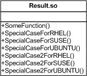

####带来的问题

  1. SomeFunction() 函数代码冗余，格式混乱。本例仅涉及三个预编译选项，但实际情况中由于 Linux 版本众多并且可能涉及操作系统位数的问题，增加对新系统的支持会导致预编译选项不断增多，造成 SomeFunction() 函数结构十分混乱。
  2. 新增其他平台相关接口（例如：增加 SpecialCase3ForRHEL()，SpecialCase3ForSUSE()，SpecialCase3ForUBUNTU），会成倍增加代码中预编译宏的数量。
  3. 破坏了接口平台无关性的原则。SpecialCaseForRHEL()，SpecialCaseForSUSE()，SpecialCaseForUBUNTU() 只是同一功能各个平台的不同实现，属于封装内容，不应该分开暴露给调用者。

可见，简单利用预编译宏来解决平台相关代码产生的问题不是一个好的方法，并没有解决本文开始提出的两个问题。后文将通过三个方案依次解决这些问题。


###解决方案 1：根据接口平台无关性原则进行优化

实质上，SpecialCaseForRHEL()，SpecialCaseForSUSE()，SpecialCaseForUBUNTU() 只是同一功能在不同平台上的实现，SpecialCase2ForRHEL()，SpecialCase2ForSUSE()，SpecialCase2ForUBUNTU()亦如此。对于调用者，应该遵循接口平台无关性的原则，使用统一的接口进行调用，这样才能简化代码，使代码易于维护。

######清单 2. 解决方案 1 示例代码如下：

    
    
     // Procedure.cpp 
     void SomeFunction() 
     { 
        //Common code for all linux 
        ...... 
        ...... 
        SpecialCase(); 
        //Common code for all linux 
        ...... 
        ...... 
        SpecialCase2(); 
        //Common code for all linux 
        ...... 
        ...... 
     } 
     
     void SpecialCase() 
     { 
        //Common code for all linux 
        ...... 
        ...... 
     #ifdef RHEL 
        SpecialCaseForRHEL(); 
     #endif 
     #ifdef SUSE 
        SpecialCaseForSUSE(); 
     #endif 
     #ifdef UBUNTU 
        SpecialCaseForUBUNTU(); 
     #endif 
        //Common code for all linux 
        ...... 
        ...... 
     } 
     
     void Special2Case() 
     { 
        //Common code for all linux 
        ...... 
        ...... 
     #ifdef RHEL 
        SpecialCase2ForRHEL(); 
     #endif 
     #ifdef SUSE 
        SpecialCase2ForSUSE(); 
     #endif 
     #ifdef UBUNTU 
        SpecialCase2ForUBUNTU(); 
     #endif 
        //Common code for all linux 
        ...... 
        ...... 
     }

####此方案的优点：

遵循了接口平台无关性原则，同样的功能只提供一个接口，每个平台的实现属于实现细节，封装在接口内部。此方案提供了一定的封装性，简化了调用者的操作。

####此方案的缺点：

预编译宏泛滥的问题仍然没有解决，每次新增功能函数，就会成倍增加预编译宏的数量。同样每次增加对已有功能新平台的支持，也会不断增加预编译宏的数量。

可见，此方案部分解决了本文开始提出的两个问题中的一个，但仍有问题需要继续解决。


###解决方案 2： 通过分层对进行优化

换一个角度来思考，可以在二进制层面对平台相关代码进行优化。通过对库的结构进行分层来优化，为每个 Linux平台提供单独的实现库，并且把调用端独立提取出来。如下图所示：

######图 2： 方案 2 的结构图

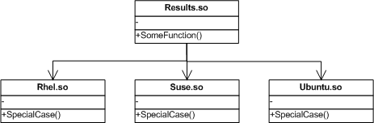

此方案单独将调用端抽象出来，将每个平台实现端的相关代码提取出来做成一个单独的库（Rhel.so，Suse.so，Ubuntu.so）。SpecialCase() 为同一功能在不同平台的实现，采用相同接口名。底层库需要与 Results.so 库同时发布，也就是说，Redhat 版本发布时需同时打包Results.so 和 Rhel.so，其他版本亦然。

####此方案的优点：

解决了预编译宏泛滥的问题，通过二进制分层可以将代码里的所有预编译选项去掉。遵循了接口平台无关性的原则。

可见，此方案很好地解决了本文开始提出的两个问题。

####此方案的缺点：

每次发布 Results.so的时候，底层库需要伴随一起发布，导致可执行包文件数量成倍增加。而且很多小程序，小工具的发布往往采取单独的二进制文件，不允许有底层库的存在。


###解决方案 3： 结合代理模式，桥接模式和单例模式进行优化

现在针对原始问题继续进行优化，摈弃方案 2 采用的分层手法，在单一库的范围内利用 C++ 多态特性和设计模式进行优化。

####目标效果：

  1. 源代码中尽可能减少预编译选项出现的频率，避免因功能扩展和平台支持的增加导致预编译宏数量爆炸。
  2. 完全遵循接口平台无关性的原则。

######清单 3. 解决方案 3 调用端示例代码如下：

    
    
     // Procedure.cpp 
     void SomeFunction() 
     { 
        //Common code for all linux 
        ...... 
        ...... 
        XXHost::instance()->SpecialCase1(); 
        //Common code for all linux 
        ...... 
     ...... 
     XXHost::instance()->SpecialCase2(); 
        //Common code for all linux 
        ...... 
     ...... 
     }

######图 3：方案 3 的具体实现类图

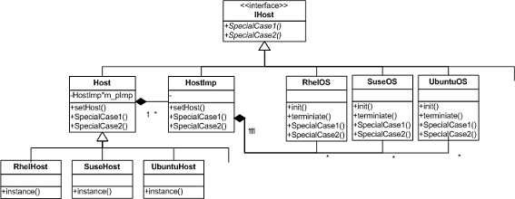

此方案结合改进的代理模式（Proxy），桥接模式（Bridge）和单件模式（Singleton），并利用 C++ 封装、继承和多态特性予以实现。

IHost 是顶层抽象接口类，声明了实现端需要实现的功能函数以及调用端需要调用的接口函数。

图 3 右半部分派生自 IHost 的各个类为实现端，在实现端，

为每个 Linux 系统单独实现了一个类，相互之间无关联性。该类实现了该操作系统平台相关的功能（SpecialCase1() 和SpecialCase2()），即实现了平台相关代码。每个实现类采取单件模式。

Init() 和 terminate() 用来初始化和清理操作。Init()函数首先创建自己（单件模式），其次创建左侧代理类（单件模式，见下段描述），最后将自己的内存地址通过 SetHost() 函数交给左侧代理方。

图 3 左半部分派生自 Host 的各个类为调用端，在调用端，

Host 类做了一层封装，RhelHost 等派生类为实际的代理者（调用者），每个 Host的派生类分别代表一种需求（调用方），是右侧实现类的一个代理，例如 RhelHost 是 RhelOS 的代理，SuseHost 是 SuseOS
的代理，UbuntuHost 是 UbuntuOS 的代理。每个 Host 的派生类采取单件模式。

Host 类和 HostImp 类之间采用桥接的设计模式，利用 C++ 多态特性，最后通过 HostImp 类调用实现端类的实现。调用端的调用过程如下：

  1. 通过 RhelHost 的指针调用 SpecialCase()，由于 RhelHost::SpecialCase() 没有覆盖基类虚函数的实现，实际调用的是 Host::SpecialCase()。
  2. Host 的所有调用被桥接到 HostImp 对应的函数。
  3. 由 HostImp 类调用确定的实现端的某一个对象的对应实现函数（HostImp 类的 SetHost() 函数记录了右侧类的对象内存地址）。 

######清单 4. 解决方案 3 框架主要源代码如下：

    
         // Host.h 
     class IHost 
     { 
     public: 
        virtual void SpecialCase1() = 0; 
        virtual void SpecialCase2() = 0; 
     }; 
     
     class Host : public IHost 
     { 
     public: 
        virtual ~Host() {}; 
        void setHost(IHost* pHost) 
        { 
            m_pImp->setHost(pHost); 
        } 
        virtual void SpecialCase1() 
        { 
            m_pImp->SpecialCase1(); 
        }; 
        virtual void SpecialCase2() 
        { 
            m_pImp->SpecialCase2(); 
        }; 
     protected: 
        Host(HostImp * pImp); 
     private: 
        HostImp* m_pImp; 
        friend class HostImp; 
     }; 
     
     class RhelHost : public Host 
     { 
     public: 
        static RhelHost* instance(); 
     private: 
        RhelHost(HostImp* pImp); 
     };
      
     RhelHost * RhelHost::instance() 
     { 
        static RhelHost * pThis = new RhelHost (new HostImp()); 
        return pThis; 
     } 
     
     RhelHost:: RhelHost (HostImp* pImp) 
     : Host(pImp) 
     { 
     } 
     
     class RhelOS : public IHost 
     { 
     public: 
        static void init() 
        { 
            static RhelOS me; 
            RhelHost::instance()->setHost(&me); 
        } 
        static void term() 
        { 
            RhelHost::instance()->setHost(NULL); 
        } 
     private: 
        virtual void SpecialCase1() 
        { 
            /* Real Operation */ 
        }; 
        virtual void SpecialCase2() 
        { 
            /* Real Operation */ 
        }; 
     }; 
     
     // HostImp.h 
     class HostImp : public IHost 
     { 
     private: 
        HostImp(const HostImp&); 
     public: 
        HostImp(); 
        virtual ~HostImp() {}; 
        void setHost(IHost* pHost) 
        { 
            m_pHost = pHost; 
        }; 
        virtual void SpecialCase1() 
        { 
            if(m_pHost != NULL) 
                m_pHost->SpecialCase1() 
        } 
        virtual void SpecialCase2() 
        { 
            if(m_pHost != NULL) 
                m_pHost->SpecialCase2() 
        } 
     private: 
        IHost* m_pHost; 
     };

####此方案的优点：

  1. 遵循接口平台无关性原则。此方案将各平台通用接口提升到最高的抽象层，易于理解和修改。
  2. 最大限度地降低预编译选项在源代码中的使用，实际上，本例中只需要在一处使用预编译宏，示例代码如下： 

```   
 void Init() 
 { 
 #ifdef RHEL 
    RhelOS::init(); 
 #endif 
 #ifdef SUSE 
    SuseOS::init(); 
 #endif 
 #ifdef UBUNTU 
    UbuntuOS::init(); 
 #endif 
 }
```

源代码其他地方不需要添加预编译宏。

  3. 实现端和调用端都通过类的形式进行封装，而且实现端类和调用端类都可以自己单独扩展，完成一些各自需要完成的任务，所要保持一致的只是接口层函数。扩展性和封装性很好。

由此可见，此方案很好地解决了本文开始提出的两个问题，而且代码结构清晰，可维护型好。

接下来对上述源代码继续进行优化。上例 SuseHost/UbuntuHost/SUSEOS/UBUNTUOS 等类的实现被略去，实际上这些类的实现与
RhelHost 和 RHELOS 相似，可以利用宏来进一步优化框架代码结构。

######清单 5. 解决方案 3 框架主要源代码优化：

    
     #define HOST_DECLARE(name) \ 
     class ##nameHost : public Host \ 
     { \ 
     public: \ 
        static ##nameHost* instance(); \ 
     private: \ 
        ##nameHost(HostImp* pImp); \ 
     }; 
     
     #define HOST_DEFINE(name) \ 
     ##nameHost* ##nameHost::instance() \ 
     { \ 
        static ##nameHost* pThis = new ##nameHost(new HostImp()); \ 
        return pThis; \ 
     } \ 
     ##nameHost::##nameHost(HostImp* pImp) \ 
     : Host(pImp) \ 
     { \ 
     } 
     
     #define HOST_IMPLEMENTATION(name) \ 
     class ##name##OS : public IHost \ 
     { \ 
     public: \ 
        static void init() \ 
        { \ 
            static ##name##OS me; \ 
            ##nameHost::instance()->setHost(&me); \ 
        } \ 
        static void term() \ 
        { \ 
            ##nameHost::instance()->setHost(NULL); \ 
        } \ 
     private: \ 
     virtual void SpecialCase1(); \ 
        virtual void SpecialCase2(); \ 
     };

使用三个宏来处理相似代码。至此，优化完成。从源代码角度来分析，作为实现端的开发人员，只需要三步就可以完成操作：

  1. 调用 init() 函数；
  2. 使用 #define HOST_IMPLEMENTATION(name)； 

例如：#define HOST_IMPLEMENTATION(DEBIAN)

  3. 实现 DEBIAN::SpecialCase1() 和 DEBIAN::SpecialCase2()。 

作为调用端的开发人员，也只需要三步就可以完成操作：

  4. 使用 #define HOST_DECLARE(name) 进行声明； 

例如 : #define HOST_DECLARE(DEBIAN)

  5. 使用 #define HOST_DEFINE(name) 进行定义； 

例如： #define HOST_DEFINE (DEBIAN)

  6. 调用接口。 

例如： DEBIANHost::instance()->SpecialCase1();

DEBIANHost::instance()->SpecialCase2();

可见，优化后方案的代码清晰，不失为一个良好的平台相关代码的解决方案。

由于调用端和实现端往往需要传递参数，可以通过 SpecialCase1()函数的参数来传递参数，同样的这个参数类可以通过桥接的方式予以实现，本文不再详述，读者可以自己尝试。


###对方案 3 的扩展

####扩展 1：对单一操作系统多对多的扩展

对于方案 3 的实现，也许有读者会问，调用端只需要 Host 类不需要其派生类即可完成方案 3 中的功能，的确如此，因为方案 3中的代理类一直是一对一的关系，即 RhelHost 代理 RhelOS，Redhat下只存在这一对一的关系。但是实际情况下，单一系统下很可能存在多对多的关系。

例如，在单一操作系统中，可能需要同时实现多种风格的窗口。实际上，变成了多对多的代理关系。

######图 4：单一操作系统不同 c 风格窗口的实现类图

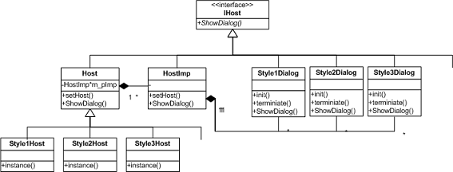

Style1Host 代理 Style1Dialog，Style2Host 代理 Style2Dialog，Style3Host 代理Style3Dialog，三个窗口同时并存，也就是说左侧三个实现类的实例和右侧三个代理类的实例同时存在。可见，方案 3的设计模式扩展性良好，实现端和调用端都可以在遵循接口不变性的情况下单独扩展自己的功能。

####扩展 2：对多操作系统的扩展

方案 3 不仅可以针对 Linux 平台相关代码进行处理，还可以扩展到其他诸多场合。例如，现在的程序库往往需要针对多个操作系统，包括 Windows,Linux, Mac。每个操作系统往往使用不同的 GUI 库，这样在实现窗口操作的时候必然涉及到平台相关代码。同样可以用方案 3 予以实现。

######图 5：多操作系统的实现类图

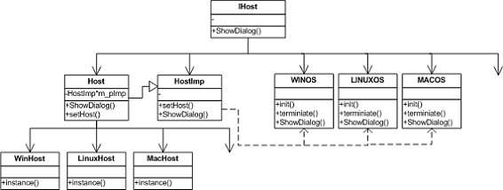

###总结

本文开始提出平台相关代码造成的两个问题，接着循序渐进提出解决方案。在分析了常用的设置预编译选项方法的利弊的基础上，提出了一种新的利用 C++多态特性，结合使用代理模式，桥接模式和单件模式处理平台相关代码的方案，并对这一方案予以扩展，给读者提供了一种新的高效的处理平台相关代码的方法。

###参考资料

####学习

  * 请参考《设计模式 – 可复用面向对象软件的基础》，机械工业出版社。 
  * 在 [ developerWorks Linux 专区](http://www.ibm.com/developerworks/cn/linux/) 寻找为 Linux 开发人员（包括 [Linux 新手入门](http://www.ibm.com/developerworks/cn/linux/newto/)）准备的更多参考资料，查阅我们 [最受欢迎的文章和教程](http://www.ibm.com/developerworks/cn/linux/best2009/index.html)。 
  * 在 developerWorks 上查阅所有 [ Linux 技巧](http://www.ibm.com/developerworks/cn/views/linux/libraryview.jsp?search_by=Linux+%E6%8A%80%E5%B7%A7) 和 [ Linux 教程](http://www.ibm.com/developerworks/cn/views/linux/libraryview.jsp?type_by=%E6%95%99%E7%A8%8B)。 
  * 随时关注 developerWorks [技术活动](http://www.ibm.com/developerworks/cn/offers/techbriefings/)和[网络广播](http://www.ibm.com/developerworks/cn/swi/)。 


<hr>


####<p>原文出处：<a href='http://www.ibm.com/developerworks/cn/linux/l-cn-linklib/index.html' target='blank'>Linux 动态库与静态库制作及使用详解</a></p>

##技巧：Linux 动态库与静态库制作及使用详解

_标准库的三种连接方式及静态库制作与使用方法_

Linux 应用开发通常要考虑三个问题，即：1）在 Linux 应用程序开发过程中遇到过标准库链接在不同 Linux 版本下不兼容的问题； 2）在Linux 静态库的制作过程中发现有别于 Windows 下静态库的制作方法；3）在 Linux应用程序链接第三方库或者其他静态库的时候发现链接顺序的烦人问题。本文就这三个问题针对 Linux 下标准库链接和如何巧妙构建 achrive(*.a)展开相关介绍。


###两个要知道的基本知识

Linux 应用程序因为 Linux 版本的众多与各自独立性，在工程制作与使用中必须熟练掌握如下两点才能有效地工作和理想地运行。

  1. Linux 下标准库链接的三种方式（全静态 , 半静态 (libgcc,libstdc++), 全动态）及其各自利弊。
  2. Linux 下如何巧妙构建 achrive(*.a)，并且如何设置链接选项来解决 gcc 比较特别的链接库的顺序问题。

###三种标准库链接方式选项及对比

为了演示三种不同的标准库链接方式对最终应用程序产生的区别， 这里用了一个经典的示例应用程序 HelloWorld 做演示，见 清单 1
HelloWorld。 整个工程可以在文章末尾下载。

######清单 1. HelloWorld

    
    
     #include <stdio.h> 
     #include <iostream> 
     
     using std::cout; 
     using std::endl; 
     
     int main(int argc, char* argv[]) 
     { 
      printf("HelloWorld!(Printed by printf)\n"); 
      cout<<"HelloWorld!(Printed by cout)"<<endl; 
      return 0; 
     }

三种标准库链接方式的选项及区别见 表

######表 1. 三种标准库链接方式的选项及区别

|标准库连接方式 | 示例连接选项 |优点 | 缺点 |
|-------------|-------------|-------------|-------------|-------------|
| 全静态 | -static -pthread -lrt -ldl | 不会发生应用程序在 不同 Linux 版本下的标准库不兼容问题。| 生成的文件比较大，应用程序功能受限（不能调用动态库等）|
| 全动态 | -pthread -lrt -ldl | 生成文件是三者中最小的 | 比较容易发生应用程序在不同 Linux 版本下标准库依赖不兼容问题。 |
| 半静态 (libgcc,libstdc++) | -static-libgcc -L. -pthread -lrt -ldl | 灵活度大，能够针对不同的标准库采取不同的链接策略，从而避免不兼容问题发生。结合了全静态与全动态两种链接方式的优点。| 比较难识别哪些库容易发生不兼容问题，目前只有依靠经验积累。某些功能会因选择的标准库版本而丧失。|

上述三种标准库链接方式中，比较特殊的是 **半静态**链接方式，主要在于其还需要在链接前增加额外的一个步骤：  ln -s `g++ -print-file-name=libstdc++.a`，作用是将 libstdc++.a（libstdc++
的静态库）符号链接到本地工程链接目录。  -print-file-name 在 gcc 中的解释如下： 

-print-file-name=<lib> Display the full path to library <lib>

为了区分三种不同的标准库链接方式对最终生成的可执行文件的影响，本文从两个不同的维度进行分析比较：

####维度一：最终生成的可执行文件对标准库的依赖方式（使用 ldd 命令进行分析）

ldd 简介：该命令用于打印出某个应用程序或者动态库所依赖的动态库  
涉及语法：ldd [OPTION]... FILE...  
其他详细说明请参阅 man 说明。

三种标准库链接方式最终产生的应用程序的可执行文件对于标准库的依赖方式具体差异见 图 1、图 2、图 3所示：

######图 1. 全静态标准库链接方式

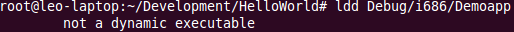

######图 2. 全动态标准库链接方式

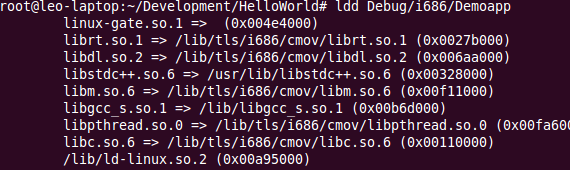

######图 3. 半静态（libgcc,libstdc++) 标准库链接方式

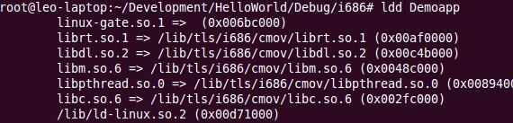

  
通过上述三图，可以清楚的看到，当用 **全静态标准库的链接方式**时，所生成的可执行文件最终不依赖任何的动态标准库，  而 **全动态标准库的链接方式**会导致最终应用程序可执行文件依赖于所有用到的标准动态库。  区别于上述两种方式的 **半静态链接方式**则有针对性的将 libgcc 和 libstdc++ 两个标准库非动态链接。  
（对比 图 2与 图 3，可见在 图 3中这两个标准库的动态依赖不见了）

从实际应用当中发现，最理想的标准库链接方式就是半静态链接，通常会选择将 libgcc 与 libstdc++ 这两个标准库静态链接，  
从而避免应用程序在不同 Linux 版本间标准库依赖不兼容的问题发生。

####维度二 : 最终生成的可执行文件大小（使用 size 命令进行分析）

size 简介：该命令用于显示出可执行文件的大小  
涉及语法：size objfile...  
其他详细说明请参阅 man 说明。

三种标准库链接方式最终产生的应用程序的可执行文件的大小具体差异见 图 4、图 5、图 6所示：

######图 4. 全静态标准库链接方式

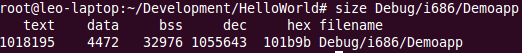

######图 5. 全动态标准库链接方式

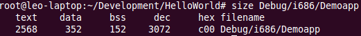

######图 6. 半静态（libgcc,libstdc++) 标准库链接方式

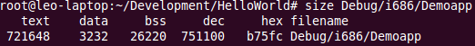

  
通过上述三图可以看出，最终可执行文件的大小随最终所依赖的标准动态库的数量增加而减小。  
从实际应用当中发现，最理想的是 **半静态链接方式**，因为该方式能够在避免应用程序于  
不同 Linux 版本间标准库依赖不兼容的问题发生的同时，使最终生成的可执行文件大小最小化。

####示例链接选项中所涉及命令（引用 GCC 原文）：

-llibrary  
-l library：指定所需要的额外库   
-Ldir：指定库搜索路径   
-static：静态链接所有库   
-static-libgcc：静态链接 gcc 库   
-static-libstdc++：静态链接 c++ 库   
关于上述命令的详细说明，请参阅 GCC 技术手册


###Linux 下静态库（archive）的制作方式：

####涉及命令：ar

ar 简介：处理创建、修改、提取静态库的操作  
  
涉及选项：  
t - 显示静态库的内容  
r[ab][f][u] - 更新或增加新文件到静态库中  
[s] - 创建文档索引  
ar -M [<mri-script] - 使用 ar 脚本处理  
其他详细说明请参阅 man 说明。

####示例情景：

假设现有如 图 7所示两个库文件

######图 7. 示例静态库文件

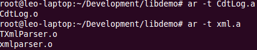

从 图 7中可以得知，CdtLog.a 只包含 CdtLog.o 一个对象文件 , 而 xml.a 包含 TXmlParser.o 和
xmlparser.o 两个对象文件  
现将 CdtLog.o 提取出来，然后通过 图 8方式创建一个新的静态库 demo.a，可以看出，demo.a 包含的是 CdtLog.o 以及
xml.a，  
而不是我们所预期的 CdtLog.o,TXmlParser.o 和 xmlparser.o。这正是区别于 Windows 下静态库的制作。

######图 8. 示例静态库制作方式 1

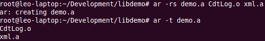

这样的 demo.a 当被链接入某个工程时，所有在 TXmlParser.o 和 xmlparser.o 定义的符号都不会被发现，从而会导致链接错误，提示无法找到对应的符号。显然，通过图 8 方式创建 Linux 静态库是不正确的。

正确的方式有两种：

  1. 将所有静态库中包含的对象文件提取出来然后重新打包成新的静态库文件。
  2. 用一种更加灵活的方式创建新的静态库文件：**ar 脚本**。

显然，方式 1 是比较麻烦的，因为涉及到太多的文件处理，可能还要通过不断创建临时目录用于保存中间文件。  推荐使用如 清单 2 createlib.sh所示的 **ar 脚本**方式进行创建：

######清单 2 createlib.sh

    
    
     rm demo.a 
     rm ar.mac 
     echo CREATE demo.a > ar.mac 
     echo SAVE >> ar.mac 
     echo END >> ar.mac 
     ar -M < ar.mac 
     ar -q demo.a CdtLog.o 
     echo OPEN demo.a > ar.mac 
     echo ADDLIB xml.a >> ar.mac 
     echo SAVE >> ar.mac 
     echo END >> ar.mac 
     ar -M < ar.mac 
     rm ar.mac

如果想在 Linux makefile 中使用 **ar 脚本**方式进行静态库的创建，可以编写如 清单 3 BUILD_LIBRARY所示的代码：

######清单 3 BUILD_LIBRARY

    
    
     define BUILD_LIBRARY 
     $(if $(wildcard $@),@$(RM) $@) 
     $(if $(wildcard ar.mac),@$(RM) ar.mac) 
     $(if $(filter %.a, $^), 
     @echo CREATE $@ > ar.mac 
     @echo SAVE >> ar.mac 
     @echo END >> ar.mac 
     @$(AR) -M < ar.mac 
     ) 
     $(if $(filter %.o,$^),@$(AR) -q $@ $(filter %.o, $^)) 
     $(if $(filter %.a, $^), 
     @echo OPEN $@ > ar.mac 
     $(foreach LIB, $(filter %.a, $^), 
     @echo ADDLIB $(LIB) >> ar.mac 
     ) 
     @echo SAVE >> ar.mac 
     @echo END >> ar.mac 
     @$(AR) -M < ar.mac 
     @$(RM) ar.mac 
     ) 
     endef 
     $(TargetDir)/$(TargetFileName):$(OBJS) 
        $(BUILD_LIBRARY)

通过 图 9，我们可以看到，用这种方式产生的 demo.a 才是我们想要的结果。

######图 9. 巧妙创建的静态库文件结果

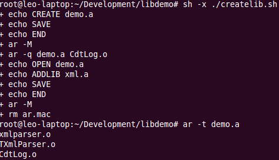


###Linux 静态库链接顺序问题及解决方法：

正如 GCC 手册中提到的那样：  

It makes a difference where in the command you write this option; the linker  
searches and processes libraries and object files in the order they are
specified.  
Thus, ‘ foo.o -lz bar.o ’ searches library ‘ z ’ after file ‘ foo.o ’ but
before  
‘ bar.o ’ . If ‘ bar.o ’ refers to functions in ‘ z ’ , those functions may
not be loaded.

为了解决这种库链接顺序问题，我们需要增加一些链接选项 :  
  
$(CXX) $(LINKFLAGS) $(OBJS) -Xlinker "-(" $(LIBS) -Xlinker "-)" -o $@  
  
通过将所有需要被链接的静态库放入 -Xlinker "-(" 与 -Xlinker "-)" 之间，可以是 g++ 链接过程中，
自动循环链接所有静态库，从而解决了原本的链接顺序问题。

####涉及链接选项：-Xlinker

-Xlinker option  
Pass option as an option to the linker. You can use this to supply system-
specific  
linker options which GCC does not know how to recognize.


###小结

本文介绍了 Linux 下三种标准库链接的方式及各自利弊，同时还介绍了 Linux 下静态库的制作及使用方法，相信能够给 大多数需要部署 Linux应用程序和编写 Linux Makefile 的工程师提供有用的帮助。


###下载

描述名字大小

本文用到的 HelloWorld 代码示例

[HelloWorld.zip](http://www.ibm.com/developerworks/apps/download/index.jsp?contentid=769215&filename=HelloWorld.zip&method=http&locale=zh_CN)

2.49KB

参考的 GCC PDF 文档

[gcc.pdf](http://www.ibm.com/developerworks/cn/linux/l-cn-linklib/gcc.pdf)

2.88MB

###参考资料

####学习

  * 有关 ar, 请参考： [linux ar 打包库到另一个库中](http://hi.baidu.com/mgqw/blog/item/2137d33d90c682e53c6d974f.html)。
  * 有关静态链接，请参考：[Linking libstdc++ statically](http://www.trilithium.com/johan/2005/06/static-libstdc/)。
  * 在 [ developerWorks Linux 专区](http://www.ibm.com/developerworks/cn/linux/) 寻找为 Linux 开发人员（包括 [Linux 新手入门](http://www.ibm.com/developerworks/cn/linux/newto/)）准备的更多参考资料，查阅我们 [最受欢迎的文章和教程](http://www.ibm.com/developerworks/cn/linux/best2009/index.html)。 
  * 在 developerWorks 上查阅所有 [ Linux 技巧](http://www.ibm.com/developerworks/cn/views/linux/libraryview.jsp?search_by=Linux+%E6%8A%80%E5%B7%A7) 和 [ Linux 教程](http://www.ibm.com/developerworks/cn/views/linux/libraryview.jsp?type_by=%E6%95%99%E7%A8%8B)。 
  * 随时关注 developerWorks [技术活动](http://www.ibm.com/developerworks/cn/offers/techbriefings/)和[网络广播](http://www.ibm.com/developerworks/cn/swi/)。 

