<!--BEGIN_DATA
{
    "create_date": "2021-11-16 18:00", 
    "modify_date": "2021-11-16 18:00", 
    "is_top": "0", 
    "summary": "Linux网络编程", 
    "tags": "Linux", 
    "file_name": "Linux网络编程.md"
}
END_DATA-->

#### <p>原文出处：<a href='https://mp.weixin.qq.com/s/ll9sz0MeBp0UlGzhVccs7w' target='blank'>Linux网络编程</a></p>

## 主机字节序和网络字节序：

在32位机器上，累加器一次能装载4个字节，这四个字节在内存中**排列顺序**将影响它被累加器装载成的整数的值

**大端字节序（网络字节序）：一个整数的高位字节存储在内存的低地址处**

**小端字节序（现代PC大多数采用）：整数的高位字节存储在内存的高地址处**

即使是同一台机器上不同语言编写的程序通信，也要考虑**字节序**的问题

Linux下字节序转换函数：

```c
#include<netinet/in.h>

unsigned long int htol (unsigned long int hostlong); //主机字节序转换成网络字节序  
unsigned short int htons (unsigned short int hostshort);//主机字节序转换成网络字节序  
unsigned long int ntohl (unsigned long int netlong);//网络字节序转换成主机字节序  
unsigned short int ntohs (unsigned short int netshort);//网络字节序转换成主机字节序  
```

**socket地址**
    
```c
#include<bits/sockets.h>  

struct sockaddr{  
      sa_family_t sa_family; //地址族类型的变量与协议族对应   
      char sa_data[14]; //存放socket地址值  
}  
```

协议族地址族描述地址值含义和长度

<table><thead><tr style="border-width: 1px 0px 0px;border-right-style: initial;border-bottom-style: initial;border-left-style: initial;border-right-color: initial;border-bottom-color: initial;border-left-color: initial;border-top-style: solid;border-top-color: rgb(204, 204, 204);background-color: white;"><th style="border-top-width: 1px;border-color: rgb(245, 203, 174);background-color: rgb(235, 114, 80);text-align: left;color: rgb(248, 248, 248);min-width: 85px;">协议族</th><th style="border-top-width: 1px;border-color: rgb(245, 203, 174);background-color: rgb(235, 114, 80);text-align: left;color: rgb(248, 248, 248);min-width: 85px;">地址族</th><th style="border-top-width: 1px;border-color: rgb(245, 203, 174);background-color: rgb(235, 114, 80);text-align: left;color: rgb(248, 248, 248);min-width: 85px;">描述</th><th style="border-top-width: 1px;border-color: rgb(245, 203, 174);background-color: rgb(235, 114, 80);text-align: left;color: rgb(248, 248, 248);min-width: 85px;">地址值含义和长度</th></tr></thead><tbody style="border-width: 0px;border-style: initial;border-color: initial;"><tr style="border-width: 1px 0px 0px;border-right-style: initial;border-bottom-style: initial;border-left-style: initial;border-right-color: initial;border-bottom-color: initial;border-left-color: initial;border-top-style: solid;border-top-color: rgb(204, 204, 204);background-color: white;"><td style="border-color: rgb(245, 203, 174);min-width: 85px;">PF_UNIX</td><td style="border-color: rgb(245, 203, 174);min-width: 85px;">AF_UNIX</td><td style="border-color: rgb(245, 203, 174);min-width: 85px;">UNIX本地域协议族</td><td style="border-color: rgb(245, 203, 174);min-width: 85px;">文件的路径名,长度可达108字节</td></tr><tr style="border-width: 1px 0px 0px;border-right-style: initial;border-bottom-style: initial;border-left-style: initial;border-right-color: initial;border-bottom-color: initial;border-left-color: initial;border-top-style: solid;border-top-color: rgb(204, 204, 204);background-color: rgb(248, 222, 203);"><td style="border-color: rgb(245, 203, 174);min-width: 85px;">PF_INET</td><td style="border-color: rgb(245, 203, 174);min-width: 85px;">AF_INET</td><td style="border-color: rgb(245, 203, 174);min-width: 85px;">TCP/IPv4协议族</td><td style="border-color: rgb(245, 203, 174);min-width: 85px;">16bit端口号和32bit IPv4地址，6字节</td></tr><tr style="border-width: 1px 0px 0px;border-right-style: initial;border-bottom-style: initial;border-left-style: initial;border-right-color: initial;border-bottom-color: initial;border-left-color: initial;border-top-style: solid;border-top-color: rgb(204, 204, 204);background-color: white;"><td style="border-color: rgb(245, 203, 174);min-width: 85px;">PF_INET6</td><td style="border-color: rgb(245, 203, 174);min-width: 85px;">AF_INET6</td><td style="border-color: rgb(245, 203, 174);min-width: 85px;">TCP/IPv6协议族</td><td style="border-color: rgb(245, 203, 174);min-width: 85px;">16bit端口号，32bit流标识，128bit IPv6地址，32bit范围ID，共26字节</td></tr></tbody></table>

**为了容纳多数协议族地址值，Linux重新定义了socket地址结构体**
    
```c
#include<bits/socket.h>

struct sockaddr_storage{  
    sa_family_t sa_family;  
    unsigned long int __ss_align; //是内存对齐的  
    char __ss_padding[128-sizeof(__ss_align)];  
}  
```

Linux为TCP/IP协议族有`sockaddr_in`和`sockaddr_in6`两个专用socket地址结构体，它们分别用于IPv4和IPv6


```c
//对于IPv4的：  
struct sockaddr_in{  
      sa_family sin_family; //地址族：AF_INET  
      u_int16_t sin_port;  //端口号，要用网络字节序表示  
      struct in_addr sin_addr;//IPv4地址结构体  
}  
//IPv4的结构体  
struct in_addr  
{  
      u_int32_t s_addr; //要用网络字节序表示  
} 

//对于IPv6  
struct sockaddr_in6{  
      sa_family_t sin6_family;//AF_INET6  
      u_int16_t sin6_port; //端口号，要用网络字节序表示  
      u_int32_t sin6_flowinfo;//流信息，应设置为0  
      struct in6_addr sin6_addr;//IPv6地址结构体  
      u_int32_t sin6_scope_id;//scope ID,处于试验阶段  
}  

//IPv6的结构体  
struct in6_addr  
{  
      unsigned char sa_addr[16]; //要用网络字节序表示  
}  
```

**使用的时候要强制转换成通用的socket地址类型socketaddr**

**点分十进制字符串**表示的IPv4地址和**网络字节序整数**表示的IPv4地址**转换**
    
```c
#incldue<arpa/inet.h> 

in_addr_t inet_addr(const char* strptr);   //点分十进制--->网络字节序整数 ，失败返回INADDR_NONE  
int inet_aton (const char* cp,struct in_addr* inp);//功能同上，结果存储于参数inp指向的地址结构中，成功返回1，失败返回0  
char* inet_ntoa (struct in_addr in); //网络字节序整数--->点分十进制，函数内部用静态变量存储转化结果，返回值指向该变量，inet_ntoa是不可重入的  
```

```c
//功能同上,可用于IPv6  
#include<arpa/inet.h>  

int inet_pton(int af,const char* src,void* dst);//把结果存放在dst所指内存中，其中af代表协议族----成功返回1，失败返回0并且设置error  
const char* inet_ntop(int af,const void* src,char* dst,socklen_t cnt);//同理  
```

```c
//下面两个宏可帮助我们指定cnt的大小  
#include<netinet/in.h>  
#define INET_ADDRSTRLEN 16  
#define INET6_ADDRSTRLEN 46  
```

## 创建socket

**Linux上所有东西都是文件**
    
```c
#include<sys/types.h>  
#include<sys/socket.h>

int socket (int domain,int type ,int protocol);//domain参数代表底层协议族（IPv4使用PF_INET）、Type参数指定服务类型分为SOCK_STREAM服务(流服务器--使用TCP协议)和SOCK_DGRAM服务(数据报服务--使用UDP协议)、protocol参数是在前两个参数构成的协议集合下，再选择一个具体的协议（几乎所有情况下它设置0，表示使用默认协议）  
```

**socket系统调用成功时返回一个socket文件描述符，失败则返回-1并设置errno**

## 命名socket

  1. 创建了socket，并且指定了地址族，但是并没有指定使用地址族中具体socket地址

  2. 将一个socket与socket地址绑定称为给socket命名

  3. 客户端通常不需要命名socket,而是采用匿名方式，即使用操作系统自动分配的socket地址

```c
#include<sys/types.h>  
#include<sys/socket.h>

int bind (int sockfd,const struct sockaddr* my_addr,socklen_t addrlen)//bind将my_addr所指的socket地址分配给未命名的sockfd文件描述符，addrlen参数指出该socket地址的长度，bind成功返回0，失败返回-1并设置errno  
```

**两种常见的errno是EACCES和EADDRINUSE**

  1. EACCCES：被绑定的地址是受保护的地址，仅超级用户能访问。
  2. EADDRINUSE: 被绑定的地址正在使用中（例如将socket绑定到一个处于`TIME_WAIT`状态的socket地址）

## 监听socket

命名后，还不能马上接受客户连接，我们需要使用如下系统调用来创建一个监听队列以存放待处理的客户连接


```c
#include<sys/socket.h>

int listen (int sockfd,int backlog);//sockfd参数指定被监听的socket,backlog参数提示内核监听队列的最大长度，监听队列的长度如果超过backlog，服务器将不再受理新的客户连接，客户端也将收到ECONNREFUSED错误信息  
```

内核版本2.2之前 ：**backlog参数是指多有处于半连接的状态（`SYN_RCVD`）和完全连接状态(ESTABLISHED)的socket的上限**

内核版本2.2之后：**它只表示处于完全连接状态的socket的上线，处于半连接状态的socket上限，则是在`tcp_max_syn_backlog`内核参数
定义。**

**backlog参数的典型值是5，listen成功时返回0，失败则返回-1并设置errno**

## 接受连接

```c
#include<sys/types.h>  
#include<sys/socket.h> 

int accept(int sockfd , struct sockaddr *addr,socklen_t *addrlen);//sockfd参数是执行过listen系统调用的监听socket。addr参数用来获取被接受连接的远端socket地址，该socket地址的长度由addrlen参数指出。accept成功时返回一个新的连接socket,该socket唯一标识了被接受的这个连接，服务器可通过读写该socket来与被接受连接对应的客户端通信。失败时返回-1，并设置了errno。  
```

## 发起连接

```c
#include<sys/types.h>  
#include<sys/socket.h>

int connect(int sockfd, const struct sockaddr *serv_adr,socklen_t addrlen);//sockfd参数是socket系统调用返回一个socket,serv_addr参数是服务器监听的socket地址，addrlen参数则是指定  
```

**connect成功时返回0，一旦成功建立连接，sockfd就唯一的标识了这个连接，客户端就可以通过读写sockfd来与服务器通信。失败返回-1并设置errno**

**ECONNREFUSED: 目标端口不存在，连接被拒绝****ETIMEDOUT: 连接超时**

## 关闭连接

```c
#include<unistd.h>

int close(int fd); //fd参数是待关闭的socket，不过并不是立即关闭连接，而是将fd的引用计数减一，当为0时，才真正关闭连接  
```

**多进程程序中，一次系统调用将默认使父进程中打开的socket的引用计数加1，因此我们必须在父进程和子进程中都对该socket执行close调用才能将连接关闭**

**如果无论如何都要立即终止连接，可以使用shutdown系统调用**
    
```c
#include<sys/socket.h>

int shutdown (int sockfd,int howto);//sockfd参数是待关闭的socket,howto参数决定了shutdown的行为  
```

<table><thead><tr style="border-width: 1px 0px 0px;border-right-style: initial;border-bottom-style: initial;border-left-style: initial;border-right-color: initial;border-bottom-color: initial;border-left-color: initial;border-top-style: solid;border-top-color: rgb(204, 204, 204);background-color: white;"><th style="border-top-width: 1px;border-color: rgb(245, 203, 174);background-color: rgb(235, 114, 80);text-align: left;color: rgb(248, 248, 248);min-width: 85px;">可选值</th><th style="border-top-width: 1px;border-color: rgb(245, 203, 174);background-color: rgb(235, 114, 80);text-align: left;color: rgb(248, 248, 248);min-width: 85px;">含义</th></tr></thead><tbody style="border-width: 0px;border-style: initial;border-color: initial;"><tr style="border-width: 1px 0px 0px;border-right-style: initial;border-bottom-style: initial;border-left-style: initial;border-right-color: initial;border-bottom-color: initial;border-left-color: initial;border-top-style: solid;border-top-color: rgb(204, 204, 204);background-color: white;"><td style="border-color: rgb(245, 203, 174);min-width: 85px;">SHUT_RD</td><td style="border-color: rgb(245, 203, 174);min-width: 85px;"><strong style="color: rgb(37, 132, 181);">关闭sockfd上读的这一半。应用程序不再针对socket文件描述符执行读操作，并且该socket接收缓冲区中的数据都被丢弃</strong></td></tr><tr style="border-width: 1px 0px 0px;border-right-style: initial;border-bottom-style: initial;border-left-style: initial;border-right-color: initial;border-bottom-color: initial;border-left-color: initial;border-top-style: solid;border-top-color: rgb(204, 204, 204);background-color: rgb(248, 222, 203);"><td style="border-color: rgb(245, 203, 174);min-width: 85px;">SHUT_WR</td><td style="border-color: rgb(245, 203, 174);min-width: 85px;"><strong style="color: rgb(37, 132, 181);">关闭sockfd上写的这一半。sockfd的发送缓冲区中的数据会真正关闭连接之前全部发送出去，应用程序不可再对该sockfd文件描述符执行写操作。这种情况下，连接处于半连接状态</strong></td></tr><tr style="border-width: 1px 0px 0px;border-right-style: initial;border-bottom-style: initial;border-left-style: initial;border-right-color: initial;border-bottom-color: initial;border-left-color: initial;border-top-style: solid;border-top-color: rgb(204, 204, 204);background-color: white;"><td style="border-color: rgb(245, 203, 174);min-width: 85px;">SHUT_RDWR</td><td style="border-color: rgb(245, 203, 174);min-width: 85px;"><strong style="color: rgb(37, 132, 181);">同时关闭sockfd上读和写</strong></td></tr></tbody></table>

**shutdown能够分别关闭sockfd上的读和写，或者都关闭。而close在关闭连接时只能将sockfd上的读和写同时关闭**

**shutdown成功时返回0，失败则返回-1并设置errno**

## 数据读写

### tcp 数据读写


```c
#include<sys/types.h>  
#include<sys/socket.h>

ssize_t recv (int sockfd , void *buf ,size_t len ,int flags); //recv读取sockfd上的数据，buf和len参数分别指定读缓冲区的位置和大小，flags参数的含义见后文，通常设置为0即可。 成功返回实际读取到的数据的长度，它可能小于我们期望的长度len。因此我们可能要多次调用。 返回0，这意味着通信对方已经关闭连接了，出错时返回-1，并设置errno。  
ssize_t send (int sockfd , const void *buf ,size_t len,int flags);//send往sockfd上写入数据，buf和len依然是缓存区的位置和大小。send成功时返回实际写入的长度，失败则返回-1，并设置errno。  
```

`flags`**参数提供额外的控制**

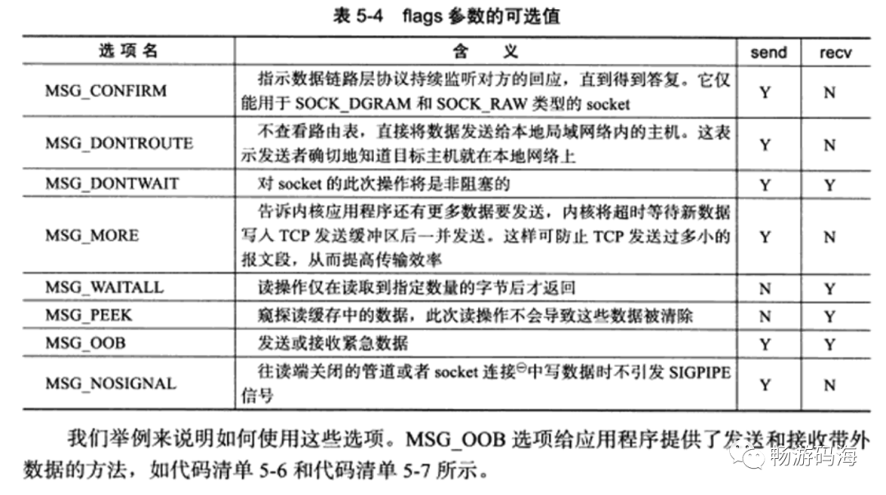flags参数值

### UDP数据读写

```c
#include<sys/types.h>  
#include<sys/socket.h>

ssize_t recvfrom (int sockfd ,void* buf , size_t len, int flags , struct sockaddr* src_addr ,socklen_t* addrlen);//recvfrom读取sockfd上的数据，buf和len参数分别指定读缓冲区的位置和大小，因为UDP通信没有连接的概念，所以我们每次读取数据都需要获取发送端的socket地址，即参数src_addr所指的内容，addrlen参数则指定该地址的长度  
ssize_t sendto (int sockfd , const void* buf ,size_t len,int flags ,const struct sockaddr* dest_addr, socklen_t addrlen );// sendto往sockfd上写入数据，buf和len参数分别指定写缓冲区的位置和大小。dest_addr参数指定接收端的socket地址，addrlen参数则指定该地址的额长度  
//flag含义同上  
```

**这两个也可用于面向连接的socket的数据读写，只需要把最后两个参数都设置为NULL以忽略发送端/接收端的socket地址（已经建立连接了，就知道socket地址了）**

## 通用数据读写的函数

```c
#include<sys/socket.h> 

ssize_t recvmsg (int sockfd, struct msghdr* msg ,int flags);  
ssize_t sendmsg (int sockfd ,struct msghdr* msg,int flags);  

//msghdr结构体  
struct msghdr  
{  
  void* msg_name; //socket地址   对于TCP连接这个没有，因为地址已经知道了  
  socklen_t msg_namelen;//socket地址的长度  
  struct iovec* msg_lov;//分散的内存块 //封装了位置和大小  //数组  
  int msg_iovlen;//分散的内存块数量  
  void* msg_control;//指向辅助数据的起始位置  
  socllen_t msg_controllen;//辅助数据的大小  
  int msg_flags;//赋值函数中的flags参数，并在调用过程中更新  
}  

struct iovec{  
  void *iov_base; //内存起始地址  
  size_t iov_len;  //内存块的长度  
}  
```

**对于recvmsg来说，数据将被读取并存放在`msg_iovlen`块分散的内存中，这些内存的位置和长度则由`msg_iov`指向的数组指定，这称为分散读；对于sendmsg而言，`msg_iovlen`块分散内存中的数据将被一并发送，这称为集中写**

### 带外标记

```c
#include<sys/socket.h>

int sockatmark (int sockfd);//判断sockfd是否处于带外标记，即下一个被读取的的数据是否是带外数据。是则返回1，此时可利用带MSG_OOB标志的recv调用来接收带外数据，不是则返回0  
```

### 地址信息函数

```c  
#include<iosstream>

int getsockname (int sockfd,struct sockaddr* address, socklen_t* address_len);//获取本端sockfd地址，并存储于address参数指定的内存中，长度存储在address_len参数指定的变量中，实际长度大于address所指内存区的大小，那么该socket地址将被截断。成功返回0，失败返回-1，并设置errno  
int getpeername (int sockfd, struct sockaddr* address , socklen_t* address_len);//获取sockfd对应的远端socket地址  
```

### socket选项

```c    
#include<sys/socket.h>

int getsockopt (int sockfd,int level,int option_name , void* option_value);//sockfd参数指定被操作的目标socket。level参数指定要操作哪个协议的选项，option_name参数则指定选项的名字 ，option_value和option_len参数分别是被操作选项的值和长度  
int setsockopt (int sockfd , int level ,int option_name ,const void* option_value,socklen_t option_len);  
```

**两个函数成功返回0 ，失败返回-1并设置errno**

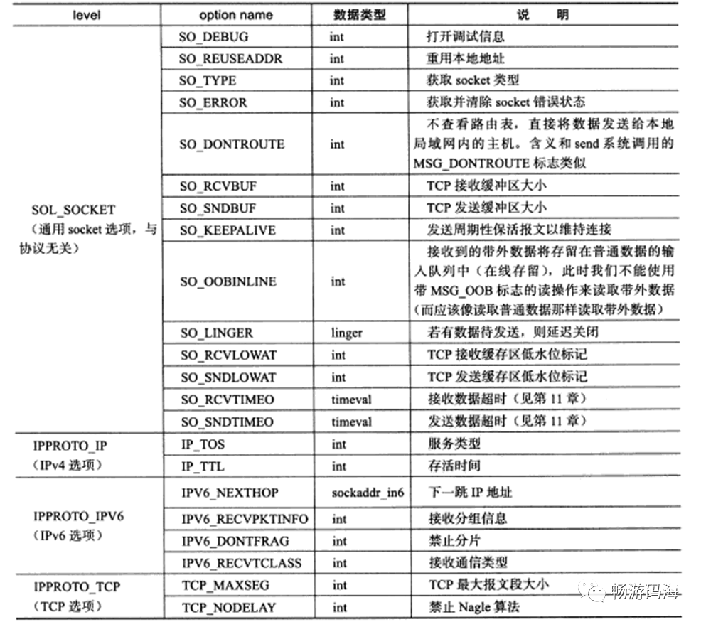socket选项


### 网络信息API

```c
//根据主机名，获取主机的完整信息  
#include<neidb.h>

struct hostent* gethostbyname (const char* name);  
struct hostent* gethostbyaddr (const void* addr ,size_t len, int type);  
```

```c
#include<netdb.h>

struct hostent{  
    char* h_name; //主机名  
    char** h_aliases;//主机别名列表，可能由多个  
    int h_addrtype; //地址类型（地址族）  
    int h_length; //地址长度  
    char** h_addr_list;//按网络字节序列出的主机IP地址列表  
}  
```

```c
//根据名称获取某个服务器的完整信息  
#include<netdb.h> 

struct servent* getservbyname (const char* name,const char* proto);  
struct servent* getservbyport (int port ,const char* proto);  
```

```c
#include<netdb.h>

struct servent{  
    char* s_name;//服务名称  
    char** s_aliases;//服务的别名列表，可能多个  
    int s_port;//端口号  
    char* s_proto;//服务类型，通常是TCP或者UDP  
}  
```

```c
//通过主机名获取IP地址，也能通过服务名获得端口号----内部使用的是geihostbyname和getservbyname  
#include<netdb.h> 

int getaddrinfo (const char* hostname ,const char* service ,const struct addrinfo* hints ,struct addrinfo** result);  
```

```c
struct addrinfo  
{  
    int ai_flags;  
    int ai_family; //地址族  
    int ai_socktype;//服务类型，SOCK_STREAM或SOCK_DGRAM  
    int ai_protocol;  
    socklen_t ai_addrlen;//socket地址ai_addr的长度  
    char* ai_canonname;//主机的别名  
    struct sockaddr* ai_addr;//指向socket地址  
    struct addrinfo* ai_next;//指向下一个sockinfo结构的对象  
}  
```

**该函数将隐式的分配堆内存，所以我们需要配对下面的函数**
    
```c
//用来释放内存  
#include<netdb.h>  

void freeaddrinfo (struct addrinfo* res);  
```

```c
//将返回的主机名存储在hsot参数指向的缓存中，将服务名存储在serv参数指向的缓存中，hostlen和servlen参数分别指定这两块缓存的长度  
#include<netdb.h>  
int getnameinfo (const struct sockaddr* sockaddr,socklen_t addrlen,char* host,socklen_t hostlen,char* serv,socklen_t servlen,int flags);  
```

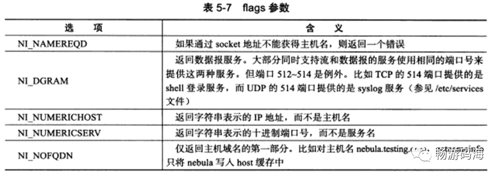getnameinfo的flags

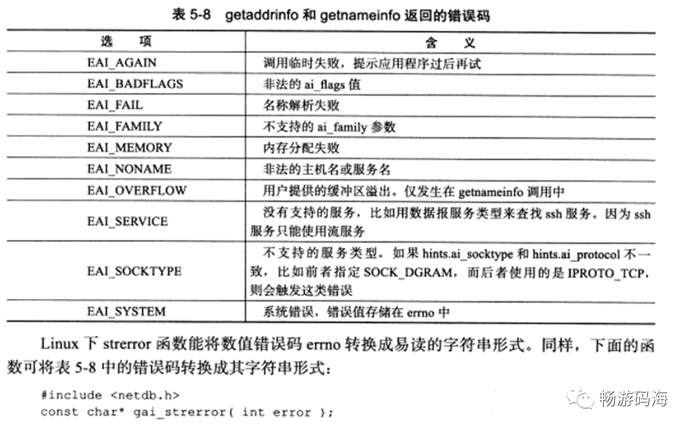getaddrinfo错误码

## Part1六、高级I/O函数

```c
//pipe函数可用于创建一个管道，以实现进程间通信  
#include<unistd.h> 

int pipe( int fd[2]);//参数是一个包含两个int型整数的数组指针，函数成功时返回0，并将打开的文件描述符值填入其参数指向的数组，失败则返回-1并设置errno  
//fd[0]只能从管道读出数据，fd[1]则只能用于往管道里写入数据，而不能反过来使用，要实现双向，就得使用两个管道---都是阻塞的  
```

```c
//方便创建双向管道  
#include<sys/types>  
#include<sys/socket.h>

int socketpair (int domain ,int type ,int protocol ,int fd[2]);  
//dpmain只能使用AF_UNIX，仅能在本地使用。最后一个参数则和pipe系统调用的参数一样，只不过socketpair创建的这对文件描述符都是即可读有可写的，成功返回0，失败返回-1并设置errno  
```

```c
//把标准输入重定向到文件或网络  
#include<unistd.h>

int dup (int file_descriptor);  
int dup2 (int file_descriptor_one, int file_descriptor_two);  
```

```c
//分散读和集中写  
#include<sys/uio.h>

ssize_t readv (int fd, const struct iovec* vector ,int count);  
ssize_t writev (int fd , const struct iovec* vector, int count);  
//vector中存储的是iovec结构数组，count是vector数组的长度  
```

```c
//在两个文件描述符之间传递数据（完全在内核中操作），从而避免了内核缓冲区和用户缓冲区之间的数据拷贝，效率很高，这被称为--------零拷贝  
#include<sys/sendfile.h>

ssize_t sendfile (int out_fd,int in_fd, off_t* offest ,size_t count);  
//in_fd参数是待读出内容的文件描述符，out_fd是待写入内容的文件描述符，offest参数指定从读入文件流哪个位置开始读，为空，则使用读入文件流默认的起始位置，count参数指定在文件描述符之间传输的字节数  
```

```c
//用于申请一段内存空间  
#include<sys/mman.h>

void* mmap (void *start ,size_t length,int prot ,int flags ,int fd,off_t offest);  
int munmap (void *start,size_t length);  
//start允许用户使用特定的地址作为起始地址，length指定内存段的长度，port参数用来设置内存段的访问权限  
//PROT_READ 内存段可读  
//PROT_WRITE 内存段可写  
//PROT_EXEC  内存段可执行  
//PROT_NONE  内存段不能被访问  
```

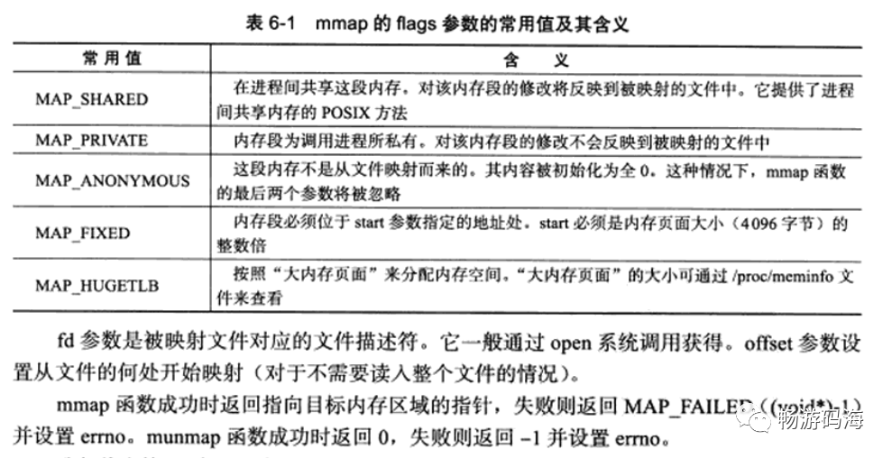mmap的flags


```c
//用来在两个文件描述符之间移动数据----零拷贝  
#include<fcntl.h>

ssize_t splice (int fd_in ,loff_t* off_in ,int fd_out , loff_t* off_out,size_t len, unsigned int flags);  
//fd_int 如果是管道文件描述符，则off_in设置NULL。如果不是，则off_in参数表示从输入数据流的何处开始读取数据，不为NULL则表示具体的偏移位置，fd_out和off_out同理，len参数指定移动数据的长度  
```

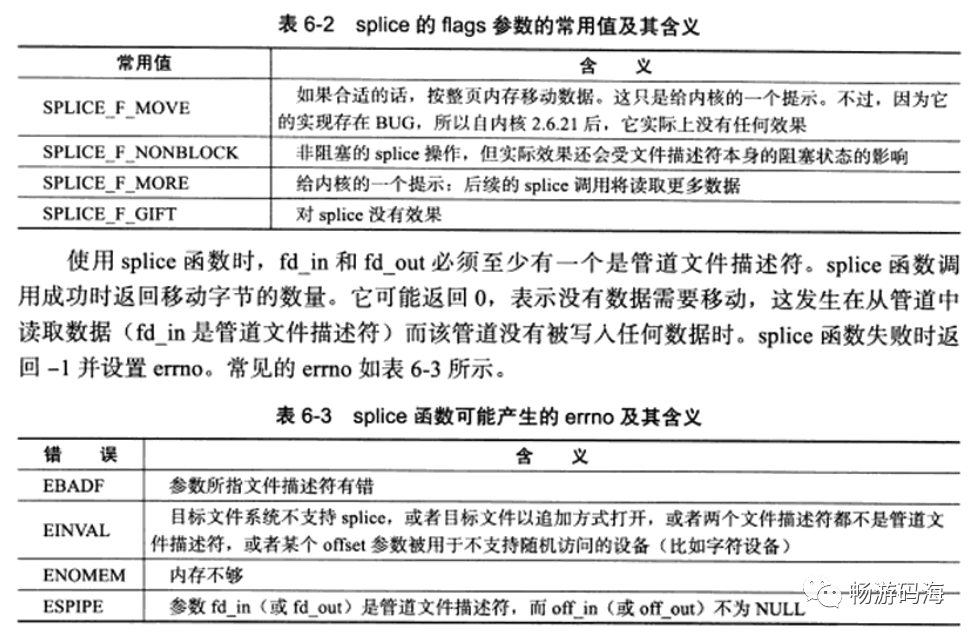splice的flags


```c
//在两个管道文件描述符之间复制数据，也就是零拷贝操作  
#include<fcntl.h>

ssize_t tee (int fd_in ,int fd_out ,size_t len ,unsigned int flags);  
//参数与splice相同  
```

```c
//提供了对文件描述符的各种控制操作  
#include<fcntl.h>  

int fcntl (int fd,int cmd,···);  
//fd参数是被操作的文件描述符，cmd参数指定执行何种操作，根据类型不同，可能还需要第三个可选参数arg  
```

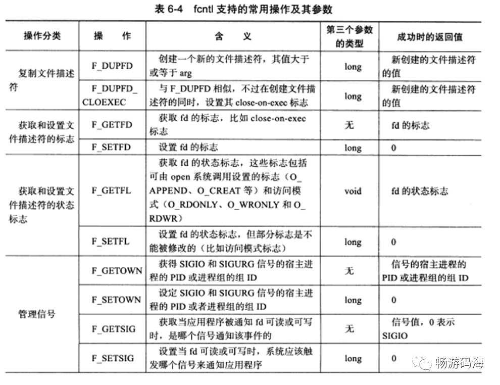fcntl支持的操作1

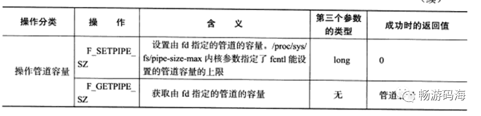fcntl支持的操作2

## Part2七、Linux服务器程序规范

**服务器程序规范**：

  1. Linux服务器程序一般以后台方式运行------守护进程
  2. Linux服务器程序通常有一套日志系统，至少能输出日志到文件，有的高级服务器还能输出日志到专门的UDP服务器，大部分后台进程都在 /var/log目录下用用户自己的日志目录
  3. Linux服务器程序一般以某个专门的非root身份运行
  4. Linux服务器程序通常是可配置的，服务器通常能处理很多命令行选项，如果一次运行的选项太多，则可以用配置文件来管理，绝大多数服务器程序都是有配置文件的，并存放在/etc目录下
  5. Linux服务器程序进程通常会在启动的时候生成一个PID文件并存入/var/run目录中记录该后台进程的PID
  6. Linux服务器程序通常需要考虑系统资源和限制，以预测自身能承受多大负荷

#### 日志

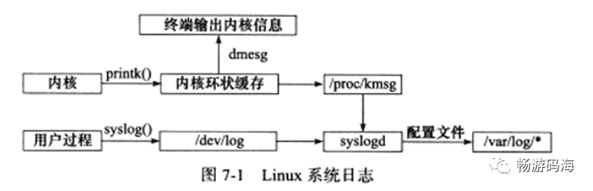Linux日志系统


```c
#include<syslog.h>

void syslog (int priority ,const char* message , ...)  
//priority参数是所谓的设施值与日志级别的按位或，默认值是LOG_USER  
```

```c
//日志级别  
#include<syslog.h>  

#define LOG_EMERG    0//系统不可用  
#define LOG_ALERT  1//报警，需要理解立即动作   
#define LOG_CRIT  2//非常严重的情况  
#define LOG_ERR   3//错误  
#define LOG_WARNING  4//警告  
#define LOG_NOTICE  5//通知  
#define LOG_INFO  6//信息  
#define LOG_DEBUG    7//调试  
```

```c
//改变syslog的默认输出方式，进一步结构化日志内容      
#include<syslog.h>  

void openlog (const char* ident ,int logopt ,int facility)    ;  
//ident参数指定的字符串被添加到日志消息的日期和时间之后，通常被设置为程序的名字  
```

```c
//logopt参数对后续syslog调用行为配置  
#define LOG_PID  0x01 //在日志消息中包含程序PID  
#define LOG_CONS 0x02 //如果消息不能记录到日志文件，则打印至终端  
#define LOG_ODELAY 0x04 //延迟打开日志功能知道第一次调用syslog  
#define LOG_NDELAY 0x08 //不延迟打开日志功能  
```

```c          
//设置syslog的日志掩码  
#include<syslog.h>  

int setlogmask (int maskpri);  
//maskpri参数指定日志掩码值。该函数始终会成功，它返回调用进程先前的日志掩码值  
```

```c
//关闭日志功能  
#include<syslog.h>  
void closelog();  
```

### 用户信息

```c    
//用来获取和设置当前进程的真实用户ID（UID）、有效用户ID（EUID ）、真实组ID（GID）和有效组ID（EGID）  
#include<sys/types.h>  
#include<unistd.h>

uid_t getuid();  //获取真实用户ID  
uid_t geteuid(); //获取有效用户ID  
gid_t getgid();  //获取真实组ID  
gid_t getegid(); //获取有效组ID  
int setuid(uid_t uid);//设置真实用户ID  
int seteuid(uid_t uid);//设置有效用户ID  
int setgid(gid_t gid);//设置真实组ID  
int setegid (gid_t gid);//设置有效组ID  
```

**一个进程拥有两个用户ID：UID和EUID，EUID存在的目的是方便资源访问：它使得运行程序的用户拥有该程序的有效用户的权限**

### 进程间关系

#### 进程组


```c
#include<unistd.h>  

pid_t getgid (pid_t pid);  
//成功返回进程pid所属的进程组的PGID，失败返回-1并设置errno  
```

**每个进程都有一个首领进程，其PGID和PID相同。进程将一直存在，直到其他所有进程都退出，或者加入到其他进程组**

#### 会话

```c
//创建一个会话  
#include<unistd.h>  
pid_t setsid (void);  
// 1.调用进程成为会话的首领，此时该进程是新会话的唯一成员  
// 2.新建一个进程组，其PGID就是调用进程的PID，调用进程成为该组的首领  
// 3.调用进程将甩开终端（如果有的话）  
//读取SID  
#include<unistd.h>  
pid_t getsid (pid_t pid);  
```

#### 进程间关系

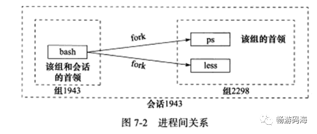进程间关系

#### 系统资源限制


```c    
//Linux上运行的程序都会受到资源限制的影响  
#include<sys/resource.h>  
int getrlimit (int resource , struct rlimit* rlim);  //读取资源  
int setrlimit (int resource , const struct rlimit* rlim);//设置资源  
  
//rlimit结构体  
struct rlimit  
{  
    rlim_t rlim_cur;//指定资源的软限制  
    rlim_t rlim_max;//指定资源的硬限制  
}  
//rlim_t 是一个整数类型  
```

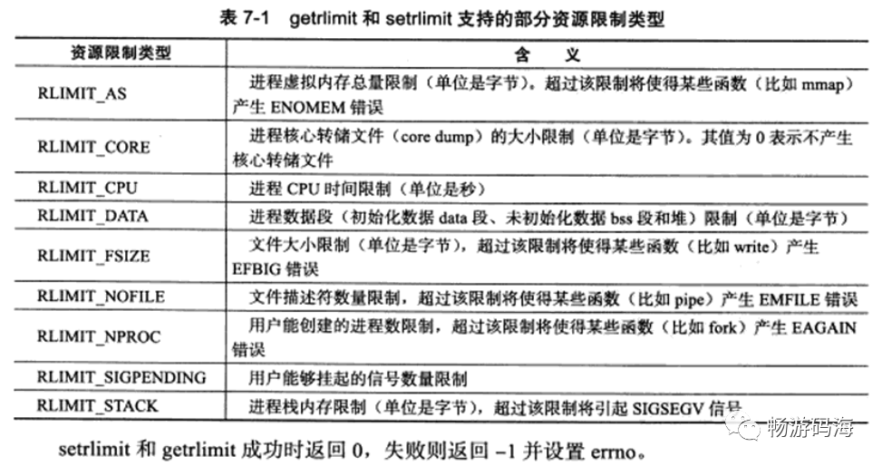资源限制类型


#### 改变工作目录和根目录

```c    
#include<unistd.h>

char* getcwd (char* buf,size_t size); //获取当前工作目录  
int chdir (const char* path);//切换path指定的目录  
```

```c
//改变进程根目录函数  
#include<unistd.h>

int chroot (const char* path);  
```

## Part3八、高性能服务器程序框架

### I/O处理单元---四种I/O模型和两种高效事件处理模式

#### 服务器模型

##### C/S模型

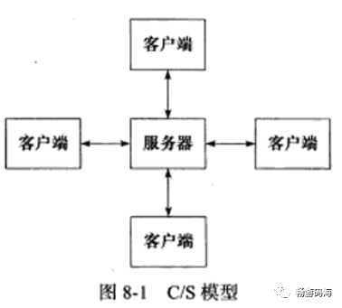C_S模型

  1. 由于客户连接请求是随机到达的异步事件，因此服务器需要使用某种I/O模型来监听这一事件 当监听到连接请求后，服务器就调用accept函数接受它，并分配一个逻辑单元为新的连接服务。
  2. 逻辑单元可以是新创建的子进程，子线程或者其他
  3. 服务器给客户端分配的逻辑单元是由fork系统调用创建的子进程。
  4. 逻辑单元读取客户请求，处理该请求，然后将处理结果返回给客户端。
  5. 客户端接收到服务器反馈的结果之后，可以继续向服务器发送请求，也可以立即主动关闭连接 如果客户端主动关闭连接，则服务器执行被动关闭连接
  6. 服务器同时监听多个客户请求是通过select系统调用实现的

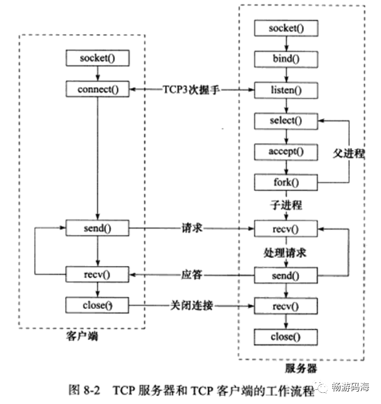TCP工作流程

**C/S模型非常适合资源相对集中的场合，并且它实现也很简单，但其缺点也很明显，服务器是中心，访问量过大时，可能所有客户都会得到很慢的响应。**

##### P2P模型

**优点：资源能够充分、自由地共享**

**缺点：当用户之间传输的请求过多时，网络负载将加重**

**主机之前很难互相发现，所以实际使用的P2P模型通常带有一个专门的发现服务器**

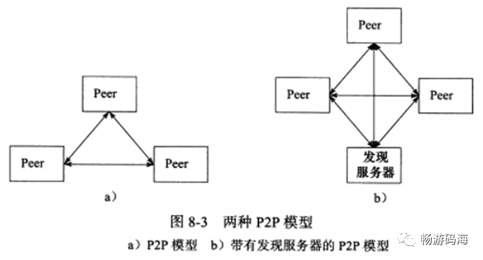p2p模型

### 服务器编程框架

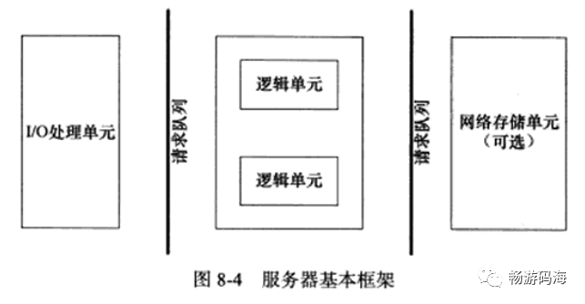服务器基本框架

<table><thead><tr style="border-width: 1px 0px 0px;border-right-style: initial;border-bottom-style: initial;border-left-style: initial;border-right-color: initial;border-bottom-color: initial;border-left-color: initial;border-top-style: solid;border-top-color: rgb(204, 204, 204);background-color: white;"><th style="border-top-width: 1px;border-color: rgb(245, 203, 174);background-color: rgb(235, 114, 80);color: rgb(248, 248, 248);min-width: 85px;text-align: center;">模块</th><th style="border-top-width: 1px;border-color: rgb(245, 203, 174);background-color: rgb(235, 114, 80);color: rgb(248, 248, 248);min-width: 85px;text-align: center;">单个服务器程序</th><th style="border-top-width: 1px;border-color: rgb(245, 203, 174);background-color: rgb(235, 114, 80);color: rgb(248, 248, 248);min-width: 85px;text-align: center;">服务器机群</th></tr></thead><tbody style="border-width: 0px;border-style: initial;border-color: initial;"><tr style="border-width: 1px 0px 0px;border-right-style: initial;border-bottom-style: initial;border-left-style: initial;border-right-color: initial;border-bottom-color: initial;border-left-color: initial;border-top-style: solid;border-top-color: rgb(204, 204, 204);background-color: white;"><td style="border-color: rgb(245, 203, 174);min-width: 85px;text-align: center;"><strong style="color: rgb(37, 132, 181);">I/O处理单元</strong></td><td style="border-color: rgb(245, 203, 174);min-width: 85px;text-align: center;"><strong style="color: rgb(37, 132, 181);">处理客户连接，读写网络数据</strong></td><td style="border-color: rgb(245, 203, 174);min-width: 85px;text-align: center;"><strong style="color: rgb(37, 132, 181);">作为接入服务器，实现负载均衡</strong></td></tr><tr style="border-width: 1px 0px 0px;border-right-style: initial;border-bottom-style: initial;border-left-style: initial;border-right-color: initial;border-bottom-color: initial;border-left-color: initial;border-top-style: solid;border-top-color: rgb(204, 204, 204);background-color: rgb(248, 222, 203);"><td style="border-color: rgb(245, 203, 174);min-width: 85px;text-align: center;"><strong style="color: rgb(37, 132, 181);">逻辑单元</strong></td><td style="border-color: rgb(245, 203, 174);min-width: 85px;text-align: center;"><strong style="color: rgb(37, 132, 181);">业务进程或线程</strong></td><td style="border-color: rgb(245, 203, 174);min-width: 85px;text-align: center;"><strong style="color: rgb(37, 132, 181);">逻辑服务器</strong></td></tr><tr style="border-width: 1px 0px 0px;border-right-style: initial;border-bottom-style: initial;border-left-style: initial;border-right-color: initial;border-bottom-color: initial;border-left-color: initial;border-top-style: solid;border-top-color: rgb(204, 204, 204);background-color: white;"><td style="border-color: rgb(245, 203, 174);min-width: 85px;text-align: center;"><strong style="color: rgb(37, 132, 181);">网络存储单元</strong></td><td style="border-color: rgb(245, 203, 174);min-width: 85px;text-align: center;"><strong style="color: rgb(37, 132, 181);">本地数据库，文件或缓存</strong></td><td style="border-color: rgb(245, 203, 174);min-width: 85px;text-align: center;"><strong style="color: rgb(37, 132, 181);">数据库服务器</strong></td></tr><tr style="border-width: 1px 0px 0px;border-right-style: initial;border-bottom-style: initial;border-left-style: initial;border-right-color: initial;border-bottom-color: initial;border-left-color: initial;border-top-style: solid;border-top-color: rgb(204, 204, 204);background-color: rgb(248, 248, 248);"><td style="border-color: rgb(245, 203, 174);min-width: 85px;text-align: center;"><strong style="color: rgb(37, 132, 181);">请求队列</strong></td><td style="border-color: rgb(245, 203, 174);min-width: 85px;text-align: center;"><strong style="color: rgb(37, 132, 181);">各单元之间的通信方式</strong></td><td style="border-color: rgb(245, 203, 174);min-width: 85px;text-align: center;"><strong style="color: rgb(37, 132, 181);">各服务器之间的永久TCP连接</strong></td></tr></tbody></table>

**I/O处理单元模块：等待并接受新的客户连接，接收客户数据，将服务器响应数据返回给客户端**

**逻辑单元通常是一个进程或线程：它分析并处理客户数据，然后将结果传递给I/O处理单元或者直接发送给客户端**

**网络存储单元：可以说数据库，缓存和文件，甚至是一台独立的服务器**

**请求队列：是各个单元之间的通信方式和抽象I/O处理单元接收到客户请求时，需要以某种方式通知一个逻辑单元来处理请求，多个逻辑单元同时访问一个存储单元时，也需要某种机制来协调处理竞态条件。请求队列通常被实现为池的一部分。对服务器来说，请求队列是各台服务器之间预先建立的，静态的、永久的TCP连接**

### I/O模型

<table><thead><tr style="border-width: 1px 0px 0px;border-right-style: initial;border-bottom-style: initial;border-left-style: initial;border-right-color: initial;border-bottom-color: initial;border-left-color: initial;border-top-style: solid;border-top-color: rgb(204, 204, 204);background-color: white;"><th style="border-top-width: 1px;border-color: rgb(245, 203, 174);background-color: rgb(235, 114, 80);color: rgb(248, 248, 248);min-width: 85px;text-align: center;">I/O模型</th><th style="border-top-width: 1px;border-color: rgb(245, 203, 174);background-color: rgb(235, 114, 80);color: rgb(248, 248, 248);min-width: 85px;text-align: center;">读写操作和阻塞阶段</th></tr></thead><tbody style="border-width: 0px;border-style: initial;border-color: initial;"><tr style="border-width: 1px 0px 0px;border-right-style: initial;border-bottom-style: initial;border-left-style: initial;border-right-color: initial;border-bottom-color: initial;border-left-color: initial;border-top-style: solid;border-top-color: rgb(204, 204, 204);background-color: white;"><td style="border-color: rgb(245, 203, 174);min-width: 85px;text-align: center;">阻塞I/O</td><td style="border-color: rgb(245, 203, 174);min-width: 85px;text-align: center;">程序阻塞于读写函数</td></tr><tr style="border-width: 1px 0px 0px;border-right-style: initial;border-bottom-style: initial;border-left-style: initial;border-right-color: initial;border-bottom-color: initial;border-left-color: initial;border-top-style: solid;border-top-color: rgb(204, 204, 204);background-color: rgb(248, 222, 203);"><td style="border-color: rgb(245, 203, 174);min-width: 85px;text-align: center;">I/O复用</td><td style="border-color: rgb(245, 203, 174);min-width: 85px;text-align: center;">程序阻塞于I/O复用系统调用，但可同时监听 多个I/O事件，对I/O本身的读写操作是非阻塞的</td></tr><tr style="border-width: 1px 0px 0px;border-right-style: initial;border-bottom-style: initial;border-left-style: initial;border-right-color: initial;border-bottom-color: initial;border-left-color: initial;border-top-style: solid;border-top-color: rgb(204, 204, 204);background-color: white;"><td style="border-color: rgb(245, 203, 174);min-width: 85px;text-align: center;">SIGIO信号</td><td style="border-color: rgb(245, 203, 174);min-width: 85px;text-align: center;">信号触发读写就绪事件，用户程序执行读写操作。程序没有阻塞阶段</td></tr><tr style="border-width: 1px 0px 0px;border-right-style: initial;border-bottom-style: initial;border-left-style: initial;border-right-color: initial;border-bottom-color: initial;border-left-color: initial;border-top-style: solid;border-top-color: rgb(204, 204, 204);background-color: rgb(248, 248, 248);"><td style="border-color: rgb(245, 203, 174);min-width: 85px;text-align: center;">异步I/O</td><td style="border-color: rgb(245, 203, 174);min-width: 85px;text-align: center;">内核执行读写操作并触发读写完成事件，程序没有阻塞阶段</td></tr></tbody></table>

##### 阻塞式IO

  1. 使用系统调用，并一直阻塞直到内核将数据准备好，之后再由内核缓冲区复制到用户态，在等待内核准备的这段时间什么也干不了
  2. 下图函数调用期间，一直被阻塞，直到数据准备好且从内核复制到用户程序才返回，这种IO模型为阻塞式IO
  3. 阻塞式IO是最流行的IO模型

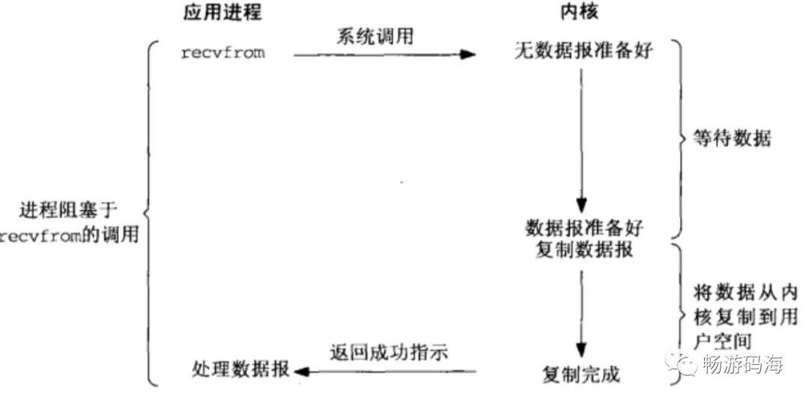进程阻塞于recvfrom

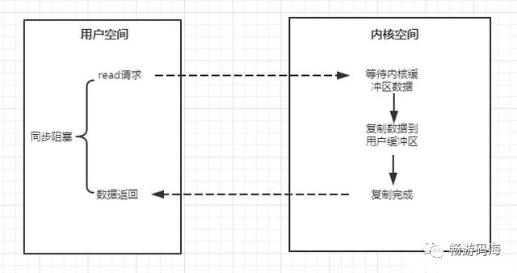同步阻塞

**优缺点**

**优点**：开发简单，容易入门;在阻塞等待期间，用户线程挂起，在挂起期间不会占用CPU资源。

**缺点**：一个线程维护一个IO，不适合大并发，在并发量大的时候需要创建大量的线程来维护网络连接，内存、线程开销非常大。

##### 非阻塞式IO

  1. 内核在没有准备好数据的时候会返回错误码，而调用程序不会休眠，而是不断轮询询问内核数据是否准备好
  2. 下图函数调用时，如果数据没有准备好，不像阻塞式IO那样一直被阻塞，而是返回一个错误码。数据准备好时，函数成功返回。
  3. 应用程序对这样一个非阻塞描述符循环调用成为轮询。
  4. 非阻塞式IO的轮询会耗费大量cpu，通常在专门提供某一功能的系统中才会使用。通过为套接字的描述符属性设置非阻塞式，可使用该功能

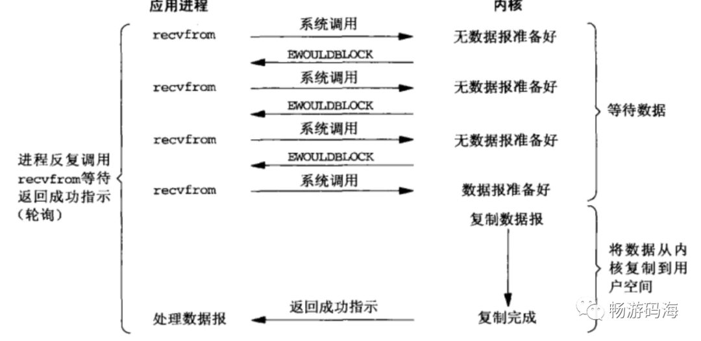recvfrom调用

**优缺点**

**同步非阻塞IO优点**：每次发起IO调用，在内核等待数据的过程中可以立即返回，用户线程不会阻塞，实时性较好。

**同步非阻塞IO缺点**：多个线程不断轮询内核是否有数据，占用大量CPU时间，效率不高。一般Web服务器不会采用此模式。

##### 多路复用IO

  1. 类似与非阻塞，只不过轮询不是由用户线程去执行，而是由内核去轮询，内核监听程序监听到数据准备好后，调用内核函数复制数据到用户态
  2. 下图中select这个系统调用，充当代理类的角色，不断轮询注册到它这里的所有需要IO的文件描述符，有结果时，把结果告诉被代理的recvfrom函数，它本尊再亲自出马去拿数据
  3. IO多路复用至少有两次系统调用，如果只有一个代理对象，性能上是不如前面的IO模型的，但是由于它可以同时监听很多套接字，所以性能比前两者高

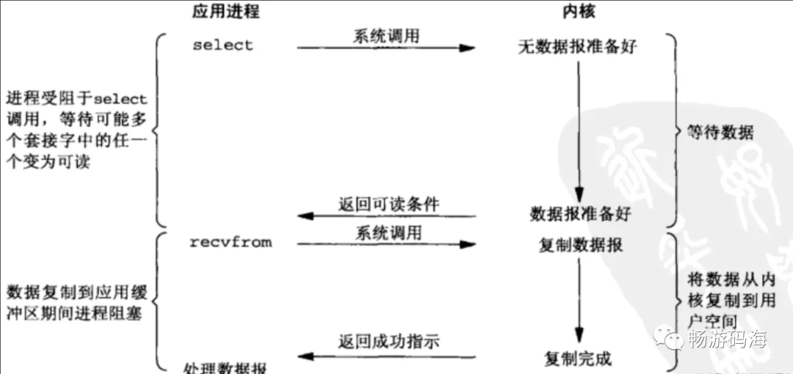

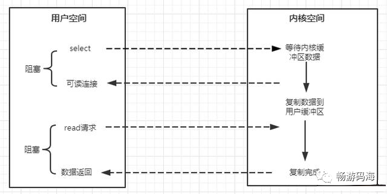

**多路复用包括**：

  1. select：线性扫描所有监听的文件描述符，不管他们是不是活跃的。有最大数量限制（32位系统1024，64位系统2048）
  2. poll：同select，不过数据结构不同，需要分配一个pollfd结构数组，维护在内核中。它没有大小限制，不过需要很多复制操作
  3. epoll：用于代替poll和select，没有大小限制。使用一个文件描述符管理多个文件描述符，使用红黑树存储。同时用事件驱动代替了轮询。epoll_ctl中注册的文件描述符在事件触发的时候会通过回调机制激活该文件描述符。epoll_wait便会收到通知。最后，epoll还采用了mmap虚拟内存映射技术减少用户态和内核态数据传输的开销

**优缺点**

**IO多路复用优点**：系统不必创建维护大量线程，只使用一个线程，一个选择器即可同时处理成千上万个连接，大大减少了系统开销。

**IO多路复用缺点**：本质上，select/epoll系统调用是阻塞式的，属于同步IO，需要在读写事件就绪后，由系统调用进行阻塞的读写。

##### 信号驱动式IO

  * 使用信号，内核在数据准备就绪时通过信号来进行通知
  * 首先开启信号驱动io套接字，并使用sigaction系统调用来安装信号处理程序，内核直接返回，不会阻塞用户态
  * 数据准备好时，内核会发送SIGIO信号，收到信号后开始进行io操作

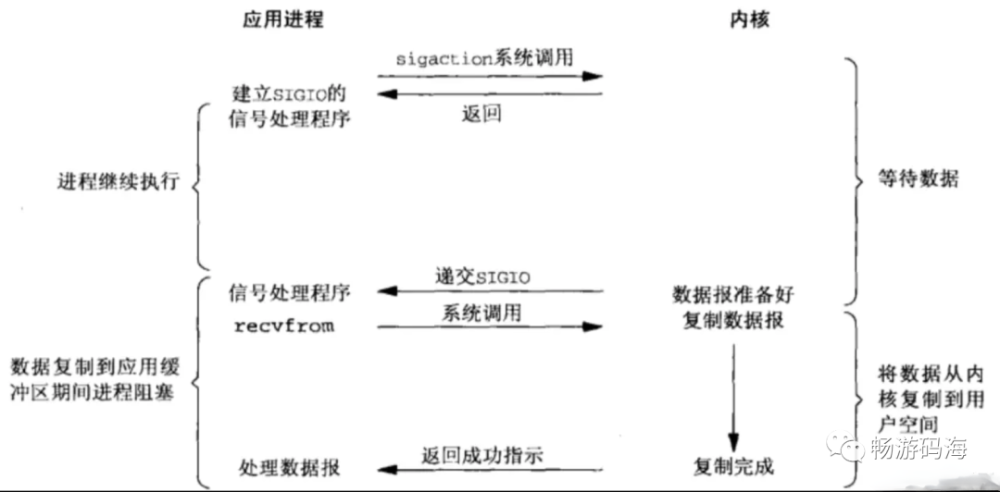信号驱动

##### 异步IO

  * 异步IO依赖信号处理程序来进行通知
  * 不过异步IO与前面IO模型不同的是：前面的都是数据准备阶段的阻塞与非阻塞，异步IO模型通知的是IO操作已经完成，而不是数据准备完成
  * 异步IO才是真正的非阻塞，主进程只负责做自己的事情，等IO操作完成(数据成功从内核缓存区复制到应用程序缓冲区)时通过回调函数对数据进行处理
  * unix中异步io函数以aio_或lio_打头

**异步IO优点**：真正实现了异步非阻塞，吞吐量在这几种模式中是最高的。

**异步IO缺点**：应用程序只需要进行事件的注册与接收，其余工作都交给了操作系统内核，所以需要内核提供支持。在Linux系统中，异步IO在其2.6才引入，目前也还不是灰常完善，其底层实现仍使用epoll，与IO多路复用相同，因此在性能上没有明显占优

##### 五种IO模型对比

  * 前面四种IO模型的主要区别在第一阶段，他们第二阶段是一样的：数据从内核缓冲区复制到调用者缓冲区期间都被阻塞住！
  * 前面四种IO都是同步IO：IO操作导致请求进程阻塞，直到IO操作完成
  * 异步IO：IO操作不导致请求进程阻塞

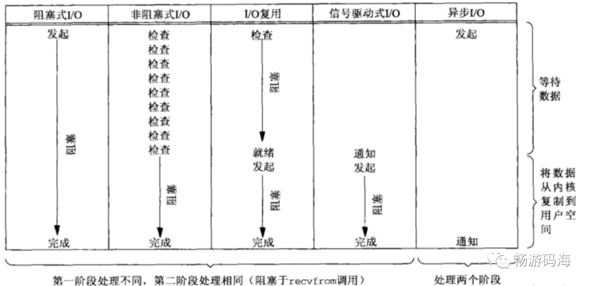对比

> **以上I/O模型详解部分来源于网络**

### 两种高效的事件处理模式

两种事件处理模式**Reactor**和**Proactor**分别对应**同步I/O模型、异步I/O模型**

#### Reactor模式

**它要求主线程（I/O处理单元）只负责监听文件描述上是否有事件发生，有的话就立即将该事件通知工作线程（逻辑单元）。除此之外，主线程不做任何其他实质性的工作。-----读写数据，接受新的连接，以及处理客户请求均在工作线程完成**

  1. 主线程epoll内核事件表中注册socket上的读就绪事件
  2. 主线程调用epoll_wait等待socket上有数据可读
  3. 当socket上有数据可读时，epoll_wait通知主线程。主线程则将socket可读事件放入请求队列
  4. 睡眠在请求队列上的某个工作线程被唤醒，它从socket读取数据，并处理客户端请求，然后往epoll内核事件表中注册该socket上的写就绪事件
  5. 主线程调用epoll_wait等待socket可写
  6. 当socket可写时，epoll_wait通知主线程。主线程将socket可写事件放入请求队列
  7. 睡眠在请求队列上的某个工作线程被唤醒，它 往socket上写入服务器处理客户请求的结果

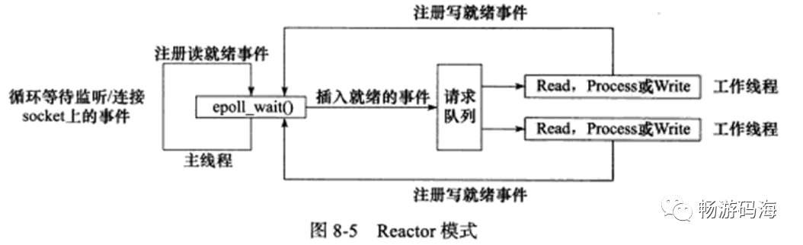

#### Proactor模式

**Proactor模式将所有I/O操作都交给主线程和内核来处理，工作线程仅仅负责业务逻辑**

  1. 主线程调用aio_read函数向内核注册socket上的读完成事件，并告诉内核用户读缓冲区的位置，以及读操作完成时如何通知应用程序
  2. 主线程继续处理其他逻辑
  3. 当socket上的数据被读入用户缓冲区后，内核将向应用程序发送一个信号，以通知应用程序数据已经可用
  4. 应用程序预先定义好的信号处理函数选择一个工作线程来处理客户请求。工作线程处理完客户请求之后，调用aio_write函数向内核注册socket上的写完成事件，并告诉内核用户写缓冲区的位置，以及写操作完成时如何通知应用程序
  5. 主线程继续处理其他逻辑
  6. 当用户缓冲区的数据被写入socket之后，内核将向应用程序发送一个信号，以通知应用程序数据以及发送完毕
  7. 应用程序预先定义好的信号处理函数选择一个工作线程来做善后处理，比如决定是否关闭socket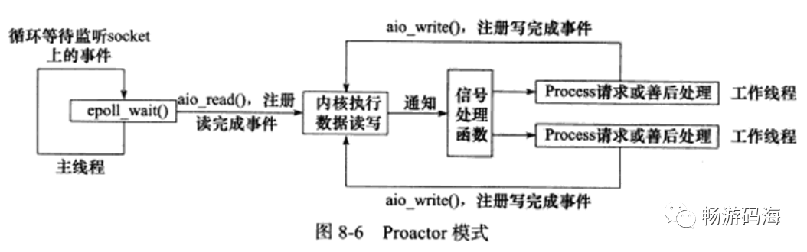

#### 同步I/O模型模拟出Proactor

**主线程执行数据读写操作，读完成之后，主线程向工作线程通知这一“完成事件”。那么从工作线程的角度来看，它们就直接获得了数据读写的结果，接下来要做的只是对读写的操作进行逻辑处理**

  1. 主线程往epoll内核事件表中注册socket上的读就绪事件
  2. 主线程调用epoll_wait等待socket上有数据可读
  3. 当socket上有数据可读时，epoll_wait通知主线程。主线程从socket循环读取数据，直到没有更多数据可读，然后将数据封装成一个请求对象并插入请求队列
  4. 睡眠在请求队列上的某个工作线程被唤醒，它获得请求对象并处理客户请求，然后往epoll内核事件表中注册socket上的写就绪事件
  5. 主线程调用epoll_wait等待socket可写
  6. 当socket可写时，epoll_wait通知主线程。主线程往socket上写入服务器处理客户请求的结果

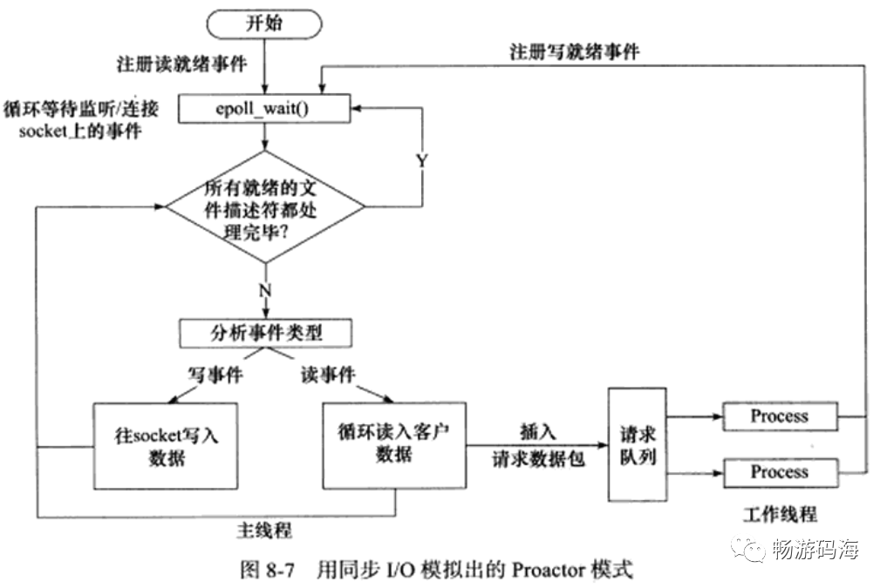

#### 两种高效的并发模型

**并发模型是指I/O处理单元和多个逻辑单元之间协调完成任务的方法。两种并发编程模式-------半同步/半异步模式、领导者/追随者模式**

##### 半同步/半异步模式

此**同步和异步**和前面I/O模型中的**同步和异步**完全不同。

**在I/O模型中，“同步”和“异步”区分的是内核向应用程序通知的是何种I/O事件（是就绪事件还是完成事件），以及该由谁来完成I/O读写（应用程序还是内核）**
    
**在并发模式中，“同步”指的是程序完成按照代码序列的顺序执行：“异步”指的是程序的执行需要由系统事件来驱动**

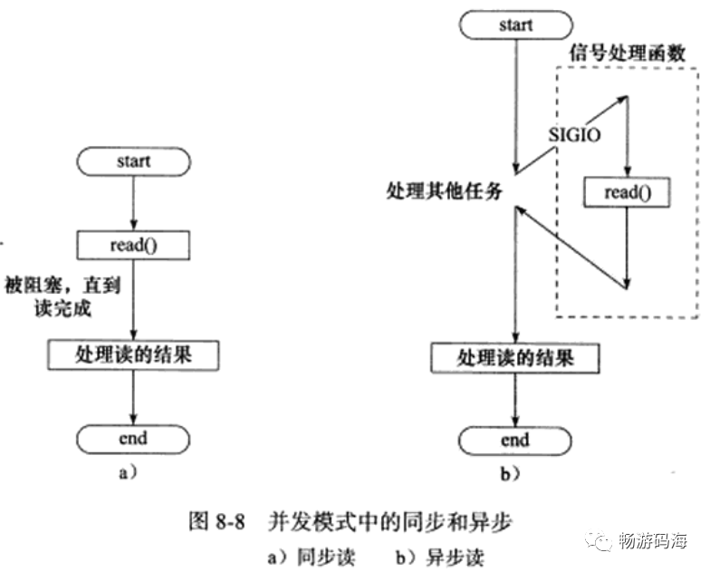并发中的同步和异步

**半同步/半异步工作流程**

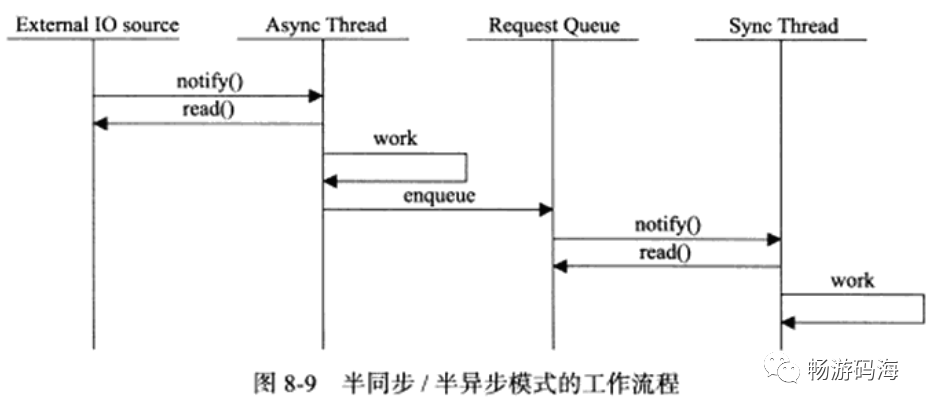半同步_半异步工作流程

**半同步/半异步模式变体------半同步/半异步反应堆**

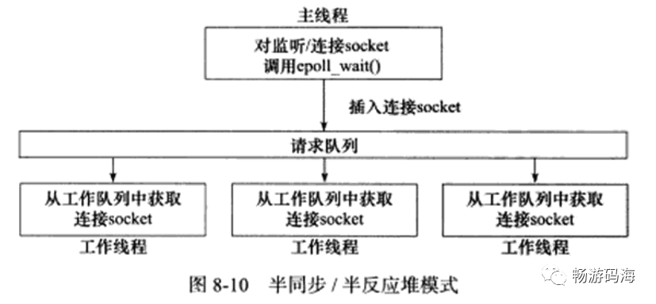半同步_半异步反应堆模式

**异步线程只有一个，由主线程来充当，它负责监听所有socket上的事件。如果监听socket上有可读事件发生------有新的连接请求到来，主线程就接受之以得到新的连接socket,然后往epoll内核事件表中注册该socket上的读写事件。如果连接socket上有读写事件发生----有新的客户请求到来或有数据要发送至客户端，主线就将该连接socket插入请求队列中。所有工作线程都睡眠在请求队列上，当有任务到来时，它们将通过竞争（比如申请互斥锁）获得任务的接管权。这种竞争机制使得只有空闲的工作线程才有机会来处理新任务，这是很合理的**

**缺点：**
    
    **主线程和工作线程共享请求队列。主线程往请求队列中添加任务，或者工作线程从请求队列中去除任务，都需要对请求队列加锁保护，从而白白耗费CPU时间。**
    
    **每个工作线程都在同一时间只能处理一个客户请求。如果客户数量较多，而工作线程较少，则请求队列中将堆积很多任务对象，客户端的响应速度将越来越慢。如果通过增加工作线程来解决这一问题，则工作线程的切换也将耗费大量CPU时间**


**变体----相对高效的**

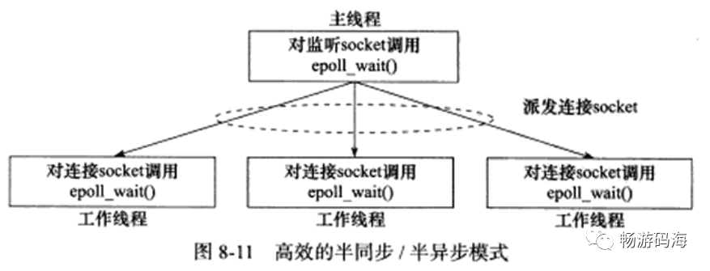高效半同步_半异步模式

**主线程只管理监听socket,连接socket由工作线程来管理。当有新的连接到来时，主线程就接受并将新返回的连接socket派发给某个工作线程，此后该新socket上的任何I/O操作都由被选中的工作线程来处理，直到客户关闭连接。主线程向工作线程派发socket的最简单的方式，是往它和工作线程之间的管道里写数据。工作线程检测到管道上有数据可读时，就分析是否是一个新的客户连接请求到来。如果是，则把该新socket上的读写事件注册到自己的epool内核事件表中**

##### 领导者/追随者模式

**领导者/追随者模式是多个工作线程轮流获得事件源集合、轮流监听、分发并处理事件的一种模式。在任意时间点，程序仅有一个领导者线程，它负责监听I/O事件。而其他线程则都是追随者，它们休眠在线程池中等待成为新的领导者。当前的领导者如果检测到I/O事件，首先要从线程池中推选出新的领导者线程，然后处理I/O事件。此时，新的领导者等待新的I/O事件，而原来的领导者则处理I/O事件，二者实现并发**

包含：

**句柄集、线程集、事件处理器和具体的事件处理器**

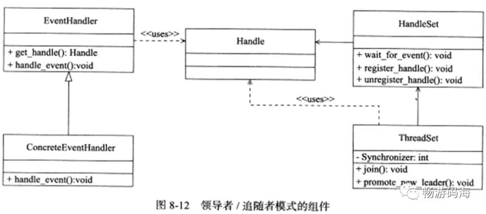领导者追随者模式组件

**使用wait_for_event方法来监听这些句柄上的I/O事件，并将其中的就绪事件通知给领导者线程**

线程集中的线程在**任一时间**必处于以下**三种状态之一：**

**Leader:线程当前处于领导者身份，负责等待句柄集上的I/O事件****Processing:线程正在处理事件。领导者检测到I/O事件之后，可以转移到processing状态来处理该事件，并调用promote_new_leader方法推选出新的领导者：也可以指定其他追随者来处理事件，此时领导者的地位不变。当处于processing状态的线程处理完事件之后，如果当前线程集中没有领导者，则它将成为新的领导者，否则它就直接转变为追随者****Follower:线程当前处于追随者身份，通过调用线程集dejoin方法等待成为新的领导者，也可能被当前的领导者指定来处理新的任务**

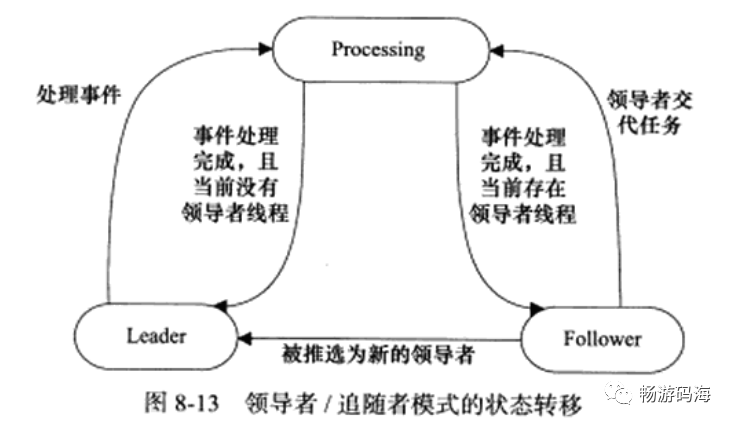领导者追随者状态转移

**事件处理器和具体的事件处理器**

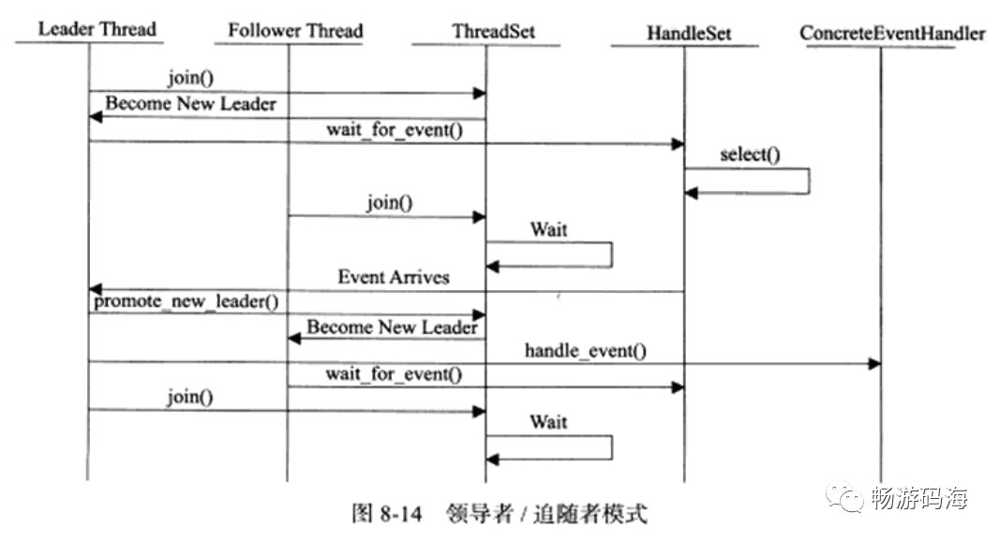领导者追随者工作流程

**在逻辑单元内部的一种高效编程方法--------有限状态机**

**其他提高服务器性能的手段**

**内存池、进程池、线程池和连接池**避免不必要的拷贝，如使用**共享内存**、**零拷贝****尽量避免上下文的切换（线程切换）和锁的使用，因为都会增加开销**

### 多进程编程

##### fork系统调用

**用来Linux下创建新进程的系统**
    
```c
#include<sys/types.h>  
#include<unistd.h>

pid_t fork(void);  
//该函数的每次调用都返回两次，在父进程中返回的是子进程的PID，在子进程中则返回0.该返回值是后续代码判断当前进程是父进程还是子进程的依据。fork调用失败时返回-1，并设置errno。  
```

**fork函数复制当前进程**，在内核进程表中**创建一个新的进程表项**。新的进程表项有很多属性和原进程**相同**，比如**堆指针、栈指针和标志寄存器的值**。但也有许多属性被赋予了新的值，比如**该进程的PPID被设置成原进程的PID，信号位图被清楚（原进程设置的信号处理函数不再对新进程起作用）**

子进程的代码与父进程完全相同，同时它还会复制父进程的数据（堆数据、栈数据和静态数据）。数据的复制采用的是所谓的**写时复制**，即**只有在任一进程（父进程
或子进程）对数据执行了写操作时，复制才会发生（显示缺页中断，然后操作系统给子进程分配内存并复制父进程的数据）**。即便如此，如果我们在程序中分配了大量内存，
那么使用fork时也应该十分谨慎，避免没必要的内存分配和数据复制。**创建进程后，父进程中打开的文件描述符默认在子进程中也是打开的，且文件描述符的引用计数加
1.父进程的用户根目录，当前工作目录等变量的引用计数均会加1。**

##### exec系列系统调用


```c
#include<unistd.h>  
extern char** environ;  
```

```c
int execl(const char* path,const char* argv,...);  
int execlp(const char* file,const char* arg, ...);  
int execle(const char* path,const char* arg, ... ,char* const envp[]);  
int execv(const char* path,char* const argv[]);  
int execvp(const char* file,char* const argv[]);  
int execve(const char* path,char* const argv[],char* const envp[]);  
//path参数指定可执行文件的完整路径，file参数可以接受文件名，该文件的具体位置则在环境变量PATH中搜寻。arg接受可变参数，argv则接受参数数组，它们都会被传递给新程序(path或file指定的程序)的main函数，envp参数用于设置新程序的环境变量。如果未设置它，则新程序将使用由全局变量environ指定的环境变量  
//出错时返回-1，并设置errno。如果没出错，则源程序中exec调用之后的代码都不会执行，因为此时源程序已经被exec的参数指定的程序完全替换（包括代码和数据）  
```

**exec函数不会关闭原程序打开的文件描述符，除非该文件描述符被设置了类似SOCK_CLOEXEC的属性**

##### 处理僵尸进程

**对于多进程程序而言，父进程一般需要跟踪子进程的退出状态**。因此，**当子进程结束运行时，内核不会立即释放该进程的进程表表项，以满足父进程后续对该子进程退出信息的查询（如果父进程还在运行）**。子进程结束运行之后，父进程读取其退出状态之前，我们称该子进程继续运行。此时子进程的PPID将被操作系统设置为1，即init进程。**init进程接管了子进程，并等待它结束**。父进程退出之后，**子进程退出之前，该子进程处于僵尸态。**
    
```c
//僵尸态会占据内核资源，因此使用下列函数来等待子进程的结束，并获取子进程的返回信息，从而避免了僵尸进程的产生，或者使子进程呢个的僵尸态立即结束  
#include<sys/types.h>  
#incldue<sys.wait.h>

pid_t wait(int* stat_loc);  
//wait函数将阻塞进程，直到该进程的某个子进程结束运行为止，它返回结束运行的子进程的PID，并将该子进程的退出状态信息存储于stat_loc参数指向的内存中。sys/wait.h头文件中定义了几个宏来帮助解释子进程的退出状态信息  
pid_t waitpid(pid_t pid,int* stat_loc,int options);  
//waitpid函数只等待由pid参数指定的子进程。如果pid取值为-1，那么它就和wait函数相同，即等待任意一个子进程结束。stat_loc参数的含义和wait函数的stat_loc参数相同，options参数可以控制waitpid函数的行为  
//WNOHANG  waitpid调用将是非阻塞的，目标进程未结束立即返回0，如果正常退出则返回PID，失败返回-1，并设置errno  
```

**常在SIGCHLD信号中调用waitpid，并在循环中彻底结束一个子进程**

##### 管道

**管道是父进程和子进程通信的常用手段。****管道能在父、子进程间传递数据，利用的是fork调用之后两个管道文件描述符（fd[0]和fd[1]）都保持打开。一堆这样的文件描述符只能保证父子进程间一个方向的数据传输，复制进程必须有一个关闭fd[0]，另一个关闭fd[1]----因此必须使用两个管道。**socket编程提供了一个**双全工管道的系统调用**：**socketpair**。---------只能用于有关联的两个进程（如父子进程）

##### System IPC

**这三种用来无关联的多个进程之间通信的方式**： **信号、共享内存、消息队列**

###### 信号量

当多个进程访问系统上的某个资源的时候，就需要考虑进程的同步问题，以确保任意时刻只有一个进程可以拥有对资源的独占式访问----
我们称对共享资源的访问的代码为关键代码即临界区。
