 
<!--BEGIN_DATA
{
    "create_date": "2016-12-30 17:03", 
    "modify_date": "2016-12-30 17:03", 
    "is_top": "0", 
    "summary": "Lua与ObjC的交互", 
    "tags": "Lua、iOS", 
    "file_name": "Lua与ObjC的交互.md"
}
END_DATA-->

####
原文出处：<a href='https://my.oschina.net/vimfung/blog/814212' target='blank'>Lua与ObjC的交互</a>

摘要: 在这里，我想跟大家分享另外一种脚本语言的交互方式，就是使用Lua与原生的ObjC语言进行交互。

##1. 写在前面

很多时候我们都需要借助一些脚本语言来为我们实现一些动态的配置，那么就会涉及到如何让脚本语言跟原生语言交互的问题。平时在网上看得比较多的是使用JS（JavaScript）与iOS原生代码ObjC交互的文章。因为JS的解析器是iOS内部提供的（可以使用UIWebView或者JavaScriptCore.framework实现），所以使用JS来交互会感觉比较方便。

但是在这里，我想跟大家分享另外一种脚本语言的交互方式，就是使用Lua与原生的ObjC语言进行交互。Lua是一种轻量级的脚本语言，它的脚本解析器很小，编译出来
只有100多kb，因此，作为一个内嵌的脚本解析器是首选的；而且Lua除了提供基本的脚本语言特性和系统功能外（IO读写），没有多余的功能性框架（JS解析器因为要配合Web的功能实现带有很多的工具库），这也是它轻量的表现。同时，提供了丰富的C Api来让其它的语言对其功能进行扩展，能够真正做到按需定制。

那么，这里所说到的C Api就是用于与ObjC交互的重点。因为ObjC本来就是C语言的超集，所以能够很方便的调用这些C Api，下面将一步一步实现交互的过程。

##2. 下载和编译Lua解析器

首先，跳转到Lua官网的下载页将[源码下载](https://www.lua.org/ftp/lua-5.3.3.tar.gz)下来。然后解压下载包可以得到如下图所示的目录结构：

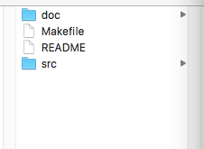

Lua源码目录结构

对应的目录说明如下表：

名称 说明

doc

Lua相关的文档，包括了编译文档、接口文档等

Makefile

编译Lua使用，在这里我们不使用它来进行编译

README

关于Lua的说明文件

src

Lua的源码文件

##3. 编译Lua源码

在这里我们只需要src目录中的源码文件，先打开src目录，将Makefile、lua.c、luac.c三个文件删除掉，需要说明的是lua.c和luac.c文件是用于编译生成lua和luac两个命令不属于解析器的功能，如果不删除可能会导致XCode无法编译通过。

接下来打开XCode创建一个新的项目并把src目录拖入项目中。如下图所示：

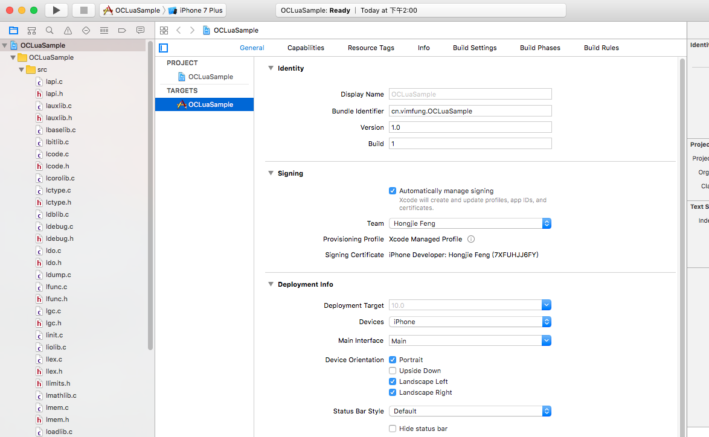

导入Lua源码到项目

然后Command＋B进行编译，提示编译成功！

##4. Lua C Api 与 栈

在开始实现Lua与OC交互之前先来了解两个非常重要的概念，一个是Lua的**C Api**，Lua的脚本解析器是使用C语言来编写的（基于C语言的源码跨平台特性，使得Lua可以在各种系统下面使用），因此它提供了丰富的C语言定义的接口来访问和操作Lua中的所有元素，掌握这些C Api可以更加灵活和方便地扩展Lua的功能，下面的交互实现正是使用这些C Api进行实现的。

另外一个就是**栈**的概念，在Lua和C进行交互数据的时候会用到了一个栈的结构，栈中的每个元素都能保存任何类型的Lua值。要获取Lua中的一个值时，需要调用一个C
Api函数，Lua就会将特定的值压入栈中，然后再通过相应的C Api将值取出来，如图所示：

C/C++获取Lua值

同样，要将一个值传给Lua时，需要先调用C Api将这个值压入栈，然后再调用C Api，Lua就会获取该值并将其从栈中弹出。 如图所示：

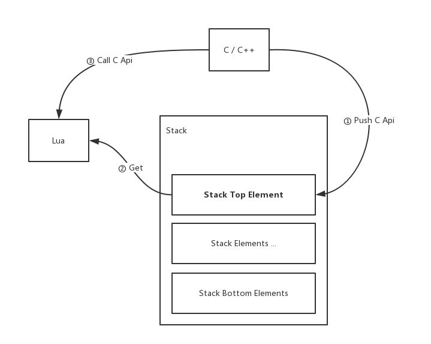

C/C++给Lua传值

这种设计方式主要是为了多种编程语言中统一数据交互中的存取方式，并且方便Lua中的垃圾回收机制的检测。

有了上述所说的概念，下面正式进入主题。

##5. 初始化Lua环境

Lua环境的维护需要一个叫lua_State的结构体来支持，其贯穿了整个执行过程。因此，要使用Lua则需要先初始化一个lua_State结构体。修改View Controller的代码如下：

    
    
    #import "lua.h"
    #import "lauxlib.h"
    #import "lualib.h"
    @interface ViewController ()
    @property (nonatomic) lua_State *state;     //定义一个lua_State结构
    @end
    @implementation ViewController
    - (void)viewDidLoad
    {
        [super viewDidLoad];
        self.state = luaL_newstate();    //创建新的lua_State结构体
        luaL_openlibs(self.state);        //加载标准库
    }
    @end

##6. 关于栈操作的C Api

上面说到数据“栈”的概念，C Api中提供了很多操作栈的功能接口，通常可以分为四大类：入栈操作、查询操作、取值操作和其他操作。

###6.1 入栈操作

表示要将本地的某个类型的值放到数据栈中，然后提供给Lua层来获取和操作。该类操作接口有如下定义：

    
    
    void lua_pushnil (lua_State *L);
    void lua_pushnumber (lua_State *L, lua_Number n);
    void lua_pushinteger (lua_State *L, lua_Integer n);
    const char *lua_pushlstring (lua_State *L, const char *s, size_t len) ;
    const char *lua_pushstring (lua_State *L, const char *s);
    const char *lua_pushvfstring (lua_State *L, const char *fmt, va_list argp);
    const char *lua_pushfstring (lua_State *L, const char *fmt, ...);
    void lua_pushcclosure (lua_State *L, lua_CFunction fn, int n);
    void lua_pushboolean (lua_State *L, int b);
    void lua_pushlightuserdata (lua_State *L, void *p);
    int lua_pushthread (lua_State *L);

从上面的接口方法定义可以看出来，不同的Lua类型对应着不通的入栈接口，包括了整型（Integer）、布尔类型(Boolean)、浮点数（Number）、字符串（String）、闭包（Closure）、用户自定义数据（Userdata）、空类型（Nil）以及线程（Thread）。**需要注意的是，C Api没有提供直接入栈Table类型的接口（估计是该数据类型无法与本地结构进行对应），如果需要入栈一个Table类型，可以使用`lua_createtable`方法来入栈一个Table，调用该方法会在栈顶放入一个Table的引用。**

可见，假如我们需要在原生代码中给Lua的一个全局变量a赋一个整型值，那么可以如下面代码的做法：

    
    
    lua_pushinteger (state, 1);
    lua_setglobal (state, "a");

其中的lua_setglobal方法为设置全局变量的值，该方法会把数据栈顶的元素放入该方法第二个参数所指定的变量名对应的变量中，同时移除栈顶元素。如图：

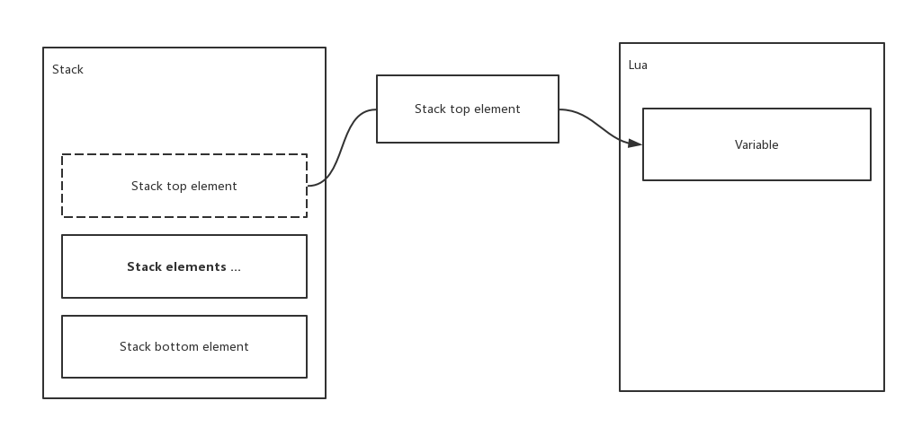

lua_setglobal示意图

###6.2 查询操作

之前说到栈中的每个元素都可以为任意类型，那么，对于如何判断元素的类型就可以通过该类方法来实现。该类方法的定义如下：

    
    
    int lua_isnil (lua_State *state, int index);
    int lua_isboolean (lua_State *state, int index);
    int lua_isfunction (lua_State *state, int index);
    int lua_istable (lua_State *state, int index);
    int lua_islightuserdata (lua_State *state, int index);
    int lua_isthread (lua_State *state, int index);
    int lua_isnumber (lua_State *L, int idx);
    int lua_isinteger (lua_State *L, int idx);
    int lua_iscfunction (lua_State *L, int idx);
    int lua_isstring (lua_State *L, int idx);
    int lua_isuserdata (lua_State *L, int idx)

同样查询操作也是提供了不同的方法来检测不同的类型。其中第二个参数表示要检测类型的元素处于栈中的哪个位置。

关于栈中位置在lua中有两种形式表示，第一种是正数表示法，1表示栈底元素（即最先入栈的元素），然后越往上的元素，索引值越大。另外一种是负数表示法，－1表示栈
顶元素（即最后入栈的元素），然后越往下的元素，索引值越小。如图所示：

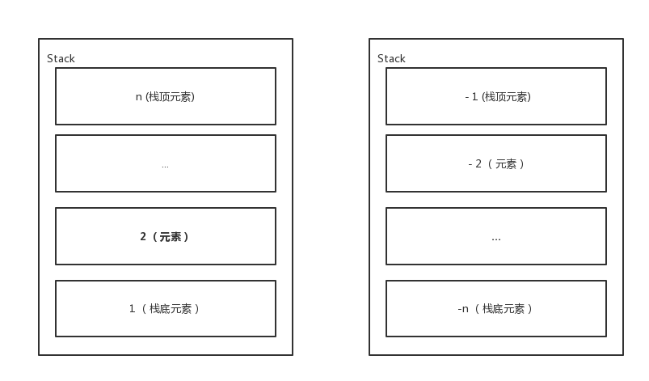

栈索引两种表示方法示意图

lua_isXXX系列方**主要是判断栈中数据是否能够被转换为对应数据类型**时使用，如lua_isstring方法则是判断栈中某个元素是否能够被转换为string类型，所以当栈中数据为number类型时，其返回值也为true。

如果要进行非转换的强类型判断，可以使用`lua_type`方法来获取栈中元素的类型，然后根据类型来获取值。如判断栈顶元素的类型：

    
    
    switch(lua_type(state, -1))
     {
        case LUA_TNUMBER:
            break;
        case LUA_TSTRING:
            break;
        case LUA_TBOOLEAN:
            break;
        case LUA_TUSERDATA:
            break;
        default:
            break;
    }

###6.3 取值操作

栈中的所有元素的获取都是通过该类方法来实现，通常该类方法跟在查询类方法后，当知道某个数据类型后，则调用对应数据类型的取值方法来获取元素。其方法定义如下：

    
    
    int lua_toboolean (lua_State *L, int idx);
    const char *lua_tolstring (lua_State *L, int idx, size_t *len);
    lua_CFunction lua_tocfunction (lua_State *L, int idx);
    void *lua_touserdata (lua_State *L, int idx);
    lua_State *lua_tothread (lua_State *L, int idx);
    const void *lua_topointer (lua_State *L, int idx);
    lua_Integer lua_tointegerx (lua_State *L, int idx, int *pisnum);
    lua_Number lua_tonumberx (lua_State *L, int idx, int *pisnum);

取值操作的接口也相当简单，分别传入lua_State对象和栈索引即可。如果在调用时指定的类型跟栈中类型不同也不会有什么问题，接口会因为类型不正确而返回0或者NULL。

**要注意的是该系列接口跟lua_isXXX系列接口一样，会对原始的类型进行转换输出，因此在做一些跟类型相关的操作时，最好时先判断类型再根据类型调用该方法取值，否则会导致一些意想不到的异常，如下面例子：**
    
    
    //存在targetVar ＝ 1111；
    lua_getglobal(self.state, "targetVar");
    NSString *type = nil;
    if (lua_isstring(self.state, -1))
    {
      const char *str = lua_tostring(self.state, -1);
      NSLog(@"targetVal to string = %s", str);
    }
    switch (lua_type(self.state, -1))
    {
      case LUA_TNIL:
        type = @"Nil";
        break;
      case LUA_TTABLE:
        type = @"Table";
        break;
      case LUA_TNUMBER:
        type = @"Number";
        break;
      case LUA_TSTRING:
        type = @"String";
        break;
      case LUA_TTHREAD:
        type = @"Thread";
        break;
      case LUA_TFUNCTION:
        type = @"Function";
        break;
      case LUA_TBOOLEAN:
        type = @"Boolean";
        break;
      case LUA_TUSERDATA:
        type = @"Userdata";
        break;
      case LUA_TLIGHTUSERDATA:
        type = @"Light Userdata";
        break;
      default:
        type = @"Unknown";
        break;
    }
    NSLog(@"targetVar is %@", type);

上面例子中的原意是要输出下面的内容：

    
    
    targetVal to string = 1111
    targetVar is Number

但是实际上却是这样：

    
    
    targetVal to string = 1111
    targetVar is String

这是由于使用了lua_tostring把栈中的targetVar的值改变了导致的，所以类似这样的操作一定要谨慎。

###6.4 其他操作

使用上述3部分的操作可以满足与栈中数据进行交互的大多数情况。如果需要更加灵活地对栈进行操作，例如拷贝栈中某个元素，交互栈中元素位置等等的操作可以使用下面所定义的接口：

    
    
    int lua_gettop (lua_State *L);
    void lua_settop (lua_State *L, int idx);
    void lua_pushvalue (lua_State *L, int idx);
    void lua_remove(lua_State *L, int idx);
    void lua_insert(lua_State *L, int idx);
    void lua_replace(lua_State *L, int idx);
    void lua_pop(lua_State *L, int n);

其中`lua_gettop`为获取栈顶位置，也即是栈中元素的个数，其实这个方法在处理原生方法的传入参数时很有用，可以确认传入参数的个数。有时候也可以用它来输出各个状态下的栈元素变化，来确认自己在操作栈时是否存在问题。

`lua_settop`方法用于设置栈顶位置，如果新栈顶高于之前的栈顶则会push一些nil的元素来填充；如果新栈顶低于之前的栈顶则会丢弃新栈顶之上的所有元素。如图所示：

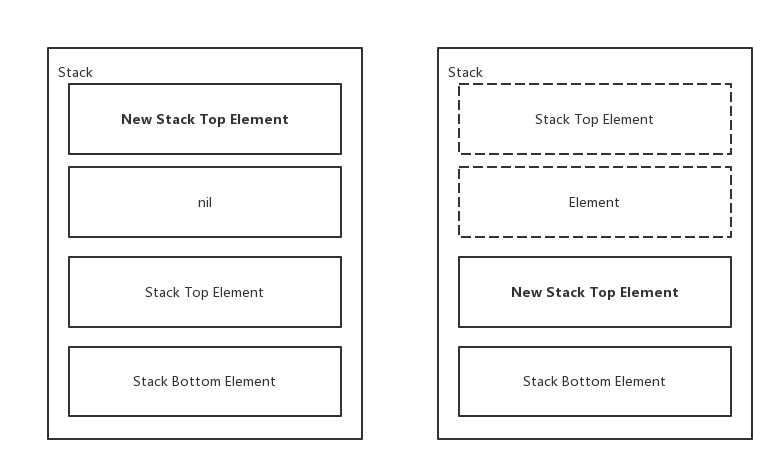

lua_settop示意图

`lua_pushvalue`方法表示将栈中某个元素的副本压入栈顶。之前的栈元素不会发生变动。如图所示：

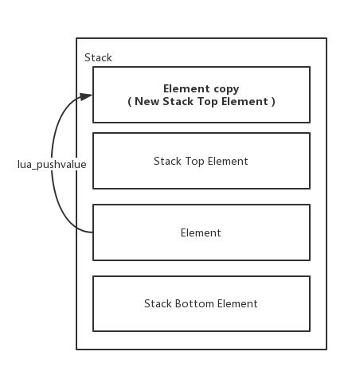

lua_pushvalue示意图

`lua_remove`方法用于移除指定索引上的元素，然后再该元素之上的所有元素会下移填补空缺（即元素的索引会发生变更）。如图所示：

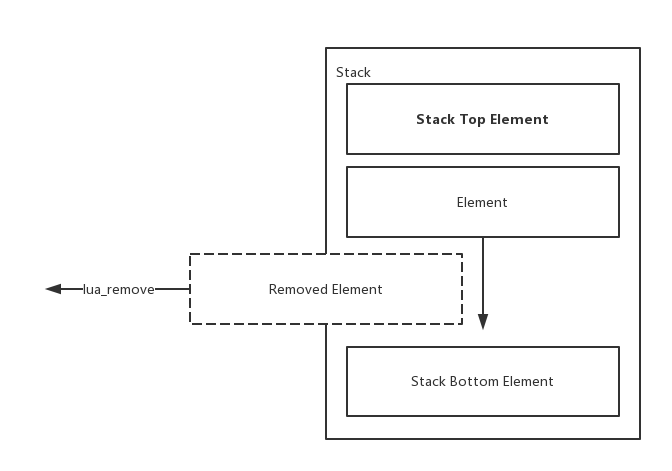

lua_remove示意图

`lua_insert`会将指定索引位置之上的所有元素上移来开辟一个新的位置。然后将栈顶元素插入到该位置。如图所示：

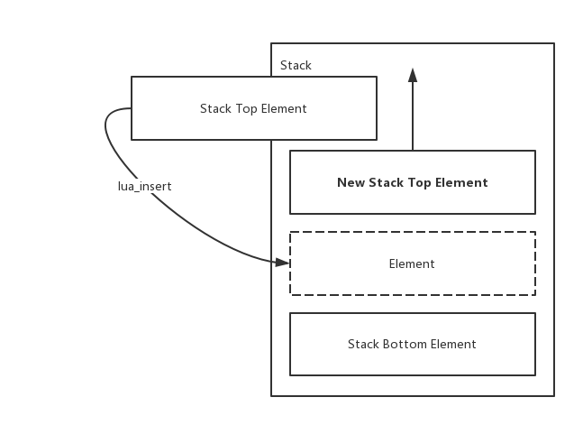

lua_insert示意图

`lua_replace`方法会先弹出栈顶元素，然后将该元素覆盖到指定索引位置上。如图所示：

lua_replace示意图

`lua_pop`方法会从栈顶弹出指定数量的元素。如图所示：

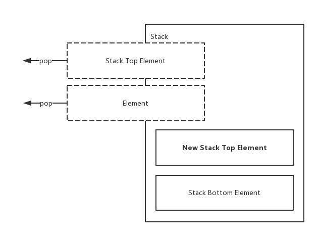

lua_pop示意图

了解了上面的栈操作方法后，下面就是要结合这些方法来实现交互的实际操作。

##7. From OC to Lua

###7.1 空值传递

使用`lua_pushnil`方法可以将任意一个Lua变量置空。如:

    
    
    lua_pushnil();
    lua_setglobal(self.state, "val");

###7.2 数值的传递

使用`lua_pushinteger`或者`lua_pushnumber`方法来将OC中的数值类型传递到Lua中指定的某个变量。如：

    
    
    //传递整型值
    lua_pushinteger(self.state, 1024);
    lua_setglobal(self.state, "intVal");
    //传递浮点型
    lua_pushnumber(self.state, 80.08);
    lua_setglobal(self.state, "numVal");

###7.3 布尔值的传递

使用`lua_pushboolean`方法来实现，如：

    
    
    lua_pushboolean(self.state, YES);
    lua_setglobal(self.state, "boolVal");

###7.4 字符串的传递

使用`lua_pushstring`方法可以传递字符串给Lua，要注意的是该方法接收的是一个c描述的字符串（即 char*）。如：

    
    
    lua_pushstring(self.state, @"Hello World".UTF8String);
    lua_setglobal(self.state, "stringVal");

###7.5 二进制数组的传递

二进制数组在Lua中其实与字符串的存储方式相同，但是OC中不能直接使用`lua_pushstring`来进行二进制数组的传递，可以使用`lua_pushlstring`方法来传递。如：

    
    
    char bytes[13] = {0xf1, 0xaa, 0x12, 0x56, 0x00, 0xb2, 0x43, '\0', '\0', 0x00, 0x90, 0x65, 0x73};
    lua_pushlstring(self.state, bytes, 13);
    lua_setglobal(self.state, "bytesVal");

###7.6 方法的传递

Lua中只能接受C定义的方法传入，并且方法的声明必须符合`lua_CFunction`函数指针的定义，即：

    
    
    int functionName (lua_State *state);

那么，传入方法则需要先定义一个C语言声明的方法，如：

    
    
    int printHelloWorld (lua_State *state)
    {
        NSLog(@"Hello World!");
        return 0;
    }

方法里面简单地进行了一下信息打印，其中方法的返回值是一个整数，表明了该方法需要返回多少个值到Lua中（后续章节会进行返回值的相关演示），现在不需要返回值则为
0。然后，再通过`lua_pushcfunction`方法将方法传入：

    
    
    lua_pushcfunction(self.state, printHelloWorld);
    lua_setglobal(self.state, "funcVal");

操作完成后，在Lua中就可以直接调用了：

    
    
    funcVal();

如果定义的方法是允许接受参数的，那么可以从state参数里面获取传入的参数。拿上面的例子，例如方法接收一个名字的字符串参数，函数的代码则可以修改为：

    
    
    int printHelloWorld (lua_State *state)
    {
        if (lua_gettop(state) > 0)
        {
            //表示有参数
            const char *name = lua_tostring(state, 1);
            NSLog(@"Hello %s!", name);
        }
        return 0;
    }

然后在Lua中则可以这样调用：

    
    
    funcVal ("vimfung");

如果定义的方法不是直接打印字符串，而是组合了字符串给Lua返回，那么定义的方法里面则需要配合'lua_pushXXXX'系列方法来进行返回值传递。**需要注意的是：方法中return的数量要与push到栈中的值要一致，否则可能出现异常。**那么，上面定义的函数可以做如下修改：

    
    
    int printHelloWorld (lua_State *state)
    {
        if (lua_gettop(state) > 0)
        {
            //表示有参数
            const char *name = lua_tostring(state, 1);
            //入栈返回值
            NSString *retVal = [NSString stringWithFormat:@"Hello %s!", name];
            lua_pushstring(state, retVal.UTF8String);
            return 1;
        }
        return 0;
    }

然后在Lua中则可以这样调用：

    
    
    local retVal = funcVal("vimfung");
    print(retVal);

###7.7 数组和字典的传递

在Lua中，数组（Array）和字典（Dictionary）都由一个Table类型所表示（**在Lua看来数组其实也属于一种字典，只是它的key是有序并且为整数**）。如：

    
    
    -- 定义数组
    local arrayVal = {1,2,3,4,5,6};
    -- 定义字典
    local dictVal = {a=1, b=3, c=4, d=5};

上面的例子分别用了不带key的声明和带key的声明两种方式来创建Table类型。其中不带key的声明方式，解析器会默认为其创建一个key，该key是从1开始，由小到大进行分配，其等效于：

    
    
    local arrayVal = {1=1, 2=2, 3=3, 4=4, 5=5, 6=6};

当然，两种方式是可以混合使用，如：

    
    
    local tbl = {1, 2, a=1, b=2, 3};

Table属于比较复杂的数据结构，因此提供操作它的C Api也比较复杂，下面将根据数组和字典分别讲述它们的传递方式。

####7.7.1 数组传递

首先，需要将一个Table类型入栈，这样才能对其进行进一步的操作。由于没有pushtable这样的方法，但是可以使用`lua_newtable`来创建一个Table对象，并且该对象会自动放入栈顶位置。如：

    
    
    lua_newtable(self.state);

然后对要传递的数组进行遍历，并通过`lua_rawseti`方法将元素值设置到Table中。如：

    
    
    NSArray *array = @[@1, @2, @3, @4, @5, @6];
     [array enumerateObjectsUsingBlock:^(id  _Nonnull obj, NSUInteger idx, BOOL * _Nonnull stop) {
        NSInteger value = [obj integerValue];
        lua_pushinteger(self.state, value);
        lua_rawseti(self.state, -2, idx + 1);
    }];
    lua_getglobal(self.state, "arrayVal");

通过上面的代码就可以把一个数组传递给arrayVal变量。值得注意的是：`lua_rawseti`方法表示要栈顶的元素设置给指定的Table对象的指定索引。
其中的第二个参数是指Table对象在栈中的位置，第三个参数是表示在Table中的索引，一般索引是从1开始算起，因此上面代码中的idx需要加1。经过这样的操作后，**栈顶的元素会被移除**。如下图所示：

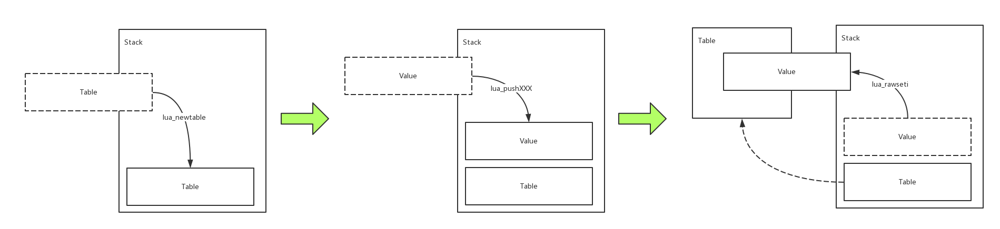

lua_rawseti示意图

####7.7.2 字典传递

字典的传递同样需要先入栈一个Table：

    
    
    lua_newtable(self.state);

然后对要传递的字典进行遍历，并通过`lua_setfield`方法将元素设置到Table中。如：

    
    
    [dict enumerateKeysAndObjectsUsingBlock:^(NSString * _Nonnull key, id  _Nonnull obj, BOOL * _Nonnull stop) {
        NSInteger value = [obj integerValue];
        lua_pushinteger(self.state, value);
        lua_setfield(self.state, -2, key.UTF8String);
    }];
    lua_setglobal(self.state, "dictVal");

`lua_setfield`与`lua_rawseti`功能类型，都是把一个元素放入Table中，只是一个用于指定整数索引，一个是指定字符串索引。通过上面的方式就可以把字典传递给Lua了。

###7.8 自定义数据传递

Lua中一个比较强大的地方是它可以将任意的类型（包括类对象）进行传递。特别是在提供原生处理方法时，需要用到一些特定的数据类型作为参数时，Lua就可以帮我们实
现这一块的传递。

要想传递自定义的数据则必须要使用Lua提供的Userdata类型。该类型有两种引用方式，一种是强引用Userdata，由Lua的GC来负责该类型变量的生命周期。另外一种是弱引用Userdata，又称Light Userdata，该类型不被GC所管理，其生命周期由原生层来决定。下面来看一下两种方式是如何实现的。

首先我们来定义一个OC的User类：

    
    
    @interface User : NSObject
    @property (nonatomic, copy) NSString *name;
    @end
    @implementation User
    @end

然后，利用`lua_newuserdata`方法来创建一个强引用Userdata，并创建一个User对象赋值给新建的Userdata。如：

    
    
    void *instanceRef = lua_newuserdata(self.state, sizeof(User *));
    instanceRef = (__bridge_retained void *)[[User alloc] init];
    lua_setglobal(self.state, "userdataVal");

通过上面的代码就可以把User类实例封装成Userdata再传递给Lua。如果你要传递的对象并不需要Lua来管理生命周期，那么就可以创建一个弱引用的User data，如：

    
    
    User *user = [[User alloc] init];
    lua_pushlightuserdata(self.state, (__bridge void *)(user));
    lua_setglobal(self.state, "userdataVal");

下面来看一个比较实际的例子，假设有一个提供给Lua调用的原生接口printUser，该接口会打印传入进来的用户信息，代码如下：

    
    
    static int printUser (lua_State *state)
    {
        if (lua_gettop(state) > 0)
        {
            //表示有参数传入
            User *user = (__bridge User *)(lua_topointer(state, 1));
            NSLog(@"user.name = %@", user.name);
        }
        return 0;
    }

该方法通过`lua_topointer`方法来获取了一个Userdata数据类型并转换为User类实例对象然后打印其名称。接下来将其导出给Lua：

    
    
    lua_pushcfunction(self.state, printUser);
    lua_setglobal(self.state, "printUser");

然后生成一个User对象，并调用该方法传入该用户对象。如：

    
    
    //创建User对象
    User *user = [[User alloc] init];
    user.name = @"vimfung";
    lua_getglobal(self.state, "printUser");
    //传入User参数
    lua_pushlightuserdata(self.state, (__bridge void *)(user));
    lua_pcall(self.state, 1, 0, 0);

上面的代码就是使用C Api来调用Lua的方法（下面的章节会详细讲述这块内容），通过OC代码创建了一个User对象并将其作为了参数传给了Lua的printUser方法。最终的输出信息如下：

    
    
    user.name = vimfung

从OC到Lua的所有类型的转换和交互基本上都涉及到了，下面章节将会详细描述从Lua到OC上的一些交互和数据交换。

##8. From Lua to OC

###8.1 获取数值

通过`lua_tonumber`方法可以获取某个数值变量的值。如：

    
    
    lua_getglobal(self.state, "aa");
    double value = lua_tonumber(self.state, -1);
    NSLog(@"aa = %f", value);
    lua_pop(self.state, 1);

上述代码中的`lua_getglobal`方法是用于获取全局变量的值，调用它会把一个值放入栈顶。然后再通过`lua_tonumber`把栈顶的值读取出来并打印。**需要注意的是通过`lua_getglobal`获取得到的值，在栈中是不会自动清除，因此，在用完某个变量时记得把它从栈中清除掉**，代码中是通过`lua_pop`把值弹出栈的。

###8.2 获取布尔值

与获取数值相同，通过`lua_toboolean`方法来获取某个布尔变量的值。如：

    
    
    lua_getglobal(self.state, "aa");
    BOOL value = lua_toboolean(self.state, -1);
    if (value)
    {
      NSLog(@"aa = YES");
    }
    else
    {
      NSLog(@"aa = NO");
    }
    lua_pop(self.state, 1);

###8.3 获取字符串

`lua_tostring`方法来获取字符串变量的值。如：

    
    
    lua_getglobal(self.state, "aa");
    const char *value = lua_tostring(self.state, -1);
    NSLog(@"aa = %s", value);
    lua_pop(self.state, 1);

###8.4 获取二进制数组

`lua_tolstring`方法来获二进制数组变量的值。如：

    
    
    lua_getglobal(self.state, "aa");
    size_t len = 0;
    const char *bytes = lua_tolstring(self.state, -1, &len);
    NSData *data = [NSData dataWithBytes:bytes length:len];
    NSLog(@"aa = %@", data);
    lua_pop(self.state, 1);

###8.5 方法的获取和调用

一般情况下，要获取Lua中的某个Function主要是用于对其进行调用。假设有一个Lua方法定义如下：

    
    
    function printHelloWorld ()
      print("Hello World");
    end

那么，对应OC中需要下面的代码来获取和调用它：

    
    
    lua_getglobal(self.state, "printHelloWorld");
    lua_pcall(self.state, 0, 0, 0);

上述代码中的`lua_pcall`方法表示将栈中的元素视作Function来进行调用。其中第二个参数为传入参数的数量，必须与压栈的参数数量一致；第三个参数为返回值的数量，表示调用后其放入栈中的返回值有多少个。第四个参数是用于发生错误处理时的代码返回。其运行原理如下图所示：

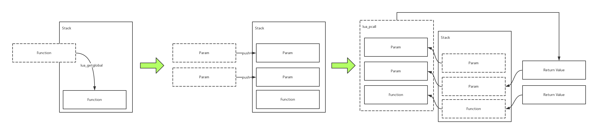

lua_pcall原理示意图

对于带参数和返回值的方法，在获得方法对象后，需要调用`lua_pushXXX`系列方法来设置传入参数。可以参考下面例子：

假设有一个加法的Lua方法，其定义如下：

    
    
    function add (a, b)
      return a + b;
    end

那么，OC中则可以进行下面操作来调用方法并传递参数，最终取得返回值然后打印到控制台：

    
    
    lua_getglobal(self.state, "add");
    lua_pushinteger(self.state, 1000);
    lua_pushinteger(self.state, 24);
    lua_pcall(self.state, 2, 1, 0);
    NSInteger retVal = lua_tonumber(self.state, -1);
    NSLog(@"retVal = %ld", retVal);

###8.6 Table的获取和遍历

Table的获取跟其他变量一样，一旦放入栈后可以根据需要通过调用`lua_getfield`方法来指定的key的值。如：

    
    
    //假设Lua中有一个Table变量aa = {key1=1000, key2=24};
    lua_getglobal(self.state, "aa");
    lua_getfield(self.state, -1, "key2");
    NSInteger value = lua_tonumber(self.state, -1);
    NSLog(@"value = %ld", value);
    lua_pop(self.state, 1);

如果Table是声明时没有指定key，那么则需要调用`lua_rawgeti`来获取Table的值。如：

    
    
    //假设Lua中有一个Table变量aa = {1000, 24};
    lua_getglobal(self.state, "aa");
    lua_rawgeti(self.state, -1, 2);
    NSInteger value = lua_tonumber(self.state, -1);
    NSLog(@"value = %ld", value);
    lua_pop(self.state, 1);

有时候，Table存储的信息会在函数体外被访问，那么我们需要对Table进行遍历然后把它放入一个字典中，然后提供给程序使用。代码如下：

    
    
    //假设Lua中有一个Table变量aa = {1000, 24};
    lua_getglobal(self.state, "aa");
    lua_pushnil(self.state);
    while (lua_next(self.state, -2))
    {
      NSInteger value = lua_tonumber(self.state, -1);
      if (lua_type(self.state, -2) == LUA_TSTRING)
      {
        const char *key = lua_tostring(self.state, -2);
        NSLog(@"key = %s, value = %ld", key, value);
      }
      else if (lua_type(self.state, -2) == LUA_TNUMBER)
      {
        NSInteger key = lua_tonumber(self.state, -2);
        NSLog(@"key = %ld, value = %ld", key, value);
      }
      lua_pop(self.state, 1);
    }

上述代码利用`lua_next`方法来遍历Table的所有元素，该方法从栈顶弹出一个元素作为遍历Table的起始Key，然后把每个元素的Key和Value放入栈中。为了遍历所有元素所以起始的Key设置了一个nil值，证明要从Table最开始的Key进行遍历。如图：

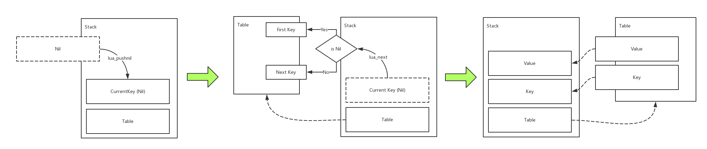

lua_next原理示意图

**值得注意的是，在获取Key值时，最好先判断Key的类型，然后再根据其对应类型调用相应的`lua_toXXX`方法。否则，因为`lua_toXXX`系列方法会对元素值进行类型转换，如整型的Key被`lua_tostring`转换为String后再给到`lua_next`进行遍历就会报找不到指定Key的错误。**

###8.7 获取自定义数据

利用`lua_topointer`方法来获取自定义数据，如：

    
    
    lua_getglobal(self.state, "ud");
    NSObject *obj = (__bridge User *)(lua_topointer(state, 1));

##9. 结语

Lua虽然小巧，但五脏俱全。最主要的是它提供了丰富又强大的C Api接口允许我们进行高度的定制和扩展。可利用这些扩展特性开发适合自己的一套脚本引擎。基于上面
所讲的，鄙人开发了一个[LuaScriptCore](https://github.com/vimfung/LuaScriptCore)的开源桥接框架，简化Lua与各种平台的交互，有兴趣的同学可以了解一下。

最后，希望通过本篇文章能够让大家对OC与Lua之间的交互有更近一步的了解，创造更多的可能性。

