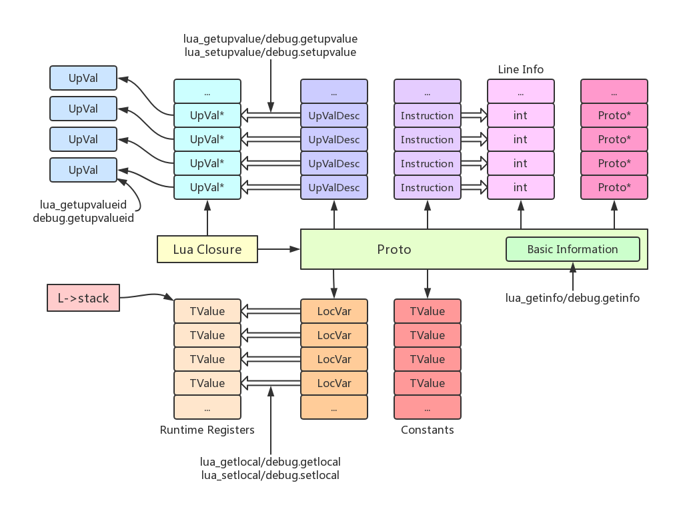
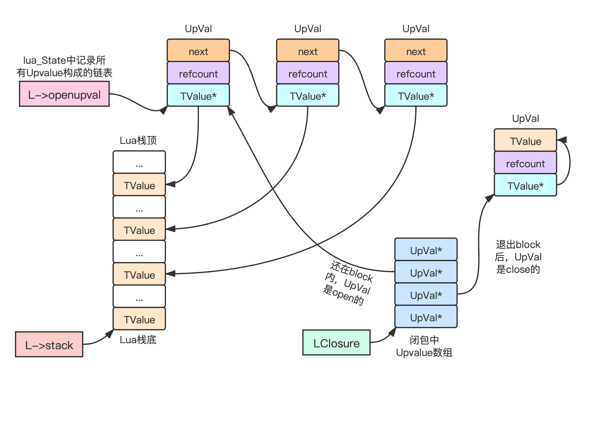
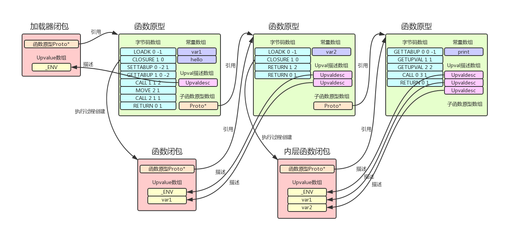
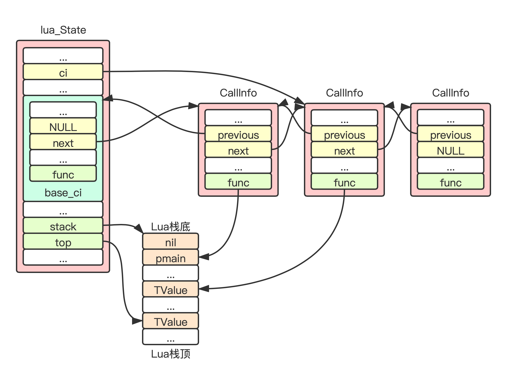
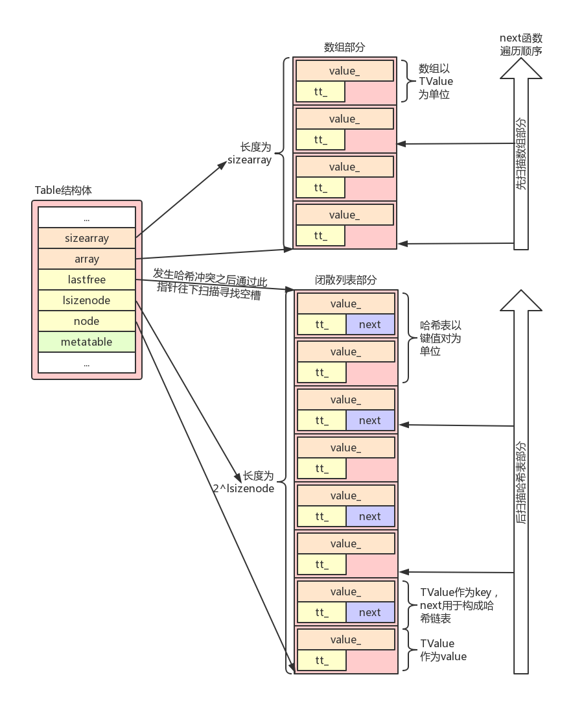
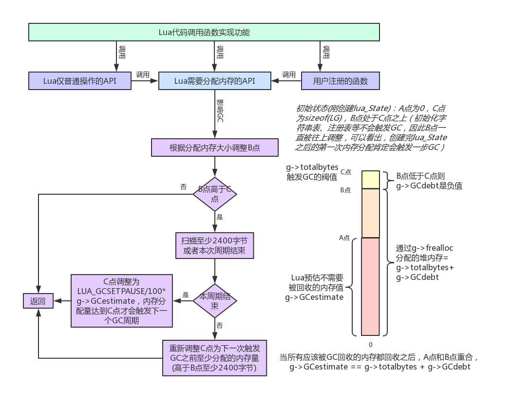
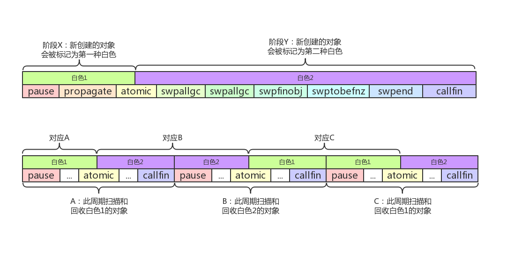
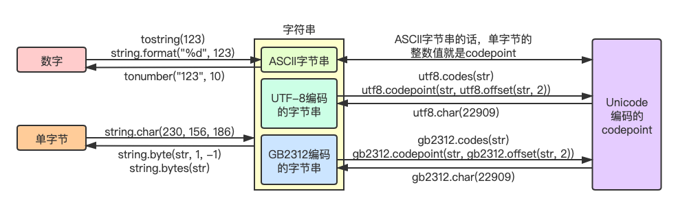

<!--BEGIN_DATA
{
    "create_date": "2022-04-07 12:40", 
    "modify_date": "2022-04-07 12:40", 
    "is_top": "0", 
    "summary": "Lua细节归纳", 
    "tags": "Lua", 
    "file_name": "Lua细节归纳.md"
}
END_DATA-->

#### <p>原文出处：<a href='https://km.woa.com/articles/show/518467?kmref=author_post' target='blank'>Lua细节归纳</a></p>

我自己在写Lua代码或者通过C/C#去操作Lua虚拟机的时候，时常会对一些Lua中的概念和行为产生困惑，在这里进行一个归纳，归纳过程参考了如下资料：

  1. Lua5.3.5[官方源码](https://www.lua.org/)
  2. Lua5.3[参考手册](https://cloudwu.github.io/lua53doc/manual.html)（云风 翻译）
  3. 《Lua程序设计》第四版，作者Roberto Ierusalimschy，梅隆魁 翻译
  4. 《Lua设计与实现》作者codedump

## 代码被执行的过程

  1. Lua代码==>编译==>函数原型==>Lua闭包==>执行闭包（执行字节码）
  2. Lua闭包=函数原型+Upvalue数组
  3. 函数原型=字节码数组+常量数组+Upvalue描述数组+子函数原型数组+调试信息
  4. 函数原型本身是一个递归的设计，原型内部包含了其他子原型（Proto也接受gc的管理）
  5. 函数原型是编译Lua代码的产物，闭包是在执行字节码的过程生成的
  6. 编译结束之后、执行字节码之前，Lua的API会自动创建一个闭包来作为执行字节码的入口，这个入口闭包也叫Lua模块加载器（这个入口闭包有且只有一个Upvalue，在Lua代码中表示为`_ENV`，其值为全局表。并且，其总是以不定参数的形式存在。对于其他非入口闭包，环境表可能存在于Upvalue的任意位置）

基于上述理解，对于如下test.lua文件的代码：

```lua
local a = 10
b = a + 2
print("a is", a, "b is", b)
```

在Lua编译器的视角看，是这样的：

```lua
local _ENV = (debug.getregistry())[2]

return function loader(...)
    local a = 10
    _ENV.b = a + 2
    _ENV.print("a is", a, "b is", _ENV.b)
end
```

其中，loader代表Lua自动生成的闭包（加载器），文件作用域中写的每一句代码都属于loader函数的作用域内，这里也说明了为什么Lua不需要main函数！

函数原型与debug模块API示意图：



## 闭包与Upvalues

生成一个闭包的过程：

  1. Lua提供了创建Lua闭包的字节码指令：OP_CLOSURE A Bx ==> R(A) := closure(KPROTO[Bx]) // KPROTO表示当前(父)函数的子函数原型数组
  2. 创建一个Closure对象(就是调用g->frealloc分配内存)，将其函数原型字段赋值为1中获取到函数原型
  3. 根据该函数原型中Upvalue描述数组中的记录，为该闭包的Upvalue数组初始化
  4. 在R(A)寄存器中建立新闭包的索引（寄存器是字节码层次的概念，其实就是放在Lua栈里）

关于闭包的Upvalue：

  1. Lua栈（L->stack）为`lua_TValue`的数组，每一个槽是一个`lua_TValue`结构体
  2. L->openupval是一个指向UpVal结构体的指针，记录的是所有引用了栈中槽的Upvalue，利用Upval.u.open.next形成一个单向链表，低内存地址的槽在链底，高内存地址的槽在链表头，也就是说，这个链表从表头到表尾，严格遵循Upval.v的值递减，L->openupval指向链表头
  3. 不会有两个Upval结构体的v指向同一个Lua栈的槽，这是Upval.refcount引用计数存在的意义
  4. LClosure->upvals是UpVal结构体指针的数组，每一个槽是一个指向UpVal的指针，每次Lua需要访问其函数的Upvalue，都需要通过对应UpVal的v字段来间接访问`lua_TValue`，因为在整个过程中v的值可能会变，原本Open的Upvalue变成Close（Open变为Close的时机：从语言角度为退出作用域的时候，从代码的角度为退出block的时候）
  5. Lua中闭包每次访问Upvalue都需要经历两次指针解引用间接寻址，要访问第i个Upvalue，需通过LClosure->upvals[i]得到UpVal指针，拿到到其中的v字段，就是`lua_TValue`结构体的指针，通过这个指针才是真正访问到对应的变量`lua_TValue`（做个间接访问的必要性在于实现延长栈局部变量的生命周期）
  6. Lua闭包中只能访问两种变量，本函数内定义的局部变量 和 本函数的Upvalue
  7. debug.setupvalue是设置闭包某个Upvalue的值（更改UpVal.v指针的所指向TValue的值），debug.upvaluejoin是更改Upvalue的引用（更改UpVal指针数组以引用别的UpVal）  
```c
struct UpVal {
    TValue *v; // 访问此Upvalue的入口，这是一个指向TValue的指针，可能指向Lua栈的某个槽，或者指向自身u.value
    lu_mem refcount; // 本Upvalue的引用计数
    union {
        struct { // 当此v指向的Lua栈中某个槽时，联合体的这个字段有效，Lua中称此时的Upvalue是Open的
            UpVal *next; // 用于构成L->openval链表
            int touched;  /* mark to avoid cycles with dead threads */
        } open;
        TValue value; // 当v指向的Lua栈槽需要被释放的时候，用于保存Lua栈槽的具体数值，就是说超越函数生命周期的Upvalue就保存在这个字段
    } u;
};
typedef struct UpVal UpVal;
```

Lua闭包的Upvalue延长变量生命周期原理图：



Lua中还有一种C语言闭包：

  1. C闭包拥有一个C函数和一系列的UpValue
  2. lua_pushcclosure操作对UpValue是值拷贝（多个C闭包之间无法共享UpValue，要共享数据只能是各自的UpValue指向同一个Table之类的形式）
  3. C闭包也同样能被Lua调用
  4. C闭包最多拥有255个UpValue，`lua_upvalueindex`支持的最大索引数值是256（比255多1的目的估计是方便在遍历UpValue的时候判断遍历结束，类似C语言循环中判断数组元素是否为NULL）

debug.getupvalue可以获得C闭包Upvalue的值，函数第一个返回值为Upvalue的名称：

  1. 该名称为nil该函数不存在此 Upvalue
  2. 该名称为空字符串表示该函数是一个C闭包（C闭包的Upvalue没有名称）
  3. 该名称为"(*no name)"表示此Upvalue没有名称（Upvalue的名称属于调试信息，并非运行时必备，使用luac命令编译时带上-s参数可去掉这些调试信息，再加载就没有名称了）

## 代码段编译示例

对于如下Lua代码：

```lua
local var1 = "var1"

function hello()
    local var2 = "var2"
    return function()
        print(var1, var2)
    end
end

local hi = hello()
hi()
```

通过Lua全局函数load或者C函数`luaL_loadstring`来编译上述代码片段，我们会得到一个Lua闭包，此时，相关数据结构图如下（命令luac -p -l -l xxx.lua可以明确打印出Lua代码的编译结果）：



此代码块中，全局的hello函数并无直接使用var1（也没有直接调用全局表的函数），但是其函数原型中依然存在有两个Upvalue的描述，这是因为：

  1. 在函数hello中定义的新函数所引用的内容，也需要hello函数传递其引用
  2. 对于存在于Lua栈的临时变量var1，在加载器闭包执行完毕return的时候，hello闭包被创建，但是hello所return的那个闭包不一定被创建（除非hello函数被调用）
  3. 如果hello函数在此期间没有被调用，则需要其创建的新闭包也没有被创建，此时hello函数不引用一下var1变量，var1变量的生命周期则得不到延长

更通用的描述如下：

  1. 闭包A中定义了闭包B，闭包B中定义了闭包C，当C需要用到A中的局部变量a，则a必须为B的Upvalue（即使B中并没有显式用到a）
  2. 执行B中的代码新建C闭包的时候，此时是在B的环境内，则只能访问B内局部变量和B的Upvalue（就是说B需要为C接住C需要的Upvalue）

关于Lua函数访问局部变量使用的索引：（函数局部变量就是寄存器）

  1. 注册到Lua的C函数：索引从1开始，基于L->ci->func，也就是pcall所调用函数的位置
  2. 固定参数的Lua函数：Lua指令对寄存器的索引从0开始，基于base=L->ci->func+1
  3. 不定参数的Lua函数：Lua指令对寄存器的索引从0开始，基于base=L->top（Lua栈是向上生长的空栈，因此base指向实际传递参数的下一个槽）
  4. 带有固定参数的不定参数Lua函数：与不定参数的Lua函数一样，外加将固定参数复制一份放到base之后的槽中，营造固定参数的环境

Lua为不定参数专门设计了一条指令：OP_VARARG A B ==> R(A), R(A+1), ..., R(A+B-2) = vararg，每一次代
码用采用”…"操作符获取不定参数时，都会生成这条指令（固定参数的值可被直接修改，不定参数的值无法被直接修改，只能通过VARARG指令获取其副本）。另外，“…
”操作符只有一个获取不定参数副本的功能，无法通过该操作符来接收多个返回值。

Lua函数调用嵌套层次：



## 模块加载

关于Lua模块：

  1. 一个Lua模块一定会有一个加载器函数，加载该模块就是运行该模块的加载器函数
  2. Lua模块可以有两种实现方式：a. 用Lua代码写逻辑并保存成一个文件(或字符串) b. 用C语言调用 Lua C API 写逻辑并编译成函数库(`.a/.so/.dll`)
  3. 每一个Lua文件（或者Lua源码字符串）都会被编译成一个Lua闭包，此闭包就是该Lua模块的加载器（所有Lua代码文件，都属于Lua模块）
  4. C语言调用LuaCAPI来写Lua模块的话，需要自己实现加载器函数，名称固定为：`luaopen_xxx`，其中xxx代表模块名称
  5. 动态库类型的Lua模块，编译链接的时候需要与可执行文件App共用同一个luaVM库，否则运行时无法正确加载

关于搜索器（searcher）：

  1. Lua官方实现中，加载一个Lua模块或者C模块的时候，是先去找到对应的加载器（通过预先设计好的searcher去寻找加载器），然后运行该加载器去加载对应模块，这里说的加载器对于Lua文件来说就是Lua文件经过编译之后默认创建的闭包，对于C库来说，就是`luaopen_libxxx`函数
  2. 我们可以自定义searcher，只要将我们设计好的函数存放到package.searchers表的数组部分，Lua会从数组下标1（对应Table中数组部分的下标0）开始依次调用searcher，直到某个searcher返回加载器函数（设计模式中的职责链模式）
  3. Lua调用searcher会传递一个参数进去（模块名称），并要求每个searcher都返回两个值，第一个是加载器函数，第二个是对应文件的绝对路径（对于`preload_searcher`，其返回值为加载器函数+nil，因为此时并不需要从某个文件去加载该Lua模块）
  4. Lua调用加载器的时候所传递的参数：对于预先配置好的加载器(在package.preload中)，传递模块名称+nil，对于Lua文件模块的加载器和C库的luaopen加载器，则传递模块名称+对应文件完整路径
  5. 模块被加载完之后，package.loaded所存放的键值对为 模块名==>加载器执行完的第一个返回值，假如模块执行完并没有返回值且package.loaded[模块名]为空，那么为其赋值为bool类型的true，同时，package.loaded中键值对的值等于require函数的返回值
  6. load、loadfile、dofile这三个函数加载、编译、执行Lua代码，不会影响package.loaded（也就是不属于Lua模块的管理范围）
  7. preload加载器：直接返回 `G->registry._PRELOAD.ModuleName`（`luaopen_ModuleName`格式的函数名），其实就是package.preload表
  8. Lua加载器：在package.path中根据模块名查找Lua文件，并调用`luaL_loadfile`函数去编译该Lua文件，之后返回编译结果的Lua闭包+Lua文件的绝对路径
  9. C加载器：在package.cpath中根据模块名查找C语言动态加载库，并调用dlopen去打开这个动态库和调用dlsym查找luaopen_ModuleName函数，之后返回`luaopen_ModuleName`函数+动态库文件的绝对路径

## `_G.require(modname)`函数

require函数既可以加载Lua语言写的模块，也可以加载C语言写的模块，运行流程如下：

  1. 检索Registry._LOADED（也就是package.loaded）是否已经存在modname字段，存在则直接返回该value
  2. 从1开始依次调用package.searchers中的searcher（搜索器），直到某个searcher的第一个返回值是一个函数，这个函数就是加载器（所有searcher都执行完了还没找到加载器，那就longjmp抛异常）
  3. 调用该加载器加载模块，并将加载器的第一个返回值（或true）作为`Registry._LOADED.modname`的值

以下用Lua语言来实现require函数的流程：（这不是伪代码，真实可以运行的，比C语言实现的版本效率稍微低一点而已）

```lua
function require(modname)
    local loadedVal = package.loaded[modname]

    if loadedVal then
        return loadedVal
    end

    local errorMsg = ""

    for _, searcher in ipairs(package.searchers) do
        local loader, absPath = searcher(modname)
        local typeOfLoader = type(loader)

        if typeOfLoader == "function" then
            local ret = loader(modname, absPath)

            if ret ~= nil then
                package.loaded[modname] = ret
            else
                local origin = package.loaded[modname]

                if origin == nil then
                    ret = true
                    package.loaded[modname] = true
                else
                    ret = origin
                end
            end

            return ret

        elseif typeOfLoader == "string" then
            errorMsg = errorMsg .. loader
        else
            -- should not run here
        end
    end

    error("module " .. modname .. " not found:" .. errorMsg)
    -- no way to here
end
```

基于对require函数实现流程的理解，考虑一个问题：两次对同一个模块调用require，会发生什么事情？这里分为两种情况：

  1. 直接连续的两个require同一个模块（由于package.loaded[modname]第一次require的时候记录了该模块已经被加载过，第二次require就直接return了，什么都没做）
  2. 在第一次require之后，执行package.loaded[modname] = nil

对于第二种情况，按照require函数的执行流程，我们可以得到如下结论：

  1. searcher函数和模块对应的loader函数，都会被再次执行
  2. 对于C模块，两次require中查到的loader函数肯定是同一个（C动态库不支持热替换，直接强制替换so文件也必须强制触发CLIBS的gc或者重启VM才行）
  3. 对于Lua模块，两次require中查到的loader闭包一定不是同一个（Lua代码文件支持热替换，因为每次read所有字符后就直接将文件close了，源码可能被改了，另外，即使源码保持不变，重新编译同一份源码得到的闭包也是新的（新函数原型），与旧闭包肯定不是同一个了）
  4. package.loaded[modname]对应的值会被更新

我们知道，loader闭包就是Lua源码文件被编译成的Lua闭包，假如我们在这个闭包内去操作全局表，那么，第二次require执行之后，全局表也会再次被操作，其中的条目会更新。另外，模块互相 require 会导致死循环！

扩展话题：

  1. 如何自己设计一个searcher（搜索器）？（搜索器函数原型为接收一个模块名为参数，返回加载器和模块绝对路径两个值）
  2. 如何在不关闭VM的情况下，触发Lua卸载动态加载库？（通过dlclose函数去卸载动态库）

## 泛型for

以下两个代码段具备相同功能：

```lua
for var_1, var_2, ..., var_n in explist do block end

do
    local _next, _invariant, _key = explist

    while true do
        local var_1, var_2, ..., var_n = _next(_invariant, _key)
        _key = var_1
        if _key == nil then break end
        block
    end
end
```

显然，explist仅仅是用于构造迭代函数和初始状态，迭代函数在每一次迭代都会被调用，并传入初始状态或者上一次迭代的状态；泛型for支持嵌套，表达能力强，合理利用泛型for，能让代码更具可读性。

Lua自带的函数中，能够与泛型for配合使用的有：

  1. `_G.pairs`
  2. `_G.ipairs`
  3. string.gmatch
  4. utf8.codes
  5. io.lines
  6. file:lines
  7. coroutine.wrap

## 字符串

  1. Lua字符串的实现也是在系统进程堆空间申请了内存来存放字符串对象
  2. 每一个通过`lua_pushliteral`、`lua_pushstring`、`lua_pushlstring`、`lua_pushvfstring`之类的操作压入Lua栈的字符串，都会被Lua深复制一份放到VM中字符串对象TString的尾部
  3. VM内部还会区分长字符串和短字符串，默认的区分长度为40个字节
  4. 长字符串作为单独TString对象存在，短字符串才接受全局字符串内化表的管理
  5. 字符串内化表是单独的开散列哈希表，并不是Table
  6. 内化表有诸多好处，比如短字符串的TString对象在VM内部不会出现重复、比较可以直接比较地址来确定TString对象是否为同一个
  7. `lua_pushstring`多次同一个C短字符串，你会得到同一个TString对象的引用
  8. 由于短字符串的比较实现为对象地址的比较，我们不需要担心大量的字符串比较会影响运行效率

lua5.3.5虚拟机会自动将字符串转换成数字的三种情况：

  1. for循环控制块
  2. 算数运算
  3. 编译过程（源码是以字符串的形式存在，遇到数字则需要做转换）

## 表(Table)

  1. Table本身底层结构体包含C数组部分和C闭散列表部分（这两部分都是实现为C数组，支持间断的数组下标赋值）
  2. Lua插入数据到某个Table（rawset），对于数字类型的key，数组部分能容下则直接赋值并返回，其他情况都是插入闭散列哈希表部分，哈希表满了再rehash并重新规划数组部分的长度（此时value为nil也依旧会触发rehash，哈希表满了表示所有节点都被使用过了并且当前插入位置产生了哈希冲突，并不代表哈希表中不存在nil的value）
  3. Table中数组部分和哈希表部分占用的内存空间只在rehash过程可能会变动
  4. 针对某个Table，如果仅使用连续的整数作为key，则Table中哈希表部分永远指向假节点（`dummynode_`，不分配内存）
  5. for+pairs/next（底层是`lua_next`函数）对table进行遍历的时候，必须保证table的key是不变的（遍历过程用户可以修改某个key对应的value，也可以置为nil，如果你往table中加入新key-value，你必须保证table不触发rehash（极少情况可以保证不触发rehash），并且此次遍历不一定会扫描到新加的key-value）
  6. 如果for+pairs/next遍历table的过程中table触发了rehash，则可能出现同一个key-value被扫描多次，有的key-value没被扫描到，或者找不到原来的key而遍历报错



关于Table的长度：

  1. Lua中`#`操作符对Table来说，底层实现是检查该Table的元表是否有`__len`字段，有则调用该元方法，无则调用rawlen
  2. 对一个Table调用rawlen的语义是将Table当成从1开始连续不间断数组并获得该数组的长度，在实际使用的时候只有在将Table当成连续不间断的数组那样来操作`(table.insert/table.remove)rawlen(或#操作符)`才有意义
  3. Table底层对于rawlen的实现：Lua用C数组部分的最后一个元素是否为nil来判断该边界是在数组部分还是在哈希表部分，在数组部分则Lua仅仅是用二分法的方式检索数组部分的边界，在哈希表部分则用指数增长索引的形式先确定边界的范围，然后再用二分法进行边界检测

关于弱表：

  1. Lua弱表有三种：弱键强值、强键弱值、弱键弱值（强键强值就不是弱表了，而是普通表）
  2. 强键弱值的表中，其强键引用的对象树可以阻止对应弱值被GC回收
  3. 弱键强值的表也叫瞬表，瞬表强值引用的所有对象树无法阻止其弱键被GC回收（Lua程序设计中原话：考虑在瞬表中的(k,v)键值对，只有在k存在外部引用的时候该表对v的引用才是强引用）。也就是说，瞬表的值必须在GC检索完所有其他table的时候，才能确定其是否为强引用
  4. Lua字符串在Lua语言逻辑上被定义为值而不是对象，所以，LuaTable中弱表的某个键或值为字符串时，其对字符串的引用仍然是强引用，这就说明，所有对Lua字符串的引用都是强引用，其他的Lua对象，比如Table、LuaClosure、CClosure、Thread、Proto等，才有可能在弱表中存在对其的弱引用

关于表操作：

  1. 官方实现中，直接操作table结构体的函数为`luaH_get`和`luaH_set`（其实luaH_set操作中包含一次`luaH_get`），包含元方法调用的table操作为`luaV_gettable`和`luaV_settable`（`luaV_gettable`和`luaV_settable`被实现为C语言宏）
  2. 普通索引一个table字段的流程：`luaH_get ==> __index`元方法，普通设置一个table字段的流程：`luaH_get ==> __newindex`元方法（没有错，跟`luaH_set`没什么关系）
  3. `lua_rawget/rawget`函数对应`luaH_get`，`lua_rawset/rawset`函数对应`luaH_set`
  4. next函数可以用来判断目标表是否为空表

扩展话题：

  1. 是否table中还存在值为nil的槽就不会触发rehash？
  2. 针对table遍历过程对table进行增删改，如何构造这些情况：同一对key-value被扫描多次？某一对或某一些key-value没被遍历到？遍历过程找不到key而报错？（key为table自身原本拥有的，而不是随意构造一个不存在的key）
  3. 某个table在大量key置为nil之后，如何缩减该table自身所占用的内存空间？能否收缩到原始长度？

## 钩子(Hook)

LuaVM只接受C语言形式的hook函数，用于hook虚拟机执行的每一条指令，hook函数原型为：

```c
void (*lua_Hook) (lua_State *L, lua_Debug *ar);
```

Lua虚拟机将每个lua_State对应的hook函数记录于L->hook，并且配置了一系列参数配合钩子设计，如下：

  1. `L->allowhook`：是否允许调用hook，例如，在hook函数中就不允许递归调用hook
  2. `L->hook`：记录了该lua_State执行时的hook函数
  3. `L->basehookcount`：隔多少条指令执行hook函数
  4. `L->hookcount`：指令计数
  5. `L->hookmask`：钩子掩码，支持call、return、line

为了让Lua代码也能够hook每一条指令，Lua做了如下设计：

  1. 定义一个c函数hookf，该函数具备`lua_Hook`函数原型
  2. hookf中调用了`G->Registry[&HOOKKEY][L]`，并传递两个参数给它：当前hook事件类型字符串和当前行号
  3. 事件类型为”call"、”return"、”line"、”count"或"tail call”
  4. Lua代码中通过debug.gethook和debug.sethook来操作`G->Registry[&HOOKKEY]`这个Table，此Table中的键值对是`lua_State ==> function(type, line)`

## 垃圾收集(GC)

标记清除算法：

  1. 标记-清除(Mark-Sweap)的GC算法基本原理就是标记所有root节点能索引到的节点，然后回收那些无法被索引到的节点
  2. CSAPP中第9.10节中描述了这种保守垃圾收集算法(标记-清除算法)，该算法中，标记阶段从一系列root节点触发，遍历所有可以通过根节点索引到的节点，并标记它们，清除阶段则遍历所有节点，回收那些未被标记的节点。一个节点代表一个分配了内存的对象，对象之间的索引通过指针实现，另外还需要通过某种方式将所有对象链起来，以便清除阶段做遍历
  3. LuaGC中root节点包含：主线程、注册表、基础类型的元表（`g->mainthread、g->l_registry、g->mt[]`）
  4. 我们想保证所有垃圾都被回收的话，必须要调用collectgarbage两次，第二次才会回收拥有析构器的对象及其对象树（有些强键弱值表的键值对会在第二次GC的时候才被清除）
  5. 对象可以有两种白色和一种黑色的标记，黑色表示能被索引到，清除阶段会将对应白色回收（每次都是在切换白色之后再做内存回收，因此非当前白色的白色即为垃圾内存）
  6. 灰色有一个单独的链表，链接进该表表示标志为灰色，灰色表示该对象本身已经被扫描到并且其是否有引用其他对象还不知道（`g->gray`链表使用gclist字段）
  7. 考虑GC问题的时候，值得一提的是：标记某一个对象的时候，其实标记的是以该对象为root的对象树
  8. 整体GC流程可以描述为：扫描所有可能的引用分支==>按值的有效性清理虚表==>复活带有析构器的应回收对象==>按键的有效性清理虚表==>回收垃圾内存==>调用析构器

GC字段：

  1. 每一个可以被GC回收的结构体对象，都包含三个字段：next指针、tt类型、marked颜色
  2. next字段用于将所有可回收对象链成一个单向链表，g->allgc为链表头，新创建的对象总是插在表头（g->tobefnz链表也是用此next字段）
  3. tt字段表示该对象的Lua类型，比如Table、String、Thread等
  4. marked颜色用于记录该对象创建时g->currentwhite的值，用于指示该对象处于哪一个GC周期

关于析构器元方法：

  1. 函数lua_setmetatable还会检测Table/UserData是否包含析构器（析构器就是元表中的`__gc`字段）
  2. GC的时候，对于有析构器的对象，Lua调用其析构器并将对象自身传递给析构器，显然此时对象还未被回收，由于我们可以在析构器中将对象自身再次赋值给某个全局变量，对象又不应该被回收了，所以调用完析构器之后，不应该直接释放对象，Lua的做法是，将对象放到下一个GC周期中再回收
  3. 如果`__gc`元方法中延长了该对象的生命周期，则下次该对象被回收时，`__gc`元方法不会被再次调用，除非重新设置元表。也就是说，每次setmetatable会让`__gc`元方法生效一次

关于特殊表的GC：

  1. 针对强键弱值的表，强键对应的对象树会被直接扫描标记，弱值对应的对象树不需要扫描（因为如果该弱值存在其他引用的话，对应的对象树会在其他引用那里被扫描）
  2. 每一个强键弱值表都会被GC至少扫描两次，第一次是整体扫描的时候，第二次在g->grayagain，两次扫描可以确定弱值是否存在其他引用，强键的存在阻断了多个表键值对循环引用的问题（如果所有弱值都存在其他引用，那后续就没必要扫描它是否有字段需要删除）
  3. 针对弱键强值的表，强值对应的对象树必须等到弱键存在其他引用时才会被扫描，强值对应的对象树需要在这里扫描，这里可能是唯一的引用了
  4. 每一个弱键强值表都可能被GC扫描N次，直到某次扫描没有新的标记（如果存在新的标记，说明有可能某些弱键被新标记了，这就需要再扫描一次所有弱键强值的表，来保证不会误删键值对）
  5. 这里存在一个特殊问题，那就是弱键强值的强值中引用了强键弱值中的弱值，此时，该强健弱值会被放到weak表中等待字段删除，不过在字段删除阶段却发现无字段可删
  6. 弱键弱值的表中的键和值都不需要做引用扫描，只需要在所有其他引用扫描都完成后，检查是否有某些键值对需要删除即可

LuaGC流程图：



LuaGC各个阶段：

  1. pause：暂停状态，重启GC，标记根节点（`g->mainthread、g->l_registry、g->mt[]`，其实还有上一个周期留下的未回收对象），对于Lua闭包、C闭包、Table、Thread、Proto这五种对象，直接加入g->gray链表，其实就是标志为灰色
  2. propagate(多次)：从g->gray链表中取出一个节点，将该节点标志为黑色，遍历该节点引用的其他对象
  3. atomic：遍历并清空g->gray，遍历所有Upvalues(通过g->twups记录的L链表获得)，遍历并清空g->grayagain，遍历所有虚表，处理带析构函数的对象(将所有不可达的对象从g->finobj移动到g->tobefnz)，清空字符串缓存，切换当前白色，初始化g->GCestimate（atomic阶段之后的其他阶段中，当前白色其实就是下一个周期的白色）
  4. swpallgc(多次)：遍历g->allgc，回收其中标记为otherwhite(g)白色的对象，其他对象则标记为当前白色
  5. swpfinobj(多次)：遍历所有带有析构函数的对象(g->finobj，设置元表的时候带有`__gc`字段则对象会被放入g->finobj)，主要是要标记为当前白色
  6. swptobefnz(多次)：遍历g->tobefnz，主要是要标记成当前白色
  7. swpend：标记主线程为当前白色，修正g->GCestimate
  8. callfin(多次)：调用对象析构函数，并将对象从g->tobefnz移到g->allgc（对象被标记为当前白色，而且，执行`__gc`元方法的过程中，GC和HOOK都被关闭）

LuaGC周期图：



采用`LUA_GCCOLLECT`调用`lua_gc`或者collectgarbage("collect”)：

  1. 如果当前处于阶段propagatge或atomic，GC会先会退到上一个周期的swpallgc，再次跑完上一个GC周期，之后再完整的跑完一个新的周期（这个过程会经历两次callfin状态，第一次callfin什么都没做，只会有一种白色需要回收）
  2. 如果当前处于阶段Y，GC直接跑完这一个周期，之后再完整的跑一个新的周期（这个过程也会经历两次callfin状态，对应两种白色的析构器对象，两种白色都需要回收）
  3. 如果当前处于阶段pause，则刚好是一个GC周期结束的位置，GC直接跑一个完整的新周期（这个过程只会经历一次callfin状态，只有一种白色需要回收）
  4. 具有析构器且待回收的白色1对象，会在atomic阶段切白色2的过程中跟着切为白色2，因此会在下一个回收白色2的周期中被回收
  5. 一般认为需要两次collectgarbage才能回收带有析构器的对象，但有一种情况比较特殊（只要一次collectgarbage），那就是启动collectgarbage的时候刚好处于阶段Y。由于阶段Y会回收两种白色，第一种白色的带析构器对象被切为第二种白色，并跟着第二种白色的其他普通对象一块被回收

标记清除GC算法分为两个阶段：阶段一为对象扫描，跟据对象引用树来索引；阶段二为对象回收阶段，根据全局对象列表来进行。GC 会回收所有处于对象列表并且不被引用树索引到的对象。这里有一个问题点在于两个阶段所涉及的对象不一定要百分百一致！显然，在Lua中阶段一涉及的对象多于阶段二遍历的对象。`global_State`结构中有个fixedgc链表记录着所有永远不被回收的对象，然而，这些对象只要能被根结点索引到就必然会参与GC的第一个阶段。阶段二遍历的allgc链表仅包含可以被回收的对象！

关于《Lua程序设计》一书中第23.6节对于析构器的描述中，最后一段话写到：

具有析构器的对象和弱引用表之间的交互也有些微妙。在每个垃圾收集周期内，垃圾收集器会在调用析构器前清理弱引用表中的值，在调用析构器之后再清理键。

这句话我在Lua5.3.5源码中没有找到相关实现，源码中最接近这一段描述的，应该是在GC的atomic阶段，lua复活具有析构器的对象前，清理了其他弱表的值，复活后再清理其他弱表的键。（这里会造成某些弱键强值的表中键值对被延长生命周期到下一次GC周期）

这个特性的测试代码如下：

```lua
local k = {}
local tbl1 = setmetatable({ [k] = "Hello" }, { __mode = "k" })
local tbl2 = setmetatable({ Hi = k }, { __mode = "v" })

local tbl3 = setmetatable({ tbl1 = tbl1, tbl2 = tbl2, k = k }, { __gc = function(obj)
    for k, v in pairs(obj.tbl1) do print("tbl1:", k, v) end --> print k => Hello
    for k, v in pairs(obj.tbl2) do print("tbl2:", k, v) end --> print nothing
    print("obj.k:", obj.k) --> print table k
end })

print("Start...")
k = nil
tbl3 = nil

collectgarbage()

for k, v in pairs(tbl1) do print("First GC tbl1:", k, v) end --> print k => Hello
for k, v in pairs(tbl2) do print("First GC tbl2:", k, v) end --> print nothing

collectgarbage()

for k, v in pairs(tbl1) do print("Second GC tbl1:", k, v) end --> print nothing
for k, v in pairs(tbl2) do print("Second GC tbl2:", k, v) end --> print nothing

print("END!")
```

实际代码执行结果为：

```
Start...

tbl1: table: 0x7f96fee007c0 Hello

obj.k: table: 0x7f96fee007c0

First GC tbl1: table: 0x7f96fee007c0 Hello

END!
```

通过此示例代码，我们发现，从多个GC周期的角度来说，垃圾收集器会在调用析构器前的GC周期中清理掉弱引用表中的值，在调用析构器之后的GC周期中清理掉弱引用表的键。我认为《Lua程序设计》的作者是想表达这个意思，笔误写成了在每个GC周期内。

关于这个问题我也在Lua邮件列表中反馈给作者，作者回应内容翻译如下：（原文请看[此链接](http://lua-users.org/lists/lua-l/2020-03/msg00096.html)）

就是这样。Lua只会在GC过程中清理表。书中说“调用析构器之前”的意思是在发现该对象不可达的GC周期中。书中说“调用析构器之后”是指在该对象已经被回收的周期中（这里默认析构器不会永久复活该对象）。所以，当垃圾收集器在复活该对象之后再清理弱引用表的键时，那些引用了被复活对象的键就不会被清除。这些键只会在后续回收它们的GC周期中被清除。

显然，作者的答复内容印证了我的思考。

扩展话题：

  1. 我们知道：通过”`setmetatable({}, { __gc = function(o) setmetatable({}, getmetatable(o)) end })`”这句代码，可以在一个析构过程构造另一个需要析构函数的无引用对象。我们还知道：通过`lua_close`关闭Lua虚拟机的时候，会调用所有对象的Finalizer进行析构。那么，Lua是如何避免在`lua_close`中陷入析构死循环呢？

## 特殊规则

语法特性：

  1. return语句只能写在某个语句块的结尾处，具体表现为return语句之后紧接着else、elseif、until、end关键字或者return语句为整个Lua代码的最后一条语句
  2. goto语句所附带的Label由双冒号定义，如代码中某个位置标有`::Label::`，可用goto Label来跳转到该位置
  3. 冒号定义的函数中，默认第一个局部变量叫self，这是语法糖，self并不是关键字（类似的`_ENV`不是关键字），因此，当函数参数名或者内部变量名也命名为self时，会出现作用域覆盖
  4. lightuserdata存在形式类似number，所有值共用一个放在`global_State`中的元表（string也是这样）；userdata存在形式类似table，每一个对象有自己的元表（用于指定其数据类型）
  5. 表构造器内部只允许存在表达式赋值，不允许有其他语句
  6. a and b、a or b的结果要么是a，要么是b，因此可以嵌套任意多层，优先级从高到低为：not、and、or
  7. a and b or c与C语言三元操作符等价的前提是b为true

底层实现：

  1. lua.h头文件中还提供了一个字符数组：`lua_ident`，该数组表示的字符串记录了Lua版本号、版权、作者等相关信息
  2. Lua栈的第一个槽永远不使用，通过`lua_newstate`创建`lua_State`之后入栈的内容从Lua栈的第二个槽开始使用
  3. Lua调用链表的第一个节点在`lua_State`中，作为双向链表头节点，初始化`lua_State`之后调用的pcall从第二个节点开始使用
  4. `OP_TAILCALL`尾调用本质是使用新栈帧覆盖当前栈帧，假装当前函数的调用者invoke的是另一个函数
  5. Lua字节码指令中，for循环体结束的时候会有一条JMP指令，该指令并不具备跳转功能，作用是关闭所有循环体中创建的Upvalue
  6. 针对每一个Lua函数的传参和返回值，VM会自动做数量适配（对于C语言注册到VM中的函数，VM都是当成不定参数和不定返回值的函数来处理，也无法做数量适配）
  7. C语言strchr函数原型为：`char* strchr(const char* s, int c)`; 含义为在以空终止的字符串s中寻找字符c的位置，并返回其地址，找不到则返回NULL

其他：

  1. Lua虚表的典型应用场景：C库自身存在C形式的回调函数，回调函数需要引用对应的Lua对象，因此需要一个table来做映射（C库指针映射到Lua对象），此table应当做一个虚表，以保证不会hold住对应的Lua对象
  2. Lua的元表定义了一种默认操作的实现规则；定义元方法时可以直接用冒号语法；元表可以用于优雅的实现数据缓存
  3. 当你通过修改某段代码块的_ENV值来限制该代码块的权限时，一定要屏蔽load之类的函数（或者直接替换掉注册表中的全局表索引），否则该代码块通过load加载新代码块，则可以获得新的上下文和新的全局表
  4. 是否有某个函数f，让pcall(pcall, f)的第一个返回值是false（pcall第一个返回值是false表示抛出了异常？（答案是pcall(pcall, (function()end)())， 利用了Lua调用C语言都是当成不定参数形式这一特点）
  5. 葡萄牙语中，lua是月亮的意思，其前身SOL是太阳的意思（Simple Object Language），Lua的Logo就是等比缩小的月亮环绕地球转（0.27:1）
  6. 除了Lua之外，使用双横杆作为注释的语言有：SQL、Ada、Haskell。《The Evolution of Lua》中有提及

关于C语言API：

  1. `lua_rotate`函数是从index指定的槽开始往栈顶旋转移动n个槽
  2. `luaL_callmeta`仅适合传递一个参数+一个返回值的元方法，比如__tostring
  3. Lua的索引API（`luaL_ref`和`luaL_unref`）针对nil有一个单独的索引`LUA_REFNIL`，但是某个table以`LUA_REFNIL`作为key获得的值却不一定是nil（索引API必须要剔除nil值，因为nil代表着当前没有空槽，需要新索引）
  4. `LUA_NOREF`值为-2，可保证不同于所有reference，索引都是大于0的

关于协程：

  1. yield和resume必须配套使用，只能在resume中去yield，yield之后也只能通过resume来恢复执行
  2. C中未嵌套任何`lua_call`的时候可以resume Lua主线程
  3. gc元方法、tostring元方法、pairs元方法、Lua层的钩子函数、以及load、table.sort、string.gsub传递进去的函数允许error，不允许yield，其他元方法、pcall和xpcall同时支持error和yield（gc元方法是通过pcall调用，无法yield，还会捕获抛错误，并再次抛出）
  4. dofile支持yield，当代码文件包含对coroutine.yield的直接调用时，此文件编译得到的闭包只能在coroutine中调用
  5. C函数`lua_yield`可以做一次yield，但是下一次`lua_resume`调用并没有执行任何代码就返回，该`lua_resume`调用会原封不动的返回任何通过Lua栈传递的参数）

关于抛异常：

  1. Lua处理异常会依次查找当前Lua线程、Lua主线程中的longjmp跳转点，假如找不到（这表示所有上层函数调用都不是pcall），那就会引发Lua恐慌，此时Lua会调用保存于`global_State`的panic函数（panic函数是一个C语言函数指针，具备Lua函数原型但无法在Lua中赋值，此调用Lua将传入错误消息字符串一个参数），之后调用abort终止该进程
  2. load和loadfile函数不会引发异常，编译失败则返回错误，require和dofile在出问题时会引发异常
  3. `lua_load`、`luaL_loadstring`、`luaL_loadbuffer`、`luaL_loadbufferx`、`luaL_loadfile`和`luaL_loadfilex`这几个LuaCAPI都是失败返回错误码，不会抛出异常
  4. Lua在将源码编译成函数原型的过程中也会抛异常，只是有些函数做了异常保护；虽然说所有这些函数都能将Lua源码编译成函数原型，但其实只有`lua_load`真正做了这件事，其他函数都是`lua_load`在某种程度上的Wrap
  5. require方法与C函数`luaL_requiref`一样，并没有提供函数调用的保护，也就是说，require和`luaL_requiref`都有可能向外部发起longjmp，需要外层函数做一个pcall来捕获可能出现的异常
  6. 针对lua命令(5.3.5版本)：C的main函数通过pcall调用pmain（对应调用链表的第二个节点），pmain中读取stdin输入，编译成闭包并pcall该闭包（对应调用链表的第三个节点，能接受裸抛longjmp）

## 三个Table

在Lua5.3.5虚拟机中注册表、全局表、package这三个Table各自包含了如下数据：(`luaL_Stream`为Lua虚拟机中对标准IO的抽象，封装了`FILE*`指针)

### Lua注册表（Registry）

<table class="cherry-table"><thead><tr><th>字段</th><th>值</th><th>说明（&amp;表示取地址，那么该字段不是字符串）</th></tr></thead><tbody><tr><td>0</td><td>int</td><td>作为luaL_ref的空闲链表索引，注意，这个字段是存在Table的哈希表部分</td></tr><tr><td>1</td><td>MainThread</td><td>指向主线程，也就是第一个被创建的lua_State，存于数组部分，预先配置好的数组大小了（无预先配置的Table需要Rehash之后才有可能存于数组部分）</td></tr><tr><td>2</td><td>GlobalTable</td><td>指向全局表</td></tr><tr><td>_PRELOAD</td><td>{ ModuleName ==> luaopen_libxxx }</td><td>searcher_preload会在这个Table中寻找loader（加载器）</td></tr><tr><td>_LOADED</td><td>{ ModuleName ==> RetValue/True }</td><td>RetValue就是require函数的返回值，也是对应加载器的第一个返回值</td></tr><tr><td>_IO_input</td><td>io.stdin</td><td>指向一个luaL_Stream对象（userdata），默认是io.stdin，可以通过io.input修改</td></tr><tr><td>_IO_output</td><td>io.stdout</td><td>指向一个luaL_Stream对象（userdata），默认是io.stdout，可以通过io.output修改</td></tr><tr><td>FILE*</td><td>{ read ==> func, write ==> func, flush ==> func, __index ==> self, ...}</td><td>luaL_Stream对象(userdata)的元表</td></tr><tr><td>&amp;CLIBS</td><td>{ 1 ==> handler, path ==> handler }</td><td>handler就是dlopen的返回值, C数据类型void*</td></tr><tr><td>&amp;HOOKKEY</td><td>{ L ==> vmHookFunc }</td><td>vmHookFunc是一个Lua函数, 其函数原型用C可表示为：void vmHookFunc(char* eventName, int lineNum);</td></tr><tr><td>LUA_NOENV</td><td>true</td><td>仅在带有-E参数的lua命令中有，并且会跳过LUA_PATH和LUA_CPATH这两个进程环境变量</td></tr><tr><td>UserDataTypeName</td><td>UserDataMetatable</td><td>用于保存用户数据的数据类型名称与其元表的映射（FILE*的使用就是一个例子）</td></tr></tbody></table>

### Lua全局表（GlobalTable）

<table class="cherry-table"><thead><tr><th>字段</th><th>值</th><th>说明（元表中的字段，称为元字段，metafield，类似metafunction）</th></tr></thead><tbody><tr><td>load</td><td>function(chunk [, chunkname [, mode [, env]]])</td><td>加载Lua代码块，支持二进制或文本，chunk可以为函数（无参，返回值为字符串），返回值为Lua闭包（或nil+错误信息）</td></tr><tr><td>loadfile</td><td>function([filename [, mode [, env]]])</td><td>类似load函数，从filename(或标准输入)获取字符串(或二进制代码)</td></tr><tr><td>dofile</td><td>function([filename])</td><td>执行filename（或标准输入）中的代码，并返回代码的所有返回值，会抛异常</td></tr><tr><td>require</td><td>function(modname)</td><td>加载模块</td></tr><tr><td>tostring</td><td>function(v)</td><td>1.元方法__tostring 2.区分类型 3.元字段__name/类型名+lua_topointer</td></tr><tr><td>tonumber</td><td>function(e[, base])</td><td>将e转换成base进制的数字，失败返回nil</td></tr><tr><td>pcall</td><td>function(f[, arg1, …])</td><td>以保护模式调用f，并传入参数，返回 true+f的返回值 或 false+错误消息</td></tr><tr><td>xpcall</td><td>function(f, msgh[, arg1, …])</td><td>类似pcall，多了一个错误处理函数，用于在发生错误时被调用，能得到发生错误时的调用堆栈</td></tr><tr><td>pairs</td><td>function(t)</td><td>1.调用元方法__pairs并返回其三个值 2.返回next函数+t+nil</td></tr><tr><td>ipairs</td><td>function(t)</td><td>返回三个值：迭代函数+t+数字0</td></tr><tr><td>next</td><td>function(table[, key])</td><td>返回table中key之后的键值对（key+value）</td></tr><tr><td>getmetatable</td><td>function(object)</td><td>1.无元表返回nil 2.返回object的元字段__metatable 3.返回object的元表（debug.getmetatable直接获取元方法）</td></tr><tr><td>setmetatable</td><td>function(table, metatable)</td><td>1.只能设置table的元表 2.元字段__metatable不为nil则抛异常 3.设置元表（debug.setmetatable直接设置元方法）</td></tr><tr><td>rawget</td><td>function(table, key)</td><td>直接获取table[key]，避免元方法</td></tr><tr><td>rawset</td><td>function(table, key, value)</td><td>直接设置table[key]=value，避免元方法</td></tr><tr><td>rawequal</td><td>function(v1, v2)</td><td>避开元方法的比较，对于对象类型直接比较其地址（短字符串比较对象地址，长字符串做memcmp）</td></tr><tr><td>rawlen</td><td>function(v)</td><td>获取对象的长度，对于字符串可获得字符串长度，对于Table来说，就是二分法得到的数组部分的边界</td></tr><tr><td>type</td><td>function(v)</td><td>返回v对象的类型对应的字符串名称</td></tr><tr><td>print</td><td>function(…)</td><td>打印任何值，用tostring函数将任何对象转换成字符串的</td></tr><tr><td>error</td><td>function(message[, level])</td><td>message表示错误消息，level为0表示关闭错误堆栈，1表示从调用error的函数开始打印堆栈，2表示更上一层，默认为1</td></tr><tr><td>assert</td><td>function(v[, message])</td><td>如果v是nil或false，则调用error，message为错误消息</td></tr><tr><td>select</td><td>function(index, …)</td><td>1. index为以’#’开头的字符串，则返回后续参数的个数 2. index为数字，则返回select参数中第index个之后的部分，index可以为负数</td></tr><tr><td>collectgarbage</td><td>function([opt[, arg]])</td><td>垃圾收集</td></tr><tr><td>_G</td><td>{}</td><td>指向自己，也就是全局表</td></tr><tr><td>table</td><td>{}</td><td>table标准库</td></tr><tr><td>string</td><td>{}</td><td>字符串标准库</td></tr><tr><td>coroutine</td><td>{}</td><td>协程标准库</td></tr><tr><td>io</td><td>{}</td><td>io标准库</td></tr><tr><td>os</td><td>{}</td><td>os标准库</td></tr><tr><td>package</td><td>{}</td><td>package标准库</td></tr><tr><td>math</td><td>{}</td><td>math标准库</td></tr><tr><td>utf8</td><td>{}</td><td>utf8标准库</td></tr><tr><td>debug</td><td>{}</td><td>debug标准库</td></tr><tr><td>_VERSION</td><td>Lua 5.3</td><td>字符串形式的Lua版本号</td></tr><tr><td>arg</td><td>{}</td><td>仅在lua命令中存在，arg表记录了传给lua命令的所有命令行参数，1指向第一个传递给Lua脚本的参数</td></tr><tr><td>_PROMPT</td><td>"&gt; "</td><td>仅在lua命令中存在，第一提示符，Lua代码中可以通过设置此字段为一个新字符串，默认为nil</td></tr><tr><td>_PROMPT2</td><td>"&gt;&gt; "</td><td>仅在lua命令中存在，第二提示符，Lua代码中可以通过设置此字段为一个新字符串，默认为nil</td></tr></tbody></table>

### package标准库

<table class="cherry-table"><thead><tr><th>字段</th><th>值</th><th>说明</th></tr></thead><tbody><tr><td>path</td><td>path1/to/?.lua;path2/to/?.lua</td><td>searcher_Lua会在这个路径模版下搜索Lua文件作为模块来加载（环境变量LUA_PATH，;;表示加上默认）</td></tr><tr><td>cpath</td><td>path1/to/?.so;path2/to/?.so</td><td>searcher_C会在这个路径模版下搜索动态加载库来加载（环境变量LUA_CPATH，;;表示加上默认）</td></tr><tr><td>config</td><td>/\n;\n?\n!\n-\n</td><td>常用分隔符，平台相关</td></tr><tr><td>loaded</td><td>Registry._LOADED</td><td>标志着某个模块已经被加载过了</td></tr><tr><td>preload</td><td>Registry. _PRELOAD</td><td>保存着预先配置好的加载器</td></tr><tr><td>searchers</td><td>{ searcher_preload ==> func, … }</td><td>搜索器表，用于查找Lua模块对应的加载器，require的时候按照数组顺序依次被调用，直到找到模块加载器</td></tr><tr><td>loadlib</td><td>function(libname, funcname)</td><td>loadlib返回检索到的C函数，假如函数名传入”*”，则只dlopen对应动态库，并在成功之后返回true</td></tr><tr><td>searchpath</td><td>function(name, path [, sep [, rep]])</td><td>searchpath将会在路径模版中检索该模块，在检索到之后返回该模块的路径名</td></tr></tbody></table>

## 元方法列表

<table class="cherry-table"><thead><tr><th>字段</th><th>操作符</th><th>函数原型</th><th>说明</th><th>底层获取和调用的方式</th></tr></thead><tbody><tr><td>__add</td><td>+</td><td>function(op1, op2) return obj end</td><td>加法，其中一个操作数无法直接转数字才会执行此元方法</td><td>luaT_gettmbyobj + luaT_callTM</td></tr><tr><td>__sub</td><td>-</td><td>function(op1, op2) return obj end</td><td>减法，双目运算符</td><td>luaT_gettmbyobj + luaT_callTM</td></tr><tr><td>__mul</td><td>*</td><td>function(op1, op2) return obj end</td><td>乘法</td><td>luaT_gettmbyobj + luaT_callTM</td></tr><tr><td>__div</td><td>/</td><td>function(op1, op2) return obj end</td><td>除法</td><td>luaT_gettmbyobj + luaT_callTM</td></tr><tr><td>__idiv</td><td>//</td><td>function(op1, op2) return obj end</td><td>向下取整除法</td><td>luaT_gettmbyobj + luaT_callTM</td></tr><tr><td>__mod</td><td>%</td><td>function(op1, op2) return obj end</td><td>取余</td><td>luaT_gettmbyobj + luaT_callTM</td></tr><tr><td>__pow</td><td>^</td><td>function(op1, op2) return obj end</td><td>次方，比如x^2，则op1为x，op2为2</td><td>luaT_gettmbyobj + luaT_callTM</td></tr><tr><td>__unm</td><td>-</td><td>function(op1, op2) return obj end</td><td>取负，单目运算符，op1与op2相等</td><td>luaT_gettmbyobj + luaT_callTM</td></tr><tr><td>__band</td><td>&amp;</td><td>function(op1, op2) return obj end</td><td>按位与</td><td>luaT_gettmbyobj + luaT_callTM</td></tr><tr><td>__bor</td><td>|</td><td>function(op1, op2) return obj end</td><td>按位或</td><td>luaT_gettmbyobj + luaT_callTM</td></tr><tr><td>__bxor</td><td>~</td><td>function(op1, op2) return obj end</td><td>按位异或，双目运算符</td><td>luaT_gettmbyobj + luaT_callTM</td></tr><tr><td>__bnot</td><td>~</td><td>function(op1, op2) return obj end</td><td>按位非，单目运算符，op1与op2相等</td><td>luaT_gettmbyobj + luaT_callTM</td></tr><tr><td>__shl</td><td>&lt;&lt;</td><td>function(op1, op2) return obj end</td><td>左移</td><td>luaT_gettmbyobj + luaT_callTM</td></tr><tr><td>__shr</td><td>&gt;&gt;</td><td>function(op1, op2) return obj end</td><td>右移</td><td>luaT_gettmbyobj + luaT_callTM</td></tr><tr><td>__concat</td><td>..</td><td>function(op1, op2) return obj end</td><td>连接，其中一个操作数无法转字符串才会执行此元方法</td><td>luaT_gettmbyobj + luaT_callTM</td></tr><tr><td>__lt</td><td>&lt;</td><td>function(op1, op2) return obj end</td><td>小于，操作数类型一致的情况下，数字和字符串不会走此元方法</td><td>luaT_gettmbyobj + luaT_callTM</td></tr><tr><td>__le</td><td>&lt;=</td><td>function(op1, op2) return obj end</td><td>小于等于，规则类似__lt，另外还会调用__lt来反向实现__le</td><td>luaT_gettmbyobj + luaT_callTM</td></tr><tr><td>__len</td><td>#</td><td>function(op1, op2) return obj end</td><td>取长度，op1与op2相等（字符串直接是长度，table缺省有rawlen）</td><td>fasttm + luaT_callTM</td></tr><tr><td>__eq</td><td>==</td><td>function(op1, op2) return obj end</td><td>等于，只有Userdata和Table有可能走此元方法</td><td>fasttm + luaT_callTM</td></tr><tr><td>__index</td><td>[ ]或.</td><td>function(obj, key) return obj2 end</td><td>索引，所有数据类型都有此元方法</td><td>fasttm + luaT_callTM</td></tr><tr><td>__newindex</td><td>[ ]或.</td><td>function(obj, key, value) return obj2 end</td><td>索引赋值，所有数据类型都有此元方法</td><td>fasttm + luaT_callTM</td></tr><tr><td>__call</td><td>( )</td><td>function(obj, arg1, arg2, ...) return obj2 end</td><td>函数调用，此元方法的调用环境为使用者的环境，可以在pcall中</td><td>luaT_gettmbyobj + call/pcall/k</td></tr><tr><td>__gc</td><td></td><td>function(obj) end</td><td>垃圾收集终结器，这个字段必须在调用setmetatable之前设置好，否则无效</td><td>fasttm + luaD_pcall</td></tr><tr><td>__tostring</td><td></td><td>function(obj) return str end</td><td>对应tostring函数或luaL_tolstring函数</td><td>luaL_getmetafield + lua_call</td></tr><tr><td>__pairs</td><td></td><td>function(obj) return next, obj, nil end</td><td>对应pairs函数</td><td>luaL_getmetafield + lua_call</td></tr><tr><td>__mode</td><td></td><td>"kv"</td><td>指明弱表</td><td>fasttm</td></tr><tr><td>__name</td><td></td><td>字符串</td><td>Userdata元表特有的字段，代表数据类型，主要用于错误输出提示</td><td></td></tr><tr><td>__metatable</td><td></td><td>任意值</td><td>对应setmetatable和getmetatable</td><td></td></tr></tbody></table>

## 语言语法

具体完整语法点击[这里](https://cloudwu.github.io/lua53doc/manual.html#9)！

语法概念说明：

  1. chunk为一个独立的代码块，在编译结束之后Lua会为其创建一个闭包(仅有一个Upvalue)；block则用于标识作用域，存在于多条语句结构之中；每一个chunk都是一个block，一个block则不一定是一个chunk（最外层的block是chunk）
  2. return语句与普通if、for等语句做了区分，说明return语句具有特殊性
  3. 一个block由多条普通语句和一条可选的return语句构成（block可以为空）
  4. 每次进入一个新的block则启动新的作用域，退出block的同时也退出了该作用域，因此会进行栈空间的清理（Close掉闭包引用的变量，变相延长了局部变量的生命周期）
  5. var代表的是既能够当左值又能够当右值的变量，exp代表的是仅能当右值的表达式（LocationValue/ReadonlyValue），显然，exp包含var
  6. 函数定义必须有括号，函数调用仅在有一个参数且参数为Table字面量或字符串字面量的时候，才允许去掉括号
  7. Name代表函数或变量的命名，定义的时候才用到
  8. 主要概念：代码块、语句、变量、表达式（代码块由多条语句构成，形成作用域，语句中包含变量和表达式，变量属于一种特殊的表达式）
  9. 表达式和语句的区别：能够被return的是表达式，其他的是语句

lua命令(5.3.5版本)进行交互式模式时对输入语句的处理顺序：

  1. 针对第一行输入：头加"return “尾添”;”并编译，编译成功则说明此行输入是一条表达式，直接执行并打印return的结果（编译失败说明不是表达式）
  2. 编译原始输入行，编译成功则说明此输入行是一条完整的语句，执行并打印语句结果
  3. 原始输入行由于语句不完整而编译失败的话，则循环读取下一行，整合成一个字符串并再次编译，直到代码完整或者报出其他错误

依据上述处理方式，在交互式模式下，以下几条Lua代码会打印出相同的内容：

  1. "Hello"
  2. "He" .. "llo"
  3. return "Hello";
  4. `if _G then print("Hello") end`
  5. `if _G then return "Hello" end`

## 标准库

关于UTF-8:

  1. UTF8编码中，小于等于127的ASCII编码不会出现在其他字符的编码序列中（所有字符的编码序列都不会有包含关系）
  2. 所有UTF8编码结果的字节中，每一个非起始字节的二进制都以10开始，后面带上6位编码（byte&0xC0==0x80）
  3. utf8.char函数底层使用`lua_pushfstring`函数实现将整数转换成utf8字符

关于字符串操作：

  1. Lua中字符串是一个原子对象，并非字符数组，因此想实现字符级别的操作需要自行实现VM扩展
  2. string.len函数是直接通过`lua_tolstring`获取长度
  3. string.gsub是global substitute的缩写，表示全局替换

关于table操作：

  1. table模块不仅支持普通的Lua表，只要你的对象拥有相关元方法的实现，也可以使用table模块提供的功能
  2. table.remove(list, pos)中，pos居然允许为#list+1（估计这样设计是为了方便for循环调用remove的时候将拿到nil作为循环结束条件）
  3. table.sort(list, comp)中，排序算法为不稳定的快速排序，comp(a,b)函数的含义为：当a必须排在b前面时，返回true（当a等于b时，应该返回false）

一些实现细节：

  1. 作为浮点数的HUGE_VAL（math.h头文件中定义）通过printf+%f打印出来居然是”inf”
  2. debug.traceback函数，底层会扫描两层package.loaded表(其中包含了全局表的索引)，只为寻找当前调用函数的函数名（有点类似getcwd函数获取路径字符串的过程）
  3. debug.traceback最多反向索引到Lua函数调用链表的第二个节点
  4. debug.getinfo返回的table中name字段仅针对某次特定的函数调用才存在
  5. `_G.setmetatable`函数只能设置table的元表，无法修改其他数据类型的元表（底层通过`lua_setmetatable`函数实现）
  6. debug.setmetatable函数可以设置任何数据类型的元表（底层通过`lua_setmetatable`函数实现）
  7. `luaL_setmetatable`函数则专门用于设置userdata的元表，代表userdata数据类型（底层也是通过`lua_setmetatable`函数实现）

io标准库提供的函数中：

  1. read、write、lines、flush、input、output这六个函数构成简单IO模型，操作的是注册表中的`_IO_input/_IO_output`对象
  2. open和close作为普通`luaL_Stream`对象的构造函数和析构函数（实现为userdata）
  3. popen、tmpfile、type这三个函数则用于特殊用途，操作的也是luaL_Stream对象
  4. `luaL_Stream`对象和该对象的元表（注册表中的”FILE*”字段对应的table）共同构成了完整IO模型
  5. 完整IO模型中，luaL_Stream对象的元表具备如下操作：read、write、seek、lines、flush、setvbuf、close（close函数与io.close具备同样的功能）
  6. stdin、stdout、stderr作为标准IO流，也以`luaL_Stream`对象的形式存在（默认是以文本模式打开的，并非二进制）
  7. 注册表中的`_IO_input`默认是stdin对象，io.input函数可以将`_IO_input`指向其他`luaL_Stream`对象（output也类似）
  8. read函数支持传递多个参数，它将返回多个读取的字符串/数字（lines函数也同样支持多个参数来一次读取多个字符串/数字）

关于io.open函数的第二个参数mode（就是C语言中fopen函数的mode参数）：

<table class="cherry-table"><thead><tr><th>参数</th><th>文件必须存在</th><th>清空文件</th><th>可读</th><th>可写</th><th>文件指针初始位置</th><th>文件指针移动规则</th></tr></thead><tbody><tr><td>"r"</td><td>是</td><td>否</td><td>是</td><td>否</td><td>文件开头</td><td>移动文件指针可以控制读某一块内容</td></tr><tr><td>"r+"</td><td>是</td><td>否</td><td>是</td><td>是</td><td>文件开头</td><td>移动文件指针可以控制读写某一块内容</td></tr><tr><td>"w"</td><td>否</td><td>是</td><td>否</td><td>是</td><td>文件开头</td><td>移动文件指针可以控制写某一块内容</td></tr><tr><td>"w+"</td><td>否</td><td>是</td><td>是</td><td>是</td><td>文件开头</td><td>移动文件指针可以控制读写某一块内容</td></tr><tr><td>"a"</td><td>否</td><td>否</td><td>否</td><td>是</td><td>文件末尾</td><td>每次write会自动seek到文件末尾（就是说修改文件指针没啥用）</td></tr><tr><td>"a+"</td><td>否</td><td>否</td><td>是</td><td>是</td><td>文件末尾</td><td>每次write会自动seek到文件末尾（就是说最好每次read前手动seek到想要的位置）</td></tr></tbody></table>

IO操作默认是文本模式，在mode参数后加一个"b"字符可将模式切换为二进制模式（例如："r+b"，注意，不支持"rb+"），其实在Linux环境下并没有区分文本模式和二进制模式，会忽略"b"这个扩展参数！

os标准库中的clock函数会调用C的clock函数，该函数的返回值依赖于操作系统，但依然返回一个从启动到现在的 cpu 执行时间。C语言的clock函数有3个关键信息需要关心：

  1. clock返回cpu滴答次数而非秒数
  2. `clock_t clock(void)`返回类型为`clock_t`，该类型在32位系统中是4字节，64位系统中是8字节
  3. `CLOCKS_PER_SEC`表示每秒钟的时钟滴答次数

通过实际测试的到：

  1. Mac系统和Linux系统下`CLOCKS_PER_SEC`为：1000000（一百万），对应32位系统中有效时长约为：1小时11分钟
  2. Windows系统下`CLOCKS_PER_SEC`为：1000（一千），对应32位系统中有效时长约为：50天

Lua字符转换图：



上图中string.bytes函数的实现请看[这里](https://github.com/zhyingkun/lua-5.3.5/blob/master/liblua/libraries/lstrlib.c)，gb2312模块的实现请看[这里](https://github.com/zhyingkun/lua-5.3.5/tree/master/cmod/gb2312)。另外Lua中字符串字面量还存在转义逻辑：

  1. 单引号和双引号同等对待，都会对转义字符反斜杆`"\"`之后的ASCII字符进行转义
  2. 由双方括号"[["和"]]"构成的字符串字面量，则在Lua编译过程提取字符串的时候保留原字符，不参与转义
  3. `"\229\165\189"`、`"\u{597D}"`、utf8.char(22909)三者得到的字节串是一样的，都是"好"的UTF-8编码字节串，其中22909是"好"这个字符的codepoint，597D是22909的16进制表示，229、165、189则是22909对应的UTF-8编码的三个字节
  4. 针对字符串中反斜杠后面带的数字，Lua是以十进制来解释，C语言则将其解释为八进制

## 总结

总的来讲，Lua语言包含以下几个方面：

  1. 语言语法（if-then-end，for-do-end等）
  2. 语言运行规则（闭包、协程、元表机制、GC等）
  3. 全局函数或标准库函数的使用方式
  4. C语言API操作方式
  5. 全局函数或标准库函数的具体实现
  6. VM执行过程
  7. 基于VM的C语言API实现原理
  8. 代码编译过程

Lua是一门小巧的脚本语言，五脏俱全，特别适合深入研究其实现原理。
