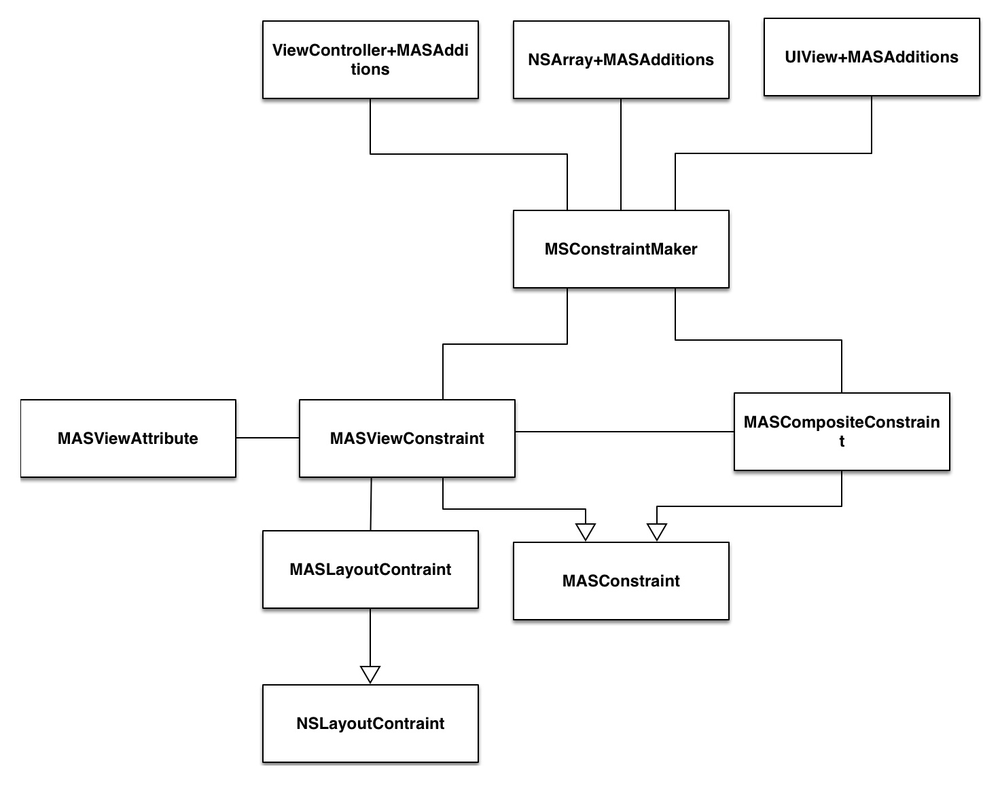

 
<!--BEGIN_DATA
{
    "create_date": "2017-08-28 10:43", 
    "modify_date": "2017-08-28 10:43", 
    "is_top": "0", 
    "summary": "Masonry 源码分析", 
    "tags": "iOS", 
    "file_name": "Masonry源码分析.md"
}
END_DATA-->

####
原文出处：<a href='http://blog.andysheng.cn/2017/08/22/Masonry/' target='blank'>Masonry 源码分析</a>

####一. Masonry 整体结构

#####1\. 最上层暴露接口

Masonry 的整个结构大致是上面这个样子。最上面是 Masonry 暴露出来的接口，采用 category 的形式为 `UIView` \
`NSArray` \ `UIViewController` 添加了一些方法。用的最多的是 UIView+MASAdditions ，里面有两个部分的方法：

  * 为 UIView 添加/更新/重置约束的方法，这是我们用的最多的东西也就是`mas_makeConstraints:` \ `mas_updateConstraints:` \ `mas_remakeConstraints:`三个方法。 
  * 获取 UIView 的一些属性的方法，用来添加约束，例如 `View1.height = View2.height * X + Y` 中，这些方法提供的是 `View2.height` 这个功能。

#####2\. MASConstraintMaker

MASConstrainrMaker 是一个创建约束的工厂，提供了一些让我们用起来很有快感的方法创建约束，而不像AutoLayout 原生 Api那么蛋疼。其中最有快感🤤的就是链式调用了，语义化相当好，当然实现链式调用不光光靠 MASConstraintMaker ，可以说MASConstrainMaker 只是带你进入链式的第一步，绝大多数的工作由下面的 MASViewConstraint 和
MASCompositeConstraint 来实现。我觉得Masonry源码中最值得学习的便是对链式调用的实现，下面会着重讲这个方面的东西。

#####3\. MASConstraints 与 MASViewConstraints / MASCompositeConstraints

MASSConstraints 是后面两个类的基类，一句话来来概括这个类的作用：  
一个 `MASViewContraints`代表一个约束 `View1.attribute = View2.attribute * multiply + constant`, 一个`MASViewCompositeConstraints` 则是代表
`View1.attribute1/attribute2/... = View2.attribute * mutiply + constant` 。  
这几个类便是实现链式调用的关键，特别是 MASCompositeConstraints ，专门用来处理类似
`make.height.width.equalTo(self)` 的约束。  
在 MASConstraints 中有一个个人感觉蛮有意思的地方，因为Objective-C本身不支持虚函数这种东西，那么基类中定义的一些没有实现的接口应该怎么来处理呢，需要防止使用者直接调用了这些接口。在 MASConstraints是这样处理的，它定义了这么一个宏：

   
    
    #define MASMethodNotImplemented() \
    
        @throw [NSException exceptionWithName:NSInternalInconsistencyException \
    
                                       reason:[NSString stringWithFormat:@"You must override %@ in a subclass.", NSStringFromSelector(_cmd)] \
    
                                     userInfo:nil]
    
                                     
    
    - (void)uninstall { MASMethodNotImplemented(); }

宏其实很简单，就是抛了一个异常，然后在强制子类去实现的方法中插入这个宏，这样直接用这个方法的话就会抛异常，就达到了警告调用者的目的。虽然实现很简单，因为以前没有见过，还是觉得很新奇。😊

#####4\. MASViewAttribute

    
    /**
    
     *  An immutable tuple which stores the view and the related NSLayoutAttribute.
    
     *  Describes part of either the left or right hand side of a constraint equation
    
     */

头文件里这么描述这个类，翻译一下：这是一个用来存储视图和视图的NSLayoutAttribute的不可变元组，它是 AutoLayout公式的左边或右边的一部分。还是有点难懂😨，其实结合 UIView+MASAdditions 里的代码看一下就很清晰了，如下：

    
    - (MASViewAttribute *)mas_left {
    
        return [[MASViewAttribute alloc] initWithView:self layoutAttribute:NSLayoutAttributeLeft];
    
    }

这是上面说的 Masonry 为 UIView 添加的功能的第二部分，也就是获取视图某个 AutoLayout属性，这样代码就很清晰了，这个类其实提供的是对类似`View1.height`的封装，这样类里面的属性也很好理解了。

#####5\. MASLayoutConstraint

这个其实就是NSLayoutConstraint，毕竟Masonry不是提供了一个新的布局方案，而是对AutoLayout的封装，所以最底层还是用AutoLayout实现的，而我们写的约束也最终被翻译成 NSLayoutConstraint。
MASLayoutConstraint添加了一个一个属性`mas_key`，暂时不知道什么用😰。

####二. Masonry 是如何实现链式调用的

#####1\. 实现点语法

  
    
    [view1 mas_makeConstraints:^(MASConstraintMaker *make) {
    
        make.top.equalTo(superview.mas_top).with.offset(padding.top); //with is an optional semantic filler
    
        make.left.equalTo(superview.mas_left).with.offset(padding.left);
    
        make.bottom.equalTo(superview.mas_bottom).with.offset(-padding.bottom);
    
        make.right.equalTo(superview.mas_right).with.offset(-padding.right);
    
    }];

我们来分析一下一条最简单的添加约束的命令`make.height.equalTo(@(10))`。  
首先大家都知道，Objective-c的方法调用（发送消息）是这样的`[Object message]`。但是Masonry中充满了`make.height`这样的点语法，这是怎么回事。通过查看代码可以知道，实现也比较简单🤔。  
分为两种情况：

  * `make.height`这个其实就是访问属性，因为 OC 中调用属性的set和get方法是支持点语法的。下面是maker中的属性定义。

    
    
    /**
    
     *  The following properties return a new MASViewConstraint
    
     *  with the first item set to the makers associated view and the appropriate MASViewAttribute
    
     */
    
    @property (nonatomic, strong, readonly) MASConstraint *left;
    
    @property (nonatomic, strong, readonly) MASConstraint *top;
    
    @property (nonatomic, strong, readonly) MASConstraint *right;
    
    @property (nonatomic, strong, readonly) MASConstraint *bottom;
    
    @property (nonatomic, strong, readonly) MASConstraint *leading;
    
    @property (nonatomic, strong, readonly) MASConstraint *trailing;
    
    @property (nonatomic, strong, readonly) MASConstraint *width;
    
    @property (nonatomic, strong, readonly) MASConstraint *height;
    
    @property (nonatomic, strong, readonly) MASConstraint *centerX;
    
    @property (nonatomic, strong, readonly) MASConstraint *centerY;
    
    @property (nonatomic, strong, readonly) MASConstraint *baseline;

  * 其次是类似`make.height.equalTo(self)`中的`equalTo(self)`,这是怎么回事，尼玛还能传个参数进去？这里 equalTo 也是一个属性的 get 方法，至少说编译器认为它是一个get方法。这个get方法返回的是一个带参数的 Block ，这样你就可以在Block中接收这个参数，实现一些你的逻辑。为什么说编译器认为它是个get方法呢，因为代码中根本没有对equalTo这个属性的定义啊，或者说相关的成员变量的定义，`equalTo`这个方法和普通的方法一模一样。这里可以探索一下，什么样的方法，编译器会认为它是一个 get 方法，根据我的尝试，只用满足一个条件，就是没有参数，是的，只要没有参数就是，即使这个方法的返回值 void 都没有问题。可以通过下面这段代码验证。
    
 
    
    
    @interface DotTest : NSObject
    
    - (void)firstName;
    
    - (NSString*)lastName;
    
    @end
    
    @implementation DotTest
    
    - (void)name{
    
        NSLog(@"hello world");
    
    }
    
    - (NSString*)lastName {
    
        return @"sheng";
    
    }
    
    @end
    
    int main(int argc, const char *argv[]) {
    
        
    
        DotTest *test = [DotTest new];
    
        test.firstName; // 编译器会给一个警告 但是可以编译运行 输出 hello world
    
        NSLog(@"%@", test.lastName); // 输出 sheng
    
        return 0;
    
    }

#####2\. 实现链式调用

以`make.width.height.mas_equalTo(self).mutiplyBy(1).offset(0)`为例，我们自己翻一下一下句代码对应
的约束

    
    View1.width = View2.width * 1 + 0
    
    View1.height = View2.height * 1 + 0

我们一段一段来分析。  
首先是`make.width`，前面提到width是maker的一个属性，它会将`View1.with`这段信息封装到MASViewAttribute当中，也就是这个属性是什么，这个属性属于谁。然后把MASViewAttribute放入MASViewConstraints当中。需要说明的是，上述的工作时属于maker的职责，通过给MASViewConstraints设置代理的方法，MASViewConstraints会把这个工作委托给maker。也就是说到这里，我
们得到了一个MASViewConstraints实例。  
然后是`.height`，这个`.height`是MASViewConstraints的get方法了，这个工作其实是和上面`.width`一样的，这里MASViewConstaints通过代理，把这个封装的活再丢给 Maker ，代码如下。不同的是，这里Maker发现前面已经有一个constraints，它会把这两个MASViewConstraints封装起来，变成一个MASCompositeConstraints。

    
    #pragma mark - attribute chaining
    
    - (MASConstraint *)addConstraintWithLayoutAttribute:(NSLayoutAttribute)layoutAttribute {
    
        NSAssert(!self.hasLayoutRelation, @"Attributes should be chained before defining the constraint relation");
    
        return [self.delegate constraint:self addConstraintWithLayoutAttribute:layoutAttribute];
    
    }

然后，是`equalTo` / `offset`这一类，调用的原理和上面一样，不再赘述。  
最后，`mas_makeConstaints`这个Block执行完之后，就收集了约束的信息，遍历一下所有的约束信息，用AutoLayout的官方Api表达出
来就可以了，也就是install阶段。

