 
<!--BEGIN_DATA
{
    "create_date": "2022-03-14 15:00", 
    "modify_date": "2022-03-14 15:00", 
    "is_top": "0", 
    "summary": "Mediasoup库的架构（C++部分）<br/>Mediasoup主业务流程+时序图<br/>mediasoup 3.9.10 worker 源码初步梳理<br/>Mediasoup源码分析（一）信令的传输过程<br/>Mediasoup源码分析（二）Router的建立", 
    "tags": "音视频", 
    "file_name": "Mediasoup1.md"
}
END_DATA-->

#### <p>原文出处：<a href='https://blog.csdn.net/Frederick_Fung/article/details/106919882' target='blank'>Mediasoup库的架构（C++部分）</a></p>

## Mediasoup库介绍

### Mediasoup基本概念

  * Worker：代表一个结点，下图的每一块就是一个Worker。假设操作系统是双核的，每一核都会创建一个进程，这个进程就是一个Worker

  * Router：房间或路由器

  * Producer：生产者

  * Consumer：消费者

  * Transport：客户端与服务端的一条连接线，这条线上可以有多个消费者和生产者

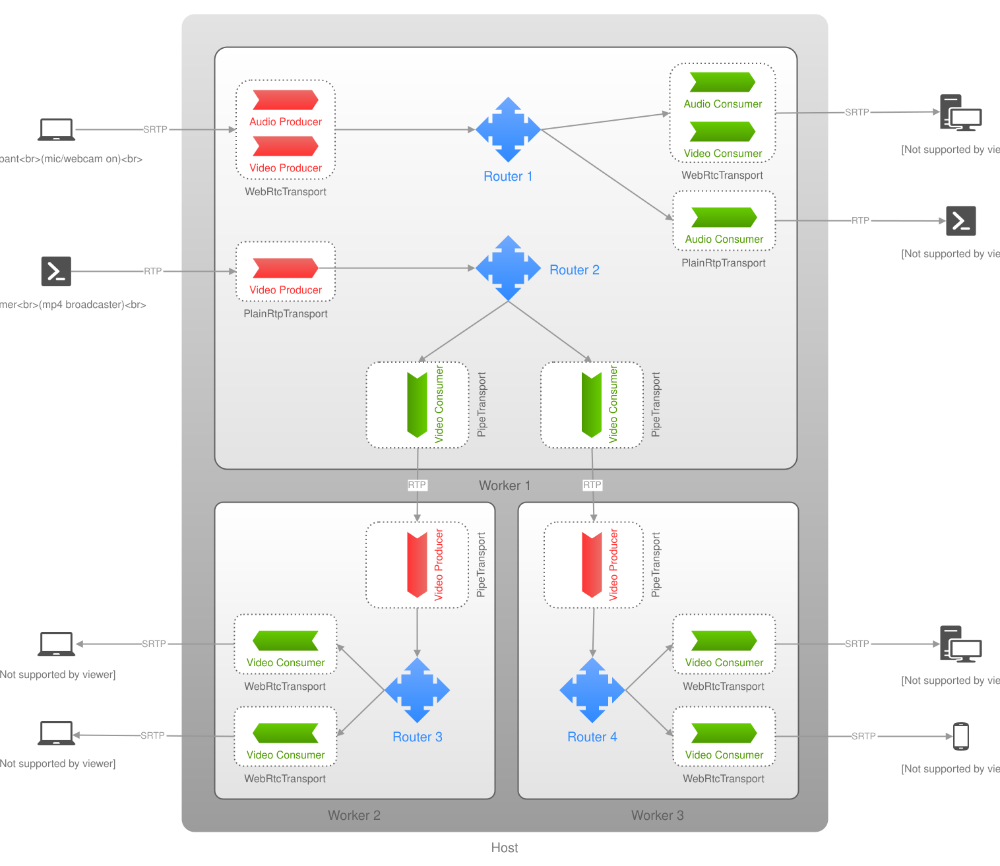

### Mediasoup包括的特性

  * 支持IPv6
  * ICE/DTLS/RTP/RTCP over UDP and TCP
  * 支持 Simulcast 和 SVC
  * 支持拥塞控制
  * 带宽评估
  * 支持STCP协议
  * 多流使用同一个ICE+DTLS传输通道
  * 底层采用进程+libuv，异步I/O的处理方式

### Mediasoup C++核心类图

#### Consumer

  * SimpleConsumer：普通的RTP数据消费者，对于音频和视频都一样，都是最简单的消费者

  * PipeConsumer：Pipe是用作于不同的Worker与Worker之间进行数据的流转，所以PipeConsumer就是用来接受不同的Worker传输过来的数据

  * SvcConsumer：SVC按照分层的方式分为核心层、扩展层、边缘层，这个类的作用就是用来传输不同层的数据的

  * SimulcastConsumer：当共享者传输多路流的时候，使用的是Simulcast，对于接收者来说，也要使用Simulcast进行消费

#### Transport

  * WebRTCTransport：主要用于浏览器之间或与其他终端之间的通信，这种数据一般都是加密的，为了保证数据不被窃取掉，它有很多的安全机制，且非常复杂
  * PlainRTPTransport：主要用于普通的非加密的RTP数据的传输
  * PipeTransport：用于不同Worker/Router之间的传输

#### Router

对于Router来说，一个Router对应了多个Consumer、多个Producer、多个Transport，所以它是1对多的关系

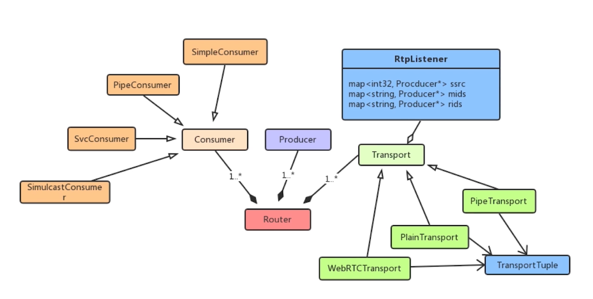

### Mediasoup C++详细类图

#### RtpStreamSend

可能会有人疑惑，消费者为什么会发送数据呢，不应该是接收数据吗？其实这里需要想通一点，Mediasoup是作为流媒体服务器，真正的消费者是客户端，所以服务器的Consumer需要把数据发送给客户端

RtpStreamSend继承自RtpStream，这个类处理Rtp数据流的收发。RtpStream使用到了RtpPacket，这个包是用于对Rtp数据包的分析，Rtp数据有数据包头，对于包头每一个字段的定义都是在这个Packet里面操作的

#### SeqManager

服务端推送给客户端的数据流是会重新排序的，排序的时候便会依靠这个SeqManager，它会记录某个SSRC所对应的Sequence，以此为起始位置，然后后面
的每个包都向下递增一个数

#### Producer

Producer作为服务端的生产者，它是用来接收共享者发送的数据流，所以它里面包含多个RtpStreamRecv，是一对多的关系（为什么是多个RtpStreamRecv呢？因为数据的接收有可能会丢包，丢包重传的也算作一路流，对应的音频的丢包也是需要重传）

#### NackGenerator

作为数据的接收端，RtpStreamRecv使用到了NackGenerator丢包产生器

接收端能够知道有没有丢包，因为数据包有Sequence，比如发送了100个数据，前50个数据是连续的，但假设当50之后是55，Recv端就知道丢了51、52、53、54 这4个包了。丢包之后如何解决呢，有两种方式：

  1. **Fec**：在每个包增加一些冗余，它能计算 出丢失的音频包或视频包
  2. **Nack**：它会告诉发送端丢了哪些包，发送端会根据策略，若时间比较短的话，会把丢失的包补上来，具体补哪些包就是根据NackGenerator产生的

#### PortManager

端口管理器，对于Mediasoup来说，默认是从40000到49999共一万个端口号。UdpSocket和TcpServer通过PortManager进行对端口号的管理，首先确定端口号有没有被占用，没有被占用就使用该端口号对数据传输；若被占用，就根据PortManager的策略往后跳。注意Udp和Tcp的使用是互斥的

#### DtlsTransport

使用tls对Rtp包进行数据加密的协议，同时在这里面还使用到了Srtp协议，Srtp协议分为数据的收与发，所以在WebRTCTransport中有Srtp
send和recv这两个Session

#### RembClient/RembServer

这两个主要用于对带宽的评估，既可用于client端也可用于server端。对于共享者来说，Mediasoup的WebRTCTransport就是RembClient端；对于消费者来说，就是RembServer端

#### IceCandidate

候选者包括Host、Server reflexive、Relay reflexive三种，对于WebRTC一般设置成Host，最高优先级

#### IceServer

包括证书验证、指纹识别等一系列安全验证机制，它里面也包含了多个TransportTuple

#### TransportTuple

如果使用TCP连接，它里面便含有TcpConnection

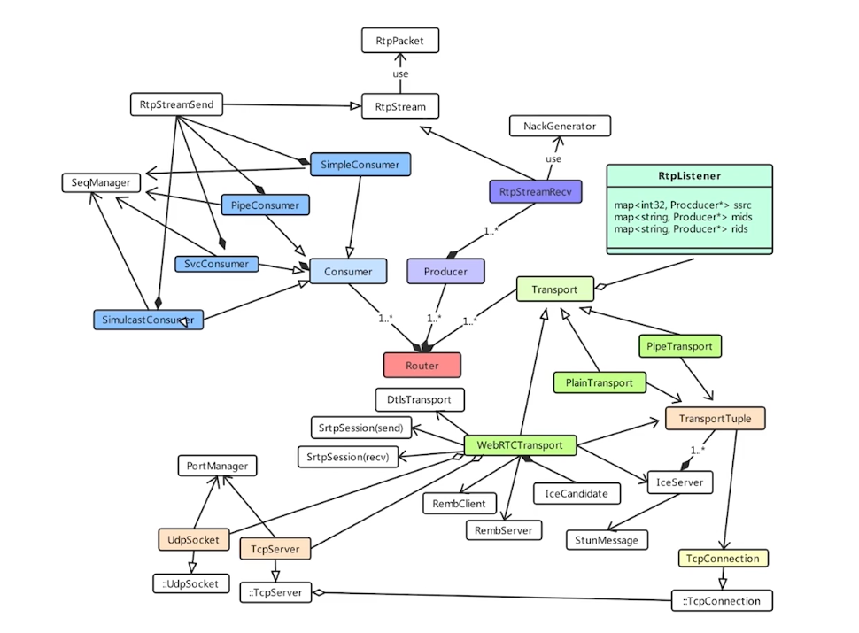

<hr>

 
#### <p>原文出处：<a href='https://blog.csdn.net/Frederick_Fung/article/details/106947135' target='blank'>Mediasoup主业务流程+时序图</a></p>

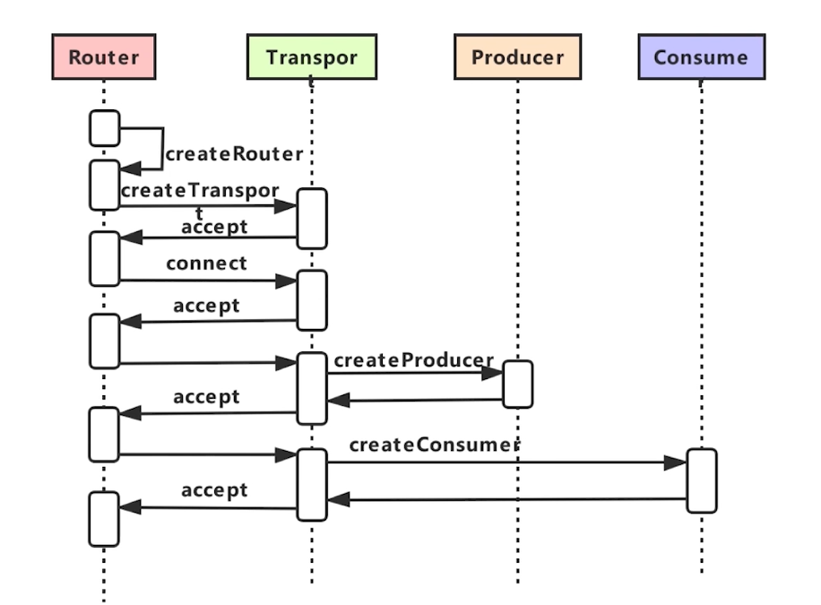

  1. createRouter
  2. createTransport
  3. connect
  4. createProducer
  5. createConsumer

connect的细节：  

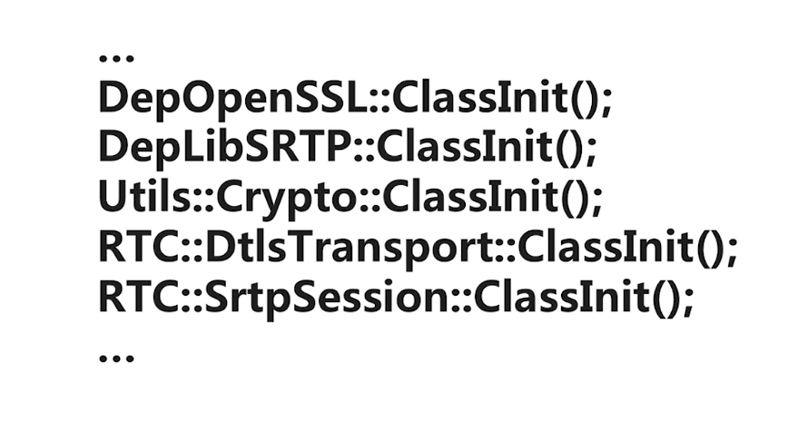

**时序图**

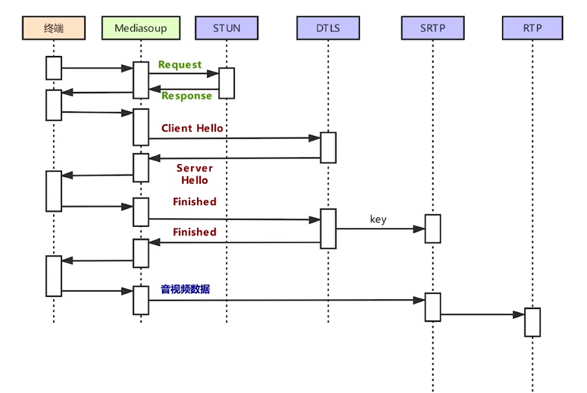  

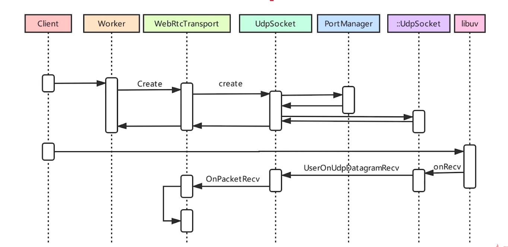

<hr>


#### <p>原文出处：<a href='http://blog.tubumu.com/2022/04/21/mediasoup-source-01/' target='blank'>mediasoup 3.9.10 worker 源码初步梳理</a></p>

## 一、概述

Mediasoup 主要提供了 3 个库和 1 个 demo。

<table>
<thead>
<tr>
<th>库名</th>
<th>说明</th>
</tr>
</thead>
<tbody><tr>
<td><a target="_blank" rel="noopener" href="https://github.com/versatica/mediasoup">mediasoup</a></td>
<td>主要包含三部分。一是 worker 可执行程序，由 C++ 实现，是本系列分析的重点；二是 Node 库，由 TypeScript 实现；三是 Rust 库，和 Node 的主要不同在于它没有以进程方式而是以静态库方式使用 mediasoup-worker。</td>
</tr>
<tr>
<td><a target="_blank" rel="noopener" href="https://github.com/versatica/mediasoup-client">mediasoup-client</a></td>
<td>Web 客户端库。TypeScript 实现。</td>
</tr>
<tr>
<td><a target="_blank" rel="noopener" href="https://github.com/versatica/libmediasoupclient">libmediasoupclient</a></td>
<td>Native 客户端库。C++ 实现。</td>
</tr>
<tr>
<td><a target="_blank" rel="noopener" href="https://github.com/versatica/mediasoup-demo">mediasoup-demo</a></td>
<td>官方 Demo。</td>
</tr>
<tr>
<td><a target="_blank" rel="noopener" href="https://mediasoup.org/documentation/examples/">Examples</a></td>
<td>各种示例。</td>
</tr>
</tbody></table>

网络上对 mediasoup 的 `Node.js` 层——准确说是对官方的 `mediasoup-demo` 的源码分析比较多，对于`mediasoup-client` 和 `mediasoup-worker` (之后简 worker) 等的源码详细分析相对较少。本人之前有将`GB28281` 集成进 mediasoup 的想法并验证了可行性，以及使用 `.Net` 重新实现过 Node.js 层（含 mediasoup-client 和 mediasoup-demo），对 worker 的源码进行过比较粗略地浏览。最近基于想要弥补一些比较模糊的认知，并且 mediaoup本身也在进化，故就再做了一次源码的梳理。

> 至于 mediasoup 是什么、能做什么、与其他 SFU 相较而言的优缺点、Demo 如何运行、为什么不用单一语言来实现等等讨论不是本系列关注的重点。

## 二、名词/概念

mediasoup 定义和抽象了一些名词和概念，为了方便描述，做整理如下表：

<table>
<thead>
<tr>
<th>名词/概念</th>
<th>说明</th>
</tr>
</thead>
<tbody><tr>
<td>Settings</td>
<td>设置。用于读取命令行配置、将配置输出到日志，以及运行时更新配置。另外用 <code>线程本地存储</code> 保存配置以确保每个线程都有一个 Settings 配置对象。当然，以 worker 进程方式运行不存在这个问题。设置的选项（option: getopt.h）具体包括：<code>logLevel</code>、<code>logTags</code>、<code>rtcMinPort</code> 和 <code>rtcMaxPort</code>、<code>dtlsCertificateFile</code> 和 <code>dtlsPrivateKeyFile</code> 这六项，分别表示日志等级、日志标签（如ice、dtls等，控制哪些类的日志才会传出）、最小和最大 rtc 端口，以及 dtls 证书文件和私钥的物理路径。这些参数都是可选的，如果未提供则会使用默认值或自动生成。</td>
</tr>
<tr>
<td>Logger</td>
<td>日志。有 <code>debug</code>、<code>warn</code>、<code>error</code> 和 <code>none</code> 四个等级。日志通过 <code>ChannelSocket</code> 传输到父进程，如果 ChannelSocket 尚未创建则会在标准输出中打印日志。mediasoup 给很多方法都加了 Trace 日志，打开 <code>MS_LOG_TRACE</code> 编译宏开关并且设置日志等级为 debug 则会输出。类似于 Settings，Logger 也用线程本地存储保存 Buffer 和 ChannelSocket 以确保每个线程都有一个对象。</td>
</tr>
<tr>
<td>ChannelSocket</td>
<td>通道 Socket。抽象了 worker 进程和父进程的通信。得益于 <code>libuv</code>，对于进程间通信开发者不用关心操作系统是用的 Linux/UNIX 的 <code>UNIX Domain Socket</code> 还是 Windows 的 <code>IPC</code> 等。而 mediasoup 的这层 ChannelSocket 抽象，也为后来支持的 <code>以库的方式使用 worker</code> 打下基础。ChannelSocket 是双向的，主要向父进程传输日志；接受父进程的如创建 <code>Transport</code>、<code>Producer</code> 等指令请求；向父进程传输指令请求的执行结果；向父进程传输 Producer 暂停关闭、SCTP 发送 Buffer 已满之类的通知。所有消息都是基于文本的。</td>
</tr>
<tr>
<td>PayloadChannelSocket</td>
<td>负载通道 Socket。类似于 ChannelSocket，不同的是 PayloadChannelSocket 用于 <code>DirectTransport</code> 向父进程发送 RTP 或 RTCP 数据包等。消息是基于文本和二进制的。</td>
</tr>
<tr>
<td>Worker</td>
<td>工作者。注意这里并非指 worker 进程，但某种意义下可以指代 worker 进程。ChannelSocket 和 PayloadChannelSocket 只负责消息的接收和发送，而 Worker 是具体消息的处理入口。它根据消息的类别进行处理，对于自身可以负责的请求比如获取资源使用率、创建及关闭 <code>Router</code>、dump 获取本 Worker 下的 Router 的 Id 集合等则直接处理，其余的就交给 Router 来处理。遵循谁创建谁销毁的原则，Router 的销毁工作也由 Worker 负责。</td>
</tr>
<tr>
<td>Router</td>
<td>路由。Router 是比较重要的概念，不准确地说可以将 Router 和房间对应起来。其保存了 Transport、Producer、<code>Consumer</code>、Producer下对应的 Consumer 以及 <code>DataProducer</code> 和 <code>DataConsumer</code> 相关的集合。如上文所述，Worker 将其处理不了的工作交给 Router，Router 能够处创建和关闭 Transport 以及和 <code>RtpObserver</code> 相关的几个操作请求，其余的就交给 Transport 处理。另外，Router 只负责 Transport 和 RtpObserver 的销毁工作，对于 Producer、Consumer 等则由创建这些对象的 Transport 负责。</td>
</tr>
<tr>
<td>Transport</td>
<td>传输通道。Transport 是抽象类，具体类包括：<code>WebRtcTransport</code>、<code>PlainTransport</code>、<code>DirectTransport</code> 和 <code>PipeTransport</code>。</td>
</tr>
<tr>
<td>WebRtcTransport</td>
<td>WebRtc 传输通道。WebRtcTransport 包含 Socket 服务端，将接收到的数据包尝试转换为 <code>StunPacket</code>、<code>Rtcp Packet</code>、<code>RtpPacket</code> 或 <code>Dtls 数据</code> 中的一种。StunPacket 由 IceServer 处理，Rtcp Packet 会经过处理后发送给 Consumer, RtpPacket 由相应的 Producer 处理，Dtls 数据当然是先解密再处理；也会通过 Sokcet 将数据发送到本 Transport 下对应的 Consumer 中去。</td>
</tr>
<tr>
<td>PlainTransport</td>
<td>Plain 传输通道。类似于 WebRtcTransport，不同的是不会收到 StunPacket 。</td>
</tr>
<tr>
<td>PipeTransport</td>
<td>Pipe 传输通道。用于跨 Router/worker Rtp 包传输。</td>
</tr>
<tr>
<td>DirectTransport</td>
<td>Direct 传输通道。DirectTransport 不包含 Socket 服务端，将接收到的数据直接通过 PayloadChannel 发送给 Consumer。</td>
</tr>
<tr>
<td>Producer</td>
<td>生产者。类型有四类：SIMPLE、SIMULCAST、SVC 和 PIPE。</td>
</tr>
<tr>
<td>Consumer</td>
<td>消费者。Consumer 是抽象类，具体类包括：<code>SimpleConsumer</code>、<code>SimulcastConsumer</code>、<code>SvcConsumer</code> 和 <code>PipeConsumer</code>。如果是 PipeTranspor 进行消费，则 type 为 “pipe”，否则为 Producer 的 type。</td>
</tr>
<tr>
<td>SimpleConsumer</td>
<td>单体消费者。</td>
</tr>
<tr>
<td>SimulcastConsumer</td>
<td>Simulcast消费者。</td>
</tr>
<tr>
<td>SvcConsumer</td>
<td>Svc 消费者。</td>
</tr>
<tr>
<td>PipeConsumer</td>
<td>Pipe 消费者。</td>
</tr>
<tr>
<td>DataProducer</td>
<td>Data 生产者。类型有两类：SCTP 和 DIRECT。只有传递 enableSctp 为 true 的参数才能创建类型为 SCTP 的 DataProducer；只能在 DirectTransport 之上创建类型为 DIRECT 的 DataProducer。</td>
</tr>
<tr>
<td>DataConsumer</td>
<td>Data 消费者。只有传递 enableSctp 为 true 的参数才能创建类型为 SCTP 的 DataProducer；只能在 DirectTransport 之上创建类型为 DIRECT 的 DataConsumer。</td>
</tr>
<tr>
<td>RtpObserver</td>
<td>Rtp 观察者。RtpObserver 是抽象类，具体类包括：<code>AudioLevelObserver</code> 和 <code>ActiveSpeakerObserver</code>。</td>
</tr>
<tr>
<td>AudioLevelObserver</td>
<td>音量观察者。收到音频 Rtp 包后累计音量。比如每1秒间隔计算触发一次计算，如果对应 Producer 收集了 10 个及以上的包则计算音频的平均值，如果值大于默认 -80dB 则将 Producder 的 Id 收集起来，最多收集指定参数 <code>maxEntries</code> 那么多个。如果存在符合条件的 Producer 则发出 <code>volumes</code> 事件，否则发出 <code>silence</code> 事件。事件会发送给父进程，而父进程会发送给相应的客户端。</td>
</tr>
<tr>
<td>ActiveSpeakerObserver</td>
<td>说话人观察者。ActiveSpeakerObserver 是 3.8.0 新增的。具体算法不算太简单，大致看并不是谁说话就算，而是计算出会议中说话人中谁是主导者。如果存在符合条件的唯一 Producer 则发出 <code>dominantspeaker</code> 事件。事件会发送给父进程，而父进程会发送给相应的客户端。</td>
</tr>
</tbody></table>

> 父对象通常会监听子对象的相关事件，比如 Worker 会监听 ChannelSocket 和 PayloadChannelSocket 的相关事件(Router没有监听器)，Router 会监听 Transport 的相关事件， Transport 会监听 Producer 、Consumer 等的相关事件。  
> 如果要扩展其他协议，比如支持 GB28181 的 PS 流，可以创建自定义 Transport 。  
> 如果要集成一些 AI 功能，比如目标识别，手势识别，语音指令识别等，可以创建自定义 RtpObserver 。

## 三、ChannelSocket 消息类型

`ChannelRequest::MethodId` 枚举定义了各种消息。其命名有一定规律，除 `*.close` 和 `RtpObServer`相关的消息外，第一个下划线前的第一个单词通常标明了消息由谁来处理。比如 `TRANSPORT_PRODUCE`，表示 Transport 需要处理 Produce 消息。

```cpp
// File: worker/src/Channel/ChannelRequest.cpp  
absl::flat_hash_map<std::string, ChannelRequest::MethodId> ChannelRequest::string2MethodId =  
{  
    // 关闭 Worker 。通常发生在 worker 进程被关闭时，由 Worker 的析构函数触发。  
    { "worker.close",                                ChannelRequest::MethodId::WORKER_CLOSE                                     },  
    // 获取 Worker 转储。返回值包含 worker 进程 Id 和本 Worker 下的 Router 的 routerIds 集合。  
    { "worker.dump",                                 ChannelRequest::MethodId::WORKER_DUMP                                      },  
    // 获取 Worker 资源使用率。结构见 http://docs.libuv.org/en/v1.x/misc.html#c.uv_rusage_t 或 mediasoup-client 库。  
    { "worker.getResourceUsage",                     ChannelRequest::MethodId::WORKER_GET_RESOURCE_USAGE                        },  
    // 更新设置。具体是更新日志等级(logLevel)和日志标签(logTags)。返回值无具体内容。  
    { "worker.updateSettings",                       ChannelRequest::MethodId::WORKER_UPDATE_SETTINGS                           },  
    // 创建 Router。请求参数的 routerId 有调用方提供。返回值无具体内容。  
    { "worker.createRouter",                         ChannelRequest::MethodId::WORKER_CREATE_ROUTER                             },  
    // 关闭 Router。该消息由 Worker 处理。返回值无具体内容。  
    { "router.close",                                ChannelRequest::MethodId::ROUTER_CLOSE                                     },  
    // 获取 Router 转储。返回值包含本 Router 的 id、transportIds、rtpObserverIds、mapProducerIdConsumerIds、mapConsumerIdProducerId、mapProducerIdObserverIds、mapDataProducerIdDataConsumerIds 和 mapDataConsumerIdDataProducerId。  
    { "router.dump",                                 ChannelRequest::MethodId::ROUTER_DUMP                                      },  
    // 创建 WebRtcTransport。请求参数主要主要有监听 IP 和 Port（旧版可能无法指定端口而只能使用允许范围内的随机端口）；是否启用 UDP 和(或) TCP；是否首选 UDP 和(或) TCP。返回值包含客户端创建 Transport 所需参数，暂略。  
    { "router.createWebRtcTransport",                ChannelRequest::MethodId::ROUTER_CREATE_WEBRTC_TRANSPORT                   },  
    // 创建 PlainTransport。请求参数类似有创建 WebRtcTransport，但无需指定使用 UDP 还是 TCP，因为只支持 UDP。额外的 comedia 表示是否需要预先连接 Transport；rtcpMux 表示是否 RTCP 复用 RTP 端口；enableSrtp 表示是否使用 Srtp，true 则需要提供 srtpCryptoSuite 参数。返回值包含客户端创建 Transport 所需参数，暂略。  
    { "router.createPlainTransport",                 ChannelRequest::MethodId::ROUTER_CREATE_PLAIN_TRANSPORT                    },  
    // 创建 PipeTransport。请求参数类似有创建 WebRtcTransport，但无需指定使用 UDP 还是 TCP，因为只支持 UDP。额外的 enableRtx 是否启用 Rtx 重传。返回值包含打通管道所需参数，暂略。  
    { "router.createPipeTransport",                  ChannelRequest::MethodId::ROUTER_CREATE_PIPE_TRANSPORT                     },  
    // 创建 DirectTransport。请求参数不能将 enableSctp 设置为 true，因为没必要。也无需提供监听 IP 和 Port 等信息。返回值包含直连需参数，暂略。  
    { "router.createDirectTransport",                ChannelRequest::MethodId::ROUTER_CREATE_DIRECT_TRANSPORT                   },  
    // 创建 ActiveSpeakerObserver。 请求参数必须提供 interval 。返回会议中发言人的音量。  
    { "router.createActiveSpeakerObserver",          ChannelRequest::MethodId::ROUTER_CREATE_ACTIVE_SPEAKER_OBSERVER            },  
    // 创建 AudioLevelObserver。请求参数必须提供 interval，maxEntries 和 threshold 。返回会议中唯一主导说话者。  
    { "router.createAudioLevelObserver",             ChannelRequest::MethodId::ROUTER_CREATE_AUDIO_LEVEL_OBSERVER               },  
    // 关闭 Transport。该消息由 Router 处理。Transport 的关闭会触发连锁反应，以确保其上的 Consumer、Producer，其他人消费本 Transport 上的 Producer 的 Consumer(有点绕) 得以关闭。返回值无具体内容。  
    { "transport.close",                             ChannelRequest::MethodId::TRANSPORT_CLOSE                                  },  
    // 获取 Transport 转储。返回值包含本 Transport 的 Id、是否是 DirectTransport 的 direct 等。更多返回参数详见：Transport.cpp 的 void Transport::FillJson(json& jsonObject) const 方法。  
    { "transport.dump",                              ChannelRequest::MethodId::TRANSPORT_DUMP                                   },  
    // 获取 Transport 的状态值。返回值见：Transport.cpp 的 void Transport::FillJsonStats(json& jsonArray) 方法。  
    { "transport.getStats",                          ChannelRequest::MethodId::TRANSPORT_GET_STATS                              },  
    // 连接 Transport。DirectTransport 不会发送该请求，创建 PipeTransport 时如果参数 comedia 为 true 也无需发送该请求。返回值暂略。  
    { "transport.connect",                           ChannelRequest::MethodId::TRANSPORT_CONNECT                                },  
    // 设置最大传入码率。用于拥塞控制。返回值无具体内容。  
    { "transport.setMaxIncomingBitrate",             ChannelRequest::MethodId::TRANSPORT_SET_MAX_INCOMING_BITRATE               },  
    // 设置最大传出码率。用于拥塞控制。返回值无具体内容。  
    { "transport.setMaxOutgoingBitrate",             ChannelRequest::MethodId::TRANSPORT_SET_MAX_OUTGOING_BITRATE               },  
    // 重启 ICE。 仅 WebRtcTransport 会发送该请求。  
    { "transport.restartIce",                        ChannelRequest::MethodId::TRANSPORT_RESTART_ICE                            },  
    // 创建 Producer。返回值暂略。  
    { "transport.produce",                           ChannelRequest::MethodId::TRANSPORT_PRODUCE                                },  
    // 创建 Consumer。返回值暂略。  
    { "transport.consume",                           ChannelRequest::MethodId::TRANSPORT_CONSUME                                },  
    // 创建 DataProducer。返回值暂略。  
    { "transport.produceData",                       ChannelRequest::MethodId::TRANSPORT_PRODUCE_DATA                           },  
    // 创建 DataConsumer。返回值暂略。  
    { "transport.consumeData",                       ChannelRequest::MethodId::TRANSPORT_CONSUME_DATA                           },  
    // 启用 Transport 的跟踪事件。可选事件包括：probation 和 bwe。返回值无具体内容。  
    { "transport.enableTraceEvent",                  ChannelRequest::MethodId::TRANSPORT_ENABLE_TRACE_EVENT                     },  
    // 关闭 Producer。该消息由 Transport 处理。Producer 的关闭会触发连锁反应，以确消费本 Producer 的 Consumer 和监听本 Producer 的 RtpObserver 得以关闭。返回值无具体内容。  
    { "producer.close",                              ChannelRequest::MethodId::PRODUCER_CLOSE                                   },  
    // 获取 Producer 转储。返回值暂略。  
    { "producer.dump",                               ChannelRequest::MethodId::PRODUCER_DUMP                                    },  
    // 获取 Producer 状态。返回值暂略。  
    { "producer.getStats",                           ChannelRequest::MethodId::PRODUCER_GET_STATS                               },  
    // 暂停 Producer 的生产。返回值无具体内容。  
    { "producer.pause",                              ChannelRequest::MethodId::PRODUCER_PAUSE                                   },  
    // 恢复 Producer 的生产。返回值无具体内容。  
    { "producer.resume" ,                            ChannelRequest::MethodId::PRODUCER_RESUME                                  },  
    // 启用 Producer 的跟踪事件。可选事件包括：rtp、keyframe、nack、pli 和 fir。返回值无具体内容。  
    { "producer.enableTraceEvent",                   ChannelRequest::MethodId::PRODUCER_ENABLE_TRACE_EVENT                      },  
    // 关闭 Consumer。该消息由 Transport 处理。返回值无具体内容。  
    { "consumer.close",                              ChannelRequest::MethodId::CONSUMER_CLOSE                                   },  
    // 获取 Consumer 转储。返回值暂略。  
    { "consumer.dump",                               ChannelRequest::MethodId::CONSUMER_DUMP                                    },  
    // 获取 Consumer 状态。返回值暂略。  
    { "consumer.getStats",                           ChannelRequest::MethodId::CONSUMER_GET_STATS                               },  
    // 暂停 Consumer 的消费。返回值无具体内容。  
    { "consumer.pause",                              ChannelRequest::MethodId::CONSUMER_PAUSE                                   },  
    // 暂停 Consumer 的消费。返回值无具体内容。  
    { "consumer.resume",                             ChannelRequest::MethodId::CONSUMER_RESUME                                  },  
    // 设置 Consumer 的首选 Layers。仅对 SimulcastConsumer 和 SvcConsumer 有效。返回值无具体内容。  
    { "consumer.setPreferredLayers",                 ChannelRequest::MethodId::CONSUMER_SET_PREFERRED_LAYERS                    },  
    // 设置 Consumer 的码率优先级。返回值无具体内容。  
    { "consumer.setPriority",                        ChannelRequest::MethodId::CONSUMER_SET_PRIORITY                            },  
    // Consumer 请求关键帧。返回值无具体内容。  
    { "consumer.requestKeyFrame",                    ChannelRequest::MethodId::CONSUMER_REQUEST_KEY_FRAME                       },  
    // 启用 Consumer 的跟踪事件。可选事件包括：rtp、keyframe、nack、pli 和 fir。返回值无具体内容。  
    { "consumer.enableTraceEvent",                   ChannelRequest::MethodId::CONSUMER_ENABLE_TRACE_EVENT                      },  
    // 如下 DataProducer 和 DataProducer 的请求类似于 Producer 和 Consumer   
    { "dataProducer.close",                          ChannelRequest::MethodId::DATA_PRODUCER_CLOSE                              },  
    { "dataProducer.dump",                           ChannelRequest::MethodId::DATA_PRODUCER_DUMP                               },  
    { "dataProducer.getStats",                       ChannelRequest::MethodId::DATA_PRODUCER_GET_STATS                          },  
    { "dataConsumer.close",                          ChannelRequest::MethodId::DATA_CONSUMER_CLOSE                              },  
    { "dataConsumer.dump",                           ChannelRequest::MethodId::DATA_CONSUMER_DUMP                               },  
    { "dataConsumer.getStats",                       ChannelRequest::MethodId::DATA_CONSUMER_GET_STATS                          },  
    // 获取尚未发出的 Sctp buffer 数量。  
    { "dataConsumer.getBufferedAmount",              ChannelRequest::MethodId::DATA_CONSUMER_GET_BUFFERED_AMOUNT                },  
    // 降低 Sctp buffer 阈值。  
    { "dataConsumer.setBufferedAmountLowThreshold",  ChannelRequest::MethodId::DATA_CONSUMER_SET_BUFFERED_AMOUNT_LOW_THRESHOLD  },  
    // 关闭 RtpObserver。该消息由 Router 处理。返回值无具体内容。  
    { "rtpObserver.close",                           ChannelRequest::MethodId::RTP_OBSERVER_CLOSE                               },  
    // 暂停 RtpObserver 的监听。该消息由 Router 处理。返回值无具体内容。  
    { "rtpObserver.pause",                           ChannelRequest::MethodId::RTP_OBSERVER_PAUSE                               },  
    // 恢复 RtpObserver 的监听。该消息由 Router 处理。返回值无具体内容。  
    { "rtpObserver.resume",                          ChannelRequest::MethodId::RTP_OBSERVER_RESUME                              },  
    // 向 RtpObserver 新增 Producer。返回值无具体内容。  
    { "rtpObserver.addProducer",                     ChannelRequest::MethodId::RTP_OBSERVER_ADD_PRODUCER                        },  
    // 从 RtpObserver 移除 Producer。返回值无具体内容。  
    { "rtpObserver.removeProducer",                  ChannelRequest::MethodId::RTP_OBSERVER_REMOVE_PRODUCER                     }  
};  
```

## 四、PayloadChannelSocket 消息类型

`PayloadChannelRequest::MethodId` 枚举定义一种消息。

```cpp
// File: worker/src/PayloadChannel/PayloadChannelRequest.cpp  
absl::flat_hash_map<std::string, PayloadChannelRequest::MethodId> PayloadChannelRequest::string2MethodId =  
{  
    // DataConsumer 发送  
    { "dataConsumer.send", PayloadChannelRequest::MethodId::DATA_CONSUMER_SEND },  
};  
```

## 五、ChannelSocket 通知类型

为了方便使用, mediasoup 定义了 `ChannelNotifier` 类用于 worker 向父进程发送通知。通知类型整理如下：

<table>
<thead>
<tr>
<th>Sender</th>
<th>类型</th>
<th>说明</th>
</tr>
</thead>
<tbody><tr>
<td>Workder</td>
<td>running</td>
<td>worker 运行中。</td>
</tr>
<tr>
<td>ActiveSpeakerObserver</td>
<td>dominantspeaker</td>
<td>当前主导发言者。</td>
</tr>
<tr>
<td>AudioLevelObserver</td>
<td>volumes</td>
<td>当前发言者的音量。</td>
</tr>
<tr>
<td>-</td>
<td>silence</td>
<td>之前发言者已静音。</td>
</tr>
<tr>
<td>Consumer</td>
<td>producerpause</td>
<td>生产者已暂停。</td>
</tr>
<tr>
<td>-</td>
<td>producerresume</td>
<td>生产者已恢复。</td>
</tr>
<tr>
<td>-</td>
<td>producerclose</td>
<td>生产者已关闭</td>
</tr>
<tr>
<td>-</td>
<td>trace</td>
<td>跟踪消费者信息。类型包括：rtp、keyframe、nack、pli 和 fir。</td>
</tr>
<tr>
<td>DataConsumer</td>
<td>bufferedamountlow</td>
<td>数据消费者 Sctp Buffer 低。</td>
</tr>
<tr>
<td>-</td>
<td>dataproducerclose</td>
<td>数据生产者已关闭。</td>
</tr>
<tr>
<td>PlainTransport</td>
<td>tuple</td>
<td>TransportTuple。 当 comedia 为 true 时，通过收到的数据提取到 TransportTuple。</td>
</tr>
<tr>
<td>-</td>
<td>rtcptuple</td>
<td>TransportTuple。 当 comedia 为 true 且 rtcpMux 为 false, 通过收到的数据提取到 TransportTuple。</td>
</tr>
<tr>
<td>Producer</td>
<td>videoorientationchange</td>
<td>视频方向发生改变。</td>
</tr>
<tr>
<td>-</td>
<td>score</td>
<td>Rtp 流的质量评分。</td>
</tr>
<tr>
<td>-</td>
<td>trace</td>
<td>跟踪生产者信息。类型包括：rtp、keyframe、nack、pli 和 fir。</td>
</tr>
<tr>
<td>SctpAssociation</td>
<td>sctpsendbufferfull</td>
<td>DataConsumer 的 Sctp 发送 Buffer 已满。</td>
</tr>
<tr>
<td>SimpleConsumer</td>
<td>score</td>
<td>Rtp 流的质量评分。</td>
</tr>
<tr>
<td>SimulcastConsumer</td>
<td>score</td>
<td>Rtp 流的质量评分。包含自身的和 Producer 的。</td>
</tr>
<tr>
<td>-</td>
<td>layerschange</td>
<td>Layers 已改变。</td>
</tr>
<tr>
<td>SvcConsumer</td>
<td>score</td>
<td>Rtp 流的质量评分。包含自身的和 Producer 的。</td>
</tr>
<tr>
<td>-</td>
<td>layerschange</td>
<td>Layers 已改变。</td>
</tr>
<tr>
<td>Transport</td>
<td>trace</td>
<td>跟踪 Transport 信息。类型包括：probation 和 bwe。</td>
</tr>
<tr>
<td>-</td>
<td>sctpstatechange</td>
<td>Sctp 状态已改变。</td>
</tr>
<tr>
<td>WebRtcTransport</td>
<td>iceselectedtuplechange</td>
<td>Ice 选择的 TransportTuple 已改变。</td>
</tr>
<tr>
<td>-</td>
<td>icestatechange</td>
<td>Ice 状态已改变。</td>
</tr>
<tr>
<td>-</td>
<td>dtlsstatechange</td>
<td>Dtls 状态已改变。 状态包括：connecting、connected、completed、disconnected、closed 和 failed。</td>
</tr>
</tbody></table>

## 六、PayloadChannelSocket 通知类型

为了方便使用, mediasoup 定义了 `PayloadChannelNotifier` 类用于 worker 向父进程发送通知。通知类型整理如下：

<table>
<thead>
<tr>
<th>Sender</th>
<th>类型</th>
<th>说明</th>
</tr>
</thead>
<tbody><tr>
<td>DirectTransport</td>
<td>rtp</td>
<td>Rtp 包。</td>
</tr>
<tr>
<td>-</td>
<td>rtcp</td>
<td>Rtcp 包。</td>
</tr>
<tr>
<td>-</td>
<td>message</td>
<td>消息。</td>
</tr>
</tbody></table>

### 七、worker 进程的启动

worker 是可执行程序，(一般来说)需要通过其他进程来启动。  

启动时首先需要设置环境变量 `MEDIASOUP_VERSION`，通常设置为 mediaoup 真实的版本号。当然，如果非要设置成其他内容也没关系。

```cpp
// File: worker/src/main.cpp  
// Ensure we are called by our Node library.  
if (!std::getenv("MEDIASOUP_VERSION"))  
{  
    MS_ERROR_STD("you don't seem to be my real father!");  
    std::_Exit(EXIT_FAILURE);  
}  
```

还可以以命令行参数的方式设置 `logLevel`、`logTags`、`rtcMinPort` 和 `rtcMaxPort`、`dtlsCertificateFile` 和`dtlsPrivateKeyFile`，分别表示日志等级、日志标签（如ice、dtls等，控制哪些类的日志才会传出）、最小和最大 rtc 端口，以及dtls 证书文件和私钥的物理路径。这些参数都是可选的，如果未提供则会使用默认值或自动生成。

因为 worker 是独立进程，需要和父进程通信。以 `Linux` 为例，在 `fork` 子进程后会将父进程的文件描述符传递到子进程中。具体来说Node.js 程序 fork worker 进程之前，会创建几个 `libuv` 概念下而非 Linux 概念下的抽象意义上的 `pipe`，在Linux 中使用的是 `UNIX Domain Socket`。fork 进程后，会在子进程将要使用的文件描述符重定向。这里子进程期望持有的文件描述符是3-6，而实际上父进程创建的可能是 11-15，fork 之后子进程得到的还是 11-15，只要在子进程中使用 `fcntl`系统调用重定向即可。通过合理的数量和顺序上的约定能确定重定向为 3-6。最终在子进程中 exec mediasoup-
worker（见：`uv__process_child_init`）。  

mediasoup 抽象出叫做 `ChannelSocket` 和 `PayloadChannelSocket` 的概念来表示 worker
和父进程的通信信道。

> mediasoup 最初只使用了 1 个文件描述符，后来改为了 2 个，再后来改为了 4 个。

### 八、以库的方式使用 worker

在较长的一段时间，worker 都是以进程的方式运行，不过直到 2021 年 3 月发布的 `3.7.0` 开始, 准确地说是从 `1a805366`的这次提交开始，已经支持以库的方式使用。

如果要像 [mediasoup-sfu-cpp](https://github.com/yanhua133/mediasoup-sfu-cpp) 那样用纯C++ 实现整个 mediasoup 服务端，则可以直接调用 `mediasoup_worker_run` 方法。当然，也就不用设置环境 `MEDIASOUP_VERSION` 变量了。

```cpp
// File: worker/src/lib.hpp  
extern "C" int mediasoup_worker_run(  
  int argc,  
  char* argv[],  
  const char* version,  
  int consumerChannelFd,  
  int producerChannelFd,  
  int payloadConsumeChannelFd,  
  int payloadProduceChannelFd,  
  ChannelReadFn channelReadFn,  
  ChannelReadCtx channelReadCtx,  
  ChannelWriteFn channelWriteFn,  
  ChannelWriteCtx channelWriteCtx,  
  PayloadChannelReadFn payloadChannelReadFn,  
  PayloadChannelReadCtx payloadChannelReadCtx,  
  PayloadChannelWriteFn payloadChannelWriteFn,  
  PayloadChannelWriteCtx payloadChannelWriteCtx);  
```

以进程方式运行时进程间通所使用的是文件描述符(consumerChannelFd等)，以库的方式运行则可以将函数指针传递给 `mediasoup_worker_run` 的其他参数（PayloadChannelReadFn等），都能够构造出 ChannelSocket 和 PayloadChannelSocket。

还可以用多个线程执行 `mediasoup_worker_run`，以达到多个 worker 进程的效果。

> 备注：mediasoup-sfu-cpp 是基于旧版 mediasoup，尚未更新至可以使用 mediasoup_worker_run 方法的版本。

### 参考资料

* [现代C++和Mediasoup的WebRTC集群服务实践](https://zhangbin.blog.csdn.net/article/details/122351260)
* [纯 C++ 实现的 Mediasoup 闫华](https://github.com/yanhua133/mediasoup-sfu-cpp)
* [【流媒体】Mediasoup库的架构（C++部分）](https://blog.csdn.net/Frederick_Fung/article/details/106919882)
* [libuv](https://github.com/libuv/libuv)  
* [mediasoup v3 Design](https://mediasoup.org/documentation/v3/mediasoup/design/)
* [mediasoup v3 API](https://mediasoup.org/documentation/v3/mediasoup/api/)
* [mediasoup-client v3 API](https://mediasoup.org/documentation/v3/mediasoup-client/api/)

<hr>

#### <p>原文出处：<a href='https://blog.csdn.net/Frederick_Fung/article/details/107063392' target='blank'>Mediasoup源码分析（一）信令的传输过程</a></p>

## JS部分

JS部分的重点是Worker.js

### 1、先看整体

**从Worker.JS这个文件来看，上面构造了一些变量，如process、channel等，下面是一个Worker的类**

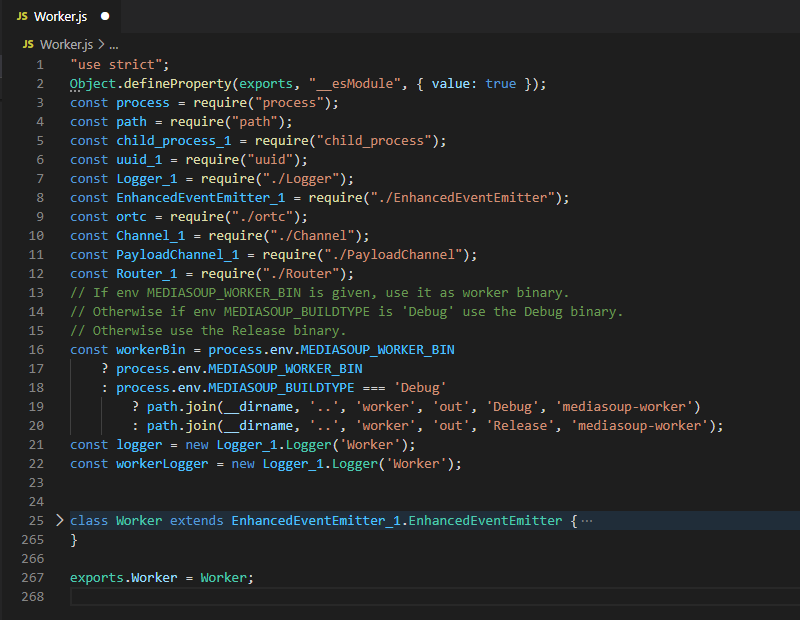

### 2、展开Worker

> **展开Worker类可以看见它有11个函数，分别是**

**1.constructor()——构造函数**  
**2.get pid()——获得Worker进程的ID**  
**3.get closed()——确认Worker是否关闭**  
**4.get appData()——返回custom的数据**  
**5.set appData()——当设置无效时抛出异常信息**  
**6.get observer()——开启观察者模式**  
**7.close()——关闭Worker**  
**8.async dump()——转存Worker**  
**9.async getResourceUsage()——获得worker进程资源使用信息**  
**10.async updateSettings()——更新设置**  
**11.async createRouter()——创建房间**

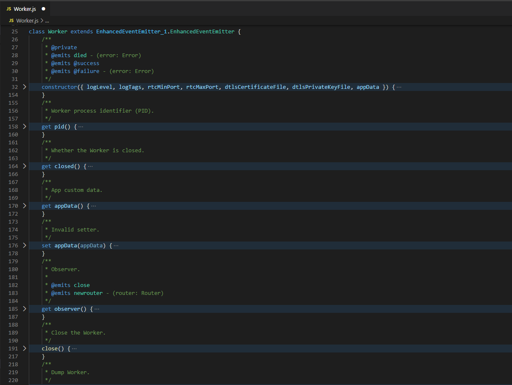
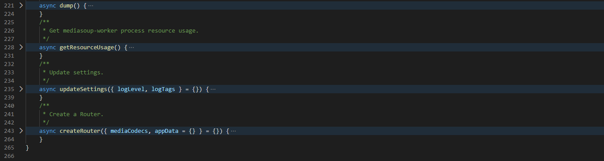

### 3、constructor

我们的重点是channel怎么建立的，所以重点关注**第1个构造函数constructor()**

```js
this._child = child_process_1.spawn(
       // command
       spawnBin, 
       // args
       spawnArgs, 
       // options
       {
           env: {
               MEDIASOUP_VERSION: '3.6.7'
           },
           detached: false,
           // fd 0 (stdin)   : Just ignore it.
           // fd 1 (stdout)  : Pipe it for 3rd libraries that log their own stuff.
           // fd 2 (stderr)  : Same as stdout.
           // fd 3 (channel) : Producer Channel fd.
           // fd 4 (channel) : Consumer Channel fd.
           // fd 5 (channel) : Producer PayloadChannel fd.
           // fd 6 (channel) : Consumer PayloadChannel fd.
           stdio: ['ignore', 'pipe', 'pipe', 'pipe', 'pipe', 'pipe', 'pipe'],
           windowsHide: true
       });
       this._pid = this._child.pid;
       this._channel = new Channel_1.Channel({
           producerSocket: this._child.stdio[3],
           consumerSocket: this._child.stdio[4],
           pid: this._pid
       });
       this._payloadChannel = new PayloadChannel_1.PayloadChannel({
           // NOTE: TypeScript does not like more than 5 fds.
           // @ts-ignore
           producerSocket: this._child.stdio[5],
           // @ts-ignore
           consumerSocket: this._child.stdio[6]
       });
```

spawn里标准io口有7个参数，分别是标准输入、标准输出、标准错误、以及4个通道，源码中对标准输入规定的是ignore，其它6个参数是pipe（管道），**这里要注意的是，这个管道并不是Linux进程间通信的匿名管道或有名管道，它是UnixSocketPair，因为只有UnixSocketPair才是全双工通信，从代码中我们也能看出它是全双工的，而匿名（有名）管道是半双工通信**

接着重点是 `this._channel = new Channel_1.Channel` ，它创建了一个channel，并传入了3个参数，分别是stdio[3]和stdio[4]，以及pid（因为可能会有多个Worker，而一个进程对应一个Worker，所以需要知道每个进程的ID），这样通过这个channel，JS部分便能和C++部分通信了

### 4、channel的建立

创建这个channel会调用channel.js里的构造函数，我们来看看channel.js里的代码

```js
this._consumerSocket.on('data', (buffer) => {
   if (!this._recvBuffer) {
       this._recvBuffer = buffer;
   }
   else {
       this._recvBuffer = Buffer.concat([this._recvBuffer, buffer], this._recvBuffer.length + buffer.length);
   }
   if (this._recvBuffer.length > NS_PAYLOAD_MAX_LEN) {
       logger.error('receiving buffer is full, discarding all data into it');
       // Reset the buffer and exit.
       this._recvBuffer = undefined;
       return;
   }
   while (true) // eslint-disable-line no-constant-condition
    {
       let nsPayload;
       try {
           nsPayload = netstring.nsPayload(this._recvBuffer);
       }
       catch (error) {
           logger.error('invalid netstring data received from the worker process: %s', String(error));
           // Reset the buffer and exit.
           this._recvBuffer = undefined;
           return;
       }
       // Incomplete netstring message.
       if (nsPayload === -1)
           return;
       try {
           // We can receive JSON messages (Channel messages) or log strings.
           switch (nsPayload[0]) {
               // 123 = '{' (a Channel JSON messsage).
               case 123:
                   this._processMessage(JSON.parse(nsPayload.toString('utf8')));
                   break;
               // 68 = 'D' (a debug log).
               case 68:
                   logger.debug(`[pid:${pid}] ${nsPayload.toString('utf8', 1)}`);
                   break;
               // 87 = 'W' (a warn log).
               case 87:
                   logger.warn(`[pid:${pid}] ${nsPayload.toString('utf8', 1)}`);
                   break;
               // 69 = 'E' (an error log).
               case 69:
                   logger.error(`[pid:${pid} ${nsPayload.toString('utf8', 1)}`);
                   break;
               // 88 = 'X' (a dump log).
               case 88:
                   // eslint-disable-next-line no-console
                   console.log(nsPayload.toString('utf8', 1));
                   break;
               default:
                   // eslint-disable-next-line no-console
                   console.warn(`worker[pid:${pid}] unexpected data: %s`, nsPayload.toString('utf8', 1));
           }
       }
       catch (error) {
           logger.error('received invalid message from the worker process: %s', String(error));
       }
       // Remove the read payload from the buffer.
       this._recvBuffer =
           this._recvBuffer.slice(netstring.nsLength(this._recvBuffer));
       if (!this._recvBuffer.length) {
           this._recvBuffer = undefined;
           return;
       }
   }
});
```

在channel.js中，上面这片代码启动了Socket的侦听函数，当C++传来数据时，会促发recvBuffer接收数据，然后进入while循环处理数据，做出相应的处理

### 5、JS部分的总结

经过上述步骤后，便拿到了SocketPair一端的文件描述符，实际不管是Socket还是普通文件，都是通过文件描述符的方式来进行的操作

## C++部分

### 1、main流程图

main主函数部分的模块可分为下图的几个步骤，在最新版V3的源码中，main创建了两个Socket，分别是Channel和PayloadChannel

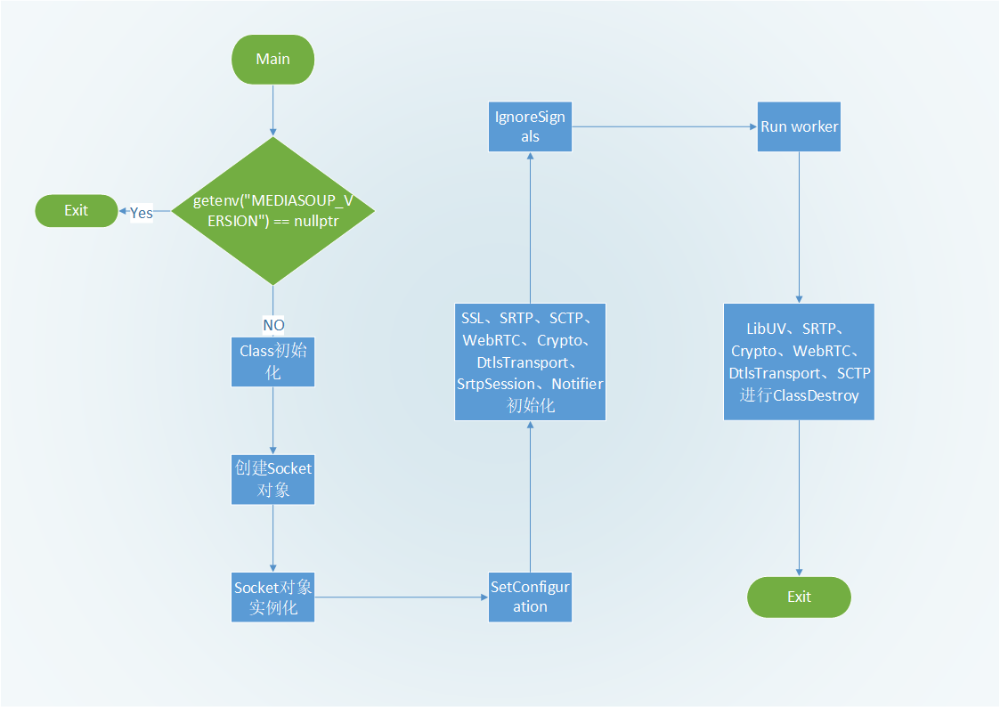

### 2、main.cpp

```cpp
#define MS_CLASS "mediasoup-worker"
// #define MS_LOG_DEV_LEVEL 3

#include "common.hpp"
#include "DepLibSRTP.hpp"
#include "DepLibUV.hpp"
#include "DepLibWebRTC.hpp"
#include "DepOpenSSL.hpp"
#include "DepUsrSCTP.hpp"
#include "Logger.hpp"
#include "MediaSoupErrors.hpp"
#include "Settings.hpp"
#include "Utils.hpp"
#include "Worker.hpp"
#include "Channel/Notifier.hpp"
#include "Channel/UnixStreamSocket.hpp"
#include "PayloadChannel/Notifier.hpp"
#include "PayloadChannel/UnixStreamSocket.hpp"
#include "RTC/DtlsTransport.hpp"
#include "RTC/SrtpSession.hpp"
#include <uv.h>
#include <cerrno>
#include <csignal>  // sigaction()
#include <cstdlib>  // std::_Exit(), std::genenv()
#include <iostream> // std::cerr, std::endl
#include <map>
#include <string>

static constexpr int ConsumerChannelFd{ 3 };
static constexpr int ProducerChannelFd{ 4 };
static constexpr int PayloadConsumerChannelFd{ 5 };
static constexpr int PayloadProducerChannelFd{ 6 };

void IgnoreSignals();

int main(int argc, char* argv[])
{
  // Ensure we are called by our Node library.
  if (std::getenv("MEDIASOUP_VERSION") == nullptr)
  {
    MS_ERROR_STD("you don't seem to be my real father!");

    std::_Exit(EXIT_FAILURE);
  }

  std::string version = std::getenv("MEDIASOUP_VERSION");

  // Initialize libuv stuff (we need it for the Channel).
  DepLibUV::ClassInit();

  // Channel socket (it will be handled and deleted by the Worker).
  Channel::UnixStreamSocket* channel{ nullptr };

  // PayloadChannel socket (it will be handled and deleted by the Worker).
  PayloadChannel::UnixStreamSocket* payloadChannel{ nullptr };

  try
  {
    channel = new Channel::UnixStreamSocket(ConsumerChannelFd, ProducerChannelFd);
  }
  catch (const MediaSoupError& error)
  {
    MS_ERROR_STD("error creating the Channel: %s", error.what());

    std::_Exit(EXIT_FAILURE);
  }

  try
  {
    payloadChannel =
      new PayloadChannel::UnixStreamSocket(PayloadConsumerChannelFd, PayloadProducerChannelFd);
  }
  catch (const MediaSoupError& error)
  {
    MS_ERROR_STD("error creating the RTC Channel: %s", error.what());

    std::_Exit(EXIT_FAILURE);
  }

  // Initialize the Logger.
  Logger::ClassInit(channel);

  try
  {
    Settings::SetConfiguration(argc, argv);
  }
  catch (const MediaSoupTypeError& error)
  {
    MS_ERROR_STD("settings error: %s", error.what());

    // 42 is a custom exit code to notify "settings error" to the Node library.
    std::_Exit(42);
  }
  catch (const MediaSoupError& error)
  {
    MS_ERROR_STD("unexpected settings error: %s", error.what());

    std::_Exit(EXIT_FAILURE);
  }

  MS_DEBUG_TAG(info, "starting mediasoup-worker process [version:%s]", version.c_str());

#if defined(MS_LITTLE_ENDIAN)
  MS_DEBUG_TAG(info, "little-endian CPU detected");
#elif defined(MS_BIG_ENDIAN)
  MS_DEBUG_TAG(info, "big-endian CPU detected");
#else
  MS_WARN_TAG(info, "cannot determine whether little-endian or big-endian");
#endif

#if defined(INTPTR_MAX) && defined(INT32_MAX) && (INTPTR_MAX == INT32_MAX)
  MS_DEBUG_TAG(info, "32 bits architecture detected");
#elif defined(INTPTR_MAX) && defined(INT64_MAX) && (INTPTR_MAX == INT64_MAX)
  MS_DEBUG_TAG(info, "64 bits architecture detected");
#else
  MS_WARN_TAG(info, "cannot determine 32 or 64 bits architecture");
#endif

  Settings::PrintConfiguration();
  DepLibUV::PrintVersion();

  try
  {
    // Initialize static stuff.
    DepOpenSSL::ClassInit();
    DepLibSRTP::ClassInit();
    DepUsrSCTP::ClassInit();
    DepLibWebRTC::ClassInit();
    Utils::Crypto::ClassInit();
    RTC::DtlsTransport::ClassInit();
    RTC::SrtpSession::ClassInit();
    Channel::Notifier::ClassInit(channel);
    PayloadChannel::Notifier::ClassInit(payloadChannel);

    // Ignore some signals.
    IgnoreSignals();

    // Run the Worker.
    Worker worker(channel, payloadChannel);

    // Free static stuff.
    DepLibUV::ClassDestroy();
    DepLibSRTP::ClassDestroy();
    Utils::Crypto::ClassDestroy();
    DepLibWebRTC::ClassDestroy();
    RTC::DtlsTransport::ClassDestroy();
    DepUsrSCTP::ClassDestroy();

    // Wait a bit so peding messages to stdout/Channel arrive to the Node
    // process.
    uv_sleep(200);

    std::_Exit(EXIT_SUCCESS);
  }
  catch (const MediaSoupError& error)
  {
    MS_ERROR_STD("failure exit: %s", error.what());

    std::_Exit(EXIT_FAILURE);
  }
}

void IgnoreSignals()
{
#ifndef _WIN32
  MS_TRACE();

  int err;
  struct sigaction act; // NOLINT(cppcoreguidelines-pro-type-member-init)

  // clang-format off
  std::map<std::string, int> ignoredSignals =
  {
    { "PIPE", SIGPIPE },
    { "HUP",  SIGHUP  },
    { "ALRM", SIGALRM },
    { "USR1", SIGUSR1 },
    { "USR2", SIGUSR2 }
  };
  // clang-format on

  act.sa_handler = SIG_IGN; // NOLINT(cppcoreguidelines-pro-type-cstyle-cast)
  act.sa_flags   = 0;
  err            = sigfillset(&act.sa_mask);

  if (err != 0)
    MS_THROW_ERROR("sigfillset() failed: %s", std::strerror(errno));

  for (auto& kv : ignoredSignals)
  {
    auto& sigName = kv.first;
    int sigId     = kv.second;

    err = sigaction(sigId, &act, nullptr);

    if (err != 0)
      MS_THROW_ERROR("sigaction() failed for signal %s: %s", sigName.c_str(), std::strerror(errno));
  }
#endif
}
```

### 3、Channel Socket的建立

提取socket这部分的代码，可以看见源码中创建了2个socket，分别是Channel和PayloadChannel

然后在try{}catch{}表达式中，分别对两个socket对象实例化，这里要注意的是，new中传入的参数Fd，对照JS部分代码的注释可以知道这是固定的3456，而非标准输入0、输出1、错误2

```cpp
// Channel socket (it will be handled and deleted by the Worker).
Channel::UnixStreamSocket* channel{ nullptr };

// PayloadChannel socket (it will be handled and deleted by the Worker).
PayloadChannel::UnixStreamSocket* payloadChannel{ nullptr };

try
{
  channel = new Channel::UnixStreamSocket(ConsumerChannelFd, ProducerChannelFd);
}
catch (const MediaSoupError& error)
{
  MS_ERROR_STD("error creating the Channel: %s", error.what());
  std::_Exit(EXIT_FAILURE);
}
try
{
  payloadChannel =
    new PayloadChannel::UnixStreamSocket(PayloadConsumerChannelFd, PayloadProducerChannelFd);
}
catch (const MediaSoupError& error)
{
  MS_ERROR_STD("error creating the RTC Channel: %s", error.what());
  std::_Exit(EXIT_FAILURE);
}
```

### 4、UnixStreamSocket.cpp

上述 socket 在 new 之后会跳转到 UnixStreamSocket.cpp 执行下面这个函数

```cpp
UnixStreamSocket::UnixStreamSocket(int consumerFd, int producerFd)
  : consumerSocket(consumerFd, NsMessageMaxLen, this), producerSocket(producerFd, NsMessageMaxLen)
{
  MS_TRACE_STD();
}
```

这个函数的关键不是函数体里的内容，而是在参数后面又创建了一个consumerScoket和producerSocket，并传入参数Fd和消息最大长度

### 5、consumerSocket

接着再进入consumerSocket，可以看到在这个构造函数后面对其父类进行初始化，传入参数fd，缓冲区大小，以及角色

```cpp
ConsumerSocket::ConsumerSocket(int fd, size_t bufferSize, Listener* listener)
  : ::UnixStreamSocket(fd, bufferSize, ::UnixStreamSocket::Role::CONSUMER), listener(listener)
{
  MS_TRACE_STD();
}
```

### 6、UnixStreamSocket

继续追根溯源，进入UnixStreamSocket的构造函数

在这部分代码中先构造了一个`uv_pipe_t`的对象，这个是libuv库中的pipe，赋值给uvHandle。然后把对象指针this赋值给私有定义的data

接着是对uv_pipe的初始化，有3个参数，分别是

 1. 事件循环中的loop
 2. 刚才创建的对象
 3. ipc，用于指示pipe是否被用于两个进程之间

初始化结束后，调用`uv_pipe_open`打开fd所指向的pipe

打开之后进入`uv_read_start`，这个函数是用来启动读的操作，它同样也有三个参数：

 1. uvHandle，里面存放的是这个对象本身
 2. onAlloc，当buffer不足时回调这个函数，便能重新创建一个buffer
 3. onRead，接收pipe的另一端发送的数据

```cpp
UnixStreamSocket::UnixStreamSocket(int fd, size_t bufferSize, UnixStreamSocket::Role role)
  : bufferSize(bufferSize), role(role)
{
  MS_TRACE_STD();

  int err;

  this->uvHandle       = new uv_pipe_t;
  this->uvHandle->data = static_cast<void*>(this);

  err = uv_pipe_init(DepLibUV::GetLoop(), this->uvHandle, 0);

  if (err != 0)
  {
    delete this->uvHandle;
    this->uvHandle = nullptr;

    MS_THROW_ERROR_STD("uv_pipe_init() failed: %s", uv_strerror(err));
  }

  err = uv_pipe_open(this->uvHandle, fd);

  if (err != 0)
  {
    uv_close(reinterpret_cast<uv_handle_t*>(this->uvHandle), static_cast<uv_close_cb>(onClose));

    MS_THROW_ERROR_STD("uv_pipe_open() failed: %s", uv_strerror(err));
  }

  if (this->role == UnixStreamSocket::Role::CONSUMER)
  {
    // Start reading.
    err = uv_read_start(
      reinterpret_cast<uv_stream_t*>(this->uvHandle),
      static_cast<uv_alloc_cb>(onAlloc),
      static_cast<uv_read_cb>(onRead));

    if (err != 0)
    {
      uv_close(reinterpret_cast<uv_handle_t*>(this->uvHandle), static_cast<uv_close_cb>(onClose));

      MS_THROW_ERROR_STD("uv_read_start() failed: %s", uv_strerror(err));
    }
  }

  // NOTE: Don't allocate the buffer here. Instead wait for the first uv_alloc_cb().
}
```

### 7、onRead

重点是这个onRead函数，接下来看这部分的代码

onRead有三个参数，分别是：

 1. handle，刚才创建的对象
 2. nread，读取的数据大小
 3. buf，存放数据的地方


在函数体里，因为要访问到另一端JS传过来的数据，所以得使用static全局静态函数。具体怎么做呢？首先对handle->data做了强制类型转换，拿到对象里的socket，这样便可在对象里进行操作，最后再调用socket->OnUvRead这个方法

```cpp
inline static void onRead(uv_stream_t* handle, ssize_t nread, const uv_buf_t* buf)
{
  auto* socket = static_cast<UnixStreamSocket*>(handle->data);
  if (socket)
    socket->OnUvRead(nread, buf);
}
```

### 8、OnUvRead

我们再进入OnUvRead这个函数

在这个函数中首先对nread做了一些判断，如果数据不为空则调用**UserOnUnixStreamRead()**，注意看它的注释 _//Notifythe subclass 通知子类_

```cpp
inline void UnixStreamSocket::OnUvRead(ssize_t nread, const uv_buf_t* /*buf*/)
{
  MS_TRACE_STD();

  if (nread == 0)
    return;

  // Data received.
  if (nread > 0)
  {
    // Update the buffer data length.
    this->bufferDataLen += static_cast<size_t>(nread);
    // Notify the subclass.
    UserOnUnixStreamRead();
  }
  // Peer disconnected.
  else if (nread == UV_EOF || nread == UV_ECONNRESET)
  {
    this->isClosedByPeer = true;
    // Close local side of the pipe.
    Close();
    // Notify the subclass.
    UserOnUnixStreamSocketClosed();
  }
  // Some error.
  else
  {
    MS_ERROR_STD("read error, closing the pipe: %s", uv_strerror(nread));
    this->hasError = true;
    // Close the socket.
    Close();
    // Notify the subclass.
    UserOnUnixStreamSocketClosed();
  }
}
```

### 9、UserOnUnixStreamRead

进入子类函数，先是netstring_read()函数进行字符串读取，返回0

接着做一个判断，若 nsRet ！=0 说明出错，没有读取到数据，后面的switch都是在做错误类型的判断

如果没有出错的话，会先计算读取的字符串，然后再调用OnConsumerSocketMessage()这个函数

```cpp
void ConsumerSocket::UserOnUnixStreamRead()
{
  MS_TRACE_STD();

  // Be ready to parse more than a single message in a single chunk.
  while (true)
  {
    if (IsClosed())
      return;

    size_t readLen = this->bufferDataLen - this->msgStart;
    char* msgStart = nullptr;
    size_t msgLen;
    int nsRet = netstring_read(
      reinterpret_cast<char*>(this->buffer + this->msgStart), readLen, &msgStart, &msgLen);

    if (nsRet != 0)
    {
      switch (nsRet)
      {
        case NETSTRING_ERROR_TOO_SHORT:
        {
          // Check if the buffer is full.
          if (this->bufferDataLen == this->bufferSize)
          {
            // First case: the incomplete message does not begin at position 0 of
            // the buffer, so move the incomplete message to the position 0.
            if (this->msgStart != 0)
            {
              std::memmove(this->buffer, this->buffer + this->msgStart, readLen);
              this->msgStart      = 0;
              this->bufferDataLen = readLen;
            }
            // Second case: the incomplete message begins at position 0 of the buffer.
            // The message is too big, so discard it.
            else
            {
              MS_ERROR_STD(
                "no more space in the buffer for the unfinished message being parsed, "
                "discarding it");

              this->msgStart      = 0;
              this->bufferDataLen = 0;
            }
          }

          // Otherwise the buffer is not full, just wait.
          return;
        }

        case NETSTRING_ERROR_TOO_LONG:
        {
          MS_ERROR_STD("NETSTRING_ERROR_TOO_LONG");

          break;
        }

        case NETSTRING_ERROR_NO_COLON:
        {
          MS_ERROR_STD("NETSTRING_ERROR_NO_COLON");

          break;
        }

        case NETSTRING_ERROR_NO_COMMA:
        {
          MS_ERROR_STD("NETSTRING_ERROR_NO_COMMA");

          break;
        }

        case NETSTRING_ERROR_LEADING_ZERO:
        {
          MS_ERROR_STD("NETSTRING_ERROR_LEADING_ZERO");

          break;
        }

        case NETSTRING_ERROR_NO_LENGTH:
        {
          MS_ERROR_STD("NETSTRING_ERROR_NO_LENGTH");

          break;
        }
      }

      // Error, so reset and exit the parsing loop.
      this->msgStart      = 0;
      this->bufferDataLen = 0;

      return;
    }

    // If here it means that msgStart points to the beginning of a message
    // with msgLen bytes length, so recalculate readLen.
    readLen =
      reinterpret_cast<const uint8_t*>(msgStart) - (this->buffer + this->msgStart) + msgLen + 1;

    this->listener->OnConsumerSocketMessage(this, msgStart, msgLen);

    // If there is no more space available in the buffer and that is because
    // the latest parsed message filled it, then empty the full buffer.
    if ((this->msgStart + readLen) == this->bufferSize)
    {
      this->msgStart      = 0;
      this->bufferDataLen = 0;
    }
    // If there is still space in the buffer, set the beginning of the next
    // parsing to the next position after the parsed message.
    else
    {
      this->msgStart += readLen;
    }

    // If there is more data in the buffer after the parsed message
    // then parse again. Otherwise break here and wait for more data.
    if (this->bufferDataLen > this->msgStart)
    {
      continue;
    }

    break;
  }
}
```

### 10、OnConsumerSocketMessage

进入OnConsumerSocketMessage()这个函数

JS在传输之前会先把数据做成json的格式，然后以字符串的形式传输过来，C++收到字符串后，会把它转化为json对象

又调用Channel::Request，传入这个json对象

```cpp
void UnixStreamSocket::OnConsumerSocketMessage(
    ConsumerSocket* /*consumerSocket*/, char* msg, size_t msgLen)
  {
    MS_TRACE_STD();

    try
    {
      json jsonMessage = json::parse(msg, msg + msgLen);
      auto* request    = new Channel::Request(this, jsonMessage);
      // Notify the listener.
      try
      {
        this->listener->OnChannelRequest(this, request);
      }
      catch (const MediaSoupTypeError& error)
      {
        request->TypeError(error.what());
      }
      catch (const MediaSoupError& error)
      {
        request->Error(error.what());
      }
      // Delete the Request.
      delete request;
    }
    catch (const json::parse_error& error)
    {
      MS_ERROR_STD("JSON parsing error: %s", error.what());
    }
    catch (const MediaSoupError& error)
    {
      MS_ERROR_STD("discarding wrong Channel request");
    }
  }
```

### 11、Request

进入Channel::Request

可以看到这个json里面封装的是一个四元组，其包含：

 * id——方法的id
 * method——字符串的名字
 * internal——自定义的内部格式
 * data——传入的数据（可能有可能没有）


解析完数据之后，就把它们放入Request对象中的各个数据域this->id、this->method、this->internal、this->data

```cpp
Request::Request(Channel::UnixStreamSocket* channel, json& jsonRequest) : channel(channel)
  {
    MS_TRACE();

    auto jsonIdIt = jsonRequest.find("id");

    if (jsonIdIt == jsonRequest.end() || !Utils::Json::IsPositiveInteger(*jsonIdIt))
      MS_THROW_ERROR("missing id");

    this->id = jsonIdIt->get<uint32_t>();

    auto jsonMethodIt = jsonRequest.find("method");

    if (jsonMethodIt == jsonRequest.end() || !jsonMethodIt->is_string())
      MS_THROW_ERROR("missing method");

    this->method = jsonMethodIt->get<std::string>();

    auto methodIdIt = Request::string2MethodId.find(this->method);

    if (methodIdIt == Request::string2MethodId.end())
    {
      Error("unknown method");

      MS_THROW_ERROR("unknown method '%s'", this->method.c_str());
    }

    this->methodId = methodIdIt->second;

    auto jsonInternalIt = jsonRequest.find("internal");

    if (jsonInternalIt != jsonRequest.end() && jsonInternalIt->is_object())
      this->internal = *jsonInternalIt;
    else
      this->internal = json::object();

    auto jsonDataIt = jsonRequest.find("data");

    if (jsonDataIt != jsonRequest.end() && jsonDataIt->is_object())
      this->data = *jsonDataIt;
    else
      this->data = json::object();
  }
```

### 12、OnConsumerSocketMessage

完成上述步骤后，便又返回OnConsumerSocketMessage()

因为之前已经把数据转存到Request中，所以可以直接对其进行操作，这时候调用

```cpp
this->listener->OnChannelRequest(this, request);
```

**要注意的是，这里的listener实际上是Worker**

### 13、OnChannelRequest

当Worker接收到Request的数据后，便能做出相应的处理了，接下来进入Worker.cpp的**OnChannelRequest()**

switch里就会根据methodId做出相应的处理，当它为

 * `WORKER_DUMP`，表示将Worker中的Router信息都打印出来
 * `WORKER_GET_RESOURCE_USAGE`，表示将RU的参数信息打印出来
 * `WORKER_UPDATE_SETTINGS`，表示更新设置
 * `WORKER_CREATE_ROUTER`，表示创建Router
 * `ROUTER_CLOSE`，表示关闭

如果为其他的，就跳转到router相关的处理函数中，若router处理不了，就再往下传，一层一层传下去

```cpp
inline void Worker::OnChannelRequest(Channel::UnixStreamSocket* /*channel*/, Channel::Request* request)
{
  MS_TRACE();

  MS_DEBUG_DEV(
    "Channel request received [method:%s, id:%" PRIu32 "]", request->method.c_str(), request->id);

  switch (request->methodId)
  {
    case Channel::Request::MethodId::WORKER_DUMP:
    {
      json data = json::object();

      FillJson(data);

      request->Accept(data);

      break;
    }

    case Channel::Request::MethodId::WORKER_GET_RESOURCE_USAGE:
    {
      json data = json::object();

      FillJsonResourceUsage(data);

      request->Accept(data);

      break;
    }

    case Channel::Request::MethodId::WORKER_UPDATE_SETTINGS:
    {
      Settings::HandleRequest(request);

      break;
    }

    case Channel::Request::MethodId::WORKER_CREATE_ROUTER:
    {
      std::string routerId;

      // This may throw.
      SetNewRouterIdFromInternal(request->internal, routerId);

      auto* router = new RTC::Router(routerId);

      this->mapRouters[routerId] = router;

      MS_DEBUG_DEV("Router created [routerId:%s]", routerId.c_str());

      request->Accept();

      break;
    }

    case Channel::Request::MethodId::ROUTER_CLOSE:
    {
      // This may throw.
      RTC::Router* router = GetRouterFromInternal(request->internal);

      // Remove it from the map and delete it.
      this->mapRouters.erase(router->id);
      delete router;

      MS_DEBUG_DEV("Router closed [id:%s]", router->id.c_str());

      request->Accept();

      break;
    }

    // Any other request must be delivered to the corresponding Router.
    default:
    {
      // This may throw.
      RTC::Router* router = GetRouterFromInternal(request->internal);

      router->HandleRequest(request);

      break;
    }
  }
}
```

<hr>

#### <p>原文出处：<a href='https://blog.csdn.net/Frederick_Fung/article/details/107090169' target='blank'>Mediasoup源码分析（二）Router的建立</a></p>

在Channel建立后，上层应用发送数据请求传给底层C++，Router便能成功创建，本文将接着C++ Request继续分析源码，前面相关的流程请看（一）

## Request

当传来的 MethodId 是 WORKER_CREATE_ROUTER 时，就表示要创建一个Router了，调用SetNewRouterIdFromInternal() 函数从internal中可以获取到Router的ID，然后再执行Router的构造函数，同时传入ID

接着调用Worker的私有成员mapRouters（这是一个无序键值对容器）存储Router和它的ID，最后再返还一个消息确认的信息给上层

这样Router便创建好了

```cpp
case Channel::Request::MethodId::WORKER_CREATE_ROUTER:
{
  std::string routerId;
  // This may throw.
  SetNewRouterIdFromInternal(request->internal, routerId);
  auto* router = new RTC::Router(routerId);
  this->mapRouters[routerId] = router;
  MS_DEBUG_DEV("Router created [routerId:%s]", routerId.c_str());
  request->Accept();
  break;
}
```
