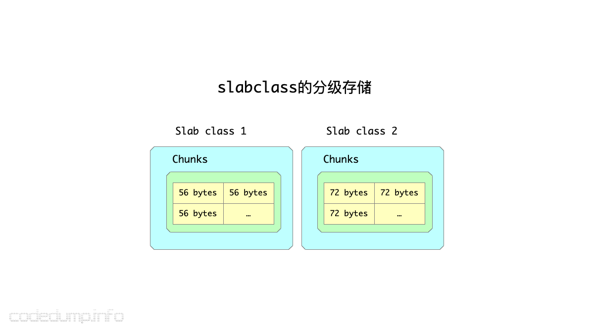
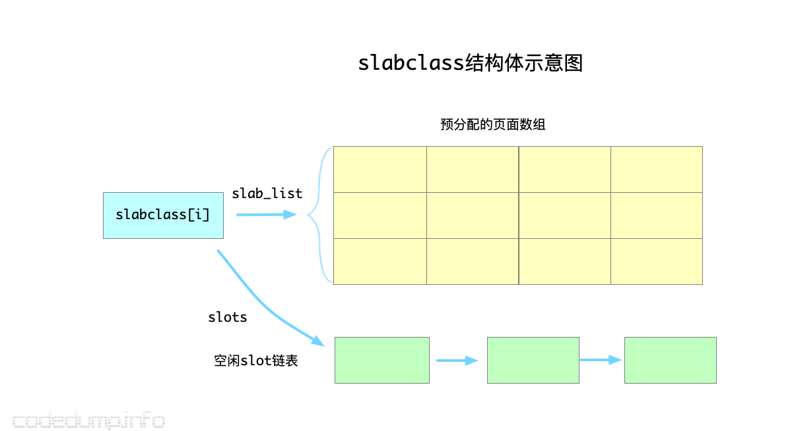
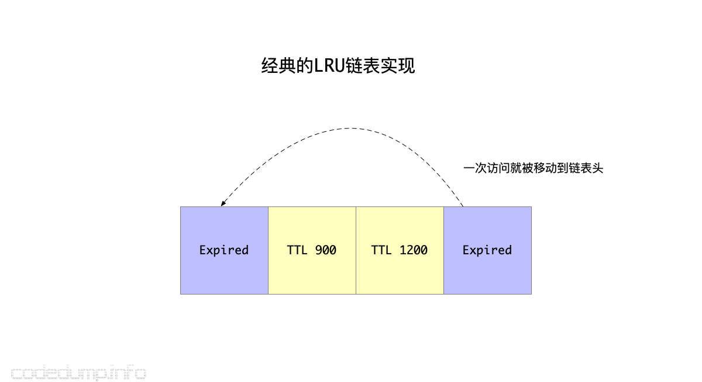
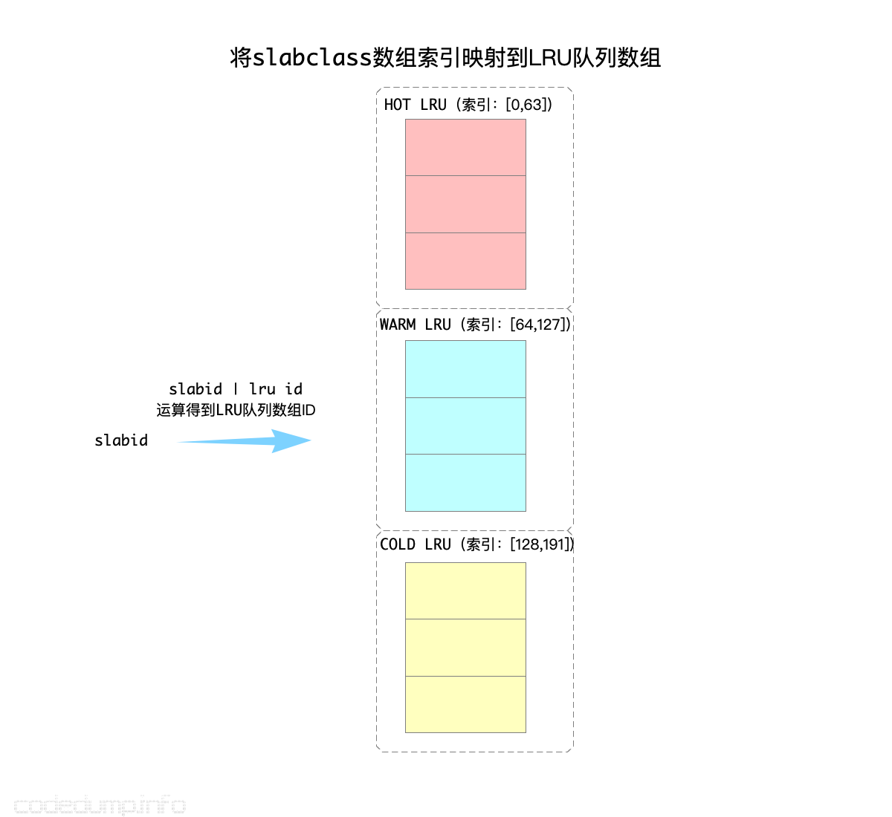
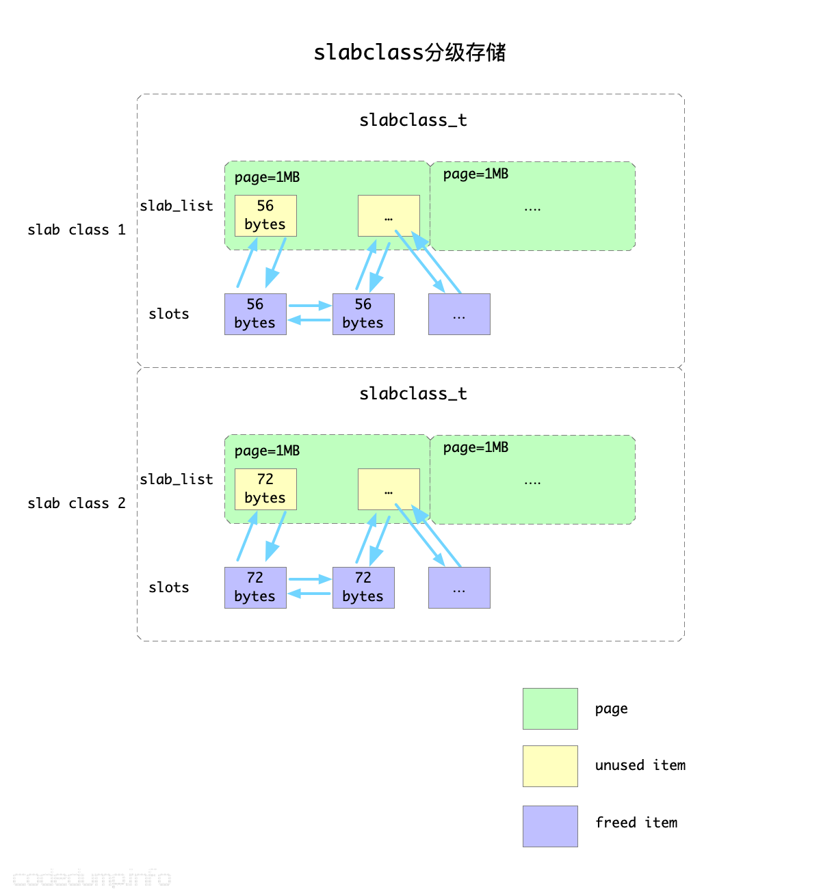
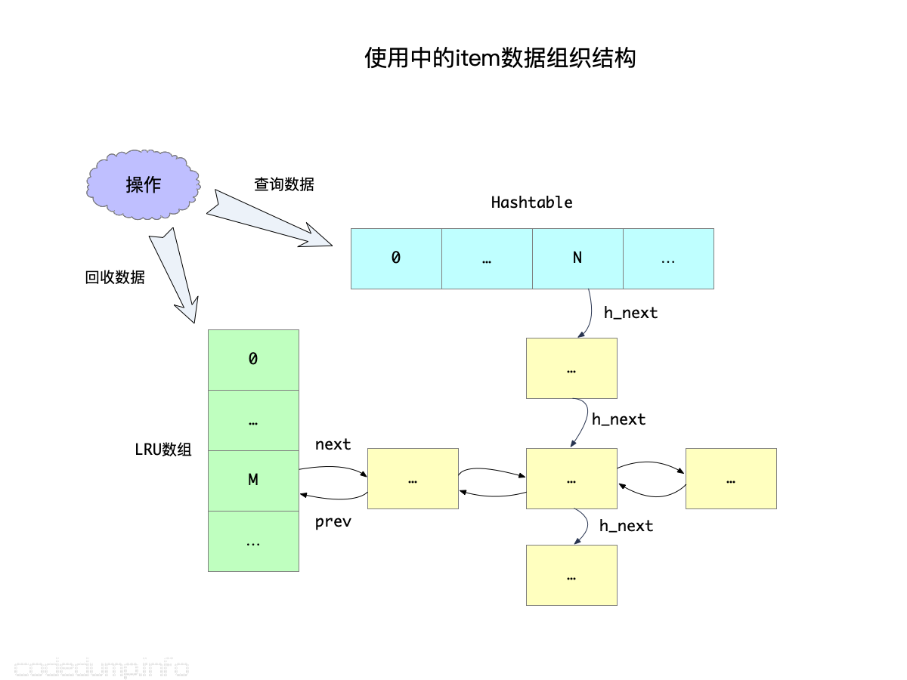
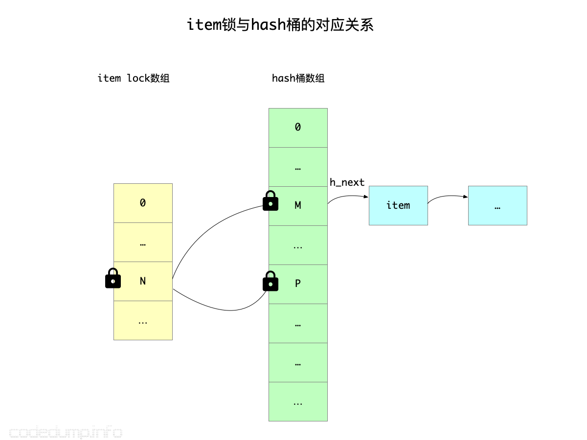
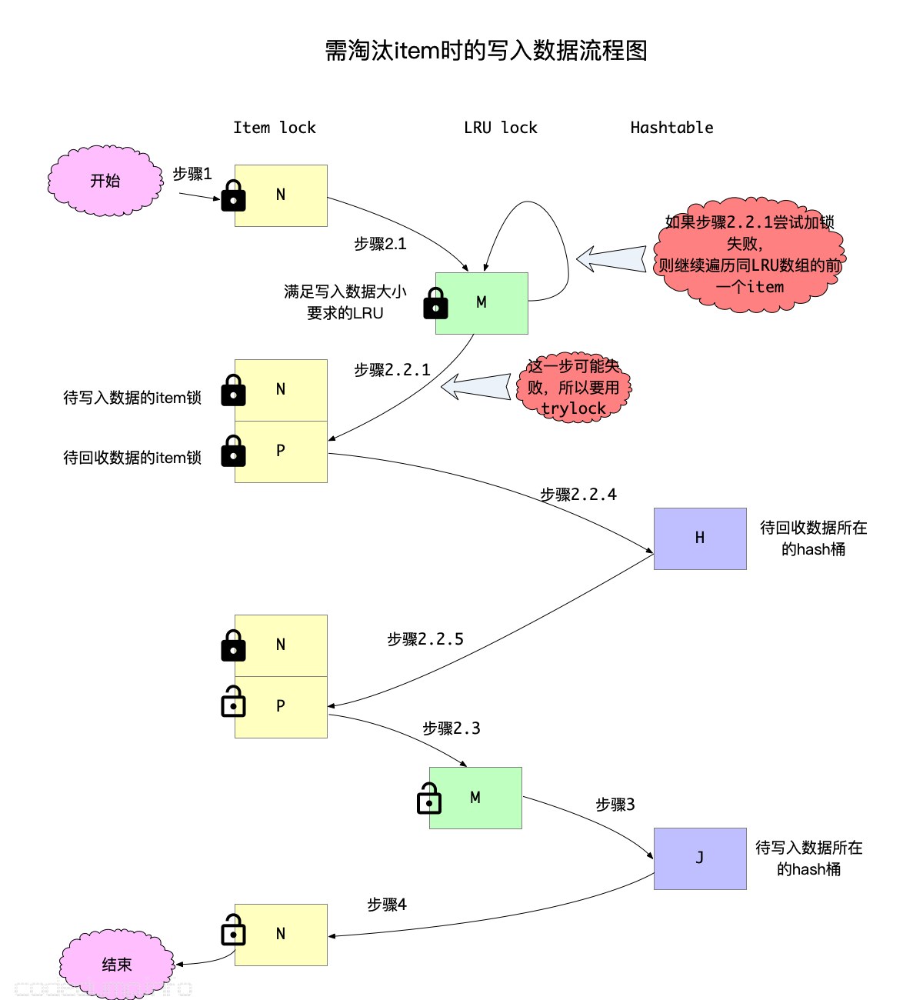
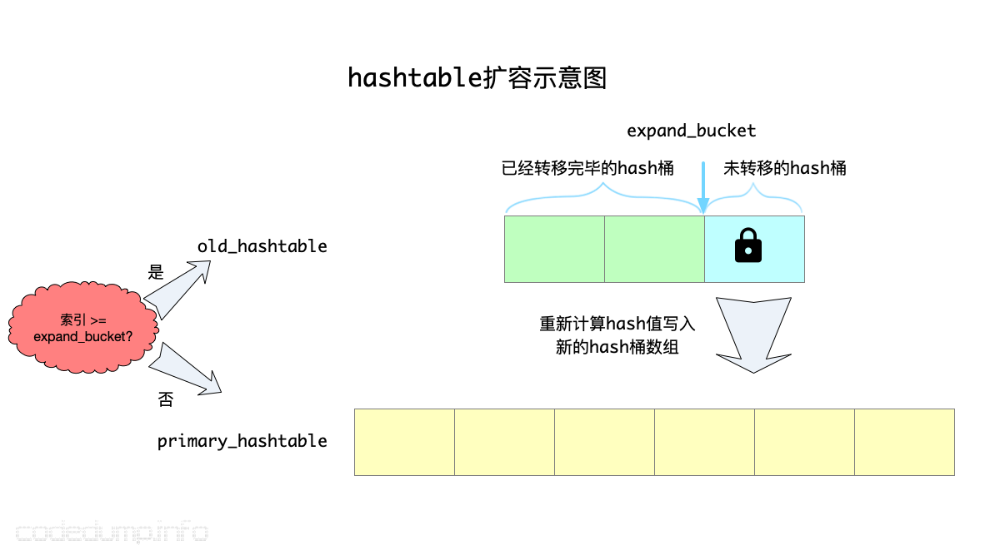

 
<!--BEGIN_DATA
{
    "create_date": "2021-12-18 22:20", 
    "modify_date": "2021-12-18 22:20", 
    "is_top": "0", 
    "summary": "Memcached的存储原理解析<br>Memcached的存储原理解析（续）", 
    "tags": "数据库、算法", 
    "file_name": "Memcached的存储原理解析.md"
}
END_DATA-->

#### <p>原文出处：<a href='https://www.codedump.info/post/20210701-memcached/' target='blank'>Memcached的存储原理解析</a></p>

最近工作上的需要，需要做一个LRU形式管理内存的分配器，首先想到的就是Memcached这个项目。早些年粗略的看过一些，有个大体的了解，这一次看下来发现其LRU算法做了不少的改动。

本文解析Memcached内存管理这部分的内容，基于Memcached 1.6.9版本。

Memcached将单个KV数据的存储，都放在`item`这个结构体中，每个`item`数据同时存在于这几个数据结构之中：

  * `slabclass_t`：以分级存储机制来提供内存的数据结构（下面展开详细讨论slabclass）。
  * 链表：当`item`被使用时，存储在LRU链表中（下面详细讨论LRU链表）；当`item`被释放之后，空闲的`item`形成一个链表以备再次使用。
  * hash表：用于根据键值查找数据的数据结构。

hash表自不必多说，Memcached中将`item`组织成一个名为`primary_hashtable`的hash数组，根据键值查找元素时，首先计算出键值的hash值，再到对应的数组元素中遍历查找数据。

`slabclass_t`结构体以分级的方式分配内存给`item`，这样做有以下几个好处：

  * 统一了内存的管理，避免了内存的碎片化。
  * 分配、释放内存时都能到对应的slab中。

## slabclass_t

### 定义

slabs.c中定义了类型为`slabclass_t`、大小为`MAX_NUMBER_OF_SLAB_CLASSES`的数组`slabclass`，用于分级存储。

数组中的每个`slabclass_t`元素，其能分配出去的内存大小递增，由如下的规则决定：

  * 每个数组可分配的内存大小都要8字节对齐（`CHUNK_ALIGN_BYTES`）,这个大小保存在`slabclass_t`的`size`成员中。
  * 数组的第一个`slabclass_t`元素的可分配内存大小为`sizeof(item) + settings.chunk_size`。这之后的`slabclass_t`可分配内存大小，都在上一个的元素的基础上放大`factor`倍，同时还要8字节对齐。
  * 每次分配一个页面的大小由配置项`settings.slab_page_size`来决定，因此每一个`slabclass_t`元素的一个页面能容纳的`item`数量为`settings.slab_page_size / slabclass[i].size`。



当需要分配一块大小的内存时，首先需要根据其大小，计算出该尺寸最终对应到上面的哪个元素，这个数组索引在Memcached中被称为`clsid`，这个计算索引的过程参见函数`slabs_clsid`。

比如：

  * `slabclass[0].size = 56`，fator参数为1.2，那么`slabclass[1].size = (56 * 1.25)`向上对齐8位 = 72，以此类推。
  * 假设需要分配的内存大小为60，就会去找`slabclass_t.size >= 60`的第一个slabclass，在这个例子中返回的`clsid`是1，也就是`slabclass[1]`。
  * 内存分配时根据大小向上取满足条件的第一个slab的做法，优点在于方便了内存的分配管理，缺陷是会浪费掉部分空间，比如上面的例子中，将大小为72的slab用于60的内存，那么12字节的空间就被浪费掉了。

每一个slab中，需要维持两类空间：

  * 按照页面大小来分配的一整页空间，每个页面又按照该slab的大小划分成了多个不同的chunk。
  * 管理使用已被释放的item。

在`slabclass_t`结构体中，以下几个成员用来维护该class的内存信息：

  * `slab_list`：保存页面的数组，其大小保存在`slabs`成员中。
  * `sl_curr`：可用的`item`数量。
  * `slots`：保存在该`slabclass_t`中空闲`item`的链表头。



即：

  * 在Memcached的这一套内存管理体系中，一个页面被称为一个`slab`，其大小为`settings.slab_page_size`；页面中可以分割成多个`slot`用来分配内存，一个`slot`的大小由该`slabclass`的初始大小及`factor`来决定，但是需要向上补齐为8位对齐的大小。
  * 一个`slabclass`中，有预分配好的页面数组，也有被回收的元素组成的空闲slot链表，分配元素时优先从空闲链表中分配（见函数`do_slabs_alloc`）。

### 内存分配

既然Memcached是一个LRU形式的内存分配器，所以其内存是有限制的，系统中定义了如下几个全局变量来保存当前系统的内存分配信息：

  * `static size_t mem_limit`：内存分配的上限。
  * `static size_t mem_malloced`：当前分配的内存大小。
  * `static void *mem_base`：保存内存的起始地址。
  * `static void *mem_current`：保存内存分配的当前地址。

在初始化时，系统首先会根据`mem_limit`分配一大块内存出来。

后续各个`slabclass`需要内存时，如下操作：

  * 就从这一大块内存中每次分配一个页面（大小为`settings.slab_page_size`）出去用。
  * 将分配好的内存按照每个slab中容纳的`slot`大小切分成多个`slot`。（见函数`split_slab_page_into_freelist`）。

## LRU算法

### 旧的LRU算法及其问题

以往的LRU算法，基本做法都是这样的：

  * 创建一个LRU链表，每次新加入的元素都放在链表头。
  * 如果元素被访问了一次，同样从当前链表中摘除放到链表头。
  * 需要淘汰元素时，从链表尾开始找可以淘汰的元素出来淘汰。

这个算法有如下几个问题：

  * 元素被访问一次就会被放到LRU链表的头部，这样即便这个元素可以被淘汰，也会需要很久才会淘汰掉这个元素。
  * 由于上面的原因，从链表尾部开始找可以淘汰的元素时，实际可能访问到的是一些虽然不常被访问，但是还没到淘汰时间（即有效时间TTL还未过期）的数据，这样会一直沿着链表往前找很久才能找到适合淘汰的元素。由于这个查找被淘汰元素的过程是需要加锁保护的，加锁时间一长影响了系统的并发。



综上，经典的LRU链表问题的核心在于：

  * 只需要一次被访问就能让元素远离被淘汰的地方。
  * 以及如何高效定位到更可能被淘汰的元素。

从Memcached 1.5版本开始，引入了所谓的分段LRU算法（Segmented LRU）来解决这些问题。

### 改进的分段LRU算法（Segmented LRU）

分段LRU算法中将LRU链表根据`活跃度`分成了三类：

  * `HOT_LRU`：存储热数据的LRU链表。
  * `WARM_LRU`：存储温数据（即活跃度不如热数据）的LRU链表。
  * `COLD_LRU`：存储冷数据的LRU链表。

需要说明的是：热（参数`settings.hot_lru_pct`）和暖（参数`settings.warm_lru_pct`）数据的占总体内存的比例有限制，而冷数据则无限。

```c
#define HOT_LRU 0
#define WARM_LRU 64
#define COLD_LRU 128
```

同时，使用了`heads`和`tails`两个数组用来保存LRU链表：

```c
#define POWER_LARGEST  256 /* actual cap is 255 */
#define LARGEST_ID POWER_LARGEST
static item *heads[LARGEST_ID];
static item *tails[LARGEST_ID];
```

上面分析`slabclass`的时候提到过，首先会根据被分配内存大小计算出来一个`slabclass`数组的索引。在需要从LRU链表中淘汰数据时，由于LRU链表分为了上面三类，那么就还需要再进行一次`slabid | lru id`计算（其实就是`slabid + lru id`），到对应的LRU链表中查找元素：



有了这三种LRU队列的初步印象，可以接下来解释这个分段LRU算法了。

前面提到，原有LRU算法最大的问题是：只要元素被访问过一次，就马上会被移动到LRU链表的前面，影响了后面对这个元素的淘汰。

首先，改进的算法中，加入了一个机制：只有当元素被访问两次以后，才会标记成`活跃`元素。

代码中引入了两个标志位，其置位的规则如下：

  * `ITEM_FETCHED`：第一次被访问时置位该标志位。
  * `ITEM_ACTIVE`：第二次被访问时（即`it->it_flags & ITEM_FETCHED`为true的情况下）置位该标志位。
  * `INACTIVE`：不活跃状态。

`ITEM_ACTIVE`标志位清除的规则如下：

  * 如果从链表尾遍历到某一个LRU链表时，该元素是链表的最后一个元素，则认为是不活跃的元素，即可以清除`ITEM_ACTIVE`标志位；

这样，有效避免了只访问一次就变成`活跃`元素的问题（见函数`do_item_bump`）。

以下的讨论中，元素变成`活跃`就意指“至少被访问两次以上”。

其次，由于从链表尾部往前查找可以淘汰的元素，中间可能会经历很多不能被淘汰的元素，影响了淘汰的速度，因此前面的分级LRU链表就能帮助程序快速识别出哪些元素可以被淘汰。三个分级的LRU链表之间的转换规则如下：

  * `HOT_LRU`：在HOT LRU队列中的数据绝不会到HOT_LRU队列的前面，只会往更冷的队列中放。规则是：如果元素变得活跃，就放到WARM队列中；否则如果不活跃，就直接放到COLD队列中。
  * `WARM_LRU`：如果WARM队列的元素变的`活跃`，就会移动到WARM队列头；否则往COLD队列移动。
  * `COLD_LRU`：从上面可知，COLD队列中的元素，都是不太活跃的了，所以当需要淘汰元素时都会首先到COLD LRU队列中找可以淘汰的数据。当一个在COLD队列的元素重新变成`活跃`元素时，并不会移动到COLD队列的头部，而是直接移动回去WARM队列。

以上需要注意的是：任何操作都不能将一个元素从WARM和COLD队列中移动回去HOT队列了，也就是从HOT队列中移动元素出去的操作是单向操作。

上述算法的状态机转换过程，可以参考下图。使用了这些规则来维护着三个队列之后，基本能保证COLD队列中的元素是不活跃的，这样查找起被淘汰元素也更快了。


综述起来，改进的分段LRU算法做了如下的优化：

  * 需要至少两次被访问，才能变成`活跃`元素。
  * 将元素按照被访问频率的`冷热程度`，划分为三种LRU链表来分段管理，加速了查找被淘汰元素的流程。

## 参考资料

  * [Replacing the cache replacement algorithm in memcached](https://memcached.org/blog/modern-lru/)
  * [memcached/new_lru.txt](https://github.com/memcached/memcached/blob/master/doc/new_lru.txt)

<hr>

#### <p>原文出处：<a href='https://www.codedump.info/post/20210812-memcached/' target='blank'>Memcached的存储原理解析（续）</a></p>

在前面的[Memcached的存储原理解析](https://www.codedump.info/post/20210701-memcached/)一文中，简单分析了memcached的存储原理，但是最近在照搬memcached的实现原理到项目中时，发现前面的梳理还不够细致，有一些细节没有谈及，因此重新整理一篇文章。

## slab

memcached是根据slab为基础单位来管理空闲空间的。slab的大体原理如下图：



slabs.c中定义了类型为`slabclass_t`、大小为`MAX_NUMBER_OF_SLAB_CLASSES`的数组`slabclass`，用于分级
存储。

数组中的每个`slabclass_t`元素，其能分配出去的内存大小递增，由如下的规则决定：

  * 每个数组可分配的内存大小都要8字节对齐（`CHUNK_ALIGN_BYTES`）,这个大小保存在`slabclass_t`的`size`成员中。
  * 数组的第一个`slabclass_t`元素的可分配内存大小为`sizeof(item) + settings.chunk_size`。这之后的`slabclass_t`可分配内存大小，都在上一个的元素的基础上放大`factor`倍，同时还要8字节对齐。
  * 每次分配一个页面的大小由配置项`settings.slab_page_size`来决定，因此每一个`slabclass_t`元素的一个页面能容纳的`item`数量为`settings.slab_page_size / slabclass[i].size`。

以上图为例，假设第一级存储的item大小不超过56字节，每个slab之间的增长因子是1.2，那么下一个slab存储的item内存大小就是`56*1.2=72`字节。

在当前还有空闲可用内存的情况下，每一次分配新的空间，都是以page（page=1MB）为单位的，然后再根据该slab的item大小划分为多个空闲可用item。

`slabclass_t`类型中最重要的是以下两个成员：

  * `slab_list`：保存已经分配出去的page数组，分配一个page的内存之后，需要将page根据该slab的size划分成多个空闲的item，挂载到下面提到的slots链表中。当最后需要回收分配出去的内存时，直接遍历`slab_list`中的成员回收内存即可。
  * `slots`：保存空闲item链表。空闲item来源有两部分，一部分是从page中分配但是还未使用的item，还有一部分是曾经被使用后来释放回来的item，上图中使用了不同的颜色进行了区分。

当需要分配一块大小的内存时，首先需要根据其大小，计算出该尺寸最终对应到上面的哪个元素，这个数组索引在Memcached中被称为`clsid`，这个计算索引的过程参见函数`slabs_clsid`。

比如：

  * `slabclass[0].size = 56`，fator参数为1.2，那么`slabclass[1].size = (56 * 1.25)`向上对齐8位 = 72，以此类推。
  * 假设需要分配的内存大小为60，就会去找`slabclass_t.size >= 60`的第一个slabclass，在这个例子中返回的`clsid`是1，也就是`slabclass[1]`。
  * 内存分配时根据大小向上取满足条件的第一个slab的做法，优点在于方便了内存的分配管理，缺陷是会浪费掉部分空间，比如上面的例子中，将大小为72的slab用于60的内存，那么12字节的空间就被浪费掉了。

从上面可以看到，`slabclass_t`用于管理空闲内存，当需要分配新item时，会依次做如下的检查：

  * 如果`slots`链表中还有空闲item，直接摘下来使用；
  * 否则，如果当前还没有达到内存分配的阈值，就分配一个新的page出来，将page按照该slab的大小划分为多个item，这些新分配出来的item都挂载到`slots`链表中。
  * 如果以上两步都不满足了，说明当前已经没有可用的内存和空闲item，需要进行淘汰了。

讲到item的淘汰，就涉及到下面的LRU算法了。

## LRU算法

### 旧的LRU算法及其问题

以往的LRU算法，基本做法都是这样的：

  * 创建一个LRU链表，每次新加入的元素都放在链表头。
  * 如果元素被访问了一次，同样从当前链表中摘除放到链表头。
  * 需要淘汰元素时，从链表尾开始找可以淘汰的元素出来淘汰。

这个算法有如下几个问题：

  * 元素被访问一次就会被放到LRU链表的头部，这样即便这个元素可以被淘汰，也会需要很久才会淘汰掉这个元素。
  * 由于上面的原因，从链表尾部开始找可以淘汰的元素时，实际可能访问到的是一些虽然不常被访问，但是还没到淘汰时间（即有效时间TTL还未过期）的数据，这样会一直沿着链表往前找很久才能找到适合淘汰的元素。由于这个查找被淘汰元素的过程是需要加锁保护的，加锁时间一长影响了系统的并发。


综上，经典的LRU链表问题的核心在于：

  * 只需要一次被访问就能让元素远离被淘汰的地方。
  * 以及如何高效定位到更可能被淘汰的元素。

从Memcached 1.5版本开始，引入了所谓的分段LRU算法（Segmented LRU）来解决这些问题。

### 改进的分段LRU算法（Segmented LRU）

分段LRU算法中将LRU链表根据`活跃度`分成了三类：

  * `HOT_LRU`：存储热数据的LRU链表。
  * `WARM_LRU`：存储温数据（即活跃度不如热数据）的LRU链表。
  * `COLD_LRU`：存储冷数据的LRU链表。

需要说明的是：热（参数`settings.hot_lru_pct`）和暖（参数`settings.warm_lru_pct`）数据的占总体内存的比例有限制，而冷数据则无限。

```c
#define HOT_LRU 0
#define WARM_LRU 64
#define COLD_LRU 128
```

同时，使用了`heads`和`tails`两个数组用来保存LRU链表：

```c
#define POWER_LARGEST  256 /* actual cap is 255 */
#define LARGEST_ID POWER_LARGEST
static item *heads[LARGEST_ID];
static item *tails[LARGEST_ID];
```

上面分析`slabclass`的时候提到过，首先会根据被分配内存大小计算出来一个`slabclass`数组的索引。在需要从LRU链表中淘汰数据时，由于LRU链表分为了上面三类，那么就还需要再进行一次`slabid | lru id`计算（其实就是`slabid + lru id`），到对应的LRU链表中查找元素：


有了这三种LRU队列的初步印象，可以接下来解释这个分段LRU算法了。

前面提到，原有LRU算法最大的问题是：只要元素被访问过一次，就马上会被移动到LRU链表的前面，影响了后面对这个元素的淘汰。

首先，改进的算法中，加入了一个机制：只有当元素被访问两次以后，才会标记成`活跃`元素。

代码中引入了两个标志位，其置位的规则如下：

  * `ITEM_FETCHED`：第一次被访问时置位该标志位。
  * `ITEM_ACTIVE`：第二次被访问时（即`it->it_flags & ITEM_FETCHED`为true的情况下）置位该标志位。
  * `INACTIVE`：不活跃状态。

ITEM_ACTIVE标志位清除的规则如下：

  * 如果从链表尾遍历到某一个LRU链表时，该元素是链表的最后一个元素，则认为是不活跃的元素，即可以清除`ITEM_ACTIVE`标志位；

这样，有效避免了只访问一次就变成`活跃`元素的问题（见函数`do_item_bump`）。

以下的讨论中，元素变成`活跃`就意指“至少被访问两次以上”。

其次，由于从链表尾部往前查找可以淘汰的元素，中间可能会经历很多不能被淘汰的元素，影响了淘汰的速度，因此前面的分级LRU链表就能帮助程序快速识别出哪些元素可以被淘汰。三个分级的LRU链表之间的转换规则如下：

  * `HOT_LRU`：在HOT LRU队列中的数据绝不会到HOT_LRU队列的前面，只会往更冷的队列中放。规则是：如果元素变得活跃，就放到WARM队列中；否则如果不活跃，就直接放到COLD队列中。
  * `WARM_LRU`：如果WARM队列的元素变的`活跃`，就会移动到WARM队列头；否则往COLD队列移动。
  * `COLD_LRU`：从上面可知，COLD队列中的元素，都是不太活跃的了，所以当需要淘汰元素时都会首先到COLD LRU队列中找可以淘汰的数据。当一个在COLD队列的元素重新变成`活跃`元素时，并不会移动到COLD队列的头部，而是直接移动回去WARM队列。

以上需要注意的是：任何操作都不能将一个元素从WARM和COLD队列中移动回去HOT队列了，也就是从HOT队列中移动元素出去的操作是单向操作。

上述算法的状态机转换过程，可以参考下图。使用了这些规则来维护着三个队列之后，基本能保证COLD队列中的元素是不活跃的，这样查找起被淘汰元素也更快了。


综述起来，改进的分段LRU算法做了如下的优化：

  * 需要至少两次被访问，才能变成`活跃`元素。
  * 将元素按照被访问频率的`冷热程度`，划分为三种LRU链表来分段管理，加速了查找被淘汰元素的流程。

## 读写操作的实现

从以上的分析里，可以看出memcached中主要有这么几种数据结构：

  * item：存储一个KV数据的基本单位。
  * slabclass：存储空闲item的数据结构。
  * lru链表：根据访问的冷热程度存储当前在使用中的item。
  * hash表：这部分没有在上面描述，用于根据key查询item的数据结构。

一个item，必然处于空闲和在使用这两种互斥状态之一，即：

  * 空闲的item：保存在slabclass的slots空闲链表中，这一点已经在上面slab的图示中描述过了。
  * 在使用中的item：保存在lru链表中，用于数据回收之用；同时还保存在hash表中，用于数据访问时使用。如下图所示：



对item的数据组织有了大体的概念之后，下面展开来说读写操作的具体实现。

### 读操作

由于被使用数据存储在hash表中，所以查询操作相对简单，其伪代码是：

```c
读操作：
  加锁
    在hash表中查询数据
  释放锁
  返回查询的结果
```

虽然简单，但是其中有一个值得注意的细节。这里的加锁操作，并不是一个全局锁，否则系统的并发性会大大折扣；同时，也不是给hash数组中的某一个hash桶进行加锁，实际上hash表本身并不存在锁操作。

在这里，加的锁是首先根据所查询数据的键进行hash计算，再得到对应的锁，在memcached里被称为“item lock”（见全局变量`static pthread_mutex_t *item_locks`）。这个锁虽然与数据的键值相关，但是如果hash数组数量与item_locks不相等，那么就不是一一对应的关系，所以才说不是针对hash桶进行加锁。如果hash桶的数量大于item lock的数量，那么这就是一对多的关系，也就是对一个item lock加锁之后，获得锁的线程可以访问多个hash桶。



上图中，索引为N的item锁，管理着索引为M、P这两个hash桶，因此拿到该item锁的线程可以同时访问这两个hash桶。

因此，上面的读操作更准确的描述应该是：

```c
读操作：
  根据查询键值加item锁
    在hash表中查询数据
  根据查询键值释放item锁
  返回查询的结果
```

### 写操作

与前面非常简单的读操作相比，写操作会更加复杂，因为当内存不足时需要淘汰在LRU数组中的item。

```c
写操作：  
  根据查询键值加item锁
    分配足够内存的item，写入新的数据
    向hash表中写入数据
  根据查询键值释放item锁
```

在上面的步骤中，`分配足够内存的item`这一步，暂不考虑分析内存足够下的情况，因为这种情况相对简单，只分析内存不足时需要淘汰的情况。将这部分代码展开来讨论，则伪代码如下：

```c
写操作：  
1:根据查询键值加item锁
  2:内存不足情况下分配足够内存的item，写入新的数据：
    2.1:计算满足所需内存所在的LRU数组元素，对该LRU链表加锁
    2.2:从后往前遍历所要求内存的LRU数组：
      2.2.1:找到一个item，如果尝试对该item的键值进行加锁失败，则继续尝试下一个item
      2.2.3:否则，对该item的键值进行加锁成功，如果符合回收条件：
        2.2.4:从item所在的hash表中删除item
      2.2.5:释放2.2.1中加的item锁
    2.3:对该LRU链表解锁
  3:向hash表中写入数据
4:根据查询键值释放item锁
```

需要注意的是，步骤2.2.1中，是尝试对当前item的键值所在的item锁加锁，这一步是可能失败的，因为在第一步中已经加上了item锁，两者有可能相同，如果这里不是尝试而是直接等待解锁，则可能造成死锁。

但是仅有上面的步骤仍然是不够的，因为即便找到了一个可以被回收的item，也要确定该item没有被其他线程引用，判断的标准是根据item中的引用计数：首先将引用计数加1，如果为2的情况下（使用中的item默认引用计数为1）说明当前只有本线程引用了这个item，后面就可以安全的回收该item。

在memcached代码中，如果上一步增加引用计数之后不为2时，有可能是item泄露了，如果打开`tail_repair_time`开关且满足时间的情况下，可以进行强制回收，但是作者也提醒了这样可能会造成程序core掉，也就是出现上面提到的被引用的item被释放的情况：

```c
int lru_pull_tail(const int orig_id, const int cur_lru,
        const uint64_t total_bytes, const uint8_t flags, const rel_time_t max_age,
        struct lru_pull_tail_return *ret_it) {
        // ...
        if (refcount_incr(search) != 2) {
            /* Note pathological case with ref'ed items in tail.
             * Can still unlink the item, but it won't be reusable yet */
            itemstats[id].lrutail_reflocked++;
            /* In case of refcount leaks, enable for quick workaround. */
            /* WARNING: This can cause terrible corruption */
            if (settings.tail_repair_time &&
                    search->time + settings.tail_repair_time < current_time) {
                itemstats[id].tailrepairs++;
                search->refcount = 1;
                /* This will call item_remove -> item_free since refcnt is 1 */
                STORAGE_delete(ext_storage, search);
                do_item_unlink_nolock(search, hv);
                item_trylock_unlock(hold_lock);
                continue;
            }
        }
        // ...
}
```

步骤2，内存不足情况下分配足够内存的item，其完整实现在函数`lru_pull_tail`中，读者可以自行结合上面的伪代码以及前面提及的LRU算法自行分析。

以上的整个流程如下图所示：



解释完毕了读写操作流程之后，需要回答这个问题：为什么针对键值的锁加在了item锁上，而不是hash桶？

原因在于：当写入的元素过多时，hash表需要进行扩容操作，即可以认为hash桶的数量是有可能发生变化的。因此，如果锁在hash桶上，在容量发生变化的时候就难以处理。而item锁数组，其大小则是固定的，不存在这个问题。

## hash数组的扩容操作

hash数组的数量必须是2的次方，每次存储的数据总量超过数组数量的1.5倍时，就需要扩容一倍，最多到2^32。

扩容流程示意图如下：



扩容步骤为：

  * 按照新的大小分配出来新的hash数组保存到`primary_hashtable`中，原hash数组命名为`old_hashtable`，另外有扩容索引值`expand_bucket`，在该索引之前的数据，表示已经从`old_hashtable`中转移到新的hash数组了。
  * 每次操作一个hash桶元素，需要对该hash桶对应的item锁进行加锁之后才能开始转移。
  * 期间如果有数据访问，首先按照旧的hash桶数量进行计算，如果计算出来的索引值不小于`expand_bucket`，说明这个数据还在旧的桶里，到`old_hashtable`中查找；否则说明在新的hash数组里了，按照新的hash桶数量计算器索引值，然后再到`primary_hashtable`中操作。

## 综述

从以上分析可以看出，实现一个完备的LRU cache库，需要考虑的细节问题其实不少的，尤其memcached需要应对的是多线程情况下cache的读写，比之redis单进程单线程的情况还是要复杂不少，主要包括以下方面：

  * 如何有效、快速的分配、利用内存（slab算法与数据结构）。
  * 更合理的LRU算法，不至于一次访问就导致该数据难以被回收（分段LRU算法）。
  * 细粒度加锁操作，而不是全局锁，保证读写操作的并发。不把针对键值的锁放在hash桶上，因为可能会因为容量扩充导致hash桶数组变化，而是使用了一个固定大小的锁数组。
  * 除了上述的锁之外，还需要不要回收正在被使用的内存（item引用计数）。
  * hash数组扩容时如何尽量减少数据访问的冲突。

## 参考资料

  * [Replacing the cache replacement algorithm in memcached](https://memcached.org/blog/modern-lru/)
  * [memcached/new_lru.txt](https://github.com/memcached/memcached/blob/master/doc/new_lru.txt)
