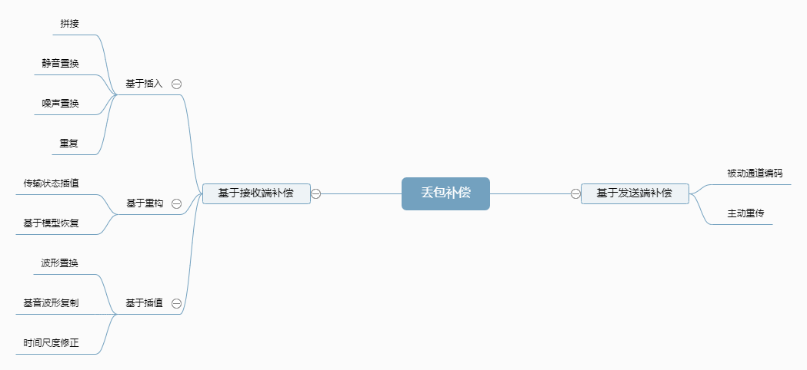
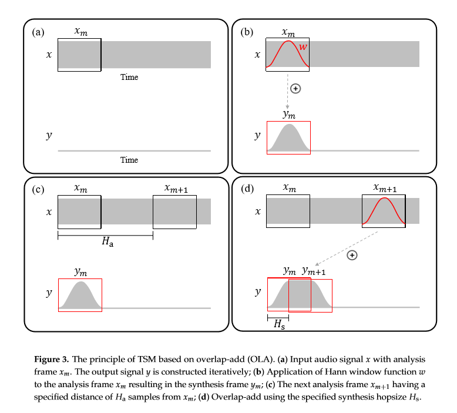
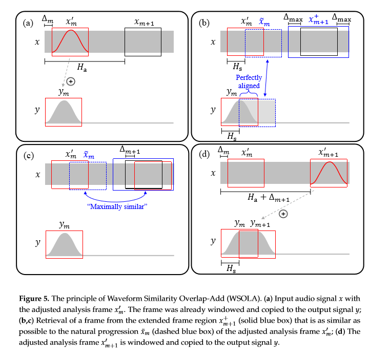

<!--BEGIN_DATA
{
    "create_date": "2021-01-03 14:20", 
    "modify_date": "2021-01-03 14:20", 
    "is_top": "0", 
    "summary": "WebRTC中的NetEQ<br/>NetEQ主要文件简介", 
    "tags": "WebRTC、C/C++", 
    "file_name": "NetEQ.md"
}
END_DATA-->

#### <p>原文出处：<a href='https://www.cnblogs.com/mengnan/p/11637449.html' target='blank'>WebRTC中的NetEQ</a></p>

NetEQ使得WebRTC语音引擎能够快速且高解析度地适应不断变化的网络环境，确保了音质优美且缓冲延迟最小，其集成了自适应抖动控制以及丢包隐藏算法。

### WebRTC和NetEQ概述

#### WebRTC

WebRTC（Web Real-Time Communications）是一项实时通讯技术，它允许网络应用或者站点，在不借助中间媒介的情况下，建立浏览器之间点对点（Peer-to-Peer）的连接，实现视频流和（或）音频流或者其他任意数据的传输。WebRTC包含的这些标准使用户在无需安装任何插件或者第三方的软件的情况下，创建点对点（Peer-to-Peer）的数据分享和电话会议成为可能。

WebRTC主要由语音引擎、视频引擎和传输引擎组成：

* Voice Engine（音频引擎） 
  * iSAC/iLBC Codec（音频编解码器，前者是针对宽带和超宽带，后者是针对窄带）
  * NetEQ for voice（处理网络抖动和语音包丢失）
  * Echo Canceler（回声消除）/ Noise Reduction（噪声抑制）
* Video Engine（视频引擎） 
  * VP8 Codec（视频图像编解码器）
  * Video jitter buffer（视频抖动缓冲器，处理视频抖动和视频信息包丢失）
  * Image enhancements（图像质量增强）
* Transport 
  * SRTP（安全的实时传输协议，用以音视频流传输）
  * Multiplexing（多路复用）
  * P2P，STUN+TURN+ICE（用于NAT网络和防火墙穿越）
  * 除此之外，安全传输可能还会用到DTLS（数据报安全传输），用于加密传输和密钥协商
  * 整个WebRTC通信是基于UDP的

音频引擎的工作流程：

  * 发送端采集音频信号，并进行回声抑制、噪声消除、自动增益控制等前处理；
  * 对处理后的数据进行编码，并封装为数据包；
  * 数据包在网络上传输至接收端；
  * 接收端解包，进行`NetEQ`中的抖动消除、丢包补偿、解码，另外噪声抑制、自动增益控制等后处理，并将处理后的信号回传到发送端以进行回声抑制；
  * 处理后的音频送入声卡播放。

> 参见：[Tinywan/WebRTC-tutorial](https://github.com/Tinywan/WebRTC-tutorial)

#### NetEQ

NetEQ主要作用：消除由于网络环境变化造成的_丢包_和_数据包到达间隔抖动_。  

**目标函数：**

<span class="LaTex" alt="LaTex">
$$数据包i的IAT+数据包i在缓冲区的缓冲时间==数据包(i+1)的IAT+数据包(i+1)在缓冲区的缓冲时间$$
</span>

其中，`IAT`为数据包到达时间间隔。

##### 抖动定义

接收端_数据包<span class="LaTex" alt="LaTex">$$i$$</span>到达间隔_与_平均数据包到达间隔_之差定义为**抖动**：

<span class="LaTex" alt="LaTex">
$$J_i=E(T)-T_i\quad i=1,2,...,n$$
</span>

其中，<span class="LaTex" alt="LaTex">$$T_i$$</span>为第<span class="LaTex" alt="LaTex">$$i$$</span>个数据包到达间隔；<span class="LaTex" alt="LaTex">$$E(T)$$</span>为平均数据包到达间隔，当数据流为固定码率时，<span class="LaTex" alt="LaTex">$$E(T)$$</span>应等于或接近于数据包发送间隔。

抖动是一组由_时间间隔差_组成的序列，假设发送端每30ms产生一个数据包，也即是数据包发送间隔为30ms，在理想情况下，接收端对于任意<span class="LaTex" alt="LaTex">$$i$$</span>，<span class="LaTex" alt="LaTex">$$E(T)=30ms,T_i=30ms,J_i=0$$</span>。当<span class="LaTex" alt="LaTex">$$J_i>0$$</span>时，称作正抖动，说明数据包提前到达，对应于数据包的堆积，虽然保证了语音的完整性，但容易造成接收端抖动缓冲区溢出并且增大了延迟。当<span class="LaTex" alt="LaTex">$$J_i<0$$</span>，称作负抖动，说明数据包延迟到达或丢包。无论是由于超时和缓存溢出均可导致数据包丢失，因此不管是何种抖动，都会增加丢包概率。

抖动通常使用抖动缓冲进行消除，待播放时再以平滑的速率从缓冲区中取出，经解压后从声卡中取出播放。抖动消除的理想情况是：在网络上传输时延和缓冲时延相等。此时对每一个数据包的时延预判准确，既能够按照时序播放每一个数据包，又能够最大限度的减少缓冲时间从而减少整体延迟。抖动缓冲控制算法包括静态抖动缓冲控制和自适应抖动缓冲控制算法。自适应抖动缓冲控制算法：缓冲区大小随着实际网络状况而变化，接收端将当前收到的数据包延迟和算法中保存的延迟信息比较，而从调整当前缓冲区大小，NetEQ使用的就是自适应抖动控制。

##### 丢包隐藏

丢包隐藏又称丢包补偿(Packet Loss Compensation, PLC)。所谓丢包隐藏就是试图产生一个相似的音频数据包或噪声包以替代丢失的数据包，基于音频的短时相似性，在丢包率低时（小于15%）尽可能提升音质。



  * 基于插入。插入一个填充包来修复丢包，而填充包一般很简单，比如插入静音包、噪声包或者简单重复前面的包。优势：实现简单；缺点：恢复效果差，没有利用其它语音信息重建信号。
  * 基于重构。通过丢包前后的解码信息重构一个数据包，重构修补技术使用压缩算法来获得编码参数。优势：合成的丢失包效果最好；缺点：计算量最大。
  * 基于插值。通过模式匹配和插值技术创建与丢失包相似的数据包。该方法考虑了音频的变化信息。比基于插入的方法效果要好，实现难度要大。

##### NetEQ模块

NetEQ主要包含MCU和DSP两个模块：

  * 微处理单元(Micro Control Unit, MCU)，主要作用是根据当前情况做出相应动作，具体而言就是安排数据包的插入并控制数据包的输出。数据包的插入主要是确定从网络中到达的数据包在缓冲区的插入位置，而控制数据包的输出则是需要考虑什么时候输出数据以及输出哪一个数据。
  * 数字信号处理(Digital Signal Process, DSP)，主要作用是将MCU中提取到的数据包进行信号处理， 包括解码，加减速，丢包补偿，融合等。

### NetEQ基本输入输出

本单元主要介绍NetEQ输入数据包和输出音频数据，以及4种数据缓冲区。

#### NetEQ存取数据包的接口

NetEQ有两个比较重要对外的接口，一是向NetEQ模块插入从网络取得的RTP数据包`interface/neteq.h/InsertPacket()`，二是从NetEQ模块提取处理后的PCM音频数据`interface/neteq.h/GetAudio()`。

##### 向NetEQ中送入数据包

在`neteq_impl.cc`中，NetEQ存数据包的具体实现是`InsertPacket()`，而大部分工作由`InsertPacket()`调用的`InsertPacketInternal()`完成。主要是初始化NetEQ(第一次时调用，如刷新缓冲区，重置`timestamp_scaler`，更新编解码器等)，更新RTCP统计信息，解析`RTP`数据包，插入到抖动缓冲区`PacketBuffer`等。

`InsertPacket()`函数签名：

```cpp
int NetEqImpl::InsertPacket(const RTPHeader& rtp_header,
                            rtc::ArrayView<const uint8_t> payload,
                            uint32_t receive_timestamp)
```

另外，在解析网络的RTP数据包时，进行了时间戳的转换。主要解决了RTP采用的外部时间戳和代码内使用的内部时间戳不一致的情况，主要由`TimeStampScaler`完成时间戳的转换：

###### 时间戳缩放TimeStampScaler

`TimestampScaler`类负责将外部时间戳转换为内部时间戳，或者将内部时间戳转化为外部时间戳。

`timestamp_scaler.h`：

```cpp
// This class scales timestamps for codecs that need timestamp scaling.
// This is done for codecs where one RTP timestamp does not correspond to
// one sample.
class TimestampScaler {
  public:
  explicit TimestampScaler(const DecoderDatabase& decoder_database)
      : first_packet_received_(false),
        numerator_(1),
        denominator_(1),
        external_ref_(0),
        internal_ref_(0),
        decoder_database_(decoder_database) {}
...
};
```

* 外部时间戳：外部时间戳即为RTP携带的时间戳，表示RTP报文发送的时钟频率，单位为样本数而非真正的时间单位秒等。 
  * 在语音中，通常等于PCM语音的采样率，RTP携带Opus编码数据包时，时钟频率为固定的48kHz，但采样率可以有很多值。
  * 在视频中，无论是何种视频编码，外部时间戳（时钟频率）都设置为固定的90kHz。
* 内部时间戳：WebRTC使用的时间戳。

外部时间戳转换为内部时间戳时就是将外部时间戳按照采样率缩放。假设初始内部时间戳为0，则：

<span class="LaTex" alt="LaTex">
$$内部时间戳+=(外部时间戳间隔*采样率)/外部时钟频率\\
也即：内部时间戳+=(外部时间戳间隔/外部时钟频率)*采样率$$
</span>

`timestamp_scaler.cc`：

```cpp
numerator_ = info->SampleRateHz();
...
denominator_ = info->GetFormat().clockrate_hz;
...
const int64_t external_diff = int64_t{external_timestamp} - external_ref_;
...
internal_ref_ += (external_diff * numerator_) / denominator_;
```

反之，将内部时间戳转换为外部时间戳就是按照采样率扩大。假设初始外部时间戳为0，则：

<span class="LaTex" alt="LaTex">$$外部时间戳+=(内部时间戳间隔*外部时钟频率)/采样率$$</span>

```cpp
const int64_t internal_diff = int64_t{internal_timestamp} - internal_ref_;
return external_ref_ + (internal_diff * denominator_) / numerator_;
```

> [WebRTC：源码时间戳缩放类TimestampScaler解析](https://blog.csdn.net/qq_29621351/article/details/83341597)
>
> [WebRTC中的Opus编码揭秘](https://www.jianshu.com/p/090cbdf98a96)

##### 从NetEQ中取处理后的音频数据

在`neteq_impl.cc`中，NetEQ取音频数据的具体实现由`GetAudio()`提供，大部分工作由`GetAudioInternal()`完成。主要是获取MCU决策，解码，VAD检测，DSP信号处理，将处理完成后的音频数据存入语音缓冲区`SyncBuffer`，更新背噪参数，更新已播放时间戳等。

主要流程：

  1. 获得下一步的操作operation；
  2. 根据operation提取数据到解码缓冲区(`decoder_buffer_`)；
  3. 处理后的数据存入算法缓冲区(`algorithm_buffer_`)；
  4. 将算法缓冲区的数据复制到语音缓冲区(`sync_buffer_`)；
  5. 将语音缓冲区中的数据提取到`output`。

`GetAudio()`函数签名：

```cpp
int NetEqImpl::GetAudio(AudioFrame* audio_frame, bool* muted)
```

#### NetEQ的4个缓冲区

  * 抖动缓冲区

暂存从网络获得的音频数据包。

`packet.h`：

```cpp
// Struct for holding RTP packets.
struct Packet {
...
  uint32_t timestamp;
  uint16_t sequence_number;
  uint8_t payload_type;
  // Datagram excluding RTP header and header extension.
  rtc::Buffer payload;
  Priority priority;
  std::unique_ptr<TickTimer::Stopwatch> waiting_time;
  std::unique_ptr<AudioDecoder::EncodedAudioFrame> frame;
...
};
typedef std::list<Packet> PacketList;
```

`packet_buffer.h`：

```cpp
// This is the actual buffer holding the packets before decoding.
class PacketBuffer {
  public:
  enum BufferReturnCodes {
    kOK = 0,
    kFlushed,
    kNotFound,
    kBufferEmpty,
    kInvalidPacket,
    kInvalidPointer
  };
...
};
```

实现抖动缓冲区的类`PacketBuffer`使用一个整数型`max_number_of_packets_`表示抖动缓冲区所容纳的最多网络包的数量，使用一个`typedef std::list<Packet> PacketList`成员变量保存数据包。

  * 解码缓冲区

抖动缓冲区中的数据包通过解码器解码成为PCM原始音频数据，暂存到解码缓冲区。

`neteq_impl.h`：

```cpp
std::unique_ptr<int16_t[]> decoded_buffer_ RTC_GUARDED_BY(crit_sect_);
```

```cpp
size_t decoded_buffer_length_ RTC_GUARDED_BY(crit_sect_);
```

```cpp  
static const size_t kMaxFrameSize = 5760;  // 120 ms @ 48 kHz.
```

```cpp  
decoded_buffer_(new int16_t[decoded_buffer_length_]);
```

解码缓冲区的定义是一个带符号的16位整型数组，固定长度5760

  * 算法缓冲区

NetEQ将解码缓冲区中的数据进行拉伸、平滑处理后将结果暂存到DSP算法缓冲区。

`audio_multi_vector.h`：

```cpp
class AudioMultiVector {
  public:
  // Creates an empty AudioMultiVector with |N| audio channels. |N| must be
  // larger than 0.
  explicit AudioMultiVector(size_t N);
  // Creates an AudioMultiVector with |N| audio channels, each channel having
  // an initial size. |N| must be larger than 0.
  AudioMultiVector(size_t N, size_t initial_size);
...
  protected:
  std::vector<AudioVector*> channels_;
  size_t num_channels_;
...
};
```

算法缓冲区由一个`AudioMultiVector`类实现，包含`std::vector<AudioVector*> channels_`和`size_t num_channels_`成员变量。`AudioMultiVector`通过通道数`num_channels_`创建`AudioVector`，一个通道对应一个`AudioVector`。

`audio_vector.h`：

```cpp
class AudioVector {
  public:
  // Creates an empty AudioVector.
  AudioVector();
  // Creates an AudioVector with an initial size.
  explicit AudioVector(size_t initial_size);
  ...
};
```

`AudioVector`实际上是封装的类似于标准库`vector`的类，只不过大小固定。`size_t begin_index_`和`size_tend_index_`相当于`vector`的`begin()`和`end()`函数，返回开始和尾部下一个对应的迭代器。

  * 语音缓冲区

算法缓冲区中的数据会被塞到语音缓冲区中，声卡每隔10ms会从语音缓冲区中提取长度为10ms(80@8kHz个样本点)的语音数据播放。

`sync_buffer.h`：

```cpp
class SyncBuffer : public AudioMultiVector {
  public:
  SyncBuffer(size_t channels, size_t length)
      : AudioMultiVector(channels, length),
        next_index_(length),
        end_timestamp_(0),
        dtmf_index_(0) {}
...
};
```

语音缓冲区的实现类`SyncBuffer`继承自算法缓冲区的`AudioMultiVector`，但是多了`next_index_`和`end_timestamp_`两个成员变量。

    * `next_index_` 指示待播放的第一个样本点。
    * `end_timestamp_` 指示`SyncBuffer`中最后一个样本点的时间戳。

### MCU决策分析

#### 网络延迟统计算法(`target_level`，即`BLo`)

本部分参见类`DelayManager`

1. 统计数据包到达时间间隔`Iat`(以数据包个数为单位)计算方法如下：

<span class="LaTex" alt="LaTex">$$
packet\_len\_sample=\frac{timestamp-last\_timestamp}{sequence\_number-last\_seq\_no}\\
$$</span>
<br/>
<span class="LaTex" alt="LaTex">$$
packet\_len\_ms=\frac{1000*packet\_len\_samp}{sample\_rate\_hz}\\
$$</span>
<br/>
<span class="LaTex" alt="LaTex">$$
iat\_packets=\frac{packet\_iat\_count\_ms}{packet\_len\_ms}
$$</span>
<br/>
<span class="LaTex" alt="LaTex">$$
iat\_packets=\left\{\begin{matrix}
max(iat\_packets+(last\_seq\_no-sequence\_number+1),0)\quad 乱序
\\ 
iat\_packets+(last\_seq\_no-sequence\_number+1)
\end{matrix}\right. 
$$</span>

其中，`timestamp`为当前数据包时间戳，`last_timestamp`为上一个数据包的时间戳，`sequence_number`为当前数据包序列号，`last_seq_no`为上一个数据包序列号，`sample_rate_hz`为频率(每秒多少样本点)，`packet_iat_count_ms`为自上一个数据包经历的时间。  
上式中，计算`Iat`时乱序和正常情况方法一致，但是要确保`iat_packets`始终为正。假设发送端每30ms产生一个数据包（每一个数据包长度为30ms），0s时该数据包被发送，在90ms时接收端接收到该数据包并计算`Iat`(网络传输等花费了90ms)，则此时`Iat=90/30=3`。

2. 更新直方图，即更新`Iat`从0到64的概率分布  

代码中使用`iat_vector_`向量保存该直方图，其中每一个下标对应一个`Iat`值，下标对应的元素为相应发生的概率值。

  * `iat_vector_`向量中的每个元素首先乘遗忘因子<span class="LaTex" alt="LaTex">$$f$$</span>`iat_factor_`，使用遗忘因子对概率遗忘：

<span class="LaTex" alt="LaTex">$$p'_i=p_i\times f\quad i=0,1,...,64$$</span>

  * 增大本次计算到的`Iat`的概率<span class="LaTex" alt="LaTex">$$p_{Iat}=p_{Iat}+(1-f)$$</span>这样，在`iat_vector_`中，除了`Iat`对应的概率增加，其余概率都会减少
  * 归一化`iat_vector_`
  * 更新遗忘因子<span class="LaTex" alt="LaTex">$$f$$</span>，使<span class="LaTex" alt="LaTex">$$f$$</span>为递增趋势，即通话时间越长，包间隔的概率分布应该越稳定。该遗忘因子`iat_factor_`应趋近于`kIatFactor_`。其中`kIatFactor_`为0.9993(32745@Q15)。

3. 计算`TargetLevel`

  * 统计直方图上大于95%概率的最小`Iat`值，也就是说该`Iat`值能够覆盖到至少95%的情况，并且`Iat`值最小。
  * 统计`Iat`峰值

`Iat`峰值满足下述两个条件之一：

<span class="LaTex" alt="LaTex">$$
\left\{\begin{matrix}
Iat\_peak=target\_level+peak\_detection\_threshold\_
\\ 
Iat\_peak=2\times target\_level
\end{matrix}\right.
$$</span>

当发生`Iat`峰值时的计时器小于等于`kMaxPeakPeriodMs`时，存储该峰值；否则如果峰值间隔小于`2*kMaxPeakPeriodMs`时，认为这是不正确的峰值，重新获取峰值计时器并寻找下一个峰值；如果峰值间隔大于`2*kMaxPeakPeriodMs`时，这有可能是网络环境已经发生了变化，直接重置整个统计(包括计时器，历史峰值数组等)。

之后检查峰值数值有足够历史数据并且历史计时器小于`2*MaxPeakPeriod()`，如果符合要求，返回`Iat`峰值历史数据中最大的`Iat`值（`max_peak`）。

* 计算`target_level_`
  * 如果没有寻找到Iat峰值，则`target_level_`就是概率大于95%时的`Iat`
  * 如果寻找到`Iat`峰值：

<span class="LaTex" alt="LaTex">$$ target\_level=max(target\_level,max\_peak) $$</span>

该算法基本思想：有一个到达间隔时间直方图`iat_vector`，这个直方图每一项代表一种延迟情况。比如花费一个包时间才到达的Iat对应`iat_vector`下标为1，提前到达的数据包对应的Iat统一为0，`iat_vector`下标表示Iat，里面的存储内容表示该间隔的概率。每来一个数据包就更新一下这个直方图，增大这个数据包的Iat对应的概率，减小其它Iat的概率，确保整个概率和为1。然后求`sum(iat_vector[:index])>0.95`最小的index，更新Iat峰值，结合两者求得`target_level`（即`BLo`）。网络抖动延迟反映的是网络抖动情况，如理想情况下，每隔30ms应该收到一个数据包，现在网络突然发生抖动，下一个数据包与之前数据包到达间隔变为35ms，这部分算法就是为了获得`target_level`值以反映该情况。

实际上使用TargetLevel和PacketBuffer匹配，最好情况是TargetLevel对应的SyncBuffer的播放速度和PacketBuffer收包速度一致，既降低了延迟又保证了通话质量。(如果不一致就加减速，增加噪声包等)

这体现了抖动消除的核心思想，即通过加减速等来实现自适应抖动缓冲区的物理设计。

#### 抖动延迟统计算法(`filter_current_level`，即`BLc`)

本部分参见`BufferLevelFilter`

抖动延迟统计的是抖动缓冲区的自适应平均值，计算方法如下：

<span class="LaTex" alt="LaTex">$$ filtered\_current\_level=(level\_factor * filtered\_current\_level) +\\
	   (1 - level\_factor) * buffer\_size\_packets; $$</span>

其中，`buffer_size_packets`为缓冲区中的数据包个数；`filtered_current_level`为当前抖动缓冲区自适应平均值，单位为数据包个数；`level_factor`根据当前统计到的覆盖95%的延迟包个数(即上述的`target_level`，这里称作`target_buffer_level`)计算方式如下：

<span class="LaTex" alt="LaTex">$$
f=\left\{\begin{matrix}
\frac{251}{256}\quad target\_buffer\_level<=1
\\ 
\frac{252}{256}\quad 2<=target\_buffer\_level<=3
\\
\frac{253}{256}\quad 4<=target\_buffer\_level<=7
\\
\frac{254}{256}\quad target\_buffer\_level>7
\end{matrix}\right.
$$</span>

由`level_factor_`计算方式可以看到，NetEQ计算抖动延迟的规则为：`target_buffer_level`越大，遗忘系数`level_factor`越大，而遗忘系数越大表示需要更多的样本来计算平均值，这也就是说NetEQ为了保证网络状况较差时仍然能得到更加准确的抖动延迟统计信息，需要参考更多的历史信息。

#### MCU控制机制

本部分参见`DecisionLogic`

第一步将`sync_buffer`的`end_timestamp`赋值给`target_timestamp`，第二步是查找抖动缓冲区中的`available_timestamp`（下一个包的时间戳），根据这两个参数决定MCU从抖动缓冲区中提取数据的准确性和顺序性。

##### MCU决策

MCU首先检测抖动缓冲区是否为空，如果为空，发出丢包隐藏的控制命令。

  * 如果检测到`target_timestamp == available_timestamp`，就先判断上一播放模式。如果是丢包隐藏播放`kModeExpand||play_dtmf`，就发出正常播放控制命令。否则参考抖动延迟`filtered_current_level`和`target_level`之间的关系，再决定加速或减速播放（网络数据包到达间隔比抖动缓冲区包延迟还大，也就是说网络数据包迟迟不来，要减速；网络数据包到达间隔比抖动缓冲区包延迟小，网络数据包来的快了，要积压在抖动缓冲区了，加速播放）

  * 如果检测到`target_timestamp < avaliable_timestamp`，假设上一个模式不是`kModeExpand`且实际缓冲区大小小于理论缓冲区大小时，继续进行丢包隐藏控制命令。如果上述条件不满足，且buffer size大于20ms，则进行`kMerge`融合，buffer size小于等于20ms时仍做丢包隐藏。

也就是说当数据包正常到来，缓冲区延迟(`BLc`)大于网络延迟(`BLo`)，说明此时缓冲区数据累积，需要加速；否则需要减速。当需要播放的数据包没有到来，但是`BLc>BLo`，则需要`merge`融合，否则一直等待，并做丢包补偿`expand`；当`BLc`与`BLo`相差不大时，可以进行正常的播放。

综上，MCU控制命令发生的条件：

* 正常播放的枚举为`kNormal`，必要条件为`target_timestamp == available_timestamp`，即当前帧接收正常，且满足：
  1. 上一个模式是丢包隐藏或者是播放DTMF；
  2. 上一模式不是丢包隐藏且不播放DTMF;

<span class="LaTex" alt="LaTex">$$
\left\{\begin{matrix}
\frac{3}{4}BLo<(BLc)<4*(BLo)
\\ 
\frac{3}{4}BLo<(BLc)<\mathop{max}(BLo,\frac{3}{4}BLo+\frac{20}{packet\_len\_ms})
\end{matrix}\right.
$$</span>

代码里面，称`3/4*BLo`为lower_limit，`3/4*BLo+20/packet_len_ms`为higher_limit；`packet_len_ms`默认为30

* 加速播放的枚举为`kAccelerate`，加速播放的原因是播放数据正常到达，但网络延迟已经小于抖动缓冲区的延迟，因此要加速播放。加速播放的必要条件为`target_timestamp == available_timestamp`并且上一个播放模式不是丢包隐藏，且满足以下条件之一：

<span class="LaTex" alt="LaTex">$$
\left\{\begin{matrix}
BLc\geq \mathop{max}(BLo,\frac{3}{4}BLo+\frac{20}{packet\_len\_ms})且timescale\_hold\_off==0
\\ 
BLc\geq 4*BLo
\end{matrix}\right.
$$</span>

其中，`timescale_hold_off`初始化为<span class="LaTex" alt="LaTex">$$2^5$$</span>，每次加速或减速右移一位，该参数主要是为了防止连续的加速或减速对听感有损伤。

* 减速播放的枚举为`kPreemptiveExpand`，又称优先扩展。减速播放的原因是要播放的数据正常到达，但抖动延迟小于网络延迟，就需要进行减速播放。减速播放的必要条件仍然是`target_timestamp == available_timestamp`并且上一个播放模式不是丢包隐藏，且满足：

<span class="LaTex" alt="LaTex">$$BLc<=\frac{3}{4}BLo且timescale\_hold\_off==0$$</span>

* 丢包隐藏发生条件

丢包隐藏的枚举为`kExpand`，又称扩展。丢包隐藏的原因是要播放的数据包还没有被接收。MCU做出丢包隐藏主要有两种情况：第一种情况是VoIP刚刚建立阶段，还没有数据包到达NetEQ时，MCU均做出丢包隐藏的操作。第二种情况是要播放的数据还没有到达，但抖动缓冲区中有其它数据在缓存中。

* 融合的枚举为`kMerge`，主要用于丢包隐藏(expand)后的数据和从抖动缓冲区中提取到的数据相衔接的过程。融合发生的必要条件是`avaliable_timestamp > target_timestamp`，上一次NetEQ的播放模式为丢包隐藏且抖动缓冲区不为空，且需要满足下列条件之一：

1）丢包隐藏的限制次数没有到，但是目前抖动缓冲区的时延已经过大；

2）在抖动缓冲区中可以播放的数据包之前的数据还没有补偿完，但丢包隐藏超过限制次数（10次）；

3）抖动缓冲区中的可播放的数据包之前的数据已经补偿完；

4）抖动缓冲区中可以播放的数据帧与需要播放的数据帧相差太远（大于100ms）。

* 未定义的枚举为`kUndefined`，主要用于重置。用于一些意外的情况，如之前的模式返回错误`kModeError`但包头`packet_header`不为空；如语音缓冲区的时间戳大于抖动缓冲区的时间戳，也就是说语音缓冲区中的音频数据产生在抖动缓冲区的未来，这有可能是切换了一个新的数据流或编解码器出现的，也应重置。

### DSP模块

#### 基音

`基音`，即发出的振动频率最低的声音，其余为`泛音`，携带着声音的大部分能量，其对应的频率称作`基频`，对应的周期为`基音周期(pitch)`。

#### 基于自相关函数的基音周期检测

由于语音是非平稳信号，所以语音一般采用短时自相关函数，即：


<span class="LaTex" alt="LaTex">$$R_n(\tau)=\sum_{m=0}^{N-1-\tau} [X(n+m)w(m)][X(n+m+\tau)w(m+\tau)]$$</span>

其中，<span class="LaTex" alt="LaTex">$$X$$</span>为语音信号，<span class="LaTex" alt="LaTex">$$n$$</span>为窗函数从第<span class="LaTex" alt="LaTex">$$n$$</span>个样本点加入，<span class="LaTex" alt="LaTex">$$m$$</span>为窗长，<span class="LaTex" alt="LaTex">$$\tau$$</span>为移动距离。短时自相关函数有
以下性质：

1）如果语音信号是周期函数，周期为<span class="LaTex" alt="LaTex">$$P$$</span>，即：<span class="LaTex" alt="LaTex">$$X(n)=X(n+P)$$</span>，那么自相关函数也是周期函数，且周期为<span class="LaTex" alt="LaTex">$$P$$</span>。

2）当<span class="LaTex" alt="LaTex">$$\tau =...,-P,0,P,...$$</span>周期处，信号的自相关函数处于极大值。

3）自相关函数为偶函数，即<span class="LaTex" alt="LaTex">$$R_n(-\tau)=R_n(-\tau)$$</span>。

短时自相关函数进行基音周期检测的原理就是利用自相关函数在基音周期处取得极大值的特点。

#### WSOLA算法

语音时长调整，就是要在不改变语音音调并保证良好音质的前提下，使语音在时间轴上被拉伸或压缩，即所谓的变速不变调。语音时长调整算法可分为时域调整和频域调整，时域
调整以波形相似叠加(Waveform Similarity-based OverLap-Add, `WSOLA`)为代表。相对于频域算法计算量较小，而频域调整适用于频谱变化剧烈的波形如音乐数据。参见：《A Review of Time-Scale Modification of Music Signals》



时长变换可分为三个步骤：将音频按帧分解；将分解好的帧重新定位；合成最终音频。`WSOLA`采用的就是这种分解合成的思想：1）输入原始信号<span class="LaTex" alt="LaTex">$$x$$</span>和调整分析帧(_adjusted analysis frame_)<span class="LaTex" alt="LaTex">$$x'_m$$</span>，该帧已被加窗并且拷贝到输出信号<span class="LaTex" alt="LaTex">$$y$$</span>；2）在扩展帧域<span class="LaTex" alt="LaTex">$$x_{m+1}^+$$</span>中选择与调整分析帧<span class="LaTex" alt="LaTex">$$x_m'$$</span>的<span class="LaTex" alt="LaTex">$$\tilde{x}_m$$</span>最相似的帧<span class="LaTex" alt="LaTex">$$x'_{m+1}$$</span>；3）将调整分析帧加窗并拷贝到输出信号<span class="LaTex" alt="LaTex">$$y$$</span>。



在原始的时间伸缩调整`TSM`(Time-Scale Modification)的第一步就是将信号<span class="LaTex" alt="LaTex">$$x$$</span>分解为短的调整分析帧<span class="LaTex" alt="LaTex">$$x_m, m\in Z$$</span>，每个调整分析帧有<span class="LaTex" alt="LaTex">$$N$$</span>个样本点，每个分析帧帧移<span class="LaTex" alt="LaTex">$$H_a$$</span>个样本点：

<span class="LaTex" alt="LaTex">
$$x_m(r)=
\left\{\begin{matrix}
x(r+mH_a),\quad if\ r\in [-\frac{N}{2}:\frac{N}{2}-1],
\\ 
0,\quad otherwise
\end{matrix}\right. $$
</span>

在`WSOLA`中，第<span class="LaTex" alt="LaTex">$$m$$</span>次迭代的调整分析帧定义为：

<span class="LaTex" alt="LaTex">
$$x'_m(r)=\left\{\begin{matrix}
x(r+mH_a+\Delta_m),\quad if\ r\in[-\frac{N}{2}:\frac{N}{2}-1],
\\ 
0,\quad otherwise
\end{matrix}\right.$$
</span>

其中，<span class="LaTex" alt="LaTex">$$H_a$$</span>为帧间距；<span class="LaTex" alt="LaTex">$$\Delta _m\in [-\Delta_{max}:\Delta_{max}]$$</span>，而<span class="LaTex" alt="LaTex">$$\Delta_{max}\in Z$$</span>个样本点；<span class="LaTex" alt="LaTex">$$N$$</span>为该帧长度。如上图5红色实线框所示。

<span class="LaTex" alt="LaTex">$$\tilde {x}_m$$</span>定义为：

<span class="LaTex" alt="LaTex">
$$\tilde{x}_m(r)=\left\{\begin{matrix}
x(r+mH_a+\Delta_m+H_s),\quad if\ r\in [-\frac{N}{2}:\frac{N}{2}-1]
\\ 
0,\quad otherwise
\end{matrix}\right.$$
</span>

<span class="LaTex" alt="LaTex">$$H_s$$</span>可认为是伸缩后变化的长度。如上图5蓝色虚线部分。

<span class="LaTex" alt="LaTex">$$x_{m+1}^+$$</span>定义为：

<span class="LaTex" alt="LaTex">
$$x_{m+1}^+=\left\{\begin{matrix}
x(r+(m+1)H_a),\quad if\ r\in [-\frac{N}{2}-\Delta _{max}:\frac{N}{2}-1+\Delta_{max}],
\\ 
0,\quad otherwise
\end{matrix}\right.$$
</span>

寻找目标的调整帧<span class="LaTex" alt="LaTex">$$x'_{m+1}$$</span>必须在扩展帧域<span class="LaTex" alt="LaTex">$$x_{m+1}^+$$</span>内。

因此整个算法的核心思想就是在<span class="LaTex" alt="LaTex">$$x'_{m+1}$$</span>寻找与<span class="LaTex" alt="LaTex">$$\tilde{x}_m$$</span>最相似的调整帧<span class="LaTex" alt="LaTex">$$x'_{m+1}$$</span>。衡量两个帧的相似度可以使用互相关系数：

<span class="LaTex" alt="LaTex">$$c(p,q,\Delta)=\sum_{r\in Z}q(r)p(r+\Delta) $$</span>

其中，<span class="LaTex" alt="LaTex">$$p$$</span>和<span class="LaTex" alt="LaTex">$$q$$</span>为偏移<span class="LaTex" alt="LaTex">$$\Delta \in Z$$</span>个样本点的信号。目标就是选择最优偏移值<span class="LaTex" alt="LaTex">$$\Delta_{m+1}$$</span>以最大化<span class="LaTex" alt="LaTex">$$\tilde{x}_m$$</span>和<span class="LaTex" alt="LaTex">$$x_{m+1}^+$$</span>的互相关系数：

<span class="LaTex" alt="LaTex">$$\Delta_{m+1}=\mathop{argmax}_{\Delta\in[-\Delta_{max}:\Delta_{max}]}c(\tilde{x}_m,x_{m+1}^+,\Delta)$$</span>

其中，偏移值<span class="LaTex" alt="LaTex">$$\Delta_{m+1}$$</span>就指示了调整分析帧<span class="LaTex" alt="LaTex">$$x'_{m+1}$$</span>在扩展帧域<span class="LaTex" alt="LaTex">$$x_{m+1}^+$$</span>中的位置。

一言以蔽之，与普通的`Time-scale modification(TSM)`相比，`WSOLA`首先确定一个区域，在这个区域内选择一个相似的帧拼接上去。

### DSP处理流程

#### 丢包处理

`expand`

丢包隐藏使用语音缓冲区中最新的256个样本数作为丢包隐藏的参考数据源，使用`audio_history`指向这些样本点。用于丢包隐藏的一帧数据长度为256个样本而不同于正常的一帧语音数据的240(30ms@8kHz)个样本长度，其原因是不做丢包隐藏时，NetEQ可能会选择加速、减速、融合等处理，因此会拉伸语音长度，所选样本数需要大于240.

丢包隐藏时，根据上一语音帧的线性预测系数`LPC`建模，重建语音信号然后加载一定的随机噪声；连续丢包隐藏时，均使用同一个线性预测系数`LPC`重建语音信号，注意这里需要减少连续重建信号间的相关性，因此丢包隐藏产生的数据包能量递减；最后为了语音连续，需要做平滑处理。当需要进行丢包补偿时，从存储最近70ms的语音缓冲区中取出最新的一帧数据并计算该帧的`LPC`系数即可。

#### 融合处理

`merge`

融合操作发生在上一帧和当前数据帧不是连续的情况下，需要融合操作的平滑。

  1. 首先使用丢包隐藏获得长度为(120+80+2)个样本的补偿序列`expanded_[202]`。`expanded_[202]`是由`Sync Buffer`中剩余样本`sync_buffer_->next_index()`及其之后的所有样本和expand操作之后的数据`expand_temp`的数据拼接而成。该部分参见`Merge::GetExpandedSignal()`

  2. 确定该补偿序列从第几个样本开始与解码后的数据序列相关性最大，设相关性最大时，滑动窗口已经滑动了`best_correlation_index`个样本。

该部分参见`Merge::CorrelateAndPeakSearch()`

  3. 平滑处理

之后需要对解码端的数据进行平滑处理，由于merge操作发生在`丢包补偿PLC`之后，所以`DSP`的平滑系数<span class="LaTex" alt="LaTex">$$\alpha$$</span>不应为1，因此解码后的数据都要进行平滑处理。而解码数据分为两部分，前一部分用于与`expanded_`的数据进行混合并平滑（该部分数据记作<span class="LaTex" alt="LaTex">$$B$$</span>），后一个部分仅仅进行平滑即可（该部分数据记作<span class="LaTex" alt="LaTex">$$D$$</span>）。则平滑处理可以表述为：

<span class="LaTex" alt="LaTex">
$$\left\{\begin{matrix}
B'[i]=(\alpha +0.004*i)B[i]+0.5 
\\ 
E[i]=(\alpha +0.004*i)D[i]+0.5
\end{matrix}\right.$$
</span>

其中，<span class="LaTex" alt="LaTex">$$B'[i]$$</span>是解码数据的前半部分处理得到的，用于后续与`expand_`混合；<span class="LaTex" alt="LaTex">$$E[i]$$</span>是解码数据的后半部分处理得到的，可以直接输出到算法缓冲区。

NetEQ采用每1ms让平滑系数递增0.032(每毫秒处理8个样本点，8*0.004)的方式对解码后的数据进行平滑处理。丢包补偿时采用递减的方法对数据进行平滑，而`merge`采用递增方法进行平滑处理。接下来处理相关性最大的两段数据：丢包补偿的数据和解码的数据，将这两段数据混合的依据是时间上的相关性。因为丢包补偿的数据先于解码数据，因此混合的方式是，混合后最开始的数据与丢包补偿的相关性最大，后面的数据与解码数据相关性最大，也就是说递减丢包隐藏的数据样本，递增解码的数据样本，具体而言：

<span class="LaTex" alt="LaTex">$$C[i]=\frac{202-P-i}{201-P}A[i]+\frac{i+1}{201-P}B'[i]+0.5$$</span>

其中，<span class="LaTex" alt="LaTex">$$P$$</span>为上述中找到两序列相关性最大的开始索引`best_correlation_index`；<span class="LaTex" alt="LaTex">$$A$$</span>为丢包补偿产生的序列<span class="LaTex" alt="LaTex">$$ expand\_ $$</span>；<span class="LaTex" alt="LaTex">$$B'$$</span>为3中解码数据平滑处理后的序列。该部分参见DSPHelper::CrossFade()。

由于`merge`操作在最开始的丢包隐藏中，使用了语音缓存区`sync_buffer`还未播放的`sync_buffer_->next_index()`及其之后的样本，在操作完成之后需要将这部分数据复制回`sync_buffer_`并且从输出中删除该部分数据：


```cpp
// Copy back the first part of the data to |sync_buffer_| and remove it from
// |output|.
sync_buffer_->ReplaceAtIndex(*output, old_length, sync_buffer_->next_index());
output->PopFront(old_length);
// Return new added length. |old_length| samples were borrowed from
// |sync_buffer_|.
return static_cast<int>(output_length) - old_length;
```

#### 正常处理

`normal`

正常处理发生在提取得到的数据正好符合播放要求，所以可以直接将该网络包解码后送入语音缓冲区中去，但是由于NetEQ的`DSP`有五种处理类型，因此正常处理时还
需要考虑上一次的`DSP`处理类型。

为了使经过PLC补偿的帧与接下来没有丢包的帧保持语音连续，需要进行平滑处理。因此当NetEQ的上一次处理模式为`expand`时，需要求出一个平滑系数<span class="LaTex" alt="LaTex">$$\alpha$$</span>，对当前要进行正常处理的这帧先进行平滑处理。NetEQ对64个样本(即8ms的数据)采用移动平均法计算平滑系数：

<span class="LaTex" alt="LaTex">$$\alpha=\mathop{max}(\alpha*\alpha_e,\sqrt{\frac{\sum_{i=0}^{i=63}BGN[i]^2}{\sum_{i=0}^{i=63}D[i]^2}})$$</span>

上式中，<span class="LaTex" alt="LaTex">$$\alpha$$</span>为`DSP`的平滑系数，一般情况下置为1，经过`丢包补偿(PLC)`后小于1；<span class="LaTex" alt="LaTex">$$\alpha_e$$</span>为丢包补偿时用的用来减少连续丢包补偿时相关性的系数；<span class="LaTex" alt="LaTex">$$i$$</span>为第<span class="LaTex" alt="LaTex">$$i$$</span>个样本；<span class="LaTex" alt="LaTex">$$BGN$$</span>为背景噪声；<span class="LaTex" alt="LaTex">$$D$$</span>为解码后的样本数据。

根据平滑系数<span class="LaTex" alt="LaTex">$$\alpha$$</span>更新解码后的数据：

<span class="LaTex" alt="LaTex">$$ D[i]=(\alpha+0.004*i)D[i]+0.5\quad 0\leq i < len $$</span>

```cpp
int32_t scaled_signal = (*output)[channel_ix][i] *
            external_mute_factor_array[channel_ix];
// Shift 14 with proper rounding.
(*output)[channel_ix][i] =
    static_cast<int16_t>((scaled_signal + 8192) >> 14);
// Increase mute_factor towards 16384.
external_mute_factor_array[channel_ix] = static_cast<int16_t>(std::min(
    external_mute_factor_array[channel_ix] + increment, 16384));
```

其中<span class="LaTex" alt="LaTex">$$len$$</span>为解码后的数据长度，即样本数；<span class="LaTex" alt="LaTex">$$D$$</span>为解码后的样本数据。

NetEQ采用每1ms使平滑系数增加0.032(代码中叫做`muted increase by 0.64 for every 20 ms (NB/WB 0.0040/0.0020@Q14).`)的方式对解码后的数据进行平滑，最后将解码并处理后的数据全部放在算法缓存区中。

#### 加速播放

`accelerate`

加速处理主要用于加速播放，使用时机是抖动延迟累积过大时，这时网络上的数据源源不断的过来，数据包被累积在NetEQ中，在不丢包的情况下，解决数据包在抖动缓冲区中的累积，减少抖动延迟的关键措施。使用`WSOLA`算法在时域上压缩语音信号。

处理流程：

1）判断解码缓冲区中是否有足够的数据（输入数据必须大于等于30ms，也就是多于240个样本，30ms@8kHz），如果少于30ms的数据，直接把输入复制到输出；否则进行第2步。该部分参见`Accelerate::Process()`

2）根据短时自相关函数计算经解码的一帧数据流的基音周期。一帧语音数据长30ms@8kHz，共240个样本点。具体的，取50个样本作为短时自相关函数中的<span class="LaTex" alt="LaTex">$$X(n+m)$$</span>，长度相同的移动窗以移位距离<span class="LaTex" alt="LaTex">$$\tau$$</span>为10开始移动，<span class="LaTex" alt="LaTex">$$\tau$$</span>最大值为100，求出相关性最大的移位距离<span class="LaTex" alt="LaTex">$$\tau$$</span>，在此基础上加上20个样本的误差，就得到基音周期。该部分参见`TimeStretch::Process()`

3）计算数据流15ms前后的两个基音周期的相关性`best_correlation`，相关性的计算公式：

<span class="LaTex" alt="LaTex">$$best\_correlation=\frac{\sum_{i=0}^{p-1}A[i]B[i]}{\sqrt{\sum_{i=0}^{p-1}A[i]^2*\sum_{i=0}^{p-1}B[i]^2}}$$</span>

其中，<span class="LaTex" alt="LaTex">$$A[i],B[i]$$</span>为15ms前后的两个样本点区域(即上述理论部分的<span class="LaTex" alt="LaTex">$$x'_m,x'_{m+1}$$</span>)。该部分位于`TimeStretch::Process()`。

4）当相关性大于`kCorrelationThreshold`(0.9, `14746@Q14`)时，将两个基音周期交叉混合后输出，否则直接将解码缓冲区数据移动到输出(算法缓冲区)。

当相关性符合要求时，语音帧15ms前后的两个基音依据时间上的相关性进行交叉混合，即：

<span class="LaTex" alt="LaTex">$$C[i]=\frac{p-i}{1+p}A[i]+\frac{i+1}{1+p}B[i]+0.5\quad i=0,1,2,...,p-1 $$</span>

交叉混合部分参加`AudioVector::CrossFade()`。

一言以蔽之，加速处理就是将两个基音混合成一个并_取代_原始的两个基音从而缩短了语音长度。因此经过加速的语音帧，其长度缩短。

#### 减速

`PreemptiveExpand`

1）判断解码缓冲区是否有一个语音帧，也就是`decoder_buffer`至少有30ms@8kHz的样本，即判断解码缓冲区是否有数据。此外，应该为减速结果提
供`overlap_samples_`个样本点的空间。如果上述结果不满足，直接将解码缓冲区的数据移动到算法缓冲区作为输出。否则继续下面步骤；

2）根据短时自相关函数计算一帧语音数据的基音周期；

3）计算该语音数据15ms前后的两个基音周期的相关性`best_correlation`；

4）当相关性大于`kCorrelationThreshold`时，将两个基音周期交叉混合后输出，否则直接将解码缓冲区的数据移动到输出。

减速处理和加速处理的唯一不同之处就是将两个基音混合成一个并_插入_到两个基音之间从而延长语音长度。

#### DSP后续处理

WebRTC语音引擎每10ms从NetEQ取10ms处理完成的语音数据传输到声卡播放。在NetEQ内部，这10ms的数据由语音缓冲区`sync_buffer
`提供。如果语音缓冲区中未播放的数据小于10ms，就从算法缓冲区取出一定量的样本点凑够10ms再输出。输出最先开始等待播放的10ms数据，语音缓冲区保留最新
播放的旧数据和经过处理的等待播放的新数据。播放和未播放的分界点由成员变量`next_index_`指示。由于每个数据包语音时长30ms，而NetEQ只输出1
0ms，因此并不是每次从NetEQ提取数据都会执行解码操作。

### NetEQ改进

#### 基于语音质量评估的NetEQ，对E-Model的改进

在E-Model的基础上加入了抖动因子<span class="LaTex" alt="LaTex">$$I_j$$</span>，量化公式变为：

<span class="LaTex" alt="LaTex">$$R=R_0-I_s-I_d-Ie\_eff-I_j+A$$</span>

其中，抖动因子<span class="LaTex" alt="LaTex">$$I_j$$</span>建模为：

<span class="LaTex" alt="LaTex">$$I_j=S_6T^6+S_5T^5+S_4T^4+S_3T^3S_2T^2+S_1T+S_0 $$</span>

其中，<span class="LaTex" alt="LaTex">$$T=\mathop{ln}(1+t_j)$$</span>，<span class="LaTex" alt="LaTex">$$t_j$$</span>为抖动缓冲区的大小，单位为毫秒；<span class="LaTex" alt="LaTex">$$S_0$$</span>~<span class="LaTex" alt="LaTex">$$S_6$$</span>为常数，
使其抖动缓冲小于20ms时抖动因子剧烈增大，大于30ms时对数增大。

> 吴江锐. WebRTC语音引擎中NetEQ技术的研究[D]. 西安电子科技大学, 2013.

#### 自适用比特率控制算法

提出了一种基于带宽估计的自适应比特率控制算法`DBLA`，主要由两部分组成：1）在接收端，基于延迟和缓冲的带宽估计算法；2）在发送端，基于损失的带宽估计和比特率控制方法。

> X. Tian, S. Jia, P. Dong, T. Zheng and X. Yan, "An Adaptive Bitrate Control Algorithm for Real-Time Streaming Media Transmission in High-Speed Railway Networks," _2018 10th International Conference on Communication Software and Networks (ICCSN)_, Chengdu, 2018, pp. 328-333.

<hr>

#### <p>原文出处：<a href='https://www.cnblogs.com/mengnan/p/11637421.html' target='blank'>NetEQ主要文件简介</a></p>

`accelerate.h`,`accelerate.cc`

加速操作，对语音信号处理以实现快速播放。

`Accelerate`类继承自父类`TimeStretch`，大多数功能由`TimeStretch`实现。

```cpp
ReturnCodes Process(const int16_t* input,
                        size_t input_length,
                        bool fast_accelerate,
                        AudioMultiVector* output,
                        size_t* length_change_samples);
```

从|input|中读入长度为|input_length|的样本点；输出到算法缓冲区|output|中；改动的样本点数为|length_change_samp
les|；当fast_accelerate设置为True时，将删除更多的样本点，这有可能会导致删除多个音高周期。函数返回枚举值`RetureCodes`，表明操作的状态。

附：`ReturnCodes`定义：

```cpp
enum ReturnCodes {
    kSuccess = 0,
    kSuccessLowEnergy = 1,
    kNoStretch = 2,
    kError = -1
};
```

* `audio_multi_vector.h`,`audio_multi_vector.cc`

算法缓冲区`AudioMultiVector`的实现：

```cpp
std::vector<AudioVector*> channels_;  // AudioMultiVector
```

方法：

```cpp
// 创建一个有N个声道且空的AudioMultiVector，声道数N必须大于0
explicit AudioMultiVector(size_t N);
// 需要附加的数据append_this，附加数据长度length
// 在每个声道后增加append_this数据，length必须可以整除声道数N，操作完成后每个声道增加length/N个样本点
virtual void PushBackInterleaved(const int16_t* append_this, size_t length);
// 在每个声道后附加append_this数据，操作完成后每个声道增加length个样本点
virtual void PushBack(const AudioMultiVector& append_this);
// 取append_this的index到最后，附加到AudioMultiVector
// 注意：append_this和this的声道数一致
virtual void PushBackFromIndex(const AudioMultiVector& append_this,
                                size_t index);
// 从每个声道删除最前面的length个样本点
virtual void PopFront(size_t length);
// 从每个声道删除最后面的length个样本点
virtual void PopBack(size_t length);
...
```

类似于标准库中的`Vector`顺序容器。

* `audio_vector.h`,`audio_vector.cc`

`AudioVector`保存上述`AudioMultiVector`的每一个通道的数据。

* `background_noise.h`,`background_noise.cc`

产生背景噪声。经VAD之后，如果没有语音，则产生背景噪声。

* `buffer_level_filter.h`,`buffer_level_filter.cc`

计算抖动缓冲延迟`bufferBufferFilt`?

* `comfort_noise.h`,`comfort_noise.cc`

CNG（舒适背景噪声）生成接口类。

* `cross_correlation.h`,`cross_correlation.cc`

计算两个序列的互相关系数。互相关系数有很多，到底是计算哪个互相关系数？

* `decision_logic_fax.h`,`decision_logic_fax.cc`

播放模式`kPlayoutFax`和`kPlayoutOff`的决策逻辑。

播放模式`kPlayoutFax`和`kPlayoutOff`具体是什么？

* `decision_logic_normal.h`,`decison_logic_normal.cc`

播放模式`kPlayoutOn`和`kPlayoutStreaming`的决策逻辑。

* `decision_logic.h`,`decision_logic.cc`

包含决策逻辑的基类`DecisionLogic`，所有子类必须实现：

```cpp
virtual Operations GetDecisionSpecialized(const SyncBuffer& sync_buffer,
                                        const Expand& expand,
                                        size_t decoder_frame_length,
                                        const Packet* next_packet,
                                        Modes prev_mode,
                                        bool play_dtmf,
                                        bool* reset_decoder,
                                        size_t generated_noise_samples) = 0;
```

返回接下来的操作。

* `decoder_database.h`,`decoder_database.cc`

`decoders_`:

```cpp
typedef std::map<uint8_t, DecoderInfo> DecoderMap;
DecoderMap decoders_;  // 键值对decoders_用来存储decoder的信息
```

`DecoderInfo`是定义在`decoder_database.h`中结构体，用于保存音频格式，解码器名称等信息。

* `delay_manager.h`,`delay_manager.cc`

`delay_peak_detector.h`,`delay_peak_detector.cc`

统计IAT的峰值，这在计算网络延时时需要用到。

* `dsp_helper.h`,`dsp_helper.cc`

`DSP`辅助类，包含各种信号处理函数。

* `dtmf_buffer.h`,`dtmf_buffer.cc`

DTMF(RFC 4733)辅助类，包括提供保存DTMF事件缓冲区。

DTMF：双音多频信号DTMF，电话系统中电话机和交换机之间的一种用户信令。

* `dtmf_tone_generator.h`,`dtmf_tone_generator.cc`

DTMF信号生成器。

* `expand.h`,`expand.cc`

抖动隐藏的一种操作：`EXPAND`，丢包补偿(PLC)

* `merge.h`,`merge.cc`

抖动隐藏的一种操作：`MERGE`，融合

* `nack_tracker.h`,`nack_tracker.cc`

包含`NackTracker`类，追踪丢失的数据包，并且估计给定数据包播放时间的估计值。

* `neteq_decoder_enum.h`,`neteq_decoder_enum.cc`

NetEQ解码器的枚举值

* `neteq_impl.h`,`neteq_impl.cc`

NetEQ接口，包含最外层主要实现函数，比如输入RTP包和输出音频。

* `neteq.cc`

NetEQ主函数入口，实例化`NetEqImpl`对象。

* `normal.h`,`normal.cc`

DSP的正常播放操作。适用于没有任何数据包丢失，不需要伸缩音频信号，也不需要特殊操作的情况。

* `packet_buffer.h`,`packet_buffer.cc`

存储从网络中获得的RTP数据包，这些数据包还没有通过解码器解码。

```cpp
typedef std::list<Packet> PacketList;
```

* `packet.h`,`packet.cc`  
作为`PacketBuffer`的一个元素。

* `post_decode_vad.h`,`post_decode_vad.cc`

解码后，进行VAD？

* `preemptive_expand.h`,`preemptive_expand.cc`

减速播放操作。大多数操作由父类`TimeStretch`实现。

```cpp 
ReturnCodes Process(const int16_t *pw16_decoded,
                    size_t len,
                    size_t old_data_len,
                    AudioMultiVector* output,
                    size_t* length_change_samples);
```

由`pw16_decoded`读入，样本数`len`，通过`time-stretching`增加的样本数为`length_change_samples`。

* `random.vector.h`,`random_vector.cc`

生成随机样本。

```cpp
void Generate(size_t length, int16_t* output);
```

生成length个样本，输出到output中去。

* `red_playload_splitter.h`,`red_playload_splitter.cc`

将`RED`负载分割成小块。

* `rtcp.h`,`rtcp.cc`

处理RTCP的统计信息。

* `statistics_caculator.h`,`statistics_caculator.cc`

NetEQ中的各种网络统计信息，包括通过`EXPAND`产生的样本数，丢弃的数据包等。

* `sync_buffer.h`,`sync_buffer.cc`

提供语音缓冲区实现类`SyncBuffer`

* `tick_timer.h`,`tick_timer.cc`

时间计数器。提供包括秒表，倒计时等功能。

* `time_stretch.h`,`time_stretch.cc`

加速`Accelerate`和减速`PreemptiveExpand`操作的基类，并实现大部分功能。

* `timestamp_scaler.h`,`timestamp_scaler.cc`

提供类`TimestampScaler`，用于内部时间戳和外部时间戳的转换。内部时间戳使用采样率作为单位，而外部时间戳(RTP自身携带的时间戳)使用固有的时
钟频率。


