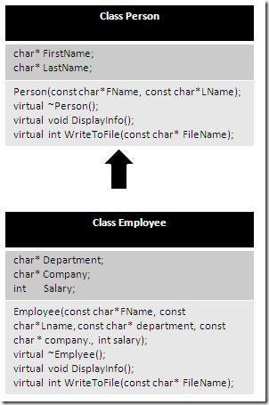
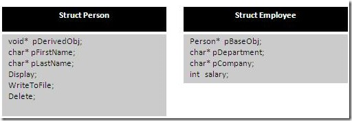
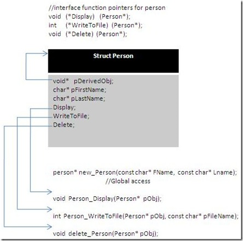
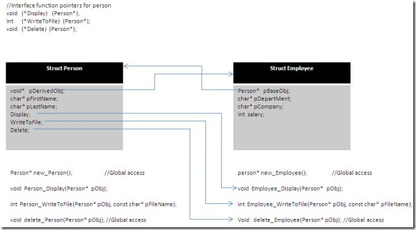

 
<!--BEGIN_DATA
{
    "create_date": "2016-09-03 13:47", 
    "modify_date": "2016-09-03 13:47", 
    "is_top": "0", 
    "summary": "OOC 面向对象 C 语言编程实践", 
    "tags": "C/C++", 
    "file_name": "OOC 面向对象 C 语言编程实践.md"
}
END_DATA-->

####<p>原文出处：<a href='http://blog.jobbole.com/105105/' target='blank'>OOC 面向对象 C 语言编程实践</a></p>


面向对象是一种编程思想，虽然C并没有提供面向对象的语法糖，但仍然可以用面向对象的思维来抽象和使用。这里分享一套C面向对象的写法，可以完成面向对象编程并进行流畅的抽象。这套写法是在实践中不断调整的结果，目前已经比较稳定，进行了大量的功能编写。

这套OOC有以下特性：

  * 没有强行去模仿c++的语法设定，而是使用C的特性去面向对象设计
  * 实现继承，组合，封装，多态的特性
  * 一套命名规范去增加代码的可读性

##第一，封装

在C中可以用struct来封装数据，如果是方法，我们就需要用函数指针存放到struct里面来模拟。

```
typedef struct Drawable Drawable;
struct  Drawable
{
	 float positionX;
	 float positionY;
};
```

```
typedef struct {
	Drawable* (*Create)                ();
	void      (*Init)                  (Drawable* outDrawable);
}
_ADrawable_;
 
extern _ADrawable_ ADrawable[1];
```

```
static void InitDrawable(Drawable* drawable)
{
     drawable->positionX = 0.0f;
     drawable->positionY = 0.0f;
}
 
static Drawable* Create()
{
	Drawable* drawable = (Drawable*) malloc(sizeof(Drawable));
	InitDrawable(drawable);
 
	return drawable;
}
 
static void Init(Drawable* outDrawable)
{
	InitDrawable(outDrawable);
}
 
_ADrawable_ ADrawable[1] =
{
	Create,
	Init,
};
```


  * 数据我们封装在Drawable结构里，通过Create可以再堆上创建需要自己free，Init是在栈上创建
  * 函数封装在ADrawable这个全局单例对象里，由于没有this指针，所有方法第一个参数需要传入操作对象
  * Create和Init方法将会管理，对象的数据初始化工作。如果对象含有其它对象，就需要调用其Create或Init方法

##第二，继承和组合

```
typedef struct Drawable Drawable;
struct  Drawable
{
	 Drawable* parent;
	 Color     color[1];
};
```

  * 继承，就是在结构体里，嵌入另一个结构体。这样malloc一次就得到全部的内存空间，释放也就一次。嵌入的结构体就是父类，子类拥有父类全部的数据空间内容。
  * 组合，就是在结构体，存放另一个结构体的指针。这样创建结构体时候，要需要调用父类的Create方法去生成父类空间，释放的时候也需要额外释放父类空间。
  * 这里parent就是组合，color就是继承。
  * 继承是一种强耦合，无论如何子类拥有父类全部的信息。
  * 组合是一种低耦合，如果不初始化，子类只是存放了一个空指针来占位关联。
  * 可以看到，C里面一个结构体可以，继承任意多个父类，也可以组合任意多个父类。
  * color[1] 使用数组形式，可以直接把color当做指针使用

子类访问父类，可以直接通过成员属性。那么如果通过父类访问子类呢 ?  通过一个宏定义来实现这个功能。

```
/** 
 * Get struct pointer from member pointer 
 */  
#define StructFrom2(memberPtr, structType) \  
    ((structType*) ((char*) memberPtr - offsetof(structType, memberPtr)))  
  
  
/** 
 * Get struct pointer from member pointer 
 */  
#define StructFrom3(memberPtr, structType, memberName) \  
    ((structType*) ((char*) memberPtr - offsetof(structType, memberName)))
```

```
typedef struct Sprite Sprite;
struct  Sprite
{
	Drawable drawable[1];
};
```

```
Sprite* sprite = StructFrom2(drawable, Sprite);
```

这样，我们就可以，通过Sprite的父类Drawable属性，来获得子类Sprite的指针。其原理，是通过offsetof获得成员偏移量，然后用成员地址偏移到子类地址上。有了这个机制，我们就可以实现多态，接口等抽象层。

我们可以在接口函数中，统一传入父类对象，就可以拿到具体的子类指针，执行不同的逻辑，让接口方法体现出多态特性。

##第三， 多态

```
typedef struct Drawable Drawable;
struct  Drawable
{
	 /** Default 0.0f */
	 float     width;
	 float     height;
 
	 /**
	  * Custom draw called by ADrawable's Draw, not use any openGL command
	  */
	 void (*Draw)  (Drawable* drawable);
};
```

  
当，我们把一个函数指针放入，结构体对象的时候。意味着，在不同的对象里，Draw函数可以替换为不同的实现。而不是像在ADrawable里面的函数只有一个固定的实现。在子类继承Drawable的时候，我们可以给Draw赋予具体的实现。而统一的调用Draw(Drawable* drawable)的时候，就会体现出多态特性，不同的子类有不懂的实现。

```
typedef struct
{
    Drawable drawable[1];
}
Hero;
```

```
typedef struct
{
    Drawable drawable[1];
}
Enemy;
```

```
Drawable drawables[] =   
{  
     hero->drawable,  
     enemy->drawable,  
};  
  
for (int i = 0; i < 2; i++)  
{  
    Drawable* drawable = drawables[i];  
    drawable->Draw(drawable);  
}
```

 在Hero和Enemy的Create函数中，我们分别实现Draw(Drawable* drawable)函数。如果，我们有一个绘制队列，里面都是Drawable对象。传入Hero和Enemy的Drawable成员属性。在统一绘制调用中，drawable->Draw(drawable)，就会分别调用Hero和Enemy不同的draw函数实现，体现了多态性。

##第四，重写父类方法

 在继承链中，我们常常需要重写父类方法，有时候还需要调用父类方法。

```
typedef struct
{
    Sprite sprite[1];
}
SpriteBatch;
```
  
比如，SpriteBatch 继承 Sprite，我们需要重写Draw方法，还需要调用Sprite的Draw方法。那么我们就需要把Sprite的Draw方法公布出来。

```
typedef struct
{
   Drawable drawable[1];
}
Sprite;
 
typedef struct
{
    void (*Draw)(Drawable* drawable);
}
_ASprite_;
 
extern _ASprite_ ASprite;
```

这样，每个Sprite的Draw方法可以，通过ASprite的Draw访问。

```
// override
static void SpriteBatchDraw(Drawable* drawable)
{
      // call father
      ASprite->Draw(drawable);
}
 
spriteBatch->sprite->drawable->Draw = SpriteBatchDraw;
```  

那么，SpriteBatch就重写了父类的Draw方法，也能够调用父类的方法了。

##第五，内存管理

 一个malloc对应一个free，所以Create出来的对象需要自己手动free。关键是，在于组合的情况。就是对象内有别的对象的指针，有些是自己malloc的，有些是共用的。其实，计数器是一个简单的方案，但我仍然觉得复杂了。在想到更好的方案之前，我倾向于更原始的手动方法，给有需要内存管理的对象添加Release方法。

```
typedef struct
{
    Drawable* parent;
    Array*    children;
}
Drawable;
 
typedef struct
{
    void (*Release)(Drawable* drawable);
}
_ADrawable_;
 
extern _ADrawable_ ADrawable;
```

Drawable 含有两个指针， 一个是parent可能别的对象也会使用，所以这个parent在Release函数中不能确定释放。还有一个children这个数组本身是可以释放的，所以在Create函数里，我们自己malloc的，都要在Release方法里自己free。

所以，对于Create方法我们需要free + Release。对于Init 只需要调用Release方法就可以释放完全了。那么，parent这种公用的指针，就需要paren对象自己在合适的时机去释放自己。肯定没有计数器来的方便，但是这个足够简单开销也很小。


<hr>


####<p>原文出处：<a href='http://www.cnblogs.com/skynet/archive/2010/09/23/1833217.html' target='blank'>C中的继承和多态</a></p>

2010-09-23 00:27 by 吴秦, ... 阅读, ... 评论, 收藏,
[编辑](https://i.cnblogs.com/EditPosts.aspx?postid=1833217)

#####**1、引言**

继承和多态是面向对象语言最强大的功能。有了继承和多态，我们可以完成代码重用。在C中有许多技巧可以实现多态。本文的目的就是演示一种简单和容易的技术，在C中应用继承和多态。通过创建一个VTable（virtual table）和在基类和派生类对象之间提供正确的访问，我们能在C中实现继承和多态。VTable能通过维护一张函数表指针表来实现。为了提供基类和派生类对象之间的访问，我们可以在基类中维护派生类的引用和在派生类中维护基类的引用。

#####**2、说明**

在C中实现继承和多态之前，我们应该知道类（Class）在C中如何表示。

#####**2.1、类在C中的表示**

考虑C++中的一个类"Person"。

    
    
    //Person.h
    class Person
    {
    private:
        char* pFirstName;
        char* pLastName;
    public:
        Person(const char* pFirstName, const char* pLastName);    //constructor
        ~Person();    //destructor
        void displayInfo();
        void writeToFile(const char* pFileName);
    };

在C中表示上面的类，我们可以使用结构体，并用操作结构体的函数表示成员函数。

    
    
    //Person.h
    typedef struct _Person
    {
        char* pFirstName;
        char* pLastName;
    }Person;
    new_Person(const char* const pFirstName, const char* const pLastName);    //constructor
    delete_Person(Person* const pPersonObj);    //destructor
    void Person_DisplayInfo(Person* const pPersonObj);
    void Person_WriteToFile(Person* const pPersonObj, const char* const pFileName);

这里，定义的操作结构体Person的函数没有封装。为了实现封装，即绑定数据、函数、函数指针。我们需要创建一个函数指针表。构造函数new_Person()将设置函数指针值以指向合适的函数。这个函数指针表将作为对象访问函数的接口。

下面我们重新定义C中实现类Person。

    
    
    //Person.h
    typedef struct _Person Person;
    //declaration of pointers to functions
    typedef void    (*fptrDisplayInfo)(Person*);
    typedef void    (*fptrWriteToFile)( Person*, const char*);
    typedef void    (*fptrDelete)( Person *) ;
    //Note: In C all the members are by default public. We can achieve 
    //the data hiding (private members), but that method is tricky. 
    //For simplification of this article
    // we are considering the data members     //public only.
    typedef struct _Person 
    {
        char* pFName;
        char* pLName;
        //interface for function
        fptrDisplayInfo   Display;
        fptrWriteToFile   WriteToFile;
        fptrDelete      Delete;
    }Person;
    person* new_Person(const char* const pFirstName, 
                       const char* const pLastName); //constructor
    void delete_Person(Person* const pPersonObj);    //destructor
    void Person_DisplayInfo(Person* const pPersonObj);
    void Person_WriteToFile(Person* const pPersonObj, const char* pFileName);

new_Person()函数作为构造函数，它返回新创建的结构体实例。它初始化函数指针接口去访问其它成员函数。这里要注意的一点是，我们仅仅定义了那些允许公共访问的函数指针，并没有给定私有函数的接口。让我们看一下new_Person()函数或C中类Person的构造函数。

    
    
    //Person.c
    person* new_Person(const char* const pFirstName, const char* const pLastName)
    {
        Person* pObj = NULL;
        //allocating memory
        pObj = (Person*)malloc(sizeof(Person));
        if (pObj == NULL)
        {
            return NULL;
        }
        pObj->pFirstName = malloc(sizeof(char)*(strlen(pFirstName)+1));
        if (pObj->pFirstName == NULL)
        {
            return NULL;
        }
        strcpy(pObj->pFirstName, pFirstName);
        pObj->pLastName = malloc(sizeof(char)*(strlen(pLastName)+1));
        if (pObj->pLastName == NULL)
        {
            return NULL;
        }
        strcpy(pObj->pLastName, pLastName);
        //Initializing interface for access to functions
        pObj->Delete = delete_Person;
        pObj->Display = Person_DisplayInfo;
        pObj->WriteToFile = Person_WriteToFile;
        return pObj;
    }

创建完对象之后，我们能够访问它的数据成员和函数。

    
    
    Person* pPersonObj = new_Person("Anjali", "Jaiswal");
    //displaying person info
    pPersonObj->Display(pPersonObj);
    //writing person info in the persondata.txt file
    pPersonObj->WriteToFile(pPersonObj, "persondata.txt");
    //delete the person object
    pPersonObj->Delete(pPersonObj);
    pPersonObj = NULL;

注意：不像C++，在C中我们不能在函数中直接访问数据成员。在C++中，可以隐式通过“this”指针直接访问数据成员。我们知道C中是没有“this”指针的，通过显示地传递对象给成员函数。在C中为了访问类的数据成员，我们需要把调用对象作为函数参数传递。上面的例子中，我们把调用对象作为函数的第一个参数，通过这种方法，函数可以访问对象的数据成员。

#####**3、在C中类的表现**

Person类的表示——检查初始化接口指向成员函数：

#####**3.1、继承和多态的简单例子**

继承-Employee类继承自Person类：



在上面的例子中，类Employee继承类Person的属性。因为DisplayInfo()和WriteToFile()函数是virtual的，我们能够从Person的实例访问Employee对象中的同名函数。为了实现这个，我们创建Person实例的时候也初始化Employee类。多态使这成为可能。在多态的情况下，去解析函数调用，C++使用VTable——即一张函数指针表。

前面我们在结构体中维护的指向函数的指针接口的作用类似于VTable。

    
    
    //Polymorphism in C++
    Person PersonObj("Anjali", "Jaiswal");
    Employee EmployeeObj("Gauri", "Jaiswal", "HR", "TCS", 40000);
    Person* ptrPersonObj = NULL;
    //preson pointer pointing to person object
    ptrPersonObj = &PersonObj;
    //displaying person info
    ptrPersonObj ->Display();
    //writing person info in the persondata.txt file
    ptrPersonObj ->WriteToFile("persondata.txt");
    //preson pointer pointing to employee object
    ptrPersonObj = &EmployeeObj;
    //displaying employee info
    ptrPersonObj ->Display();
    //writing empolyee info in the employeedata.txt file
    ptrPersonObj ->WriteToFile("employeedata.txt");

在C中，继承可以通过在派生类对象中维护一个基类对象的引用来完成。在基类实例的帮助下，women可以访问基类的数据成员和函数。然而，为了实现多态，街垒对象应该能够访问派生类对象的数据。为了实现这个，基类应该有访问派生类的数据成员的权限。

为了实现虚函数，派生类的函数签名应该和基类的函数指针类似。即派生类函数将以基类对象的一个实例为参数。我们在基类中维护一个派生类的引用。在函数实现上，我们可以从派生类的引用访问实际派生类的数据。

#####**3.2、在C中结构体中的等效表示**

C中的继承-Person和Employee结构体：



如图所示，我们在基类结构体中声明了一个指针保存派生类对像，并在派生类结构体中声明一个指针保存基类对象。

在基类对象中，函数指针指向自己的虚函数。在派生类对象的构造函数中，我们需要使基类的接口指向派生类的成员函数。这使我们可以通过基类对象（多态）灵活的调用派生类函数。更多细节，请检查Person和Employee对象的构造函数。

当我们讨论C++中的多态时，有一个对象销毁的问题。为了正确的清楚对象，它使用虚析构函数。在C中，这可以通过使基类的删除函数指针指向派生类的析构函数。派生类的析构函数清楚派生类的数据和基类的数据和对象。注意：检查例子的源码中，实现须构造函数和虚函数的实现细节。

#####**创建Person对象**

    
    
    //Person.h
    typedef struct _Person Person;
    //pointers to function
    typedef void    (*fptrDisplayInfo)(Person*);
    typedef void    (*fptrWriteToFile)(Person*, const char*);
    typedef void    (*fptrDelete)(Person*) ;
    typedef struct _person
    {
        void* pDerivedObj;
        char* pFirstName;
        char* pLastName;
        fptrDisplayInfo Display;
        fptrWriteToFile WriteToFile;
        fptrDelete        Delete;
    }person;
    Person* new_Person(const char* const pFristName, 
                       const char* const pLastName);    //constructor
    void delete_Person(Person* const pPersonObj);    //destructor
    void Person_DisplayInfo(Person* const pPersonObj);
    void Person_WriteToFile(Person* const pPersonObj, const char* const pFileName);
    //Person.c
    //construction of Person object
    Person* new_Person(const char* const pFirstName, const char* const pLastName)
    {
        Person* pObj = NULL;
        //allocating memory
        pObj = (Person*)malloc(sizeof(Person));
        if (pObj == NULL)
        {
            return NULL;
        }
        //pointing to itself as we are creating base class object
        pObj->pDerivedObj = pObj;
        pObj->pFirstName = malloc(sizeof(char)*(strlen(pFirstName)+1));
        if (pObj->pFirstName == NULL)
        {
            return NULL;
        }
        strcpy(pObj->pFirstName, pFirstName);
        pObj->pLastName = malloc(sizeof(char)*(strlen(pLastName)+1));
        if (pObj->pLastName == NULL)
        {
            return NULL;
        }
        strcpy(pObj->pLastName, pLastName);
        //Initializing interface for access to functions
        //destructor pointing to destrutor of itself
        pObj->Delete = delete_Person;
        pObj->Display = Person_DisplayInfo;
        pObj->WriteToFile = Person_WriteToFile;
        return pObj;
    }

#####**Person对象的结构**



#####**创建Employee对象**

    
    
    //Employee.h
    #include "Person.h"
    typedef struct _Employee Employee;
    //Note: interface for this class is in the base class
    //object since all functions are virtual.
    //If there is any additional functions in employee add
    //interface for those functions in this structure 
    typedef struct _Employee
    {
        Person* pBaseObj;
        char* pDepartment;
        char* pCompany;
        int nSalary;
        //If there is any employee specific functions; add interface here.
    }Employee;
    Person* new_Employee(const char* const pFirstName, const char* const pLastName,
            const char* const pDepartment, const char* const pCompany, 
            int nSalary);    //constructor
    void delete_Employee(Person* const pPersonObj);    //destructor
    void Employee_DisplayInfo(Person* const pPersonObj);
    void Employee_WriteToFile(Person* const pPersonObj, const char* const pFileName);
    //Employee.c
    Person* new_Employee(const char* const pFirstName, const char* const pLastName,
                         const char* const pDepartment, 
                         const char* const pCompany, int nSalary)
    {
        Employee* pEmpObj;
        //calling base class construtor
        Person* pObj = new_Person(pFirstName, pLastName);
        //allocating memory
        pEmpObj = malloc(sizeof(Employee));
        if (pEmpObj == NULL)
        {
            pObj->Delete(pObj);
            return NULL;
        }
        pObj->pDerivedObj = pEmpObj; //pointing to derived object
        //initialising derived class members
        pEmpObj->pDepartment = malloc(sizeof(char)*(strlen(pDepartment)+1));
        if(pEmpObj->pDepartment == NULL)
        {
            return NULL;
        }
        strcpy(pEmpObj->pDepartment, pDepartment);
        pEmpObj->pCompany = malloc(sizeof(char)*(strlen(pCompany)+1));
        if(pEmpObj->pCompany== NULL)
        {
            return NULL;
        }
        strcpy(pEmpObj->pCompany, pCompany);
        pEmpObj->nSalary = nSalary;
        //Changing base class interface to access derived class functions
        //virtual destructor
        //person destructor pointing to destrutor of employee
        pObj->Delete = delete_Employee;
        pObj->Display = Employee_DisplayInfo;
        pObj->WriteToFile = Employee_WriteToFile;
        return pObj;
    }

#####**Employee对象的结构**



注意：从基类函数到派生类函数改变了接口（VTable）中指针位置。现在我们可以从基类（多态）访问派生类函数。我们来看如何使用多态。

    
    
    Person* PersonObj = new_Person("Anjali", "Jaiswal");
    Person* EmployeeObj = new_Employee("Gauri", "Jaiswal","HR", "TCS", 40000);
    //accessing person object
    //displaying person info
    PersonObj->Display(PersonObj);
    //writing person info in the persondata.txt file
    PersonObj->WriteToFile(PersonObj,"persondata.txt");
    //calling destructor
    PersonObj->Delete(PersonObj);
    //accessing to employee object
    //displaying employee info
    EmployeeObj->Display(EmployeeObj);
    //writing empolyee info in the employeedata.txt file
    EmployeeObj->WriteToFile(EmployeeObj, "employeedata.txt");
    //calling destrutor
    EmployeeObj->Delete(EmployeeObj);

#####**结论**

使用上面描述的简单的额外代码能是过程式C语言有多态和继承的特性。我们简单的使用函数指针创建一个VTable和在基类和派生类对象中交叉维护引用。用这些简单的步骤，我们在C中可以实现继承和多态。

####声明：本文为译文，原文通道-[Inheritance and Polymorphism in
C](http://www.codeproject.com/KB/cpp/InheritancePolymorphismC.aspx)

例子代码下载：<http://files.cnblogs.com/skynet/PolymorphisminC.zip>

