 
<!--BEGIN_DATA
{
    "create_date": "2016-08-23 16:30", 
    "modify_date": "2016-08-23 16:30", 
    "is_top": "0", 
    "summary": "Objective-C Runtime相关重点原理", 
    "tags": "iOS", 
    "file_name": "Objective-C Runtime相关重点原理.md"
}
END_DATA-->

####<p>原文出处：<a href='http://blog.leichunfeng.com/blog/2015/04/25/objective-c-object-model/' target='blank'>Objective-C 对象模型</a></p>

##Objective-C 对象模型

###对象

在 Objective-C 中，每一个对象都是某个类的实例，且这个对象的 `isa`（在 64 位 CPU 下，`isa`
已经不再是一个简单的指针，在本文中我们暂且把它当作普通指针来理解，后面我会单独写一篇博文来详细介绍 `Non-pointer isa`）指针指向它所属的类。

打开刚下载的 runtime 工程，在文件 `objc-private.h` 的第 127-232 行我们可以找到 Objective-C 中的对象的定义`struct objc_object` 。是的，Objective-C 中的对象本质上是结构体对象，其中 `isa` 是它唯一的私有成员变量。

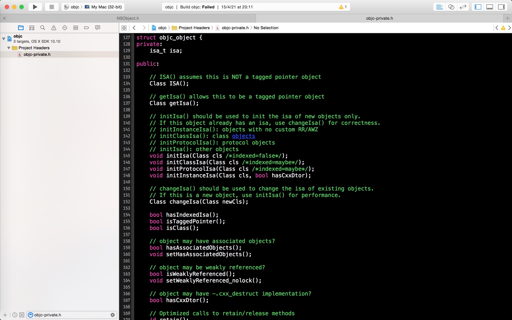

在同一个文件的第 51-52 行我们可以找到 `Class` 和 `id` 类型的定义，它们分别是 `struct objc_class` 和`struct objc_object` 类型的指针。这也是为什么 `id` 类型可以指向任意对象的原因。其中 `struct objc_class` 就是Objective-C 中的类的定义，在下一节将会详细介绍。

    
    typedef struct objc_class *Class;
    typedef struct objc_object *id;
    

###类

对象的类不仅描述了对象的数据：对象占用的内存大小、成员变量的类型和布局等，而且也描述了对象的行为：对象能够响应的消息、实现的实例方法等。因此，当我们调用实例方法 `[receiver message]` 给一个对象发送消息时，这个对象能否响应这个消息就需要通过 `isa` 找到它所属的类（当然还有superclass，本文主要内容不是这个，所以不展开）才能知道。

打开文件 `objc-runtime-new.h` ，在第 687-902 行我们可以找到 Objective-C 中的类的定义 `struct objc_class` 。同样的，Objective-C 中类也是一个结构体对象，并且继承了 `struct objc_object` 。

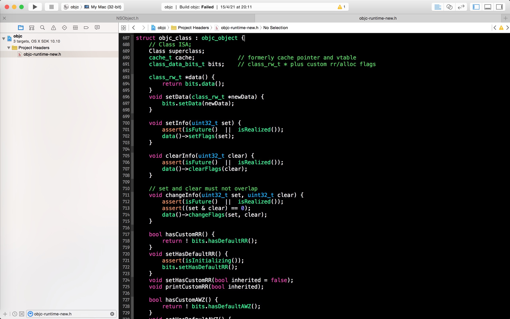

所以，Objective-C中的类本质上也是对象，我们称之为类对象。按照我们前面所说的所有的对象都是某个类的实例，那么类对象又是什么类的实例呢？答案就是我们将在下一节介绍的元类。

在 Objective-C 中有一个非常特殊的类 `NSObject` ，绝大部分的类都继承自它。它是 Objective-C
中的两个根类（rootclass）之一，另外一个是 NSProxy（本文不讨论）。同样的，我们打开文件`NSObject.h` ，可以看到`NSObject` 类其实就只有一个成员变量 `isa` ，所有继承自 `NSObject` 的类也都会有这个成员变量。

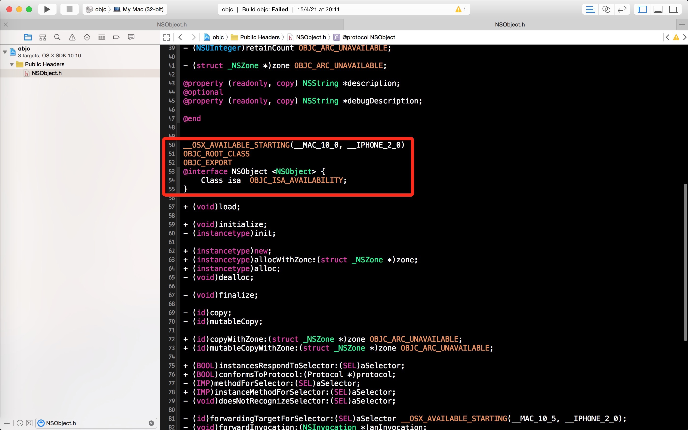

###元类

我们上面提到，本质上 Objective-C 中的类也是对象，它也是某个类的实例，这个类我们称之为元类（metaclass）。

因此，我们也可以通过调用类方法，比如 `[NSObject new]`，给类对象发送消息。同样的，类对象能否响应这个消息也要通过 `isa` 找到类对象所属的类（元类）才能知道。也就是说，实例方法是保存在类中的，而类方法是保存在元类中的。

那元类也是对象吗？是的话那它又是什么类的实例呢？是的，没错，元类也是对象（元类对象），元类也是某个类的实例，这个类我们称之为根元类（root metaclass）。不过，有一点比较特殊，那就是所有的元类所属的类都是同一个根元类（当然根元类也是元类，所以它所属的类也是根元类，即它本身）。根元类指的就是根类的元类，具体来说就是根类 `NSObject` 对应的元类。

因此，理论上我们也可以给元类发送消息，但是 Objective-C 倾向于隐藏元类，不想让大家知道元类的存在。元类是为了保持 Objective-C对象模型在设计上的完整性而引入的，比如用来保存类方法等，它主要是用来给编译器使用的。

说了这么多，大家可能已经有点绕迷糊了，下面我们看一张图，一切自会明了。

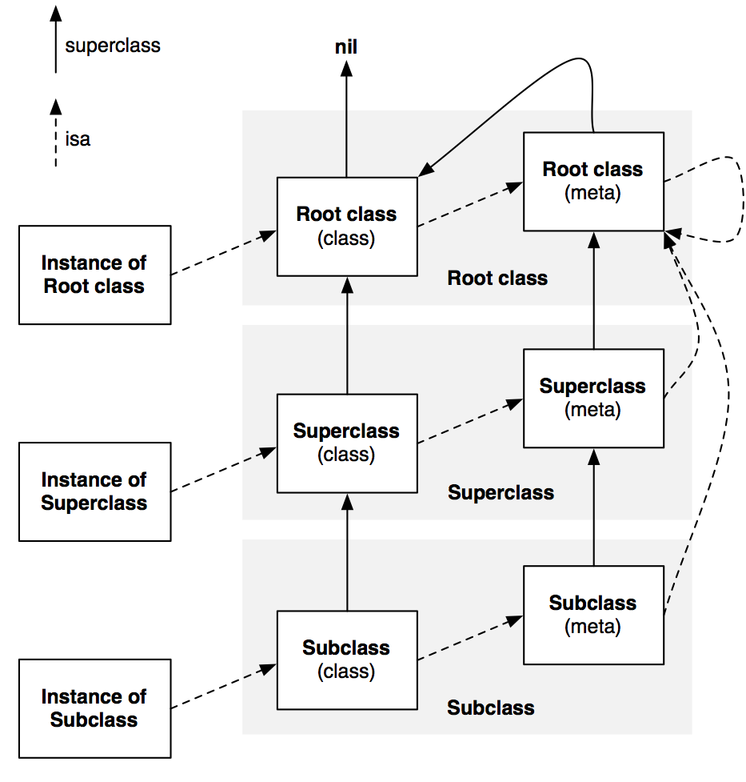


<hr>


####<p>原文出处：<a href='http://blog.leichunfeng.com/blog/2015/05/02/objective-c-plus-load-vs-plus-initialize/' target='blank'>Objective-C +load vs +initialize</a></p>

##Objective-C +load vs +initialize

May 2nd, 2015 5:06 pm

在上一篇博文[《Objective-C对象模型》](http://blog.leichunfeng.com/blog/2015/04/25/objective-c-object-model/)中，我们知道了 Objective-C 中绝大部分的类都继承自 NSObject 类。而在 NSObject 类中有两个非常特殊的类方法+load 和 +initialize ，用于类的初始化。这两个看似非常简单的类方法在许多方面会让人感到困惑，比如：

  1. 子类、父类、分类中的相应方法什么时候会被调用？
  2. 需不需要在子类的实现中显式地调用父类的实现？
  3. 每个方法到底会被调用多少次？

下面，我们将结合 [runtime](http://opensource.apple.com/tarballs/objc4/)（我下载的是当前的最新版本`objc4-646.tar.gz`) 的源码，一起来揭开它们的神秘面纱。

###+load

+load 方法是当类或分类被添加到 Objective-C runtime 时被调用的，实现这个方法可以让我们在类加载的时候执行一些类相关的行为。子类的+load 方法会在它的所有父类的 +load 方法之后执行，而分类的 +load 方法会在它的主类的 +load 方法之后执行。但是不同的类之间的+load 方法的调用顺序是不确定的。

打开 runtime 工程，我们接下来看看与 +load 方法相关的几个关键函数。首先是文件 `objc-runtime-new.mm` 中的 `void
prepare_load_methods(header_info *hi)` 函数：
    
    
    void prepare_load_methods(header_info *hi)
    {
        size_t count, i;
    
        rwlock_assert_writing(&runtimeLock);
    
        classref_t *classlist =
            _getObjc2NonlazyClassList(hi, &count);
        for (i = 0; i < count; i++) {
            schedule_class_load(remapClass(classlist[i]));
        }
    
        category_t **categorylist = _getObjc2NonlazyCategoryList(hi, &count);
        for (i = 0; i < count; i++) {
            category_t *cat = categorylist[i];
            Class cls = remapClass(cat->cls);
            if (!cls) continue;  // category for ignored weak-linked class
            realizeClass(cls);
            assert(cls->ISA()->isRealized());
            add_category_to_loadable_list(cat);
        }
    }
    

顾名思义，这个函数的作用就是提前准备好满足 +load 方法调用条件的类和分类，以供接下来的调用。其中，在处理类时，调用了同文件中的另外一个函数`static void schedule_class_load(Class cls)` 来执行具体的操作。
    
    static void schedule_class_load(Class cls)
    {
        if (!cls) return;
        assert(cls->isRealized());  // _read_images should realize
    
        if (cls->data()->flags & RW_LOADED) return;
    
        // Ensure superclass-first ordering
        schedule_class_load(cls->superclass);
    
        add_class_to_loadable_list(cls);
        cls->setInfo(RW_LOADED);
    }
    

其中，函数第 9 行代码对入参的父类进行了递归调用，以确保父类优先的顺序。`void prepare_load_methods(header_info*hi)` 函数执行完后，当前所有满足 +load 方法调用条件的类和分类就被分别存放在全局变量 `loadable_classes` 和`loadable_categories` 中了。

准备好类和分类后，接下来就是对它们的 +load 方法进行调用了。打开文件 `objc-loadmethod.m` ，找到其中的 `void call_load_methods(void)` 函数。
    
    void call_load_methods(void)
    {
        static BOOL loading = NO;
        BOOL more_categories;
    
        recursive_mutex_assert_locked(&loadMethodLock);
    
        // Re-entrant calls do nothing; the outermost call will finish the job.
        if (loading) return;
        loading = YES;
    
        void *pool = objc_autoreleasePoolPush();
    
        do {
            // 1. Repeatedly call class +loads until there aren't any more
            while (loadable_classes_used > 0) {
                call_class_loads();
            }
    
            // 2. Call category +loads ONCE
            more_categories = call_category_loads();
    
            // 3. Run more +loads if there are classes OR more untried categories
        } while (loadable_classes_used > 0  ||  more_categories);
    
        objc_autoreleasePoolPop(pool);
    
        loading = NO;
    }
    

同样的，这个函数的作用就是调用上一步准备好的类和分类中的 +load 方法，并且确保类优先于分类的顺序。我们继续查看在这个函数中调用的另外两个关键函数`static void call_class_loads(void)` 和 `static BOOL call_category_loads(void)`。由于这两个函数的作用大同小异，下面就以篇幅较小的 `static void call_class_loads(void)` 函数为例进行探讨。
    
    static void call_class_loads(void)
    {
        int i;
    
        // Detach current loadable list.
        struct loadable_class *classes = loadable_classes;
        int used = loadable_classes_used;
        loadable_classes = nil;
        loadable_classes_allocated = 0;
        loadable_classes_used = 0;
    
        // Call all +loads for the detached list.
        for (i = 0; i < used; i++) {
            Class cls = classes[i].cls;
            load_method_t load_method = (load_method_t)classes[i].method;
            if (!cls) continue;
    
            if (PrintLoading) {
                _objc_inform("LOAD: +[%s load]\n", cls->nameForLogging());
            }
            (*load_method)(cls, SEL_load);
        }
    
        // Destroy the detached list.
        if (classes) _free_internal(classes);
    }
    

这个函数的作用就是真正负责调用类的 +load 方法了。它从全局变量 `loadable_classes` 中取出所有可供调用的类，并进行清零操作。

    loadable_classes = nil;
    loadable_classes_allocated = 0;
    loadable_classes_used = 0;
    

其中 `loadable_classes` 指向用于保存类信息的内存的首地址，`loadable_classes_allocated`
标识已分配的内存空间大小，`loadable_classes_used` 则标识已使用的内存空间大小。

然后，循环调用所有类的 +load 方法。**注意**，这里是（调用分类的 +load 方法也是如此）直接使用函数内存地址的方式`(*load_method)(cls, SEL_load);` 对 +load 方法进行调用的，而不是使用发送消息 `objc_msgSend` 的方式。

这样的调用方式就使得 +load 方法拥有了一个非常有趣的特性，那就是子类、父类和分类中的 +load 方法的实现是被区别对待的。也就是说如果子类没有实现+load 方法，那么当它被加载时 runtime 是不会去调用父类的 +load 方法的。同理，当一个类和它的分类都实现了 +load方法时，两个方法都会被调用。因此，我们常常可以利用这个特性做一些“邪恶”的事情，比如说方法混淆（[Method Swizzling](http://nshipster.com/method-swizzling/)）。

###+initialize

+initialize 方法是在类或它的子类收到第一条消息之前被调用的，这里所指的消息包括实例方法和类方法的调用。也就是说 +initialize方法是以懒加载的方式被调用的，如果程序一直没有给某个类或它的子类发送消息，那么这个类的 +initialize方法是永远不会被调用的。那这样设计有什么好处呢？好处是显而易见的，那就是节省系统资源，避免浪费。

同样的，我们还是结合 runtime 的源码来加深对 +initialize 方法的理解。打开文件 `objc-runtime-new.mm`，找到以下函数：

      
    IMP lookUpImpOrForward(Class cls, SEL sel, id inst,
                           bool initialize, bool cache, bool resolver)
    {
        ...
            rwlock_unlock_write(&runtimeLock);
        }
    
        if (initialize  &&  !cls->isInitialized()) {
            _class_initialize (_class_getNonMetaClass(cls, inst));
            // If sel == initialize, _class_initialize will send +initialize and 
            // then the messenger will send +initialize again after this 
            // procedure finishes. Of course, if this is not being called 
            // from the messenger then it won't happen. 2778172
        }
    
        // The lock is held to make method-lookup + cache-fill atomic 
        // with respect to method addition. Otherwise, a category could 
        ...
    }
    

当我们给某个类发送消息时，runtime 会调用这个函数在类中查找相应方法的实现或进行消息转发。从第 8-14 的关键代码我们可以看出，当类没有初始化时runtime 会调用 `void _class_initialize(Class cls)` 函数对该类进行初始化。

      
    void _class_initialize(Class cls)
    {
        ...
        Class supercls;
        BOOL reallyInitialize = NO;
    
        // Make sure super is done initializing BEFORE beginning to initialize cls.
        // See note about deadlock above.
        supercls = cls->superclass;
        if (supercls  &&  !supercls->isInitialized()) {
            _class_initialize(supercls);
        }
    
        // Try to atomically set CLS_INITIALIZING.
        monitor_enter(&classInitLock);
        if (!cls->isInitialized() && !cls->isInitializing()) {
            cls->setInitializing();
            reallyInitialize = YES;
        }
        monitor_exit(&classInitLock);
    
        if (reallyInitialize) {
            // We successfully set the CLS_INITIALIZING bit. Initialize the class.
    
            // Record that we're initializing this class so we can message it.
            _setThisThreadIsInitializingClass(cls);
    
            // Send the +initialize message.
            // Note that +initialize is sent to the superclass (again) if 
            // this class doesn't implement +initialize. 2157218
            if (PrintInitializing) {
                _objc_inform("INITIALIZE: calling +[%s initialize]",
                             cls->nameForLogging());
            }
    
            ((void(*)(Class, SEL))objc_msgSend)(cls, SEL_initialize);
    
            if (PrintInitializing) {
                _objc_inform("INITIALIZE: finished +[%s initialize]",
        ...
    }
    

其中，第 7-12 行代码对入参的父类进行了递归调用，以确保父类优先于子类初始化。另外，最关键的是第 36 行代码（暴露了 +initialize方法的本质），runtime 使用了发送消息 `objc_msgSend` 的方式对 +initialize 方法进行调用。也就是说 +initialize方法的调用与普通方法的调用是一样的，走的都是发送消息的流程。换言之，如果子类没有实现 +initialize方法，那么继承自父类的实现会被调用；如果一个类的分类实现了 +initialize 方法，那么就会对这个类中的实现造成覆盖。

因此，如果一个子类没有实现 +initialize 方法，那么父类的实现是会被执行多次的。有时候，这可能是你想要的；但如果我们想确保自己的+initialize 方法只执行一次，避免多次执行可能带来的副作用时，我们可以使用下面的代码来实现：

     
    + (void)initialize {
      if (self == [ClassName self]) {
        // ... do the initialization ...
      }
    }
    

###总结

通过阅读 runtime 的源码，我们知道了 +load 和 +initialize方法实现的细节，明白了它们的调用机制和各自的特点。下面我们绘制一张表格，以更加直观的方式来巩固我们对它们的理解：

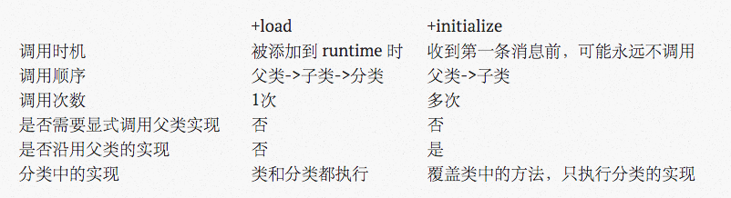


<hr>


####<p>原文出处：<a href='http://blog.leichunfeng.com/blog/2015/05/18/objective-c-category-implementation-principle/' target='blank'>Objective-C Category 的实现原理</a></p>

##Objective-C Category 的实现原理


###使用场景

根据苹果官方文档对 [Category](https://developer.apple.com/library/ios/documentation/General/Conceptual/DevPedia-CocoaCore/Category.html#//apple_ref/doc/uid/TP40008195-CH5-SW1)的描述，它的使用场景主要有三个：

  1. 给现有的类添加方法；
  2. 将一个类的实现拆分成多个独立的源文件；
  3. 声明私有的方法。

其中，第 `1` 个是最典型的使用场景，应用最广泛。

**注**：Category 有一个非常容易误用的场景，那就是用 Category 来覆写父类或主类的方法。虽然目前 Objective-C 是允许这么做的，但是这种使用场景是**非常**不推荐的。[使用 Category 来覆写方法](http://stackoverflow.com/questions/5272451/overriding-methods-using-categories-in-objective-c)有很多缺点，比如不能覆写 Category 中的方法、无法调用主类中的原始实现等，且很容易造成无法预估的行为。

###实现原理

我们知道，无论我们有没有主动引入 Category 的头文件，Category 中的方法都会被添加进主类中。我们可以通过 `\-performSelector:` 等方式对 Category 中的相应方法进行调用，之所以需要在调用的地方引入 Category的头文件，只是为了“照顾”编译器同学的感受。

下面，我们将结合 runtime 的源码探究下 Category 的实现原理。打开 runtime 源码工程，在文件 `objc-runtime-new.mm` 中找到以下函数：   
    
    void _read_images(header_info **hList, uint32_t hCount)
    {
        ...
            _free_internal(resolvedFutureClasses);
        }
    
        // Discover categories. 
        for (EACH_HEADER) {
            category_t **catlist =
                _getObjc2CategoryList(hi, &count);
            for (i = 0; i < count; i++) {
                category_t *cat = catlist[i];
                Class cls = remapClass(cat->cls);
    
                if (!cls) {
                    // Category's target class is missing (probably weak-linked).
                    // Disavow any knowledge of this category.
                    catlist[i] = nil;
                    if (PrintConnecting) {
                        _objc_inform("CLASS: IGNORING category \?\?\?(%s) %p with "
                                     "missing weak-linked target class",
                                     cat->name, cat);
                    }
                    continue;
                }
    
                // Process this category. 
                // First, register the category with its target class. 
                // Then, rebuild the class's method lists (etc) if 
                // the class is realized. 
                BOOL classExists = NO;
                if (cat->instanceMethods ||  cat->protocols
                    ||  cat->instanceProperties)
                {
                    addUnattachedCategoryForClass(cat, cls, hi);
                    if (cls->isRealized()) {
                        remethodizeClass(cls);
                        classExists = YES;
                    }
                    if (PrintConnecting) {
                        _objc_inform("CLASS: found category -%s(%s) %s",
                                     cls->nameForLogging(), cat->name,
                                     classExists ? "on existing class" : "");
                    }
                }
    
                if (cat->classMethods  ||  cat->protocols
                    /* ||  cat->classProperties */)
                {
                    addUnattachedCategoryForClass(cat, cls->ISA(), hi);
                    if (cls->ISA()->isRealized()) {
                        remethodizeClass(cls->ISA());
                    }
                    if (PrintConnecting) {
                        _objc_inform("CLASS: found category +%s(%s)",
                                     cls->nameForLogging(), cat->name);
                    }
                }
            }
        }
    
        // Category discovery MUST BE LAST to avoid potential races 
        // when other threads call the new category code before 
        // this thread finishes its fixups.
    
        // +load handled by prepare_load_methods()
    
        ...
    }
    

从第 27-58 行的关键代码，我们可以知道在这个函数中对 Category 做了如下处理：

  1. 将 Category 和它的主类（或元类）注册到哈希表中；
  2. 如果主类（或元类）已实现，那么重建它的方法列表。

在这里分了两种情况进行处理：Category中的实例方法和属性被整合到主类中；而类方法则被整合到元类中（关于对象、类和元类的更多细节，可以参考我前面的博文[《Objective-C对象模型》](http://blog.leichunfeng.com/blog/2015/04/25/objective-c-object-model/)）。另外，对协议的处理比较特殊，Category 中的协议被同时整合到了主类和元类中。

我们注意到，不管是哪种情况，最终都是通过调用 `static void remethodizeClass(Class cls)` 函数来重新整理类的数据的。
    
    static void remethodizeClass(Class cls)
    {
        ...
                             cls->nameForLogging(), isMeta ? "(meta)" : "");
            }
    
            // Update methods, properties, protocols
    
            attachCategoryMethods(cls, cats, YES);
    
            newproperties = buildPropertyList(nil, cats, isMeta);
            if (newproperties) {
                newproperties->next = cls->data()->properties;
                cls->data()->properties = newproperties;
            }
    
            newprotos = buildProtocolList(cats, nil, cls->data()->protocols);
            if (cls->data()->protocols  &&  cls->data()->protocols != newprotos) {
                _free_internal(cls->data()->protocols);
            }
            cls->data()->protocols = newprotos;
    
            _free_internal(cats);
        }
    }
    

这个函数的主要作用是将 Category 中的方法、属性和协议整合到类（主类或元类）中，更新类的数据字段 `data()` 中`method_lists（或 method_list）`、`properties` 和 `protocols` 的值。进一步，我们通过`attachCategoryMethods` 函数的源码可以找到真正处理 Category 方法的 `attachMethodLists` 函数：
    
    
    static void
    attachMethodLists(Class cls, method_list_t **addedLists, int addedCount,
                      bool baseMethods, bool methodsFromBundle,
                      bool flushCaches)
    {
        ...
            newLists[newCount++] = mlist;
        }
    
        // Copy old methods to the method list array
        for (i = 0; i < oldCount; i++) {
            newLists[newCount++] = oldLists[i];
        }
        if (oldLists  &&  oldLists != oldBuf) free(oldLists);
    
        // nil-terminate
        newLists[newCount] = nil;
    
        if (newCount > 1) {
            assert(newLists != newBuf);
            cls->data()->method_lists = newLists;
            cls->setInfo(RW_METHOD_ARRAY);
        } else {
            assert(newLists == newBuf);
            cls->data()->method_list = newLists[0];
            assert(!(cls->data()->flags & RW_METHOD_ARRAY));
        }
    }
    

这个函数的代码量看上去比较多，但是我们并不难理解它的目的。它的主要作用就是将类中的旧有方法和 Category中新添加的方法整合成一个新的方法列表，并赋值给 `method_lists` 或 `method_list`
。通过探究这个处理过程，我们也印证了一个结论，那就是主类中的方法和 Category 中的方法在 runtime
看来并没有区别，它们是被同等对待的，都保存在主类的方法列表中。

不过，类的方法列表字段有一点特殊，它的结构是联合体，`method_lists` 和 `method_list` 共用同一块内存地址。当`newCount` 的个数大于 1 时，使用 `method_lists` 来保存 `newLists` ，并将方法列表的**标志位**置为`RW_METHOD_ARRAY` ，此时类的方法列表字段是 `method_list_t` 类型的指针数组；否则，使用 `method_list` 来保存`newLists` ，并将方法列表的**标志位**置空，此时类的方法列表字段是 `method_list_t` 类型的指针。

     
    
    // class's method list is an array of method lists
    #define RW_METHOD_ARRAY       (1<<20)
    
    union {
        method_list_t **method_lists;  // RW_METHOD_ARRAY == 1
        method_list_t *method_list;    // RW_METHOD_ARRAY == 0
    };
    

看过我上一篇博文[《Objective-C +load vs +initialize》](http://blog.leichunfeng.com/blog/2015/05/02/objective-c-plus-load-vs-plus-initialize/)的朋友可能已经有所察觉了。我们注意到 runtime 对 Category 中方法的处理过程并没有对+load 方法进行什么特殊地处理。因此，严格意义上讲 Category 中的 +load 方法跟普通方法一样也会对主类中的 +load方法造成覆盖，只不过 runtime 在自动调用主类和 Category 中的 +load方法时是直接使用各自方法的指针进行调用的。所以才会使我们觉得主类和 Category 中的 +load 方法好像互不影响一样。因此，当我们手动给主类发送
+load 消息时，调用的一直会是分类中的 +load 方法，you should give it a try yourself 。

###总结

Category 是 Objective-C 中非常强大的技术之一，使用得当的话可以给我们的开发带来极大的便利。很多著名的开源库或多或少都会通过给系统类添加Category 的方式提供强大功能，比如[AFNetworking](https://github.com/AFNetworking/AFNetworking)、[ReactiveCocoa](https://github.com/ReactiveCocoa/ReactiveCocoa) 、[SDWebImage](https://github.com/rs/SDWebImage) 等。但是凡事有利必有弊，正因为 Category非常强大，所以一旦误用就很可能会造成非常严重的后果。比如覆写系统类的方法，这是 iOS开发新手经常会犯的一个错误，不管在任何情况下，切记一定不要这么做，No zuo no die 。


<hr>


####<p>原文出处：<a href='http://blog.leichunfeng.com/blog/2015/05/31/objective-c-autorelease-pool-implementation-principle/' target='blank'>Objective-C Autorelease Pool 的实现原理</a></p>

##Objective-C Autorelease Pool 的实现原理

###autoreleased 对象什么时候释放

autorelease 本质上就是延迟调用 release ，那 autoreleased对象究竟会在什么时候释放呢？为了弄清楚这个问题，我们先来做一个小实验。这个小实验分 3 种场景进行，请你先自行思考在每种场景下的 console输出，以加深理解。**注**：本实验的源码可以在这里[AutoreleasePool](https://github.com/leichunfeng/AutoreleasePool) 找到。

**特别说明**：在苹果一些新的硬件设备上，本实验的结果已经不再成立，详细情况如下：

  * iPad 2
  * <del>iPad Air</del>
  * <del>iPad Air 2</del>
  * <del>iPad Pro</del>
  * iPad Retina
  * iPhone 4s
  * iPhone 5
  * <del>iPhone 5s</del>
  * <del>iPhone 6</del>
  * <del>iPhone 6 Plus</del>
  * <del>iPhone 6s</del>
  * <del>iPhone 6s Plus</del>
   
```       
__weak NSString *string_weak_ = nil;
    
- (void)viewDidLoad {
    [super viewDidLoad];
    
    // 场景 1
    NSString *string = [NSString stringWithFormat:@"leichunfeng"];
    string_weak_ = string;
    
    // 场景 2
//    @autoreleasepool {
//        NSString *string = [NSString stringWithFormat:@"leichunfeng"];
//        string_weak_ = string;
//    }
    
    // 场景 3
//    NSString *string = nil;
//    @autoreleasepool {
//        string = [NSString stringWithFormat:@"leichunfeng"];
//        string_weak_ = string;
//    }
    
    NSLog(@"string: %@", string_weak_);
}
    
- (void)viewWillAppear:(BOOL)animated {
    [super viewWillAppear:animated];
    NSLog(@"string: %@", string_weak_);
}
    
- (void)viewDidAppear:(BOOL)animated {
    [super viewDidAppear:animated];
    NSLog(@"string: %@", string_weak_);
}
```    

思考得怎么样了？相信在你心中已经有答案了。那么让我们一起来看看 console 输出：
    
    
    // 场景 1
    2015-05-30 10:32:20.837 AutoreleasePool[33876:1448343] string: leichunfeng
    2015-05-30 10:32:20.838 AutoreleasePool[33876:1448343] string: leichunfeng
    2015-05-30 10:32:20.845 AutoreleasePool[33876:1448343] string: (null)
    
    // 场景 2
    2015-05-30 10:32:50.548 AutoreleasePool[33915:1448912] string: (null)
    2015-05-30 10:32:50.549 AutoreleasePool[33915:1448912] string: (null)
    2015-05-30 10:32:50.555 AutoreleasePool[33915:1448912] string: (null)
    
    // 场景 3
    2015-05-30 10:33:07.075 AutoreleasePool[33984:1449418] string: leichunfeng
    2015-05-30 10:33:07.075 AutoreleasePool[33984:1449418] string: (null)
    2015-05-30 10:33:07.094 AutoreleasePool[33984:1449418] string: (null)
    

跟你预想的结果有出入吗？Any way ，我们一起来分析下为什么会得到这样的结果。

**分析**：3 种场景下，我们都通过 `[NSString stringWithFormat:@"leichunfeng"]` 创建了一个 autoreleased 对象，这是我们实验的前提。并且，为了能够在 `viewWillAppear` 和 `viewDidAppear` 中继续访问这个对象，我们使用了一个全局的 `__weak` 变量 `string_weak_` 来指向它。因为 `__weak` 变量有一个特性就是它不会影响所指向对象的生命周期，这里我们正是利用了这个特性。

**场景 1**：当使用 `[NSString stringWithFormat:@"leichunfeng"]` 创建一个对象时，这个对象的引用计数为 1 ，并且这个对象被系统自动添加到了当前的 autoreleasepool 中。当使用局部变量 `string` 指向这个对象时，这个对象的引用计数 +1 ，变成了 2 。因为在 ARC 下 `NSString *string` 本质上就是 `__strong NSString *string` 。所以在 `viewDidLoad` 方法返回前，这个对象是一直存在的，且引用计数为 2 。而当 `viewDidLoad` 方法返回时，局部变量 `string` 被回收，指向了 `nil` 。因此，其所指向对象的引用计数 -1 ，变成了 1 。

而在 `viewWillAppear` 方法中，我们仍然可以打印出这个对象的值，说明这个对象并没有被释放。咦，这不科学吧？我读书少，你表骗我。不是一直都说当函数返回的时候，函数内部产生的对象就会被释放的吗？如果你这样想的话，那我只能说：骚年你太年经了。开个玩笑，我们继续。前面我们提到了，这个对象是一个
autoreleased 对象，autoreleased 对象是被添加到了当前最近的 autoreleasepool 中的，只有当这个
autoreleasepool 自身 drain 的时候，autoreleasepool 中的 autoreleased 对象才会被 release 。

另外，我们注意到当在 `viewDidAppear` 中再打印这个对象的时候，对象的值变成了 `nil`
，说明此时对象已经被释放了。因此，我们可以大胆地猜测一下，这个对象一定是在 `viewWillAppear` 和 `viewDidAppear`方法之间的某个时候被释放了，并且是由于它所在的 autoreleasepool 被 drain 的时候释放的。

你说什么就是什么咯？有本事你就证明给我看你妈是你妈。额，这个我真证明不了，不过上面的猜测我还是可以证明的，不信，你看！

在开始前，我先简单地说明一下原理，我们可以通过使用 `lldb` 的 `watchpoint` 命令来设置观察点，观察全局变量 `string_weak_`的值的变化，`string_weak_` 变量保存的就是我们创建的 autoreleased 对象的地址。在这里，我们再次利用了 `__weak`变量的另外一个特性，就是当它所指向的对象被释放时，`__weak` 变量的值会被置为 `nil` 。了解了基本原理后，我们开始验证上面的猜测。

我们先在第 35 行打一个断点，当程序运行到这个断点时，我们通过 `lldb` 命令 `watchpoint set v string_weak_`设置观察点，观察 `string_weak_` 变量的值的变化。如下图所示，我们将在 console 中看到类似的输出，说明我们已经成功地设置了一个观察点：

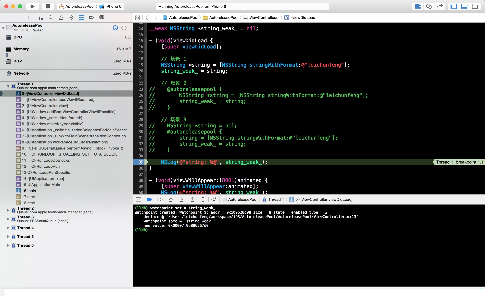

设置好观察点后，点击 `Continue program execution` 按钮，继续运行程序，我们将看到如下图所示的界面：

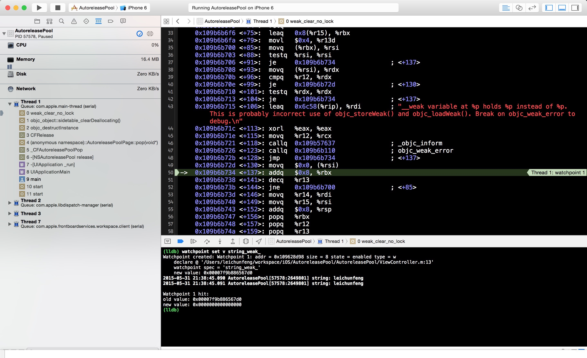

我们先看 console 中的输出，注意到 `string_weak_` 变量的值由 `0x00007f9b886567d0` 变成了
`0x0000000000000000` ，也就是 `nil` 。说明此时它所指向的对象被释放了。另外，我们也可以注意到一个细节，那就是 console中打印了两次对象的值，说明此时 `viewWillAppear` 也已经被调用了，而 `viewDidAppear` 还没有被调用。

接着，我们来看看左侧的线程堆栈。我们看到了一个非常敏感的方法调用 `-[NSAutoreleasePool release]` ，这个方法最终通过调用`AutoreleasePoolPage::pop(void *)` 函数来负责对 autoreleasepool 中的 autoreleased 对象执行release 操作。结合前面的分析，我们知道在 `viewDidLoad` 中创建的 autoreleased 对象在方法返回后引用计数为 1，所以经过这里的 release 操作后，这个对象的引用计数 -1 ，变成了 0 ，该 autoreleased 对象最终被释放，猜测得证。

另外，值得一提的是，我们在代码中并没有手动添加 autoreleasepool ，那这个 autoreleasepool
究竟是哪里来的呢？看完后面的章节你就明白了。

**场景 2**：同理，当通过 `[NSString stringWithFormat:@"leichunfeng"]` 创建一个对象时，这个对象的引用计数为 1 。而当使用局部变量 `string` 指向这个对象时，这个对象的引用计数 +1 ，变成了 2 。而出了当前作用域时，局部变量 `string` 变成了 `nil` ，所以其所指向对象的引用计数变成 1 。另外，我们知道当出了 `@autoreleasepool {}` 的作用域时，当前 autoreleasepool 被 drain ，其中的 autoreleased 对象被 release 。所以这个对象的引用计数变成了 0 ，对象最终被释放。

**场景 3**：同理，当出了 `@autoreleasepool {}` 的作用域时，其中的 autoreleased 对象被 release ，对象的引用计数变成 1 。当出了局部变量 `string` 的作用域，即 `viewDidLoad` 方法返回时，`string` 指向了 `nil` ，其所指向对象的引用计数变成 0 ，对象最终被释放。

理解在这 3 种场景下，autoreleased 对象什么时候释放对我们理解 Objective-C 的内存管理机制非常有帮助。其中，场景 1出现得最多，就是不需要我们手动添加 `@autoreleasepool {}` 的情况，直接使用系统维护的 autoreleasepool ；场景 2就是需要我们手动添加 `@autoreleasepool {}` 的情况，手动干预 autoreleased 对象的释放时机；场景 3 是为了区别场景 2而引入的，在这种场景下并不能达到出了 `@autoreleasepool {}` 的作用域时 autoreleased 对象被释放的目的。

**PS**：请读者参考场景 1 的分析过程，使用 `lldb` 命令 `watchpoint` 自行验证下在场景 2 和场景 3 下 autoreleased 对象的释放时机，you should give it a try yourself 。

###AutoreleasePoolPage

细心的读者应该已经有所察觉，我们在上面已经提到了 `-[NSAutoreleasePool release]` 方法最终是通过调用`AutoreleasePoolPage::pop(void *)` 函数来负责对 autoreleasepool 中的 autoreleased 对象执行release 操作的。

那这里的 AutoreleasePoolPage 是什么东西呢？其实，autoreleasepool 是没有单独的内存结构的，它是通过以AutoreleasePoolPage 为结点的**双向链表**来实现的。我们打开 runtime 的源码工程，在 `NSObject.mm` 文件的第438-932 行可以找到 autoreleasepool 的实现源码。通过阅读源码，我们可以知道：

  * 每一个线程的 autoreleasepool 其实就是一个指针的堆栈；
  * 每一个指针代表一个需要 release 的对象或者 POOL_SENTINEL（哨兵对象，代表一个 autoreleasepool 的边界）；
  * 一个 pool token 就是这个 pool 所对应的 POOL_SENTINEL 的内存地址。当这个 pool 被 pop 的时候，所有内存地址在 pool token 之后的对象都会被 release ；
  * 这个堆栈被划分成了一个以 page 为结点的双向链表。pages 会在必要的时候动态地增加或删除；
  * Thread-local storage（线程局部存储）指向 hot page ，即最新添加的 autoreleased 对象所在的那个 page 。

一个空的 AutoreleasePoolPage 的内存结构如下图所示：

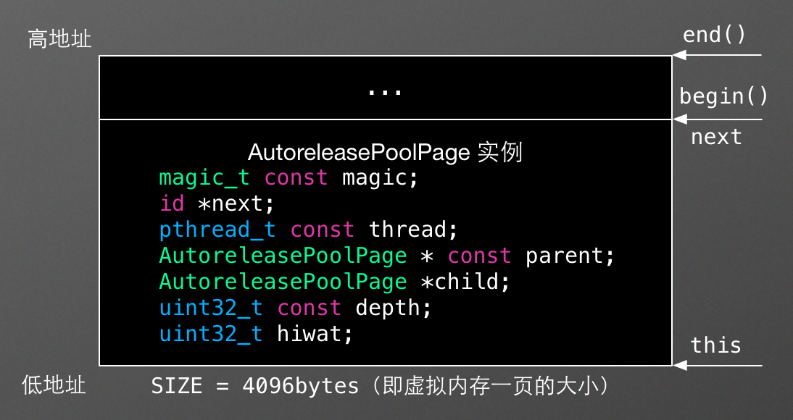

  1. `magic` 用来校验 AutoreleasePoolPage 的结构是否完整；
  2. `next` 指向最新添加的 autoreleased 对象的下一个位置，初始化时指向 `begin()` ；
  3. `thread` 指向当前线程；
  4. `parent` 指向父结点，第一个结点的 parent 值为 `nil` ；
  5. `child` 指向子结点，最后一个结点的 child 值为 `nil` ；
  6. `depth` 代表深度，从 0 开始，往后递增 1；
  7. `hiwat` 代表 high water mark 。

另外，当 `next == begin()` 时，表示 AutoreleasePoolPage 为空；当 `next == end()` 时，表示AutoreleasePoolPage 已满。

####Autorelease Pool Blocks

我们使用 `clang -rewrite-objc` 命令将下面的 Objective-C 代码重写成 C++ 代码：

    
    @autoreleasepool {
    
    }
    

将会得到以下输出结果（只保留了相关代码）：

    
    extern "C" __declspec(dllimport) void * objc_autoreleasePoolPush(void);
    extern "C" __declspec(dllimport) void objc_autoreleasePoolPop(void *);
    
    struct __AtAutoreleasePool {
      __AtAutoreleasePool() {atautoreleasepoolobj = objc_autoreleasePoolPush();}
      ~__AtAutoreleasePool() {objc_autoreleasePoolPop(atautoreleasepoolobj);}
      void * atautoreleasepoolobj;
    };
    
    /* @autoreleasepool */ { __AtAutoreleasePool __autoreleasepool;
    
    }
    

不得不说，苹果对 `@autoreleasepool {}` 的实现真的是非常巧妙，真正可以称得上是代码的艺术。苹果通过声明一个`__AtAutoreleasePool` 类型的局部变量 `__autoreleasepool` 来实现 `@autoreleasepool {}`。当声明 `__autoreleasepool` 变量时，构造函数 `__AtAutoreleasePool()` 被调用，即执行`atautoreleasepoolobj = objc_autoreleasePoolPush();` ；当出了当前作用域时，析构函数`~__AtAutoreleasePool()` 被调用，即执行`objc_autoreleasePoolPop(atautoreleasepoolobj);` 。也就是说 `@autoreleasepool {}`
的实现代码可以进一步简化如下：
    
    /* @autoreleasepool */ {
        void *atautoreleasepoolobj = objc_autoreleasePoolPush();
        // 用户代码，所有接收到 autorelease 消息的对象会被添加到这个 autoreleasepool 中
        objc_autoreleasePoolPop(atautoreleasepoolobj);
    }
    

因此，单个 autoreleasepool 的运行过程可以简单地理解为 `objc_autoreleasePoolPush()`、`[对象 autorelease]` 和 `objc_autoreleasePoolPop(void *)` 三个过程。

####push 操作

上面提到的 `objc_autoreleasePoolPush()` 函数本质上就是调用的 AutoreleasePoolPage 的 push 函数。

    void *
    objc_autoreleasePoolPush(void)
    {
        if (UseGC) return nil;
        return AutoreleasePoolPage::push();
    }
    

因此，我们接下来看看 AutoreleasePoolPage 的 push 函数的作用和执行过程。一个 push 操作其实就是创建一个新的autoreleasepool ，对应 AutoreleasePoolPage 的具体实现就是往AutoreleasePoolPage 中的 `next`位置插入一个 POOL_SENTINEL ，并且返回插入的 POOL_SENTINEL 的内存地址。这个地址也就是我们前面提到的 pool token，在执行 pop 操作的时候作为函数的入参。
    
    
    static inline void *push()
    {
        id *dest = autoreleaseFast(POOL_SENTINEL);
        assert(*dest == POOL_SENTINEL);
        return dest;
    }
    

push 函数通过调用 `autoreleaseFast` 函数来执行具体的插入操作。

     
    static inline id *autoreleaseFast(id obj)
    {
        AutoreleasePoolPage *page = hotPage();
        if (page && !page->full()) {
            return page->add(obj);
        } else if (page) {
            return autoreleaseFullPage(obj, page);
        } else {
            return autoreleaseNoPage(obj);
        }
    }
    

`autoreleaseFast` 函数在执行一个具体的插入操作时，分别对三种情况进行了不同的处理：

  1. 当前 page 存在且没有满时，直接将对象添加到当前 page 中，即 `next` 指向的位置；
  2. 当前 page 存在且已满时，创建一个新的 page ，并将对象添加到新创建的 page 中；
  3. 当前 page 不存在时，即还没有 page 时，创建第一个 page ，并将对象添加到新创建的 page 中。

每调用一次 push 操作就会创建一个新的 autoreleasepool ，即往 AutoreleasePoolPage 中插入一个POOL_SENTINEL ，并且返回插入的 POOL_SENTINEL 的内存地址。

####autorelease 操作

通过 `NSObject.mm` 源文件，我们可以找到 `-autorelease` 方法的实现：
    
    
    - (id)autorelease {
        return ((id)self)->rootAutorelease();
    }
    

通过查看 `((id)self)->rootAutorelease()` 的方法调用，我们发现最终调用的就是 AutoreleasePoolPage 的`autorelease` 函数。

        
    __attribute__((noinline,used))
    id
    objc_object::rootAutorelease2()
    {
        assert(!isTaggedPointer());
        return AutoreleasePoolPage::autorelease((id)this);
    }
    

AutoreleasePoolPage 的 `autorelease` 函数的实现对我们来说就比较容量理解了，它跟 push 操作的实现非常相似。只不过push 操作插入的是一个 POOL_SENTINEL ，而 autorelease 操作插入的是一个具体的 autoreleased 对象。

     
    static inline id autorelease(id obj)
    {
        assert(obj);
        assert(!obj->isTaggedPointer());
        id *dest __unused = autoreleaseFast(obj);
        assert(!dest  ||  *dest == obj);
        return obj;
    }
    

####pop 操作

同理，前面提到的 `objc_autoreleasePoolPop(void *)` 函数本质上也是调用的 AutoreleasePoolPage 的`pop` 函数。

     
    void
    objc_autoreleasePoolPop(void *ctxt)
    {
        if (UseGC) return;
    
        // fixme rdar://9167170
        if (!ctxt) return;
    
        AutoreleasePoolPage::pop(ctxt);
    }
    

pop 函数的入参就是 push 函数的返回值，也就是 POOL_SENTINEL 的内存地址，即 pool token 。当执行 pop操作时，内存地址在 pool token 之后的所有 autoreleased 对象都会被 release 。直到 pool token 所在 page 的`next` 指向 pool token 为止。

下面是某个线程的 autoreleasepool 堆栈的内存结构图，在这个 autoreleasepool 堆栈中总共有两个 POOL_SENTINEL，即有两个 autoreleasepool 。该堆栈由三个 AutoreleasePoolPage 结点组成，第一个 AutoreleasePoolPage结点为 `coldPage()` ，最后一个 AutoreleasePoolPage 结点为 `hotPage()`。其中，前两个结点已经满了，最后一个结点中保存了最新添加的 autoreleased 对象 `objr3` 的内存地址。

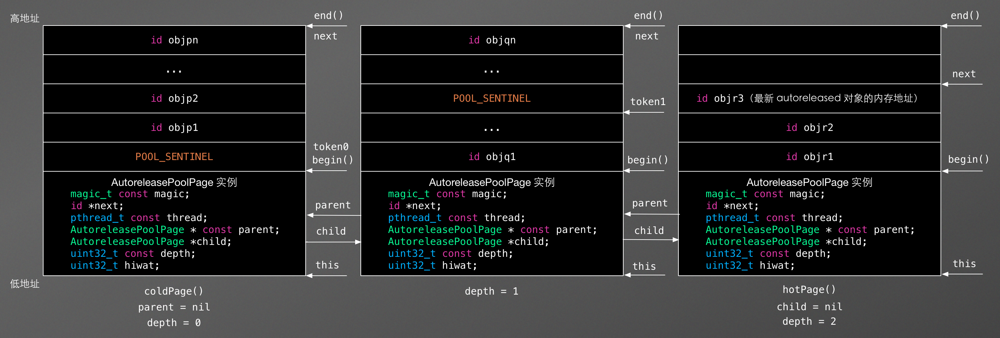

此时，如果执行 `pop(token1)` 操作，那么该 autoreleasepool 堆栈的内存结构将会变成如下图所示：

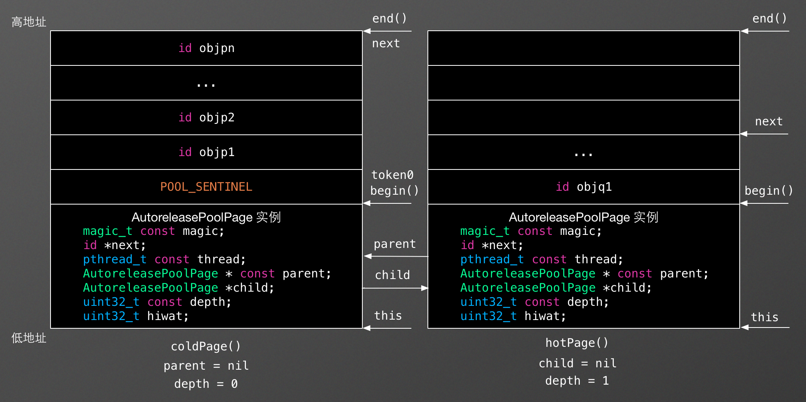

###NSThread、NSRunLoop 和 NSAutoreleasePool

根据苹果官方文档中对 [NSRunLoop](https://developer.apple.com/library/ios/documentation/Cocoa/Reference/Foundation/Classes/NSRunLoop_Class/index.html#//apple_ref/doc/constant_group/Run_Loop_Modes) 的描述，我们可以知道每一个线程，包括主线程，都会拥有一个专属的 NSRunLoop对象，并且会在有需要的时候自动创建。

> Each NSThread object, including the application’s main thread, has an
NSRunLoop object automatically created for it as needed.
同样的，根据苹果官方文档中对 [NSAutoreleasePool](https://developer.apple.com/library/ios/documentation/Cocoa/Reference/Foundation/Classes/NSAutoreleasePool_Class/index.html#//apple_ref/doc/uid/TP40003623) 的描述，我们可知，在主线程的 NSRunLoop
对象（在系统级别的其他线程中应该也是如此，比如通过dispatch_get_global_queue(DISPATCH_QUEUE_PRIORITY_DEFAULT, 0) 获取到的线程）的每个 event loop 开始前，系统会自动创建一个 autoreleasepool ，并在 event loop 结束时 drain 。我们上面提到的场景 1 中创建的autoreleased 对象就是被系统添加到了这个自动创建的 autoreleasepool 中，并在这个 autoreleasepool 被 drain时得到释放。
> The Application Kit creates an autorelease pool on the main thread at the
beginning of every cycle of the event loop, and drains it at the end, thereby
releasing any autoreleased objects generated while processing an event.
另外，NSAutoreleasePool 中还提到，每一个线程都会维护自己的 autoreleasepool 堆栈。换句话说 autoreleasepool
是与线程紧密相关的，每一个 autoreleasepool 只对应一个线程。
> Each thread (including the main thread) maintains its own stack of
NSAutoreleasePool objects.

弄清楚 NSThread、NSRunLoop 和 NSAutoreleasePool 三者之间的关系可以帮助我们从整体上了解 Objective-C的内存管理机制，清楚系统在背后到底为我们做了些什么，理解整个运行机制等。

###总结

看到这里，相信你应该对 Objective-C 的内存管理机制有了更进一步的认识。通常情况下，我们是不需要手动添加 autoreleasepool的，使用线程自动维护的 autoreleasepool 就好了。根据苹果官方文档中对 [Using Autorelease Pool Blocks](https://developer.apple.com/library/ios/documentation/Cocoa/Conceptual/MemoryMgmt/Articles/mmAutoreleasePools.html#//apple_ref/doc/uid/20000047-CJBFBEDI)的描述，我们知道在下面三种情况下是需要我们手动添加 autoreleasepool 的：

  1. 如果你编写的程序不是基于 UI 框架的，比如说命令行工具；
  2. 如果你编写的循环中创建了大量的临时对象；
  3. 如果你创建了一个辅助线程。

最后，希望本文能对你有所帮助，have fun ！

###参考链接

<http://blog.sunnyxx.com/2014/10/15/behind-autorelease/>
<http://clang.llvm.org/docs/AutomaticReferenceCounting.html>
<http://www.yifeiyang.net/development-of-the-iphone-simply-3/>


<hr>


####<p>原文出处：<a href='http://blog.leichunfeng.com/blog/2015/06/14/objective-c-method-swizzling-best-practice/' target='blank'>Objective-C Method Swizzling 的最佳实践</a></p>

##Objective-C Method Swizzling 的最佳实践


###Method Swizzling 的原理

Method Swizzling 是一把双刃剑，使用得当可以让我们非常轻松地实现复杂的功能，而如果一旦误用，它也很可能会给我们的程序带来毁灭性的伤害。但是我们大可不必惊慌，在了解了它的实现原理后，我们就可以“信手拈来”了。

我们先来了解下 Objective-C 中方法 `Method` 的数据结构：

      
    typedef struct method_t *Method;
    struct method_t {
        SEL name;
        const char *types;
        IMP imp;
    
        struct SortBySELAddress :
            public std::binary_function<const method_t&,
                                        const method_t&, bool>
        {
            bool operator() (const method_t& lhs,
                             const method_t& rhs)
            { return lhs.name < rhs.name; }
        };
    };
    

本质上，它就是 `struct method_t` 类型的指针，所以我们重点看下结构体 `method_t` 的定义。在结构体 `method_t`中定义了三个成员变量和一个成员函数：

  1. `name` 表示的是方法的名称，用于唯一标识某个方法，比如 `@selector(viewWillAppear:)` ；
  2. `types` 表示的是方法的返回值和参数类型（详细信息可以查阅苹果官方文档中的 [Type Encodings](https://developer.apple.com/library/ios/documentation/Cocoa/Conceptual/ObjCRuntimeGuide/Articles/ocrtTypeEncodings.html#//apple_ref/doc/uid/TP40008048-CH100-SW1) ）；
  3. `imp` 是一个函数指针，指向方法的实现；
  4. `SortBySELAddress` 顾名思义，是一个根据 `name` 的地址对方法进行排序的函数。

由此，我们也可以发现 Objective-C 中的方法名是不包括参数类型的，也就是说下面两个方法在 runtime 看来就是同一个方法：

    - (void)viewWillAppear:(BOOL)animated;
    - (void)viewWillAppear:(NSString *)string;
    

而下面两个方法却是可以共存的：
    
    - (void)viewWillAppear:(BOOL)animated;
    + (void)viewWillAppear:(BOOL)animated;
    

因为实例方法和类方法是分别保存在类对象和元类对象中的，更多详情可以查看我前面的文章[《Objective-C对象模型》](http://blog.leichunfeng.com/blog/2015/04/25/objective-c-object-model/)。

原则上，方法的名称 `name` 和方法的实现 `imp` 是一一对应的，而 Method Swizzling的原理就是动态地改变它们的对应关系，以达到替换方法实现的目的。

###Method Swizzling 有什么用

说了这么多，到底 Method Swizzling 有什么用呢？表猴急哈，我们接下来看个例子就明白了。用过[友盟](http://www.umeng.com/)统计的同学应该知道，要实现[页面的统计](http://dev.umeng.com/analytics/ios-doc/integration#3)功能，我们需要在每个页面的 `view controller` 中添加如下代码：


    - (void)viewWillAppear:(BOOL)animated {
        [super viewWillAppear:animated];
        [MobClick beginLogPageView:@"PageOne"];
    }
    
    - (void)viewWillDisappear:(BOOL)animated {
        [super viewWillDisappear:animated];
        [MobClick endLogPageView:@"PageOne"];
    }
    

要达到这个目的，我们有两种比较常规的实现方式：

  1. 直接修改每个页面的 `view controller` 代码，简单粗暴；
  2. 子类化 `view controller` ，并让我们的 `view controller` 都继承这些子类。

第 1 种方式的缺点是不言而喻的，这样做不仅会产生大量重复的代码，而且还很容易遗漏某些页面，非常难维护；第 2 种方式稍微好一点，但是也同样需要我们子类化`UIViewController` 、`UITableViewController` 和 `UITabBarController` 等不同类型的`view controller` 。

也许你跟我一样陷入了思考，难道就没有一种简单优雅的解决方案吗？答案是肯定的，Method Swizzling 就是解决此类问题的最佳方式。

###Method Swizzling 的最佳实践

下面我们就以替换 `viewWillAppear` 方法为例谈谈 Method Swizzling 的最佳实践，话不多说，直接上代码：
    
    
    @interface UIViewController (MRCUMAnalytics)
    
    @end
    
    @implementation UIViewController (MRCUMAnalytics)
    
    + (void)load {
        static dispatch_once_t onceToken;
        dispatch_once(&onceToken, ^{
            Class class = [self class];
    
            SEL originalSelector = @selector(viewWillAppear:);
            SEL swizzledSelector = @selector(mrc_viewWillAppear:);
    
            Method originalMethod = class_getInstanceMethod(class, originalSelector);
            Method swizzledMethod = class_getInstanceMethod(class, swizzledSelector);
    
            BOOL success = class_addMethod(class, originalSelector, method_getImplementation(swizzledMethod), method_getTypeEncoding(swizzledMethod));
            if (success) {
                class_replaceMethod(class, swizzledSelector, method_getImplementation(originalMethod), method_getTypeEncoding(originalMethod));
            } else {
                method_exchangeImplementations(originalMethod, swizzledMethod);
            }
        });
    }
    
    #pragma mark - Method Swizzling
    
    - (void)mrc_viewWillAppear:(BOOL)animated {
        [self mrc_viewWillAppear:animated];
        [MobClick beginLogPageView:NSStringFromClass([self class])];
    }
    
    @end
    

**解析**：在上面的代码中有三个关键点需要引起我们的注意：

  1. 为什么是在 `+load` 方法中实现 Method Swizzling 的逻辑，而不是其他的什么方法，比如 `+initialize` 等；
  2. 为什么 Method Swizzling 的逻辑需要用 dispatch_once 来进行调度；
  3. 为什么需要调用 `class_addMethod` 方法，并且以它的结果为依据分别处理两种不同的情况。

下面我们就一起来分析下这三个为什么到底是为了什么？

**第 1 个为什么**：看过我前面文章[《Objective-C +load vs +initialize》](http://blog.leichunfeng.com/blog/2015/05/02/objective-c-plus-load-vs-plus-initialize/) 的同学应该知道，`+load` 和 `+initialize` 是 Objective-C runtime 会自动调用的两个类方法。但是它们被调用的时机却是有差别的，`+load` 方法是在类被加载的时候调用的，而 `+initialize` 方法是在类或它的子类收到第一条消息之前被调用的，这里所指的消息包括实例方法和类方法的调用。也就是说 `+initialize` 方法是以懒加载的方式被调用的，如果程序一直没有给某个类或它的子类发送消息，那么这个类的 `+initialize` 方法是永远不会被调用的。此外 `+load` 方法还有一个非常重要的特性，那就是子类、父类和分类中的 `+load` 方法的实现是被区别对待的。换句话说在 Objective-C runtime 自动调用 `+load` 方法时，分类中的 `+load` 方法并不会对主类中的 `+load` 方法造成覆盖。综上所述，`+load` 方法是实现 Method Swizzling 逻辑的最佳“场所”。

**第 2 个为什么**：我们上面提到，`+load` 方法在类加载的时候会被 runtime 自动调用一次，但是它并没有限制程序员对 `+load` 方法的手动调用。什么？你说不会有程序员这么干？那可说不定，我还见过手动调用 `viewDidLoad` 方法的程序员，就是介么任性。而我们所能够做的就是尽可能地保证程序能够在各种情况下正常运行。

**第 3 个为什么**：我们使用 Method Swizzling 的目的通常都是为了给程序增加功能，而不是完全地替换某个功能，所以我们一般都需要在自定义的实现中调用原始的实现。所以这里就会有两种情况需要我们分别进行处理：

**第 1 种情况**：主类本身有实现需要替换的方法，也就是 `class_addMethod` 方法返回 `NO` 。这种情况的处理比较简单，直接交换两个方法的实现就可以了：
       
    
    - (void)viewWillAppear:(BOOL)animated {
        /// 先调用原始实现，由于主类本身有实现该方法，所以这里实际调用的是主类的实现
        [self mrc_viewWillAppear:animated];
        /// 我们增加的功能
        [MobClick beginLogPageView:NSStringFromClass([self class])];
    }
    
    - (void)mrc_viewWillAppear:(BOOL)animated {
        /// 主类的实现
    }
    

**第 2 种情况**：主类本身没有实现需要替换的方法，而是继承了父类的实现，即 `class_addMethod` 方法返回 `YES` 。这时使用 `class_getInstanceMethod` 函数获取到的 `originalSelector` 指向的就是父类的方法，我们再通过执行 `class_replaceMethod(class, swizzledSelector, method_getImplementation(originalMethod), method_getTypeEncoding(originalMethod));` 将父类的实现替换到我们自定义的 `mrc_viewWillAppear` 方法中。这样就达到了在 `mrc_viewWillAppear` 方法的实现中调用父类实现的目的。
    
      
    - (void)viewWillAppear:(BOOL)animated {
        /// 先调用原始实现，由于主类本身并没有实现该方法，所以这里实际调用的是父类的实现
        [self mrc_viewWillAppear:animated];
        /// 我们增加的功能
        [MobClick beginLogPageView:NSStringFromClass([self class])];
    }
    
    - (void)mrc_viewWillAppear:(BOOL)animated {
        /// 父类的实现
    }
    

看到这里，相信你对 Method Swizzling 已经有了一定的了解，那么接下来就请你自己亲自试一试吧，you should give it a try yourself 。

###总结

Method Swizzling 是一种黑魔法，我们在使用它时需要加倍小心，而遵循本文的最佳实践可以让你事半功倍。


<hr>


####<p>原文出处：<a href='http://blog.leichunfeng.com/blog/2015/04/25/objective-c-object-model/' target='blank'>Objective-C 对象模型</a></p>

##Objective-C 对象模型

###对象

在 Objective-C 中，每一个对象都是某个类的实例，且这个对象的 `isa`（在 64 位 CPU 下，`isa`
已经不再是一个简单的指针，在本文中我们暂且把它当作普通指针来理解，后面我会单独写一篇博文来详细介绍 `Non-pointer isa`）指针指向它所属的类。

打开刚下载的 runtime 工程，在文件 `objc-private.h` 的第 127-232 行我们可以找到 Objective-C 中的对象的定义`struct objc_object` 。是的，Objective-C 中的对象本质上是结构体对象，其中 `isa` 是它唯一的私有成员变量。


在同一个文件的第 51-52 行我们可以找到 `Class` 和 `id` 类型的定义，它们分别是 `struct objc_class` 和`struct objc_object` 类型的指针。这也是为什么 `id` 类型可以指向任意对象的原因。其中 `struct objc_class` 就是Objective-C 中的类的定义，在下一节将会详细介绍。

    
    typedef struct objc_class *Class;
    typedef struct objc_object *id;
    

###类

对象的类不仅描述了对象的数据：对象占用的内存大小、成员变量的类型和布局等，而且也描述了对象的行为：对象能够响应的消息、实现的实例方法等。因此，当我们调用实例方法 `[receiver message]` 给一个对象发送消息时，这个对象能否响应这个消息就需要通过 `isa` 找到它所属的类（当然还有superclass，本文主要内容不是这个，所以不展开）才能知道。

打开文件 `objc-runtime-new.h` ，在第 687-902 行我们可以找到 Objective-C 中的类的定义 `struct objc_class` 。同样的，Objective-C 中类也是一个结构体对象，并且继承了 `struct objc_object` 。


所以，Objective-C中的类本质上也是对象，我们称之为类对象。按照我们前面所说的所有的对象都是某个类的实例，那么类对象又是什么类的实例呢？答案就是我们将在下一节介绍的元类。

在 Objective-C 中有一个非常特殊的类 `NSObject` ，绝大部分的类都继承自它。它是 Objective-C
中的两个根类（rootclass）之一，另外一个是 NSProxy（本文不讨论）。同样的，我们打开文件`NSObject.h` ，可以看到`NSObject` 类其实就只有一个成员变量 `isa` ，所有继承自 `NSObject` 的类也都会有这个成员变量。


###元类

我们上面提到，本质上 Objective-C 中的类也是对象，它也是某个类的实例，这个类我们称之为元类（metaclass）。

因此，我们也可以通过调用类方法，比如 `[NSObject new]`，给类对象发送消息。同样的，类对象能否响应这个消息也要通过 `isa` 找到类对象所属的类（元类）才能知道。也就是说，实例方法是保存在类中的，而类方法是保存在元类中的。

那元类也是对象吗？是的话那它又是什么类的实例呢？是的，没错，元类也是对象（元类对象），元类也是某个类的实例，这个类我们称之为根元类（root metaclass）。不过，有一点比较特殊，那就是所有的元类所属的类都是同一个根元类（当然根元类也是元类，所以它所属的类也是根元类，即它本身）。根元类指的就是根类的元类，具体来说就是根类 `NSObject` 对应的元类。

因此，理论上我们也可以给元类发送消息，但是 Objective-C 倾向于隐藏元类，不想让大家知道元类的存在。元类是为了保持 Objective-C对象模型在设计上的完整性而引入的，比如用来保存类方法等，它主要是用来给编译器使用的。

说了这么多，大家可能已经有点绕迷糊了，下面我们看一张图，一切自会明了。


<hr>


####<p>原文出处：<a href='http://blog.leichunfeng.com/blog/2015/05/02/objective-c-plus-load-vs-plus-initialize/' target='blank'>Objective-C +load vs +initialize</a></p>

##Objective-C +load vs +initialize

May 2nd, 2015 5:06 pm

在上一篇博文[《Objective-C对象模型》](http://blog.leichunfeng.com/blog/2015/04/25/objective-c-object-model/)中，我们知道了 Objective-C 中绝大部分的类都继承自 NSObject 类。而在 NSObject 类中有两个非常特殊的类方法+load 和 +initialize ，用于类的初始化。这两个看似非常简单的类方法在许多方面会让人感到困惑，比如：

  1. 子类、父类、分类中的相应方法什么时候会被调用？
  2. 需不需要在子类的实现中显式地调用父类的实现？
  3. 每个方法到底会被调用多少次？

下面，我们将结合 [runtime](http://opensource.apple.com/tarballs/objc4/)（我下载的是当前的最新版本`objc4-646.tar.gz`) 的源码，一起来揭开它们的神秘面纱。

###+load

+load 方法是当类或分类被添加到 Objective-C runtime 时被调用的，实现这个方法可以让我们在类加载的时候执行一些类相关的行为。子类的+load 方法会在它的所有父类的 +load 方法之后执行，而分类的 +load 方法会在它的主类的 +load 方法之后执行。但是不同的类之间的+load 方法的调用顺序是不确定的。

打开 runtime 工程，我们接下来看看与 +load 方法相关的几个关键函数。首先是文件 `objc-runtime-new.mm` 中的 `void
prepare_load_methods(header_info *hi)` 函数：
    
    
    void prepare_load_methods(header_info *hi)
    {
        size_t count, i;
    
        rwlock_assert_writing(&runtimeLock);
    
        classref_t *classlist =
            _getObjc2NonlazyClassList(hi, &count);
        for (i = 0; i < count; i++) {
            schedule_class_load(remapClass(classlist[i]));
        }
    
        category_t **categorylist = _getObjc2NonlazyCategoryList(hi, &count);
        for (i = 0; i < count; i++) {
            category_t *cat = categorylist[i];
            Class cls = remapClass(cat->cls);
            if (!cls) continue;  // category for ignored weak-linked class
            realizeClass(cls);
            assert(cls->ISA()->isRealized());
            add_category_to_loadable_list(cat);
        }
    }
    

顾名思义，这个函数的作用就是提前准备好满足 +load 方法调用条件的类和分类，以供接下来的调用。其中，在处理类时，调用了同文件中的另外一个函数`static void schedule_class_load(Class cls)` 来执行具体的操作。
    
    static void schedule_class_load(Class cls)
    {
        if (!cls) return;
        assert(cls->isRealized());  // _read_images should realize
    
        if (cls->data()->flags & RW_LOADED) return;
    
        // Ensure superclass-first ordering
        schedule_class_load(cls->superclass);
    
        add_class_to_loadable_list(cls);
        cls->setInfo(RW_LOADED);
    }
    

其中，函数第 9 行代码对入参的父类进行了递归调用，以确保父类优先的顺序。`void prepare_load_methods(header_info*hi)` 函数执行完后，当前所有满足 +load 方法调用条件的类和分类就被分别存放在全局变量 `loadable_classes` 和`loadable_categories` 中了。

准备好类和分类后，接下来就是对它们的 +load 方法进行调用了。打开文件 `objc-loadmethod.m` ，找到其中的 `void call_load_methods(void)` 函数。
    
    void call_load_methods(void)
    {
        static BOOL loading = NO;
        BOOL more_categories;
    
        recursive_mutex_assert_locked(&loadMethodLock);
    
        // Re-entrant calls do nothing; the outermost call will finish the job.
        if (loading) return;
        loading = YES;
    
        void *pool = objc_autoreleasePoolPush();
    
        do {
            // 1. Repeatedly call class +loads until there aren't any more
            while (loadable_classes_used > 0) {
                call_class_loads();
            }
    
            // 2. Call category +loads ONCE
            more_categories = call_category_loads();
    
            // 3. Run more +loads if there are classes OR more untried categories
        } while (loadable_classes_used > 0  ||  more_categories);
    
        objc_autoreleasePoolPop(pool);
    
        loading = NO;
    }
    

同样的，这个函数的作用就是调用上一步准备好的类和分类中的 +load 方法，并且确保类优先于分类的顺序。我们继续查看在这个函数中调用的另外两个关键函数`static void call_class_loads(void)` 和 `static BOOL call_category_loads(void)`。由于这两个函数的作用大同小异，下面就以篇幅较小的 `static void call_class_loads(void)` 函数为例进行探讨。
    
    static void call_class_loads(void)
    {
        int i;
    
        // Detach current loadable list.
        struct loadable_class *classes = loadable_classes;
        int used = loadable_classes_used;
        loadable_classes = nil;
        loadable_classes_allocated = 0;
        loadable_classes_used = 0;
    
        // Call all +loads for the detached list.
        for (i = 0; i < used; i++) {
            Class cls = classes[i].cls;
            load_method_t load_method = (load_method_t)classes[i].method;
            if (!cls) continue;
    
            if (PrintLoading) {
                _objc_inform("LOAD: +[%s load]\n", cls->nameForLogging());
            }
            (*load_method)(cls, SEL_load);
        }
    
        // Destroy the detached list.
        if (classes) _free_internal(classes);
    }
    

这个函数的作用就是真正负责调用类的 +load 方法了。它从全局变量 `loadable_classes` 中取出所有可供调用的类，并进行清零操作。

    loadable_classes = nil;
    loadable_classes_allocated = 0;
    loadable_classes_used = 0;
    

其中 `loadable_classes` 指向用于保存类信息的内存的首地址，`loadable_classes_allocated`
标识已分配的内存空间大小，`loadable_classes_used` 则标识已使用的内存空间大小。

然后，循环调用所有类的 +load 方法。**注意**，这里是（调用分类的 +load 方法也是如此）直接使用函数内存地址的方式`(*load_method)(cls, SEL_load);` 对 +load 方法进行调用的，而不是使用发送消息 `objc_msgSend` 的方式。

这样的调用方式就使得 +load 方法拥有了一个非常有趣的特性，那就是子类、父类和分类中的 +load 方法的实现是被区别对待的。也就是说如果子类没有实现+load 方法，那么当它被加载时 runtime 是不会去调用父类的 +load 方法的。同理，当一个类和它的分类都实现了 +load方法时，两个方法都会被调用。因此，我们常常可以利用这个特性做一些“邪恶”的事情，比如说方法混淆（[Method Swizzling](http://nshipster.com/method-swizzling/)）。

###+initialize

+initialize 方法是在类或它的子类收到第一条消息之前被调用的，这里所指的消息包括实例方法和类方法的调用。也就是说 +initialize方法是以懒加载的方式被调用的，如果程序一直没有给某个类或它的子类发送消息，那么这个类的 +initialize方法是永远不会被调用的。那这样设计有什么好处呢？好处是显而易见的，那就是节省系统资源，避免浪费。

同样的，我们还是结合 runtime 的源码来加深对 +initialize 方法的理解。打开文件 `objc-runtime-new.mm`，找到以下函数：

      
    IMP lookUpImpOrForward(Class cls, SEL sel, id inst,
                           bool initialize, bool cache, bool resolver)
    {
        ...
            rwlock_unlock_write(&runtimeLock);
        }
    
        if (initialize  &&  !cls->isInitialized()) {
            _class_initialize (_class_getNonMetaClass(cls, inst));
            // If sel == initialize, _class_initialize will send +initialize and 
            // then the messenger will send +initialize again after this 
            // procedure finishes. Of course, if this is not being called 
            // from the messenger then it won't happen. 2778172
        }
    
        // The lock is held to make method-lookup + cache-fill atomic 
        // with respect to method addition. Otherwise, a category could 
        ...
    }
    

当我们给某个类发送消息时，runtime 会调用这个函数在类中查找相应方法的实现或进行消息转发。从第 8-14 的关键代码我们可以看出，当类没有初始化时runtime 会调用 `void _class_initialize(Class cls)` 函数对该类进行初始化。

      
    void _class_initialize(Class cls)
    {
        ...
        Class supercls;
        BOOL reallyInitialize = NO;
    
        // Make sure super is done initializing BEFORE beginning to initialize cls.
        // See note about deadlock above.
        supercls = cls->superclass;
        if (supercls  &&  !supercls->isInitialized()) {
            _class_initialize(supercls);
        }
    
        // Try to atomically set CLS_INITIALIZING.
        monitor_enter(&classInitLock);
        if (!cls->isInitialized() && !cls->isInitializing()) {
            cls->setInitializing();
            reallyInitialize = YES;
        }
        monitor_exit(&classInitLock);
    
        if (reallyInitialize) {
            // We successfully set the CLS_INITIALIZING bit. Initialize the class.
    
            // Record that we're initializing this class so we can message it.
            _setThisThreadIsInitializingClass(cls);
    
            // Send the +initialize message.
            // Note that +initialize is sent to the superclass (again) if 
            // this class doesn't implement +initialize. 2157218
            if (PrintInitializing) {
                _objc_inform("INITIALIZE: calling +[%s initialize]",
                             cls->nameForLogging());
            }
    
            ((void(*)(Class, SEL))objc_msgSend)(cls, SEL_initialize);
    
            if (PrintInitializing) {
                _objc_inform("INITIALIZE: finished +[%s initialize]",
        ...
    }
    

其中，第 7-12 行代码对入参的父类进行了递归调用，以确保父类优先于子类初始化。另外，最关键的是第 36 行代码（暴露了 +initialize方法的本质），runtime 使用了发送消息 `objc_msgSend` 的方式对 +initialize 方法进行调用。也就是说 +initialize方法的调用与普通方法的调用是一样的，走的都是发送消息的流程。换言之，如果子类没有实现 +initialize方法，那么继承自父类的实现会被调用；如果一个类的分类实现了 +initialize 方法，那么就会对这个类中的实现造成覆盖。

因此，如果一个子类没有实现 +initialize 方法，那么父类的实现是会被执行多次的。有时候，这可能是你想要的；但如果我们想确保自己的+initialize 方法只执行一次，避免多次执行可能带来的副作用时，我们可以使用下面的代码来实现：

     
    + (void)initialize {
      if (self == [ClassName self]) {
        // ... do the initialization ...
      }
    }
    

###总结

通过阅读 runtime 的源码，我们知道了 +load 和 +initialize方法实现的细节，明白了它们的调用机制和各自的特点。下面我们绘制一张表格，以更加直观的方式来巩固我们对它们的理解：


<hr>


####<p>原文出处：<a href='http://blog.leichunfeng.com/blog/2015/05/18/objective-c-category-implementation-principle/' target='blank'>Objective-C Category 的实现原理</a></p>

##Objective-C Category 的实现原理


###使用场景

根据苹果官方文档对 [Category](https://developer.apple.com/library/ios/documentation/General/Conceptual/DevPedia-CocoaCore/Category.html#//apple_ref/doc/uid/TP40008195-CH5-SW1)的描述，它的使用场景主要有三个：

  1. 给现有的类添加方法；
  2. 将一个类的实现拆分成多个独立的源文件；
  3. 声明私有的方法。

其中，第 `1` 个是最典型的使用场景，应用最广泛。

**注**：Category 有一个非常容易误用的场景，那就是用 Category 来覆写父类或主类的方法。虽然目前 Objective-C 是允许这么做的，但是这种使用场景是**非常**不推荐的。[使用 Category 来覆写方法](http://stackoverflow.com/questions/5272451/overriding-methods-using-categories-in-objective-c)有很多缺点，比如不能覆写 Category 中的方法、无法调用主类中的原始实现等，且很容易造成无法预估的行为。

###实现原理

我们知道，无论我们有没有主动引入 Category 的头文件，Category 中的方法都会被添加进主类中。我们可以通过 `\-performSelector:` 等方式对 Category 中的相应方法进行调用，之所以需要在调用的地方引入 Category的头文件，只是为了“照顾”编译器同学的感受。

下面，我们将结合 runtime 的源码探究下 Category 的实现原理。打开 runtime 源码工程，在文件 `objc-runtime-new.mm` 中找到以下函数：   
    
    void _read_images(header_info **hList, uint32_t hCount)
    {
        ...
            _free_internal(resolvedFutureClasses);
        }
    
        // Discover categories. 
        for (EACH_HEADER) {
            category_t **catlist =
                _getObjc2CategoryList(hi, &count);
            for (i = 0; i < count; i++) {
                category_t *cat = catlist[i];
                Class cls = remapClass(cat->cls);
    
                if (!cls) {
                    // Category's target class is missing (probably weak-linked).
                    // Disavow any knowledge of this category.
                    catlist[i] = nil;
                    if (PrintConnecting) {
                        _objc_inform("CLASS: IGNORING category \?\?\?(%s) %p with "
                                     "missing weak-linked target class",
                                     cat->name, cat);
                    }
                    continue;
                }
    
                // Process this category. 
                // First, register the category with its target class. 
                // Then, rebuild the class's method lists (etc) if 
                // the class is realized. 
                BOOL classExists = NO;
                if (cat->instanceMethods ||  cat->protocols
                    ||  cat->instanceProperties)
                {
                    addUnattachedCategoryForClass(cat, cls, hi);
                    if (cls->isRealized()) {
                        remethodizeClass(cls);
                        classExists = YES;
                    }
                    if (PrintConnecting) {
                        _objc_inform("CLASS: found category -%s(%s) %s",
                                     cls->nameForLogging(), cat->name,
                                     classExists ? "on existing class" : "");
                    }
                }
    
                if (cat->classMethods  ||  cat->protocols
                    /* ||  cat->classProperties */)
                {
                    addUnattachedCategoryForClass(cat, cls->ISA(), hi);
                    if (cls->ISA()->isRealized()) {
                        remethodizeClass(cls->ISA());
                    }
                    if (PrintConnecting) {
                        _objc_inform("CLASS: found category +%s(%s)",
                                     cls->nameForLogging(), cat->name);
                    }
                }
            }
        }
    
        // Category discovery MUST BE LAST to avoid potential races 
        // when other threads call the new category code before 
        // this thread finishes its fixups.
    
        // +load handled by prepare_load_methods()
    
        ...
    }
    

从第 27-58 行的关键代码，我们可以知道在这个函数中对 Category 做了如下处理：

  1. 将 Category 和它的主类（或元类）注册到哈希表中；
  2. 如果主类（或元类）已实现，那么重建它的方法列表。

在这里分了两种情况进行处理：Category中的实例方法和属性被整合到主类中；而类方法则被整合到元类中（关于对象、类和元类的更多细节，可以参考我前面的博文[《Objective-C对象模型》](http://blog.leichunfeng.com/blog/2015/04/25/objective-c-object-model/)）。另外，对协议的处理比较特殊，Category 中的协议被同时整合到了主类和元类中。

我们注意到，不管是哪种情况，最终都是通过调用 `static void remethodizeClass(Class cls)` 函数来重新整理类的数据的。
    
    static void remethodizeClass(Class cls)
    {
        ...
                             cls->nameForLogging(), isMeta ? "(meta)" : "");
            }
    
            // Update methods, properties, protocols
    
            attachCategoryMethods(cls, cats, YES);
    
            newproperties = buildPropertyList(nil, cats, isMeta);
            if (newproperties) {
                newproperties->next = cls->data()->properties;
                cls->data()->properties = newproperties;
            }
    
            newprotos = buildProtocolList(cats, nil, cls->data()->protocols);
            if (cls->data()->protocols  &&  cls->data()->protocols != newprotos) {
                _free_internal(cls->data()->protocols);
            }
            cls->data()->protocols = newprotos;
    
            _free_internal(cats);
        }
    }
    

这个函数的主要作用是将 Category 中的方法、属性和协议整合到类（主类或元类）中，更新类的数据字段 `data()` 中`method_lists（或 method_list）`、`properties` 和 `protocols` 的值。进一步，我们通过`attachCategoryMethods` 函数的源码可以找到真正处理 Category 方法的 `attachMethodLists` 函数：
    
    
    static void
    attachMethodLists(Class cls, method_list_t **addedLists, int addedCount,
                      bool baseMethods, bool methodsFromBundle,
                      bool flushCaches)
    {
        ...
            newLists[newCount++] = mlist;
        }
    
        // Copy old methods to the method list array
        for (i = 0; i < oldCount; i++) {
            newLists[newCount++] = oldLists[i];
        }
        if (oldLists  &&  oldLists != oldBuf) free(oldLists);
    
        // nil-terminate
        newLists[newCount] = nil;
    
        if (newCount > 1) {
            assert(newLists != newBuf);
            cls->data()->method_lists = newLists;
            cls->setInfo(RW_METHOD_ARRAY);
        } else {
            assert(newLists == newBuf);
            cls->data()->method_list = newLists[0];
            assert(!(cls->data()->flags & RW_METHOD_ARRAY));
        }
    }
    

这个函数的代码量看上去比较多，但是我们并不难理解它的目的。它的主要作用就是将类中的旧有方法和 Category中新添加的方法整合成一个新的方法列表，并赋值给 `method_lists` 或 `method_list`
。通过探究这个处理过程，我们也印证了一个结论，那就是主类中的方法和 Category 中的方法在 runtime
看来并没有区别，它们是被同等对待的，都保存在主类的方法列表中。

不过，类的方法列表字段有一点特殊，它的结构是联合体，`method_lists` 和 `method_list` 共用同一块内存地址。当`newCount` 的个数大于 1 时，使用 `method_lists` 来保存 `newLists` ，并将方法列表的**标志位**置为`RW_METHOD_ARRAY` ，此时类的方法列表字段是 `method_list_t` 类型的指针数组；否则，使用 `method_list` 来保存`newLists` ，并将方法列表的**标志位**置空，此时类的方法列表字段是 `method_list_t` 类型的指针。

     
    
    // class's method list is an array of method lists
    #define RW_METHOD_ARRAY       (1<<20)
    
    union {
        method_list_t **method_lists;  // RW_METHOD_ARRAY == 1
        method_list_t *method_list;    // RW_METHOD_ARRAY == 0
    };
    

看过我上一篇博文[《Objective-C +load vs +initialize》](http://blog.leichunfeng.com/blog/2015/05/02/objective-c-plus-load-vs-plus-initialize/)的朋友可能已经有所察觉了。我们注意到 runtime 对 Category 中方法的处理过程并没有对+load 方法进行什么特殊地处理。因此，严格意义上讲 Category 中的 +load 方法跟普通方法一样也会对主类中的 +load方法造成覆盖，只不过 runtime 在自动调用主类和 Category 中的 +load方法时是直接使用各自方法的指针进行调用的。所以才会使我们觉得主类和 Category 中的 +load 方法好像互不影响一样。因此，当我们手动给主类发送
+load 消息时，调用的一直会是分类中的 +load 方法，you should give it a try yourself 。

###总结

Category 是 Objective-C 中非常强大的技术之一，使用得当的话可以给我们的开发带来极大的便利。很多著名的开源库或多或少都会通过给系统类添加Category 的方式提供强大功能，比如[AFNetworking](https://github.com/AFNetworking/AFNetworking)、[ReactiveCocoa](https://github.com/ReactiveCocoa/ReactiveCocoa) 、[SDWebImage](https://github.com/rs/SDWebImage) 等。但是凡事有利必有弊，正因为 Category非常强大，所以一旦误用就很可能会造成非常严重的后果。比如覆写系统类的方法，这是 iOS开发新手经常会犯的一个错误，不管在任何情况下，切记一定不要这么做，No zuo no die 。


<hr>


####<p>原文出处：<a href='http://blog.leichunfeng.com/blog/2015/05/31/objective-c-autorelease-pool-implementation-principle/' target='blank'>Objective-C Autorelease Pool 的实现原理</a></p>

##Objective-C Autorelease Pool 的实现原理

###autoreleased 对象什么时候释放

autorelease 本质上就是延迟调用 release ，那 autoreleased对象究竟会在什么时候释放呢？为了弄清楚这个问题，我们先来做一个小实验。这个小实验分 3 种场景进行，请你先自行思考在每种场景下的 console输出，以加深理解。**注**：本实验的源码可以在这里[AutoreleasePool](https://github.com/leichunfeng/AutoreleasePool) 找到。

**特别说明**：在苹果一些新的硬件设备上，本实验的结果已经不再成立，详细情况如下：

  * iPad 2
  * <del>iPad Air</del>
  * <del>iPad Air 2</del>
  * <del>iPad Pro</del>
  * iPad Retina
  * iPhone 4s
  * iPhone 5
  * <del>iPhone 5s</del>
  * <del>iPhone 6</del>
  * <del>iPhone 6 Plus</del>
  * <del>iPhone 6s</del>
  * <del>iPhone 6s Plus</del>
   
```       
__weak NSString *string_weak_ = nil;
    
- (void)viewDidLoad {
    [super viewDidLoad];
    
    // 场景 1
    NSString *string = [NSString stringWithFormat:@"leichunfeng"];
    string_weak_ = string;
    
    // 场景 2
//    @autoreleasepool {
//        NSString *string = [NSString stringWithFormat:@"leichunfeng"];
//        string_weak_ = string;
//    }
    
    // 场景 3
//    NSString *string = nil;
//    @autoreleasepool {
//        string = [NSString stringWithFormat:@"leichunfeng"];
//        string_weak_ = string;
//    }
    
    NSLog(@"string: %@", string_weak_);
}
    
- (void)viewWillAppear:(BOOL)animated {
    [super viewWillAppear:animated];
    NSLog(@"string: %@", string_weak_);
}
    
- (void)viewDidAppear:(BOOL)animated {
    [super viewDidAppear:animated];
    NSLog(@"string: %@", string_weak_);
}
```    

思考得怎么样了？相信在你心中已经有答案了。那么让我们一起来看看 console 输出：
    
    
    // 场景 1
    2015-05-30 10:32:20.837 AutoreleasePool[33876:1448343] string: leichunfeng
    2015-05-30 10:32:20.838 AutoreleasePool[33876:1448343] string: leichunfeng
    2015-05-30 10:32:20.845 AutoreleasePool[33876:1448343] string: (null)
    
    // 场景 2
    2015-05-30 10:32:50.548 AutoreleasePool[33915:1448912] string: (null)
    2015-05-30 10:32:50.549 AutoreleasePool[33915:1448912] string: (null)
    2015-05-30 10:32:50.555 AutoreleasePool[33915:1448912] string: (null)
    
    // 场景 3
    2015-05-30 10:33:07.075 AutoreleasePool[33984:1449418] string: leichunfeng
    2015-05-30 10:33:07.075 AutoreleasePool[33984:1449418] string: (null)
    2015-05-30 10:33:07.094 AutoreleasePool[33984:1449418] string: (null)
    

跟你预想的结果有出入吗？Any way ，我们一起来分析下为什么会得到这样的结果。

**分析**：3 种场景下，我们都通过 `[NSString stringWithFormat:@"leichunfeng"]` 创建了一个 autoreleased 对象，这是我们实验的前提。并且，为了能够在 `viewWillAppear` 和 `viewDidAppear` 中继续访问这个对象，我们使用了一个全局的 `__weak` 变量 `string_weak_` 来指向它。因为 `__weak` 变量有一个特性就是它不会影响所指向对象的生命周期，这里我们正是利用了这个特性。

**场景 1**：当使用 `[NSString stringWithFormat:@"leichunfeng"]` 创建一个对象时，这个对象的引用计数为 1 ，并且这个对象被系统自动添加到了当前的 autoreleasepool 中。当使用局部变量 `string` 指向这个对象时，这个对象的引用计数 +1 ，变成了 2 。因为在 ARC 下 `NSString *string` 本质上就是 `__strong NSString *string` 。所以在 `viewDidLoad` 方法返回前，这个对象是一直存在的，且引用计数为 2 。而当 `viewDidLoad` 方法返回时，局部变量 `string` 被回收，指向了 `nil` 。因此，其所指向对象的引用计数 -1 ，变成了 1 。

而在 `viewWillAppear` 方法中，我们仍然可以打印出这个对象的值，说明这个对象并没有被释放。咦，这不科学吧？我读书少，你表骗我。不是一直都说当函数返回的时候，函数内部产生的对象就会被释放的吗？如果你这样想的话，那我只能说：骚年你太年经了。开个玩笑，我们继续。前面我们提到了，这个对象是一个
autoreleased 对象，autoreleased 对象是被添加到了当前最近的 autoreleasepool 中的，只有当这个
autoreleasepool 自身 drain 的时候，autoreleasepool 中的 autoreleased 对象才会被 release 。

另外，我们注意到当在 `viewDidAppear` 中再打印这个对象的时候，对象的值变成了 `nil`
，说明此时对象已经被释放了。因此，我们可以大胆地猜测一下，这个对象一定是在 `viewWillAppear` 和 `viewDidAppear`方法之间的某个时候被释放了，并且是由于它所在的 autoreleasepool 被 drain 的时候释放的。

你说什么就是什么咯？有本事你就证明给我看你妈是你妈。额，这个我真证明不了，不过上面的猜测我还是可以证明的，不信，你看！

在开始前，我先简单地说明一下原理，我们可以通过使用 `lldb` 的 `watchpoint` 命令来设置观察点，观察全局变量 `string_weak_`的值的变化，`string_weak_` 变量保存的就是我们创建的 autoreleased 对象的地址。在这里，我们再次利用了 `__weak`变量的另外一个特性，就是当它所指向的对象被释放时，`__weak` 变量的值会被置为 `nil` 。了解了基本原理后，我们开始验证上面的猜测。

我们先在第 35 行打一个断点，当程序运行到这个断点时，我们通过 `lldb` 命令 `watchpoint set v string_weak_`设置观察点，观察 `string_weak_` 变量的值的变化。如下图所示，我们将在 console 中看到类似的输出，说明我们已经成功地设置了一个观察点：


设置好观察点后，点击 `Continue program execution` 按钮，继续运行程序，我们将看到如下图所示的界面：


我们先看 console 中的输出，注意到 `string_weak_` 变量的值由 `0x00007f9b886567d0` 变成了
`0x0000000000000000` ，也就是 `nil` 。说明此时它所指向的对象被释放了。另外，我们也可以注意到一个细节，那就是 console中打印了两次对象的值，说明此时 `viewWillAppear` 也已经被调用了，而 `viewDidAppear` 还没有被调用。

接着，我们来看看左侧的线程堆栈。我们看到了一个非常敏感的方法调用 `-[NSAutoreleasePool release]` ，这个方法最终通过调用`AutoreleasePoolPage::pop(void *)` 函数来负责对 autoreleasepool 中的 autoreleased 对象执行release 操作。结合前面的分析，我们知道在 `viewDidLoad` 中创建的 autoreleased 对象在方法返回后引用计数为 1，所以经过这里的 release 操作后，这个对象的引用计数 -1 ，变成了 0 ，该 autoreleased 对象最终被释放，猜测得证。

另外，值得一提的是，我们在代码中并没有手动添加 autoreleasepool ，那这个 autoreleasepool
究竟是哪里来的呢？看完后面的章节你就明白了。

**场景 2**：同理，当通过 `[NSString stringWithFormat:@"leichunfeng"]` 创建一个对象时，这个对象的引用计数为 1 。而当使用局部变量 `string` 指向这个对象时，这个对象的引用计数 +1 ，变成了 2 。而出了当前作用域时，局部变量 `string` 变成了 `nil` ，所以其所指向对象的引用计数变成 1 。另外，我们知道当出了 `@autoreleasepool {}` 的作用域时，当前 autoreleasepool 被 drain ，其中的 autoreleased 对象被 release 。所以这个对象的引用计数变成了 0 ，对象最终被释放。

**场景 3**：同理，当出了 `@autoreleasepool {}` 的作用域时，其中的 autoreleased 对象被 release ，对象的引用计数变成 1 。当出了局部变量 `string` 的作用域，即 `viewDidLoad` 方法返回时，`string` 指向了 `nil` ，其所指向对象的引用计数变成 0 ，对象最终被释放。

理解在这 3 种场景下，autoreleased 对象什么时候释放对我们理解 Objective-C 的内存管理机制非常有帮助。其中，场景 1出现得最多，就是不需要我们手动添加 `@autoreleasepool {}` 的情况，直接使用系统维护的 autoreleasepool ；场景 2就是需要我们手动添加 `@autoreleasepool {}` 的情况，手动干预 autoreleased 对象的释放时机；场景 3 是为了区别场景 2而引入的，在这种场景下并不能达到出了 `@autoreleasepool {}` 的作用域时 autoreleased 对象被释放的目的。

**PS**：请读者参考场景 1 的分析过程，使用 `lldb` 命令 `watchpoint` 自行验证下在场景 2 和场景 3 下 autoreleased 对象的释放时机，you should give it a try yourself 。

###AutoreleasePoolPage

细心的读者应该已经有所察觉，我们在上面已经提到了 `-[NSAutoreleasePool release]` 方法最终是通过调用`AutoreleasePoolPage::pop(void *)` 函数来负责对 autoreleasepool 中的 autoreleased 对象执行release 操作的。

那这里的 AutoreleasePoolPage 是什么东西呢？其实，autoreleasepool 是没有单独的内存结构的，它是通过以AutoreleasePoolPage 为结点的**双向链表**来实现的。我们打开 runtime 的源码工程，在 `NSObject.mm` 文件的第438-932 行可以找到 autoreleasepool 的实现源码。通过阅读源码，我们可以知道：

  * 每一个线程的 autoreleasepool 其实就是一个指针的堆栈；
  * 每一个指针代表一个需要 release 的对象或者 POOL_SENTINEL（哨兵对象，代表一个 autoreleasepool 的边界）；
  * 一个 pool token 就是这个 pool 所对应的 POOL_SENTINEL 的内存地址。当这个 pool 被 pop 的时候，所有内存地址在 pool token 之后的对象都会被 release ；
  * 这个堆栈被划分成了一个以 page 为结点的双向链表。pages 会在必要的时候动态地增加或删除；
  * Thread-local storage（线程局部存储）指向 hot page ，即最新添加的 autoreleased 对象所在的那个 page 。

一个空的 AutoreleasePoolPage 的内存结构如下图所示：


  1. `magic` 用来校验 AutoreleasePoolPage 的结构是否完整；
  2. `next` 指向最新添加的 autoreleased 对象的下一个位置，初始化时指向 `begin()` ；
  3. `thread` 指向当前线程；
  4. `parent` 指向父结点，第一个结点的 parent 值为 `nil` ；
  5. `child` 指向子结点，最后一个结点的 child 值为 `nil` ；
  6. `depth` 代表深度，从 0 开始，往后递增 1；
  7. `hiwat` 代表 high water mark 。

另外，当 `next == begin()` 时，表示 AutoreleasePoolPage 为空；当 `next == end()` 时，表示AutoreleasePoolPage 已满。

####Autorelease Pool Blocks

我们使用 `clang -rewrite-objc` 命令将下面的 Objective-C 代码重写成 C++ 代码：

    
    @autoreleasepool {
    
    }
    

将会得到以下输出结果（只保留了相关代码）：

    
    extern "C" __declspec(dllimport) void * objc_autoreleasePoolPush(void);
    extern "C" __declspec(dllimport) void objc_autoreleasePoolPop(void *);
    
    struct __AtAutoreleasePool {
      __AtAutoreleasePool() {atautoreleasepoolobj = objc_autoreleasePoolPush();}
      ~__AtAutoreleasePool() {objc_autoreleasePoolPop(atautoreleasepoolobj);}
      void * atautoreleasepoolobj;
    };
    
    /* @autoreleasepool */ { __AtAutoreleasePool __autoreleasepool;
    
    }
    

不得不说，苹果对 `@autoreleasepool {}` 的实现真的是非常巧妙，真正可以称得上是代码的艺术。苹果通过声明一个`__AtAutoreleasePool` 类型的局部变量 `__autoreleasepool` 来实现 `@autoreleasepool {}`。当声明 `__autoreleasepool` 变量时，构造函数 `__AtAutoreleasePool()` 被调用，即执行`atautoreleasepoolobj = objc_autoreleasePoolPush();` ；当出了当前作用域时，析构函数`~__AtAutoreleasePool()` 被调用，即执行`objc_autoreleasePoolPop(atautoreleasepoolobj);` 。也就是说 `@autoreleasepool {}`
的实现代码可以进一步简化如下：
    
    /* @autoreleasepool */ {
        void *atautoreleasepoolobj = objc_autoreleasePoolPush();
        // 用户代码，所有接收到 autorelease 消息的对象会被添加到这个 autoreleasepool 中
        objc_autoreleasePoolPop(atautoreleasepoolobj);
    }
    

因此，单个 autoreleasepool 的运行过程可以简单地理解为 `objc_autoreleasePoolPush()`、`[对象 autorelease]` 和 `objc_autoreleasePoolPop(void *)` 三个过程。

####push 操作

上面提到的 `objc_autoreleasePoolPush()` 函数本质上就是调用的 AutoreleasePoolPage 的 push 函数。

    void *
    objc_autoreleasePoolPush(void)
    {
        if (UseGC) return nil;
        return AutoreleasePoolPage::push();
    }
    

因此，我们接下来看看 AutoreleasePoolPage 的 push 函数的作用和执行过程。一个 push 操作其实就是创建一个新的autoreleasepool ，对应 AutoreleasePoolPage 的具体实现就是往AutoreleasePoolPage 中的 `next`位置插入一个 POOL_SENTINEL ，并且返回插入的 POOL_SENTINEL 的内存地址。这个地址也就是我们前面提到的 pool token，在执行 pop 操作的时候作为函数的入参。
    
    
    static inline void *push()
    {
        id *dest = autoreleaseFast(POOL_SENTINEL);
        assert(*dest == POOL_SENTINEL);
        return dest;
    }
    

push 函数通过调用 `autoreleaseFast` 函数来执行具体的插入操作。

     
    static inline id *autoreleaseFast(id obj)
    {
        AutoreleasePoolPage *page = hotPage();
        if (page && !page->full()) {
            return page->add(obj);
        } else if (page) {
            return autoreleaseFullPage(obj, page);
        } else {
            return autoreleaseNoPage(obj);
        }
    }
    

`autoreleaseFast` 函数在执行一个具体的插入操作时，分别对三种情况进行了不同的处理：

  1. 当前 page 存在且没有满时，直接将对象添加到当前 page 中，即 `next` 指向的位置；
  2. 当前 page 存在且已满时，创建一个新的 page ，并将对象添加到新创建的 page 中；
  3. 当前 page 不存在时，即还没有 page 时，创建第一个 page ，并将对象添加到新创建的 page 中。

每调用一次 push 操作就会创建一个新的 autoreleasepool ，即往 AutoreleasePoolPage 中插入一个POOL_SENTINEL ，并且返回插入的 POOL_SENTINEL 的内存地址。

####autorelease 操作

通过 `NSObject.mm` 源文件，我们可以找到 `-autorelease` 方法的实现：
    
    
    - (id)autorelease {
        return ((id)self)->rootAutorelease();
    }
    

通过查看 `((id)self)->rootAutorelease()` 的方法调用，我们发现最终调用的就是 AutoreleasePoolPage 的`autorelease` 函数。

        
    __attribute__((noinline,used))
    id
    objc_object::rootAutorelease2()
    {
        assert(!isTaggedPointer());
        return AutoreleasePoolPage::autorelease((id)this);
    }
    

AutoreleasePoolPage 的 `autorelease` 函数的实现对我们来说就比较容量理解了，它跟 push 操作的实现非常相似。只不过push 操作插入的是一个 POOL_SENTINEL ，而 autorelease 操作插入的是一个具体的 autoreleased 对象。

     
    static inline id autorelease(id obj)
    {
        assert(obj);
        assert(!obj->isTaggedPointer());
        id *dest __unused = autoreleaseFast(obj);
        assert(!dest  ||  *dest == obj);
        return obj;
    }
    

####pop 操作

同理，前面提到的 `objc_autoreleasePoolPop(void *)` 函数本质上也是调用的 AutoreleasePoolPage 的`pop` 函数。

     
    void
    objc_autoreleasePoolPop(void *ctxt)
    {
        if (UseGC) return;
    
        // fixme rdar://9167170
        if (!ctxt) return;
    
        AutoreleasePoolPage::pop(ctxt);
    }
    

pop 函数的入参就是 push 函数的返回值，也就是 POOL_SENTINEL 的内存地址，即 pool token 。当执行 pop操作时，内存地址在 pool token 之后的所有 autoreleased 对象都会被 release 。直到 pool token 所在 page 的`next` 指向 pool token 为止。

下面是某个线程的 autoreleasepool 堆栈的内存结构图，在这个 autoreleasepool 堆栈中总共有两个 POOL_SENTINEL，即有两个 autoreleasepool 。该堆栈由三个 AutoreleasePoolPage 结点组成，第一个 AutoreleasePoolPage结点为 `coldPage()` ，最后一个 AutoreleasePoolPage 结点为 `hotPage()`。其中，前两个结点已经满了，最后一个结点中保存了最新添加的 autoreleased 对象 `objr3` 的内存地址。


此时，如果执行 `pop(token1)` 操作，那么该 autoreleasepool 堆栈的内存结构将会变成如下图所示：


###NSThread、NSRunLoop 和 NSAutoreleasePool

根据苹果官方文档中对 [NSRunLoop](https://developer.apple.com/library/ios/documentation/Cocoa/Reference/Foundation/Classes/NSRunLoop_Class/index.html#//apple_ref/doc/constant_group/Run_Loop_Modes) 的描述，我们可以知道每一个线程，包括主线程，都会拥有一个专属的 NSRunLoop对象，并且会在有需要的时候自动创建。

> Each NSThread object, including the application’s main thread, has an
NSRunLoop object automatically created for it as needed.
同样的，根据苹果官方文档中对 [NSAutoreleasePool](https://developer.apple.com/library/ios/documentation/Cocoa/Reference/Foundation/Classes/NSAutoreleasePool_Class/index.html#//apple_ref/doc/uid/TP40003623) 的描述，我们可知，在主线程的 NSRunLoop
对象（在系统级别的其他线程中应该也是如此，比如通过dispatch_get_global_queue(DISPATCH_QUEUE_PRIORITY_DEFAULT, 0) 获取到的线程）的每个 event loop 开始前，系统会自动创建一个 autoreleasepool ，并在 event loop 结束时 drain 。我们上面提到的场景 1 中创建的autoreleased 对象就是被系统添加到了这个自动创建的 autoreleasepool 中，并在这个 autoreleasepool 被 drain时得到释放。
> The Application Kit creates an autorelease pool on the main thread at the
beginning of every cycle of the event loop, and drains it at the end, thereby
releasing any autoreleased objects generated while processing an event.
另外，NSAutoreleasePool 中还提到，每一个线程都会维护自己的 autoreleasepool 堆栈。换句话说 autoreleasepool
是与线程紧密相关的，每一个 autoreleasepool 只对应一个线程。
> Each thread (including the main thread) maintains its own stack of
NSAutoreleasePool objects.

弄清楚 NSThread、NSRunLoop 和 NSAutoreleasePool 三者之间的关系可以帮助我们从整体上了解 Objective-C的内存管理机制，清楚系统在背后到底为我们做了些什么，理解整个运行机制等。

###总结

看到这里，相信你应该对 Objective-C 的内存管理机制有了更进一步的认识。通常情况下，我们是不需要手动添加 autoreleasepool的，使用线程自动维护的 autoreleasepool 就好了。根据苹果官方文档中对 [Using Autorelease Pool Blocks](https://developer.apple.com/library/ios/documentation/Cocoa/Conceptual/MemoryMgmt/Articles/mmAutoreleasePools.html#//apple_ref/doc/uid/20000047-CJBFBEDI)的描述，我们知道在下面三种情况下是需要我们手动添加 autoreleasepool 的：

  1. 如果你编写的程序不是基于 UI 框架的，比如说命令行工具；
  2. 如果你编写的循环中创建了大量的临时对象；
  3. 如果你创建了一个辅助线程。

最后，希望本文能对你有所帮助，have fun ！

###参考链接

<http://blog.sunnyxx.com/2014/10/15/behind-autorelease/>
<http://clang.llvm.org/docs/AutomaticReferenceCounting.html>
<http://www.yifeiyang.net/development-of-the-iphone-simply-3/>


<hr>


####<p>原文出处：<a href='http://blog.leichunfeng.com/blog/2015/06/14/objective-c-method-swizzling-best-practice/' target='blank'>Objective-C Method Swizzling 的最佳实践</a></p>

##Objective-C Method Swizzling 的最佳实践


###Method Swizzling 的原理

Method Swizzling 是一把双刃剑，使用得当可以让我们非常轻松地实现复杂的功能，而如果一旦误用，它也很可能会给我们的程序带来毁灭性的伤害。但是我们大可不必惊慌，在了解了它的实现原理后，我们就可以“信手拈来”了。

我们先来了解下 Objective-C 中方法 `Method` 的数据结构：

      
    typedef struct method_t *Method;
    struct method_t {
        SEL name;
        const char *types;
        IMP imp;
    
        struct SortBySELAddress :
            public std::binary_function<const method_t&,
                                        const method_t&, bool>
        {
            bool operator() (const method_t& lhs,
                             const method_t& rhs)
            { return lhs.name < rhs.name; }
        };
    };
    

本质上，它就是 `struct method_t` 类型的指针，所以我们重点看下结构体 `method_t` 的定义。在结构体 `method_t`中定义了三个成员变量和一个成员函数：

  1. `name` 表示的是方法的名称，用于唯一标识某个方法，比如 `@selector(viewWillAppear:)` ；
  2. `types` 表示的是方法的返回值和参数类型（详细信息可以查阅苹果官方文档中的 [Type Encodings](https://developer.apple.com/library/ios/documentation/Cocoa/Conceptual/ObjCRuntimeGuide/Articles/ocrtTypeEncodings.html#//apple_ref/doc/uid/TP40008048-CH100-SW1) ）；
  3. `imp` 是一个函数指针，指向方法的实现；
  4. `SortBySELAddress` 顾名思义，是一个根据 `name` 的地址对方法进行排序的函数。

由此，我们也可以发现 Objective-C 中的方法名是不包括参数类型的，也就是说下面两个方法在 runtime 看来就是同一个方法：

    - (void)viewWillAppear:(BOOL)animated;
    - (void)viewWillAppear:(NSString *)string;
    

而下面两个方法却是可以共存的：
    
    - (void)viewWillAppear:(BOOL)animated;
    + (void)viewWillAppear:(BOOL)animated;
    

因为实例方法和类方法是分别保存在类对象和元类对象中的，更多详情可以查看我前面的文章[《Objective-C对象模型》](http://blog.leichunfeng.com/blog/2015/04/25/objective-c-object-model/)。

原则上，方法的名称 `name` 和方法的实现 `imp` 是一一对应的，而 Method Swizzling的原理就是动态地改变它们的对应关系，以达到替换方法实现的目的。

###Method Swizzling 有什么用

说了这么多，到底 Method Swizzling 有什么用呢？表猴急哈，我们接下来看个例子就明白了。用过[友盟](http://www.umeng.com/)统计的同学应该知道，要实现[页面的统计](http://dev.umeng.com/analytics/ios-doc/integration#3)功能，我们需要在每个页面的 `view controller` 中添加如下代码：


    - (void)viewWillAppear:(BOOL)animated {
        [super viewWillAppear:animated];
        [MobClick beginLogPageView:@"PageOne"];
    }
    
    - (void)viewWillDisappear:(BOOL)animated {
        [super viewWillDisappear:animated];
        [MobClick endLogPageView:@"PageOne"];
    }
    

要达到这个目的，我们有两种比较常规的实现方式：

  1. 直接修改每个页面的 `view controller` 代码，简单粗暴；
  2. 子类化 `view controller` ，并让我们的 `view controller` 都继承这些子类。

第 1 种方式的缺点是不言而喻的，这样做不仅会产生大量重复的代码，而且还很容易遗漏某些页面，非常难维护；第 2 种方式稍微好一点，但是也同样需要我们子类化`UIViewController` 、`UITableViewController` 和 `UITabBarController` 等不同类型的`view controller` 。

也许你跟我一样陷入了思考，难道就没有一种简单优雅的解决方案吗？答案是肯定的，Method Swizzling 就是解决此类问题的最佳方式。

###Method Swizzling 的最佳实践

下面我们就以替换 `viewWillAppear` 方法为例谈谈 Method Swizzling 的最佳实践，话不多说，直接上代码：
    
    
    @interface UIViewController (MRCUMAnalytics)
    
    @end
    
    @implementation UIViewController (MRCUMAnalytics)
    
    + (void)load {
        static dispatch_once_t onceToken;
        dispatch_once(&onceToken, ^{
            Class class = [self class];
    
            SEL originalSelector = @selector(viewWillAppear:);
            SEL swizzledSelector = @selector(mrc_viewWillAppear:);
    
            Method originalMethod = class_getInstanceMethod(class, originalSelector);
            Method swizzledMethod = class_getInstanceMethod(class, swizzledSelector);
    
            BOOL success = class_addMethod(class, originalSelector, method_getImplementation(swizzledMethod), method_getTypeEncoding(swizzledMethod));
            if (success) {
                class_replaceMethod(class, swizzledSelector, method_getImplementation(originalMethod), method_getTypeEncoding(originalMethod));
            } else {
                method_exchangeImplementations(originalMethod, swizzledMethod);
            }
        });
    }
    
    #pragma mark - Method Swizzling
    
    - (void)mrc_viewWillAppear:(BOOL)animated {
        [self mrc_viewWillAppear:animated];
        [MobClick beginLogPageView:NSStringFromClass([self class])];
    }
    
    @end
    

**解析**：在上面的代码中有三个关键点需要引起我们的注意：

  1. 为什么是在 `+load` 方法中实现 Method Swizzling 的逻辑，而不是其他的什么方法，比如 `+initialize` 等；
  2. 为什么 Method Swizzling 的逻辑需要用 dispatch_once 来进行调度；
  3. 为什么需要调用 `class_addMethod` 方法，并且以它的结果为依据分别处理两种不同的情况。

下面我们就一起来分析下这三个为什么到底是为了什么？

**第 1 个为什么**：看过我前面文章[《Objective-C +load vs +initialize》](http://blog.leichunfeng.com/blog/2015/05/02/objective-c-plus-load-vs-plus-initialize/) 的同学应该知道，`+load` 和 `+initialize` 是 Objective-C runtime 会自动调用的两个类方法。但是它们被调用的时机却是有差别的，`+load` 方法是在类被加载的时候调用的，而 `+initialize` 方法是在类或它的子类收到第一条消息之前被调用的，这里所指的消息包括实例方法和类方法的调用。也就是说 `+initialize` 方法是以懒加载的方式被调用的，如果程序一直没有给某个类或它的子类发送消息，那么这个类的 `+initialize` 方法是永远不会被调用的。此外 `+load` 方法还有一个非常重要的特性，那就是子类、父类和分类中的 `+load` 方法的实现是被区别对待的。换句话说在 Objective-C runtime 自动调用 `+load` 方法时，分类中的 `+load` 方法并不会对主类中的 `+load` 方法造成覆盖。综上所述，`+load` 方法是实现 Method Swizzling 逻辑的最佳“场所”。

**第 2 个为什么**：我们上面提到，`+load` 方法在类加载的时候会被 runtime 自动调用一次，但是它并没有限制程序员对 `+load` 方法的手动调用。什么？你说不会有程序员这么干？那可说不定，我还见过手动调用 `viewDidLoad` 方法的程序员，就是介么任性。而我们所能够做的就是尽可能地保证程序能够在各种情况下正常运行。

**第 3 个为什么**：我们使用 Method Swizzling 的目的通常都是为了给程序增加功能，而不是完全地替换某个功能，所以我们一般都需要在自定义的实现中调用原始的实现。所以这里就会有两种情况需要我们分别进行处理：

**第 1 种情况**：主类本身有实现需要替换的方法，也就是 `class_addMethod` 方法返回 `NO` 。这种情况的处理比较简单，直接交换两个方法的实现就可以了：
       
    
    - (void)viewWillAppear:(BOOL)animated {
        /// 先调用原始实现，由于主类本身有实现该方法，所以这里实际调用的是主类的实现
        [self mrc_viewWillAppear:animated];
        /// 我们增加的功能
        [MobClick beginLogPageView:NSStringFromClass([self class])];
    }
    
    - (void)mrc_viewWillAppear:(BOOL)animated {
        /// 主类的实现
    }
    

**第 2 种情况**：主类本身没有实现需要替换的方法，而是继承了父类的实现，即 `class_addMethod` 方法返回 `YES` 。这时使用 `class_getInstanceMethod` 函数获取到的 `originalSelector` 指向的就是父类的方法，我们再通过执行 `class_replaceMethod(class, swizzledSelector, method_getImplementation(originalMethod), method_getTypeEncoding(originalMethod));` 将父类的实现替换到我们自定义的 `mrc_viewWillAppear` 方法中。这样就达到了在 `mrc_viewWillAppear` 方法的实现中调用父类实现的目的。
    
      
    - (void)viewWillAppear:(BOOL)animated {
        /// 先调用原始实现，由于主类本身并没有实现该方法，所以这里实际调用的是父类的实现
        [self mrc_viewWillAppear:animated];
        /// 我们增加的功能
        [MobClick beginLogPageView:NSStringFromClass([self class])];
    }
    
    - (void)mrc_viewWillAppear:(BOOL)animated {
        /// 父类的实现
    }
    

看到这里，相信你对 Method Swizzling 已经有了一定的了解，那么接下来就请你自己亲自试一试吧，you should give it a try yourself 。

###总结

Method Swizzling 是一种黑魔法，我们在使用它时需要加倍小心，而遵循本文的最佳实践可以让你事半功倍。


<hr>


####<p>原文出处：<a href='http://blog.leichunfeng.com/blog/2015/06/26/objective-c-associated-objects-implementation-principle/' target='blank'>Objective-C Associated Objects 的实现原理</a></p>

##Objective-C Associated Objects 的实现原理

Jun 26th, 2015 10:35 pm

我们知道，在 Objective-C 中可以通过 Category 给一个现有的类添加属性，但是却不能添加实例变量，这似乎成为了 Objective-C的一个明显短板。然而值得庆幸的是，我们可以通过 Associated Objects 来弥补这一不足。本文将结合[runtime](http://opensource.apple.com/tarballs/objc4/) 源码深入探究 Objective-C 中Associated Objects 的实现原理。

在阅读本文的过程中，读者需要着重关注以下三个问题：

  1. 关联对象被存储在什么地方，是不是存放在被关联对象本身的内存中？
  2. 关联对象的五种关联策略有什么区别，有什么坑？
  3. 关联对象的生命周期是怎样的，什么时候被释放，什么时候被移除？

这是我写这篇文章的初衷，也是本文的价值所在。

###使用场景

按照 Mattt Thompson 大神的文章 [Associated Objects](http://nshipster.com/associated-objects/) 中的说法，Associated Objects 主要有以下三个使用场景：

  1. 为现有的类添加私有变量以帮助实现细节；
  2. 为现有的类添加公有属性；
  3. 为 `KVO` 创建一个关联的观察者。

从本质上看，第 `1` 、`2` 个场景其实是一个意思，唯一的区别就在于新添加的这个属性是公有的还是私有的而已。就目前来说，我在实际工作中使用得最多的是第`2` 个场景，而第 `3` 个场景我还没有使用过。

###相关函数

与 Associated Objects 相关的函数主要有三个，我们可以在 runtime 源码的 runtime.h 文件中找到它们的声明：
    
    void objc_setAssociatedObject(id object, const void *key, id value, objc_AssociationPolicy policy);
    id objc_getAssociatedObject(id object, const void *key);
    void objc_removeAssociatedObjects(id object);
    

这三个函数的命名对程序员非常友好，可以让我们一眼就看出函数的作用：

  * `objc_setAssociatedObject` 用于给对象添加关联对象，传入 `nil` 则可以移除已有的关联对象；
  * `objc_getAssociatedObject` 用于获取关联对象；
  * `objc_removeAssociatedObjects` 用于移除一个对象的所有关联对象。

**注**：`objc_removeAssociatedObjects` 函数我们一般是用不上的，因为这个函数会移除一个对象的所有关联对象，将该对象恢复成“原始”状态。这样做就很有可能把别人添加的关联对象也一并移除，这并不是我们所希望的。所以一般的做法是通过给 `objc_setAssociatedObject` 函数传入 `nil` 来移除某个已有的关联对象。

####key 值

关于前两个函数中的 `key` 值是我们需要重点关注的一个点，这个 `key`值必须保证是一个对象级别（为什么是对象级别？看完下面的章节你就会明白了）的唯一常量。一般来说，有以下三种推荐的 `key` 值：

  1. 声明 `static char kAssociatedObjectKey;` ，使用 `&kAssociatedObjectKey` 作为 `key` 值;
  2. 声明 `static void *kAssociatedObjectKey = &kAssociatedObjectKey;` ，使用 `kAssociatedObjectKey` 作为 `key` 值；
  3. 用 `selector` ，使用 `getter` 方法的名称作为 `key` 值。

我个人最喜欢的（没有之一）是第 `3` 种方式，因为它省掉了一个变量名，非常优雅地解决了计算科学中的两大世界难题之一（命名）。

####关联策略

在给一个对象添加关联对象时有五种关联策略可供选择：

关联策略 等价属性 说明

OBJC_ASSOCIATION_ASSIGN

@property (assign) or @property (unsafe_unretained)

弱引用关联对象

OBJC_ASSOCIATION_RETAIN_NONATOMIC

@property (strong, nonatomic)

强引用关联对象，且为非原子操作

OBJC_ASSOCIATION_COPY_NONATOMIC

@property (copy, nonatomic)

复制关联对象，且为非原子操作

OBJC_ASSOCIATION_RETAIN

@property (strong, atomic)

强引用关联对象，且为原子操作

OBJC_ASSOCIATION_COPY

@property (copy, atomic)

复制关联对象，且为原子操作

其中，第 `2` 种与第 `4` 种、第 `3` 种与第 `5`种关联策略的唯一差别就在于操作是否具有原子性。由于操作的原子性不在本文的讨论范围内，所以下面的实验和讨论就以前三种以例进行展开。

###实现原理

在探究 Associated Objects 的实现原理前，我们还是先来动手做一个小实验，研究一下关联对象什么时候会被释放。本实验主要涉及`ViewController` 类和它的分类 `ViewController+AssociatedObjects`。**注**：本实验的完整代码可以在这里[AssociatedObjects](https://github.com/leichunfeng/AssociatedObjects)找到，其中关键代码如下：

    
    @interface ViewController (AssociatedObjects)
    
    @property (assign, nonatomic) NSString *associatedObject_assign;
    @property (strong, nonatomic) NSString *associatedObject_retain;
    @property (copy,   nonatomic) NSString *associatedObject_copy;
    
    @end
    
    @implementation ViewController (AssociatedObjects)
    
    - (NSString *)associatedObject_assign {
        return objc_getAssociatedObject(self, _cmd);
    }
    
    - (void)setAssociatedObject_assign:(NSString *)associatedObject_assign {
        objc_setAssociatedObject(self, @selector(associatedObject_assign), associatedObject_assign, OBJC_ASSOCIATION_ASSIGN);
    }
    
    - (NSString *)associatedObject_retain {
        return objc_getAssociatedObject(self, _cmd);
    }
    
    - (void)setAssociatedObject_retain:(NSString *)associatedObject_retain {
        objc_setAssociatedObject(self, @selector(associatedObject_retain), associatedObject_retain, OBJC_ASSOCIATION_RETAIN_NONATOMIC);
    }
    
    - (NSString *)associatedObject_copy {
        return objc_getAssociatedObject(self, _cmd);
    }
    
    - (void)setAssociatedObject_copy:(NSString *)associatedObject_copy {
        objc_setAssociatedObject(self, @selector(associatedObject_copy), associatedObject_copy, OBJC_ASSOCIATION_COPY_NONATOMIC);
    }
    
    @end
    

在 `ViewController+AssociatedObjects.h` 中声明了三个属性，限定符分别为 `assign, nonatomic`、`strong, nonatomic` 和 `copy, nonatomic` ，而在
`ViewController+AssociatedObjects.m` 中相应的分别用 `OBJC_ASSOCIATION_ASSIGN`、`OBJC_ASSOCIATION_RETAIN_NONATOMIC` 、`OBJC_ASSOCIATION_COPY_NONATOMIC`
三种关联策略为这三个属性添加“实例变量”。
    
    
    __weak NSString *string_weak_assign = nil;
    __weak NSString *string_weak_retain = nil;
    __weak NSString *string_weak_copy   = nil;
    
    @implementation ViewController
    
    - (void)viewDidLoad {
        [super viewDidLoad];
    
        self.associatedObject_assign = [NSString stringWithFormat:@"leichunfeng1"];
        self.associatedObject_retain = [NSString stringWithFormat:@"leichunfeng2"];
        self.associatedObject_copy   = [NSString stringWithFormat:@"leichunfeng3"];
    
        string_weak_assign = self.associatedObject_assign;
        string_weak_retain = self.associatedObject_retain;
        string_weak_copy   = self.associatedObject_copy;
    }
    
    - (void)touchesBegan:(NSSet *)touches withEvent:(UIEvent *)event {
    //    NSLog(@"self.associatedObject_assign: %@", self.associatedObject_assign); // Will Crash
        NSLog(@"self.associatedObject_retain: %@", self.associatedObject_retain);
        NSLog(@"self.associatedObject_copy:   %@", self.associatedObject_copy);
    }
    
    @end
    

在 `ViewController` 的 `viewDidLoad` 方法中，我们对三个属性进行了赋值，并声明了三个全局的 `__weak`变量来观察相应对象的释放时机。此外，我们重写了 `touchesBegan:withEvent:` 方法，在方法中分别打印了这三个属性的当前值。

在继续阅读下面章节前，建议读者先自行思考一下 `self.associatedObject_assign`、`self.associatedObject_retain` 和 `self.associatedObject_copy`指向的对象分别会在什么时候被释放，以加深理解。

####实验

我们先在 `viewDidLoad` 方法的第 `28` 行打上断点，然后运行程序，点击导航栏右上角的按钮 `Push` 到`ViewController` 界面，程序将停在断点处。接着，我们使用 `lldb` 的 `watchpoint` 命令来设置观察点，观察全局变量`string_weak_assign` 、`string_weak_retain` 和 `string_weak_copy`的值的变化。正确设置好观察点后，将会在 `console` 中看到如下的类似输出：

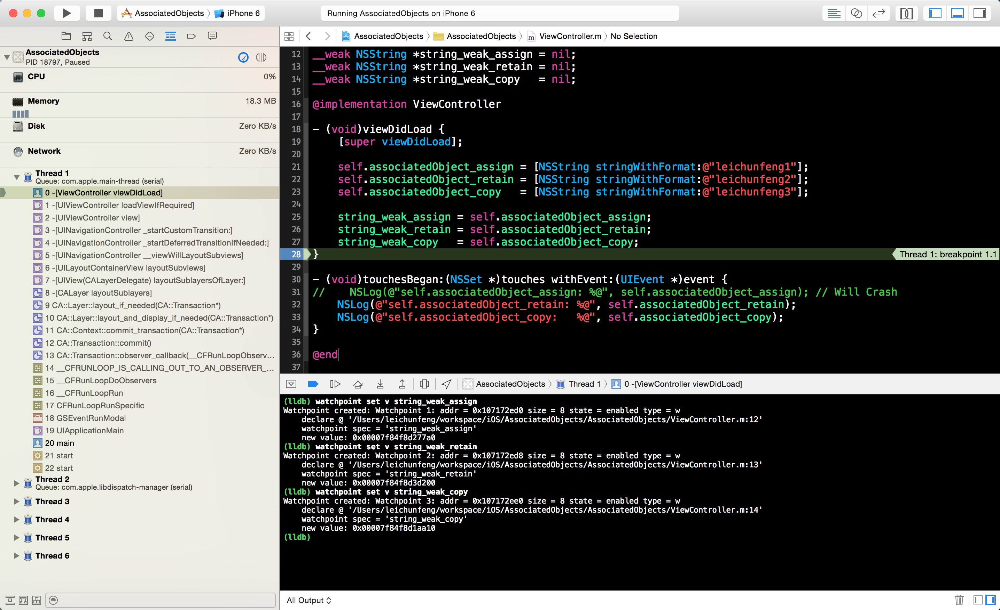

点击继续运行按钮，有一个观察点将被命中。我们先查看 `console` 中的输出，通过将这一步打印的 `old value` 和上一步的 `new value` 进行对比，我们可以知道本次命中的观察点是 `string_weak_assign` ，`string_weak_assign` 的值变成了`0x0000000000000000` ，也就是 `nil` 。换句话说 `self.associatedObject_assign`指向的对象已经被释放了，而通过查看左侧调用栈我们可以知道，这个对象是由于其所在的 `autoreleasepool` 被 `drain`
而被释放的，这与我前面的文章[《Objective-C Autorelease Pool 的实现原理》](http://blog.leichunfeng.com/blog/2015/05/31/objective-c-autorelease-pool-implementation-principle/)中的表述是一致的。**提示**，待会你也可以放开 `touchesBegan:withEvent:`中第 `31` 行的注释，在 `ViewController` 出现后，点击一下它的 `view` ，进一步验证一下这个结论。

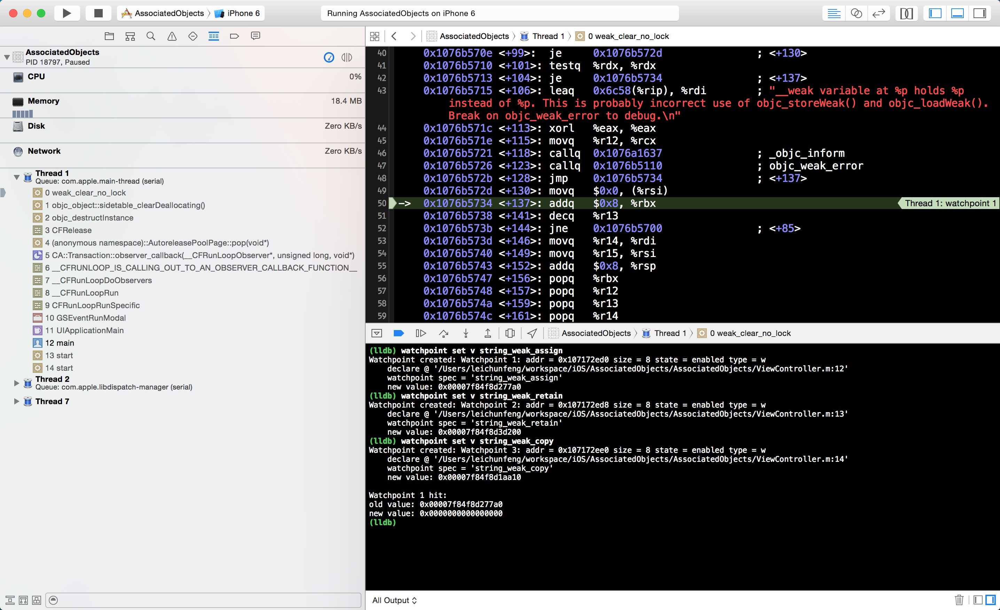

接下来，我们点击 `ViewController` 导航栏左上角的按钮，返回前一个界面，此时，又将有一个观察点被命中。同理，我们可以知道这个观察点是`string_weak_retain` 。我们查看左侧的调用栈，将会发现一个非常敏感的函数调用 `_object_remove_assocations`，调用这个函数后 `ViewController` 的所有关联对象被全部移除。最终，`self.associatedObject_retain`指向的对象被释放。

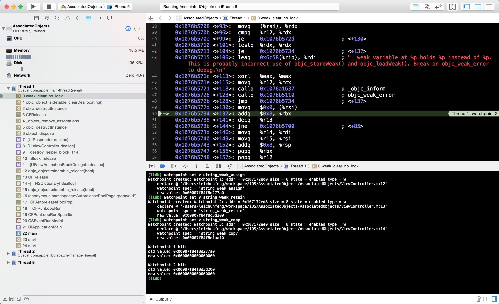

点击继续运行按钮，最后一个观察点 `string_weak_copy` 被命中。同理，`self.associatedObject_copy`指向的对象也由于关联对象的移除被最终释放。

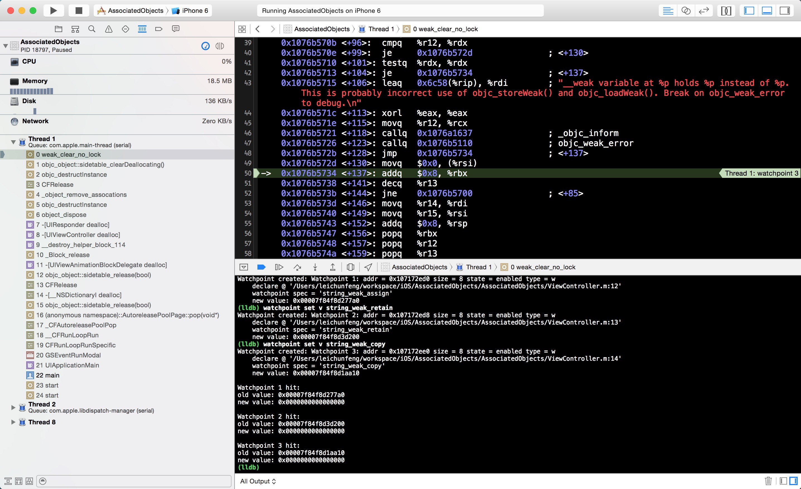

####结论

由这个实验，我们可以得出以下结论：

  1. 关联对象的释放时机与被移除的时机并不总是一致的，比如上面的 `self.associatedObject_assign` 所指向的对象在 `ViewController` 出现后就被释放了，但是 `self.associatedObject_assign` 仍然有值，还是保存的原对象的地址。如果之后再使用 `self.associatedObject_assign` 就会造成 Crash ，所以我们在使用弱引用的关联对象时要非常小心；
  2. 一个对象的所有关联对象是在这个对象被释放时调用的 `_object_remove_assocations` 函数中被移除的。

接下来，我们就一起看看 runtime 中的源码，来验证下我们的实验结论。

####objc_setAssociatedObject

我们可以在 `objc-references.mm` 文件中找到 `objc_setAssociatedObject` 函数最终调用的函数：
    
    void _object_set_associative_reference(id object, void *key, id value, uintptr_t policy) {
        // retain the new value (if any) outside the lock.
        ObjcAssociation old_association(0, nil);
        id new_value = value ? acquireValue(value, policy) : nil;
        {
            AssociationsManager manager;
            AssociationsHashMap &associations(manager.associations());
            disguised_ptr_t disguised_object = DISGUISE(object);
            if (new_value) {
                // break any existing association.
                AssociationsHashMap::iterator i = associations.find(disguised_object);
                if (i != associations.end()) {
                    // secondary table exists
                    ObjectAssociationMap *refs = i->second;
                    ObjectAssociationMap::iterator j = refs->find(key);
                    if (j != refs->end()) {
                        old_association = j->second;
                        j->second = ObjcAssociation(policy, new_value);
                    } else {
                        (*refs)[key] = ObjcAssociation(policy, new_value);
                    }
                } else {
                    // create the new association (first time).
                    ObjectAssociationMap *refs = new ObjectAssociationMap;
                    associations[disguised_object] = refs;
                    (*refs)[key] = ObjcAssociation(policy, new_value);
                    object->setHasAssociatedObjects();
                }
            } else {
                // setting the association to nil breaks the association.
                AssociationsHashMap::iterator i = associations.find(disguised_object);
                if (i !=  associations.end()) {
                    ObjectAssociationMap *refs = i->second;
                    ObjectAssociationMap::iterator j = refs->find(key);
                    if (j != refs->end()) {
                        old_association = j->second;
                        refs->erase(j);
                    }
                }
            }
        }
        // release the old value (outside of the lock).
        if (old_association.hasValue()) ReleaseValue()(old_association);
    }
    

在看这段代码前，我们需要先了解一下几个数据结构以及它们之间的关系：

  1. `AssociationsManager` 是顶级的对象，维护了一个从 `spinlock_t` 锁到 `AssociationsHashMap` 哈希表的单例键值对映射；
  2. `AssociationsHashMap` 是一个无序的哈希表，维护了从对象地址到 `ObjectAssociationMap` 的映射；
  3. `ObjectAssociationMap` 是一个 `C++` 中的 `map` ，维护了从 `key` 到 `ObjcAssociation` 的映射，即关联记录；
  4. `ObjcAssociation` 是一个 `C++` 的类，表示一个具体的关联结构，主要包括两个实例变量，`_policy` 表示关联策略，`_value` 表示关联对象。

每一个对象地址对应一个 `ObjectAssociationMap` 对象，而一个 `ObjectAssociationMap`
对象保存着这个对象的若干个关联记录。

弄清楚这些数据结构之间的关系后，再回过头来看上面的代码就不难了。我们发现，在苹果的底层代码中一般都会充斥着各种 `if else` ，可见写好 `if else` 后我们就距离成为高手不远了。开个玩笑，我们来看下面的流程图，一图胜千言：

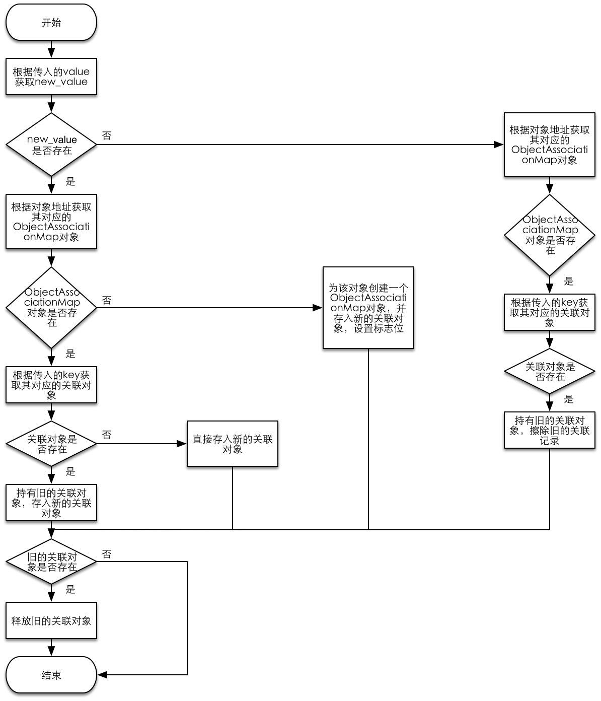

####objc_getAssociatedObject

同样的，我们也可以在 `objc-references.mm` 文件中找到 `objc_getAssociatedObject` 函数最终调用的函数：

       
    
    id _object_get_associative_reference(id object, void *key) {
        id value = nil;
        uintptr_t policy = OBJC_ASSOCIATION_ASSIGN;
        {
            AssociationsManager manager;
            AssociationsHashMap &associations(manager.associations());
            disguised_ptr_t disguised_object = DISGUISE(object);
            AssociationsHashMap::iterator i = associations.find(disguised_object);
            if (i != associations.end()) {
                ObjectAssociationMap *refs = i->second;
                ObjectAssociationMap::iterator j = refs->find(key);
                if (j != refs->end()) {
                    ObjcAssociation &entry = j->second;
                    value = entry.value();
                    policy = entry.policy();
                    if (policy & OBJC_ASSOCIATION_GETTER_RETAIN) ((id(*)(id, SEL))objc_msgSend)(value, SEL_retain);
                }
            }
        }
        if (value && (policy & OBJC_ASSOCIATION_GETTER_AUTORELEASE)) {
            ((id(*)(id, SEL))objc_msgSend)(value, SEL_autorelease);
        }
        return value;
    }
    

看懂了 `objc_setAssociatedObject` 函数后，`objc_getAssociatedObject`
函数对我们来说就是小菜一碟了。这个函数先根据对象地址在 `AssociationsHashMap` 中查找其对应的
`ObjectAssociationMap` 对象，如果能找到则进一步根据 `key` 在 `ObjectAssociationMap` 对象中查找这个`key` 所对应的关联结构 `ObjcAssociation` ，如果能找到则返回 `ObjcAssociation` 对象的 `value`值，否则返回 `nil` 。

####objc_removeAssociatedObjects

同理，我们也可以在 `objc-references.mm` 文件中找到 `objc_removeAssociatedObjects` 函数最终调用的函数：

    
    void _object_remove_assocations(id object) {
        vector< ObjcAssociation,ObjcAllocator<ObjcAssociation> > elements;
        {
            AssociationsManager manager;
            AssociationsHashMap &associations(manager.associations());
            if (associations.size() == 0) return;
            disguised_ptr_t disguised_object = DISGUISE(object);
            AssociationsHashMap::iterator i = associations.find(disguised_object);
            if (i != associations.end()) {
                // copy all of the associations that need to be removed.
                ObjectAssociationMap *refs = i->second;
                for (ObjectAssociationMap::iterator j = refs->begin(), end = refs->end(); j != end; ++j) {
                    elements.push_back(j->second);
                }
                // remove the secondary table.
                delete refs;
                associations.erase(i);
            }
        }
        // the calls to releaseValue() happen outside of the lock.
        for_each(elements.begin(), elements.end(), ReleaseValue());
    }
    

这个函数负责移除一个对象的所有关联对象，具体实现也是先根据对象的地址获取其对应的 `ObjectAssociationMap`对象，然后将所有的关联结构保存到一个 `vector` 中，最终释放 `vector`
中保存的所有关联对象。根据前面的实验观察到的情况，在一个对象被释放时，也正是调用的这个函数来移除其所有的关联对象。

####给类对象添加关联对象

看完源代码后，我们知道对象地址与 `AssociationsHashMap` 哈希表是一一对应的。那么我们可能就会思考这样一个问题，是否可以给类对象添加关联对象呢？答案是肯定的。我们完全可以用同样的方式给类对象添加关联对象，只不过我们一般情况下不会这样做，因为更多时候我们可以通过 `static`变量来实现类级别的变量。我在分类 `ViewController+AssociatedObjects` 中给 `ViewController`类对象添加了一个关联对象 `associatedObject` ，读者可以亲自在 `viewDidLoad` 方法中调用一下以下两个方法验证一下：

     
    + (NSString *)associatedObject;
    + (void)setAssociatedObject:(NSString *)associatedObject;
    

###总结

读到这里，相信你对开篇的那三个问题已经有了一定的认识，下面我们再梳理一下：

  1. 关联对象与被关联对象本身的存储并没有直接的关系，它是存储在单独的哈希表中的；
  2. 关联对象的五种关联策略与属性的限定符非常类似，在绝大多数情况下，我们都会使用 `OBJC_ASSOCIATION_RETAIN_NONATOMIC` 的关联策略，这可以保证我们持有关联对象；
  3. 关联对象的释放时机与移除时机并不总是一致，比如实验中用关联策略 `OBJC_ASSOCIATION_ASSIGN` 进行关联的对象，很早就已经被释放了，但是并没有被移除，而再使用这个关联对象时就会造成 Crash 。

在弄懂 Associated Objects 的实现原理后，可以帮助我们更好地使用它，在出现问题时也能尽快地定位问题，最后希望本文能够对你有所帮助。


