<!--BEGIN_DATA
{
    "create_date": "2016-06-01 21:34", 
    "modify_date": "2016-06-01 21:34", 
    "is_top": "0", 
    "summary": "Objective-C高级编程读书笔记", 
    "tags": "iOS", 
    "file_name": "Objective-C高级编程读书笔记.md"
}
END_DATA-->

###[Objective-C高级编程读书笔记之内存管理](http://www.jianshu.com/p/3fcdd5f492da)

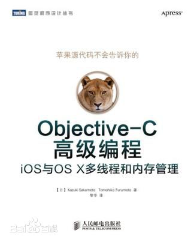  

Objective-C高级编程  
iOS与OS X多线程和内存管理

Objective-C高级编程读书笔记三部曲已经写完, 另外两篇如下 :  
[Objective-C高级编程读书笔记之blocks](http://www.jianshu.com/p/abeb5848b57a)  
[Objective-C高级编程读书笔记之GCD](http://www.jianshu.com/p/b259c882a540)

* * *

# 自动引用计数(ARC, Automatic Reference Counting)

> 目录

>

>   1. 什么是自动引用计数

>   2. 内存管理的思考方式

>   3. autorelease

>   4. 所有权修饰符介绍

>   5. ARC规则

>   6. ARC实现(所有权修饰符作用详解)

>   7. 如何获取引用计数值

>   8. 总结

* * *

#### 1\. 什么是自动引用计数

编译器自动帮你在合适的地方插入retain/release代码, 不用你手动输入.

#### 2\. 内存管理的思考方式

  * 自己生成的对象, 自己持有.
  * 非自己生成的对象, 自己也能持有.
  * 不再需要自己持有对象时释放.
  * 非自己持有的对象无法释放.

对象操作 Objective-C方法

生成并持有对象

alloc/new/copy/mutableCopy等方法

持有对象

retain方法

释放对象

release方法

废弃对象

dealloc方法

##### 非自己生成的对象, 自己也能持有

如 :

    
    
    id obj = [NSMutableArray array]; // 取得对象存在, 但自己并不持有对象  
    [obj retain]; // 自己持有对象

##### 不再需要自己持有对象时释放

如 :

    
    
    id obj = [[NSObject alloc] init]; // 自己持有对象  
    [obj autorelease]; // 取得的对象存在, 但自己不持有对象

##### 无法释放非自己持有的对象

如 :

    
    
    id obj = [NSMutableArray array]; // 取得对象存在, 但自己并不持有对象  
    [obj release]; // 释放了非自己持有的对象!会导致应用程序崩溃

  
永远不要去释放非自己持有的对象!  

    
    
    - 在Objective-C的对象中存有引用计数这一整数值  
    - 调用alloc/retain方法后, 引用计数+1  
    - 调用release后, 引用计数-1  
    - 引用计数为0时, 调用dealloc废弃对象

GNUstop将引用计数保存在对象占用内存块头部的结构体(struct obj_layout)变量(retained)中,
而苹果的实现则是采用散列表(引用计数表)来管理引用计数.

###### GNUstop的好处 :

  * 少量代码即可完成.
  * 能够统一管理引用计数用内存块与对象用内存块.

###### 苹果的好处 :

  * 对象用内存块的分配无需考虑内存块头部.
  * 引用计数表各记录中存有内存块地址, 可从各个记录追溯到各对象的内存块.

* * *

#### 3\. autorelease

每一个RunLoop对应一个线程, 每个线程维护一个autoreleasepool.

###### RunLoop开始 -> 创建autoreleasepool -> 线程处理事件循环 -> 废弃autoreleasepool ->
RunLoop结束 -> 等待下一个Loop开始

可以用以下函数来打印AutoreleasePoolPage的情况

    
    
    // 函数声明  
    extern void _objc_autoreleasePoolPrint();  
    // autoreleasepool 调试用输出开始  
    _objc_autoreleasePoolPrint();

NSAutoreleasePool类的autorelease方法已被重载, 因此调用NSAutoreleasePool对象的autorelease会报错.

* * *

#### 4\. 所有权修饰符

  * __strong
  * __weak
  * __unsafe_unretained
  * __autoreleasing

###### __strong

ARC中, id及其他对象默认就是__strong修饰符修饰  
MRC中, 使用__strong修饰符, 不必再次键入retain/release. 持有强引用的变量超出其作用域时被废弃, 随着强引用的失效,
引用的对象会随之释放.

###### __weak

解决循环引用问题. 并且弱引用的对象被废弃时, 则次弱引用将自动失效并等于nil

通过__weak变量访问对象实际上必定是访问注册到autoreleasepool的对象, 因为该修饰符只持有对象的弱引用, 在访问对象的过程中,
该对象可能被废弃, 如果把要访问的对象注册到autoreleasepool中, 那么在block结束之前都能确保该对象存在.

###### __unsafe_unretained

不安全的修饰符, 附有该修饰符的变量不属于编译器的内存管理对象. 该修饰符与__weak一样, 是弱引用,
并不能持有对象.并且访问该修饰符的变量时如果不能确保其确实存在, 则应用程序会崩溃!

###### __autoreleasing

对象赋值给__autoreleasing修饰的变量相当于MRC下手动调用autorelease方法.可理解为, ARC下用@autoreleasepool
block代替NSAutoreleasePool类, 用__autoreleasing修饰符的变量代替autorelease方法.  
但是, 显式使用__autoreleasing修饰符跟__strong一样罕见,

ps : id的指针或者对象的指针会被隐式附上__autoreleasing修饰符, 如 :  
id *obj == id __autoreleasing *obj;  
NSObject **obj == NSObject * __autoreleasing *obj;

* * *

##### 编译器特性

编译器会检查方法名是否以alloc/new/copy/mutableCopy开始,
如果不是则自动将返回值对象注册到autoreleasepool(init方法返回值对象不注册到autoreleasepool),
详情见下面ARC规则之<须遵循内存管理的方法命名规则>

* * *

#### 5\. ARC规则

  * 不能使用retain/release/retainCount/autorelease
  * 不能使用NSAllocateObject/NSDeallocateObject
  * 须遵循内存管理的方法命名规则
  * 不要显式调用dealloc(即不能手动调用的dealloc方法, 可以重载)
  * 使用@autoreleasepool block代替NSAutoreleasePool
  * 不能使用区域(NSZone)
  * 对象型变量不能作为C语言结构体(struct/union)的成员
  * 显式转换"id"和"void *"

##### 不能使用NSAllocateObject/NSDeallocateObject

alloc实现实际上是通过直接调用NSAllocateObject函数来生成并持有对象,
ARC下禁止使用NSAllocateObject函数与NSDeallocateObject函数.

##### 须遵循内存管理的方法命名规则

只有作为alloc/new/copy/mutableCopy方法的返回值取得对象,才能自己生成并持有对象,
其余情况均为"取得非自己生成并持有的对象"..以下为ARC下编译器偷偷帮我们实现的事.

    
    
    + (Person _)newPerson {  
        Person _person = [[Person alloc] init];  
        return person;  
        /* 该方法以new开始, 所以直接返回对象本身, 无需调用autorelease */  
    }  
    + (Person _)onePerson {  
        Person _person = [[Person alloc] init];  
        return person;  
        /* 该方法不以alloc/new/copy/mutableCopy开始, 所以返回的是[person autorelease] */  
    }  
    - (void)doSomething {  
        Person _personOne = [Person newPerson];  
        // ...  
        Person _personTwo = [Person onePerson];  
        // ...  
        /*  当方法结束时, ARC会自动插入[personOne release]. <想想是为什么?> */  
    }

ARC下还有一条命名规则

  * init

以init名称开始的方法必须是实例方法(对象方法), 并且要返回对象, 返回的对象不注册到autoreleasepool上.
实际上只是对alloc方法返回值的对象做初始化处理并返回该对象.

##### 不能使用区域(NSZone)

在现在的运行时系统中, NSZone已被忽视

##### 显式转换 id 和 void *

  * __bridge转换
  * __bridge_retained转换
  * __bridge_transfer转换

###### __bridge转换

单纯地转换, 不安全.

    
    
    id obj = [[NSObject alloc] init];  
    void *p = (__bridge void *)obj;  
    id o = (__bridge id)p;

###### __bridge_retained转换

可使要转换赋值的变量也持有所赋值的对象, 即

    
    
    id obj = [[NSObject alloc] init];  
    void *p = (__bridge_retained void *)obj;  
    // 相当于加上 [(id)p retain];

则obj与p同时持有该对象

###### __bridge_transfer转换

与__bridge_retained相反, 被转换的变量所持有的对象在该变量被赋值给转换目标变量后随之释放.

    
    
    id obj = [[NSObject alloc] init];  
    void *p = (__bridge_transfer void *)obj;  
    // 相当于加上 [(id)p retain]; [obj release];

###### 小结

__ bridge_retained转换与retain类似, __ bridge_transfer转换与release类似.
该两种转换多用于Foundation对象与Core Foundation对象之间的转换

* * *

##### 属性

    
    
     @property (nonatomic, strong) NSString *name;

在ARC下, 以下可作为这种属性声明中使用的属性来用.

属性声明的属性 所有权修饰符

assign

__unsafe_unretained修饰符

copy

__strong修饰符(但是赋值的是被复制的对象)

retain

__strong修饰符

strong

__strong修饰符

unsafe_unretained

__unsafe_unretained修饰符

weak

__weak修饰符

以上各种属性赋值给指定的属性中就相当于赋值给附加各属性对应的所有权修饰符的变量中.

* * *

#### 6\. ARC实现

ARC是由编译器+运行时库共同完成的.

##### __strong修饰符

    
    
    {  
        id __strong obj = [[NSObject alloc] init];  
    }  
    可转换为以下代码  
    id obj = objc_msgSend(NSObject, @selector(alloc));  
    objc_msgSend(obj, @selector(init));  
    objc_release(obj);
    
    
    {  
        id __strong obj = [NSMutableArray array];  
    }  
    可转换为以下代码  
    id obj = objc_msgSend(NSMutableArray, @selector(array));  
    objc_retainAutoreleasedReturnValue(obj);  
    objc_release(obj);

objc_retainAutoreleasedReturnValue函数主要用于最优化程序运行.
它是用来持有返回注册在autoreleasepool中对象的方法.这个函数是成对的, 另外一个objc_autoreleaseReturnValue函数则用
于alloc/new/copy/mutableCopy方法以外的类方法返回对象的实现上, 如下 :

    
    
    + (id)array  
    {  
        return [[NSMutableArray alloc] init];  
    }  
    可转换为以下代码  
    + (id)array  
    {  
        id obj = objc_msgSend(NSMutableArray, @selector(alloc));  
        objc_msgSend(obj, @selector(init));  
        return objc_autoreleaseReturnValue(obj);  
    }

那么objc_autoreleaseReturnValue函数和objc_retainAutoreleasedReturnValue函数有什么用?

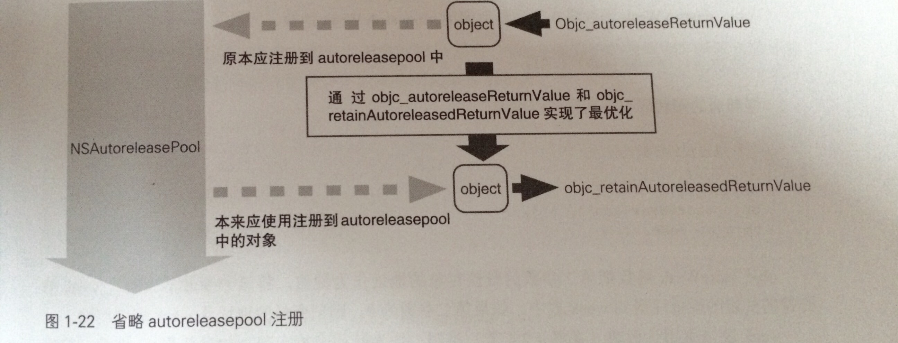  

省略autoreleasepool注册

可以这样来总结 :  
如果调用autorelease之后又紧接着调用retain的话, 这两部就显得多余, 所以以上两个函数就发挥其作用了.

  * 用objc_autoreleaseReturnValue函数替代autorelease, 该函数检测如果对象紧接着会调用retain, 他就不调用autorelease了(并设置一个标志)
  * 用objc_retainAutoreleasedReturnValue函数来替代retain, 该函数会检测对象的标志是否被设置, 如被设置, 则不调用retain; 反之则调用retain方法.

通过这两个函数能优化程序, 减少不必要的多余的操作.

##### __weak修饰符

  * 若附有__weak修饰符的变量所引用的对象被废弃, 则将nil赋值给该变量.
  * 使用附有__weak修饰符的变量, 即是使用注册到autoreleasepool中的对象.
    
    
    {  
        id __weak obj1 = obj;  
    }  
    可转换为以下代码  
    id obj1;  
    objc_initWeak(&obj1, obj);  
    objc_destroyWeak(&obj1);  
    也可转换为以下代码  
    id obj1;  
    obj1 = 0;  
    objc_storeWeak(&obj1, obj);  
    objc_storeWeak(&obj1, 0);

访问__weak变量时, 相当于访问注册到autoreleasepool的对象

    
    
    {  
        id __weak obj1 = obj;  
        NSLog(@"%@", obj1);  
    }  
    可转换为以下代码  
    id obj1;  
    objc_initWeak(&obj1, obj);  
    id tmp = objc_loadWeakRetained(&obj1);  
    objc_autorelease(tmp);  
    NSLog(@"%@", tmp);  
    objc_destroyWeak(&obj1);  
    // objc_loadWeakRetained函数取出附有__weak修饰符变量所引用对象并retain

需要注意的是, 通过__weak变量访问所引用的对象几次, 对象就被注册到autoreleasepool里几次.
(将附有__weak修饰符的变量赋值给附有__strong修饰符的变量后再使用可避免此问题)

##### __autoreleasing修饰符

将对象赋值给附有__autoreleasing修饰符的变量等同于MRC下调用对象的autorelease方法.

    
    
    @autoreleasepool{  
        id __autoreleasing obj = [[NSObject alloc] init];  
    }  
    可转换为以下代码  
    id pool = objc_autoreleasePoolPush();  
    id obj = objc_msgSend(NSObject, @selector(alloc));  
    objc_msgSend(obj, @selector(init));  
    objc_autorelease(obj);  
    objc_autoreleasePoolPop(pool);

那么调用alloc/new/copy/mutableCopy以外的方法会怎样呢?

    
    
    @autoreleasepool{  
        id __autoreleasing obj = [NSMutableArray array];  
    }  
    可转换为以下代码  
    id pool = objc_autoreleasePoolPush();  
    id obj = objc_msgSend(NSMutableArray, @selector(array));  
    objc_retainAutoreleasedReturnValue(obj);  
    objc_autorelease(obj);  
    objc_autoreleasePoolPop(pool);

可见注册autorelease的方法没有改变, 仍是objc_autorelease函数

##### 7\. 如何获取引用计数值

获取引用数值的函数  
uinptr_t _objc_rootRetainCount(id obj)

> \- (NSUInteger)retainCount;  
该方法返回的引用计数不一定准确, 因为有时系统会优化对象的释放行为, 在保留计数为1的时候就把它回收.
所以你用这个方法打印出来的引用计数可能永远不会出现0. 我们不应该根据retainCount来调试程序!!

* * *

# 8\. 总结

我们现在的工程几乎都运行在ARC下, 所以大部分内存管理代码都不需要我们自己写, 而由编译器帮我们搞定. 所以在ARC下我们只需要怎样不要去破坏这个生态即可

  * 避免循环引用(使用__weak修饰符)
  * 遵循ARC方法命名规则
  * 适时清空指针(赋值nil即可, 避免野指针错误)
  * 如用到Core Foundation对象, 则在dealloc方法中释放
  * 在dealloc方法中只释放引用并移除监听(不能在dealloc中开启异步任务)
  * 对于内存开销较大的资源, 如file descriptor, socket, 大块内存等应在不需要使用的时候调用close方法释放掉而不是在dealloc中处理.
  * 适当使用@autoreleasepool block来降低内存峰值(之前我写的一篇[文章](http://www.jianshu.com/p/5559bc15490d)中有demo)
  * 必要时开启"僵尸对象"调试内存管理问题

* * *

 

###[Objective-C高级编程读书笔记之blocks](http://www.jianshu.com/p/abeb5848b57a)

  

Objective-C高级编程  
iOS与OS X多线程和内存管理

Objective-C高级编程读书笔记三部曲已经写完, 另外两篇如下 :  
[Objective-C高级编程读书笔记之内存管理](http://www.jianshu.com/p/3fcdd5f492da)  
[Objective-C高级编程读书笔记之GCD](http://www.jianshu.com/p/b259c882a540)

* * *

###Blocks

[这里](http://blog.parse.com/learn/engineering/objective-c-blocks-
quiz/)有五道关于block的测试题, 大家可以去做做测试看看自己对block了解多少.

> 目录

>

>   1. Block的定义

>   2. Block有哪几种类型

>   3. Block特性

>   4. __block修饰符

>   5. block调用copy方法的内部实现

>   6. block的循环引用问题

>   7. 总结

* * *

### 1\. block的定义

block是Objective-C对于闭包的实现(闭包是一个函数<或者指向函数的指针>加上函数有关的自由变量).

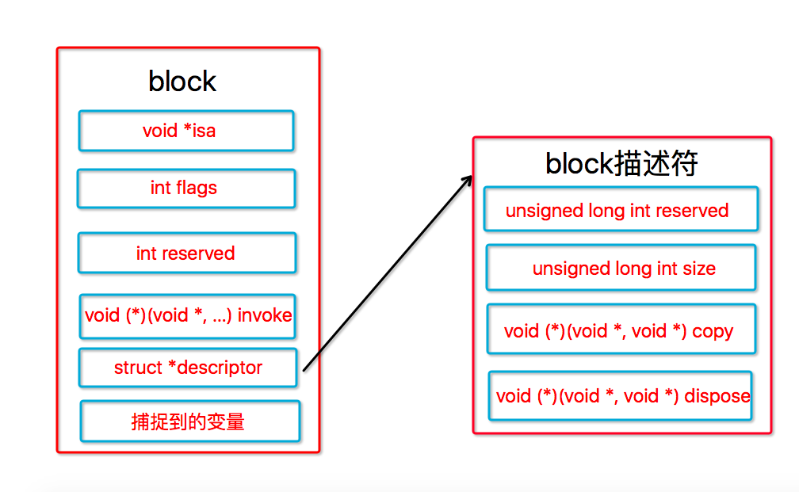  

block的数据结构

block也是对象, 以下对block结构体的成员作简单解释

  * isa : 指向Class对象的指针, 所有对象都有该指针
  * flags : 用于按 bit 位表示一些 block 的附加信息
  * reserved : 保留变量
  * invoke : 指向函数的指针, 指向block的实现代码
  * descriptor : 表示该 block 的附加描述信息，主要是 size 大小，以及 copy 和 dispose 函数的指针。
  * 捕捉到的变量 : 捕捉过来的变量，block 之所以能够访问它外部的局部变量，就是因为将这些变量（或对象的地址）拷贝到了结构体中。
  * copy : 用于保留捕获的对象
  * dispose : 用于释放捕获的对象

* * *

### 2\. block的类型

  * 全局块(_NSConcreteGlobalBlock)
  * 栈块(_NSConcreteStackBlock)
  * 堆块(_NSConcreteMallocBlock)

这三种block各自的存储域如下表

类 设置对象的存储域

_NSConcreteStackBlock

栈

_NSConcreteGlobalBlock

程序的数据区域(.data区)

_NSConcreteMallocBlock

堆

说明 :

  * 全局块存在于全局内存中, 相当于单例.
  * 栈块存在于栈内存中, 超出其作用域则马上被销毁
  * 堆块存在于堆内存中, 是一个带引用计数的对象, 需要自行管理其内存

#### 全局块(_NSConcreteGlobalBlock)

  * block定义在全局变量的地方
  * block没有截获任何自动变量

以上两个情况满足任意一个则该block为**全局块**, 全局块的生命周期贯穿整个程序, 相当于单例.

#### 栈块(_NSConcreteStackBlock)

只要不是全局块, 且block没有被copy, 就是栈块.栈块的生命周期很短, 当前作用域结束, 该block就被废弃.
要想在当前作用域以外的地方使用该block, 应该把该block从栈copy到堆上

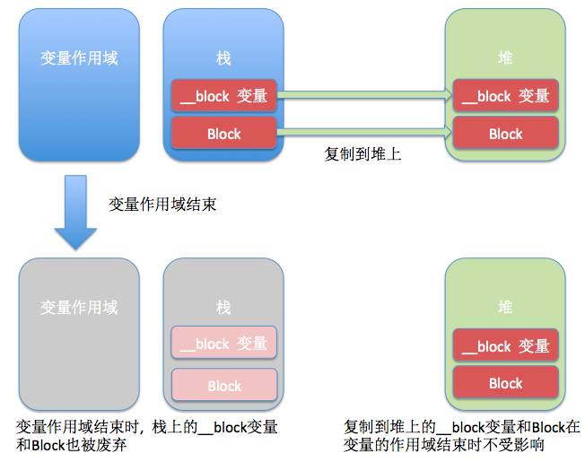  

从栈复制到堆上的Block与__block变量

#### 堆块(_NSConcreteMallocBlock)

简单来说, 栈块copy之后就变成堆块, 这简单吧~

#### ARC下的block类型

因为ARC下默认变量修饰符为__strong, 所以我们接触到的block几乎全是堆block和全局block.

    
    
    ARC下,  blk = block;  相当于  blk = [block copy];

* * *

### 3\. block特性

#### 1\. 截获自动变量值

> 1> 对于 block 外的变量引用，block 默认是将其复制到其数据结构中来实现访问的.
也就是说block的自动变量截获只针对block内部使用的自动变量, 不使用则不截获, 因为截获的自动变量会存储于block的结构体内部,
会导致block体积变大.

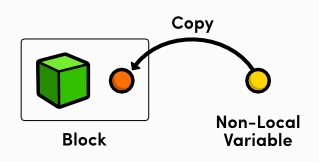  

拷贝

    
    
    int age = 10;  
    myBlock block = ^{  
        NSLog(@"age = %d", age);  
    };  
    age = 18;  
    block();

输出为  
`age = 10`

> 2> 对于用 __block 修饰的外部变量引用，block 是复制其引用地址来实现访问的.

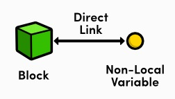  

引用地址

    
    
    __block int age = 10;  
    myBlock block = ^{  
        NSLog(@"age = %d", age);  
    };  
    age = 18;  
    block();

输出为  
`age = 18`

意味着对于第一种情况, 在block外部修改变量的值并不会应该block内部变量的值.而第二种情况则反之.  
并且第一种情况block内部不允许修改变量的值, 第二种情况下可以. (有例外, 静态变量, 静态全局变量,
全局变量即使不使用__block修饰符也可以在block内部修改其值)

#### 2\. 截获对象

<del>对象不同于自动变量, 就算对象不加上__block修饰符, 在block内部能够修改对象的属性.</del>  
block截获对象与截获自动变量有所不同.  
**堆块**会持有对象, 而不会持有__block修饰的对象, 而**栈块**永远不会持有对象, 为什么呢?

>   1. 堆块作用域不同于栈块, 堆块可以超出其作用域地方使用, 所以堆块结构体内部会保留对象的强指针, 保证堆块在生命周期结束之前都能访问对象.
而对于__block对象为什么不会持有呢? 原因很简单, 因为__block对象会跟随block被复制到堆中,
block再去引用堆中的__对象(后面会讲这个过程)..

>   2. 栈块只能在当前作用域下使用, 所以其内部不会持有对象. 因为不存在在作用域之外访问对象的可能(栈离开当前作用域立马被销毁)

* * *

#### 4\. __block修饰符

为什么__block修饰符修饰的变量就能够在block内部修改呢?? 原因在此  
利用

    
    
     clang -rewrite-objc 源代码文件名

便可揭开其神秘的面纱.

    
    
    __block int val = 10;  
    转换成  
    __Block_byref_val_0 val = {  
        0,  
        &val,  
        0,  
        sizeof(__Block_byref_val_0),  
        10  
    };

天哪! 一个局部变量加上__block修饰符后竟然跟block一样变成了一个__Block_byref_val_0结构体类型的自动变量实例.

此时我们在block内部访问val变量则需要通过一个叫**__forwarding**的成员变量来间接访问val变量(下面会对**__forwarding*
*进行详解)

* * *

### 5\. copy

block的copy操作究竟做了什么呢?

这里不得不提及__block变量的存储域

__block变量的配置存储域 block从栈复制到堆时的影响

栈

从栈复制到堆并被Block持有

堆

被Block持有

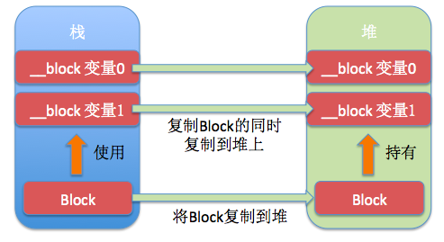  

Block中使用__block变量

由上图可知, 对一个栈块进行copy操作会连同block与__block变量(不管有没有使用)在内一同copy到堆上,
并且block会持有__block变量(使用).  
**ps : 堆上的block及__block变量均为对象, 都有各自的引用计数**

当然, 当block被销毁时, block持有的__block也会被释放

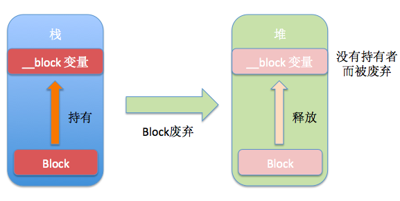  

Block废弃和__block变量的释放

到这里我们能知道, 此思考方式与Objective-C的引用计数内存管理完全相同.

那么有人就会问了, 既然__block变量也被复制到堆上去了, 那么访问该变量是访问栈上的还是堆上的呢?? **__forwarding**
终于要闪亮登场了

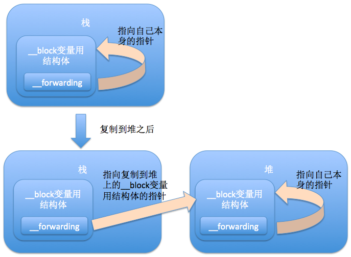  

复制__block变量

通过**__forwarding**, 无论实在block中, block外访问__block变量, 也不管该变量在栈上或堆上,
都能顺利地访问同一个__block变量.

* * *

### 什么时候我们需要手动对block调用copy方法

前面我们说到 : 要想在当前作用域以外的地方使用该block, 应该把该block从栈copy到堆上. 实际上, 在ARC下, 以下几种情况下,
编译器会帮我们把栈上的block复制到堆中

  * block作为函数返回值返回时
  * 将block赋值给__strong修饰符id类型或block类型成员变量时
  * 在方法名中含有usingBlock的Cocoa框架方法或GCD的API中传递block时

理论上我们只有把block作为函数/方法的参数传入时才需要对block进行copy操作.

我们对不同地方的block调用copy会产生什么效果呢?

Block的类 副本源的配置存储域 拷贝效果

_NSConcreteStackBlock

栈

从栈拷贝到堆

_NSConcreteGlobalBlock

程序的数据区域

什么也不做

_NSConcreteMallocBlock

堆

引用计数增加

所以, 不管block是什么类型, 在什么地方, 用copy方法都不会引起任何问题.如下表格所示. 就算是反复多次调用copy方法, 如

    
    
     blk = [[[[blk copy] copy] copy] copy];

该源码可解释如下 :

    
    
    {  
        block tmp = [blk copy]; // block被tmp持有  
        blk = tmp; // block被tmp和blk持有  
    }  
    // tmp超出作用域, 其指向的block也被释放, block被blk持有  
    {  
        block tmp = [blk copy]; // block被tmp和blk持有  
        blk = tmp; // blk指向的旧block释放, 并强引用新block, 最终block被tmp和blk持有  
    }  
    // tmp超出作用域, 其指向的block也被释放, block被blk持有  
    ...下面不断重复该过程

我们知道, 这只是一个循环的过程, block被tmp持有 -> block被tmp和blk持有 -> block被blk持有 ->
block被tmp和blk持有 -> ......

由此可得知, 在ARC下该代码也没有任何问题.

##### 总结 : 如果block需要给作用域外的地方使用, 但是你不知道需不需要copy, 那就copy吧. 反正不会错

* * *

### 6\. block的循环引用

这部分相信大家都清楚怎样做能破环, 所以我在这就只简单说两句

  * MRC下用__block可以避免循环引用(原因见上面block特性之截获自动变量值)
  * ARC下用__weak来避免循环引用

**这里需要提醒大家的是, 只有堆块(_NSConcreteMallocBlock)才可能会造成循环引用, 其他两种block不会**

* * *

###7\. Block总结 :

  * block相比函数更加方便, 高效, 苹果强烈推荐使用
  * ARC下编译器会帮助我们更好地管理block的生命周期
  * ARC下block属性声明为strong或copy其实都一样, 因为编译器内部会帮我们实现copy方法
  * 善用__weak(ARC)或__block(MRC)来避免循环引用

推荐几篇有关block的文章  
[谈Objective-C block的实现](http://blog.devtang.com/2013/07/28/a-look-inside-
blocks/)  
[让我们来深入简出block吧](http://www.jianshu.com/p/e03292674e60)

* * *

 

###[Objective-C高级编程读书笔记之GCD](http://www.jianshu.com/p/b259c882a540)

  

Objective-C高级编程  
iOS与OS X多线程和内存管理

Objective-C高级编程读书笔记三部曲已经写完, 另外两篇如下 :  
[Objective-C高级编程读书笔记之内存管理](http://www.jianshu.com/p/3fcdd5f492da)  
[Objective-C高级编程读书笔记之blocks](http://www.jianshu.com/p/abeb5848b57a)

* * *

###Grand Central Dispatch (GCD)

> 目录

>

>   1. 什么是GCD

>   2. 什么是多线程, 并发

>   3. GCD的优势

>   4. GCD的API介绍

>   5. GCD的注意点

>   6. GCD的使用场景

>   7. Dispatch Source

>   8. 总结

* * *

### 1\. 什么是GCD

GCD, Grand Central Dispatch, 可译为"强大的中枢调度器", 基于libdispatch, 纯C语言,
里面包含了许多多线程相关非常强大的函数. 程序员可以既不写一句线程管理的代码又能很好地使用多线程执行任务.

GCD中有**Dispatch Queue**和**Dispatch Source**. Dispatch Queue是主要的, 而Dispatch
Source比较次要. 所以这里主要介绍Dispatch Queue, 而Dispatch Source在下面会简单介绍.

#### Dispatch Queue

苹果官方对GCD的说明如下 :

> 开发者要做的只是定义想执行的任务并追加到适当的Dispatch Queue中.

这句话用源代码表示如下

    
    
    dispatch_async(queue, ^{  
        /*  
         * 想执行的任务  
         */  
    });

该源码用block的语法定义想执行的任务然后通过dispatch_async函数讲任务追加到赋值在变量queue的"Dispatch Queue"中.

##### Dispatch Queue究竟是什么???

Dispatch Queue是执行处理的等待队列, 按照先进先出(FIFO, First-In-First-Out)的顺序进行任务处理.

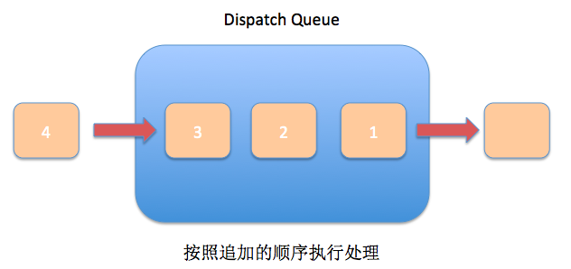  

First-In-First-Out

另外, 队列分两种, 一种是串行队列(Serial Dispatch Queue), 一种是并行队列(Concurrent Dispatch Queue).

Dispatch Queue的种类 说明

Serial Dispatch Queue

等待现在执行中处理结束

Concurrent Dispatch Queue

不等待现在执行中处理结束

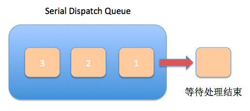  

串行队列

串行队列 : 让任务一个接一个执行

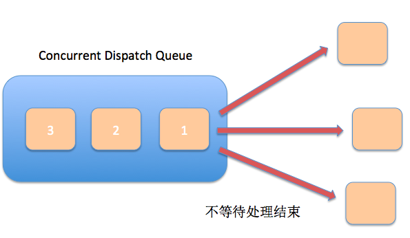  

并行队列

并发队列 : 让多个任务同时执行(自动开启多个线程执行任务)  
并发功能只有在异步函数(dispatch_async)下才有效(想想看为什么?)

GCD的API会在下面详细说明~

* * *

### 2\. 什么是多线程, 并发

我们知道, 一个应用就相当于一个进程, 而一个进程可以同时分发几个线程同时处理任务.而并发正是一个进程开启多个线程同时执行任务的意思,
主线程专门用来刷新UI,处理触摸事件等 而子线程呢, 则用来执行耗时的操作, 例如访问数据库, 下载数据等..

以前我们CPU还是单核的时候, 并不存在真正的线程并行, 因为我们只有一个核, 一次只能处理一个任务.
所以当时我们计算机是通过分时`也就是CPU地在各个进程之间快速切换, 给人一种能同时处理多任务的错觉`来实现的,
而现在多核CPU计算机则能真真正正货真价实地办到同时处理多个任务.

* * *

### 3\. GCD的优势

说到优势, 当然有比较, 才能显得出优势所在. 事实上, iOS中我们能使用的多线程管理技术有

  * pthread
  * NSThread
  * GCD
  * NSOperationQueue

#### pthread

来自Clang, 纯C语言, 需要手动创建线程, 销毁线程, 手动进行线程管理. 而且代码极其恶心,
我保证你写一次不想写第二次...不好意思我先去吐会T~T

#### NSThread :

Foundation框架下的OC对象, 依旧需要自己进行线程管理，线程同步。 线程同步对数据的加锁会有一定的开销。

#### GCD :

两个字, 牛逼, 虽然是纯C语言, 但是它用难以置信的非常简洁的方式实现了极其复杂的多线程编程, 而且还支持block内联形式进行制定任务. 简洁! 高效!
而且我们再也不用手动进行线程管理了.

#### NSOperationQueue :

相当于Foundation框架的GCD, 以面向对象的语法对GCD进行了封装. 效率一样高.

#### GCD优势在哪里?

  1. GCD会自动利用更多的CPU内核
  2. GCD会自动管理线程的生命周期
  3. 使用方法及其简单

怎么样? 心动不, 迫不及待想要知道怎么使用GCD了吧, 那我们马上切入正题~

* * *

### 4\. GCD的API介绍

在介绍GCD的API之前, 我们先搞清楚四个名词: 串行, 并行, 同步, 异步

  * 串行 : 一个任务执行完, 再执行下一个任务
  * 并行 : 多个任务同时执行
  * 同步 : 在**当前线程**中执行任务, **不具备**开启线程的能力
  * 异步 : 在**新的线程**中执行任务, **具备**开启线程的能力

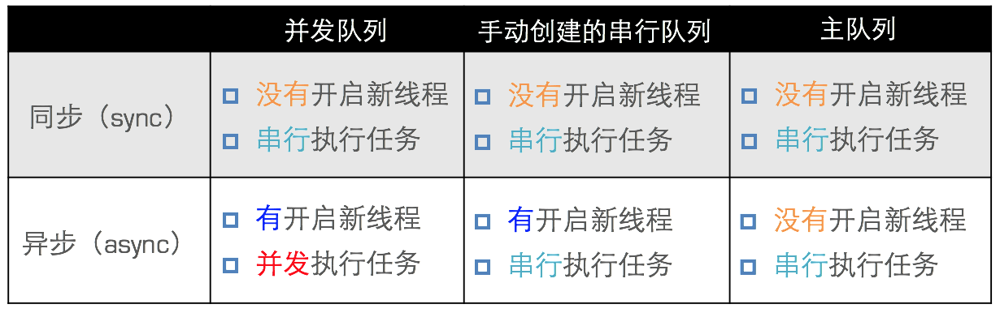  

串行, 并行, 同步, 异步的关系

下面开始介绍GCD的API

#### 创建队列

    
    
     dispatch_queue_create(const char *label, dispatch_queue_attr_t attr)

手动创建一个队列.

  * label : 队列的标识符, 日后可用来调试程序
  * attr : 队列类型  
DISPATCH_QUEUE_CONCURRENT : 并发队列  
DISPATCH_QUEUE_SERIAL 或 NULL : 串行队列

需要注意的是, 通过dispatch_queue_create函数生成的queue在使用结束后需要通过dispatch_release函数来释放.(只有在M
RC下才需要释放)

并不是什么时候都需要手动创建队列, 事实上系统给我们提供2个很常用的队列.

#### 主队列

    
    
    dispatch_get_main_queue();

该方法返回的是主线程中执行的同步队列. 用户界面的更新等一些必须在主线程中执行的操作追加到此队列中.

#### 全局并发队列

    
    
    dispatch_get_global_queue(long identifier, unsigned long flags);

该方法返回的是全局并发队列. 使用十分广泛.

  * identifier : 优先级  
DISPATCH_QUEUE_PRIORITY_HIGH : 高优先级  
DISPATCH_QUEUE_PRIORITY_DEFAULT : 默认优先级  
DISPATCH_QUEUE_PRIORITY_LOW : 低优先级  
DISPATCH_QUEUE_PRIORITY_BACKGROUND : 后台优先级

  * flags : 暂时用不上, 传 **0** 即可

**注意 : 对Main Dispatch Queue和Global Dispatch Queue执行dispatch_release和dispatch_retain没有任何问题. (MRC)**

#### 同步函数

    
    
    dispatch_sync(dispatch_queue_t queue, ^(void)block);

在参数queue队列下同步执行block

#### 异步函数

    
    
    dispatch_async(dispatch_queue_t queue, ^(void)block);

在参数queue队列下异步执行block(开启新线程)

#### 时间

    
    
    dispatch_time(dispatch_time_t when, int64_t delta);

根据传入的时间(when)和延迟(delta)计算出一个未来的时间

  * when :  
DISPATCH_TIME_NOW : 现在  
DISPATCH_TIME_FOREVER : 永远(别传这个参数, 否则该时间很大)

  * delta : 该参数接收的是纳秒, 可以用一个宏**NSEC_PER_SEC**来进行转换, 例如你要延迟3秒, 则为 3 * NSEC_PER_SEC. 

#### 延迟执行

    
    
    dispatch_after(dispatch_time_t when, dispatch_queue_t queue, ^(void)block);

有了上述获取时间的函数, 则可以直接把时间传入, 然后定义该延迟执行的block在哪一个queue队列中执行.

苹果还给我们提供了一个在主队列中延迟执行的代码块, 如下

    
    
    dispatch_after(dispatch_time(DISPATCH_TIME_NOW, (int64_t)(delayInSeconds * NSEC_PER_SEC)), dispatch_get_main_queue(), ^{  
                code to be executed after a specified delay  
            });

我们只需要传入需要延迟的秒数(delayInSeconds)和执行的任务block就可以直接调用了, 方便吧~

**注意 : 延迟执行不是在指定时间后执行任务处理, 而是在指定时间后将处理追加到队列中, 这个是要分清楚的**

#### 队列组

    
    
     dispatch_group_create();

有时候我们想要在队列中的多个任务都处理完毕之后做一些事情, 就能用到这个Group. 同队列一样,
Group在使用完毕也是需要dispatch_release掉的(MRC). 上代码

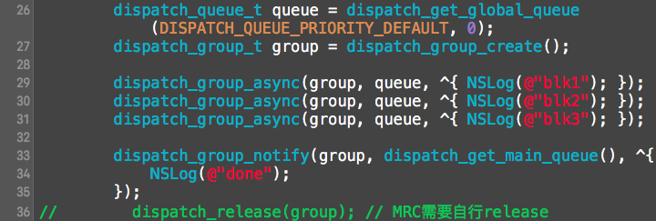  

group

#### 组异步函数

    
    
    dispatch_group_async(dispatch_group_t group, dispatch_queue_t queue, ^(void)block);

分发Group内的并发异步函数

#### 组通知

    
    
     dispatch_group_notify(dispatch_group_t group, dispatch_queue_t queue, ^(void)block)

监听group的任务进度, 当group内的任务全部完成, 则在queue队列中执行block.

#### 组等待

    
    
     dispatch_group_wait(dispatch_group_t group, dispatch_time_t timeout)

  * timeout : 等待的时间  
DISPATCH_TIME_NOW : 现在  
DISPATCH_TIME_FOREVER : 永远

该函数会一直等待组内的异步函数任务全部执行完毕才会返回. 所以该函数会卡住当前线程. 若参数timeout为DISPATCH_TIME_FOREVER,
则只要group内的任务尚未执行结束, 就会一直等待, 中途不能取消.

#### 栅栏

    
    
     dispatch_barrier_async(dispatch_queue_t queue, ^(void)block)

在访问数据库或文件时, 为了提高效率, 读取操作放在并行队列中执行. 但是写入操作必须在串行队列中执行(避免资源抢夺问题). 为了避免麻烦,
此时dispatch_barrier_async函数作用就出来了, 在这函数里进行写入操作, 写入操作会等到所有读取操作完毕后, 形成一道栅栏,
然后进行写入操作, 写入完毕后再把栅栏移除, 同时开放读取操作. 如图

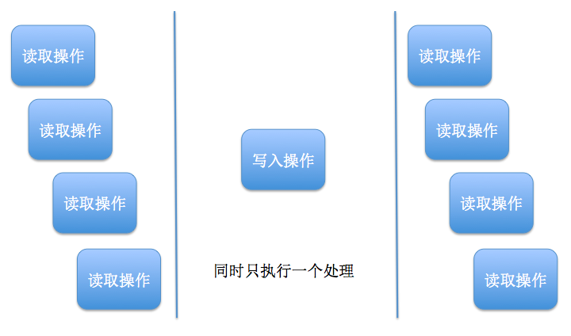  

dispatch_barrier_async

#### 快速迭代

    
    
    dispatch_apply(10, dispatch_get_global_queue(0, 0), ^(size_t index){  
        // code here  
    });

执行10次代码, index顺序不确定. dispatch_apply会等待全部处理执行结束才会返回. 意味着dispatch_apply会阻塞当前线程.
所以dispatch_apply一般用于异步函数的block中.

#### 一次性代码

    
    
    static dispatch_once_t onceToken;  
    dispatch_once(&onceToken, ^{  
    // 只执行1次的代码(这里面默认是线程安全的)  
    });

该代码在整个程序的生命周期中只会执行一次.

#### 挂起和恢复

    
    
     dispatch_suspend(queue)

挂起指定的queue队列, 对已经执行的没有影响, 追加到队列中尚未执行的停止执行.

    
    
     dispatch_resume(queue)

恢复指定的queue队列, 使尚未执行的处理继续执行.

### 5\. GCD的注意点

因为在ARC下, 不需要我们释放自己创建的队列, 所以GCD的注意点就剩下**死锁**

##### 死锁

    
    
    NSLog(@"111");  
    dispatch_sync(dispatch_get_main_queue(), ^{  
        NSLog(@"222");  
    });  
    NSLog(@"333");

以上三行代码将输出什么?  
`111`  
`222`  
`333` ?  
还是  
`111`  
`333` ?  
其实都不对, 输出结果是  
`111`

为什么? 看下图

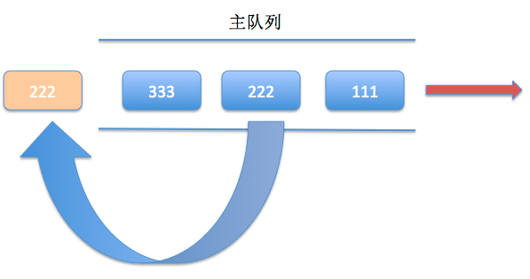  

死锁

毫无疑问会先输出111, 然后在当前队列下调用dispatch_sync函数, dispatch_sync函数会把block追加到当前队列上,
然后等待block调用完毕该函数才会返回, 不巧的是, block在队列的尾端, 而队列正在执行的是dispatch_sync函数. 现在的情况是,
block不执行完毕, dispatch_sync函数就不能返回, dispatch_sync不返回, 就没机会执行block函数. 这种你等我,
我也等你的情况就是**死锁**, 后果就是大家都执行不了, 当前线程卡死在这里.

##### 如何避免死锁?

不要在当前队列使用同步函数, 在队列嵌套的情况下也不允许. 如下图,

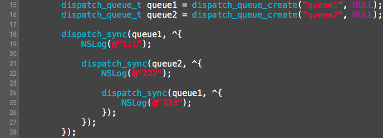  

队列嵌套调用同步函数引发死锁

大家可以想象, 队列1执行完NSLog后到队列2中执行NSLog, 队列2执行完后又跳回队列1中执行NSLog, 由于都是同步函数,
所以最内层的NSLog("333"); 追加到队列1中, 实际上最外层的dispatch_sync是还没返回的, 所以它没有执行的机会. 也形成死锁.
运行程序, 果不其然, 打印如下 :  
`111`  
`222`

### 6\. GCD的使用场景

##### 线程间的通信

这是GCD最常用的使用场景了, 如下代码

    
    
    dispatch_async(dispatch_get_global_queue(DISPATCH_QUEUE_PRIORITY_DEFAULT, 0), ^{  
        // 执行耗时操作  
        dispatch_async(dispatch_get_main_queue(), ^{  
            // 回到主线程作刷新UI等操作  
        });  
    });

为了不阻塞主线程, 我们总是在后台线程中发送网络请求, 处理数据, 然后再回到主线程中刷新UI界面

##### 单例

单例也就是在程序的整个生命周期中, 该类有且仅有一个实例对象, 此时为了保证只有一个实例对象, 我们这里用到了dispatch_once函数

    
    
    static XXTool __instance;  
    + (instancetype)allocWithZone:(struct _NSZone _)zone  
    {  
        static dispatch_once_t onceToken;  
        dispatch_once(&onceToken, ^{  
            _instance = [self allocWithZone:zone];  
        });  
        return _instance;  
    }  
    + (instancetype)sharedInstance  
    {  
        static dispatch_once_t onceToken;  
        dispatch_once(&onceToken, ^{  
            _instance = [[self alloc] init];  
        });  
        return _instance;  
    }  
    - (id)copy  
    {  
        return _instance;  
    }  
    - (id)mutableCopy  
    {  
        return _instance;  
    }

因为alloc内部会调用allWithZone, 所以我们重写allocWithZone方法就行了. 通过以上代码可以保证程序只能创建一个实例对象,
并且该实例对象永远存在程序中.

##### 同步队列和锁

我们知道, 属性中有atomic和nonatomic属性

  * atomic : setter方法线程安全, 需要消耗大量的资源
  * nonatomic : setter方法非线程安全, 适合内存小的移动设备

为了实现属性线程安全, 避免资源抢夺的问题, 我们也许会这样写

    
    
    - (NSString *)setMyString:(NSString *)myString  
    {  
        @synchronized(self) {  
            _myString = myString;  
        }  
    }

这种方法没错是可以达到该属性线程安全的需求, 但是试想一下, 如果一个对象中有许多个属性都需要保证线程安全, 那么就会在self对象上频繁加锁,
那么两个毫无关系的setter方法就有可能执行一个setter方法需要等待另一个setter方法执行完毕解锁之后才能执行, 这样做毫无必要.
那么你有可能会说, 在每个方法内部创建一个锁对象就好啦, 不过你不觉得这样会浪费资源吗?

那么能不能利用队列, 实现getter方法可以并发执行, 而setter方法串行执行并且setter和getter不能并发执行呢??? 没错,
我们这里用到了dispatch_barrier_async函数.

    
    
    - (NSString _)myString  
    {  
        __block NSString _localMyString = nil;  
        dispatch_sync(dispatch_get_global_queue(DISPATCH_QUEUE_PRIORITY_DEFAULT, 0), ^{  
            localMyString = self.myString;  
        });  
        return localMyString;  
    }  
    - (void)setMyString:(NSString *)myString  
    {  
        dispatch_barrier_async(dispatch_get_global_queue(DISPATCH_QUEUE_PRIORITY_DEFAULT, 0), ^{  
            _myString = myString;  
        });  
    }

这里利用了栅栏块必须单独执行, 不能与其他块并行的特性, 写入操作就必须等当前的读取操作都执行完毕, 然后单独执行写入操作,
等待写入操作执行完毕后再继续处理读取.

### 7\. Dispatch Source

它是BSD系内核惯有功能kqueue的包装. kqueue的CPU负荷非常小, 可以说是应用程序处理XNU内核中发生的各种事件的方法中最优秀的一种.

但是由于Dispatch Source实在是太少人用了, 所以这里不再介绍. 感兴趣的朋友们可以自行Google.

### 8\. 总结

  * GCD可进行线程间通信
  * GCD可以办到线程安全
  * GCD可用于延迟执行
  * GCD需要注意死锁问题(不要在当前队列调用同步函数)

想再往深了解并发编程, 可以看看这篇文章  
[并发编程 : API及挑战](http://objccn.io/issue-2-1/)

