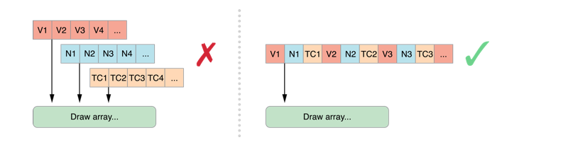
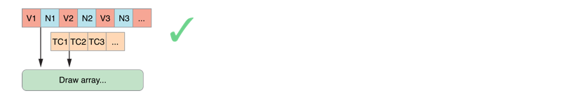
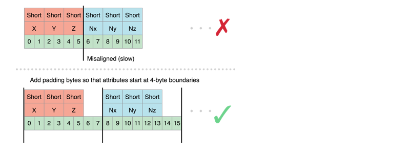
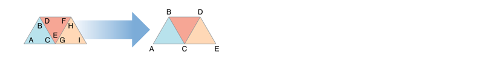
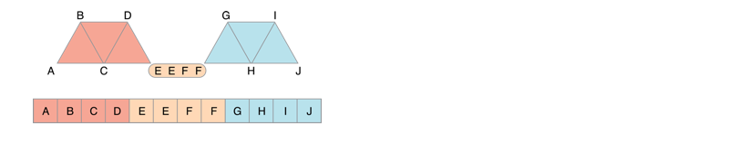
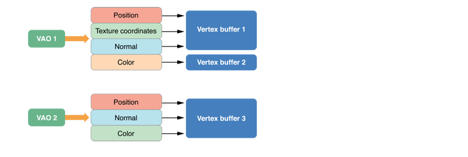
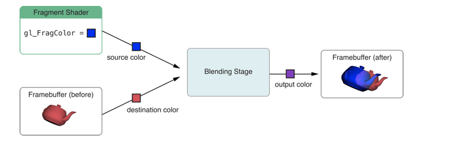
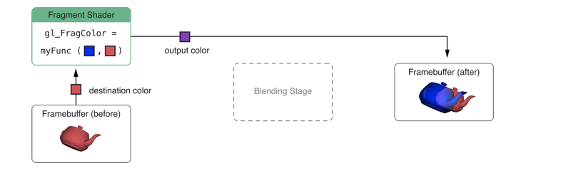
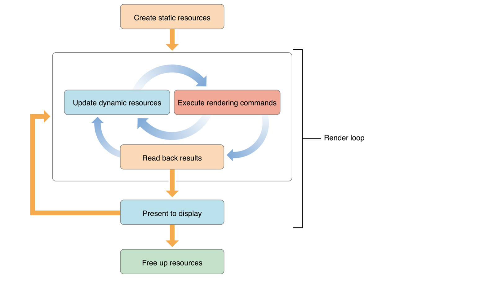

 
<!--BEGIN_DATA
{
    "create_date": "2020-07-25 17:16", 
    "modify_date": "2020-07-25 17:16", 
    "is_top": "0", 
    "summary": "OpenGL ES小结", 
    "tags": "OpenGL、iOS", 
    "file_name": "OpenGL ES小结.md"
}
END_DATA-->

####<p>原文出处：<a href='https://www.cnblogs.com/linganxiong/p/9098177.html' target='blank'>OpenGL ES小结</a></p>

OpenGL ES （Open Graphics Library for Embedded Systems）是访问类似 iPhone 和 iPad 的现代嵌入式系统的 2D 和 3D 图形加速硬件的标准。

把程序提供的几何数据转换为屏幕上的图像的过程叫做渲染。

GPU 控制的缓存是高效渲染的关键。容纳几何数据的缓存定义了要渲染的点、线段和三角形。

OpenGL ES 3D 的默认坐标系、顶点和矢量为几何数据的描述提供了数学基础。

渲染的结果通常保存在帧缓存中。有两个特别的帧缓存，前帧缓存和后帧缓存，它们控制着屏幕像素的最终颜色。

OpenGL ES 的上下文保存了 OpenGL ES 的状态信息，包括用于提供渲染数据的缓存地址和用于接收渲染结果的缓存地址。


OpenGL ES 是 OpenGL 的子集，它移除了 OpenGL 中冗余的函数，使其更易学也更容易在移动图形硬件中实现。OpenGL ES 是基于 C 语言的 API ，所以可以无缝移植到 Objective--C 中，然后通过创建上下文来接收命令和操纵帧缓存。

在 iOS 中，使用 OpenGL ES 时，可以使用 GLKit 框架中的 GLKView 将 OpenGL ES 绘制的内容渲染到屏幕上，并且可以使用GLKViewController 来管理 GLKView 视图。另外，还可以使用 CAEAGLLayer图层将动画与视图相结合。但是，需要注意的是，当应用处于后台状态时，不能调用 OpenGL ES 中的函数，否则应用便会被终止，而且 OpenGL ES 中的上下文也不支持在同一时刻被不同的线程访问。

###在 iOS 中使用 OpenGL ES

OpenGL ES 定义了跨平台的接口来使用 GPU的硬件性能加速图形的渲染，其中由渲染上下文来执行渲染命令，帧缓存存储渲染结果，渲染目标显示帧缓存中结果。对应到 iOS 中，EAGLContext是实现上下文的类，GLKView 和 CAEAGLLayer 则用来显示最终的渲染结果。

使用 OpenGL ES 之前，需要明确自己要使用哪个版本的 OpenGL ES 。目前最新的版本是 3.0 ，相较于 iOS 7.0 之前的 2.0版本，添加了一些新的特性，包含原本只在桌面系统中有效的技术，使得 GPU 的性能能够更好的发挥出来。

####EAGLContext

在 iOS 中，要想使用 OpenGL ES 中的函数必须要先创建一个 EAGLContext实例对象，该对象表示渲染上下文。对于每一个线程都只能对应一个上下文，可以调用 EAGLContext的类方法设置或获取当前上下文。在同一个线程中切换不同的上下文时，需要注意应用应自己对上下文进行强引用以防止其被释放，并且在切换之前应调用 glFlush函数将当前上下文提交的指令传到图形硬件中去。

使用下面的方法设置或获取当前上下文：


```
+ (BOOL)            setCurrentContext:(EAGLContext*) context;
+ (EAGLContext*)    currentContext;
```

对于不同的设备，其支持的 OpenGL ES 版本也不同，所以在创建上下文时，如果返回的值为 nil 那么表示设备不支持指定版本的 OpenGL ES 。


```
- (instancetype) initWithAPI:(EAGLRenderingAPI) api;
- (instancetype) initWithAPI:(EAGLRenderingAPI) api sharegroup:(EAGLSharegroup*) sharegroup NS_DESIGNATED_INITIALIZER;
```

创建上下文时需要指定 OpenGL ES 的版本，并且这里上下文的状态与上下文对象是分离的，其状态都保存在 EAGLSharegroup 实例对象中，该对象是透明的，不应该主动创建该类的实例。这种设计方式是为了节约系统资源，对于不同的上下文可能拥有相同的上下文状态，那么这种设计方式便十分便利。如，需要在子线程中加载数据，在主线程中进行渲染，那么当数据加载完成后，可以直接将子线程中上下文的状态绑定到主线程上下文中。

####GLKView

GLKView 类为 OpenGL ES 上下文提供了渲染结果的显示视图，在创建一个 GLKView 视图之后，需要将其与一个上下文相绑定。


```
- (instancetype)initWithFrame:(CGRect)frame context:(EAGLContext *)context;
```

同在 UIView 视图中绘制图形一样，可以通过继承 GLKView 类重写 drawRect: 方法来进行图形的绘制。另一种方式不用创建子类，直接设置GLKView 的代理，实现协议 GLKViewDelegate 中的代理方法。


```
- (void)glkView:(GLKView *)view drawInRect:(CGRect)rect;
```

> 当重写 drawRect: 时，代理方法不会被执行。


####GLKViewController

使用 GLKViewController 类可以管理 GLKView 视图，两者通常配合使用。

设置该类的 preferredFramesPerSecond 属性值可以指定每秒钟刷新的帧数，但是实际帧的刷新频率可能并不与之相等。

设置该类的代理对象 delegate ，该代理需要实现 GLKViewControllerDelegate 协议。


```
//如果 GLKViewController 被继承，并且实现了 -(void)update 方法，那么该代理方法不会被调用。
- (void)glkViewControllerUpdate:(GLKViewController *)controller;
//当暂停状态发生改变时，调用该方法。
- (void)glkViewController:(GLKViewController *)controller willPause:(BOOL)pause;
```

###渲染目标

帧缓存接收渲染命令，在应用中，配置不同帧缓存，实现不同的目的。

* 渲染离屏图像，与帧缓存相关联的所有配置都以渲染缓存的形式存在。

**1. 创建帧缓存并绑定**


```
GLuint framebuffer;
glGenFramebuffers(1,&framebuffer);
glBindFramebuffer(GL_FRAMEBUFFER, framebuffer); 
```

**2. 创建颜色渲染缓存并绑定**


```
GLuint colorRenderbuffer;
glGenRenderbuffers(1, &colorRenderbuffer);
glBindRenderbuffer(GL_RENDERBUFFER, colorRenderbuffer);
glRenderbufferStorage(GL_RENDERBUFFER, GL_RGBA8, width, height);
glFramebufferRenderbuffer(GL_FRAMEBUFFER, GL_COLOR_ATTACHMENT0, GL_RENDERBUFFER, colorRenderbuffer);
```

**3. 创建渲染深度并绑定**


```
GLuint depthRenderbuffer;
glGenRenderbuffers(1, &depthRenderbuffer);
glBindRenderbuffer(GL_RENDERBUFFER, depthRenderbuffer);
glRenderbufferStorage(GL_RENDERBUFFER, GL_DEPTH_COMPONENT16, width, height);
glFramebufferRenderbuffer(GL_FRAMEBUFFER, GL_DEPTH_ATTACHMENT, GL_RENDERBUFFER, depthRenderbuffer);
```

**4. 判断帧缓存配置是否完成**


```
//配置状态改变时，需要重新判断
GLenum status = glCheckFramebufferStatus(GL_FRAMEBUFFER) ;
if(status != GL_FRAMEBUFFER_COMPLETE) {
    NSLog(@"failed to make complete framebuffer object %x", status);
}
```

当渲染结束后，使用 glReadPixels 函数读取像素值，进行其他的处理。


* 渲染纹理


**1. 创建帧缓存并绑定（同上）**

**2. 创建纹理缓存并绑定**


```
GLuint texture;
glGenTextures(1, &texture);
glBindTexture(GL_TEXTURE_2D, texture);
glTexParameteri(GL_TEXTURE_2D, GL_TEXTURE_MIN_FILTER, GL_LINEAR);
glTexImage2D(GL_TEXTURE_2D, 0, GL_RGBA8,  width, height, 0, GL_RGBA, GL_UNSIGNED_BYTE, NULL);
glFramebufferTexture2D(GL_FRAMEBUFFER, GL_COLOR_ATTACHMENT0, GL_TEXTURE_2D, texture, 0);
```

**3. 创建渲染深度并绑定（同上）**

**4. 判断帧缓存配置是否完成（同上）**

可见，纹理渲染只是在离屏渲染操作中改变了颜色的设置

* 渲染动画图层


要将 OpenGL ES 渲染缓存中的内容显示在设备上，需要通过 CAEAGLLayer图层类。该类提供了一个共享的内存空间给渲染缓存，并且负责将渲染缓存中的内容插入到动画图层中。


**1. 创建 CAEAGLLayer 类的实例对象，并设置属性**


* presentsWithTransaction 设置图层刷新的方式，默认 false 则异步刷新到图层，设置为 true 则以标准的 CATransaction 机制将内容发送到屏幕进行显示。
* drawableProperties 该属性是在协议 EAGLDrawable 中进行声明的，通过一个字典来改变渲染的像素的格式以及内容显示后是否仍然被引用，其可能的键值如下：   
* kEAGLDrawablePropertyRetainedBacking 对应的值为 NSNumber（boolean）
* kEAGLDrawablePropertyColorFormat 可能的值为 kEAGLColorFormatRGBA8 、kEAGLColorFormatRGB565 、kEAGLColorFormatSRGBA8


**2. 创建一个 OpenGL ES 上下文，并设置为当前上下文**

**3. 创建帧缓存**

**4. 创建颜色渲染缓存，而后调用上下文的方法 renderbufferStorage:fromDrawable: 来为渲染缓存创建内存**


```
GLuint colorRenderbuffer;
glGenRenderbuffers(1, &colorRenderbuffer);
glBindRenderbuffer(GL_RENDERBUFFER, colorRenderbuffer);
[myContext renderbufferStorage:GL_RENDERBUFFER fromDrawable:myEAGLLayer];
glFramebufferRenderbuffer(GL_FRAMEBUFFER, GL_COLOR_ATTACHMENT0, GL_RENDERBUFFER, colorRenderbuffer);
```

**5. 需要注意的是，当动画图层大小或属性发生改变时，渲染内存应重新分配，否则渲染结果可能会被缩放以覆盖整个图层。**

**6. 获取实际的颜色渲染缓存的宽高**


```
GLint width;
GLint height;
glGetRenderbufferParameteriv(GL_RENDERBUFFER, GL_RENDERBUFFER_WIDTH, &width);
glGetRenderbufferParameteriv(GL_RENDERBUFFER, GL_RENDERBUFFER_HEIGHT, &height);
```

**7. 对于不是明确指定的颜色缓存内存的大小，需要使用该方式获取实际的缓存大小，其他渲染缓存要与此保持大小一致。**

**8. 创建渲染深度并绑定（同上）**

**9. 判断帧缓存配置是否完成（同上）**

**10. 将 CAEAGLLayer 图层插入到可见的动画图层中**


###绘制帧

当创建并配置好了一个帧缓存后，接下来的任务就是填满整个帧。首先要确认的是绘制帧的时机，一种是需要显示 OpenGL ES 的内容时，进行绘制，如同使用GLKit 框架时，绘制总是在视图要显示时进行。另一种是与动画循环同步，使用 CADisplayLink 类实例对象可以实现绘制与屏幕刷新频率同步。

使用 UIScreen 的实例方法，获取一个与屏幕刷新频率一致的 CADisplayLink 实例对象。


```
- (nullable CADisplayLink *)displayLinkWithTarget:(id)target selector:(SEL)sel NS_AVAILABLE_IOS(4_0);
```

而后调用 CADisplayLink 的实例方法，将指定的方法添加到当前循环中。


```
- (void)addToRunLoop:(NSRunLoop *)runloop forMode:(NSRunLoopMode)mode;
```

另外，可以根据需要调整指定方法的调用频率，只要修改 CADisplayLink 的属性 frameInterval 或preferredFramesPerSecond 值即可。但是，frameInterval（已废弃）的值指的是刷新多少次才触发一次刷新方法，如设置该值为 5，那么对于 60Hz 的屏幕刷新频率而言，刷新方法的调用频率为 12Hz 。preferredFramesPerSecond则是直接表示指定方法每秒钟的调用次数，即帧的刷新频率。

**1. 清空缓存**

在绘制每一帧之前，清空帧中一些不需要的信息，防止其被绘制到下一帧中，从而提高性能。


```
glBindFramebuffer(GL_FRAMEBUFFER, framebuffer);
glClear(GL_DEPTH_BUFFER_BIT | GL_COLOR_BUFFER_BIT);
```

**2. 准备需要的资源并提交到 GPU 后，执行绘制命令进行帧的绘制**

**3. 如果采用多重采样改善图片的质量，需要在其显示之前完成像素的处理**

**4. 当渲染的内容显示后，那么一些缓存数据就不需要了，为提高性能应进行舍弃**


```
const GLenum discards[]  = {GL_DEPTH_ATTACHMENT};
glBindFramebuffer(GL_FRAMEBUFFER, framebuffer);
glDiscardFramebufferEXT(GL_FRAMEBUFFER,1,discards);
```

**5. > glDiscardFramebufferEXT 函数适用于 OpenGL ES 1.1 和 2.0 版本，3.0 版本要使用 glInvalidateFramebuffer 函数。**

**6. 显示渲染的结果**

颜色渲染缓存持有最终的帧，所以将其绑定到当前上下文中并显示。


```
glBindRenderbuffer(GL_RENDERBUFFER, colorRenderbuffer);
[context presentRenderbuffer:GL_RENDERBUFFER];
```

**7. 内容显示后，如果想要继续持有颜色渲染缓存中的内容，需要设置 CAEAGLLayer 的属性 drawableProperties 值，使其包含的 kEAGLDrawablePropertyRetainedBacking 的键所对应的值为真，并且绘制下一帧调用 glClear 函数时，不传 `GL_COLOR_BUFFER_BIT` 参数。**

####多重采样

多重采样是保证图片边界平滑的技术之一，其会消耗一些内存和处理时间，但这是提高图片质量的有效方式。

要实现多重采样，需要创建两个帧缓存。一个多重样本帧缓存，其包含了渲染内容所需的所有关联数据，如颜色缓存和深度缓存。另一个抽样帧缓存，只包含显示渲染结果所需要的数据，通常是颜色缓存，也可能是纹理缓存。

多重样本帧缓存所包含的所有的渲染缓存的大小同抽样帧缓存的大小一样，但是每一个渲染缓存都有一个额外的参数指定每一个像素所需要的样本数。


```
//创建样本帧缓存并绑定
glGenFramebuffers(1, &sampleFramebuffer);
glBindFramebuffer(GL_FRAMEBUFFER, sampleFramebuffer);

//创建样本颜色渲染缓存并绑定
glGenRenderbuffers(1, &sampleColorRenderbuffer);
glBindRenderbuffer(GL_RENDERBUFFER, sampleColorRenderbuffer);

//为颜色缓存生成内存空间
glRenderbufferStorageMultisampleAPPLE(GL_RENDERBUFFER, 4, GL_RGBA8_OES, width, height);
glFramebufferRenderbuffer(GL_FRAMEBUFFER, GL_COLOR_ATTACHMENT0, GL_RENDERBUFFER, sampleColorRenderbuffer);

//创建样本深度渲染缓存
glGenRenderbuffers(1, &sampleDepthRenderbuffer);
glBindRenderbuffer(GL_RENDERBUFFER, sampleDepthRenderbuffer);

//为深度缓存生成内存空间
glRenderbufferStorageMultisampleAPPLE(GL_RENDERBUFFER, 4, GL_DEPTH_COMPONENT16, width, height);
glFramebufferRenderbuffer(GL_FRAMEBUFFER, GL_DEPTH_ATTACHMENT, GL_RENDERBUFFER, sampleDepthRenderbuffer);
if (glCheckFramebufferStatus(GL_FRAMEBUFFER) != GL_FRAMEBUFFER_COMPLETE)
    NSLog(@"Failed to make complete framebuffer object %x", glCheckFramebufferStatus(GL_FRAMEBUFFER));
```

创建样本帧缓存和抽样帧缓存后，绘制过程也要做一些变化。

**1. 清空样本帧缓存**


```
glBindFramebuffer(GL_FRAMEBUFFER, sampleFramebuffer);
glViewport(0, 0, framebufferWidth, framebufferHeight);
glClear(GL_COLOR_BUFFER_BIT | GL_DEPTH_BUFFER_BIT);
```

**2. 将所有的绘制命令提交后，要将多个样本中的每一个像素汇合为一个样本，最后存储到抽样帧缓存中**


```
glBindFramebuffer(GL_DRAW_FRAMEBUFFER_APPLE, resolveFrameBuffer);
glBindFramebuffer(GL_READ_FRAMEBUFFER_APPLE, sampleFramebuffer);
glResolveMultisampleFramebufferAPPLE();
```

**3. 要显示的内容已经保存在了抽样帧缓存中，所有样本帧缓存可以遗弃了**


```
const GLenum discards[]  = {GL_COLOR_ATTACHMENT0,GL_DEPTH_ATTACHMENT};
glDiscardFramebufferEXT(GL_READ_FRAMEBUFFER_APPLE,2,discards);
```

**4. 最后显示抽样帧缓存中的颜色渲染缓存**

```
glBindRenderbuffer(GL_RENDERBUFFER, colorRenderbuffer);
[context presentRenderbuffer:GL_RENDERBUFFER];
```

上述的函数都是属于 OpenGL ES 1.1 和 2.0 中的 `GL_APPLE_framebuffer_multisample` 部分的扩展函数，在OpenGL ES 3.0 中，实现多重采样的函数并不一样。

####其他特性

OpenGL ES 是跨平台的，但是在一些平台上的某些特性需要特殊考虑。在 iOS 系统中，需要注意多任务的正确处理、防止在后台调用 OpenGL ES函数，并且要考虑设备的分辨率及其他特性。

iOS 为了前台应用程序能够流畅运行，禁止处在后台的程序调用图形硬件指令，除了终止尝试调用的应用外，其还会清除进入后台的应用提交的指令，所以应用进入后台前，应确保其提交的指令均执行完毕。如果并没有使用 GLKView 进行图形的绘制，那么应当在 applicationWillResignActive:方法中，停止图形刷新的定时器。在 applicationDidEnterBackground: 方法中释放 OpenGL ES 使用的资源，调用函数glFinish 确保所有提交的指令均被执行完毕，之后便不可以尝试图形硬件指令的调用。当应用将要重新回到前台时，在applicationWillEnterForeground: 方法中重启定时器并重新创建渲染需要的资源。

当应用进入后台时，对于一些易于重新生成的资源或必须重新生成的数据，如帧缓存等，应当释放。而一些耗费大量时间才生成的资源，不应释放。

当屏幕发生转动时，绘制的图像也要做出相应的改变。如果使用了 GLKViewController 或 GLKView 则可以通过重写viewWillLayoutSubviews 、viewDidLayoutSubviews 或 layoutSubviews 方法来调整图形的大小。

###渲染流程设计

####基本概念

OpenGL ES 的使用一般分为两种结构，一种是客户端-服务器结构，另一种是图形管线的概念。

在客户端-服务器结构中，OpenGL ES 框架被当作客户端，图形硬件被当作服务器，用户应用同客户端交互，将要渲染的资源，如纹理、顶点数据等，提供给客户端，客户端将这些数据转化为图形硬件可以处理的数据，然后传递给 GPU 进行处理。

图形管线将图形的绘制分为多个有序的步骤，从应用准备原始数据，到执行绘制命令发送顶点数据，然后处理顶点数据进行栅格化为片段，对每个片段进行颜色的计算和深度值的设置，最后将所有的片段集合成一页帧数据进行显示。这些步骤可以同步进行，但是下一个步骤的数据输入来自上一个步骤的输出，所以最低处理数据效率的步骤将限制整个帧的生成效率。当进行性能优化时，应首先确定最低效率的步骤是哪一步及造成其效率低的原因。

* OpenGL ES 3.0

从 iOS 7 开始，可以使用 OpenGL ES 3.0版本，该版本相较于以前的版本提供了一些新的特性。详细信息可以[参见官方网站](http://www.khronos.org/registry/gles/)。

在 3.0 版本中，可以同时渲染多个与帧缓存相关联的目标，即将片段着色器的计算结果输出到多个目标缓存中。


```
//为帧缓存关联多个颜色缓存目标
glFramebufferTexture2D(GL_DRAW_FRAMEBUFFER, GL_COLOR_ATTACHMENT0, GL_TEXTURE_2D, _colorTexture, 0);
glFramebufferTexture2D(GL_DRAW_FRAMEBUFFER, GL_COLOR_ATTACHMENT1, GL_TEXTURE_2D, _positionTexture, 0);
glFramebufferTexture2D(GL_DRAW_FRAMEBUFFER, GL_COLOR_ATTACHMENT2, GL_TEXTURE_2D, _normalTexture, 0);
glFramebufferTexture2D(GL_DRAW_FRAMEBUFFER, GL_DEPTH_STENCIL_ATTACHMENT, GL_TEXTURE_2D, _depthTexture, 0);
//渲染指定的关联目标
GLenum targets[] = {GL_COLOR_ATTACHMENT0, GL_COLOR_ATTACHMENT1, GL_COLOR_ATTACHMENT2};
glDrawBuffers(3, targets);
```

* OpenGL ES 2.0

OpenGL ES 2.0 中通过可编程着色器来实现图形管线的可变性，适用于当前所有的 iOS 设备，并且在 OpenGL ES 3.0中引入的特性可以通过 2.0 版本中的扩展函数实现，所以两者可以相互兼容。

* OpenGL ES 1.1

OpenGL ES 1.1 提供最基本的固定图形管线。

####设计

要实现高性能的 OpenGL ES 应用，需要注意两点，一是注意图形管线各个步骤的并行推进，另一个是注意应用与图形硬件间的数据流动。

当应用加载时，第一步应初始化所需要的静态资源，将这些资源封装到 OpenGL ES 的对象中去，在整个或部分应用的生命周期中，这些资源保持不变。

另外，复杂指令和状态的改变也应用 OpenGL ES 对象替代，这样，便可以通过一个函数调用来使用这个对象。

创建或修改 OpenGL ES 对象很耗费资源，所以这种操作应尽可能的放在帧渲染的开始或结束时。

在渲染循环中，OpenGL ES 中的数据不应再次传回应用中，因为从 GPU 中向 CPU中传输数据很慢，并且当该数据在下面的帧渲染中仍然需要用到时，当前应用会阻塞直到所有提交的指令均已完成。

当绘图指令发出后，其并不一定会立刻执行，而是保存在指令缓存区中。但是 OpenGL ES中的某些函数会将缓存区中的所有指令提交到图形硬件中执行，而有的函数除了提交所有的指令外，还会停止接收指令直到已提交的指令全部执行结束。


* glFlush 函数会提交指令缓存中的所有指令到图形硬件中，但不会等待所有指令执行完毕。
* glFinish 、glReadPixels 函数不仅提交所有指令，而且会等待所有指令执行完毕。
* 当指令区满时，指令会提交到图形硬件中。


在桌面系统的 OpenGL 实现中，可以通过调用 glFlush 函数来实现 GPU 和 CPU 的平衡，但是在 iOS 系统中不可以这样操作，调用glFlush 和 glFinish 函数一般只有下面两种情况：


* 当应用进入后台时，需要提交所有指令，因为 iOS 系统禁止后台应用执行图形硬件指令。
* 当需要在不同上下文间共享 OpenGL ES 对象时，需要确保所有指令被执行完毕，共享的资源渲染结束。


在使用 glGet*() 、glGetError() 请求 OpenGL ES 的状态时，总是要求已提交的绘制命令执行完毕，所以这种访问 OpenGLES 状态的方式会使 CPU 锁定 GPU 而导致处理性能的降低，所以通常应拷贝一份 OpenGL ES 状态，直接访问拷贝的状态。

> 诸如 glCheckFramebufferStatus() 、glGetProgramInfoLog() 和 glValidateProgram()等函数只在调试模式下有效，发布模式下应省略。

####双缓存区

当使用 OpenGL ES 对象管理资源时，其不能够被 OpenGL ES 和应用同时使用，这就降低了 CPU 和 GPU的并行性能。使用单缓冲区处理同一个资源时，CPU 总是要同步 GPU ，等待提交的命令执行完毕后，在进行后续的处理，这同样降低了 CPU 与 GPU的并行性能。


所以为了提高 CPU 和 GPU 的并行性能，采用双缓存区，CPU 和 GPU可以同时处理不同缓存区中的数据，但是这要求两者处理任务的结束时间相近。可以增加缓存区来防止 CPU 或 GPU处于空闲状态，但是该操作会消耗额外的内存空间。

另外，OpenGL ES 保存着当前复杂的状态数据，当前着色器程序，全局变量，纹理单元，顶点数据缓存以及顶点数据的关联属性等。改变这些状态需要耗费资源，所以应尽量避免不必要的状态改变，也不要重复设置状态，即使状态值相同，OpenGL ES 也不会去校验，而是直接去更新状态值。并且状态值设置后并不是立即生效，而是当绘制命令执行时，使用必要的状态信息去进行绘制，所以可以在绘制之前或需要该状态去绘制时，设置相应的状态。

###性能调优

不同于 OS X 及其他桌面系统，基于 iOS 系统的设备的内存资源及 CPU 性能终究要差一点。嵌入的 GPU所用的算法为适应低内存和有限的电量进行了优化，不同于普通电脑 GPU所用的算法，所以如果不能高效的渲染图像，不仅会造成帧的刷新频率过低，还会降低电池的寿命。

####调试

在上线应用前，要对应用做性能测试及调优，使用 Xcode 中的调试功能查看应用的整体性能。使用 OpenGL ES Analysis 和 OpenGL ES Driver 工具获取更详细的信息分析应用运行时的性能。使用 OpenGL ES Frame Debugger 和 Performance Analyser 工具定位性能问题。通过逐个执行 OpenGL ES指令来观察每一条指令对状态、资源和输出的帧数据的影响；还可以查看着色程序源码并进行修改，观察修改后对渲染图像的影响。

通过调用 glGetError 函数可以获取调用 OpenGL ES API时产生的错误，或者其他性能问题，但是频繁的调用该函数本就会降低应用的性能，所以在调优过程中，应使用工具直接查看其记录的错误，还可以添加 OpenGL ES Error 断点，当 OpenGL ES 报错时，程序会自动停止。

为了调试的可读性，可以通过 `EXT_debug_marker` 和 `EXT_debug_label`扩展将一组相关的绘制指令添加到一个逻辑分组中并且可以为 OpenGL ES 对象添加一个可读的名称。

使用 glPushGroupMarkerEXT 函数定义一个命令组的开始，并提供组名，然后后面添加相关的指令函数，最后使用glPopGroupMarkerEXT 函数结束一个组，组与组之间可以进行嵌套。当使用 GLKView 进行绘制时，所有的指令函数都放在 Rendering中。


```
glPushGroupMarkerEXT(0, "Draw Spaceship");
glBindTexture(GL_TEXTURE_2D, _spaceshipTexture);
glUseProgram(_diffuseShading);
glBindVertexArrayOES(_spaceshipMesh);
glDrawElements(GL_TRIANGLE_STRIP, 256, GL_UNSIGNED_SHORT, 0);
glPopGroupMarkerEXT();
```

同样，使用 glLabelObjectEXT 函数为 OpenGL ES 对象指定一个可读的名称，如使用 GLKTextureLoader加载纹理数据对象，那么该对象命名为其所在的文件名称。


```
glGenVertexArraysOES(1, &_spaceshipMesh);
glBindVertexArrayOES(_spaceshipMesh);
glLabelObjectEXT(GL_VERTEX_ARRAY_OBJECT_EXT, _spaceshipMesh, 0, "Spaceship");
```

####性能优化

为了尽可能的节省系统资源，应对应用进行调优。

* Core Animation 会缓存渲染的结果，当数据未发生变化时，不应重新渲染图像，当数据发生变化时，也不应以最快的速度进行渲染，而是以适当且稳定的速度进行渲染，这样既能流畅平滑的显示内容，也能节约电量。
* 对于能够预先计算保存的数据，不应放在运行时进行计算。
* 在使用 OpenGL ES 2.0 及之后版本的框架时，应该针对不同的任务创建多个着色器，不应让一个着色器完成所有的任务。
* 禁用所有不必要的函数，如禁用 OpenGL ES 1.1 中不需要的固定函数操作；禁用不需要的高亮、混合操作函数；在 2D 绘制时，禁用雾化和深度测试等功能。

####基于瓦片的延迟渲染

在 iOS 设备上的所有 GPU 都使用了 `tile-based deffered rendering（TBDR）` 技术。当 OpenGL ES 函数将渲染指令提交到硬件时，其只是被保存在命令缓存区中，并没有立即执行。当要显示渲染缓存区中的内容或刷新命令缓存区中的命令时，硬件才开始执行这些命令。在处理过程中，整个帧会被分为许多个瓦片，然后对每一个瓦片执行一遍渲染命令。瓦片的内存是 GPU 硬件中的一部分，所以渲染过程相较于传统流模式快。因为在这种 GPU结构中可以一次处理整个场景中的所有顶点，并且消除隐藏面的片段数据。对于不可见且不参与抽样处理的像素会被遗弃，这样减少 GPU 的计算量。

当 TBDR 图形处理器开始渲染一个瓦片时，其必需先将帧缓存中的部分内容从共享内存空间中转换到 GPU 中的瓦片内存中，这个过程叫做 logical buffer load ，为了避免不必要的时间和电量的消耗，应先调用 glClear 函数清空前一帧缓存的数据内容。当 GPU结束了一个瓦片的渲染，其必需将瓦片像素数据写回共享内存中，这个转换过程叫做 logical buffer store 。这个过程同样消耗资源，所以除了需要显示在屏幕上的颜色渲染数据必需要写回共享内存外，其他与帧缓存相关联的数据会在下一个帧渲染时重新生成，所以不必进行保存。对于 OpenGL ES而言，其会自动保存这些缓存到共享内存，可以调用 glInvalidateFramebuffer（OpenGL ES 3.0）或glDiscardFramebufferEXT（OpenGL ES 1.1～2.0）函数明确废弃这些缓存。当渲染目标发生切换时，logical buffer load 和 store 步骤也会重新执行，所以对于同一个目标的渲染应放在一起进行，尽量避免反复切换目标。

当 TBDR 图形处理器使用深度值缓存数据自动处理整个场景的隐藏界面消除操作时，需要确保只有一个片段着色器是有效的。并且，当颜色混合、透明度测试有效或片段着色器使用了废弃指令或输出 gl_FlagDepth 变量时，GPU 便无法使用深度缓存数据来判断一个片段是否是可见的来，此时，便需要片段着色器对每一个像素进行计算。这样会增加额外的消耗，所以要尽量避免这些操作。如果无法避免，可以使用下面的方法来减少性能的消耗。

* 根据透明度进行排序，先绘制不透明的对象，再绘制有着色器参与的图形（使用了废弃指令或透明度测试），最后绘制透明度混合的对象。
* 裁剪空白的区域，以减少片段处理的数据量。
* 尽早使用废弃指令以减少不必要的计算。
* 将透明度的值设为 0 ，而不是使用透明度测试或废弃指令来消除像素。
* 考虑使用 `Z-Prepass` 策略进行渲染，先用包含要废弃的数据的着色器简单的渲染整个场景，保存到深度缓存中。然后，使用深度测试函数和灯光渲染器再次渲染整个场景。虽然多通道的渲染相较于单通道的渲染会带来性能上的损耗，但是如果有大量的丢弃性操作，那么这种方式性能更优。

> 上述节约内存和计算资源的建议对于大型场景的处理有效，但是并不适用于简单场景的处理。

####减少绘制命令调用

每当提交数据进行处理时，CPU 都要向图形硬件发送相关的指令，如果频繁调用 glDrawArrays 和 glDrawElements 函数渲染场景，那么 CPU 的性能可能会限制 GPU 的性能发挥，所以减少不必要的绘制命令很有必要。

* 将多个数据合并为一组数据
* 用纹理中的不同部分组成一个纹理集合
* 使用一个绘制命令渲染多个类似的对象

instanced drawing commands 可以实现一次绘制函数的调用实现相同顶点数据的多次绘制，而不必耗费 CPU时间来设置不同实例的相关的绘制参数，如位置偏移、变换矩阵、颜色或纹理坐标等。

如下面的代码，过度的调用绘制函数，导致 CPU 负载过重。


```
for (x = 0; x < 10; x++) {
    for (y = 0; y < 10; y++) {
        glUniform4fv(uniformPositionOffset, 1, positionOffsets[x][y]);
        glDrawArrays(GL_TRIANGLES, 0, numVertices);
    }
}
```

要避免使用这种循环方式，首先要使用 glDrawArraysInstanced 和 glDrawElementsInstanced 替换glDrawArrays 和 glDrawElements 函数，然后为顶点着色器提供绘制每个实例时需要的信息。OpenGL ES中有两种方式提供相关的信息。

* shader instance ID 策略，每一次顶点着色器运行时，其内建的 gl_InstanceID 变量存储着当前需要绘制的实例标识，通过该值可以计算出所需的信息。


```
#version 300 es 
in vec4 position; 
uniform mat4 modelViewProjectionMatrix;

void main()
{
    float xOffset = float(gl_InstanceID % 10) * 0.5 - 2.5;
    float yOffset = float(gl_InstanceID / 10) * 0.5 - 2.5;
    vec4 offset = vec4(xOffset, yOffset, 0, 0);
    gl_Position = modelViewProjectionMatrix * (position + offset);
}
```

* instanced arrays 策略，将每个实例的信息保存在顶点数组属性中，着色器需要时可以访问这些信息。


```
//保存
#define kMyInstanceDataAttrib 5
glGenBuffers(1, &_instBuffer);
glBindBuffer(GL_ARRAY_BUFFER, _instBuffer);
glBufferData(GL_ARRAY_BUFFER, sizeof(instData), instData, GL_STATIC_DRAW);
glEnableVertexAttribArray(kMyInstanceDataAttrib);
glVertexAttribPointer(kMyInstanceDataAttrib, 2, GL_FLOAT, GL_FALSE, 0, 0);
glVertexAttribDivisor(kMyInstanceDataAttrib, 1);
```

```
#version 300 es
layout(location = 0) in vec4 position;
layout(location = 5) in vec2 inOffset;
uniform mat4 modelViewProjectionMatrix;
void main()
{
    vec4 offset = vec4(inOffset, 0.0, 0.0)
    gl_Position = modelViewProjectionMatrix * (position + offset);
}
```

###顶点数据的使用

不管用户提交了那些原始图形以及对图形管线进行了怎样的配置，OpenGL ES总是要对顶点进行处理。一个顶点数据由一个或多个属性组成，如位置、颜色、法向量或纹理坐标等。在 OpenGL ES 2.0 和 3.0版本中，可以自由定义相关的属性，但是在 OpenGL ES 1.1 版本中，只能使用由固定的图形管线函数定义的属性。

定义一个属性作为向量，其由一个或多个通道组成，所有属性中包含的通道的数据类型是统一的。当这些属性作为参数被加载到着色器的变量中时，未提供的通道的值采用OpenGL ES 的默认值，即最后一个通道填充 1 ，其他通道填充 0 。

如果在绘制的过程中，所有的或部分的点共享相同的属性，那么可以定义一个属性常量，将其作为处理点的命令的一部分提交到图形硬件中。

对于需要提交大量原始数据进行渲染的应用，应该小心处理顶点数据以及其提交到 OpenGL ES 的方式。

* 应减少顶点的数据量
* 应减少 OpenGL ES 转换顶点数据到图形硬件之前的预处理过程
* 应减少拷贝顶点数据到图形硬件中的时间
* 应减少对每个顶点数据的计算量

####简化模型

iOS 中的图形硬件很强大，但是没必要使用过于复杂的模型去显示图形。减少绘制模型时使用的点的数量，就直接减少了顶点的数据量，同时减少了顶点数据的计算量。

* 提供不同细节程度的模型，在运行时根据视点距离物体的距离和显示的尺寸来选择合适的模型。
* 使用纹理来取代顶点信息的提供。
* 一些模型通过添加点来改善光照细节或渲染质量，该步骤通常放在对每一个点进行计算的光栅化阶段，但是这样做会增加顶点的数据量和模型的计算量。所以，可以考虑将计算过程放在片段着色阶段，而不是直接添加额外的点。
* 使用 OpenGL ES 2.0 或之后的版本，顶点着色器的计算结果经图形硬件处理后，传递给片段着色器，这样可以将顶点着色器的负担分给片段着色器一些，避免顶点处理程序被阻塞。
* 在 OpenGL ES 1.1 中，可以通过 DOT3 对每个片段进行光照的处理，该过程使用 `GL_DOT3_TGB` 模式组合包含法向量信息的纹理。

####避免常量的重复保存

在整个模型中都要用到的常量，不应该复制到每个顶点数据中，可以设置顶点属性常量，或者保存到着色器的全局变量中。

####使用最小的数据类型

当指定属性的通道的大小时，应选择其中最小的数据类型，可以参考下面几条建议：

* 顶点颜色使用 4 个无符号字节（`GL_UNSIGNED_BYTE`）
* 纹理坐标使用 2 个或 4 个无符号字节（`GL_UNSIGNED_BYTE`）或无符号短整型（`GL_UNSIGNED_SHORT`），不宜将一系列纹理坐标放在一个属性中。
* 避免使用 `GL_FIXED` 数据类型，因为其与 `GL_FLOAT` 数据类型占用相同的内存空间，但是表示的数据范围较小，而且 iOS 设备硬件支持浮点数据快速处理。
* OpenGL ES 3.0 上下文支持使用更小的数据类型表示更大的范围，如 `GL_HALF_FLOAT` 和 `GL_INT_2_10_10_10_REV` 比 `GL_FLOAT`占用更小的内存但能够方便精准的表达诸如法向量等属性。

如果指定更小的通道数据类型，需要重新排列顶点数据以避免出错。

####使用交错的顶点数据

在使用顶点数据时，其结构可以是一个结构体包含多个数组，也可以是一个数组中包含多个结构体。在 iOS 中，采用第二种方式组织数据。将顶点所有的属性结构体放在一起组成一个数据组，而后每个顶点数据依次排列，这样整个数据区域由多个结构体交错排列，能够更好的利用内存空间。



当然，如果存在需要共享的顶点属性数据，或者某个属性数据需要按时刷新，那么，可以将该数据从交错的内存区域中分离出来，单独保存在一个结构体中。



####顶点数据的排列

自定义顶点数据结构时，需要注意其属性数据的偏移量必需是通道大小的倍数并且必需要是 4 个字节的倍数，否则，当数据被提交到图形硬件进行处理时，系统需要先将数据进行拷贝然后排列成所需的格式，才能进行提交。如下图所示，法向量属性的偏移量为 6个字节，虽然是通道 2 个字节的倍数，但是不是 4 个字节的倍数，所以要补充 2 个字节。



####使用三角形带批量处理顶点数据

使用三角形带可以避免重合点的重复计算，降低性能的损耗。如下图，将 9 个点缩减到 5 个点，大大减少了计算量。



通常，可以将多个三角形带关联起来进行绘制，但是这也意味着在绘制图形的过程中使用相同的顶点属性和着色器。

在关联两个三角形带时，复制第一个三角形带的最后一个点和第二个三角形带的第一个点，插入到数据中，当数据提交时，相同点构不成三角形会自动忽略。



当然，为了更好的性能，最好单独提交三角形带数据，并且为了避免在同一个顶点缓存中多次设置相同顶点的数据，可以单独创建一个索引缓存记录三角形带在内存中的位置，然后使用 glDrawElements 函数进行绘制（合适时，可以使用 glDrawElementsInstanced 或 glDrawRangeElements 函数）。

在 OpenGL ES 3.0 中，可以在索引表中插入极大值来表示一个三角形带的结束，这样便不必重复保存顶点的数据而实现了三角形带的组合。


```
GLushort indexData[11] = {
    0, 1, 2, 3, 4,    // triangle strip ABCDE
    0xFFFF,           // primitive restart index (largest possible GLushort value)
    5, 6, 7, 8, 9,    // triangle strip FGHIJ
};

// Draw triangle strips
glEnable(GL_PRIMITIVE_RESTART_FIXED_INDEX);
glDrawElements(GL_TRIANGLE_STRIP, 11, GL_UNSIGNED_SHORT, 0);
```

在提交数据前，可以对顶点和索引进行排序，这样相近的点在一起进行绘制，图形硬件会保存最近的计算的点的结果，可以避免相关信息的重复计算。

####使用顶点缓存对象

下面的例子中定义了一个结构体，结构体中包含要传递给顶点着色器的位置和颜色数据。在 DrawModel 函数中，配置了两个属性，最后进行三角形带的渲染。


```
typedef struct _vertexStruct
{
    GLfloat position[2];
    GLubyte color[4];
} vertexStruct;

void DrawModel()
{
    const vertexStruct vertices[] = {...};
    const GLubyte indices[] = {...};
    glVertexAttribPointer(GLKVertexAttribPosition, 2, GL_FLOAT, GL_FALSE,
                            sizeof(vertexStruct), &vertices[0].position);
    glEnableVertexAttribArray(GLKVertexAttribPosition);
    glVertexAttribPointer(GLKVertexAttribColor, 4, GL_UNSIGNED_BYTE, GL_TRUE,
                            sizeof(vertexStruct), &vertices[0].color);
    glEnableVertexAttribArray(GLKVertexAttribColor);
    glDrawElements(GL_TRIANGLE_STRIP, sizeof(indices)/sizeof(GLubyte), GL_UNSIGNED_BYTE, indices);
}
```

每一次调用这个函数时，都需要将顶点数据拷贝到 OpenGL ES 然后进行转换，再传递给图形硬件。如果反复进行调用，并且顶点数据并没有改变，那么不必要的拷贝及转换操作造成了性能的浪费。为了避免这种情况，应当使用vertex buffer object (VBO)，OpenGL ES 持有这些内存，并且可以进行预处理，将数据转换为需要的格式，方便图形硬件的访问。

在应用启动时，创建顶点缓存，并将其绑定到当前的图形上下文。


```
GLuint    vertexBuffer;
GLuint    indexBuffer;
void CreateVertexBuffers()
{
    glGenBuffers(1, &vertexBuffer);
    glBindBuffer(GL_ARRAY_BUFFER, vertexBuffer);
    glBufferData(GL_ARRAY_BUFFER, sizeof(vertices), vertices, GL_STATIC_DRAW);
    glGenBuffers(1, &indexBuffer);
    glBindBuffer(GL_ELEMENT_ARRAY_BUFFER, indexBuffer);
    glBufferData(GL_ELEMENT_ARRAY_BUFFER, sizeof(indices), indices, GL_STATIC_DRAW);
}
```

下面的代码对上述的 DrawModel 函数进行了改写，主要的区别在于 glVertexAttribPointer函数中不在提供指向顶点数组中数据的指针，而是提供顶点缓存的属性偏移量。


```
void DrawModelUsingVertexBuffers()
{
    glBindBuffer(GL_ARRAY_BUFFER, vertexBuffer);
    glVertexAttribPointer(GLKVertexAttribPosition, 2, GL_FLOAT, GL_FALSE,
        sizeof(vertexStruct), (void *)offsetof(vertexStruct, position));
    glEnableVertexAttribArray(GLKVertexAttribPosition);
    glVertexAttribPointer(GLKVertexAttribColor, 4, GL_UNSIGNED_BYTE, GL_TRUE,
        sizeof(vertexStruct), (void *)offsetof(vertexStruct, color));
    glEnableVertexAttribArray(GLKVertexAttribColor);
    glBindBuffer(GL_ELEMENT_ARRAY_BUFFER, indexBuffer);
    glDrawElements(GL_TRIANGLE_STRIP, sizeof(indices)/sizeof(GLubyte), GL_UNSIGNED_BYTE, (void*)0);
}
```

```
void glVertexAttribPointer( GLuint index, GLint size, 
                            GLenum type, GLboolean normalized, 
                            GLsizei stride, const GLvoid *pointer);
```

* index 指定要修改的顶点属性的索引值
* size 指定要修改的顶点属性的通道数量。必须为 1、2、3 或者 4。初始值为 4（如 position（x,y,z）有 3 个通道，而颜色（r,g,b,a）有 4 个）。
* type 指定通道的数据类型（如 `GL_BYTE, GL_UNSIGNED_BYTE, GL_SHORT,GL_UNSIGNED_SHORT, GL_FIXED, GL_FLOAT`，默认为 `GL_FLOAT`）。
* normalized 指定当被访问时，固定点数据值是否应该被归一化（`GL_TRUE`）或者直接转换为固定点值（`GL_FALSE`）。
* stride 指定连续顶点属性之间的偏移量，默认值为 0 表示属性依次排列（其实就是顶点所占内存的大小）。
* pointer 指定顶点数据中第一个顶点属性的偏移量，默认值为 0 。

####缓存数据的方式

在顶点缓存对象中，一个关键的设计是其可以告知 OpenGL ES 数据以何种方式进行存储。在 CreateVertexBuffers函数中调用了下面的函数：


```
glBufferData(GL_ELEMENT_ARRAY_BUFFER, sizeof(indices), indices, GL_STATIC_DRAW);
```

其中 `GL_STATIC_DRAW` 表示存储的内容不会进行修改，这样 OpenGL ES 可以在存储过程中进行优化。除此之外，还有`GL_DYNAMIC_DRAW` 值，表示顶点缓存会多次使用，并且存储的内容在渲染循环中会发生改变，而 `GL_STREAM_DRAW`则表示缓存区在使用几次后便会被遗弃。

当然，在 iOS 系统中，`GL_DYNAMIC_DRAW` 和 `GL_STREAM_DRAW` 没什么区别，可以使用 glBufferSubData函数刷新缓存区数据，但是这会增加系统开销，因为命令缓存区中的命令会被提交并等待提交的命令执行完毕，不过采用双缓存区或多缓存区可以减缓这种情况带来的性能消耗。

当顶点属性无法统一格式或者某一个属性会不断变更时，应将相关的属性分离出来，创建多个缓存进行存储。如下面的例程，单独定义一个缓存来存储颜色数据，并且使用`GL_DYNAMIC_DRAW` 来表明该缓存中的内容是可变的。


```
typedef struct _vertexStatic
{
    GLfloat position[2];
} vertexStatic;

typedef struct _vertexDynamic
{
    GLubyte color[4];
} vertexDynamic;

//定义两个缓存，分别存储可变内容和不变的内容
GLuint    staticBuffer;
GLuint    dynamicBuffer;
GLuint    indexBuffer;

const vertexStatic staticVertexData[] = {...};
vertexDynamic dynamicVertexData[] = {...};
const GLubyte indices[] = {...};

void CreateBuffers()
{
    // Static position data
    glGenBuffers(1, &staticBuffer);
    glBindBuffer(GL_ARRAY_BUFFER, staticBuffer);
    glBufferData(GL_ARRAY_BUFFER, sizeof(staticVertexData), staticVertexData, GL_STATIC_DRAW);
    // Dynamic color data
    // While not shown here, the expectation is that the data in this buffer changes between frames.
    glGenBuffers(1, &dynamicBuffer);
    glBindBuffer(GL_ARRAY_BUFFER, dynamicBuffer);
    glBufferData(GL_ARRAY_BUFFER, sizeof(dynamicVertexData), dynamicVertexData, GL_DYNAMIC_DRAW);
    // Static index data
    glGenBuffers(1, &indexBuffer);
    glBindBuffer(GL_ELEMENT_ARRAY_BUFFER, indexBuffer);
    glBufferData(GL_ELEMENT_ARRAY_BUFFER, sizeof(indices), indices, GL_STATIC_DRAW);
}

void DrawModelUsingMultipleVertexBuffers()
{
    glBindBuffer(GL_ARRAY_BUFFER, staticBuffer);
    glVertexAttribPointer(GLKVertexAttribPosition, 2, GL_FLOAT, GL_FALSE,
        sizeof(vertexStruct), (void *)offsetof(vertexStruct, position));
    glEnableVertexAttribArray(GLKVertexAttribPosition);
    glBindBuffer(GL_ARRAY_BUFFER, dynamicBuffer);
    glVertexAttribPointer(GLKVertexAttribColor, 4, GL_UNSIGNED_BYTE, GL_TRUE,
        sizeof(vertexStruct), (void *)offsetof(vertexStruct, color));
    glEnableVertexAttribArray(GLKVertexAttribColor);
    glBindBuffer(GL_ELEMENT_ARRAY_BUFFER, indexBuffer);
    glDrawElements(GL_TRIANGLE_STRIP, sizeof(indices)/sizeof(GLubyte), GL_UNSIGNED_BYTE, (void*)0);
}
```

####使用顶点数组对象管理顶点数组状态的改变

在上述的 DrawModelUsingMultipleVertexBuffers 函数中，启用了一些属性，绑定了一些顶点缓存对象并且进行了一些配置。但是每一帧的渲染调用这个函数时，其中的许多图形管线都进行了重复的设置，这是对性能的浪费。使用顶点数组对象来保存整个属性配置，这样可以重复使用配置参数，提高渲染的效率。

如下图，用两个顶点数组对象保存了两个不相互影响的顶点属性配置，并且配置的不同属性可以保存在一个顶点缓存区中或多个缓存区中。



实现上图的例程如下：


```
void ConfigureVertexArrayObject()
{
    // Create and bind the vertex array object.
    glGenVertexArrays(1,&vao1);
    glBindVertexArray(vao1);
    // Configure the attributes in the VAO.
    glBindBuffer(GL_ARRAY_BUFFER, vbo1);
    glVertexAttribPointer(GLKVertexAttribPosition, 3, GL_FLOAT, GL_FALSE,
        sizeof(staticFmt), (void*)offsetof(staticFmt,position));
    glEnableVertexAttribArray(GLKVertexAttribPosition);
    glVertexAttribPointer(GLKVertexAttribTexCoord0, 2, GL_UNSIGNED_SHORT, GL_TRUE,
        sizeof(staticFmt), (void*)offsetof(staticFmt,texcoord));
    glEnableVertexAttribArray(GLKVertexAttribTexCoord0);
    glVertexAttribPointer(GLKVertexAttribNormal, 3, GL_FLOAT, GL_FALSE,
        sizeof(staticFmt), (void*)offsetof(staticFmt,normal));
    glEnableVertexAttribArray(GLKVertexAttribNormal);
    glBindBuffer(GL_ARRAY_BUFFER, vbo2);
    glVertexAttribPointer(GLKVertexAttribColor, 4, GL_UNSIGNED_BYTE, GL_TRUE,
        sizeof(dynamicFmt), (void*)offsetof(dynamicFmt,color));
    glEnableVertexAttribArray(GLKVertexAttribColor);
    // Bind back to the default state.
    glBindBuffer(GL_ARRAY_BUFFER,0);
    glBindVertexArray(0); 
}
```

在上面的例程中，生成的顶点数组对象被绑定到当前上下文中，而生成的顶点配置属性则是保存在顶点数组对象中，而不是绑定到上下文中。当顶点数组对象设置完成后，不应在运行时对其进行修改，如果有需要，应创建多个顶点数组对象。如在双缓存应用中，配置一组顶点数组对象用来渲染奇数帧，另一组用来渲染偶数帧，当然所使用的顶点数组对象要连接到待渲染的帧的顶点缓存对象中。

####快速渲染的缓存映射

在 OpenGL ES 中，一个难点是实现动态资源的快速渲染。如在渲染每一帧时，顶点数据都发生了变化，那么如何管理数据在应用和 OpenGL ES之间的传递是平衡 CPU 和 GPU 性能的关键。传统技术，如 glBufferSubData 函数，其会强制 GPU 等待数据传入，即使 GPU可以从当前缓冲区中获取所需的渲染数据，所以这种做法并不高效。

在渲染帧频繁的应用中，同时想要修改顶点缓存中的内容，但是如果上一帧的渲染命令正在执行，GPU正在使用缓存中的数据，此时想要修改缓存准备下一帧的内容，那么，CPU 会被阻塞，直到 GPU 执行完毕。对于这种情况，可以手动同步 CPU 和 GPU。通过调用 glMapBufferRange 函数来获取 OpenGL ES的内存范围，然后写入新的数据。另外，该函数还可以将缓冲区中的数据保存到应用缓存中，还允许使用同步对象对缓存进行异步修改。


```
GLsync fence;
GLboolean UpdateAndDraw(GLuint vbo, GLuint offset, GLuint length, void *data) 
{
    GLboolean success;

    // Bind and map buffer.
    glBindBuffer(GL_ARRAY_BUFFER, vbo);
    void *old_data = glMapBufferRange(GL_ARRAY_BUFFER, offset, length,
        GL_MAP_WRITE_BIT | GL_MAP_FLUSH_EXPLICIT_BIT |
        GL_MAP_UNSYNCHRONIZED_BIT );

    // Wait for fence (set below) before modifying buffer.
    glClientWaitSync(fence, GL_SYNC_FLUSH_COMMANDS_BIT, GL_TIMEOUT_IGNORED);

    // Modify buffer, flush, and unmap.
    memcpy(old_data, data, length);
    glFlushMappedBufferRange(GL_ARRAY_BUFFER, offset, length);
    success = glUnmapBuffer(GL_ARRAY_BUFFER);

    // Issue other OpenGL ES commands that use other ranges of the VBO's data.
    // Issue draw commands that use this range of the VBO's data.
    DrawMyVBO(vbo);
    // Create a fence that the next frame will wait for.
    fence = glFenceSync(GL_SYNC_GPU_COMMANDS_COMPLETE, 0);

    return success;
}
```

在上面的例程中，在最后使用 glFenceSync 函数标记了一个同步点，每一次调用该函数时，都会调用 glClientWaitSync函数对同步点进行校验。如果在新的渲染周期中，上一周期提交的命令 GPU 还未执行完毕，那么就阻塞 CPU进行等待，如果已经执行完毕，则可以修改缓冲区中的数据。

###纹理数据的使用

通常，为了显示更多的细节，让用户有良好的体验，纹理数据在所有数据中占用比重最大，所以处理好纹理数据对应用性能很重要。下面给出一些处理纹理的注意项：

* 在应用启动之初创建纹理数据，并且在渲染循环过程中，不应对其进行修改
* 减少纹理所占用的内存空间
* 将小的纹理图形汇集成一个纹理集合
* 使用 mipmap（一种纹理映射技术）减少获取纹理数据所需的带宽
* 一次传递多个纹理数据给纹理操作过程

####加载纹理数据

创建和加载纹理数据会消耗性能，所以应避免修改在初始化时创建加载的纹理数据。当然，对于必需要修改纹理的情况，修改过程也应放在对帧的渲染之前或之后。

在 GLKit 框架中，使用 GLKTextureLoader 类可以从不同的资源中，如文件、链接、内存、图像等，创建纹理。该纹理信息保存在类GLKTextureInfo 实例对象中，可以用于多种任务，如绑定到当前上下文中进行渲染。

如下面的例程中，从一个文件中加载纹理数据，并且绑定到当前上下文中。


```
GLKTextureInfo *spriteTexture;
NSError *theError;
NSString *filePath = [[NSBundle mainBundle] pathForResource:@"Sprite" ofType:@"png"]; // 1
spriteTexture = [GLKTextureLoader textureWithContentsOfFile:filePath options:nil error:&theError]; // 2
glBindTexture(spriteTexture.target, spriteTexture.name); // 3
```

但是要注意的是，GLKTextureInfo 实例对象并不属于 OpenGL ES 的纹理对象，使用结束后，要调用 glDeleteTextures函数进行释放。

####减少纹理的内存使用

使用纹理能够显示更多的细节，但是减少内存的使用也会降低渲染结果的质量，所以两者需要一个平衡。

* 对纹理进行压缩，在 iOS 中，OpenGL ES 支持多种压缩格式，如在 `GL_IMG_texture_compression_pvrtc` 扩展中实现的 PowerVR Texture Compression 格式，其可以把一个像素压缩到 4 位或者 2 位，对于 32 位的纹理数据就是 1/8 或 1/16 的压缩率。另外，OpenGL ES 还支持 ETC2 和 EAC 格式的压缩。
* 当无法对纹理数据进行压缩时，可以考虑使用低精度的颜色数据，如 RGB565 、RGBA5551 、RGBA4444 格式所需要的内存比 RGBA8888 格式所需内存要少一半。
* 鉴于 iOS 设备屏幕尺寸本就不大，所以减小纹理的尺寸也可以减少内存的消耗。

####纹理图册

如果使用许多小的纹理进行渲染，每一次修改上下文状态绑定纹理数据都会耗费时间，所以可以将这些纹理组合成为一个大的纹理，在使用过程中，根据纹理坐标来获取纹理图册中需要的小的纹理，这样做的好处不仅是不必频繁修改上下文中绑定的纹理数据，而且某些情况还可以将多个绘制操作整合到一个操作中。

但是使用纹理图册也有一些限制：

* 当使用 `GL_REPEAT`（当纹理超出渲染边界时，仍然复制纹理）参数时，不可以使用纹理图册。
* 在使用图册时，需要在各个小的纹理之间进行填充，防止使用时获取到其他纹理的纹素。
* 纹理图册本身是一个纹理，其受制于 OpenGL ES 所设置的纹理最大值及其他纹理属性。

使用 Xcode 开发工具可以创建纹理图册，虽然该特性是为 SpriteKit 框架设计的，但在设计应用时仍可使用其创建的文件。在工程中创建的.atlas 文件夹在最终发布的应用包中，会对应到 .atlasc 文件夹，其中包含了编译后纹理图片资源，以及一个记录着图片信息的 .plist文件，根据该文件中的信息可以计算出纹理的具体坐标，从而用于 OpenGL ES 的渲染。

####减少内存带宽的使用

除了用来绘制 2D 图像的纹理外，其他纹理都应根据不同的视点距离生成不同层级的纹理资源。这样虽然会增加额外的内存消耗，但是会消除伪影并且改善了图片质量。更为重要的是，对纹理进行了取样后，图形硬件需要从内存中读取的纹素减少，提高了性能。

在使用纹理进行贴图的过程中，`GL_LINEAR_MIPMAP_LINEAR` 参数可以得到较好的质量，但是需要从内存中获取更多的纹素，所以可以考虑使用`GL_LINEAR_MIPMAP_NEAREST` 过滤模式牺牲图片质量来换取更好的性能。

当结合 mipmap 技术和纹理图册时，使用 `TEXTURE_MAX_LEVEL` 参数来控制纹理的过滤。

####多纹理使用

在使用多个纹理进行渲染时，向绘制模型每一次传递一个纹理，不仅需要重新对图形管线进行配置，而且要重新处理顶点信息，帧中的每个像素数据都要读回内存进行处理，所以每一次渲染，应当传递尽可能多的纹理单元，OpenGL ES 在 iOS 设备上支持多少个纹理单元，可以通过调用 glGetIntegerv 函数，传递`GL_MAX_TEXTURE_UNITS` 参数获取。

如果必需对每一个纹理单独传递，那么应确保每一次传递纹理参数时，位置数据保持不变。并且，在第二次及之后的传递参数时，调用 glDepthFunc函数传递参数 `GL_EQUAL` 对模型表面的像素进行测试。

###着色器的使用

着色器虽然灵活性较高，但是如果不能正确使用或进行了太多的计算，也会导致渲染性能的降低。

####着色程序的编译和链接

创建着色程序比改变 OpenGL ES 的状态更消耗系统资源，所以在应用加载时，初始化所有的着色程序，在使用时，调用 glUseProgram函数可以方便的进行切换。

在发布应用时，应避免对着色程序日志信息的读取，因为这会消耗性能并且这些信息只对开发人员有意义。


```
#ifdef DEBUG
// Check the status of the compile/link after calling glCompileShader, glLinkProgram, or similar
glGetProgramiv(prog, GL_INFO_LOG_LENGTH, &logLen);
if(logLen > 0) {
    // Show any errors as appropriate
    glGetProgramInfoLog(prog, logLen, &logLen, log);
    fprintf(stderr, "Prog Info Log: %s\n", log);
}
#endif
```

类似的，可以在调试代码中调用 glValidateProgram 函数，对当前的 OpenGL ES 上下文状态进行检查以查找出可能的错误。

####分离着色程序

在应用中，通常有多个顶点和片段着色程序，两者之间可以相互重用。但是，OpenGL ES要求顶点着色程序和片段着色程序要链接到一个单独的着色程序中，所以这种混合及匹配的着色程序会导致程序的膨胀，从而增加了着色程序的编译和链接时间。

在 OpenGL ES 2.0 和 3.0 版本的 `EXT_separate_shader_objects`扩展程序中，提供了分别单独编译顶点着色程序和片段着色程序的函数，并且在渲染时再将他们进行混合匹配。


```
- (void)loadShaders
{
    const GLchar *vertexSourceText = " ... vertex shader GLSL source code ... ";
    const GLchar *fragmentSourceText = " ... fragment shader GLSL source code ... ";

    // Compile and link the separate vertex shader program, then read its uniform variable locations
    _vertexProgram = glCreateShaderProgramvEXT(GL_VERTEX_SHADER, 1, &vertexSourceText);
    _uniformModelViewProjectionMatrix = glGetUniformLocation(_vertexProgram, "modelViewProjectionMatrix");
    _uniformNormalMatrix = glGetUniformLocation(_vertexProgram, "normalMatrix");

    // Compile and link the separate fragment shader program (which uses no uniform variables)
    _fragmentProgram =  glCreateShaderProgramvEXT(GL_FRAGMENT_SHADER, 1, &fragmentSourceText);

    // Construct a program pipeline object and configure it to use the shaders
    glGenProgramPipelinesEXT(1, &_ppo);
    glBindProgramPipelineEXT(_ppo);
    glUseProgramStagesEXT(_ppo, GL_VERTEX_SHADER_BIT_EXT, _vertexProgram);
    glUseProgramStagesEXT(_ppo, GL_FRAGMENT_SHADER_BIT_EXT, _fragmentProgram);
}

- (void)glkView:(GLKView *)view drawInRect:(CGRect)rect
{
    // Clear the framebuffer
    glClearColor(0.65f, 0.65f, 0.65f, 1.0f);
    glClear(GL_COLOR_BUFFER_BIT | GL_DEPTH_BUFFER_BIT);

    // Use the previously constructed program pipeline and set uniform contents in shader programs
    glBindProgramPipelineEXT(_ppo);
    glProgramUniformMatrix4fvEXT(_vertexProgram, _uniformModelViewProjectionMatrix, 1, 0, _modelViewProjectionMatrix.m);
    glProgramUniformMatrix3fvEXT(_vertexProgram, _uniformNormalMatrix, 1, 0, _normalMatrix.m);

    // Bind a VAO and render its contents
    glBindVertexArrayOES(_vertexArray);
    glDrawElements(GL_TRIANGLE_STRIP, _indexCount, GL_UNSIGNED_SHORT, 0);
}
```

####硬件对着色程序的限制

OpenGL ES会限制着色程序中使用的变量类型精度，当使用的变量精度超过限制时，程序编译链接出错，并且该错误不会反馈给软件层，所以应判断着色程序的编译和链接是否成功。

精度细节信息被加入到 GLSL ES语言中，这样就可以限制着色程序中变量的精度以适用于嵌入式设备中的硬件。每个着色器都要指定默认的精度，同时，每个着色器中的变量都可以覆盖默认的精度。虽说OpenGL ES 并不强求提供精度细节，但是提供精度可以更高效的生成着色器。

但是需要注意的是，精度细节对变量的范围限制并不是强制的，所以不能认为数据始终是在设置的精度范围内。

* 当不确定时，使用高精度。
* 在 0～1 范围内的颜色变量通常使用低精度。
* 位置数据通常使用高精度。
* 在光照计算时使用的标量和矢量通常使用中等精度。
* 在减少精度后，应测试应用效果是否符合预期。


如下面的例程，默认使用高精度，但是输出的颜色结果使用了低精度，因为对于颜色变量而言，高精度是不必要的。


```
precision highp float; // Defines precision for float and float-derived (vector/matrix) types.
uniform lowp sampler2D sampler; // Texture2D() result is lowp.
varying lowp vec4 color;
varying vec2 texCoord;   // Uses default highp precision.
void main()
{
    gl_FragColor = color * texture2D(sampler, texCoord);
}
```

> 着色程序中的变量的实际精度与设备相关。

####向量计算

并不是所有的图形处理器中都包含有矢量处理器，很多图形处理器使用普通数据处理程序处理矢量，注意处理过程中的顺序可以提高计算效率，不管是使用矢量处理程序还是标量处理程序。

如下面的计算，如果使用矢量处理器，那么 v1 矢量的 4 个元素同时进行乘积计算，而相同的操作在标量处理器中需要进行 8 次乘积计算。


```
highp float f0, f1;
highp vec4 v0, v1;
v0 = (v1 * f0) * f1;
```

而如果将上面的操作变更计算顺序，那么使用标量处理器处理时，只要 5 次计算即可得到相同的结果。


```
highp float f0, f1;
highp vec4 v0, v1;
v0 = v1 * (f0 * f1);
```

另外，还可以指定需要的矢量元素来跳过不必要的计算。


```
highp vec4 v0;
highp vec4 v1;
highp vec4 v2;
v2.xz = v0 * v1;
```

####使用全局变量或常量

如果可以在着色器外计算需要的数据值，那么就不要放在着色器中进行计算，而是使用全局变量或常量，传递给着色器使用。

####谨慎使用分支指令

在着色器中不鼓励使用分支，因为这会降低 3D 图形处理器的平行处理能力，即使在 OpenGL ES 3.0 中对此进行了优化。可以将分支程序拆分为多个着色程序，根据不同的条件调用不同的着色程序处理相应的任务。这种折中的办法也要视情况而定，对于不得不使用分支的着色器，可以参考下面的建议：

* 性能最优：使用常量对编译的着色器进行分支
* 性能适中：使用全局变量对编译的着色器进行分支
* 性能堪忧：使用在着色程序中的计算结果对编译的着色器进行分支

####消除循环

下面两个代码片段效果相同，但是循环分支耗能多而且不如使用矢量效率高。


```
int i;
float f;
vec4 v;
for(i = 0; i < 4; i++)
v[i] += f;


float f;
vec4 v;
v += f;
```

####避免在着色器中计算数组索引

在着色器中访问临时数组或计算数组索引，不如直接使用常量数组或全局数组索引。

####动态纹理查询

动态纹理查询，亦称为 dependent texture reads，发生在片段着色器计算纹理坐标时而不是使用固定不变的纹理坐标参数。对于支持动态纹理查询的硬件，使用 OpenGL ES 3.0 中的函数进行查询时并不耗费性能，但是对于其他的设备则会延迟纹素数据的加载，降低性能。如果着色器不动态计算纹理坐标，那么图形硬件可能会在着色器执行之前加载纹素数据，以避免访问内存的时延。

下面给出了一个在片段着色器中计算纹理坐标的例子，这个计算过程也可以放在顶点着色器中，然后直接使用计算的结果，可以避免 dependent texture read 。


```
varying vec2 vTexCoord;
uniform sampler2D textureSampler;
void main()
{
    vec2 modifiedTexCoord = vec2(1.0 - vTexCoord.x, 1.0 - vTexCoord.y);
    gl_FragColor = texture2D(textureSampler, modifiedTexCoord);
}
```

####可编程的混色

传统的 OpenGL 和 OpenGL ES技术提供一个固定的函数用于混色步骤。在进行绘制之前，从一系列参数中选定一个混色操作，当片段着色器计算出相应像素点的颜色值时，OpenGL ES从目标帧缓存中读取相应的像素值并用预先指定的混色操作将两个颜色值相混合得到最终的颜色值。



但是在 iOS 6.0 及之后的系统中，`EXT_shader_framebuffer_fetch`扩展中提供了可编程的混色方法。不同于提供颜色，在片段着色器中，可以读取帧中相应的像素颜色值，选用任意的算法对其进行处理，得到最终的颜色输出。



在这个扩展中，还提供了一些其他的渲染技术：

* 添加了混色模式，可以自定义 GLSL ES 函数实现颜色的混合，而这在固定函数混色阶段是无法实现的。
* 后期处理，当渲染一个场景之后，可以读取当前片段着色器中的颜色中的一个通道值。这种技术可以实现整个场景的灰度转换。
* 非颜色片段处理，帧缓存中可能含有非颜色数据，如延期着色算法用多个渲染目标保存深度和标量信息，在片段着色器中可以读取这些数据生成用于其他目标渲染的颜色。

当然，一些特性的实现不一定非使用 `EXT_shader_framebuffer_fetch`扩展中的函数不可，但是使用扩展函数性能更好。不过，是对于不同的 OpenGL ES Shading Language（GLSL ES）版本，代码实现方式有些不同。

在 GLSL ES 1.0 中使用帧缓存数据，需要使用内置的 `gl_FragColor` 变量保存片段着色器的输出结果，使用内置的`gl_LastFragData` 变量读取帧缓存数据。


```
#extension GL_EXT_shader_framebuffer_fetch : require

#define kBlendModeDifference 1
#define kBlendModeOverlay    2
#define BlendOverlay(a, b) ( (b<0.5) ? (2.0*b*a) : (1.0-2.0*(1.0-a)*(1.0-b)) )

uniform int blendMode;
varying lowp vec4 sourceColor;

void main()
{
    lowp vec4 destColor = gl_LastFragData[0];
    if (blendMode == kBlendModeDifference) {
        gl_FragColor = abs( destColor - sourceColor );
    } else if (blendMode == kBlendModeOverlay) {
        gl_FragColor.r = BlendOverlay(sourceColor.r, destColor.r);
        gl_FragColor.g = BlendOverlay(sourceColor.g, destColor.g);
        gl_FragColor.b = BlendOverlay(sourceColor.b, destColor.b);
        gl_FragColor.a = sourceColor.a;
    } else { // normal blending
        gl_FragColor = sourceColor;
    }
}
```

在 GLSL ES 3.0 中可以使用 inout 声明变量来保存片段着色器执行后的帧缓存数据。


```
#version 300 es
#extension GL_EXT_shader_framebuffer_fetch : require
layout(location = 0) inout lowp vec4 destColor;

void main()
{
    lowp float luminance = dot(vec3(0.3, 0.59, 0.11), destColor.rgb);
    destColor.rgb = vec3(luminance);
}
```

####在顶点着色器中使用纹理

在 iOS 7.0及其之后，顶点着色器能够读取不同的纹理单元，这样在顶点处理过程中，就增大了可读取的内存范围。同时，使得其他一些渲染技术的性能大大改善了。

* 修改位置映射，如使用默认的顶点位置绘制网格，然后从顶点着色器中读取纹理来改变每个顶点的位置。
* 实例绘制，为降低 CPU 的负载，将相似的对象渲染集合到一条绘制命令中，但是为每个实例提供相应的信息至关重要，此时，可以使用纹理提供信息。如在绘制城市风景时，顶点数据中只要有简单的立方体数据。顶点着色器通过使用 `gl_InstanceID` 变量从样本纹理中获取相关的变化矩阵、颜色值、纹理坐标偏移量和高度等信息来实现每个建筑的渲染。


```
attribute vec2 xzPos;
uniform mat4 modelViewProjectionMatrix;
uniform sampler2D heightMap;

void main()
{
    // Use the vertex X and Z values to look up a Y value in the texture.
    vec4 position = texture2D(heightMap, xzPos);
    // Put the X and Z values into their places in the position vector.
    position.xz = xzPos;
    // Transform the position vector from model to clip space.
    gl_Position = modelViewProjectionMatrix * position;
}
```

当然，也可以使用全局数组或全局缓存对象为顶点着色器提供大量数据，但使用纹理不只能存储更多数据，还可以通过位置偏移来修改存储的数据，并且使用 GPU处理纹理数据。但是，在使用顶点纹理时，需要在运行时查看 `MAX_VERTEX_TEXTURE_IMAGE_UNITS`的值，来判断顶点纹理是否可以使用或可以使用的纹理单元数量。

###并发性与 OpenGL ES

任务的并发，有利于计算机性能的使用，使得任务能够尽可能快的完成并给用户反馈。在 OpenGL ES 应用中，也有特殊形式的并发，即应用处理在 CPU中进行，同时，OpenGL ES 的相关处理在 GPU 中进行。在设计有良好的 CPU-GPU 并行性的 OpenGL ES应用时，需要将任务分解为多个子任务，并且要注意哪些任务可以安全的并行执行，哪些任务只能串行执行，哪些任务需要竞争资源，又有哪些任务的输出是其他任务的输入。

创建多线程应用，需要额外的工作，不论设计、实现还是测试。线程越多，任务就越复杂越繁重，所以在使用多线程技术开发 OpenGL ES应用之前，应先在单线程环境中实现 CPU 和 GPU 的良好并发。

当应用符合下面两点时，可以使用多线程技术对应用进行优化：

* 应用中需要执行许多与 OpenGL ES 渲染模型无关的任务。
* 当发现 OpenGL ES 渲染过程在 CPU 中消耗的时间过多时，可以考虑将任务分解由多线程执行。

当 CPU 闲置而 GPU 繁忙或者两者都很空闲，那么没有必要使用多线程进行优化了。

####一个线程一个上下文

在 iOS 中每一个线程只能有一个当前上下文，当进行渲染时，与线程绑定的当前上下文的状态及关联对象会发生变动。在多线程应用中，不同的线程可以绑定同一个上下文，但是如果不同的线程同时对这个上下文做了修改，那么结果将不可预测，可能应用直接崩溃，也可能会进行错误的渲染。所以这种情况，必需要使用同步锁对所有的线程进行同步，才可以调用 OpenGL ES 的函数，不过，类似 glFinish 的函数，本身就有阻塞的效果，可以不必对线程进行同步。

GCD 和 NSoperationQueue 对象执行任务时，使用自动生成的线程或复用已存在的线程，总之，我们需要保证下面几点：

* 执行 OpenGL ES 命令时，每个任务必需设置上下文。
* 两个或多个任务使用相同的上下文，必不能发生在同一个时刻。
* 每个任务结束之前，必需清空线程绑定的上下文。

####OpenGL ES 中的多线程策略

在 OpenGL ES 应用中优化好 CPU 中多线程的执行，可以提高 GPU 处理 OpenGL ES 任务的效率，可以参考下面几条建议：

* 将任务拆分为 OpenGL ES 任务和非 OpenGL ES 任务，这样 OpenGL ES 相关的任务可以使用一个单独的线程执行，与其他任务不相干扰。
* 在 OpenGL ES 任务处理时，如果 CPU 处理的时间占用太长，可以考虑将任务拆分到其他线程中执行。
* 如果准备 OpenGL ES 所需的数据耗费较多的时间时，可以将任务拆分。
* 如果需要使用多个上下文渲染多个场景，可以使用多线程，不过要注意共享资源的访问。

当进行渲染时，传递的数据格式是硬件可以直接处理的，但是仍然需要大量时间对数据进行计算，那么可以启用 OpenGL ES上下文的多线程功能。当该功能启用时，可以开启多个线程分担计算任务，并且一些设备还支持使用 CPU 分担 GPU 的计算任务。在 EAGLContext类中可以将属性值 multiThreaded 置为 YES 来启用多线程功能，但是在渲染周期间修改该值会清空已经提交的命令，并且增加设置额外线程的工作，所以这个步骤一般放在应用初始化时。另外，设置多个线程，意味着必须要拷贝参数并传递给工作线程，所以，要对启用和不启用多线程的性能进行测试，观察究竟哪种方式性能更好。

####在工作任务中执行 OpenGL ES 计算

在一些应用中，会在将数据传输给 OpenGL ES 之前，对其进行大量计算，如创建几何图形或者动态化几何图形。但是，如果这些计算放在 GPU中进行，能够更好的利用 GPU 的并发性，而且减少数据在应用层和 OpenGL ES 底层间的传递。

在下图中，通过修改 OpenGL ES 对象，然后执行渲染命令，实现图形的不停更新。这就是很好的利用了 OpenGL ES 在 GPU 中渲染而 CPU不停的更新数据的并行性。如果 CPU 中计算时间耗费较多，那么 GPU 则可能因为没有任务而处于闲置状态。这种情况，可以利用多 CPU 系统进行资源调配，可以将渲染的过程分为数据计算过程和数据处理过程，使用一个处理过程准备第二个帧渲染所需的数据。多任务间不宜进行数据拷贝，而是直接在多个任务间直接传递顶点缓存对象的指针。



更进一步的，将数据更新任务分为多个子任务，可以获得更好的效果，如设置多个顶点缓存区对象，那么每个缓存区的数据更新是相互独立的，使用NSOperationQueue 管理这些单独的任务，可以提高渲染的效率。


1. 设置当前上下文
2. 创建一个缓冲区
3. 创建填充缓冲区的任务
4. 将任务放在队列中
5. 重复上面 3 个步骤
6. 等待所有任务中的数据处理完毕
7. 释放缓冲区
8. 执行渲染命令

####多上下文的使用

如果有多个场景需要多个上下文进行渲染，那么将每个上下文绑定到不同的线程中，可以尽量避免上下文之间的相互阻塞。并且，使用多上下文时应该使用双缓冲区或多缓冲区，否则，当一个线程修改缓冲区数据时，可能会阻止其他线程对缓冲区的访问。

OpenGL ES 命令并不是线程安全的，所以要确保一个上下文不能被多个线程同时访问。除了对 OpenGL ES 操作进行加锁外，还可以使用 GCD 技术，将所有操作放在一个串行队列中。

如果每个线程都有一个上下文，那么切换线程时，需要注意当前的上下文也随之切换了，所以在切换线程之前应该清空缓存的渲染命令，并且确保新的线程有相应的上下文。

