 
<!--BEGIN_DATA
{
    "create_date": "2019-11-21 17:32", 
    "modify_date": "2019-11-21 17:32", 
    "is_top": "0", 
    "summary": "OpenGL入门系列-1", 
    "tags": "OpenGL、C/C++", 
    "file_name": "OpenGL入门系列-1.md"
}
END_DATA-->

####
原文出处：<a href='https://www.cnblogs.com/zhxmdefj/p/11192408.html' target='blank'>OpenGL入门1.2：渲染管线简介，画三角形</a>

每一个小步骤的源码都放在了[Github](https://github.com/zhxmdefj/OpenGL-development-tour.git)

> 的内容为插入注释，可以先跳过

####图形渲染管线简介

在OpenGL的世界里，任何事物是处于3D空间中的，而屏幕和窗口显示的却是2D，所以OpenGL干的事情基本就是**把3D坐标转变为适应屏幕的2D像素**

3D坐标转为2D坐标的处理过程是由OpenGL的**图形渲染管线**管理的，图形渲染管线可以被划分为两个主要部分：

> 图形渲染管线（Graphics Pipeline）大多译为**管线**，实际上指的是一堆原始图形数据途经一个输送管道，期间经过各种变化处理最终出现在屏幕的过程

  1. 第一部分把你的3D坐标转换为2D坐标
  2. 第二部分是把2D坐标转变为实际的有颜色的像素

> 另外，**2D坐标**和**像素**也是不同的概念，2D坐标精确表示一个点在2D空间中的**位置**，而2D像素是这个点的**近似值**，2D像素受到你
的屏幕/窗口分辨率的限制

现在我们就简单地讲讲图形渲染管线内，数据处理的过程：

  * 管线接受一组3D坐标，然后把它们转变为你屏幕上的有色2D像素输出
  * 管线可以被划分为几个阶段，每个阶段将会把前一个阶段的输出作为输入
  * 所有这些阶段都是高度专门化的（它们都有一个特定的函数），并且很容易并行执行
  * 由于它们具有并行执行的特性，当今大多数显卡都有成千上万的小处理核心，它们在GPU上为每一个（渲染管线）阶段运行各自的小程序，从而在图形渲染管线中快速处理你的数据，这些小程序叫做**着色器(Shader)**
  * 着色器有好几种，其中有些着色器允许开发者自己配置，以更细致地控制管线中的特定部分
  * 着色器运行在GPU上

OpenGL着色器是用OpenGL着色器语言(OpenGL Shading Language, GLSL)写成的，我们之后再讨论

下面是一个图形渲染管线的每个阶段的抽象展示，蓝色的是我们可以注入自定义的着色器的部分

（如你所见，图形渲染管线包含很多部分，每个部分都将在转换顶点数据到最终像素这一过程中处理各自特定的阶段，我们下面会概括性地解释一下渲染管线的每个部分，从而对图形渲染管线的工作方式有个大概了解）

####图元#

我们需要先简单了解下图元

为了让OpenGL知道我们的坐标和颜色值构成的到底是什么，你需要去指定这些数据所表示的渲染类型，比如说：传入坐标等数据后，你想让OpenGL把这些数据渲染成一系列的点？一系列的三角形？还是线？

以上要给OpenGL的这些信息就叫**图元(Primitive)**，任何一个绘制指令的调用都将是**把图元传递给OpenGL**  这是其中的几个：GL\_POINTS、GL\_TRIANGLES、GL\_LINE\_STRIP（点，三角形，线）

接下来正式进入渲染管线的介绍

####渲染管线流程#

假设我们的目的就是画出一个三角形

首先，我们要以数组的形式传递3个3D坐标作为图形渲染管线的输入，用来表示一个三角形，一个3D坐标的数据的集合就是一个**顶点(Vertex)**；这个数组就是一系列顶点的集合，我们叫他**顶点数据(Vertex Data)**

简单起见，我们先假定每个顶点_只由一个3D位置和一些颜色值组成_

顶点数据就此进入图形渲染管线的第一个部分，**顶点着色器(Vertex Shader)**，它把一个_单独的顶点_作为输入，顶点着色器主要的目的是把输入的3D坐标转为_另一种3D坐标_（之后会解释），同时对顶点属性进行一些基本处理

之后进入**图元装配(Primitive Assembly)**阶段，将顶点着色器输出的所有顶点作为输入，并所有的点装配成**指定图元的形状**（这里的例子
中是一个三角形，如果是GL\_POINTS，那么就是一个个顶点）

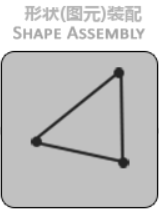

图元装配阶段的输出会传递给**几何着色器(Geometry Shader)**，几何着色器把图元形式的一系列顶点的集合作为输入，它可以通过_产生新顶点构造出新的（或是其它的）图元_来生成其他形状，在我们这里，它生成了另一个三角形

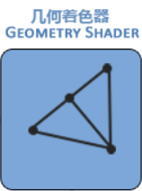

几何着色器的输出会被传入**光栅化阶段(Rasterization Stage)**，这里它会把图元映射为最终屏幕上相应的像素，生成供_片段着色器(Fragment Shader)_使用的_片段(Fragment)_（**OpenGL中的一个片段是OpenGL渲染一个像素所需的所有数据**）  
在片段着色器运行之前会执行_裁切(Clipping)_，裁切会丢弃超出你的视图以外的所有像素，用来提升执行效率

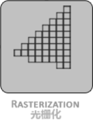

**片段着色器(Fragment Shader)**的主要目的是计算一个像素的**最终颜色**，这也是所有OpenGL高级效果产生的地方，通常，片段着色器包含3D场景的数据（比如光照、阴影、光的颜色等等），这些数据可被用来计算最终像素的颜色

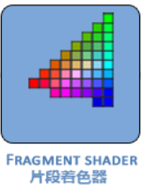

在所有对应颜色值确定以后，最终的对象将会被传到最后一个阶段，我们叫做**Alpha测试和混合(Blending)**阶段  
这个阶段检测片段的对应的_深度_（和_模板(Stencil)_）值，用以判断这个像素是在前面还是后面，决定是否丢弃  
这个阶段也会检查_alpha值_（alpha值定义了一个物体的透明度）并对物体进行_混合(Blend)_  
所以，即使在片段着色器中计算出来了一个像素输出的颜色，在渲染多个三角形的时候最后的像素颜色也可能完全不同

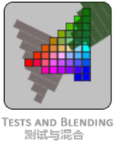

可以看到，图形渲染管线非常复杂，它包含很多可配置的部分

然而，对于大多数场合，我们只需要配置**顶点**和**片段着色器**就行了（几何着色器是可选的，通常使用它默认的着色器就行了）

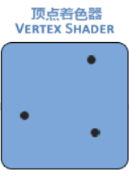 

在现代OpenGL中，我们也必须定义**至少一个顶点着色器和一个片段着色器**（GPU中没有默认的顶点/片段着色器），因此刚开始学习的时候可能会非常困难，在你能够渲染自己的第一个三角形之前，已经需要了解一大堆知识了

####管线小结#

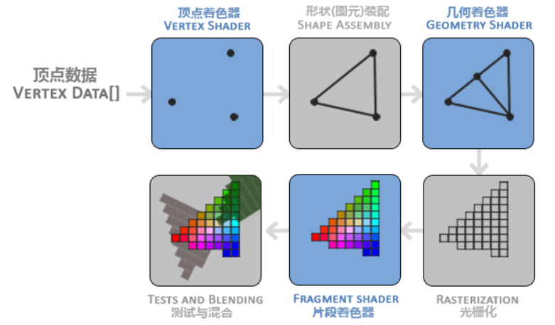

  1. 首先，我们以数组的形式传递3个3D坐标作为图形渲染管线的输入，这个数组叫做**顶点数据(Vertex Data)**，顶点数据是**一系列顶点的集合**，一个3D坐标的数据的集合就是一个**顶点(Vertex)**，**顶点数据**是用**顶点属性(Vertex Attribute)**表示的
  2. **顶点着色器(Vertex Shader)**，把一个_单独的顶点_作为输入，顶点着色器主要的目的是把3D坐标转为_另一种3D坐标_（后面会解释），同时顶点着色器允许我们对顶点属性进行一些基本处理
  3. **图元装配(Primitive Assembly)**阶段将顶点着色器输出的所有顶点作为输入（如果是GL_POINTS，那么就是一个顶点），并所有的点装配成指定图元的形状（这里的例子中是一个三角形）
  4. **几何着色器(Geometry Shader)**把图元形式的一系列顶点的集合作为输入，它可以通过_产生新顶点构造出新的（或是其它的）图元_来生成其他形状，在我们这里，它生成了另一个三角形
  5. **光栅化阶段(Rasterization Stage)**会把图元映射为最终屏幕上相应的像素，生成供_片段着色器(Fragment Shader)_使用的_片段(Fragment)_，在片段着色器运行之前会执行_裁切(Clipping)_，裁切会丢弃超出你的视图以外的所有像素，用来提升执行效率
  6. **片段着色器(Fragment Shader)**的主要目的是计算一个像素的最终颜色，这也是所有OpenGL高级效果产生的地方，通常，片段着色器包含3D场景的数据（比如光照、阴影、光的颜色等等），这些数据可被用来计算最终像素的颜色
  7. **Alpha测试和混合(Blending)**阶段检测片段的对应的_深度_（和_模板(Stencil)_）值，用以判断这个像素是在前面还是后面，决定是否丢弃；这个阶段也会检查_alpha值_（alpha值定义了一个物体的透明度）并对物体进行_混合(Blend)_

接下来我们将尝试渲染一个三角形

###顶点输入#

先记住以下三个单词：

  * 顶点数组对象：Vertex Array Object，**VAO**
  * 顶点缓冲对象：Vertex Buffer Object，**VBO**
  * 索引缓冲对象：Element Buffer Object，**EBO**或Index Buffer Object，**IBO**

想要让OpenGL绘制图形，我们必须先给OpenGL喂一些顶点数据，**顶点输入**在上面介绍的流程图中很简单，但实际上步骤并不少，过程并不简单，希望各位耐心阅读

首先OpenGL是一个3D图形库，所以我们在OpenGL中指定的所有坐标都是3D坐标（x，y，z）  
OpenGL不是简单地把所有的3D坐标变换为屏幕上的2D像素：仅当3D坐标在3个轴（x、y和z）上都为**-1.0到1.0**的范围内时才处理它，而所有在所谓的**标准化设备坐标(Normalized Device Coordinates)**范围内的坐标才会最终呈现在屏幕上

由于我们希望渲染一个三角形，我们一共要指定三个顶点，每个顶点都有一个3D位置，我们要将它们以标准化设备坐标的形式（OpenGL的可见区域）输入，所以我们定义为一个`float`数组为**顶点数据(Vertex Data)**

    
    float vertices[] = {
        -0.5f, -0.5f, 0.0f,
         0.5f, -0.5f, 0.0f,
         0.0f,  0.5f, 0.0f
    };

由于OpenGL是在3D空间中工作的，而我们渲染的是一个2D三角形，我们将它顶点的 z 坐标设置为0.0，这样子的话三角形每一点的**深度**(Depth)都是一样的，从而使它看上去像是2D的

（通常深度可以理解为z坐标，它代表一个像素在空间中和你的距离，如果离你远就可能被别的像素遮挡，你就看不到它了，它会被丢弃，以节省资源）

> **标准化设备坐标(Normalized Device Coordinates, NDC)**
>
> 一旦你的顶点坐标已经在顶点着色器中处理过，它们就应该是**标准化设备坐标**了，标准化设备坐标是一个x、y和z值在-1.0到1.0的一小段空间，任何落在范围外的坐标都会被丢弃/裁剪，不会显示在你的屏幕上  
下面你会看到我们定义的在标准化设备坐标中的三角形(忽略z轴)：
>
> 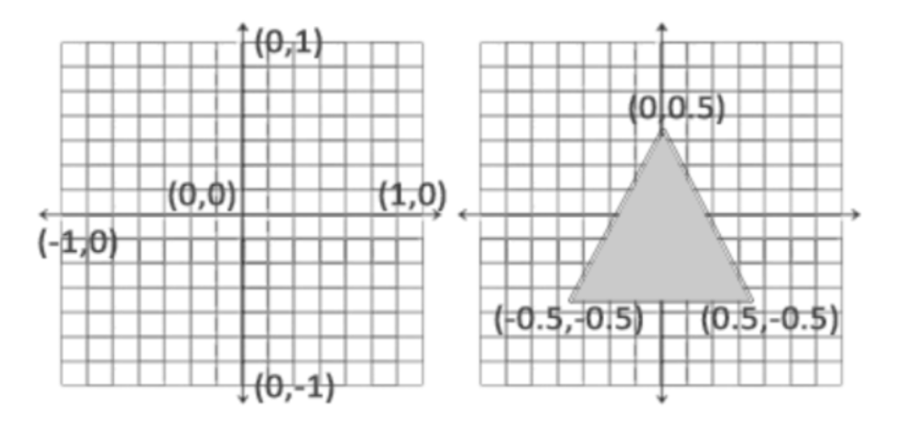
>
> 你的标准化设备坐标接着会变换为屏幕**空间坐标(Screen-space
Coordinates)**，这是使用你通过glViewport函数提供的数据，进行**视口变换(Viewport Transform)**完成的，所得的屏幕空间坐标又会被变换为片段输入到片段着色器中

顶点数据通过CPU输入到GPU的**顶点着色器**之前，我们先要在GPU上创建内存（显存）空间，用于储存我们的顶点数据，还要配置OpenGL如何解释这些内存，并且指定其如何发送给显卡，然后顶点着色器会处理我们在内存中指定数量的顶点

但是，**从CPU把数据发送到GPU是一个相对较慢的过程**，每个顶点发送一次耗费的时间将会非常大，所以我们要一次性发送尽可能多的数据，因此我们需要一个中介：**顶点缓冲对象(Vertex Buffer Objects,
VBO)**，来管理这内存，它会在GPU内存（显存）中储存大量顶点，因此我们就能一批一批发送大量顶点数据到GPU内存（显存）了

而当数据储存到GPU的内存（显存）中后，顶点着色器几乎能立即访问顶点，这是个非常快的过程

####顶点缓冲对象#

**顶点缓冲对象**是我们第一个接触的**OpenGL对象**  
就像OpenGL中的其它对象一样，这个缓冲有一个独一无二的ID，我们先生成一个整形ID，再使用**glGenBuffers**函数和一个生成好的**缓冲ID**，生成一个VBO对象：

    
    unsigned int VBO;       //生成一个ID
    glGenBuffers(1, &VBO);  //glGenBuffers(缓冲区绑定对象目标数量，缓冲区对象名称(ID))
                            //glGenBuffers的就告诉你了它可以产生多个VBO，但是我们现在只要一个

> 你可能会问：“单独生成id再用glGenBuffers返回这个id绑定的对象，这不是脱裤子放屁么？”
>
> 你要注意，我们这里只生成一个VBO，看起来的确有点做作，但这个glGenBuffers是可以生成不止一个VBO的，如果你一次生成10个，第一个参数要改成10，你又要如何获取这10个对象呢？这时候你就需要生成一个整形ID数组而不是一个整形ID
>  
>  
>     unsigned int VBO[10]; //生成一组ID
>     glGenBuffers(10, VBO);    //传入VBO的ID数组的首地址
>
> 这才是这两句最常用的用法

OpenGL有很多缓冲对象类型，**顶点缓冲对象**的缓冲类型是**GL_ARRAY_BUFFER**  
OpenGL允许我们同时绑定多个缓冲，只要它们是不同的缓冲类型  
我们可以使用glBindBuffer函数把新创建的缓冲**绑定**到GL\_ARRAY\_BUFFER目标上：

    
    glBindBuffer(GL_ARRAY_BUFFER, VBO); //glBindBuffer(目标缓冲类型, 对象名称(ID))

现在你才真正创建了一个VBO

从这一刻起，我们使用的任何（在GL\_ARRAY\_BUFFER目标上的）缓冲调用都会用来配置当前绑定的缓冲(VBO)

然后我们可以调用glBufferData函数，它会把之前定义的顶点数据复制到缓冲的内存中：

    
    glBufferData(
        GL_ARRAY_BUFFER,  //目标缓冲类型
        sizeof(vertices), //传输数据的大小
        vertices,         //发送的实际数据
        GL_STATIC_DRAW    //管理给定的数据的方式
    );
    //别忘了vertices数组就是我们的顶点数据

glBufferData是一个专门用来把用户定义的数据复制到**当前绑定缓冲**的函数

  1. 第一个参数是目标缓冲的类型：顶点缓冲对象当前绑定到GL_ARRAY_BUFFER目标上
  2. 第二个参数指定传输数据的大小(以字节为单位)；用一个简单的`sizeof`计算出顶点数据大小就行
  3. 第三个参数是我们希望发送的实际数据
  4. 第四个参数指定了我们希望显卡如何管理给定的数据，它有三种形式： 
    * GL\_STATIC\_DRAW ：数据不会或几乎不会改变
    * GL\_DYNAMIC\_DRAW：数据会被改变很多
    * GL\_STREAM\_DRAW ：数据每次绘制时都会改变

三角形的位置数据不会改变，每次渲染调用时都保持原样，所以它的使用类型最好是GL\_STATIC\_DRAW  
如果，比如说一个缓冲中的数据将频繁被改变，那么使用的类型就是GL\_DYNAMIC\_DRAW或GL\_STREAM\_DRAW，这样就能确保显卡把数据放在能够高速写入的内存部分

如果，比如说一个缓冲中的数据将频繁被改变，那么使用的类型就是GL\_DYNAMIC\_DRAW或GL\_STREAM\_DRAW，这样就能确保显卡把数据放在能够高速写入的内存部分

你要知道，我们上述步骤的目的就是**将创建的顶点数据储存在显卡的内存中**而已，现在我们已经把顶点数据储存在显卡的内存中，用VBO这个**顶点缓冲对象**管理，下面我们会创建一个顶点着色器和一个片段着色器来真正处理这些数据

###着色器#

如果我们打算做渲染的话，现代OpenGL需要我们至少设置一个顶点和一个片段着色器，我们会简要介绍一下着色器以及配置两个非常简单的着色器：**顶点着色器(Vertex Shader)**和**片段着色器(Fragment Shader)**，来绘制我们第一个三角形，当然以后我们会更详细的讨论着色器

但是首先你要了解OpenGL中的向量

####向量(Vector)#

在图形编程中我们经常会使用向量这个数学概念，因为它简明地表达了任意空间中的位置和方向，并且它有非常有用的数学属性。在GLSL中一个向量有最多4个分量，每个分量值都代表空间中的一个坐标，它们可以通过`vec.x`、`vec.y`、`vec.z`和`vec.w`来获取，注意`vec.w`分量不是用作表达空间中的位置的（我们处理的是3D不是4D），而是用在所谓**透视除法(Perspective Division)**上，我们之后回更详细地讨论向量

####顶点着色器#

还记得上面说的吗？顶点着色器是我们图形渲染管线的第一个部分，**顶点着色器(Vertex Shader)**，它把一个_单独的顶点_作为输入，顶点着色器主要的目的是把3D坐标转为_另一种3D坐标_，同时顶点着色器允许我们对顶点属性进行一些基本处理

我们需要做的第一件事是学习使用**着色器语言GLSL(OpenGL Shading
Language)**编写顶点着色器，然后编译这个着色器，这样我们就可以在程序中使用它了

和学初级语言时写的HelloWorld一样，下面我们先看一个非常基础的GLSL顶点着色器的源代码：

    
    //顶点着色器
    #version 330 core
    layout (location = 0) in vec3 aPos; //声明输入顶点属性
    void main()
    {
        gl_Position = vec4(aPos.x, aPos.y, aPos.z, 1.0);
    }

不难看出GLSL看起来很像C语言，接下来我们一句句看

每个着色器都起始于一个版本声明，OpenGL 3.3以及和更高版本中，GLSL版本号和OpenGL的版本是匹配的（比如说GLSL 420版本对应于OpenGL 4.2），我们这里声明使用3.30版本，并且使用核心模式
    
    #version 330 core

下一步，使用`in`关键字，在顶点着色器中声明所有的_输入顶点属性(Input Vertex Attribute)_  
现在我们只关心位置(Position)数据，所以我们只需要一个顶点属性  
由于每个顶点都有一个3D坐标，我们就创建一个`vec3`输入变量aPos  
我们同样也通过`layout (location = 0)`设定了输入变量的位置值(Location)  
（后面会看到为什么我们会需要这个位置值）

后面会看到为什么我们会需要这个位置值
    
    layout (location = 0) in vec3 aPos; //声明输入顶点属性

为了设置顶点着色器的输出，我们必须把位置数据赋值给预定义的gl_Position变量，它在幕后是`vec4`类型的  
在main函数的最后，我们将gl_Position设置的值会成为该顶点着色器的输出  
由于我们的输入是一个3分量的向量，我们必须把它转换为4分量的  
我们可以把vec3的数据作为vec4构造器的参数，同时把w分量设置为1.0f（我们会在后面解释为什么）
    
    gl_Position = vec4(aPos.x, aPos.y, aPos.z, 1.0);

当前这个顶点着色器可能是我们能想到的最简单的顶点着色器了，因为我们对输入数据什么都没有处理就把它传到着色器的输出了（在真实的程序里输入数据通常都不是标准化设备坐标，所以我们首先必须先把它们转换至OpenGL的可视区域内，但是现在我们可以先不考虑）

#####编译顶点着色器#

我们已经写了一个顶点着色器源码，但是为了能够让OpenGL使用它，我们必须在_运行时动态编译它的源码_，这和我之前在unity写lua有点类似，我们写的顶点着色器源码将储存在一个C的字符串中，所以上面写的代码你要这样写到main.cpp里：

    const char *vertexShaderSource = "#version 330 core\n"
    "layout (location = 0) in vec3 aPos;\n"
    "void main()\n"
    "{\n"
    "   gl_Position = vec4(aPos.x, aPos.y, aPos.z, 1.0);\n"
    "}\0";

(很恶心，但我们之后会通过文件读写解决这个问题的，不用着急)

我们首先要做的是创建一个着色器对象，注意还是用ID来引用的，所以我们储存这个顶点着色器的ID为`unsigned int`，然后用glCreateShader创建这个着色器，我们把需要创建的着色器类型以参数形式提供给glCreateShader，由于我们正在创建一个顶点着色器，传递的参数是**GL_VERTEX_SHADER**
    
    unsigned int vertexShader;
    vertexShader = glCreateShader(GL_VERTEX_SHADER);

下一步我们把这个着色器源码附加到着色器对象上，然后编译它：

    
    glShaderSource(
        vertexShader,        //要编译的着色器对象
        1,                   //传递的源码字符串数量
        &vertexShaderSource, //顶点着色器真正的源码
        NULL
    );
    glCompileShader(vertexShader);

glShaderSource函数的参数：

  1. 第一个参数是要编译的着色器对象
  2. 第二参数指定了传递的源码字符串数量，这里只有一个
  3. 第三个参数是顶点着色器真正的源码
  4. 第四个参数我们先设置为`NULL`

#####错误输出（可忽略）#

同时，我们希望检测在调用glCompileShader后编译是否成功了，如果没成功的话，也希望知道错误是什么，这样才能方便修复它们，检测编译时错误输出可以通过以下代码来实现：

首先我们定义一个整型变量success来表示是否成功编译，还定义了一个储存错误消息（出错了才会有）的容器infoLog[]，这是个char类型的数组，然后我们用**glGetShaderiv**函数检查是否编译成功，果编译失败，我们会用glGetShaderInfoLog获取错误消息，然后打印它

以下函数都不难理解而且不太重要，不一一解释了

    
    int success;//是否成功编译
    char infoLog[512];//储存错误消息
    glGetShaderiv(vertexShader, GL_COMPILE_STATUS, &success);//检查是否编译成功
    if(!success)
    {
        glGetShaderInfoLog(vertexShader, 512, NULL, infoLog);
        std::cout << "ERROR::SHADER::VERTEX::COMPILATION_FAILED\n" << infoLog << std::endl;
    }
    else {
        std::cout << "vertexShader complie SUCCESS" << std::endl;
    }

如果编译的时候没有检测到任何错误，顶点着色器就被编译成功了

####片段着色器#

片段着色器(Fragment Shader)是第二个我们打算创建用于渲染三角形的着色器

回忆一下，**片段着色器(Fragment Shader)**的主要目的是计算一个像素的最终颜色，这也是所有OpenGL高级效果产生的地方，通常，片段着色器包含3D场景的数据（比如光照、阴影、光的颜色等等），这些数据可被用来计算最终像素的颜色

在计算机图形中颜色被表示为有4个元素的数组：**红色、绿色、蓝色和alpha(透明度)分量**，通常缩写为RGBA  
当在OpenGL或GLSL中定义一个颜色的时候，我们把颜色每个分量的强度设置在0.0到1.0之间  
比如说我们设置红为1.0f，绿为1.0f，我们会得到两个颜色的混合色，即黄色  
这三种颜色分量的不同调配可以生成超过1600万种不同的颜色

    
    #version 330 core
    out vec4 FragColor;//只需要一个输出变量
    void main()
    {
        FragColor = vec4(1.0f, 0.5f, 0.2f, 1.0f);
    } 

也是一句句看：

片段着色器只需要一个输出变量，这个变量是一个4分量向量，它表示的是**最终的输出颜色**，我们可以用`out`关键字声明输出变量，这里我们命名为FragColor

    
    out vec4 FragColor;//只需要一个输出变量

我们将一个alpha值为1.0(1.0代表完全不透明)的橘黄色的`vec4`赋值给颜色输出FragColor
    
    FragColor = vec4(1.0f, 0.5f, 0.2f, 1.0f);

#####编译片段着色器#

编译片段着色器的过程与顶点着色器类似，不过我们使用**GL_FRAGMENT_SHADER**常量作为着色器类型：
    
    unsigned int fragmentShader;
    fragmentShader = glCreateShader(GL_FRAGMENT_SHADER);
    glShaderSource(fragmentShader, 1, &fragmentShaderSource, NULL);
    glCompileShader(fragmentShader);

我们同样用刚才的方法检测编译是否出错：

    
    int success;//是否成功编译
    char infoLog[512];//储存错误消息
    glGetShaderiv(fragmentShader, GL_LINK_STATUS, &success);
    if (!success) {
        glGetShaderInfoLog(fragmentShader, 512, NULL, infoLog);
        std::cout << "ERROR::SHADER::FRAGMENT::COMPILATION_FAILED\n" << infoLog << std::endl;
    }
    else {
        std::cout << "fragmentShader complie SUCCESS" << std::endl;
    }

没有检测到任何错误，片段着色器也被编译成功了

好了，现在两个着色器现在都编译了，总的代码如下：

    
    const char *vertexShaderSource = "#version 330 core\n"
    "layout (location = 0) in vec3 aPos;\n"
    "void main()\n"
    "{\n"
    "   gl_Position = vec4(aPos.x, aPos.y, aPos.z, 1.0);\n"
    "}\0";
    const char *fragmentShaderSource = "#version 330 core\n"
    "out vec4 FragColor;\n"
    "void main()\n"
    "{\n"
    "   FragColor = vec4(1.0f, 0.5f, 0.2f, 1.0f);\n"
    "}\n\0";
    int main()
        ...
    //build and compile 着色器程序（main内）
        //顶点着色器
        unsigned int vertexShader;
        vertexShader = glCreateShader(GL_VERTEX_SHADER);
        glShaderSource(vertexShader, 1, &vertexShaderSource, NULL);
        glCompileShader(vertexShader);
            //检查顶点着色器是否编译错误
        int  success;
        char infoLog[512];
        glGetShaderiv(vertexShader, GL_COMPILE_STATUS, &success);
        if (!success)
        {
            glGetShaderInfoLog(vertexShader, 512, NULL, infoLog);
            std::cout << "ERROR::SHADER::VERTEX::COMPILATION_FAILED\n" << infoLog << std::endl;
        }
        else {
            std::cout << "vertexShader complie SUCCESS" << std::endl;
        }
        //片段着色器
        unsigned int fragmentShader;
        fragmentShader = glCreateShader(GL_FRAGMENT_SHADER);
        glShaderSource(fragmentShader, 1, &fragmentShaderSource, NULL);
        glCompileShader(fragmentShader);
            //检查片段着色器是否编译错误
        glGetShaderiv(fragmentShader, GL_LINK_STATUS, &success);
        if (!success) {
            glGetShaderInfoLog(fragmentShader, 512, NULL, infoLog);
            std::cout << "ERROR::SHADER::FRAGMENT::COMPILATION_FAILED\n" << infoLog << std::endl;
        }
        else {
            std::cout << "fragmentShader complie SUCCESS" << std::endl;
        }
        ...
    }

最后我们要把两个着色器对象链接到一个用来渲染的**着色器程序(Shader Program)**中

####着色器程序#

着色器程序对象(Shader Program Object)是_多个着色器合并之后并最终链接完成的版本_，如果要使用刚才编译的着色器我们必须把它们**链接(
Link)**为一个着色器程序对象，然后在渲染对象的时候激活这个着色器程序  
已激活着色器程序的着色器将在我们发送渲染调用的时候被使用

当链接着色器至一个程序的时候，它会把每个着色器的输出链接到下个着色器的输入，如果输出和输入不匹配，就会得到一个连接错误

创建一个程序对象很简单，像刚才一样：

    
    unsigned int shaderProgram;
    shaderProgram = glCreateProgram();

glCreateProgram函数创建一个程序，并返回新创建程序对象的ID引用

现在我们需要把之前编译的着色器附加到程序对象上，然后用glLinkProgram链接它们：
    
    glAttachShader(shaderProgram, vertexShader);
    glAttachShader(shaderProgram, fragmentShader);
    glLinkProgram(shaderProgram);

代码应该很清楚，我们把着色器附加到了程序上，然后用glLinkProgram链接

#####检测着色器程序#

就像着色器的编译一样，我们也可以**检测链接着色器程序是否失败**，并获取相应的日志

与上面不同，我们尝试不调用**glGetShaderiv**和**glGetShaderInfoLog**，而是使用**glGetProgramiv**和**glGetProgramInfoLog**：
    
    glGetProgramiv(shaderProgram, GL_LINK_STATUS, &success);
    if(!success) {
        glGetProgramInfoLog(shaderProgram, 512, NULL, infoLog);
        ...
    }
    else {
        std::cout << "shaderProgram complie SUCCESS" << std::endl;
    }

如果着色器程序没有报错，我们通过glLinkProgram得到的就是一个程序对象，我们可以调用glUseProgram函数，用刚创建的程序对象作为它的参数，以激活这个程序对象：

 
    
    glUseProgram(shaderProgram);//写进渲染循环

在glUseProgram函数调用之后，每个着色器调用和渲染调用都会使用这个程序对象（也就是之前写的着色器）了

对了，在**把着色器对象链接到程序对象以后，记得删除着色器对象**，我们不再需要它们了：
    
    glDeleteShader(vertexShader);
    glDeleteShader(fragmentShader);

现在，我们已经把输入顶点数据发送给了GPU，并指示了GPU如何在顶点和片段着色器中处理它

但还没结束，我们需要告诉OpenGL它该如何解释内存中的顶点数据，以及它该如何将顶点数据链接到顶点着色器的属性上

###链接顶点属性#

顶点着色器允许我们指定任何以顶点属性为形式的输入，这使其具有很强的灵活性的同时，它还意味着我们必须手动_指定输入数据的哪一个部分对应顶点着色器的哪一个顶点属性_，所以，我们必须在渲染前指定OpenGL该如何解释顶点数据

我们的顶点缓冲数据会被解析为下面这样子：

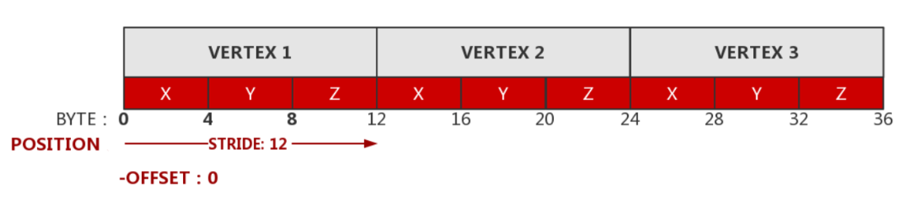

  * 位置数据被储存为32位（4字节）浮点值
  * 每个位置包含3个这样的值
  * 在这3个值之间没有空隙（或其他值），这几个值在数组中紧密排列(Tightly Packed)
  * 数据中第一个值在缓冲开始的位置

有了这些信息我们就可以使用glVertexAttribPointer函数告诉OpenGL该如何解析顶点数据（应用到逐个顶点属性上）了：

    
    glVertexAttribPointer(
        0,                  //指定要配置的顶点属性
        3,                  //指定顶点属性的大小
        GL_FLOAT,           //指定数据的类型
        GL_FALSE,           //是否希望数据被标准化
        3 * sizeof(float),  //连续的顶点属性组之间的间隔
        (void*)0            //偏移量
    );
    glEnableVertexAttribArray(0);

glVertexAttribPointer函数的参数非常多，这里逐一介绍它们：

  1. 第一个参数**指定我们要配置的顶点属性**，还记得我们在顶点着色器中使用`layout(location = 0)`定义了position顶点属性的位置值(Location)吗？它可以把顶点属性的位置值设置为`0`，因为我们希望把数据传递到这一个顶点属性中，所以这里我们传入`0`
  2. 第二个参数**指定顶点属性的大小**，顶点属性是一个`vec3`，它由3个值组成，所以大小是3
  3. 第三个参数**指定数据的类型**，这里是GL_FLOAT(GLSL中`vec*`都是由浮点数值组成的)
  4. 第四个参数定义我们**是否希望数据被标准化**(Normalize)，如果我们设置为GL_TRUE，所有数据都会被映射到0（对于有符号型signed数据是-1）到1之间，我们把它设置为GL_FALSE
  5. 第五个参数叫做步长(Stride)，它告诉我们在**连续的顶点属性组之间的间隔**，由于下个组位置数据在3个`float`之后，我们把步长设置为`3 * sizeof(float)`，要注意的是由于我们知道这个数组是紧密排列的（在两个顶点属性之间没有空隙）我们也可以设置为**0**来让OpenGL决定具体步长是多少（_只有当数值是紧密排列时才可用_），一旦我们有更多的顶点属性，我们就必须更小心地定义每个顶点属性之间的间隔，我们在后面会看到更多的例子
  6. 最后一个参数的类型是`void*`，所以需要我们进行这个奇怪的强制类型转换，它表示位置数据在缓冲中起始位置的**偏移量(Offset)**，由于位置数据在数组的开头，所以这里是0，我们会在后面详细解释这个参数

> 每个顶点属性从一个VBO管理的内存中获得它的数据，而具体是从哪个VBO（程序中可以有多个VBO）获取则是通过在调用**glVertexAttribPoi
nter**时绑定到**GL_ARRAY_BUFFER**的VBO决定的，由于在调用**glVertexAttribPointer**之前绑定的是先前定义的
VBO对象，顶点属性`0`现在会链接到它的顶点数据

现在我们已经定义了OpenGL该如何解释顶点数据，我们现在应该使用glEnableVertexAttribArray，以顶点属性位置值作为参数，启用顶点属性
（顶点属性默认是禁用的）

自此，所有东西都已经设置好了，我们上面的步骤到底做了什么呢？

  1. 使用一个顶点缓冲对象将顶点数据初始化至缓冲中
  2. 建立了一个顶点和一个片段着色器
  3. 告诉了OpenGL如何把顶点数据链接到顶点着色器的顶点属性上

在OpenGL中绘制一个物体，代码会像是这样：
    
    // 0. 复制顶点数组到VBO缓冲中供OpenGL使用
    glBindBuffer(GL_ARRAY_BUFFER, VBO);
    glBufferData(GL_ARRAY_BUFFER, sizeof(vertices), vertices, GL_STATIC_DRAW);
    // 1. 设置顶点属性指针
    glVertexAttribPointer(0, 3, GL_FLOAT, GL_FALSE, 3 * sizeof(float), (void*)0);
    glEnableVertexAttribArray(0);
    // 2. 当我们渲染一个物体时要使用着色器程序
    glUseProgram(shaderProgram);
    // 3. 绘制物体
    someOpenGLFunctionThatDrawsOurTriangle(); //没这个函数哦

每当我们绘制一个物体的时候都必须重复这一过程，看起来可能不多，但是如果有超过5个顶点属性，上百个不同物体时（比如我们之后需要画的10个正方体），绑定正确的缓冲对象，为每个物体配置所有顶点属性很快就变成一件麻烦事

有没有一些方法可以使我们**把所有这些状态配置储存在另一个对象中**，并且可以通过绑定这个对象来恢复状态呢？

####顶点数组对象#

**顶点数组对象(Vertex Array Object, VAO)**可以像顶点缓冲对象那样被绑定，任何随后的顶点属性调用都会储存在这个VAO中，这样的好处就是，当配置顶点属性指针时，你只需要将那些调用执行一次，之后再绘制物体的时候只需要绑定相应的VAO就行了，这使在不同顶点数据和属性配置之间切换变得非常简单，只需要绑定不同的VAO就行了，刚刚设置的所有状态都将存储在VAO中

OpenGL的核心模式**要求**我们使用VAO，所以它知道该如何处理我们的顶点输入，如果我们绑定VAO失败，OpenGL会拒绝绘制任何东西

一个顶点数组对象会储存以下这些内容：

  * glEnableVertexAttribArray和glDisableVertexAttribArray的调用
  * 通过glVertexAttribPointer设置的顶点属性配置
  * 通过glVertexAttribPointer调用与顶点属性关联的顶点缓冲对象

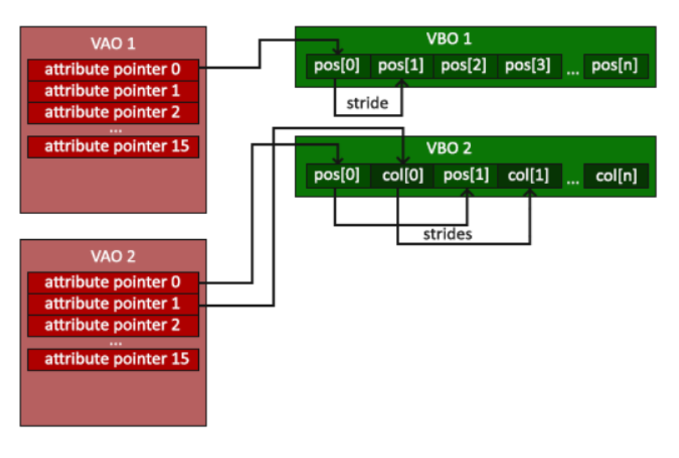

创建一个VAO和创建一个VBO很类似：

    
    unsigned int VAO;
    glGenVertexArrays(1, &VAO);

要想使用VAO，要做的只是使用glBindVertexArray绑定VAO

从绑定之后起，我们应该绑定和配置对应的VBO和属性指针，之后解绑VAO供之后使用，当我们打算绘制一个物体的时候，我们只要在绘制物体前简单地把VAO绑定到希望使用的设定上就行了

这段代码应该看起来像这样：

    
    // 初始化代码,只运行一次 (除非你的物体频繁改变)
    // 1. 绑定VAO
    glBindVertexArray(VAO);
    // 2. 把顶点数组复制到缓冲中供OpenGL使用
    glBindBuffer(GL_ARRAY_BUFFER, VBO);
    glBufferData(GL_ARRAY_BUFFER, sizeof(vertices), vertices, GL_STATIC_DRAW);
    // 3. 设置顶点属性指针
    glVertexAttribPointer(0, 3, GL_FLOAT, GL_FALSE, 3 * sizeof(float), (void*)0);
    glEnableVertexAttribArray(0);
    //...
    // 绘制代码(渲染循环中)
    // 4. 绘制物体
    glUseProgram(shaderProgram);
    glBindVertexArray(VAO);
    someOpenGLFunctionThatDrawsOurTriangle();

就这么多了！前面做的一切都是等待这一刻，一个储存了我们顶点属性配置和应使用的VBO的顶点数组对象

一般当你打算绘制多个物体时，你首先要生成/配置所有的VAO（和必须的VBO及属性指针)，然后储存它们供后面使用，当我们打算绘制物体的时候就拿出相应的VAO，绑定它，绘制完物体后，再解绑VAO

####画出三角形#

要想绘制我们想要的物体，OpenGL给我们提供了glDrawArrays函数，它使用当前激活的着色器，之前定义的顶点属性配置，和VBO的顶点数据（通过VAO间接绑定）来绘制图元
    
    glUseProgram(shaderProgram);
    glBindVertexArray(VAO);
    glDrawArrays(
        GL_TRIANGLES, //图元的类型
        0,            //顶点数组的起始索引
        3             //绘制多少个顶点
    );

glDrawArrays函数：

  1. 第一个参数是我们打算绘制的OpenGL**图元的类型**，由于我们在一开始时说过，我们希望绘制的是一个三角形，这里传递GL_TRIANGLES给它
  2. 第二个参数指定了**顶点数组的起始索引**，我们这里填`0`
  3. 最后一个参数指定我们打算**绘制多少个顶点**，这里是`3`（我们只从我们的数据中渲染一个三角形，它只有3个顶点长）

现在尝试编译代码，如果编译通过了，你应该看到下面的结果：

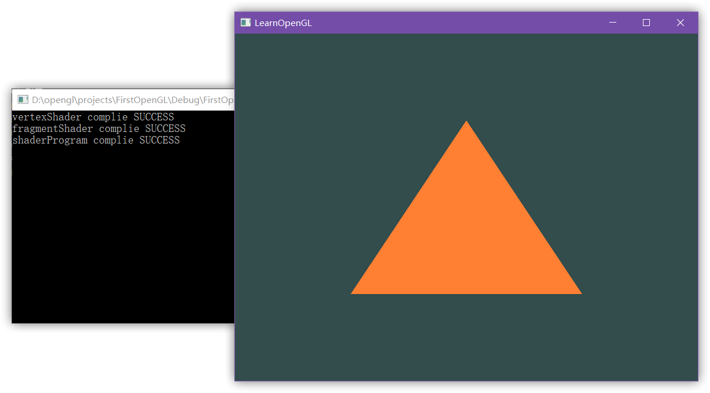

这时候我们的代码是这样的：
    
    #include <glad/glad.h>
    #include <GLFW/glfw3.h>
    #include <iostream>
    void framebuffer_size_callback(GLFWwindow* window, int width, int height);
    void processInput(GLFWwindow* window);
    // settings
    const unsigned int SCR_WIDTH = 800;
    const unsigned int SCR_HEIGHT = 600;
    const char* vertexShaderSource = "#version 330 core\n"
    "layout (location = 0) in vec3 aPos;\n"
    "void main()\n"
    "{\n"
    "   gl_Position = vec4(aPos.x, aPos.y, aPos.z, 1.0);\n"
    "}\0";
    const char* fragmentShaderSource = "#version 330 core\n"
    "out vec4 FragColor;\n"
    "void main()\n"
    "{\n"
    "   FragColor = vec4(1.0f, 0.5f, 0.2f, 1.0f);\n"
    "}\n\0";
    int main()
    {
        // 实例化GLFW窗口
        glfwInit();//glfw初始化
        glfwWindowHint(GLFW_CONTEXT_VERSION_MAJOR, 3);//主版本号
        glfwWindowHint(GLFW_CONTEXT_VERSION_MINOR, 3);//次版本号
        glfwWindowHint(GLFW_OPENGL_PROFILE, GLFW_OPENGL_CORE_PROFILE);
        GLFWwindow* window = glfwCreateWindow(800, 600, "LearnOpenGL", NULL, NULL);
        //（宽，高，窗口名）返回一个GLFWwindow类的实例：window
        if (window == NULL)
        {
            // 生成错误则输出错误信息
            std::cout << "Failed to create GLFW window" << std::endl;
            glfwTerminate();
            return -1;
        }
        glfwMakeContextCurrent(window);
        // 告诉GLFW我们希望每当窗口调整大小的时候调用改变窗口大小的函数
        glfwSetFramebufferSizeCallback(window, framebuffer_size_callback);
        // glad管理opengl函数指针，初始化glad
        if (!gladLoadGLLoader((GLADloadproc)glfwGetProcAddress))
        {
            // 生成错误则输出错误信息
            std::cout << "Failed to initialize GLAD" << std::endl;
            return -1;
        }
        //build and compile 着色器程序
        //顶点着色器
        unsigned int vertexShader;
        vertexShader = glCreateShader(GL_VERTEX_SHADER);
        glShaderSource(vertexShader, 1, &vertexShaderSource, NULL);
        glCompileShader(vertexShader);
        //检查顶点着色器是否编译错误
        int  success;
        char infoLog[512];
        glGetShaderiv(vertexShader, GL_COMPILE_STATUS, &success);
        if (!success)
        {
            glGetShaderInfoLog(vertexShader, 512, NULL, infoLog);
            std::cout << "ERROR::SHADER::VERTEX::COMPILATION_FAILED\n" << infoLog << std::endl;
        }
        else {
            std::cout << "vertexShader complie SUCCESS" << std::endl;
        }
        //片段着色器
        unsigned int fragmentShader;
        fragmentShader = glCreateShader(GL_FRAGMENT_SHADER);
        glShaderSource(fragmentShader, 1, &fragmentShaderSource, NULL);
        glCompileShader(fragmentShader);
        //检查片段着色器是否编译错误
        glGetShaderiv(fragmentShader, GL_LINK_STATUS, &success);
        if (!success) {
            glGetShaderInfoLog(fragmentShader, 512, NULL, infoLog);
            std::cout << "ERROR::SHADER::FRAGMENT::COMPILATION_FAILED\n" << infoLog << std::endl;
        }
        else {
            std::cout << "fragmentShader complie SUCCESS" << std::endl;
        }
        //连接着色器
        unsigned int shaderProgram;
        shaderProgram = glCreateProgram();
        glAttachShader(shaderProgram, vertexShader);
        glAttachShader(shaderProgram, fragmentShader);
        glLinkProgram(shaderProgram);
        //检查片段着色器是否编译错误
        glGetProgramiv(shaderProgram, GL_LINK_STATUS, &success);
        if (!success) {
            glGetProgramInfoLog(shaderProgram, 512, NULL, infoLog);
            std::cout << "ERROR::SHADER::PROGRAM::LINKING_FAILED\n" << infoLog << std::endl;
        }
        else {
            std::cout << "shaderProgram complie SUCCESS" << std::endl;
        }
        //连接后删除
        glDeleteShader(vertexShader);
        glDeleteShader(fragmentShader);
        //顶点数据
        float vertices[] = {
        -0.5f, -0.5f, 0.0f,
         0.5f, -0.5f, 0.0f,
         0.0f,  0.5f, 0.0f
        };
        unsigned int VBO;
        glGenBuffers(1, &VBO);
        unsigned int VAO;
        glGenVertexArrays(1, &VAO);
        // 初始化代码
        // 1. 绑定VAO
        glBindVertexArray(VAO);
        // 2. 把顶点数组复制到缓冲中供OpenGL使用
        glBindBuffer(GL_ARRAY_BUFFER, VBO);
        glBufferData(GL_ARRAY_BUFFER, sizeof(vertices), vertices, GL_STATIC_DRAW);
        // 3. 设置顶点属性指针
        glVertexAttribPointer(0, 3, GL_FLOAT, GL_FALSE, 3 * sizeof(float), (void*)0);
        glEnableVertexAttribArray(0);
        // 渲染循环
        while (!glfwWindowShouldClose(window))
        {
            // 输入
            processInput(window);
            // 渲染指令
            glClearColor(0.2f, 0.3f, 0.3f, 1.0f);
            glClear(GL_COLOR_BUFFER_BIT);
            glUseProgram(shaderProgram);
            glBindVertexArray(VAO);
            glDrawArrays(GL_TRIANGLES, 0, 3);
            // 检查并调用事件，交换缓冲
            glfwSwapBuffers(window);
            // 检查触发什么事件，更新窗口状态
            glfwPollEvents();
        }
        // 释放之前的分配的所有资源
        glfwTerminate();
        return 0;
    }
    void framebuffer_size_callback(GLFWwindow* window, int width, int height)
    {
        // 每当窗口改变大小，GLFW会调用这个函数并填充相应的参数供你处理
        glViewport(0, 0, width, height);
    }
    void processInput(GLFWwindow* window)
    {
        // 返回这个按键是否正在被按下
        if (glfwGetKey(window, GLFW_KEY_ESCAPE) == GLFW_PRESS)//是否按下了返回键
            glfwSetWindowShouldClose(window, true);
    }

###索引缓冲对象#

在渲染顶点这一话题上我们还有最后一个需要讨论的东西——**索引缓冲对象**(Element Buffer Object，**EBO**，也叫Index Buffer Object，**IBO**)

假设我们不再绘制一个三角形而是绘制一个**矩形**，  
我们可以绘制两个三角形来组成一个矩形（OpenGL主要处理三角形）  
这会生成下面的顶点的集合：

    
    float vertices[] = {
        // 第一个三角形
        0.5f, 0.5f, 0.0f,   // 右上角
        0.5f, -0.5f, 0.0f,  // 右下角
        -0.5f, 0.5f, 0.0f,  // 左上角
        // 第二个三角形
        0.5f, -0.5f, 0.0f,  // 右下角
        -0.5f, -0.5f, 0.0f, // 左下角
        -0.5f, 0.5f, 0.0f   // 左上角
    };

可以看到，有几个顶点叠加了：我们指定了`右下角`和`左上角`两次，一个矩形只有4个而不是6个顶点，这样就产生50%的额外开销

更好的解决方案是只储存不同的顶点，并设定绘制这些顶点的**顺序**，这样子我们只要储存4个顶点就能绘制矩形了，之后只要指定绘制的顺序就行了

**索引缓冲对象EBO**就是干这个的，和顶点缓冲对象一样，EBO也是一个缓冲，它专门储存索引，OpenGL调用这些顶点的索引来决定该绘制哪个顶点

首先，我们先要定义（不重复的）顶点，和绘制出矩形所需的索引：

    
    float vertices[] = {
        0.5f, 0.5f, 0.0f,   // 0号点
        0.5f, -0.5f, 0.0f,  // 1号点
        -0.5f, -0.5f, 0.0f, // 2号点
        -0.5f, 0.5f, 0.0f   // 3号点
    };
    unsigned int indices[] = { // 注意索引从0开始!
        0, 1, 3, // 第一个三角形
        1, 2, 3  // 第二个三角形
    };

你可以看到，当时用索引的时候，我们只定义了4个顶点，下一步我们需要创建索引缓冲对象：

与VBO类似，我们先绑定EBO然后用glBufferData把索引复制到缓冲里

    
    unsigned int EBO;
    glGenBuffers(1, &EBO);

同样，和VBO类似，我们会把这些函数调用放在绑定和解绑函数调用之间，只不过这次我们把缓冲的类型定义为**GL_ELEMENT_ARRAY_BUFFER**

    
    glBindBuffer(GL_ELEMENT_ARRAY_BUFFER, EBO);
    glBufferData(GL_ELEMENT_ARRAY_BUFFER, sizeof(indices), indices, GL_STATIC_DRAW);

要注意的是，我们传递了**GL_ELEMENT_ARRAY_BUFFER**当作缓冲目标

最后一件要做的事是用**glDrawElements**来替换glDrawArrays函数，来指明我们从索引缓冲渲染

使用glDrawElements时，我们会使用当前绑定的索引缓冲对象中的索引进行绘制：

    
    glBindBuffer(GL_ELEMENT_ARRAY_BUFFER, EBO);
    //glDrawArrays(GL_TRIANGLES, 0, 6);
    glDrawElements(
        GL_TRIANGLES,    //绘制的模式
        6,               //绘制顶点的个数
        GL_UNSIGNED_INT, //索引的类型
        0                //偏移量
    );

glDrawElements的参数：

  1. 第一个参数指定了我们**绘制的模式**，这个和glDrawArrays的一样
  2. 第二个参数是我们打算**绘制顶点的个数**，这里填6，也就是说我们一共需要绘制6个顶点
  3. 第三个参数是**索引的类型**，这里是GL\_UNSIGNED\_INT
  4. 最后一个参数里我们可以指定EBO中的**偏移量**（或者传递一个索引数组，但是这是当你不在使用索引缓冲对象的时候），但是我们会在这里填写0

glDrawElements函数从当前绑定到GL\_ELEMENT\_ARRAY\_BUFFER目标的EBO中获取索引，这意味着我们必须在每次要用索引渲染一个物体
时绑定相应的EBO，还是有点麻烦  
不过顶点数组对象同样可以保存索引缓冲对象的绑定状态，VAO绑定时正在绑定的索引缓冲对象会被保存为VAO的元素缓冲对象，**绑定VAO的同时也会自动绑定EBO**

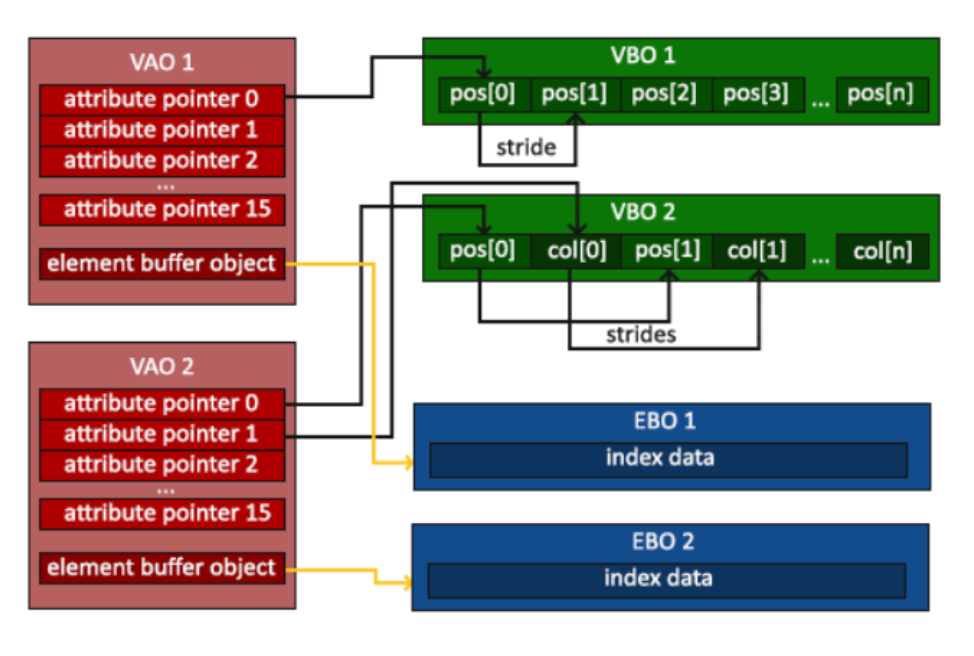

当目标是GL\_ELEMENT\_ARRAY\_BUFFER的时候，VAO会储存glBindBuffer的函数调用，这也意味着它也会储存解绑调用，所以确保你没有在解绑VAO之前解绑索引数组缓冲，否则它就没有这个EBO配置了

最后的初始化和绘制代码现在看起来像这样：
    
    // 初始化代码
    // 1. 绑定顶点数组对象
    glBindVertexArray(VAO);
    // 2. 把我们的顶点数组复制到一个顶点缓冲中，供OpenGL使用
    glBindBuffer(GL_ARRAY_BUFFER, VBO);
    glBufferData(GL_ARRAY_BUFFER, sizeof(vertices), vertices, GL_STATIC_DRAW);
    // 3. 复制我们的索引数组到一个索引缓冲中，供OpenGL使用
    glBindBuffer(GL_ELEMENT_ARRAY_BUFFER, EBO);
    glBufferData(GL_ELEMENT_ARRAY_BUFFER, sizeof(indices), indices, GL_STATIC_DRAW);
    // 4. 设定顶点属性指针
    glVertexAttribPointer(0, 3, GL_FLOAT, GL_FALSE, 3 * sizeof(float), (void*)0);
    glEnableVertexAttribArray(0);
    //...
    // .绘制代码（渲染循环中）
    glUseProgram(shaderProgram);
    glBindVertexArray(VAO);
    glDrawElements(GL_TRIANGLES, 6, GL_UNSIGNED_INT, 0)；
    glBindVertexArray(0);

运行程序，wow~awesome

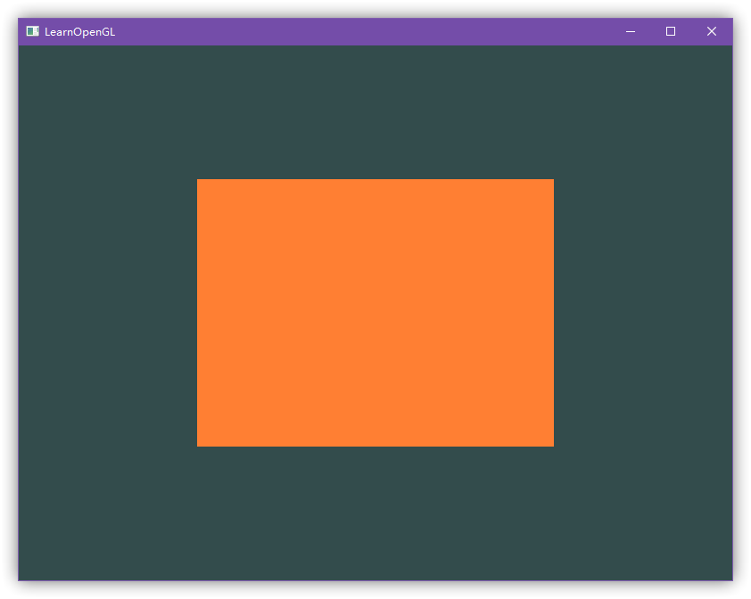

**线框模式(Wireframe Mode)**

要想用线框模式绘制你的三角形，你可以通过`glPolygonMode(GL_FRONT_AND_BACK, GL_LINE)`函数配置OpenGL如何绘制图元

  1. 第一个参数表示我们打算将其应用到所有的三角形的正面和背面
  2. 第二个参数告诉我们用线来绘制

设定之后的绘制调用会一直以线框模式绘制三角形，直到我们用`glPolygonMode(GL_FRONT_AND_BACK, GL_FILL)`将其设置回默认模式

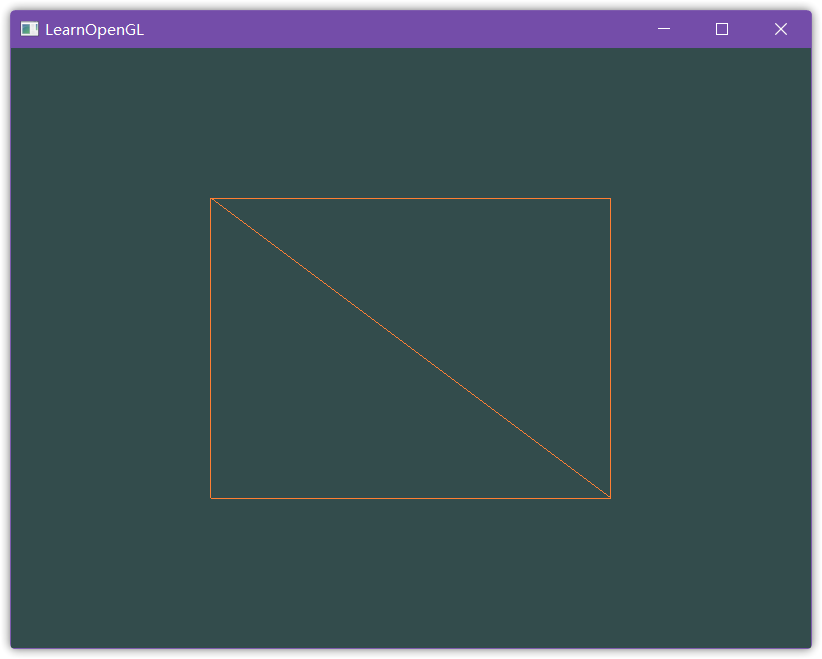

可以看到这个矩形的确是由两个三角形组成的，awesome！

现在我们完整的代码如下：
    
    #include <glad/glad.h>
    #include <GLFW/glfw3.h>
    #include <iostream>
    void framebuffer_size_callback(GLFWwindow* window, int width, int height);
    void processInput(GLFWwindow* window);
    // settings
    const unsigned int SCR_WIDTH = 800;
    const unsigned int SCR_HEIGHT = 600;
    const char* vertexShaderSource = "#version 330 core\n"
    "layout (location = 0) in vec3 aPos;\n"
    "void main()\n"
    "{\n"
    "   gl_Position = vec4(aPos.x, aPos.y, aPos.z, 1.0);\n"
    "}\0";
    const char* fragmentShaderSource = "#version 330 core\n"
    "out vec4 FragColor;\n"
    "void main()\n"
    "{\n"
    "   FragColor = vec4(1.0f, 0.5f, 0.2f, 1.0f);\n"
    "}\n\0";
    int main()
    {
        // 实例化GLFW窗口
        glfwInit();//glfw初始化
        glfwWindowHint(GLFW_CONTEXT_VERSION_MAJOR, 3);//主版本号
        glfwWindowHint(GLFW_CONTEXT_VERSION_MINOR, 3);//次版本号
        glfwWindowHint(GLFW_OPENGL_PROFILE, GLFW_OPENGL_CORE_PROFILE);
        GLFWwindow* window = glfwCreateWindow(800, 600, "LearnOpenGL", NULL, NULL);
        //（宽，高，窗口名）返回一个GLFWwindow类的实例：window
        if (window == NULL)
        {
            // 生成错误则输出错误信息
            std::cout << "Failed to create GLFW window" << std::endl;
            glfwTerminate();
            return -1;
        }
        glfwMakeContextCurrent(window);
        // 告诉GLFW我们希望每当窗口调整大小的时候调用改变窗口大小的函数
        glfwSetFramebufferSizeCallback(window, framebuffer_size_callback);
        // glad管理opengl函数指针，初始化glad
        if (!gladLoadGLLoader((GLADloadproc)glfwGetProcAddress))
        {
            // 生成错误则输出错误信息
            std::cout << "Failed to initialize GLAD" << std::endl;
            return -1;
        }
        //build and compile 着色器程序
        //顶点着色器
        unsigned int vertexShader;
        vertexShader = glCreateShader(GL_VERTEX_SHADER);
        glShaderSource(vertexShader, 1, &vertexShaderSource, NULL);
        glCompileShader(vertexShader);
        //检查顶点着色器是否编译错误
        int  success;
        char infoLog[512];
        glGetShaderiv(vertexShader, GL_COMPILE_STATUS, &success);
        if (!success)
        {
            glGetShaderInfoLog(vertexShader, 512, NULL, infoLog);
            std::cout << "ERROR::SHADER::VERTEX::COMPILATION_FAILED\n" << infoLog << std::endl;
        }
        else {
            std::cout << "vertexShader complie SUCCESS" << std::endl;
        }
        //片段着色器
        unsigned int fragmentShader;
        fragmentShader = glCreateShader(GL_FRAGMENT_SHADER);
        glShaderSource(fragmentShader, 1, &fragmentShaderSource, NULL);
        glCompileShader(fragmentShader);
        //检查片段着色器是否编译错误
        glGetShaderiv(fragmentShader, GL_LINK_STATUS, &success);
        if (!success) {
            glGetShaderInfoLog(fragmentShader, 512, NULL, infoLog);
            std::cout << "ERROR::SHADER::FRAGMENT::COMPILATION_FAILED\n" << infoLog << std::endl;
        }
        else {
            std::cout << "fragmentShader complie SUCCESS" << std::endl;
        }
        //连接着色器
        unsigned int shaderProgram;
        shaderProgram = glCreateProgram();
        glAttachShader(shaderProgram, vertexShader);
        glAttachShader(shaderProgram, fragmentShader);
        glLinkProgram(shaderProgram);
        //检查片段着色器是否编译错误
        glGetProgramiv(shaderProgram, GL_LINK_STATUS, &success);
        if (!success) {
            glGetProgramInfoLog(shaderProgram, 512, NULL, infoLog);
            std::cout << "ERROR::SHADER::PROGRAM::LINKING_FAILED\n" << infoLog << std::endl;
        }
        else {
            std::cout << "shaderProgram complie SUCCESS" << std::endl;
        }
        //连接后删除
        glDeleteShader(vertexShader);
        glDeleteShader(fragmentShader);
        //顶点数据
        float vertices[] = {
            0.5f, 0.5f, 0.0f,   // 0号点
            0.5f, -0.5f, 0.0f,  // 1号点
            -0.5f, -0.5f, 0.0f, // 2号点
            -0.5f, 0.5f, 0.0f   // 3号点
        };
        unsigned int indices[] = { // 注意索引从0开始!
            0, 1, 3, // 第一个三角形
            1, 2, 3  // 第二个三角形
        };
        unsigned int VBO;
        glGenBuffers(1, &VBO);
        unsigned int VAO;
        glGenVertexArrays(1, &VAO);
        unsigned int EBO;
        glGenBuffers(1, &EBO);
        // 初始化代码
        // 1. 绑定顶点数组对象
        glBindVertexArray(VAO);
        // 2. 把我们的顶点数组复制到一个顶点缓冲中，供OpenGL使用
        glBindBuffer(GL_ARRAY_BUFFER, VBO);
        glBufferData(GL_ARRAY_BUFFER, sizeof(vertices), vertices, GL_STATIC_DRAW);
        // 3. 复制我们的索引数组到一个索引缓冲中，供OpenGL使用
        glBindBuffer(GL_ELEMENT_ARRAY_BUFFER, EBO);
        glBufferData(GL_ELEMENT_ARRAY_BUFFER, sizeof(indices), indices, GL_STATIC_DRAW);
        // 4. 设定顶点属性指针
        glVertexAttribPointer(0, 3, GL_FLOAT, GL_FALSE, 3 * sizeof(float), (void*)0);
        glEnableVertexAttribArray(0);
        //线框模式wireframe
        glPolygonMode(GL_FRONT_AND_BACK, GL_LINE);
        // 渲染循环
        while (!glfwWindowShouldClose(window))
        {
            // 输入
            processInput(window);
            // 渲染指令
            glClearColor(0.2f, 0.3f, 0.3f, 1.0f);
            glClear(GL_COLOR_BUFFER_BIT);
            glUseProgram(shaderProgram);
            glBindVertexArray(VAO);
            glDrawElements(GL_TRIANGLES, 6, GL_UNSIGNED_INT, 0);
            glBindVertexArray(0);
            // 检查并调用事件，交换缓冲
            glfwSwapBuffers(window);
            // 检查触发什么事件，更新窗口状态
            glfwPollEvents();
        }
        // 释放之前的分配的所有资源
        glfwTerminate();
        glDeleteVertexArrays(1, &VAO);
        glDeleteBuffers(1, &VBO);
        glDeleteBuffers(1, &EBO);
        return 0;
    }
    void framebuffer_size_callback(GLFWwindow* window, int width, int height)
    {
        // 每当窗口改变大小，GLFW会调用这个函数并填充相应的参数供你处理
        glViewport(0, 0, width, height);
    }
    void processInput(GLFWwindow* window)
    {
        // 返回这个按键是否正在被按下
        if (glfwGetKey(window, GLFW_KEY_ESCAPE) == GLFW_PRESS)//是否按下了返回键
            glfwSetWindowShouldClose(window, true);
    }

###额外的尝试#

####两个彼此相连的三角形#

我们可以尝试添加更多顶点到数据中，使用glDrawArrays，绘制两个彼此相连的三角形

我们只需要更改顶点数组：

    
    float vertices[] = {
        //第一个三角形
        -0.9f, -0.5f, 0.0f,  // left 
        -0.0f, -0.5f, 0.0f,  // right
        -0.45f, 0.5f, 0.0f,  // top 
        //第二个三角形
        0.0f, -0.5f, 0.0f,  // left
        0.9f, -0.5f, 0.0f,  // right
        0.45f, 0.5f, 0.0f   // top 
    };

然后更改EBO设置（直接注了）

    
    //glBindBuffer(GL_ELEMENT_ARRAY_BUFFER, EBO);
    //glBufferData(GL_ELEMENT_ARRAY_BUFFER, sizeof(indices), indices, GL_STATIC_DRAW);

渲染指令也要从

    
    glDrawElements(GL_TRIANGLES, 6, GL_UNSIGNED_INT, 0);

改成

    
    glDrawArrays(GL_TRIANGLES, 0, 6);
    // glDrawElements(GL_TRIANGLES, 6, GL_UNSIGNED_INT, 0);

效果就很明显了：

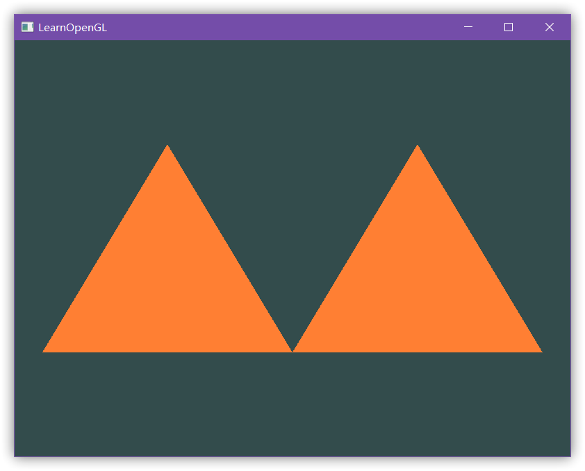

我的源代码：
    
    #include <glad/glad.h>
    #include <GLFW/glfw3.h>
    #include <iostream>
    void framebuffer_size_callback(GLFWwindow* window, int width, int height);
    void processInput(GLFWwindow* window);
    // settings
    const unsigned int SCR_WIDTH = 800;
    const unsigned int SCR_HEIGHT = 600;
    const char* vertexShaderSource = "#version 330 core\n"
    "layout (location = 0) in vec3 aPos;\n"
    "void main()\n"
    "{\n"
    "   gl_Position = vec4(aPos.x, aPos.y, aPos.z, 1.0);\n"
    "}\0";
    const char* fragmentShaderSource = "#version 330 core\n"
    "out vec4 FragColor;\n"
    "void main()\n"
    "{\n"
    "   FragColor = vec4(1.0f, 0.5f, 0.2f, 1.0f);\n"
    "}\n\0";
    int main()
    {
        // 实例化GLFW窗口
        glfwInit();//glfw初始化
        glfwWindowHint(GLFW_CONTEXT_VERSION_MAJOR, 3);//主版本号
        glfwWindowHint(GLFW_CONTEXT_VERSION_MINOR, 3);//次版本号
        glfwWindowHint(GLFW_OPENGL_PROFILE, GLFW_OPENGL_CORE_PROFILE);
        GLFWwindow* window = glfwCreateWindow(800, 600, "LearnOpenGL", NULL, NULL);
        //（宽，高，窗口名）返回一个GLFWwindow类的实例：window
        if (window == NULL)
        {
            // 生成错误则输出错误信息
            std::cout << "Failed to create GLFW window" << std::endl;
            glfwTerminate();
            return -1;
        }
        glfwMakeContextCurrent(window);
        // 告诉GLFW我们希望每当窗口调整大小的时候调用改变窗口大小的函数
        glfwSetFramebufferSizeCallback(window, framebuffer_size_callback);
        // glad管理opengl函数指针，初始化glad
        if (!gladLoadGLLoader((GLADloadproc)glfwGetProcAddress))
        {
            // 生成错误则输出错误信息
            std::cout << "Failed to initialize GLAD" << std::endl;
            return -1;
        }
        //build and compile 着色器程序
        //顶点着色器
        unsigned int vertexShader;
        vertexShader = glCreateShader(GL_VERTEX_SHADER);
        glShaderSource(vertexShader, 1, &vertexShaderSource, NULL);
        glCompileShader(vertexShader);
        //检查顶点着色器是否编译错误
        int  success;
        char infoLog[512];
        glGetShaderiv(vertexShader, GL_COMPILE_STATUS, &success);
        if (!success)
        {
            glGetShaderInfoLog(vertexShader, 512, NULL, infoLog);
            std::cout << "ERROR::SHADER::VERTEX::COMPILATION_FAILED\n" << infoLog << std::endl;
        }
        else {
            std::cout << "vertexShader complie SUCCESS" << std::endl;
        }
        //片段着色器
        unsigned int fragmentShader;
        fragmentShader = glCreateShader(GL_FRAGMENT_SHADER);
        glShaderSource(fragmentShader, 1, &fragmentShaderSource, NULL);
        glCompileShader(fragmentShader);
        //检查片段着色器是否编译错误
        glGetShaderiv(fragmentShader, GL_LINK_STATUS, &success);
        if (!success) {
            glGetShaderInfoLog(fragmentShader, 512, NULL, infoLog);
            std::cout << "ERROR::SHADER::FRAGMENT::COMPILATION_FAILED\n" << infoLog << std::endl;
        }
        else {
            std::cout << "fragmentShader complie SUCCESS" << std::endl;
        }
        //连接着色器
        unsigned int shaderProgram;
        shaderProgram = glCreateProgram();
        glAttachShader(shaderProgram, vertexShader);
        glAttachShader(shaderProgram, fragmentShader);
        glLinkProgram(shaderProgram);
        //检查片段着色器是否编译错误
        glGetProgramiv(shaderProgram, GL_LINK_STATUS, &success);
        if (!success) {
            glGetProgramInfoLog(shaderProgram, 512, NULL, infoLog);
            std::cout << "ERROR::SHADER::PROGRAM::LINKING_FAILED\n" << infoLog << std::endl;
        }
        else {
            std::cout << "shaderProgram complie SUCCESS" << std::endl;
        }
        //连接后删除
        glDeleteShader(vertexShader);
        glDeleteShader(fragmentShader);
        //顶点数据
        //float vertices[] = {
        //  0.5f, 0.5f, 0.0f,   // 0号点
        //  0.5f, -0.5f, 0.0f,  // 1号点
        //  -0.5f, -0.5f, 0.0f, // 2号点
        //  -0.5f, 0.5f, 0.0f   // 3号点
        //};
        //unsigned int indices[] = { // 注意索引从0开始!
        //  0, 1, 3, // 第一个三角形
        //  1, 2, 3  // 第二个三角形
        //};
        float vertices[] = {
            //第一个三角形
            -0.9f, -0.5f, 0.0f,  // left 
            -0.0f, -0.5f, 0.0f,  // right
            -0.45f, 0.5f, 0.0f,  // top 
            //第二个三角形
            0.0f, -0.5f, 0.0f,  // left
            0.9f, -0.5f, 0.0f,  // right
            0.45f, 0.5f, 0.0f   // top 
        };
        unsigned int VBO;
        glGenBuffers(1, &VBO);
        unsigned int VAO;
        glGenVertexArrays(1, &VAO);
        unsigned int EBO;
        glGenBuffers(1, &EBO);
        // 初始化代码
        // 1. 绑定顶点数组对象
        glBindVertexArray(VAO);
        // 2. 把我们的顶点数组复制到一个顶点缓冲中，供OpenGL使用
        glBindBuffer(GL_ARRAY_BUFFER, VBO);
        glBufferData(GL_ARRAY_BUFFER, sizeof(vertices), vertices, GL_STATIC_DRAW);
        // 3. 复制我们的索引数组到一个索引缓冲中，供OpenGL使用
        //glBindBuffer(GL_ELEMENT_ARRAY_BUFFER, EBO);
        //glBufferData(GL_ELEMENT_ARRAY_BUFFER, sizeof(indices), indices, GL_STATIC_DRAW);
        // 4. 设定顶点属性指针
        glVertexAttribPointer(0, 3, GL_FLOAT, GL_FALSE, 3 * sizeof(float), (void*)0);
        glEnableVertexAttribArray(0);
        ////线框模式wireframe
        //glPolygonMode(GL_FRONT_AND_BACK, GL_LINE);
        // 渲染循环
        while (!glfwWindowShouldClose(window))
        {
            // 输入
            processInput(window);
            // 渲染指令
            glClearColor(0.2f, 0.3f, 0.3f, 1.0f);
            glClear(GL_COLOR_BUFFER_BIT);
            glUseProgram(shaderProgram);
            glBindVertexArray(VAO);
            glDrawArrays(GL_TRIANGLES, 0, 6);
            // glDrawElements(GL_TRIANGLES, 6, GL_UNSIGNED_INT, 0);
            glBindVertexArray(0);
            // 检查并调用事件，交换缓冲
            glfwSwapBuffers(window);
            // 检查触发什么事件，更新窗口状态
            glfwPollEvents();
        }
        // 释放之前的分配的所有资源
        glfwTerminate();
        glDeleteVertexArrays(1, &VAO);
        glDeleteBuffers(1, &VBO);
        //glDeleteBuffers(1, &EBO);
        return 0;
    }
    void framebuffer_size_callback(GLFWwindow* window, int width, int height)
    {
        // 每当窗口改变大小，GLFW会调用这个函数并填充相应的参数供你处理
        glViewport(0, 0, width, height);
    }
    void processInput(GLFWwindow* window)
    {
        // 返回这个按键是否正在被按下
        if (glfwGetKey(window, GLFW_KEY_ESCAPE) == GLFW_PRESS)//是否按下了返回键
            glfwSetWindowShouldClose(window, true);
    }

当然你也可以用上EBO，更简单，我们需要这样改下顶点数组

    
    float vertices[] = {
        -0.9f, -0.5f, 0.0f,  // left 
        -0.0f, -0.5f, 0.0f,  // right
        -0.45f, 0.5f, 0.0f,  // top 
        0.9f, -0.5f, 0.0f,  // right
        0.45f, 0.5f, 0.0f   // top 
    };
    unsigned int indices[] = { // 注意索引从0开始!
        0, 1, 2, // 第一个三角形
        1, 3, 4  // 第二个三角形
    };

EBO设置和上文相同

结果是一样的

参考源码：

    
    #include <glad/glad.h>
    #include <GLFW/glfw3.h>
    #include <iostream>
    void framebuffer_size_callback(GLFWwindow* window, int width, int height);
    void processInput(GLFWwindow* window);
    // settings
    const unsigned int SCR_WIDTH = 800;
    const unsigned int SCR_HEIGHT = 600;
    const char* vertexShaderSource = "#version 330 core\n"
    "layout (location = 0) in vec3 aPos;\n"
    "void main()\n"
    "{\n"
    "   gl_Position = vec4(aPos.x, aPos.y, aPos.z, 1.0);\n"
    "}\0";
    const char* fragmentShaderSource = "#version 330 core\n"
    "out vec4 FragColor;\n"
    "void main()\n"
    "{\n"
    "   FragColor = vec4(1.0f, 0.5f, 0.2f, 1.0f);\n"
    "}\n\0";
    int main()
    {
        // 实例化GLFW窗口
        glfwInit();//glfw初始化
        glfwWindowHint(GLFW_CONTEXT_VERSION_MAJOR, 3);//主版本号
        glfwWindowHint(GLFW_CONTEXT_VERSION_MINOR, 3);//次版本号
        glfwWindowHint(GLFW_OPENGL_PROFILE, GLFW_OPENGL_CORE_PROFILE);
        GLFWwindow* window = glfwCreateWindow(800, 600, "LearnOpenGL", NULL, NULL);
        //（宽，高，窗口名）返回一个GLFWwindow类的实例：window
        if (window == NULL)
        {
            // 生成错误则输出错误信息
            std::cout << "Failed to create GLFW window" << std::endl;
            glfwTerminate();
            return -1;
        }
        glfwMakeContextCurrent(window);
        // 告诉GLFW我们希望每当窗口调整大小的时候调用改变窗口大小的函数
        glfwSetFramebufferSizeCallback(window, framebuffer_size_callback);
        // glad管理opengl函数指针，初始化glad
        if (!gladLoadGLLoader((GLADloadproc)glfwGetProcAddress))
        {
            // 生成错误则输出错误信息
            std::cout << "Failed to initialize GLAD" << std::endl;
            return -1;
        }
        //build and compile 着色器程序
        //顶点着色器
        unsigned int vertexShader;
        vertexShader = glCreateShader(GL_VERTEX_SHADER);
        glShaderSource(vertexShader, 1, &vertexShaderSource, NULL);
        glCompileShader(vertexShader);
        //检查顶点着色器是否编译错误
        int  success;
        char infoLog[512];
        glGetShaderiv(vertexShader, GL_COMPILE_STATUS, &success);
        if (!success)
        {
            glGetShaderInfoLog(vertexShader, 512, NULL, infoLog);
            std::cout << "ERROR::SHADER::VERTEX::COMPILATION_FAILED\n" << infoLog << std::endl;
        }
        else {
            std::cout << "vertexShader complie SUCCESS" << std::endl;
        }
        //片段着色器
        unsigned int fragmentShader;
        fragmentShader = glCreateShader(GL_FRAGMENT_SHADER);
        glShaderSource(fragmentShader, 1, &fragmentShaderSource, NULL);
        glCompileShader(fragmentShader);
        //检查片段着色器是否编译错误
        glGetShaderiv(fragmentShader, GL_LINK_STATUS, &success);
        if (!success) {
            glGetShaderInfoLog(fragmentShader, 512, NULL, infoLog);
            std::cout << "ERROR::SHADER::FRAGMENT::COMPILATION_FAILED\n" << infoLog << std::endl;
        }
        else {
            std::cout << "fragmentShader complie SUCCESS" << std::endl;
        }
        //连接着色器
        unsigned int shaderProgram;
        shaderProgram = glCreateProgram();
        glAttachShader(shaderProgram, vertexShader);
        glAttachShader(shaderProgram, fragmentShader);
        glLinkProgram(shaderProgram);
        //检查片段着色器是否编译错误
        glGetProgramiv(shaderProgram, GL_LINK_STATUS, &success);
        if (!success) {
            glGetProgramInfoLog(shaderProgram, 512, NULL, infoLog);
            std::cout << "ERROR::SHADER::PROGRAM::LINKING_FAILED\n" << infoLog << std::endl;
        }
        else {
            std::cout << "shaderProgram complie SUCCESS" << std::endl;
        }
        //连接后删除
        glDeleteShader(vertexShader);
        glDeleteShader(fragmentShader);
        //顶点数据
        //float vertices[] = {
        //  0.5f, 0.5f, 0.0f,   // 0号点
        //  0.5f, -0.5f, 0.0f,  // 1号点
        //  -0.5f, -0.5f, 0.0f, // 2号点
        //  -0.5f, 0.5f, 0.0f   // 3号点
        //};
        //unsigned int indices[] = { // 注意索引从0开始!
        //  0, 1, 3, // 第一个三角形
        //  1, 2, 3  // 第二个三角形
        //};
        float vertices[] = {
            -0.9f, -0.5f, 0.0f,  // left 
            -0.0f, -0.5f, 0.0f,  // right
            -0.45f, 0.5f, 0.0f,  // top 
            0.9f, -0.5f, 0.0f,  // right
            0.45f, 0.5f, 0.0f   // top 
        };
        unsigned int indices[] = { // 注意索引从0开始!
            0, 1, 2, // 第一个三角形
            1, 3, 4  // 第二个三角形
        };
        unsigned int VBO;
        glGenBuffers(1, &VBO);
        unsigned int VAO;
        glGenVertexArrays(1, &VAO);
        unsigned int EBO;
        glGenBuffers(1, &EBO);
        // 初始化代码
        // 1. 绑定顶点数组对象
        glBindVertexArray(VAO);
        // 2. 把我们的顶点数组复制到一个顶点缓冲中，供OpenGL使用
        glBindBuffer(GL_ARRAY_BUFFER, VBO);
        glBufferData(GL_ARRAY_BUFFER, sizeof(vertices), vertices, GL_STATIC_DRAW);
        // 3. 复制我们的索引数组到一个索引缓冲中，供OpenGL使用
        glBindBuffer(GL_ELEMENT_ARRAY_BUFFER, EBO);
        glBufferData(GL_ELEMENT_ARRAY_BUFFER, sizeof(indices), indices, GL_STATIC_DRAW);
        // 4. 设定顶点属性指针
        glVertexAttribPointer(0, 3, GL_FLOAT, GL_FALSE, 3 * sizeof(float), (void*)0);
        glEnableVertexAttribArray(0);
        ////线框模式wireframe
        //glPolygonMode(GL_FRONT_AND_BACK, GL_LINE);
        // 渲染循环
        while (!glfwWindowShouldClose(window))
        {
            // 输入
            processInput(window);
            // 渲染指令
            glClearColor(0.2f, 0.3f, 0.3f, 1.0f);
            glClear(GL_COLOR_BUFFER_BIT);
            glUseProgram(shaderProgram);
            glBindVertexArray(VAO);
            glDrawElements(GL_TRIANGLES, 6, GL_UNSIGNED_INT, 0);
            glBindVertexArray(0);
            // 检查并调用事件，交换缓冲
            glfwSwapBuffers(window);
            // 检查触发什么事件，更新窗口状态
            glfwPollEvents();
        }
        // 释放之前的分配的所有资源
        glfwTerminate();
        glDeleteVertexArrays(1, &VAO);
        glDeleteBuffers(1, &VBO);
        glDeleteBuffers(1, &EBO);
        return 0;
    }
    void framebuffer_size_callback(GLFWwindow* window, int width, int height)
    {
        // 每当窗口改变大小，GLFW会调用这个函数并填充相应的参数供你处理
        glViewport(0, 0, width, height);
    }
    void processInput(GLFWwindow* window)
    {
        // 返回这个按键是否正在被按下
        if (glfwGetKey(window, GLFW_KEY_ESCAPE) == GLFW_PRESS)//是否按下了返回键
            glfwSetWindowShouldClose(window, true);
    }

####使用不同的VAO和VBO创建相同的两个三角形#

表面的效果和之前是相同的，但是我们分别创建了两个不同的VAO和两个不同的VBO

所以顶点数据也要分成两个数组

    
    float firstTriangle[] = {
        -0.9f, -0.5f, 0.0f,  // left 
        -0.0f, -0.5f, 0.0f,  // right
        -0.45f, 0.5f, 0.0f,  // top 
    };
    float secondTriangle[] = {
        0.0f, -0.5f, 0.0f,  // left
        0.9f, -0.5f, 0.0f,  // right
        0.45f, 0.5f, 0.0f   // top 
    };

VAO，VBo代码如下：
    
    //unsigned int VBO;
    //glGenBuffers(1, &VBO);
    //unsigned int VAO;
    //glGenVertexArrays(1, &VAO);
    //unsigned int EBO;
    //glGenBuffers(1, &EBO);
    unsigned int VBOs[2], VAOs[2];
    glGenVertexArrays(2, VAOs);
    glGenBuffers(2, VBOs);
    //// 初始化代码
    //// 1. 绑定顶点数组对象
    //glBindVertexArray(VAO);
    //// 2. 把我们的顶点数组复制到一个顶点缓冲中，供OpenGL使用
    //glBindBuffer(GL_ARRAY_BUFFER, VBO);
    //glBufferData(GL_ARRAY_BUFFER, sizeof(vertices), vertices, GL_STATIC_DRAW);
    //// 3. 复制我们的索引数组到一个索引缓冲中，供OpenGL使用
    //glBindBuffer(GL_ELEMENT_ARRAY_BUFFER, EBO);
    //glBufferData(GL_ELEMENT_ARRAY_BUFFER, sizeof(indices), indices, GL_STATIC_DRAW);
    //// 4. 设定顶点属性指针
    //glVertexAttribPointer(0, 3, GL_FLOAT, GL_FALSE, 3 * sizeof(float), (void*)0);
    //glEnableVertexAttribArray(0);
    glBindVertexArray(VAOs[0]);
    glBindBuffer(GL_ARRAY_BUFFER, VBOs[0]);
    glBufferData(GL_ARRAY_BUFFER, sizeof(firstTriangle), firstTriangle, GL_STATIC_DRAW);
    glVertexAttribPointer(0, 3, GL_FLOAT, GL_FALSE, 3 * sizeof(float), (void*)0);
    glEnableVertexAttribArray(0);
    glBindVertexArray(VAOs[1]);
    glBindBuffer(GL_ARRAY_BUFFER, VBOs[1]);
    glBufferData(GL_ARRAY_BUFFER, sizeof(secondTriangle), secondTriangle, GL_STATIC_DRAW);
    glVertexAttribPointer(0, 3, GL_FLOAT, GL_FALSE, 3 * sizeof(float), (void*)0);
    glEnableVertexAttribArray(0);

当然别忘了渲染指令

    
    glUseProgram(shaderProgram);
    //glBindVertexArray(VAO);
    //glDrawElements(GL_TRIANGLES, 6, GL_UNSIGNED_INT, 0);
    glBindVertexArray(VAOs[0]);
    glDrawArrays(GL_TRIANGLES, 0, 3);
    glBindVertexArray(VAOs[1]);
    glDrawArrays(GL_TRIANGLES, 0, 3);
    glBindVertexArray(0);

和释放资源
    
    // 释放之前的分配的所有资源
    glfwTerminate();
    //glDeleteVertexArrays(1, &VAO);
    //glDeleteBuffers(1, &VBO);
    //glDeleteBuffers(1, &EBO);
    glDeleteVertexArrays(2, VAOs);
    glDeleteBuffers(2, VBOs);

参考源码：
    
    #include <glad/glad.h>
    #include <GLFW/glfw3.h>
    #include <iostream>
    void framebuffer_size_callback(GLFWwindow* window, int width, int height);
    void processInput(GLFWwindow* window);
    // settings
    const unsigned int SCR_WIDTH = 800;
    const unsigned int SCR_HEIGHT = 600;
    const char* vertexShaderSource = "#version 330 core\n"
    "layout (location = 0) in vec3 aPos;\n"
    "void main()\n"
    "{\n"
    "   gl_Position = vec4(aPos.x, aPos.y, aPos.z, 1.0);\n"
    "}\0";
    const char* fragmentShaderSource = "#version 330 core\n"
    "out vec4 FragColor;\n"
    "void main()\n"
    "{\n"
    "   FragColor = vec4(1.0f, 0.5f, 0.2f, 1.0f);\n"
    "}\n\0";
    int main()
    {
        // 实例化GLFW窗口
        glfwInit();//glfw初始化
        glfwWindowHint(GLFW_CONTEXT_VERSION_MAJOR, 3);//主版本号
        glfwWindowHint(GLFW_CONTEXT_VERSION_MINOR, 3);//次版本号
        glfwWindowHint(GLFW_OPENGL_PROFILE, GLFW_OPENGL_CORE_PROFILE);
        GLFWwindow* window = glfwCreateWindow(800, 600, "LearnOpenGL", NULL, NULL);
        //（宽，高，窗口名）返回一个GLFWwindow类的实例：window
        if (window == NULL)
        {
            // 生成错误则输出错误信息
            std::cout << "Failed to create GLFW window" << std::endl;
            glfwTerminate();
            return -1;
        }
        glfwMakeContextCurrent(window);
        // 告诉GLFW我们希望每当窗口调整大小的时候调用改变窗口大小的函数
        glfwSetFramebufferSizeCallback(window, framebuffer_size_callback);
        // glad管理opengl函数指针，初始化glad
        if (!gladLoadGLLoader((GLADloadproc)glfwGetProcAddress))
        {
            // 生成错误则输出错误信息
            std::cout << "Failed to initialize GLAD" << std::endl;
            return -1;
        }
        //build and compile 着色器程序
        //顶点着色器
        unsigned int vertexShader;
        vertexShader = glCreateShader(GL_VERTEX_SHADER);
        glShaderSource(vertexShader, 1, &vertexShaderSource, NULL);
        glCompileShader(vertexShader);
        //检查顶点着色器是否编译错误
        int  success;
        char infoLog[512];
        glGetShaderiv(vertexShader, GL_COMPILE_STATUS, &success);
        if (!success)
        {
            glGetShaderInfoLog(vertexShader, 512, NULL, infoLog);
            std::cout << "ERROR::SHADER::VERTEX::COMPILATION_FAILED\n" << infoLog << std::endl;
        }
        else {
            std::cout << "vertexShader complie SUCCESS" << std::endl;
        }
        //片段着色器
        unsigned int fragmentShader;
        fragmentShader = glCreateShader(GL_FRAGMENT_SHADER);
        glShaderSource(fragmentShader, 1, &fragmentShaderSource, NULL);
        glCompileShader(fragmentShader);
        //检查片段着色器是否编译错误
        glGetShaderiv(fragmentShader, GL_LINK_STATUS, &success);
        if (!success) {
            glGetShaderInfoLog(fragmentShader, 512, NULL, infoLog);
            std::cout << "ERROR::SHADER::FRAGMENT::COMPILATION_FAILED\n" << infoLog << std::endl;
        }
        else {
            std::cout << "fragmentShader complie SUCCESS" << std::endl;
        }
        //连接着色器
        unsigned int shaderProgram;
        shaderProgram = glCreateProgram();
        glAttachShader(shaderProgram, vertexShader);
        glAttachShader(shaderProgram, fragmentShader);
        glLinkProgram(shaderProgram);
        //检查片段着色器是否编译错误
        glGetProgramiv(shaderProgram, GL_LINK_STATUS, &success);
        if (!success) {
            glGetProgramInfoLog(shaderProgram, 512, NULL, infoLog);
            std::cout << "ERROR::SHADER::PROGRAM::LINKING_FAILED\n" << infoLog << std::endl;
        }
        else {
            std::cout << "shaderProgram complie SUCCESS" << std::endl;
        }
        //连接后删除
        glDeleteShader(vertexShader);
        glDeleteShader(fragmentShader);
        //顶点数据
        //float vertices[] = {
        //  0.5f, 0.5f, 0.0f,   // 0号点
        //  0.5f, -0.5f, 0.0f,  // 1号点
        //  -0.5f, -0.5f, 0.0f, // 2号点
        //  -0.5f, 0.5f, 0.0f   // 3号点
        //};
        //unsigned int indices[] = { // 注意索引从0开始!
        //  0, 1, 3, // 第一个三角形
        //  1, 2, 3  // 第二个三角形
        //};
        //float vertices[] = {
        //  -0.9f, -0.5f, 0.0f,  // left 
        //  -0.0f, -0.5f, 0.0f,  // right
        //  -0.45f, 0.5f, 0.0f,  // top 
        //  0.9f, -0.5f, 0.0f,  // right
        //  0.45f, 0.5f, 0.0f   // top 
        //};
        //unsigned int indices[] = { // 注意索引从0开始!
        //  0, 1, 2, // 第一个三角形
        //  1, 3, 4  // 第二个三角形
        //};
        float firstTriangle[] = {
        -0.9f, -0.5f, 0.0f,  // left 
        -0.0f, -0.5f, 0.0f,  // right
        -0.45f, 0.5f, 0.0f,  // top 
        };
        float secondTriangle[] = {
            0.0f, -0.5f, 0.0f,  // left
            0.9f, -0.5f, 0.0f,  // right
            0.45f, 0.5f, 0.0f   // top 
        };
        //unsigned int VBO;
        //glGenBuffers(1, &VBO);
        //unsigned int VAO;
        //glGenVertexArrays(1, &VAO);
        //unsigned int EBO;
        //glGenBuffers(1, &EBO);
        unsigned int VBOs[2], VAOs[2];
        glGenVertexArrays(2, VAOs);
        glGenBuffers(2, VBOs);
        //// 初始化代码
        //// 1. 绑定顶点数组对象
        //glBindVertexArray(VAO);
        //// 2. 把我们的顶点数组复制到一个顶点缓冲中，供OpenGL使用
        //glBindBuffer(GL_ARRAY_BUFFER, VBO);
        //glBufferData(GL_ARRAY_BUFFER, sizeof(vertices), vertices, GL_STATIC_DRAW);
        //// 3. 复制我们的索引数组到一个索引缓冲中，供OpenGL使用
        //glBindBuffer(GL_ELEMENT_ARRAY_BUFFER, EBO);
        //glBufferData(GL_ELEMENT_ARRAY_BUFFER, sizeof(indices), indices, GL_STATIC_DRAW);
        //// 4. 设定顶点属性指针
        //glVertexAttribPointer(0, 3, GL_FLOAT, GL_FALSE, 3 * sizeof(float), (void*)0);
        //glEnableVertexAttribArray(0);
        glBindVertexArray(VAOs[0]);
        glBindBuffer(GL_ARRAY_BUFFER, VBOs[0]);
        glBufferData(GL_ARRAY_BUFFER, sizeof(firstTriangle), firstTriangle, GL_STATIC_DRAW);
        glVertexAttribPointer(0, 3, GL_FLOAT, GL_FALSE, 3 * sizeof(float), (void*)0);
        glEnableVertexAttribArray(0);
        glBindVertexArray(VAOs[1]);
        glBindBuffer(GL_ARRAY_BUFFER, VBOs[1]);
        glBufferData(GL_ARRAY_BUFFER, sizeof(secondTriangle), secondTriangle, GL_STATIC_DRAW);
        glVertexAttribPointer(0, 3, GL_FLOAT, GL_FALSE, 3 * sizeof(float), (void*)0);
        glEnableVertexAttribArray(0);
        ////线框模式wireframe
        //glPolygonMode(GL_FRONT_AND_BACK, GL_LINE);
        // 渲染循环
        while (!glfwWindowShouldClose(window))
        {
            // 输入
            processInput(window);
            // 渲染指令
            glClearColor(0.2f, 0.3f, 0.3f, 1.0f);
            glClear(GL_COLOR_BUFFER_BIT);
            glUseProgram(shaderProgram);
            //glBindVertexArray(VAO);
            //glDrawElements(GL_TRIANGLES, 6, GL_UNSIGNED_INT, 0);
            glBindVertexArray(VAOs[0]);
            glDrawArrays(GL_TRIANGLES, 0, 3);
            glBindVertexArray(VAOs[1]);
            glDrawArrays(GL_TRIANGLES, 0, 3);
            glBindVertexArray(0);
            // 检查并调用事件，交换缓冲
            glfwSwapBuffers(window);
            // 检查触发什么事件，更新窗口状态
            glfwPollEvents();
        }
        // 释放之前的分配的所有资源
        glfwTerminate();
        //glDeleteVertexArrays(1, &VAO);
        //glDeleteBuffers(1, &VBO);
        //glDeleteBuffers(1, &EBO);
        glDeleteVertexArrays(2, VAOs);
        glDeleteBuffers(2, VBOs);
        return 0;
    }
    void framebuffer_size_callback(GLFWwindow* window, int width, int height)
    {
        // 每当窗口改变大小，GLFW会调用这个函数并填充相应的参数供你处理
        glViewport(0, 0, width, height);
    }
    void processInput(GLFWwindow* window)
    {
        // 返回这个按键是否正在被按下
        if (glfwGetKey(window, GLFW_KEY_ESCAPE) == GLFW_PRESS)//是否按下了返回键
            glfwSetWindowShouldClose(window, true);
    }

####创建两个着色器程序#

第二个程序使用一个不同的片段着色器(顶点着色器无需改动)，再次绘制这两个三角形，让其中一个输出为黄色

两套着色器代码如下：

    
    const char *vertexShaderSource = "#version 330 core\n"
    "layout (location = 0) in vec3 aPos;\n"
    "void main()\n"
    "{\n"
    "   gl_Position = vec4(aPos.x, aPos.y, aPos.z, 1.0);\n"
    "}\0";
    //const char *fragmentShaderSource = "#version 330 core\n"
    //"out vec4 FragColor;\n"
    //"void main()\n"
    //"{\n"
    //"   FragColor = vec4(1.0f, 0.5f, 0.2f, 1.0f);\n"
    //"}\n\0";
    const char *fragmentShader1Source = "#version 330 core\n"
    "out vec4 FragColor;\n"
    "void main()\n"
    "{\n"
    "   FragColor = vec4(1.0f, 0.5f, 0.2f, 1.0f);\n"
    "}\n\0";
    const char *fragmentShader2Source = "#version 330 core\n"
    "out vec4 FragColor;\n"
    "void main()\n"
    "{\n"
    "   FragColor = vec4(1.0f, 1.0f, 0.0f, 1.0f);\n"
    "}\n\0";

参考源码：

    
    #include <glad/glad.h>
    #include <GLFW/glfw3.h>
    #include <iostream>
    void framebuffer_size_callback(GLFWwindow* window, int width, int height);
    void processInput(GLFWwindow* window);
    // settings
    const unsigned int SCR_WIDTH = 800;
    const unsigned int SCR_HEIGHT = 600;
    const char* vertexShaderSource = "#version 330 core\n"
    "layout (location = 0) in vec3 aPos;\n"
    "void main()\n"
    "{\n"
    "   gl_Position = vec4(aPos.x, aPos.y, aPos.z, 1.0);\n"
    "}\0";
    //const char *fragmentShaderSource = "#version 330 core\n"
    //"out vec4 FragColor;\n"
    //"void main()\n"
    //"{\n"
    //"   FragColor = vec4(1.0f, 0.5f, 0.2f, 1.0f);\n"
    //"}\n\0";
    const char* fragmentShader1Source = "#version 330 core\n"
    "out vec4 FragColor;\n"
    "void main()\n"
    "{\n"
    "   FragColor = vec4(1.0f, 0.5f, 0.2f, 1.0f);\n"
    "}\n\0";
    const char* fragmentShader2Source = "#version 330 core\n"
    "out vec4 FragColor;\n"
    "void main()\n"
    "{\n"
    "   FragColor = vec4(1.0f, 1.0f, 0.0f, 1.0f);\n"
    "}\n\0";
    int main()
    {
        // 实例化GLFW窗口
        glfwInit();//glfw初始化
        glfwWindowHint(GLFW_CONTEXT_VERSION_MAJOR, 3);//主版本号
        glfwWindowHint(GLFW_CONTEXT_VERSION_MINOR, 3);//次版本号
        glfwWindowHint(GLFW_OPENGL_PROFILE, GLFW_OPENGL_CORE_PROFILE);
        GLFWwindow* window = glfwCreateWindow(800, 600, "LearnOpenGL", NULL, NULL);
        //（宽，高，窗口名）返回一个GLFWwindow类的实例：window
        if (window == NULL)
        {
            // 生成错误则输出错误信息
            std::cout << "Failed to create GLFW window" << std::endl;
            glfwTerminate();
            return -1;
        }
        glfwMakeContextCurrent(window);
        // 告诉GLFW我们希望每当窗口调整大小的时候调用改变窗口大小的函数
        glfwSetFramebufferSizeCallback(window, framebuffer_size_callback);
        // glad管理opengl函数指针，初始化glad
        if (!gladLoadGLLoader((GLADloadproc)glfwGetProcAddress))
        {
            // 生成错误则输出错误信息
            std::cout << "Failed to initialize GLAD" << std::endl;
            return -1;
        }
        //build and compile 着色器程序
        //顶点着色器
        unsigned int vertexShader;
        vertexShader = glCreateShader(GL_VERTEX_SHADER);
        glShaderSource(vertexShader, 1, &vertexShaderSource, NULL);
        glCompileShader(vertexShader);
        //检查顶点着色器是否编译错误
        int  success;
        char infoLog[512];
        glGetShaderiv(vertexShader, GL_COMPILE_STATUS, &success);
        if (!success)
        {
            glGetShaderInfoLog(vertexShader, 512, NULL, infoLog);
            std::cout << "ERROR::SHADER::VERTEX::COMPILATION_FAILED\n" << infoLog << std::endl;
        }
        else {
            std::cout << "vertexShader complie SUCCESS" << std::endl;
        }
        //片段着色器
        //unsigned int fragmentShader;
        //fragmentShader = glCreateShader(GL_FRAGMENT_SHADER);
        //glShaderSource(fragmentShader, 1, &fragmentShaderSource, NULL);
        //glCompileShader(fragmentShader);
        unsigned int fragmentShaderOrange;
        fragmentShaderOrange = glCreateShader(GL_FRAGMENT_SHADER);
        unsigned int fragmentShaderYellow;
        fragmentShaderYellow = glCreateShader(GL_FRAGMENT_SHADER);
        glShaderSource(fragmentShaderOrange, 1, &fragmentShader1Source, NULL);
        glCompileShader(fragmentShaderOrange);
        glShaderSource(fragmentShaderYellow, 1, &fragmentShader2Source, NULL);
        glCompileShader(fragmentShaderYellow);
        //检查片段着色器是否编译错误
        //glGetShaderiv(fragmentShader, GL_LINK_STATUS, &success);
        //if (!success) {
        //  glGetShaderInfoLog(fragmentShader, 512, NULL, infoLog);
        //  std::cout << "ERROR::SHADER::FRAGMENT::COMPILATION_FAILED\n" << infoLog << std::endl;
        //}
        //else {
        //  std::cout << "fragmentShader complie SUCCESS" << std::endl;
        //}
        glGetShaderiv(fragmentShaderOrange, GL_LINK_STATUS, &success);
        if (!success) {
            glGetShaderInfoLog(fragmentShaderOrange, 512, NULL, infoLog);
            std::cout << "ERROR::SHADER::FRAGMENT::COMPILATION_FAILED\n" << infoLog << std::endl;
        }
        else {
            std::cout << "fragmentShaderOrange complie SUCCESS" << std::endl;
        }
        glGetShaderiv(fragmentShaderYellow, GL_LINK_STATUS, &success);
        if (!success) {
            glGetShaderInfoLog(fragmentShaderYellow, 512, NULL, infoLog);
            std::cout << "ERROR::SHADER::FRAGMENT::COMPILATION_FAILED\n" << infoLog << std::endl;
        }
        else {
            std::cout << "fragmentShaderYellow complie SUCCESS" << std::endl;
        }
        //连接着色器
        //unsigned int shaderProgram;
        //shaderProgram = glCreateProgram();
        //glAttachShader(shaderProgram, vertexShader);
        //glAttachShader(shaderProgram, fragmentShader);
        //glLinkProgram(shaderProgram);
        unsigned int shaderProgramOrange;
        shaderProgramOrange = glCreateProgram();
        unsigned int shaderProgramYellow;
        shaderProgramYellow = glCreateProgram();
        glAttachShader(shaderProgramOrange, vertexShader);
        glAttachShader(shaderProgramOrange, fragmentShaderOrange);
        glLinkProgram(shaderProgramOrange);
        glAttachShader(shaderProgramYellow, vertexShader);
        glAttachShader(shaderProgramYellow, fragmentShaderYellow);
        glLinkProgram(shaderProgramYellow);
        //检查片段着色器是否编译错误
        //glGetProgramiv(shaderProgram, GL_LINK_STATUS, &success);
        //if (!success) {
        //  glGetProgramInfoLog(shaderProgram, 512, NULL, infoLog);
        //  std::cout << "ERROR::SHADER::PROGRAM::LINKING_FAILED\n" << infoLog << std::endl;
        //}
        //else {
        //  std::cout << "shaderProgram complie SUCCESS" << std::endl;
        //}
        glGetProgramiv(shaderProgramOrange, GL_LINK_STATUS, &success);
        if (!success) {
            glGetProgramInfoLog(shaderProgramOrange, 512, NULL, infoLog);
            std::cout << "ERROR::SHADER::PROGRAM::LINKING_FAILED\n" << infoLog << std::endl;
        }
        else {
            std::cout << "shaderProgramOrange complie SUCCESS" << std::endl;
        }
        glGetProgramiv(shaderProgramYellow, GL_LINK_STATUS, &success);
        if (!success) {
            glGetProgramInfoLog(shaderProgramYellow, 512, NULL, infoLog);
            std::cout << "ERROR::SHADER::PROGRAM::LINKING_FAILED\n" << infoLog << std::endl;
        }
        else {
            std::cout << "shaderProgramYellow complie SUCCESS" << std::endl;
        }
        //连接后删除
        glDeleteShader(vertexShader);
        //glDeleteShader(fragmentShader);
        glDeleteShader(fragmentShaderOrange);
        glDeleteShader(fragmentShaderYellow);
        //顶点数据
        //float vertices[] = {
        //  0.5f, 0.5f, 0.0f,   // 0号点
        //  0.5f, -0.5f, 0.0f,  // 1号点
        //  -0.5f, -0.5f, 0.0f, // 2号点
        //  -0.5f, 0.5f, 0.0f   // 3号点
        //};
        //unsigned int indices[] = { // 注意索引从0开始!
        //  0, 1, 3, // 第一个三角形
        //  1, 2, 3  // 第二个三角形
        //};
        //float vertices[] = {
        //  -0.9f, -0.5f, 0.0f,  // left 
        //  -0.0f, -0.5f, 0.0f,  // right
        //  -0.45f, 0.5f, 0.0f,  // top 
        //  0.9f, -0.5f, 0.0f,  // right
        //  0.45f, 0.5f, 0.0f   // top 
        //};
        //unsigned int indices[] = { // 注意索引从0开始!
        //  0, 1, 2, // 第一个三角形
        //  1, 3, 4  // 第二个三角形
        //};
        float firstTriangle[] = {
        -0.9f, -0.5f, 0.0f,  // left 
        -0.0f, -0.5f, 0.0f,  // right
        -0.45f, 0.5f, 0.0f,  // top 
        };
        float secondTriangle[] = {
            0.0f, -0.5f, 0.0f,  // left
            0.9f, -0.5f, 0.0f,  // right
            0.45f, 0.5f, 0.0f   // top 
        };
        //unsigned int VBO;
        //glGenBuffers(1, &VBO);
        //unsigned int VAO;
        //glGenVertexArrays(1, &VAO);
        //unsigned int EBO;
        //glGenBuffers(1, &EBO);
        unsigned int VBOs[2], VAOs[2];
        glGenVertexArrays(2, VAOs);
        glGenBuffers(2, VBOs);
        //// 初始化代码
        //// 1. 绑定顶点数组对象
        //glBindVertexArray(VAO);
        //// 2. 把我们的顶点数组复制到一个顶点缓冲中，供OpenGL使用
        //glBindBuffer(GL_ARRAY_BUFFER, VBO);
        //glBufferData(GL_ARRAY_BUFFER, sizeof(vertices), vertices, GL_STATIC_DRAW);
        //// 3. 复制我们的索引数组到一个索引缓冲中，供OpenGL使用
        //glBindBuffer(GL_ELEMENT_ARRAY_BUFFER, EBO);
        //glBufferData(GL_ELEMENT_ARRAY_BUFFER, sizeof(indices), indices, GL_STATIC_DRAW);
        //// 4. 设定顶点属性指针
        //glVertexAttribPointer(0, 3, GL_FLOAT, GL_FALSE, 3 * sizeof(float), (void*)0);
        //glEnableVertexAttribArray(0);
        glBindVertexArray(VAOs[0]);
        glBindBuffer(GL_ARRAY_BUFFER, VBOs[0]);
        glBufferData(GL_ARRAY_BUFFER, sizeof(firstTriangle), firstTriangle, GL_STATIC_DRAW);
        glVertexAttribPointer(0, 3, GL_FLOAT, GL_FALSE, 3 * sizeof(float), (void*)0);
        glEnableVertexAttribArray(0);
        glBindVertexArray(VAOs[1]);
        glBindBuffer(GL_ARRAY_BUFFER, VBOs[1]);
        glBufferData(GL_ARRAY_BUFFER, sizeof(secondTriangle), secondTriangle, GL_STATIC_DRAW);
        glVertexAttribPointer(0, 3, GL_FLOAT, GL_FALSE, 3 * sizeof(float), (void*)0);
        glEnableVertexAttribArray(0);
        ////线框模式wireframe
        //glPolygonMode(GL_FRONT_AND_BACK, GL_LINE);
        // 渲染循环
        while (!glfwWindowShouldClose(window))
        {
            // 输入
            processInput(window);
            // 渲染指令
            glClearColor(0.2f, 0.3f, 0.3f, 1.0f);
            glClear(GL_COLOR_BUFFER_BIT);
            //glUseProgram(shaderProgram);
            //glBindVertexArray(VAO);
            //glDrawArrays(GL_TRIANGLES, 0, 6);
            glUseProgram(shaderProgramOrange);
            glBindVertexArray(VAOs[0]);
            glDrawArrays(GL_TRIANGLES, 0, 3);
            glUseProgram(shaderProgramYellow);
            glBindVertexArray(VAOs[1]);
            glDrawArrays(GL_TRIANGLES, 0, 3);
            glBindVertexArray(0);
            // 检查并调用事件，交换缓冲
            glfwSwapBuffers(window);
            // 检查触发什么事件，更新窗口状态
            glfwPollEvents();
        }
        // 释放之前的分配的所有资源
        glfwTerminate();
        //glDeleteVertexArrays(1, &VAO);
        //glDeleteBuffers(1, &VBO);
        //glDeleteBuffers(1, &EBO);
        glDeleteVertexArrays(2, VAOs);
        glDeleteBuffers(2, VBOs);
        return 0;
    }
    void framebuffer_size_callback(GLFWwindow* window, int width, int height)
    {
        // 每当窗口改变大小，GLFW会调用这个函数并填充相应的参数供你处理
        glViewport(0, 0, width, height);
    }
    void processInput(GLFWwindow* window)
    {
        // 返回这个按键是否正在被按下
        if (glfwGetKey(window, GLFW_KEY_ESCAPE) == GLFW_PRESS)//是否按下了返回键
            glfwSetWindowShouldClose(window, true);
    }

####
原文出处：<a href='https://www.cnblogs.com/zhxmdefj/p/11241537.html' target='blank'>OpenGL入门1.3：着色器 GLSL</a>

经过之前一段时间的学习（[渲染管线简介](https://www.cnblogs.com/zhxmdefj/p/11192408.html)）我们已经知道了
**着色器(Shader)是运行在GPU上的程序**，这些小程序为图形渲染管线的某个特定部分而运行，着色器只是一种把输入转化为输出的程序，着色器也是一种非常独立的程序，因为它们之间不能相互通信，它们之间唯一的沟通只有通过输入和输出

之前我们简要地触及了一点着色器的皮毛，并了解了如何恰当使用它们，现在我们要用一种更加广泛的形式详细解释着色器，特别是OpenGL着色器语言(GLSL)

###GLSL简介#

我们现在讨论的着色器是使用OpenGL着色器语言GLSL写成的，这是一种类C语言，GLSL是为图形计算量身定制的，它包含一些针对向量和矩阵操作的有用特性

着色器的开头总是要声明版本，接着是**输入和输出变量、uniform(以后会解释)和main函数**  
每个着色器的入口点都是main函数，在这个函数中我们处理所有的输入变量，并将结果输出到输出变量中

一个典型的着色器有下面的结构：
    
    #version version_number
    in type in_variable_name;
    in type in_variable_name;   //声明版本
    out type out_variable_name; //输出
    uniform type uniform_name;  //uniform
    int main()
    {
      // 处理输入并进行一些图形操作
      ...
      // 输出处理过的结果到输出变量
      out_variable_name = weird_stuff_we_processed;
    }

回看我们之前的图：

可以看到，对于**顶点着色器(Vertex Shader)**来说，输入变量是**顶点数据(Vertex Data)**，顶点数据是用**顶点属性(Vertex Attribute)**表示的

我们能声明的顶点属性是有上限的（一般是由硬件决定），OpenGL确保至少有16个包含4分量的顶点属性可用，但是有些硬件或许允许更多的顶点属性，你可以查询GL\_MAX\_VERTEX\_ATTRIBS来获取具体的上限：

 
    int nrAttributes;
    glGetIntegerv(GL_MAX_VERTEX_ATTRIBS, &nrAttributes);
    std::cout << "Maximum nr of vertex attributes supported: " << nrAttributes << std::endl;

通常情况下它至少会返回16个，大部分情况下是够用了

####数据类型#

GLSL中包含C等其它语言大部分的默认基础数据类型：`int`、`float`、`double`、`uint`和`bool`

GLSL也有两种容器类型，它们会在这个教程中使用很多，分别是**向量(Vector)**和**矩阵(Matrix)**，其中矩阵我们之后再讨论

#####向量#

GLSL中的向量是一个可以包含有1、2、3或者4个分量的容器，分量的类型可以是前面默认基础类型的任意一个。它们可以是下面的形式（`n`代表分量的数量）：

类型 含义

`vecn`

包含`n`个float分量的默认向量

`bvecn`

包含`n`个bool分量的向量

`ivecn`

包含`n`个int分量的向量

`uvecn`

包含`n`个unsigned int分量的向量

`dvecn`

包含`n`个double分量的向量

大多数时候我们使用`vecn`，因为float足够满足大多数要求了

一个向量的分量可以分别使用`.x`、`.y`、`.z`和`.w`来获取它们的第1、2、3、4个分量  
GLSL也允许你对颜色使用`rgba`，或是对纹理坐标使用`stpq`访问相同的分量

向量这一数据类型也允许一些有趣而灵活的分量选择方式：**重组(Swizzling)**

    
    vec2 someVec;
    vec4 differentVec = someVec.xyxx;
    vec3 anotherVec = differentVec.zyw;
    vec4 otherVec = someVec.xxxx + anotherVec.yxzy;

你可以使用上面4个字母任意组合来创建一个和原来向量一样长的（同类型）新向量，只要原来向量有那些分量即可（当然，不允许在一个`vec2`向量中去获取`.z`元素）

我们也可以把一个向量作为一个参数传给不同的向量构造函数，以减少需求参数的数量：

    
    vec2 vect = vec2(0.5, 0.7);
    vec4 result = vec4(vect, 0.0, 0.0);
    vec4 otherResult = vec4(result.xyz, 1.0);

向量是一种灵活的数据类型，我们可以把用在各种输入和输出上

####输入与输出#

虽然着色器是各自独立的小程序，但是它们都是一个整体的一部分，所以我们希望**每个着色器都有独立的输入和输出**，这样才能进行高效的数据交流和传递

GLSL定义了`in`和`out`关键字专门来实现这个目的，每个着色器使用这两个关键字设定输入和输出，只要一个输出变量与下一个着色器阶段的输入匹配，它就会传递下去，但在顶点和片段着色器中会有点不同

**顶点着色器应该接收的是一种特殊形式的输入**，否则就会效率低下，顶点着色器的输入特殊在，它_从顶点数据中直接接收输入_，为了定义顶点数据该如何管理，我们使用`location`这一元数据指定输入变量，这样我们才可以在CPU上配置顶点属性，我们已经在前面的教程看过这个了，`layout (location = 0)`，顶点着色器需要为它的输入提供一个额外的`layout`标识，这样我们才能把它链接到顶点数据

你也可以忽略`layout (location = 0)`标识符，通过在OpenGL代码中使用glGetAttribLocation查询属性位置值(Location)，但是直接在着色器中设置它们会更容易理解而且节省你和OpenGL的工作量

**片段着色器**需要一个`vec4`颜色输出变量，因为片段着色器需要生成一个最终输出的颜色，如果你在片段着色器没有定义输出颜色，OpenGL会把你的物体渲染为黑色（或白色）

所以，如果我们打算从一个着色器向另一个着色器发送数据，我们必须在_发送方着色器中声明一个输出，在接收方着色器中声明一个类似的输入_，当类型和名字都一样的时候，OpenGL就会把两个变量链接到一起（链接程序对象时），它们之间就能发送数据了

现在我们稍微改动一下之前写的着色器，让顶点着色器为片段着色器决定颜色

**顶点着色器**
    
    
    #version 330 core
    layout (location = 0) in vec3 aPos; //位置变量的属性位置值为0
    out vec4 vertexColor;   //指定一个颜色输出作为片段着色器输入
    void main()
    {
        gl_Position = vec4(aPos, 1.0);          //把一个vec3作为vec4的构造器的参数
        vertexColor = vec4(0.0, 0.0, 1.0, 1.0); //把输出变量设置为蓝色
    }

**片段着色器**
 
    
    #version 330 core
    out vec4 FragColor;
    in vec4 vertexColor;    //从顶点着色器传来的输入变量（名称相同、类型相同）
    void main()
    {
        FragColor = vertexColor;
    }

我们在顶点着色器中声明了一个vertexColor变量作为`vec4`输出，并在片段着色器中声明了一个类似的vertexColor输入，由于它们名字相同且类型相同，片段着色器中的vertexColor就和顶点着色器中的vertexColor链接了

由于我们在顶点着色器中将颜色设置为蓝色，最终的片段也是蓝色的

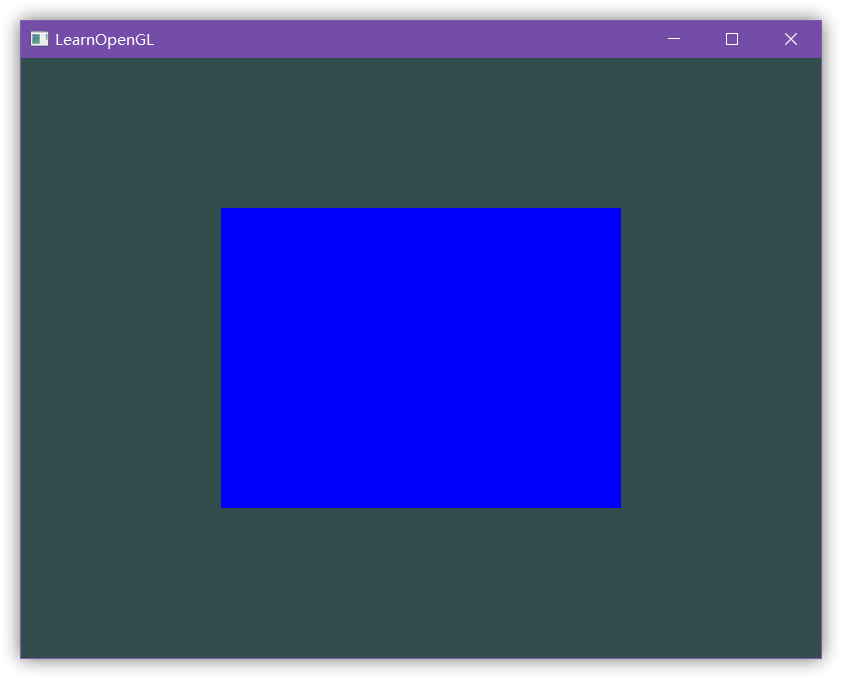

那我们更进一步，看看能否从应用程序中直接给片段着色器发送一个颜色

####Uniform#

Uniform是一种从CPU中的应用向GPU中的着色器发送数据的方式，但uniform和顶点属性有些不同，首先，uniform是_全局的(Global)_，
全局意味着uniform变量必须在每个着色器程序对象中都是独一无二的，而且它_可以被着色器程序的任意着色器在任意阶段访问_，然后，无论你把uniform值设置成什么，uniform会一直保存它们的数据，直到它们被重置或更新

我们可以在一个着色器中添加`uniform`关键字至类型和变量名前来声明一个GLSL的uniform  
从此处开始我们就可以在着色器中使用新声明的uniform了，以下是片段着色器的代码

    
    #version 330 core
    out vec4 FragColor;
    uniform vec4 ourColor; // 在OpenGL程序代码中设定这个变量
    void main()
    {
        FragColor = ourColor;
    }

我们在片段着色器中声明了一个uniform `vec4`的ourColor，并把片段着色器的输出颜色设置为uniform值的内容，因为uniform是全局变
量，我们可以在任何着色器中定义它们，而无需通过顶点着色器作为中介，顶点着色器中不需要这个uniform，所以我们不用顶点着色器里定义它

如果你_声明了一个uniform却在GLSL代码中没用过，编译器会静默移除这个变量_，导致最后编译出的版本中并不会包含它，这可能导致几个非常麻烦的错误

这个uniform现在还是空的；我们还没有给它添加任何数据，所以下面我们就做这件事

我们首先需要找到着色器中uniform属性的索引/位置值，当我们得到uniform的索引/位置值后，我们就可以更新它的值了，这次我们不去给像素传递单独一个颜色，而是让它随着时间改变颜色：

    
    //渲染循环内
    glUseProgram(shaderProgram);
    float timeValue = glfwGetTime();//获取运行的秒数
    float greenValue = (sin(timeValue) / 2.0f) + 0.5f;//让颜色在0.0到1.0之间改变，结果储存到greenValue里
    int vertexColorLocation = glGetUniformLocation(shaderProgram, "ourColor");//用glGetUniformLocation查询uniform ourColor的位置值
    glUniform4f(vertexColorLocation, 0.0f, greenValue, 0.0f, 1.0f);//通过glUniform4f函数设置uniform值

首先我们通过glfwGetTime()获取运行的秒数  
然后我们使用sin函数让颜色在0.0到1.0之间改变，最后将结果储存到greenValue里

接着，我们用glGetUniformLocation查询uniform ourColor的位置值，我们为查询函数提供着色器程序和uniform的名字（这是我们希望获得的位置值的来源），如果glGetUniformLocation返回`-1`就代表没有找到这个位置值

最后，我们可以通过glUniform4f函数设置uniform值，注意，查询uniform地址不要求你之前使用过着色器程序，但是更新一个uniform之前你**必须**先使用程序（调用glUseProgram)，因为它是在当前激活的着色器程序中设置uniform的

因为OpenGL在其核心是一个C库，所以它不支持类型重载，在_函数参数不同的时候就要为其定义新的函数_；glUniform是一个典型例子。这个函数有一个特定的后缀，标识设定的uniform的类型。可能的后缀有：

后缀 含义

`f`

函数需要一个float作为它的值

`i`

函数需要一个int作为它的值

`ui`

函数需要一个unsigned int作为它的值

`3f`

函数需要3个float作为它的值

`fv`

函数需要一个float向量/数组作为它的值

在我们的代码中，我们希望分别设定uniform的4个float值，所以我们通过glUniform4f传递我们的数据(也可以使用`fv`)

现在你知道如何设置uniform变量的值了，我们可以使用它们来渲染了，如果我们打算让颜色慢慢变化，我们就要在渲染循环的每一次迭代中（所以他会逐帧改变）更新这个uniform，否则三角形就不会改变颜色  
下面我们就计算greenValue然后每个渲染迭代都更新这个uniform：

 
    
    while (!glfwWindowShouldClose(window))
    {
        // 输入
        processInput(window);
        // 渲染指令
        glClearColor(0.2f, 0.3f, 0.3f, 1.0f);
        glClear(GL_COLOR_BUFFER_BIT);
        glUseProgram(shaderProgram);
        float timeValue = glfwGetTime();//获取运行的秒数
        float greenValue = (sin(timeValue) / 2.0f) + 0.5f;//让颜色在0.0到1.0之间改变，结果储存到greenValue里
        int vertexColorLocation = glGetUniformLocation(shaderProgram, "ourColor");//用glGetUniformLocation查询uniform ourColor的位置值
        glUniform4f(vertexColorLocation, 0.0f, greenValue, 0.0f, 1.0f);//通过glUniform4f函数设置uniform值
        glBindVertexArray(VAO);
        glDrawElements(GL_TRIANGLES, 6, GL_UNSIGNED_INT, 0);
        glBindVertexArray(0);
        // 检查并调用事件，交换缓冲
        glfwSwapBuffers(window);
        // 检查触发什么事件，更新窗口状态
        glfwPollEvents();
    }

这里的代码对之前代码是一次非常直接的修改。这次，我们在每次迭代绘制三角形前先更新uniform值

正确更新了uniform，就可以看到我们的矩形逐渐由绿变黑再变回绿色：

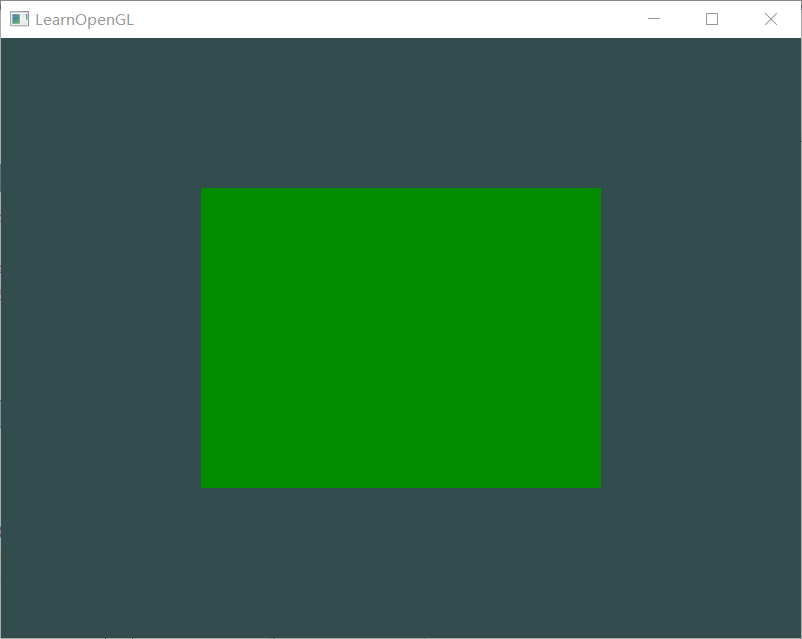

现在我们的代码如下：

    
    #include <glad/glad.h>
    #include <GLFW/glfw3.h>
    #include <iostream>
    void framebuffer_size_callback(GLFWwindow* window, int width, int height);
    void processInput(GLFWwindow* window);
    // settings
    const unsigned int SCR_WIDTH = 800;
    const unsigned int SCR_HEIGHT = 600;
    const char* vertexShaderSource = "#version 330 core\n"
    "layout (location = 0) in vec3 aPos;\n"
    "void main()\n"
    "{\n"
    "   gl_Position = vec4(aPos, 1.0);\n"
    "}\0";
    const char* fragmentShaderSource = "#version 330 core\n"
    "out vec4 FragColor;\n"
    "uniform vec4 ourColor;\n"
    "void main()\n"
    "{\n"
    "   FragColor = ourColor;\n"
    "}\n\0";
    int main()
    {
        // 实例化GLFW窗口
        glfwInit();//glfw初始化
        glfwWindowHint(GLFW_CONTEXT_VERSION_MAJOR, 3);//主版本号
        glfwWindowHint(GLFW_CONTEXT_VERSION_MINOR, 3);//次版本号
        glfwWindowHint(GLFW_OPENGL_PROFILE, GLFW_OPENGL_CORE_PROFILE);
        GLFWwindow* window = glfwCreateWindow(800, 600, "LearnOpenGL", NULL, NULL);
        //（宽，高，窗口名）返回一个GLFWwindow类的实例：window
        if (window == NULL)
        {
            // 生成错误则输出错误信息
            std::cout << "Failed to create GLFW window" << std::endl;
            glfwTerminate();
            return -1;
        }
        glfwMakeContextCurrent(window);
        // 告诉GLFW我们希望每当窗口调整大小的时候调用改变窗口大小的函数
        glfwSetFramebufferSizeCallback(window, framebuffer_size_callback);
        // glad管理opengl函数指针，初始化glad
        if (!gladLoadGLLoader((GLADloadproc)glfwGetProcAddress))
        {
            // 生成错误则输出错误信息
            std::cout << "Failed to initialize GLAD" << std::endl;
            return -1;
        }
        //build and compile 着色器程序
        //顶点着色器
        unsigned int vertexShader;
        vertexShader = glCreateShader(GL_VERTEX_SHADER);
        glShaderSource(vertexShader, 1, &vertexShaderSource, NULL);
        glCompileShader(vertexShader);
        //检查顶点着色器是否编译错误
        int  success;
        char infoLog[512];
        glGetShaderiv(vertexShader, GL_COMPILE_STATUS, &success);
        if (!success)
        {
            glGetShaderInfoLog(vertexShader, 512, NULL, infoLog);
            std::cout << "ERROR::SHADER::VERTEX::COMPILATION_FAILED\n" << infoLog << std::endl;
        }
        else {
            std::cout << "vertexShader complie SUCCESS" << std::endl;
        }
        //片段着色器
        unsigned int fragmentShader;
        fragmentShader = glCreateShader(GL_FRAGMENT_SHADER);
        glShaderSource(fragmentShader, 1, &fragmentShaderSource, NULL);
        glCompileShader(fragmentShader);
        //检查片段着色器是否编译错误
        glGetShaderiv(fragmentShader, GL_LINK_STATUS, &success);
        if (!success) {
            glGetShaderInfoLog(fragmentShader, 512, NULL, infoLog);
            std::cout << "ERROR::SHADER::FRAGMENT::COMPILATION_FAILED\n" << infoLog << std::endl;
        }
        else {
            std::cout << "fragmentShader complie SUCCESS" << std::endl;
        }
        //连接着色器
        unsigned int shaderProgram;
        shaderProgram = glCreateProgram();
        glAttachShader(shaderProgram, vertexShader);
        glAttachShader(shaderProgram, fragmentShader);
        glLinkProgram(shaderProgram);
        //检查片段着色器是否编译错误
        glGetProgramiv(shaderProgram, GL_LINK_STATUS, &success);
        if (!success) {
            glGetProgramInfoLog(shaderProgram, 512, NULL, infoLog);
            std::cout << "ERROR::SHADER::PROGRAM::LINKING_FAILED\n" << infoLog << std::endl;
        }
        else {
            std::cout << "shaderProgram complie SUCCESS" << std::endl;
        }
        //连接后删除
        glDeleteShader(vertexShader);
        glDeleteShader(fragmentShader);
        //顶点数据
        float vertices[] = {
            0.5f, 0.5f, 0.0f,   // 0号点
            0.5f, -0.5f, 0.0f,  // 1号点
            -0.5f, -0.5f, 0.0f, // 2号点
            -0.5f, 0.5f, 0.0f   // 3号点
        };
        unsigned int indices[] = { // 注意索引从0开始!
            0, 1, 3, // 第一个三角形
            1, 2, 3  // 第二个三角形
        };
        unsigned int VBO;
        glGenBuffers(1, &VBO);
        unsigned int VAO;
        glGenVertexArrays(1, &VAO);
        unsigned int EBO;
        glGenBuffers(1, &EBO);
        // 初始化代码
        // 1. 绑定顶点数组对象
        glBindVertexArray(VAO);
        // 2. 把我们的顶点数组复制到一个顶点缓冲中，供OpenGL使用
        glBindBuffer(GL_ARRAY_BUFFER, VBO);
        glBufferData(GL_ARRAY_BUFFER, sizeof(vertices), vertices, GL_STATIC_DRAW);
        // 3. 复制我们的索引数组到一个索引缓冲中，供OpenGL使用
        glBindBuffer(GL_ELEMENT_ARRAY_BUFFER, EBO);
        glBufferData(GL_ELEMENT_ARRAY_BUFFER, sizeof(indices), indices, GL_STATIC_DRAW);
        // 4. 设定顶点属性指针
        glVertexAttribPointer(0, 3, GL_FLOAT, GL_FALSE, 3 * sizeof(float), (void*)0);
        glEnableVertexAttribArray(0);
        ////线框模式wireframe
        //glPolygonMode(GL_FRONT_AND_BACK, GL_LINE);
        // 渲染循环
        while (!glfwWindowShouldClose(window))
        {
            // 输入
            processInput(window);
            // 渲染指令
            glClearColor(0.2f, 0.3f, 0.3f, 1.0f);
            glClear(GL_COLOR_BUFFER_BIT);
            glUseProgram(shaderProgram);
            float timeValue = glfwGetTime();//获取运行的秒数
            float greenValue = (sin(timeValue) / 2.0f) + 0.5f;//让颜色在0.0到1.0之间改变，结果储存到greenValue里
            int vertexColorLocation = glGetUniformLocation(shaderProgram, "ourColor");//用glGetUniformLocation查询uniform ourColor的位置值
            glUniform4f(vertexColorLocation, 0.0f, greenValue, 0.0f, 1.0f);//通过glUniform4f函数设置uniform值
            glBindVertexArray(VAO);
            glDrawElements(GL_TRIANGLES, 6, GL_UNSIGNED_INT, 0);
            glBindVertexArray(0);
            // 检查并调用事件，交换缓冲
            glfwSwapBuffers(window);
            // 检查触发什么事件，更新窗口状态
            glfwPollEvents();
        }
        // 释放之前的分配的所有资源
        glDeleteVertexArrays(1, &VAO);
        glDeleteBuffers(1, &VBO);
        glDeleteBuffers(1, &EBO);
        glfwTerminate();
        return 0;
    }
    void framebuffer_size_callback(GLFWwindow* window, int width, int height)
    {
        // 每当窗口改变大小，GLFW会调用这个函数并填充相应的参数供你处理
        glViewport(0, 0, width, height);
    }
    void processInput(GLFWwindow* window)
    {
        // 返回这个按键是否正在被按下
        if (glfwGetKey(window, GLFW_KEY_ESCAPE) == GLFW_PRESS)//是否按下了返回键
            glfwSetWindowShouldClose(window, true);
    }

####更多属性#

#####原版教程(一个三角形)#

我们已经了解了如何填充VBO、配置顶点属性指针以及如何把它们都储存到一个VAO里

这次，我们同样打算把颜色数据加进顶点数据中，我们将把颜色数据添加为3个float值至vertices数组，我们将把三角形的三个角分别指定为红色、绿色和蓝色：
    
    float vertices[] = {
        // 位置              // 颜色
         0.5f, -0.5f, 0.0f,  1.0f, 0.0f, 0.0f,   // 右下
        -0.5f, -0.5f, 0.0f,  0.0f, 1.0f, 0.0f,   // 左下
         0.0f,  0.5f, 0.0f,  0.0f, 0.0f, 1.0f    // 顶部
    };

由于现在有更多的数据要发送到顶点着色器，我们有必要去调整一下顶点着色器，使它能够接收颜色值作为一个顶点属性输入。需要注意的是我们用`layout`标识符来把aColor属性的位置值设置为1：
 
    
    #version 330 core
    layout (location = 0) in vec3 aPos;   // 位置变量的属性位置值为 0 
    layout (location = 1) in vec3 aColor; // 颜色变量的属性位置值为 1
    out vec3 ourColor; // 向片段着色器输出一个颜色
    void main()
    {
        gl_Position = vec4(aPos, 1.0);
        ourColor = aColor; // 将ourColor设置为我们从顶点数据那里得到的输入颜色
    }

由于我们不再使用uniform来传递片段的颜色了，现在使用`ourColor`输出变量，我们必须再修改一下片段着色器：

    
    #version 330 core
    out vec4 FragColor;  
    in vec3 ourColor;
    void main()
    {
        FragColor = vec4(ourColor, 1.0);
    }

因为我们也不用变换颜色了，激活着色器glUseProgram可以放到渲染循环外：

    
    // 激活着色器
    glUseProgram(shaderProgram);
    // 渲染循环
    while (!glfwWindowShouldClose(window))
    {
        // 输入
        processInput(window);
        // 渲染指令
        glClearColor(0.2f, 0.3f, 0.3f, 1.0f);
        glClear(GL_COLOR_BUFFER_BIT);
        glBindVertexArray(VAO);
        glDrawArrays(GL_TRIANGLES, 0, 3);
        // 交换缓冲并查询IO事件
        glfwSwapBuffers(window);
        glfwPollEvents();
    }

因为我们添加了另一个顶点属性，并且更新了VBO的内存，我们就必须重新配置顶点属性指针。更新后的VBO内存中的数据现在看起来像这样：

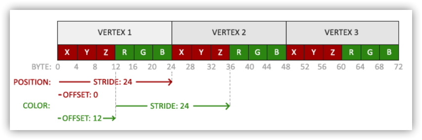

知道了现在使用的布局，我们就可以使用glVertexAttribPointer函数更新顶点格式，

    
    // 位置属性
    glVertexAttribPointer(0, 3, GL_FLOAT, GL_FALSE, 6 * sizeof(float), (void*)0);
    glEnableVertexAttribArray(0);
    // 颜色属性
    glVertexAttribPointer(1, 3, GL_FLOAT, GL_FALSE, 6 * sizeof(float), (void*)(3* sizeof(float)));
    glEnableVertexAttribArray(1);

glVertexAttribPointer函数的前几个参数比较明了。这次我们配置属性位置值为1的顶点属性，颜色值有3个float那么大，我们不去标准化这些值

由于我们现在有了两个顶点属性，我们不得不重新计算**步长**值，为获得数据队列中下一个属性值（比如位置向量的下个`x`分量）我们必须向右移动6个float，其中3个是位置值，另外3个是颜色值。这使我们的步长值为6乘以float的字节数（=24字节）  
同样，这次我们必须指定一个**偏移量**，对于每个顶点来说，位置顶点属性在前，所以它的偏移量是0，颜色属性紧随位置数据之后，所以偏移量就是`3 * sizeof(float)`，用字节来计算就是12字节

运行程序：

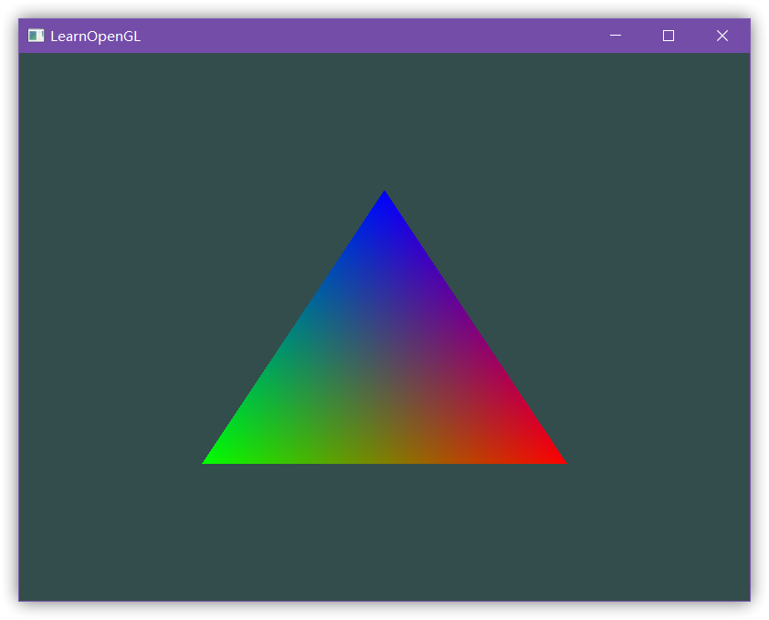

源码：

    
    #include <glad/glad.h>
    #include <GLFW/glfw3.h>
    #include <iostream> 
    void framebuffer_size_callback(GLFWwindow* window, int width, int height);
    void processInput(GLFWwindow *window);
    // settings
    const unsigned int SCR_WIDTH = 800;
    const unsigned int SCR_HEIGHT = 600;
    const char *vertexShaderSource = "#version 330 core\n"
    "layout (location = 0) in vec3 aPos;\n"
    "layout (location = 1) in vec3 aColor;\n"
    "out vec3 ourColor;\n"
    "void main()\n"
    "{\n"
    "   gl_Position = vec4(aPos, 1.0);\n"
    "   ourColor = aColor;\n"
    "}\0";
    const char *fragmentShaderSource = "#version 330 core\n"
    "out vec4 FragColor;\n"
    "in vec3 ourColor;\n"
    "void main()\n"
    "{\n"
    "   FragColor = vec4(ourColor, 1.0f);\n"
    "}\n\0";
    int main()
    {
        //glfw初始化
        glfwInit();
        glfwWindowHint(GLFW_CONTEXT_VERSION_MAJOR, 3);
        glfwWindowHint(GLFW_CONTEXT_VERSION_MINOR, 3);
        glfwWindowHint(GLFW_OPENGL_PROFILE, GLFW_OPENGL_CORE_PROFILE);
        //glfwWindowHint(GLFW_OPENGL_FORWARD_COMPAT, GL_TRUE);//MacOS
        //glfw window creation
        GLFWwindow* window = glfwCreateWindow(SCR_WIDTH, SCR_HEIGHT, "LearnOpenGL", NULL, NULL);
        if (window == NULL)
        {
            std::cout << "Failed to create GLFW window" << std::endl;
            glfwTerminate();
            return -1;
        }
        glfwMakeContextCurrent(window);
        glfwSetFramebufferSizeCallback(window, framebuffer_size_callback);
        //glad: load all OpenGL function pointers
        if (!gladLoadGLLoader((GLADloadproc)glfwGetProcAddress))
        {
            std::cout << "Failed to initialize GLAD" << std::endl;
            return -1;
        }
        //build and compile 着色器程序
            //顶点着色器
        unsigned int vertexShader;
        vertexShader = glCreateShader(GL_VERTEX_SHADER);
        glShaderSource(vertexShader, 1, &vertexShaderSource, NULL);
        glCompileShader(vertexShader);
        //检查顶点着色器是否编译错误
        int  success;
        char infoLog[512];
        glGetShaderiv(vertexShader, GL_COMPILE_STATUS, &success);
        if (!success)
        {
            glGetShaderInfoLog(vertexShader, 512, NULL, infoLog);
            std::cout << "ERROR::SHADER::VERTEX::COMPILATION_FAILED\n" << infoLog << std::endl;
        }
        else {
            std::cout << "vertexShader complie SUCCESS" << std::endl;
        }
        //片段着色器
        unsigned int fragmentShader;
        fragmentShader = glCreateShader(GL_FRAGMENT_SHADER);
        glShaderSource(fragmentShader, 1, &fragmentShaderSource, NULL);
        glCompileShader(fragmentShader);
        //检查片段着色器是否编译错误
        glGetShaderiv(fragmentShader, GL_LINK_STATUS, &success);
        if (!success) {
            glGetShaderInfoLog(fragmentShader, 512, NULL, infoLog);
            std::cout << "ERROR::SHADER::FRAGMENT::COMPILATION_FAILED\n" << infoLog << std::endl;
        }
        else {
            std::cout << "fragmentShader complie SUCCESS" << std::endl;
        }
        //连接到着色器程序
        unsigned int shaderProgram;
        shaderProgram = glCreateProgram();
        glAttachShader(shaderProgram, vertexShader);
        glAttachShader(shaderProgram, fragmentShader);
        glLinkProgram(shaderProgram);
        //检查片段着色器是否编译错误
        glGetProgramiv(shaderProgram, GL_LINK_STATUS, &success);
        if (!success) {
            glGetProgramInfoLog(shaderProgram, 512, NULL, infoLog);
            std::cout << "ERROR::SHADER::PROGRAM::LINKING_FAILED\n" << infoLog << std::endl;
        }
        else {
            std::cout << "shaderProgram complie SUCCESS" << std::endl;
        }
        //连接后删除
        glDeleteShader(vertexShader);
        glDeleteShader(fragmentShader);
        float vertices[] = {
            // 位置              // 颜色
             0.5f, -0.5f, 0.0f,  1.0f, 0.0f, 0.0f,   // 右下
            -0.5f, -0.5f, 0.0f,  0.0f, 1.0f, 0.0f,   // 左下
             0.0f,  0.5f, 0.0f,  0.0f, 0.0f, 1.0f    // 顶部
        };
        unsigned int VBO;
        glGenBuffers(1, &VBO);
        unsigned int VAO;
        glGenVertexArrays(1, &VAO);
        //初始化代码（只运行一次 (除非你的物体频繁改变)) 
        // 1. 绑定VAO
        glBindVertexArray(VAO);
        // 2. 把我们的顶点数组复制到一个顶点缓冲中，供OpenGL使用
        glBindBuffer(GL_ARRAY_BUFFER, VBO);
        glBufferData(GL_ARRAY_BUFFER, sizeof(vertices), vertices, GL_STATIC_DRAW);
        // 位置属性
        glVertexAttribPointer(0, 3, GL_FLOAT, GL_FALSE, 6 * sizeof(float), (void*)0);
        glEnableVertexAttribArray(0);
        // 颜色属性
        glVertexAttribPointer(1, 3, GL_FLOAT, GL_FALSE, 6 * sizeof(float), (void*)(3 * sizeof(float)));
        glEnableVertexAttribArray(1);
        // 激活着色器
        glUseProgram(shaderProgram);
        //线框模式wireframe
        //glPolygonMode(GL_FRONT_AND_BACK, GL_LINE);
        // 渲染循环
        while (!glfwWindowShouldClose(window))
        {
            // 输入
            processInput(window);
            // 渲染指令
            glClearColor(0.2f, 0.3f, 0.3f, 1.0f);
            glClear(GL_COLOR_BUFFER_BIT);
            // 更新uniform颜色
            glBindVertexArray(VAO);
            glDrawArrays(GL_TRIANGLES, 0, 3);
            // 交换缓冲并查询IO事件
            glfwSwapBuffers(window);
            glfwPollEvents();
        }
        glDeleteVertexArrays(1, &VAO);
        glDeleteBuffers(1, &VBO);
        glfwTerminate();
        return 0;
    }
    void framebuffer_size_callback(GLFWwindow* window, int width, int height)
    {
        glViewport(0, 0, width, height);
    }
    void processInput(GLFWwindow *window)
    {
        if (glfwGetKey(window, GLFW_KEY_ESCAPE) == GLFW_PRESS)//是否按下了返回键
            glfwSetWindowShouldClose(window, true);
    }

这个图片可能不是你所期望的那种，因为我们只提供了3个颜色，而不是我们现在看到的大调色板，这是在片段着色器中进行的所谓**片段插值(Fragment Interpolation)**的结果

当渲染一个三角形时，光栅化(Rasterization)阶段通常会造成比原指定顶点更多的片段，光栅会根据每个片段在三角形形状上所处相对位置决定这些片段的位置  
基于这些位置，它会插值(Interpolate)所有片段着色器的输入变量，比如说，我们有一个线段，上面的端点是绿色的，下面的端点是蓝色的。如果一个片段着色器在线段的70%的位置运行，它的颜色输入属性就会是一个绿色和蓝色的线性结合；更精确地说就是30%蓝 + 70%绿

这正是在这个三角形中发生了什么。我们有3个顶点，和相应的3个颜色，从这个三角形的像素来看它可能包含50000左右的片段，片段着色器为这些像素进行插值颜色。如果你仔细看这些颜色就应该能明白了：红首先变成到紫再变为蓝色。片段插值会被应用到片段着色器的所有输入属性上

#####矩形(两个三角形)#

我把矩形的四个角分别指定为白色，红色、绿色和蓝色：

    
    float vertices[] = {
        // 位置              // 颜色
         0.5f,  0.5f, 0.0f,  1.0f, 0.0f, 0.0f, // 0右上角
         0.5f, -0.5f, 0.0f,  0.0f, 1.0f, 0.0f, // 1右下角
        -0.5f, -0.5f, 0.0f,  0.0f, 0.0f, 1.0f, // 2左下角
        -0.5f,  0.5f, 0.0f,  1.0f, 1.0f, 1.0f  // 3左上角
    };
    unsigned int indices[] = { // 注意索引从0开始
        0, 1, 3, // 第一个三角形
        1, 2, 3  // 第二个三角形
    };

运行程序：

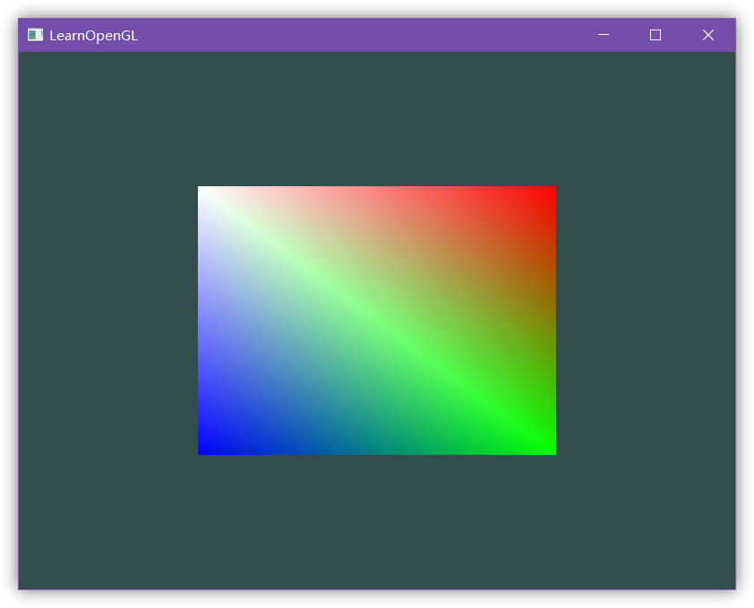

源码：
    
    #include <glad/glad.h>
    #include <GLFW/glfw3.h>
    #include <iostream> 
    void framebuffer_size_callback(GLFWwindow* window, int width, int height);
    void processInput(GLFWwindow *window);
    // settings
    const unsigned int SCR_WIDTH = 800;
    const unsigned int SCR_HEIGHT = 600;
    const char *vertexShaderSource = "#version 330 core\n"
    "layout (location = 0) in vec3 aPos;\n"
    "layout (location = 1) in vec3 aColor;\n"
    "out vec3 ourColor;\n"
    "void main()\n"
    "{\n"
    "   gl_Position = vec4(aPos, 1.0);\n"
    "   ourColor = aColor;\n"
    "}\0";
    const char *fragmentShaderSource = "#version 330 core\n"
    "out vec4 FragColor;\n"
    "in vec3 ourColor;\n"
    "void main()\n"
    "{\n"
    "   FragColor = vec4(ourColor, 1.0f);\n"
    "}\n\0";
    int main()
    {
        //glfw初始化
        glfwInit();
        glfwWindowHint(GLFW_CONTEXT_VERSION_MAJOR, 3);
        glfwWindowHint(GLFW_CONTEXT_VERSION_MINOR, 3);
        glfwWindowHint(GLFW_OPENGL_PROFILE, GLFW_OPENGL_CORE_PROFILE);
        //glfwWindowHint(GLFW_OPENGL_FORWARD_COMPAT, GL_TRUE);//MacOS
        //glfw window creation
        GLFWwindow* window = glfwCreateWindow(SCR_WIDTH, SCR_HEIGHT, "LearnOpenGL", NULL, NULL);
        if (window == NULL)
        {
            std::cout << "Failed to create GLFW window" << std::endl;
            glfwTerminate();
            return -1;
        }
        glfwMakeContextCurrent(window);
        glfwSetFramebufferSizeCallback(window, framebuffer_size_callback);
        //glad: load all OpenGL function pointers
        if (!gladLoadGLLoader((GLADloadproc)glfwGetProcAddress))
        {
            std::cout << "Failed to initialize GLAD" << std::endl;
            return -1;
        }
        //build and compile 着色器程序
            //顶点着色器
        unsigned int vertexShader;
        vertexShader = glCreateShader(GL_VERTEX_SHADER);
        glShaderSource(vertexShader, 1, &vertexShaderSource, NULL);
        glCompileShader(vertexShader);
        //检查顶点着色器是否编译错误
        int  success;
        char infoLog[512];
        glGetShaderiv(vertexShader, GL_COMPILE_STATUS, &success);
        if (!success)
        {
            glGetShaderInfoLog(vertexShader, 512, NULL, infoLog);
            std::cout << "ERROR::SHADER::VERTEX::COMPILATION_FAILED\n" << infoLog << std::endl;
        }
        else {
            std::cout << "vertexShader complie SUCCESS" << std::endl;
        }
        //片段着色器
        unsigned int fragmentShader;
        fragmentShader = glCreateShader(GL_FRAGMENT_SHADER);
        glShaderSource(fragmentShader, 1, &fragmentShaderSource, NULL);
        glCompileShader(fragmentShader);
        //检查片段着色器是否编译错误
        glGetShaderiv(fragmentShader, GL_LINK_STATUS, &success);
        if (!success) {
            glGetShaderInfoLog(fragmentShader, 512, NULL, infoLog);
            std::cout << "ERROR::SHADER::FRAGMENT::COMPILATION_FAILED\n" << infoLog << std::endl;
        }
        else {
            std::cout << "fragmentShader complie SUCCESS" << std::endl;
        }
        //连接到着色器程序
        unsigned int shaderProgram;
        shaderProgram = glCreateProgram();
        glAttachShader(shaderProgram, vertexShader);
        glAttachShader(shaderProgram, fragmentShader);
        glLinkProgram(shaderProgram);
        //检查片段着色器是否编译错误
        glGetProgramiv(shaderProgram, GL_LINK_STATUS, &success);
        if (!success) {
            glGetProgramInfoLog(shaderProgram, 512, NULL, infoLog);
            std::cout << "ERROR::SHADER::PROGRAM::LINKING_FAILED\n" << infoLog << std::endl;
        }
        else {
            std::cout << "shaderProgram complie SUCCESS" << std::endl;
        }
        //连接后删除
        glDeleteShader(vertexShader);
        glDeleteShader(fragmentShader);
        float vertices[] = {
            // 位置              // 颜色
             0.5f,  0.5f, 0.0f,  1.0f, 0.0f, 0.0f, // 右上角
             0.5f, -0.5f, 0.0f,  0.0f, 1.0f, 0.0f, // 右下角
            -0.5f, -0.5f, 0.0f,  0.0f, 0.0f, 1.0f, // 左下角
            -0.5f,  0.5f, 0.0f,  1.0f, 1.0f, 1.0f  // 左上角
        };
        unsigned int indices[] = { // 注意索引从0开始!
            0, 1, 3, // 第一个三角形
            1, 2, 3  // 第二个三角形
        };
        unsigned int VBO;
        glGenBuffers(1, &VBO);
        unsigned int VAO;
        glGenVertexArrays(1, &VAO);
        unsigned int EBO;
        glGenBuffers(1, &EBO);
        //初始化代码（只运行一次 (除非你的物体频繁改变)) 
        // 1. 绑定VAO
        glBindVertexArray(VAO);
        // 2. 把我们的顶点数组复制到一个顶点缓冲中，供OpenGL使用
        glBindBuffer(GL_ARRAY_BUFFER, VBO);
        glBufferData(GL_ARRAY_BUFFER, sizeof(vertices), vertices, GL_STATIC_DRAW);
        // 3. 复制我们的索引数组到一个索引缓冲中，供OpenGL使用
        glBindBuffer(GL_ELEMENT_ARRAY_BUFFER, EBO);
        glBufferData(GL_ELEMENT_ARRAY_BUFFER, sizeof(indices), indices, GL_STATIC_DRAW);
        // 4. 设定顶点属性指针
        // 位置属性
        glVertexAttribPointer(0, 3, GL_FLOAT, GL_FALSE, 6 * sizeof(float), (void*)0);
        glEnableVertexAttribArray(0);
        // 颜色属性
        glVertexAttribPointer(1, 3, GL_FLOAT, GL_FALSE, 6 * sizeof(float), (void*)(3 * sizeof(float)));
        glEnableVertexAttribArray(1);
        // 激活着色器
        glUseProgram(shaderProgram);
        glBindBuffer(GL_ARRAY_BUFFER, 0);
        glBindVertexArray(0);
        //线框模式wireframe
        //glPolygonMode(GL_FRONT_AND_BACK, GL_LINE);
        // 渲染循环
        while (!glfwWindowShouldClose(window))
        {
            // 输入
            processInput(window);
            // 渲染指令
            glClearColor(0.2f, 0.3f, 0.3f, 1.0f);
            glClear(GL_COLOR_BUFFER_BIT);
            glBindVertexArray(VAO);
            glDrawElements(GL_TRIANGLES, 6, GL_UNSIGNED_INT, 0);
            // 交换缓冲并查询IO事件
            glfwSwapBuffers(window);
            glfwPollEvents();
        }
        glDeleteVertexArrays(1, &VAO);
        glDeleteBuffers(1, &VBO);
        glDeleteBuffers(1, &EBO);
        glfwTerminate();
        return 0;
    }
    void framebuffer_size_callback(GLFWwindow* window, int width, int height)
    {
        glViewport(0, 0, width, height);
    }
    void processInput(GLFWwindow *window)
    {
        if (glfwGetKey(window, GLFW_KEY_ESCAPE) == GLFW_PRESS)//是否按下了返回键
            glfwSetWindowShouldClose(window, true);
    }

###着色器类#

编写、编译、管理着色器很麻烦，所以我们要写一个类专门处理这件事，它可以从硬盘读取着色器，然后编译并链接它们，并对它们进行错误检测

我们会把着色器类全部放在在头文件里，主要是为了学习用途，当然也方便移植，我们先建立一个`shader_s.h`：

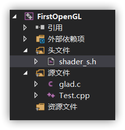

    
    #ifndef SHADER_H
    #define SHADER_H
    #include <glad/glad.h>; // 包含glad来获取所有的必须OpenGL头文件
    #include <string>
    #include <fstream>
    #include <sstream>
    #include <iostream>
    class Shader
    {
    public:
        // 生成一个ID
        unsigned int ID;
        // 构造函数
        Shader(const GLchar* vertexPath, const GLchar* fragmentPath);
        // 使用/激活程序
        void use();
        // uniform工具函数
        void setBool(const std::string &name, bool value) const;  
        void setInt(const std::string &name, int value) const;   
        void setFloat(const std::string &name, float value) const;
    };
    #endif

在上面，我们在头文件顶部使用了几个预处理指令(Preprocessor Directives)，这些预处理指令会告知你的编译器只在它没被包含过的情况下才包含和编译这个头文件，即使多个文件都包含了这个着色器头文件，它是用来防止链接冲突的

着色器类储存了着色器程序的ID，它的构造器需要顶点和片段着色器源代码的文件路径，这样我们就可以把源码的文本文件储存在硬盘上了  
除此之外，为了让我们的生活更轻松一点，还加入了一些工具函数：use用来激活着色器程序，所有的set…函数能够查询一个unform的位置值并设置它的值

然后我们要在原来的Test.cpp里include我们自己写的这个头文件

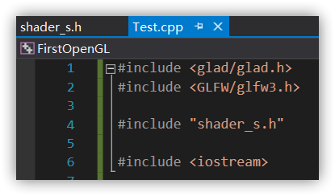

####从文件读取#

我们使用C++文件流读取着色器内容，储存到几个`string`对象里：

    
    Shader(const char* vertexPath, const char* fragmentPath)//顶点着色器和片段着色器的文件名
    {
        // 1. 从文件路径中获取顶点/片段着色器
        std::string vertexCode;
        std::string fragmentCode;
        std::ifstream vShaderFile;
        std::ifstream fShaderFile;
        // 保证ifstream对象可以抛出异常：
        vShaderFile.exceptions (std::ifstream::failbit | std::ifstream::badbit);
        fShaderFile.exceptions (std::ifstream::failbit | std::ifstream::badbit);
        try 
        {
            // 打开文件
            vShaderFile.open(vertexPath);
            fShaderFile.open(fragmentPath);
            std::stringstream vShaderStream, fShaderStream;
            // 读取文件的缓冲内容到数据流中
            vShaderStream << vShaderFile.rdbuf();
            fShaderStream << fShaderFile.rdbuf();       
            // 关闭文件处理器
            vShaderFile.close();
            fShaderFile.close();
            // 转换数据流到string
            vertexCode   = vShaderStream.str();
            fragmentCode = fShaderStream.str();     
        }
        catch(std::ifstream::failure e)
        {
            std::cout << "ERROR::SHADER::FILE_NOT_SUCCESFULLY_READ" << std::endl;
        }
        const char* vShaderCode = vertexCode.c_str();
        const char* fShaderCode = fragmentCode.c_str();
        [...]

下一步，我们需要编译和链接着色器，注意，我们也将检查编译/链接是否失败，如果失败则打印编译时错误，调试的时候这些错误输出会及其重要（你总会需要这些错误日志的）：

    
    // 2. 编译着色器
    unsigned int vertex, fragment;
    int success;
    char infoLog[512];
    // 顶点着色器
    vertex = glCreateShader(GL_VERTEX_SHADER);
    glShaderSource(vertex, 1, &vShaderCode, NULL);
    glCompileShader(vertex);
    // 打印编译错误（如果有的话）
    glGetShaderiv(vertex, GL_COMPILE_STATUS, &success);
    if(!success)
    {
        glGetShaderInfoLog(vertex, 512, NULL, infoLog);
        std::cout << "ERROR::SHADER::VERTEX::COMPILATION_FAILED\n" << infoLog << std::endl;
    };
    // 片段着色器也类似
    [...]
    // 着色器程序
    ID = glCreateProgram();
    glAttachShader(ID, vertex);
    glAttachShader(ID, fragment);
    glLinkProgram(ID);
    // 打印连接错误（如果有的话）
    glGetProgramiv(ID, GL_LINK_STATUS, &success);
    if(!success)
    {
        glGetProgramInfoLog(ID, 512, NULL, infoLog);
        std::cout << "ERROR::SHADER::PROGRAM::LINKING_FAILED\n" << infoLog << std::endl;
    }
    // 删除着色器，它们已经链接到我们的程序中了，已经不再需要了
    glDeleteShader(vertex);
    glDeleteShader(fragment);

use函数非常简单：

    
    void use() 
    { 
        glUseProgram(ID);
    }

uniform的setter函数也很类似：

    
    void setBool(const std::string &name, bool value) const
    {
        glUniform1i(glGetUniformLocation(ID, name.c_str()), (int)value); 
    }
    void setInt(const std::string &name, int value) const
    { 
        glUniform1i(glGetUniformLocation(ID, name.c_str()), value); 
    }
    void setFloat(const std::string &name, float value) const
    {
        glUniform1f(glGetUniformLocation(ID, name.c_str()), value); 
    } 

以下几个set的写法，之后会用到，先不用写：

    
    void setVec2(const std::string & name, const glm::vec2 & value) const
    {
        glUniform2fv(glGetUniformLocation(ID, name.c_str()), 1, &value[0]);
    }
    void setVec2(const std::string & name, float x, float y) const
    {
        glUniform2f(glGetUniformLocation(ID, name.c_str()), x, y);
    }
    // ------------------------------------------------------------------------
    void setVec3(const std::string & name, const glm::vec3 & value) const
    {
        glUniform3fv(glGetUniformLocation(ID, name.c_str()), 1, &value[0]);
    }
    void setVec3(const std::string & name, float x, float y, float z) const
    {
        glUniform3f(glGetUniformLocation(ID, name.c_str()), x, y, z);
    }
    // ------------------------------------------------------------------------
    void setVec4(const std::string & name, const glm::vec4 & value) const
    {
        glUniform4fv(glGetUniformLocation(ID, name.c_str()), 1, &value[0]);
    }
    void setVec4(const std::string & name, float x, float y, float z, float w)
    {
        glUniform4f(glGetUniformLocation(ID, name.c_str()), x, y, z, w);
    }
    // ------------------------------------------------------------------------
    void setMat2(const std::string & name, const glm::mat2 & mat) const
    {
        glUniformMatrix2fv(glGetUniformLocation(ID, name.c_str()), 1, GL_FALSE, &mat[0][0]);
    }
    // ------------------------------------------------------------------------
    void setMat3(const std::string & name, const glm::mat3 & mat) const
    {
        glUniformMatrix3fv(glGetUniformLocation(ID, name.c_str()), 1, GL_FALSE, &mat[0][0]);
    }
    // ------------------------------------------------------------------------
    void setMat4(const std::string & name, const glm::mat4 & mat) const
    {
        glUniformMatrix4fv(glGetUniformLocation(ID, name.c_str()), 1, GL_FALSE, &mat[0][0]);
    }

现在我们就写完了一个完整的着色器类，使用这个着色器类就很简单了：

    
    Shader ourShader("path/to/shaders/shader.vs", "path/to/shaders/shader.fs");
    ...
    while(...)
    {
        ourShader.use();
        ourShader.setFloat("someUniform", 1.0f);
        DrawStuff();
    }

我们把顶点和片段着色器储存为两个叫做`shader.vs`和`shader.fs`的文件（包括后缀都可以随意改，在你的代码里也做相应的改动就行了）

shader_s.h的完整代码：

    
    #ifndef SHADER_H
    #define SHADER_H
    #include <glad/glad.h>; // 包含glad来获取所有的必须OpenGL头文件
    #include <string>
    #include <fstream>
    #include <sstream>
    #include <iostream>
    class Shader
    {
    public:
        // 程序ID
        unsigned int ID;
        // 构造器读取并构建着色器 
        Shader(const char* vertexPath, const char* fragmentPath)
        {
            // 1. 从文件路径中获取顶点/片段着色器
            std::string vertexCode;
            std::string fragmentCode;
            std::ifstream vShaderFile;
            std::ifstream fShaderFile;
            // 保证ifstream对象可以抛出异常：
            vShaderFile.exceptions(std::ifstream::failbit | std::ifstream::badbit);
            fShaderFile.exceptions(std::ifstream::failbit | std::ifstream::badbit);
            try
            {
                // 打开文件
                vShaderFile.open(vertexPath);
                fShaderFile.open(fragmentPath);
                std::stringstream vShaderStream, fShaderStream;
                // 读取文件的缓冲内容到数据流中
                vShaderStream << vShaderFile.rdbuf();
                fShaderStream << fShaderFile.rdbuf();
                // 关闭文件处理器
                vShaderFile.close();
                fShaderFile.close();
                // 转换数据流到string
                vertexCode = vShaderStream.str();
                fragmentCode = fShaderStream.str();
            }
            catch (std::ifstream::failure e)
            {
                std::cout << "ERROR::SHADER::FILE_NOT_SUCCESFULLY_READ" << std::endl;
            }
            const char* vShaderCode = vertexCode.c_str();
            const char* fShaderCode = fragmentCode.c_str();
            // 2. 编译着色器
            unsigned int vertex, fragment;
            // 顶点着色器
            vertex = glCreateShader(GL_VERTEX_SHADER);
            glShaderSource(vertex, 1, &vShaderCode, NULL);
            glCompileShader(vertex);
            checkCompileErrors(vertex, "VERTEX");
            // 片段着色器也类似
            fragment = glCreateShader(GL_FRAGMENT_SHADER);
            glShaderSource(fragment, 1, &fShaderCode, NULL);
            glCompileShader(fragment);
            checkCompileErrors(fragment, "FRAGMENT");
            // 着色器程序
            ID = glCreateProgram();
            glAttachShader(ID, vertex);
            glAttachShader(ID, fragment);
            glLinkProgram(ID);
            checkCompileErrors(ID, "PROGRAM");
            // 删除着色器，它们已经链接到我们的程序中了，已经不再需要了
            glDeleteShader(vertex);
            glDeleteShader(fragment);
        }
        // 激活着色器
        void use()
        {
            glUseProgram(ID);
        }
        // uniform的setter函数
        void setBool(const std::string &name, bool value) const
        {
            glUniform1i(glGetUniformLocation(ID, name.c_str()), (int)value);
        }
        void setInt(const std::string &name, int value) const
        {
            glUniform1i(glGetUniformLocation(ID, name.c_str()), value);
        }
        void setFloat(const std::string &name, float value) const
        {
            glUniform1f(glGetUniformLocation(ID, name.c_str()), value);
        }
    private:
        // 检查编译或链接是否出错
        void checkCompileErrors(unsigned int shader, std::string type)
        {
            int success;
            char infoLog[1024];
            if (type != "PROGRAM")
            {
                glGetShaderiv(shader, GL_COMPILE_STATUS, &success);
                if (!success) //打印连接错误（如果有的话）
                {
                    glGetShaderInfoLog(shader, 1024, NULL, infoLog);
                    std::cout << "ERROR::SHADER_COMPILATION_ERROR of type: " << type << "\n" << infoLog << "\n -- --------------------------------------------------- -- " << std::endl;
                }
            }
            else
            {
                glGetProgramiv(shader, GL_LINK_STATUS, &success);
                if (!success) //打印连接错误（如果有的话）
                {
                    glGetProgramInfoLog(shader, 1024, NULL, infoLog);
                    std::cout << "ERROR::PROGRAM_LINKING_ERROR of type: " << type << "\n" << infoLog << "\n -- --------------------------------------------------- -- " << std::endl;
                }
            }
        }
    };
    #endif

####应用着色器类#

建立Shader类之后就轻松多了

首先建两个文件分别存顶点着色器代码和片段着色器代码

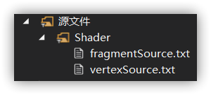

着色器代码直接写进去，再也不用“”引来引去了

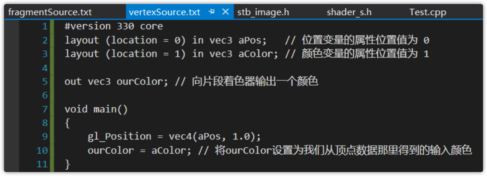

注意VS的C++工程里，筛选器（就是这个看上去像文件夹的）不是真的文件夹，在项目路径下是没有Shader这个文件夹的

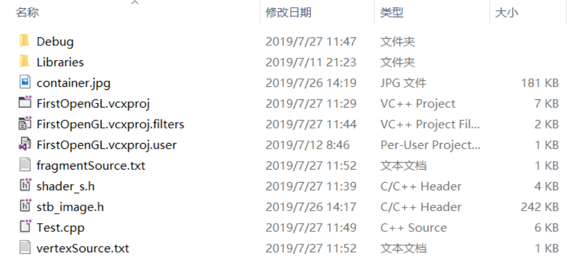

所以我们在Main.cpp（我工程里的Test.cpp）里要这样写：

    
    Shader ourShader("vertexSource.txt", "fragmentSource.txt");

当然这一堆你也不用写了，全部注释掉

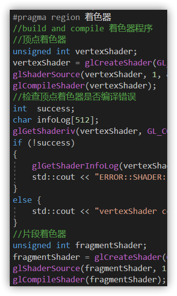

你要做的只是把
    
    glUseProgram(shaderProgram);

替换成

    
    ourShader.use();

就大功告成了

###扩展练习#

####1.3.1倒置三角形#

修改顶点着色器倒置三角形

这是我们原来的顶点着色器代码

    
    #version 330 core
    layout (location = 0) in vec3 aPos;
    layout (location = 1) in vec3 aColor;
    out vec3 ourColor;
    void main()
    {
       gl_Position = vec4(aPos.x, aPos.y, aPos.z, 1.0);
       ourColor = aColor;
    }

修改后

    
    #version 330 core
    layout (location = 0) in vec3 aPos;
    layout (location = 1) in vec3 aColor;
    out vec3 ourColor;
    void main()
    {
        gl_Position = vec4(aPos.x, -aPos.y, aPos.z, 1.0); // just add a - to the y position
        ourColor = aColor;
    }

效果如下

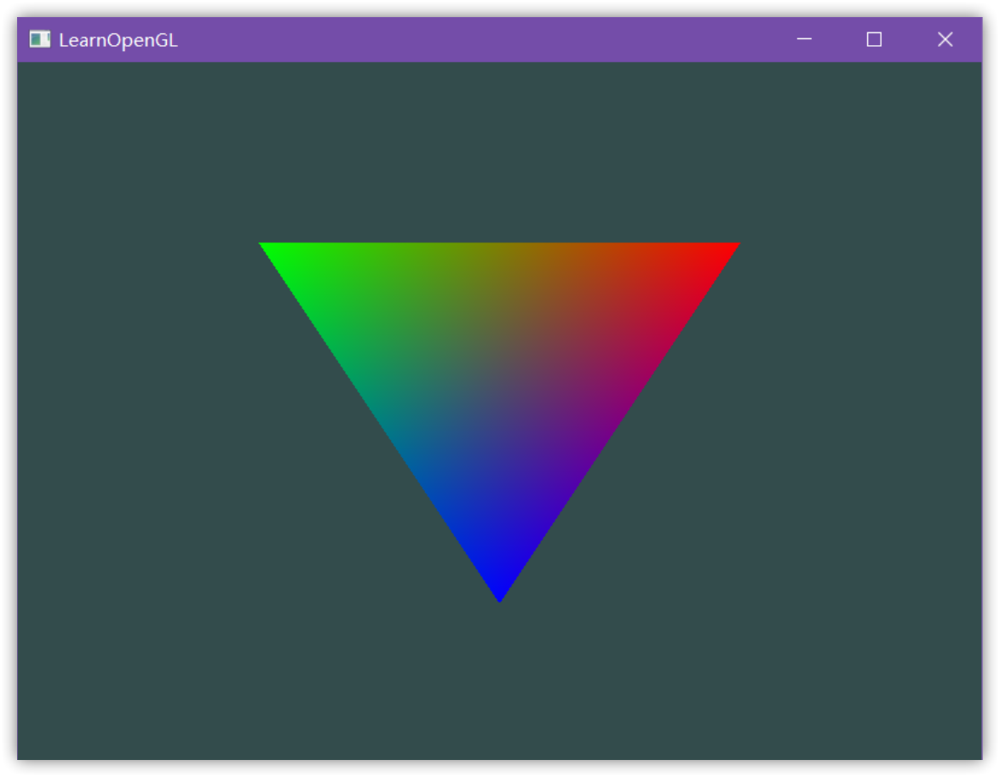

####1.3.2移动三角形#

使用uniform定义一个水平偏移量，在**顶点着色器**中使用这个偏移量把三角形移动到屏幕右侧

先写好顶点着色器：

    
    // vertex shader:
    #version 330 core
    layout (location = 0) in vec3 aPos;
    layout (location = 1) in vec3 aColor;
    out vec3 ourColor;
    uniform float xOffset;
    void main()
    {
        gl_Position = vec4(aPos.x + xOffset, aPos.y, aPos.z, 1.0); // add the xOffset to the x position of the vertex position
        ourColor = aColor;
    }

在我们没部署好着色器类的时候，我们需要这么写：
    
    // 渲染循环中        
    // 更新uniform
    float timeValue = glfwGetTime();
    float rightValue = (sin(timeValue) / 2.0f) + 0.5f;
    int vertexColorLocation = glGetUniformLocation(shaderProgram, "xOffset");//用glGetUniformLocation查询uniform xOffset的位置值
    glUseProgram(shaderProgram);//通过glUniform4f函数设置uniform值
    glUniform1f(vertexColorLocation, rightValue);//通过glUniform4f函数设置uniform值

其中shaderProgram这个ID值是在渲染循环外获得的：

   
    
    int shaderProgram = glCreateProgram();
    glAttachShader(shaderProgram, vertexShader);
    glAttachShader(shaderProgram, fragmentShader);
    glLinkProgram(shaderProgram);
    glGetProgramiv(shaderProgram, GL_LINK_STATUS, &success);
    if (!success) {
        glGetProgramInfoLog(shaderProgram, 512, NULL, infoLog);
        std::cout << "ERROR::SHADER::PROGRAM::LINKING_FAILED\n" << infoLog << std::endl;
    }

但是我们在Shader类里已经写好了这些东西，和几个Set的函数

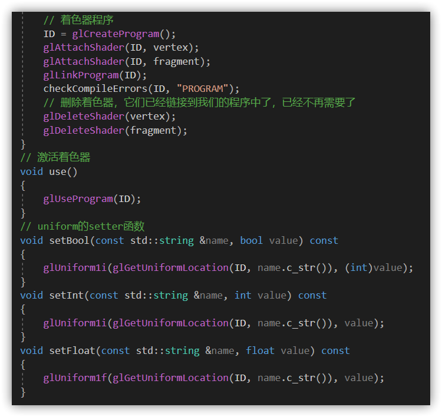

那就舒服多了，在渲染循环中直接这么来：

    
    // 更新uniform
    float timeValue = glfwGetTime();
    float rightValue = (sin(timeValue) / 2.0f);
    ourShader.setFloat("xOffset", rightValue);

awesome~！

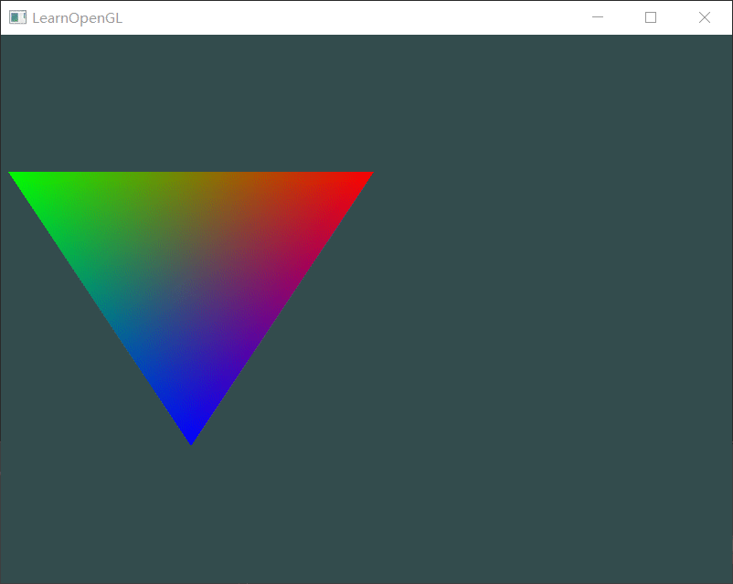

结合之前变换颜色的套路，我们加点花样：

    
    // fragment Shader
    #version 330 core
    out vec4 FragColor;  
    uniform vec4 ourColor;
    void main()
    {
        FragColor = ourColor;
    }

由于这个uniform是个vec4，我们在shader\_s头文件里反手给它一个超级加倍

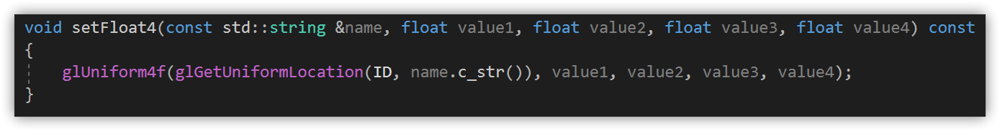

然后我们在渲染循环里给他个字：明牌

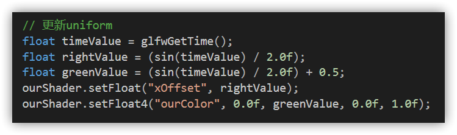

然后就是我们最最激动的rewarding moment：

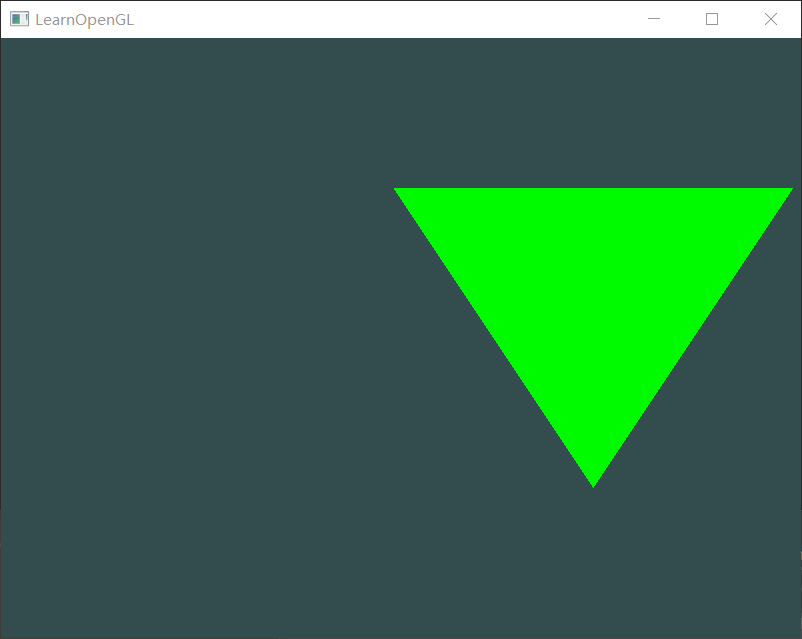
