 
<!--BEGIN_DATA
{
    "create_date": "2019-11-21 17:59", 
    "modify_date": "2019-11-21 17:59", 
    "is_top": "0", 
    "summary": "OpenGL入门系列-2", 
    "tags": "OpenGL、C/C++", 
    "file_name": "OpenGL入门系列-2.md"
}
END_DATA-->

####
原文出处：<a href='https://www.cnblogs.com/zhxmdefj/p/11255134.html' target='blank'>OpenGL入门1.4：纹理/贴图Texture</a>

每一个小步骤的源码都放在了[Github](https://github.com/zhxmdefj/OpenGL-development-tour.git)

> 的内容为插入注释，可以先跳过

###前言#

游戏玩家对Texture这个词应该不陌生，我们已经知道了怎么为每个顶点添加颜色来增加图形的细节，但，如果想让图形看起来更真实，颜色更多，就必须有足够多的顶点，从而指定足够多的颜色，就会产生很多额外开销，所以现在我们需要**纹理(Texture)**，也可翻译做**贴图**，下面统称纹理

###什么是Texture#

纹理是一个2D图片（也有1D和3D的Texture），它可以用来添加物体的细节，我们可以在一张图片上插入非常多的细节，这样就可以让物体非常精细而不用指定额外的顶点

为了能够把纹理映射(Map)到三角形上，我们需要指定三角形的每个顶点各自对应纹理的哪个部分，这样每个顶点就会关联着一个**纹理坐标(Texture Coordinate)**，用来标明该从纹理图像的哪个部分采样，之后在图形的其它片段上进行**片段插值(Fragment Interpolation)**

纹理坐标在x和y轴上，范围为0到1之间（注意我们现在使用的是2D纹理图像），使用纹理坐标获取纹理颜色叫做**采样(Sampling)**，_纹理坐标起始于(0, 0)，也就是纹理图片的左下角，终始于(1, 1)，即纹理图片的右上角_

下图是把纹理坐标映射到三角形上

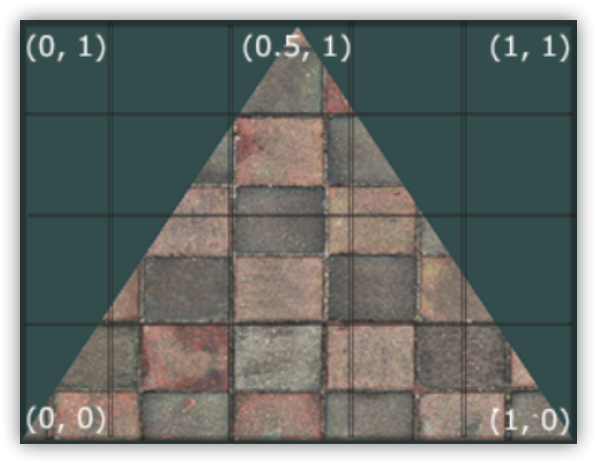

我们为三角形指定了3个纹理坐标点：`(0,0)` ，`(0.5,1.0)`，`(1,0)` ，如上图

我们希望三角形的左下角对应纹理的左下角，因此我们把三角形左下角顶点的纹理坐标设置为`(0, 0)`；三角形的上顶点对应于图片的上中位置所以我们把它的纹理坐标设置为`(0.5,1.0)`；同理右下方的顶点设置为`(1,
0)`，我们只要给顶点着色器传递这三个纹理坐标就行了，接下来它们会被传片段着色器中，它会为每个片段进行纹理坐标的插值

纹理坐标：
    
    float texCoords[] = {
        0.0f, 0.0f, // 左下角
        1.0f, 0.0f, // 右下角
        0.5f, 1.0f  // 上中
    };

对纹理的**采样**是一个很模糊的概念，它可以采用几种不同的插值方式，所以你需要自己告诉OpenGL该**怎样对纹理采样**

####纹理环绕方式#

纹理坐标的范围通常是从(0, 0)到(1,1)，那如果我们把纹理坐标设置在范围之外会发生什么？默认情况下OpenGL会**重复贴上这个纹理图像**，同时OpenGL也提供了更多的选择：

环绕方式 描述

GL\_REPEAT

默认选择，重复纹理图像

GL\_MIRRORED\_REPEAT

和GL\_REPEAT一样，但每次重复图片是**镜像**放置的

GL\_CLAMP\_TO\_EDGE

纹理坐标会被**约束在0到1之间**，超出的部分会重复纹理坐标的边缘，产生一种边缘被拉伸的效果

GL\_CLAMP\_TO\_BORDER

用户指定边缘颜色，作为超出的坐标的颜色

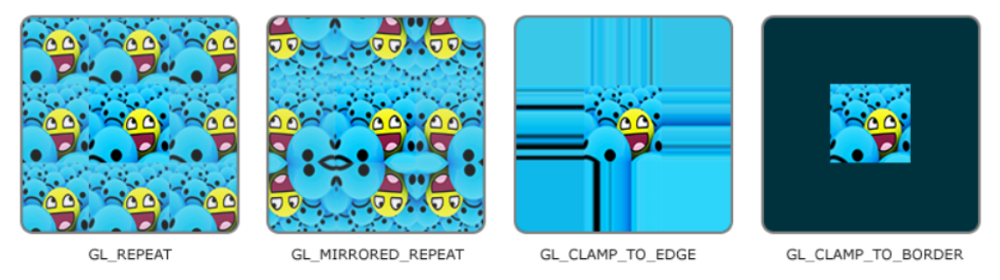

前面提到的每个选项都可以使用`glTexParameter*`函数对单独的一个坐标轴设置（`s`、`t`（如果是使用3D纹理那么还有一个`r`）它们和`x`、`y`、`z`是等价的）：

    
    glTexParameteri(GL_TEXTURE_2D, GL_TEXTURE_WRAP_S, GL_MIRRORED_REPEAT);
    glTexParameteri(GL_TEXTURE_2D, GL_TEXTURE_WRAP_T, GL_MIRRORED_REPEAT);

  1. 第一个参数指定了纹理目标；我们使用的是2D纹理，因此纹理目标是GL\_TEXTURE\_2D
  2. 第二个参数需要我们指定设置的选项与应用的纹理轴，我们打算配置的是`WRAP`选项，并且指定`S`和`T`轴
  3. 最后一个参数需要我们传递一个环绕方式(Wrapping)，在这个例子中OpenGL会给当前激活的纹理设定纹理环绕方式为GL\_MIRRORED\_REPEAT。

如果我们选择GL\_CLAMP\_TO\_BORDER选项，我们还需要指定一个边缘的颜色。这需要使用glTexParameter函数的`fv`后缀形式，用GL\_TEXTURE\_BORDER\_COLOR作为它的选项，并且传递一个float数组作为边缘的颜色值：

    
    float borderColor[] = { 1.0f, 1.0f, 0.0f, 1.0f };
    glTexParameterfv(GL_TEXTURE_2D, GL_TEXTURE_BORDER_COLOR, borderColor);

####纹理过滤#

纹理坐标不依赖于分辨率(Resolution)，它可以是任意浮点值，所以OpenGL需要知道怎样将**纹理像素(Texture Pixel)**映射到纹理坐标

Texture Pixel也叫Texel，你可以想象你打开一张`.jpg`格式图片，不断放大你会发现它是由无数像素点组成的，这个点就是**纹理像素**；注意
不要和纹理坐标搞混了，**纹理坐标**是你给模型顶点设置的那个数组，OpenGL以这个顶点的纹理坐标数据去查找纹理图像上的像素，然后进行采样提取纹理像素的颜色，当你有一个很大的物体但是纹理的分辨率很低的时候这就变得很重要了

OpenGL当然也有对于**纹理过滤(Texture Filtering)**的选项，选项有多个，但是现在我们只讨论最重要的两种：`GL_NEAREST`和`GL_LINEAR`

#####GL_NEAREST#

**GL_NEAREST（邻近过滤，Nearest Neighbor Filtering）**是OpenGL默认的纹理过滤方式  
当设置为GL\_NEAREST的时候，OpenGL会返回**中心点最接近纹理坐标的那个像素**，下图中你可以看到四个像素，加号代表纹理坐标，左上角那个纹理像素的中心距离纹理坐标最近，所以它会被选择为样本颜色

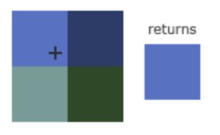

#####GL_LINEAR#

**GL_LINEAR（线性过滤，(Bi)linear Filtering）**它会基于纹理坐标附近的纹理像素，计算出一个插值，近似出这些纹理像素之间的颜色，一个纹理像素的中心距离纹理坐标越近，那么这个纹理像素的颜色对最终的样本颜色的贡献越大：

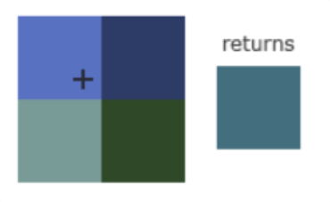

让我们来看看在一个很大的物体上应用一张低分辨率的纹理会发生什么：

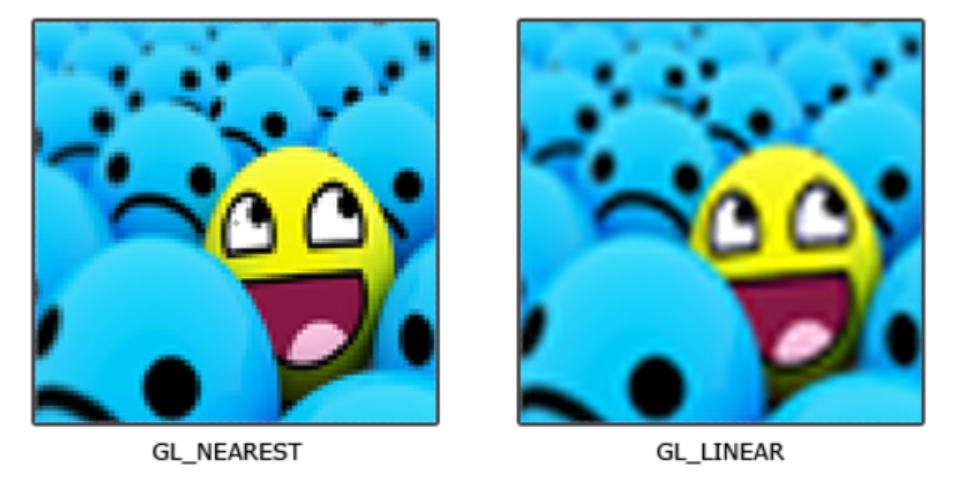

`GL_NEAREST`产生了颗粒状的图案，我们能够清晰看到组成纹理的像素，而`GL_LINEAR`能够产生更平滑的图案，很难看出单个的纹理像素，`GL_LINEAR`可以产生更真实的输出，但有些开发者更喜欢8-bit风格，所以他们会用`GL_NEAREST`选项

当进行放大(Magnify)和缩小(Minify)操作的时候可以设置纹理过滤的选项，比如你可以**在纹理被缩小的时候使用邻近过滤，被放大时使用线性过滤**

我们需要使用`glTexParameter*`函数为放大和缩小指定过滤方式，和纹理环绕方式的设置很相似，不再做过多解释

    
    glTexParameteri(GL_TEXTURE_2D, GL_TEXTURE_MIN_FILTER, GL_NEAREST);
    glTexParameteri(GL_TEXTURE_2D, GL_TEXTURE_MAG_FILTER, GL_LINEAR);

####多级渐远纹理#

想象一下，假设我们有一个包含着上千物体的大房间，每个物体上都有纹理，有些物体会很远，但其纹理会拥有与近处物体同样高的分辨率，由于远处的物体可能只产生很少的片段，OpenGL从高分辨率纹理中为这些片段获取正确的颜色值就很困难，因为它需要对一个跨过纹理很大部分的片段只拾取一个纹理颜色，先不提在小物体上会产生失真，浪费内存的就够喝一壶了

OpenGL则使用**多级渐远纹理(Mipmap)**来解决这个问题

简单来说就是有一系列的纹理图像，后一个纹理图像是前一个的二分之一，距观察者的距离超过一定的阈值，OpenGL会使用不同的多级渐远纹理，即最适合物体的距离的那个

由于距离远，解析度不高也不会被用户注意到，同时它的性能非常好，就如下图：

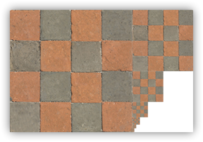

当然手工为每个纹理图像创建一系列多级渐远纹理绝对很麻烦，幸好OpenGL有一个`glGenerateMipmaps`函数，在创建完一个纹理后调用它OpenGL就会承担接下来的所有工作了，我们之后会讨论如何使用它

在渲染中切换多级渐远纹理级别(Level)时，OpenGL在两个不同级别的多级渐远纹理层之间会产生不真实的生硬边界，就像普通的纹理过滤一样，切换多级渐远纹理级别时你也可以在**两个不同多级渐远纹理级别之间**使用NEAREST和LINEAR过滤，为了指定不同多级渐远纹理级别之间的过滤方式，你可以使用下面四个选项中的一个代替原有的过滤方式：

过滤方式 描述

GL\_NEAREST\_MIPMAP\_NEAREST

使用最邻近的多级渐远纹理来匹配像素大小，并使用邻近插值进行纹理采样

GL\_LINEAR\_MIPMAP\_NEAREST

使用最邻近的多级渐远纹理级别，并使用线性插值进行采样

GL\_NEAREST\_MIPMAP\_LINEAR

在两个最匹配像素大小的多级渐远纹理之间进行线性插值，使用邻近插值进行采样

GL\_LINEAR\_MIPMAP\_LINEAR

在两个邻近的多级渐远纹理之间使用线性插值，并使用线性插值进行采样

就像纹理过滤一样，我们可以使用glTexParameteri将过滤方式设置为前面四种提到的方法之一：

    
    glTexParameteri(GL_TEXTURE_2D, GL_TEXTURE_MIN_FILTER, GL_LINEAR_MIPMAP_LINEAR);
    glTexParameteri(GL_TEXTURE_2D, GL_TEXTURE_MAG_FILTER, GL_LINEAR);

一个常见的错误是，**将放大过滤的选项设置为多级渐远纹理过滤选项之一**，这样没有任何效果，因为多级渐远纹理主要是使用在纹理被缩小的情况下的：纹理放大不会使用多级渐远纹理，为放大过滤设置多级渐远纹理的选项会产生一个`GL_INVALID_ENUM`错误代码

###加载与创建Texture#

使用纹理之前要做的第一件事是把它们加载到我们的应用中

图片可能被储存`.jpg` `.png`等为各种各样的格式，每种都有自己的数据结构和排列，我们要怎样读进来呢？最直接的办法是选一个需要的文件格式，比如`.png`，然后自己写一个图像加载器，把图像转化为字节序列，虽然不难，但仍然挺麻烦的，而且如果要支持更多文件格式呢？当然这不是我们现在应该深究的，所以我们将使用一个第三方的图片库来解决这个问题

####stb_image.h#

`stb_image.h`是[Sean Barrett](https://github.com/nothings)的一个非常流行的单头文件图像加载库，它能够加载大部分流行的文件格式，并且能够很简单得整合到你的工程之中，`stb_image.h`可以在[这里](https://github.com/nothings/stb/blob/master/stb_image.h)下载，下载这一个头文件，将它以`stb_image.h`的名字加入你的工程，并另创建一个新的C++文件，输入以下代码：

    
    #define STB_IMAGE_IMPLEMENTATION
    #include "stb_image.h"

通过定义STB_IMAGE_IMPLEMENTATION，预处理器会修改头文件，让其只包含相关的函数定义源码，等于是将这个头文件变为一个 `.cpp` 文件了，现在只需要在你的程序中包含`stb_image.h`并编译就可以了

现在我们要先下载一张[木箱](https://img2018.cnblogs.com/blog/1536438/201907/1536438-20190727143554625-160580333.png)的图片用作测试

然后使用`stb_image.h`加载图片，调用`stbi_load`函数：

    
    int width, height, nrChannels;
    unsigned char *data = stbi_load("container.jpg", &width, &height, &nrChannels, 0);

这个函数首先接受一个图像文件的路径作为输入，接下来它需要三个`int`作为它的第二、三、四个参数，`stb_image.h`将会用图像的**宽度**、**高度**和**颜色通道的个数**填充这三个变量。我们之后生成纹理的时候会用到的图像的宽度和高度的。

####生成纹理#

和之前生成的OpenGL对象一样，纹理也是使用ID引用的，应该不难让你想起创建VAO和VBO的过程

    
    unsigned int texture;
    glGenTextures(1, &texture);

glGenTextures函数首先需要输入_生成纹理的数量_，然后把它们储存在第二个参数的`unsigned int`数组中（我们的例子中只是单独的一个`unsigned int`），就像其他对象一样，我们需要绑定它，让之后任何的纹理指令都可以配置当前绑定的纹理：
    
    glBindTexture(GL_TEXTURE_2D, texture);

现在纹理已经绑定了，我们可以使用前面载入的图片数据生成一个纹理了

纹理可以通过glTexImage2D来生成：

    
    glTexImage2D(GL_TEXTURE_2D, 0, GL_RGB, width, height, 0, GL_RGB, GL_UNSIGNED_BYTE, data);

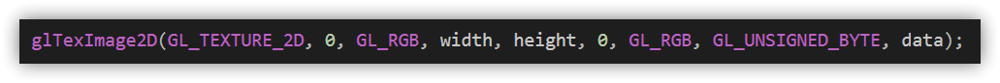

我们逐个看参数：

  * 第一个参数指定了纹理目标(Target)，设置为GL\_TEXTURE\_2D意味着会生成与当前绑定的纹理对象在同一个目标上的纹理（任何绑定到GL\_TEXTURE\_1D和GL\_TEXTURE\_3D的纹理不会受到影响）
  * 第二个参数为纹理指定多级渐远纹理的级别（如果你希望单独手动设置每个多级渐远纹理的级别的话）这里我们填0，也就是基本级别
  * 第三个参数告诉OpenGL我们希望把纹理储存为何种格式，我们的图像只有`RGB`值，因此我们也把纹理储存为`RGB`值
  * 第四个和第五个参数设置最终的纹理的宽度和高度，我们之前加载图像的时候储存了它们，所以我们使用对应的变量
  * 下个参数应该总是被设为`0`（历史遗留的问题）
  * 第七第八个参数定义了源图的格式和数据类型。我们使用RGB值加载这个图像，并把它们储存为`char`(byte)数组，我们将会传入对应值
  * 最后一个参数是真正的图像数据

当调用glTexImage2D时，当前绑定的纹理对象就会被附加上纹理图像

但是，目前只有基本级别(Base-level)的纹理图像被加载了，如果要使用多级渐远纹理，我们必须手动设置所有不同的图像（不断递增第二个参数）或者，直接在生成纹理之后调用之前说的**glGenerateMipmap**（会为当前绑定的纹理自动生成所有需要的多级渐远纹理）

    
    glGenerateMipmap(GL_TEXTURE_2D);

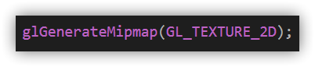

生成了纹理和相应的多级渐远纹理后，释放图像的内存是一个很好的习惯

    
    stbi_image_free(data);

生成一个纹理的过程应该看起来像这样：

    
    unsigned int texture;
    glGenTextures(1, &texture);
    glBindTexture(GL_TEXTURE_2D, texture);
    // 为当前绑定的纹理对象设置环绕、过滤方式
    glTexParameteri(GL_TEXTURE_2D, GL_TEXTURE_WRAP_S, GL_REPEAT);   
    glTexParameteri(GL_TEXTURE_2D, GL_TEXTURE_WRAP_T, GL_REPEAT);
    glTexParameteri(GL_TEXTURE_2D, GL_TEXTURE_MIN_FILTER, GL_LINEAR);
    glTexParameteri(GL_TEXTURE_2D, GL_TEXTURE_MAG_FILTER, GL_LINEAR);
    // 加载并生成纹理
    int width, height, nrChannels;
    unsigned char *data = stbi_load("container.jpg", &width, &height, &nrChannels, 0);
    if (data)
    {
        glTexImage2D(GL_TEXTURE_2D, 0, GL_RGB, width, height, 0, GL_RGB, GL_UNSIGNED_BYTE, data);
        glGenerateMipmap(GL_TEXTURE_2D);
    }
    else
    {
        std::cout << "Failed to load texture" << std::endl;
    }
    stbi_image_free(data);

####应用纹理1.4.0#

后面的这部分我们会使用glDrawElements绘制[OpenGL入门3：渲染管线简介，三角形](https://www.cnblogs.com/zhxmdefj/p/11192408.html)最后一部分的矩形

我们需要告知OpenGL如何采样纹理，所以我们必须使用纹理坐标更新顶点数据：

    
    float vertices[] = {
    //     ---- 位置 ----       ---- 颜色 ----     - 纹理坐标 -
         0.5f,  0.5f, 0.0f,   1.0f, 0.0f, 0.0f,   1.0f, 1.0f,   // 右上
         0.5f, -0.5f, 0.0f,   0.0f, 1.0f, 0.0f,   1.0f, 0.0f,   // 右下
        -0.5f, -0.5f, 0.0f,   0.0f, 0.0f, 1.0f,   0.0f, 0.0f,   // 左下
        -0.5f,  0.5f, 0.0f,   1.0f, 1.0f, 0.0f,   0.0f, 1.0f    // 左上
    };
    unsigned int indices[] = {
        0, 1, 3, // first triangle
        1, 2, 3  // second triangle
    };

注意初始化和渲染循环也要改：

    
    // 初始化+
    glBindBuffer(GL_ELEMENT_ARRAY_BUFFER, EBO);
    glBufferData(GL_ELEMENT_ARRAY_BUFFER, sizeof(indices), indices, GL_STATIC_DRAW);
    // 渲染循环
    ourShader.use();
    glBindVertexArray(VAO);
    glDrawElements(GL_TRIANGLES, 6, GL_UNSIGNED_INT, 0);

由于我们添加了一个额外的顶点属性，我们必须告诉OpenGL我们新的顶点格式：

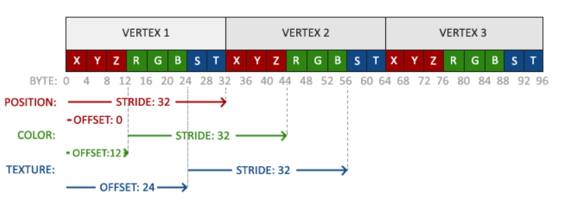

    
    glVertexAttribPointer(2, 2, GL_FLOAT, GL_FALSE, 8 * sizeof(float), (void*)(6 * sizeof(float)));
    glEnableVertexAttribArray(2);

注意，我们同样需要调整前面两个顶点属性的步长参数为`8 * sizeof(float)`。

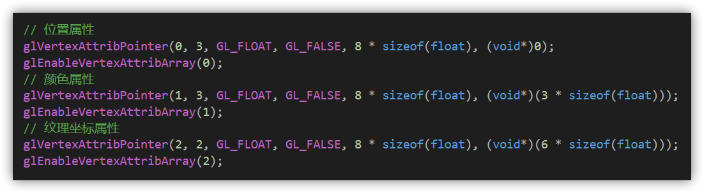

接着我们需要调整**顶点着色器**使其能够接受顶点坐标为一个顶点属性，并把坐标传给片段着色器：

    
    // vertex shader
    #version 330 core
    layout (location = 0) in vec3 aPos;
    layout (location = 1) in vec3 aColor;
    layout (location = 2) in vec2 aTexCoord;
    out vec3 ourColor;
    out vec2 TexCoord;
    void main()
    {
        gl_Position = vec4(aPos, 1.0);
        ourColor = aColor;
        TexCoord = aTexCoord;
    }

片段着色器应该接下来会把输出变量`TexCoord`作为输入变量

**片段着色器**也应该能访问纹理对象，但是我们怎样能把纹理对象传给片段着色器呢？GLSL有一个供纹理对象使用的内建数据类型，叫做**采样器(Sampler)**，它以纹理类型作为后缀，比如`sampler1D`、`sampler3D`，或在我们的例子中的`sampler2D`

我们可以先简单声明一个`uniform sampler2D`把一个纹理添加到片段着色器中，稍后我们会把纹理赋值给这个uniform

    
    // fragment shader
    #version 330 core
    out vec4 FragColor;
    in vec3 ourColor;
    in vec2 TexCoord;
    uniform sampler2D ourTexture;
    void main()
    {
        FragColor = texture(ourTexture, TexCoord);//texture(纹理采样器，对应的纹理坐标)
    }

然后我们使用GLSL内建的**texture函数**来采样纹理的颜色，它第一个参数是纹理采样器，第二个参数是对应的纹理坐标，texture函数会使用之前设置的纹理参数对相应的颜色值进行采样，这个片段着色器的输出就是纹理的（插值）纹理坐标上的（过滤后的）颜色

现在我们要在调用glDrawElements之前绑定纹理，你不需要手动更改我们在片段着色器定义的`uniform sampler2D ourTexture`，它会**自动把纹理赋值给片段着色器的采样器ourTexture**：

    
    glBindTexture(GL_TEXTURE_2D, texture);
    glBindVertexArray(VAO);
    glDrawElements(GL_TRIANGLES, 6, GL_UNSIGNED_INT, 0);

没有意外的话结果就是：

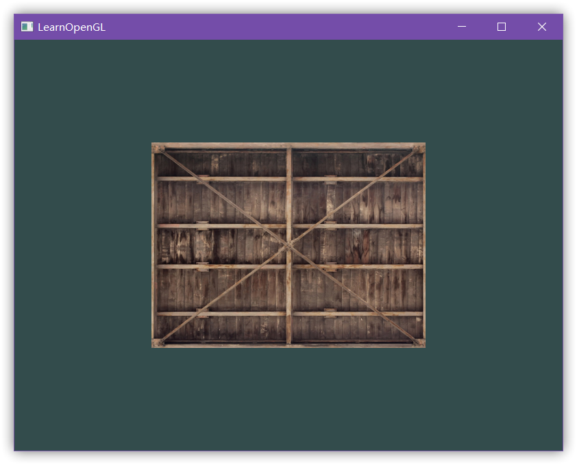

参考源码：

    
    #include <glad/glad.h>
    #include <GLFW/glfw3.h>
    #include <iostream>
    #include "shader.h"
    #define STB_IMAGE_IMPLEMENTATION
    #include "stb_image.h"
    // callback
    void framebuffer_size_callback(GLFWwindow* window, int width, int height);
    void processInput(GLFWwindow* window);
    // settings
    const unsigned int SCR_WIDTH = 800;
    const unsigned int SCR_HEIGHT = 600;
    int main()
    {
        #pragma region 窗口
        // 实例化GLFW窗口
        glfwInit();//glfw初始化
        glfwWindowHint(GLFW_CONTEXT_VERSION_MAJOR, 3);//主版本号
        glfwWindowHint(GLFW_CONTEXT_VERSION_MINOR, 3);//次版本号
        glfwWindowHint(GLFW_OPENGL_PROFILE, GLFW_OPENGL_CORE_PROFILE);
        GLFWwindow* window = glfwCreateWindow(800, 600, "LearnOpenGL", NULL, NULL);
        //（宽，高，窗口名）返回一个GLFWwindow类的实例：window
        if (window == NULL)
        {
            // 生成错误则输出错误信息
            std::cout << "Failed to create GLFW window" << std::endl;
            glfwTerminate();
            return -1;
        }
        glfwMakeContextCurrent(window);
        // 告诉GLFW我们希望每当窗口调整大小的时候调用改变窗口大小的函数
        glfwSetFramebufferSizeCallback(window, framebuffer_size_callback);
        #pragma endregion GLFW
        #pragma region 函数指针
        // glad管理opengl函数指针，初始化glad
        if (!gladLoadGLLoader((GLADloadproc)glfwGetProcAddress))
        {
            // 生成错误则输出错误信息
            std::cout << "Failed to initialize GLAD" << std::endl;
            return -1;
        }
        #pragma endregion GLAD
        Shader ourShader("1.4.0vertex.txt", "1.4.0fragment.txt");
        #pragma region 顶点数据
        //顶点数据
        float vertices[] = {
            //     ---- 位置 ----       ---- 颜色 ----     - 纹理坐标 -
                 0.5f,  0.5f, 0.0f,   1.0f, 0.0f, 0.0f,   1.0f, 1.0f,   // 右上
                 0.5f, -0.5f, 0.0f,   0.0f, 1.0f, 0.0f,   1.0f, 0.0f,   // 右下
                -0.5f, -0.5f, 0.0f,   0.0f, 0.0f, 1.0f,   0.0f, 0.0f,   // 左下
                -0.5f,  0.5f, 0.0f,   1.0f, 1.0f, 0.0f,   0.0f, 1.0f    // 左上
        };
        unsigned int indices[] = {
            0, 1, 3, // first triangle
            1, 2, 3  // second triangle
        };
        #pragma endregion vertices[],indices[]
        #pragma region 缓存对象
        // 初始化缓存对象
        unsigned int VBO;
        glGenBuffers(1, &VBO);
        unsigned int VAO;
        glGenVertexArrays(1, &VAO);
        unsigned int EBO;
        glGenBuffers(1, &EBO);
        // 1. 绑定顶点数组对象
        glBindVertexArray(VAO);
        // 2. 把我们的顶点数组复制到一个顶点缓冲中，供OpenGL使用
        glBindBuffer(GL_ARRAY_BUFFER, VBO);
        glBufferData(GL_ARRAY_BUFFER, sizeof(vertices), vertices, GL_STATIC_DRAW);
        // 3. 复制我们的索引数组到一个索引缓冲中，供OpenGL使用
        glBindBuffer(GL_ELEMENT_ARRAY_BUFFER, EBO);
        glBufferData(GL_ELEMENT_ARRAY_BUFFER, sizeof(indices), indices, GL_STATIC_DRAW);
        // 4. 设定顶点属性指针
        // 位置属性
        glVertexAttribPointer(0, 3, GL_FLOAT, GL_FALSE, 8 * sizeof(float), (void*)0);
        glEnableVertexAttribArray(0);
        // 颜色属性
        glVertexAttribPointer(1, 3, GL_FLOAT, GL_FALSE, 8 * sizeof(float), (void*)(3 * sizeof(float)));
        glEnableVertexAttribArray(1);
        // 纹理坐标属性
        glVertexAttribPointer(2, 2, GL_FLOAT, GL_FALSE, 8 * sizeof(float), (void*)(6 * sizeof(float)));
        glEnableVertexAttribArray(2);
        #pragma endregion VAO，VBO，EBO
        #pragma region 材质
        // 加载材质
        unsigned int texture1;//纹理也是使用ID引用的
        glGenTextures(1, &texture1);//glGenTextures先输入要生成纹理的数量，然后把它们储存在第二个参数的`unsigned int`数组中
        glBindTexture(GL_TEXTURE_2D, texture1);
        // 为当前绑定的纹理对象设置环绕、过滤方式
        glTexParameteri(GL_TEXTURE_2D, GL_TEXTURE_WRAP_S, GL_REPEAT);
        glTexParameteri(GL_TEXTURE_2D, GL_TEXTURE_WRAP_T, GL_REPEAT);
        glTexParameteri(GL_TEXTURE_2D, GL_TEXTURE_MIN_FILTER, GL_LINEAR);
        glTexParameteri(GL_TEXTURE_2D, GL_TEXTURE_MAG_FILTER, GL_LINEAR);
        // 加载并生成纹理
        int width, height, nrChannels;
        unsigned char* data = stbi_load("container.jpg", &width, &height, &nrChannels, 0);
        if (data)
        {
            glTexImage2D(GL_TEXTURE_2D, 0, GL_RGB, width, height, 0, GL_RGB, GL_UNSIGNED_BYTE, data);
            glGenerateMipmap(GL_TEXTURE_2D);
        }
        else
        {
            std::cout << "Failed to load texture" << std::endl;
        }
        stbi_image_free(data);
        #pragma endregion 加载材质
        #pragma region 渲染
        // 渲染循环
        while (!glfwWindowShouldClose(window))
        {
            // 输入
            processInput(window);
            // 渲染指令
            glClearColor(0.2f, 0.3f, 0.3f, 1.0f);
            glClear(GL_COLOR_BUFFER_BIT);
            // 绑定材质
            glBindTexture(GL_TEXTURE_2D, texture1);
            // 渲染箱子
            ourShader.use();
            glBindVertexArray(VAO);
            glDrawElements(GL_TRIANGLES, 6, GL_UNSIGNED_INT, 0);
            // 检查并调用事件，交换缓冲
            glfwSwapBuffers(window);
            // 检查触发什么事件，更新窗口状态
            glfwPollEvents();
        }
        glDeleteVertexArrays(1, &VAO);
        glDeleteBuffers(1, &VBO);
        glDeleteBuffers(1, &EBO);
        // 释放之前的分配的所有资源
        glfwTerminate();
        #pragma endregion Rendering
        return 0;
    }
    void framebuffer_size_callback(GLFWwindow* window, int width, int height)
    {
        // 每当窗口改变大小，GLFW会调用这个函数并填充相应的参数供你处理
        glViewport(0, 0, width, height);
    }
    void processInput(GLFWwindow* window)
    {
        // 返回这个按键是否正在被按下
        if (glfwGetKey(window, GLFW_KEY_ESCAPE) == GLFW_PRESS)//是否按下了返回键
            glfwSetWindowShouldClose(window, true);
    }

我们还可以把得到的纹理颜色与顶点颜色混合，来获得更有趣的效果

我们只需把**纹理颜色与顶点颜色在片段着色器中相乘**来混合二者的颜色：

    
    #version 330 core
    out vec4 FragColor;
    in vec3 ourColor;
    in vec2 TexCoord;
    uniform sampler2D ourTexture;
    void main()
    {
        FragColor = texture(ourTexture, TexCoord) * vec4(ourColor, 1.0);
        //纹理颜色与顶点颜色相乘
    }

不过效果有点emmmmm

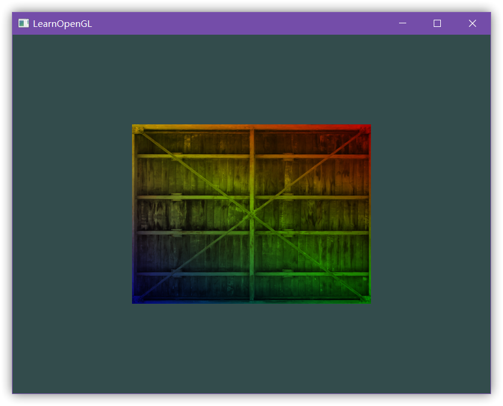

####纹理单元1.4.1#

你可能会问为什么`sampler2D`变量是个uniform，我们却不用glUniform给它赋值？

首先要知道，如果我们使用`glUniform1i`，给纹理采样器分配的就是一个**位置值**（有了位置我们能在一个片段着色器中设置多个纹理），一个纹理的位置值通常称为一个**纹理单元(Texture Unit)**，由于一个纹理的**默认纹理单元是0**，它是默认的激活纹理单元，所以我们前面就没有给它分配

纹理单元的主要目的是让我们在着色器中可以使用多个的纹理，通过把纹理单元赋值给采样器，只要我们首先激活对应的纹理单元，我们可以一次绑定多个纹理

就像glBindTexture一样，我们可以使用glActiveTexture激活纹理单元，传入我们需要使用的纹理单元：
    
    glActiveTexture(GL_TEXTURE0); // 在绑定纹理之前先激活纹理单元
    glBindTexture(GL_TEXTURE_2D, texture);

激活纹理单元之后，接下来的glBindTexture函数调用会绑定这个纹理到当前激活的纹理单元，纹理单元GL\_TEXTURE0默认总是被激活，所以我们在前面的例子里当我们使用`glBindTexture`的时候，无需激活任何纹理单元

OpenGL至少保证有**16个纹理单元**供你使用，也就是说你可以激活从GL\_TEXTURE0到GL\_TEXTRUE15，它们都是按顺序定义的，所以我们也
可以通过GL\_TEXTURE0 + 8的方式获得GL\_TEXTURE8，这在当我们需要循环一些纹理单元的时候会很有用

我们仍然需要编辑片段着色器来接收另一个采样器。这应该相对来说非常直接了：
    
    
    #version 330 core
    out vec4 FragColor;
    in vec3 ourColor;
    in vec2 TexCoord;
    uniform sampler2D texture1;
    uniform sampler2D texture2;
    void main()
    {
        //FragColor = texture(ourTexture, TexCoord) * vec4(ourColor, 1.0);
        FragColor = mix(texture(texture1, TexCoord), texture(texture2, TexCoord), 0.2);
    }

我们需要输出颜色现在是两个纹理的结合，这里用**mix函数**：接受两个值作为参数，并对它们根据第三个参数进行线性插值（如果第三个值是`0.0`，它会返回第一个输入；如果是`1.0`，会返回第二个输入值。`0.2`会返回`80%`的第一个输入颜色和`20%`的第二个输入颜色，即返回两个纹理的混合色）

我们现在需要载入并创建另一个纹理，你应该对这些步骤很熟悉了，记得创建另一个纹理对象，载入图片，使用glTexImage2D生成最终纹理

第二个纹理我们使用[这张图片](https://img2018.cnblogs.com/blog/1536438/201907/1536438-20190727142926543-204923522.png)

为了使用第二个纹理（以及第一个），我们必须改变一点渲染流程，先绑定两个纹理到对应的纹理单元，然后定义哪个uniform采样器对应哪个纹理单元：

    
    glActiveTexture(GL_TEXTURE0);
    glBindTexture(GL_TEXTURE_2D, texture1);
    glActiveTexture(GL_TEXTURE1);
    glBindTexture(GL_TEXTURE_2D, texture2);
    glBindVertexArray(VAO);
    glDrawElements(GL_TRIANGLES, 6, GL_UNSIGNED_INT, 0);

我们还要通过使用glUniform1i设置每个采样器的方式告诉OpenGL每个着色器采样器属于哪个纹理单元。我们只需要设置一次即可，所以这个会放在渲染循环的
前面：

    
    ourShader.use(); // 别忘记在激活着色器前先设置uniform！
    glUniform1i(glGetUniformLocation(ourShader.ID, "texture1"), 0); // 手动设置
    ourShader.setInt("texture2", 1); // 或者使用着色器类设置
    while(...) 
    {
        [...]
    }

通过使用glUniform1i设置采样器，我们保证了每个uniform采样器对应着正确的纹理单元。你应该能得到下面的结果：

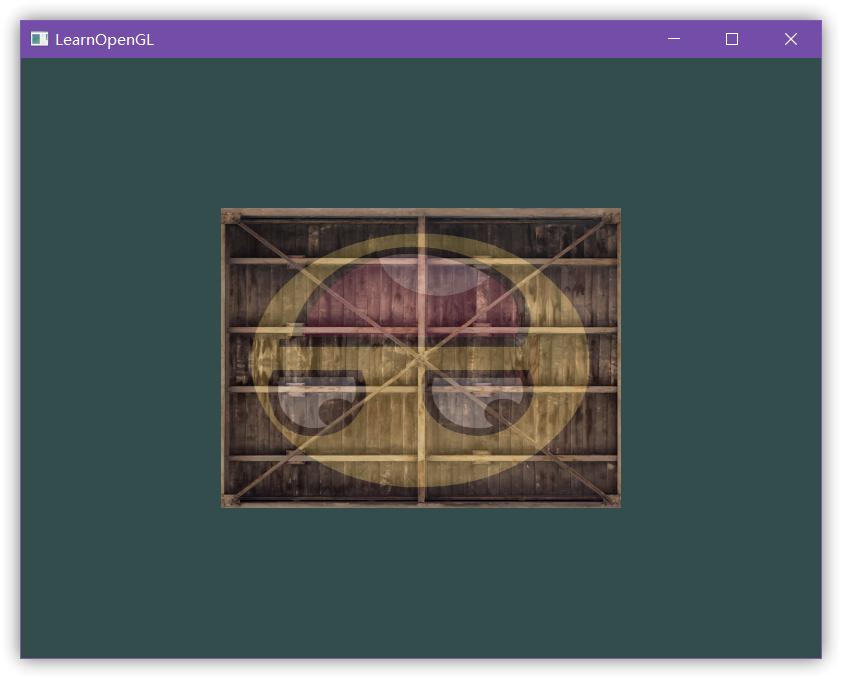

你可能注意到纹理上下颠倒了！这是因为OpenGL要求y轴`0.0`坐标是在图片的底部的，但是图片的y轴`0.0`坐标通常在顶部。很幸运，`stb_image.h`能够在图像加载时帮助我们翻转y轴，只需要在加载任何图像前加入以下语句即可：

    
    stbi_set_flip_vertically_on_load(true);

在让`stb_image.h`在加载图片时翻转y轴之后你就应该能够获得下面的结果了：

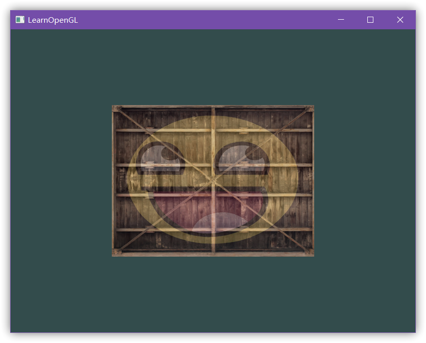

参考代码：
   
    #include <glad/glad.h>
    #include <GLFW/glfw3.h>
    #include <iostream>
    #include "shader.h"
    #define STB_IMAGE_IMPLEMENTATION
    #include "stb_image.h"
    // callback
    void framebuffer_size_callback(GLFWwindow* window, int width, int height);
    void processInput(GLFWwindow* window);
    // settings
    const unsigned int SCR_WIDTH = 800;
    const unsigned int SCR_HEIGHT = 600;
    int main()
    {
        #pragma region 窗口
        // 实例化GLFW窗口
        glfwInit();//glfw初始化
        glfwWindowHint(GLFW_CONTEXT_VERSION_MAJOR, 3);//主版本号
        glfwWindowHint(GLFW_CONTEXT_VERSION_MINOR, 3);//次版本号
        glfwWindowHint(GLFW_OPENGL_PROFILE, GLFW_OPENGL_CORE_PROFILE);
        GLFWwindow* window = glfwCreateWindow(800, 600, "LearnOpenGL", NULL, NULL);
        //（宽，高，窗口名）返回一个GLFWwindow类的实例：window
        if (window == NULL)
        {
            // 生成错误则输出错误信息
            std::cout << "Failed to create GLFW window" << std::endl;
            glfwTerminate();
            return -1;
        }
        glfwMakeContextCurrent(window);
        // 告诉GLFW我们希望每当窗口调整大小的时候调用改变窗口大小的函数
        glfwSetFramebufferSizeCallback(window, framebuffer_size_callback);
        #pragma endregion GLFW
        #pragma region 函数指针
        // glad管理opengl函数指针，初始化glad
        if (!gladLoadGLLoader((GLADloadproc)glfwGetProcAddress))
        {
            // 生成错误则输出错误信息
            std::cout << "Failed to initialize GLAD" << std::endl;
            return -1;
        }
        #pragma endregion GLAD
        Shader ourShader("1.4.1vertex.txt", "1.4.1fragment.txt");
        #pragma region 顶点数据
        //顶点数据
        float vertices[] = {
            //     ---- 位置 ----       ---- 颜色 ----     - 纹理坐标 -
                 0.5f,  0.5f, 0.0f,   1.0f, 0.0f, 0.0f,   1.0f, 1.0f,   // 右上
                 0.5f, -0.5f, 0.0f,   0.0f, 1.0f, 0.0f,   1.0f, 0.0f,   // 右下
                -0.5f, -0.5f, 0.0f,   0.0f, 0.0f, 1.0f,   0.0f, 0.0f,   // 左下
                -0.5f,  0.5f, 0.0f,   1.0f, 1.0f, 0.0f,   0.0f, 1.0f    // 左上
        };
        unsigned int indices[] = {
            0, 1, 3, // first triangle
            1, 2, 3  // second triangle
        };
        #pragma endregion vertices[],indices[]
        #pragma region 缓存对象
        // 初始化缓存对象
        unsigned int VBO;
        glGenBuffers(1, &VBO);
        unsigned int VAO;
        glGenVertexArrays(1, &VAO);
        unsigned int EBO;
        glGenBuffers(1, &EBO);
        // 1. 绑定顶点数组对象
        glBindVertexArray(VAO);
        // 2. 把我们的顶点数组复制到一个顶点缓冲中，供OpenGL使用
        glBindBuffer(GL_ARRAY_BUFFER, VBO);
        glBufferData(GL_ARRAY_BUFFER, sizeof(vertices), vertices, GL_STATIC_DRAW);
        // 3. 复制我们的索引数组到一个索引缓冲中，供OpenGL使用
        glBindBuffer(GL_ELEMENT_ARRAY_BUFFER, EBO);
        glBufferData(GL_ELEMENT_ARRAY_BUFFER, sizeof(indices), indices, GL_STATIC_DRAW);
        // 4. 设定顶点属性指针
        // 位置属性
        glVertexAttribPointer(0, 3, GL_FLOAT, GL_FALSE, 8 * sizeof(float), (void*)0);
        glEnableVertexAttribArray(0);
        // 颜色属性
        glVertexAttribPointer(1, 3, GL_FLOAT, GL_FALSE, 8 * sizeof(float), (void*)(3 * sizeof(float)));
        glEnableVertexAttribArray(1);
        // 纹理坐标属性
        glVertexAttribPointer(2, 2, GL_FLOAT, GL_FALSE, 8 * sizeof(float), (void*)(6 * sizeof(float)));
        glEnableVertexAttribArray(2);
        #pragma endregion VAO，VBO，EBO
        #pragma region 材质
        // 加载材质
        unsigned int texture1, texture2;//纹理也是使用ID引用的
        // texture1
        glGenTextures(1, &texture1);//glGenTextures先输入要生成纹理的数量，然后把它们储存在第二个参数的`unsigned int`数组中
        glBindTexture(GL_TEXTURE_2D, texture1);
        // 为当前绑定的纹理对象设置环绕、过滤方式
        glTexParameteri(GL_TEXTURE_2D, GL_TEXTURE_WRAP_S, GL_REPEAT);
        glTexParameteri(GL_TEXTURE_2D, GL_TEXTURE_WRAP_T, GL_REPEAT);
        glTexParameteri(GL_TEXTURE_2D, GL_TEXTURE_MIN_FILTER, GL_LINEAR);
        glTexParameteri(GL_TEXTURE_2D, GL_TEXTURE_MAG_FILTER, GL_LINEAR);
        // 加载并生成纹理
        int width, height, nrChannels;
        stbi_set_flip_vertically_on_load(true);
        unsigned char* data = stbi_load("container.jpg", &width, &height, &nrChannels, 0);
        if (data)
        {
            glTexImage2D(GL_TEXTURE_2D, 0, GL_RGB, width, height, 0, GL_RGB, GL_UNSIGNED_BYTE, data);
            glGenerateMipmap(GL_TEXTURE_2D);
        }
        else
        {
            std::cout << "Failed to load texture" << std::endl;
        }
        stbi_image_free(data);
        // texture2
        glGenTextures(1, &texture2);
        glBindTexture(GL_TEXTURE_2D, texture2);
        // 为当前绑定的纹理对象设置环绕、过滤方式
        glTexParameteri(GL_TEXTURE_2D, GL_TEXTURE_WRAP_S, GL_REPEAT);
        glTexParameteri(GL_TEXTURE_2D, GL_TEXTURE_WRAP_T, GL_REPEAT);
        glTexParameteri(GL_TEXTURE_2D, GL_TEXTURE_MIN_FILTER, GL_LINEAR);
        glTexParameteri(GL_TEXTURE_2D, GL_TEXTURE_MAG_FILTER, GL_LINEAR);
        // 加载并生成纹理
        data = stbi_load("awesomeface.png", &width, &height, &nrChannels, 0);
        if (data)
        {
            // note that the awesomeface.png has transparency and thus an alpha channel, so make sure to tell OpenGL the data type is of GL_RGBA
            glTexImage2D(GL_TEXTURE_2D, 0, GL_RGBA, width, height, 0, GL_RGBA, GL_UNSIGNED_BYTE, data);
            glGenerateMipmap(GL_TEXTURE_2D);
        }
        else
        {
            std::cout << "Failed to load texture" << std::endl;
        }
        stbi_image_free(data);
        #pragma endregion 加载材质
        #pragma region 渲染
        ourShader.use(); // 别忘记在激活着色器前先设置uniform！
        glUniform1i(glGetUniformLocation(ourShader.ID, "texture1"), 0); // 手动设置
        ourShader.setInt("texture2", 1); // 或者使用着色器类设置
        // 渲染循环
        while (!glfwWindowShouldClose(window))
        {
            // 输入
            processInput(window);
            // 渲染指令
            glClearColor(0.2f, 0.3f, 0.3f, 1.0f);
            glClear(GL_COLOR_BUFFER_BIT);
            // 绑定材质
            glActiveTexture(GL_TEXTURE0);
            glBindTexture(GL_TEXTURE_2D, texture1);
            glActiveTexture(GL_TEXTURE1);
            glBindTexture(GL_TEXTURE_2D, texture2);
            // 渲染箱子
            ourShader.use();
            glBindVertexArray(VAO);
            glDrawElements(GL_TRIANGLES, 6, GL_UNSIGNED_INT, 0);
            // 检查并调用事件，交换缓冲
            glfwSwapBuffers(window);
            // 检查触发什么事件，更新窗口状态
            glfwPollEvents();
        }
        glDeleteVertexArrays(1, &VAO);
        glDeleteBuffers(1, &VBO);
        glDeleteBuffers(1, &EBO);
        // 释放之前的分配的所有资源
        glfwTerminate();
        #pragma endregion Rendering
        return 0;
    }
    void framebuffer_size_callback(GLFWwindow* window, int width, int height)
    {
        // 每当窗口改变大小，GLFW会调用这个函数并填充相应的参数供你处理
        glViewport(0, 0, width, height);
    }
    void processInput(GLFWwindow* window)
    {
        // 返回这个按键是否正在被按下
        if (glfwGetKey(window, GLFW_KEY_ESCAPE) == GLFW_PRESS)//是否按下了返回键
            glfwSetWindowShouldClose(window, true);
    }

###扩展练习#

  * 修改片段着色器，**仅**让笑脸图案朝另一个方向看
    
	 
	    #version 330 core
	    out vec4 FragColor;
	    in vec3 ourColor;
	    in vec2 TexCoord;
	    uniform sampler2D texture1;
	    uniform sampler2D texture2;
	    void main()
	    {
	      //FragColor = texture(texture1, TexCoord) * vec4(ourColor, 1.0);
	      //FragColor = mix(texture(texture1, TexCoord), texture(texture2, TexCoord), 0.2);
	      FragColor = mix(texture(texture1, TexCoord), 
	                      texture(texture2, vec2(1.0 - TexCoord.x, TexCoord.y)), 0.2);
	    }

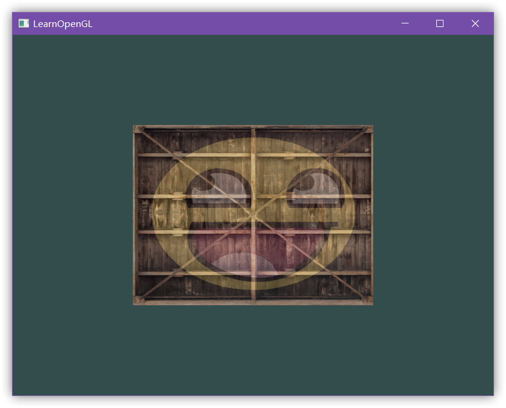

  * 尝试用不同的纹理环绕方式，设定一个从`0.0f`到`2.0f`范围内的（而不是原来的`0.0f`到`1.0f`）纹理坐标，在箱子的角落放置4个笑脸（尝试不同的纹理环绕方式）

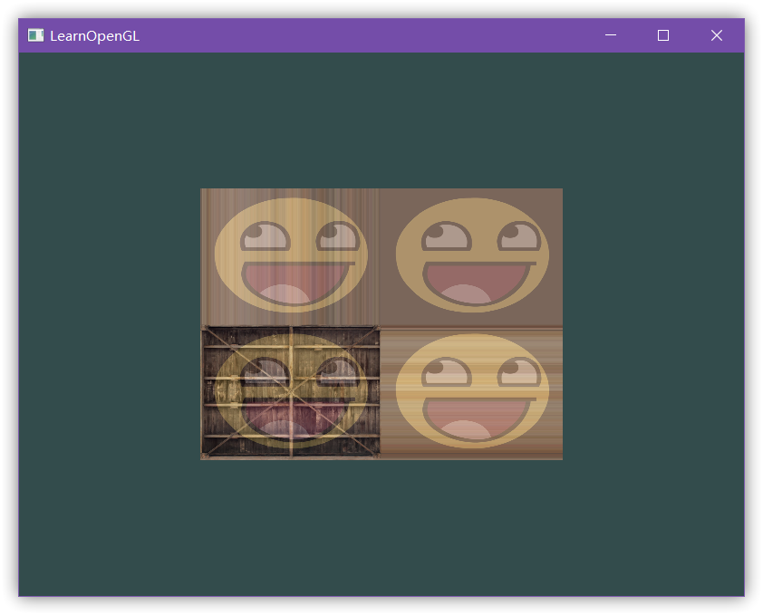

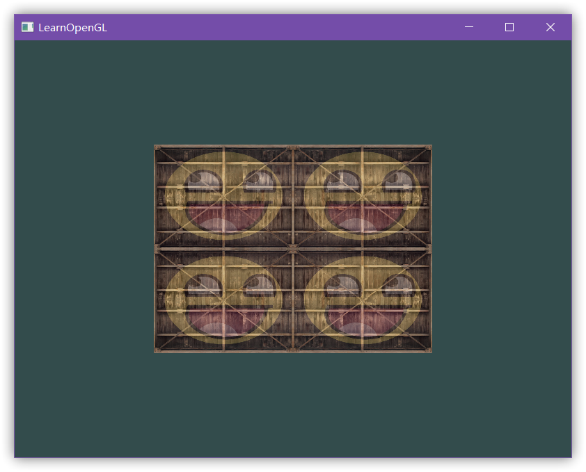

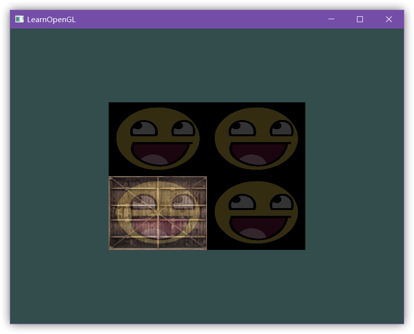

  * 在矩形上只显示纹理图像的中间一部分，修改纹理坐标，达到能看见单个的像素的效果

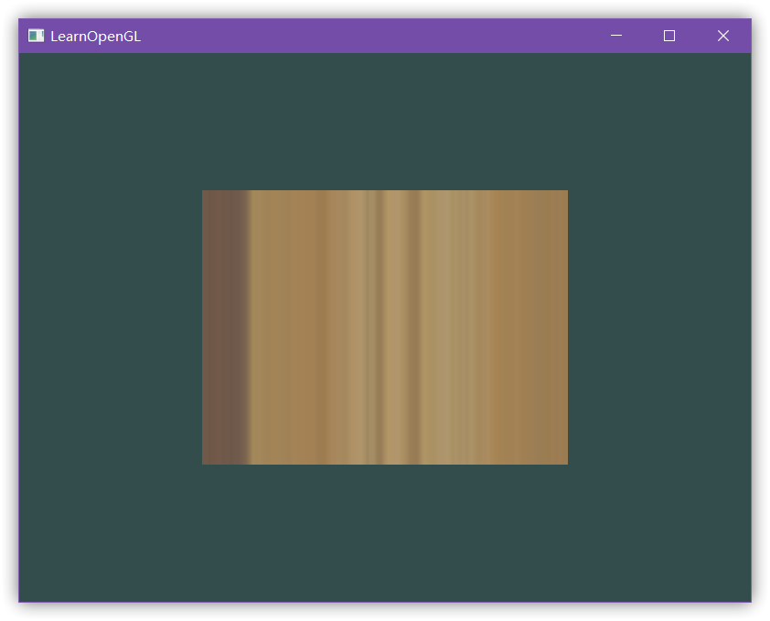

尝试使用GL\_NEAREST的纹理过滤方式让像素显示得更清晰

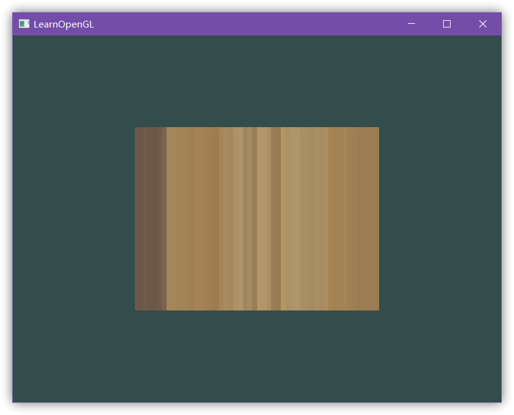

  * 使用一个uniform变量作为mix函数的第三个参数来改变两个纹理可见度，使用上和下键来改变箱子或笑脸的可见度

先新建一个float型变量mixValue

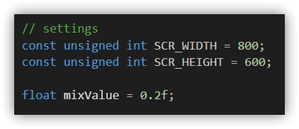

然后改下我们的输入

    
    void processInput(GLFWwindow *window)
    {
      if (glfwGetKey(window, GLFW_KEY_ESCAPE) == GLFW_PRESS)//是否按下了返回键
          glfwSetWindowShouldClose(window, true);
      if (glfwGetKey(window, GLFW_KEY_UP) == GLFW_PRESS)
      {
          mixValue += 0.001f;
          if (mixValue >= 1.0f)
              mixValue = 1.0f;
      }
      if (glfwGetKey(window, GLFW_KEY_DOWN) == GLFW_PRESS)
      {
          mixValue -= 0.001f;
          if (mixValue <= 0.0f)
              mixValue = 0.0f;
      }
    }

记得在渲染循环中加入：

    
    ourShader.setFloat("mixValue", mixValue);

ok了，当然我们也可以用之前读取时间来生成渐变效果的小把戏

    
    
    float timeValue = glfwGetTime();
    float mixValue = sin(timeValue) + 1.0f;
    ourShader.setFloat("mixValue", mixValue);

###系列

####
<a href='https://www.cnblogs.com/zhxmdefj/p/11272841.html' target='blank'>OpenGL入门1.5：矩阵与变换</a>

####
<a href='https://www.cnblogs.com/zhxmdefj/p/11291848.html' target='blank'>OpenGL入门1.6：坐标系统，3D箱子</a>

####
<a href='https://www.cnblogs.com/zhxmdefj/p/11296766.html' target='blank'> OpenGL入门1.7：摄像机 </a>

####
<a href='https://www.cnblogs.com/zhxmdefj/p/11360712.html' target='blank'> OpenGL光照1：颜色和基础光照 </a>

####
<a href='https://www.cnblogs.com/zhxmdefj/p/11365819.html' target='blank'> OpenGL光照2：材质和光照贴图 </a>

####
<a href='https://www.cnblogs.com/zhxmdefj/p/11368274.html' target='blank'> OpenGL光照3：光源 </a>

