 
<!--BEGIN_DATA
{
    "create_date": "2022-04-06 21:25", 
    "modify_date": "2022-04-06 21:25", 
    "is_top": "0", 
    "summary": "OpenGL异步渲染库", 
    "tags": "OpenGL", 
    "file_name": "OpenGL异步渲染库.md"
}
END_DATA-->

#### <p>原文出处：<a href='https://km.woa.com/articles/show/547153?kmref=search&from_page=1&no=8' target='blank'>OpenGL异步渲染库</a></p>

自从跟着[LearnOpenGL](https://learnopengl-cn.github.io/)教程了解一些 OpenGL 相关的渲染概念和 API，我也曾尝试自己做一层渲染接口封装。想法很美好现实很残酷，写了两天，就由于难以合理的维护众多渲染状态和资源而放弃。直到后来偶然看到[云风的博客](https://blog.codingnow.com/2017/10/lua_bgfx.html)知道了 bgfx 这个 C++ 库，在熟悉了这个库的基本内容之后，我发现这个库正好实现了我一直渴望搞清楚的那部分渲染封装。于是，bgfx 又勾起我那沉睡已久的想法：自己写一个小型渲染库...

闫令琪老师的[GAMES101](https://sites.cs.ucsb.edu/~lingqi/teaching/games101.html)讲解了基于光栅化的渲染原理，洞见底层。不过，异步渲染库的目标在于渲染结构的初步封装，光栅化等渲染末端操作则直接使用显卡驱动或者硬件实现，基于OpenGL的API。

虽然实际工作中曾用过Android的Java、iOS的Objective-C、Web的JavaScript、golang、Unity的C#、UE的C++等语言，但我最喜欢的依旧是C语言和Lua语言，这两门语言都有一个特点：规则少且表达力强。软件工程师使用少量的语法规则进行合理的组合就能表达复杂的逻辑结构，大道至简。这里的异步渲染库核心部分用C语言实现，逻辑示例之类的则用Lua来写。

## 设计目标

既然 bgfx 对如何合理封装渲染 API 给出了一个解决方案，我们研究 bgfx 的源码就好了，为啥还要自己写一个？由于 bgfx 支持了相当多的功能，导致实现逻辑依旧相当复杂，对于初学者来说不够清晰，我希望能从头开始维护一个更加小巧的渲染库，设计准则是以一个软件工程师短时间内就可以掌控和实现的规模作为衡量标准，同时具备一定的结构设计。由此衍生出如下设计规划：

  1. 将渲染库作为一个 Lua 的 C 模块，编译构建流程是现成的（ [Lua 自定义版本](https://github.com/zhyingkun/lua-5.3.5)）
  2. C 模块部分只实现最基础的封装，同时将封装好的渲染 API 注入 Lua（当前实现的版本中 C 语言部分仅 6k 行左右）
  3. 仅支持 OpenGL 渲染 API，不支持 D3D、Metal、Vulkan 等，这么规划纯粹是为了减少工作量（OpenGL本身支持跨平台，不支持其他API也避免了Shader跨平台的问题，直接使用glsl）
  4. 独立的渲染线程（OpenGL 相关 API 的只能在调用 MakeCurrent 的线程中使用）
  5. 渲染库仅维持渲染对象和渲染状态，与窗口系统、线程操作等 API 完全隔离，需要用到的功能 API 通过函数指针注入的形式来实现
  6. API 设计和渲染抽象层次参考 bgfx 的实现，因此，该小型渲染库取名为：bcfx，寓意 C 语言版本的微型 bgfx，仅复制一部分灵魂不复制其代码

[bcfx相关源码](https://github.com/zhyingkun/lua-5.3.5/tree/master/cmod/bcfx)已上传到GitHub中，本文仅展示必要源码，为了代码连续性可能需要配合源码逻辑来阅读。

## 运行流程

有渲染线程，对应的就有逻辑线程，这里采用跑 Lua 的主线程作为逻辑线程，渲染库给出的所有对外 API 都由逻辑线程来调用，渲染库内部维护所有的渲染数据并与渲染线程进行数据交换，流程图如下：

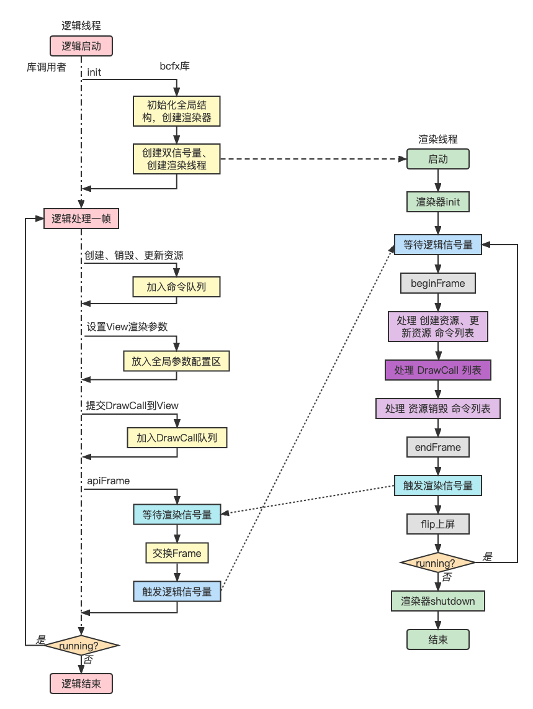

基于上图的几点说明：

  1. 提交渲染命令和DrawCall是在逻辑线程，执行渲染命令和解析DrawCall是在渲染线程
  2. 针对各种渲染资源，需要抽象出渲染命令，并实现相关缓冲（CommandBuffer）
  3. 线程同步使用信号量（渲染信号量初始值为1，逻辑信号量初始值为0，因为第一帧的逻辑线程不需要等待渲染线程）
  4. 一帧之内的所有渲染数据都封装起来，统一进行渲染线程和逻辑线程的数据交换

## 窗口系统

设计实现渲染库的第一步，是先有一个可以渲染的窗口。这里选择 [glfw 窗口库](https://www.glfw.org/)。同样的，我将 glfw 作为一个 C 模块注入 Lua，实现了在 Lua 端使用 glfw 的 API 创建窗口以及响应窗口事件。需要注意一个点是 glfw 并不是所有回调函数都在调用线程中回调，但回调 Lua 不支持多线程并发，因此要注意回调 Lua 的逻辑必须在 Lua 所在系统线程。这里用 lua 命令行来启动 lua 代码，因此 lua 跑在主线程。

如下 Lua 代码创建一个带有 OpenGL 渲染上下文的窗口：（GLContext 选择 4.1 版本是因为 MacOSX 最高就支持到OpenGL4.1）

```lua
local glfw = require("glfw")

glfw.init()

glfw.windowHint(glfw.window_hint.CONTEXT_VERSION_MAJOR, 4)
glfw.windowHint(glfw.window_hint.CONTEXT_VERSION_MINOR, 1)
glfw.windowHint(glfw.window_hint.OPENGL_PROFILE, glfw.hint_value.OPENGL_CORE_PROFILE)
glfw.windowHint(glfw.window_hint.OPENGL_FORWARD_COMPAT, glfw.hint_value.TRUE)

local win = glfw.createWindow(400, 300, "GLFW win")
while not glfw.windowShouldClose(win) do
    glfw.pollEvents()
    if glfw.getKey(win, glfw.keyboard.ESCAPE) == glfw.input_state.PRESS then
        glfw.setWindowShouldClose(win, true)
    end
end

glfw.terminate()
```

运行效果图：

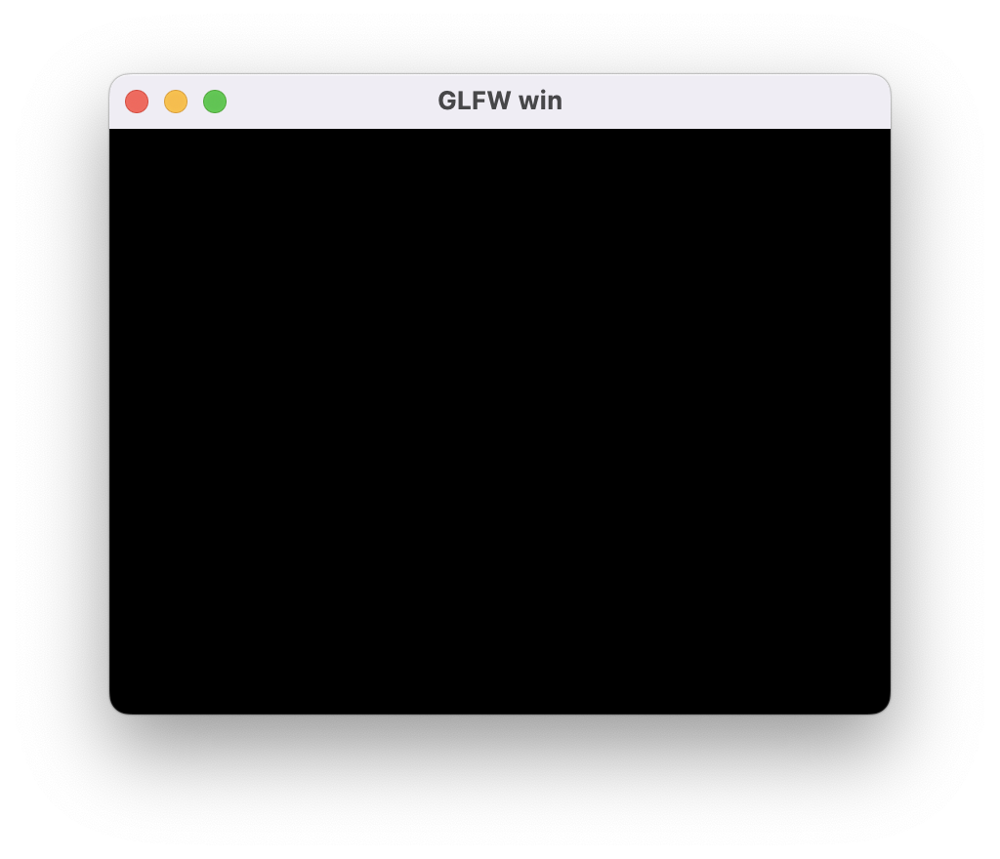

## 渲染抽象层次

最基本的渲染流程如下：

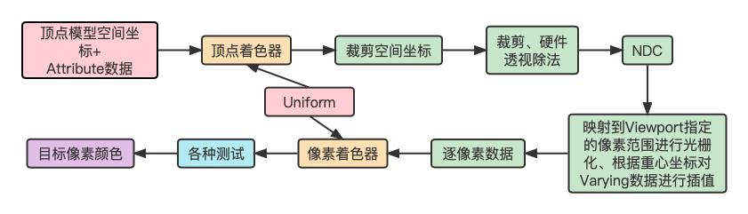

渲染流程中，Viewport控制着渲染结果影响的像素范围，通过配置不同的渲染顺序和Viewport，我们可以实现多图层效果（不同图层范围大小还不一样）。

OpenGL中控制Viewport的API为glViewport，其原型如下：（数值坐标原点是左下角，单位是像素）

```c
void glViewport(GLint x, GLint y, GLsizei width, GLsizei height);
```

另外，纯粹渲染Mesh我们需要VertexBuffer、IndexBuffer、变换矩阵、裁剪范围等渲染参数。显然，渲染Mesh的过程就是一个个DrawCall。

基于上述讨论，对于所有渲染参数，我们很容易划分出如下几类：

  1. 某个DrawCall独占的参数（每个DrawCall自己有独一份，如VertexBuffer引用、Model矩阵等）
  2. 多个DrawCall共享的参数（如Viewport参数，相机参数等）
  3. 所有DrawCall都共享的全局参数（如全局Uniform）

全局共享参数比较少，也比较好理解，这里着重讨论前两种分类。

第一种分类很自然的抽象出一个DrawCall数据结构，基本定义如下：

```c
typedef struct {
  Handle vertexBuffer;
} Stream;

typedef struct {
  Stream streams[BCFX_CONFIG_MAX_VERTEX_STREAMS]; // 支持多个顶点缓冲
  uint8_t streamMask;
  Handle indexBuffer;
  Mat4x4 model; // 模型矩阵（ModelToWorld）
  /* 其他渲染参数、渲染状态 */
} RenderDraw;
```

对于第二种分类，参数需要给多个DrawCall共享，那我们抽象出一个概念，称为View。一个View附带一系列参数，每个DrawCall都隶属于某个View。如此以来，渲染过程该DrawCall就使用对应View的参数来进行渲染。View结构基本定义如下：

```c
typedef struct {
  /* ... */
  Clear clear; // 该View的Clear参数
  Rect rect; // Viewport范围
  Rect scissor; // 2D裁剪范围
  Mat4x4 viewMat; // 相机空间矩阵（WorldToCamera）
  Mat4x4 projMat; // 投影矩阵（CameraToClip）
  /* 其他参数 */
} View;
```

DrawCall和View两个抽象层次是bcfx渲染库设计的基础，后续逻辑线程提交DrawCall都需要指定一个View。为了逻辑简单，我们直接定下来仅支持256个View，相关数据结构可设计为固定大小的数组，无需动态扩容。

## 渲染资源管理

DrawCall使用的RenderDraw结构在实际使用中是由逻辑线程进行赋值，传递给渲染线程进行实际渲染。由于渲染参数包含了VertexBuffer等资源相关的内容，显然这些渲染资源不适合直接作为值类型存在于RenderDraw结构中，所以我们需要设计一套管理渲染资源的操作结构。

首先，列出创建资源、使用资源的流程：

  1. 逻辑线程准备数据（如顶点数据、Shader源码字符串等，属于bcfx库使用者的操作）
  2. 调用bcfx的API，传入数据，意图创建对应渲染资源，bcfx返回一个引用A（bcfx库中将数据打包成命令，放入CommandBuffer，此时仅缓存起来，并没有实际创建该渲染资源）
  3. 使用引用A进行渲染操作，提交DrawCall到View（使用者认为，引用A就代表了渲染资源，此时bcfx将DrawCall缓存到DrawCall列表中）
  4. 这一帧内根据逻辑需求进行一系列上述操作
  5. 调用bcfx的apiFrame结束这一帧的逻辑（bcfx等待上一帧渲染完毕，并将CommandBuffer和DrawCall列表一并交给渲染线程进行这一帧的渲染）
  6. 逻辑层开始了下一帧的逻辑（渲染线程真正开始执行之前这一帧的操作）

这个流程中，对于资源管理存在两个问题：

  1. 引用A并没有在编程语言意义上真正引用目标渲染资源，而是类似手信之类的东西，bcfx给用户保证，用户拿着这个手信，就能在需要的时候找到该渲染资源
  2. bcfx库中将渲染数据打包成命令的时候，其实也不能将数据作为值类型打包起来，依旧需要使用缓冲区。那么，该缓冲区应当由用户创建，传递给bcfx逻辑线程，bcfx内部再传递给渲染线程。这里涉及三个使用方，简单起见我们保证这个过程中只有一个使用方拥有该缓冲区

引用A对于用户来说是手信，对于渲染线程来说，就需要通过引用A真的找到对应的渲染资源。我们这里在渲染线程中创建好资源就放入一个数组中，引用A就是该数组的某个下标。代码中体现为：Handle。用户传递进来渲染数据，bcfx就可以立刻分配一个Handle（下标嘛，从0开始找个当前未被使用的下标就好）返回给用户。

Handle 的分配中，对于一种资源类型，我们只需要从 0 开始递增一个正整数，唯一需要处理的问题是 Handle 还有可能随意的被客户端释放。

例如，按顺序分配了 0、1、2、3、4， 此时释放 2、1， 那么，下次分配 Handle 时，我们如何快速知道 2 和 1 是可以分配，而不是分配一个 5 出去（假如不管释放的，直接往后分配，那多分配释放几次，Handle 池很快就用完了）。

这里采用的设计是使用两个 Index 数组，数组元素互相存下对方的下标，初始情况如下图：（由于 Handle 的最大值是固定的，因此两个数组都是固定大小的）

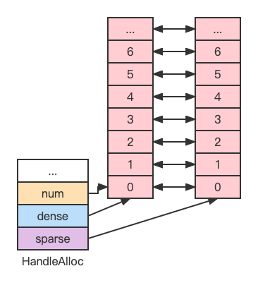

数组元素分为两种：已分配（绿色）和未分配（红色）。

第一个数组中已分配元素分布是稠密的，称为 dense。

第二个数组中已分配元素分布是稀疏的，称为 sparse。

dense 数组元素与 sparse 数组元素互相之间一一映射。

我们采用 dense 数组元素值作为 Handle 值（就是 sparse 数组的下标），我们只需要记录下 dense 数组当前元素个数，就能知道下一个分配 Handle 对应的 dense 数组下标。释放 Handle 的时候，我们让处于 dense 数组顶端的元素与被释放 Handle 的 dense 数组元素交换位置，从而每次释放 Handle 对于 dense 数组来说都缩小了数组长度，对于 sparse 数组来说则可能多了一些空洞。

按照这种设计，Handle 分配释放过程演示图如下：

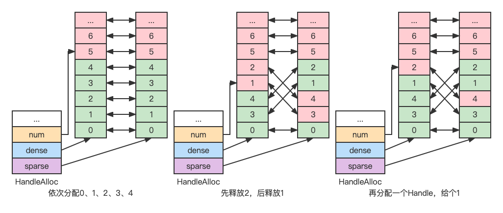

对于被三方使用到的缓冲区，我设计了如下结构：

```c
typedef struct {
  void* ptr;
  size_t sz;
  luaL_MemRelease release;
  void* ud;
} luaL_MemBuffer;
```

该结构可作为值类型在多个使用方之间移动（注意是移动，不是复制）。由最后一个使用者调用release进行缓冲区释放。也就是说，创建者分配内存之后，将释放内存的操作设置给release，之后就可以不用管这个内存了，由使用者使用完之后去释放。（如此设计如果使用者忘记release则导致内存泄漏，不过，此结构的移动仅存在C模块中，C模块又被设计为只实现基础功能，并非用于普通逻辑开发，泄漏可能性的考验在于库的设计者而非用户）一般来说，渲染线程使用完就释放掉相关资源即可。（这里不考虑碰撞检测等引擎功能，仅考虑渲染层）

## 渲染线程

渲染线程本质是一个任务线程，渲染任务大致上可以划分为两种：

  1. 管理渲染资源，包括创建、更新、销毁
  2. 向 GPU 提交 DrawCall

对于第一种，我们通过渲染命令来实现，包括创建资源、更新资源、销毁资源三套命令。渲染命令由逻辑线程生成并放入命令列表，由渲染线程从列表中拿出并依次执行。命令和命令列表的基本数据结构如下：

```c
typedef enum {
  /* Create Render Resource */
  /* Update Render Resource */
  CT_End,
  /* Destroy Render Resource */
} CommandType;

typedef union {
  /* Render Command Parameters */
} CommandParam;

typedef struct {
  CommandType type;
  CommandParam param;
} Command;

typedef struct {
  uint32_t count;
  uint32_t size;
  Command* buffer;
} CommandBuffer;
```

对于第二种，是我们有了渲染资源之后，开始使用这些资源来在屏幕上渲染物体。渲染一个物体除了 VertexBuffer、IndexBuffer、Shader等渲染资源外，还需要设置深度模板测试、混合、裁剪等渲染状态。主要数据结构为代表一个DrawCall的RenderDraw和该DrawCall所属的View。

渲染线程负责渲染，自然也承担了封装OpenGL相关操作的任务。这里将其封装为一个渲染器，对外的接口如下：（每一个字段都是一个函数指针）

```c
struct RendererContext {
  RendererInit init;
  RendererShutdown shutdown;

  RendererCreateVertexLayout createVertexLayout;
  RendererCreateVertexBuffer createVertexBuffer;
  RendererCreateIndexBuffer createIndexBuffer;
  RendererCreateShader createShader;
  RendererCreateProgram createProgram;
  /* Create Other Resource */

  RendererUpdateVertexBuffer updateVertexBuffer;
  RendererUpdateIndexBuffer updateIndexBuffer;

  RendererBeginFrame beginFrame;
  RendererSubmit submit;
  RendererEndFrame endFrame;
  RendererFlip flip;

  RendererDestroyVertexLayout destroyVertexLayout;
  RendererDestroyVertexBuffer destroyVertexBuffer;
  RendererDestroyIndexBuffer destroyIndexBuffer;
  RendererDestroyShader destroyShader;
  RendererDestroyProgram destroyProgram;
  /* Destroy Other Resource */
};
```

针对OpenGL渲染器，对应的结构体继承自RendererContext，如下：

```c
typedef struct {
  RendererContext api;

  IndexBufferGL indexBuffers[BCFX_CONFIG_MAX_INDEX_BUFFER];
  bcfx_VertexLayout vertexLayouts[BCFX_CONFIG_MAX_VERTEX_LAYOUT];
  VertexBufferGL vertexBuffers[BCFX_CONFIG_MAX_VERTEX_BUFFER];
  ShaderGL shaders[BCFX_CONFIG_MAX_SHADER];
  ProgramGL programs[BCFX_CONFIG_MAX_PROGRAM];
  /* Other Resource */
} RendererContextGL;
```

渲染线程代码实现如下：

```c
#define CALL_RENDERER(func, ...) renderCtx->func(renderCtx, ##__VA_ARGS__)

static void ctx_renderFrame(Context* ctx) {
  RendererContext* renderCtx = ctx->renderCtx;

  ctx_apiSemWait(ctx); // 等待逻辑线程信号

  CALL_RENDERER(beginFrame, ctx->renderFrame); // begin事件
  ctx_rendererExecCommands(ctx, ctx->renderFrame->cmdPre); // 处理渲染资源的创建、更新
  CALL_RENDERER(submit, ctx->renderFrame); // 处理DrawCall列表
  ctx_rendererExecCommands(ctx, ctx->renderFrame->cmdPost); // 处理渲染资源的销毁
  CALL_RENDERER(endFrame); // end事件

  ctx_renderSemPost(ctx); // 发出渲染完毕信号

  CALL_RENDERER(flip); // 上屏，也就是SwapBuffers
}

static void _renderThreadStart(void* arg) {
  Context* ctx = (Context*)arg;

  RendererContext* renderCtx = ctx->renderCtx;
  CALL_RENDERER(init, ctx->mainWin); // init事件
  while (ctx->running) {
    ctx_renderFrame(ctx); // 渲染一帧
  }

  CALL_RENDERER(shutdown); // shutdown事件
}
```

渲染线程启动之后，第一步就是初始化渲染器。逻辑线程传递了窗口句柄过来用于与窗口系统交互，初始化过程的一个任务就是使用glad加载OpenGL的函数指针，代码如下：

```c
winctx_makeContextCurrent(glCtx->mainWin);

if (!gladLoadGLLoader((GLADloadproc)winctx_getProcAddress)) {
    printf("Failed to initialize GLAD");
    exit(-1);
}
```
初始化完毕紧接着就是循环中渲染一帧，除了与逻辑线程同步，执行渲染器的beginFrame和endFrame事件之外，主要功能就是处理资源渲染命令和提交DrawCall列表给OpenGL。最后，在一帧完毕的时候调用窗口API进行SwapBuffers上屏。

渲染每一帧之前，渲染线程都会检查running状态，当running状态为false时，调用渲染器的shutdown接口并结束渲染线程。渲染器的shutdown接口将销毁所有GPU资源。

## 基本流程

bcfx提供给逻辑线程调用的 API 最基本的有三个：init、apiFrame、shutdown，共同构成渲染库的基本生命周期。

在调用bcfx的API之前，我们还需要先将bcfx需要的功能函数指针注入给bcfx，共包含三个部分：线程操作、信号量操作、窗口操作（SwapBuffers等）。这里我使用 [libuv](http://libuv.org/) 库来提供线程和信号量操作接口，窗口操作自然从[glfw](https://www.glfw.org/) 导出。我将bcfx注入Lua，称为libbcfx，同时创建一个bcfx.lua的模块，用于多一层封装。注入功能指针的逻辑就放在bcfx.lua模块的require过程，相关代码如下：

```lua
local libuv = require("libuv")
local thread = libuv.thread
local sem = thread.sem

local glfw = require("glfw")
local func_ptr = glfw.func_ptr

bcfx.setThreadFuncs(
	thread.thread_create,
	thread.thread_self,
	thread.thread_invalid,
	thread.thread_join,
	thread.thread_equal
)

bcfx.setSemFuncs(
	sem.sem_init,
	sem.sem_destroy,
	sem.sem_post,
	sem.sem_wait,
	sem.sem_trywait
)

bcfx.setWinCtxFuncs(
	func_ptr.MakeContextCurrent,
	func_ptr.SwapBuffers,
	func_ptr.SwapInterval,
	func_ptr.GetProcAddress,
	func_ptr.GetFramebufferSize
)
```

#### init接口

一般情况下，OpenGL的上下文跟窗口是绑定的。初始化bcfx的时候会启动渲染线程去初始化OpenGL的上下文，因此我们需要提前创建一个主窗口，将其句柄传递给bcfx。bcfx的初始化函数原型如下：

```c
typedef void* Window;
BCFX_API void bcfx_init(Window mainWin);
```

初始化过程除了准备数据结构（view、frame、uniform等结构）、创建渲染器之外，就是启动渲染线程：（需要注意的一点是，api线程的信号量初始化为0，render线程的信号量初始化为1，表示逻辑线程第一帧不需要等待渲染线程）

```c
ctx->apiSem = sem_init(0);
ctx->renderSem = sem_init(1);
ctx->renderThread = thread_create(_renderThreadStart, (void*)ctx);
```

### apiFrame接口

apiFrame实现逻辑结构如下：

```c
void ctx_apiFrame(Context* ctx, uint32_t renderCount) {
  ctx->submitFrame->renderCount = renderCount;
  memcpy(ctx->submitFrame->views, ctx->views, sizeof(ctx->views));

  ctx_renderSemWait(ctx);

  Frame* submitFrame = ctx->renderFrame;
  ctx->renderFrame = ctx->submitFrame;
  ctx->submitFrame = submitFrame;

  ctx_apiSemPost(ctx);

  // Other Operations
}
```

bcfx暴露给用户的API中，一部分是设置View相关参数的。View的参数在用户设置的时候会存在ctx中的那份。apiFrame的第一个任务，就是更新当前frame数据中的所有View参数（直接复制ctx的那份）。之后，逻辑线程等待渲染线程渲染完上一帧，并简单交换frame双缓冲，再来触发渲染线程去渲染最新这帧的数据。最后，apiFrame根据需求可能还会做一些事件回调、状态清理等任务。

### shutdown接口

shutdown逻辑实现如下：

```c
void ctx_shutdowm(Context* ctx) {
  ctx->running = false;
  ctx_apiSemPost(ctx); // maybe render thread waiting for api sem, fire render thread to exit
  thread_join(ctx->renderThread); // Wait render thread to exit

  sem_destroy(ctx->apiSem);
  sem_destroy(ctx->renderSem);

  DestroyRenderer(ctx->renderCtx);
  ctx->renderCtx = NULL;

  // Destroy all handle allocator
}
```

shutdown接口被调用代表用户不再需要使用到bcfx的功能，我们需要关闭渲染线程，并销毁信号量、渲染器等资源。首先将running设置为false并抛出api信号量告知渲染线程应当退出运行。之后，逻辑线程使用thread_join接口等待渲染线程运行结束。最后再清理信号量，销毁渲染器以及Handle分配器。

### 最小清屏Demo

一个View最基础的参数包括View大小和清屏参数，这里设计了两个逻辑API用于设置这两个View参数：

```lua
---@param id ViewId
---@param flags bcfx_clear_flag @ combining flags with '|'
---@param rgba Color @ color buffer clear value
---@param depth number @ [-1.0, 1.0], depth buffer clear value, usually 1.0
---@param stencil integer @ [0, 255], stencil buffer clear value, usually 0
function bcfx.setViewClear(id, flags, rgba, depth, stencil) end

---@param id ViewId
---@param x integer @ rect: origin is LeftBottom, x towards right, y towards top, unit is pixel
---@param y integer
---@param width integer
---@param height integer
function bcfx.setViewRect(id, x, y, width, height) end
```

setViewClear接口的id指定设置某个View的参数，目前支持256个View，因此ViewID取值范围是0到255。flags用于说明开始渲染前需要Clear的内容，包括COLOR、DEPTH、STENTIL。rgba就是Clear的颜色。

setViewRect接口设置的就是glViewport需要的参数，含义一致。由于每个View有各自的Rect，所以每个View的Clear参数仅作用于该Rect范围内。bcfx保证ViewID小的拥有最高的渲染顺序。因此，ViewID大的View渲染的内容能覆盖ViewID小的View。

基础Demo代码如下，loop中执行的touch接口提交一个伪DrawCall，用于触发View参数的生效。（如果我们真有DrawCall提交，可以不调用touch接口）

```lua
local glfw = require("glfw")
local bcfx = require("bcfx")

local viewID = 0
local viewID1 = 1

local function setup(win)
    glfw.setKeyCallback(win, function(win, key, scancode, action, mods)
        if key == glfw.keyboard.ESCAPE and action == glfw.input_state.PRESS then
            glfw.setWindowShouldClose(win, true)
        end
    end)
    glfw.setFramebufferSizeCallback(win, function(window, width, height)
        bcfx.setViewRect(viewID, 0, 0, width, height)
        bcfx.setViewRect(viewID1, 30, 30, width // 2, height // 2)
    end)
    local w, h = glfw.getFramebufferSize(win)
    bcfx.setViewRect(viewID, 0, 0, w, h)
    bcfx.setViewClear(viewID, bcfx.clear_flag.COLOR, bcfx.color.cyan, 1.0, 0)
    bcfx.setViewRect(viewID1, 30, 30, w // 2, h // 2)
    bcfx.setViewClear(viewID1, bcfx.clear_flag.COLOR, bcfx.color.red, 1.0, 0)
end

local function loop()
    bcfx.touch(viewID)
    bcfx.touch(viewID1)
end

glfw.init()

glfw.windowHint(glfw.window_hint.CONTEXT_VERSION_MAJOR, 4)
glfw.windowHint(glfw.window_hint.CONTEXT_VERSION_MINOR, 1)
glfw.windowHint(glfw.window_hint.OPENGL_PROFILE, glfw.hint_value.OPENGL_CORE_PROFILE)
glfw.windowHint(glfw.window_hint.OPENGL_FORWARD_COMPAT, glfw.hint_value.TRUE)

local win = glfw.createWindow(400, 300, "GLFW win")

bcfx.init(win)

setup(win)

while not glfw.windowShouldClose(win) do
    glfw.pollEvents()
    loop()
    bcfx.apiFrame()
end

bcfx.shutdown()
glfw.terminate()
```

运行效果图：

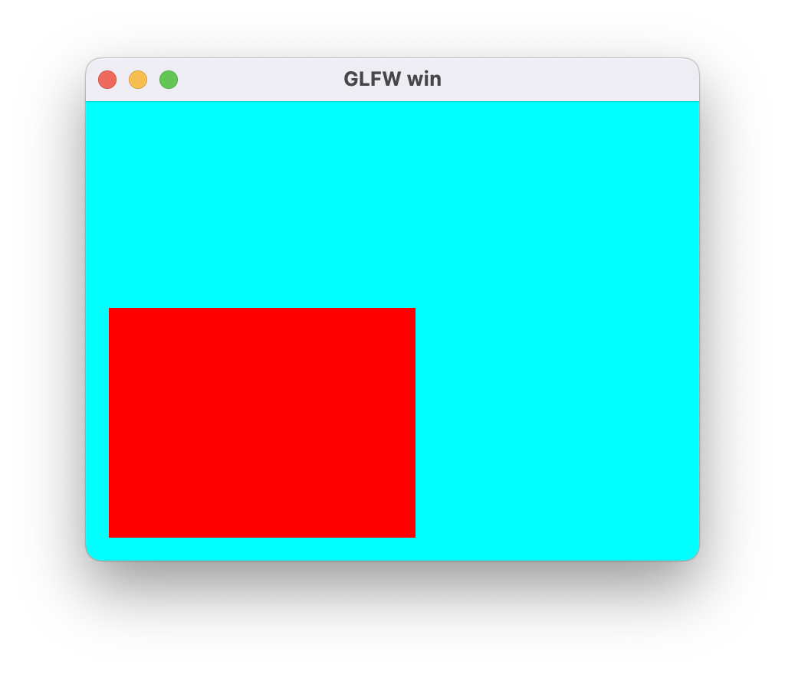

## 顶点数据

基础渲染数据我们需要顶点和索引。索引比较简单，纯粹是一个数字数组，我们只需要记录对应Buffer结构和数组元素类型即可，Buffer结构统一为`luaL_MemBuffer`，代表一段内存，数组元素类型为一个枚举，指代`uint16_t、uint32_t`等。我们设计如下API：

```c
typedef enum {
 IT_Uint8,
 IT_Uint16,
 IT_Uint32,
} bcfx_EIndexType;

BCFX_API Handle bcfx_createIndexBuffer(luaL_MemBuffer* mem, bcfx_EIndexType type);
```

逻辑线程中对于创建IndexBuffer的操作包含两部分，一是分配一个Handle，二是往对应CommandBuffer中加入一个IndexBuffer的Command，实现如下：（CommandBuffer就是一个可变长的Command数组）

```c
Handle ctx_createIndexBuffer(Context* ctx, luaL_MemBuffer* mem, bcfx_EIndexType type) {
  Handle handle = HANDLE_ALLOC(IndexBuffer);
  CommandParam* param = ctx_addCommand(ctx, CT_CreateIndexBuffer, handle);
  param->cib.mem = *mem;
  param->cib.type = type;
  return handle;
}
```

当前帧的CommandBuffer在帧末apiFrame函数中随着交换Frame数据的过程一同被交换给渲染线程，渲染线程通过调用`ctx_rendererExecCommands`函数按序执行每个命令，当遇到`CT_CreateIndexBuffer`类型的命令时，会分发给渲染器的createIndexBuffer接口，从而在渲染器的实现中去进行实际的资源创建。如下是使用OpenGL接口的渲染器实现：

```c
static void gl_createIndexBuffer(RendererContext* ctx, 
                                 Handle handle, 
                                 luaL_MemBuffer* mem, 
                                 bcfx_EIndexType type) {
  RendererContextGL* glCtx = (RendererContextGL*)ctx;
  IndexBufferGL* ib = &glCtx->indexBuffers[handle_index(handle)];
  ib->count = mem->sz / sizeof_IndexType[type];
  ib->type = type;
  ib->bIsDynamic = mem->ptr == NULL;
  ib->size = mem->sz;

  GL_CHECK(glGenBuffers(1, &ib->id));
  GL_CHECK(glBindBuffer(GL_ELEMENT_ARRAY_BUFFER, ib->id));
  GL_CHECK(glBufferData(GL_ELEMENT_ARRAY_BUFFER, 
                        ib->size, mem->ptr, 
                        ib->bIsDynamic ? GL_DYNAMIC_DRAW : GL_STATIC_DRAW));
  GL_CHECK(glBindBuffer(GL_ELEMENT_ARRAY_BUFFER, 0));

  MEMBUFFER_RELEASE(mem);
}
```

渲染器中维护了IndexBuffer对应的结构，称为IndexBufferGL，其中包含了该Buffer的Meta数据，并保存了glGenBuffers生成的ID，用户通过Handle可以找到IndexBufferGL。

顶点数据则复杂一些，OpenGL中操作顶点主要有两个接口，一个是通用的往GPU传送数据的glBufferData，一个则是用于告知OpenGL该Buffer中数据分布情况的glVertexAttribPointer，该函数原型如下：

```c
void glVertexAttribPointer(GLuint index, GLint size, GLenum type, GLboolean normalized, GLsizei stride, const void * pointer);
```

其中，index参数为绑定shader中对应变量的location，size为该属性的component数量（Vector4包含4个component），type为该属性的类型（如`GL_FLOAT`），stride为该属性在Buffer中的步长。（Buffer中可能包含多个属性）

因此，对于顶点数据，我们除了luaL_MemBuffer之外，还需要一个结构来记录该Buffer中存在的所有Attribute。这个新增的结构这里称之为VertexLayout。基于此我们设计如下接口：

```c
typedef enum {
  VA_Position, //!< a_position
  VA_Normal, //!< a_normal
  VA_Tangent, //!< a_tangent
  VA_Bitangent, //!< a_bitangent
  VA_Color0, //!< a_color0
  VA_Color1, //!< a_color1
  VA_Color2, //!< a_color2
  VA_Color3, //!< a_color3
  VA_Indices, //!< a_indices
  VA_Weight, //!< a_weight
  VA_TexCoord0, //!< a_texcoord0
  VA_TexCoord1, //!< a_texcoord1
  VA_TexCoord2, //!< a_texcoord2
  VA_TexCoord3, //!< a_texcoord3
  VA_TexCoord4, //!< a_texcoord4
  VA_TexCoord5, //!< a_texcoord5
  VA_TexCoord6, //!< a_texcoord6
  VA_TexCoord7, //!< a_texcoord7
  VA_Count,
} bcfx_EVertexAttrib;

typedef struct {
  uint8_t normal : 1;
  uint8_t type : 3;
  uint8_t num : 3;
  uint8_t reserved : 1;
} bcfx_Attrib;

typedef struct {
  uint8_t stride;
  uint8_t offset[VA_Count];
  bcfx_Attrib attributes[VA_Count];
} bcfx_VertexLayout;

BCFX_API void bcfx_vertexLayoutAdd(bcfx_VertexLayout* layout, 
                                   bcfx_EVertexAttrib attrib, 
                                   uint8_t num, 
                                   bcfx_EAttribType type, 
                                   bool normalized);
BCFX_API Handle bcfx_createVertexLayout(bcfx_VertexLayout* layout);
BCFX_API Handle bcfx_createVertexBuffer(luaL_MemBuffer* mem, 
                                        Handle layoutHandle);
```

设计中支持了Position、Normal等多种Attribute，首先通过`bcfx_vertexLayoutAdd`接口将该Buffer包含的Attribute添加到layout中，之后`bcfx_createVertexLayout`接口创建一个layout资源，得到其Handle并传递给`bcfx_createVertexBuffer`，用于创建对应的VertexBuffer。创建完毕用户会得到该VertexBuffer的Handle，后续使用仅涉及该Handle，无需layout的Handle。

对应于VertexAttribute的枚举，在Shader中也定义好固定的变量：

```c
static const char* attribNames[] = {
    "a_position",
    "a_normal",
    "a_tangent",
    "a_bitangent",
    "a_color0",
    "a_color1",
    "a_color2",
    "a_color3",
    "a_indices",
    "a_weight",
    "a_texcoord0",
    "a_texcoord1",
    "a_texcoord2",
    "a_texcoord3",
    "a_texcoord4",
    "a_texcoord5",
    "a_texcoord6",
    "a_texcoord7",
    NULL,
};
```

创建VertexLayout和VertexBuffer等资源在逻辑线程和渲染线程的实现类似IndexBuffer，渲染器中的实现如下：

```c
static void gl_createVertexLayout(RendererContext* ctx, 
                                  Handle handle, 
                                  const bcfx_VertexLayout* layout) {
  RendererContextGL* glCtx = (RendererContextGL*)ctx;
  glCtx->vertexLayouts[handle_index(handle)] = *layout;
}

static void gl_createVertexBuffer(RendererContext* ctx, 
                                  Handle handle, 
                                  luaL_MemBuffer* mem, 
                                  Handle layoutHandle) {
  RendererContextGL* glCtx = (RendererContextGL*)ctx;
  VertexBufferGL* vb = &glCtx->vertexBuffers[handle_index(handle)];

  // bcfx_VertexLayout* layout = &glCtx->vertexLayouts[handle_index(layoutHandle)];
  // vb->count = mem->sz / layout->stride;
  vb->layout = layoutHandle;
  vb->bIsDynamic = mem->ptr == NULL;
  vb->size = mem->sz;

  GL_CHECK(glGenBuffers(1, &vb->id));
  GL_CHECK(glBindBuffer(GL_ARRAY_BUFFER, vb->id));
  GL_CHECK(glBufferData(GL_ARRAY_BUFFER, 
                        vb->size, 
                        mem->ptr, 
                        vb->bIsDynamic ? GL_DYNAMIC_DRAW : GL_STATIC_DRAW));
  GL_CHECK(glBindBuffer(GL_ARRAY_BUFFER, 0));

  MEMBUFFER_RELEASE(mem);
}
```

以上，我们创建了顶点资源，渲染过程我们还需要使用该资源的接口，设计如下：

```c
BCFX_API void bcfx_setVertexBuffer(uint8_t stream, Handle handle);
// start and count calculate in indexes，not byte
BCFX_API void bcfx_setIndexBuffer(Handle handle, uint32_t start, uint32_t count);
```

这两个API则用于设置当前DrawCall使用的顶点和索引，支持多个顶点属性放于多个顶点Buffer中。

## 着色器

为了渲染一个三角形，我们还需要Shader的配合。OpenGL中给出了Shader和Program两种概念，我们这里暂且支持VertexShader和FragmentShader两种Shader，接口设计如下：

```c
typedef enum {
  ST_Vertex,
  ST_Fragment,
} bcfx_EShaderType;
BCFX_API Handle bcfx_createShader(luaL_MemBuffer* mem, bcfx_EShaderType type);
BCFX_API Handle bcfx_createProgram(Handle vs, Handle fs);
```

创建一个Shader，只需给出Shader代码对应的内存Buffer和指定的Shader类型。而创建Program，需要给出VertexShader和FragmentShader对应的Handle。当然，这两个API依旧是逻辑线程中调用，内部实现为往CommandBuffer中插入一个Command，待apiFrame交换后由渲染器进行真正的Shader创建和Program创建。渲染器实现逻辑如下：

```c
static void gl_createShader(RendererContext* ctx, 
                            Handle handle, 
                            luaL_MemBuffer* mem, 
                            bcfx_EShaderType type) {
  RendererContextGL* glCtx = (RendererContextGL*)ctx;
  ShaderGL* shader = &glCtx->shaders[handle_index(handle)];
  shader->type = shader_glType[type];
  GL_CHECK(shader->id = glCreateShader(shader->type));

  const GLint length = mem->sz;
  GL_CHECK(glShaderSource(shader->id, 1, (const GLchar* const*)&mem->ptr, &length));
  GL_CHECK(glCompileShader(shader->id));

  GLint success;
  GL_CHECK(glGetShaderiv(shader->id, GL_COMPILE_STATUS, &success));
  
  if (success == GL_FALSE) {
    GLint logLen = 0;
    GL_CHECK(glGetShaderiv(shader->id, GL_INFO_LOG_LENGTH, &logLen));
    GLchar* infoLog = (GLchar*)alloca(logLen);
    GL_CHECK(glGetShaderInfoLog(shader->id, logLen, NULL, infoLog));
    printf_err("Shader compile error: %s\n", infoLog);
  }
  
  MEMBUFFER_RELEASE(mem);
}
```

对于OpenGL来说，创建Shader对象，传递Shader源码，编译，并检查编译结果。

```c
static void gl_createProgram(RendererContext* ctx, 
                             Handle handle, 
                             Handle vsh, 
                             Handle fsh) {
  RendererContextGL* glCtx = (RendererContextGL*)ctx;
  ShaderGL* vs = &glCtx->shaders[handle_index(vsh)];
  ShaderGL* fs = &glCtx->shaders[handle_index(fsh)];
  ProgramGL* prog = &glCtx->programs[handle_index(handle)];

  if (prog->id == 0) {
    GL_CHECK(prog->id = glCreateProgram());
  }

  if (prog->vs != vs->id) {
    if (prog->vs != 0) {
      GL_CHECK(glDetachShader(prog->id, prog->vs));
    }
    GL_CHECK(glAttachShader(prog->id, vs->id));
    prog->vs = vs->id;
  }

  if (prog->fs != fs->id) {
    if (prog->fs != 0) {
      GL_CHECK(glDetachShader(prog->id, prog->fs));
    }
    GL_CHECK(glAttachShader(prog->id, fs->id));
    prog->fs = fs->id;
  }
  GL_CHECK(glLinkProgram(prog->id));

  GLint success;
  GL_CHECK(glGetProgramiv(prog->id, GL_LINK_STATUS, &success));
  if (success == GL_FALSE) {
    GLint logLen = 0;
    GL_CHECK(glGetProgramiv(prog->id, GL_INFO_LOG_LENGTH, &logLen));
    GLchar* infoLog = (GLchar*)alloca(logLen);
    GL_CHECK(glGetProgramInfoLog(prog->id, logLen, NULL, infoLog));
    printf_err("Shader program link error: %s\n", infoLog);
    return;
  }

  prog_collectAttributes(prog);
  prog_collectUniforms(prog, glCtx);
}
```

创建Program则是先创建对应对象，绑定Shader，之后进行Shader链接，最后检查链接结果。

当Program链接成功之后，我们还会收集该ShaderProgram中需要用到的Attribute和Uniform信息，并做Attribute和Uniform的匹配工作，以便后续做Attribute绑定和Uniform绑定。Attribute都是内置好的，不支持自定义；Uniform支持用户自定义，那么需要在Shader创建之前创建好对应的Uniform，避免Program创建过程的Uniform匹配失败导致后续无法正常。

有了Shader的支持，我们就可以渲染一个三角形：

```lua
local viewID = 0
local triangle = {}
local function setup(win)
    glfw.setKeyCallback(win, function(win, key, scancode, action, mods)
        if key == glfw.keyboard.ESCAPE and action == glfw.input_state.PRESS then
            glfw.setWindowShouldClose(win, true)
        end
    end)

    glfw.setFramebufferSizeCallback(win, function(window, width, height)
        bcfx.setViewRect(viewID, 0, 0, width, height)
    end)

    bcfx.setViewRect(viewID, 0, 0, glfw.getFramebufferSize(win))
    bcfx.setViewClear(viewID, bcfx.clear_flag.COLOR, bcfx.color.cyan, 1.0, 0)

    local layout = bcfx.VertexLayout()
    layout:add(bcfx.vertex_attrib.Position, 3, bcfx.attrib_type.Float, false)
    local vertexData = bcfx.makeMemBuffer(bcfx.data_type.Float, {
        -0.5, -0.5, 0.0,
        0.5, -0.5, 0.0,
        0.0, 0.5, 0.0,
    })

    local layoutHandle = bcfx.createVertexLayout(layout)
    triangle.vertexHandle = bcfx.createVertexBuffer(vertexData, layoutHandle)

    local vs = bcfx.createShader([[
#version 410 core
in vec3 a_position;
out vec3 v_color0;
void main() {
	gl_Position = vec4(a_position, 1.0);
}
]], bcfx.shader_type.Vertex)

    local fs = bcfx.createShader([[
#version 410 core
out vec4 FragColor;
void main() {
	FragColor = vec4(0.8, 0.3, 0.3, 1.0);
}
]], bcfx.shader_type.Fragment)

    triangle.programHandle = bcfx.createProgram(vs, fs)
end

local function loop()
    bcfx.setVertexBuffer(0, triangle.vertexHandle)
    bcfx.submit(viewID, triangle.programHandle)
end
```

运行效果图：

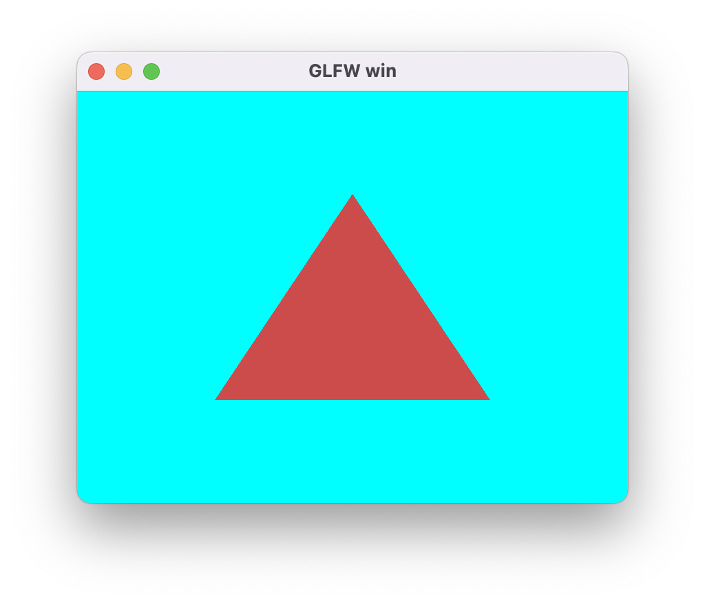

## 3D 数学

对于顶点着色器来说，输入Position为模型空间的位置信息，输出为齐次裁剪空间的位置信息。这期间的变换，涉及多种矩阵操作。为了给Shader传递恰当的矩阵，我们需要在CPU端实现一套合理的3D矩阵函数库。

网上有各种C++实现的数学库，功能强大实现复杂，这里也用不上，我们只需要最最核心的向量和矩阵部分功能。参考[LightMatrix](https://github.com/zjc666/LightMatrix)的实现，我用C语言实现了一版具备基本功能的数学运算。（共1500行C代码，其中向量200行，矩阵300行，3D矩阵变换500行，欧拉角四元数500行）

向量基础定义如下：（支持n维向量，运行时element数组可分配为目标长度）

```c
typedef struct {
  uint8_t count;
  float element[1];
} Vec;

BCFX_API void vec_init(Vec* vec, uint8_t cnt);
BCFX_API void vec_zero(Vec* vec);
BCFX_API void vec_one(Vec* vec);
BCFX_API void vec_add(const Vec* src1, const Vec* src2, Vec* dst);
BCFX_API void vec_subtract(const Vec* src1, const Vec* src2, Vec* dst);
BCFX_API void vec_componentWiseProduct(const Vec* src1, const Vec* src2, Vec* dst);
BCFX_API void vec_scale(const Vec* src, float scale, Vec* dst);
BCFX_API float vec_dotProduct(const Vec* vec1, const Vec* vec2);
BCFX_API float vec_lengthSquared(const Vec* vec);
BCFX_API float vec_length(const Vec* vec);
BCFX_API float vec_distanceSquared(const Vec* vec1, const Vec* vec2);
BCFX_API float vec_distance(const Vec* vec1, const Vec* vec2);
BCFX_API void vec_normalize(const Vec* src, Vec* dst);
BCFX_API void vec_copy(const Vec* src, Vec* dst);
BCFX_API void vec_max(const Vec* src1, const Vec* src2, Vec* dst);
BCFX_API void vec_min(const Vec* src1, const Vec* src2, Vec* dst);
BCFX_API bool vec_equals(const Vec* src1, const Vec* src2);
BCFX_API bool vec_isZero(const Vec* vec);
BCFX_API void vec_projection(const Vec* src, const Vec* axis, Vec* dst);
BCFX_API void vec_perpendicular(const Vec* src, const Vec* axis, Vec* dst);
```

配套n维向量可以有多种操作，如加减乘除、点乘、距离、投影、垂线等。可以看到，该实现中库内部只负责计算，不负责分配内存。

基于基础向量的定义，为了方便衍生出2维、3维、4维向量：

```c
typedef struct {
  uint8_t count;
  float element[2];
} Vec2;

BCFX_API void vec2_init(Vec2* vec);
typedef struct {
  uint8_t count;
  float element[3];
} Vec3;

BCFX_API void vec3_init(Vec3* vec);
BCFX_API void vec3_crossProduct(const Vec3* src1, const Vec3* src2, Vec3* dst);

typedef struct {
  uint8_t count;
  float element[4];
} Vec4;

BCFX_API void vec4_init(Vec4* vec);
```

显然，初始化的时候设置好count长度之后，衍生出来的这几个结构依旧可以使用基础向量的各种操作。由于叉乘仅存在于3维向量，故单独定义实现。

矩阵基础定义如下：（支持n*m的矩阵，运行时element数组可分配为目标长度，为了匹配OpenGL，Mat的element采用列优先存储）

```c
typedef struct {
  uint8_t row;
  uint8_t col;
  float element[1];
} Mat;

BCFX_API void mat_init(Mat* mat, uint8_t row, uint8_t col);
BCFX_API void mat_zero(Mat* mat);
BCFX_API void mat_identity(Mat* mat);
BCFX_API void mat_add(const Mat* src1, const Mat* src2, Mat* dst);
BCFX_API void mat_subtract(const Mat* src1, const Mat* src2, Mat* dst);
BCFX_API void mat_scale(const Mat* src, float scale, Mat* dst);
BCFX_API void mat_componentWiseProduct(const Mat* src1, const Mat* src2, Mat* dst);
BCFX_API void mat_multiply(const Mat* src1, const Mat* src2, Mat* dst);
BCFX_API void mat_multiplyVec(const Mat* mat, const Vec* vec, Vec* dst);
BCFX_API void mat_transpose(const Mat* src, Mat* dst);
BCFX_API void mat_copy(const Mat* src, Mat* dst);
BCFX_API float mat_determinant(const Mat* mat);
BCFX_API void mat_adjoint(const Mat* src, Mat* dst);
BCFX_API bool mat_inverse(const Mat* src, Mat* dst);
```

n维矩阵支持各种操作，加减乘除、转置矩阵、对应行列式的值、伴随矩阵、逆矩阵等。

基于基础向量的定义，为了方便衍生出3x3、4x4矩阵：

```c
typedef struct {
  uint8_t row;
  uint8_t col;
  float element[3 * 3];
} Mat3x3;

BCFX_API void mat3x3_init(Mat3x3* mat);
typedef struct {
  uint8_t row;
  uint8_t col;
  float element[4 * 4];
} Mat4x4;

BCFX_API void mat4x4_init(Mat4x4* mat);
BCFX_API void mat4x4_initMat3x3(Mat4x4* mat, const Mat3x3* mat3x3);
```

使用这种结构体+静态函数的形式实现起来的API使用起来异常繁杂，不如C++等面向对象封装之后的成员函数调用方便。不过，我们也只需要写一遍C语言的形式，后续将其注入Lua后，使用元表+元方法形式的封装之后，可解决这个问题，毕竟，逻辑使用Lua写。

有了向量和矩阵定义实现之后，我们可以实现3D数学相关的矩阵转换：

```c
```c
BCFX_API void g3d_translate(const Vec3* vec, Mat4x4* mat);
BCFX_API void g3d_rotate(float angle, const Vec3* axis, Mat4x4* mat);
BCFX_API void g3d_scale(const Vec3* vec, Mat4x4* mat);
BCFX_API void g3d_scaleAxis(float scale, const Vec3* axis, Mat4x4* mat);

BCFX_API void g3d_perspective(float fovy, 
                              float aspect, 
                              float zNear, 
                              float zFar, 
                              Mat4x4* mat);
BCFX_API void g3d_perspectiveInfinity(float fovy, 
                                      float aspect, 
                                      float zNear, 
                                      Mat4x4* mat);
BCFX_API void g3d_orthogonal(float left, 
                             float right, 
                             float bottom, 
                             float top, 
                             float zNear, 
                             float zFar, 
                             Mat4x4* mat);

BCFX_API void g3d_lookAt(const Vec3* eye, 
                         const Vec3* center, 
                         const Vec3* up, 
                         Mat4x4* mat);
BCFX_API void g3d_shear(const Vec3* xCoeff, 
                        const Vec3* yCoeff, 
                        const Vec3* zCoeff, Mat4x4* mat);
BCFX_API void g3d_reflection(const Vec3* normal, 
                             float delta, Mat4x4* mat);

BCFX_API void g3d_projection(const Vec* axis, Mat* mat);
BCFX_API void g3d_perpendicular(const Vec* axis, Mat* mat);
BCFX_API void g3d_crossProduct(const Vec3* A, Mat3x3* matCA);
```

所谓的3D数学矩阵转换，就是通过恰当的参数，构造生成对应的矩阵。如我们需要一个旋转角度+三维旋转轴来构造一个旋转矩阵。

`g3d_perspective`和`g3d_perspectiveInfinity`两个函数用于构造透视矩阵，透视矩阵原理可参考[这篇文章](https://km.woa.com/articles/show/547152)。

除了平移、旋转、缩放、透视投影、正交投影、lookAt矩阵等，这里还实现了剪切矩阵、反射矩阵。另外，向量投影、向量垂线、向量叉乘也可以有相应的矩阵来表达。

有了矩阵功能，我们给bcfx增加API来设置某个DrawCall的模型矩阵（ModelMatrix），接口如下：

```c
BCFX_API void bcfx_setTransform(Mat4x4* mat);
```

内部实现就直接将矩阵通过值拷贝的方式保存到RenderDraw结构的model变量中，等到apiFrame进行数据交换之后，渲染线程进行实际渲染就能获取到该矩阵。

旋转三角形Demo：

```lua
local viewID = 0
local triangle = {}

local function setup(win)
    glfw.setKeyCallback(win, function(win, key, scancode, action, mods)
        if key == glfw.keyboard.ESCAPE and action == glfw.input_state.PRESS then
            glfw.setWindowShouldClose(win, true)
        end
    end)

    glfw.setFramebufferSizeCallback(win, function(window, width, height)
        bcfx.setViewRect(viewID, 0, 0, width, height)
    end)

    bcfx.setViewRect(viewID, 0, 0, glfw.getFramebufferSize(win))
    bcfx.setViewClear(viewID, bcfx.clear_flag.COLOR, bcfx.color.cyan, 1.0, 0)
    local layout = bcfx.VertexLayout()
    layout:add(bcfx.vertex_attrib.Position, 3, bcfx.attrib_type.Float, false)

    local vertexData = bcfx.makeMemBuffer(bcfx.data_type.Float, {
        -0.5, -0.5, 0.0,
        0.5, -0.5, 0.0,
        0.0, 0.5, 0.0,
    })

    local layoutHandle = bcfx.createVertexLayout(layout)
    triangle.vertexHandle = bcfx.createVertexBuffer(vertexData, layoutHandle)

    local vs = bcfx.createShader([[
#version 410 core

in vec3 a_position;
uniform mat4 u_model;
out vec3 v_color0;

void main() {
	gl_Position = u_model * vec4(a_position, 1.0);
}
]], bcfx.shader_type.Vertex)

    local fs = bcfx.createShader([[
#version 410 core

out vec4 FragColor;

void main() {
	FragColor = vec4(0.8, 0.3, 0.3, 1.0);
}
]], bcfx.shader_type.Fragment)

    triangle.programHandle = bcfx.createProgram(vs, fs)
end

local function loop()
    bcfx.setVertexBuffer(0, triangle.vertexHandle)
    bcfx.setTransform(bcfx.math.graphics3d.rotate(bcfx.frameId() % 360, 
                                                  bcfx.math.vector.Vec3(0.0, 0.0, 1.0)))
    bcfx.submit(viewID, triangle.programHandle)
end
```

运行效果如下：

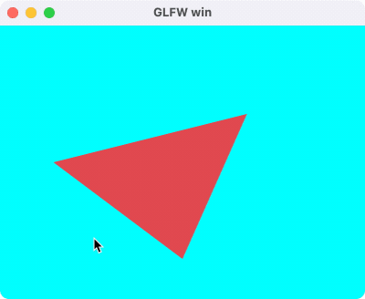

## 纹理图片

图片加载使用流程：

  1. 从磁盘加载png数据，得到对应的MemBuffer
  2. 对png数据进行解码，得到解码之后的MemBuffer（这里使用stbimage进行解码）
  3. 调用bcfx的接口createTexture，将解码之后的MemBuffer传给它，获得该图片的Handle
  4. 在设置DrawCall的参数时，使用bcfx的setTexture接口将该Texture与某个Uniform绑定在一起（需要外加采样参数）
  5. Shader中，通过采样该Uniform即可实现纹理渲染

为了对纹理进行正确的采样，我们需要给顶点加上合适的UV坐标。顶点数据以顶点为单位安排好数据，并配置好相应的VertexLayout即可。

创建Uniform的接口定义如下：

```c
typedef enum {
  UT_Sampler2D,
  UT_Vec4,
  UT_Mat3x3,
  UT_Mat4x4,
} bcfx_UniformType;

BCFX_API Handle bcfx_createUniform(const char* name, 
                                   bcfx_UniformType type, 
                                   uint16_t num);
```

创建Uniform在逻辑线程依旧是新增一个Command，渲染线程在GL渲染器上维护了所有Uniform对应的数值，解析DrawCall的过程可以根据需要设置Uniform的值到OpenGL。

OpenGL中对于纹理的绑定采用的两步走的方式来实现，第一步是使用glUniform1i将Shader中Uniform的location绑定到一个TextureUnit，第二步是glActiveTexture和glBindTexture启用该TextureUnit并将纹理绑定到该Unit上。在将纹理绑定到TextureUnit的过程顺带配置好具体的采样参数。基于这个过程这里设计了一个RenderBind结构，来记录某个DrawCall的所有纹理绑定：

```c
typedef struct {
  Handle handle;
  bcfx_SamplerFlag samplerFlags;
} Binding;

typedef struct {
  Binding binds[BCFX_CONFIG_MAX_TEXTURE_UNIT];
} RenderBind;
```

GL渲染器中实际进行绑定的逻辑如下：

```c
void gl_setProgramUniforms(RendererContextGL* glCtx, 
                           ProgramGL* prog, 
                           RenderDraw* draw, 
                           View* view, 
                           RenderBind* bind) {
    ...
        GL_CHECK(glUniform1i(prop->loc, (GLint)uniform->data.stage));
        gl_bindTextureUnit(glCtx, bind, uniform->data.stage);
    ...
}

static void gl_bindTextureUnit(RendererContextGL* glCtx, 
                               RenderBind* bind, 
                               uint8_t stage) {
  Binding* b = &bind->binds[stage];
  if (b->handle != kInvalidHandle) {
    TextureGL* texture = &glCtx->textures[handle_index(b->handle)];
    GL_CHECK(glActiveTexture(GL_TEXTURE0 + stage));
    GL_CHECK(glBindTexture(GL_TEXTURE_2D, texture->id));

    GL_CHECK(glTexParameteri(GL_TEXTURE_2D, 
                             GL_TEXTURE_WRAP_S, 
                             textureWrap_glType[b->samplerFlags.wrapU]));
    GL_CHECK(glTexParameteri(GL_TEXTURE_2D, 
                             GL_TEXTURE_WRAP_T, 
                             textureWrap_glType[b->samplerFlags.wrapV]));

    // must set GL_TEXTURE_MIN_FILTER, if not, you will get a black color when sample it
    GL_CHECK(glTexParameteri(GL_TEXTURE_2D, 
                             GL_TEXTURE_MIN_FILTER, 
                             textureFilter_glType[b->samplerFlags.filterMin]));
    GL_CHECK(glTexParameteri(GL_TEXTURE_2D, 
                             GL_TEXTURE_MAG_FILTER, 
                             textureFilter_glType[b->samplerFlags.filterMag]));
  } else {
    printf_err("Bind texture unit %d with invalid handle\n", stage);
  }
}
```

这里在实际开发中发现，如果不设置纹理的 `GL_TEXTURE_MIN_FILTER` 参数，OpenGL 中 shader 采样会得到全黑的颜色！

有了Uniform和Texture，我们需要在提交DrawCall的时候将两者绑定起来，接口设计如下：

```c
typedef struct {
  uint8_t wrapU : 1;
  uint8_t wrapV : 1;
  uint8_t filterMin : 1;
  uint8_t filterMag : 1;
  uint8_t reserved1 : 4;
  uint8_t reserved2[3];
} bcfx_SamplerFlag;

BCFX_API void bcfx_setTexture(uint8_t stage, 
                              Handle sampler, 
                              Handle texture, 
                              bcfx_SamplerFlag flags);
```

其中，stage就是TextureUnit，从0开始，目前支持8个。sampler则为对应Uniform的Handle，texture是纹理的Handle，flags为纹理采样参数，目前支持wrap和filter两种。

渲染纹理的Demo：

```lua
local viewID = 0
local triangle = {}

local function setup(win)
    glfw.setKeyCallback(win, function(win, key, scancode, action, mods)
        if key == glfw.keyboard.ESCAPE and action == glfw.input_state.PRESS then
            glfw.setWindowShouldClose(win, true)
        end
    end)

    glfw.setFramebufferSizeCallback(win, function(window, width, height)
        bcfx.setViewRect(viewID, 0, 0, width, height)
    end)

    bcfx.setViewRect(viewID, 0, 0, glfw.getFramebufferSize(win))
    bcfx.setViewClear(viewID, bcfx.clear_flag.COLOR, bcfx.color.cyan, 1.0, 0)

    local layout = bcfx.VertexLayout()
    layout:add(bcfx.vertex_attrib.Position, 3, bcfx.attrib_type.Float, false)
    layout:add(bcfx.vertex_attrib.TexCoord0, 2, bcfx.attrib_type.Float, false)

    local vertexData = bcfx.makeMemBuffer(bcfx.data_type.Float, {
        -0.5, -0.5, 0.0, 0.0, 0.0,
        0.5, -0.5, 0.0, 1.0, 0.0,
        0.0, 0.7, 0.0, 0.0, 1.0,
    })

    local layoutHandle = bcfx.createVertexLayout(layout)
    triangle.vertexHandle = bcfx.createVertexBuffer(vertexData, layoutHandle)
    triangle.uniformHandle = bcfx.createUniform("u_texture", bcfx.uniform_type.Sampler2D)

    local vs = bcfx.createShader([[
#version 410 core

in vec3 a_position;
in vec2 a_texcoord0;
uniform mat4 u_model;
out vec2 v_texcoord0;

void main() {
	v_texcoord0 = a_texcoord0;
	gl_Position = u_model * vec4(a_position, 1.0);
}
	]], bcfx.shader_type.Vertex)

    local fs = bcfx.createShader([[
#version 410 core

in vec2 v_texcoord0;
uniform sampler2D u_texture;
out vec4 FragColor;

void main() {
	FragColor = texture(u_texture, v_texcoord0);
}
	]], bcfx.shader_type.Fragment)

    triangle.programHandle = bcfx.createProgram(vs, fs)

    local libuv = require("libuv")
    local mb = libuv.mbio.readFile("awesomeface.png")
    local data, w, h = bcfx.image.imageDecode(mb, bcfx.image.image_type.PNG)
    triangle.textureHandle = bcfx.createTexture(data, w, h, bcfx.texture_format.RGB8)

    triangle.textureFlags = bcfx.utils.packSamplerFlags({
        wrapU = bcfx.texture_wrap.Clamp,
        wrapV = bcfx.texture_wrap.Clamp,
        filterMag = bcfx.texture_filter.Linear,
        filterMin = bcfx.texture_filter.Linear,
    })
end

local function loop()
    -- bcfx.touch(viewID)
    bcfx.setVertexBuffer(0, triangle.vertexHandle)
    -- bcfx.setTransform(bcfx.math.graphics3d.rotate(bcfx.frameId() % 360, bcfx.math.vector.Vec3(0.0, 0.0, 1.0)))
    bcfx.setTexture(0, triangle.uniformHandle, triangle.textureHandle, triangle.textureFlags)
    bcfx.submit(viewID, triangle.programHandle)
end
```

运行效果图：

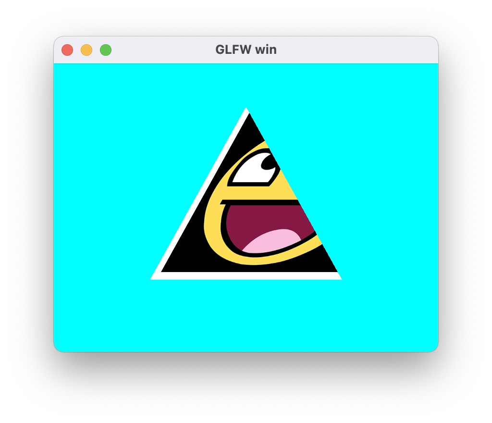

## 渲染状态

每次提交一个DrawCall，OpenGL支持设置各种渲染状态，罗列如下：

```c
typedef struct {
  uint8_t frontFace : 1;
  uint8_t enableCull : 1;
  uint8_t cullFace : 2;
  uint8_t enableDepth : 1;
  uint8_t depthFunc : 3;
  uint8_t alphaRef;
  uint8_t pointSize : 4;
  uint8_t lineWidth : 4; // current not used
  uint8_t noWriteR : 1;
  uint8_t noWriteG : 1;
  uint8_t noWriteB : 1;
  uint8_t noWriteA : 1;
  uint8_t noWriteZ : 1;
  uint8_t enableBlend : 1;
  uint8_t reserved1 : 2;
  uint8_t srcRGB : 4;
  uint8_t dstRGB : 4;
  uint8_t srcAlpha : 4;
  uint8_t dstAlpha : 4;
  uint8_t blendEquRGB : 4;
  uint8_t blendEquA : 4;
  uint8_t enableLogicOp : 1;
  uint8_t logicOp : 4;
  uint8_t reserved2 : 3;
} bcfx_RenderState;
```

其中包括裁剪面、深度测试、深度写入、混合参数等。渲染状态依旧是用户设置之后保留在RenderDraw中，待由apiFrame交换给渲染线程去使用。GL渲染器对于深度测试状态更新逻辑如下：

```c
static void renderstate_updateDepth(RenderStateGL* stateGL, bcfx_RenderState state) {
  GLboolean writeZ = !((GLboolean)state.noWriteZ);
  if (IS_STATE_CHANGED(writeZ)) {
    GL_CHECK(glDepthMask(writeZ));
  }

  GLboolean enableDepth = state.enableDepth;

  if (IS_STATE_CHANGED(enableDepth)) {
    if (enableDepth) {
      GL_CHECK(glEnable(GL_DEPTH_TEST));
      GLenum depthFunc = compareFunc_glType[state.depthFunc];
      if (IS_STATE_CHANGED(depthFunc)) {
        GL_CHECK(glDepthFunc(depthFunc));
      }
    } else {
      if (writeZ) { // maybe we should refactor these code
        GL_CHECK(glEnable(GL_DEPTH_TEST));
        GL_CHECK(glDepthFunc(GL_ALWAYS));
        stateGL->depthFunc = GL_ALWAYS;
      } else {
        GL_CHECK(glDisable(GL_DEPTH_TEST));
      }
    }
  }
}
```

核心逻辑为组合使用glDepthMask、glEnable、glDisable、glDepthFunc

对于逻辑层，使用如下接口进行渲染状态设置：（每个DrawCall具备独立状态）

```c
BCFX_API void bcfx_setState(bcfx_RenderState state, uint32_t blendColor);
```

支持深度测试的Cube渲染，使用模型空间的Position作为颜色，Demo如下：

```lua
local viewID = 0
local triangle = {}

local function setup(win)
    glfw.setKeyCallback(win, function(win, key, scancode, action, mods)
        if key == glfw.keyboard.ESCAPE and action == glfw.input_state.PRESS then
            glfw.setWindowShouldClose(win, true)
        end
    end)

    glfw.setFramebufferSizeCallback(win, function(window, width, height)
        bcfx.setViewRect(viewID, 0, 0, width, height)
    end)

    bcfx.setViewRect(viewID, 0, 0, glfw.getFramebufferSize(win))
    bcfx.setViewClear(viewID, bcfx.clear_flag.COLOR | bcfx.clear_flag.DEPTH, bcfx.color.cyan, 1.0, 0)

    local lookAtMat = bcfx.math.graphics3d.lookAt(bcfx.math.vector.Vec3(0, -2, 0), bcfx.math.vector.zero, bcfx.math.vector.up)
    local projMat = bcfx.math.graphics3d.perspective(60, 4/3, 0.1)
    bcfx.setViewTransform(viewID, lookAtMat, projMat)

    local layout = bcfx.VertexLayout()
    layout:add(bcfx.vertex_attrib.Position, 3, bcfx.attrib_type.Float, false)

    local vertexData = bcfx.makeMemBuffer(bcfx.data_type.Float, {
        -0.5, -0.5,  0.5, -- In OpenGL: front
        0.5, -0.5,  0.5, -- In Unity : back
        0.5,  0.5,  0.5,
        -0.5,  0.5,  0.5,
        -0.5,  0.5, -0.5, -- In OpenGL: back
        0.5,  0.5, -0.5, -- In Unity : front
        0.5, -0.5, -0.5,
        -0.5, -0.5, -0.5,
        -0.5, -0.5,  0.5, -- left
        -0.5,  0.5,  0.5,
        -0.5,  0.5, -0.5,
        -0.5, -0.5, -0.5,
        0.5, -0.5, -0.5, -- right
        0.5,  0.5, -0.5,
        0.5,  0.5,  0.5,
        0.5, -0.5,  0.5,
        0.5,  0.5,  0.5, -- up
        0.5,  0.5, -0.5,
        -0.5,  0.5, -0.5,
        -0.5,  0.5,  0.5,
        -0.5, -0.5,  0.5, -- down
        -0.5, -0.5, -0.5,
        0.5, -0.5, -0.5,
        0.5, -0.5,  0.5,
    }
    )

    local layoutHandle = bcfx.createVertexLayout(layout)
    triangle.vertexHandle = bcfx.createVertexBuffer(vertexData, layoutHandle)

    local mem = bcfx.makeMemBuffer(bcfx.data_type.Uint8, {
        0,  1,  2,  0,  2,  3, -- In OpenGL: front, In Unity: back
        4,  5,  6,  4,  6,  7, -- In OpenGL: back, In Unity: front
        8,  9,  10, 8,  10, 11, -- left
        12, 13, 14, 12, 14, 15, -- right
        16, 17, 18, 16, 18, 19, -- up
        20, 21, 22, 20, 22, 23, -- down
    })
    triangle.indexHandle = bcfx.createIndexBuffer(mem, bcfx.index_type.Uint8)

    local vs = bcfx.createShader([[
#version 410 core

in vec3 a_position;
uniform mat4 u_modelViewProj;
out vec3 v_pos;

void main() {
v_pos = a_position;
	gl_Position = u_modelViewProj * vec4(a_position, 1.0);
}
	]], bcfx.shader_type.Vertex)

    local fs = bcfx.createShader([[
#version 410 core

in vec3 v_pos;
out vec4 FragColor;

void main() {
	FragColor = vec4(v_pos, 1.0);
}
	]], bcfx.shader_type.Fragment)

    triangle.programHandle = bcfx.createProgram(vs, fs)
    triangle.renderFlags = bcfx.utils.packRenderState({
        enableDepth = true,
    })
end

local function loop()
    bcfx.setVertexBuffer(0, triangle.vertexHandle)
    bcfx.setIndexBuffer(triangle.indexHandle)
    bcfx.setTransform(bcfx.math.graphics3d.rotate(bcfx.frameId() % 360, 
                                                  bcfx.math.vector.Vec3(1.0, 1.0, 0.0)))
    bcfx.setState(triangle.renderFlags, bcfx.color.black)
    bcfx.submit(viewID, triangle.programHandle)
end
```

运行效果如下：

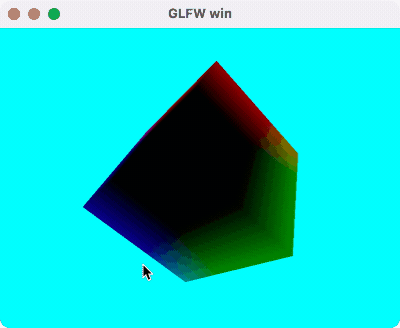

## 渲染排序

对于渲染线程处理的所有DrawCall，需要做一个排序。比如：ViewID小的需要先画，半透明物体要后画，Shader相同的DrawCall可排在靠近位置进行绘制等。包含所有需要考虑的点，SortKey结构如下：

```c
typedef struct {
  uint8_t viewId;
  uint8_t notTouch : 1;
  uint8_t isDraw : 1;
  uint8_t sortType : 2;
  uint8_t blend : 2;
  uint16_t program : 9;
  uint32_t depth : 24;
  uint16_t sequence;
} SortKey;
```

实际做排序之前，需要将该SortKey映射为一个`uint64_t`类型，从而可以快速排序，排序之后，遍历所有`uint64_t`，解码为对应的SortKey，从而正确索引到对应的DrawCall，进行实际的绘制。SortKey的编码逻辑如下：

```c
uint64_t sortkey_encode(SortKey* key) {
  uint64_t viewId = ((uint64_t)key->viewId) << SORTKEY_VIEWID_SHIFT;
  uint64_t notTouch = ((uint64_t)key->notTouch) << SORTKEY_NOTTOUCH_SHIFT;

  if (!key->notTouch) {
    return viewId | notTouch;
  }

  uint64_t isDraw = ((uint64_t)key->isDraw) << SORTKEY_ISDRAW_SHIFT;

  if (key->isDraw) {
    uint64_t sortType = ((uint64_t)key->sortType) << SORTKEY_SORTTYPE_SHIFT;

    switch (key->sortType) {
      case ST_Program: {
        uint64_t blend = ((uint64_t)key->blend) << SORTKEY_BLEND_SHIFT0;
        uint64_t program = ((uint64_t)key->program) << SORTKEY_PROGRAM_SHIFT0;
        uint64_t depth = ((uint64_t)key->depth) << SORTKEY_DEPTH_SHIFT0;
        uint64_t sequence = ((uint64_t)key->sequence) << SORTKEY_SEQUENCE_SHIFT0;

        return viewId | notTouch | isDraw | sortType | blend | program | depth | sequence;
      } break;

      case ST_Depth: {
        uint64_t depth = ((uint64_t)key->depth) << SORTKEY_DEPTH_SHIFT1;
        uint64_t blend = ((uint64_t)key->blend) << SORTKEY_BLEND_SHIFT1;
        uint64_t program = ((uint64_t)key->program) << SORTKEY_PROGRAM_SHIFT1;
        uint64_t sequence = ((uint64_t)key->sequence) << SORTKEY_SEQUENCE_SHIFT1;

        return viewId | notTouch | isDraw | sortType | depth | blend | program | sequence;
      } break;

      case ST_Sequence: {
        uint64_t sequence = ((uint64_t)key->sequence) << SORTKEY_SEQUENCE_SHIFT2;
        uint64_t blend = ((uint64_t)key->blend) << SORTKEY_BLEND_SHIFT2;
        uint64_t program = ((uint64_t)key->program) << SORTKEY_PROGRAM_SHIFT2;

        return viewId | notTouch | isDraw | sortType | sequence | blend | program;
      } break;
    }
  } else {
    uint64_t sequence = ((uint64_t)key->sequence) << SORTKEY_COMPUTE_SEQUENCE_SHIFT;
    uint64_t program = ((uint64_t)key->program) << SORTKEY_COMPUTE_PROGRAM_SHIFT;

    return viewId | notTouch | isDraw | sequence | program;
  }
  return 0;
}
```

根据编码逻辑可以看出，ViewID具有最高优先级，隶属于小ViewID的所有DrawCall都画完之后，才轮到大ViewID的DrawCall。`bcfx_touch`调用在这里也做了一个特殊处理，永远会排在其他DrawCall之前。sequence为该DrawCall在列表中的下标，排序完毕解码之后，通过sequence可以找到目标DrawCall的所有数据。解码逻辑如下：

```c
void sortkey_decode(SortKey* key, uint64_t value) {
  key->viewId = value >> SORTKEY_VIEWID_SHIFT;
  key->notTouch = value >> SORTKEY_NOTTOUCH_SHIFT;

  if (!key->notTouch) {
    return;
  }

  key->isDraw = value >> SORTKEY_ISDRAW_SHIFT;

  if (key->isDraw) {
    key->sortType = value >> SORTKEY_SORTTYPE_SHIFT;

    switch (key->sortType) {
      case ST_Program: {
        key->blend = value >> SORTKEY_BLEND_SHIFT0;
        key->program = value >> SORTKEY_PROGRAM_SHIFT0;
        key->depth = value >> SORTKEY_DEPTH_SHIFT0;
        key->sequence = value >> SORTKEY_SEQUENCE_SHIFT0;
      } break;

      case ST_Depth: {
        key->depth = value >> SORTKEY_DEPTH_SHIFT1;
        key->blend = value >> SORTKEY_BLEND_SHIFT1;
        key->program = value >> SORTKEY_PROGRAM_SHIFT1;
        key->sequence = value >> SORTKEY_SEQUENCE_SHIFT1;
      } break;

      case ST_Sequence: {
        key->sequence = value >> SORTKEY_SEQUENCE_SHIFT2;
        key->blend = value >> SORTKEY_BLEND_SHIFT2;
        key->program = value >> SORTKEY_PROGRAM_SHIFT2;
      } break;
    }
  } else {
    key->sequence = value >> SORTKEY_COMPUTE_SEQUENCE_SHIFT;
    key->program = value >> SORTKEY_COMPUTE_PROGRAM_SHIFT;
  }
}
```

渲染线程中，处理完所有资源创建和更新的命令之后，会触发GL渲染器的submit接口来处理所有DrawCall，submit的逻辑结构如下：

```c
static void gl_submit(RendererContext* ctx, Frame* frame) {
  RendererContextGL* glCtx = (RendererContextGL*)ctx;

  sortUint64Array(frame->sortKeys, frame->numRenderItems);

  uint32_t renderCount = MIN(frame->renderCount, frame->numRenderItems);
  ViewId curViewId = UINT16_MAX;
  GLenum curPolMod = GL_NONE;

  for (uint32_t i = 0; i < renderCount; i++) {
    SortKey key[1];
    sortkey_decode(key, frame->sortKeys[i]);
    ViewId id = key->viewId;

    View* view = &frame->views[id];
    ... // Update view parameters when view changed

    RenderDraw* draw = &frame->renderItems[key->sequence].draw;

    ... // Update uniform
    if (!key->notTouch) {
      continue; // it is a touch
    }

    if (key->isDraw) {
      RenderBind* bind = &frame->renderBinds[i];
      gl_submitDraw(glCtx, key->program, draw, bind, view);
    }
  }
  ... // Other operations
}
```

处理DrawCall列表的第一步，就是对SortKey列表进行排序。之后遍历所有SortKey，获得其所属ViewID和RenderDraw，从而触发真正的渲染。

## GPU Instance

默认情况下，传递给VertexShader的Attribute是PerVertex的，也就是按照顶点数据排布，一份Position对应一份Attribute。OpenGL实现Instance的方式是给Attribute增加一个Divisor属性：当Divisor为0时，该Attribute是PerVertex，当Divisor为n非0时，该Attribute为PerNInstance。（当Divisor为1时，该Attribute为PerInstance的）具体接口如下：

```c
void glVertexAttribDivisor(GLuint index,  GLuint divisor);
```

其中，index为目标Attribute的location，divisor为设置的值，默认是0。另外，在VertexShader中对于每个Instance，glsl给出了一个内置变量gl_InstanceID，用来做唯一指代。

简单起见，这里最多支持5个vec4的InstanceAttribute：

```c
static const char* instanceAttribNames[] = {
    "i_data0",
    "i_data1",
    "i_data2",
    "i_data3",
    "i_data4",
    NULL,
};
```

逻辑线程的操作上，我们需要多加一个InstanceBuffer，PerInstance的Attribute数据还是存放在某个VertexBuffer中，这里是支持设置多一些Meta数据：

```c
typedef struct {
  Handle handle; // dynamic vertex buffer handle
  uint32_t bufferOffset; // offset in bytes for vertex buffer
  uint8_t numAttrib; // num of vec4 per instance
  uint32_t numInstance;
} bcfx_InstanceDataBuffer;

BCFX_API void bcfx_setInstanceDataBuffer(const bcfx_InstanceDataBuffer* idb, 
                                         uint32_t start, 
                                         uint32_t count);
```

上述接口中，start和count均以Instance为单位。

基于上述理解，使用Instance渲染的流程如下：

  1. 准备好Mesh本身的VertexBuffer、IndexBuffer、RenderState等数据
  2. 创建多一个VertexBuffer，放入PerInstance数据
  3. 提交DrawCall前设置好InstanceDataBuffer，指定好Instance数量
  4. Shader中使用`i_data0`之类的变量获得PerInstance数据

渲染线程中GL渲染器往OpenGL提交DrawCall的具体代码如下：

```c

```

上述接口中，start和count均以Instance为单位。

基于上述理解，使用Instance渲染的流程如下：

  1. 准备好Mesh本身的VertexBuffer、IndexBuffer、RenderState等数据
  2. 创建多一个VertexBuffer，放入PerInstance数据
  3. 提交DrawCall前设置好InstanceDataBuffer，指定好Instance数量
  4. Shader中使用i_data0之类的变量获得PerInstance数据

渲染线程中GL渲染器往OpenGL提交DrawCall的具体代码如下：

```c
static void gl_submitDraw(RendererContextGL* glCtx, 
                          uint16_t progIdx, 
                          RenderDraw* draw, 
                          RenderBind* bind, 
                          View* view) {
  updateRenderScissor(view, draw);
  gl_updateRenderState(glCtx, draw);

  ProgramGL* prog = &glCtx->programs[progIdx];
  GL_CHECK(glUseProgram(prog->id));

  gl_bindProgramAttributes(glCtx, prog, draw);
  gl_setProgramUniforms(glCtx, prog, draw, view, bind);

  if (draw->indexBuffer == kInvalidHandle) {
    // Vertex Count
    GLint total = glCtx->curVertexCount;
    GLint start = draw->indexStart;
    GLsizei count = draw->indexCount == 0 ? (GLsizei)total 
                                      : (GLsizei)draw->indexCount;
    CLAMP_OFFSET_COUNT(total, start, count);
    if (draw->numInstance == 0) {
      GL_CHECK(glDrawArrays(GL_TRIANGLES, start, count));
    } else {
      gl_bindInstanceAttributes(glCtx, prog, draw);
      GL_CHECK(glDrawArraysInstanced(GL_TRIANGLES, start, count, draw->numInstance));
    }
  } else {
    IndexBufferGL* ib = &glCtx->indexBuffers[handle_index(draw->indexBuffer)];
    GL_CHECK(glBindBuffer(GL_ELEMENT_ARRAY_BUFFER, ib->id));

    // Index Count
    GLsizei total = ib->count;
    GLsizei start = draw->indexStart; // count in indices
    GLsizei count = draw->indexCount == 0 ? total : (GLsizei)draw->indexCount;
    CLAMP_OFFSET_COUNT(total, start, count);
    
    // offset in byte
    const void* indices = (const void*)((uint64_t)start * sizeof_IndexType[ib->type]); 
    if (draw->numInstance == 0) {
      GL_CHECK(glDrawElements(GL_TRIANGLES, count, index_glType[ib->type], indices));
    } else {
      gl_bindInstanceAttributes(glCtx, prog, draw);
      GL_CHECK(glDrawElementsInstanced(GL_TRIANGLES, count, index_glType[ib->type], 
                                       indices, draw->numInstance));
    }
  }
}
```

提交DrawCall前，先更新RenderState、绑定PerVertex的Attribute、设置到Uniform的值。之后，根据是否配置了indexBuffer和numInstance，封装了4种DrawCall调用。（暂且不支持DrawIndirect）

值得一提的时，OpenGL的API中，glDrawArrays的start和count是以Vertex为单位，glDrawElements的count以Index为单位，但start是以byte为单位，表示buffer的偏移。实际封装代码的时候需要谨记。

当numInstance非0时，还需要绑定PerInstance的Attribute，具体实现如下：

```c
void gl_bindInstanceAttributes(RendererContextGL* glCtx, ProgramGL* prog, RenderDraw* draw) {
  if (draw->instanceDataBuffer == kInvalidHandle) {
    return;
  }
  VertexBufferGL* vb = &glCtx->vertexBuffers[handle_index(draw->instanceDataBuffer)];
  GLsizei stride = sizeof(GLfloat) * 4 * draw->numAttrib;
  PredefinedAttrib* pa = &prog->pa;
  for (uint8_t i = 0; pa->instanceAttr[i] != -1; i++) {
    GLint loc = pa->instanceAttr[i];

    if (i < draw->numAttrib) {
      GL_CHECK(glBindBuffer(GL_ARRAY_BUFFER, vb->id));
      GL_CHECK(glEnableVertexAttribArray(loc));
      GL_CHECK(glVertexAttribDivisor(loc, 1)); // indicated it's per instance, not per vertex

      void* offset = (void*)((long)draw->instanceDataOffset + sizeof(GLfloat) * 4 * i);
      GL_CHECK(glVertexAttribPointer(loc, 4, GL_FLOAT, GL_FALSE, stride, offset));
    } else {
      GL_CHECK(glDisableVertexAttribArray(loc));
    }
  }

  GL_CHECK(glBindBuffer(GL_ARRAY_BUFFER, 0));
}
```

可以看到，instanceDataBuffer是可以不设置的。当没有设置instanceDataBuffer而numInstance却非0时，说明用户不需要PerInstance的Attribute，仅通过`gl_InstanceID`做Instance差异。显然，使用Instance最简易的实现就是加个Instance数量，在Shader中使用`gl_InstanceID`来实现差异，复杂一些需求可能就需要通过InstanceDataBuffer来传递PerInstance参数。

三角形Instance的Demo：

```lua
local viewID = 0
local triangle = {}

local function setup(win)
    glfw.setKeyCallback(win, function(win, key, scancode, action, mods)
        if key == glfw.keyboard.ESCAPE and action == glfw.input_state.PRESS then
            glfw.setWindowShouldClose(win, true)
        end
    end)

    glfw.setFramebufferSizeCallback(win, function(window, width, height)
        bcfx.setViewRect(viewID, 0, 0, width, height)
    end)

    bcfx.setViewRect(viewID, 0, 0, glfw.getFramebufferSize(win))
    bcfx.setViewClear(viewID, bcfx.clear_flag.COLOR, bcfx.color.cyan, 1.0, 0)

    local layout = bcfx.VertexLayout()
    layout:add(bcfx.vertex_attrib.Position, 3, bcfx.attrib_type.Float, false)
    local vertexData = bcfx.makeMemBuffer(bcfx.data_type.Float, {
        -0.5, -0.5,  0.0,
        0.5, -0.5,  0.0,
        0.0,  0.5,  0.0,
    })
    local layoutHandle = bcfx.createVertexLayout(layout)
    triangle.vertexHandle = bcfx.createVertexBuffer(vertexData, layoutHandle)

    local vs = bcfx.createShader([[
#version 410 core
in vec3 a_position;
in vec3 i_data0;
out vec3 v_data0;
void main() {
	v_data0 = i_data0;
	float offset = float(gl_InstanceID) / 3.0;
	gl_Position = vec4(a_position + vec3(offset, offset, offset), 1.0);
}
	]], bcfx.shader_type.Vertex)

    local fs = bcfx.createShader([[
#version 410 core
in vec3 v_data0;
out vec4 FragColor;
void main() {
	FragColor = vec4(v_data0, 1.0);
}
	]], bcfx.shader_type.Fragment)

    triangle.programHandle = bcfx.createProgram(vs, fs)

    triangle.renderFlags = bcfx.utils.packRenderState({
        enableDepth = true,
    })

    local instanceBuffer = bcfx.createInstanceDataBuffer(1, 3)
    local instanceOffset = {
        1.0, 0.0, 0.0, 0.0,
        0.3, 1.0, 0.3, 0.0,
        0.6, 0.6, 1.0, 0.0
    }
    local instanceData = bcfx.makeMemBuffer(bcfx.data_type.Float, instanceOffset)

    bcfx.updateInstanceDataBuffer(instanceBuffer, 0, instanceData)
    triangle.instanceDataBuffer = {
        handle = instanceBuffer,
        numAttrib = 1,
        numInstance = 3,
    }
end

local function loop()
    bcfx.setVertexBuffer(0, triangle.vertexHandle)
    --bcfx.setInstanceDataBuffer({
    --	numInstance = 3,
    --})
    bcfx.setInstanceDataBuffer(triangle.instanceDataBuffer)
    bcfx.submit(viewID, triangle.programHandle)
end
```

运行效果图：

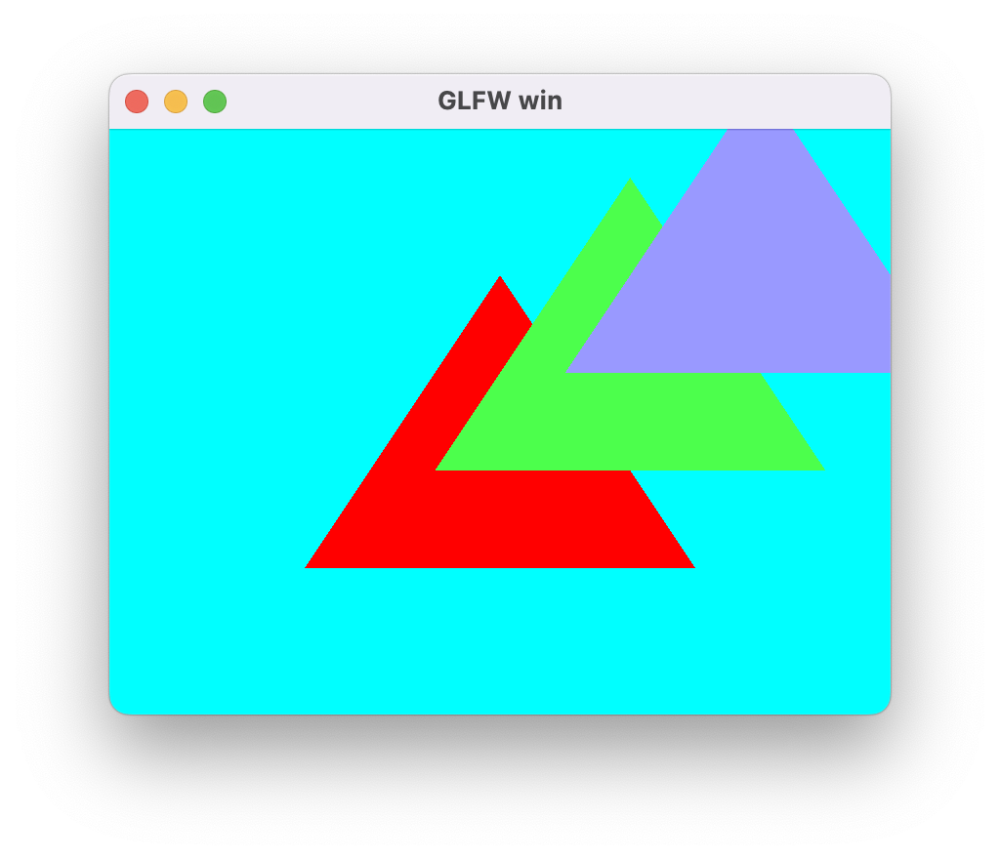

## OBJ 模型格式

抛开obj模型数据的加载和解析，对于渲染层来说，渲染模型与渲染三角形的区别仅在于VertexBuffer和IndexBuffer的来源不同。（当然，我们需要设置好深度测试等渲染参数）

同样的，obj模型使用流程如下：

  1. 加载obj模型原始数据到MemBuffer
  2. 使用ObjLoader解析模型数据，得到解析后的VertexMemBuffer和IndexMemBuffer
  3. 将MemBuffer带入通用流程进行渲染。

OBJ模型格式是一个用字符串来存放顶点数据的格式，直接使用普通文本编辑器打开OBJ文件就能看到数据信息。典型的如v、vt、vn、f等数据类型。简易的OBJ解析库为[ObjLoader](https://github.com/Bly7/OBJ-Loader)，其是C++实现，逻辑并不复杂，我按照其格式用C语言写了一版简化的实现，不到700行，具体实现见[这里](https://github.com/zhyingkun/lua-5.3.5/tree/master/cmod/bcfx/wrap/mesh)。

渲染模型的Demo：

```lua
local viewID = 0
local triangle = {}

local function setup(win)
    glfw.setKeyCallback(win, function(win, key, scancode, action, mods)
        if key == glfw.keyboard.ESCAPE and action == glfw.input_state.PRESS then
            glfw.setWindowShouldClose(win, true)
        end
    end)

    glfw.setFramebufferSizeCallback(win, function(window, width, height)
        bcfx.setViewRect(viewID, 0, 0, width, height)
    end)

    local width, height = glfw.getFramebufferSize(win)
    bcfx.setViewRect(viewID, 0, 0, width, height)
    bcfx.setViewClear(viewID, bcfx.clear_flag.COLOR|bcfx.clear_flag.DEPTH, bcfx.color.cyan, 1.0, 0)

    local graphics3d = bcfx.math.graphics3d
    local vector = bcfx.math.vector
    local lookAt = graphics3d.lookAt(vector.left * -3, vector.left, vector.forward)
    --local lookAt = graphics3d.lookAt(vector.Vec3(0, 0, 3), vector.zero, vector.Vec3(0, 1, 0))
    bcfx.setViewTransform(viewID, lookAt, graphics3d.perspective(45, 16/9, 0.1))

    local layout = bcfx.VertexLayout()
    layout:add(bcfx.vertex_attrib.Position, 3, bcfx.attrib_type.Float, false)
    layout:add(bcfx.vertex_attrib.Normal, 3, bcfx.attrib_type.Float, false)
    layout:add(bcfx.vertex_attrib.TexCoord0, 2, bcfx.attrib_type.Float, false)

    local layoutHandle = bcfx.createVertexLayout(layout)
    local fileData = require("libuv").mbio.readFile("spot_quadrangulated.obj")
    local meshs = bcfx.mesh.meshParse(fileData)

    triangle.vertexHandle = bcfx.createVertexBuffer(meshs[1].vertex, layoutHandle)
    triangle.indexHandle = bcfx.createIndexBuffer(meshs[1].index, bcfx.index_type.Uint32)

    local fileData = require("libuv").mbio.readFile("spot_texture.png")
    local parseMB, width, height = bcfx.image.imageDecode(fileData, bcfx.texture_format.RGBA8)

    triangle.texture = bcfx.createTexture(parseMB, width, height, bcfx.texture_format.RGBA8)
    triangle.uniform = bcfx.createUniform("my_texture", bcfx.uniform_type.Sampler2D)
    triangle.state = bcfx.utils.packRenderState({
        enableDepth = true,
    })

    local vs = bcfx.createShader([[
#version 410 core

in vec3 a_position;
in vec2 a_texcoord0;
uniform mat4 u_modelViewProj;
out vec2 v_texcoord0;

void main() {
	v_texcoord0 = a_texcoord0;
	gl_Position = u_modelViewProj * vec4(a_position, 1.0);
}
	]], bcfx.shader_type.Vertex)

    local fs = bcfx.createShader([[
#version 410 core

in vec2 v_texcoord0;
uniform sampler2D my_texture;
out vec4 FragColor;

void main() {
	FragColor = texture(my_texture, v_texcoord0);
}
	]], bcfx.shader_type.Fragment)

    triangle.programHandle = bcfx.createProgram(vs, fs)
    triangle.textureFlags = bcfx.utils.packSamplerFlags({
        wrapU = bcfx.texture_wrap.Repeat,
        wrapV = bcfx.texture_wrap.Repeat,
        filterMin = bcfx.texture_filter.Linear,
        filterMag = bcfx.texture_filter.Linear,
    })
end

local function loop()
    bcfx.setVertexBuffer(0, triangle.vertexHandle)
    bcfx.setIndexBuffer(triangle.indexHandle)
    bcfx.setTexture(0, triangle.uniform, triangle.texture, triangle.textureFlags)
    bcfx.setTransform(bcfx.math.graphics3d.rotate(bcfx.frameId() % 360, 
                                                  bcfx.math.vector.Vec3(0.0, 1.0, 0.0)))
    bcfx.setState(triangle.state, bcfx.color.black)
    bcfx.submit(viewID, triangle.programHandle, bcfx.discard.ALL)
end
```

运行效果如下：

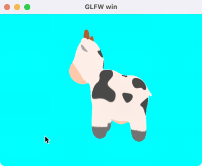

### 帧缓冲与多窗口

当我们创建一个窗口的时候，附带的会创建OpenGL的Context，其中就会包含有一个能上屏的FrameBuffer。OpenGL还提供了glGenFramebuffers等接口来创建独立于窗口的FrameBuffer。基于此理解可提供两个接口，用于设置某个View将渲染到哪个FrameBuffer上：

```c
BCFX_API void bcfx_setViewWindow(ViewId id, Window win);
BCFX_API void bcfx_setViewFrameBuffer(ViewId id, Handle handle);
```

设置某个View渲染到某个窗口的时候，代表的含义便是渲染到该窗口附带的FrameBuffer，因此，这两个API是互斥的。底层实现如下：

```c
void ctx_setViewWindow(Context* ctx, ViewId id, Window win) {
  CHECK_VIEWID(id);
  view_setWindow(&ctx->views[id], win);
  view_setFrameBuffer(&ctx->views[id], kInvalidHandle);
}

void ctx_setViewFrameBuffer(Context* ctx, ViewId id, Handle handle) {
  CHECK_VIEWID(id);
  view_setWindow(&ctx->views[id], NULL);
  view_setFrameBuffer(&ctx->views[id], handle);
}
```

显然，存在多个窗口，对应的就有多个OpenGLContext。幸好大部分渲染资源可以通过ShareContext的方式进行共享（VertexArrayObject在多个OpenGLContext之间不能共享）。多窗口还涉及一个窗口FrameBuffer上屏的问题，每一帧需要针对每个窗口执行一次上屏操作。

OpenGL的CoreProfile模式要求必须使用VAO，且VAO在多个OpenGLContext之间不能共享，因此我们需要维护一个结构，针对每个Window创建其对应的VAO。结构设计如下：

```c
typedef struct {
  Window win;
  GLuint vaoId;
  bool touch;
} WindowSwapper;
```

其中touch变量用于确定当前帧是否还用到该Window，如果已经用不到了，则可以删除该WindowSwapper结构并释放VAO。创建WindowSwapper逻辑如下：

```c
static WindowSwapper* gl_getWindowSwapper(RendererContextGL* glCtx, Window win) {
  for (uint8_t i = 0; i < glCtx->swapCount; i++) {
    if (glCtx->swapWins[i].win == win) {
      return &glCtx->swapWins[i];
    }
  }

  winctx_swapInterval(win == glCtx->mainWin ? 1 : 0);
  assert(glCtx->swapCount < BCFX_CONFIG_MAX_WINDOW);
  WindowSwapper* swapper = &glCtx->swapWins[glCtx->swapCount];
  glCtx->swapCount++;
  swapper->win = win;

  // For OpenGL core profile mode, we must using a VertexArrayObject
  // MacOSX supports forward-compatible core profile contexts for OpenGL 3.2 and above
  GL_CHECK(glGenVertexArrays(1, &swapper->vaoId));
  return swapper;
}

static void gl_MakeWinCurrent(RendererContextGL* glCtx, Window win, GLuint mainWinFb) {
  if (win == NULL) {
    win = glCtx->mainWin;
  }

  if (glCtx->curWin != win) {
    glCtx->curWin = win;
    winctx_makeContextCurrent(win);
    WindowSwapper* swapper = gl_getWindowSwapper(glCtx, win);
    swapper->touch = true;
    GL_CHECK(glBindVertexArray(swapper->vaoId));
    gl_initRenderState(glCtx);
  }

  // only mainWin has non zero fb
  if (glCtx->mainWin == win && glCtx->curMainWinFb != mainWinFb) {
    glCtx->curMainWinFb = mainWinFb;
    GL_CHECK(glBindFramebuffer(GL_FRAMEBUFFER, mainWinFb));
  }
}
```

渲染线程中进行SwapBuffer的flip逻辑则比较清晰：

```c
static void gl_flip(RendererContext* ctx) {
  RendererContextGL* glCtx = (RendererContextGL*)ctx;
  winctx_swapBuffers(glCtx->mainWin);
  for (uint8_t i = 1; i < glCtx->swapCount; i++) {
    winctx_swapBuffers(glCtx->swapWins[i].win);
  }
}
```

支持用户新建的FrameBuffer则稍微复杂一些，因为要同时支持用户创建RenderTexture作为渲染目标。逻辑线程创建RenderTexture和FrameBuffer的API如下：

```c
typedef enum {
 TF_RGB8,
 TF_RGBA8,
 TF_D24S8,
} bcfx_ETextureFormat;

BCFX_API Handle bcfx_createRenderTexture(uint16_t width, uint16_t height, 
                                         bcfx_ETextureFormat format);

BCFX_API Handle bcfx_createFrameBuffer(uint8_t num, Handle* handles);
```

目前支持三种RT格式，RGB8为无需透明度，RGBA8为普通颜色，D24S8为24位深度+8位模板。

`bcfx_createFrameBuffer`的参数则为一系列RenderTexture的handle，根据数组中的顺序，多个颜色RT则自动划分为MultiRenderTarget。

同样，创建RT或者FB在逻辑线程均为保存参数并新增一个Command，留待apiFrame交换数据之后由渲染线程进行真正的资源创建。渲染线程中GL渲染器的实现如下：

```c
static void gl_createTexture(RendererContext* ctx, 
                             Handle handle, 
                             luaL_MemBuffer* mem, 
                             uint16_t width, 
                             uint16_t height, 
                             bcfx_ETextureFormat format) {
  RendererContextGL* glCtx = (RendererContextGL*)ctx;
  TextureGL* texture = &glCtx->textures[handle_index(handle)];
  texture->format = format;

  GL_CHECK(glGenTextures(1, &texture->id));
  GL_CHECK(glBindTexture(GL_TEXTURE_2D, texture->id));
  GL_CHECK(glPixelStorei(GL_UNPACK_ALIGNMENT, 1));

  const TextureFormatInfo* fi = &textureFormat_glType[format];
  GL_CHECK(glTexImage2D(GL_TEXTURE_2D, 0, 
                        fi->internalFormat, 
                        width, 
                        height, 
                        0, 
                        fi->format, 
                        fi->type, mem->ptr));

  GL_CHECK(glBindTexture(GL_TEXTURE_2D, 0));
  MEMBUFFER_RELEASE(mem);
}

static void gl_createFrameBuffer(RendererContext* ctx, 
                                 Handle handle, 
                                 uint8_t num, 
                                 Handle* handles) {
  RendererContextGL* glCtx = (RendererContextGL*)ctx;
  FrameBufferGL* fb = &glCtx->frameBuffers[handle_index(handle)];

  GL_CHECK(glGenFramebuffers(1, &fb->id));
  GL_CHECK(glBindFramebuffer(GL_FRAMEBUFFER, fb->id));

  GLenum buffers[BCFX_CONFIG_MAX_FRAME_BUFFER_ATTACHMENTS];
  uint8_t colorIdx = 0;
  for (uint8_t i = 0; i < num; i++) {
    TextureGL* texture = &glCtx->textures[handle_index(handles[i])];
    GLenum attachment;
    if (texture->format == TF_D24S8) {
      attachment = GL_DEPTH_STENCIL_ATTACHMENT;
    } else {
      attachment = GL_COLOR_ATTACHMENT0 + colorIdx;
      buffers[colorIdx] = attachment;
      colorIdx++;
    }

    GL_CHECK(glFramebufferTexture2D(GL_FRAMEBUFFER, 
                                    attachment, 
                                    GL_TEXTURE_2D, 
                                    texture->id, 0));
  }

  if (colorIdx == 0) {
    GL_CHECK(glDrawBuffer(GL_NONE));
    GL_CHECK(glReadBuffer(GL_NONE));
  } else {
    GL_CHECK(glDrawBuffers(colorIdx, buffers));
    GL_CHECK(glReadBuffer(GL_COLOR_ATTACHMENT0));
  }

  GLenum complete;
  GL_CHECK(complete = glCheckFramebufferStatus(GL_FRAMEBUFFER));
  if (complete != GL_FRAMEBUFFER_COMPLETE) {
    printf_err("Check framebuffer state error: %d, %s\n", complete,
                    err_EnumName(complete));
  }

  GL_CHECK(glBindFramebuffer(GL_FRAMEBUFFER, 0));
}
```

有了RT和FrameBuffer，我们就可以实现将Mesh渲染到RT，再通过Uniform引用该RT进行二次渲染上屏。注意，渲染到FrameBuffer需要深度的话，得手动添加深度RT。Demo如下：

```lua
local viewIDClear = 0
local viewIDFB = 1
local viewID1 = 2
local viewID2 = 3
local triangle = {}
local blit = {}

local function setup(win)
    glfw.setKeyCallback(win, function(win, key, scancode, action, mods)
        if key == glfw.keyboard.ESCAPE and action == glfw.input_state.PRESS then
            glfw.setWindowShouldClose(win, true)
        end
    end)

    glfw.setFramebufferSizeCallback(win, function(window, width, height)
        bcfx.setViewRect(viewIDClear, 0, 0, width, height)
        bcfx.setViewRect(viewID1, 20, 20, width // 3, height // 3)
        bcfx.setViewRect(viewID2, 260, 260, width // 4, height // 4)
    end)

    local width, height = glfw.getFramebufferSize(win)
    bcfx.setViewRect(viewIDClear, 0, 0, width, height)
    bcfx.setViewClear(viewIDClear, bcfx.clear_flag.COLOR, bcfx.color.indigo, 1.0, 0)

    blit.texture = bcfx.createRenderTexture(width, height, bcfx.texture_format.RGBA8)

    local fb = bcfx.createFrameBuffer(blit.texture)
    bcfx.setViewFrameBuffer(viewIDFB, fb)
    bcfx.setViewRect(viewIDFB, 0, 0, width, height)
    bcfx.setViewClear(viewIDFB, bcfx.clear_flag.COLOR, bcfx.color.cyan, 1.0, 0)

    bcfx.setViewRect(viewID1, 20, 20, width // 3, height // 3)
    bcfx.setViewClear(viewID1, bcfx.clear_flag.COLOR, bcfx.color.black, 1.0, 0)

    bcfx.setViewRect(viewID2, 260, 260, width // 4, height // 4)
    bcfx.setViewClear(viewID2, bcfx.clear_flag.COLOR, bcfx.color.black, 1.0, 0)

    local layout = bcfx.VertexLayout()
    layout:add(bcfx.vertex_attrib.Position, 3, bcfx.attrib_type.Float, false)

    local vertexData = bcfx.makeMemBuffer(bcfx.data_type.Float, {
        -0.5, -0.5,  0.0,
        0.5, -0.5,  0.0,
        0.0,  0.5,  0.0,
    })

    local layoutHandle = bcfx.createVertexLayout(layout)
    triangle.vertexHandle = bcfx.createVertexBuffer(vertexData, layoutHandle)

    local vs = bcfx.createShader([[
#version 410 core
in vec3 a_position;
void main() {
	gl_Position = vec4(a_position, 1.0);
}
	]], bcfx.shader_type.Vertex)

    local fs = bcfx.createShader([[
#version 410 core
out vec4 FragColor;
void main() {
	FragColor = vec4(0.8, 0.3, 0.3, 1.0);
}
	]], bcfx.shader_type.Fragment)
    triangle.programHandle = bcfx.createProgram(vs, fs)

    local layout = bcfx.VertexLayout()
    layout:add(bcfx.vertex_attrib.Position, 2, bcfx.attrib_type.Float, false)
    layout:add(bcfx.vertex_attrib.TexCoord0, 2, bcfx.attrib_type.Float, false)
    local layoutHandle = bcfx.createVertexLayout(layout)

    local vertexTbl = {
        -1.0, -1.0, 0.0, 0.0,
        1.0, -1.0, 1.0, 0.0,
        1.0, 1.0, 1.0, 1.0,
        -1.0, -1.0, 0.0, 0.0,
        1.0, 1.0, 1.0, 1.0,
        -1.0, 1.0, 0.0, 1.0,
    }

    local mem = bcfx.makeMemBuffer(bcfx.data_type.Float, vertexTbl)
    blit.vertex = bcfx.createVertexBuffer(mem, layoutHandle)
    blit.uniform = bcfx.createUniform("blit_texture", bcfx.uniform_type.Sampler2D)

    local vs = bcfx.createShader([[
#version 410 core
in vec2 a_position;
in vec2 a_texcoord0;
out vec2 v_texcoord0;
void main() {
	v_texcoord0 = a_texcoord0;
	gl_Position = vec4(a_position, 0.0, 1.0);
}
	]], bcfx.shader_type.Vertex)

    local fs = bcfx.createShader([[
#version 410 core
in vec2 v_texcoord0;
out vec4 FragColor;
uniform sampler2D blit_texture;
void main() {
	FragColor = texture(blit_texture, v_texcoord0);
}
	]], bcfx.shader_type.Fragment)
    blit.shader = bcfx.createProgram(vs, fs)

    blit.textureFlags = bcfx.utils.packSamplerFlags({
        wrapU = bcfx.texture_wrap.Repeat,
        wrapV = bcfx.texture_wrap.Repeat,
        filterMin = bcfx.texture_filter.Linear,
        filterMag = bcfx.texture_filter.Linear,
    })
end

local function loop()
    bcfx.touch(viewIDClear)

    bcfx.setVertexBuffer(0, triangle.vertexHandle)
    bcfx.submit(viewIDFB, triangle.programHandle)

    bcfx.setVertexBuffer(0, blit.vertex)
    bcfx.setTexture(0, blit.uniform, blit.texture, blit.textureFlags)
    bcfx.submit(viewID1, blit.shader)

    bcfx.setVertexBuffer(0, blit.vertex)
    bcfx.setTexture(0, blit.uniform, blit.texture, blit.textureFlags)
    bcfx.submit(viewID2, blit.shader)
end
```

运行效果如下：

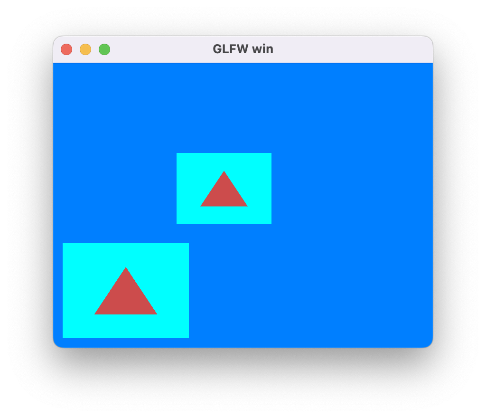

## 截图

OpenGL提供了glReadPixels接口用于实现将GPU中FrameBuffer的数据回读到CPU中，接口如下：

```c
void glReadPixels(GLint x, 
                  GLint y, 
                  GLsizei width, 
                  GLsizei height, 
                  GLenum format, 
                  GLenum type, 
                  void* data);
```

我们可以使用这个接口来捕获某个View在某一帧的渲染内容，也就是在View层次的截图功能。

截图请求由逻辑线程中发起去捕获当前帧的某个View，实际ReadPixels操作是在渲染线程中该View渲染完毕之后才进行的。显然这是一个异步操作，我们通过让用户设置回调函数来接收截图信息。

另外，最好是在逻辑线程进行回调，而不是渲染线程直接回调，避免各种线程数据问题，所以这里设计为渲染线程Capture完毕之后，将数据存放于Frame中，后续逻辑线程进行apiFrame交换数据之后，检查到有Capture数据再进行回调操作。（保证回调函数只会在逻辑线程进行调用避免了多线程回调导致的数据同步问题）

具体Capture逻辑如下：

```c
static void frameCaptureView(Frame* frame, ViewId id) {
  if (IS_VIEWID_VALID(id) && shouldCaptureView(frame, id)) {
    View* view = &frame->views[id];
    Rect* rect = &view->rect;
    size_t sz = rect->width * rect->height * 4;
    void* data = mem_malloc(sz);

    GL_CHECK(glFlush());
    GL_CHECK(glReadPixels(rect->x, 
                          rect->y, 
                          rect->width, 
                          rect->height, 
                          GL_RGBA, 
                          GL_UNSIGNED_BYTE, 
                          data));

    bcfx_FrameViewCaptureResult* result = &frame->viewCaptureResults[frame->numVCR++];
    result->id = id;
    result->width = rect->width;
    result->height = rect->height;
    
    MEMBUFFER_SET(&result->mb, data, sz, _releaseFrameCapture, NULL);
  }
}
```

apiFrame流程中，进行截图回调的逻辑如下：

```c
void ctx_callOnFrameViewCapture(Context* ctx, Frame* frame, uint32_t frameId) {
  for (uint8_t i = 0; i < frame->numVCR; i++) {
    bcfx_FrameViewCaptureResult* result = &frame->viewCaptureResults[i];
    if (ctx->onFrameViewCapture) {
      ctx->onFrameViewCapture(ctx->onFrameViewCaptureArg, frameId, result);
    }
    MEMBUFFER_RELEASE(&result->mb);
  }
  frame->numVCR = 0;
}
```

使用截图的Demo：

```lua
local viewID = 0
local triangle = {}

local function setup(win)
    glfw.setKeyCallback(win, function(win, key, scancode, action, mods)
        if key == glfw.keyboard.ESCAPE and action == glfw.input_state.PRESS then
            glfw.setWindowShouldClose(win, true)
        end
    end)

    glfw.setFramebufferSizeCallback(win, function(window, width, height)
        bcfx.setViewRect(viewID, 0, 0, width, height)
    end)

    bcfx.setViewRect(viewID, 0, 0, glfw.getFramebufferSize(win))
    bcfx.setViewClear(viewID, bcfx.clear_flag.COLOR, bcfx.color.cyan, 1.0, 0)

    local layout = bcfx.VertexLayout()
    layout:add(bcfx.vertex_attrib.Position, 3, bcfx.attrib_type.Float, false)

    local vertexData = bcfx.makeMemBuffer(bcfx.data_type.Float, {
        -0.5, -0.5, 0.0,
        0.5, -0.5, 0.0,
        0.0, 0.5, 0.0,
    })

    local layoutHandle = bcfx.createVertexLayout(layout)
    triangle.vertexHandle = bcfx.createVertexBuffer(vertexData, layoutHandle)

    local vs = bcfx.createShader([[
#version 410 core
in vec3 a_position;
out vec3 v_color0;
void main() {
	gl_Position = vec4(a_position, 1.0);
}
]], bcfx.shader_type.Vertex)

    local fs = bcfx.createShader([[
#version 410 core
out vec4 FragColor;
void main() {
	FragColor = vec4(0.8, 0.3, 0.3, 1.0);
}
]], bcfx.shader_type.Fragment)

    triangle.programHandle = bcfx.createProgram(vs, fs)

    bcfx.setFrameViewCaptureCallback(function(frameId, id, width, height, mb)
        local fileName = tostring(frameId) .. "_" .. tostring(id) .. "_Capture.png"
        local mb = bcfx.image.imageEncode(mb, width, height, 4, bcfx.image.image_type.PNG, width * 4)
        require("libuv").mbio.writeFile(fileName, mb)
        print("Already save png")
    end)
end

local function loop()
    bcfx.setVertexBuffer(0, triangle.vertexHandle)
    bcfx.submit(viewID, triangle.programHandle)

    if bcfx.frameId() == 99 then
        bcfx.requestCurrentFrameViewCapture(viewID)
    end
end
```

截图结果如下：

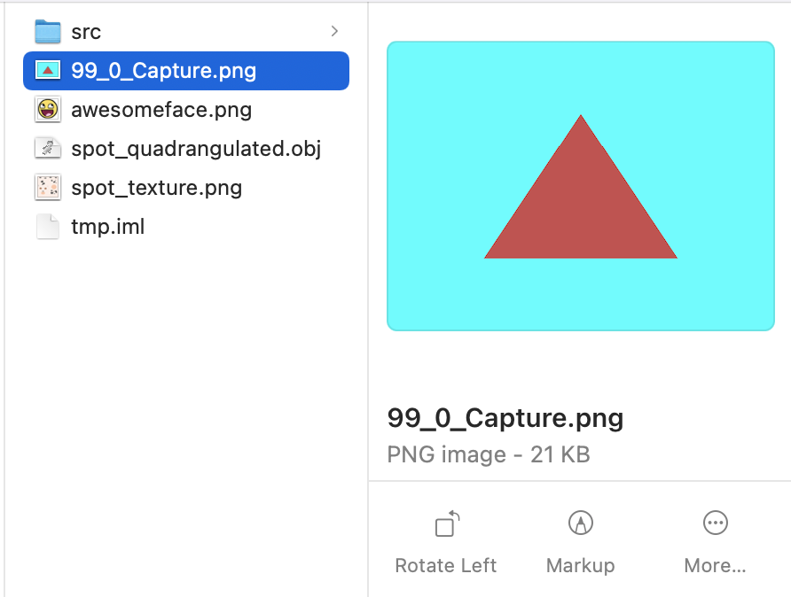

## ImGUI

渲染库负责做渲染，自然也能支持ImGUI的渲染。ImGUI的实现这里采用了[Nuklear](https://github.com/Immediate-Mode-UI/Nuklear)，将Nuklear也注入Lua之后，就可以使用Lua代码来写GUI。

支持ImGUI的运行流程：

  1. 创建ImGUI相关上下文
  2. 调用ImGUI的API，勾画出UI内容
  3. 使用ImGUI的Convert接口，将UI内容转换成VertexBuffer、IndexBuffer、Texture等渲染内容
  4. ViewID为255的View专门用于GUI，将正交矩阵等参数设置给该View
  5. 使用专门的Shader和RenderState来提交GUI的DrawCall

实际开发中遇到了关于纹理坐标转换的问题：Nuklear 的 Image 是以左上角为原点，向下为 Y 正，与 OpenGL 的 UV 方向刚好是 Y 轴相反，因此，需要将所有给到 Nuklear 的 Image 都做 VerticalFlip（主要是读取的 Image 和字体图片），并在渲染 Nuklear 的 Shader 中将 uv 的 v 轴对 1.0 取补（这么做的目的是为了兼容用 RenderTexture 渲染到 UI）

Lua中编写IMGUI的Demo：

```lua
local imgui = {}

function imgui:setup(mainWin)
    self.mainWin = mainWin
    self.atlas = nk.font.Atlas()
    self.atlas:begin()

    local cfg = nk.font.Config()
    self.myFont = self.atlas:addDefault(22, cfg)

    local image, release, ud, width, height = self.atlas:bake(1)
    local mb = util.MemBuffer(image, width * height * 4, release, ud)
    mb = bcfx.image.imageFlipVertical(mb, width, height)

    self.imageHandle = bcfx.createTexture(mb, width, height, bcfx.texture_format.RGBA8)
    self.nullTex = self.atlas:endAtlas(self.imageHandle)

    local ctx = nk.Context(self.myFont)
    nk.setContext(ctx)

    self.cmds = nk.Buffer()
    local vsize = 4 * 1024 * 1024
    local esize = 4 * 1024 * 1024

    local layout = bcfx.VertexLayout()
    layout:add(bcfx.vertex_attrib.Position, 2, bcfx.attrib_type.Float, false)
    layout:add(bcfx.vertex_attrib.TexCoord0, 2, bcfx.attrib_type.Float, false)
    layout:add(bcfx.vertex_attrib.Color0, 4, bcfx.attrib_type.Uint8, true)

    local layoutHandle = bcfx.createVertexLayout(layout)
    self.vertexHandle = bcfx.createDynamicVertexBuffer(vsize, layoutHandle)
    self.indexHandle = bcfx.createDynamicIndexBuffer(esize, bcfx.index_type.Uint16)
    self.vertexMemBuffer = util.MemBuffer()
    self.indexMemBuffer = util.MemBuffer()

    self.uniformTex = bcfx.createUniform("Texture", 0)

    local vs = bcfx.createShader([[
#version 410 core
in vec2 a_position;
in vec2 a_texcoord0;
in vec4 a_color0;
uniform mat4 u_proj;
out vec2 v_texcoord0;
out vec4 v_color0;
void main() {
    v_texcoord0 = a_texcoord0;
    v_color0 = a_color0;
    gl_Position = u_proj * vec4(a_position.xy, 0, 1);
}
	]], bcfx.shader_type.Vertex)

    local fs = bcfx.createShader([[
#version 410 core
uniform sampler2D Texture;
in vec2 v_texcoord0;
in vec4 v_color0;
out vec4 FragColor;
void main(){
    vec2 uv = vec2(v_texcoord0.s, 1.0 - v_texcoord0.t);
    FragColor = v_color0 * texture(Texture, uv);
}
	]], bcfx.shader_type.Fragment)

    self.shader = bcfx.createProgram(vs, fs)

    local w, h = glfw.getWindowSize(mainWin)

    local projMat = bcfx.math.graphics3d.orthogonal(
            -w/2, w/2,-- left, right
            -h/2, h/2,-- bottom, top
            -1.0, 1.0-- zNear, zFar
    )

    local transMat = bcfx.math.graphics3d.translate(
            bcfx.math.vector.Vec3(-1.0, 1.0, 0.0)
    )

    local scaleMat = bcfx.math.graphics3d.scale(
            bcfx.math.vector.Vec3(1.0, -1.0, 0.0)
    )

    -- transMat and scaleMat for convert window coordinate to OpenGL ClipSpace
    self.projMat = transMat * scaleMat * projMat

    self.state = bcfx.utils.packRenderState({
        enableCull = false,
        enableDepth = false,
        enableBlend = true,
        blendEquRGB = bcfx.blend_equation.FuncAdd,
        blendEquA = bcfx.blend_equation.FuncAdd,
        srcRGB = bcfx.blend_func.SrcAlpha,
        srcAlpha = bcfx.blend_func.SrcAlpha,
        dstRGB = bcfx.blend_func.OneMinusSrcAlpha,
        dstAlpha = bcfx.blend_func.OneMinusSrcAlpha,
    })

    self.vbuf1 = nk.Buffer(vsize)
    self.ebuf1 = nk.Buffer(esize)
    self.vbuf2 = nk.Buffer(vsize)
    self.ebuf2 = nk.Buffer(esize)

    local libuv = require("libuv")
    local mb = libuv.mbio.readFile("awesomeface.png")
    local data, w, h = bcfx.image.imageDecode(mb, bcfx.image.image_type.PNG)
    self.textureHandle = bcfx.createTexture(data, w, h, bcfx.texture_format.RGB8)

    self.texture = nk.Image(self.textureHandle)

    self.textureFlags = bcfx.utils.packSamplerFlags({
        wrapU = bcfx.texture_wrap.Repeat,
        wrapV = bcfx.texture_wrap.Repeat,
        filterMin = bcfx.texture_filter.Linear,
        filterMag = bcfx.texture_filter.Linear,
    })
end

function imgui:loop()
    nk.styleSetFont(self.myFont)

    ---[[
    if nk.begin("Basic Demo", nk.packRect(20, 20, 200, 130),
            nk.panel_flag.BORDER | nk.panel_flag.MOVABLE | nk.panel_flag.TITLE |
                    nk.panel_flag.SCALABLE | nk.panel_flag.CLOSABLE | nk.panel_flag.MINIMIZABLE)
    then
        nk.layoutRowDynamic(20, 1)
        nk.textWidget("1234567890", nk.text_alignment.RIGHT)
        nk.layoutRowStatic(50, 50, 2)
        if nk.buttonText("AAA") then
            print("OnButtonClicked")
        end
        if nk.buttonImage(self.texture) then
            print("OnImageButtonClicked")
        end
    end

    nk.endWindow()

    local vbuf, ebuf
    if bcfx.frameId() % 2 == 0 then
        vbuf = self.vbuf1
        ebuf = self.ebuf1
    else
        vbuf = self.vbuf2
        ebuf = self.ebuf2
    end

    vbuf:clear()
    ebuf:clear()

    nk.convert(self.cmds, vbuf, ebuf, self.nullTex)

    self.vertexMemBuffer:setReplace(vbuf:frontBufferPtr(), vbuf:frontBufferAllocated()) --
    self.indexMemBuffer:setReplace(ebuf:frontBufferPtr(), ebuf:frontBufferAllocated()) --
    bcfx.updateDynamicVertexBuffer(self.vertexHandle, 0, self.vertexMemBuffer)
    bcfx.updateDynamicIndexBuffer(self.indexHandle, 0, self.indexMemBuffer)

    bcfx.setVertexBuffer(0, self.vertexHandle)
    bcfx.setState(self.state, bcfx.color.black)
    bcfx.setViewTransform(255, nil, self.projMat)
    local pixelWidth, pixelHeight = glfw.getFramebufferSize(self.mainWin)
    bcfx.setViewRect(255, 0, 0, pixelWidth, pixelHeight)

    local screenWidth, screenHeight = glfw.getWindowSize(self.mainWin)
    nk.drawForEach(self.cmds, screenWidth, screenHeight, pixelWidth, pixelHeight, 
                   function(offset, count, texture, x, y, w, h)
        bcfx.setIndexBuffer(self.indexHandle, offset, count)
        bcfx.setTexture(0, self.uniformTex, texture, self.textureFlags)
        bcfx.setScissor(x, y, w, h) -- in pixel coordinate
        bcfx.submit(255, self.shader, bcfx.discard.INDEX_BUFFER | bcfx.discard.BINDINGS)
    end)

    nk.clear()
    self.cmds:clear()
end
```

运行效果如下：

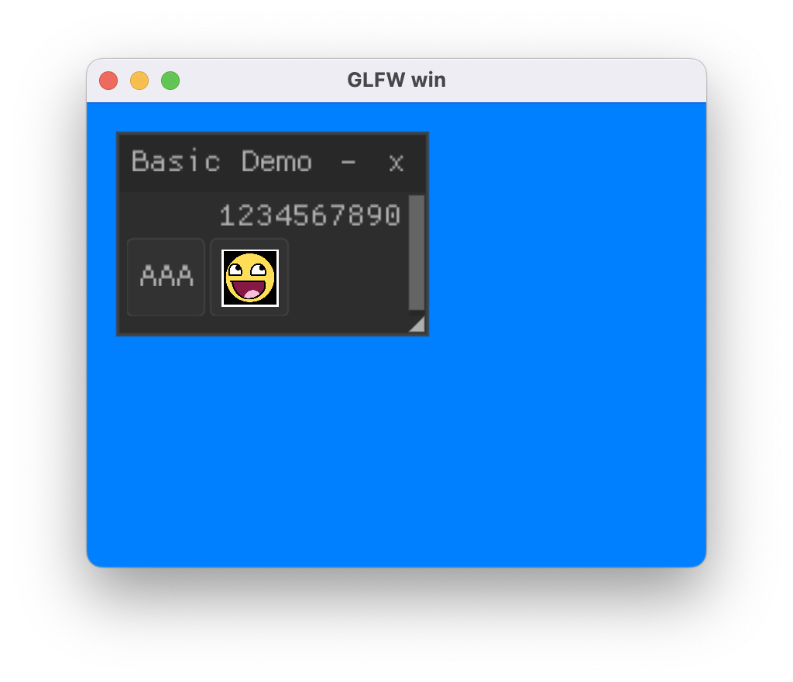

## 总结与展望

与渲染库相关的话题实在是太庞大了，业余时间有限、个人能力有限，无法做到面面俱到，但这并不妨碍我们研究实现目前所感兴趣的部分。本文仅讲述了关于渲染库最基本的功能实现，还有更多有意思的话题有待研究：

  1. 延迟渲染流程
  2. ShadowMap
  3. 各种光照和效果
  4. PostProcess
  5. ...

