 
<!--BEGIN_DATA
{
    "create_date": "2023-06-09 22:20", 
    "modify_date": "2023-06-09 22:20", 
    "is_top": "0", 
    "summary": "OpenGL管线(用经典管线代说着色器内部)", 
    "tags": "OpenGL", 
    "file_name": "OpenGL管线(用经典管线代说着色器内部).md"
}
END_DATA-->

#### <p>原文出处：<a href='https://www.cnblogs.com/liangliangh/p/4116164.html' target='blank'>OpenGL管线(用经典管线代说着色器内部)</a></p>

> 图形管线（graphics pipeline）向来以复杂为特点，这归结为图形任务的复杂性和挑战性。OpenGL作为图形硬件标准，是最通用的图形管线版本。本文用**自顶向下**的思路来简单总结**OpenGL图形管线**，即**从最高层开始**，然后**逐步细化到管线图中的每个框**，再**进一步细化到OpenGL具体函数**。注意，这里用**经典管线代说着色器内部**，也就是OpenGL固定管线功能（Fixed-Function，相对于programmable也即可编程着色器），也会涉及着色器，但差不多仅限于“这些固定管线功能对应xx着色器”。以后有机会会单独说着色器。

有人可能会说，固定管线功能在很多年前就过时啦，而且在最新的OpenGL标准里都不支持了，不是兼容支持，而是彻底删除了。我是这么认为的，首先，虽然OpenGL最新标准（4.0或更高）明确删除了固定管线功能，但显卡厂商还在提供固定管线的驱动程序支持，因为还有很多人在用这些固定管线功能；其次，OpenGL本身仅是一个工具，在这个工具上设计巧妙的算法，或者实现需要的效果才是重点，如果用固定管线就能实现这些，也就不必要用着色器，因为即使用着色器也可能只是在实现固定管线功能而已；再次，对于学习着色器来说，了解固定管线是一个很好的案例学习，我想好多学习着色器的人都是这么开始的吧：用顶点着色器实现固定管线的变换功能，固定管线作为最通用功能的实现，必然经过了顶尖工程师的精心设计，很值得参考。

## 0.文献综述

鉴于OpenGL从标准4.0开始彻底删除了固定管线部分，本文主要参考了OpenGL 3.x的最高版本：“OpenGL 3.3 Specification (Compatibility rofile) - March 11, 2010”，对照3系列里最高版本的快速参考卡：“OpenGL 3.2 API Quick Reference Card”，请见参考文献[1][2]。也少量参考了最新标准OpenGL 4.5，参见文献[3][4]。

文献[5][6]是世界顶尖大学的图形学课程，都提供PPT下载。文献[7]红宝书其实不推荐看，因为它充斥着编程细节，对于编程参考可以，用来了解OpenGL管线有些难。

用Google图片搜索“OpenGL Pipeline”，搜到了好多很好的图，追踪到图片原网站，又发现了好多资源。文献[8] Lighthou3D 网站的教程不错，其中的 [GLSL Core Tutorial](http://www.lighthouse3d.com/tutorials/glsl-core-tutorial/) 和 [GLSL 1.2 Tutorial](http://www.lighthouse3d.com/tutorials/glsl-tutorial/)讲了图形管线。文献[9]，《OpenGL Insights》，就冲着那些[管线图](http://openglinsights.com/pipeline.html)想必也很值得看。

文献[10][11]是CUDA的参考文献，本文用CUDA作为例子来说GPU的大致编程模型。

最后别忘了OpenGL官方Wiki的[OpenGL Pipeline](https://www.opengl.org/wiki/Rendering_Pipeline_Overview)，文献[12]。

## 1.图形硬件系统

大家都知道程序的主函数都在CPU上执行，图形的渲染在GPU上执行，GPU亦可进行通用编程，但这样的程序也需要在CPU上执行代码来操控GPU。现代计算机的硬件结构如下图（摘自文献[6]）：


这个图稍微有点过时（不过和我现在用的台式机基本吻合，哈哈），将各个数据传输带宽值增加一倍基本就是目前最好PC的水平，不要惊讶于显存的带宽竟然是内存的5倍以上，因为显存的位宽要大，而且显存直接焊接在显卡上不像内存条有插槽，所以频率也可以高一些，但显存的延时一般不如内存低。PCIe的带宽大约是内存速度的三分之一。这个层次上性能优化的主要思路是：减少程序对PCI传输带宽的占用，增加主程序（CPU）以及着色器（GPU）访问存储器的局部性（增加缓存命中率或更多使用寄存器）。提醒一点，GDDR5对应CPU内存的DDR3，GDDR3对应CPU内存的DDR2。

着色器程序在GPU上执行，OpenGL主程序在CPU上执行，主程序（CPU）向显存输入顶点等数据，启动渲染过程，并对渲染过程进行控制。了解到这一点就可以了解显示列表（Display Lists）以及像 glFinish() 这种函数存在的原因了，前者（显示列表）将一组绘制指令放到GPU上，CPU只要发一条“执行这个显示列表”这些指令就执行，而不必CPU每次渲染都发送大量指令到GPU，从而节约PCI带宽（因为PCI总线比显存慢）；后者（glFinish）让CPU等待GPU将已发送的渲染指令执行完。

下面来看GPU硬件给OpenGL提供了怎样的执行模型，这里**采用Nvidia的术语**，不过OpenCL的术语和Nvidia的术语有很好对应关系，都差不多。GPU提供大规模并行机制，特别适合于执行高度并行的渲染过程，这个“并行”的概念可能要超出我们平常在CPU上开的几十个线程，GPU的线程数可以达到上百万个或更多（每个线程可以对应于每个顶点、图元、片断的处理过程）。如何运行如此多的线程呢，请看下图CUDA**程序执行模型**（摘自[这里](http://eric_rollins.home.mindspring.com/ray/cuda.html)，和文献[10][PTX ISA](http://docs.nvidia.com/cuda/parallel-thread-execution/index.html)）：

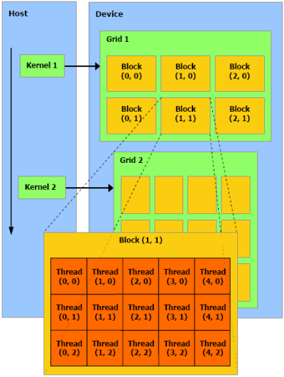

Host和Device分别表示CPU和GPU的编程视图，基本思路是将**线程按两个层次分组**，多个线程（Thread）组成Block（最多三维索引，目前最新硬件限制Block中线程总数不多于1024个），多个Block组成Grid（最多三维索引，目前限制x维度最多231-1个，yz维度216-1个），再来看看Grid的详细情况，即**存储模型**（摘自[这里](http://www.evl.uic.edu/aej/525/lecture04.html)，和文献[10]PTX ISA）：

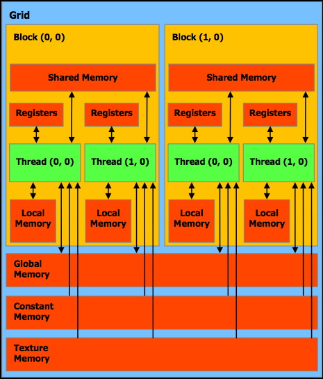

关键点是**Block内提供了共享存储**（Shared Memory），为什么说这点关键呢，因为多个线程要相互通信，共享存储模型是最方便快速的通信方法，但对众多的线程全都提供共享存储模型会影响效率（并发访问存储器，线程有上百万个之多），CUDA（OpenCL也是类似的）采用一种折衷方式：提供有限的共享存储编程，Block内提供高速共享存储，而Block间的通过全局存储（显存）的通信要慢的多。

这种编程模型和**GPU硬件模型**是相对应的，来看（摘自[这里](http://eric_rollins.home.mindspring.com/ray/cuda.html)，和文献[10]PTX ISA）：

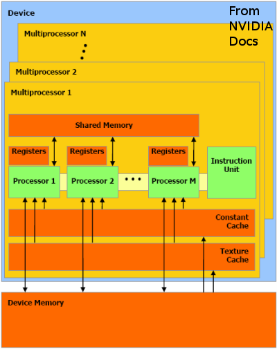

GPU主要由显存（Device Memory）和SMs（流多处理器，Stream Multiprocessors）组成，目前最新的显卡（Compute Capability 5.x），一个SM由128个CUDA核心（Processor）组成，显卡的好坏基本就取决于有多少个SM了（小米平板有1个SM，Compute Capability 3.x，那时一个SM有192个CUDA核心）。

上述**编程模型和GPU模型有对应关系**：Block总是在一个SM上执行，Block内部的共享存储模型由SM硬件的共享存储器提供。线程层次上性能优化的主要思路是：尽量使 Kernel 代码（每个线程，尤其是同一个 Block 内的线程）具有相同的执行路径（即分支跳转情况尽量相同），以充分利用GPU访存及代码执行方面的并行机制。

觉得各种模型有点虚，那来看CUDA程序（截图自文献[10]）：

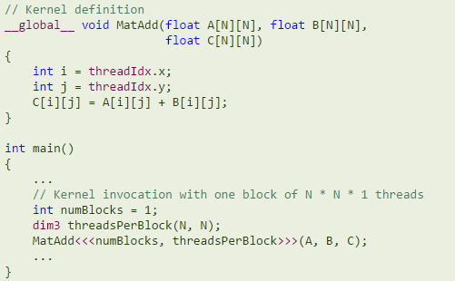

程序中的 numBlocks 和 thredsPerBloack 即，Grid中有多少Block 和 一个Block中有多少线程，numBlocks和thredsPerBloack最多可以由三个数xyz构成，表示三个维度的长度，可以看到因为一个线程可能要被执行上百万次，但线程绝不可能做重复工作，它们根据自己的ID处理数据的不同部分。

回到OpenGL，OpenGL也定义的自己的执行模型（用 Compute Shader 进行通用计算），和CUDA执行模型非常类似（摘自文献[4]，该图被稍作调整）：

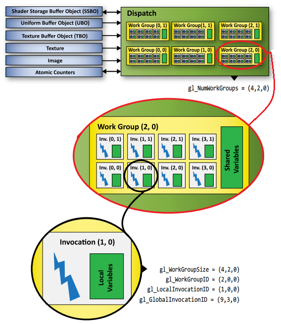

在OpenGL概念中，CUDA的Grid变成了Dispatch，Block变成了Work Group，Thread变成了Invocation，同样，Dispatch可以由三维索引的Work Group组成，Work Group可以由三维索引的Invocation组成。

在说OpenGL具体管线之前，先说一下**OpenGL Context**（上下文）。在调用任何OpenGL函数之前，必须已经创建了GL Context，GL Context存储了OpenGL的状态变量以及其他渲染有关的信息。我们都知道OpenGL是个状态机，有很多状态变量，是个标准的过程式操作过程，改变状态会影响后续所有操作，这和面向对象的解耦原则不符，毕竟渲染本身就是个复杂的过程。OpenGL采用**Client-Server模型**来解释OpenGL程序，即Server存储GL Context（可能不止一个），Client提出渲染请求，Server给予响应，一般Server和Client都在我们的PC上，但Server和Client也可以是通过网络连接（即将上面说的PCIe总线换成了网络）。参见文献[1] 2.1 OpenGL Fundamentals。

创建GL Context一般和创建窗口一起进行，窗口有与之相联系的**Default Frame Buffer**（区别于Framebuffer Objects，前者由外界创建OpenGL随后操作并只有一个，是GL Context的一部分，后者由OpenGL创建可以多个），OpenGL通过Default Frame Buffer将渲染内容显示在屏幕上。我们平常用GLFW或者GLUT创建窗口一般就已经创建了GL Context，GLFW创建GL Context并进入渲染循环的代码如下（摘自[这里](http://www.glfw.org/documentation.html)）：

```c
GLFWwindow* window;
/* Initialize the library */
if (!glfwInit()) return -1;

/* Create a windowed mode window and its OpenGL context */
window = glfwCreateWindow(640, 480, "Hello World", NULL, NULL);
if (!window){
    glfwTerminate();
    return -1;
}

/* Make the window's context current */
glfwMakeContextCurrent(window);
/* Loop until the user closes the window */
while (!glfwWindowShouldClose(window))
{
    /* Render here */

    /* Swap front and back buffers */
    glfwSwapBuffers(window);
    /* Poll for and process events */
    glfwPollEvents();
}
```

这里的**双缓冲**是一种常用的防止画面撕裂的技术，即调用OpenGL函数进行渲染的结果都写入“back” buffer，待所有渲染完成调用SwapBuffers函数，切换“back” buffer和“front” buffer，并将“front” buffer内容显示在屏幕上，有个细节，显示器刷新频率一般为60或120Hz，SwapBuffers调用时刻可能不是显示器的刷新时刻，这时SwapBuffers将会等待直到显示器刷新才返回（当然，肯定存在避免等待的技术）。

## 2.管线概览

下图截图自文献[4]，OpenGL 4.5 API Reference Card 的 OpenGL Pipeline（调整了文字位置）：

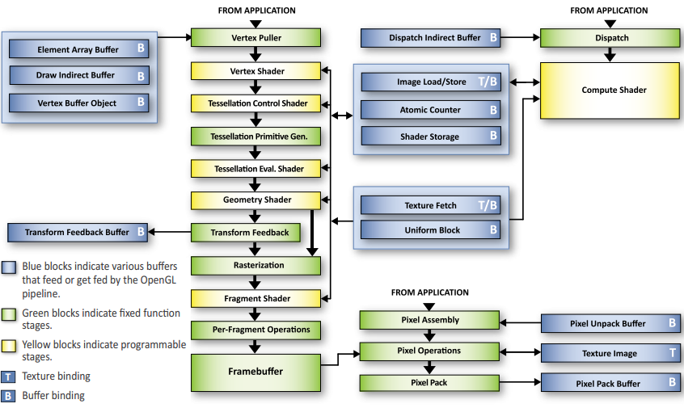

忽略一些高大上的新着色器只考虑顶点、几何、片断着色器，管线总结为：顶点数据（Vertices） > 顶点着色器（Vertex Shader） > 图元装配（Assembly） > 几何着色器（Geometry Shader） > 光栅化（Rasterization） > 片断着色器（Fragment Shader） > 逐片断处理（Per-Fragment Operations） > 帧缓冲（FrameBuffer）。再经过双缓冲的交换（SwapBuffer），渲染内容就显示到了屏幕上。

再看经典管线版本，下图截图自文献[1]第**17**页，OpenGL 3.3 Specification (Compatibility rofile)（图中浅蓝色是我标注的）：

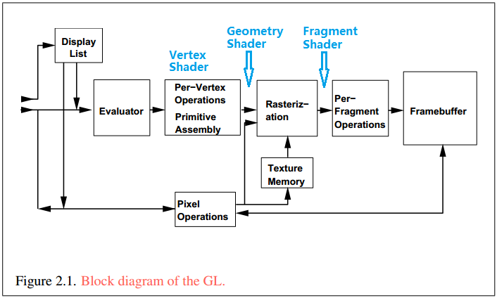

再来看个民间提供的可读性更好的图（摘自文献[8]，[这里](http://www.lighthouse3d.com/tutorials/glsl-core-tutorial/pipeline33/)）：

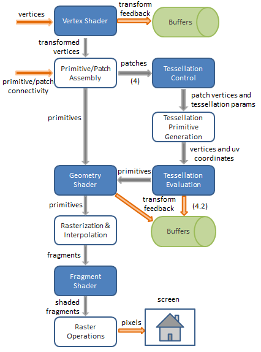

将上图中的数字(4)和(4.2)（表示从OpenGL 4.2版本开始支持）中间部分去掉就是OpenGL 3.3的管线。

再看，一个有些过时，但很直观的图（摘自文献[8]，[这里](http://www.lighthouse3d.com/tutorials/glsl-tutorial/pipeline-overview/)）：

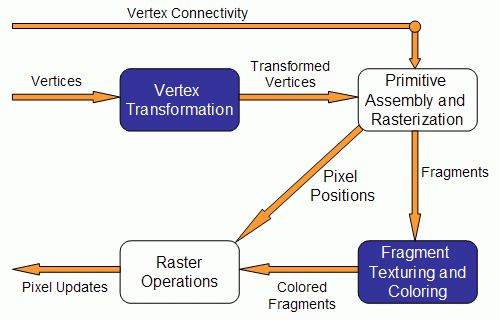

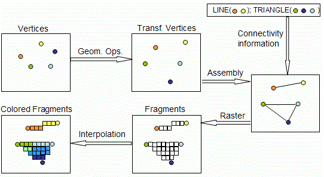

在忽略细分、计算着色器，以及用固定管线功能代说顶点、几何、片断着色器之前，先来看看固定管线给这些着色器规定好的内置输入输出变量，看了这些输入输出基本就知道着色器该干些什么了（左图截图自文献[4] GL4.5，右图截图自文献[2] GL3.2，右图中蓝色字体是废弃功能，正是固定管线功能部分）：

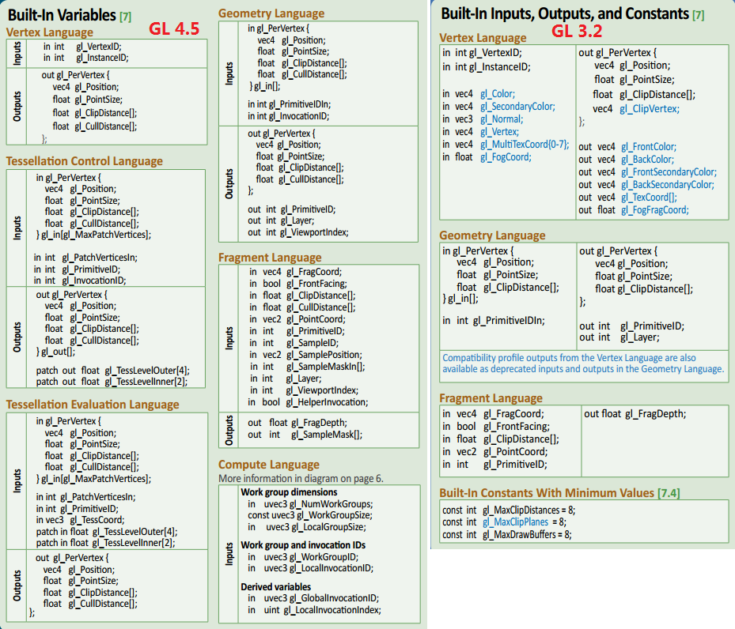

## 3.管线图中框的内部

下面将进入第二层次，说说上面各种管线图中每个框的内部，将分为 顶点处理、图元装配裁剪等（加“等”是包括装配后的其他操作）、光栅化、逐片断处理 四个部分，这和上面图中框的对应关系应该是明显的。顶点处理基本对应顶点着色器，几何着色器位于图元装配之后裁剪之前，片断着色器位于逐片断处理之前。在进入各个框之前，我们先**大概划清范围**，看看我们常用的固定管线功能都包括在哪个部分。顶点处理包括固定管线的顶点坐标变换、光照（也即逐顶点光照）等；图元装配裁剪等包括图元装配、裁剪、透视除法、视口变换等；光栅化包括点线光栅化、多边形填充、纹理（Texture）、雾（Fog）等；逐片断处理包括各种测试（Scissor, Alpha, Stencil, Depth Test）、混合（Blending）等。

了解这些颇具**指导意义**，例如，知道了纹理属于光栅化阶段之后，就不会犯这样的错误：将纹理的影响模式设置为Replace之后，还期望曲面在光照下有明暗变化（这么想在Blender、Maya等软件中是正确的，就好像用纹理的颜色值去定义曲面每点处的材质颜色），为什么错呢，因为纹理在光栅化阶段进行，这时光照（在顶点处理部分进行）已经完成了，纹理的Replace模式直接对顶点光照计算后并插值到片断上的颜色进行替换并最终写入FrameBuffer，所以得不到光照明暗变化，要得到想要结果应该用Multiply影响模式并将光照材料设置为白色（这也是为什么Multiply是默认模式的原因）。

另外，OpenGL Specification 和 API Quick Reference Card 也按照管线图中的框来对内容进行分节的，确定一个东西属于管线的哪个阶段之后再去查就非常高效了。

### 3.1 顶点处理

顶点处理主要进行顶点齐次坐标变换和光照（固定管线功能只有逐顶点光照）。顶点的**齐次坐标变换**过程如下（文献[1]第**66**页）：


正如图中标的，顶点处理产生Clip Coordinates，蓝线之后部分是下一节的内容。这里还可能进行**纹理坐标自动生成**（`glEnable(GL_TE XTURE_GEN_S[TRQ])`），即根据Object或者Eye Coordinates和指定的矩阵（glTexGeni(...)）或者其他方式（球，立方体等）计算纹理坐标（文献[1]2.12.3）。

**光照**处理过程如下图（文献[1]第84页）：

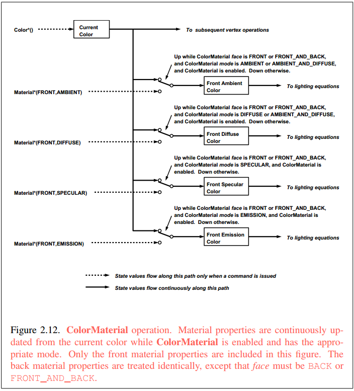

若光照被关闭，顶点的颜色将直接设置成当前颜色（glColor()指定），若打开，顶点将根据当前材料颜色（glMatiral()，可分正面背面分别设置）和法向量（glNormal()）来计算环境、散射、高光、发射光的颜色，并叠加。**光照分正背面**进行（由`glLightModeli(GL_LIGHT_MODEL_TWO_SIDE, GL_TURE[FALSE])`控制），也即顶点处理完成后每个顶点将有两个颜色属性值（见顶点着色器内置输出变量，`gl_FrontColor/BackColor`），正面颜色的计算依据正面材料及法向量**n**，背面颜色计算依据背面材料及法向量的反方向**-n**，若双面光照关闭，则只计算正面颜色并简单将背面颜色设为和正面相同（关于单面光照最容易被误解的就是，单面光照是简单的将背面颜色设为和正面相同从而不去独立计算，而不是只照亮正面）。顶点的颜色将在随后光栅化的时候被插值到片断，光栅化时根据图元顶点环绕方向（逆时针或顺时针，见本文后面光栅化章节）确定正背面，并据此选择用顶点的正面颜色值还是背面颜色值来插值。根据**glShadeMode**(`GL_SMOOTH[FLAT]`)的设置，同一个图元的顶点的颜色值将被单独处理，或全都被赋值为其中一个顶点（ProvokingVertex）的值，请见文献[1]2.21。固定管线的逐顶点光照类似于Gouraud模型，这区别于逐片断光照（如Phong，对片断先由其图元顶点法向量插值出片断法向量，再根据这个法向量计算光照，可由片断着色器实现）。

另外，光照的计算涉及的距离、向量内积等均在**视觉坐标系**（Eye Space）中进行（文献[1]第80页），函数`glGetLightfv(GL_LIGHT0[1,2..], GL_POSITION, Glfloat*)`返回的光源位置也是视觉坐标（EyeCoordinates），这是因为按照顶点变换的实际意义，Eye Space还是直角坐标系，而Clip Space就不一定了（当视景体近平面宽高比不为1时，
在不考虑w坐标，即不考虑投影矩阵第四行的情况下，xyz的缩放值可能不同，请见文献[1]第69页和文献[7]第497页投影矩阵的计算公式）。

将顶点的相关数据信息合到一起，请看下图（文献[1]第20页）：

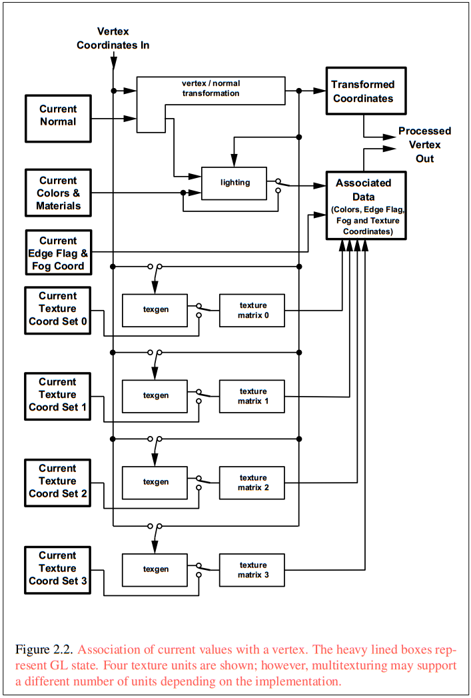

顶点的齐次坐标变换、逐顶点光照等可以由**顶点着色器**代替，见文献[1]2.14。

### 3.2 图元装配裁剪等

顶点处理或者顶点着色器的输出是一些列变换后的位于Clip坐标系的顶点，这些顶点首先根据顶点之间的连接关系（点、线、多边形）进行**图元装配**（文献[1]第21页）：

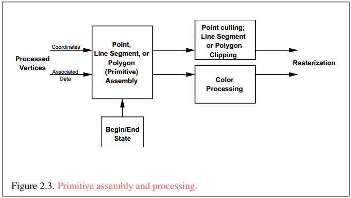

图元装配之后是**裁剪**（Clipping），见文献[1]2.22，下面是裁剪公式（文献[1]第142页）：

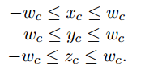

多边形的裁剪可能产生新的顶点，这些的点的颜色值以及纹理坐标等值要被插值。除了默认的xyz分别为±1的正方体的六个面的裁剪面，用户可以指定**额外的裁剪面**：`glClipPlane(GL_CLIP_PLANE0[1,2,...], double eqn[4])`，`glEnable/Disable(GL_CLIP_DISTANCE0[1,2,...])`，注意指定的值会被乘以当前模型视图矩阵的逆，乘完得到的值在视觉坐标系中进行裁剪（同从顶点视觉坐标自动生成纹理坐标的参数），请见文献[1]第142页。

裁剪之后是**透视除法**（Perspective Division，文献[1]第132页）：

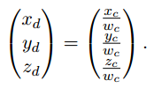

透视除法之后是**视口变换**（Viewport Transformation，文献[1]第132页）：

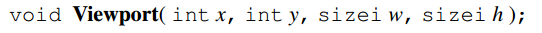

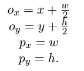

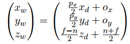

视口变换同时也将原来**z坐标缩放到[0,1]变成Depth值**，深度值默认在[0,1]且值越小离摄像机越近，可以指定深度值范围：`glDepthRange(GLclampd n, GLclampdf)`，其中GLclampd[f]类型表示值将被钳位到[0,1]（文献[1]第16页），请见文献[1]第132页。视口变换完成后的图元将进入光栅化阶段。

上面的图元装配之后，裁剪、透视除法、视口变换等操作之前，也可以由**几何着色器**对图元进行操作，即在图元装配之后插入几何着色器，见文献[1]2.15.4。

### 3.3 光栅化

到目前为止，管线里的数据都是顶点，经过图元装配之后，哪些顶点就是一个点、哪两个顶点是直线段、哪三个或更多顶点是一个三角形或多边形，这些图元信息都已经知道了，但它们还是只是顶点而已：顶点处都还没有“像素点”、直线段端点之间是空的、多边形的边和内部也是空的，光栅化的任务就是构造这些。由于已经经过了视口变换，光栅化是在二维（附带深度值）的屏幕坐标系（Window Space）中进行的。

光栅化有**两个任务**：1.确定图元包含哪些由整数坐标确定的“小方块”（和屏幕像素对应，现在还不能叫片断，光栅化完成后才能叫片断），2.确定这些小方块的Depth值和Color值（从图片顶点的Depth和Color插值得到），这些颜色后来可能被其他如纹理操作修改。见文献[1]第150页第3章开头的描述，如下图（文献[1]第151页）：

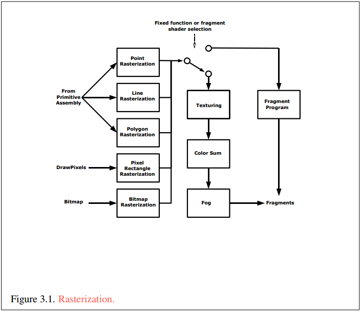

光栅化在对多边形图元进行“方块化”之前，要给出多边形是**front-facing**还是**back-facing**（正面还是背面，点和直线只有正面），这是根据多边形顶点的环绕方向确定的（是顺时针还是逆时针，默认逆时针为front-facing，可由`glFrontFace(GL_CCW[CW])`控制）。正背面判断结果将用于选择是用顶点的正面颜色还是背面颜色来对片断颜色进行插值（顶点正背面光照颜色请见本文前面顶点处理章节）。随后如果`glIsEnabled(GL_CULL_FACE)`为真，对于方向和**glCullFace**(`GL_FRONT[BACK]`)的参数相同的多边形图元，将被剔除，即直接跳过光栅化的后续操作。另外，光栅化除了直接对多边形进行填充这种方式之外，还可以只构造边或只有点，这由**glPolyMode**(`GL_FRONT[BACK,FRONT_AND_BACK]`, `GL_FILL[LINE,POINT]`)控制。

这里强调一下光栅化判断正背面和正背面光照的区别，前者是对图元的操作并依据顶点环绕方向（一个多边形图元有多个顶点，也就有多个法向量，这些向量可能不同，所以不可能依据法向量来判断图元朝向），后者是对顶点的操作并依据顶点的法向量。举个例子，如果一个三角形按照顶点环绕的右手法则方向的反方向指定法向量，并且法向量朝物体外侧，当光照为单面光照时，因为光栅化判断为背面的多边形图元其片断用顶点背面光照颜色进行插值，单面光照下，和顶点正面光照颜色相同，所以没有问题，但当光照为双面光照时，图元的沿法向量这边的“光照正面”却是光栅化依据顶点环绕方面判断的“光栅化背面”，这时，我们将看到一个灰色的好像没有光照一样的东西，从而得不到结果。所以，对三角形或多边形的由顶点法向量确定的正面（三个或更多顶点法向量确定的正面一致，指这个面）要和光栅化用顶点环绕方面的正面相同，这样才不会出现意想不到的效果。

最为复杂的纹理在光栅化阶段进行，下图是**多重纹理**的操作示意（文献[1]第280页）：

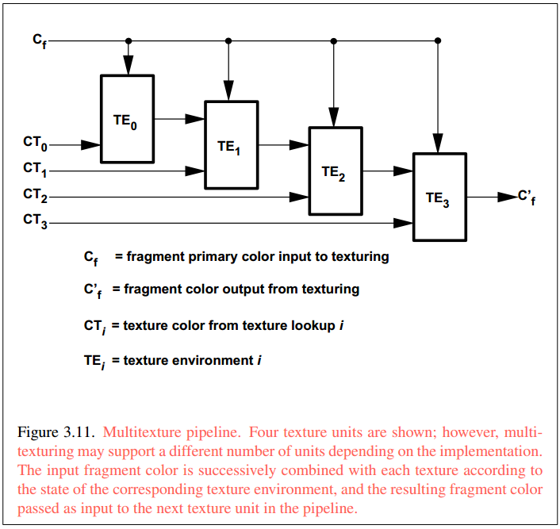

之所以说纹理复杂，在于**纹理坐标**的计算上，每个片断要找到一个纹理坐标以索引纹理像素，这个计算看似简单，但出问题时将产生意想不到的效果，如下图（摘自[这里](http://developer.download.nvidia.com/assets/gamedev/docs/projective_texture_mapping.pdf)）：

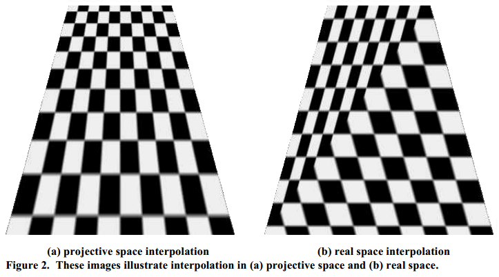

图中所说的Projective和Real Space坐标就是我们所说的透视除法前后的坐标。

在光栅化对图元进行“小方块化”并对“小方块”进行插值之后，后来的纹理和雾等操作可以由**片断着色器**代替，片断着色器还可以对片断进行更多计算，如逐片断光照，处理后的片断将进入下一步逐片断处理。

### 3.4 逐片断处理

光栅化的输出是一些列片断（Fragments，这些片断可能经过片断着色器处理），片断被称为“准像素”，要能想象出屏幕坐标系的一个整数坐标上只有一个像素，但可以前后“堆叠”多个片断。这些片断进入逐片断处理（Per-Fragment Operations），首先进行**各种测试**（下图中共5个），每步测试，不通过的片断将被丢弃从而不能进入后续操作，然后进行一些操作（如混合），最终通过所有处理的片断将被写入FrameBuffer用于最终屏幕显示，这个过程如下图（文献[1]第294页）：

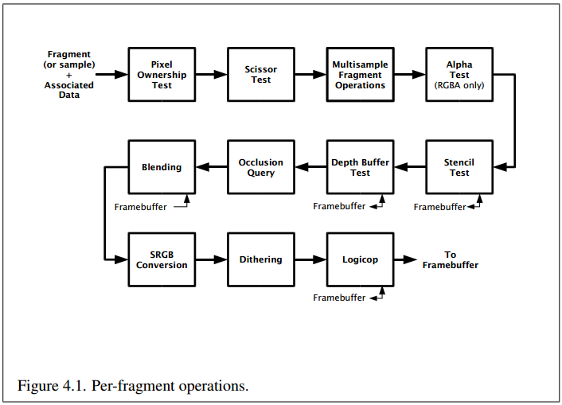

Scissor Test对用户指定的scissor rectangle进行测试，Alpha Test用片断Alpha值进行测试（如片断Alpha值小于设定ref值时通过），Depth Buffer Test和遮挡处理有关（如片断深度值小于其同坐标的深度缓冲区元素的值时通过），Stencil Test可以根据Stencil或Depth Buffer Test结果分条件更新Stencil Buffer实现很多功能（如zfail时，片断同坐标的Stencil缓冲区元素加1，zpass时减1，第二遍渲染再设置Stencil test为片断同坐标Stencil缓冲区元素值为0时通过），如Shadow Volumes算法。上图中，框下面有**小箭头连接FrameBuffer**的说明该测试要访问或更新FrameBuffer的值。

所有操作均通过的片断将被写入FrameBuffer，包括RGBA缓冲、Depth缓冲，注意Stencil缓冲仅用于测试，片断没有Stencil值。还有一个缓冲叫做Accumulation Buffer，多用于运动模糊、景深模糊等，但不能直接写入，而是将RGBA缓冲整幅累积。

这些操作可以用`glEnable/glDisable(GL_ALPHA/STENCIL/DEPTH_TEST)`、`glEnable/glDisable(GL_BLEND)`等**打开或关闭**，对于RGBA, Depth, Stencil Buffer，可以用`glColor/Depth/StencilMask(GLboolean/GLuint)`进行**控制是否可写**。注意，缓冲区使能和缓冲区屏蔽是独立的，使能控制是否进行测试，如果不进行测试，片断将直接通过，然后对于通过测试的片断根据是否屏蔽决定是否更新缓冲区。

### 3.5 像素处理及小结

在进入下一层次之前，先来看看**像素处理**，请见下图（文献[1]第76页）：

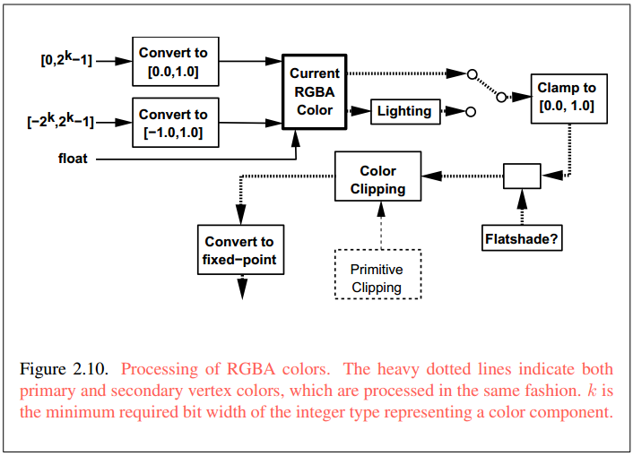

可以看到，像素处理主要工作就是，将像素数据的例如[0,255]的整数RGBA值转换到管线所需的[0,1]的浮点数。

将上述顶点处理、图元装配裁剪等、光栅化、逐片断处理以及像素处理合到一起，请看下图（文献[7]英文版第11页，中文版在第6页）：

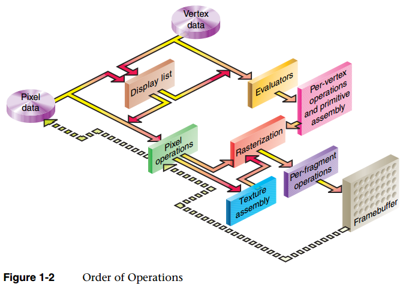

## 4.编程细节，OpenGL函数总结

下面进入下一个层次，OpenGL编程细节，这里涉及的内容是：OpenGL的每个API函数如何影响渲染管线的状态，并最终如何影响渲染过程。这里主要参考文献[2] OpenGL 3.2 API Quick Reference Card，它对包含固定管线功能在内的API做了非常好的总结。本文这一节对常用的OpenGL函数进行总结，也是针对固定管线功能，不包括着色器部分。

下面的总结以方便阅读为目的，并不全面，某些函数有xx3f, xx4f, xx3fv等多个版本的只给出一个版本。OpenGL有很多状态变量，很多时候我们在改变一个状态并完成一些操作之后希望恢复这个状态的原来的值，这需要对状态进行查询，这里将给出操作对应的查询函数，并给出状态的初始值。

### 4.1 顶点数据输入

**操作**：文献[1]第22页

```c
glBegin(GL_POINTS[GL_LINES, GL_TRIANGLES, GL_POLYGON, ...]) 图元数据开始  
glColor4fv(GLfloat*) 顶点颜色属性  
glNormal3fv(GLfloat*) 顶点法向量  
glTexCoord4fv(GLfloat*) 顶点纹理坐标，原点位于图片左下角，宽和高范围[0,1]  
glFogCoordf(GLfloat) 顶点雾坐标  
glVertex4f(GLfloat*) 顶点坐标  
glEnd() 图元数据结束
```

**查询**：文献[1]第415页，文献[7]第471页

```c
glGetFloatv(GLenum, GLfloat*)  
GL_CURRENT_COLOR 初值 (1, 1, 1, 1)  
GL_CURRENT_NORMAL 初值 (0, 0, 1)  
GL_CURRENT_TEXTURE_COORDS 初值 (0, 0, 0, 1)  
GL_CURRENT_FOG_COORD 初值 0
```

### 4.2 变换矩阵，视口

**操作**：文献[1]第66页，第132页

```c
glMatrixMode(GL_MODELVIEW[, GL_PROJECTION, GL_TEXTURE, GL_COLOR]) 操作哪个矩阵  
glLoadIdentity() 将当前矩阵设置为单位阵  
glLoadMatrixf(GLfloat*) 在当前矩阵替换为参数指定矩阵（列优先）  
glLoadTransposeMatrixf(GLfloat*) 同glLoadMatrixf，但行优先  
glMultMatrixf(GLfloat*) 在当前矩阵右边乘以参数指定矩阵（列优先）  
glMultTransposeMatrixf(GLfloat*) 同glMultMatrixf，但行优先  
glTranslatef(x, y, z) 在当前矩阵右边乘以平移矩阵  
glRotatef(angle, nx, ny, nz) 在当前矩阵右边乘以旋转矩阵  
glScalef(sx, sy, sz) 在当前矩阵右边乘以缩放矩阵  
glFrustum(left,right,bottom,top,zNear,zFar) 在当前矩阵右边乘以透视投影矩阵  
glOrtho(l,r,b,t,n,f) 在当前矩阵右边乘以平行投影矩阵  
glPushMatrix() 向矩阵堆栈压入原顶部矩阵  
glPopMatrix() 矩阵堆栈弹出顶部矩阵  
glViewport(ox,oy,width,height) 视口变换
```

**查询**：文献[1]第422页，文献[7]第474页

```c
glGetIntegerv(GLenum, GLint*)  
GL_MATRIX_MODE, 初值 GL_MODELVIEW  

glGetFloatv(GLenum, GLfloat*)  
GL_MODELVIEW_MATRIX 初值 单位阵  
GL_PROJECTION_MATRIX 初值 单位阵  
GL_TEXTURE_MATRIX 初值 单位阵  
GL_COLOR_MATRIX 初值 单位阵  

glGetIntegerv(GLenum pname, GLint*)  
GL_VIEWPORT 初值 未定义  
```

### 4.3 光照

**操作**： 文献[7]第138页、第130页，光照公式148页

```c
glEnable/glDisable(GL_LIGHTING) 使能光照  
glEnable/glDisable(GL_LIGHT0[1,2,...]) 使能第i个光源  

glLightModel[if][v](GLenum, para)
GL_LIGHT_MODEL_AMBIENT 全局环境光颜色强度值  
GL_LIGHT_MODEL_LOCAL_VIEWER 高光是否为有限远光源  
GL_LIGHT_MODEL_TWO_SIDE 是否为双面光照  
GL_LIGHT_MODEL_COLOR_CONTROL (下面2行是该参数后续参数值)  
GL_SINGLE_COLOR 所有光照颜色在纹理前计算  
GL_SEPARATE_SPECULAR_COLOR 将高光推迟到纹理后计算  

glLightf[v](GL_LIGHT0[1,2,...], GLenum, para)
GL_AMBIENT[DIFFUSE,SPECULAR] 光源各成分环境、漫反射、高光的颜色强度  
GL_POSITION 光源位置（受到当前模型视图矩阵的变换，w坐标为0表示方向性光源）  
GL_SPOT_CUTOFF 聚光灯扇角（边沿和中心线夹角），180度为点光源，小于180度才是聚光灯  
GL_SPOT_EXPONENT 聚光灯聚光指数，即中心到边沿衰减速度，0为不变化  
GL_SPOT_DIRECTION 聚光灯照射方向
GL_CONSTANT_ATTENUATION 光强随到光源距离d衰减，分母中常数项d0系数  
GL_LINEAR_ATTENUATION 光强随到光源距离d衰减，分母中一次项d1的系数  
GL_QUADRATIC_ATTENUATION 光强随到光源距离d衰减，分母中二次项d2的系数  

glMaterialfv(GL_FRONT[BACK,FRONT_AND_BACK], GLenum, para)
GL_AMBIENT[DIFFUSE,AMBIENT_AND_DIFFUSE,SPECULAR] 设置材料的各成分颜色值  
GL_EMISSION 设置材料自发光值，注意这个光不是光源，不会照射其他物体  
GL_SHININESS 设置高光的亮斑聚光系数
```

**查询**：文献[1]第424页，文献[7]第475页

```c
glIsEnabled(GLenum)  
GL_LIGHTING 初值 GL_FALSE  
GL_LIGHT0[1,2,...] 初值 GL_FALSE  

glGetFloatv(GLenum, GLfloat*)  
GL_LIGHT_MODEL_AMBIENT 初值 (0.2,0.2,0.2,1)  

glGetBooleanv(GLenum, GLboolean*)  
GL_LIGHT_MODEL_LOCAL_VIEWER 初值 GL_FALSE  
GL_LIGHT_MODEL_TWO_SIDE 初值 GL_FALSE  

glGetIntegerv(GLenum, GLint*)  
GL_LIGHT_MODEL_COLOR_CONTROL 初值 GL_SINGLE_COLOR  

glGetLightfv(GL_LIGHT0[1,2,...], GLenum, GLfloat*)  
GL_AMBIENT[DIFFUSE,SPECULAR] 初值 (0,0,0,1)  
GL_POSITION 光源的视觉坐标系坐标 初值 (0,0,1,0)  
GL_SPOT_CUTOFF 初值 180  
GL_SPOT_EXPONENT 初值 0  
GL_SPOT_DIRECTION 初值 (0,0,-1)  
GL_CONSTANT_ATTENUATION 初值 1  
GL_LINEAR_ATTENUATION 初值 0  
GL_QUADRATIC_ATTENUATION 初值 0  

glGetMaterialfv(GL_FRONT[BACK], GLenum, GLfloat*)  
GL_AMBIENT 初值 (0.2,0.2,0.2,1)  
GL_DIFFUSE 初值 (0.8,0.8,0.8,1)  
GL_SPECULAR 初值 (0,0,0,1)  
GL_EMISSION 初值 (0,0,0,1)  
GL_SHININESS 初值 0
```

### 4.4 光栅化

**操作**：文献[1]第169页 

```c
glPointSize(GLfloat) 点的直径  
glLineWidth(GLfloat) 直线宽度  
glEnable/glDisable(GL_CULL_FACE) 使能表面剔除  
glFrontFace(GL_CCW[CW]) 顶点环绕方向为逆时针还是顺时针为正面  
glCullFace(GL_FRONT[BACK,FRONT_AND_BACK]) 剔除正面还是背面  
glPolygonMode(GL_FRONT[BACK,FRONT_AND_BACK], GL_POINT[LINE,FILL]) 设置多边形正面或背面的光栅化方式：顶点、边线、填充面  
glEnable/glDisable(GL_POLYGON_OFFSET_FILL[LINE,POINT]) 使能多边形偏移  
glPolygonOffset(factor,units) 设置多边形片断深度值的偏移值：factor*多边形斜率+units*深度值的最小分度
```

**查询**： 文献[1]第426页，文献[7]第476页 

```c
glGetFloatv(GLenum, GLfloat*)  
GL_POINT_SIZE 初值 1  
GL_LINE_WIDTH 初值 1  

glIsEnabled(GLenum)  
GL_CULL_FACE 初值 GL_FALSE  

glGetIntegerv(GLenum, GLint*)  
GL_FRONT_FACE 初值 GL_CCW  
GL_CULL_FACE_MODE 初值 GL_BACK  
GL_POLYGON_MODE 返回正背面两个数 初值 GL_FILL  

glIsEnabled(GLenum)  
GL_POLYGON_OFFSET_FILL 初值 GL_FALSE  
GL_POLYGON_OFFSET_LINE 初值 GL_FALSE  
GL_POLYGON_OFFSET_POINT 初值 GL_FALSE  

glGetFloatv(GLenum, GLfloat*)  
GL_POLYGON_OFFSET_FACTOR 初值 0  
GL_POLYGON_OFFSET_UNITS 初值 0
```

### 4.5 纹理

**操作**：文献[1]第217页，纹理参数251页，纹理函数270页；文献[7]纹理参数288页，纹理函数282页 

```c
glActiveTexture(GL_TEXTURE0[1,2,...]) 多重纹理，设置当前纹理单元  
glEnable/glDisable(GL_TEXTURE_2D[1D,3D]) 使能纹理功能  

glGenTextures(GLsizei n, GLuint *texs) 分配纹理对象，纹理对象保存纹理的参数、像素数据等，第一次绑定时才分配参数的存储空间  
glDeleteTextures(GLsizei n, GLuint *texs) 删除纹理对象  
glBindTexture(GL_TEXTURE_2D[1D,3D], tex) 绑定tex为当前纹理  

glTexImage2D(GL_TEXTURE_2D[...], level, internalFormat, width, height, border, format, type, *pixels) 指定纹理像素  
level为LOD的第几层，没有LOD为 0 border为边框，没有边框为 0  
internalFormat和format为 GL_RGBA[RED,ALPHA,LUMINANCE,DEPTH_COMPONENT,...]  
指定纹理和pixels像素格式  
type为 GL_UNSIGNED_BYTE[FLOAT,...] 为存储格式  
函数调用之后pixels的内容被拷贝，pixels可以delete以释放内存  

glCopyTexImage2D(target,level,internalFormat,ox,oy,width,height,border) 参数意义和glTexImage2D基本相同，但从FrameBuffer中拷贝像素数据  
glTexSubImage2D(target,level,xoffset,yoffset,width,height,format,type,*pixels)  
glCopyTexSubImage2D(target,level,xoffset,yoffset,ox,oy,width,height) 和glTexImage2D、glCopyTexImage2D基本相同，但只操作纹理的子区域  

glTexParameteri(GL_TEXTURE_2D[1D,3D], GLenum, para) 纹理的参数  
GL_TEXTURE_WRAP_S[T,R,Q] 纹理坐标超出[0,1]后处理方式 GL_REPEAT[CLAMP,...]  
GL_TEXTURE_MAG[MIN]_FILTER 纹理放大缩小时像素插值方式 GL_LINEAR[NEAREST]  
GL_TEXTURE_BORDER_COLOR 纹理边框颜色  
GL_DEPTH_TEXTURE_MODE 纹理深度值使用模式 GL_LUMINANCE[INTENSITY,ALPHA,RED]  
GL_TEXTURE_COMPARE_MODE 纹理比较模式 GL_NONE[COMPARE_R_TO_TEXTURE,...]  
GL_TEXTURE_COMPARE_FUNC 比较函数 GL_LEQUAL[EQUAL,LESS,GREATER,...]  

glTexEnvfv(GL_TEXTURE_ENV[...], GLenum, para) 纹理单元的参数  
GL_TEXTURE_ENV_MODE 纹理如何影响片断的颜色 GL_MODULATE[REPLASE]  

glEnable(GL_TEXTURE_GEN_S[T,R,Q]) 使能纹理坐标自动生成  

glTexGeni(GL_S[T,R,Q], GLenum, para) 纹理坐标自动生成参数  
GL_TEXTURE_GEN_MODE 生成方式 GL_OBJECT[EYE]_LINEAR  
GL_OBJECT_PLANE 从物体坐标系坐标生成纹理坐标，指定矩阵的一行  
GL_EYE_PLANE 从视觉坐标系坐标生成纹理坐标，指定矩阵的一行，会被乘以当前模型视图矩阵的逆
```

**查询**：文献[1]第429页，文献[7]第477页

```c
glGetIntegerv(GLenum, GLint*)  
GL_ACTIVE_TEXTURE 初值 GL_TEXTURE0  

glIsEnabled(GLenum)  
GL_TEXTURE_2D[1D,3D] 初值 GL_FALSE  

glGetIntegerv(GLenum, GLint*)  
GL_TEXTURE_BINDING_2D[1D,3D] 初值 0 

glGetTexImage(GL_TEXTURE_2D[1D,3D], level, format, type, *pixels)  初值 未定义  

glGetTexParameterfv(GL_TEXTURE_2D[1D,3D], GLenum, para)  
GL_TEXTURE_WRAP_S[T,R] 初值 GL_REPEAT  
GL_TEXTURE_MAG[MIN]_FILTER 初值 GL_LINEAR[NEAREST_MIPMAP_LINEAR]  
GL_TEXTURE_BORDER_COLOR 初值 (0,0,0,0)  
GL_DEPTH_TEXTURE_MODE 初值 GL_LUMINANCE  
GL_TEXTURE_COMPARE_MODE 初值 GL_NONE  
GL_TEXTURE_COMPARE_FUNC 初值 GL_LEQUAL  

glGetTexEnvfv(GL_TEXTURE_2D[1D,3D], GLenum, para)  
GL_TEXTURE_ENV_MODE 初值 GL_MODULATE  

glIsEnabled(GLenum)  
GL_TEXTURE_GEN_S[T,R,Q] 初值 GL_FALSE  
glGetTexGeni[f]v(GLenum, para)  
GL_TEXTURE_GEN_MODE 初值 GL_EYE_LINEAR  
GL_OBJECT_PLANE 初值 未定义  
GL_EYE_PLANE 初值 未定义
```

### 4.6 逐片断处理

**操作**：文献[1]第294页 

```c
glEnable/glDisable(GLenum)  
GL_SCISSOR_TEST Scissor测试  
GL_ALPHA_TEST Alpha测试  
GL_STENCIL_TEST 模板测试  
GL_DEPTH_TEST 深度测试  
GL_BLEND 颜色混合  

glClear(GL_COLOR_BUFFER_BIT[|DEPTH][|STENCIL][|ACCUM])  
清除颜色[深度，模板,积累]缓冲区，用指定的清除值  

glClearColor(GLfloat r,g,b,a) 颜色缓冲区清除颜色  
glClearDepth(GLfloat d) 深度缓冲区清除值  
glClearStencil(GLint s) 模板缓冲区清除值  

glColorMask(GLboolean red, GLboolean green, GLboolean blue, GLboolean alpha)  
GL_TRUE,GL_FALSE 分别指定颜色缓冲区各个分量是否可写  

glDepthMask(GLboolean) 深度缓冲区是否可写  
glStencilMask(GLuint mask) mask每个比特位为1缓冲区元素该比特位可写  

glAlphaFunc(GLenum fun, GLfloat ref) Alpha测试，片断Alpha值之于ref的通过条件  
GL_NEVER,ALWAYS,LESS,LEQUAL,EQUAL,NOTEQUAL,GREATER,GREATER  

glStencilFunc(GLenum fun, GLint ref, GLuint mask) fun取值同glAphaFunc  
片断对应像素坐标位置的模板Buffer元素设为a，(a&mask)和(ref&mask)的比较结果为通过条件  

glStencilFuncSeparate(GLenum face, fun, ref, mask)  
同glStencilFunc，但对多边形分正背面单独设置，点和直线只有正面，fun取值同glAlphaFunc  

glDepthFunc(GLenum fun) 深度测试函数（片断之于Buffer对应元素的通过条件），fun取值同glAlphaFunc  

glStencilOp(GLenum fail, GLenum pzfail, GLenum pzpass)  
片断模板测试失败、模板通过但深度测试失败、通过但深度测试通过时，对片断对应模板Buffer元素的操作  
GL_KEEP,ZERO,REPLACE,INCR,DECR,INVERT,INCR_WRAP,DECR_WRAP  
分别表示：保持，替换为0，替换为ref，带封顶++，带封顶--，逐位反转，带绕回++，带绕回--  

glStencilOpSeparate(GLenum face, fail, zfail, zpass)  
同glStencilOp，但对多边形分正背面单独设置  

glBlendEquation(GLenum mode) 混合方程的符号  
GL_FUNC_ADD,GL_FUNC_SUBTRACT,GL_FUNC_REVERSE_SUBTRACT  

glBlendEquationSeparate(modeRGB, modeAlpha) 同glBlendEquation，RGB和A分开设置  

glBlendFunc(GLenum sfactor, GLenum dfactor) 源（片断）和目标（FrameBuffer中的值）混合系数  
GL_ZERO,ONE,SRC_ALPHA,ONE_MINUS_SRC_ALPHA,DST_ALPHA,DST_COLOR,...  

glBlendFuncSeparate(srcRGB,dstRGB,srcAlpha,dstAlpha) 同glBlendFunc，但RGB和A分开设置
```

**查询**：文献[1]第436页，文献[7]第480页 

```c
glIsEnabled(GLenum)  
GL_SCISSOR_TEST 初值 GL_FALSE  
GL_ALPHA_TEST 初值 GL_FALSE  
GL_STENCIL_TEST 初值 GL_FALSE  
GL_DEPTH_TEST 初值 GL_FALSE  
GL_BLEND 初值 GL_FALSE  

glGetFloatv(GLenum, GLfloat*)  
GL_COLOR_CLEAR_VALUE 初值 (0,0,0,0)  
GL_DEPTH_CLEAR_VALUE 初值 1  
GL_STENCIL_CLEAR_VALUE 初值 0  

glGetBooleani_v(GLuint bufferi, GLenum, GLboolean*)  
GL_COLOR_WRITEMASK 初值 (GL_TRUE,GL_TRUE,GL_TRUE,GL_TRUE)  

glGetBooleanv(GLenum, GLboolean*)  
GL_DEPTH_WRITEMASK 初值 GL_TRUE  

glGetIntegerv(GLenum, GLint*)  
GL_STENCIL_WRITEMASK 初值 全1  

glGetIntegerv(GLenum, GLint*)  
GL_ALPHA_TEST_FUNC 初值 GL_ALWAYS  
GL_STENCIL[_BACK]_FUNC 初值 GL_ALWAYS 正面和背面  
GL_STENCIL[_BACK]_REF 初值 0  
GL_STENCIL[_BACK]_VALUE_MASK 初值 全1  
GL_DEPTH_FUNC 初值 GL_LESS  
GL_STENCIL[_BACK]_FAIL 初值 GL_KEEP  
GL_STENCIL[_BACK]_PASS_DEPTH_FAIL 初值 GL_KEEP  
GL_STENCIL[_BACK]_PASS_DEPTH_PASS 初值 GL_KEEP  
GL_BLEND_EQUATION_RGB[ALPHA] 初值 GL_FUNC_ADD  
GL_BLEND_SRC_RGB[ALPHA] 初值 GL_ONE  
GL_BLEND_DST_RGB[ALPHA] 初值 GL_ZERO
```

### 4.7 其他函数

```c
glReadPixels(ox, oy, width, height, GLenum format, GLenum type, GLvoid*pixels)  
读取FrameBuffer  

glDrawPixels(width, height, GLenum format, GLenum type, const GLvoid *pixels)  
写入FrameBuffer
```

被漏掉议题：显示列表，雾，顶点列表，缓冲区对象，帧缓冲对象，条件渲染，渲染查询，同步，着色器等，参考文献[2]。

## 参考文献

  1. OpenGL 3.3 Specification (Compatibility rofile) - March 11, 2010（[去官网下载](https://www.opengl.org/registry/)）;
  2. OpenGL 3.2 API Quick Reference Card（[去官网下载](https://www.opengl.org/registry/)）；
  3. OpenGL 4.5 Specification (Compatibility rofile) - October 30, 2014（[去官网下载](https://www.opengl.org/registry/)）;
  4. OpenGL 4.5 API Reference Card（[去官网下载](https://www.opengl.org/registry/)）；
  5. University of Freiburg的Computer Graphics小组课程主页（[去课程主页](http://cg.informatik.uni-freiburg.de/teaching.htm)，[图形管线PPT](http://cg.informatik.uni-freiburg.de/course_notes/graphics_01_pipeline.pdf)）;
  6. Stanford University, CS148 Introduction to Computer Graphics and Imaging (Fall 2014)（[去课程主页](http://web.stanford.edu/class/cs148/index.html)，[图形管线PPT](http://web.stanford.edu/class/cs148/pdf/class_02_scanline_rendering.pdf)）；
  7. 《OpenGL编程指南》（原书第7版，Dave Shreiner等著，李军等译，机械工业出版社，2011）（[到当当网买](http://product.dangdang.com/20804907.html#ddclick?act=click&pos=20804907_1_2_q&cat=&key=OpenGL%B1%E0%B3%CC%D6%B8%C4%CF&qinfo=16_1_60&pinfo=&minfo=&ninfo=&custid=&permid=20141108140742767296259145737637864&ref=http%3A%2F%2F1111.dangdang.com%2F%3F_ddclickunion%3D460-5-biaoti%7Cad_type%3D0%7Csys_id%3D1&rcount=&type=&t=1415693216000&ver=A)）；
  8. <http://www.lighthouse3d.com/tutorials/>（[现代管线](http://www.lighthouse3d.com/tutorials/glsl-core-tutorial/pipeline33/)，[经典管线](http://www.lighthouse3d.com/tutorials/glsl-tutorial/pipeline-overview/)）；
  9. Patrick Cozzi and Christophe Riccio, Opengl Insights, CRC Press, 212（[图书网站](http://openglinsights.com/)，[图形管线](http://openglinsights.com/pipeline.html)，[高清PDF版管线图](http://www.seas.upenn.edu/~pcozzi/OpenGLInsights/OpenGL44PipelineMap.pdf)）；
  10. CUDA Toolkit Documentation v6.5， Programming Guide（[在线版本](http://docs.nvidia.com/cuda/cuda-c-programming-guide/)）；
  11. 《GPU高性能运算之CUDA》（张舒等主编，中国水利水电出版社，2009）（[到当当网买](http://product.dangdang.com/20705187.html#ddclick?act=click&pos=20705187_1_0_q&cat=&key=GPU%B8%DF%D0%D4%C4%DC%D4%CB%CB%E3%D6%AEcuda&qinfo=4_1_60&pinfo=&minfo=&ninfo=&custid=&permid=20141108140742767296259145737637864&ref=http%3A%2F%2Fsearch.dangdang.com%2F%3Fkey%3DGPU&rcount=&type=&t=1416725629000&ver=A)）；

