 
<!--BEGIN_DATA
{
    "create_date": "2019-11-28 14:01", 
    "modify_date": "2019-11-28 14:01", 
    "is_top": "0", 
    "summary": "P2P技术中的NAT穿透原理", 
    "tags": "C/C++、WebRTC、网络", 
    "file_name": "P2P技术中的NAT穿透原理.md"
}
END_DATA-->

####
原文出处：<a href='http://www.52im.net/thread-1055-1-1.html' target='blank'>通俗易懂：快速理解P2P技术中的NAT穿透原理</a>

P2P技术在现实的应用场景中，主要用于诸如IM（尤其移动端IM）、在线直播、在线教育等（这些应用里的实时音视频功能通常都会涉及到P2P），了解P2P的原理对于开发相关的应用来说还是很有必要的。  
  
最近介入测试P2P的相关逻辑，因此对NAT穿透原理做了一定程度的了解（当然也没有很深入）。本篇文章也是综合和参考了些网络上和文献里的一些资料（文中没有对引用处进行标记，请见谅）。写本文的目的就是，用自己的语言描述了这个过程，同时也在描述过程中加入了一些自己的理解，形成一篇文章作为要点的记录。对于这一块的知识，自己也有很多盲点，还请各路大神多多指教。  

###2、参考资料

  
➊ **《P2P理论详解》系列文章：**  
  

  * 《[P2P技术详解(一)：NAT详解——详细原理、P2P简介](http://www.52im.net/thread-50-1-1.html)》
  * 《[P2P技术详解(二)：P2P中的NAT穿越(打洞)方案详解](http://www.52im.net/thread-542-1-1.html)》
  * 《[P2P技术详解(三)：P2P技术之STUN、TURN、ICE详解](http://www.52im.net/thread-557-1-1.html)》  

  
➋ **P2P相关的其它资源：**  
  

  * 《[最新收集NAT穿越(p2p打洞)免费STUN服务器列表 [附件下载]](http://www.52im.net/thread-608-1-1.html)》
  * 《[一款用于P2P开发的NAT类型检测工具 [附件下载]](http://www.52im.net/thread-609-1-1.html)》  

  

###3、基础知识

  

####1、什么是NAT？

  
NAT（Network Address Translation，网络地址转换），也叫做网络掩蔽或者IP掩蔽。NAT是一种网络地址翻译技术，主要是将内部的私有IP地址（private IP）转换成可以在公网使用的公网IP（public IP）。  
  

####2、为什么会有NAT？

  
时光回到上个世纪80年代，当时的人们在设计网络地址的时候，觉得再怎么样也不会有超过32bits位长即2的32次幂台终端设备连入互联网，再加上增加ip的长度（即使是从4字节增到6字节）对当时设备的计算、存储、传输成本也是相当巨大的。后来逐渐发现IP地址不够用了，然后就NAT就诞生了！（虽然ipv6也是解决办法，但始终普及不开来，而且未来到底ipv6够不够用仍是未知）。  
  
因此，NAT技术能够兴起的原因还是因为在我们国家公网IP地址太少了，不够用，所以才会采取这种地址转换的策略。可见，NAT的本质就是让一群机器公用同一个IP，这样就暂时解决了IP短缺的问题。  
  

####3、NAT有什么优缺点？

  
优势其实上面已经刚刚讨论过了，根据定义，比较容易看出，NAT可以同时让多个计算机同时联网，并隐藏其内网IP，因此也增加了内网的网络安全性；此外，NAT对来自外部的数据查看其NAT映射记录，对没有相应记录的数据包进行拒绝，提高了网络安全性。  
  
那么，NAT与此同时也带来一些弊端：首先是，NAT设备会对数据包进行编辑修改，这样就降低了发送数据的效率；此外，各种协议的应用各有不同，有的协议是无法通过NAT的（不能通过NAT的协议还是蛮多的），这就需要通过穿透技术来解决。我们后面会重点讨论穿透技术。  
  
简单的背景了解过后，下面介绍下NAT实现的主要方式，以及NAT都有哪些类型。  

###4、NAT的实现方式

  

####1、静态NAT

  
也就是静态地址转换。是指一个公网IP对应一个私有IP，是一对一的转换，同时注意，这里只进行了IP转换，而没有进行端口的转换。  
  
**举个栗子：**  

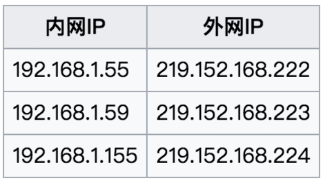
  

####2、NAPT

  
端口多路复用技术。与静态NAT的差别是，NAPT不但要转换IP地址，还要进行传输层的端口转换。具体的表现形式就是，对外只有一个公网IP，通过端口来区别不同私有IP主机的数据。  
  
**再举个栗子：**  

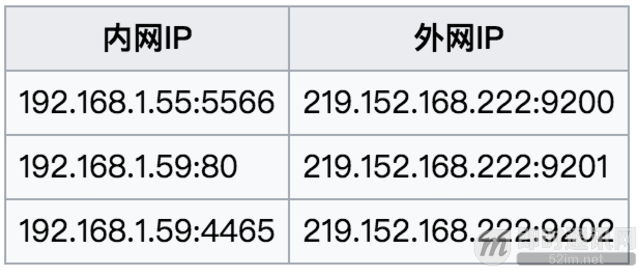

  
通过上面NAT实现方式的介绍，我们其实不难看出，现实环境中NAPT的应用显然是更广泛的。因此下面就重点介绍下NAPT的主要类型有哪些。  

###5、NAT的主要类型

  
对于NAPT我们主要分为两大类：锥型NAT和对称型NAT。其中锥型NAT又分：完全锥型，受限锥型和端口受限锥型。  
  
概括的说：对称型NAT是一个请求对应一个端口；锥型NAT（非对称NAT）是多个请求（外部发向内部）对应一个端口，只要源IP端口不变，无论发往的目的IP是否相同，在NAT上都映射为同一个端口，形象的看起来就像锥子一样。  
  
下面分别介绍这四种类型及其差异。  
  

####1、完全锥型NAT（Full Cone NAT，后面简称FC）

  
**特点：**IP和端口都不受限。  
  
**表现形式：**将来自内部同一个IP地址同一个端口号（IP_IN_A : PORT_IN_A）的主机监听/请求，映射到公网IP某个端口（IP_OUT_B : PORT_OUT_B）的监听。任意外部IP地址与端口对其自己公网的IP这个映射后的端口访问（IP_OUT_B : PORT_OUT_B），都将重新定位到内部这个主机（IP_IN_A : PORT_IN_A）。该技术中，基于C/S架构的应用可以在任何一端发起连接。是不是很绕啊。再简单一点的说，就是，只要客户端，由内到外建立一个映射（NatIP:NatPort -> A1）之后，其他IP的主机B或端口A2都可以使用这个洞给客户端发送数据。见下图（图片来自网络）。  
  
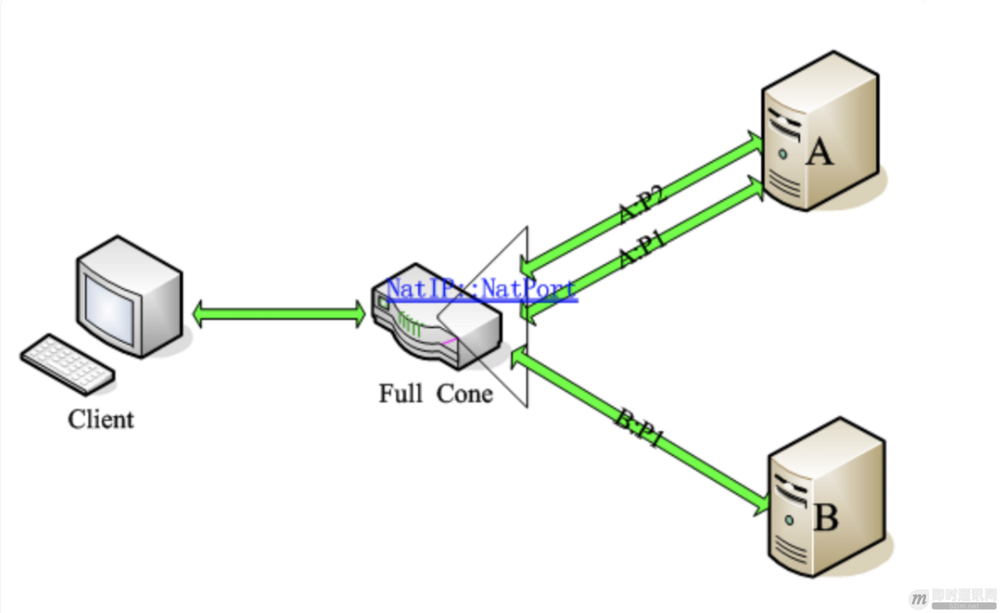
  

####2、受限锥型NAT（Restricted Cone NAT）

  
**特点：**IP受限，端口不受限。  
  
**表现形式：**与完全锥形NAT不同的是，在公网映射端口后，并不允许所有IP进行对于该端口的访问，要想通信必需内部主机对某个外部IP主机发起过连接，然后这个外部IP主机就可以与该内部主机通信了，但端口不做限制。举个栗子。当客户端由内到外建立映射(NatIP:NatPort –> A1)，A机器可以使用他的其他端口（P2）主动连接客户端，但B机器则不被允许。因为IP受限啦，但是端口随便。见下图（绿色是允许通信，红色是禁止通信）。  
  
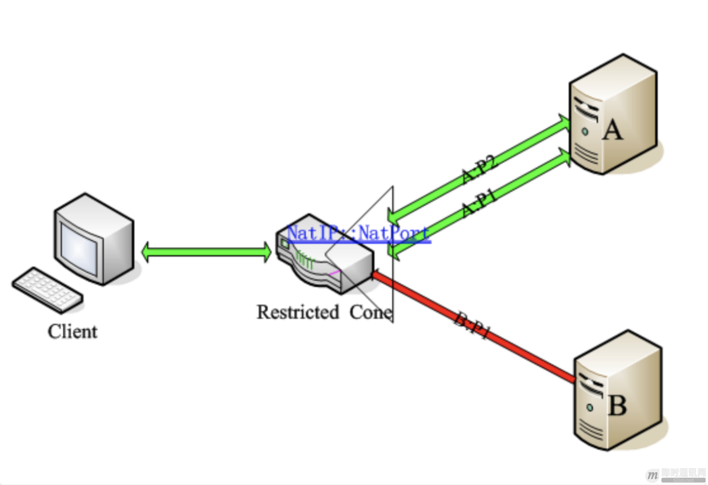

####3、端口受限型NAT（Port Restricted Cone NAT）

  
**特点：**IP和端口都受限。  
  
**表现形式：**该技术与受限锥形NAT相比更为严格。除具有受限锥形NAT特性，对于回复主机的端口也有要求。也就是说：只有当内部主机曾经发送过报文给外部主机（假设其IP地址为A且端口为P1）之后，外部主机才能以公网IP ORT中的信息作为目标地址和目标端口，向内部主机发送UDP报文，同时，其请求报文的IP必须是A，端口必须为P1（使用IP地址为A，端口为P2，或者IP地址为B，端口为P1都将通信失败）。例子见下图。这一要求进一步强化了对外部报文请求来源的限制，从而较Restrictd Cone更具安全性。  
  
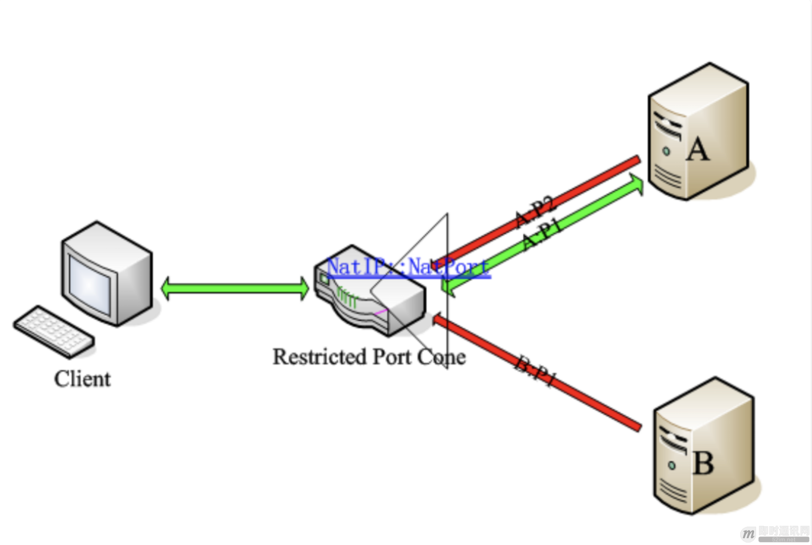
  

####4、对称型NAT（Symmetric NAT）

  
**特点：**对每个外部主机或端口的会话都会映射为不同的端口（洞）。  
  
**表现形式：**只有来自同一内部IP ORT、且针对同一目标IP ORT的请求才被NAT转换至同一个公网（外部）IP ORT，否则的话，NAT将为之分配一个新的外部（公网）IP ORT。并且，只有曾经收到过内部主机请求的外部主机才能向内部主机发送数据包。内部主机用同一IP与同一端口与外部多IP通信。客户端想和服务器A（IP_A ORT_A）建立连接，是通过NAT映射为NatIP:NatPortA来进行的。而客户端和服务器B（IP_B ORT_B）建立连接，是通过NAT映射为NatIP:NatPortB来进行的。即同一个客户端和不同的目标IP:PORT通信，经过NAT映射后的公网IP:PORT是不同的。此时，如果B想要和客户端通信，也只能通过NatIP:NatPortB（也就是紫色的洞洞）来进行，而不能通过NatIP:NatPortA（也就是黄色的洞洞）。  
  
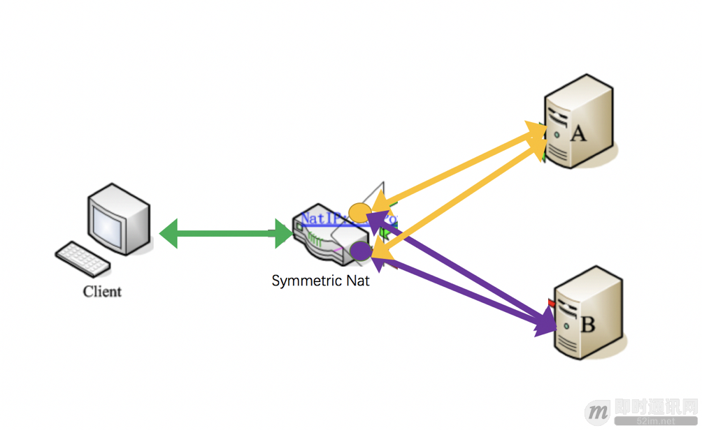

####5、小结
  
以上，就是NAPT的四种NAT类型。可以看出从类型1至类型4，NAT的限制是越来越大的。  

###6、NAT路由类型判断
  
根据上面的介绍，我们可以了解到，在实际的网络情况中，各个设备所处的网络环境是不同的。那么，如果这些设备想要进行通信，首先判断出设备所处的网络类型就是非常重要的一步。  
  
**举个例子来说：**对于IM中的实时音视频功能和VoIP软件，对位于不同NAT内部的主机通信需要靠服务器来转发完成，这样就会增加服务器的负担。为了解决这种问题，要尽量使位于不同NAT内部的主机建立直接通信，其中，最重要的一点就是要判断出NAT的类型，然后才能根据NAT的类型，设计出直接通信方案。不然的话，两个都在NAT的终端怎么通信呢？我们不知道对方的内网IP，即使把消息发到对方的网关，然后呢？网关怎么知道这条消息给谁，而且谁允许网关这么做了？  
  
为了解决这个问题，也就是处于内网的主机之间能够穿越它们之间的NAT建立直接通信，已经提出了许多方法，STUN（Session Traversal Utilities for NAT，NAT会话穿越应用程序）技术就是其中比较重要的一种解决方法，并得到了广泛的应用。在这个部分，我们将重点介绍下STUN技术的原理。（PS：除此之外，还有UPNP技术，ALG应用层网关识别技术，SBC会话边界控制，ICE交互式连接建立，TURN中继NAT穿越技术等等，本文不一一做介绍。）  

###7、STUN协议介绍

####1、STUN基本介绍

  
STUN是一种网络协议，它允许位于NAT（或多重NAT）后的客户端找出自己的公网地址，查出自己位于哪种类型的NAT之后以及NAT为某一个本地端口所绑定的Internet端端口。这些信息被用来在两个同时处于NAT路由器之后的主机之间建立UDP通信。该协议由[RFC 5389](https://tools.ietf.org/html/rfc5389)定义。  
  
**STUN由三部分组成：**  
  

  * STUN客户端；
  * STUN服务器端；
  * NAT路由器。  

  
STUN服务端部署在一台有着两个公网IP的服务器上，大概的结构参考下图。STUN客户端通过向服务器端发送不同的消息类型，根据服务器端不同的响应来做出相应的判断，一旦客户端得知了Internet端的UDP端口，通信就可以开始了。  
  
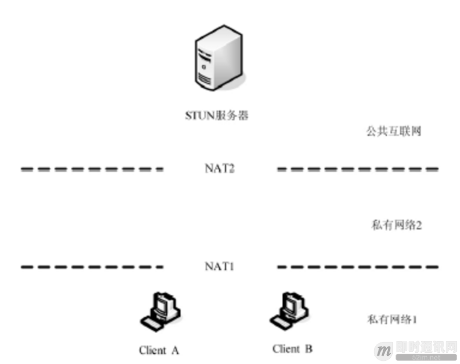

####2、STUN的检测过程

  
**STUN协议定义了三类测试过程来检测NAT类型：**  
  

  * **Test1：**STUN Client通过端口{IP-C1:Port-C1}向STUN Server{IP-S1:Port-S1}发送一个Binding Request（没有设置任何属性）。STUN Server收到该请求后，通过端口{IP-S1:Port-S1}把它所看到的STUN Client的IP和端口{IP-M1,Port-M1}作为Binding Response的内容回送给STUN Client。
  * **Test1#2：**STUN Client通过端口{IP-C1:Port-C1}向STUN Server{IP-S2:Port-S2}发送一个Binding Request（没有设置任何属性）。STUN Server收到该请求后，通过端口{IP-S2:Port-S2}把它所看到的STUN Client的IP和端口{IP-M1#2,Port-M1#2}作为Binding Response的内容回送给STUN Client。
  * **Test2：**STUN Client通过端口{IP-C1:Port-C1}向STUN Server{IP-S1:Port-S1}发送一个Binding Request（设置了Change IP和Change Port属性）。STUN Server收到该请求后，通过端口{IP-S2:Port-S2}把它所看到的STUN Client的IP和端口{IP-M2,Port-M2}作为Binding Response的内容回送给STUN Client。
  * **Test3：**STUN Client通过端口{IP-C1:Port-C1}向STUN Server{IP-S1:Port-S1}发送一个Binding Request（设置了Change Port属性）。STUN Server收到该请求后，通过端口{IP-S1:Port-S2}把它所看到的STUN Client的IP和端口{IP-M3,Port-M3}作为Binding Response的内容回送给STUN Client。  

  
**STUN协议的输出是：**  
  

  * 1）公网IP和Port；
  * 2）防火墙是否设置；
  * 3）客户端是否在NAT之后，及所处的NAT的类型。  

  
**因此我们进而整理出，通过STUN协议，我们可以检测的类型一共有以下七种：**  
  

  * A：公开的互联网IP：主机拥有公网IP，并且没有防火墙，可自由与外部通信；
  * B：完全锥形NAT；
  * C：受限制锥形NAT；
  * D：端口受限制形NAT；
  * E：对称型UDP防火墙：主机出口处没有NAT设备,但有防火墙,且防火墙规则如下：从主机UDP端口A发出的数据包保持源地址，但只有从之前该主机发出包的目的IP/PORT发出到该主机端口A的包才能通过防火墙；
  * F：对称型NAT；
  * G：防火墙限制UDP通信。  

  

####3、STUN协议的判断过程

  
输入和输出准备好后，附上一张维基百科的流程图，就可以描述STUN协议的判断过程了。  
  
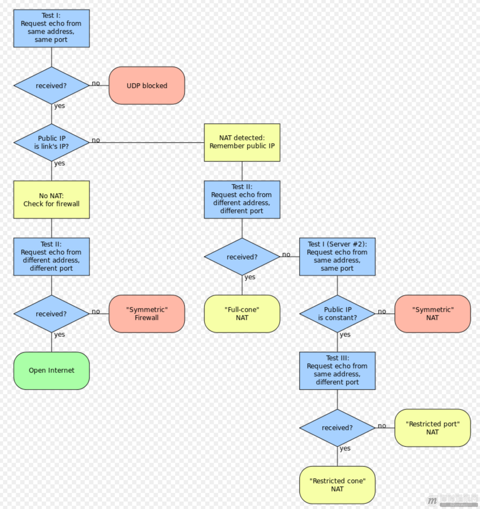

  
**STEP1：**检测客户端是否有能力进行UDP通信以及客户端是否位于NAT后 -- Test1  
客户端建立UDP socket，然后用这个socket向服务器的（IP-1，Port-1）发送数据包要求服务器返回客户端的IP和Port，客户端发送请求后立即开始接受数据包。重复几次。  

  * a）如果每次都超时收不到服务器的响应，则说明客户端无法进行UDP通信，可能是：G防火墙阻止UDP通信；
  * b）如果能收到回应，则把服务器返回的客户端的（IP:PORT）同（Local IP: Local Port）比较：  
  \- 如果完全相同则客户端不在NAT后，这样的客户端是：A具有公网IP可以直接监听UDP端口接收数据进行通信或者E。  
  \- 否则客户端在NAT后要做进一步的NAT类型检测（继续）。  

  
**STEP2：**检测客户端防火墙类型 -- Test2  
STUN客户端向STUN服务器发送请求，要求服务器从其他IP和PORT向客户端回复包：  

  * a）收不到服务器从其他IP地址的回复，认为包前被前置防火墙阻断，网络类型为E；
  * b）收到则认为客户端处在一个开放的网络上，网络类型为A。  

  
**STEP3：**检测客户端NAT是否是FULL CONE NAT -- Test2  
客户端建立UDP socket然后用这个socket向服务器的(IP-1,Port-1)发送数据包要求服务器用另一对(IP-2,Port-2)响应客户端的请求往回发一个数据包，客户端发送请求后立即开始接受数据包。 重复这个过程若干次。  

  * a）如果每次都超时，无法接受到服务器的回应，则说明客户端的NAT不是一个Full Cone NAT，具体类型有待下一步检测（继续）；
  * b）如果能够接受到服务器从(IP-2,Port-2)返回的应答UDP包，则说明客户端是一个Full Cone NAT，这样的客户端能够进行UDP-P2P通信。  

  
**STEP4：**检测客户端NAT是否是SYMMETRIC NAT -- Test1#2  

  * 客户端建立UDP socket然后用这个socket向服务器的(IP-1,Port-1)发送数据包要求服务器返回客户端的IP和Port, 客户端发送请求后立即开始接受数据包。 重复这个过程直到收到回应（一定能够收到，因为第一步保证了这个客户端可以进行UDP通信）。
  * 用同样的方法用一个socket向服务器的(IP-2,Port-2)发送数据包要求服务器返回客户端的IP和Port。
  * 比较上面两个过程从服务器返回的客户端(IP,Port),如果两个过程返回的(IP,Port)有一对不同则说明客户端为Symmetric NAT，这样的客户端无法进行UDP-P2P通信（检测停止）因为对称型NAT，每次连接端口都不一样，所以无法知道对称NAT的客户端，下一次会用什么端口。否则是Restricted Cone NAT，是否为Port Restricted Cone NAT有待检测（继续）。  

  
**STEP5：**检测客户端NAT是Restricted Cone 还是 Port Restricted Cone -- Test3  
客户端建立UDP socket然后用这个socket向服务器的(IP-1,Port-1)发送数据包要求服务器用IP-1和一个不同于Port-1的端口发送一个UDP 数据包响应客户端, 客户端发送请求后立即开始接受数据包。重复这个过程若干次。如果每次都超时，无法接受到服务器的回应，则说明客户端是一个Port Restricted Cone NAT，如果能够收到服务器的响应则说明客户端是一个Restricted Cone NAT。以上两种NAT都可以进行UDP-P2P通信。  
  
通过以上过程，至此，就可以分析和判断出客户端是否处于NAT之后，以及NAT的类型及其公网IP，以及判断客户端是否具备P2P通信的能力了。  
  
（原文链接：<https://www.qcloud.com/community/article/847315>）  

###8、更多网络编程资料

  
《[TCP/IP详解](http://www.52im.net/topic-tcpipvol1.html) \-
[第11章·UDP：用户数据报协议](http://docs.52im.net/extend/docs/book/tcpip/vol1/11/)》  
《[TCP/IP详解](http://www.52im.net/topic-tcpipvol1.html) \-
[第17章·TCP：传输控制协议](http://docs.52im.net/extend/docs/book/tcpip/vol1/17/)》  
《[TCP/IP详解](http://www.52im.net/topic-tcpipvol1.html) \-
[第18章·TCP连接的建立与终止](http://docs.52im.net/extend/docs/book/tcpip/vol1/18/)》  
《[TCP/IP详解](http://www.52im.net/topic-tcpipvol1.html) \-
[第21章·TCP的超时与重传](http://docs.52im.net/extend/docs/book/tcpip/vol1/21/)》  

 
####
原文出处：<a href='http://www.52im.net/thread-50-1-1.html' target='blank'>P2P技术详解(一)：NAT详解——详细原理、P2P简介</a>

这是一篇介绍NAT技术要点的精华文章，来自华3通信官方资料库，文中对NAT技术原理的介绍很全面也很权威，对网络应用的应用层开发人员而言有很高的参考价值。

###1. IPv4协议和NAT的由来

  
今天，无数快乐的互联网用户在尽情享受Internet带来的乐趣。他们浏览新闻，搜索资料，下载软件，广交新朋，分享信息，甚至于足不出户获取一切日用所需。企业利用互联网发布信息，传递资料和订单，提供技术支持，完成日常办公。然而，Internet在给亿万用户带来便利的同时，自身却面临一个致命的问题：构建这个无所不能的Internet的基础IPv4协议已经不能再提供新的网络地址了。  
  
2011年2月3日中国农历新年， IANA对外宣布：IPv4地址空间最后5个地址块已经被分配给下属的5个地区委员会。2011年4月15日，亚太区委员会APN IC对外宣布，除了个别保留地址外，本区域所有的IPv4地址基本耗尽。一时之间，IPv4地址作为一种濒危资源身价陡增，各大网络公司出巨资收购剩余的空闲地址。其实，IPv4地址不足问题已不是新问题，早在20年以前，IPv4地址即将耗尽的问题就已经摆在Internet先驱们面前。这不禁让我们想去了解，是什么技术使这一危机延缓了尽20年。  
  
要找到问题的答案，让我们先来简略回顾一下IPv4协议。  
  
IPv4即网际网协议第4版——Internet Protocol Version 4的缩写。IPv4定义一个跨越异种网络互连的超级网，它为每个网际网的节点分配全球唯一IP地址。如果我们把Internet比作一个邮政系统，那么IP地址的作用就等同于包含城市、街区、门牌编号在内的完整地址。IPv4使用32bits整数表达一个地址，地址最大范围就是232 约为43亿。以IP创始时期可被联网的设备来看，这样的一个空间已经很大，很难被短时间用完。然而，事实远远超出人们的设想，计算机网络在此后的几十年里迅速壮大，网络终端数量呈爆炸性增长。  
  
更为糟糕的是，为了路由和管理方便，43亿的地址空间被按照不同前缀长度划分为A,B,C,D类地址网络和保留地址。其中，A类网络地址127段，每段包括主机地址约1678万个。B类网络地址16384段，每段包括65536个主机地址。  
  
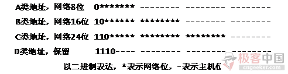
  
IANA向超大型企业/组织分配A类网络地址，一次一段。向中型企业或教育机构分配B类网络地址，一次一段。这样一种分配策略使得IP地址浪费很严重，很多被分配出去的地址没有真实被利用，地址消耗很快。以至于二十世纪90年代初，网络专家们意识到，这样大手大脚下去，IPv4地址很快就要耗光了。于是，人们开始考虑IPv4的替代方案，同时采取一系列的措施来减缓IPv4地址的消耗。正是在这样一个背景之下，本期的主角闪亮登场，它就是网络地址转换——NAT。  
  
NAT是一项神奇的技术，说它神奇在于它的出现几乎使IPv4起死回生。在IPv4已经被认为行将结束历史使命之后近20年时间里，人们几乎忘了IPv4的地址空间即将耗尽这样一个事实——在新技术日新月异的时代，20年可算一段漫长的历史。更不用说，在NAT产生以后，网络终端的数量呈加速上升趋势，对IP地址的需求剧烈增加。此足见NAT技术之成功，影响之深远。  
  
说它神奇，更因为NAT给IP网络模型带来了深远影响，其身影遍布网络每个角落。根据一份最近的研究报告，70%的P2P用户位于NAT网关以内。因为P2P主要运行在终端用户的个人电脑之上，这个数字意味着大多数PC通过NAT网关连接到Internet。如果加上2G和3G方式联网的智能手机等移动终端，在NAT网关之后的用户远远超过这个比例。  
  
然而当我们求本溯源时却发现一个很奇怪的事实：NAT这一意义重大的技术，竟然没有公认的发明者。NAT第一个版本的RFC作者，只是整理归纳了已被广泛采用的技术。  

###2. NAT的工作模型和特点

####2.1 NAT的概念模型

  
NAT名字很准确，网络地址转换，就是替换IP报文头部的地址信息。NAT通常部署在一个组织的网络出口位置，通过将内部网络IP地址替换为出口的IP地址提供公网可达性和上层协议的连接能力。那么，什么是内部网络IP地址？  
  
RFC1918规定了三个保留地址段落：10.0.0.0-10.255.255.255；172.16.0.0-172.31.255.255；192.168.0.0-192.168.255.255。这三个范围分别处于A,B,C类的地址段，不向特定的用户分配，被IANA作为私有地址保留。这些地址可以在任何组织或企业内部使用，和其他Internet地址的区别就是，仅能在内部使用，不能作为全球路由地址。这就是说，出了组织的管理范围这些地址就不再有意义，无论是作为源地址，还是目的地址。对于一个封闭的组织，如果其网络不连接到Internet，就可以使用这些地址而不用向IANA提出申请，而在内部的路由管理和报文传递方式与其他网络没有差异。  
  
对于有Internet访问需求而内部又使用私有地址的网络，就要在组织的出口位置部署NAT网关，在报文离开私网进入Internet时，将源IP替换为公网地址，通常是出口设备的接口地址。一个对外的访问请求在到达目标以后，表现为由本组织出口设备发起，因此被请求的服务端可将响应由Internet发回出口网关。出口网关再将目的地址替换为私网的源主机地址，发回内部。这样一次由私网主机向公网服务端的请求和响应就在通信两端均无感知的情况下完成了。依据这种模型，数量庞大的内网主机就不再需要公有IP地址了。  
  
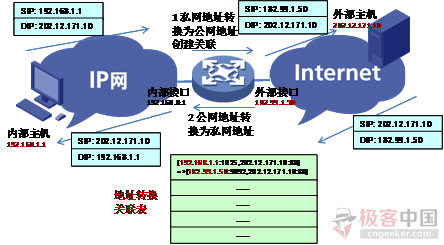
  
**虽然实际过程远比这个复杂，但上面的描述概括了NAT处理报文的几个关键特点：**  

1. 网络被分为私网和公网两个部分，NAT网关设置在私网到公网的路由出口位置，双向流量必须都要经过NAT网关；  
2. 网络访问只能先由私网侧发起，公网无法主动访问私网主机；  
3. NAT网关在两个访问方向上完成两次地址的转换或翻译，出方向做源信息替换，入方向做目的信息替换；  
4. NAT网关的存在对通信双方是保持透明的；  
5. NAT网关为了实现双向翻译的功能，需要维护一张关联表，把会话的信息保存下来。

  
随着后面对NAT的深入描述，读者会发现，这些特点是鲜明的，但又不是绝对的。其中第二个特点打破了IP协议架构中所有节点在通讯中的对等地位，这是NAT最大的弊端，为对等通讯带来了诸多问题，当然相应的克服手段也应运而生。事实上，第四点是NAT致力于达到的目标，但在很多情况下，NAT并没有做到，因为除了IP首部，上层通信协议经常在内部携带IP地址信息。这些我们稍后解释。  

####2.2 一对一的NAT

  
如果一个内部主机唯一占用一个公网IP，这种方式被称为一对一模型。此种方式下，转换上层协议就是不必要的，因为一个公网IP就能唯一对应一个内部主机。显然，这种方式对节约公网IP没有太大意义，主要是为了实现一些特殊的组网需求。比如用户希望隐藏内部主机的真实IP，或者实现两个IP地址重叠网络的通信。  

####2.3 一对多的NAT

  
NAT最典型的应用场景就如同图2描述的，一个组织网络，在出口位置部署NAT网关，所有对公网的访问表现为一台主机。这就是所谓的一对多模型。这种方式下，出口设备只占用一个由Internet服务提供商分配的公网IP地址。面对私网内部数量庞大的主机，如果NAT只进行IP地址的简单替换，就会产生一个问题：当有多个内部主机去访问同一个服务器时，从返回的信息不足以区分响应应该转发到哪个内部主机。此时，需要NAT设备根据传输层信息或其他上层协议去区分不同的会话，并且可能要对上层协议的标识进行转换，比如TCP或UDP端口号。这样NAT网关就可以将不同的内部连接访问映射到同一公网IP的不同传输层端口，通过这种方式实现公网IP的复用和解复用。这种方式也被称为端口转换PAT、NAPT或IP伪装，但更多时候直接被称为NAT，因为它是最典型的一种应用模式。  

####2.4 按照NAT端口映射方式分类

  
在一对多模型中，按照端口转换的工作方式不同，又可以进行更进一步的划分。为描述方便，以下将IP和端口标记为(nAddr:nPort)，其中n代表主机或NAT网关的不同角色。  
  

  
**全锥形NAT**  

其特点为：一旦内部主机端口对(iAddr:iPort)被NAT网关映射到(eAddr:ePort)，所有后续的(iAddr:iPort)报文都会被转换为(eAddr:ePort)；任何一个外部主机发送到(eAddr:ePort)的报文将会被转换后发到(iAddr:iPort)。  
  
**限制锥形NAT**  

其特点为：一旦内部主机端口对(iAddr:iPort)被映射到(eAddr:ePort)，所有后续的(iAddr:iPort)报文都会被转换为(eAddr:ePort)；只有 (iAddr:iPort)向特定的外部主机hAddr发送过数据，主机hAddr从任意端口发送到(eAddr:ePort)的报文将会被转发到(iAddr:iPort)。  
  
**端口限制锥形NAT**  

其特点为：一旦内部主机端口对(iAddr:iPort)被映射到(eAddr:ePort)，所有后续的(iAddr:iPort)报文都会被转换为(eAddr:ePort)；只有(iAddr:iPort)向特定的外部主机端口对(hAddr:hPort)发送过数据，由(hAddr:hPort)发送到(eAddr:ePort)的报文将会被转发到(iAddr:iPort)。  
  
**对称型NAT**  

其特点为：NAT网关会把内部主机“地址端口对”和外部主机“地址端口对”完全相同的报文看作一个连接，在网关上创建一个公网“地址端口对”映射进行转换，只有收到报文的外部主机从对应的端口对发送回应的报文，才能被转换。即使内部主机使用之前用过的地址端口对去连接不同外部主机(或端口)时，NAT网关也会建立新的映射关系。  
  
事实上，这些术语的引入是很多混淆的起源。现实中的很多NAT设备是将这些转换方式混合在一起工作的，而不单单使用一种，所以这些术语只适合描述一种工作方式，而不是一个设备。比如，很多NAT设备对内部发出的连接使用对称型NAT方式，而同时支持静态的端口映射，后者可以被看作是全锥型NAT方式。而有些情况下，NAT设备的一个公网地址和端口可以同时映射到内部几个服务器上以实现负载分担，比如一个对外提供WEB服务器的站点可能是有成百上千个服务器在提供HTTP服务，但是对外却表现为一个或少数几个IP地址。  

###3. NAT的限制与解决方案

####3.1 IP端到端服务模型

  
IP协议的一个重要贡献是把世界变得平等。在理论上，具有IP地址的每个站点在协议层面有相当的获取服务和提供服务的能力，不同的IP地址之间没有差异。人们熟知的服务器和客户机实际是在应用协议层上的角色区分，而在网络层和传输层没有差异。一个具有IP地址的主机既可以是客户机，也可以是服务器，大部分情况下，既是客户机，也是服务器。端到端对等看起来是很平常的事情，而意义并不寻常。但在以往的技术中，很多协议体系下的网络限定了终端的能力。正是IP的这个开放性，使得TCP/IP协议族可以提供丰富的功能，为应用实现提供了广阔平台。因为所有的IP主机都可以服务器的形式出现，所以通讯设计可以更加灵活。使用UNIX/LINUX的系统充分利用了这个特性，使得任何一个主机都可以建立自己的HTTP、SMTP、POP3、DNS、DHCP等服务。与此同时，很多应用也是把客户端和服务器的角色组合起来完成功能。例如在VoIP应用中，用户端向注册服务器登录自己的IP地址和端口信息过程中，主机是客户端；而在呼叫到达时，呼叫处理服务器向用户端发送呼叫请求时，用户端实际工作在服务器模式下。在语音媒体流信道建立过程后，通讯双向发送语音数据，发送端是客户模式，接收端是服务器模式。而在P2P的应用中，一个用户的主机既为下载的客户，同时也向其他客户提供数据，是一种C/S混合的模型。上层应用之所以能这样设计，是因为IP协议栈定义了这样的能力。试想一下，如果IP提供的能力不对等，那么每个通信会话都只能是单方向发起的，这会极大限制通信的能力。细心的读者会发现，前面介绍NAT的一个特性正是这样一种限制。没错，NAT最大的弊端正在于此——破坏了IP端到端通信的能力。  

####3.2 NAT的弊端

  
NAT在解决IPv4地址短缺问题上，并非没有副作用，其实存在很多问题。  
  
首先，NAT使IP会话的保持时效变短。因为一个会话建立后会在NAT设备上建立一个关联表，在会话静默的这段时间，NAT网关会进行老化操作。这是任何一个NAT网关必须做的事情，因为IP和端口资源有限，通信的需求无限，所以必须在会话结束后回收资源。通常TCP会话通过协商的方式主动关闭连接，NAT网关可以跟踪这些报文，但总是存在例外的情况，要依赖自己的定时器去回收资源。而基于UDP的通信协议很难确定何时通信结束，所以NAT网关主要依赖超时机制回收外部端口。通过定时器老化回收会带来一个问题，如果应用需要维持连接的时间大于NAT网关的设置，通信就会意外中断。因为网关回收相关转换表资源以后，新的数据到达时就找不到相关的转换信息，必须建立新的连接。当这个新数据是由公网侧向私网侧发送时，就会发生无法触发新连接建立，也不能通知到私网侧的主机去重建连接的情况。这时候通信就会中断，不能自动恢复。即使新数据是从私网侧发向公网侧，因为重建的会话表往往使用不同于之前的公网IP和端口地址，公网侧主机也无法对应到之前的通信上，导致用户可感知的连接中断。NAT网关要把回收空闲连接的时间设置到不发生持续的资源流失，又维持大部分连接不被意外中断，是一件比较有难度的事情。在NAT已经普及化的时代，很多应用协议的设计者已经考虑到了这种情况，所以一般会设置一个连接保活的机制，即在一段时间没有数据需要发送时，主动发送一个NAT能感知到而又没有实际数据的保活消息，这么做的主要目的就是重置NAT的会话定时器。  
  
其次，NAT在实现上将多个内部主机发出的连接复用到一个IP上，这就使依赖IP进行主机跟踪的机制都失效了。如网络管理中需要的基于网络流量分析的应用无法跟踪到终端用户与流量的具体行为的关系。基于用户行为的日志分析也变得困难，因为一个IP被很多用户共享，如果存在恶意的用户行为，很难定位到发起连接的那个主机。即便有一些机制提供了在NAT网关上进行连接跟踪的方法，但是把这种变换关系接续起来也困难重重。基于IP的用户授权不再可靠，因为拥有一个IP的不等于一个用户或主机。一个服务器也不能简单把同一IP的访问视作同一主机发起的，不能进行关联。有些服务器设置有连接限制，同一时刻只接纳来自一个IP的有限访问(有时是仅一个访问)，这会造成不同用户之间的服务抢占和排队。有时服务器端这样做是出于DOS攻击防护的考虑，因为一个用户正常情况下不应该建立大量的连接请求，过度使用服务资源被理解为攻击行为。但是这在NAT存在时不能简单按照连接数判断。总之，因为NAT隐蔽了通信的一端，把简单的事情复杂化了。  
  
我们来深入理解NAT一下对IP端到端模型的破坏力。NAT通过修改IP首部的信息变换通信的地址。但是在这个转换过程中只能基于一个会话单位。当一个应用需要保持多个双向连接时，麻烦就很大。NAT不能理解多个会话之间的关联性，无法保证转换符合应用需要的规则。当NAT网关拥有多个公有IP地址时，一组关联会话可能被分配到不同的公网地址，这通常是服务器端无法接受的。更为严重的是，当公网侧的主机要主动向私网侧发送数据时，NAT网关没有转换这个连接需要的关联表，这个数据包无法到达私网侧的主机。这些反方向发送数据的连接总有应用协议的约定或在初始建立的会话中进行过协商。但是因为NAT工作在网络层和传输层，无法理解应用层协议的行为，对这些信息是无知的。NAT希望自己对通信双方是透明的，但是在这些情况下这是一种奢望。  
  

  
此外，NAT工作机制依赖于修改IP包头的信息，这会妨碍一些安全协议的工作。因为NAT篡改了IP地址、传输层端口号和校验和，这会导致认证协议彻底不能工作，因为认证目的就是要保证这些信息在传输过程中没有变化。对于一些隧道协议，NAT的存在也导致了额外的问题，因为隧道协议通常用外层地址标识隧道实体，穿过NAT的隧道会有IP复用关系，在另一端需要小心处理。ICMP是一种网络控制协议，它的工作原理也是在两个主机之间传递差错和控制消息，因为IP的对应关系被重新映射，ICMP也要进行复用和解复用处理，很多情况下因为ICMP报文载荷无法提供足够的信息，解复用会失败。IP分片机制是在信息源端或网络路径上，需要发送的IP报文尺寸大于路径实际能承载最大尺寸时，IP协议层会将一个报文分成多个片断发送，然后在接收端重组这些片断恢复原始报文。IP这样的分片机制会导致传输层的信息只包括在第一个分片中，NAT难以识别后续分片与关联表的对应关系，因此需要特殊处理。  

####3.3 NAT穿越技术

前面解释了NAT的弊端，为了解决IP端到端应用在NAT环境下遇到的问题，网络协议的设计者们创造了各种武器来进行应对。但遗憾的是，这里每一种方法都不完美，还需要在内部主机、应用程序或者NAT网关上增加额外的处理。  
  
**应用层网关** 
 
应用层网关(ALG)是解决NAT对应用层协议无感知的一个最常用方法，已经被NAT设备厂商广泛采用，成为NAT设备的一个必需功能。因为NAT不感知应用协议，所以有必要额外为每个应用协议定制协议分析功能，这样NAT网关就能理解并支持特定的协议。ALG与NAT形成互动关系，在一个NAT网关检测到新的连接请求时，需要判断是否为已知的应用类型，这通常是基于连接的传输层端口信息来识别的。在识别为已知应用时，再调用相应功能对报文的深层内容进行检查，当发现任何形式表达的IP地址和端口时，将会把这些信息同步转换，并且为这个新连接创建一个附加的转换表项。这样，当报文到达公网侧的目的主机时，应用层协议中携带的信息就是NAT网关提供的地址和端口。一旦公网侧主机开始发送数据或建立连接到此端口，NAT网关就可以根据关联表信息进行转换，再把数据转发到私网侧的主机。很多应用层协议实现不限于一个初始连接(通常为信令或控制通道)加一个数据连接，可能是一个初始连接对应很多后续的新连接。比较特别的协议，在一次协商中会产生一组相关连接，比如RTP/RTCP协议规定，一个RTP通道建立后占用连续的两个端口，一个服务于数据，另一个服务于控制消息。此时，就需要ALG分配连续的端口为应用服务。ALG能成功解决大部分协议的NAT穿越需求，但是这个方法也有很大的限制。因为应用协议的数量非常多而且在不断发展变化之中，添加到设备中的ALG功能都是为特定协议的特定规范版本而开发的，协议的创新和演进要求NAT设备制造商必须跟踪这些协议的最近标准，同时兼容旧标准。尽管有如Linux这种开放平台允许动态加载新的ALG特性，但是管理成本仍然很高，网
络维护人员也不能随时了解用户都需要什么应用。因此为每个应用协议开发ALG代码并跟踪最新标准是不可行的，ALG只能解决用户最常用的需求。此外，出于安全性需要，有些应用类型报文从源端发出就已经加密，这种报文在网络中间无法进行分析，所以ALG无能为力。  
  
**探针技术STUN和TURN**  

所谓探针技术，是通过在所有参与通信的实体上安装探测插件，以检测网络中是否存在NAT网关，并对不同NAT模型实施不同穿越方法的一种技术。STUN服务器被部署在公网上，用于接收来自通信实体的探测请求，服务器会记录收到请求的报文地址和端口，并填写到回送的响应报文中。客户端根据接收到的响应消息中记录的地址和端口与本地选择的地址和端口进行比较，就能识别出是否存在NAT网关。如果存在NAT网关，客户端会使用之前的地址和端口向服务器的另外一个IP发起请求，重复前面的探测。然后再比较两次响应返回的结果判断出NAT工作的模式。由前述的一对多转换模型得知，除对称型NAT以外的模型，NAT网关对内部主机地址端口的映射都是相对固定的，所以比较容易实现NAT穿越。而对称型NAT为每个连接提供一个映射，使得转换后的公网地址和端口对不可预测。此时TURN可以与STUN绑定提供穿越NAT的服务，即在公网服务器上提供一个“地址端口对”，所有此“地址端口对”接收到的数据会经由探测建立的连接转发到内网主机上。TURN分配的这个映射“地址端口对”会通过STUN响应发给内部主机，后者将此信息放入建立连接的信令中通知通信的对端。这种探针技术是一种通用方法，不用在NAT设备上为每种应用协议开发功能，相对于ALG方式有一定普遍性。但是TURN中继服务会成为通信瓶颈。而且在客户端中增加探针功能要求每个应用都要增加代码才能支持。  
  
**中间件技术**  

这也是一种通过开发通用方法解决NAT穿越问题的努力。与前者不同之处是，NAT网关是这一解决方案的参与者。与ALG的不同在于，客户端会参与网关公网映射信息的维护，此时NAT网关只要理解客户端的请求并按照要求去分配转换表，不需要自己去分析客户端的应用层数据。其中UPnP就是这样一种方法。UPnP中文全称为通用即插即用，是一个通用的网络终端与网关的通信协议，具备信息发布和管理控制的能力。其中，网关映射请求可以为客户动态添加映射表项。此时，NAT不再需要理解应用层携带的信息，只转换IP地址和端口信息。而客户端通过控制消息或信令发到公网侧的信息中，直接携带公网映射的IP地址和端口，接收端可以按照此信息建立数据连接。NAT网关在收到数据或连接请求时，按照UPnP建立的表项只转换地址和端口信息，不关心内容，再将数据转发到内网。这种方案需要网关、内部主机和应用程序都支持UPnP技术，且组网允许内部主机和NAT网关之间可以直接交换UPnP信令才能实施。  
  
**中继代理技术**  

准确说它不是NAT穿越技术，而是NAT旁路技术。简单说，就是在NAT网关所在的位置旁边放置一个应用服务器，这个服务器在内部网络和外部公网分别有自己的网络连接。客户端特定的应用产生网络请求时，将定向发送到应用代理服务器。应用代理服务器根据代理协议解析客户端的请求，再从服务器的公网侧发起一个新的请求，把客户端请求的内容中继到外部网络上，返回的相应反方向中继。这项技术和ALG有很大的相似性，它要求为每个应用类型部署中继代理业务，中间服务器要理解这些请求。  
  
**特定协议的自穿越技术**  

在所有方法中最复杂也最可靠的就是自己解决自己的问题。比如IKE和IPsec技术，在设计时就考虑了到如何穿越NAT的问题。因为这个协议是一个自加密的协议并且具有报文防修改的鉴别能力，其他通用方法爱莫能助。因为实际应用的NAT网关基本都是NAPT方式，所有通过传输层协议承载的报文可以顺利通过NAT。IKE和IPsec采用的方案就是用UDP在报文外面再加一层封装，而内部的报文就不再受到影响。IKE中还专门增加了NAT网关是否存在的检查能力以及绕开NAT网关检测IKE协议的方法。  

###4. NAT的应用和实现

####4.1 NAT的应用
  
NAT在当代Internet中被广泛采用，小至家庭网关，大到企业广域网出口甚至运营商业务网络出口。其实NAT在用户身边随处可见，一般家庭宽带接入的ADSL Modem和SOHO路由器都内置了NAT功能，WindowsXP支持网络连接共享，一个用户连接到公网可能会经过多层NAT而对此一无所知。很多企业也为节约IP费用采用NAT接入Internet，但是相比家庭用户有更复杂的需求。  
  
**NAT多实例应用**  

在VPN网络中，多实例路由意味着一个物理拓扑上承载多个逻辑拓扑，网络终端被分配到相互隔离的逻辑拓扑中，彼此之间没有路由的通路。但在访问Internet或者一些关键服务器资源时，被隔离的网络之间又存在共享资源的需求。NAT的多实例实现就是跨越这种逻辑拓扑的方法，把一个空间的网络地址映射到另一个空间。  
  
**NAT的高可靠性组网**  

提高网络可靠性是一个广泛的需求，NAT作为私网到公网的关键路径自然也需要高可靠性。当一个设备提供多个公网接口时，在多接口上部署NAT可以提供更高带宽和多ISP就近访问的能力。但是，当部署多个出口时，访问的流量可能会从不匹配的接口返回，这就要求NAT方案有良好的路由规划和部署合适的策略保证这种流量能够正确处理。在多个物理设备承担NAT功能时，不同设备之间的信息备份和流量分担也是一个组网难题。  
  
**同时转换源和目的地址的应用**  

前面我们介绍的所有NAT应用中，由内网向外网访问过程中，都是将源地址进行转换而目的地址保持不变，报文反方向进入时则处理目的地址。但有一些特殊应用需要在由内向外的IP通路上，替换目的IP地址。通常，这种应用会同时替换源地址和目的地址，在经过NAT网关以后完成两次地址转换。当两个均规划使用私属IP地址范围的网络进行合并时，终端用户都不想调整自己的IP地址方案，又希望开放一些网络资源给彼此访问。这时就可以通过NAT的两次地址转换来解决路由和地址规划无法解决的问题。  
  

####4.2 NAT的设备实现

  
NAT作为一个IP层业务特性，在产品实现中与防火墙、会话管理等特性有紧密联系，这是因为NAT判断一个进入设备的报文是否需要NAT处理，判断报文是否为一个新的连接，都需要通过匹配访问控制列表规则和查询会话关联表进行判断。为了满足不同应用场景的NAT需求，NAT的管理界面可提供用户多种配置策略。按照NAT的具体工作方式，又可以做如下分类。  
  
**静态一对一地址映射**  

这种工作方式下，NAT把一个私网地址和一个公网地址做静态关联，在从内而外的方向，将源IP匹配的私网IP替换为公网IP，反方向则将目的IP匹配公网IP的报文替换为私网IP。网络层以上的部分不进行替换处理，只修正校验和。  
  
**静态多对多地址映射**  

这种方式与上一种类似，只是把一段私网地址映射到一段公网地址。工作机制与前述的方式没有差别，只是简化配置工作量。  
  
**动态端口映射**  

这是最基本的工作方式，即前面多次介绍的将一段内网地址动态翻译为一个或多个公网IP，同时对传输层端口或其他上层协议信息进行转换，以实现IP复用。对由内而外的报文，替换源地址和端口，反向报文替换目的地址和端口。仅以连接公网的接口IP作为NAT转换的公网地址时，这种配置最简化，又被称为EasyIP。当以一段公网IP地址作为NAT转换地址时，需要配置一个地址池，NAT会自动在地址池中选择使用公网IP。  
  
**动态地址映射(no-pat)**  

这是介于静态多对多地址映射和动态端口映射方式之间的一种工作机制。当有一个私网向公网侧访问到达NAT网关时，NAT网关会检查这个私网IP是否已经有关联的公网IP映射。如果已经存在，则按照转换表直接替换IP，不修改上层协议。如果不存在关联表项，则在空闲的公网IP池中占用一个IP，并写入关联表中，以后按照这个关联关系进行地址转换。当这个私网主机发起的所有对外访问均关闭或超时后，回收公网IP。这种方式可以理解为一组内网主机抢占式地共享一个公网IP地址池。当公网IP地址池用完以后，新连接将无法建立。  
  
**静态端口映射**  

通过静态配置，把一个固定的私网IP地址和端口关联到一个公网地址和端口上。这种方式等同于前面介绍过的全锥模式，但是不需要内网主机首先发出报文。这种方式适用于在NAT网关上把一个知名服务（如HTTP）映射到一个内部主机上，也称为port forwarding。  
  
**应用层网关(ALG)**  

在所有NAT产品实现中，ALG是一个必需的功能组件。但在不同实现中，有些产品可以动态加载不同的ALG模块，有些产品可以提供ALG开关控制，有些则不提供任何用户接口。ALG解析上层应用协议的内容，并且根据需要修改IP和端口相关信息，创建和维护附加的关联表项。  
  
**NAT转换关联表**  

无论哪一种NAT工作方式，都要用到地址转换关联表，在不同产品的实现中，这个关联表的存储结构和在IP转发中调用的方式有很大不同。关联表中会记录源IP、目的IP、连接协议类型、传输层源端口、目的端口，以及转换后的源IP、源端口，目的IP、目的端口信息，这里的源和目的都是对应于从内网到外网的访问方向。依据NAT具体工作方式，这些信息可能全部填充，也可能部分填充。例如只按照IP做静态映射的方式，就不需要填入任何端口相关信息；对于静态端口映射，则只填入源相关的内容，而目的端的信息为空。  

###5. 后IPv4时代的NAT

NAT是为延缓IPv4地址耗尽而推出的技术。毫无疑问，它已经出色完成了自己的历史使命，IPv4比预期走得更远。作为继任者的IPv6吸取了IPv4的教训，被赋予充足地址空间的同时在各个方面做了优化——安全、高效、简洁。但是IPv6无法平滑地取代IPv4，导致IP升级步伐缓慢。尽管网络协议的分层设计很清晰，大量应用层协议和互联网软件中仍内嵌了IPv4地址的处理，要Internet全网升级到IPv6，必须先完成应用的改造。因为NAT和它的穿越技术结合能够满足大部分用户的需求，所以IPv6时代被不断推迟。  
  
随着IPv4地址的濒临耗尽，再经济的模式也无以为继，IPv4必须退出历史舞台。人们自然会认为，NAT作为IPv4的超级补丁技术使命已经完结。实际情况是，IPv4向IPv6过渡的阶段，NAT仍然是一项必不可少的技术手段。因为Internet无法在一日之内完成全网升级，必然是局部升级，逐渐替换。在两套协议并存的时期，用户和服务资源分布在不同网络之间，跨网访问的需求必须得到满足。这正是NAT所擅长的领域，地址替换，因此NAT-PT应运而生。由于IPv4和IPv6之间的差异，NAT要做的事比以往更复杂，有更多的限制和细节。  
  
此外，IETF也在制定纯IPv6网络使用的NAT规范。虽然人们还看不到这种应用的强烈需求，但是NAT仍有其独特的作用，比如隐藏内部网络的地址，实现重叠地址网络的合并等。  
  
毫不夸张地说，正是有了NAT，以IPv4为基础的Internet才能容纳数十亿的用户终端，成就今日之辉煌。IPv4已至日暮西山，IPv6的黎明尚未来临，Internet比任何时刻都更依赖NAT这项过渡技术。NAT的历史再次证明，翻天覆地的划时代进步不一定有市场，抱残守缺的修修补补未必不会成功。在世代更替之时让我们走近NAT，领略IP领域更多细微但不高深的知识，理解NAT就是理解变换万千的应用世界。  

 

####
原文出处：<a href='http://www.52im.net/thread-542-1-1.html' target='blank'>P2P技术详解(二)：P2P中的NAT穿越(打洞)方案详解</a>

###1、内容概述

  
P2P即点对点通信，或称为对等联网，与传统的服务器客户端模式（如下图“P2P结构模型”所示）有着明显的区别，在即时通讯方案中应用广泛（比如IM应用中的实时音视频通信、实时文件传输甚至文字聊天等）。  
  
P2P可以是一种通信模式、一种逻辑网络模型、一种技术、甚至一种理念。在P2P网络中（如右图所示），所有通信节点的地位都是对等的，每个节点都扮演着客户机和服务器双重角色，节点之间通过直接通信实现文件信息、处理器运算能力、存储空间等资源的共享。P2P网络具有分散性、可扩展性、健壮性等特点，这使得P2P技术在信息共享、即时通讯、协同工作、分布式计算、网络存储等领域都有广阔的应用。  
  
**图1 - 经典的CS模式：**                                                          
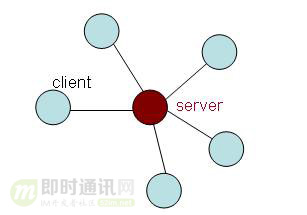

**图2 - P2P结构模型：**  
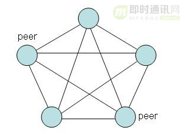
  
NAT技术和P2P技术作为经典的两项网络技术，在现在的网络上有着广泛的应用，P2P主机位于NAT网关后面的情况屡见不鲜。NAT技术虽然在一定程度上解决了IPv4地址短缺的问题，在构建防火墙、保证网络安全方面都发挥了一定的作用，却破坏了端到端的网络通信。NAT阻碍主机进行P2P通信的主要原因是NAT不允许外网主机主动访问内网主机，但是P2P技术却要求通信双方都能主动发起访问，所以要在NAT网络环境中进行有效的P2P通信，就必须采用新的解决方案。  
  
P2P作为一项实用的技术，有很大的优化空间，并且相对于网络设备，基于P2P的应用程序在实现上更为灵活。所以为了兼容NAT，基于P2P的应用程序在开发的时候大多会根据自身特点加入一些穿越NAT的功能以解决上述问题。以下着重介绍几种常见的P2P穿越NAT方案。  

###2、反向链接技术：一种特殊的P2P场景（通信双方中只有一方位于NAT设备之后）

  
此种情况是所有P2P场景中最简单的，它使用一种被称为“反向链接技术”来解决这个问题。大致的原理如下所述。  
  
如图3所示，客户端A位于NAT之后，它通过TCP端口1234连接到服务器的TCP端口1235上，NAT设备为这个连接重新分配了TCP端口62000。客户端B也通过TCP端口1234连接到服务器端口1235上。A和B从服务器处获知的对方的外网地址二元组{IP地址:端口号}分别为{138.76.29.7:1234}和{155.99.25.11:62000}，它们在各自的本地端口上进行侦听。  
  
由于B 拥有外网IP地址，所以A要发起与B的通信，可以直接通过TCP连接到B。但如果B尝试通过TCP连接到A进行P2P通信，则会失败，原因是A位于NAT设备后，虽然B发出的TCP SYN请求能够到达NAT设备的端口62000，但NAT设备会拒绝这个连接请求。要想与Client A通信， B不是直接向A发起连接，而是通过服务器给A转发一个连接请求，反过来请求A连接到B（即进行反向链接），A在收到从服务器转发过来的请求以后，会主动向B发起一个TCP的连接请求，这样在NAT设备上就会建立起关于这个连接的相关表项，使A和B之间能够正常通信，从而建立起它们之间的TCP连接。  
  
**图3 - 反向链接示意图：**  
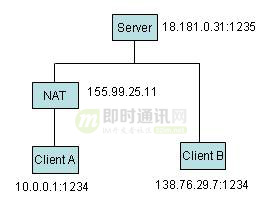

###3、基于UDP协议的P2P打洞技术详解

####1原理概述
  
UDP打洞技术是通过中间服务器的协助在各自的NAT网关上建立相关的表项，使P2P连接的双方发送的报文能够直接穿透对方的NAT网关，从而实现P2P客户端互连。如果两台位于NAT设备后面的P2P客户端希望在自己的NAT网关上打个洞，那么他们需要一个协助者——集中服务器，并且还需要一种用于打洞的Session建立机制。  
  
**什么是集中服务器？**  

集中服务器本质上是一台被设置在公网上的服务器，建立P2P的双方都可以直接访问到这台服务器。位于NAT网关后面的客户端A和B都可以与一台已知的集中服务器建立连接，并通过这台集中服务器了解对方的信息并中转各自的信息。  
  
同时集中服务器的另一个重要作用在于判断某个客户端是否在NAT网关之后。具体的方法是：一个客户端在集中服务器上登陆的时候，服务器记录下该客户端的两对地址二元组信息{IP地址:UDP端口}，一对是该客户端与集中服务器进行通信的自身的IP地址和端口号，另一对是集中服务器记录下的由服务器“观察”到的该客户端实际与自己通信所使用的IP地址和端口号。我们可以把前一对地址二元组看作是客户端的内网IP地址和端口号，把后一对地址二元组看作是客户端的内网IP地址和端口号经过NAT转换后的外网IP地址和端口号。集中服务器可以从客户端的登陆消息中得到该客户端的内网相关信息，还可以通过登陆消息的IP头和UDP头得到该客户端的外网相关信息。如果该客户端不是位于NAT设备后面，那么采用上述方法得到的两对地址二元组信息是完全相同的。  
  
**P2P的Session建立原理：**  

假定客户端A要发起对客户端B的直接连接，具体的“打洞”过程如下：  

  * 1）A最初不知道如何向客户端B发起连接，于是A向集中服务器发送消息，请求集中服务器帮助建立与客户端B的UDP连接。
  * 2）集中服务器将含有B的外网和内网的地址二元组发给A，同时，集中服务器将包含有A的外网和内网的地址二元组信息的消息也发给B。这样一来， A与B就都知道对方外网和内网的地址二元组信息了。
  * 3）当A收到由集中服务器发来的包含B的外网和内网的地址二元组信息后， A开始向B的地址二元组发送UDP数据包，并且A会自动锁定第一个给出响应的B的地址二元组。同理，当B收到由集中服务器发来的A的外网和内网地址二元组信息后，也会开始向A的外网和内网的地址二元组发送UDP数据包，并且自动锁定第一个得到A回应的地址二元组。由于A与B互相向对方发送UDP数据包的操作是异步的，所以A和B发送数据包的时间先后并没有时序要求。  

  
**下面来看下这三者之间是如何进行UDP打洞的。在这我们分三种具体情景来讨论：**  

  * 第一种是最简单的一种情景，两个客户端都位于同一个NAT设备后面，即位于同一内网中；
  * 第二种是最普遍的一种情景，两个客户端分别位于不同的NAT设备后面，分属不同的内网；
  * 第三种是客户端位于两层NAT设备之后，通常最上层的NAT是由网络提供商提供的，第二层NAT是家用的NAT路由器之类的设备提供的。  

####2典型P2P情景1：  两客户端位于同一NAT设备后面（即相同内网中）
  
这是最简单的一种情况（如图4所示）：客户端A和B分别与集中服务器建立UDP连接，经过NAT转换后，A的公网端口被映射为62000，B的公网端口映射为62005。  
  
**图4 - 位于同一个NAT设备后的UDP打洞过程：**  
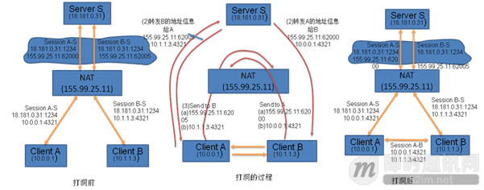

当A向集中服务器发出消息请求与B进行连接，集中服务器将B的外网地址二元组以及内网地址二元组发给A，同时把A的外网以及内网的地址二元组信息发给B。A和B发往对方公网地址二元组信息的UDP数据包不一定会被对方收到，这取决于当前的NAT设备是否支持不同端口之间的UDP数据包能否到达（即Hairpin转换特性），无论如何A与B发往对方内网的地址二元组信息的UDP数据包是一定可以到达的，内网数据包不需要路由，且速度更快。A与B推荐采用内网的地址二元组信息进行常规的P2P通信。  
  
假定NAT设备支持Hairpin转换，P2P双方也应忽略与内网地址二元组的连接，如果A 和B采用外网的地址二元组做为P2P通信的连接，这势必会造成数据包无谓地经过NAT设备，这是一种对资源的浪费。就目前的网络情况而言，应用程序在“打洞”的时候，最好还是把外网和内网的地址二元组都尝试一下。如果都能成功，优先以内网地址进行连接。  
  
**什么是Hairpin技术？**  

Hairpin技术又被称为Hairpin NAT、Loopback NAT或Hairpin Translation。Hairpin技术需要NAT网关支持，它能够让两台位于同一台NAT网关后面的主机，通过对方的公网地址和端口相互访问，NAT网关会根据一系列规则，将对内部主机发往其NAT公网IP地址的报文进行转换，并从私网接口发送给目标主机。目前有很多NAT设备不支持该技术，这种情况下，NAT网关在一些特定场合下将会阻断P2P穿越NAT的行为，打洞的尝试是无法成功的。好在现在已经有越来越多的NAT设备商开始加入到对该转换的支持中来。

####3典型P2P情景2： 两客户端位于不同的NAT设备后面（分属不同的内网）

  
这是最普遍的一种情况（如图5所示）：客户端A与B经由各自的NAT设备与集中服务器建立UDP连接，A与B的本地端口号均为4321，集中服务器的公网端口号为1234。在向外的会话中，A的外网IP被映射为155.99.25.11，外网端口为62000；B的外网IP被映射为138.76.29.7，外网端口为31000。  
  
**如下所示：**  

	客户端A——>本地IP:10.0.0.1，本地端口:4321，外网IP:155.99.25.11，外网端口:62000
	客户端B——>本地IP:10.1.1.3，本地端口:4321，外网IP:138.76.29.7，外网端口:31000

  
**图5 - 位于不同NAT设备后的UDP打洞过程：**  
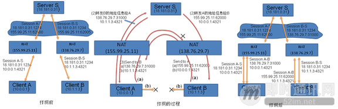
  
在A向服务器发送的登陆消息中，包含有A的内网地址二元组信息，即10.0.0.1:4321；服务器会记录下A的内网地址二元组信息，同时会把自己观察到的A的外网地址二元组信息记录下来。同理，服务器也会记录下B的内网地址二元组信息和由服务器观察到的客户端B的外网地址二元组信息。无论A与B二者中的任何一方向服务器发送P2P连接请求，服务器都会将其记录下来的上述的外网和内网地址二元组发送给A或B。  
  
A和B分属不同的内网，它们的内网地址在外网中是没有路由的，所以发往各自内网地址的UDP数据包会发送到错误的主机或者根本不存在的主机上。当A的第一个消息发往B的外网地址（如图3所示），该消息途经A的NAT设备，并在该设备上生成一个会话表项，该会话的源地址二元组信息是{10.0.0.1:4321}，和A与服务器建立连接的时候NAT生成的源地址二元组信息一样，但它的目的地址是B的外网地址。在A的NAT设备支持保留A的内网地址二元组信息的情况下，所有来自A的源地址二元组信息为{10.0.0.1:4321}的数据包都沿用A与集中服务器事先建立起来的会话，这些数据包的外网地址二元组信息均被映射为{155.99.25.11:62000}。  
  
A向B的外网地址发送消息的过程就是“打洞”的过程，从A的内网的角度来看应为从{10.0.0.1:4321}发往{138.76.29.7:31000}，从A在其NAT设备上建立的会话来看，是从{155.99.25.11:62000}发到{138.76.29.7:31000}。如果A发给B的外网地址二元组的消息包在B向A发送消息包之前到达B的NAT设备，B的NAT设备会认为A发过来的消息是未经授权的外网消息，并丢弃该数据包。  
  
B发往A的消息包也会在B的NAT设备上建立一个{10.1.1.3:4321，155.99.25.11:62000}的会话（通常也会沿用B与集中服务器连接时建立的会话，只是该会话现在不仅接受由服务器发给B的消息，还可以接受从A的NAT设备{155.99.25.11:6200}发来的消息）。  
  
一旦A与B都向对方的NAT设备在外网上的地址二元组发送了数据包，就打开了A与B之间的“洞”，A与B向对方的外网地址发送数据，等效为向对方的客户端直接发送UDP数据包了。一旦应用程序确认已经可以通过往对方的外网地址发送数据包的方式让数据包到达NAT后面的目的应用程序，程序会自动停止继续发送用于“打洞”的数据包，转而开始真正的P2P数据传输。  
  

####4典型P2P情景3： 两客户端位于两层(或多层)NAT设备之后（分属不同的内网）
  
此种情景最典型的部署情况就像这样：最上层的NAT设备通常是由网络提供商（ISP）提供，下层NAT设备是家用路由器。  
  
如图6所示：假定NAT C是由ISP提供的NAT设备，NAT C提供将多个用户节点映射到有限的几个公网IP的服务，NAT A和NAT B作为NATC的内网节点将把用户的内部网络接入NAT C的内网，用户的内部网络就可以经由NAT C访问公网了。从这种拓扑结构上来看，只有服务器与NAT C是真正拥有公网可路由IP地址的设备，而NAT A和NAT B所使用的公网IP地址，实际上是由ISP服务提供商设定的（相对于NAT C而言）内网地址（我们将这种由ISP提供的内网地址称之为“伪”公网地址）。同理，隶属于NAT A与NAT B的客户端，它们处于NAT A，NAT B的内网，以此类推，客户端可以放到到多层NAT设备后面。客户端A和客户端B发起对服务器S的连接的时候，就会依次在NAT A和NAT B上建立向外的Session，而NAT A、NAT B要联入公网的时候，会在NAT C上再建立向外的Session。  
  
**图6 - 多层NAT下的打洞过程：**  
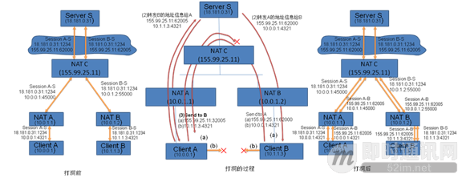
  
现在假定客户端A和B希望通过UDP“打洞”完成两个客户端的P2P直连。最优化的路由策略是客户端A向客户端B的“伪公网”IP上发送数据包，即ISP服务提供商指定的内网IP，NAT B的“伪”公网地址二元组，{10.0.1.2:55000}。由于从服务器的角度只能观察到真正的公网地址，也就是NAT A，NAT B在NAT C建立session的真正的公网地址{155.99.25.11:62000}以及{155.99.25.11:62005}，非常不幸的是客户端A与客户端B是无法通过服务器知道这些“伪”公网的地址，而且即使客户端A和B通过某种手段可以得到NAT A和NAT B的“伪”公网地址，我们仍然不建议采用上述的“最优化”的打洞方式，这是因为这些地址是由ISP服务提供商提供的或许会存在与客户端本身所在的内网地址重复的可能性（例如:NAT A的内网的IP地址域恰好与NAT A在NAT C的“伪”公网IP地址域重复，这样就会导致打洞数据包无法发出的问题）。  
  
因此客户端别无选择，只能使用由公网服务器观察到的A，B的公网地址二元组进行“打洞”操作，用于“打洞”的数据包将由NAT C进行转发。  
  
当客户端A向客户端B的公网地址二元组{155.99.25.11:62005}发送UDP数据包的时候，NAT A首先把数据包的源地址二元组由A的内网地址二元组{10.0.0.1:4321}转换为“伪”公网地址二元组{10.0.1.1:45000}，现在数据包到了NAT C，NAT C应该可以识别出来该数据包是要发往自身转换过的公网地址二元组，如果NAT C可以给出“合理”响应的话，NAT C将把该数据包的源地址二元组改为{155.99.25.11:62000}，目的地址二元组改为{10.0.1.2:55000}，即NAT
B的“伪”公网地址二元组，NAT B最后会将收到的数据包发往客户端B。同样，由B发往A的数据包也会经过类似的过程。目前也有很多NAT设备不支持类似这样的“Hairpin转换”，但是已经有越来越多的NAT设备商开始加入对该转换的支持中来。  
  
####5一个需要考虑的现实问题：UDP在空闲状态下的超时
  
当然，从应用的角度上来说，在完成打洞过程的同时，还有一些技术问题需要解决，如UDP在空闲状态下的超时问题。由于UDP转换协议提供的“洞”不是绝对可靠的，多数NAT设备内部都有一个UDP转换的空闲状态计时器，如果在一段时间内没有UDP数据通信，NAT设备会关掉由“打洞”过程打出来的“洞”。如果P2P应用程序希望“洞”的存活时间不受NAT网关的限制，就最好在穿越NAT以后设定一个穿越的有效期。  
  
对于有效期目前没有标准值，它与NAT设备内部的配置有关，某些设备上最短的只有20秒左右。在这个有效期内，即使没有P2P数据包需要传输，应用程序为了维持该“洞”可以正常工作，也必须向对方发送“打洞”心跳包。这个心跳包是需要双方应用程序都发送的，只有一方发送不会维持另一方的Session正常工作。除了频繁发送“打洞”心跳包以外，还有一个方法就是在当前的“洞”超时之前，P2P客户端双方重新“打洞”，丢弃原有的“洞”，这也不失为一个有效的方法。  

###4、基于TCP协议的P2P打洞技术详细

  
建立穿越NAT设备的P2P的TCP连接只比UDP复杂一点点，TCP协议的”“打洞”从协议层来看是与UDP的“打洞”过程非常相似的。尽管如此，基于TCP协议的打洞至今为止还没有被很好的理解，这也造成了的对其提供支持的NAT设备不是很多。在NAT设备支持的前提下，基于TCP的“打洞”技术实际上与基于UDP的“打洞”技术一样快捷、可靠。实际上，只要NAT设备支持的话，基于TCP的P2P技术的健壮性将比基于UDP技术的更强一些，因为TCP协议的状态机给出了一种标准的方法来
精确的获取某个TCP session的生命期，而UDP协议则无法做到这一点。  
  

####1套接字和TCP端口的重用

实现基于TCP协议的P2P打洞过程中，最主要的问题不是来自于TCP协议，而是来自于应用程序的API接口。这是由于标准的伯克利(Berkeley)套接字的API是围绕着构建客户端/服务器程序而设计的，API允许TCP流套接字通过调用connect()函数来建立向外的连接，或者通过listen()和accept函数接受来自外部的连接，但是，API不提供类似UDP那样的，同一个端口既可以向外连接，又能够接受来自外部的连接。而且更糟的是，TCP的套接字通常仅允许建立1对1的响应，即应用程序在将一个套接字绑定到本地的一个端口以后，任何试图将第二个套接字绑定到该端口的操作都会失败。  
  
为了让TCP“打洞”能够顺利工作，我们需要使用一个本地的TCP端口来监听来自外部的TCP连接，同时建立多个向外的TCP连接。幸运的是，所有的主流操作系统都能够支持特殊的TCP套接字参数，通常叫做“SO_REUSEADDR”，该参数允许应用程序将多个套接字绑定到本地的一个地址二元组（只要所有要绑定的套接字都设置了SO_REUSEADDR参数即可）。BSD系统引入了SO_REUSEPORT参数，该参数用于区分端口重用还是地址重用，在这样的系统里面，上述所有的参数必须都设置才行。  
  

####2打开P2P的TCP流

  
假定客户端A希望建立与B的TCP连接。我们像通常一样假定A和B已经与公网上的已知服务器建立了TCP连接。服务器记录下来每个接入的客户端的公网和内网的地址二元组，如同为UDP服务的时候一样。  
  
**从协议层来看，TCP“打洞”与UDP“打洞”是几乎完全相同的过程：**  

  * l  客户端A使用其与服务器的连接向服务器发送请求，要求服务器协助其连接客户端B；
  * l  服务器将B的公网和内网的TCP地址的二元组信息返回给A，同时，服务器将A的公网和内网的地址二元组也发送给B；
  * l  客户端A和B使用连接服务器的端口异步地发起向对方的公网、内网地址二元组的TCP连接，同时监听各自的本地TCP端口是否有外部的连接联入；
  * l  A和B开始等待向外的连接是否成功，检查是否有新连接联入。如果向外的连接由于某种网络错误而失败，如：“连接被重置”或者“节点无法访问”，客户端只需要延迟一小段时间（例如延迟一秒钟），然后重新发起连接即可，延迟的时间和重复连接的次数可以由应用程序编写者来确定；
  * l  TCP连接建立起来以后，客户端之间应该开始鉴权操作，确保目前联入的连接就是所希望的连接。如果鉴权失败，客户端将关闭连接，并且继续等待新的连接联入。客户端通常采用“先入为主”的策略，只接受第一个通过鉴权操作的客户端，然后将进入P2P通信过程不再继续等待是否有新的连接联入。  

  
**图7 - TCP打洞：**  
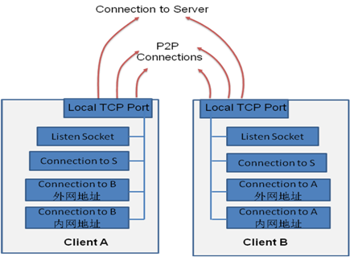
  
与UDP不同的是，因为使用UDP协议的每个客户端只需要一个套接字即可完成与服务器的通信，而TCP客户端必须处理多个套接字绑定到同一个本地TCP端口的问题，如图7所示。现在来看实际中常见的一种情景，A与B分别位于不同的NAT设备后面，如图5所示，并且假定图中的端口号是TCP协议的端口号，而不是UDP的端口号。图中向外的连接代表A和B向对方的内网地址二元组发起的连接，这些连接或许会失败或者无法连接到对方。如同使用UDP协议进行“打洞”操作遇到的问题一样，TCP的“打洞”操作也会遇到内网的IP与“伪”公网IP重复造成连接失败或者错误连接之类的问题。  
  
客户端向彼此公网地址二元组发起连接的操作，会使得各自的NAT设备打开新的“洞”允许A与B的TCP数据通过。如果NAT设备支持TCP“打洞”操作的话，一个在客户端之间的基于TCP协议的流通道就会自动建立起来。如果A向B发送的第一个SYN包发到了B的NAT设备，而B在此前没有向A发送SYN包，B的NAT设备会丢弃这个包，这会引起A的“连接失败”或“无法连接”问题。而此时，由于A已经向B发送过SYN包，B发往A的SYN包将被看作是由A发往B的包的回应的一部分，所以B发往A的SYN包会顺利地通过A的NAT设备，到达A，从而建立起A与B的P2P连接。  
  

####3从应用程序的角度来看TCP“打洞”

  
从应用程序的角度来看，在进行TCP“打洞”的时候都发生了什么呢？假定A首先向B发出SYN包，该包发往B的公网地址二元组，并且被B的NAT设备丢弃，但是B发往A的公网地址二元组的SYN包则通过A的NAT到达了A，然后，会发生以下的两种结果中的一种，具体是哪一种取决于操作系统对TCP协议的实现：  
  
**（1）**A的TCP实现会发现收到的SYN包就是其发起连接并希望联入的B的SYN包，通俗一点来说就是“说曹操，曹操到”的意思，本来A要去找B，结果B自己找上门来了。A的TCP协议栈因此会把B作为A向B发起连接connect的一部分，并认为连接已经成功。程序A调用的异步connect()函数将成功返回，A的listen()等待从外部联入的函数将没有任何反映。此时，B联入A的操作在A程序的内部被理解为A联入B连接成功，并且A开始使用这个连接与B开始P2P通信。  
  
由于收到的SYN包中不包含A需要的ACK数据，因此，A的TCP将用SYN-ACK包回应B的公网地址二元组，并且将使用先前A发向B的SYN包一样的序列号。一旦B的TCP收到由A发来的SYN-ACK包，则把自己的ACK包发给A，然后两端建立起TCP连接。简单的说，第一种，就是即使A发往B的SYN包被B的NAT丢弃了，但是由于B发往A的包到达了A。结果是，A认为自己连接成功了，B也认为自己连接成功了，不管是谁成功了，总之连接是已经建立起来了。  
  
**（2）**另外一种结果是，A的TCP实现没有像（1）中所讲的那么“智能”，它没有发现现在联入的B就是自己希望联入的。就好比在机场接人，明明遇到了自己想要接的人却不认识，误认为是其他的人，安排别人给接走了，后来才知道是自己错过了机会，但是无论如何，人已经接到了任务已经完成了。然后，A通过常规的listen()函数和accept()函数得到与B的连接，而由A发起的向B的公网地址二元组的连接会以失败告终。尽管A向B的连接失败，A仍然得到了B发起的向A的连接，等效于A与B之间已经联通，不管中间过程如何，A与B已经连接起来了，结果是A和B的基于TCP协议的P2P连接已经建立起来了。  
  
第一种结果适用于基于BSD的操作系统对于TCP的实现，而第二种结果更加普遍一些，多数Linux和Windows系统都会按照第二种结果来处理。  

###5、本文小结

  
在IP地址极度短缺的今天，NAT几乎已经是无所不在的一项技术了，以至于现在任何一项新技术都不得不考虑和NAT的兼容。作为当下应用最广泛的技术之一，P2P技术也必然要面对NAT这个障碍。  
  
打洞技术看起来是一项近似乎蛮干的技术，却不失为一种有效的技术手段。在集中服务器的帮助下，P2P的双方利用端口预测的技术在NAT网关上打出通道，从而实现NAT穿越，解决了NAT对于P2P的阻隔，为P2P技术在网络中更广泛的推广作出了非常大的贡献。  
  
（原文链接：[点此进入](http://www.h3c.com.cn/About_H3C/Company_Publication/IP_Lh/2012/04/Home/Catalog/201208/751474_30008_0.htm)，有改动）  

 

####
原文出处：<a href='http://www.52im.net/thread-2872-1-1.html' target='blank'>P2P技术详解(三)：P2P中的NAT穿越(打洞)方案详解(进阶分析篇)</a>

####1、引言
  
接本系列的上一篇《[P2P技术详解(二)：P2P中的NAT穿越(打洞)方案详解(基本原理篇)](http://www.52im.net/thread-542-1-1.html)》，本篇将深入分析各种NAT穿越(打洞)方案的技术实现原理和数据交互过程，希望能助你透彻理解它们。  
  
####2、NAT和NAPT

网络地址转换（NAT，全称Network Address Translation），早期的NAT指的是Basic NAT（静态NAT），它在技术上比较简单一点，仅支持地址转换，不支持端口映射。这就需要对每一个当前连接都要对应一个IP地址，因此要维护一个公网的地址池。  
  
我们可以看出，**Basic NAT一个比较明显的缺陷就是：**同一时刻只能少量位于NAT后面的机器能够和外部交互（要看NAT有几个外网IP）。  
  
后期的NAT基本都指的是NAPT(网络地址端口转换)了，这种方式支持端口的映射并允许多台主机共享一个公用IP地址，这样就可以支持同时多个位于NAT后面的机器和外部进行交互了。  
  
**支持端口转换的NAT又可以分为两类：**  
  
  * 1）源地址转换（SNAT）；
  * 2）目的地址转换NAT（DNAT）。  

  
下面说的NAT都是指NAPT。  

####3、NAT带来的问题

**NAT在缓解IPv4地址资源的紧张的同时，也带来了不少问题：**  
  
  * 1）NAT使IP会话的保持时效变短；
  * 2）NAT在实现上将多个内部主机发出的连接复用到一个IP上，这就使依赖IP进行主机跟踪的机制都失效了；
  * 3）NAT工作机制依赖于修改IP包头的信息，这会妨碍一些安全协议的工作；
  * 4）NAT限制了使用一些高层协议(FTP、Quake、SIP)的Peer两端的P2P通信。  

  
_**对于问题1：**_其主要原因是，NAT设备建立的内网IP、端口到外网IP、端口的映射的表项是有一个保活期的。如果在一个超时时间内，该映射上没有实际数据的传输，那么NAT会过期并回收这个映射表项给其他通信链路用(IP和端口资源有限，通信的链路是无限)。为了避免这种通信链路提前被NAT中断的情况，很多应用层协议在设计的时候就考虑了一个连接保活的机制，即在一段时间没有数据需要发送时，主动发送一个NAT能感知到而又没有实际数据的保活消息，这么做的主要目的就是重置NAT的会话定时器。  
  
_**对于问题2：**_其主要原因是，对于NAT后面的N多主机，在外部看来都是同一个主机(NAT设备)，于是来之同一个IP的数据包一定是来之同一个主机的前提判断就会不准确了，这样一下基于这个前提的机制(例如：TCP的TIME\_WAIT的回收和重用)都会有问题。  
  
_**对于问题3：**_其主要原因是，NAT篡改了IP地址、传输层端口号和校验和。  
  
_**对于问题4：**_其主要原因是，一般情况下，NAT是不允许外部的Peer节点主动连接或发送数据包给NAT后面的主机的(这里的主动指的是，在一段时间内，首先发送数据包的一方为主动方)。  
  
**NAT表现出这样的行为，主要基于下面的几点考虑：**  
  
  * 1）出于安全考虑，避免来自网络外部的攻击，隐藏并保护网络内部的计算机；
  * 2）位于NAT后面的很多主机，对于主动进来的数据包，NAT一般不知道该路由给内部的哪个主机(NAT设备上没有相关转发表项)。  

  
由于NAT这种特性，那么在NAT环境下，实现P2P通信的完整解决方案包括几个部分呢？相关的原理、方法、技术有哪些？  
  
**对于一个完整的P2P通信解决方案，其实现包括下面两个步骤：**  

  * 1）首先在Server的协助下，通信两端Peer尝试相互连接，如果两端Peer在尝试互联不成功后，那么就将失败结果反馈给Server转入步骤2）；
  * 2）这个步骤比较简单粗暴了，就是relay(服务器中转)，简单的来讲就是Peer1将要发给Peer2的数据发给Server，然后由Server帮忙转发给Peer2，同样对于Peer2来说也一样。  

  
对于实现P2P通信，步骤1是大家下功夫最多的，其原因比较简单，就是步骤2需要消耗较多的服务器资源，成本比较高。步骤1实现P2P两个节点间的直接通信，在资源消耗和效率上都是比较好的。  

####4、P2P通信穿越NAT的技术、方法
  
**目前常见的P2P通信穿越NAT的技术、方法主要有：**  

  * 1）应用层网关；
  * 2）中间件技术；
  * 3）打洞技术(Hole Punching)；
  * 4）Relay(服务器中转)技术。  

####5、NAT穿越技术1：应用层网关

  
应用层网关(ALG)是解决NAT对应用层协议无感知的一个最常用方法，已经被NAT设备厂商广泛采用，成为NAT设备的一个必需功能。  
#####5.1、原理
  
利用带有ALG功能的NAT对特定应用层协议的支持和理解，在一个NAT网关检测到新的连接请求时，需要判断是否为已知的应用类型，这通常是基于连接的传输层端口信息来识别的。在识别为已知应用时，再调用相应功能对报文的深层内容进行检查，当发现任何形式表达的IP地址和端口时，将会把这些信息同步转换，并且为这个新连接创建一个附加的转换表项。  
  
这样，当报文到达公网侧的目的主机时，应用层协议中携带的信息就是NAT网关提供的地址和端口。  
  
**例如：**下图，对于使用主动模式的FTP协议(PORT方式)，就需要AGL的支持了。  
  
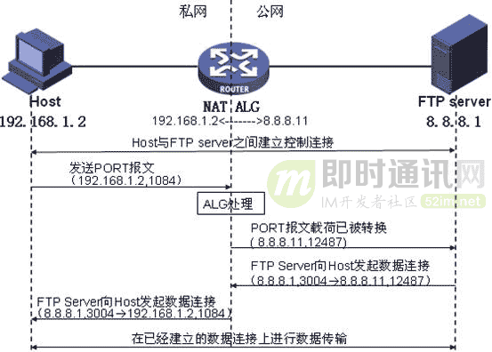
  
  
由于FTP协议通信需要两个TCP连接，一个是命令链路，用来在FTP客户端与服务器之间传递命令；另一个是数据链路，用来上传或下载数据。如上图，位于NAT后面的FTP client(192.168.1.2)首先发起一个TCP连接(命令链路)连上外网FTP Server(8.8.8.1)，然后发送PORT报文(192.168.1.2，1084)说自己在1084端口接收数据，然后进过ALG处理PORT报文变成(8.8.8.1，12487)，同NAT建立其一条(192.168.1.2，1084 <—>8.8.8.1，12487)映射。这样FTP Server发往(8.8.8.1，12487)的数据就会被转到(192.168.1.2，1084)，从而实现数据传输(如果没经过ALG处理，那么FTP Server直接连接192.168.1.2，1084是无法连接上的)。  

#####5.2、限制

ALG技术是利用NAT本身的支持来进行NAT的穿越，这个方案有很大限制，主要的原因是ALG都是为特定协议的特定规范版本而开发的，然而不管是协议本身，还是协议的数量都在变化，这就使得ALG适应性不强。  

####6、NAT穿越技术2：中间件技术

  
这是一种通过开发通用方法解决NAT穿越问题的努力。与前者不同之处是，AGL技术中NAT网关是这一解决方案的唯一参与者，而中间件技术中客户端会参与网关公网映射信息的维护。UPnP就是这样一种方法，UPnP中文全称为通用即插即用，是一个通用的网络终端与网关的通信协议，具备信息发布和管理控制的能力。  

#####6.1、原理

  
NAT只要理解客户端的请求并按照要求去分配响应的映射转换表，不需要自己去分析客户端的应用层数据。网关映射请求可以为客户动态添加映射表项。  
  
此时，NAT不再需要理解应用层携带的信息，只转换IP地址和端口信息。而客户端通过控制消息或信令发到公网侧的信息中，直接携带公网映射的IP地址和端口，接收端可以按照此信息建立数据连接。NAT网关在收到数据或连接请求时，按照UPnP建立的表项只转换地址和端口信息，不关心内容，再将数据转发到内网。  

#####6.2、限制

这种方案需要网关、内部主机和应用程序都支持UPnP技术，且组网允许内部主机和NAT网关之间可以直接交换UPnP信令才能实施。  

####7、NAT穿越技术3：打洞技术(Hole Punching)

Hole Punching技术是工作在运输层的技术，可以屏蔽上层应用层的差异，并且不需要NAT网关特定的支持，因此其通用性比较强，应用性也比较广。  

#####7.1、原理

  
打洞技术的原理比较简单，就是NAT内网的节点需要在NAT上建立自己的一条转发映射关系(这就是所谓的在NAT上打下一个洞)，然后外网的节点就通过这个”洞”来进行通信。为描述方便，我们将一对IP地址和端口信息的组合称之为一个Endpoint。  
  
**打洞原理可以简化为下面三个过程：**  
  
  * 1）首先位于NAT后的Peer1节点需要向外发送数据包，以便让NAT建立起内网Endpoint1(IP1、PORT1)和外网Endpoint2(IP2、PORT2)的映射关系；
  * 2）然后通过某种方式将映射后的外网Endpoint2通知给对端节点Peer2；
  * 3）最后Peer2往收到的外网Endpoint2发送数据包，然后该数据包就会被NAT转发给内网的Peer1。  

  
**上面三个过程比较简单，然而细心的同学会有些疑问：**  
  
  * 1）步骤[1]中的映射关系的建立有什么规律的么?怎样才能获取到映射关系呢？
  * 2）通知对端节点Peer2的方式一般是怎么样的？
  * 3）步骤[3]一定可以实现么？也就是Peer2往收到的外网Endpoint2发送数据包，就一定能够被NAT转发给内网的Peer1吗？  

对于疑问(3)，如果全部会被转发给内网Peer1，那会不会太不安全了，只要知道内网Peer1的映射后的外网Endpoint2，就可以给穿透NAT给内网Peer1发送数据，这样内网Peer1不就很容易遭到攻击了？如果全部都不转发给内网Peer1，这样Peer1只能向外发数据，而无法收到外面的数据，严重影响Peer1的正常通信。  
  
那么，这就比较明了了，我们需要的是一部分可以转发，另外一部分不转发。这就涉及到NAT对外来数据包的一个过滤规则了，而疑问(1)提到的映射关系建立的规则，这涉及到NAT的Endpoint的映射规则。  
  
那么问题来了，有什么方法可以知道NAT的Endpoint映射规则和对外来数据包的过滤规则呢？  

#####7.2、方法

由上面原理的讨论我们知道，要实现打洞穿越NAT，首先需要知道NAT的行为规则(NAT的Endpoint映射规则和对外来数据包的过滤规则)，这样才能更好地实现打洞穿越。  
  
那NAT有哪些行为类型？有什么办法来侦测NAT的行为呢？  

######7.2.1NAT行为类型与侦测方法

  
NAT的行为类型和侦测方法是由STUN（首先在[RFC3489](https://datatracker.ietf.org/doc/rfc3489/)中定义，英文全称是Simple Traversal of UDP Through NATs）协议来描述的，STUN协议包括了[RFC3489](https://datatracker.ietf.org/doc/rfc3489/)、[RFC5389](https://datatracker.ietf.org/doc/rfc5389/)、[RFC5780](https://datatracker.ietf.org/doc/rfc5780/)、[RFC5769](https://datatracker.ietf.org/doc/rfc5769/)几个系列文档。  
  
**早期的STUN协议是由[RFC3489](https://datatracker.ietf.org/doc/rfc3489/)（经典的STUN）来描述，其定义的NAT行为类型如下：**  

1）Full Cone NAT - 完全锥形NAT：  
所有从同一个内网IP和端口号Endpoint1发送过来的请求都会被映射成同一个外网IP和端口号Endpoint2，并且任何一个外网主机都可以通过这个映射的Endpoint2向这台内网主机发送包。也就是外网所有发往Endpoint2的数据包都会被NAT转发给Endpoint1。由于对外部请求的来源无任何限制，因此这种方式虽然足够简单，但却不安全。  
  
2）Restricted Cone NAT - 限制锥形NAT：  
它是Full Cone的受限版本：所有来自同一个内网Endpoint1的请求均被NAT映射成同一个外网Endpoint2，这与Full Cone相同。但不同的是，只有当内网Endpoint1曾经发送过报文给外部主机（假设其IP地址为IP3）后，外部主机IP3发往Endpoint2的数据包才会被NAT转发给Endpoint1。这意味着，NAT设备只向内转发那些来自于当前已知的外部主机的数据包，从而保障了外部请求来源的安全性  
  
3）Port Restricted Cone NAT - 端口限制锥形NAT：  
它是Restricted Cone NAT的进一步受限版，与限制锥形NAT很相似，只不过它包括端口号PORT。只有当内网Endpoint1曾经发送过报文给外部Endpoint3(包括IP和端口了)，Endpoint3发往Endpoint2的数据包才会被NAT转发给Endpoint1。端口号PORT这一要求进一步强化了对外部报文请求来源的限制，从而较Restrictd Cone更具安全性。  
  
4）Symmetric NAT - 对称NAT：  
上面的1）2）3）所有的Cone NAT中，映射关系只和内网的源Endpoint1相关，只要源Endpoint1不变其都会被映射成同一个Endpoint2。
而对称NAT的映射关系不只与源Endpoint1相关，还与目的Endpoint3相关。也就是源Endpoint1发往目的Endpoint30的请求被映射为Endpoint20，而源Endpoint1发往目的Endpoint31的请求，则被映射为Endpoint21了。此外，只有收到过内网主机发送的数据的外网主机才可以反过来向内网主机发送数据包。

经典 STUN 定义的 NAT 行为类型是将NAT的Mapping Behavior （映射规则）和Filtering Behavior（过滤规则）统一来归类的，这样对Symmetric NAT类型的归类过于笼统，使得许多 NAT 不完全符合由它定义的类型。  
  
于是后来，RFC3489被废弃并由RFC5389来替代，在RFC5389中，将Mapping Behavior （映射规则）和Filtering Behavior（过滤规则）分开来，定义了3种Mapping Behavior （映射规则）和3种Filtering Behavior（过滤规则），一共有9种组合。  
**为什么是3种呢？其实理由很简单，对于一个特定的内网源Endpoint1，影响其映射关系的因素不外乎就4种情况：**  

  * 1）目的IP和目的端口PORT都无关；
  * 2）目的IP和目的端口PORT都相关；
  * 3）仅仅目的IP相关；
  * 4）仅仅目的PORT相关。  

对于4仅仅考虑一下PORT信息有点鸡肋，基本和1差不多，于是把4去掉了。同样，对于过滤规则也一样。  
  
3种Mapping Behavior （映射规则）和 Filtering Behavior（过滤规则）如下。  
  
**Mapping Behavior：**  

1）Endpoint-Independent Mapping：  
对于一个内网的EndpointP，其映射的外网EndpointG是基本固定的，不会随着通信外部主机的不同而变化。  
  
2）Address and Port-Dependent Mapping：  
对于一个内网的EndpointP，如果与之通信的外部为EndpointGB1，那么EndpointP就会被NAT映射成EndpointG1；如果与之通信的外部为EndpointGB2，那么EndpointP就会被NAT映射成EndpointG2。也就是只要之通信的外部为EndpointGB发生变化，那么映射的外网EndpointG就会变化。  
  
3）Address-Dependent Mapping：  
对于一个内网的EndpointP，如果与之通信的外部为EndpointGB1，那么EndpointP就会被NAT映射成EndpointG1；如果与之通信的外部为EndpointGB2(如果EndpointGB2的IP和EndpointGB1的相同)，那么EndpointP同样会被NAT映射成EndpointG1，否则就会被NAT映射成EndpointG2。也就是只要之通信的外部为EndpointGB的IP发生变化，那么映射的外网EndpointG就会变化。
  
**Filtering Behavior：**  

1）Endpoint-Independent Filtering：  
对于这种过滤类型，NAT在在自己的一个外网EndpointG1收到数据包，只要找到与之对应的内网EndpointP1，NAT就会转发这个数据包给相应的内网EndpointP1，不管这个数据包的来源是那里。(一般来说，这样过滤规则的NAT是比较少的，因为这样的安全系数比较低)  
  
2）Address and Port-Dependent Filtering：  
对于这种过滤类型，NAT在自己的一个外网EndpointG1收到来源是EndpointGA1数据包，这个时候NAT要判断自己是否曾经通过自己的EndpointG1给EndpointGA1发送过数据包，如果曾经发过，那么NAT就允许该数据包通过NAT并路由给内网与之对于的内网EndpointP1；如果没发过，那么NAT会不允许该数据包通过NAT。  
  
3）Address-Dependent Filtering：  
对于这种过滤类型，NAT在自己的一个外网EndpointG1收到来源是EndpointGA1数据包，这个时候NAT要判断自己是否曾经通过自己的EndpointG1给和EndpointGA1的IP相同的机器发送过数据包(这里会忽略端口)，如果曾经发过，那么NAT就允许该数据包通过NAT并路由给内网与之对于的内网EndpointP1；如果没发过，那么NAT会不允许该数据包通过NAT。

  
RFC5389只是定义了协议的相关属性、机制、报文结构以及一些相关的安全注意点等等，并有没对怎么进行完整的NAT类型侦测做介绍。而对完整NAT类型侦测过程主要由RFC5780这个文档来描述。完整的NAT类型侦测的过程主要在RFC5780文档的4.3和4.4节，主要分为NAT映射规则（Determining NAT Mapping Behavior）和NAT过滤规则（Determining NAT Filtering Behavior）。  
  
**下面对具体的侦测过程做介绍：**  
  
要进行NAT类型的侦测，需要一个具有双公网IP的服务器来协助侦测，我们称该服务器为STUN Server。假设STUN Server的双IP分别为IP\_SA(125.227.152.3)和IP\_SB(125.227.152.4) 监听的两个端口分别为PORT\_SA(4777)和PORT\_SB(4888)，客户端A的内网和端口分别为IP\_CA(10.70.142.12)和PORT\_CA(1234)。  

1）客户端A以IP\_CA: PORT\_CA给STUN Server的IP\_SA: PORT\_SA发送一个bind请求，STUN server以IP\_SA:PORT\_SA给客户端A的IP\_CA: PORT\_CA回复响应，响应内容大体为：（NAT映射后的IP地址和端口为：IP\_MCA1:PORT\_MCA1，STUN Server的另外一个IP地址和端口为：IP\_SB: PORT\_SB）。这个时候客户端判断，如果IP\_CA: PORT\_CA == IP\_MCA1: PORT\_MCA1，那么该客户端是拥有公网IP的，NAT类型侦测结束。  
  
2）客户端A以IP\_CA: PORT\_CA给STUN server的IP\_SB: PORT\_SA(相对步骤1 ip改变了)发送一个bind请求，STUN server以IP\_SB: PORT\_SA给客户端A的IP\_CA: PORT\_CA回复响应，响应内容大体为：（NAT映射后的IP地址和端口为：IP\_MCA2: PORT\_MCA2）。这个时候客户端判断，如果IP\_MCA1:PORT\_MCA1 == IP\_MCA2: PORT\_MCA2，那么NAT是Endpoint Independent Mapping的映射规则，也就是同样的内网地址IP\_CA: PORT\_CA经过这种NAT映射后的IP\_M: PORT\_M是固定不变的；如果IP\_MCA1:PORT\_MCA1 != IP\_MCA2: PORT\_MCA2,那么就要进行下面的第3步测试。  
  
3）客户端A以IP\_CA: PORT\_CA给STUN server的IP\_SB: PORT\_SB(相对步骤1 ip和port改变了)发送一个bind请求，STUN server以IP\_SB: PORT\_SB给客户端A的IP\_CA:PORT\_CA回复响应，响应内容大体为：（NAT映射后的IP地址和端口为：IP\_MCA3: PORT\_MCA3）。这个时候客户端判断，如果IP\_MCA2:PORT\_MCA2== IP\_MCA3: PORT\_MCA3，那么NAT是Address Dependent Mapping的映射规则，也就是只要是目的IP是相同的，那么同样的内网地址IP\_CA: PORT\_CA经过这种NAT映射后的IP\_M:PORT\_M是固定不变的；如果IP\_MCA2: PORT\_MCA2!= IP\_MCA3: PORT\_MCA3，那么NAT是Address and Port Dependent Mapping，只要目的IP和PORT中有一个不一样，那么同样的内网地址IP\_CA: PORT\_CA经过这种NAT映射后的IP\_M:PORT\_M是不一样的。  
  
以上三个步骤是进行Mapping Behavior的侦测，下面两个步骤是进行Filtering Behavior侦测：  
  
4）客户端A以IP\_CA: PORT\_CA给STUN server的IP\_SA: PORT\_SA发送一个bind请求（请求中带CHANGE-REQUEST attribute来要求stun server改变IP和PORT来响应），STUN server以IP\_SB: PORT\_SB给客户端A的IP\_CA:PORT\_CA回复响应。如果客户端A能收到STUN server的响应，那么NAT是Endpoint-Independent Filtering的过滤规则，也就是只要给客户端A的IP\_CA: PORT\_CA映射后的IP\_MCA:PORT\_MCA地址发送数据都能通过NAT到达客户端A的IP\_CA: PORT\_CA（这种过滤规则的NAT估计很少）。如果不能收到STUN server的响应，那么需要进行下面的第五步测试。  
  
5）客户端A以IP\_CA: PORT\_CA给STUN server的IP\_SA: PORT\_SA发送一个bind请求（请求中带CHANGE-REQUEST attribute来要求stun server改变PORT来响应），STUN server以IP\_SA: PORT\_SB给客户端A的IP\_CA:PORT\_CA回复响应。如果客户端A能收到STUN server的响应，NAT是Address-Dependent Filtering的过滤规则，也就是只要之前客户端A以IP\_CA:PORT\_CA给IP为IP\_D的主机发送过数据，那么在NAT映射的有效期内，IP为IP\_D的主机以任何端口给客户端A的IP\_CA:PORT\_CA映射后的IP\_MCA: PORT\_MCA地址发送数据都能通过NAT到达客户端A的IP\_CA:PORT\_CA；如果不能收到响应，NAT是Address and Port-Dependent Filtering的过滤规则，也即是只有之前客户端A以IP\_CA: PORT\_CA给目的主机的IP\_D:PORT\_D发送过数据，那么在NAT映射的有效期内，只有以IP\_D: PORT\_D给客户端A的IP\_CA: PORT\_CA映射后的IP\_MCA:PORT\_MCA地址发送数据才能通过NAT到达客户端A的IP\_CA: PORT\_CA。

  
通过以上5个步骤就能完成完整的NAT类型侦测。  
  
**将NAT映射规则和过滤规则组合起来就形成9中不同的NAT行为类型：**  

  * 1）Endpoint Independent Mapping和Endpoint-Independent Filtering组合对应于RFC3489中的Full Cone NAT；
  * 2）Endpoint Independent Mapping和Address-Dependent Filtering组合对应于RFC3489中的Restricted Cone NAT；
  * 3）Endpoint Independent Mapping和Address and Port-Dependent Filtering组合对应于RFC3489中的Port Restricted Cone NAT；
  * 4）Address and Port-Dependent Mapping和Address and Port-Dependent Filtering组合是RFC3489中所说的Symmetric NAT。  

  
可见RFC3489只描述了9种NAT组合行为类型中的4种。最后一个文档rfc5769，定义了一些STUN协议的测试数据用于测试STUN server的正确性。  
  

######7.2.2NAT打洞过程
  
“打洞”方式穿越NAT有两种形式：TCP”打洞”和UDP”打洞”。原理上，TCP”打洞”与UDP”打洞”是没有本质的区别的。  
  
**然而在实现上，TCP”打洞”的成功率远没UDP”打洞”的成功率高，其主要原因有三：**  

1）有些NAT防火墙策略对TCP协议不是很友好：  
有些NAT的防火墙策略不允许来路不明的外部向内网机器发起TCP连接。由于TCP是有连接的，NAT比较容易分清哪些是NAT 内网机器主动进行通信的外部节点，这样防火墙策略比较明确。而UDP是无连接的，没有连接来标明一个数据流，协议比较简单，这样NAT支持的比较多。  
  
2）TCP协议本身：  
由于TCP的TIME\_WAIT状态引起，同一个NAT后面的其他主机发起的连接被误判。具体可以看下面的文章：km.oa.com/group/25569/art icles/show/246068 。  
  
3）TCP协议的实现API：  
因为标准的Berkeley sockets API是围绕C/S编程而设计的。这个API通过connect()允许一个TCP流套接字初始化一个向外的连接，通过listen()和accept()监听一个外入的连接，一个套接字不能既用来监听又用来初始化向外的连接。更进一步讲， TCP套接字通常与本地主机上的TCP端口一一对应：一个套接字绑定到本地主机机上的某个端口后，另一个套接字就不能再绑定到该端口。然而TCP打洞要成功，需要一个本地的TCP端口既可以监听外入的连接，同时又可以发起多个向外的连接。幸运的是，所有主流的操作系统都支持一个特殊的socket选项SO\_REUSEADDR，它运行应用程序绑定多个设置了该选项的套接字到同一端口。BSD系统引入了SO\_REUSEPORT选项来控制端口重用，从而把端口重用和地址重用相分离。在这样的系统中，两个选项都需要被设置。尽管如此，要进行TCP打洞需要进行TCP三次握手的同时打开，但是有些TCP/IP的实现，可能不支持这种同时打开的情况，这样也就无法建立TCP连接了。

  
下面就几种网络拓扑情况下，NAT打洞步骤进行逐一介绍。为了方便描述，假设通信的两个节点分别为Client A和Client B，而辅助NAT穿越的STUN Server为Server S。下面的所有方法都要求Client A、Client B都与Server S保持一条长连接，或者周期性连上Server S，以便能够接收Server S的相关指令，我们称这两个连接分别为ConnectA1，ConnectB1.  
  
**_7.2.2.1）网络拓扑类型一：_**  
  
如下图所示，Client A 位于NAT内网，而Client B是具有公网IP的机器。如果是Client A需要连接Client B那么Client A直接连Client B就可以了。如果Client B需要连接Client A，那么Client B直接Connect Client A一般是连接不上的。但是我们可以反过来让Client A主动去连Client B不就可以了。下面所说的Client A或Client B的NAT类型指的是对于Server S能看到的Client的最外层的NAT的类型。  
  
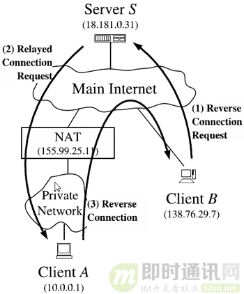
  
反过来让Client A主动去连Client B的技术就是所谓的：反向连接技术。  
  
**具体的穿越过程如下：**  

  * 1）Client B通过ConnectB1向Server S发送请求，请求连接Client A；
  * 2）Server S按需回复看是否需要启动Client B的NAT类型侦测。(这要看Server S是否已经缓存了Client B的相关NAT信息)；
  * 3）Server S通过[2]可以知道Client B具有公网IP，于是，Server S通过ConnectA1发送指令给Client A让Client A主动连Client B并告诉Client A目标Client B的IPB和监听端口PortB；
  * 4）Client A收到Client B的IPB和监听端口PortB，然后发送连接请求连上Cient A并附带一下身份信息，于是两者就可以进行通信。  

  
下面为了描述简便，具体的NAT侦测步骤就省略了。  
  
**_7.2.2.2）网络拓扑类型二：_**  
  
如下图，Client A和Client B位于同一个NAT后面，这个时候Client A和 Client B位于同一个局域网。  
  
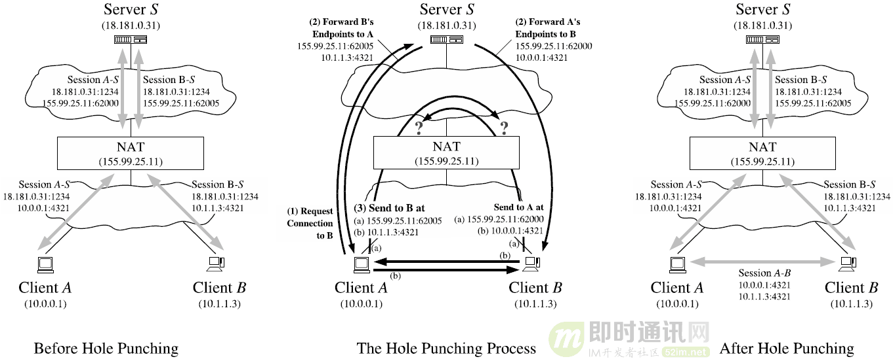
  
**具体的穿越过程如下：**  
  
  * 1）Client A通过ConnectA1向Server S发送请求，请求连接Client B；
  * 2）Server S发现Client A、B位于同一个NAT后面，于是返回Client A、Client B的公网EndpointGA、EndpointGB和内网EndpointPA、EndpointPB给Client A；
  * 3）Client A收到后，知道Client B和自己位于同一个NAT里面，于是直接连上Client B的内网EndpointPB进行通信。  

  
**_7.2.2.3）网络拓扑类型三：_**  
  
如下图，Client A和Client B分别位于不同的NAT后面，这个时候Client A和 Client B位于独立的局域网。  
  
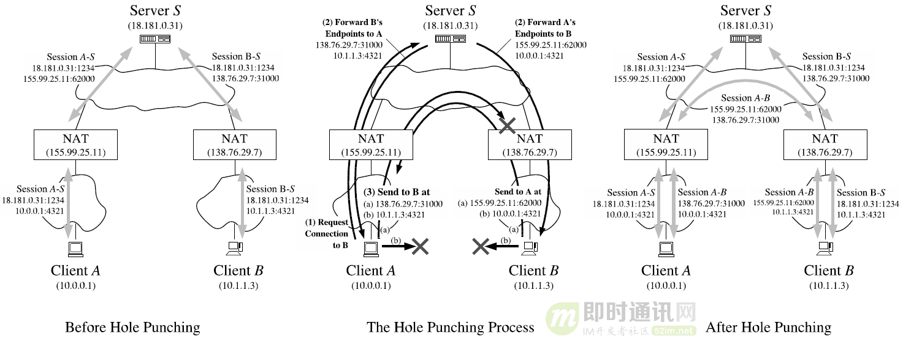
  
**具体的穿越过程如下：**  
  

  * 1）Client A通过ConnectA1向Server S发送请求，请求连接Client B；
  * 2）Server S发现Client A、B位于独立的NAT后面，也是通过ConnectA1返回给Client A、Client B的公网EndpointGA、EndpointGB和内网EndpointPA、EndpointPA给Client A。并且通过ConnectB1返回给Client A、Client B的公网EndpointGA、EndpointGB和内网EndpointPA、EndpointPB给Client B。  

接下来的步骤和Client A、Client B的NAT类型密切相关，下面会分别就相应的组合进行介绍具体的过程步骤。  
  
**（1）Client A是任意类型NAT，Client B 是Full Cone NAT(Endpoint Independent Mapping和Endpoint-Independent Filtering)**  
  
Full Cone NAT一般是比较少的，因为这样的NAT安全性很差。  
  
[3] Server S通过ConnectA1发送指令让Client A直接Connect Client B的外网EndpointGB，由于Client B的NAT是Full Cone，于是NAT不管三七二十一就把收到的包转发给Client B，于是它们就可以顺利通信了。  
  
**（2）Client A是任意类型NAT，Client B 是Restricted Cone NAT(Endpoint Independent Mapping和Address-Dependent Filtering)**  
  
[3] Server S通过ConnectB1发送指令让Client B 先bind内网EndpointPB然后往Client A的外网EndpointGA发送Connect请求(由于Client B是Endpoint Independent Mapping，那么EndpointPB依旧是映射为EndpointGB)，如果连接建立成功，那么它们就可以进行通信了，反之失败的话，Client B将失败结果反馈给Server S，然后转入[4]；  
  
[4] Server S收到失败反馈，通过ConnectA1发送指令让Client A往Client B的外网EndpointGB发送Connect请求，由于在步骤[3]，Client B已经往Client A发送过数据包，根据过滤规则(Address-Dependent Filtering)，Client B的NAT会允许Client A的数据包通过NAT并转发给Client B。于是，它们就建立其连接进行通信。  
  
**（3）Client A的NAT类型：映射规则是(Endpoint Independent Mapping)的，过滤规则任意；Client B 是Port Restricted Cone NAT(Endpoint Independent Mapping和Address and Port-Dependent Filtering)**  
  
[3] 该步骤和情况(2)中的步骤[3]完全一样。  
  
[4] Server S收到失败反馈，通过ConnectA1发送指令让Client A 先bind内网EndpointPA然后往Client B的外网EndpointGB发送Connect请求(由于Client A是Endpoint Independent Mapping，那么EndpointPA依旧是映射为EndpointGA)，由于在步骤[3]，Client B已经往Client A的EndpointGA发送过数据包，根据过滤规则(Address and Port-Dependent Filtering)，Client B的NAT会允许Client A的EndpointGA的数据包通过NAT并转发给Client B。于是，它们就建立其连接进行通信。  
  
**（4）Client A的NAT类型：映射规则是(非Endpoint Independent Mapping)的，过滤规则任意；Client B 是Port Restricted Cone NAT(Endpoint Independent Mapping和Address and Port-Dependent Filtering)**  
  
在这种情况下，在上面的步骤[4]的时候，由于Client A是非Endpoint Independent Mapping，那么EndpointPA就会映射为是EndpointGA\_B而不是EndpointGA了。这样根据过滤 规则(Address and Port-Dependent Filtering)，Client B的NAT将不会允许Client A的EndpointGA\_B的数据包通过NAT。要想数据包能通过Client B的NAT，需要Client B曾经给EndpointGA\_B发送过数据。但是，我们无法通过直接的方法让Client B提前知道Client A的外网EndpointGA\_B，难道就无能为力了吗？不，还是有些方法的，虽然无法直接知道Client A的外网EndpointGA\_B，但是我们可以进行预测。  
  
具体过程如下：  
  
[3] 该步骤和情况(2)中的步骤[3]完全一样。  
  
[4] Server S收到失败反馈，通过ConnectA1发送指令让Client A
启动端口映射预测过程。端口映射预测可以简单、可以复杂，大体就是让Client A往Server的不同端口、不同ip发送数据包，以便Server收集到Client A的端口映射样本，以便能够根据样本的端口映射变化规律预测Client A的NAT的Mapping规则。  
  
[5] Server S根据[4]的预测情况，通过ConnectB1发送给Client B接下来Client A可能的映射端口列表也就是可能的外网EndpointGA1、EndpointGA2 ... EndpointGAn，然后让Client B都往这些外网EndpointGA1、EndpointGA2 ... EndpointGAn发送数据包。  
  
[6] 然后Server S通过ConnectA1发送指令让Client A 先bind内网EndpointPA然后往Client B的外网EndpointGB发送Connect请求(这个时候，假设预测算法有效的话，那么Client A的内网EndpointPA将会映射为EndpointGAi)，由于在步骤[5]，Client B已经往Client A的EndpointGAi发送过数据包，根据过滤规则(Address and Port-Dependent Filtering)，Client B的NAT会允许Client A的EndpointGAi的数据包通过NAT并转发给Client B。于是，它们就建立其连接进行通信。  
  
[7] 如果在步骤[4]的预测失败，那么在步骤[6]将建立连接失败，然后Client B将失败结果反馈给Server S。这个时候Server S可以启动重试步骤[4][5][6]或直接判断Client A和Client B无法建立直接的P2P通信了，于是进入Relay(服务器中转)环节。Realy部分在后面会单独介绍。  
  
**_7.2.2.4）网络拓扑类型四：_**  
  
如下图，Client A和 Client B位于多层NAT后面。  
  
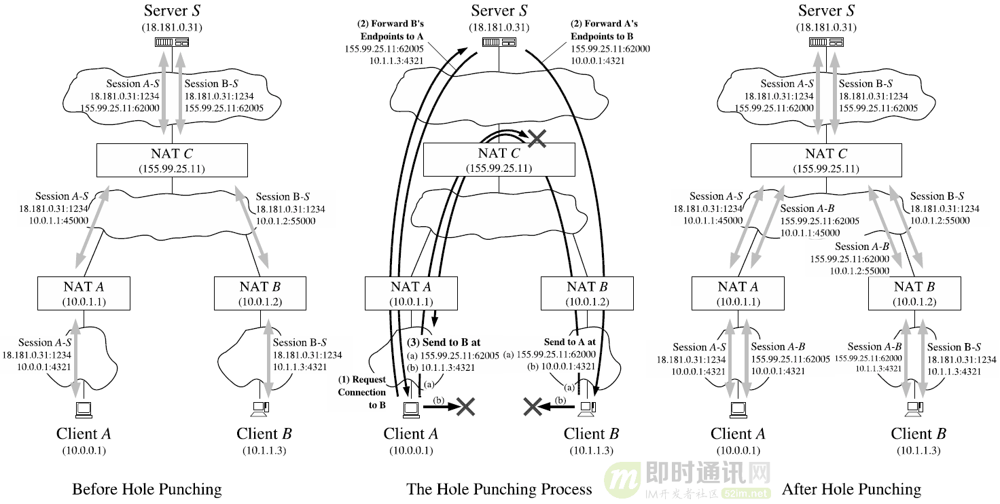
  
**具体过程如下：**  
  

  * 1）Client A通过ConnectA1向Server S发送请求，请求连接Client B；
  * 2）Server S发现Client A、B位于同一个NAT后面，于是返回Client A、Client B的公网EndpointGA、EndpointGB和内网EndpointPA、EndpointPB给Client A；
  * 3）Client A收到后，认为Client B和自己位于同一个NAT里面，于是往Client B的内网EndpointPB发送连接请求，当然是连接不上的；
  * 4）在连接失败后，接着Client A尝试向Client B的外网EndpointGB发送连接请求，这个时候NAT C收到数据包后是否转发该数据包要看NAT C是否支持回环转换（hairpin translation），如果不支持那么就无法进行直连P2P通信，需要就需要反馈给Server S开启Relay。  

  
5）在步骤4）失败了，Client A是无法知道是因为NAT C不支持回环转换造成的失败，还是内层NAT的行为造成的失败。于是Client A就假设NAT C是支持回环转换的，这个时候网络拓扑情况就变成网络拓扑类型三了，那么接下来的穿越步骤就和网络拓扑类型三的多种情况一样的了，这里就不重复了。  
  
上图，只是给出了Client A、Client B位于两层NAT后面的一种情况，对于多层NAT的各种组合本文就不介绍了。对于多层NAT的组合，在穿透失败的时候，是比较难判断出到底是哪层NAT的行为造成的。我们只能用上面说过的所有方法进行逐一重试，如果还是失败，那只能启动Relay进行服务器中转了。  

####8、NAT穿越技术4：Relay服务器中转技术

  
由于进行P2P穿透是否成功与NAT的行为和防火墙策略有很大的关系，因此就算是一个P2P友好NAT也很难保证100%穿透成功。举个例子：8.2.2.4网络拓扑类型四，假设NAT A、NAT B 、NAT C都是Full Cone NAT（完全锥型），但是如果NAT C不支持回环转换（hairpin translation）那么也是无法穿透成功的。那么一个完整的P2P穿透的解决方案必不可少的一个部分就是relay了，relay部分主要TURN协议描述。作为STUN协议的一个补充，TURN协议主要由[RFC5766](https://datatracker.ietf.org/doc/rfc5766/)、[RFC6062](https://datatracker.ietf.org/doc/rfc6062/)、[RFC6156](https://datatracker.ietf.org/doc/rfc6156/)来描述，其中[RFC5766](https://datatracker.ietf.org/doc/rfc5766/)主要描述的是UDP协议的relay，RFC6062描述的是TCP协议（IPV4）的relay，而RFC6156描述的是IPV6的relay。下面主要介绍一下RFC5766和RFC6062两个文档中描述的较为重要的交互过程，具体的协议相关属性、报文结构等等，有兴趣的可以细读一下协议文档。  
  
TURN协议简单的来讲，如下图所示：client向turn server发送一个Allocation request请求一个分配（allocation），如果turn server接收请求就会给client分配一个relay地址（IP\_RELAYA:PORT\_RELAYA），每个allocation都有一个有效期，过了有效期就不能使用了。在有效期内client可以发送refresh request来刷新延长有效期。Client A想给peer A发送数据需要创建权限，这个通过createPermission request请求来创建权限，权限创建成功后，client A就可以发送数据给turn server由turn server中转给peer A，同时peer A发送给turn server数据也会被turn server中转给client A。如图中所示，由于client 没有注册peer B的权限，那么client 发给peer B的数据会被turn server丢弃，同时peer B发给client 的数据也会被turn server丢弃。  
  
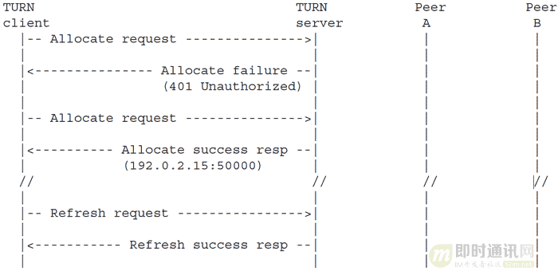

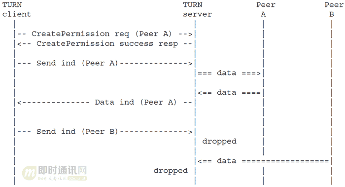

#####8.1、UDP协议的Relay
  
首先介绍[RFC5766](https://datatracker.ietf.org/doc/rfc5766/)，UDP协议的relay，主要有两种方式：第一种是Send and Data methods，第二种是channels。下面分别介绍这两个方式。  
  
######8.1.1方式一、Send and Data methods，具体交互过程如下：

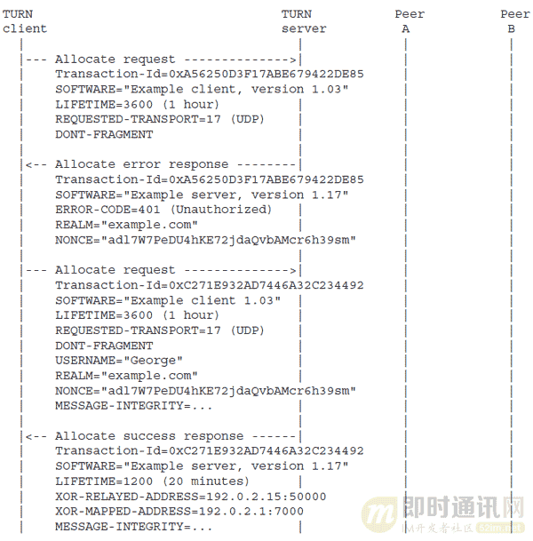
  
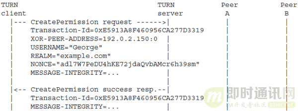
  
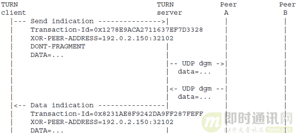
  
  
**（1）首先client发送Allocate request 给TURN server 请求一个分配。其中携带的主要属性：**  

Transaction-Id=0xA56250D3F17ABE679422DE85 ：事务ID用于标识一个交互过程  
SOFTWARE="Example client, version 1.03" ：可有可无的属性  
LIFETIME=3600 (1 hour) ：请求分配的有效期，期望有效期  
REQUESTED-TRANSPORT=17 (UDP) ：未来数据传输采用的协议  
DONT-FRAGMENT ：请求不要将数据进行分割分包转发给PEER。

  
**（2）TURN server回复一个Allocate error response响应，表示请求未通过授权，需要进行用户验证：**  

Transaction-Id=0xA56250D3F17ABE679422DE85 ：事务ID要和（1）的一样  
SOFTWARE="Example server, version 1.17" ：可有可无  
ERROR-CODE=401 (Unauthorized) ：错误码  
REALM="example.com" ：为了让客户端下次请求的时候要带上这个属性  
NONCE="adl7W7PeDU4hKE72jdaQvbAMcr6h39sm" ：为了让客户端下次请求的时候要带上这个属性

  
**（3）Client收到响应后，发现是401错误响应，那么需要给TURN server提供用户名和密码进行验证。于是client重新发送Allocate request请求：**  

Transaction-Id=0xC271E932AD7446A32C234492 ：另起一个事务，标识另外一个请求过程  
SOFTWARE="Example client 1.03" ：同（1）  
LIFETIME=3600 (1 hour) ：同（1）  
REQUESTED-TRANSPORT=17 (UDP) ：同（1）  
DONT-FRAGMENT ：同（1）  
USERNAME="George" ：client的用户名  
REALM="example.com" :（2）中TURN server响应给client的  
NONCE="adl7W7PeDU4hKE72jdaQvbAMcr6h39sm" :（2）中TURN server响应给client的  
MESSAGE-INTEGRITY=... ：一些加密信息，用于验证client的

  
**（4）TURN server 验证client通过后给client响应Allocate success response：**  

Transaction-Id=0xC271E932AD7446A32C234492 ：事务ID要和（3）相同  
SOFTWARE="Example server, version 1.17" ：同(3)  
LIFETIME=1200 (20 minutes) ：该分配的有效期，实际有效期  
XOR-RELAYED-ADDRESS=192.0.2.15:50000 ：给client分配的relay地址  
XOR-MAPPED-ADDRESS=192.0.2.1:7000 ：client的经NAT后的映射地址  
MESSAGE-INTEGRITY=... ：一些加密信息

  
**（5）收到TURN server的success响应后，client发送CreatePermission request来创建peer的权限：**  

Transaction-Id=0xE5913A8F460956CA277D3319 ：另起一个事务，标识另外一个请求过程  
XOR-PEER-ADDRESS=192.0.2.150:0 ：需要创建权限的peer的IP地址，权限只与IP地址相关，与端口无关  
USERNAME="George"  
REALM="example.com" :（2）中TURN server响应给client的  
NONCE="adl7W7PeDU4hKE72jdaQvbAMcr6h39sm" :（2）中TURN server响应给client的  
MESSAGE-INTEGRITY=... ：一些加密的信息

  
**（6）TURN server接受创建权限请求，发送CreatePermission success resp 响应给client：**  

Transaction-Id=0xE5913A8F460956CA277D3319 ：事务ID要和（5）相同  
MESSAGE-INTEGRITY=... ：一些加密信息

  
**（7）创建权限成功后，client就可以用Send indication来发送数据给TURN server然后由TURN server将数据relay给peer：**  

Transaction-Id=0x1278E9ACA2711637EF7D3328 ：另起一个事务，标识另外一个请求过程  
XOR-PEER-ADDRESS=192.0.2.150:32102 ：需要发送数据的peer监听的IP:
PORT（注意IP一定要和注册权限的时候的IP一样，否则会被拒绝relay并响应错误）  
DONT-FRAGMENT ：请求TURN server不要将data数据分片发送  
DATA=... ：client需要发给peer的数据内容

  
**（8）TURN server收到Send indication请求后，进行一些权限检查后，提取出协议包中的data属性中的数据内容，然后将数据内容用UDP协议从client的relay地址（源：192.0.2.15:50000）发送给peer（目的：192.0.2.150:32102）：**  

\-- UDP dgm ->  
data=... ： 发给peer的UDP 数据包

  
**（9）peer收到UPD数据包后，如果有响应数据，那么就将响应数据用UDP发给TURN server的192.0.2.15:50000地址：**  

<\- UDP dgm –  
data=... ：响应给TURN server的UDP数据包

  
**（10）TURN server在client的relay地址（192.0.2.15:50000）那收到peer（192.0.2.150:32102）的UDP数据包，这时TURN server需要检测client是否注册了IP192.0.2.150的权限，如果没有就会丢弃该数据包。如果有那么就取出UDP数据包中的data部分，然后将data封装成TURN协议数据包，给client发送Data indication：**  

Transaction-Id=0x8231AE8F9242DA9FF287FEFF ：协议并不要求这个事务ID要和（7）中的一样  
XOR-PEER-ADDRESS=192.0.2.150:32102 ：标识数据来自哪个peer  
DATA=... : peer 发给client的数据内容

  
以上是Send and Data methods方式的核心交互过程，较为完整交互过程可以查看一下协议文档。这里有个问题需要说明一下，就是每个allocati
on都有一个有效期，client需要把握好有效期，及时在有效期内发送refresh request来刷新延长有效期。  
  

######8.1.2方式二、channels，具体交互过程如下：

  
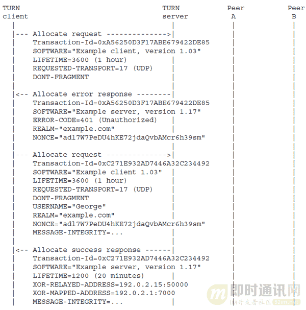
  
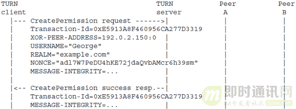
  
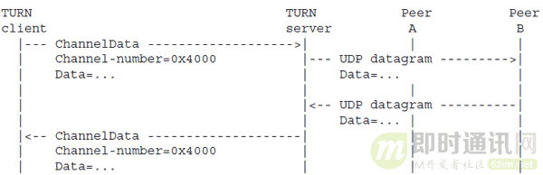
  
**（1）--（6）交互过程和Send and Data methods方式是一样的，这里就不在重复了。**  
  
**（7）权限创建成功后，client发送ChannelBind request给TURN server请求进行channel bind。**  

Transaction-Id=0x6490D3BC175AFF3D84513212 ：事务ID  
CHANNEL-NUMBER=0x4000 ：client定义的bind channel ID  
XOR-PEER-ADDRESS=192.0.2.210:49191 ：peer B的IP和PORT  
USERNAME="George" ：同方式一  
REALM="example.com" ：同方式一  
NONCE="adl7W7PeDU4hKE72jdaQvbAMcr6h39sm" ：同方式一  
MESSAGE-INTEGRITY=... ：同方式一

  
**（8）TURN server接受channelBind请求后，给client发送ChannelBind success response响应**  

Transaction-Id=0x6490D3BC175AFF3D84513212 ：事务ID，和（7）相同  
MESSAGE-INTEGRITY=... |

  
**（9）client收到ChannelBind success response后就可以通过ChannelData来发送数据了。**  

Channel-number=0x4000 ：（7）中定义bind channel ID  
Data=... ：client需要发给peer B的数据内容

  
**（10）TURN server收到ChannelData后首先从TURN协议数据包中提取出Channel-number，接着查找Channel-number是否已经绑定peer，如果没有就返回错误并丢弃数据包；如果查找到有绑定peer，那么就提前出Data属性中的数据内容用UDP协议通过client的relay地址（源：192.0.2.15:50000）发送给peer B（目的：192.0.2.210:49191）。**  

\--- UDP datagram --------->  
Data=... 发给peer B的UDP 数据包

  
**（11）peer收到UPD数据包后，如果有响应数据，那么就将响应数据用UDP发给TURN server的192.0.2.15:50000地址**  

<\-- UDP datagram ----------  
Data=... :peer 发给client的数据内容

  
**（12）TURN server在client的relay地址（192.0.2.15:50000）那收到peer（192.0.2.210:49191）的UDP数据包，这时TURN server需要检测client是否注册了IP192.0.2.150的权限，如果没有就会丢弃该数据包。如果有注册权限，那就检查client是有channel绑定该peer，如果有那么就通过Channel Data 方式relay数据给client，否则就通过方式一中的Data indication 方式relay数据给client**  

Channel-number=0x4000 ：（7）中定义bind channel ID  
Data=... ：peer B发给client的数据内容

  
以上是channels的核心交互过程，较为详细的过程可以查看协议文档。方式二比方式一多了一个channel Bind的步骤，这个步骤是为了告诉TURN server接下来以Channel-number标识的协议数据包是要发给谁的，这样才使得ChannelData中只要携带一个Channel-number头部信息就可以，而不用携带方式一中的Transaction-Id、XOR-PEER-ADDRESS等额外的头部信息，减少数据量。  

#####8.2、TCP协议的Relay

TCP协议的relay是在RFC6062中描述，其中主要有两种情况下的relay：1. Client to peer 2. Client to client。下面分别介绍两种情况下relay。  
  

######8.2.1情况一、Client to peer，网络拓扑如下：

  
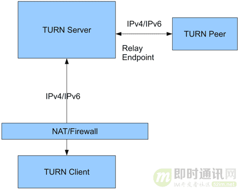
  
在上面的网络拓扑下，有两种方式的relay：1. TURN Client 主动发起的relay 2. TURN Peer主动发起的relay。下面分别介绍这两种方式的交互过程。这里Turn Client表示能够理解TURN协议的主机，而Turn Peer表示普通的一般主机。  
  
**_8.2.1.1）TURN Client 主动发起的relay：_**  
  
在这种方式下，TURN server要能够直接连接上TURN Peer监听的端口才行。具体交互过程如下：  

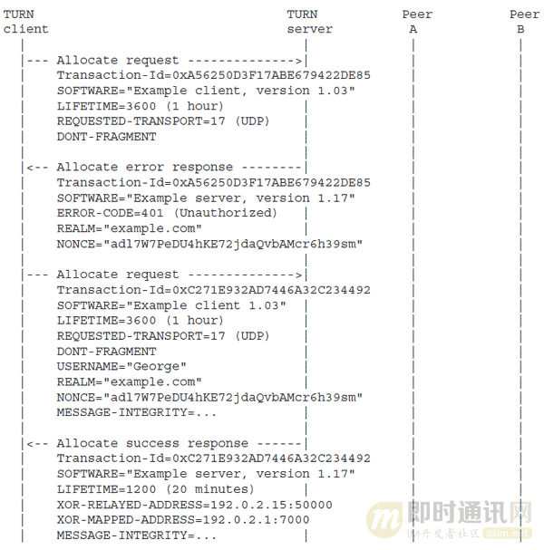

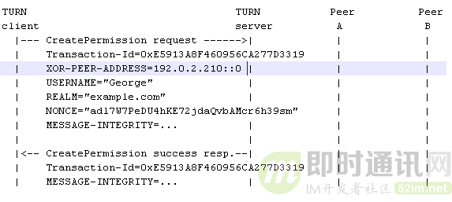
  
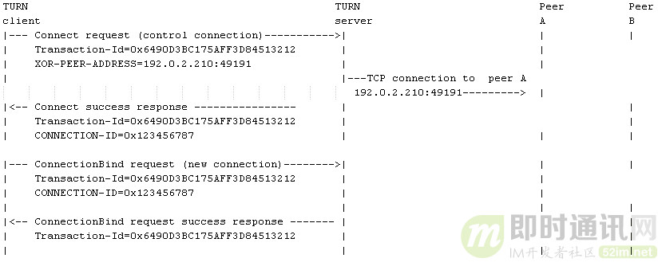
  
**（1）--（6）交互过程和RFC5766的是基本一样的，这里就不在重复了。所不同的是RFC5766中是UDP协议，而这里是TCP协议，并且（1）--（6）是在一个连接中完成，我们称这个连接为control connection。**  
  
**（7）client创建权限成功后，通过control connection发送Connect request给TURN server请求TURN server去连接Peer A**  

Transaction-Id=0x6490D3BC175AFF3D84513212 ：事务ID  
XOR-PEER-ADDRESS=192.0.2.210:49191 ：Peer A监听的IP和端口

  
**（8）TURN server收到Connect request后， 它会通过client的relay地址（源：192.0.2.15:50000）尝试TCP连接到Peer A的192.0.2.210:49191，如果连接不成功，那么给client响应错误码为447的错误。如果连接成功那么转入（9），我们称这个连接为Peer data connection**  
  
**（9）TURN server连接Peer A成功后，给client发送Connect success response**  

Transaction-Id=0x6490D3BC175AFF3D84513212 ：事务ID，同（7）  
CONNECTION-ID=0x123456787 ：TURN server给client响应的标识，用于将两条TCP连接联系起来用的。

  
**（10）client在control connection上收到Connect success response，那么client需要建立另外一条TCP连接连上TURN server，我们称这条连接为new connection。Client通过new connection给TURN server发送ConnectionBind request，请求将new connection和Peer data connection进行绑定。**  

Transaction-Id=0x6490D3BC175AFF3D84513212 ：事务ID  
CONNECTION-ID=0x123456787 ：（9）中收到的CONNECTION-ID

**（11）TURN server 收到ConnectionBind request后，进行一些操作，把new connection和Peer A connection两条TCP连接联系起来。**  
  
通过上面11个步骤以后，client和peer A就能分别通过new connection和Peer data connection两条TCP连接来发送数据了。Client通过new connection发送的数据到达TURN server，TURN server就会将数据原封不动通过Peer data connection转发给Peer A，同样对于Peer A也是一样的，TURN server就像进行端口转发一样了。这里有个问题是：Peer A connection这条TCP连接要比new connection这条TCP连接早一些建立起来的，这样在new connection建立起来之前peer A就开始发送数据的话，那么TURN server这个时候是无法将数据转发给client的，所以RFC6062协议要求，只要Peer data connection连接建立好了，那么TURN server就必须做好准备接收peer A的数据，并将接收到的数据buffer住，等new connection建立好后在转发给client。但是，有些开源实现并没有这样做，所以这点要注意一下。  
  
**_8.2.1.2）TURN Peer主动发起的relay：_**  
  
在这种方式下，TURN Peer可以位于NAT后面，具体交互如下：  
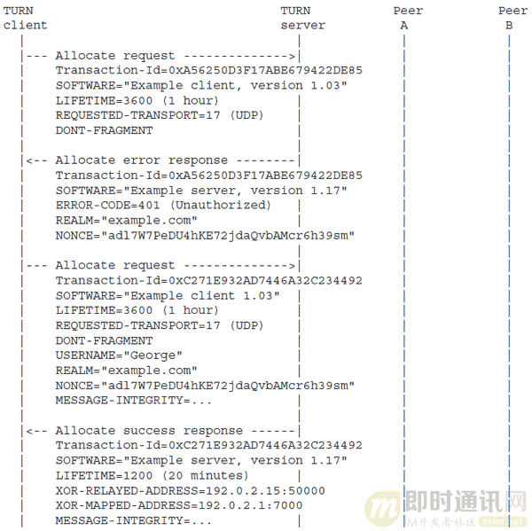
  
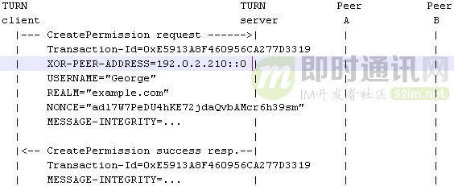
  
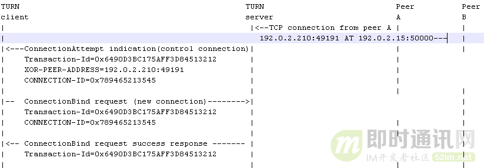
  
**（1）--（6）交互过程和方式1的是一样的，这里就不在重复了。**  
  
**（7）Peer A通过192.0.2.210:49191向client的relay地址192.0.2.15:50000发起TCP连接。TURN server 马上accept这个TCP连接并做好buffer Peer A发送的数据流的准备。然后，TURN server检查 拥有relay地址192.0.2.15:50000的client是否已经注册了Peer A（192.0.2.210）的权限，如果没有，那么TURN server会马上close刚刚accept的连接。如果有，那么转向（8），我们把这个连接称为peer data connection**  
  
**（8）TURN server 查找到拥有relay地址192.0.2.15:50000的client的control connection，通过control connection给client发送ConnectionAttempt indication。**  

Transaction-Id=0x6490D3BC175AFF3D84513212 ：事务ID  
XOR-PEER-ADDRESS=192.0.2.210:49191 ：（7）中accept那个peer A的IP和端口  
CONNECTION-ID=0x789465213545 ：TURN server给client响应的标识，用于将两条TCP连接联系起来用的
  
**（9）client收到ConnectionAttempt indication，如果接收这个peer的话，那么client会新起一个连接连上TURN server，我们称这个连接为new connection，client通过new connection给TURN server发送ConnectionBind request，请求绑定peer data connection。**  

Transaction-Id=0x6490D3BC175AFF3D84513212 ：事务ID  
CONNECTION-ID=0x789465213545 ： （8）中收到的CONNECTION-ID

  
**（10）TURN server收到ConnectionBind request后会通过new connection给client发送ConnectionBind request success response。**  
通过上面10个步骤以后，client和peer A就能分别通过new connection和Peer data
connection两条TCP连接来发送数据了。这个方式同样存在方式1中的数据buffer住问题。在这种情况下，在Peer
A看来与之通信的是Endpoint(client的relay地址192.0.2.15:50000)，Peer A不需要知道真实的Client的地址。  
  

######8.2.2情况二、Client to client，网络拓扑结构如下：

  
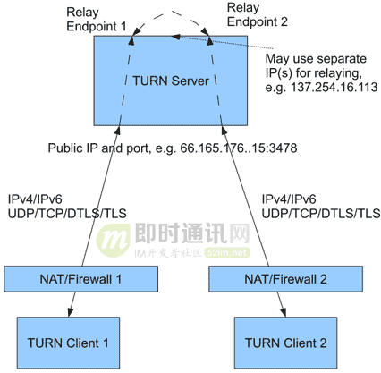
  
这种情况下，RFC6062文档中并没有讲到，估计是因为这种情况是情况一的一个特例而已，我这里展开来讲一下是希望能帮助大家更加深刻理解协议本身。  
  
**TURN Client1和TURN Client2（1）-（6）步骤的交互情况基本和上面的一样，并且是比较独立的，所以下面直接给出了。**  
  
TURN Client1 的（1）-（6）步骤交互情况如下：  

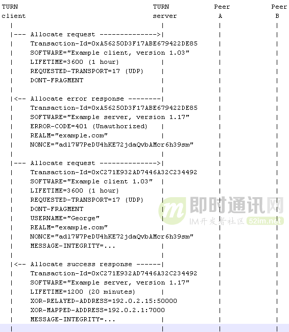
  
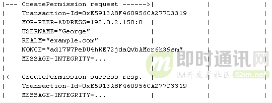
  
TURN Client2 的（1）-（6）步骤交互情况如下：  

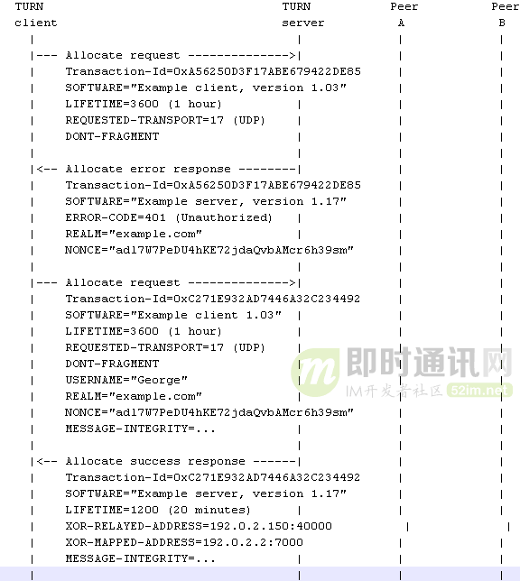

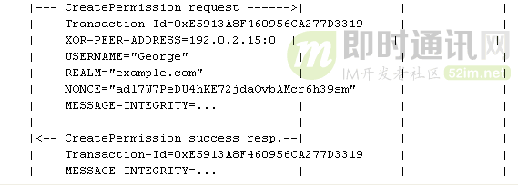
  
从上面的交互可以知道TURN Client 1 的relay地址是：192.0.2.15:50000，NAT映射后的地址是：192.0.2.1:7000，而TURN Client2的relay地址是：192.0.2.150:40000，NAT映射后的地址是：192.0.2.2:7000。下面继续给出TURN Client 1和TURN Client 2的其他交互情况，由于它们和TURN server的交互带有一定的时序性，下面会交错给出它们和TURN server的交互步骤。TURN Client1和TURN Client2是对称，这里不妨假设TURN Client1是数据交互的发起者，具体交互过程如下：  

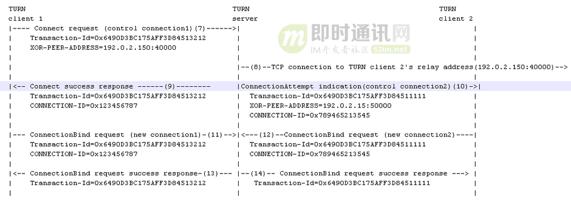
  
**（7）TURN Client1 首先通过control connection1发送Connect request给TURN server，请求连接TURN Client 2的relay地址192.0.2.150:40000。**  

Transaction-Id=0x6490D3BC175AFF3D84513212 ：事务ID  
XOR-PEER-ADDRESS=192.0.2.150:40000 ： TURN Client2的relay地址

**（8）TURN server收到Connect request后， 它会通过TURN Client1的relay地址（源：192.0.2.15:50000）尝试TCP连接到192.0.2.150:40000，这个连接一般都会成功，因为这个是TURN server给的relay地址，我们称这个连接为peer data connection1**  
  
**（9）TURN server连接192.0.2.150:40000成功后，给TURN Client1发送Connect success response**  

Transaction-Id=0x6490D3BC175AFF3D84513212：事务ID  
CONNECTION-ID=0x123456787 ：TURN server给client响应的标识，用于将两条TCP连接联系起来用的
  
**（10）这个步骤和（9）几乎同时发生的，TURN server发现TURN Client2的relay地址192.0.2.150:40000有个TCP连接上来，那么TURN server马上accept这个连接，我们称这个连接是peer data connection2（其实就是peer data connection1）；经过权限检查后，TURN server通过TURN Client2的control connection2给TURN Client2发送ConnectionAttempt indication**  

Transaction-Id=0x6490D3BC175AFF3D84511111 ：事务ID  
XOR-PEER-ADDRESS=192.0.2.15:50000 ：TURN Client1的relay地址  
CONNECTION-ID=0x789465213545 ：TURN server给client响应的标识，用于将两条TCP连接联系起来用的
  
**（11）TURN Client1 收到Connect success response后，另起一个TCP connection连接上TURN server，我们称这个连接为new connection1。TURN Client1通过new connection1给TURN server 发送ConnectionBind request**  

Transaction-Id=0x6490D3BC175AFF3D84513212 ：事务ID  
CONNECTION-ID=0x123456787 ： （9）中TURN server响应的CONNECTION-ID

**（12）这个步骤几乎和（11）同时发生，TURN Client2 收到ConnectionAttempt indication，表示接受，然后它另起一个TCP connection连接上TURN server我们称这个连接为new connection2。TURN Client2通过new connection2给TURN server发送ConnectionBind request。**  

Transaction-Id=0x6490D3BC175AFF3D84511111 ：事务ID  
CONNECTION-ID=0x789465213545 ：（10）中TURN server响应的CONNECTION-ID

**（13）和（14）TURN server分别通过new connection1和new connection2给TURN Client 1和TURN Client 2发送ConnectionBind request success response。**  
  
通过以上14个步骤，TURN Client 1就能借助new connection1和peer data connection1与TURN Client 2进行数据交互。而TURN Client 2借助new connection2和peer data connection2与TURN Client 1进行数据交互。  
  
到这里，P2P通信穿越NAT的相关原理、技术、方法的进阶分析基本介绍完毕，关于STUN和TURN协议，有个开源实现，有兴趣的同学可以阅读一下源码：<https://github.com/coturn/rfc5766-turn-server>  
  
**另外还有一个ICE协议，这个也有一个文档系列：**  
  

  * [RFC 5245](https://datatracker.ietf.org/doc/rfc5245/) - ICE
  * [RFC 5768](https://datatracker.ietf.org/doc/rfc5678/) – ICE–SIP
  * [RFC 6336](https://datatracker.ietf.org/doc/rfc6336/) – ICE–IANA Registry
  * [RFC 6544](https://datatracker.ietf.org/doc/rfc6544/) – ICE–TCP
  * [RFC 5928](https://datatracker.ietf.org/doc/rfc5928/) - TURN Resolution Mechanism  

  
这个文档系列较为复杂一些，有兴趣的可以阅读一下。  

####9、参考文献

* [1]《[P2P技术详解(一)：NAT详解——详细原理、P2P简介](http://www.52im.net/thread-50-1-1.html)》
* [2]《[P2P技术详解(二)：P2P中的NAT穿越(打洞)方案详解(基本原理篇)](http://www.52im.net/thread-542-1-1.html)》
* [3] 《[Peer-to-Peer Communication Across Network Address Translators](http://www.brynosaurus.com/pub/net/p2pnat/)》  

####
原文出处：<a href='http://www.52im.net/thread-557-1-1.html' target='blank'>P2P技术详解(四)：P2P技术之STUN、TURN、ICE详解</a>

###1、内容概述

  
在现实Internet网络环境中，大多数计算机主机都位于防火墙或NAT之后，只有少部分主机能够直接接入Internet。很多时候，我们希望网络中的两台主机能够直接进行通信，即所谓的P2P通信，而不需要其他公共服务器的中转。由于主机可能位于防火墙或NAT之后，在进行P2P通信之前，我们需要进行检测以确认它们之间能否进行P2P通信以及如何通信。这种技术通常称为NAT穿透（NAT Traversal）。最常见的NAT穿透是基于UDP的技术，如[RFC3489](https://tools.ietf.org/html/rfc3489)中定义的STUN协议。  
  
STUN，首先在[RFC3489](https://tools.ietf.org/html/rfc3489)中定义，作为一个完整的NAT穿透解决方案，英文全称是Simple Traversal of UDP Through NATs，即简单的用UDP穿透NAT。  
  
在新的RFC5389修订中把STUN协议定位于为穿透NAT提供工具，而不是一个完整的解决方案，英文全称是Session Traversal Utilities for NAT，即NAT会话穿透效用。[RFC5389](https://tools.ietf.org/html/rfc5389)与[RFC3489](https://tools.ietf.org/html/rfc3489)除了名称变化外，最大的区别是支持TCP穿透。  
  
TURN，首先在[RFC5766](https://tools.ietf.org/html/rfc5766)中定义，英文全称是Traversal Using Relays around NAT:Relay Extensions to Session Traversal Utilities for NAT，即使用中继穿透NAT:STUN的扩展。简单的说，TURN与STURN的共同点都是通过修改应用层中的私网地址达到NAT穿透的效果，异同点是TURN是通过两方通讯的“中间人”方式实现穿透。  
  
ICE跟STUN和TURN不一样，ICE不是一种协议，而是一个框架（Framework），它整合了STUN和TURN。  

###2、STUN详解
  
了解STUN之前，我们需要了解NAT的种类。  
  
**NAT对待UDP的实现方式有4种，分别如下：**  
  

  * **Full Cone NAT：**  
完全锥形NAT，所有从同一个内网IP和端口号发送过来的请求都会被映射成同一个外网IP和端口号，并且任何一个外网主机都可以通过这个映射的外网IP和端口号向这台内网主机发送包。

  * **Restricted Cone NAT：**  
限制锥形NAT，它也是所有从同一个内网IP和端口号发送过来的请求都会被映射成同一个外网IP和端口号。与完全锥形不同的是，外网主机只能够向先前已经向它发送过数据包的内网主机发送包。

  * **Port Restricted Cone NAT：**  
端口限制锥形NAT，与限制锥形NAT很相似，只不过它包括端口号。也就是说，一台IP地址X和端口P的外网主机想给内网主机发送包，必须是这台内网主机先前已经给这个IP地址X和端口P发送过数据包。

  * **Symmetric NAT：**  
对称NAT，所有从同一个内网IP和端口号发送到一个特定的目的IP和端口号的请求，都会被映射到同一个IP和端口号。如果同一台主机使用相同的源地址和端口号发送包，但是发往不同的目的地，NAT将会使用不同的映射。此外，只有收到数据的外网主机才可以反过来向内网主机发送包。  

  

####2.1 RFC3489/STUN

  
STUN（Simple Traversal of User Datagram Protocol Through Network Address Translators），即简单的用UDP穿透NAT，是个轻量级的协议，是基于UDP的完整的穿透NAT的解决方案。它允许应用程序发现它们与公共互联网之间存在的NAT和防火墙及其他类型。它也可以让应用程序确定NAT分配给它们的公网IP地址和端口号。STUN是一种Client/Server的协议，也是一种Request/Response的协议，默认端口号是3478。（[IETF官方文档RFC3489/STUN点此进入](https://tools.ietf.org/html/rfc3489)）  
  

#####2.1.1 报文结构

**【Ø  消息头】**  
  
所有的STUN消息都包含20个字节的消息头，包括16位的消息类型，16位的消息长度和128位的事务ID。  
  
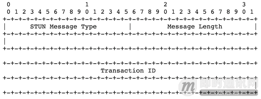

**消息类型许可的值如下：**  
  

  * 0x0001：捆绑请求
  * 0x0101：捆绑响应
  * 0x0111：捆绑错误响应
  * 0x0002：共享私密请求
  * 0x0102：共享私密响应
  * 0x0112：共享私密错误响应  

  
消息长度，是消息大小的字节数，但不包括20字节的头部。事务ID，128位的标识符，用于随机请求和响应，请求与其相应的所有响应具有相同的标识符。  
  
**【Ø  消息属性】**  
  
消息头之后是0或多个属性，每个属性进行TLV编码，包括16位的属性类型、16位的属性长度和变长属性值。  
  
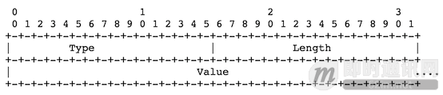
  
**属性类型定义如下：**  
  

  * MAPPED-ADDRESS：MAPPED-ADDRESS属性表示映射过的IP地址和端口。它包括8位的地址族，16位的端口号及长度固定的IP地址。
  * RESPONSE-ADDRESS：RESPONSE-ADDRESS属性表示响应的目的地址
  * CHASNGE-REQUEST：客户使用32位的CHANGE-REQUEST属性来请求服务器使用不同的地址或端口号来发送响应。
  * SOURCE-ADDRESS：SOURCE-ADDRESS属性出现在捆绑响应中，它表示服务器发送响应的源IP地址和端口。
  * CHANGED-ADDRESS：如果捆绑请求的CHANGE-REQUEST属性中的“改变IP”和“改变端口”标志设置了，则CHANGED-ADDRESS属性表示响应发出的IP地址和端口号。
  * USERNAME：USERNAME属性用于消息的完整性检查，用于消息完整性检查中标识共享私密。USERNAME通常出现在共享私密响应中，与PASSWORD一起。当使用消息完整性检查时，可有选择地出现在捆绑请求中。
  * PASSWORD：PASSWORD属性用在共享私密响应中，与USERNAME一起。PASSWORD的值是变长的，用作共享私密，它的长度必须是4字节的倍数，以保证属性与边界对齐。
  * MESSAGE-INTEGRITY：MESSAGE-INTEGRITY属性包含STUN消息的HMAC-SHA1，它可以出现在捆绑请求或捆绑响应中；MESSAGE-INTEGRITY属性必须是任何STUN消息的最后一个属性。它的内容决定了HMAC输入的Key值。
  * ERROR-CODE：ERROR-CODE属性出现在捆绑错误响应或共享私密错误响应中。它的响应号数值范围从100到699。
  * UNKNOWN-ATTRIBUTES：UNKNOWN-ATTRIBUTES属性只存在于其ERROR-CODE属性中的响应号为420的捆绑错误响应或共享私密错误响应中。
  * REFLECTED-FROM：REFLECTED-FROM属性只存在于其对应的捆绑请求包含RESPONSE-ADDRESS属性的捆绑响应中。属性包含请求发出的源IP地址，它的目的是提供跟踪能力，这样STUN就不能被用作DOS攻击的反射器。  

  
**具体的ERROR-CODE（响应号），与它们缺省的原因语句一起，目前定义如下：**  
  

  * 400（错误请求）：请求变形了。客户在修改先前的尝试前不应该重试该请求。
  * 401（未授权）：捆绑请求没有包含MESSAGE-INTERITY属性。
  * 420（未知属性）：服务器不认识请求中的强制属性。
  * 430（过期资格）：捆绑请求没有包含MESSAGE-INTEGRITY属性，但它使用过期
  * 的共享私密。客户应该获得新的共享私密并再次重试。
  * 431（完整性检查失败）：捆绑请求包含MESSAGE-INTEGRITY属性，但HMAC验
  * 证失败。这可能是潜在攻击的表现，或者客户端实现错误
  * 432（丢失用户名）：捆绑请求包含MESSAGE-INTEGRITY属性，但没有
  * USERNAME属性。完整性检查中两项都必须存在。
  * 433（使用TLS）：共享私密请求已经通过TLS（Transport Layer Security，即安全
  * 传输层协议）发送，但没有在TLS上收到。
  * 500（服务器错误）：服务器遇到临时错误，客户应该再次尝试。
  * 600（全局失败）：服务器拒绝完成请求，客户不应该重试。  

  
属性空间分为可选部分与强制部分，值超过0x7fff的属性是可选的，即客户或服务器即使不认识该属性也能够处理该消息；值小于或等于0x7fff的属性是强制理解的，即除非理解该属性，否则客户或服务器就不能处理该消息。  
  

#####2.1.2实现原理

  
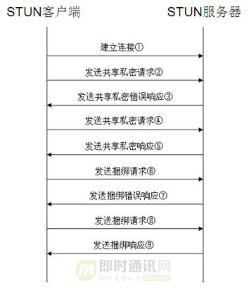

  
STUN协议的完整交互过程如上，下面我们来介绍具体实现步骤。  
  
一般情况下，客户会配置STUN服务器提供者的域名，该域名被解析为IP地址和SRV过程的端口号。服务器名是“stun”，使用UDP协议发送捆绑请求，使用TCP协议发送共享私密请求。STUN协议的缺省端口号为3478。  
  
若要提供完整性检查，STUN在客户和服务器间使用128位的共享私密，作为在捆绑请求和捆绑响应中的密匙。  
  
首先，客户通过发现过程获得它将与之建立TCP连接的IP地址和端口号。客户打开该地址和端口的连接，开始TLS协商，验证服务器的标识。客户发送共享私密请求。该请求没有属性，只有头。服务器生成响应。  
  
客户会在该连接上生成多个请求，但在获得用户名和密码后关闭该连接。  
  
服务器收到共享私密请求，验证从TLS连接上到达的该请求；如果不是通过TLS收到的请求，则生成共享私密错误响应，并设置ERROR-CODE属性为响应号433；这里区分两种情况：若通过TCP收到请求，则错误响应通过收到请求的相同连接发送；若通过UDP收到请求，则错误响应发送回请求送出的源IP和端口。  
  
服务器检查请求中的任何属性，当其中有不理解的小于或等于0x7fff的值，则生成共享私密错误响应，设置ERROR-CODE属性为响应号420,并包括UNKNOWN-ATTRIBUTE属性，列出它不理解的小于或等于0x7fff的属性的值。该错误响应通过TLS连接发送。  
  
若请求正确，服务器创建共享私密响应，包含与请求中相同的事务ID，并包含USERNAME和PASSWORD属性。用户名在10分钟内有效。  
  
共享私密响应通过与收到请求的相同的TLS连接发送，服务器保持连接打开状态，由客户关闭它。  
  
接着，客户发送捆绑请求，携带的属性包括：  

  * 可选属性：RESPONSE-ADDRESS属性和CHANGE-REQUEST属性；
  * 强制属性：MESSAGE-INTEGRITY属性和USERNAME属性。  

  
客户发送捆绑请求，通过客户重传来提供可靠性。客户开始用100ms的间隔重传，每次重传间隔加倍，直至1.6秒。之间间隔1.6秒的重传继续，直到收到响应或总共已经发送了9次。因此，若9500ms后，还未收到响应，客户认为传输已经失败。  
  
服务器检查捆绑请求的MESSAGE-INTEGRITY属性，不存在则生成捆绑错误响应，设置ERROR-
CODE属性为响应号401；若存在，计算请求的HMACKey值。  
  
服务器检查USERNAME属性，不存在则生成捆绑错误响应，设置ERROR-CODE属性为响应号432；若存在，但不认识该USERNAME的共享私密（例如，它超时了），生成捆绑错误响应，设置ERROR-CODE属性为响应号430。  
  
若服务器知道该共享私密，但所计算的HMAC与请求的不同，生成捆绑错误响应，设置ERROR-CODE属性为响应号431。  
  
假设消息完整性检查通过了，服务器检查请求中的任何属性的值，若遇到不理解的小于或等于0x7fff的值，生成捆绑错误响应，设置ERROR-CODE属性为响应号420，该响应包含UNKNOWN-ATTRIBUTE属性，并列出不理解的小于或等于0x7fff的属性。  
  
若请求正确，服务器生成单个捆绑响应，包含与捆绑请求相同的事务ID。服务器在捆绑响应中加入MAPPED-ADDRESS属性，该属性的IP地址和端口号为捆绑请求的源IP地址和端口号。  
  
**捆绑响应的源地址和端口号取决于捆绑请求中CHANGE-REQUEST属性的值及捆绑请求收到的地址和端口号相关。总结如下：**  
  
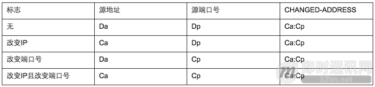

  
服务器在捆绑响应中加入SOURCE-ADDRESS属性，包含用于发送捆绑响应的源地址和端口号；加入CHANGED-ADDRESS属性，包含源IP地址和端口号。  
  
如果捆绑请求中包含了USERNAME和MESSAGE-INTEGRITY属性，则服务器在捆绑响应中加入MESSAGE-INTEGRITY属性。  
  
如果捆绑请求包含RESPONSE-ADDRESS属性，则服务器在捆绑响应中加入REFLECTED-
FROM属性：如果捆绑请求使用从共享私密请求获得的用户名进行认证，则REFLECTED-
FROM属性包含共享私密请求到达的源IP地址和端口号；若请求中的用户名不是使用共享私密分配的，则REFLECTED-FROM属性包含获得该用户名的实体的源IP地址和端口号；若请求中没有用户名，且服务器愿意处理该请求，则REFLECTED-FROM属性包含请求发出的源IP地址和端口号。  
  
服务器不会重传响应，可靠性通过客户周期性地重发请求来保障，每个请求都会触发服务器进行响应。  
  
客户端判断响应的类型是捆绑错误响应还是捆绑响应。捆绑错误响应通常在请求发送的源地址和端口收到；捆绑响应通常在请求中的RESPONSE-ADDRESS属性的地址和端口收到，若没有该属性，则捆绑响应将在请求发送的源地址和端口号收到。  
  

  * 若是捆绑错误响应，客户检查响应中的ERROR-CODE属性的响应号：400至499之间的未知属性按属性400处理，500至599之间的未知属性按500处理，600至699之间的未知属性按600处理。任何100和399之间的响应都会使请求重传中止，但其他则忽略；若客户收到响应的属性类型大于0x7fff，则忽略该属性，若小于或等于0x7fff，则请求重传停止，并忽略整个响应；
  * 若是捆绑响应，客户检查响应的MESSAGE-INTEGRITY属性：如果不存在，客户在请求中加入MESSAGE-INTEGRITY属性，并放弃该响应；如果存在，客户计算响应的HMAC。如果计算出的HMAC与响应中的不同，则放弃该响应，并警告客户可能受到了攻击；若计算出的HMAC与响应中的匹配，则过程继续；
  * 不论收到捆绑响应还是捆绑错误响应，都将中止该请求的重传。客户在第一次响应后继续监听捆绑请求的响应10秒钟，如果这期间它收到任何消息类型不同的响应或不同的MAPPED-ADDRESS属性，它将警告用户可能受到攻击；并且，如果客户收到的捆绑响应次数超过它发送的捆绑请求数的两倍，它将警告用户可能受到攻击；若捆绑响应经过认证，上述攻击并未导致客户丢弃MAPPED-ADDRESS，则客户可以使用该MAPPED-ADDRESS和SOURCE-ADDRESS属性。  

#####2.1.3STUN功能举例

客户通过带外方式获得STUN服务器信息后，就打开对应的地址和端口的连接，并开始与STUN服务器进行TLS协商。一旦打开了连接，客户就通过TCP协议发送共享私密请求，服务器生成共享私密响应。STUN在客户和服务器间使用共享私密，用作捆绑请求和捆绑响应中的密匙。之后，客户使用UDP协议向STUN服务器发送捆绑请求，当捆绑请求消息到达服务器的时候，它可能经过了一个或者多个NAT。结果是STUN服务器收到的捆绑请求消息的源IP地址被映射成最靠近STUN服务器的NAT的IP地址，STUN服务器把这个源IP地址和端口号复制到一个捆绑响应消息中，发送回拥有这个IP地址和端口号的客户端。  
  
当STUN客户端收到捆绑响应消息之后，它会将自己发送捆绑请求时绑定的本地IP地址和端口号同捆绑响应消息中的IP地址和端口号进行比较，如果不匹配，就表示客户端正处于一个或者多个NAT的前面。  
  
在Full-Cone NAT的情况下，在捆绑响应消息中的IP地址和端口是属于公网的，公网上的任何主机都可以使用这个IP地址和端口号向这个应用程序发送数据包，应用程序只需要在刚才发送捆绑请求的IP地址和端口上监听即可。  
  
当然，客户可能并不在一个Full-Cone NAT的前面，实际上，它并不知道自己在一个什么类型的NAT的前面。为了确定NAT的类型，客户端使用附加的捆绑请求。具体过程是很灵活的，但一般都会像下面这样工作：客户端再发送一个捆绑请求，这次发往另一个IP地址，但是使用的是跟上一次同一个源IP地址和源端口号，如果返回的数据包里面的IP地址和端口号和第一次返回的数据包中的不同，客户端就会知道它是在一个对称NAT的前面。客户端为了确认自己是否在一个完全锥形NAT的前面，客户端可以发送一个带有标志的捆绑请求，这个标志告诉服务器使用另一个IP地址和端口发送捆绑响应。换句话说，如果客户端使X/Y的IP地址端口对向A/B的IP地址端口对
发送捆绑请求，服务器就会使用源IP地址和源端口号为C/D的地址端口对向X/Y发送捆绑响应。如果客户端收到了这个响应，它就知道它是在一个Full-ConeNAT前面。  
  
STUN协议允许客户端请求服务器从收到捆绑请求的IP地址往回发捆绑响应，但是要使用不同的端口号。这可以用来检查客户端是否在Port Restricted Cone NAT的前面还是在Restricted Cone NAT的前面。  

####2.2 RFC5389/STUN

  
STUN协议在RFC5389中被重新命名为Session Traversal Utilities for NAT，即NAT会话穿透效用。在这里，NAT会话穿透效用被定位为一个用于其他解决NAT穿透问题协议的协议。它可以用于终端设备检查由NAT分配给终端的IP地址和端口号。同时，它也被用来检查两个终端之间的连接性，好比是一种维持NAT绑定表项的保活协议。STUN可以用于多种NAT类型，并不需要它们提供特殊的行为。  
  
STUN本身不再是一种完整的NAT穿透解决方案，它相当于是一种NAT穿透解决方案中的工具。这是与RFC3489/STUN版本相比最重要的改变。  
  

#####2.2.1STUN用途

  
**目前定义了三种STUN用途：**  
  

  * Interactive Connectivity Establishment（ICE）[MMUSIC-ICE]，交互式连接建立
  * Client-initiated connections for SIP [SIP-OUTBOUND]，用于SIP的客户端初始化连接
  * NAT Behavior Discovery [BEHAVE-NAT]，NAT行为发现  

  

#####2.2.2报文结构

  
**【Ø  消息头】**  
  
STUN消息头为20字节，后面紧跟0或多个属性。STUN头部包含一STUN消息类型、magic cookie、事务ID和消息长度。  
  
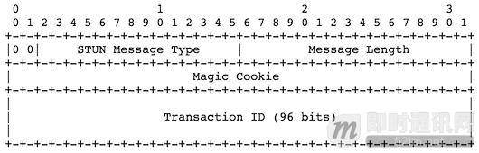
  
每个STUN消息的最高位前2位必须为0。当STUN协议为多个协议多路复用时若使用的是同一个端口，这可以用于与其他协议区分STUN数据包。消息类型确定消息的类别（如请求、成功回应、失败回应、标志）。虽然这里有四种消息类型，但可以分为2类事务：请求/响应事务、标志事务。  
  
**消息类型字段可进一步划分为下面结构：**  
  

  
  
**消息类型定义如下：**  
  

  * 0b00，表示请求
  * 0b01，表示标志
  * 0b10，表示成功响应
  * 0b11，表示错误响应  

  
魔术字域必须包含固定的值0x2112A442。在RFC3489中，该域是事务ID的一部分。配置魔术字允许服务器检测客户是否理解某些在改进的版本中增加的属性。另外，还可用于STUN多路复用时与其他协议的包进行区分。  
  
96位的事务ID用于唯一的识别STUN事务。对于请求/响应事务，事务ID由STUN客户端来选择；对于标志事务，由代理（代理指支持STUN的客户端或服务器）来选择并发送。它主要服务于与请求相关的响应，因此它也扮演着一个帮助阻止确定类型的攻击的角色。服务器使用事务ID来唯一的标识出所有客户端的每一个事务。事务ID本身必须是唯一的，并且随机的从0到2的96-1次方中选择。重新发送相同的请求时，也必须使用新的事务ID。成功或错误响应必须携带与相对应的请求相同的事务ID。  
  
消息长度字段不包括20字节的STUN头部。所有的STUN属性必须填充为4字节的倍数。消息长度字段的最后2位总是为0，这为区分STUN包与其他协议的包提供了另外一种方法。  
  
**【Ø  消息属性】**  
  
STUN头之后是0或多个属性。每个属性都采用TLV编码，16位的类型、16位的长度及可变长度的值。每个STUN属性必须是4字节边界对齐。  
  
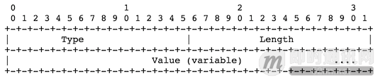
  
属性空间被划分为2个范围。属性的类型值在0x0000到0x7fff是强制理解属性，这意味着除非STUN代理能够理解这些属性，否则将不能正常处理包含该属性的消息；属性的类型值在0x8000到0xffff范围是可选理解属性，这意味着如果STUN代理不能理解它们的话这些属性可以被忽略。  
  
STUN属性类型集由IANA维护，具体定义详见[IETF官方文档
RFC5389](https://tools.ietf.org/html/rfc5389)。  

###2.3 RFC5389与RFC3489的区别

  
**RFC5389与RFC3489的不同点如下：**  
  

  * 去掉STUN是一种完整的NAT穿透方案的概念，现在是一种用于提供NAT穿透解决方案的工具。因而，协议的名称变为NAT会话穿透效用；
  * 定义了STUN的用途；
  * 去掉了STUN关于NAT类型检测和绑定生命期发现的用法，去掉了RESPONSE-ADDRESS、CHANGED-ADDRESS、CHANGE-REQUEST、SOURCE-ADDRESS和REFLECTED-FROM属性；
  * 增加了一个固定的32位的魔术字字段，事务ID字段减少了32位长度；
  * 增加了XOR-MAPPED-ADDRESS属性，若魔术字在捆绑请求中出现时，该属性包括在捆绑响应中。否则，RFC3489中的行为是保留的（换句话说，捆绑响应中包括MAPPED-ADDRESS）；
  * 介绍了消息类型字段的正式结构，带有一对明确的位来标识Request、Response、Error-Response或Indication消息。因此，消息类型字段被划分为类别和方法两部分；
  * 明确的指出了STUN的最高2位是0b00，当用于ICE时可以简单的与RTP包区分开来；
  * 增加指纹属性来提供一种明确的方法来检测当STUN协议多路复用时，STUN与其他协议之间的差异；
  * 增加支持IPv6，IPv4客户端可以获取一个IPv6映射地址，反之亦然；
  * 增加一个long-term-credential-based认证机制；
  * 增加了SOFTWARE、REALM、NONCE和ALTERNATE-SERVER属性；
  * 去掉了共享密匙方法，因此PASSWORD属性也去掉了；
  * 去掉了使用连续10秒侦听STUN响应来识别一个攻击的做法；
  * 改变事务计时器来增加TCP友好性；
  * 去掉了STUN例子如集中分离控制和媒体面，代替的，在使用STUN协议时提供了更多的信息；
  * 定义了一类填充机制来改变长度属性的说明；
  * REALM、SERVER、原因语句和NONCE限制在127个字符，USERNAME限制在513个字节以内；
  * 为TCP和TLS改变了DNS SRV规程，UDP仍然和以前保持一致。  

  
IETF官文档，详见：[RFC5389](https://tools.ietf.org/html/rfc5389)、[RFC3489](https://tools.ietf.org/html/rfc3489)。  

####2.4 新特性介绍

#####2.4.1指纹机制

  
FINGERPRINT机制是一种可选的用于其他协议多路复用STUN时发送给相同的传输地址时区分STUN数据包的机制，该机制不支持与RFC3489相兼容。  
  
在一些用途中，基于相同的传输地址时多个协议会多路复用STUN消息，例如RTP协议。STUN消息必须首先和应用报文分离开。目前，在STUN报头中有3种固定的字段可以用于该目的。尽管如此，在一些案例中，三种固定字段仍然不能充分的区别开。  
  
当扩展的指纹机制被使用时，STUN代理在发送给其他STUN代理的消息中包括FINGERPRINT属性。当其他STUN代理收到时，除基本的检查之外，还将检查是否包含FINGERPRINT属性及它是否包含正确的值，至此，它将相信这是一个STUN消息。指纹机制帮助STUN代理检查其他协议那些看起来像是STUN消息的消息。  
  

####2.4.2通过DNS发现服务器机制

  
STUN客户端可以使用DNS来发现STUN服务器的IP地址和端口。客户端必须知道服务器的域名。  
  
当客户端希望找出服务器在公网上的位置就采用捆绑请求/响应事务，SRV（资源记录表）中服务器名称是“stun”。当通过TLS会话采用捆绑请求/响应事务，SRV中服务器名称为“stuns”。STUN用户可以定义额外的DNS资源记录服务名称。  
  
STUN请求的默认端口是3478，用于TCP和UDP。STUN在TLS上的默认端口是5349。服务器能够在TLS上运行STUN与STUN在TCP上时使用相同的端口，只有服务器软件支持决定初始消息是否是TLS或STUN消息。  
  
如果SRV中没有记录可查，客户端执行A或AAAA记录查找域名。结果将会是1张IP地址表，每一个都可以使用TCP或UDP采用默认端口号连接。通常要求使用TLS，客户端使用STUN在TLS上的默认端口号连接其中一个IP地址。  
  

#####2.4.3认证和消息完整性机制

  
**短期证书机制**  

短期证书机制假设在STUN事务之前，客户端和服务器已经使用了其他协议来交换了证书，以username和password形式。这个证书是有时间限制的。例如，在ICE用途中，两个终端使用带外方式交换信息来对username和password达成一致，并在媒体会话期间使用。这个证书被用来进行消息完整性检查，用于每个请求和多个响应中。与长期证书机制相比，没有挑战和响应方式，因此，这种证书的时间限制特性的优点是可以阻止重播。  
  
**长期证书机制**  

长期证书机制依赖于一个长期证书，username和password在客户端和服务器中是共用的。这个证书从它提供给用户开始将一直是有效的，直到该用户不再是该系统的用户。这本质上是一个提供给用户username和password的传统的登入方式。  
  
客户端初始发送一个请求，没有提供任何证书和任何完整性检测。服务器拒绝这个请求，并提供给用户一个范围（用于指导用户或代理选择username和password）和一个nonce。这个nonce提供重放保护。它是一个cookie，由服务器选择，以这样一种方式来标示有效时间或客户端身份是有效的。客户端重试这个请求，这次包括它的username和realm和服务器提供的nonce来回应。服务器确认这个nonce和检查这个message integrity。如果它们匹配，请求则通过认证。如果这个nonce不再有效，即过期了，服务器就拒绝该请求，并提供一个新的nonce。  
  
在随后的到同一服务器的请求，客户端重新使用这个nonce、username和realm，和先前使用的password。这样，随后的请求不会被拒绝直到这个nonce变成无效的。需要注意的是，长期证书机制不能用来保护Indications，由于Indications不能被改变，因此，使用Indications时要么使用短期证书，要么就省略认证和消息完整性。因为长期证书机制对离线字典攻击敏感，部署的时候应该使用很难猜测的密码。  
  

#####2.4.4备份服务器机制

  
服务器使用增强的重定向功能将一个客户端转向另一个服务器，通过回应一个错误响应号为300（尝试备份）的错误响应。服务器在错误响应中携带一个ALTERNATE-SERVER属性。  
  
客户端收到错误响应号为300的错误响应后，在该响应中查找ALTERNATE-SERVER属性。若找到一个，客户端就会将当前的事务作废，并重新尝试发送请求到该属性中列出的服务器。请求报文若已经通过认证，则必须使用与先前发送给执行重定向操作的服务器同样的证书。如果客户端在最后5分钟里已经重试发送请求时已经重定向到了一个服务器，它必须忽略重定向操作并将当前的事务作废，这是为了防止无限的重定向循环。  

####2.5 RFC5389与RFC3489的兼容

  
**在RFC3489中：**  
  
  * UDP是唯一支持的传输协议
  * RFC5389中的魔术字字段是[RFC3489](https://tools.ietf.org/html/rfc3489)中事务ID的一部分，事务ID长128位
  * 没有XOR-MAPPED-ADDRESS属性，绑定方法是使用MAPPED-ADDRESS属性代替
  * 有3个需要强制理解的属性，分别是：RESPONSE-ADDRESS、CHANGE-REQUEST、CHANGED-ADDRESS属性，而RFC5389中不再支持这些属性。  

 
#####2.5.1客户端处理的改变

  
客户端想要与[RFC3489](https://tools.ietf.org/html/rfc3489)的服务器互操作，应发送一个使用绑定方法的请求消息，不包含任何消息，使用UDP协议发送给服务器。如果成功，将收到服务器发回的包含MAPPED-ADDRESS属性而不是XOR-MAPPED-ADDRESS属性的成
功响应。客户端试图与基于RFC3489的应用服务器互操作必须准备好接收任意一个属性。此外，客户端必须忽略任何在响应中出现的保留的强制理解的属性。[RFC3489](https://tools.ietf.org/html/rfc3489)中规定保留属性中的0x0002、0x0004、0x0005和0x000B可能出现在绑定响应中。  
  

#####2.5.2服务器处理的改变

  
服务器能够察觉由[RFC3489](https://tools.ietf.org/html/rfc3489)中的客户端发送的携带有不正确的魔术字的捆绑请求消息。当服务器察觉到[RFC3489](https://tools.ietf.org/html/rfc3489)中的客户端，它应该将捆绑请消息中魔术字域中的值
拷贝到捆绑响应中的魔术字字段中，并且插入一个MAPPED-ADDRESS属性代替XOR-MAPPED-ADDRESS属性。  
  
客户端在极少的环境下可能包括RESPONSE-ADDRESS或CHANGE-REQUEST属性中的一个。在这些情况下，服务器把这些属性看做是一个不认识的强制理解的属性，并回应一个错误响应。[RFC3489](https://tools.ietf.org/html/rfc3489)版本中的STUN缺少魔术字和指纹
属性这两种能够高可靠性的正确标识其他协议多路复用时的STUN消息。因此，STUN执行与[RFC3489](https://tools.ietf.org/html/rfc3489)兼容时不应该被用于多个协议。  

###3、TURN详解  

####3.1 RFC5766/TURN

TURN，在[RFC5766](https://tools.ietf.org/html/rfc5766)中定义，英文全称Traversal Using Relays around NAT（TURN）：Relay Extensions to Session Traversal Utilities for NAT（STUN），即使用中继穿透NAT：STUN的中继扩展。简单的说，TURN与STUN的共同点都是通过修改应用层中的私网地址达到NAT穿透的效果，异同点是T
URN是通过两方通讯的“中间人”方式实现穿透。  
  
如果一个主机位于NAT的后面，在某些情况下它不能够与其他主机点对点直接连接。在这些情况下，它需要使用中间网点提供的中继连接服务。TURN协议就是用来允许主机控制中继的操作并且使用中继与对端交换数据。TURN与其他中继控制协议不同的是它能够允许一个客户端使用一个中继地址与多个对端连接。  
  
TURN协议被设计为ICE的一部分，用于NAT穿越，虽然如此，它也可以在没有ICE的地方单独使用。  

####3.2 操作概述

  
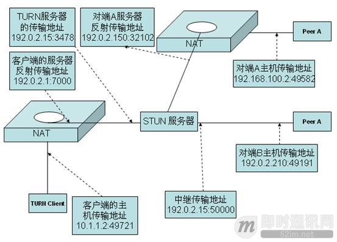
  
在一个典型组网中，一个TURN客户端连接在一个私有网络中，通过一个或多个NAT来连接到公网。在公网中有一个TURN服务器。在因特网的别处有一个或多个对端是这个TURN客户端希望通讯的。这些对端也有可能是在一个或多个NAT的后面。该客户端使用服务器作为一个中继来发送数据包 到这些对端去，并且从这些对端接收数据包。  
  
客户端通过一个IP地址和端口的组合来与服务器建立会话。客户端使用TURN命令在服务器上创建和操作一个ALLOCATION。一旦这个allocation创建好了，客户端能够在数据发往哪个对端的指示下发送应用数据到这个服务器，服务器将中继这些数据到合适的对端。客户端发送的应用数据包含在TURN消息中，服务器将数据提取出来，并以UDP数据包方式发送给对端。反向上，对端以UDP数据包方式发送应用数据到这个allocation提供的中继传输地址。因为TURN消息总是包含客户端与哪些对端通讯的指示，客户端能够使用单一的allocation来与多个对端通讯。  

####3.3 术语

  * TURN client：遵循RFC5766的STUN客户端。
  * TURN server：遵循RFC5766的STUN服务器。
  * Peer：TURN客户端希望连接的主机。TURN服务器为TURN客户端和它的对端中继流量，但Peer并不与TURN服务器使用TURN协议进行交互，它接收从TURN服务器发送过来的数据，并向TURN服务器发送数据。
  * Transport Address：IP地址与端口号的组合。
  * Host Transport Address：客户端或对端的传输地址。
  * Server-Reflexive Transport Address：NAT公网侧的传输地址，该地址由NAT分配，相当于一个特定的主机传输地址。
  * Relayed Transport Address：TURN服务器上的传输地址，用于客户端和对端中继数据。
  * TURN Server Transport Address：TURN服务器上的传输地址，用于客户端发送STUN消息给服务器。
  * Peer Transport Address：服务器看到的对端的传输地址，当对端是在NAT后面，则是对端的服务器反射传输地址。
  * Allocation：通过Allocate请求将中继传输地址提供给客户端，除了中继状态外，还有许可和超时定时器等。
  * 5-tuple：五元组，包括客户端IP地址和端口，服务器IP地址和端口和传输协议（包括UDP、TCP、TLS）的组合。
  * Channel：通道号与对端传输地址的关联，一旦一个通道号与一个对端的传输地址绑定，客户端和服务器就能够利用带宽效应更大的通道数据消息来交换数据。
  * Permission：一个对端允许使用它的IP地址和传输协议来发送数据到TURN服务器，服务器只为从对端发来的并且匹配一个已经存在的许可的流量中继到相应的客户端。
  * Realm：服务器内用于描述服务器或内容的一个字符串，这个realm告诉客户端哪些用户名和密码的组合可用于认证请求。
  * Nonce：服务器随机选择的一个字符串，包含在报文摘要中。为了防止中继攻击，服务器应该有规律的改变这个nonce。  

  
具体协议细节，详见IETF官方文档：[RFC5766](https://tools.ietf.org/html/rfc5766).  

####3.4 协议交互过程详细举例

  
以上图为例进行讲解，每个消息中，多个属性包含在消息中并显示它们的值。为了方便阅读，值以人们可读的格式来显示。  
  
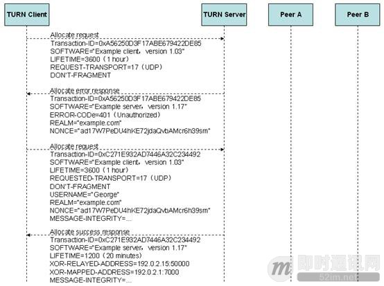
  
客户端使用10.1.1.2:49271作为传输地址向服务器的传输地址发送Allocate请求。客户端随机选择一个96位的事务ID。该Allocate请求消息包括SOFTWARE属性来提供客户端的软件版本信息；包括LIFETIME属性，指明客户端希望该allocation具有1小时的生命期而非缺省的10分钟；包括REQUESTED-TRANSPORT属性来告诉服务器与对端之间采用UDP协议来传输；包括DONT-FRAGMENT属性因为客户端希望在随后的Sendindications中使用DON’T-FRAGMENT属性。  
  
服务器需要任何请求必须是经过认证的，因此服务器拒绝了该最初的Allocation请求，并且回应了携带有错误响应号为401（未授权）的Allocate错误响应；该响应包括一个REALM属性，指明认证的域；还包括一个NONCE属性和一个SOFTWARE属性。  
  
客户端收到了错误响应号为401的Allocate错误响应，将重新尝试发送Allocate请求，此时将包括认证属性。客户端在新的请求中重新选择一个新的事务ID。客户端包括一个USERNAME属性，使用从服务器那收到的realm值来帮助它决定使用哪个值；请求还包括REALM和NONCE属性，这两个属性是从收到的错误响应中拷贝出来的。最后，客户端包括一个MESSAGE-INTEGRITY属性。  
  
服务器收到认证的Allocate请求后，检查每个属性是否正确；然后，产生一个allocation，并给客户端回应Allocate成功响应。服务器在该成功响应中携带一个LIFETIME属性，本例中服务器将客户端请求的1小时生命期减小为20分钟，这是因为这个特定的服务器可能不允许超过20分钟的生命期；该响应包括XOR-RELAYED-ADDRESS属性，值为该allocation的中继传输地址；该响应还包括XOR-MAPPED-ADDRESS属性，值为客户端的server-reflexive地址；该响应也包含一个SOFTWARE属性；最后，包括一个MESSAGE-INTEGRITY属性来证明该响应，确保它的完整性。 
  
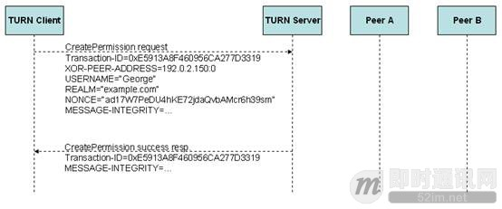

接着，客户端为了准备向对端A发送一些应用数据而创建一个permission。这里通过一个CreatePermission请求来做到。该请求携带XOR-PEER-ADDRESS属性包含有确定的请求的IP地址，这里为对端A的地址；需要注意的是，属性中地址的端口号被设置为0在CreatePermission请求中，并且客户端使用的是对端A的server-reflexive地址而不是它的主机地址（私网地址）；客户端在该请求中携带与之前的Allocate请求中一样的username、realm和nonce值，因此该请求被服务器认可。此时在该请求中，客户端没有携带SOFTWARE属性。  
  
服务器收到该CreatePermission请求，产生一个相应的许可，并以CreatePermission成功响应来回应。该响应中只包含了Transaction-ID和MESSAGE-INTEGRITY属性。  
  
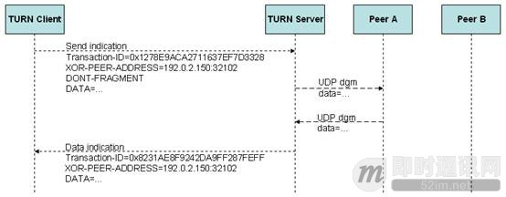
  
现在客户端使用Send indication来发送应用数据到对端A。对端的server-reflexive传输地址包含在XOR-PEER-ADDRESS属性中，应用数据包含在DATA属性中。客户端已经在应用层上执行了路径MTU发现功能，因此通过DON’T-FRAGMENT属性来告知服务器当通过UDP方式来向对端发送数据时应设置DF位。Indications不能使用长期证书机制来认证，所以该消息中没有MESSAGE-INTEGRITY属性。  
  
服务器收到Send indication后，提取出应用数据封装成UDP格式发给对端A；UDP报文的源传输地址为中继传输地址，并设置DF位。  
  
对端A回应它自己的包含有应用数据的UDP包给服务器。目的地址为服务器的中继传输地址。当服务器收到后，将生成Data indication消息给客户端，携带有XOR-PEER-ADDRESS属性。应用数据包含在DATA属性中。  
  
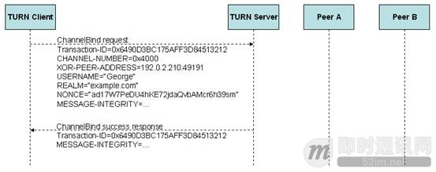 
  
客户端现在若要绑定一个通道到对端B，将指定一个空闲的通道号（本例中为0x4000）包含在CHANNEL-NUMBER属性中，对端B的传输地址包含在XOR-PEER-ADDRESS属性中。与以前一样，客户端再次利用上次请求中的username、realm和nonce。  
  
当服务器收到该请求后，服务器绑定这个对端的通道号，为对端B的IP地址安装一个permission，然后给客户端回应一个ChannelBind成功响应消息。  
  
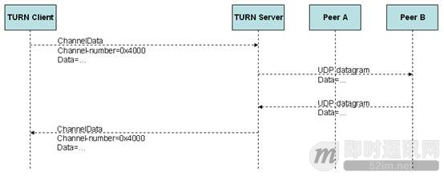
  
客户端现在发送一个ChannelData消息给服务器，携带有发送给对端B的数据。这个消息不是一个STUN消息，因此没有事务ID。它之有3个字段：通道号、数据、数据长度；服务器收到后，检查通道号后发现当前已经绑定了，就以UDP方式发送数据给对端B。  
  
接着，对端B发送UDP数据包回应给服务器的中继传输地址。服务器收到后，回应给客户端ChannelData消息，包含UDP数据包中的数据。服务器知道是给哪个客户端发送ChannelData消息，这是因为收到的UDP数据包中的目的地址（即服务器的中继传输地址），并且知道使用的是哪个通道号，这是因为通道已经与相应的传输地址绑定了。  
  
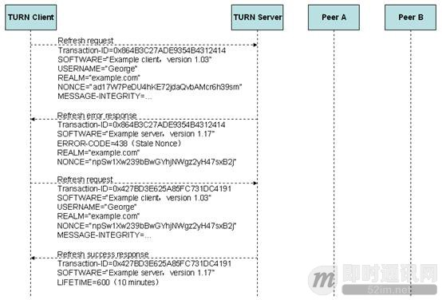
  
有时候，20分钟的生命期已经到了，客户端需要刷新allocation。此时通过发送Refresh请求来进行。该请求包含最后一次使用的username、realm和nonce，还包含SOFTWARE属性。当服务器收到这个Refresh请求时，它注意到这个nonce值已经超期了，则给客户端回应一个错误响应号为438（过期Nonce）的Refresh错误响应，并提供一个新的nonce值。可护端将重试该请求，此时携带新的nonce值。若第二次尝试被接受，服务器将回应一个成功响应。需要注意的是，此时客户端在请求中没有携带LIFETIME属性，所以服务器刷新客户端的allocation时采用缺省的10分钟生命期。  

###4、ICE简明介绍

####4.1 简介

  
ICE的全称Interactive Connectivity Establishment（互动式连接建立），由IETF的MMUSIC工作组开发出来的，它所提供的是一种框架，使各种NAT穿透技术可以实现统一。ICE跟STUN和TURN不一样，ICE不是一种协议，而是一个框架（Framework），它整合了STUN和TURN。  

####4.2 应用模型

  
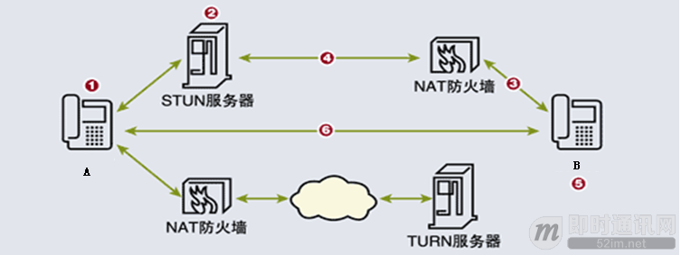
  
**如上图所示，如果A想与B通信，那么其过程如下：**  

  * 1）A收集所有的IP地址，并找出其中可以从STUN服务器和TURN服务器收到流量的地址；
  * 2）A向STUN服务器发送一份地址列表，然后按照排序的地址列表向B发送启动信息，目的是实现节点间的通信；
  * 3）B向启动信息中的每一个地址发送一条STUN请求；
  * 4）A将第一条接收到的STUN请求的回复信息发送给B；
  * 5）B接到STUN回复后，从中找出那些可在A和B之间实现通信的地址；
  * 6）利用列表中的排序列最高的地址进一步的设备间通信。  

  
由于该技术是建立在多种NAT穿透协议的基础之上，并且提供了一个统一的框架，所以ICE具备了所有这些技术的优点，同时还避免了任何单个协议可能存在的缺陷。因此，ICE可以实现在未知网络拓扑结构中实现的设备互连，而且不需要进行对手配置。另外，由于该技术不需要为VoIP流量手动打开防火墙，所以也不会产生潜在的安全隐患。  

###5、本文总结

  
在现实Internet网络环境中，大多数计算机主机都位于防火墙或NAT之后，只有少部分主机能够直接接入Internet。很多时候，我们希望网络中的两台主机能够直接进行通信（即所谓的P2P通信），而不需要其它公共服务器的中转。由于主机可能位于防火墙或NAT之后，在进行P2P通信之前，我们需要进行检测以确认它们之间能否进行P2P通信以及如何通信。这种技术通常被称为NAT穿透（NAT Traversal）。  
  
RFC3489中定义的STUN，即简单地用UDP穿过NAT（STUN）是个轻量级的协议。它允许应用发现它们与公共互联网之间存在的NAT和防火墙及其他类型。它还为应用提供判断NAT给它们分配的公共网际协议（IP）地址。STUN可工作在许多现存NAT上，并且不需要它们做任何特别的行为。它允许广泛的各类的应用穿越现存的NAT设施。  
  
RFC5389中对STUN协议进行了修订，将其定位于为穿透NAT提供工具，即NAT会话穿透效用是一个用于其他解决NAT穿透问题协议的协议。它可以用于终端设备检查由NAT分配给终端的IP地址和端口号。同时，它也被用来检查两个终端之间的连接性，好比是一种维持NAT绑定表项的保活协议。STUN本身并不是一种完整的NAT穿透解决方案。它相当于是一种NAT穿透解决方案中的工具。这是与先前的版本相比最重要的改变。之前的RFC3489中定义的STUN是一个完整的穿透NAT解决方案。此外，最大的区别是支持TCP穿透。  
  
RFC5766中对STUN协议再次进行了扩展，即中继穿透NAT：STUN的扩展。TURN与STUN的共同点都是通过修改应用层中的私网地址达到NAT穿透的效用，异同点是TUN采用了两方通讯的“中间人”方式实现穿透，突破了原先STUN协议无法在两台主机不能够点对点直接连接下提供作用的限制。  
  
技术无止境，NAT穿透技术仍在不断更新中，这里只对STUN/TURN协议作了简单的介绍，具体细节请参考[RFC3489](https://tools.ietf.org/html/rfc3489)/[5389](https://tools.ietf.org/html/rfc5389)/[5766](https://tools.ietf.org/html/rfc5766)。  
  
（原文链接：[点此进入](http://www.h3c.com.cn/MiniSite/Technology_Circle/Net_Reptile/The_Five/Home/Catalog/201206/747038_97665_0.htm#)，内容有修改和删节）  

