 
<!--BEGIN_DATA
{
    "create_date": "2019-12-16 11:16", 
    "modify_date": "2019-12-16 11:16", 
    "is_top": "0", 
    "summary": "P2P通信原理与实现", 
    "tags": "WebRTC、C/C++、网络", 
    "file_name": "P2P通信原理与实现.md"
}
END_DATA-->

####
原文出处：<a href='https://www.cnblogs.com/pannengzhi/p/4800526.html' target='blank'>P2P通信原理与实现(C++)</a>

当今互联网到处存在着一些中间件(MIddleBoxes)，如NAT和防火墙，导致两个(不在同一内网)中的客户端无法直接通信。这些问题即便是到了IPV6时代也会存在，因为即使不需要NAT，但还有其他中间件如防火墙阻挡了链接的建立。

当今部署的中间件大多都是在C/S架构上设计的，其中相对隐匿的客户机主动向周知的服务端(拥有静态IP地址和DNS名称)发起链接请求。大多数中间件实现了一种非对称的通讯模型，即内网中的主机可以初始化对外的链接，而外网的主机却不能初始化对内网的链接，除非经过中间件管理员特殊配置。在中间件为常见的NAPT的情况下（也是本文主要讨论的），内网中的客户端没有单独的公网IP地址，而是通过NAPT转换，和其他同一内网用户共享一个公网IP。这种内网主机隐藏在中间件后的不可访问性对于一些客户端

软件如浏览器来说并不是一个问题，因为其只需要初始化对外的链接，从某方面来看反而还对隐私保护有好处。

然而在P2P应用中，内网主机（客户端）需要对另外的终端（Peer）直接建立链接，但是发起者和响应者可能在不同的中间件后面，两者都没有公网IP地址。而外部对NAT公网IP和端口主动的链接或数据都会因内网未请求被丢弃掉。本文讨论的就是如何跨越NAT实现内网主机直接通讯的问题。

###2.术语

####防火墙（Firewall）：

防火墙主要限制内网和公网的通讯，通常丢弃未经许可的数据包。防火墙会检测(但是不修改)试图进入内网数据包的IP地址和TCP/UDP端口信息。

####网络地址转换器（NAT）：

NAT不止检查进入数据包的头部，而且对其进行修改，从而实现同一内网中不同主机共用更少的公网IP（通常是一个）。

####基本NAT（Basic NAT）：

基本NAT会将内网主机的IP地址映射为一个公网IP，不改变其TCP/UDP端口号。基本NAT通常只有在当NAT有公网IP池的时候才有用。

####网络地址-端口转换器（NAPT）：

到目前为止最常见的即为NAPT，其检测并修改出入数据包的IP地址和端口号，从而允许多个内网主机同时共享一个公网IP地址。

####锥形NAT（Cone NAT）：

在建立了一对（公网IP，公网端口）和（内网IP，内网端口）二元组的绑定之后，Cone NAT会重用这组绑定用于接下来该应用程序的所有会话（同一内网IP和端口），只要还有一个会话还是激活的。

例如，假设客户端A建立了两个连续的对外会话，从相同的内部端点（10.0.0.1:1234）到两个不同的外部服务端S1和S2。Cone NAT只为两个会话映射了一个公网端点（155.99.25.11:62000），确保客户端端口的"身份"在地址转换的时候保持不变。由于基本NAT和防火墙都不改变数据包的端口号，因此这些类型的中间件也可以看作是退化的Cone NAT。

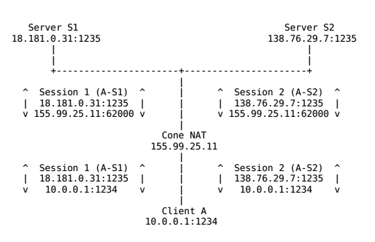

####对称NAT（Symmetric NAT）

对称NAT正好相反，不在所有公网-内网对的会话中维持一个固定的端口绑定。其为每个新的会话开辟一个新的端口。如下图所示：

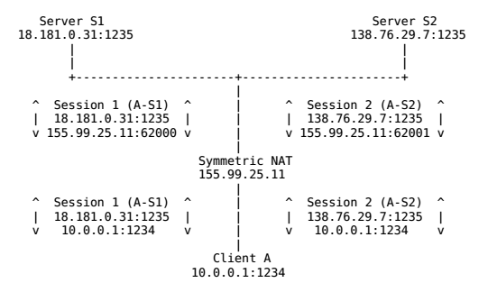

其中Cone NAT根据NAT如何接收已经建立的（公网IP，公网端口）对的输入数据还可以细分为以下三类：

#####1) 全锥形NAT（Full Cone NAT）

在一个新会话建立了公网/内网端口绑定之后，全锥形NAT接下来会接受对应公网端口的所有数据，无论是来自哪个（公网）终端。全锥NAT有时候也被称为"混杂"NAT（promiscuous NAT）。

#####2) 受限锥形NAT（Restricted Cone NAT）

受限锥形NAT只会转发符合某个条件的输入数据包。条件为：外部（源）IP地址匹配内网主机之前发送一个或多个数据包的结点的IP地址。受限NAT通过限制输入数据包为一组"已知的"外部IP地址，有效地精简了防火墙的规则。

#####3) 端口受限锥形NAT（Port-Restricted Cone NAT）

端口受限锥形NAT也类似，只当外部数据包的IP地址和端口号都匹配内网主机发送过的地址和端口号时才进行转发。端口受限锥形NAT为内部结点提供了和对称NAT相同等级的保护，以隔离未关联的数据。

###3. P2P通信

根据客户端的不同，客户端之间进行P2P传输的方法也略有不同，这里介绍了现有的穿越中间件进行P2P通信的几种技术。

####3.1 中继（Relaying）

这是最可靠但也是最低效的一种P2P通信实现。其原理是通过一个有公网IP的服务器中间人对两个内网客户端的通信数据进行中继和转发。如下图所示：

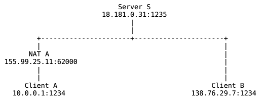

客户端A和客户端B不直接通信，而是先都与服务端S建立链接，然后再通过S和对方建立的通路来中继传递的数据。这钟方法的缺陷很明显，当链接的客户端变多之后，会显著增加服务器的负担，完全没体现出P2P的优势。

####3.2 逆向链接（Connection reversal）

第二种方法在当两个端点中有一个不存在中间件的时候有效。例如，客户端A在NAT之后而客户端B拥有全局IP地址，如下图：

客户端A内网地址为10.0.0.1，且应用程序正在使用TCP端口1234。A和服务器S建立了一个链接，服务器的IP地址为18.181.0.31，监听1235端口。NAT A给客户端A分配了TCP端口62000，地址为NAT的公网IP地址155.99.25.11，作为客户端A对外当前会话的临时IP和端口。因此S认为客户端A就是155.99.25.11:62000。而B由于有公网地址，所以对S来说B就是138.76.29.7:1234。

当客户端B想要发起一个对客户端A的P2P链接时，要么链接A的外网地址155.99.25.11:62000，要么链接A的内网地址10.0.0.1:1234，然而两种方式链接都会失败。链接10.0.0.1:1234失败自不用说，为什么链接155.99.25.11:62000也会失败呢？来自B的TCP SYN握手请求到达NAT A的时候会被拒绝，因为对NAT A来说只有外出的链接才是允许的。

在直接链接A失败之后，B可以通过S向A中继一个链接请求，从而从A方向"逆向"地建立起A-B之间的点对点链接。

很多当前的P2P系统都实现了这种技术，但其局限性也是很明显的，只有当其中一方有公网IP时链接才能建立。越来越多的情况下，通信的双方都在NAT之后，因此就要用到我们下面介绍的第三种技术了。

####3.3 UDP打洞（UDP hole punching）

第三种P2P通信技术，被广泛采用的，名为"P2P打洞"。P2P打洞技术依赖于通常防火墙和cone NAT允许正当的P2P应用程序在中间件中打洞且与对方建立直接链接的特性。以下主要考虑两种常见的场景，以及应用程序如何设计去完美地处理这些情况。第一种场景代表了大多数情况，即两个需要直接链接的客户端处在两个不同的NAT之后；第二种场景是两个客户端在同一个NAT之后，但客户端自己并不需要知道。

#####3.3.1. 端点在不同的NAT之下

假设客户端A和客户端B的地址都是内网地址，且在不同的NAT后面。A、B上运行的P2P应用程序和服务器S都使用了UDP端口1234，A和B分别初始化了与Server的UDP通信，地址映射如图所示:

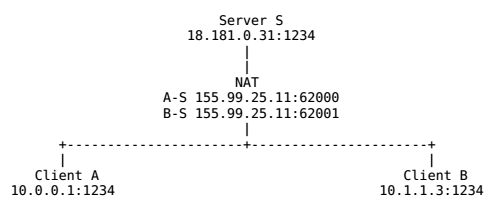

现在假设客户端A打算与客户端B直接建立一个UDP通信会话。如果A直接给B的公网地址138.76.29.7:31000发送UDP数据，NAT B将很可能会无视进入的数据（除非是Full Cone NAT），因为源地址和端口与S不匹配，而最初只与S建立过会话。B往A直接发信息也类似。

假设A开始给B的公网地址发送UDP数据的同时，给服务器S发送一个中继请求，要求B开始给A的公网地址发送UDP信息。A往B的输出信息会导致NAT A打开一个A的内网地址与与B的外网地址之间的新通讯会话，B往A亦然。一旦新的UDP会话在两个方向都打开之后，客户端A和客户端B就能直接通讯，而无须再通过引导服务器S了。

UDP打洞技术有许多有用的性质。一旦一个的P2P链接建立，链接的双方都能反过来作为"引导服务器"来帮助其他中间件后的客户端进行打洞，极大减少了服务器的负载。应用程序不需要知道中间件具体是什么（如果有的话），因为以上的过程在没有中间件或者有多个中间件的情况下也一样能建立通信链路。

#####3.3.2. 端点在相同的NAT之下

现在考虑这样一种情景，两个客户端A和B正好在同一个NAT之后（而且可能他们自己并不知道），因此在同一个内网网段之内。客户端A和服务器S建立了一个UDP会话，NAT为此分配了公网端口62000，B同样和S建立会话，分配到了端口62001，如下图：

假设A和B使用了上节介绍的UDP打洞技术来建立P2P通路，那么会发生什么呢？首先A和B会得到由S观测到的对方的公网IP和端口号，然后给对方的地址发送信息。两个客户端只有在NAT允许内网主机对内网其他主机发起UDP会话的时候才能正常通信，我们把这种情况称之为"回环传输"(lookback translation)，因为从内部到达NAT的数据会被"回送"到内网中而不是转发到外网。例如，当A发送一个UDP数据包给B的公网地址时，数据包最初有源IP地址和端口地址10.0.0.1:1234和目的地址155.99.25.11:62001，NAT收到包后，将其转换为源155.99.25.11:62000（A的公网地址）和目的10.1.1.3:1234，然后再转发给B。即便NAT支持回环传输，这种转换和转发在此情况下也是没必要的，且有可能会增加A与B的对话延时和加重NAT的负担。

对于这个问题，解决方案是很直观的。当A和B最初通过S交换地址信息时，他们应该包含自身的IP地址和端口号（从自己看），同时也包含从服务器看的自己的地址和端口号。然后客户端同时开始从对方已知的两个的地址中同时开始互相发送数据，并使用第一个成功通信的地址作为对方地址。如果两个客户端在同一个NAT后，发送到对方内网地址的数据最有可能先到达，从而可以建立一条不经过NAT的通信链路；如果两个客户端在不同的NAT之后，发送给对方内网地址的数据包根本就到达不了对方，但仍然可以通过公网地址来建立通路。值得一提的是，虽然这些数据包通过某种方式验证，但是在不同NAT的情况下完全有可能会导致A往B发送的信息发送到其他A内网网段中无关的结点上去的。

#####3.3.3. 固定端口绑定

UDP打洞技术有一个主要的条件：**只有当**两个NAT都是Cone NAT（或者非NAT的防火墙）时才能工作。因为其维持了一个给定的（内网IP，内网UDP）二元组和（公网IP， 公网UDP）二元组固定的端口绑定，只要该UDP端口还在使用中，就不会变化。如果像对称NAT一样，给每个新会话分配一个新的公网端口，就会导致UDP应用程序无法使用跟外部端点已经打通了的通信链路。由于Cone NAT是当今最广泛使用的，尽管有一小部分的对称NAT是不支持打洞的，UDP打洞技术也还是被广泛采纳应用。

###4. 具体实现

如果理解了上面所说的内容，那么代码实现起来倒很简单了。这里采用C++的异步IO库来实现引导服务器和P2P客户端的简单功能，目的是打通两个客户端的通信链路，使两个不同局域网之间的客户端可以实现直接通信。

####4.1 引导服务端设计

引导服务器运行在一个有公网地址的设备上，并且接收指定端口的来自客户的命令（这里是用端口号2333）。

客户端其实可以而且也最好应该与服务器建立TCP链接，但我这里为了图方便，也只采用了UDP的通信方式。服务端监听2333端口的命令，然后执行相应的操作，目前包
含的命令有:

login， 客户端登录，使得其记录在服务器traker中，让其他peer可以对其发出链接请求。

logout，客户端登出，使其对peer隐藏。因为服务器不会追踪客户端的登录状态。

list，客户端查看目前的登录用户。

punch <client>， 对指定用户（序号）进行打洞。

help， 查看有哪些可用的命令。

####4.2 P2P客户端设计

一般的网络编程，都是客户端比服务端要难，因为要处理与服务器的通信同时还要处理来自用户的事件；对于P2P客户端来说更是如此，因为P2P客户端不止作为客户端，同时也作为对等连接的服务器端。

这里的大体思路是，输入命令传输给服务器之后，接收来自服务器的反馈，并执行相应代码。例如A想要与B建立通信链路，先给服务器发送punch命令以及给B发送数据，服务器接到命令后给B发送punch_requst信息以及A的端点信息，B收到之后向A发送数据打通通路，然后A与B就可以进行P2P通信了。经测试，打通通路后即便把服务器关闭，A与B也能正常通信。

一个UDP打洞的例子见 https://github.com/pannzh/P2P-Over-MiddleBoxes-Demo  
  
####2016-04-06 更新  
  
关于TCP打洞，有一点需要提的是，因为TCP是基于连接的，所以任何未经连接而发送的数据都会被丢弃，这导致在recv的时候是无法直接从peer端读取数据。  
其实这对UDP也一样，如果对UDP的socket进行了connect，其也会忽略连接之外的数据，详见`connect(2)`。  
  
所以，如果我们要进行TCP打洞，通常需要重用本地的endpoint来发起新的TCP连接，这样才能将已经打开的NAT利用起来。具体来说，则是要设置socket的  `SO_REUSEADDR`或`SO_REUSEPORT`属性，根据系统不同，其实现也不尽一致。一般来说，TCP打洞的步骤如下：  
  
\- A 发送 SYN 到 B （出口地址，下同），从而创建NAT A的一组映射  
\- B 发送 SYN 到 A， 创建NAT B的一组映射  
\- 根据时序不同，两个SYN中有一个会被对方的NAT丢弃，另一个成功通过NAT  
\- 通过NAT的SYN报文被其中一方收到，即返回SYNACK， 完成握手  
\- 至此，TCP的打洞成功，获得一个不依赖于服务器的链接  
  

####
原文出处：<a href='https://www.cnblogs.com/pannengzhi/p/5041546.html' target='blank'>P2P通信标准协议(一)之STUN</a>

前一段时间在[P2P通信原理与实现](http://www.cnblogs.com/pannengzhi/p/4800526.html)中介绍了P2P打洞的基本原理和方法，我们可以根据其原理为自己的网络程序设计一套通信规则，当然如果这套程序只有自己在使用是没什么问题的。可是在现实生活中，我们的程序往往还需要和第三方的协议（如SDP，SIP）进行对接，因此使用标准化  的通用规则来进行P2P链接建立是很有必要的。本文就来介绍一下当前主要应用于P2P通信的几个标准协议，主要有[STUN/RFC3489](http://www.rfc-editor.org/info/rfc3489)，[STUN/RFC5389](http://www.rfc-editor.org/info/rfc5389)，[TURN/RFC5766](http://www.rfc-editor.org/info/rfc5766)以及[ICE/RFC5245](http://www.rfc-editor.org/info/rfc5245)。

####STUN简介

在前言里我们看到，RFC3489和RFC5389的名称都是STUN，但其全称是不同的。在RFC3489里，STUN的全称是**Simple Traversal of User Datagram Protocol (UDP) Through Network Address Translators (NATs)**，即穿越NAT的简单UDP传输，是一个轻量级的协议，允许应用程序发现自己和公网之间的中间件类型，同时也能允许应用程序发现自己被NAT分配的公网IP。这个协议在2003年3月被提出，其介绍页面里说到已经被[STUN/RFC5389](http://www.rfc-editor.org/info/rfc5389)所替代，后者才是我们要详细介绍的。

RFC5389中，STUN的全称为**Session Traversal Utilities for NAT**，即NAT环境下的会话传输工具，是一种处理NAT传输的协议，但主要作为一个工具来服务于其他协议。和STUN/RFC3489类似，可以被终端用来发现其公网IP和端口，同时可以检测端点间的连接性，也可以作为一种保活（keep-alive）协议来维持NAT的绑定。和RFC3489最大的不同点在于，STUN本身不再是一个完整的NAT传输解决方案，而是在NAT传输环境中作为一个辅助的解决方法，同时也增加了TCP的支持。RFC5389废弃了RFC3489，因此后者通常称为**classic STUN**，但依旧是后向兼容的。而完整的NAT传输解决方案则使用STUN的工具性质，[ICE](http://www.rfc-editor.org/info/rfc5245)就是一个基于[offer/answer](http://www.rfc-editor.org/info/rfc3264)方法的完整NAT传输方案，如[SIP](http://www.rfc-editor.org/info/rfc3261)。

STUN是一个C/S架构的协议，支持两种传输类型。一种是请求/响应（request/respond）类型，由客户端给服务器发送请求，并等待服务器返回响应；另一种是指示类型（indication transaction），由服务器或者客户端发送指示，另一方不产生响应。  
两种类型的传输都包含一个96位的随机数作为事务ID（transaction ID），对于请求/响应类型，事务ID允许客户端将响应和产生响应的请求连接起来；  
对于指示类型，事务ID通常作为debugging aid使用。

所有的STUN报文信息都含有一个固定头部，包含了方法，类和事务ID。方法表示是具体哪一种传输类型（两种传输类型又分了很多具体类型）， STUN中只定义了一个方法，即binding（绑定），其他的方法可以由使用者自行拓展；Binding方法可以用于请求/响应类型和指示类型，用于前者时可以用来确定一个NAT给客户端分配的具体绑定，用于后者时可以保持绑定的激活状态。类表示报文类型是请求/成功响应/错误响应/指示。在固定头部之后是零个或者多个属性（attribute），长度也是不固定的。

####STUN报文结构

STUN报文和大多数网络类型的格式一样，是以大端编码(big-endian)的，即最高有效位在左边。所有的STUN报文都以20字节的头部开始，后面跟着若干个属性。下面来详细说说。

#####STUN报文头部

STUN头部包含了STUN消息类型，magic cookie，事务ID和消息长度，如下：

    
    
       0                   1                   2                   3
       0 1 2 3 4 5 6 7 8 9 0 1 2 3 4 5 6 7 8 9 0 1 2 3 4 5 6 7 8 9 0 1
      +-+-+-+-+-+-+-+-+-+-+-+-+-+-+-+-+-+-+-+-+-+-+-+-+-+-+-+-+-+-+-+-+
      |0 0|     STUN Message Type     |         Message Length        |
      +-+-+-+-+-+-+-+-+-+-+-+-+-+-+-+-+-+-+-+-+-+-+-+-+-+-+-+-+-+-+-+-+
      |                         Magic Cookie                          |
      +-+-+-+-+-+-+-+-+-+-+-+-+-+-+-+-+-+-+-+-+-+-+-+-+-+-+-+-+-+-+-+-+
      |                                                               |
      |                     Transaction ID (96 bits)                  |
      |                                                               |
      +-+-+-+-+-+-+-+-+-+-+-+-+-+-+-+-+-+-+-+-+-+-+-+-+-+-+-+-+-+-+-+-+

最高的2位必须置零，这可以在当STUN和其他协议复用的时候，用来区分STUN包和其他数据包。  
`STUN Message Type`字段定义了消息的类型（请求/成功响应/失败响应/指示）和消息的主方法。  
虽然我们有4个消息类别，但在STUN中只有两种类型的事务，即请求/响应类型和指示类型。  
响应类型分为成功和出错两种，用来帮助快速处理STUN信息。Message Type字段又可以进一步分解为如下结构：

    
    
     0                 1
     2  3  4 5 6 7 8 9 0 1 2 3 4 5
    +--+--+-+-+-+-+-+-+-+-+-+-+-+-+
    |M |M |M|M|M|C|M|M|M|C|M|M|M|M|
    |11|10|9|8|7|1|6|5|4|0|3|2|1|0|
    +--+--+-+-+-+-+-+-+-+-+-+-+-+-+

其中显示的位为从最高有效位M11到最低有效位M0，M11到M0表示方法的12位编码。C1和C0两位表示类的编码。比如对于binding方法来说，  
0b00表示request，0b01表示indication，0b10表示success response，0b11表示error response，每一个method都有可能对应不同的传输类别。  
拓展定义新方法的时候注意要指定该方法允许哪些类型的消息。

`Magic Cookie`字段包含固定值**0x2112A442**，这是为了前向兼容RFC3489，因为在classic STUN中，这一区域是事务ID的一部分。  
另外选择固定数值也是为了服务器判断客户端是否能识别特定的属性。还有一个作用就是在协议多路复用时候也可以将其作为判断标志之一。

`Transaction ID`字段是个96位的标识符，用来区分不同的STUN传输事务。对于request/response传输，事务ID由客户端选择，服务器收到后以同样的事务ID返回response；对于indication则由发送方自行选择。事务ID的主要功能是把request和response联系起来，同时也在防止攻击方面有一定作用。服务端也把事务ID当作一个Key来识别不同的STUN客户端，因此必须格式化且随机在0~2^(96-1)之间。重发同样的request请求时可以重用相同的事务ID，但是客户端进行新的传输时，**必须**选择一个新的事务ID。

`Message Length`字段存储了信息的长度，以字节为单位，不包括20字节的STUN头部。由于所有的STUN属性都是都是4字节对齐（填充）的，因此这个字段最后两位应该恒等于零，这也是辨别STUN包的一个方法之一。

#####STUN属性

在STUN报文头部之后，通常跟着0个或者多个属性，每个属性必须是TLV编码的（Type-Length-Value）。其中Type字段和Length字段都是16位，  
Value字段为为32位表示，如下：

    
    
       0                   1                   2                   3
       0 1 2 3 4 5 6 7 8 9 0 1 2 3 4 5 6 7 8 9 0 1 2 3 4 5 6 7 8 9 0 1
      +-+-+-+-+-+-+-+-+-+-+-+-+-+-+-+-+-+-+-+-+-+-+-+-+-+-+-+-+-+-+-+-+
      |         Type                  |            Length             |
      +-+-+-+-+-+-+-+-+-+-+-+-+-+-+-+-+-+-+-+-+-+-+-+-+-+-+-+-+-+-+-+-+
      |                         Value (variable)                ....
      +-+-+-+-+-+-+-+-+-+-+-+-+-+-+-+-+-+-+-+-+-+-+-+-+-+-+-+-+-+-+-+-+

`Length`字段必须包含Value部分需要补齐的长度，以字节为单位。由于STUN属性以32bit边界对齐，因此属性内容不足4字节的都会以padding
bit进行补齐。  
padding bit会被忽略，但可以是任何值。

`Type`字段为属性的类型。任何属性类型都有可能在一个STUN报文中出现超过一次。除非特殊指定，否则其出现的顺序是有意义的：  
即只有第一次出现的属性会被接收端解析，而其余的将被忽略。为了以后版本的拓展和改进，属性区域被分为两个部分。  
Type值在0x0000-0x7FFF之间的属性被指定为**强制理解**，意思是STUN终端必须要理解此属性，否则将返回错误信息；而0x8000-0xFFFF之间的属性为选择性理解，即如果STUN终端不识别此属性则将其忽略。目前STUN的属性类型由IANA维护。

这里简要介绍几个常见属性的Value结构：

  * MAPPED-ADDRESS

MAPPED-ADDRESS同时也是classic STUN的一个属性，之所以还存在也是为了前向兼容。其包含了NAT客户端的反射地址，Family为IP类型，即IPV4(0x01)或IPV6(0x02)，Port为端口，Address为32位或128位的IP地址。注意高8位必须全部置零，而且接收端必须要将其忽略掉。

    
    
     0                   1                   2                   3
     0 1 2 3 4 5 6 7 8 9 0 1 2 3 4 5 6 7 8 9 0 1 2 3 4 5 6 7 8 9 0 1
    +-+-+-+-+-+-+-+-+-+-+-+-+-+-+-+-+-+-+-+-+-+-+-+-+-+-+-+-+-+-+-+-+
    |0 0 0 0 0 0 0 0|    Family     |           Port                |
    +-+-+-+-+-+-+-+-+-+-+-+-+-+-+-+-+-+-+-+-+-+-+-+-+-+-+-+-+-+-+-+-+
    |                                                               |
    |                 Address (32 bits or 128 bits)                 |
    |                                                               |
    +-+-+-+-+-+-+-+-+-+-+-+-+-+-+-+-+-+-+-+-+-+-+-+-+-+-+-+-+-+-+-+-+

  * XOR-MAPPED-ADDRESS

XOR-MAPPED-ADDRESS和MAPPED-ADDRESS基本相同，不同点是反射地址部分经过了一次异或（XOR）处理。对于X-Port字段，是将NAT的映射端口以小端形式与magic cookie的高16位进行异或，再将结果转换成大端形式而得到的，X-Address也是类似。之所以要经过这么一次转换，是因为在实践中发现很多NAT会修改payload中自身公网IP的32位数据，从而导致NAT打洞失败。

    
    
      0 1 2 3 4 5 6 7 8 9 0 1 2 3 4 5 6 7 8 9 0 1 2 3 4 5 6 7 8 9 0 1
     +-+-+-+-+-+-+-+-+-+-+-+-+-+-+-+-+-+-+-+-+-+-+-+-+-+-+-+-+-+-+-+-+
     |x x x x x x x x|    Family     |         X-Port                |
     +-+-+-+-+-+-+-+-+-+-+-+-+-+-+-+-+-+-+-+-+-+-+-+-+-+-+-+-+-+-+-+-+
     |                X-Address (Variable)
     +-+-+-+-+-+-+-+-+-+-+-+-+-+-+-+-+-+-+-+-+-+-+-+-+-+-+-+-+-+-+-+-+

  * ERROR-CODE

ERROR-CODE属性用于error response报文中。其包含了300-699表示的错误代码，以及一个UTF-8格式的文字出错信息（Reason Phrase）。

    
    
       0                   1                   2                   3
       0 1 2 3 4 5 6 7 8 9 0 1 2 3 4 5 6 7 8 9 0 1 2 3 4 5 6 7 8 9 0 1
      +-+-+-+-+-+-+-+-+-+-+-+-+-+-+-+-+-+-+-+-+-+-+-+-+-+-+-+-+-+-+-+-+
      |           Reserved, should be 0         |Class|     Number    |
      +-+-+-+-+-+-+-+-+-+-+-+-+-+-+-+-+-+-+-+-+-+-+-+-+-+-+-+-+-+-+-+-+
      |      Reason Phrase (variable)                                ..
      +-+-+-+-+-+-+-+-+-+-+-+-+-+-+-+-+-+-+-+-+-+-+-+-+-+-+-+-+-+-+-+-+

另外，错误代码在语义上还与[SIP](http://www.rfc-editor.org/info/rfc3261)和HTTP协议保持一致。比如：
    
    300：尝试代替(Try Alternate)，客户端应该使用该请求联系一个代替的服务器。这个错误响应仅在请求包括一个

USERNAME属性和一个有效的MESSAGE-INTEGRITY属性时发送；否则它不会被发送，而是发送错误代码为400的错误响应；  
400：错误请求(Bad Request)，请求变形了，客户端在修改先前的尝试前不应该重试该请求。  
401：未授权(Unauthorized)，请求未包括正确的资格来继续。客户端应该采用一个合适的资格来重试该请求。  
420：未知属性(Unknown Attribute)，服务器收到一个STUN包包含一个强制理解的属性但是它不会理解。服务器必须将不认识的属性放在错误响应的UNKNOWN-ATTRIBUTE属性中。  
438：过期Nonce(Stale Nonce)，客户端使用的Nonce不再有效，应该使用响应中提供的Nonce来重试。  
500：服务器错误(Server Error)，服务器遇到临时错误，客户端应该再次尝试。

此外还有很多属性，如USERNAME，NONCE，REALM，SOFTWARE等，具体可以翻阅[RFC3489](http://www.rfc-editor.org/info/rfc3489)。

####STUN 通信过程

#####1. 产生一个Request或Indication

当产生一个Request或者Indication报文时，终端必须根据上文提到的规则来生成头部，class字段必须是Request或者Indication，而method字段为Binding或者其他用户拓展的方法。属性部分选择该方法所需要的对应属性，比如在一些情景下我们会需要authenticaton属性或FINGERPRINT属性，注意在发送Request报文时候，需要加上SOFTWARE属性（内含软件版本描述）。

#####2. 发送Requst或Indication

目前，STUN报文可以通过UDP，TCP以及TLS-over-TCP的方法发送，其他方法在以后也会添加进来。STUN的使用者必须指定其使用的传输协议，以及终端确定接收端IP地址和端口的方式，比如通过基于DNS的方法来确定服务器的IP和端口。

######2.1 通过UDP发送

当使用UDP协议运行STUN时，STUN的报文可能会由于网络问题而丢失。可靠的STUN请求/响应传输是通过客户端重发request请求来实现的，因此，在UDP运行时，Indication报文是不可靠的。STUN客户端通过RTO（Retransmission TimeOut）来决定是否重传Requst，并且在每次重传后将RTO翻倍。具体重传时间的选取可以参考相关文章，如RFC2988。重传直到接收到Response才停止，或者重传次数到达指定次数Rc，Rc应该是可配置的，且默认值为7。

######2.2 通过TCP或者TCP-over-TLS发送

对于这种情景，客户端打开对服务器的连接。在某些情况下，此TCP链接只传输STUN报文，而在其他拓展中，在一个TCP链接里可能STUN报文和其他协议的报文会进行多路复用（Multiplexed）。数据传输的可靠性由TCP协议本身来保证。值得一提的是，在一次TCP连接中，STUN客户端可能发起多个传输，有可能在前一个Request的Response还没收到时就再次发送了一个新的Request，因此客户端应该保持TCP链接打开，认所有STUN事务都已完成。

#####3. 接收STUN消息

当STUN终端接收到一个STUN报文时，首先检查报文的规则是否合法，即前两位是否为0，magic cookie是否为0x2112A442，报文长度是否正确以及对应的方法是否支持。如果消息类别为Success/Error Response，终端会检测其事务ID是否与当前正在处理的事务ID相同。如果使用了FINGERPRINT拓展的话还会检查FINGERPRINT属性是否正确。  完成身份认证检查之后，STUN终端会接着检查其余未知属性。

######3.1 处理Request

如果请求包含一个或者多个强制理解的未知属性，接收端会返回error response，错误代码420（ERROR-CODE属性），而且包含一个UNKNOWN-ATTRIBUTES属性来告知发送方哪些强制理解的属性是未知的。服务端接着检查方法和其他指定要求，如果所有检查都成功，则会产生一个Success Response给客户端。

  * 3.1.1 生成Success Response或Error Response

    * 如果服务器通过某种`验证方法（authentication mechanism）`通过了请求方的验证，那么在响应报文里最好也加上对应的验证属性。
    * 服务器端也应该加上指定方法所需要的属性信息，另外协议建议服务器返回时也加上SOFTWARE属性。
    * 对于Binding方法，除非特别指明，一般不要求进行额外的检查。当生成Success Response时，服务器在响应里加上XOR-MAPPED-ADDRESS属性。  
对于UDP，这是其源IP和端口信息，对于TCP或TLS-over-TCP，这就是服务器端所看见的此次TCP连接的源IP和端口。

  * 3.1.2 发送Success Response或Error Response

    * 发送响应时候如果是用UDP协议，则发往其源IP和端口，如果是TCP则直接用相同的TCP链接回发即可。

######3.2 处理Indication

如果Indication报文包含未知的强制理解属性，则此报文会被接收端忽略并丢弃。如果对Indication报文的检查都没有错误，则服务端会进行相应的处理，但是不会返回Response。对于Binding方法，一般不需要额外的检查或处理。收到信息的服务端仅需要刷新对应NAT的端口绑定。

由于Indication报文在用UDP协议传输时不会进行重传，因此发送方也不需要处理重传的情况。

######3.3 处理Success Response

如果Success Response包含了未知的强制理解属性，则响应会被忽略并且认为此次传输失败。客户端对报文进行检查通过之后，就可以开始处理此次报文。

以Binding方法为例，客户端会检查报文中是否包含XOR-MAPPED-ADDRESS属性，然后是地址类型，如果是不支持的地址类型，则这个属性会被忽略掉。

######3.4 处理Error Response

如果Error Response包含了未知的强制理解属性，或者没有包含ERROR-CODE属性，则响应会被忽略并且认为此次传输失败。随后客户端会对验证方法进行处理，这有可能会产生新的传输。

  * 到目前为止，对错误响应的处理主要基于ERROR-CODE属性的值，并遵循如下规则：

    * 如果error code在300到399之间，客户端被建议认为此次传输失败，除非用了ALTERNATE-SERVER拓展；
    * 如果error code在400到499之间，客户端认为此次传输失败；
    * 如果error code在500到599之间，客户端可能会需要重传请求，并且必须限制重传的次数。

任何其他的error code值都会导致客户端认为此次传输失败。

###后记

上面只是介绍了[STUN/RFC5389](http://www.rfc-editor.org/info/rfc5389)协议的基础部分，协议本身还包含了许多mechanism，如身份验证（Authentication），DNS Discovery，FINGERPRINT Mechanisms， ALTERNATE-SERVER Mechanism等，身份验证又分为长期验证和短期验证，从而保证了传输的灵活性并减少服务器的负担。具体可以详细阅读白皮书。  
我本来打算一篇文章把P2P通信的所有协议都介绍完不过现在看来似乎篇幅过长了，所以关于TURN和ICE就放在下一篇介绍好了。  
另外由于SourceForge的StunServer的源代码已经长期不更新，因此我从svn的仓库中整理了一下放到了[GitHub](https://github.com/pannzh/TurnServer)上面，需要的可以自行去取来参考一下STUN交互的实现，当然了虽然实现的是TurnServer，但除了Relay部分基本上都是和STUN类似的。 另外在[P2P原理与实现](http://www.cnblogs.com/pannengzhi/p/4800526.html)所做的一个P2P聊天应用时, 顺便也做了个基于RFC3489的STUN客户端, 基于Python3,  用于检测用户的NAT类型, 可以参见[p2p-over-middleboxes](https://github.com/pannzh/P2P-Over-MiddleBoxes-Demo/tree/master/stun).

####
原文出处：<a href='https://www.cnblogs.com/pannengzhi/p/5048965.html' target='blank'>P2P通信标准协议(二)之TURN</a>

上一篇[P2P通信标准协议(一)](http://www.cnblogs.com/pannengzhi/p/5041546.html)介绍了在NAT上进行端口绑定的通用规则，应用程序可以根据这个协议来设计网络以外的通信。  
但是，[STUN/RFC5389](http://www.rfc-editor.org/info/rfc5389)协议里能处理的也只有市面上大多数的`Cone NAT`（关于NAT类型可以参照[P2P通信原理与实现](http://www.cnblogs.com/pannengzhi/p/4800526.html)），对于`Symmetric NAT`，传统的P2P打洞方法是不适用的。因此为了保证通信能够建立，我们可以在没办法的情况下用保证成功的中继方法（Relaying），虽然使用中继会对服务器负担加重，而且也算不上P2P，但是至少保证了最坏情况下信道的通畅，从而不至于受NAT类型的限制。[TURN/RFC5766](http://www.rfc-editor.org/info/rfc5766)就是为此目的而进行的拓展。

###TURN简介

TURN的全称为Traversal Using Relays around NAT，是STUN/RFC5389的一个拓展，主要添加了Relay功能。如果终端在NAT之后，那么在特定的情景下，有可能使得终端无法和其对等端（peer）进行直接的通信，这时就需要公网的服务器作为一个中继，对来往的数据进行转发。这个转发的协议就被定义为TURN。TURN和其他中继协议的不同之处在于，它允许客户端使用同一个中继地址（relay address）与多个不同的peer进行通信。

使用TURN协议的客户端必须能够通过中继地址和对等端进行通讯，并且能够得知每个peer的的IP地址和端口（确切地说，应该是peer的服务器反射地址）。而这些行为如何完成，是不在TURN协议范围之内的。其中一个可用的方式是客户端通过email来告知对等端信息，另一种方式是客户端使用一些指定的协议，如“introduction” 或 “rendezvous”，详见[RFC5128](http://www.rfc-editor.org/info/rfc5128)

如果TURN使用于ICE协议中，relay地址会作为一个候选，由ICE在多个候选中进行评估，选取最合适的通讯地址。一般来说中继的优先级都是最低的。TURN协议被设计为ICE协议(Interactive Connectivity Establishment)的一部分，而且也强烈建议用户在他们的程序里使用ICE，但是也可以独立于ICE的运行。值得一提的是，TURN协议本身是STUN的一个拓展，因此绝大部分TURN报文都是STUN类型的，作为STUN的一个拓展，TURN增加了新的方法（method）和属性（attribute）。因此阅读本章时最好先了解一下[STUN协议](http://www.cnblogs.com/pannengzhi/p/5041546.html)。

###操作概述

在典型的情况下，TURN客户端连接到内网中，并且通过一个或者多个NAT到达公网，TURN服务器架设在公网中，不同的客户端以TURN服务器为中继和其他peer进行通信，如下图所示：
    
    
                                            Peer A
                                            Server-Reflexive    +---------+
                                            Transport Address   |         |
                                            192.0.2.150:32102   |         |
                                                |              /|         |
                              TURN              |            / ^|  Peer A |
        Client’s              Server            |           /  ||         |
        Host Transport        Transport         |         //   ||         |
        Address               Address           |       //     |+---------+
       10.1.1.2:49721       192.0.2.15:3478     |+-+  //     Peer A
                |               |               ||N| /       Host Transport
                |   +-+         |               ||A|/        Address
                |   | |         |               v|T|     192.168.100.2:49582
                |   | |         |               /+-+
     +---------+|   | |         |+---------+   /              +---------+
     |         ||   |N|         ||         | //               |         |
     | TURN    |v   | |         v| TURN    |/                 |         |
     | Client  |----|A|----------| Server  |------------------|  Peer B |
     |         |    | |^         |         |^                ^|         |
     |         |    |T||         |         ||                ||         |
     +---------+    | ||         +---------+|                |+---------+
                    | ||                    |                |
                    | ||                    |                |
                    +-+|                    |                |
                       |                    |                |
                       |                    |                |
                 Client’s                   |            Peer B
                 Server-Reflexive    Relayed             Transport
                 Transport Address   Transport Address   Address
                 192.0.2.1:7000      192.0.2.15:50000     192.0.2.210:49191

在上图中，左边的TURN Client是位于NAT后面的一个客户端（内网地址是10.1.1.2:49721），连接公网的TURN服务器（默认端口3478）后，服务器会得到一个Client的`反射地址`（Reflexive Transport Address,即NAT分配的公网IP和端口）192.0.2.1:7000，此时Client会通过TURN命令创建或管理`ALLOCATION`，allocation是服务器上的一个数据结构，包含了中继地址的信息。服务器随后会给Client分配一个中继地址，即图中的192.0.2.15:50000，另外两个对等端若要通过TURN协议和Client进行通信，可以直接往中继地址收发数据即可，TURN服务器会把发往指定中继地址的数据转发到对应的Client，这里是其反射地址。

Server上的每一个allocation都唯一对应一个client，并且只有一个中继地址，因此当数据包到达某个中继地址时，服务器总是知道应该将其转发到什么地方。但值得一提的是，一个Client可能在同一时间在一个Server上会有多个allocation，这和上述规则是并不矛盾的。

###传输

在协议中,TURN服务器与peer之间的连接都是基于UDP的,但是服务器和客户端之间可以通过其他各种连接来传输STUN报文, 比如TCP/UDP/TLS-over-TCP. 客户端之间通过中继传输数据时候,如果用了TCP,也会在服务端转换为UDP,因此建议客户端使用UDP来进行传输. 至于为什么要支持TCP,那是因为一部分防火墙会完全阻挡UDP数据,而对于三次握手的TCP数据则不做隔离.

###分配(Allocations)

要在服务器端获得一个中继分配,客户端须使用分配事务. 客户端发送分配请求(Allocate request)到服务器,然后服务器返回分配成功响应,并包含了分配的地址.客户端可以在属性字段描述其想要的分配类型(比如生命周期).由于中继数据实现了安全传输,服务器会要求对客户端进行验证,主要使用STUN的`long-term credential mechanism`.

一旦中继传输地址分配好,客户端必须要将其保活.通常的方法是发送刷新请求(Refresh request)到服务端.这在TURN中是一个标准的方法.刷新频率取决于分配的生命期,默认为10分钟.客户端也可以在刷新请求里指定一个更长的生命期, 而服务器会返回一个实际上分配的时间. 当客户端想中指通信时,可以发送一个生命期为0的刷新请求.

服务器和客户端都保存有一个成为五元组(5-TUPLE)的信息,比如对于客户端来说,五元组包括客户端本地地址/端口,服务器地址/端口, 和传输协议;服务器也是类似,只不过将客户端的地址变为其反射地址,因为那才是服务器所见到的. 服务器和客户端在分配请求中都带有5-TUPLE信息,并且也在接下来的信息传输中使用,因此彼此都知道哪一次分配对应哪一次传输.

    
    
    TURN                                 TURN           Peer          Peer
    client                               server          A             B
      |-- Allocate request --------------->|             |             |
      |                                    |             |             |
      |<--------------- Allocate failure --|             |             |
      |                 (401 Unauthorized) |             |             |
      |                                    |             |             |
      |-- Allocate request --------------->|             |             |
      |                                    |             |             |
      |<---------- Allocate success resp --|             |             |
      |            (192.0.2.15:50000)      |             |             |
      //                                   //            //            //
      |                                    |             |             |
      |-- Refresh request ---------------->|             |             |
      |                                    |             |             |
      |<----------- Refresh success resp --|             |             |
      |                                    |             |             |

如上图所示,客户端首先发送Allocate请求,但是没带验证信息,因此STUN服务器会返回error response,客户端收到错误后加上所需的验证信息再次请求,才能进行成功的分配.

###发送机制(Send Mechanism)

client和peer之间有两种方法通过TURN server交换应用信息,第一种是使用`Send`和`Data`方法(method),第二种是使用通道(channels),两种方法都通过某种方式告知服务器哪个peer应该接收数据,以及服务器告知client数据来自哪个peer.

Send Mechanism使用了Send和Data指令(Indication).其中Send指令用来把数据从client发送到server,而Data指令
用来把数据从server发送到client.当使用Send指令时,客户端发送一个Send Indication到服务端,其中包含:

  * XOR-PEER-ADDRESS属性,指定对等端的(服务器反射)地址.
  * DATA属性,包含要传给对等端的信息.

当服务器收到Send Indication之后,会将DATA部分的数据解析出来,并将其以UDP的格式转发到对应的端点去,并且在封装数据包的时候把client的中继地址作为源地址.从而从对等端发送到中继地址的数据也会被服务器转发到client上.值得一提的是,Send/Data Indication是不支持验证的,因为长效验证机制不支持对indication的验证,因此为了防止攻击, TURN要求client在给对等端发送indication之前先安装一个到对等端的许可(permission),如下图所示,client到Peer B没有安装许可,导致其indication数据包将被服务器丢弃,对于peer B也是同样:

    
    
    TURN                                 TURN           Peer          Peer
    client                               server          A             B
      |                                    |             |             |
      |-- CreatePermission req (Peer A) -->|             |             |
      |<-- CreatePermission success resp --|             |             |
      |                                    |             |             |
      |--- Send ind (Peer A)-------------->|             |             |
      |                                    |=== data ===>|             |
      |                                    |             |             |
      |                                    |<== data ====|             |
      |<-------------- Data ind (Peer A) --|             |             |
      |                                    |             |             |
      |                                    |             |             |
      |--- Send ind (Peer B)-------------->|             |             |
      |                                    | dropped     |             |
      |                                    |             |             |
      |                                    |<== data ==================|
      |                            dropped |             |             |
      |                                    |             |             |

TURN支持两种方式来创建许可,一种是发送`CreatePermission request`

###信道机制(Channels)

对于一些应用程序,比如VOIP(Voice over IP),在Send/Data Indication中多加的36字节格式信息会加重客户端和服务端之间的带宽压力.为改善这种情况,TURN提供了第二种方法来让client和peer交互数据.该方法使用另一种数据包格式, 即`ChannelData message`,信道数据报文. ChannelData message不使用STUN头部,而使用一个4字节的头部,包含了一个称之为信道号的值(channel number).每一个使用中的信道号都与一个特定的peer绑定,即作为对等端地址的一个记号.

要将一个信道与对等端绑定,客户端首先发送一个信道绑定请求(ChannelBind Request)到服务器,并且指定一个未绑定的信道号以及对等端的地址信息.  
绑定后client和server都能通过ChannelData message来发送和转发数据.信道绑定默认持续10分钟,并且可以通过重新发送ChannelBind Request来刷新持续时间.和Allocation不同的是,并没有直接删除绑定的方法,只能等待其超时自动失效.

    
    
    TURN                                 TURN           Peer          Peer
    client                               server          A             B
      |                                    |             |             |
      |-- ChannelBind req ---------------->|             |             |
      | (Peer A to 0x4001)                 |             |             |
      |                                    |             |             |
      |<---------- ChannelBind succ resp --|             |             |
      |                                    |             |             |
      |-- [0x4001] data ------------------>|             |             |
      |                                    |=== data ===>|             |
      |                                    |             |             |
      |                                    |<== data ====|             |
      |<------------------ [0x4001] data --|             |             |
      |                                    |             |             |
      |--- Send ind (Peer A)-------------->|             |             |
      |                                    |=== data ===>|             |
      |                                    |             |             |
      |                                    |<== data ====|             |
      |<------------------ [0x4001] data --|             |             |
      |                                    |             |             |

上图中0x4001为信道号,即ChannelData message的头部中头2字节,值得一提的是信道号的选取有如下要求:

  * 0x0000-0x3FFF : 这一段的值**不能**用来作为信道号
  * 0x4000-0x7FFF : 这一段是可以作为信道号的值,一共有16383种不同值在目前来看是足够用的
  * 0x8000-0xFFFF : 这一段是保留值,留给以后使用

还是那句老话,关于协议具体的细节可以去翻阅RFC5766的草稿,其中每个属性以及其格式都介绍得很详细.

###实例

在上一章也提到过,因为RFC是标准协议,因此实现上往往有良好的兼容性和拓展性.现存的开源P2P应用程序, 如果按照标准来设计,可以很容易与之对接.其中比较著名的就是[PJSIP](http://www.pjsip.org),PJSIP是一个开源的多媒体通信库,实现了许多标准协议,如SIP, SDP, RTP, STUN, TURN 和 ICE. 当然我们也能自己实现.比如GitHub上的[TurnServer](https://github.com/pannzh/TurnServer)就是其中一个对TURN服务端的实现.下面在局域网环境下对TURN数据包进行  
简要分析.首先有如下机器情况:

  * TurnServer运行在192.168.1.110,使用默认端口3478,采用用户名和密码验证,其中用户名为pannzh,密码123456
  * TurnClient运行在192.168.1.106,为了方便,令peer也在192.168.1.106运行,端口为59593

这里使用wireshark来抓包分析,关于wireshark的简介可以参照我之前的文章[细说中间人攻击(一)](http://jekyll.pppan.net/2015/11/01/mitm-detail-1/), 首先TurnClient发送Allocation请求:

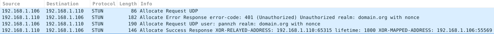

可以看到第一次requst被服务器拒绝,因为后者要求nonce验证信息,服务器的返回中包含了nonce信息, 除此之外还包含了ERROR-CODE,SOFTWARE,FINGERPRINT属性.

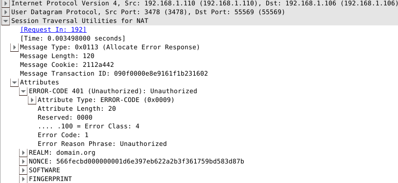

在下一次request请求中,客户端加上了收到的nonce,以及USERNAME和REALM等属性,再次发送到TurnServer:

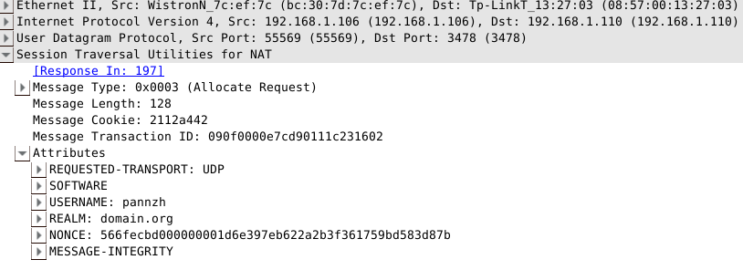

服务器接收到了正确的allocation请求,于是返回succcess response,可以看到在返回中带有默认的lifetime为1800秒, XOR-MAPPED-ADDRESS以及XOR-RELAY-ADDRESS等属性:

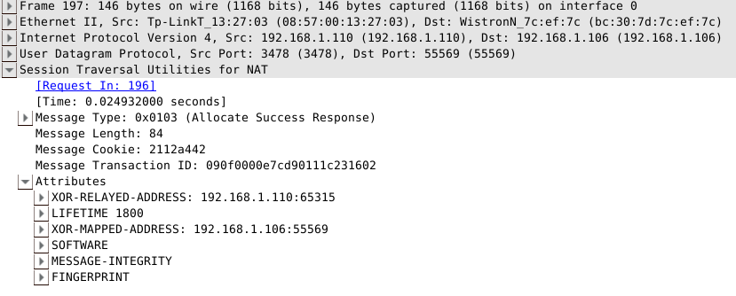

前文也说过,若要和peer进行通信,必须先创建一个许可,因此Client向服务器发送CreatePermission请求,其中携带了peer的信息:

服务器如果通过验证,就会返回success response,随后Client可以通过上文说到的两种方法与Peer进行通讯,比如下面的Send indication方法:

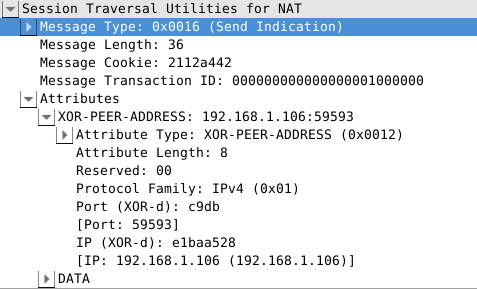

通过对TurnServer发送indication告知数据的接收方以及数据内容让TurnServer进行转发,从而间接地向对等端发送DATA. 而从对等端来看,就是收到一个从client的relay地址192.168.1.110:65315到目的地址192.168.1.106:59593(即peer地址)的UDP数据包.

###后记

本来打算这篇介绍完TURN和ICE的,不过后来发现内容实在有点多,即便是只粗略介绍.因此只能把ICE协议的介绍留在下一篇来说了.  
TURN协议因为是STUN的拓展,当然也沿袭了STUN的工具性质,只为穿越NAT提供方法,而不作为P2P通信的完整解决方案.一个比较适合研究的TurnServer源代码我也放到了[这里](https://github.com/pannzh/TurnServer),,而客户端的实现则根据每个人的具体需求而不同,因此不再赘述.

####
原文出处：<a href='https://www.cnblogs.com/pannengzhi/p/5061674.html' target='blank'>P2P通信标准协议(三)之ICE</a>

在[P2P通信标准协议(二)](http://jekyll.pppan.net/2015/12/15/p2p-standard-protocol-turn/)中,介绍了TURN的基本交互流程,在上篇结束部分也有说到,TURN作为STUN协议的一个拓展,保持了STUN的工具性质,而不作为完整的NAT传输解决方案,只提供穿透NAT的功能, 并且由具体的应用程序来使用.虽然TURN也可以独立工作,但其本身就是被设计为[ICE/RFC5245](http://www.rfc-editor.org/info/rfc5245)的一部分,本章就来介绍一下ICE协议的具体内容.

###SDP

ICE信息的描述格式通常采用标准的[SDP](http://www.rfc-editor.org/info/rfc4566),其全称为Session Description Protocol,即会话描述协议.  
SDP只是一种信息格式的描述标准,不属于传输协议,但是可以被其他传输协议用来交换必要的信息,如SIP和RTSP等.

####SDP信息

一个SDP会话描述包含如下部分:

  * 会话名称和会话目的
  * 会话的激活时间
  * 构成会话的媒体(media)
  * 为了接收该媒体所需要的信息(如地址,端口,格式等)

因为在中途参与会话也许会受限制,所以可能会需要一些额外的信息:

  * 会话使用的的带宽信息
  * 会话拥有者的联系信息

一般来说,SDP必须包含充分的信息使得应用程序能够加入会话,并且可以提供任何非参与者使用时需要知道的资源状况,后者在当SDP同时用于多个会话声明协议时尤其有用.

####SDP格式

SDP是基于文本的协议,使用ISO 10646字符集和UTF-8编码.SDP字段名称和属性名称只使用UTF-8的一个子集US-ASCII, 因此不能存在中文.虽然理论上文本字段和属性字段支持全集,但最好还是不要在其中使用中文.

SDP会话描述包含了多行如下类型的文本:
    
    <type>=<value>

其中type是大小写敏感的,其中一些行是必须要有的,有些是可选的,所有元素都必须以固定顺序给出.固定的顺序极大改善了错误检测,同时使得处理端设计更加简单.如下所示,其中可选的元素标记为* :
    
    会话描述:
         v=  (protocol version)
         o=  (originator and session identifier)
         s=  (session name)
         i=* (session information)
         u=* (URI of description)
         e=* (email address)
         p=* (phone number)
         c=* (connection information -- not required if included in all media)
         b=* (zero or more bandwidth information lines)
         One or more time descriptions ("t=" and "r=" lines; see below)
         z=* (time zone adjustments)
         k=* (encryption key)
         a=* (zero or more session attribute lines)
         Zero or more media descriptions
    时间信息描述:
         t=  (time the session is active)
         r=* (zero or more repeat times)
    多媒体信息描述(如果有的话):
         m=  (media name and transport address)
         i=* (media title)
         c=* (connection information -- optional if included at session level)
         b=* (zero or more bandwidth information lines)
         k=* (encryption key)
         a=* (zero or more media attribute lines)

所有元素的type都为小写,并且不提供拓展.但是我们可以用a(attribute)字段来提供额外的信息.一个SDP描述的例子如下:

      v=0
      o=jdoe 2890844526 2890842807 IN IP4 10.47.16.5
      s=SDP Seminar
      i=A Seminar on the session description protocol
      u=http://www.example.com/seminars/sdp.pdf
      e=j.doe@example.com (Jane Doe)
      c=IN IP4 224.2.17.12/127
      t=2873397496 2873404696
      a=recvonly
      m=audio 49170 RTP/AVP 0
      m=video 51372 RTP/AVP 99
      a=rtpmap:99 h263-1998/90000

具体字段的type/value描述和格式可以去参考[RFC4566](http://www.rfc-editor.org/info/rfc4566).

###Offer/Answer模型

上文说到,SDP用来描述多播主干网络的会话信息,但是并没有具体的交互操作细节是如何实现的,因此[RFC3264](http://www.rfc-editor.org/info/rfc3264)定义了一种基于SDP的offer/answer模型.在该模型中,会话参与者的其中一方生成一个SDP报文构成offer, 其中包含了一组offerer希望使用的多媒体流和编解码方法,以及offerer用来接收改数据的IP地址和端口信息.  
offer传输到会话的另一端(称为answerer),由answerer生成一个answer,即用来响应对应offer的SDP报文.  
answer中包含不同offer对应的多媒体流,并指明该流是否可以接受.

RFC3264只介绍了交换数据过程,而没有定义传递offer/answer报文的方法,后者在[RFC3261/SIP](http://www.rfc-editor.org/info/rfc3261)即会话初始化协议中描述.值得一提的是,offer/answer模型也经常被SIP作为一种基本方法使用. offer/answer模型在SDP报文的基础上进行了一些定义,工作过程不在此描述,需要了解细节的朋友可以参考RFC3261.

###ICE

ICE的全称为**Interactive Connectivity Establishment**,即交互式连接建立.初学者可能会将其与网络编程的ICE弄混,其实那是不一样的东西,在网络编程中,如C++的ICE库,都是指Internate Communications Engine, 是一种用于分布式程序设计的网络通信中间件.我们这里说的只是交互式连接建立.

ICE是一个用于在[offer/answer](http://www.rfc-editor.org/info/rfc3264)模式下的NAT传输协议,主要用于UDP下多媒体会话的建立,其使用了STUN协议以及TURN协议,同时也能被其他实现了offer/answer模型的的其他程序所使用,比如[SIP](http://www.rfc-editor.org/info/rfc3261)(Session Initiation Protocol).

使用offer/answer模型(RFC3264)的协议通常很难在NAT之间穿透,因为其目的一般是建立多媒体数据流,而且在报文中还携带了数据的源IP和端口信息,这在通过NAT时是有问题的.RFC3264还尝试在客户端之间建立直接的通路,因此中间就缺少了应用层的封装.这样设计是为了减少媒体数据延迟,减少丢包率以及减少程序部署的负担.然而这一切都很难通过NAT而完成. 有很多解决方案可以使得这些协议运行于NAT环境之中,包括`应用层网关(ALGs)`,`Classic STUN`以及`Realm Specific IP`+`SDP` 协同工作等方法.不幸的是,这些技术都是在某些网络拓扑下工作很好,而在另一些环境下表现又很差,因此我们需要一个单一的, 可自由定制的解决方案,以便能在所有环境中都能较好工作.

####ICE工作流程

一个典型的ICE工作环境如下,有两个端点L和R,都运行在各自的NAT之后(他们自己也许并不知道),NAT的类型和性质也是未知的.  
L和R通过交换[SDP](http://www.rfc-editor.org/info/rfc4566)信息在彼此之间建立多媒体会话,通常交换通过一个SIP服务器完成:

    
    
                     +-----------+
                     |    SIP    |
    +-------+        |    Srvr   |         +-------+
    | STUN  |        |           |         | STUN  |
    | Srvr  |        +-----------+         | Srvr  |
    |       |        /           \         |       |
    +-------+       /             \        +-------+
                   /<- Signaling ->\
                  /                 \
             +--------+          +--------+
             |  NAT   |          |  NAT   |
             +--------+          +--------+
               /                       \
              /                         \
             /                           \
         +-------+                    +-------+
         | Agent |                    | Agent |
         |   L   |                    |   R   |
         |       |                    |       |
         +-------+                    +-------+

ICE的基本思路是,每个终端都有一系列`传输地址`(包括传输协议,IP地址和端口)的候选,可以用来和其他端点进行通信.  
其中可能包括:

  * 直接和网络接口联系的传输地址(host address)
  * 经过NAT转换的传输地址,即反射地址(server reflective address)
  * TURN服务器分配的中继地址(relay address)

虽然潜在要求任意一个L的候选地址都能用来和R的候选地址进行通信.但是实际中发现有许多组合是无法工作的.举例来说, 如果L和R都在NAT之后而且不处于同一内网,他们的直接地址就无法进行通信.ICE的目的就是为了发现哪一对候选地址的组合可以工作,并且通过系统的方法对所有组合进行测试(用一种精心挑选的顺序).

为了执行ICE,客户端必须要识别出其所有的地址候选,ICE中定义了三种候选类型,有些是从物理地址或者逻辑网络接口继承而来,其他则是从STUN或者TURN服务器发现的.很自然,一个可用的地址为和本地网络接口直接联系的地址,通常是内网地址, 称为`HOST CANDIDATE`,如果客户端有多个网络接口,比如既连接了WiFi又插着网线,那么就可能有多个内网地址候选.

其次,客户端通过STUN或者TURN来获得更多的候选传输地址,即`SERVER REFLEXIVE CANDIDATES`和`RELAYED CANDIDATES`, 如果TURN服务器是标准化的,那么两种地址都可以通过TURN服务器获得.当L获得所有的自己的候选地址之后,会将其按优先级排序,然后通过signaling通道发送到R.候选地址被存储在SDP offer报文的属性部分.当R接收到offer之后, 就会进行同样的获选地址收集过程,并返回给L.

这一步骤之后,两个对等端都拥有了若干自己和对方的候选地址,并将其配对,组成`CANDIDATE PAIRS`.为了查看哪对组合可以工作,每个终端都进行一系列的检查.每个检查都是一次STUN request/response传输,将request从候选地址对的本地地址发送到远端地址. 连接性检查的基本原则很简单:

  1. 以一定的优先级将候选地址对进行排序.
  2. 以该优先级顺序发送checks请求
  3. 从其他终端接收到checks的确认信息

两端连接性测试,结果是一个4次握手过程:

    
    
     L                        R
     -                        -
     STUN request ->             \  L's
               <- STUN response  /  check
                <- STUN request  \  R's
     STUN response ->            /  check

值的一提的是,STUN request的发送和接收地址都是接下来进多媒体传输(如RTP和RTCP)的地址和端口,所以, 客户端实际上是将STUN协议与RTP/RTCP协议在数据包中进行复用(而不是在端口上复用).

由于STUN Binding request用来进行连接性测试,因此STUN Binding response中会包含终端的实际地址,如果这个地址和之前学习的所有地址都不匹配,发送方就会生成一个新的candidate,称为`PEER REFLEXIVE CANDIDATE`,和其他candidate一样,也要通过ICE的检查测试.

####连接性检查(Connectivity Checks)

所有的ICE实现都要求与STUN(RFC5389)兼容,并且废弃Classic STUN(RFC3489).ICE的完整实现既生成checks(作为STUN client), 也接收checks(作为STUN server),而lite实现则只负责接收checks.这里只介绍完整实现情况下的检查过程.

**1. 为中继候选地址生成许可(Permissions).**

**2. 从本地候选往远端候选发送Binding Request.**

在Binding请求中通常需要包含一些特殊的属性,以在ICE进行连接性检查的时候提供必要信息.

  * PRIORITY 和 USE-CANDIDATE 
    * 终端必须在其request中包含PRIORITY属性,指明其优先级,优先级由公式计算而得. 如果有需要也可以给出特别指定的候选(即USE-CANDIDATE属性).

  * ICE-CONTROLLED和ICE-CONTROLLING 
    * 在每次会话中,每个终端都有一个身份,有两种身份,即受控方(controlled role)和主控方(controlling role). 主控方负责选择最终用来通讯的候选地址对,受控方被告知哪个候选地址对用来进行哪次媒体流传输, 并且不生成更新过的offer来提示此次告知.发起ICE处理进程(即生成offer)的一方必须是主控方,而另一方则是受控方. 如果终端是受控方,那么在request中就必须加上ICE-CONTROLLED属性,同样,如果终端是主控方,就需要ICE-CONTROLLING属性.

  * 生成Credential 
    * 作为连接性检查的Binding Request必须使用STUN的短期身份验证.验证的用户名被格式化为一系列username段的联结,包含了发送请求的所有对等端的用户名,以冒号隔开;密码就是对等端的密码.

**3. 处理Response.**

当收到Binding Response时,终端会将其与Binding Request相联系,通常通过事务ID.随后将会将此事务ID与候选地址对进行绑定.

  * 失败响应 
    * 如果STUN传输返回487(Role Conflict)错误响应,终端首先会检查其是否包含了ICE-CONTROLLED或ICE-CONTROLLING属性.如果有ICE-CONTROLLED,终端必须切换为controlling role;如果请求包含ICE-CONTROLLING属性, 则必须切换为controlled role.切换好之后,终端必须使产生487错误的候选地址对进入检查队列中, 并将此地址对的状态设置为`Waiting`.

  * 成功响应,一次连接检查在满足下列所有情况时候就被认为成功: 
    * STUN传输产生一个Success Response
    * response的源IP和端口等于Binding Request的目的IP和端口
    * response的目的IP和端口等于Binding Request的源IP和端口

终端收到成功响应之后,先检查其mapped address是否与本地记录的地址对有匹配,如果没有则生成一个新的候选地址. 即对等端的反射地址.如果有匹配,则终端会构造一个可用候选地址对(valid pair).通常很可能地址对不存在于任何检查列表中,检索检查列表中没有被服务器反射的本地地址,这些地址把它们的本地候选转换成服务器反射地址的基地址, 并把冗余的地址去除掉.

###后记

本文介绍了一种完整的NAT环境通信解决方案ICE,并且对其中涉及到的概念SDP和offer/answer模型也作了简要介绍. ICE是使用STUN/TURN工具性质的最主要协议之一,其中TURN一开始也被设计为ICE协议的一部分.值的一提的是, 本文只是对这几种协议作了概述性的说明,而具体工作过程和详细的属性描述都未包含,因此如果需要根据协议来实现具体的应用程序,还需要对RFC的文档进行仔细阅读.这里给出一些参考:

####
原文出处：<a href='https://www.cnblogs.com/pannengzhi/p/5103914.html' target='blank'>P2P通信标准协议(四)之SIP</a>

在前面[几篇文章](http://jekyll.pppan.net/categories.html#p2p-ref)中我们介绍了建立p2p通信的一般协议(簇),以及一种完整的NAT传输解决方案ICE,但是对于多用户的通信情况,还有一些通用协议来实现标准化的管理,如之前讲过的SDP和SIP等,[SIP(Session Initiation Protocol)](http://www.rfc-editor.org/info/rfc3261), 是属于应用层的控制协议,主要用于在一个或多个参与者之间创建,修改和中止会话(sessions).会话的类型包括IP电话,多媒体流分发和多媒体会议等.

###SIP简介

SIP邀请(invitations)用于创建携带会话描述(如SDP信息)的会话,允许参与者使用一系列兼容的媒体类型.  
SIP使用一种叫代理服务器的元素来帮助对用户当前位置进行转发,对用户进行验证和授权,并为用户提供相应的功能.  
SIP同时也提供了注册函数以允许用户上传他们的当前地址供代理服务器使用.SIP协议运行在多个不同的传输协议之上.

SIP支持5个方面来建立和中止多媒体会话:

  * 用户地址(User location): 决定了用来通讯的终端系统.
  * 用户状态(User availability): 决定了被呼叫端的是否愿意加入通讯.
  * 用户性能(User capabilities): 决定了多媒体类型和媒体使用的参数.
  * 会话建立(Session setup): "响铃",在呼叫端和被呼叫端建立起会话.
  * 会话管理(Session management): 包括传输和中止会话,修改会话参数以及调用服务.

SIP不是一个垂直集成的通讯系统,而是作为一个组件与其他协议共同运作,如RTP等实时传输协议等.另外SIP不提供服务, 只提供可以用来实现各种服务的原语.比如,SIP可以定位用户并且传输一个不透明的对象到其当前地址.如果这个原语用来传输SDP,终端就能得知会话的一些参数;如果同样的原语用来传输一张照片,那也可以实现一种"显示来电者头像"的服务.由此可见,一种原语通常用来实现多种不同的服务.

###SIP工作过程

下图描述了SIP的基本功能:定位一个终端,产生通讯请求,建立会话以及结束会话.

    
    
                     atlanta.com  . . . biloxi.com
                 .      proxy              proxy     .
               .                                       .
       Alice's  . . . . . . . . . . . . . . . . . . . .  Bob's
      softphone                                        SIP Phone
         |                |                |                |
         |    INVITE F1   |                |                |
         |--------------->|    INVITE F2   |                |
         |  100 Trying F3 |--------------->|    INVITE F4   |
         |<---------------|  100 Trying F5 |--------------->|
         |                |<-------------- | 180 Ringing F6 |
         |                | 180 Ringing F7 |<---------------|
         | 180 Ringing F8 |<---------------|     200 OK F9  |
         |<---------------|    200 OK F10  |<---------------|
         |    200 OK F11  |<---------------|                |
         |<---------------|                |                |
         |                       ACK F12                    |
         |------------------------------------------------->|
         |                   Media Session                  |
         |<================================================>|
         |                       BYE F13                    |
         |<-------------------------------------------------|
         |                     200 OK F14                   |
         |------------------------------------------------->|
         |                                                  |
                         图 1: SIP会话建立

图中描述了两个用户Alice和Bob交换SIP信息的过程.(信息表示为Fn.) 首先,Alice在其PC上使用了SIP终端(假设是软件电话), 并且通过互联网打给Bob. 其中我们看到有两个代理服务器atlanta和biloxi,用来帮助双方进行会话建立.这个典型的排列经常被称为`SIP之梯(SIP trapezoid)`.

Alice呼叫Bob时,使用的是Bob的SIP身份信息,一种特定类型URI称为SIP URI,形式和E-mail地址类似,包含了用户名和主机名.  
在本例中,Bob的地址为`sip:bob@biloxi.com`,biloxi是Bob的SIP服务提供商;同样,Bob联系Alice时也通过其SIP地址`sip:alice@atlanta.com`来进行通信. SIP同样提供了安全的链接SIPS,和HTTPS类似,主要通过TLS进行内容加密,加密的地址格式为`sips:alice@atlanta.com`

SIP基于一种类HTTP的请求/响应传输模型.每次传输包含一个调用了特定方法或函数的请求,以及至少一个响应.在本例中, 传输开始时Alice发送了一个INVITE请求到Bob的SIP URI. INVITE请求包含一系列头部(header)字段.头部字段被称为属性,提供了关于报文的额外信息. 产生INVITE请求的终端包含了一个独特的通话标识符,目的地址,Alice的地址以及Alice希望与Bob建立的会话的类型信息. 一个INVITE请求的例子如下,其中Alice的SDP信息没有显示出来:

    
      INVITE sip:bob@biloxi.com SIP/2.0
      Via: SIP/2.0/UDP pc33.atlanta.com;branch=z9hG4bK776asdhds
      Max-Forwards: 70
      To: Bob <sip:bob@biloxi.com>
      From: Alice <sip:alice@atlanta.com>;tag=1928301774
      Call-ID: a84b4c76e66710@pc33.atlanta.com
      CSeq: 314159 INVITE
      Contact: <sip:alice@pc33.atlanta.com>
      Content-Type: application/sdp
      Content-Length: 142
      (Alice的SDP信息,略)
                         图 2: Alice发送的请求报文

其中第一行包含了方法的名字(INVITE).后面的一些行则是一系列头部区段,各个头部字段的含义在下一节会说到.

由于Alice不知道Bob的准确地址,因此报文会先发送到Alice的SIP服务提供商,atlanta.com. 这个地址是可以在Alice的终端(软件电话)上面进行配置的,当然也可以通过DHCP之类的协议来发现. SIP服务器接收SIP请求并按照其目的进行转发. 在本例中, 代理服务器接收INVITE请求后,给Alice返回100(Trying)响应,表示请求正在进行转发.  

SIP响应用一个三位数来表示状态,包含了和INVITE请求中同样的To, From, Call-ID, CSeq 和 branch(via内)参数,从而允许Alice的终端将其与请求相联系. 代理服务器atlanta.com通过DNS等方法得到Bob的服务提供商地址.并且在转发的报文中的via字段加上自己的地址信息. biloxi.com代理服务器接收到INVITE请求,并且返回100响应给atlanta.com. 代理服务器查找其数据库(通常称为定位服务),其中包含了Bob的当前IP地址. 同时代理在转发请求前也在头部的via字段加上自己的地址.

Bob的终端(SIP电话)接收到INVITE请求后,会提示Bob这是来自Alice的来电.同时Bob的终端返回180响应,表示正在呼叫,响应一直转发回到Alice的终端,从而使Alice也能知道对方电话正在响.每个代理都通过头部的Via字段来决定响应的发送方向,并且从via顶部去掉自己的地址信息. 因此虽然发送请求的时候用到DNS和定位服务,但是发送响应的时候则不需要.

在本例中,Bob决定接起电话. 此时Bob的SIP电话发送200响应表示呼叫被应答.200响应包含了信息体(SDP)表明Bob希望建立的会话类型.因此,这形成了两次SDP信息交换过程:Alice发送给Bob,然后Bob发送给Alice.  
这个两次交换提供了基本的协商能力,并且基于简单的[offer/answer模型](http://www.rfc-editor.org/info/rfc3264). 如果Bob不想接电话或者正在与别人通话,就会返回一个错误响应,从而不建立多媒体会话. Bob发送的200响应结构大体如下:

    
    
      SIP/2.0 200 OK
      Via: SIP/2.0/UDP server10.biloxi.com
         ;branch=z9hG4bKnashds8;received=192.0.2.3
      Via: SIP/2.0/UDP bigbox3.site3.atlanta.com
         ;branch=z9hG4bK77ef4c2312983.1;received=192.0.2.2
      Via: SIP/2.0/UDP pc33.atlanta.com
         ;branch=z9hG4bK776asdhds ;received=192.0.2.1
      To: Bob <sip:bob@biloxi.com>;tag=a6c85cf
      From: Alice <sip:alice@atlanta.com>;tag=1928301774
      Call-ID: a84b4c76e66710@pc33.atlanta.com
      CSeq: 314159 INVITE
      Contact: <sip:bob@192.0.2.4>
      Content-Type: application/sdp
      Content-Length: 131
      (Bob的SDP信息,略)
                         图 3: Bob发送的响应报文

Bob的SIP电话增加了一个tag参数到报文头部,这个tag会被两个端点合并到对话里,并且会在(本次通话)所有以后的请求和响应中包含. Contact头包含了一个Bob能直接连接的URI,Content-Type 和 Content-Length表示消息体(没贴出来)的格式信息. 在本例中,代理服务器也可以拓展自己的功能,比如当接收到Bob返回的486(Busy Here)响应,则可以向Bob的语音信箱等发送INVITE请求;一个代理服务器可以同时向多个地址发送请求,这种并行查找的特性通常称之为分叉(forking).

在200(OK)响应返回到Alice的软件电话上之后,电话停止响铃,并通知Alice对方已经接听,同时发送一个ACK报文到Bob的终端,表示响应已经收到. 在本例中,ACK直接发送给Bob,而不通过两个代理服务器,是因为两个端点都知道了对方的地址,因此不需要再通过代理去查找.

收到ACK之后,Alice和Bob就可以互相通信了. 通信完成之后,假设Bob先挂断电话,并产生一个BYE报文,直接发送给Alice,Alice收到后确认请求,并返回200(OK)响应,从而结束此次会话.注意这里没有发送ACK,因为ACK只有在确认INVITE请求的响应时才发送.

注册(Registration)是另一个SIP常用的操作. 用户通过注册使得代理服务器能知道其当前的地址信息. 例如Bob可以在初始化时,向biloxi.com发送注册请求(`REGISTER`),后者也称为注册商(registrar). 注册商会将Bob的SIP URI和其当前地址相关联起来(通常称为绑定),并把这个映射信息存储到服务器端的数据库中, 亦即上文说到的定位服务. 通常注册服务器和对应域名的代理服务器都是同一地址的,因此要知道SIP服务器的类型的区别体现在逻辑上而不是物理上.

###SIP协议结构

SIP是一个分层的协议,这意味着其行为由一系列同级但独立的段(stage)描述. SIP的最底层为语法和编码,其中编码由BNF语法(Backus-Naur Form grammar)指定; SIP第二层为为运输层(transport layer),定义了客户端和服务端如何发送和接收请求和响应;第三层为事务层(transaction layer),事务层是SIP的基础组件,一次事务包括发送的请求和对应的响应, 事务层处理应用层的重传,请求/响应匹配和超时等;事务层之上称为事务用户(TU, transaction user),每个SIP实体(除了无状态的代理),都是一个TU.

所有的SIP元素,包括用户客户端(UAC),服务器(UAS),无状态(stateless)或者全状态(stateful)的代理, 以及注册商,都包含一个区分彼此的内核(core). 其中除了无状态的代理,其他元素的内核都是事务用户. UAC和UAS的内核行为依赖于方法,对于所有方法有一些通用规则,这里不细说. 对于UAC而言,这些规则支配着请求报文的构造.

###SIP报文格式

SIP是基于文本(text-based)的协议,并且使用UTF-8字符集.一条SIP报文要么是从客户端到服务端的请求, 要么是服务端到客户端的响应;两种类型的报文都包含一个起始行,一个或者多个头部区域,一个表示头部结束的空行, 以及(可选的)正文部分(message body),每个部分以CRLF隔开:

    
    
         generic-message  =  start-line
                             *message-header
                             CRLF
                             [ message-body ]
         start-line       =  Request-Line / Status-Line

除了字符集的区别,大多数SIP的报文和头部语法都与HTTP/1.1相同,虽然如此,但SIP不是HTTP协议的拓展.

####SIP Request

SIP请求的报文首行都包含一个`请求行(Request-Line)`,请求行又包括方法名,请求URI以及协议版本, 并以SP(空格)分割除了在行尾,请求行不允许出现任何回车(CR)和换行(LF),元素中也不能出现行间的空字符(LWS, linear whitespace).

    
      Request-Line  =  Method SP Request-URI SP SIP-Version CRLF

其中:

  * Method: 表示方法,RFC3261定义了六个方法,分别是: 
    * REGISTER: 用来注册联系人信息.
    * INVITE, ACK, CANCEL, BYE: 这四个方法用于会话的建立.
    * OPTIONS: 用来发现服务器的性能(capabilities).
  * Request-URI: 即SIP或者SIPS URI,用来表示请求要送往的服务或用户信息,其中**不能包括**控制字符, 也不能包含在"<>"之中.

  * SIP-Version: SIP的版本号,与RFC3261对应的是"SIP/2.0".和HTTP/1.1的处理类似,但不同点为SIP处理版本号是以字符串的格式,虽然这在实践中并没什么太大关系.

####SIP Response

SIP响应与请求不同,其起始行为`状态行(Status-Line)`,状态行包括协议版本,状态码以及对应的状态文字说明, 和请求行类似,个元素以空格分隔,中间也不能出现换行和回车.
    
    
    Status-Line  =  SIP-Version SP Status-Code SP Reason-Phrase CRLF

状态码(Status-Code)由3位数字组成,表示请求的结果. 状态码的第一位表示响应的种类:

  * 1xx(表示100-199,下同): 临时响应(Provisional),表示请求已经被收到,但还在处理之中.
  * 2xx: 成功(Success), 请求被成功接收,理解以及被接受.
  * 3xx: 重定向(Redirection), 可能需要重新选择发送地址以完成请求.
  * 4xx: 客户端错误(Client Error), 请求包含错误的语法,或者不能被服务器完成.
  * 5xx: 服务端错误(Server Error), 服务器处理一个合法的请求失败.
  * 6xx: 失败(Global Failure),

####Header Fields

SIP报文的头部和HTTP的头类似, 也有同样的性质,如在多个头部区域指定同一个属性的值时可以合并成一个头部, 并使field-value以逗号分隔等,头部的格式如下:

    
      field-name: field-value

冒号两边可以加任意空格,但是一般不建议这样做,而是使filed-name和冒号间不留空格,并使冒号和field-value只见留一个空格. 以图2中Alice的Request请求报文为例,大致介绍其中一些常见的Header field-name:

  * Via: 包含了发送方想接受此次请求对应响应的地址,这里是pc33.atlanta.com, 并且还包含了识别此次传输事务的分支参数(branch parameter).

  * Max-Forwards: 用来限制请求的最大跳数(max hops),在每个hop之后递减少.
  * To: 包含了此次请求的目的用户的显示姓名Bob(display name)以及SIP/SIPS URI(sip:bob@biloxi.com)
  * From: 包含了此次请求的发送方的显示姓名Alice和URI, 除此之外还有一个tag参数,包含了随即的字符串,将用于添加在URI中,主要用于验证和区分.

  * Call-ID: 包含了此次通话中全局不同的标识,由随机字符串和发送端的主机名或IP地址组合而成.To,From和Call-ID字段完全定义了一个Alice和Bob的端到端的SIP关系,并表示为当前对话(dialog).

  * CSeq: 或者写为Command Sequence,包含了一个整数(CSeq号)和方法名,CSeq号在本次对话中随着每次新的请求而递增.
  * Contact: 包含代表直接连接Alice的SIP/SIPS URI. 和Via段不同的是,Via告诉其他单位要往那发送响应, 而Contact告诉其他单位要往哪发(以后的)请求.

  * Content-Length: 消息体的长度.
  * Content-Type: 消息体(message body)的格式, 如SDP信息则为"application/sdp",关于SDP可以参考前一篇博客[P2P通信标准协议(三)之ICE](http:/jekyll.pppan.net/tech/p2p/2015/12/20/p2p-standard-protocol-ice.html).

###后记

本文简单介绍了SIP协议的结构和报文格式, 其中有很多细节都没有深入, 因此篇幅只有[原文/RFC3261](http://www.rfc-editor.org/info/rfc3261)的十分之一, 如果要根据协议来设计实际的应用,还是需要仔细看一遍协议的原文. 至此, P2P通信系列的介绍也就告一段落了.  
P2P的去中心化,一直是个很令人振奋的话题,无论是在信息技术上,还是在金融,政治上,都有无限潜力. 最近的一系列文章主要是P2P入门以及实现简单的VOIP应用, 下一阶段应该会研究下内容分发协议(如bittorrent), 不过以我的拖延症来看,那肯定是很久之后的事了.

####
原文出处：<a href='https://www.cnblogs.com/zhiji6/p/10494808.html' target='blank'>turn协议的工作原理</a>

####Allocate请求

客户端通过发送Allocate请求给STUN服务器，从而让STUN服务器为A用户开启一个relay端口。

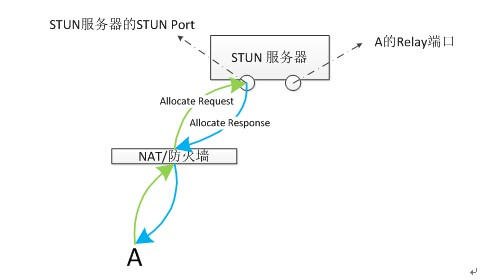

a) 客户端A向STUN Port发送Allocate请求(图中绿色部分)  
b) STUN服务器接收到客户端A的Allocate请求，服务器一看是Allocate请求，则根据relay端口分配策略为A分配一个端口。  
c) 服务器发送response成功响应。在该response中包含XOR-RELAYED-ADDRESS属性。该属性值就是A的relay端口的异或结果。  
d) 客户端接收到response后，就知道了自己的relay地址。该relay地址是个公网地址，可以看作是客户端A在公网上的一个代理，任何想要联系A的客户端，只要将数据发送到A的relay地址就可以了，具体的转发原理请看下一小节。

####Relay端口消息的转发

任何想要联系客户端A的人，只要知道客户端A的relay地址就可以了。

#####（1）A的Relay端口接受其他客户端的消息

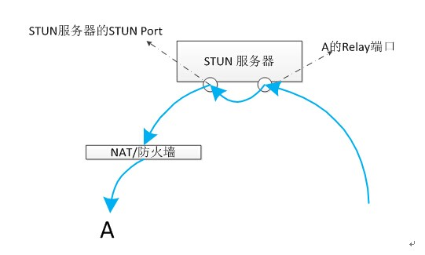

如上图所示：因为客户端A位于NAT后，所以其他客户端无法和A建立直接的通信。但是客户端A在STUN服务器上申请了一个端口(上图中：A的relay端口)，其他客户端想要和A通信，那么只需要将信息发送到"A的relay端口"，STUN服务器会将从relay端口接收到的信息通过STUN Port发送给A。

#####（2）A的响应消息原路返回

A应答其他客户端发来的消息的时候，是通过原路返回的。

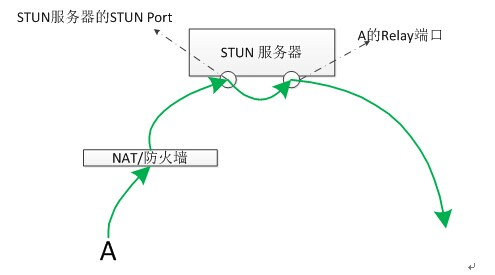

_思考_  

1.STUN服务器为什么不直接从A的relay端口把数据转发给A呢（如下图所示）？而非要从STUN端口发送？  

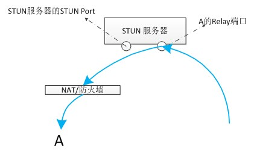

  
2.客户端A的响应消息在原路返回的时候，A的响应消息是先发送到了STUN Port，然后再经由A的relay Port发出的。那么A的relay Port是怎么知道它要把数据发送到哪呢？

####Refresh请求

STUN服务器给客户端A分配的relay地址都具有一定的有效时长，可能是30秒或者1分钟或者几十分钟。客户端如果需要STUN服务器一直为它开启这个端口，就需要定时的向STUN服务器发送请求，该请求用刷新relay端口的剩余时间。在标准的TURN（RFC 5766）协议中，客户端A向STUN服务器发送Allocate请求，STUN服务器在响应消息中添加了一个"LifeTime"的属性，该属性表示relay的存活时间。 客户端需要在relay的存活时间内周期性的调用REFRESH请求，服务端接收到REFRESH请求后，刷新剩余时间；当REFRESH请求中的lifetime属性为0时，说明是客户端主动要求关闭relay地址。

####STUN端口的保活

由于与STUN服务器通信使用的是UDP，所以为了保持一个长连接，需要客户端周期性的向STUN服务器的STUN Port发送心跳包。  
周期性心跳包的目的就是，使得NAT设备对客户端A的反射地址(Server Reflexive Address)一直有效。使得从STUN Port发送的数据能通过A的反射地址到达A。此处不理解的可以查阅"NAT 类型的分类以及NAT的作用"。 
此处解释了，7.2.2.3中的第一个问题，因为客户端A没有和relay Port保活，又由于NAT的特性，数据直接通过relay port转发给A时，NAT直接就丢弃了，所以A是收不到的。所以数据必须经过STUN服务器的STUN Port发送。

####Relay转发的时候添加STUN头（Send和Data请求）

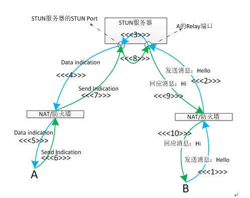
  

如上图所示是B主动给A发消息："Hello"，A回应"Hi"的过程。  

* 序号1、2、3、4、5为B的发送请求(蓝色箭头方向)；  
* 序号6、7、8、9、10为A的回应，原路返回（绿色箭头方向）。注意：在"Hello"发送的过程中，1、2阶段时，发送的数据为裸的UDP数据。在4、5过程中，是被STUN协议包装过的"Hello"，称之为Data indication。同样在"Hi"发送的过程中，6、7阶段为被STUN协议包装过的"Hi"，称之为Send indication，9、10是裸的UDP数据。  
* 在4、5阶段，由于数据是从STUN Port转发下来的，为了能够让客户端A知道这个包是哪个客户端发来的，所以，STUN 协议对"Hello"进行了重新的包装，最主要的就是添加了一个XOR-PEER-ADDRESS属性，由裸数据包装成STUN协议的过程，我们称之为添加了STUN头。XOR-PEER-ADDRESS的内容就是客户端B的反射地址（Server Reflexive Address）。  
* 在6、7阶段，A的响应原路返回，为了能够让A的relay port知道最终发往哪个客户端，因此也为"Hi"添加了STUN头，也是添加了XOR-PEER-ADDRESS属性，内容就是客户端B的反射地址（Server Reflexive Address）。这样A的relay port就知道"Hi"的目的地址。  
* 第3阶段是：从A的relay端口收到数据，添加STUN头后，最后从STUN Port 发出的过程。  
* 第8阶段是：从STUN Port 接收到带STUN 头的数据，去掉STUN头，最后从A的relay端口发出的过程。

客户端B主动发送信息给A的交互流程如上图所示，那么客户端A主动发送信息给客户端B的交互流程是怎样的呢，你能画出来吗？  
要知道客户端A主动发消息给客户端B，应该将消息发往客户端B的relay port哦。。
