<!--BEGIN_DATA
{
    "create_date": "2021-01-12 15:50", 
    "modify_date": "2021-01-12 15:50", 
    "is_top": "0", 
    "summary": "PCM浅析<br/>PCM音量控制<br/>PCM音量控制（高级篇）", 
    "tags": "WebRTC", 
    "file_name": "PCM音量相关.md"
}
END_DATA-->

#### <p>原文出处：<a href='https://mp.weixin.qq.com/s/p3I98UtQhx-jdCn8tw-bGw' target='blank'>PCM浅析</a></p>

最近有个需求：对音频裁剪时，裁剪条的纵坐标必须是音频音量，以帮助用户更好的选择音频区域，所以就需要快速准确的提取出音频的音量列表。本文主要介绍下从mp4文件中提取音轨音量的方式，以及相关的知识点。

### 音频基础知识

声音的本质是空气压力差造成的空气振动，振动产生的声波可以在介质中快速传播，当声波到达接收端时（比如：人耳、话筒），引起相应的振动，最终被听到。

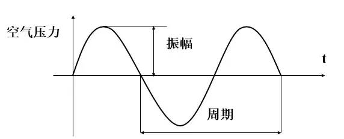

声音有两个基本属性：**频率与振幅**。声音的振幅就是音量，频率的高低就是音调，频率的单位是赫兹（Hz）。

当声波传递到话筒时，话筒里的碳膜会随着声音一起振动，而碳膜下面是一个电极，碳膜振动时会触碰电极，接触时间的长短跟振动幅度有关（即：声音响度），这样就完成了声音信号到电压信号的转换。后面经过电路放大后，就得到了模拟音频信号。

模拟音频：用连续的电流或电压表示的音频信号，在时间和振幅上是连续。过去记录的声音都是模拟音频，比如：机械录音（以留声机、机械唱片为代表）、磁性录音（以磁带录音为代表）等模拟录音方式。

**计算机不能直接处理连续的模拟信号，所以需要进行A/D转换**，以一定的频率对模拟信号进行采样（就是获取一定时间间隔的波形振幅值，采样后模拟出的波形与原始波形之间的误差称为采样噪音），然后再进行量化和存储，就得到了数字音频。

> 数字音频：通过采样和量化获得的离散的、数字化的音频信号，即：计算机可以处理的二进制的音频数据。

相反的，当通过扬声器播放声音时，计算机内部的数字信号通过D/A转换，还原成了强弱不同的电压信号。这种强弱变化的电压会推动扬声器的振动单元产生震动，就产生了声音。整个流程可以用下图来表示：

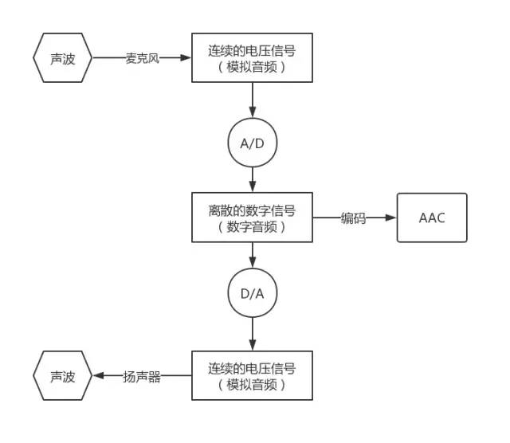

#### PCM元数据

最常见的A/D转换是**通过脉冲编码调制 PCM (Pulse Code Modulation)**。要将连续的电压信号转换为PCM，需要进行采样和量化，我们一般从如下几个维度描述PCM：

1. **采样频率（Sampling Rate）**：单位时间内采集的样本数，即：采样周期的倒数，指两个采样之间的时间间隔。采样频率越高，声音质量越好，但同时占用的带宽越大。一般情况下，22KHz相当于普通FM的音质，44KHz相当于CD音质，目前的常用采样频率都不超过48KHz。
2. **采样位数：表示一个样本的二进制位数，即：每个采样点用多少比特表示**。计算机中音频的量化深度一般为4、8、16、32位（bit）等。例如：采样位数为8 bit时，每个采样点可以表示256个不同的采样值，而采样位数为16 bit时，每个采样点可以表示65536个不同的采样值。采样位数的大小影响声音的质量，采样位数越多，量化后的波形越接近原始波形，声音的质量越高，而需要的存储空间也越多；位数越少，声音的质量越低，需要的存储空间越少。一般情况下，CD音质的采样位数是16 bit，移动通信是8 bit。
3. **声道数：记录声音时，如果每次生成一个声波数据，称为单声道；每次生成两个声波数据，称为双声道（立体声）。**单声道的声音只能使用一个喇叭发声，双声道的PCM可以使两个喇叭同时发声（一般左右声道有分工），更能感受到空间效果。
4. 时长：采样时长,数字音频文件大小（Byte) = 采样频率（Hz）× 采样时长（S）×（采样位数 / 8）× 声道数（单声道为1，立体声为2）

> 采样点数据有有符号和无符号之分，比如：8 bit的样本数据，有符号的范围是-128 ~ 127，无符号的范围是0 ~ 255。大多数PCM样本使用整形表示，但是在一些对精度要求比较高的场景，可以使用浮点类型表示PCM样本数据。

下面看一个具体的采样示例：

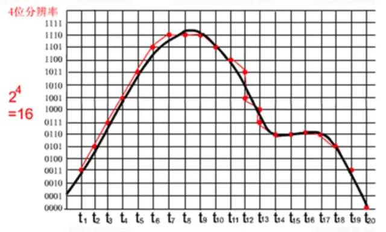

其中，黑色曲线表示要采集的声音波形，红色曲线表示采样量化后的PCM数据波形。上图中，采样位数是4 bit，每个红点对应一个Pcm采样数据，很明显：

  * 采样频率越高，x轴采样点越密集，声音越接近原始数据。
  * 采样位数越高，y轴量化越精确，声音越接近原始数据。

#### PCM数据存储

接下来看下PCM数据存储方式，如果是单声道音频，采样数据按照时间的先后顺序依次存储，如果是双声道音频，则按照`LRLRLR`方式存储，每个采样点的存储方式还与机器大小端有关。大端模式如下图所示：

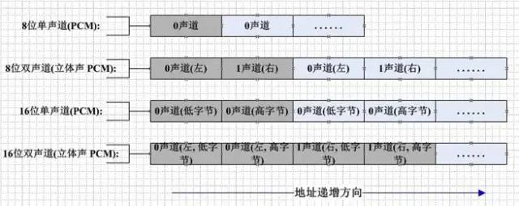

> Pcm文件没有头部信息，全部是采样量化后的未压缩音频数据。

#### PCM音量计算

我们一般用分贝（db）描述声音响度。声学领域中，分贝的定义是声源功率与基准声源功率比值的对数乘以20的数值。根据人耳的特性，我们对声音的大小感知呈对数关系，而不是线性关系。人类的听觉反应是基于声音的相对变化而非绝对变化。对数函数正好能模仿人耳对声音的反应。所以用分贝描述声音强度更符合人类对声音强度的感知。如下图所示，横轴表示PCM采样值，纵轴表示人耳感知到的音量，图中截取了两块横轴变化相同的区域，但是人耳感觉到的音量变化是不一样的。在较安静的左侧，感觉到的音量变化较大；在叫喧嚣的右侧，人耳感觉到的音量变化较小。

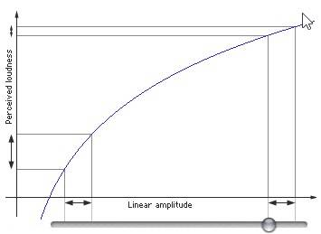

具体来说，分贝计算公式如下所示：


其中，表示两个采样值的比值。在计算某个采样值的分贝时，直接把当成最小采样值1处理就可以了。所以如果采样位数是16 bit，那么无符号情况下，最大分贝是：


有符号情况下，最大分贝是：


OK，了解了PCM格式和db计算方式之后，我们看下从音频文件提取db值的整体流程：

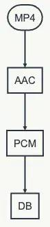

### Android

首先，我们基于Android平台的多媒体API来实现PCM的数据提取，然后计算分贝值。

简单概述就是：**首先通过MediaExtractor解封装Mp4提取AAC编码流，然后通过MediaCodec解码AAC数据，得到PCM**。核心代码如下所示：

```java
// 解封装器  
val audioExtractor = MediaExtractor()  
// 设置路径  
audioExtractor.setDataSource(audioInputPath)  
// 找到音轨  
for (i in 0 until audioExtractor.trackCount) {  
    val format = audioExtractor.getTrackFormat(i)  
    if (format.getString(MediaFormat.KEY_MIME).startsWith("audio/")) {  
        audioExtractor.selectTrack(i)  
        // 音轨Format  
        inputAudioFormat = format  
        break  
    }  
}  
    
// 音频声道数  
audioChannel = inputAudioFormat.getInteger(MediaFormat.KEY_CHANNEL_COUNT)  
// 音频采样率  
audioSampleRate = inputAudioFormat.getInteger(MediaFormat.KEY_SAMPLE_RATE)  
val mime = inputAudioFormat.getString(MediaFormat.KEY_MIME)  
val sampleBitStr = inputAudioFormat.getString(MediaFormat.KEY_PCM_ENCODING)  
val sampleBit = if (sampleBitStr != null) {  
                    try {  
                        Integer.parseInt(sampleBitStr)  
                        } catch (e: Exception) {  
                            AudioFormat.ENCODING_PCM_16BIT  
                        }  
                } else {  
                    AudioFormat.ENCODING_PCM_16BIT  
                }  
    
// 一个采样点占用的字节数  
sampleByte = when (sampleBit) {  
    AudioFormat.ENCODING_PCM_8BIT -> 1  
    AudioFormat.ENCODING_PCM_16BIT -> 2  
    else -> 2  
}  
    
// 启动解码器  
val audioDecoder = MediaCodec.createDecoderByType(mime)  
audioDecoder.configure(inputAudioFormat, null, null, 0)  
audioDecoder.start()  
    
// 解码器的输入和输出Buffer列表  
val decoderInputBuffer = audioDecoder.inputBuffers  
var decoderOutputBuffer = audioDecoder.outputBuffers  
val bufferInfo = MediaCodec.BufferInfo()  
while (!decodeDone) {  
    if (!inputDone) { // 提取AAC，进行编码  
        val inputIndex = audioDecoder.dequeueInputBuffer(0L)  
        if (inputIndex >= 0) {  
            val inputBuffer = decoderInputBuffer[inputIndex]  
            inputBuffer.clear()  
            val readSampleSize = localAudioExtractor.readSampleData(inputBuffer, 0)  
            if (readSampleSize > 0) {  
                audioDecoder.queueInputBuffer(inputIndex, 0, readSampleSize, localAudioExtractor.sampleTime, localAudioExtractor.sampleFlags)  
                // 移动到下一帧  
                audioDecoder.advance()  
            } else { // 结束帧  
                audioDecoder.queueInputBuffer(inputIndex, 0, 0, 0, MediaCodec.BUFFER_FLAG_END_OF_STREAM)  
                inputDone = true  
            }  
        }  
    }  
        
    if (!decodeDone) {  
        val outputIndex = localAudioDecoder.dequeueOutputBuffer(bufferInfo, 0)  
        if (outputIndex >= 0) {  
            if(bufferInfo.size > 0){  
                val outputBuffer = decoderOutputBuffer[outputIndex]  
                // 大小端  
                val isBigEndian = (outputBuffer.order() == ByteOrder.BIG_ENDIAN)  
                outputBuffer.position(bufferInfo.offset)  
                outputBuffer.limit(bufferInfo.offset + bufferInfo.size)  
                val pcmByteArray = ByteArray(bufferInfo.size)  
                // copy出PCM数据  
                outputBuffer.get(pcmByteArray)  
                outputBuffer.clear()  
                // 当前帧采样点个数  
                val curSampleNum = pcmByteArray.size / sampleByte / audioChannel  
                // 计算出当前帧的DB值  
                val db = compute(isBigEndian,pcmByteArray,audioChannel,sampleByte)  
                // 处理db值  
                ......  
            }  
                
            // 归还Buffer  
            audioDecoder.releaseOutputBuffer(outputIndex, false)  
            // 判断是否是最后的帧  
            if ((bufferInfo.flags and MediaCodec.BUFFER_FLAG_END_OF_STREAM) != 0){  
                decodeDone = true  
            }  
        }  
    }  
}  
```

上述代码是通过MediaExtractor和MediaCodec解码音视频的标准流程，已经添加了详细的注释，我们看下基于PCM计算db的具体函数：

```java    
fun compute(isBigEndian : Boolean ,pcmByteArray : ByteArray,audioChannel : Int,sampleByte : Int){  
// 计算出步长：MediaCodec解码出的PCM数据是按照Packed模式存储的  
val step = if (audioChannel == 2) {  
            if (sampleByte == 2) {  
                4  
            } else {  
                2  
            }  
        } else {  
            if (sampleByte == 2) {  
                2  
            } else {  
                1  
            }  
        }  
    
var i = 0  
var sum = 0.0  
while (i < pcmByteArray.size) {  
    // 绝对值求和  
    sum += if (sampleByte == 2) {  
                // 根据大小端把两个byte转换成short  
                val sample = byteToShort(isBigEndian, pcmArray[i], pcmArray[i + 1])  
                Math.abs(sample.toInt()).toDouble()  
            } else {  
                Math.abs(pcmByteArray[i].toInt()).toDouble()  
            }  
            i += step  
    }  
    
// 基于平均采样点，计算出db值      
return (20 * log10(sum / (pcmByteArray.size / step))).toInt()  
}  
```

通过上述代码，我们可以基于解码出的PCM，计算出对应的db值，但是这种方式存在一个最大的缺点就是耗时严重，一个5分钟的音频，需要二三十秒，甚至更长，这完全是无法忍受的。我们不得不寻求更高效的解决方案。

### iOS

iOS平台提供了AVFoundation库，用于音视频操作。我们可以基于它直接提取出整首歌的PCM数据，然后计算出分贝值。大体流程如下所示：

  * 首先通过`AVAudioFile`加载本地音频文件，获取采样率、声道数等音频信息。
  * 接着通过上述采样率、声道数以及采样点格式`AVAudioCommonFormat`构建`AVAudioFormat`，表示一种音频格式。
  * 然后通过`AVAudioFormat`和音频采样帧数（等于采样率乘以时长）构建`AVAudioPCMBuffer`，并且通过AVAudioFile.read把音频数据解码到`AVAudioPCMBuffer`，获取到解码后的PCM Buffer。
  * `AVAudioPCMBuffer`包含了多个声道的数据，多个声道的数据是如何存储的那？可以通过`AVAudioFormat.isInterleaved`进行判断，若是true，则表示多个声道数据是交替存储的，即：`LRLRLRLR`方式，若是false，则表示多个声道数据是分开存储的，即：`LLLLRRRR`模式。
  * 最后基于`AVAudioPCMBuffer`提供的PCM数据，针对单一声道，计算出分贝值，计算方式与Android平台类似，此处不再赘述。

可见，**iOS平台对音频数据的提取提供了非常友好的API，并且测试下来发现，同一首5分钟的歌曲，耗时只有两三秒，各个方面，都吊打 Android **。

### 跨平台

除了Android和iOS平台的多媒体框架，我们还可以基于FFmpeg实现跨平台的PCM数据提取。

FFmpeg是一个开源的跨平台多媒体框架，关于FFmpeg的介绍，网上的资料很多，这里就不再赘述了。

通过FFmpeg解码本地音视频文件，还是比较简单的，整体流程如下所示：

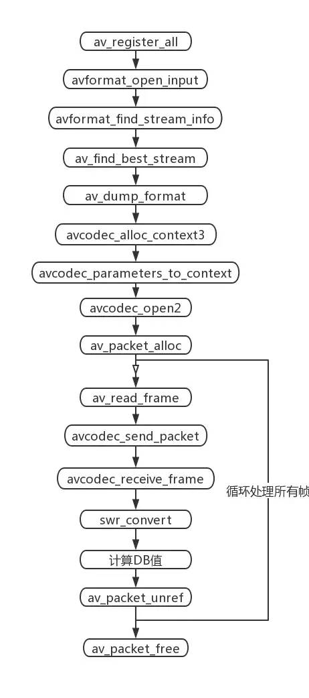

  * 首先注册所有的解封装和封装格式`（av_register_all）`。
  * 接着打开本地文件，获取音频流信息（`avformat_open_input -> av_dump_format）`。
  * 其次创建解码音频流的解码上下文，并设置解码参数`（avcodec_alloc_context3 -> avcodec_open2）。`
  * 然后从本地文件读取音频裸流帧AVPacket，然后交给解码器解码，最后从解码器获取PCM原始数据帧AVFrame（`av_packet_alloc -> avcodec_receive_frame）`。
  * 因为FFmpeg解码出的PCM数据存储格式有很多种，所以我们会统一重采样到`AV_SAMPLE_FMT_S16P`格式`（swr_convert）`。
  * 最后针对重采样后的PCM数据计算出分贝值，并且释放各种资源。

不同于MediaCodec解码出的PCM是按照`LRLRLR`方式存储，FFmpeg解码出的PCM存储格式更加丰富，如下所示：

```cpp
enum AVSampleFormat {  
    AV_SAMPLE_FMT_NONE = -1,  
    AV_SAMPLE_FMT_U8,          ///< unsigned 8 bits  
    AV_SAMPLE_FMT_S16,         ///< signed 16 bits  
    AV_SAMPLE_FMT_S32,         ///< signed 32 bits  
    AV_SAMPLE_FMT_FLT,         ///< float  
    AV_SAMPLE_FMT_DBL,         ///< double  
    
    AV_SAMPLE_FMT_U8P,         ///< unsigned 8 bits, planar  
    AV_SAMPLE_FMT_S16P,        ///< signed 16 bits, planar  
    AV_SAMPLE_FMT_S32P,        ///< signed 32 bits, planar  
    AV_SAMPLE_FMT_FLTP,        ///< float, planar  
    AV_SAMPLE_FMT_DBLP,        ///< double, planar  
    AV_SAMPLE_FMT_S64,         ///< signed 64 bits  
    AV_SAMPLE_FMT_S64P,        ///< signed 64 bits, planar  
    
    AV_SAMPLE_FMT_NB           ///< Number of sample formats. DO NOT USE if linking dynamically  
};  
```

  

除了有有符号和无符号的区别外，还可以是short、float和double类型，采样位数也可以是8 bit、16 bit、32 bit和64 bit。除此之外，即使同样是signed 16 bits，也存在Packed和Planar的区别。

**对于双声道音频来说，Packed表示两个声道的数据交错存储，交织在一起**，即：`LRLRLRLR`的存储方式；Planar 表示两个声道分开存储，也就是平铺分开，即：`LLLLRRRR`的存储方式。

通过MediaCodec解码出的PCM是按照Packed方式存储的，而FFmpeg解码出的PCM则可能是其中的任意一种。

所以为了更好的归一化处理，我们会对FFmpeg解码出的PCM进行重采样，统一采样成`AV_SAMPLE_FMT_S16P`格式，即：每个采样点是两字节的有符号short类型，并且按照`Planar`方式存储。

> 重采样：对PCM数据进行重新采样，可以改变它的声道数、采样率和采样格式。比如：原先的PCM音频数据是2个声道，44100采样率，32 bit单精度型。那么可以重采样成：2个声道，44100采样率，有符号short类型。

关于分贝值的计算，与上述基于Android平台的计算方式基本一致，此处就不再赘述了。

同一首5分钟的歌，通过FFmpeg提取PCM的耗时只有一两秒，提取效率至少提升了10倍以上，基本上与iOS持平，至此终于可以松一口气了。

### PCM播放

PCM是原始采样数据，必须指定采样率、声道数和采样位数（大小端）才能播放。通过ffplay播放PCM的命令如下所示：

```    
fplay -ar 44100 -channels 2 -f s16le -i test.pcm  
```
参数说明:  

1. -ar PCM采样率  
2. -channels PCM通道数  
3. -f PCM格式：`sample_fmts + le(小端)或者be(大端)`   `sample_fmts`可以通过ffplay -sample_fmts来查询  

除此之外，通过Audacity也可以直接播放PCM数据：文件 -> 导入 -> 原始数据，然后选择对应的采样率、声道数、采样位数和大小端就可以播放了。

Audacity功能很强大，对于PCM的波形（采样点值）、响度（db）和频谱，都可以直接查看，如下所示：PCM-波形

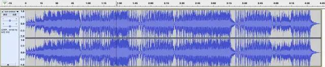

PCM-响度

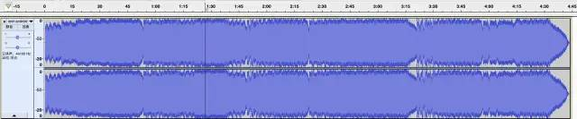

PCM-频谱

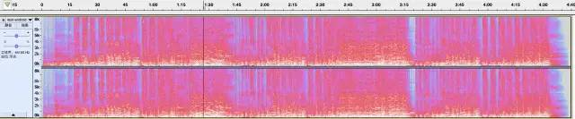

### 疑问点

为什么Android平台解封装、解码音频提取PCM的速度这么慢？具体原因我也无法猜测，待深入研究之后再来解答吧，如果音视频的大佬有相关经验，也麻烦告知。

<hr>

#### <p>原文出处：<a href='http://blog.jianchihu.net/pcm-volume-control.html' target='blank'>PCM音量控制</a></p>

### 一、声音的相关概念

声音是介质振动在听觉系统中产生的反应。声音总可以被分解为不同频率不同强度正弦波的叠加（傅里叶变换）。  


声音有两个基本的物理属性：**频率**与**振幅**。声音的振幅就是音量，频率的高低就是指音调，频率用赫兹（Hz）作单位。人耳只能听到20Hz到20khz范围的声音。  

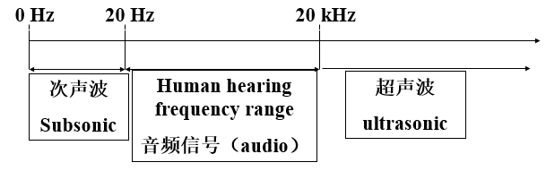

**模拟音频**（Analogous Audio），用连续的电流或电压表示的音频信号，在时间和振幅上是连续。在过去记录声音记录的都是模拟音频，比如机械录音（以留声机、机械唱片为代表）、光学录音（以电影胶片为代表）、磁性录音（以磁带录音为代表）等模拟录音方式。

**数字音频**（Digital Audio），通过采样和量化技术获得的离散性（数字化）音频数据。计算机内部处理的是二进制数据，处理的都是数字音频，所以需要将模拟音频通过采样、量化转换成有限个数字表示的离散序列（即实现音频数字化）。  

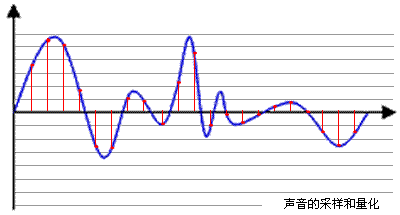

**采样频率**（Sampling Rate），单位时间内采集的样本数，是采样周期的倒数，指两个采样之间的时间间隔。采样频率必须至少是信号中最大频率分量频率的两倍，否则就不能从信号采样中恢复原始信号，这其实就是著名的香农采样定理。CD音质采样率为 44.1 kHz,其他常用采样率：22.05KHz，11.025KHz,一般网络和移动通信的音频采样率：8KHz。  

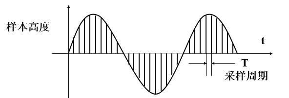

**量化深度**，表示一个样本的二进制的位数，即样本的比特数。量化是将经过采样得到的离散数据转换成二进制数的过程，量化深度表示每个采样点用多少比特表示，在计算机中音频的量化深度一般为4、8、16、32位（bit）等。例如：量化深度为8bit时,每个采样点可以表示256个不同的量化值，而量化深度为16bit时,每个采样点可以表示65536个不同的量化值。量化深度的大小影响到声音的质量，显然，位数越多，量化后的波形越接近原始波形，声音的质量越高，而需要的存储空间也越多；位数越少，声音的质量越低，需要的存储空间越少。CD音质采用的是16 bits，移动通信 8bits。

**声道数**，记录声音时，如果每次生成一个声波数据，称为单声道；每次生成两个声波数据，称为双声道。使用双声道记录声音，能够在一定程度上再现声音的方位，反映人耳的听觉特性。

**数字音频存储大小**。采样频率、量化深度数越高，声音质量也越高，保存这段声音所用的空间也就越大。立体声（双声道）存储大小是单声道文件的两倍。即：文件大小（B）=采样频率（Hz）×录音时间（S）×（量化深度/8）×声道数（单声道为1，立体声为2）  

如：录制1分钟采样频率为44.1KHz，量化深度为16位，立体声的声音（CD音质），文件大小为：  

`44.1×1000×60×(16/8)×2=10584000B≈10.09M`

### 二、PCM

音频编码，指将模拟音频转换成数字音频并以某种格式存储的技术或过程。

**PCM（Pulse Code Modulation）**编码，即通过脉冲编码调制方法生成数字音频数据的技术或格式，是一种无损编码格式，是音频模拟信号数字化的一种方法，需要经过采样、量化和编码过程，以实现音频模拟信号数字化。

首先从6个方面描述PCM：  

1. 采样率；  
2. 符号：表示样本数据是否是有符号位，比如用一字节表示的样本数据，有符号的话表示范围为-128~127，无符号就是0~255，;  
3. 字节序：字节序分为大端与小端;  
4. 样本大小：决定了每个样本由多少位组成，即前面说到的量化深度，一般16位是最常见的;  
5. 声道数：分为单声道与双声道。  
6. 整形或浮点型：大多数格式的PCM样本数据使用整形表示，然而在一些对精度要求高的应用方面，使用浮点类型表示PCM样本数据。

打开ffmpeg，敲:`ffmpeg -formats`命令，获取ffmpeg支持的音视频格式，在这当中我们可以找到支持的PCM格式

```
 DE f32be           PCM 32-bit floating-point big-endian
 DE f32le           PCM 32-bit floating-point little-endian
 DE f64be           PCM 64-bit floating-point big-endian
 DE f64le           PCM 64-bit floating-point little-endian
 DE mulaw           PCM mu-law
 DE s16be           PCM signed 16-bit big-endian
 DE s16le           PCM signed 16-bit little-endian
 DE s24be           PCM signed 24-bit big-endian
 DE s24le           PCM signed 24-bit little-endian
 DE s32be           PCM signed 32-bit big-endian
 DE s32le           PCM signed 32-bit little-endian
 DE s8              PCM signed 8-bit
 DE u16be           PCM unsigned 16-bit big-endian
 DE u16le           PCM unsigned 16-bit little-endian
 DE u24be           PCM unsigned 24-bit big-endian
 DE u24le           PCM unsigned 24-bit little-endian
 DE u32be           PCM unsigned 32-bit big-endian
 DE u32le           PCM unsigned 32-bit little-endian
 DE u8              PCM unsigned 8-bit
```

比如DE s16be，就表示一个样本用16bits有符号的整形数据表示，字节序为大端。

假设我们有一个PCM signed 16-bit little-endian，双声道的PCM文件。如下是文件中前9个样本：

```
+------+------+------+------+------+------+------+------+------+ | 500 | 300 |
-100 | -20 | -300 | 900 | -200 | -50 | 250 |
+------+------+------+------+------+------+------+------+------+
```

每个样本2字节，总共18字节，每个样本取值范围：-32768 ~ 32767。

### 三、PCM音量控制

通过前面描述我们对PCM有了个了解，知道了在PCM流中数据如何存储。下面我们先看一个真正的音频样本波形：  

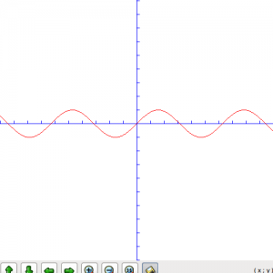

如果我们放大5倍波形，也就是振幅乘以5，此时我们听到了更大的声音，此时样本波形如下：  

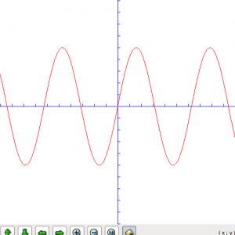

假如我们有2048bytesPCM数据，样本大小两个字节，共有1024个样本，我们要放大两倍声音，代码可以按如下写：

```cpp
int16_t pcm[1024] = read in some pcm data;
for (ctr = 0; ctr < 1024; ctr++) {
    pcm[ctr] *= 2;
}
```

这是不是很简单，但是接下来我们还需要考虑两个方面的问题。

#### 数据溢出

因为每个样本取值范围是有限制的，调节音量时不可能随便增大，比如一个signed 16 bits的样本，值为5000，我们放大10倍，由于有符号位16bits数据取值范围为-32768~32767，5000乘以10得到的50000超过了32767，数据溢出了，最后值可能变为-15536，不是我们期望的。此时我们就需要裁剪了，确保数值在正确范围内。如下代码对前面说到的放大两倍声音做了裁剪处理：

```cpp
int16_t pcm[1024] = read in some pcm data;
int32_t pcmval;
for (ctr = 0; ctr < 1024; ctr++) {
    pcmval = pcm[ctr] * 2;
    if (pcmval < 32767 && pcmval > -32768) {
        pcm[ctr] = pcmval
    } else if (pcmval > 32767) {
        pcm[ctr] = 32767;
    } else if (pcmval < -32768) {
        pcm[ctr] = -32768;
    }
}
```

#### 对数描述

平时表示声音强度我们都是用**分贝（db）**作单位的，声学领域中，分贝的定义是声源功率与基准声功率比值的对数乘以10的数值。根据人耳的心理声学模型，人耳对声音感知程度是对数关系，而不是线性关系。人类的听觉反应是基于声音的相对变化而非绝对的变化。对数标度正好能模仿人类耳朵对声音的反应。所以用分贝作单位描述声音强度更符合人类对声音强度的感知。前面我们直接将声音乘以某个值，也就是线性调节，调节音量时会感觉到刚开始音量变化很快，后面调的话好像都没啥变化，使用对数关系调节音量的话声音听起来就会均匀增大。

如下图，横轴表示音量调节滑块，纵坐标表示人耳感知到的音量，图中取了两块横轴变化相同的区域，音量滑块滑动变化一样，但是人耳感觉到的音量变化是不一样的，在左侧也就是较安静的地方，感觉到音量变化大，在右侧声音较大区域人耳感觉到的音量变化较小。  

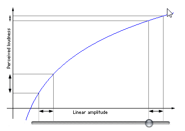

下面我们讲下音量值乘数取值，这里我只简单的用tan函数模拟，效果也不错，至于使用对数如何调整请参考文末链接：

```cpp
int some_level;
float multiplier = tan (some_level / 100.0 );
```

上面代码中音量乘数取值为`tan (some_level / 100.0 )`，最后实现代码如下：

```cpp
int16_t pcm[1024] = read in some pcm data;
int32_t pcmval;
uint8_t level = certain value;
float multiplier = tan(level/100.0);
for (ctr = 0; ctr < 1024; ctr++) {
    pcmval = pcm[ctr] * multiplier;
    if (pcmval < 32767 && pcmval > -32768) {
        pcm[ctr] = pcmval
    } else if (pcmval > 32767) {
        pcm[ctr] = 32767;
    } else if (pcmval < -32768) {
        pcm[ctr] = -32768;
    }
}
```

其中level取值需要具体测试实现，一般使用时level取值为某个范围的几个数，比如取10个数，这样音量就有10个阶跃可以调节。  

如下图，最后声音音量近似按对数关系增长了：  

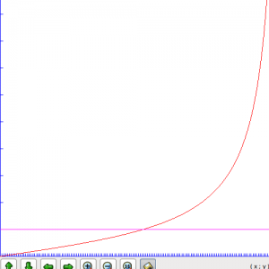

<hr>

#### <p>原文出处：<a href='https://blog.jianchihu.net/pcm-vol-control-advance.html' target='blank'>PCM音量控制（高级篇）</a></p>

> 去年写过一篇文章，有关[PCM的音量控制](http://blog.jianchihu.net/pcm-volume-control.html)。那时阐述了一些概念，对一些细节没有详细描述。因为有人问到使用对数关系调节音量，故开此篇文章。

### 声学中的分贝

因为人耳的特性，我们对声音的大小感知呈对数关系。所以我们通常用分贝描述声音大小，分贝（decibel）是量度两个相同单位之数量比例的单位，主要用于度量声音强度，常用dB表示。声学中，声音的强度定义为声压。计算分贝值时采用20微帕斯卡为参考值（通常被认为是人类的最少听觉响应值，大约是3米以外飞行的蚊子声音）。这一参考值是人类对声音能够感知的阈值下限。声压是场量，因此使用声压计算分贝时使用下述版本的公式：  

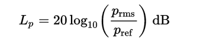  

其中的pref是标准参考声压值20微帕。

### 分贝声音变化范围

在编程中，我们可以用以下公式计算两个声音之间的动态范围，单位为分贝：

```
dB = 20 * log(A1 / A2)
```

其中 A1 和 A2 是两个声音的振幅，在程序中表示每个声音样本的大小。声音采样大小（也就是量化深度）为1bit时，动态范围为0，因为只可能有一个振幅。采样大小为8bit也就是一个字节时，最大振幅是最小振幅的 256 倍。因此，动态范围是 48 分贝，计算公式如下：  

```
dB = 20 * log(256)
```

48 分贝的动态范围大约是一个安静房间和一台运行着电动割草机之间的区别。如果将声音采样大小增加一倍到16bit，产生的动态范围则为 96 分贝，计算公式如下：  

```
dB = 20 * log(65536)
```

这非常接近听力最低阈值和产生痛感之间的区别，这个范围被认为非常适合还原音乐。

了解了分贝的相关概念我们通过图表说下为什么要用对数关系描述声音大小。  

1）音量滑块与声音增幅大小线性变化。  

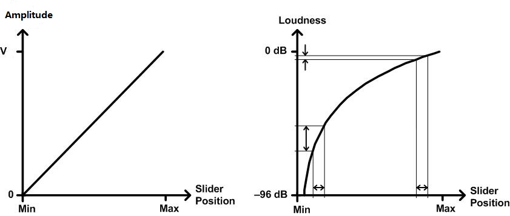

上述左图中，音量滑块位置与声音振幅为线性增长关系，右图是我们人耳感受的音量大小与滑块位置关系。可知，在左侧移动相同距离的滑块，感知到的声音变化范围很大，在右侧接近声音最大值移动相同距离滑块，感知到的声音大小变化就很小了。

2）音量滑块与声音振幅大小对数关系变化。  

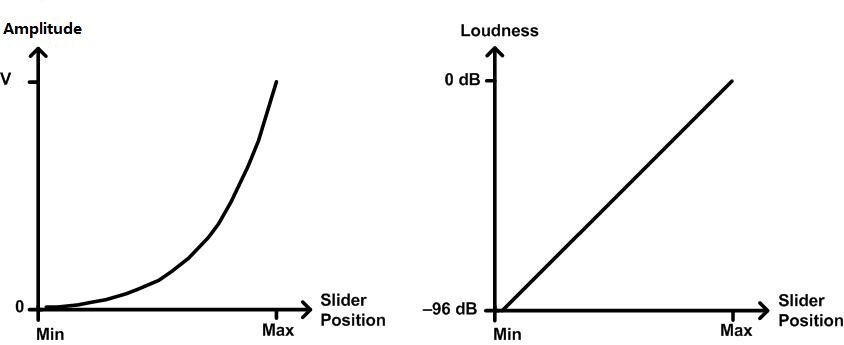  

左图中，音量滑块位置与声音振幅对数关系增长。右图中无论哪个位置，移动相同距离滑块，感知到的声音变化都是相同的。

需要说明的是滑块最小位置只是接近0，不能为0，因为对数函数y=logx中x>0。

### windows系统中音量滑块控制的声音变化范围

在最新版的windows系统中，音量滑块控制的声音变化范围也是96分贝。如下表所示，是不同版本windows的音量范围以及默认音量值。  

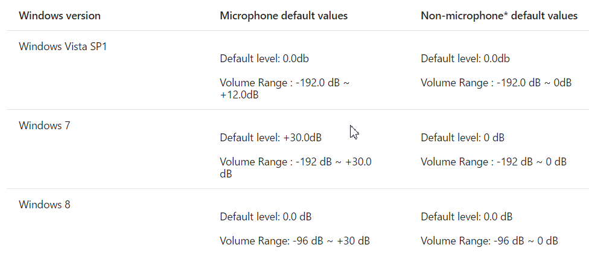

从表中我们可以看到默认值都是0分贝，根据分贝公式：`dB = 20 * log(A1 / A2)`，当A1，A2相等时，db为0。

### 程序实现

了解了分贝以及Windows中音量滑块是在哪个范围变化，我们的程序实现起来也很简单。

这里我们规定音量大小变化范围也是96分贝，每个声音采样大小为16位。对于分贝公式：dB = 20 * log(A1 / A2)，我们取参考声音振幅A2为原始声音振幅，A1为调节后的声音振幅大小。可知调节后的声音：

```
A1 = A2 * pow(10 , db/20)
```

看过一篇文章说理想的声音调节步长最好是2db，对于96db范围，我们按2db步长进行分割，可以分成48份，这样我们得到的声音变化为[-96db, -94db, -92db, ... -4db, -2db, 0db]，假设我们要调节一半音量大小，也就是-48db，由上述公式可知：调节后音量A1大小：

```
A1 = A2 * pow(10 , -48/20)
```

程序伪代码如下，具体db大小与滑块位置对应关系的实现这里就不写出：

```cpp
int16_t pcm[1024] = read in some pcm data;
int32_t pcmval;
float multiplier = pow(10,db/20);
for (ctr = 0; ctr < 1024; ctr++) {
    pcmval = pcm[ctr] * multiplier;
    if (pcmval < 32767 && pcmval > -32768) {
        pcm[ctr] = pcmval
    } else if (pcmval > 32767) {
        pcm[ctr] = 32767;
    } else if (pcmval < -32768) {
        pcm[ctr] = -32768;
    }
}
```

### 参考

* [Audio-Tapered Volume Controls](https://docs.microsoft.com/en-us/windows/win32/coreaudio/audio-tapered-volume-controls)


