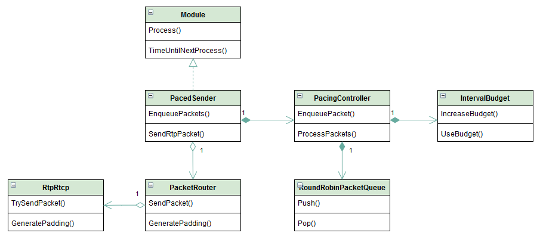
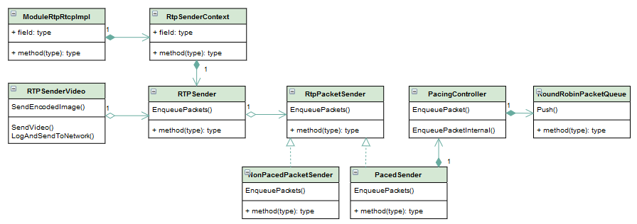
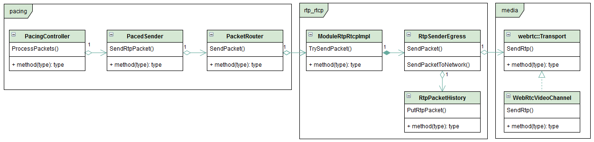

<!--BEGIN_DATA
{
    "create_date": "2021-01-04 17:22", 
    "modify_date": "2021-01-04 17:22", 
    "is_top": "0", 
    "summary": "webrtc的PacedSender模块<br/>发送调节器PacedSender代码走读", 
    "tags": "WebRTC、C/C++", 
    "file_name": "PacedSender模块.md"
}
END_DATA-->

#### <p>原文出处：<a href='https://blog.csdn.net/zhuiyuanqingya/article/details/105994186' target='blank'>webrtc的PacedSender模块</a></p>

## 1.模块结构图



## 2.模块输入输出

### 2.1模块输入

#### 1. 目标码率

平滑发送模块通过外部设置的目标码率，来决定数据包发送的速度，一般在网络条件发生改变的情况下会更新设置的码率。

#### 2. 数据包

编码模块在完成编码后会将视频帧数据传递到 rtp_rtcp 模块的 RtpSenderVideo 中进行数据包组装，然后传递到 pacing 模块进行平滑发送处理。

### 2.2模块输出

pacing 模块的输出同样是数据包，只是在 pacing 模块对发送速度进行了控制。

## 3.模块处理过程

### 3.1模块做了什么处理

将数据包存入缓冲队列中，根据目标码率计算发送预算，如果在 5ms 周期内可以进行发送处理，就发送数据包，同时将数据包存入 RtpPacketHistory 中。

### 3.2 数据包缓存过程

数据包缓存过程从 RtpSenderVideo 开始，因为在此之前还没有产生数据包，编码后的视频帧还是原始未组包的压缩视频数据。  



在 webrtc 中，平滑发送是否开启是可选的，如果不开启平滑发送，那么数据包会到达 NonPacedPacketSender 然后直接通过网络发送出去，否则会发送到 PacedSender 被缓存起来，根据设置的目标码率进行发送。

### 3.3数据包周期处理过程

数据包周期处理过程主要涉及两个类，分别是 PacedSender 和 PacingController，PacedSender 是一个 Module 的子类，因此可以实现周期处理。

这里重点分析周期模式下媒体数据包的发送过程，对于填充包和动态模式暂时不考虑。

PacingController 有两种数据包处理模式，一种是周期模式，一种是动态模式，周期模式下根据发送预算按照 5ms 间隔处理数据包，动态模式下根据数据包发送债务来决定需要等待多久再进行下一次发送。（发送债务是指当前进行一次 m 字节的数据发送后，就增加了 m 字节的债务，目标发送码率为 v，那么需要等待的时间为 m/v，之后才可以进行下一次发送。）

在 PacedSender::TimeUntilNextProcess () 函数中，如果是周期发送模式，那么就会在 5ms 后进行下一次数据包发送处理。

在 PacedSender::Process() 函数中，会调用 PacingController::ProcessPackets() 函数进行具体的数据包处理。

在 PacingController 中有一个`drain_large_queues_`变量，从字面上来理解是将大的队列排空，也就是迅速将队列中的数据包发送出去。如果这个变量为真，那么就会根据队列中的数据量和发送时间限制，计算一个发送码率，如果这个计算结果大于根据拥塞控制设置的码率，就用这个较大的码率来指导后续数据包发送过程。

在周期模式下，当进入 PacingController::ProcessPackets() 时会调用PacingController::UpdateTimeAndGetElapsed() 函数，更新`last_process_time_`值为 now，也就是当前时间，并返回两次调用的时间间隔 `elapsed_time`，这个值用于更新周期模式下的发送预算，在周期发送模式下，只有发送预算 `bytes_remaining_` 为正值，才能发送数据包。

PacingController::GetPendingPacket() 函数用于从缓存队列里获取数据包，如果 `media_budget_` 的 `bytes_remaining_` 大于零，就可以拿到一个有效数据包，否则拿到一个空指针，如果拿到有效数据包就可以调用发送接口进行发送处理，发送完成后就再次判断发送预算和取数据包发送，直到发送预算耗尽。如果因为发送预算耗尽，无法拿到数据包发送就可以退出循环了，等待下一次 PacingController::ProcessPackets() 被调用。

### 3.4数据包发送过程

数据包从平滑发送模块的缓存中发送，起点是 PacingController::ProcessPackets()，在这个函数中调用PacedSender::SendRtpPacket() 函数进行发送，用类图来描述发送过程如下：  


数据包发送过程基本按照类图从左到右发送，数据包传到 RtpSenderEgress 时，一方面发送到网络，一方面对数据包做缓存，以备响应 nack 模块的重传请求。

## 4.小结

平滑发送模块在 webrtc 众多模块中相对比较简单，没有很复杂的算法，理解起来相对比较容易，不过还是有些细节需要仔细揣摩其实现意图。

<hr>

#### <p>原文出处：<a href='https://blog.csdn.net/dxpqxb/article/details/102845346' target='blank'>发送调节器PacedSender代码走读</a></p>

## 一、简介

### 1.1、PacedSender（步长发送器）

无线网络最害怕的一个是干扰，一个是突然的大数据量冲击。视频编码后分关键帧I帧和非关键帧P帧，I帧一般是P帧的几十倍大小，比如一个I帧200k，一个p帧10k。如果不加处理的有视频帧就发，就会造成很多瞬间的传输峰值，对网络造成冲击。

pacedsender的作用就是平缓突发的数据流，让发送数据流整体平坦，避免对无线网络造成冲击。

### 1.2、webrtc中代码位置

**webrtc/modules/pacing/paced_sender.cc**

### 1.3、PacedSender基本工作原理

通过Process方法的不断被调用来SendPacket；通过media_budget模块来计算本次理应发送的字节数，即预算，数据包发送后根据本次实际发送的字节数和理应发送的字节数来判断下次是否应该允许继续发送？通过BitrateProbe模块来探测每次SendPacket后要wait多久？

## 二、核心代码走读

### 2.1、PacedSender 发送速率设置

GCC 估测的带宽只会通过 `SetEstimatedBitrate` 方法设置到 `PacedSender` 中，`pacing_bitrate_kbps_` 为 `PacedSender` 发送媒体包的速率，为GCC估测带宽 乘以了固定系数kDefaultPaceMultiplier(2.5)

```cpp    
void PacedSender::SetEstimatedBitrate(uint32_t bitrate_bps) {
  if (bitrate_bps == 0)
    LOG(LS_ERROR) << "PacedSender is not designed to handle 0 bitrate.";
  CriticalSectionScoped cs(critsect_.get());
  estimated_bitrate_bps_ = bitrate_bps;
  padding_budget_->set_target_rate_kbps(estimated_bitrate_bps_ / 1000 );
  // 更新 pacing 发送速率，为 estimated_bitrate_bps_/1000 * 2.5;
  pacing_bitrate_kbps_ =
      max(min_send_bitrate_kbps_, estimated_bitrate_bps_ / 1000) *
      kDefaultPaceMultiplier;
  alr_detector_->SetEstimatedBitrate(bitrate_bps);
}
```

### 2.2、PacedSender 包缓存队列

该方法由 `rtp_sender` 模块调用，将封装好的视频`rtp`包的元信息，如 `ssrc`, `sequence_number`等封装成`Packet`数据结构存储到队列中，并未缓存真正的媒体数据。发包时，`PacedSender`会通过这些元信息，在`rtp_sender`中的缓存队列中找到对应的媒体包数据

```cpp
// 将视频包元信息，instert到pacer中
void PacedSender::InsertPacket(RtpPacketSender::Priority priority,
                                uint32_t ssrc,
                                uint16_t sequence_number,
                                int64_t capture_time_ms,
                                size_t bytes,
                                bool retransmission) {
  CriticalSectionScoped cs(critsect_.get());
  DCHECK(estimated_bitrate_bps_ > 0)
        << "SetEstimatedBitrate must be called before InsertPacket.";
  int64_t now_ms = clock_->TimeInMilliseconds();
  prober_->OnIncomingPacket(bytes);
  if (capture_time_ms < 0)
    capture_time_ms = now_ms;
  // 封装 packet 包，放到list中 packets_
  packets_->Push(paced_sender::Packet(priority, ssrc, sequence_number,
                                      capture_time_ms, now_ms, bytes,
                                      retransmission, packet_counter_++));
}
```

### 2.3、发包间隔 5ms 计算

```cpp
// 用于获取下次Process方法被调用的时间间隔，以毫秒计。其内部调用BitrateProber的  
// TimeUntilNextProbe方法来计算。
int64_t PacedSender::TimeUntilNextProcess() {
  rtc::CritScope cs(&critsect_);
  //当前时间减去上次Process调用时间点来计算出elapsed_time_us,单位为微秒
  int64_t elapsed_time_us =
      clock_->TimeInMicroseconds() - time_last_process_us_;
  int64_t elapsed_time_ms = (elapsed_time_us + 500) / 1000; //求整
  // When paused we wake up every 500 ms to send a padding packet to ensure
  // we won't get stuck in the paused state due to no feedback being received.
  if (paused_)
    return std::max<int64_t>(kPausedProcessIntervalMs - elapsed_time_ms, 0);
 
  if (prober_->IsProbing()) {
    // 通过BitrateProber获得下次执行Process的时机,详见BitrateProbe
    int64_t ret = prober_->TimeUntilNextProbe(clock_->TimeInMilliseconds());
    if (ret > 0 || (ret == 0 && !probing_send_failure_))
      return ret; //返回下次执行Process的需等待时间间隔
  }
  // 若当前没有开启探测，则使用默认值，最小等待间隔kMinPacketLimitMs减去已消逝
  // 时间间隔。
  return std::max<int64_t>(kMinPacketLimitMs - elapsed_time_ms, 0);
}
```

### 2.4、线程处理方法 process()

```cpp
/**  
 * Process方法是PacedSender的主发送线程，在Process方法内没有while循环和wait机制  
 * ，其是由其他模块在外部驱动的。具体可参考call/rtp_transport_controller_send.cc  
 * 中有关PacedSender是如何作为一个module注册到process thread中的，以及是如何在  
 * ProcessThread中对各module的Process方法进行驱动的。因为PacedSender继承于Pacer，  
 * 而Pacer类又继承于module.  
 * 调用Process的模块每次都会等待一个时间间隔，此时间间隔是由BitrateProbe模块来  
 * 探测出来的。具体可参考BitrateProbe代码走读部分.  
 * Process方法的主要功能就是SendPacket及更新预算。具体在下面代码中讲解。  
 */
void PacedSender::Process() {
  int64_t now_us = clock_->TimeInMicroseconds();
  rtc::CritScope cs(&critsect_);
  time_last_process_us_ = now_us;
  // last_send_time_us_是上次Process方法被执行时的时间点，elapsed_time_ms是上次
  // Process方法调用与本次调用的时间间隔，以毫秒计。
  int64_t elapsed_time_ms = (now_us - last_send_time_us_ + 500) / 1000;
  if (elapsed_time_ms > kMaxElapsedTimeMs) {
    RTC_LOG(LS_WARNING) << "Elapsed time (" << elapsed_time_ms
                        << " ms) longer than expected, limiting to "
                        << kMaxElapsedTimeMs << " ms";
    elapsed_time_ms = kMaxElapsedTimeMs;// 最大不能超过2秒，否则作修正。
  }
  // When congested we send a padding packet every 500 ms to ensure we won't get
  // stuck in the congested state due to no feedback being received.
  // TODO(srte): Stop sending packet in paused state when pause is no longer
  // used for congestion windows.
  // 先忽略。。
  if (paused_ || Congested()) {
    // We can not send padding unless a normal packet has first been sent. If we
    // do, timestamps get messed up.
    if (elapsed_time_ms >= kCongestedPacketIntervalMs && packet_counter_ > 0) {
      PacedPacketInfo pacing_info;
      size_t bytes_sent = SendPadding(1, pacing_info);
      alr_detector_->OnBytesSent(bytes_sent, elapsed_time_ms);
      last_send_time_us_ = clock_->TimeInMicroseconds();
    }
    return;
  }
 
  int target_bitrate_kbps = pacing_bitrate_kbps_;
  if (elapsed_time_ms > 0) {
    size_t queue_size_bytes = packets_->SizeInBytes();
    if (queue_size_bytes > 0) { // 有数据包待发送
      // Assuming equal size packets and input/output rate, the average packet
      // has avg_time_left_ms left to get queue_size_bytes out of the queue, if
      // time constraint shall be met. Determine bitrate needed for that.
      packets_->UpdateQueueTime(clock_->TimeInMilliseconds());
      int64_t avg_time_left_ms = std::max<int64_t>(
          1, queue_time_limit - packets_->AverageQueueTimeMs());
      int min_bitrate_needed_kbps =
          static_cast<int>(queue_size_bytes * 8 / avg_time_left_ms);
      if (min_bitrate_needed_kbps > target_bitrate_kbps)
        target_bitrate_kbps = min_bitrate_needed_kbps;
    }
    // 更新media_budget的目标带宽
    media_budget_->set_target_rate_kbps(target_bitrate_kbps);
    // 更新预算
    UpdateBudgetWithElapsedTime(elapsed_time_ms);
  }
 
  last_send_time_us_ = clock_->TimeInMicroseconds();
 
  bool is_probing = prober_->IsProbing();
  PacedPacketInfo pacing_info;
  size_t bytes_sent = 0;
  size_t recommended_probe_size = 0;
  if (is_probing) {
    // 若当前间隔探测器有效，获取第一个cluster的pacing_info信息，每一个带宽值
    // 的探测对应一个Cluster,详见BitrateProber相关代码走读。
    pacing_info = prober_->CurrentCluster();
    // 推荐的最小探测间隔是2ms， recommended_probe_size是2ms的依当前带宽的数据量
    // 用法见下面while循环
    recommended_probe_size = prober_->RecommendedMinProbeSize();
  }
  // The paused state is checked in the loop since SendPacket leaves the
  // critical section allowing the paused state to be changed from other code.
  // 循环发送packets_队列中的RTP包，直到探测结束或bytes_sent >
  // recommended_probe_size,
  // 即本轮发送的字节总数超过了推荐探测间隔对应的字节数，因recommended_probe_size
  // 值代表2ms的数据量，此值比较小，所以一般while循环内只发送一次packet就会停止。
  while (!packets_->Empty() && !paused_ && !Congested()) {
    // Since we need to release the lock in order to send, we first pop the
    // element from the priority queue but keep it in storage, so that we can
    // reinsert it if send fails.
    // 从packets_队列中取出一个待发送RTP包(此时仅取出但不从队列中移除)
    const PacketQueueInterface::Packet& packet = packets_->BeginPop();
    // 发送pop出来的RTP数据包，其内由media_budget模块的bytes_remaining变量值来
    // 决定是否应该发送此RTP数据包，bytes_remaining用于表示本次剩余或理应发送的
    // 数据量。详见IntervalBudget相关代码
    if (SendPacket(packet, pacing_info)) {
      bytes_sent += packet.bytes;
      // Send succeeded, remove it from the queue.
      // 数据真正发送成功后，才将其从队列中移出。
      packets_->FinalizePop(packet);
      if (is_probing && bytes_sent > recommended_probe_size)
        break;
    } else {
      // Send failed, put it back into the queue.
      // 当发送数据失败，如上次发送数据量过多，本轮不应发送，则取消从队列中pop
      packets_->CancelPop(packet);
      break;
    }
  }
 
  // 依需要发送填充包，暂时忽略。。。
  if (packets_->Empty() && !Congested()) {
    // We can not send padding unless a normal packet has first been sent. If we
    // do, timestamps get messed up.
    if (packet_counter_ > 0) {
      int padding_needed =
          static_cast<int>(is_probing ? (recommended_probe_size - bytes_sent)
                                      : padding_budget_->bytes_remaining());
      if (padding_needed > 0) {
        bytes_sent += SendPadding(padding_needed, pacing_info);
      }
    }
  }
  // 通过已发送数据字节数bytes_sent和当前时间来更新bitrate probe以计算出下次
  // Process方法调用时间点
  if (is_probing) {
    probing_send_failure_ = bytes_sent == 0;
    if (!probing_send_failure_)
      // 详见BitrateProbe中的ProbeSent代码走读，主要用于探测下次Process方法的调
      // 用时间点
      prober_->ProbeSent(clock_->TimeInMilliseconds(), bytes_sent);
  }
  // 忽略...
  alr_detector_->OnBytesSent(bytes_sent, elapsed_time_ms);
}
```

### 2.5、发包方法SendPacket()

该方法由上面的while发包循环调用，发包后会调用 `UpdateBudgetWithBytesSent(packet.bytes)` 从`media_budget_` 减去`packet.bytes`长度的发包预算,
当发博包循环走几次之后，`media_budget`中的预算长度被消耗完，即 <= 0， 此时`media_budget_->bytes_remaining()` 方法会做 `max(0, bytes_remaining_)` 处理，即返回0，而发包前会判断 `media_budget_->bytes_remaining() == 0` ,满足条件就`return false`不发了。

```cpp
bool PacedSender::SendPacket(const paced_sender::Packet& packet,
                              const PacedPacketInfo& pacing_info) {
    // 是否暂停发包
    if (paused_)
    return false;
    //  media  budget 剩余预算字节数为 0，停止发包
  if (media_budget_->bytes_remaining() == 0 &&
      pacing_info.probe_cluster_id == PacedPacketInfo::kNotAProbe) {
    return false;
  }
  critsect_->Enter();
  const bool success = packet_sender_->TimeToSendPacket(
      packet.ssrc, packet.sequence_number, packet.capture_time_ms,
      packet.retransmission, pacing_info);
  critsect_->Leave();
  if (success) {
    // TODO(holmer): High priority packets should only be accounted for if we
    // are allocating bandwidth for audio.
    if (packet.priority != kHighPriority) { // 包的优先级不为最高优先级，更新发送的字节数
      // Update media bytes sent.
      UpdateBudgetWithBytesSent(packet.bytes);
    }
  }
  return success;
}
```

`SendPacket` 方法最终会调用 `rtp_sender`中的方法，将`ssrc`，`sequence_number`等参数传递过去，`rtp_sender`通过这些值找到真正的视频媒体包，最终发送到到网络上。

### 2.6、media_budget简介

`media_budget` 是在 `PacedSender`中封装的一个类，全部代码如下，注释做了解释：

```cpp
class IntervalBudget {
  public:
  explicit IntervalBudget(int initial_target_rate_kbps)
      : target_rate_kbps_(initial_target_rate_kbps),
        bytes_remaining_(0) {}
  void set_target_rate_kbps(int target_rate_kbps) {
    //更新发送速率
    target_rate_kbps_ = target_rate_kbps;
      bytes_remaining_ =
        max(-kWindowMs * target_rate_kbps_ / 8, bytes_remaining_);
  }
  void IncreaseBudget(int64_t delta_time_ms) {
    // 估计在 delta 时间， 在带宽为 target_rate_kbps 的情况可以发送出去多少字节
    int64_t bytes = target_rate_kbps_ * delta_time_ms / 8;
    if (bytes_remaining_ < 0) {
      // We overused last interval, compensate this interval.
      bytes_remaining_ = bytes_remaining_ + bytes;
    } else {
      // If we underused last interval we can't use it this interval.
      bytes_remaining_ = bytes;
    }
  }
  //更新实际发送的字节数， 从bytes_remaining_减去
  void UseBudget(size_t bytes) {
    bytes_remaining_ = max(bytes_remaining_ - static_cast<int>(bytes),
                                -kWindowMs * target_rate_kbps_ / 8);
  }
  // 几次发送循环后，发送的总字节数大于开始的 bytes_remaining_，bytes_remaining_ <= 0，改方法返回0
  size_t bytes_remaining() const {
    return static_cast<size_t>(max(0, bytes_remaining_));
  }
  int target_rate_kbps() const { return target_rate_kbps_; }
  private:
  static const int kWindowMs = 500; // window 500 ms
  int target_rate_kbps_;
  int bytes_remaining_;
};
```

## 三、总结

`PacedSender`工作原理是，每次发包前会更新`media_budget`中预算`bytes_remaining_`的大小，而每次发送时间(<= 5ms)内最多发送 `bytes_remaining_` 字节数，从而达到限制和平滑带宽的目的，`PacedSender` 中`padding`发送的原理和此类似。

在PacedSender.cc中最重要的就是Process和TimeUntilNextProcess方法，Process是主发送线程，其由外部其他逻辑驱动进行定时调用，每次调用Process的时间间隔是从TimeUntilNextProcess方法中获取的。此间隔值依带宽变化和本轮探测中已发送数据包的字节数来估算。

在Process内部分2部分，发送数据前和发送数据后，发送前要依当前带宽和本轮Process和上次Process的时间间隔值来更新media_budget预算，以决定是否允许本轮发送数据。发送成功后要调用BitrateProber的ProbeSent方法来更新下次Process调用等待时间间隔。
