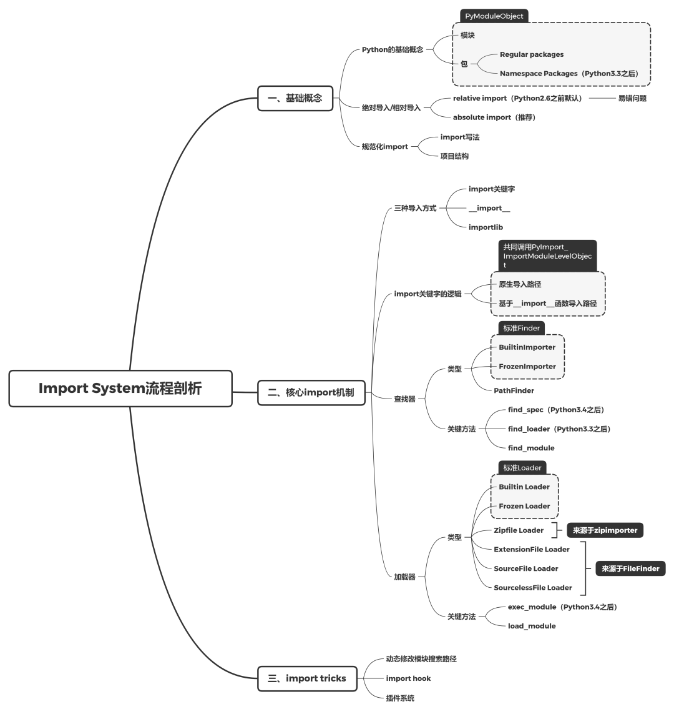
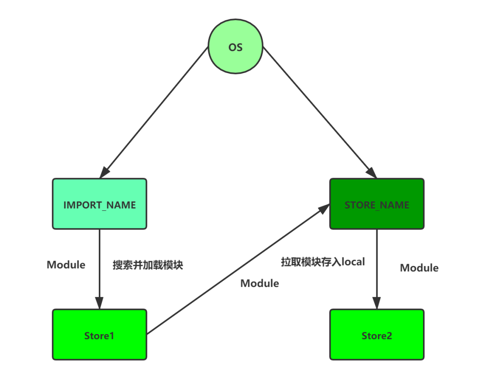
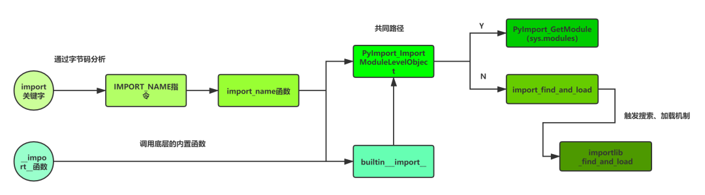
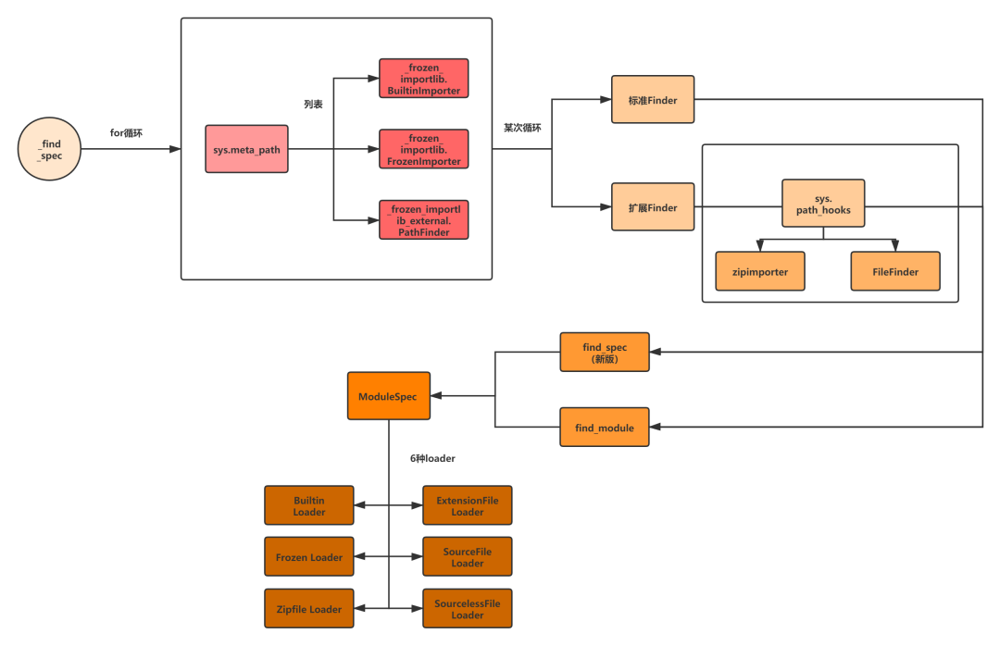

 
<!--BEGIN_DATA
{
    "create_date": "2021-01-08 23:30", 
    "modify_date": "2021-01-08 23:30", 
    "is_top": "0", 
    "summary": "Python Import System", 
    "tags": "Python", 
    "file_name": "Python Import System.md"
}
END_DATA-->

#### <p>原文出处：<a href='https://mp.weixin.qq.com/s/XDcVUG7yWEyomNzX-ZWiPA' target='blank'>Python Import System</a></p>

对于每一位Python开发者来说，`import`这个关键字是再熟悉不过了，无论是我们引用官方库还是三方库，都可以通过`import xxx`的形式来导入。可能很多人认为这只是Python的一个最基础的常识之一，似乎没有可以扩展的点了，的确，它是Python体系中的基础，但是往往“最基础的也最重要”，想象下当被面试官要求谈谈“Python Import System”的时候，你真的可以侃侃而谈聊上一个小时吗？

其实真的可以做到。不过既然要开始聊，那我们先得在缕清“Python Import System”的整体流程是什么样的



### 一、基础概念

### 1. 什么可以被import？-- Python中的基本概念

在介绍`Import System`之前，我们要了解的是在Python中什么可以被import。

这个问题好像不难回答，因为Python中一切都是对象，都是同属于object，也是任何东西都是可以被import的，在这些不同的对象中，我们经常使用到的也是最重要的要算是**模块（Module）** 和 **包（Package）** 这两个概念了，不过虽然表面上看去它们是两个概念，但是在Python的底层都是`PyModuleObject`结构体实例，类型为`PyModule_Type`，而在Python中则都是表现为一个`<class 'module'>`对象。

    
```cpp
// Objects/moduleobject.c  
    
PyTypeObject PyModule_Type = {  
    PyVarObject_HEAD_INIT(&PyType_Type, 0)  
    "module",                                   /* tp_name */  
    sizeof(PyModuleObject),                     /* tp_basicsize */  
    // ...  
};  
// Python中的<class 'module'>对应底层的PyModule_Type  
// 而导入进来的模块对象 则对应底层的 PyModuleObject  
```    

我们再来看看在Python中导入模块和包之后的表现

```python 
import os  
import pandas  
    
print(os)  ## <module 'os' from 'C:\\python38\\lib\\os.py'>  
print(pandas)  ## <module 'pandas' from 'C:\\python38\\lib\\site-packages\\pandas\\__init__.py'>  
    
print(type(os))  ## <class 'module'>  
print(type(pandas))  ## <class 'module'>  
```

从上面的结果可以看出来，不管是模块还是包，在Python中都是一样的，它们都是一个`PyModuleObject`，在Python的底层没有区分那么明显，不过在为了便于我们的开发，我们通常是这么来区分它们的：

#### 1.1 模块

Python中，不管是对常见的`*.py`文件，或是编译优化的`*.pyc`, `*.pyo`文件、扩展类型的`*.pyd`，`*.pyw`文件来说，它们是属于Python代码载体的最小单元，这样单独存在的文件我们都称之为“模块”。

#### 1.2 包

上述这样的多个模块组合在一起，我们就称之为“包”，而Python中，大家比较熟悉的包类型是包含`__init__.py`的包。通常来说，我们习惯创建包的步骤基本上都是新建目录A、新建`__init__.py`，再之后我们就可以愉快地导入包A了。然而，这也只是包的一种类型---“Regular packages”，事实上，在?PEP 420 -- Implicit Namespace Packages中提到，从Python3.3版本开始引入了“Namespace Packages”这个新的包类型，这种包类型和之前提到的普通包类型的区别如下：

  * 关键区别：不包含`__init__.py`，所以被会识别成Namespace Packages
  * 当然也不会有`__file__`属性，因为对于普通的packages来说`__file__`属性指定`__init__.py`的地址
  * `__path__`不是个List，而变成了是只读可迭代属性，当修改父路径(或者最高层级包的sys.path)的时候，属性会自动更新，会在该包内的下一次导入尝试时自动执行新的对包部分的搜索
  * `__loader__`属性中可以包含不同类型的对象，也就是可以通过不同类型的loader加载器来加载
  * 包中的子包可以来自不同目录、zip文件等所以可以通过Python `find_spec`搜索到的地方，同上，涉及到import的原理

额外讲讲关于“Namespace Packages”的好处，不是为了导入没有`__init__.py`的包，而是想要利用Python的`import`机制来维护一个虚拟空间，更好的组织不同目录下的子包以及对于子包的选择性使用，让它们能够统一的被大的命名空间所管理。

比如我们有这样的结构

```
└── project  
    ├── foo-package  
    │   └── spam  
    │       └── blah.py  
    └── bar-package  
        └── spam  
            └── grok.py  
``` 

在这2个目录里，都有着共同的命名空间spam。在任何一个目录里都没有`__init__.py`文件。

让我们看看，如果将foo-package和bar-package都加到python模块路径并尝试导入会发生什么

``` 
>>> import sys  
>>> sys.path.extend(['foo-package', 'bar-package'])  
>>> import spam.blah ## 正常导入  
>>> import spam.grok ## 同样也是正常导入  
>>>  
```

两个不同的包目录被合并到一起，你可以选择性的导入spam.blah和spam.grok或是其他无限扩展的包，它们已经形成了一个“Namespace Packages”，可以正常工作。

更多的概念可以去详细看下?PEP 420 -- Implicit Namespace Packages，探索更多的玩法。

### 2.  import的方式？-- 绝对导入/相对导入

了解完“什么可以被import”之后，接下来讲讲关于import的方式有哪些？关于**Python 2.X**与**Python 3.X**的导入机制有较大的差别，主要体现在两个时间节点上：

  * ?PEP 420 -- Implicit Namespace Packages -- Python 3.3之后引入的“Namespace Packages”
  * ?PEP 328 -- Imports: Multi-Line and Absolute/Relative--Absolute/Relative Package

对于第一点我们之前已经谈过了，现在重点谈谈第二点，有就是有关于绝对导入与相对导入的问题。

在**Python 2.6**之前，Python的默认import机制是“**relative import(相对导入)**”，而之后则改成了“**absolute import(绝对导入)**”，那这两个不同的导入机制该怎么理解呢？

首先无论是绝对导入还是相对导入，都需要一个参照物，不然“绝对”与“相对”的概念就无从谈起，绝对导入的参照物是项目的根文件夹，而相对导入的参照物为当前位置，下面我们通过一个例子来解释下这两个机制：

首先我们创建好这样的目录结构：

```
└── project  
    ├── package1  
    │   ├── module1.py  
    │   └── module2.py  
    │       └── Function Fx  
    └── package2  
        ├── __init__.py  
        │  └── Class Cx  
        ├── module3.py  
        ├── module4.py  
        └── subpackage1  
            └── module5.py  
                └── Function Fy  
```

#### 2.1 绝对导入

> 绝对路径要求我们必须从最顶层的文件夹开始，为每个包或每个模块提供出完整详细的导入路径

比如我们想要导入相关的类或者函数的话就要这样

```python 
from package1 import mudule1  
from package1.module2 import Fx  
from package2 import Cx  
from package2.subpackage1.module5 import Fy  
```

优势：

  1. 代码层次清晰：可以很清晰的了解每条导入数据的全路径，方便我们及时找到具体引入位置。
  2. 消除相对位置依赖的问题：可以很方便的执行单独的py文件，而不用考虑引用出错、相对位置依赖等等问题。

劣势：

  1. 顶层包名硬编码：这种方式对于重构代码来说将会变得很复杂，你需要检查所有文件来修复硬编码的路径（当然，使用IDE可以快速更改），另一方面如果你想移动代码或是他人需要使用你的代码也是很麻烦的事情（因为涉及从根目录开始写路径，当作为另一个项目的子模块时，又需要改变整个项目的包名结构）PS：当然可以通过打包解决。
  2. 导入包名过长：当项目层级过于庞大时，从根目录导入包会变得很复杂，不仅需要了解整个项目的逻辑、包结构，而且在包引用多的时候，频繁的写路径会变得让人很烦躁。

#### 2.2 相对导入

> 当我们使用相对导入时，需要给出相对与当前位置，想导入资源所在的位置。

相对导入分为“隐式相对导入”和“显式相对导入”两种，比如我们想在package2/module3.py中引用module4模块，我们可以这么写

```python 
## package2/module3.py  
    
import module4 ## 隐式相对导入  
from . import module4 ## 显式相对导入  
from package2 import module4 ## 绝对导入  
```

想在package2/module3.py中导入class Cx和function Fy，可以这么写

```python 
## package2/module3.py  
import Cx ## 隐式相对导入  
from . import Cx ## 显式相对导入  
from .subpackage1.module5 import Fy  
```

代码中`.`表示当前文件所在的目录，如果是`..`就表示该目录的上一层目录，三个`.`、四个`.`依次类推。可以看出，隐式相对导入相比于显式相对导入无非就是隐含了当前目录这个条件，不过这样会容易引起混乱，所以在?PEP 328的时候被正式淘汰，毕竟“**Explicit is better than implicit**”。

优势：

  1. 引用简洁：和绝对导入相比，引用时可以根据包的相对位置引入，不用了解整体的项目结构，更不用写冗长的绝对路径，比如我们可以把`from a.b.c.d.e.f.e import e1`变成`from . import e1`

劣势：

  1. 使用困扰：相比于绝对路径，相对路径由于需要更加明确相对位置，因此在使用过程中常会出现各种各样的问题，比如下面这些案例

假设我们把项目结构改成这样

```
└── project  
    ├── run.py  
    ├── package1  
    │   ├── module1.py  
    │   └── module2.py  
    │       └── Function Fx  
    └── package2  
        ├── __init__.py  
        │  └── Class Cx  
        ├── module3.py  
        ├── module4.py  
        └── subpackage1  
            └── module5.py  
                └── Function Fy  
```

##### 2.2.1 top-level package区分问题

对于执行入口run.py，我们这么引用

```python 
from package2 import module3  
from package2.subpackage1 import module5  
```    

对于module3.py、module5.py分别修改成这样

```python
## package2/module3  
    
from ..package1 import module2  
    
## package2/subpackage1/module5  
    
from .. import module3  
def Fy():  
    ...  
```

此时，执行python run.py会造成这样的错误

``` 
Traceback (most recent call last):  
    File "run.py", line 1, in <module>  
    from package2 import module3  
    File "G:\company_project\config\package2\module3.py", line 1, in <module>  
    from ..package1 import module2  
## 试图在顶级包（top-level package）之外进行相对导入  
ValueError: attempted relative import beyond top-level package  
```    

原因就在于当我们把run.py当成执行模块时，和该模块同级的package1和package2被视为**顶级包（top-level package）**，而我们跨顶级包来引用就会造成这样的错误。

##### 2.2.2 parent package异常问题

对于执行入口run.py的引用，我们修改成这样

```python
from .package1 import module2  
```    

此时，执行python run.py会造成这样的错误

``` 
Traceback (most recent call last):  
    File "run.py", line 1, in <module>  
    from .package1 import module2  
## 没有找到父级包  
ImportError: attempted relative import with no known parent package  
```

为什么会这样呢？根据?PEP 328的解释

> Relative imports use a module’s **name** attribute to determine that module’s position in the package hierarchy. If the module’s name does not contain any package information (e.g. it is set to **main** ) then relative imports are resolved as if the module were a top level module, regardless of where the module is actually located on the file system.
>
> 相对导入通过使用模块的__name__属性来确定模块在包层次结构中的位置。如果该模块的名称不包含任何包信息（例如，它被设置为__main__），那么相对引用会认为这个模块就是顶级模块，而不管模块在文件系统上的实际位置。

换句话说，相对导入寻找相对位置的算法是基于`__name__`和`__package__`变量的值。大部分时候，这些变量不包含任何包信息。比如：当`__name__=__main__,__package__=None`时，**Python解释器**不知道模块所属的包。在这种情况下，相对引用会认为这个模块就是顶级模块，而不管模块在文件系统上的实际位置。

我们看看run.py的__name__和__package__值

```python
print(__name__,__package__)  
## from .package1 import module2  
```

结果是

``` 
__main__ None  
```    

正如我们所看到的，**Python解释器**认为它就是顶级模块，没有关于模块所属的父级包的任何信息（`__name__=__main__,__package__=None`），因此它抛出了找不到父级包的异常。

### 3. 规范化import

对于团队开发来说，代码规范化是很重要的，因此在了解如何将包、模块import之后，关于import的种种规范的了解，也是必不可少的。

#### 3.1 import写法

关于import的写法的，参照官方代码规范文件?PEP 8的说明

>   * Imports should usually be on separate lines（不同包分行写）
>
>   * Imports are always put at the top of the file, just after any module comments and docstrings, and before module globals and constants（位置在文件的顶部，就在任何模块注释和文档字符串之后，模块全局变量和常量之前）
>
>   * Absolute imports are recommended, as they are usually more readable and tend to be better behaved (or at least give better error messages) if the import system is incorrectly configured (such as when a directory inside a package ends up on sys.path)（推荐绝对导入，涉及到项目结构，后面会提到）
>
>   * Wildcard imports (fromimport *) should be avoided, as they make it unclear which names are present in the namespace, confusing both readers and many automated tools（尽量使用通配符导入）
>
>   * Imports are always put at the top of the file, just after any module comments and docstrings, and before module globals and constants.
>
> Imports should be grouped in the following order:
>
>   1. Standard library imports.
>   2. Related third party imports.
>   3. Local application/library specific imports.
>
> You should put a blank line between each group of imports. （不同类别的包导入顺序、以及间隔为一行）

以及?PEP 328的

> Rationale for Parentheses
>
>   * Instead, it should be possible to use Python's standard grouping mechanism (parentheses) to write the import statement:

根据上面的规范，我们照样举个案例

```python
## 多行拆分  
## 建议  
import os  
import sys  
## 同包允许不分  
from subprocess import Popen, PIPE   
## 不建议  
import os,sys  
    
## 文件顶部  
## 注释....  
import os  
a = 1  
    
## 导入你需要的，不要污染local空间  
## 建议  
from sys import copyright  
## 不建议  
from sys import *  
    
## 包导入顺序  
import sys ## 系统库  
    
import flask ## 三方库  
    
import my ## 自定义库  
    
## 利用好python的标准括号分组  
## 建议  
from sys import (copyright, path, modules)  
## 不建议  
from sys import copyright, path, \   
        modules  
``` 

虽然这些不是强求的规范写法，但是对于工程师来说，代码规范化总是会让人感觉“特别优秀”。

#### 3.2 项目结构

上面分析了两种不同导入方式的优缺点，那么如何在实际项目中去更好的统一我们项目的import的结构呢？当然，虽然官方推荐的导入方式是绝对导入，但是我们也是要用批判的眼光去看待。推荐大家去看一些优秀开源库的代码，比如`torando`以及`fastapi`

```python
## fastapi\applications.py  
    
from fastapi import routing  
from fastapi.concurrency import AsyncExitStack  
from fastapi.encoders import DictIntStrAny, SetIntStr  
from fastapi.exception_handlers import (  
    http_exception_handler,  
    request_validation_exception_handler,  
)  
from fastapi.exceptions import RequestValidationError  
from fastapi.logger import logger  
from fastapi.openapi.docs import (  
    get_redoc_html,  
    get_swagger_ui_html,  
    get_swagger_ui_oauth2_redirect_html,  
)  
    
## tornado\gen.py  
    
from tornado.concurrent import (  
    Future,  
    is_future,  
    chain_future,  
    future_set_exc_info,  
    future_add_done_callback,  
    future_set_result_unless_cancelled,  
)  
from tornado.ioloop import IOLoop  
from tornado.log import app_log  
from tornado.util import TimeoutError  
```

可以看到，目前很多的开源库都是将自己的导入方式往绝对导入的方向转变，也因为他们的单个库的层次结构不深，因此并没有受到复杂层次嵌套的影响，也有人会问，那对于特别庞大的大型项目来说，如何解决多层嵌套的问题？这个问题就需要结合具体的项目来分析，是拆分大型项目成一个个小型子项目还是采用“**绝对导入+相对导入**”互相结合的方式都是需要结合实际的场景去考虑的，对于小型项目来说，类似上述两个开源项目这样，“**绝对导入+打包**”的方式既利于源码阅读有便于项目使用、移植，是最推荐的方案。

### 二、核心import机制

第一部分提到的都是些基础概念性的内容，大部分也或多或少会在日常开发中接触到，但是其实类似于“**import如何找到包？**”、“**import如何加载到包？**”、“**import底层的处理流程是什么？**”等等这些问题对于很多开发者是很少去接触的，我们没有理解Import System的核心处理逻辑，是很难更好的使用它的，也就是进行修改和二次开发，另一方面，对于我们后续的大型系统架构的设计也是有一定影响，因此，这个部分我们一起来梳理下整个Import System中的核心import机制。

下面的内容我们着重从源码入手来聊聊Import System中核心的import机制

### 1. import关键字做了什么工作？-- 理清import关键字的逻辑

对于一般的开发者来说，最熟悉的就是`import`关键字了，那我们就从这个关键字入手，第一步关于import的理解我们从官方文档入手，也就是这篇Python参考手册第五章的?《The import system》，文档的最开始就强调了

> Python code in one module gains access to the code in another module by the process of importing it. The import statement is the most common way of
invoking the import machinery, but it is not the only way. Functions such as importlib.import_module() and built-in **import**() can also be used to invoke the import machinery.
>
> The import statement combines two operations; it searches for the named module, then it binds the results of that search to a name in the local scope. The search operation of the import statement is defined as a call to the **import**() function, with the appropriate arguments. The return value of **import**() is used to perform the name binding operation of the import statement. See the import statement for the exact details of that name binding operation.
>
> A direct call to **import**() performs only the module search and, if found, the module creation operation. While certain side-effects may occur, such as the importing of parent packages, and the updating of various caches (including sys.modules), only the import statement performs a name binding operation.
>
> When an import statement is executed, the standard builtin **import**() function is called. Other mechanisms for invoking the import system (such as importlib.import_module()) may choose to bypass **import**() and use their own solutions to implement import semantics.

我们能从这个介绍中得到这几个信息：

首先，这段话先告诉了我们可以通过三种方式来导入模块，并且使用这三种方式的作用是相同的

```python    
## import 关键字方式  
import os  
print(os) ## <module 'os' from 'C:\\python38\\lib\\os.py'>  
    
## import_module 标准库方式  
from importlib import import_module  
os = import_module("os")  
print(os) ## <module 'os' from 'C:\\python38\\lib\\os.py'>  
    
## __import__ 内置函数方式  
os = __import__("os")  
print(os) ## <module 'os' from 'C:\\python38\\lib\\os.py'>  
```

接着是调用关键字`import`的时候主要会触发两个操作：**搜索**和**加载**（也可以理解为搜索模块在哪里和把找到的模块加载到某个地方），其中搜索操作会调用`__import__`函数得到具体的值再由加载操作绑定到当前作用域，也就是说**import关键字底层调用了__import__内置函数**。另外需要注意的是，`__import__`虽然只作用在模块搜索阶段，但是会有额外的副作用，另一方面，`__import__`虽然是底层的导入机制，但是`impor t_module`可能是使用的自己的一套导入机制。

从介绍中我们大概能理解关键字`import`的某些信息，不过具体的还是要深入源码来看，首先我们先看关键字`import`的源码逻辑，以一个最简单的方式来看import的底层调用，首先创建一个文件，为了不受其他因素影响，只有一行简单的代码

```python
## test.py  
    
import os  
```

由于import是Python关键字，也就没办法通过IDE来查看它的源码，那就换个思路，直接查看它的字节码，Python中查看字节码的方式是通过dis模块来实现的，可以直接通过`-m dis`或是`import dis`来操作字节码，为了保证字节码的整洁，我们这么操作

```
python -m dis test.py  
```    

得到如下的结果

``` 
1           0 LOAD_CONST               0 (0)  
            2 LOAD_CONST               1 (None)  
            4 IMPORT_NAME              0 (os)  
            6 STORE_NAME               0 (os)  
            8 LOAD_CONST               1 (None)  
            10 RETURN_VALUE  
```

可以发现，`import os`代码对应的字节码真的是很简短，我们先不管开头的两个`LOAD_CONST`压栈指令（不知道具体作用，空的文件也会出现），往下会发现`IMPORT_NAME`、`STORE_NAME`这两个指令，它们都是以os为参数调用，猜测应该是`IMPORT_NAME`指令是把os这个module导入进来，再调用`STORE_NAME`指令把这个导入的module保存在当前作用域的local空间内，等待我们调用os的方法时，就可以根据os字符找到对应的module了，这个是**Python解析器**执行import字节码的处理流程



我们的重点还是放在`IMPORT_NAME`这个指令上，我们去看看它的具体实现，Python的指令集都是集中在`ceval.c`中实现的，所以我们就跟踪进去寻找`IMPORT_NAME`指令。

> PS：关于怎么查看C代码的话，相信各位大佬都有自己的方法，我这里就使用Understand和大家一起看看，工具新手，没用上高级功能，大家见笑。

`ceval.c`中有一个关于指令选择的很庞大的switch case，而`IMPORT_NAME`指令的case如下：

```cpp
// ceval.c  
    
case TARGET(IMPORT_NAME): {  
            // 获取模块名  
            PyObject *name = GETITEM(names, oparg);  
            // 猜测对应的是之前的LOAD_CONST压栈指令，这里把值取出，也就是之前的0和None，分别赋予给了level和fromlist  
        // 这两个值待解释  
            PyObject *fromlist = POP();  
            PyObject *level = TOP();  
        // 初始化模块对象PyModuleObject *  
            PyObject *res;  
            // import重点方法，调用import_name，将返回值返回给res  
            res = import_name(tstate, f, name, fromlist, level);  
            Py_DECREF(level);  
            Py_DECREF(fromlist);  
            // 将模块值压栈  
            SET_TOP(res);  
            if (res == NULL)  
                goto error;  
            DISPATCH();  
        }  
```

重点还是关注`import_name`这个函数，它的参数`tstate, f, name, fromlist, level`先记住，继续往下看

```cpp 
// ceval.c  
// 调用  
res = import_name(tstate, f, name, fromlist, level);  
    
import_name(PyThreadState *tstate, PyFrameObject *f,  
            PyObject *name, PyObject *fromlist, PyObject *level)  
{  
    _Py_IDENTIFIER(__import__);  
    PyObject *import_func, *res;  
    PyObject* stack[5];  
    // 获取__import__函数，可以看到确实如官方所说  
    // import的底层调用了__import__这个内置函数  
    import_func = _PyDict_GetItemIdWithError(f->f_builtins, &PyId___import__);  
    // 为NULL表示获取失败, 在Python解释器中会产生__import__ not found错误  
    // 之后再通过某种机制得到类似模块未找到的错误  
    if (import_func == NULL) {  
        if (!_PyErr_Occurred(tstate)) {  
            _PyErr_SetString(tstate, PyExc_ImportError, "__import__ not found");  
        }  
        return NULL;  
    }  
    
    /* Fast path for not overloaded __import__. */  
    // 判断__import__是否被重载了，tstate来自参数  
    if (import_func == tstate->interp->import_func) {  
        // import自己的原生路径，当__import__还未被重载的时候使用  
        int ilevel = _PyLong_AsInt(level);  
        if (ilevel == -1 && _PyErr_Occurred(tstate)) {  
            return NULL;  
        }  
        //未重载的话，调用PyImport_ImportModuleLevelObject  
        res = PyImport_ImportModuleLevelObject(  
                        name,  
                        f->f_globals,  
                        f->f_locals == NULL ? Py_None : f->f_locals,  
                        fromlist,  
                        ilevel);  
        return res;  
    }  
    
    Py_INCREF(import_func);  
    // __import__的路径，构造栈   
    stack[0] = name;  
    stack[1] = f->f_globals;  
    stack[2] = f->f_locals == NULL ? Py_None : f->f_locals;  
    stack[3] = fromlist;  
    stack[4] = level;  
    // 调用__import__  
    res = _PyObject_FastCall(import_func, stack, 5);  
    Py_DECREF(import_func);  
    return res;  
}  
```  

根据代码所示，`import_name`其实是有两种路径的，也就是并不是import关键字底层并不是完全调用`__import__`函数的

  * import关键字原生导入路径
  * `__import__`内置函数导入路径

这里注意下关于`__import__`函数的调用，传入了刚才我们没有解释的参数`fromlist`和`level`，我们可以通过查看`__import__`函数源码来分析这两个参数

```python
def __import__(name, globals=None, locals=None, fromlist=(), level=0):   
    """  
    __import__(name, globals=None, locals=None, fromlist=(), level=0) -> module  
        
    Import a module. Because this function is meant for use by the Python  
    interpreter and not for general use, it is better to use  
    importlib.import_module() to programmatically import a module.  
        
    The globals argument is only used to determine the context;  
    they are not modified.  The locals argument is unused.  The fromlist  
    should be a list of names to emulate ``from name import ...'', or an  
    empty list to emulate ``import name''.  
    When importing a module from a package, note that __import__('A.B', ...)  
    returns package A when fromlist is empty, but its submodule B when  
    fromlist is not empty.  The level argument is used to determine whether to  
    perform absolute or relative imports: 0 is absolute, while a positive number  
    is the number of parent directories to search relative to the current module.  
    """  
    pass  
```

解释中表达了对于`fromlist`参数来说，为空则导入顶层的模块，不为空则可以导入下层的值，例如

```python 
m1 = __import__("os.path")  
print(m1)  ## <module 'os' from 'C:\\python38\\lib\\os.py'>  
    
m2 = __import__("os.path", fromlist=[""])  
print(m2)  ## <module 'ntpath' from 'C:\\python38\\lib\\ntpath.py'>  
```

而另一个参数`level`的含义是如果是0，那么表示仅执行绝对导入，如果是一个正整数，表示要搜索的父目录的数量。一般这个值也不需要传递。

解释完这两个参数之后，我们接着往下分析，首先分析import关键字原生导入路径

#### 1.1 import关键字原生导入路径

先来关注下import原生的路径，重点在`PyImport_ImportModuleLevelObject`上

```cpp 
// Python/import.c  
// 调用  
res = PyImport_ImportModuleLevelObject(  
                        name,  
                        f->f_globals,  
                        f->f_locals == NULL ? Py_None : f->f_locals,  
                        fromlist,  
                        ilevel)  
    
PyObject *  
PyImport_ImportModuleLevelObject(PyObject *name, PyObject *globals,  
                                    PyObject *locals, PyObject *fromlist,  
                                    int level)  
{  
    _Py_IDENTIFIER(_handle_fromlist);  
    PyObject *abs_name = NULL;  
    PyObject *final_mod = NULL;  
    PyObject *mod = NULL;  
    PyObject *package = NULL;  
    PyInterpreterState *interp = _PyInterpreterState_GET_UNSAFE();  
    int has_from;  
    
    // 非空检查  
    if (name == NULL) {  
        PyErr_SetString(PyExc_ValueError, "Empty module name");  
        goto error;  
    }  
    
    // 类型检查，是否符合PyUnicodeObject  
    if (!PyUnicode_Check(name)) {  
        PyErr_SetString(PyExc_TypeError, "module name must be a string");  
        goto error;  
    }  
        
    // level不可以小于0  
    if (level < 0) {  
        PyErr_SetString(PyExc_ValueError, "level must be >= 0");  
        goto error;  
    }  
    
    // level大于0  
    if (level > 0) {  
        // 找绝对路径  
        abs_name = resolve_name(name, globals, level);  
        if (abs_name == NULL)  
            goto error;  
    }  
    else {    
        // 表明level==0  
        if (PyUnicode_GET_LENGTH(name) == 0) {  
            PyErr_SetString(PyExc_ValueError, "Empty module name");  
            goto error;  
        }  
        // 此时直接将name赋值给abs_name，因为此时是绝对导入  
        abs_name = name;  
        Py_INCREF(abs_name);  
    }  
    
    // 调用PyImport_GetModule获取module对象  
    // 这个module对象会先判断是否存在在sys.modules里面  
    // 如果没有，那么才从硬盘上加载。加载之后在保存在sys.modules  
    // 在下一次导入的时候，直接从sys.modules中获取，具体细节后面聊  
    mod = PyImport_GetModule(abs_name);  
    //...  
    if (mod == NULL && PyErr_Occurred()) {  
        goto error;  
    }  
    //...  
    if (mod != NULL && mod != Py_None) {  
        _Py_IDENTIFIER(__spec__);  
        _Py_IDENTIFIER(_lock_unlock_module);  
        PyObject *spec;  
    
        /* Optimization: only call _bootstrap._lock_unlock_module() if  
            __spec__._initializing is true.  
            NOTE: because of this, initializing must be set *before*  
            stuffing the new module in sys.modules.  
            */  
        spec = _PyObject_GetAttrId(mod, &PyId___spec__);  
        if (_PyModuleSpec_IsInitializing(spec)) {  
            PyObject *value = _PyObject_CallMethodIdObjArgs(interp->importlib,  
                                            &PyId__lock_unlock_module, abs_name,  
                                            NULL);  
            if (value == NULL) {  
                Py_DECREF(spec);  
                goto error;  
            }  
            Py_DECREF(value);  
        }  
        Py_XDECREF(spec);  
    }  
    else {  
        Py_XDECREF(mod);  
        // 关键部分代码  
        mod = import_find_and_load(abs_name);  
        if (mod == NULL) {  
            goto error;  
        }  
    }  
    //...      
    else {  
        // 调用importlib包中的私有_handle_fromlist函数来获取模块  
        final_mod = _PyObject_CallMethodIdObjArgs(interp->importlib,  
                                                    &PyId__handle_fromlist, mod,  
                                                    fromlist, interp->import_func,  
                                                    NULL);  
    }  
    
    error:  
    Py_XDECREF(abs_name);  
    Py_XDECREF(mod);  
    Py_XDECREF(package);  
    if (final_mod == NULL)  
        remove_importlib_frames();  
    return final_mod;      
}  
```  

`PyImport_ImportModuleLevelObject`的代码中很多部分都有调用`importlib`包的痕迹，看来`importlib`在这个`import`体系中占了很多比重，重点看一下`import_find_and_load`函数

```cpp
// Python/import.c  
    
static PyObject *  
import_find_and_load(PyObject *abs_name)  
{  
    _Py_IDENTIFIER(_find_and_load);  
    PyObject *mod = NULL;  
    PyInterpreterState *interp = _PyInterpreterState_GET_UNSAFE();  
    int import_time = interp->config.import_time;  
    static int import_level;  
    static _PyTime_t accumulated;  
    
    _PyTime_t t1 = 0, accumulated_copy = accumulated;  
    
    PyObject *sys_path = PySys_GetObject("path");  
    PyObject *sys_meta_path = PySys_GetObject("meta_path");  
    PyObject *sys_path_hooks = PySys_GetObject("path_hooks");  
    if (PySys_Audit("import", "OOOOO",  
                    abs_name, Py_None, sys_path ? sys_path : Py_None,  
                    sys_meta_path ? sys_meta_path : Py_None,  
                    sys_path_hooks ? sys_path_hooks : Py_None) < 0) {  
        return NULL;  
    }  
    
    
    /* XOptions is initialized after first some imports.  
        * So we can't have negative cache before completed initialization.  
        * Anyway, importlib._find_and_load is much slower than  
        * _PyDict_GetItemIdWithError().  
        */  
    if (import_time) {  
        static int header = 1;  
        if (header) {  
            fputs("import time: self [us] | cumulative | imported package\n",  
                    stderr);  
            header = 0;  
        }  
    
        import_level++;  
        t1 = _PyTime_GetPerfCounter();  
        accumulated = 0;  
    }  
    
    if (PyDTrace_IMPORT_FIND_LOAD_START_ENABLED())  
        PyDTrace_IMPORT_FIND_LOAD_START(PyUnicode_AsUTF8(abs_name));  
    // 调用了importlib的私有函数_find_and_load  
    mod = _PyObject_CallMethodIdObjArgs(interp->importlib,  
                                        &PyId__find_and_load, abs_name,  
                                        interp->import_func, NULL);  
    
    //...      
    
    return mod;  
}  
```  

可以看到，导入的逻辑最后竟然回到了`importlib`包中，既然已经回到了Python代码，那我们先对于C代码的部分总结下，不过我们似乎还有另一个路径没看呢？

#### 1.2 `__import__`内置函数导入路径

还记得一开始`import_name`的另一条路径吗？既然原生路径现在回到了Python部分，那么另一条`__import__`也是可能和会原生路径在某个节点汇合，再共同调用Python代码部分，我们来看看关于`__import__`函数的源码，由于`__import__`是内置函数，代码在`Python\bltinmodule.c`当中

```cpp
// Python\bltinmodule.c  
    
static PyObject *  
builtin___import__(PyObject *self, PyObject *args, PyObject *kwds)  
{  
    static char *kwlist[] = {"name", "globals", "locals", "fromlist",  
                                "level", 0};  
    PyObject *name, *globals = NULL, *locals = NULL, *fromlist = NULL;  
    int level = 0;  
    
    if (!PyArg_ParseTupleAndKeywords(args, kwds, "U|OOOi:__import__",  
                    kwlist, &name, &globals, &locals, &fromlist, &level))  
        return NULL;  
    return PyImport_ImportModuleLevelObject(name, globals, locals,  
                                            fromlist, level);  
}  
```  

很明显，共同调用了`PyImport_ImportModuleLevelObject`函数，那我们可以理解为当`__import__`函数被重载时，原生路径就直接走`PyImport_ImportModuleLevelObject`函数流程了。先来总结到目前为止C代码的调用流程



之前我们一直在看**CPython源码**，现在要把目光转化Python了，刚刚提到了当在`sys.module`中未发现缓存模块时，就需要调用`importlib`包的`_find_and_load`的方法，从字面含义上猜测是关于模块搜索和导入的，回想之前在`import`的解释中也提到了它主要分为了**搜索**和**加载**两个过程， 那么`_find_and_load`应该就是要开始分析这两个过程了，而这两个过程分别对应的概念是`Finder（查找器）`和`Loader（加载器）`，详细的概念我们在源码中再来解释，先来看源码

```python
## importlib/_bootstrap.py  
    
_NEEDS_LOADING = object()  
def _find_and_load(name, import_):  
    """Find and load the module."""  
    ## 加了多线程锁的管理器  
    with _ModuleLockManager(name):  
        ## 又在sys.modules中寻找了一遍，没有模块就调用_find_and_load_unlocked函数  
        module = sys.modules.get(name, _NEEDS_LOADING)  
        if module is _NEEDS_LOADING:  
            ## name是绝对路径名称  
            return _find_and_load_unlocked(name, import_)  
    
    if module is None:  
        message = ('import of {} halted; '  
                    'None in sys.modules'.format(name))  
        raise ModuleNotFoundError(message, name=name)  
    _lock_unlock_module(name)  
    return module  
    
def _find_and_load_unlocked(name, import_):  
    path = None  
    ## 拆解绝对路径  
    parent = name.rpartition('.')[0]  
    if parent:  
        if parent not in sys.modules:  
            _call_with_frames_removed(import_, parent)  
        ## Crazy side-effects!  
        ## 再次寻找  
        if name in sys.modules:  
            return sys.modules[name]  
        parent_module = sys.modules[parent]  
        try:  
            ## 拿父类模块的__path__属性  
            path = parent_module.__path__  
        except AttributeError:  
            msg = (_ERR_MSG + '; {!r} is not a package').format(name, parent)  
            raise ModuleNotFoundError(msg, name=name) from None  
    ## 这里体现出搜索的操作了  
    spec = _find_spec(name, path)  
    if spec is None:  
        raise ModuleNotFoundError(_ERR_MSG.format(name), name=name)  
    else:  
        ## 这里体现出加载的操作了  
        module = _load_unlocked(spec)  
    if parent:  
        ## Set the module as an attribute on its parent.  
        parent_module = sys.modules[parent]  
        setattr(parent_module, name.rpartition('.')[2], module)  
    return module  
```

从上面的代码可以看出基本的操作流程，多次判断了模块是否存在在`sys.modules`当中，所以说这个是第一搜索目标，如果是有父类的话，path属性为父类的`__path__`属性，也就是模块的路径，没有的话为None（后续应该会有默认值），最后在模块搜索方面的主要方法是`_find_spec`，在模块加载方面的主要方法是`_load_unlocked`，到目前为止，我们的准备阶段已经完成，下面正式进入**搜索**、**加载**这两个阶段了。

### 2. Module是如何被发现的？-- 深入查找器Finder

关于查找器的线索我们要从`_find_spec`这个函数入手

```python
## importlib/_bootstrap.py  
    
def _find_spec(name, path, target=None):  
    """Find a module's spec."""  
    ## 获取meta_path  
    meta_path = sys.meta_path  
    if meta_path is None:  
        ## PyImport_Cleanup() is running or has been called.  
        raise ImportError("sys.meta_path is None, Python is likely "  
                            "shutting down")  
    
    if not meta_path:  
        _warnings.warn('sys.meta_path is empty', ImportWarning)  
    
    ## We check sys.modules here for the reload case.  While a passed-in  
    ## target will usually indicate a reload there is no guarantee, whereas  
    ## sys.modules provides one.  
    ## 如果模块存在在sys.modules中，则判定为需要重载  
    is_reload = name in sys.modules  
    ## 遍历meta_path中的各个finder  
    for finder in meta_path:  
        with _ImportLockContext():  
            try:  
                ## 调用find_spec函数  
                find_spec = finder.find_spec  
            except AttributeError:  
                ## 如果沒有find_spec屬性，则调用_find_spec_legacy  
                spec = _find_spec_legacy(finder, name, path)  
                if spec is None:  
                    continue  
            else:  
                ## 利用find_spec函数找到spec  
                spec = find_spec(name, path, target)  
        if spec is not None:  
            ## The parent import may have already imported this module.  
            if not is_reload and name in sys.modules:  
                module = sys.modules[name]  
                try:  
                    __spec__ = module.__spec__  
                except AttributeError:  
                    ## We use the found spec since that is the one that  
                    ## we would have used if the parent module hadn't  
                    ## beaten us to the punch.  
                    return spec  
                else:  
                    if __spec__ is None:  
                        return spec  
                    else:  
                        return __spec__  
            else:  
                return spec  
    else:  
        return None  
```

代码中提到了一个概念--`sys.meta_path`，系统的元路径，具体打印出看下它是什么

``` 
>>> import sys  
>>> sys.meta_path  
[  
    <class '_frozen_importlib.BuiltinImporter'>,   
    <class '_frozen_importlib.FrozenImporter'>,   
    <class '_frozen_importlib_external.PathFinder'>  
]  
```    

结果可以看出，它是一个查找器Finder的列表，而`_find_spec`的过程是针对每个Finder调用其`find_spec`函数，那我们就随意挑选个类看看他们的`find_spec`函数是什么，就比如第一个类`<class '_frozen_importlib.BuiltinImporter'>`

#### 2.1 标准的Finder

```python
## importlib/_bootstrap.py  
    
class BuiltinImporter:  
    
    """Meta path import for built-in modules.  
    
    All methods are either class or static methods to avoid the need to  
    instantiate the class.  
    
    """  
    @classmethod  
    def find_spec(cls, fullname, path=None, target=None):  
        if path is not None:  
            return None  
        ## 判断是否是内置模块  
        if _imp.is_builtin(fullname):  
            ## 调用spec_from_loader函数，由参数可知，loader为自身，也就是表明BuiltinImporter这个类不仅是个查找器也是一个加载器  
            return spec_from_loader(fullname, cls, origin='built-in')  
        else:  
            return None  
    
def spec_from_loader(name, loader, *, origin=None, is_package=None):  
    """Return a module spec based on various loader methods."""  
    ## 根据不同loader的方法返回ModuleSpec对象  
    if hasattr(loader, 'get_filename'):  
        if _bootstrap_external is None:  
            raise NotImplementedError  
        spec_from_file_location = _bootstrap_external.spec_from_file_location  
    
        if is_package is None:  
            return spec_from_file_location(name, loader=loader)  
        search = [] if is_package else None  
        return spec_from_file_location(name, loader=loader,  
                                        submodule_search_locations=search)  
    
    if is_package is None:  
        if hasattr(loader, 'is_package'):  
            try:  
                is_package = loader.is_package(name)  
            except ImportError:  
                is_package = None  ## aka, undefined  
        else:  
            ## the default  
            is_package = False  
    ## 最后返回ModuleSpec对象  
    return ModuleSpec(name, loader, origin=origin, is_package=is_package)  
```

`<class '_frozen_importlib.BuiltinImporter'>`的`find_spec`方法最终返回的是`ModuleSpec`对象，而另一个类`<class '_frozen_importlib.FrozenImporter'>`也是一样，只不过是他们对于模块的判断方式有所不同：`_imp.is_builtin(fullname)`和`_imp.is_frozen(fullname)`

额外说一个知识点：关于`is_frozen`的实现在`Python/import.c`文件中

```cpp
// Python/import.c  
    
/*[clinic input]  
// 转化成python的形式就是_imp.is_frozen函数  
_imp.is_frozen  
    
    name: unicode  
    /  
    
Returns True if the module name corresponds to a frozen module.  
[clinic start generated code]*/  
    
// 底层函数实现  
static PyObject *  
_imp_is_frozen_impl(PyObject *module, PyObject *name)  
/*[clinic end generated code: output=01f408f5ec0f2577 input=7301dbca1897d66b]*/  
{  
    const struct _frozen *p;  
    
    p = find_frozen(name);  
    return PyBool_FromLong((long) (p == NULL ? 0 : p->size));  
}  
    
/* Frozen modules */  
    
static const struct _frozen *  
find_frozen(PyObject *name)  
{  
    const struct _frozen *p;  
    
    if (name == NULL)  
        return NULL;  
    // 循环比较内置的frozen module  
    for (p = PyImport_FrozenModules; ; p++) {  
        if (p->name == NULL)  
            return NULL;  
        if (_PyUnicode_EqualToASCIIString(name, p->name))  
            break;  
    }  
    return p;，  
}  
```

那frozen module指的是什么呢？具体的内容可以在?Python Wiki[Freeze]部分了解，简而言之，它创建了一个python脚本的可移植版本，它带有自己的内置解释器(基本上像一个二进制可执行文件)，这样你就可以在没有python的机器上运行它。

从代码中还可以发现的变化是有个关于`find_spec`方法的错误捕获，然后调用了`_find_spec_legacy`方法，接着调用`find_module`

```python
## _bootstrap.py  
    
try:  
    ## 调用find_spec函数  
    find_spec = finder.find_spec  
except AttributeError:  
    ## 如果沒有find_spec屬性，则调用_find_spec_legacy  
    spec = _find_spec_legacy(finder, name, path)  
    if spec is None:  
        continue  
else:  
    ## 利用find_spec函数找到spec  
    spec = find_spec(name, path, target)  
    
def _find_spec_legacy(finder, name, path):  
    ## This would be a good place for a DeprecationWarning if  
    ## we ended up going that route.  
    loader = finder.find_module(name, path)  
    if loader is None:  
        return None  
    return spec_from_loader(name, loader)  
```

那`find_spec`和`find_module`的关系是？

在?PEP 451 -- A ModuleSpec Type for the Import System中就已经提供Python 3.4版本之后会以`find_spec`来替代`find_module`，当然，为了向后兼容，所以就出现了我们上面显示的错误捕获。

```
Finders are still responsible for identifying, and typically creating, the loader that should be used to load a module. That loader will now be stored in the module spec returned by find_spec() rather than returned directly. As is currently the case without the PEP, if a loader would be costly to create, that loader can be designed to defer the cost until later.  
    
MetaPathFinder.find_spec(name, path=None, target=None)  
    
PathEntryFinder.find_spec(name, target=None)  
    
Finders must return ModuleSpec objects when find_spec() is called. This new method replaces find_module() and find_loader() (in the PathEntryFinder case). If a loader does not have find_spec(), find_module() and find_loader() are used instead, for backward-compatibility.  
    
Adding yet another similar method to loaders is a case of practicality. find_module() could be changed to return specs instead of loaders. This is tempting because the import APIs have suffered enough, especially considering PathEntryFinder.find_loader() was just added in Python 3.3. However, the extra complexity and a less-than- explicit method name aren't worth it.  
```    

#### 2.2 扩展的Finder

除了两个标准的Finder外，我们还需要注意到的是第三个扩展的`<class '_frozen_importlib_external.PathFinder'>`类

```python
## importlib/_bootstrap_external.py  
    
class PathFinder:  
    
    """Meta path finder for sys.path and package __path__ attributes."""  
    ## 为sys.path和包的__path__属性服务的元路径查找器  
    @classmethod  
    def _path_hooks(cls, path):  
        """Search sys.path_hooks for a finder for 'path'."""  
        if sys.path_hooks is not None and not sys.path_hooks:  
            _warnings.warn('sys.path_hooks is empty', ImportWarning)  
        ## 从sys.path_hooks列表中搜索钩子函数调用路径  
        for hook in sys.path_hooks:  
            try:  
                return hook(path)  
            except ImportError:  
                continue  
        else:  
            return None  
    
    @classmethod  
    def _path_importer_cache(cls, path):  
        """Get the finder for the path entry from sys.path_importer_cache.  
    
        If the path entry is not in the cache, find the appropriate finder  
        and cache it. If no finder is available, store None.  
    
        """  
        if path == '':  
            try:  
                path = _os.getcwd()  
            except FileNotFoundError:  
                ## Don't cache the failure as the cwd can easily change to  
                ## a valid directory later on.  
                return None  
        ## 映射到PathFinder的find_spec方法注释，从以下这两个路径中搜索分别是sys.path_hooks和sys.path_importer_cache  
        ## 又出现了sys.path_hooks的新概念  
        ## sys.path_importer_cache是一个finder的缓存，重点看下_path_hooks方法  
        try:  
            finder = sys.path_importer_cache[path]  
        except KeyError:  
            finder = cls._path_hooks(path)  
            sys.path_importer_cache[path] = finder  
        return finder  
    
    @classmethod  
    def _get_spec(cls, fullname, path, target=None):  
        """Find the loader or namespace_path for this module/package name."""  
        ## If this ends up being a namespace package, namespace_path is  
        ##  the list of paths that will become its __path__  
        namespace_path = []  
        ## 对path列表中的每个path查找，要不是sys.path要不就是包的__path__  
        for entry in path:  
            if not isinstance(entry, (str, bytes)):  
                continue  
            ## 再次需要获取finder  
            finder = cls._path_importer_cache(entry)  
            if finder is not None:  
                ## 找到finder之后就和之前的流程一样  
                if hasattr(finder, 'find_spec'):  
                    ## 如果查找器具备find_spec的方法，则和之前说的默认的finder一样，调用其find_spec的方法  
                    spec = finder.find_spec(fullname, target)  
                else:  
                    spec = cls._legacy_get_spec(fullname, finder)  
                if spec is None:  
                    continue  
                if spec.loader is not None:  
                    return spec  
                portions = spec.submodule_search_locations  
                if portions is None:  
                    raise ImportError('spec missing loader')  
                ## This is possibly part of a namespace package.  
                ##  Remember these path entries (if any) for when we  
                ##  create a namespace package, and continue iterating  
                ##  on path.  
                namespace_path.extend(portions)  
        else:  
            ## 没有找到则返回带有namespace路径的spec对象，也就是创建一个空间命名包的ModuleSpec对象  
            spec = _bootstrap.ModuleSpec(fullname, None)  
            spec.submodule_search_locations = namespace_path  
            return spec  
    
    @classmethod  
    def find_spec(cls, fullname, path=None, target=None):  
        """Try to find a spec for 'fullname' on sys.path or 'path'.  
        搜索是基于sys.path_hooks和sys.path_importer_cache的  
        The search is based on sys.path_hooks and sys.path_importer_cache.  
        """  
        ## 如果没有path就默认使用sys.path  
        if path is None:  
            path = sys.path  
        ## 调用内部私有函数_get_spec获取spec  
        spec = cls._get_spec(fullname, path, target)  
        if spec is None:  
            return None  
        elif spec.loader is None:  
            ##  如果没有loader，则利用命令空间包的查找方式  
            namespace_path = spec.submodule_search_locations  
            if namespace_path:  
                ## We found at least one namespace path.  Return a spec which  
                ## can create the namespace package.  
                spec.origin = None  
                spec.submodule_search_locations = _NamespacePath(fullname, namespace_path, cls._get_spec)  
                return spec  
            else:  
                return None  
        else:  
            return spec  
```

我们先了解下代码中新出现的一个概念，`sys.path_hooks`，它的具体内容是

``` 
>>> sys.path_hooks  
[  
    <class 'zipimport.zipimporter'>,   
    <function FileFinder.path_hook.<locals>.path_hook_for_FileFinder at 0x000001A014AB4708>  
]  
```    

根据代码以及我们标好的注释，可以大概缕出这样的逻辑（假设我们使用的path是`sys.path`，并且是第一次加载，没有涉及到缓存）



对于两个钩子函数来说，`<class 'zipimport.zipimporter'>`返回到应该带有加载zip文件的loader的ModuleSpec对象，那`<function FileFinder.path_hook.<locals>.path_hook_for_FileFinder>`的逻辑我们再去代码中看看

```python
## importlib/_bootstrap_external.py  
    
class FileFinder:  
    
    """File-based finder.  
    
    Interactions with the file system are cached for performance, being  
    refreshed when the directory the finder is handling has been modified.  
    
    """  
    def _get_spec(self, loader_class, fullname, path, smsl, target):  
        loader = loader_class(fullname, path)  
        return spec_from_file_location(fullname, path, loader=loader,  
                                        submodule_search_locations=smsl)  
    def find_spec(self, fullname, target=None):  
        """Try to find a spec for the specified module.  
    
        Returns the matching spec, or None if not found.  
        """  
        ## Check for a file w/ a proper suffix exists.  
        for suffix, loader_class in self._loaders:  
            full_path = _path_join(self.path, tail_module + suffix)  
            _bootstrap._verbose_message('trying {}', full_path, verbosity=2)  
            if cache_module + suffix in cache:  
                if _path_isfile(full_path):  
                    return self._get_spec(loader_class, fullname, full_path,  
                                            None, target)  
        if is_namespace:  
            _bootstrap._verbose_message('possible namespace for {}', base_path)  
            spec = _bootstrap.ModuleSpec(fullname, None)  
            spec.submodule_search_locations = [base_path]  
            return spec  
        return None  
    
def spec_from_file_location(name, location=None, *, loader=None,  
                            submodule_search_locations=_POPULATE):  
    """Return a module spec based on a file location.  
    
    To indicate that the module is a package, set  
    submodule_search_locations to a list of directory paths.  An  
    empty list is sufficient, though its not otherwise useful to the  
    import system.  
    
    The loader must take a spec as its only __init__() arg.  
    
    """  
    spec = _bootstrap.ModuleSpec(name, loader, origin=location)  
    spec._set_fileattr = True  
    
    ## Pick a loader if one wasn't provided.  
    if loader is None:  
        for loader_class, suffixes in _get_supported_file_loaders():  
            if location.endswith(tuple(suffixes)):  
                loader = loader_class(name, location)  
                spec.loader = loader  
                break  
        else:  
            return None  
    
    ## Set submodule_search_paths appropriately.  
    if submodule_search_locations is _POPULATE:  
        ## Check the loader.  
        if hasattr(loader, 'is_package'):  
            try:  
                is_package = loader.is_package(name)  
            except ImportError:  
                pass  
            else:  
                if is_package:  
                    spec.submodule_search_locations = []  
    else:  
        spec.submodule_search_locations = submodule_search_locations  
    if spec.submodule_search_locations == []:  
        if location:  
            dirname = _path_split(location)[0]  
            spec.submodule_search_locations.append(dirname)  
    
    return spec  
```

我们可以从`_get_supported_file_loaders`这个函数中里了解到可能返回的loader类型为

```python 
## importlib/_bootstrap_external.py  
    
def _get_supported_file_loaders():  
    """Returns a list of file-based module loaders.  
    
    Each item is a tuple (loader, suffixes).  
    """  
    extensions = ExtensionFileLoader, _imp.extension_suffixes()  
    source = SourceFileLoader, SOURCE_SUFFIXES  
    bytecode = SourcelessFileLoader, BYTECODE_SUFFIXES  
    return [extensions, source, bytecode]  
```

也就是`ExtensionFileLoader`，`SourceFileLoader`，`SourcelessFileLoader`，到目前为止我们可以得出关于查找器Finder的大致逻辑

### 3\. Module是如何被加载的？-- 深入加载器Loader

关于查找器的线索我们要从`_load_unlocked`这个函数入手

```python
## importlib/_bootstrap.py  
    
def module_from_spec(spec):  
    """Create a module based on the provided spec."""  
    ## 创建module对象，把spec的所有属性都赋予给module，参考_init_module_attrs方法  
    ## Typically loaders will not implement create_module().  
    module = None  
    if hasattr(spec.loader, 'create_module'):  
        ## If create_module() returns `None` then it means default  
        ## module creation should be used.  
        module = spec.loader.create_module(spec)  
    elif hasattr(spec.loader, 'exec_module'):  
        raise ImportError('loaders that define exec_module() '  
                            'must also define create_module()')  
    if module is None:  
        module = _new_module(spec.name)  
    _init_module_attrs(spec, module)  
    return module  
    
def _load_backward_compatible(spec):  
    ## (issue19713) Once BuiltinImporter and ExtensionFileLoader  
    ## have exec_module() implemented, we can add a deprecation  
    ## warning here.  
    try:  
        spec.loader.load_module(spec.name)  
    except:  
        if spec.name in sys.modules:  
            module = sys.modules.pop(spec.name)  
            sys.modules[spec.name] = module  
        raise  
    
def _load_unlocked(spec):  
    ## 此时，我们已经拿到了具体的ModuleSpec对象，要由_load_unlocked帮我们加载到系统当中  
    ## A helper for direct use by the import system.  
    if spec.loader is not None:  
        ## Not a namespace package.  
        ## 判断ModuleSpec对象是否具备exec_module方法  
        if not hasattr(spec.loader, 'exec_module'):  
            ## 没有的话，则调用load_module的方法  
            return _load_backward_compatible(spec)  
    ## 创建module对象  
    module = module_from_spec(spec)  
    
    ## This must be done before putting the module in sys.modules  
    ## (otherwise an optimization shortcut in import.c becomes  
    ## wrong).  
    spec._initializing = True  
    try:  
        ## 先占位，此时还未加载好module  
        sys.modules[spec.name] = module  
        try:  
            if spec.loader is None:  
                if spec.submodule_search_locations is None:  
                    raise ImportError('missing loader', name=spec.name)  
                ## A namespace package so do nothing.  
            else:  
                ## 调用各个loader特有的exec_module，真正开始加载module类似于不同finder的find_spec方法  
                spec.loader.exec_module(module)  
        except:  
            try:  
                ## 失败  
                del sys.modules[spec.name]  
            except KeyError:  
                pass  
            raise  
        ## Move the module to the end of sys.modules.  
        ## We don't ensure that the import-related module attributes get  
        ## set in the sys.modules replacement case.  Such modules are on  
        ## their own.  
        module = sys.modules.pop(spec.name)  
        sys.modules[spec.name] = module  
        _verbose_message('import {!r} ## {!r}', spec.name, spec.loader)  
    finally:  
        spec._initializing = False  
    
    return module  
```

可以看出，在模块加载的时候相对于查找逻辑更加清晰，和Finder同样的道理，`load_module`和`exec_module`的区别也是在Python3.4之后官方建议的加载方式，关于具体的`exec_module`的实现我们大概说下

  * `ExtensionFileLoader`：调用builtin对象`_imp.create_dynamic()`，在`_PyImportLoadDynamicModuleWithSpec()`我们看到了最终程序调用`dlopen/LoadLibrary`来加载动态链接库并且执行其中的`PyInit_modulename`。
  * `SourcelessFileLoader`：读取`*.pyc`文件，然后截取16字节之后的内容，调用`marshal.loads()`将读取的内容转换成`code object`，然后调用builtin函数exec在module对象的`__dict__`里执行这个`code object`。
  * `SourceFileLoader`：逻辑类似，不过它会先调用编译器将代码转换成`code object`。最后，执行完`code object`的module对象就算是加载完成了，它将被cache在`sys.modules`里，当下次有调用的时候可以直接在`sys.modules`中加载了，也就是我们之前看过的一次又一次的判断module对象是否存在在`sys.modules`当中。

### 三、import tricks

在了解了`import`的核心流程之后，对于它的使用以及网上介绍的一些很tricks的方法，相信大家都能很快的了解它们的原理

#### 1. 动态修改模块搜索路径

对于import的搜索阶段的修改，搜索阶段是利用三种finder在path列表中去查找包路径，我们想要动态修改搜索路径的话可以采用这两种方式：

  * 改变搜索路径：向默认的`sys.path`中添加目录，扩大查找范围
  * 改变`sys.meta_path`，自定义finder，定义我们自己想要的查找行为，类似的使用比如从远程加载模块

#### 2. import hook

同样也是利用改变`sys.meta_path`的方法或是更改`sys.path_hooks`的方法，改变import的默认加载方式。

#### 3. 插件系统

使用python实现一个简单的插件系统，最核心的就是插件的动态导入和更新，关于动态导入的方式可以使用`__import__`内置函数或者`importlib .import_module`达到根据名称来导入模块，另外一个方面是插件的更新，我们上面已经了解到，当module对象被`exec_module`的方法加载时，会执行一遍`code object`并保存在`sys.modules`当中，如果我们想要更新某个module的时候，不能直接删除`sys.modules`的module key再把它加载进来（因为可能我们在其他地方会保留对这个module的引用，我们这操作还导致两次模块对象不一致），而这时候我们需要使用`importlib.reload()`方法，可以重用同一个模块对象，并简单地通过重新运行模块的代码，也就是上面我们提到的`code object`来重新初始化模块内容。
