<!--BEGIN_DATA
{
    "create_date": "2021-11-09 17:00", 
    "modify_date": "2021-11-09 17:00", 
    "is_top": "0", 
    "summary": "Python垃圾回收机制与原理解析", 
    "tags": "Python", 
    "file_name": "Python垃圾回收机制与原理解析.md"
}
END_DATA-->

#### <p>原文出处：<a href='https://mp.weixin.qq.com/s/uGF5QFQ3nC0qk1mkEx4Fqw' target='blank'>Python垃圾回收机制与原理解析</a></p>

Python 作为一门解释型语言，以代码简洁易懂著称。我们可以直接对名称赋值，而不必声明类型。名称类型的确定、内存空间的分配与释放都是由 Python 解释器在运行时进行的。

Python 这一自动管理内存功能极大的减小了程序员负担。对于 Python 这种高级别的语言，开发者完成可以不用关心其内部的垃圾回收机制。相辅相成的通过学习 Python
内部的垃圾回收机制，并了解其原理，可以使得开发者能够更好的写代码，更加 Pythonista。

## Python内存管理机制

在 Python 中，内存管理涉及到一个包含所有 Python 对象和数据结构的私有堆（heap）。这个私有堆的管理由内部的 Python内存管理器（Python memory manager） 保证。Python 内存管理器有不同的组件来处理各种动态存储管理方面的问题，如共享、分割、预分配或缓存。

在最底层，一个原始内存分配器通过与操作系统的内存管理器交互，确保私有堆中有足够的空间来存储所有与 Python 相关的数据。在原始内存分配器的基础上，几个对象特定的分配器在同一堆上运行，并根据每种对象类型的特点实现不同的内存管理策略。例如，整数对象在堆内的管理方式不同于字符串、元组或字典，因为整数需要不同的存储需求和速度与空间的权衡。因此，Python 内存管理器将一些工作分配给对象特定分配器，但确保后者在私有堆的范围内运行。

Python 堆内存的管理是由解释器来执行，用户对它没有控制权，即使他们经常操作指向堆内内存块的对象指针，理解这一点十分重要。

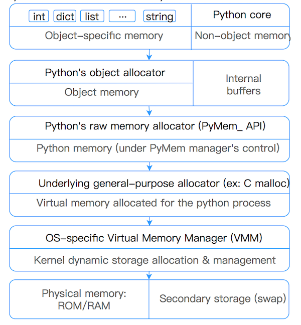

Python为了避免对于小对象（<=512bytes）出现数量过多的GC，导致的性能消耗。Python对于小对象采用子分配 (内存池) 的方式进行内存块的管理。对于大对象使用标准C中的allocator来分配内存。

Python对于小对象的allocator由大到小分为三个层级：arena、pool、block。

### Block

Block是最小的一个层级，每个block仅仅可以容纳包含一个固定大小的Python Object。大小从8-512bytes，以8bytes为步长，分为64类不同的block。

<table><thead><tr style="border-width: 1px 0px 0px;border-right-style: initial;border-bottom-style: initial;border-left-style: initial;border-right-color: initial;border-bottom-color: initial;border-left-color: initial;border-top-style: solid;border-top-color: rgb(204, 204, 204);background-color: white;"><th style="border-top-width: 1px;border-color: rgb(204, 204, 204);background-color: rgb(240, 240, 240);text-align: center;min-width: 85px;">Request in bytes</th><th style="border-top-width: 1px;border-color: rgb(204, 204, 204);background-color: rgb(240, 240, 240);text-align: center;min-width: 85px;">Size of allocated block</th><th style="border-top-width: 1px;border-color: rgb(204, 204, 204);background-color: rgb(240, 240, 240);text-align: center;min-width: 85px;">size class idx</th></tr></thead><tbody style="border-width: 0px;border-style: initial;border-color: initial;"><tr style="border-width: 1px 0px 0px;border-right-style: initial;border-bottom-style: initial;border-left-style: initial;border-right-color: initial;border-bottom-color: initial;border-left-color: initial;border-top-style: solid;border-top-color: rgb(204, 204, 204);background-color: white;"><td style="border-color: rgb(204, 204, 204);text-align: center;min-width: 85px;">1-8</td><td style="border-color: rgb(204, 204, 204);text-align: center;min-width: 85px;">8</td><td style="border-color: rgb(204, 204, 204);text-align: center;min-width: 85px;">0</td></tr><tr style="border-width: 1px 0px 0px;border-right-style: initial;border-bottom-style: initial;border-left-style: initial;border-right-color: initial;border-bottom-color: initial;border-left-color: initial;border-top-style: solid;border-top-color: rgb(204, 204, 204);background-color: rgb(248, 248, 248);"><td style="border-color: rgb(204, 204, 204);text-align: center;min-width: 85px;">9-16</td><td style="border-color: rgb(204, 204, 204);text-align: center;min-width: 85px;">16</td><td style="border-color: rgb(204, 204, 204);text-align: center;min-width: 85px;">1</td></tr><tr style="border-width: 1px 0px 0px;border-right-style: initial;border-bottom-style: initial;border-left-style: initial;border-right-color: initial;border-bottom-color: initial;border-left-color: initial;border-top-style: solid;border-top-color: rgb(204, 204, 204);background-color: white;"><td style="border-color: rgb(204, 204, 204);text-align: center;min-width: 85px;">17-24</td><td style="border-color: rgb(204, 204, 204);text-align: center;min-width: 85px;">24</td><td style="border-color: rgb(204, 204, 204);text-align: center;min-width: 85px;">2</td></tr><tr style="border-width: 1px 0px 0px;border-right-style: initial;border-bottom-style: initial;border-left-style: initial;border-right-color: initial;border-bottom-color: initial;border-left-color: initial;border-top-style: solid;border-top-color: rgb(204, 204, 204);background-color: rgb(248, 248, 248);"><td style="border-color: rgb(204, 204, 204);text-align: center;min-width: 85px;">25-32</td><td style="border-color: rgb(204, 204, 204);text-align: center;min-width: 85px;">32</td><td style="border-color: rgb(204, 204, 204);text-align: center;min-width: 85px;">3</td></tr><tr style="border-width: 1px 0px 0px;border-right-style: initial;border-bottom-style: initial;border-left-style: initial;border-right-color: initial;border-bottom-color: initial;border-left-color: initial;border-top-style: solid;border-top-color: rgb(204, 204, 204);background-color: white;"><td style="border-color: rgb(204, 204, 204);text-align: center;min-width: 85px;">33-40</td><td style="border-color: rgb(204, 204, 204);text-align: center;min-width: 85px;">40</td><td style="border-color: rgb(204, 204, 204);text-align: center;min-width: 85px;">4</td></tr><tr style="border-width: 1px 0px 0px;border-right-style: initial;border-bottom-style: initial;border-left-style: initial;border-right-color: initial;border-bottom-color: initial;border-left-color: initial;border-top-style: solid;border-top-color: rgb(204, 204, 204);background-color: rgb(248, 248, 248);"><td style="border-color: rgb(204, 204, 204);text-align: center;min-width: 85px;">41-48</td><td style="border-color: rgb(204, 204, 204);text-align: center;min-width: 85px;">48</td><td style="border-color: rgb(204, 204, 204);text-align: center;min-width: 85px;">5</td></tr><tr style="border-width: 1px 0px 0px;border-right-style: initial;border-bottom-style: initial;border-left-style: initial;border-right-color: initial;border-bottom-color: initial;border-left-color: initial;border-top-style: solid;border-top-color: rgb(204, 204, 204);background-color: white;"><td style="border-color: rgb(204, 204, 204);text-align: center;min-width: 85px;">…</td><td style="border-color: rgb(204, 204, 204);text-align: center;min-width: 85px;">…</td><td style="border-color: rgb(204, 204, 204);text-align: center;min-width: 85px;">…</td></tr><tr style="border-width: 1px 0px 0px;border-right-style: initial;border-bottom-style: initial;border-left-style: initial;border-right-color: initial;border-bottom-color: initial;border-left-color: initial;border-top-style: solid;border-top-color: rgb(204, 204, 204);background-color: rgb(248, 248, 248);"><td style="border-color: rgb(204, 204, 204);text-align: center;min-width: 85px;">505-512</td><td style="border-color: rgb(204, 204, 204);text-align: center;min-width: 85px;">512</td><td style="border-color: rgb(204, 204, 204);text-align: center;min-width: 85px;">63</td></tr></tbody></table>

### Pool

Pool具有相同大小的block组成集合称为Pool。通常情况下，Pool的大小为4kb，与虚拟内存页的大小保存一致。限制Pool中block有固定的大小，有如下好处是: 当一个对象在当前Pool中的某个block被销毁时，Pool内存管理可以将新生成的对象放入该block中。


```c
/* Pool for small blocks. */  
struct pool_header {  
    union { block *_padding;  
            uint count; } ref;          /* number of allocated blocks    */  
    block *freeblock;                   /* pool's free list head         */  
    struct pool_header *nextpool;       /* next pool of this size class  */  
    struct pool_header *prevpool;       /* previous pool       ""        */  
    uint arenaindex;                    /* index into arenas of base adr */  
    uint szidx;                         /* block size class index        */  
    uint nextoffset;                    /* bytes to virgin block         */  
    uint maxnextoffset;                 /* largest valid nextoffset      */  
};  
```

具有相同大小的Pool通过双向链表来连接，sidx用来标识Block的类型。arenaindex标识当前Pool属于哪个Arena。ref.conut标识当前Pool使用了多少个Block。freeblock：标识当前Pools中可用block的指针。freeblock实际是单链表实现，当一块block为空状态时，则将该block插入到freeblock链表的头部。

每个Pool都有三个状态：

  * used：部分使用，即Pool不满，也不为空
  * full：满，即所有Pool中的Block都已被分配
  * empty：空, 即所有Pool中的Block都未被分配

usedpool为了很好的高效的管理Pool，Python额外使用了array，usedpool来管理。即如下图所示，usedpool按序存储着每个特性大小的Pool的头指针，相同大小的Pool按照双向链表来连接。当分配新的内存空间时，创建一个特定大小的Pool，只需要使用usedpools找到头指针，遍历即可，当没有内存空间时，只需要在Pool的双向链表的头部插入新的Pool即可。

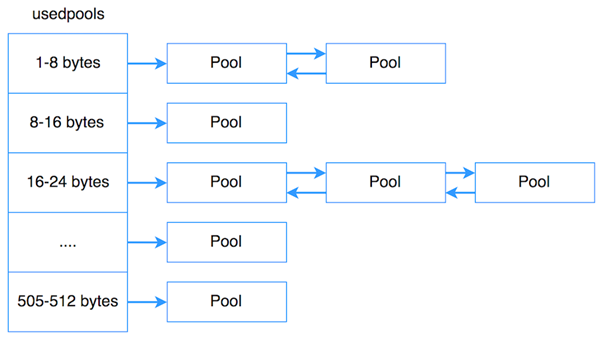

### Arena

Pools和Blocks都不会直接去进行内存分配(allocate), Pools和Blocks会使用从arena那边已经分配好的内存空间。Arena：是分配在堆上256kb的块状内存，提供了64个Pool。

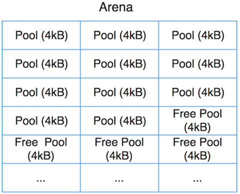


```c
struct arena_object {  
    uintptr_t address;  
    block* pool_address;  
    uint nfreepools;  
    uint ntotalpools;  
    struct pool_header* freepools;  
    struct arena_object* nextarena;  
    struct arena_object* prevarena;  
};  
```

所有的arenas也使用双链表进行连接(prevarena, nextarena字段). nfreepools和ntotalpools存储着当前可用pools的信息。freepools指针指向当前可用的pools。arena结构简单，职责即为按需给pools分配内存，当一个arena为空时，则将该arena的内存归还给操作系统。

## Python的垃圾回收机制

Python采用的是引用计数机制为主，标记-清除和分代收集两种机制为辅的策略。

### 引用计数(reference counting)

Python语言默认采用的垃圾收集机制是“引用计数法 Reference Counting”，该算法最早George E.Collins在1960的时候首次提出，50年后的今天，该算法依然被很多编程语言使用。

引用计数法的原理是：每个对象维护一个`ob_ref`字段，用来记录该对象当前被引用的次数，每当新的引用指向该对象时，它的引用计数`ob_ref`加1，每当该对象的引用失效时计数`ob_ref`减1，一旦对象的引用计数为0，该对象立即被回收，对象占用的内存空间将被释放。

它的缺点是需要额外的空间维护引用计数，这个问题是其次的，不过最主要的问题是它不能解决对象的“循环引用”，因此，也有很多语言比如Java并没有采用该算法做来垃圾的收集机制。

Python中一切皆对象，也就是说，在Python中你用到的一切变量，本质上都是类对象。实际上每一个对象的核心就是一个结构体PyObject，它的内部有一个引用计数器`ob_refcnt`，程序在运行的过程中会实时的更新`ob_refcnt`的值，来反映引用当前对象的名称数量。当某对象的引用计数值为0,说明这个对象变成了垃圾，那么它会被回收掉，它所用的内存也会被立即释放掉。

```c
typedef struct _object {  
    int ob_refcnt;//引用计数  
    struct _typeobject *ob_type;  
} PyObject;  
```

导致引用计数+1的情况：

  * 对象被创建，例如a=23
  * 对象被引用，例如b=a
  * 对象被作为参数，传入到一个函数中，例如func(a)
  * 对象作为一个元素，存储在容器中，例如list1=[a,a]

导致引用计数-1的情况

  * 对象的别名被显式销毁，例如del a
  * 对象的别名被赋予新的对象，例如a=24
  * 一个对象离开它的作用域，例如f函数执行完毕时，func函数中的局部变量（全局变量不会）
  * 对象所在的容器被销毁，或从容器中删除对象

我们可以通过sys包中的getrefcount()来获取一个名称所引用的对象当前的引用计。sys.getrefcount()本身会使得引用计数加一.

**循环引用**

引用计数的另一个现象就是循环引用，相当于有两个对象a和b，其中a引用了b，b引用了a，这样a和b的引用计数都为1，并且永远都不会为0，这就意味着这两个对象永远都不会被回收了，这就是循环引用 , a与b形成了一个引用循环 , 示例如下 :

```python
a = [1, 2]  ## 计数为 1  
b = [2, 3]  ## 计数为 1  
a.append(b)  ## 计数为 2  
b.append(a)  ## 计数为 2  
del a  ## 计数为 1  
del b  ## 计数为 1  
```

除了上述两个对象互相引用之外 , 还可以引用自身 ：

```python
list3 = [1,2,3]  
list3.append(list3)  
```

循环引用导致变量计数永不为 0，造成引用计数无法将其删除。

引用计数法有其明显的优点，如高效、实现逻辑简单、具备实时性，一旦一个对象的引用计数归零，内存就直接释放了。不用像其他机制等到特定时机。将垃圾回收随机分配到运行的阶段，处理回收内存的时间分摊到了平时，正常程序的运行比较平稳。引用计数也存在着一些缺点：

  * 逻辑简单，但实现有些麻烦。每个对象需要分配单独的空间来统计引用计数，这无形中加大的空间的负担，并且需要对引用计数进行维护，在维护的时候很容易会出错。
  * 在一些场景下，可能会比较慢。正常来说垃圾回收会比较平稳运行，但是当需要释放一个大的对象时，比如字典，需要对引用的所有对象循环嵌套调用，从而可能会花费比较长的时间。
  * 循环引用。这将是引用计数的致命伤，引用计数对此是无解的，因此必须要使用其它的垃圾回收算法对其进行补充。

也就是说，Python 的垃圾回收机制，很大一部分是为了处理可能产生的循环引用，是对引用计数的补充。

### 标记清除(Mark and Sweep)

Python采用了“标记-清除”(Mark and Sweep)算法，解决容器对象可能产生的循环引用问题。(注意，只有容器对象才会产生循环引用的情况，比如列表、字典、用户自定义类的对象、元组等。而像数字，字符串这类简单类型不会出现循环引用。作为一种优化策略，对于只包含简单类型的元组也不在标记清除算法的考虑之列)

跟其名称一样，该算法在进行垃圾回收时分成了两步，分别是：

  * 标记阶段，遍历所有的对象，如果是可达的（reachable），也就是还有对象引用它，那么就标记该对象为可达；
  * 清除阶段，再次遍历对象，如果发现某个对象没有标记为可达，则就将其回收。

对象之间会通过引用（指针）连在一起，构成一个有向图，对象构成这个有向图的节点，而引用关系构成这个有向图的边。从root object出发，沿着有向边遍历对象，可达的（reachable）对象标记为活动对象，不可达（unreachable）的对象就是要被清除的非活动对象。所谓root object，就是一些全局变量、调用栈、寄存器，这些对象是不可被删除的。

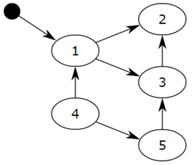

我们把小黑圈视为 root object，从小黑圈出发，对象 1 可达，那么它将被标记，对象 2、3可间接可达也会被标记，而 4 和 5 不可达，那么1、2、3 就是活动对象，4 和 5 是非活动对象会被 GC 回收。

如下图所示，在标记清除算法中，为了追踪容器对象，需要每个容器对象维护两个额外的指针，用来将容器对象组成一个双端链表，指针分别指向前后两个容器对象，方便插入和删除操作。Python解释器(Cpython)维护了两个这样的双端链表，一个链表存放着需要被扫描的容器对象，另一个链表存放着临时不可达对象。

在图中，这两个链表分别被命名为“Object to Scan”和“Unreachable”。图中例子是这么一个情况：link1,link2,link3组成了一个引用环，同时link1还被一个变量A(其实这里称为名称A更好)引用。link4自引用，也构成了一个引用环。

从图中我们还可以看到，每一个节点除了有一个记录当前引用计数的变量`ref_count`还有一个gc_ref变量，这个`gc_ref`是`ref_count`的一个副本，所以初始值为`ref_count`的大小。

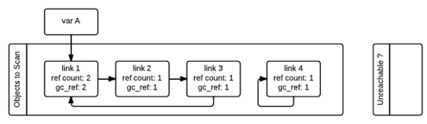

gc启动的时候，会逐个遍历“Object to Scan”链表中的容器对象，并且将当前对象所引用的所有对象的`gc_ref`减一。(扫描到link1的时候，由于link1引用了link2,所以会将link2的`gc_ref`减一，接着扫描link2,由于link2引用了link3,所以会将link3的`gc_ref`减一…..)像这样将“Objects to Scan”链表中的所有对象考察一遍之后，两个链表中的对象的ref_count和gc_ref的情况如下图所示。这一步操作就相当于解除了循环引用对引用计数的影响。

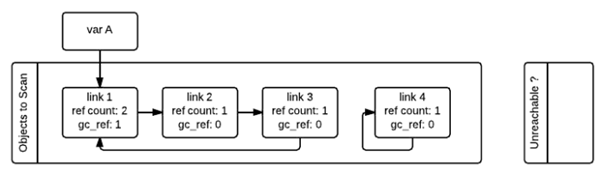

接着，gc会再次扫描所有的容器对象，如果对象的`gc_ref`值为0，那么这个对象就被标记为`GC_TENTATIVELY_UNREACHABLE`，并且被移至“Unreachable”链表中。下图中的link3和link4就是这样一种情况。

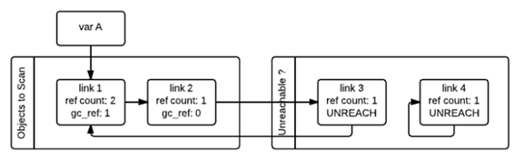

如果对象的`gc_ref`不为0，那么这个对象就会被标记为`GC_REACHABLE`。同时当gc发现有一个节点是可达的，那么他会递归式的将从该节点出发可以到达的所有节点标记为`GC_REACHABLE`,这就是下图中link2和link3所碰到的情形。

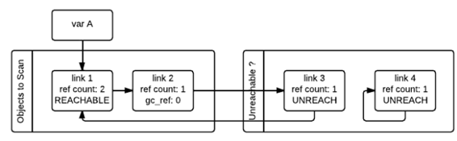

除了将所有可达节点标记为`GC_REACHABLE`之外，如果该节点当前在“Unreachable”链表中的话，还需要将其移回到“Object to Scan”链表中，下图就是link3移回之后的情形。

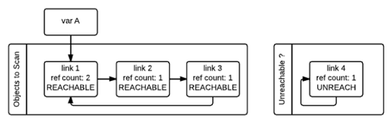

第二次遍历的所有对象都遍历完成之后，存在于“Unreachable”链表中的对象就是真正需要被释放的对象。如上图所示，此时link4存在于Unreachable链表中，gc随即释放之。

上面描述的垃圾回收的阶段，会暂停整个应用程序，等待标记清除结束后才会恢复应用程序的运行。

标记清除的优点在于可以解决循环引用的问题，并且在整个算法执行的过程中没有额外的开销。缺点在于当执行标记清除时正常的程序将会被阻塞。另外一个缺点在于，标记清除算法在执行很多次数后，程序的堆空间会产生一些小的内存碎片。

### 分代回收(Generational garbage collector)

分代回收技术是上个世纪80年代初发展起来的一种垃圾回收机制，也是Java 垃圾回收的核心算法。分代回收是基于这样的一个统计事实，对于程序，存在一定比例的内存块的生存周期比较短；而剩下的内存块，生存周期会比较长，甚至会从程序开始一直持续到程序结束。

生存期较短对象的比例通常在 80%～90% 之间。因此，简单地认为：对象存在时间越长，越可能不是垃圾，应该越少去收集。这样在执行标记-清除算法时可以有效减小遍历的对象数，从而提高垃圾回收的速度，是一种以空间换时间的方法策略。

  * Python 将所有的对象分为 0，1，2 三代；
  * 所有的新建对象都是 0 代对象；
  * 当某一代对象经历过垃圾回收，依然存活，就被归入下一代对象。

那么，按什么标准划分对象呢?是否随机将一个对象划分到某个代即可呢?答案是否定的。实际上，对象分代里头也是有不少学问的，好的划分标准可显著提升垃圾回收的效率。

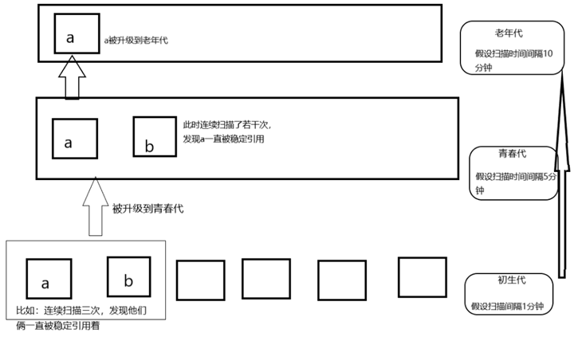

Python 内部根据对象存活时间，将对象分为 3 代，每个代都由一个 gc_generation 结构体来维护（定义于Include/internal/mem.h）：

```c
struct gc_generation {   
    PyGC_Head head;   
    int threshold; /* collection threshold */   
    int count; /* count of allocations or collections of younger generations */   
};  
```

其中：

  * head，可收集对象链表头部，代中的对象通过该链表维护
  * threshold，仅当 count 超过本阀值时，Python 垃圾回收操作才会扫描本代对象
  * count，计数器，不同代统计项目不一样

Python 虚拟机运行时状态由 Include/internal/pystate.h 中的 pyruntimestate 结构体表示，它内部有一个`_gc_runtime_state ( Include/internal/mem.h )`结构体，保存 GC 状态信息，包括 3 个对象代。这 3 个代，在GC 模块`( Modules/gcmodule.c ) _PyGC_Initialize `函数中初始化：


```c
struct gc_generation generations[NUM_GENERATIONS] = {  
    /* PyGC_Head, threshold, count */  
    {{{_GEN_HEAD(0), _GEN_HEAD(0), 0}}, 700 0},  
    {{{_GEN_HEAD(1), _GEN_HEAD(1), 0}}, 10, 0},  
    {{{_GEN_HEAD(2), _GEN_HEAD(2), 0}}, 10, 0},  
};  
```

为方便讨论，我们将这 3 个代分别称为：初生代、中生代 以及 老生代。当这 3 个代初始化完毕后，对应的 `gc_generation` 数组大概是这样的：

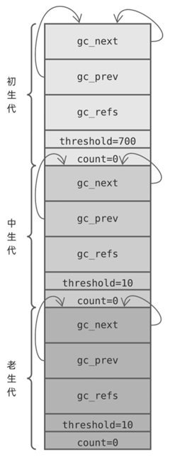

每个 `gc_generation` 结构体链表头节点都指向自己，换句话说每个可收集对象链表一开始都是空的，计数器字段 count 都被初始化为 0，而阀值字段threshold 则有各自的策略。这些策略如何理解呢?

  * Python 调用 `_PyObject_GC_Alloc` 为需要跟踪的对象分配内存时，该函数将初生代 count 计数器加1，随后对象将接入初生代对象链表，当 Python 调用 `PyObject_GC_Del` 释放垃圾对象内存时，该函数将初生代 count 计数器,1，`_PyObject_GC_Alloc` 自增 count 后如果超过阀值(700)，将调用 `collect_generations` 执行一次垃圾回收( GC )。
  * `collect_generations` 函数从老生代开始，逐个遍历每个生代，找出需要执行回收操作(,count>threshold )的最老生代。随后调用 `collect_with_callback` 函数开始回收该生代，而该函数最终调用 collect 函数。
  * collect 函数处理某个生代时，先将比它年轻的生代计数器 count 重置为 0，然后将它们的对象链表移除，与自己的拼接在一起后执行 GC 算法，最后将下一个生代计数器加1。

于是：

  * 系统每新增 701 个需要 GC 的对象，Python 就执行一次 GC 操作
  * 每次 GC 操作需要处理的生代可能是不同的，由 count 和 threshold 共同决定
  * 某个生代需要执行 GC ( count>hreshold )，在它前面的所有年轻生代也同时执行 GC
  * 对多个代执行 GC，Python 将它们的对象链表拼接在一起，一次性处理
  * GC 执行完毕后，count 清零，而后一个生代 count 加 1

下面是一个简单的例子：初生代触发 GC 操作，Python 执行 `collect_generations` 函数。它找出了达到阀值的最老生代是中生代，因此调用`collection_with_callback(1)`，1 是中生代在数组中的下标。

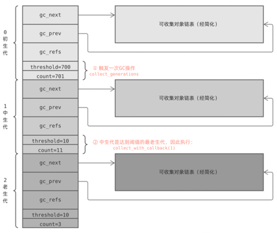

`collection_with_callback(1)` 最终执调用 collect(1)，它先将后一个生代计数器加一;然后将本生代以及前面所有年轻生代计数器重置为零;最后调用 `gc_list_merge` 将这几个可回收对象链表合并在一起：

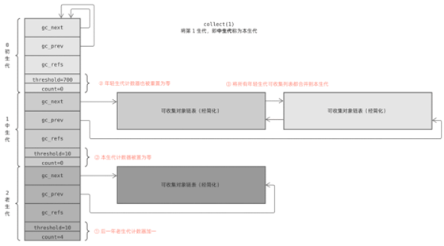

最后，collect 函数执行标记清除算法，对合并后的链表进行垃圾回收。

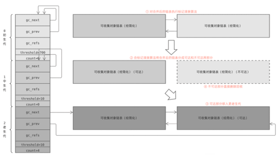

这就是分代回收机制的全部秘密，它看似复杂，但只需略加总结就可以得到几条直白的策略：

  * 每新增 701 个需要 GC 的对象，触发一次新生代 GC
  * 每执行 11 次新生代 GC ，触发一次中生代 GC
  * 每执行 11 次中生代 GC ，触发一次老生代 GC (老生代 GC 还受其他策略影响，频率更低)
  * 执行某个生代 GC 前，年轻生代对象链表也移入该代，一起 GC
  * 一个对象创建后，随着时间推移将被逐步移入老生代，回收频率逐渐降低

## Python 中的 gc 模块

gc 模块是我们在Python中进行内存管理的接口，一般情况Python程序员都不用关心自己程序的内存管理问题，但是有的时候，比如发现自己程序存在内存泄露，就可能需要用到gc模块的接口来排查问题。

有的 Python 系统会关闭自动垃圾回收，程序自己判断回收的时机，据说 instagram 的系统就是这样做的，整体运行效率提高了10%。

常用函数：

  * `set_debug(flags)` ：设置gc的debug日志，一般设置为gc.DEBUG_LEAK可以看到内存泄漏的对象。
  * `collect([generation]) `：执行垃圾回收。会将那些有循环引用的对象给回收了。这个函数可以传递参数，0代表只回收第0代的的垃圾对象、1代表回收第0代和第1代的对象，2代表回收第0、1、2代的对象。如果不传参数，那么会使用2作为默认参数。
  * `get_threshold()` ：获取gc模块执行垃圾回收的阈值。返回的是个元组，第0个是零代的阈值，第1个是1代的阈值，第2个是2代的阈值。
  * `set_threshold(threshold0[, threshold1[, threshold2]) `：设置执行垃圾回收的阈值。
  * `get_count()` ：获取当前自动执行垃圾回收的计数器。返回一个元组。第0个是零代的垃圾对象的数量，第1个是零代链表遍历的次数，第2个是1代链表遍历的次数。

## 参考链接：

  * 聊聊Python内存管理 (https://andrewpqc.github.io/2018/10/08/python-memory-management/)
  * gc — 垃圾回收器接口 (https://docs.python.org/zh-cn/3/library/gc.html)
