 
<!--BEGIN_DATA
{
    "create_date": "2023-06-15 10:30", 
    "modify_date": "2023-06-15 10:30", 
    "is_top": "0", 
    "summary": "QQ NT的跨平台重构之旅 - 项目总览<br/>QQ NT 的跨平台重构之旅 - 架构设计", 
    "tags": "Web", 
    "file_name": "QQ NT的跨平台重构之旅1.md"
}
END_DATA-->

#### <p>原文出处：<a href='https://km.woa.com/articles/show/560172' target='blank'>QQ NT的跨平台重构之旅 - 项目总览</a></p>

> 近年来 electron 越来越成熟，多端各自维护一套应用的技术债和开发成本越发凸显。为了实现现有应用的品质升级，并解决开发成本和维护成本问题，我们决定用 electron
对其进行重构。本篇文章主要介绍新版 QQ 项目（QQ-NT）的总体情况，所以会尽量让没有相关经验的同学也可以看懂。

重构计划从开始执行到现在已经有大半年时间了，从项目架构到性能优化，期间积累了很多经验，也踩过不少坑。现在终于有时间来沉淀和分享一下这既有挑战又有魅力的工作，希望能给你带来一些启发。

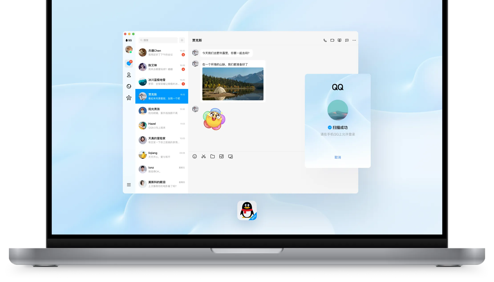

本主题大概会分三大部分来写，第一部分主要分享主进程和渲染进程的架构设计，第二部分主要分享模块复用和复杂模块设计，第三部分主要分享首屏优化和性能优化。除此之外，可能会把一些复杂模块的设计单独拿出来分享。本次分享第一部分，从整体上介绍一下新版 QQ（QQ-NT），所以不会深入细节。

## 那么为什么要重构 QQ？

原因大家基本上也猜得到，现网 QQ 运行多年，UI 和交互已经渐渐跟不上时代，我们想实现桌面端 QQ 品质升级，打造行业标杆项目。另一方面，多端人力成本高，维护成本高，再加上产品有一些年份了，技术债债台高筑，也是需要解决的问题。

## 为什么要用 electron？

electron 是一个跨平台应用框架，可以用 js 来编写桌面应用。关注 electron 的同学也能发现，electron 更新非常活跃，目前大概一个月一个大版本，功能也越来也完善。由于本质上是网页，做视觉和交互也更容易。

上层使用 electron 来编写，一套代码多端运行，大大提高了开发效率。同时，electron 省去了不少因系统差异而需要特殊处理的操作，因为 electron 都帮忙封装成相对统一的 api 了，极大的方便了跨平台调用。

很多主流 app，如 飞书、discord、B站桌面端，都在使用 electron，也说明 electron 跨平台方案是可行的。

## 名词解释

  * QQ NT：QQ New Tech，即新版 QQ

  * IPC：一种跨进程通信方式，electron 主进程和渲染进程通信的方法

  * AIO：All In One，IM 应用对消息聊天区域及其附加能力（例如 QQ 聊天窗口的右侧部分）的统称

  * NT：跨平台 QQ 的一个底层核心 C++ 库，后面会简单介绍

## 新版整体架构

现网的 QQ 全平台都是各自实现，各端做各端的，所以端越多开发和维护成本就越高。

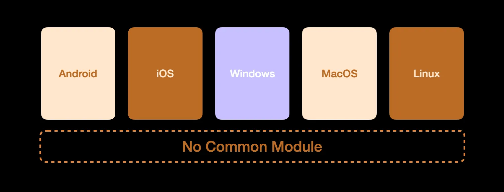

重构后的桌面 QQ 应用架构上是特殊的混合架构（electron & C++），底层接入了 NT 内核。后续我们所有平台的新版本都将基于 NT 进行开发。

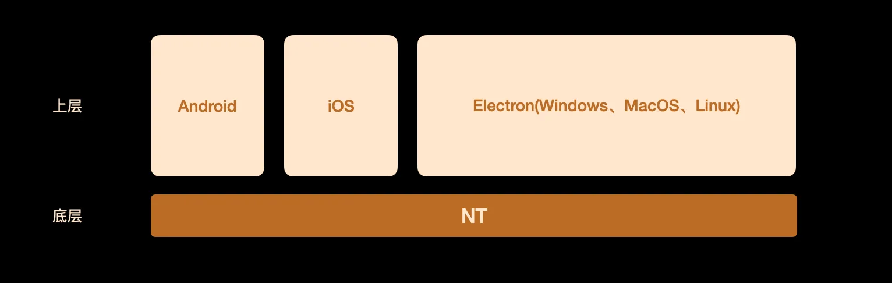

新版 QQ 基于 NT 和 electron，主要有以下几个部分：

  * NT：核心数据模块，负责与服务端交互，提供本地存储、业务数据组装等服务

  * node：窗口支持模块，electron 的主进程，负责窗口管理、跨进程通信、系统 API 调用等

  * renderer：用户界面模块，electron 的渲染进程，负责渲染界面、提供用户交互等

下面分别给大家介绍一下这几个模块。

## NT 做了些什么

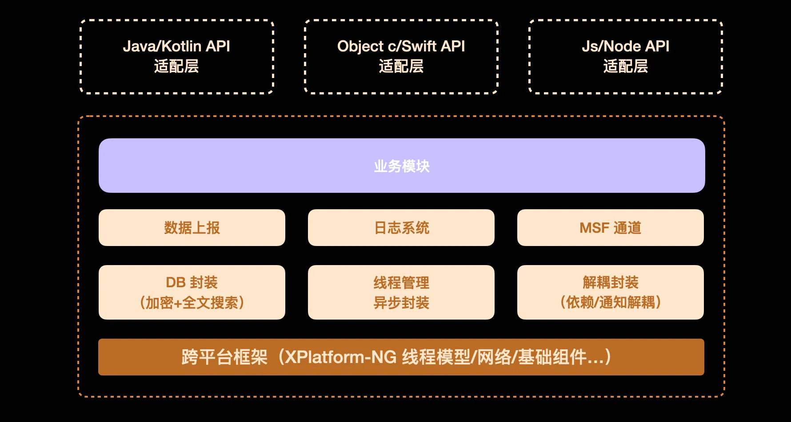

作为跨平台内核，NT 本身处理了非常多的逻辑，包括消息收发和存库、资料修改和拉取、用户设置同步、富媒体上传下载、音视频推流等。

NT 从架构上做了分层，兼顾易用 & 高效 & 复用，所有的数据流和操作流都是单向的，保证了链路的清晰和简单。NT 为各端实现了一个适配薄层，来兼顾各种平台调用。

## node 层做了些什么

作为整个 electron 应用的入口，node 层不仅要关注窗口的启动和管理、渲染进程的通信，作为与系统底层的接口，还会承载一些业务模块，比如logger、文件操作等。

所以整体可以概括为两大类：窗口相关、底层服务相关。

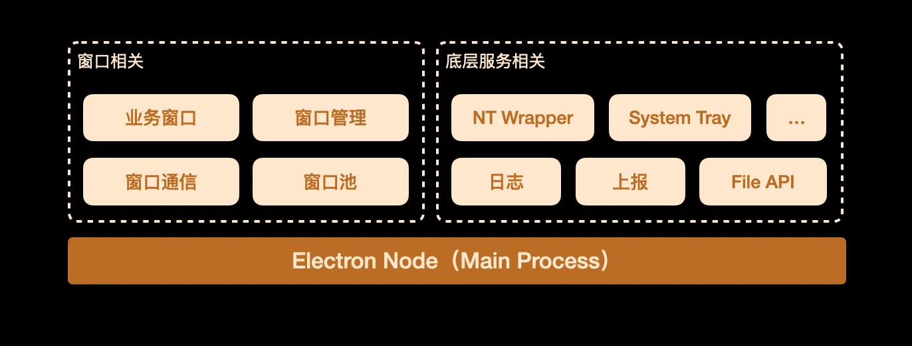

窗口相关，我们主要做了：

  * 窗口业务类封装（BaseWindow），提供基础窗口功能封装（如初始化窗口参数、绑定窗口通信服务等）

  * 窗口管理（WindowManager），窗口启动、销毁等

  * 窗口通信（IPC），数据传输、控制窗口展示内容、跨窗口通信等

底层服务相关，我们主要做了：

  * 基础通用服务，如日志、文件操作、上报、监控

  * 业务服务，NT 适配层（NT Wrapper），如截图、图片视频操作、系统托盘等

下面简单分享一下 node 层的几个核心架构和模块。

### 底座（NT-RunTime For Desktop）

因为新版 QQ 会将 QQ 频道 融合进来，普通的架构在可扩展性上能力不足。同样是 electron 架构，那么有没有可能提取一套“底座”出来，让各业务可以“安装”在底座上，实现可插拔的融合呢？


  * 统一主进程，封装 IPC、窗口管理器等公共模块，作为一个通用的运行环境，即“底座”。

  * 渲染层一侧设计通用的接口，以类似 JS-API 的方式调用主进程的能力。

  * 其他业务可以将 electron 当做一种特殊的 webview，以 web 开发的方式进行功能开发。

  * 程序发布时，可将通用底座 + 核心业务打包发布。非核心业务可以配置成增量下载的方式，或者直接部署在http服务器上。这种架构也支持打包不含 QQ 的其他独立版 APP。

### 通信

进程通信主要基于 electron 提供的 ipc 通信，我们对其进行了一定的封装。

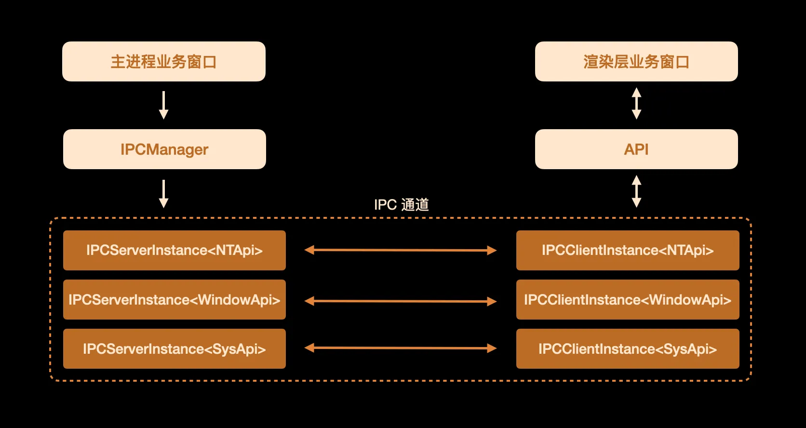

  * 每一个窗口都需要声明自己所需的 IPC 模块，由 IPCManager 统一生成 IPCServerInstance，同时在 preload 脚本内生成和主进程一一对应的 IPCClientInstance。

  * 主进程和渲染进程都使用窗口所注册的接口进行交互，主进程 IPC 会实现业务功能。

  * 为了简化逻辑，我们使用 ES6 Proxy + Typescript 来限制渲染层的调用，主进程则校验渲染层调用的 IPC 模块是否被声明。

  * 并通过解析 NT 提供的类型定义文件，自动生成供 IPCServer 使用的 NTApi 文件

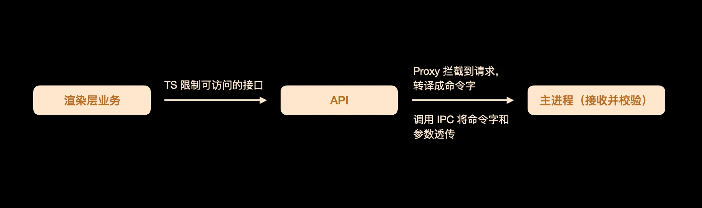

### 窗口管理器

QQ 作为一个复杂的 IM 应用，有着非常多的窗口，如何把它们管理的井井有条也很重要。

那么我们希望窗口管理器具有什么样的功能呢？

  * 能创建和自动销毁窗口

  * 能打开已存在的窗口

  * 知道打开了哪些窗口

  * 能批量销毁窗口

基于这几条，我们设计出了这样一个窗口管理器：

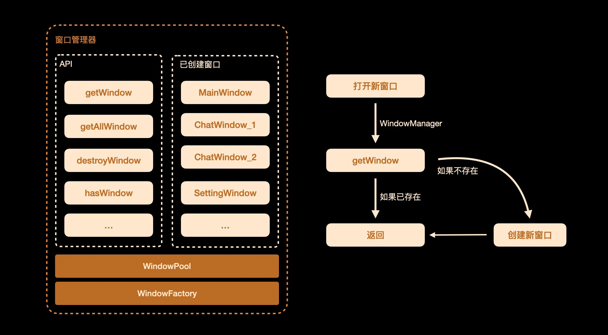

  * 调用 getWindow 函数，通过传入窗口 Name 的枚举和窗口初始参数，来创建新窗口或打开已经存在的窗口

  * 用 Map 记录打开的窗口，并提供多种查询窗口的函数

  * 监听窗口关闭事件，自动销毁窗口实例

  * 通过已打开的窗口 Map 来实现批量销毁功能，这在退出 App 的时候会很有帮助，也可以实现性能监控

### 窗口池

Electron 的窗口冷启动速度令人堪忧，19 款 Intel i7 MacBook Pro 实测从 new 一个 BrowserWindow 到开始加载业务代码，启动大概要 1~3s 的时间。在此之后渲染层业务代码才开始执行，整体页面可用时间会被拉长，这显然是无法让人接受的。

所以能不能预先启动一个窗口，让它隐藏在后台，等我们需要的时候直接把它唤起，这样是不是就节省了冷启动的时间呢？

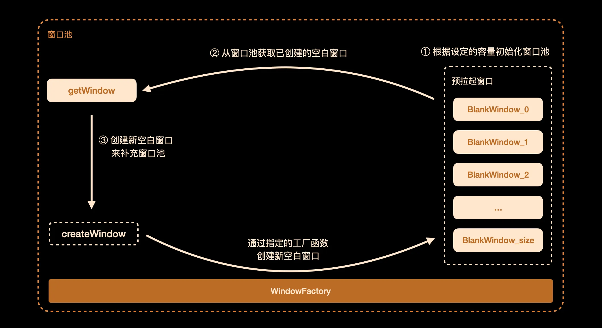

在窗口池预拉起窗口后，先渲染一个空白页，等真正需要加载具体页面的时候，再通过 IPC 去切换前端路由来渲染对应的页面。

### 热更新

一个 Electron 应用主要由两个部分组成，一个是应用框架本身（Electron壳），另一个是业务代码资源。而在实际迭代中，框架本身的改动是相对较少的，频繁更新的基本上只有业务代码。

新版 QQ 的热更新是基于 Electron 提供的 electron-updator，并支持全量更新和增量更新。

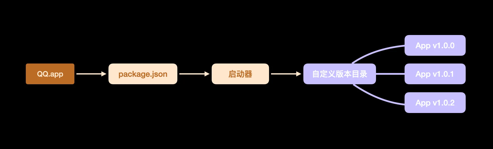

当有更新时，下载业务版本到自定义版本目录，并修改版本记录文件，重启后读取版本记录文件，即可使用新版本。

增量更新的的原理很简单，利用 bsdiff 库对两个打包后的版本进行二进制比较，生成 diff 文件，也就是增量包。用户下载后，用增量包对用户当前版本进行还原运算，即可生成新版本。

## renderer 层做了些什么

目前新版 QQ 的用户界面主要实现了几大核心功能：聊天区（AIO）、关系链（联系人、好友和群）、音视频（视频通话、语音通话等）、富媒体（图片、视频、文件、表情等），和复数个扩展功能：设置、搜索、主题、托盘等。

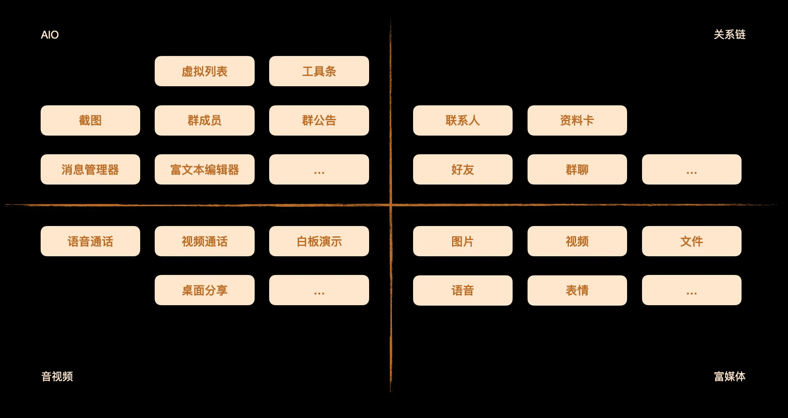

这些功能都非常复杂，所以我们在设计架构的时候，采用了模块化分层设计，后面会简单介绍。

### 技术栈选择

前端框架选择了 Vue class component + decorator，状态管理 Vuex，模块管理 inversify，组件库 pcqq-kit。

  * Vue class component 在写大型项目的时候，能够强制让逻辑更清晰，更重要的是，ts 支持好。

  * Vuex class module 写法，能够更直观的继承，也支持 decorator

  * inversify 是一个依赖注入框架，可以让依赖按需加载，也可以做到依赖分层管理

  * pcqq-kit 是 QQ 团队的组件库


### 分层设计

因为项目很大，我们需要让各模块有更清晰的职责划分、减少互相之间的依赖、提高可读性和可维护性。

UI 分层：

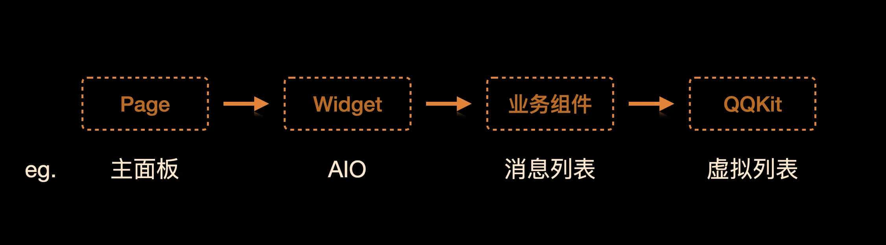

  * Page：页面，对应一个窗口，是最大粒度的业务模块

  * Widget：完整的业务功能，包含业务逻辑，是第二大粒度的业务模块

  * 业务组件：业务功能组件，包含业务逻辑，是最小粒度的业务模块

  * 基础库：原子 UI 组件，不包含业务逻辑

此外，我们额外加入了 Layout 布局这一概念，它不包含业务逻辑，只负责布局，用来处理可能的跨端情况，来实现逻辑复用。

依赖分层：

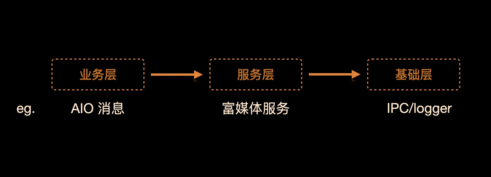

  * 业务层：最顶层业务，和视图关联，不应做过多运算

  * 服务层：提供数据和计算服务，如网络监听、头像缓存、富媒体下载

  * 基础层：基础模块，如 IPC 通信、日志、上报

核心思想即单一职责、依赖注入和单向依赖。

### 主要模块介绍

#### AIO

对于 IM 应用来说，AIO（All In One）是最最重要的一个部分，它的核心功能是消息收发。AIO 可以根据不同的聊天类型分为：C2C（好友聊天） 和 Group（群聊）。

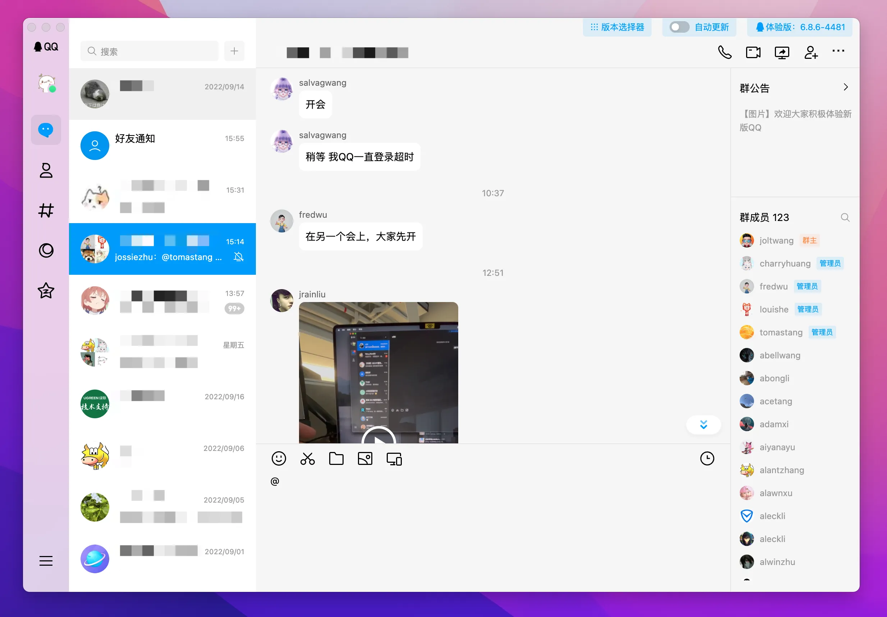

一个 AIO 往往会有很多消息，从性能的角度看，想要把他们全部展示出来肯定是不现实的。所以这里也不例外，采用了虚拟列表来展示消息。虚拟列表不会将所有的消息都展示出来，而是只展示你能看见的部分，不可见部分就不展示。

一个 AIO 往往也有很多种消息类型（语音消息、图文消息等），还支持展示不同的右键菜单，有的消息还支持点击交互。我们把它们封装为一个 Message 组件。

一个良好的设计变得很重要，这里我们采用了表驱动，并将数据全部由 props 传递，避免滥引用。

Message 组件的成分：

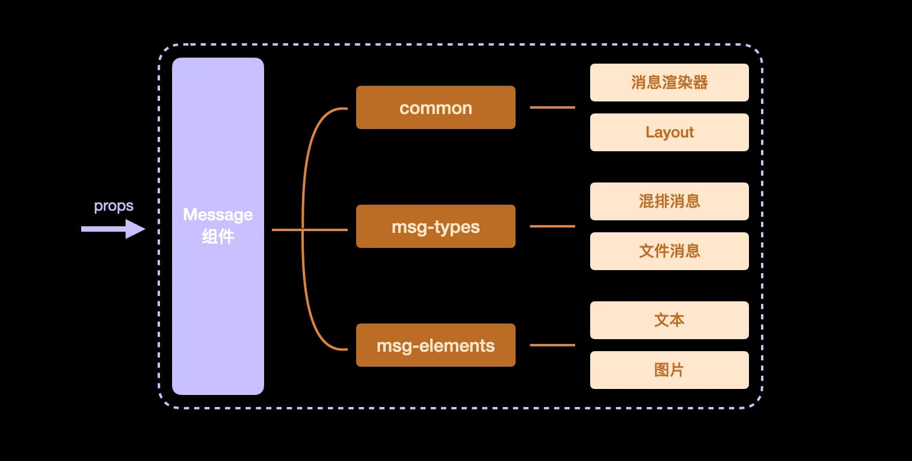

消息发送区是一个富媒体编辑器，基于 ck-editor。可以发送文件、表情，并添加了拖拽和跨应用复制粘贴，支持回复消息。如果在群里，它还会有一个 at
功能。

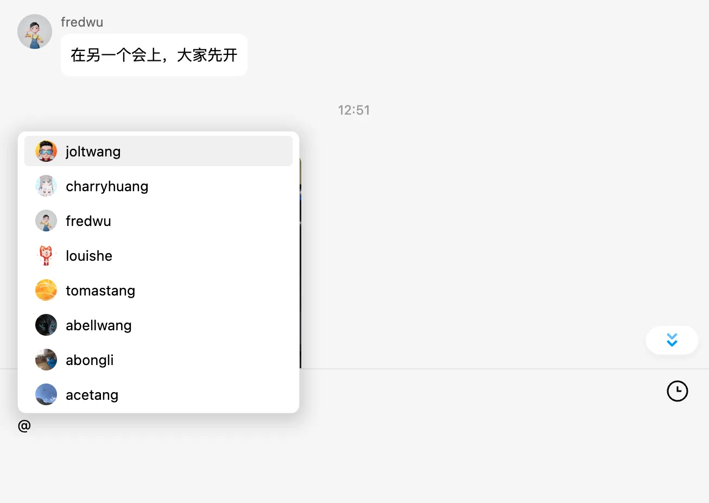

当发送一条消息时，编辑器会根据消息协议进行转换，然后通过 NT 发送到后端。接收消息时，后端往 NT 推送消息，NT
做一些处理（如计算用户资料）后，推送给渲染层。

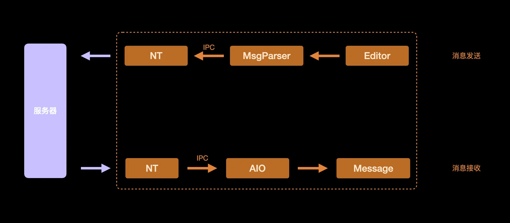

群成员列表也是一个虚拟列表，支持搜索、修改群名片等交互。

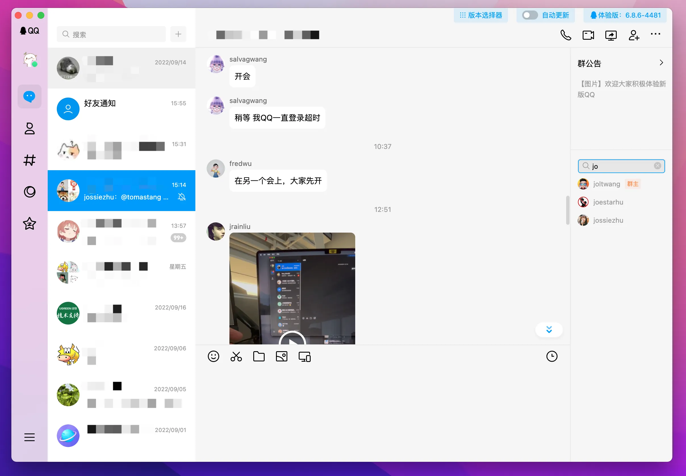

总而言之，AIO 是 IM 的核心，用户之间的联系在这里汇聚，信息在这里流淌。为此，我们也做了相当多的优化。

#### 富媒体

如果说纯文本是 Web 1.0，那么富媒体就是 Web 2.0。QQ
的富媒体包括了图片、视频、表情、文件等，用到的场景也很多。不仅展示上比较复杂，各个使用场景的状态同步也比较麻烦。

目前富媒体的展示主要有几种：

  * 图片、视频

  * 文件卡片、图片视频文件

  * 语音消息

  * 表情

使用场景就比较多了：

  * AIO

  * 搜索

  * 消息管理器

  * 表情面板

  * 群文件等

为了实现状态同步，和对原始接口的一些易用性封装，我们利用发布订阅模式，设计了一个统一的富媒体服务：

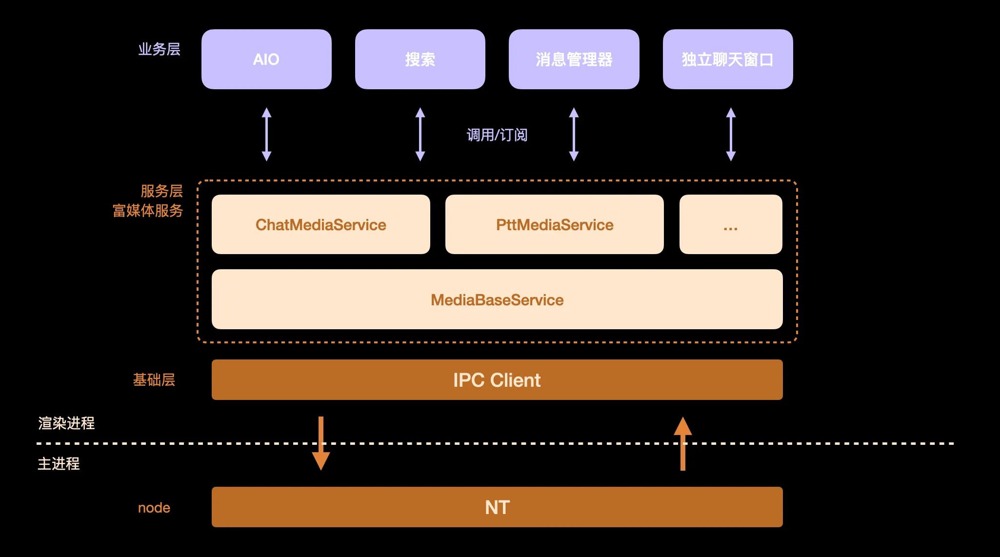

上层触发下载等操作时，底层会进行相应的处理，并向上层发出状态改变通知。监听了此服务的业务都会收到状态变化，从而实现状态同步。

#### 组件库

包含了新版 QQ 和 QQ 频道共用的组件，如红点、虚拟列表、图标等。组件库的好处在于提高可复用性，同时也让设计、开发有一个交流渠道，方便对齐需求。

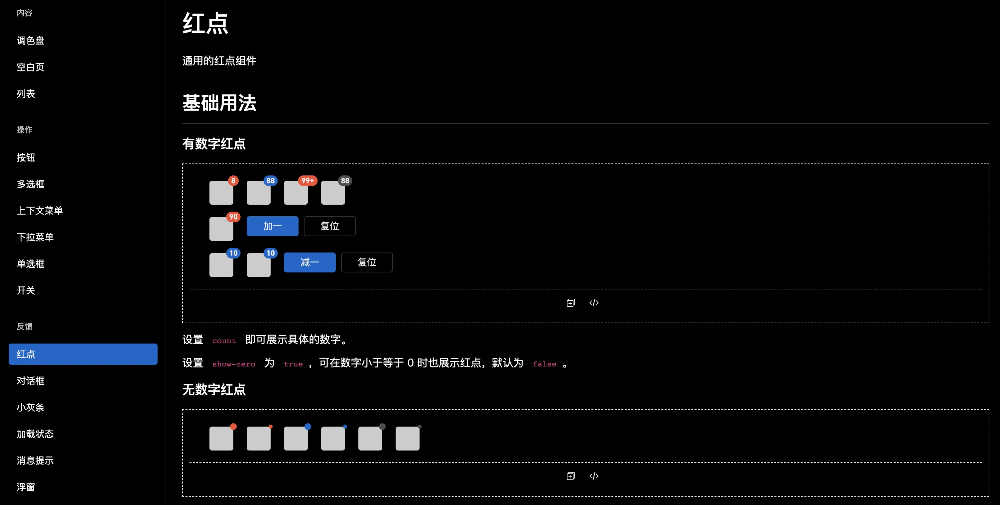

### 性能优化

electron 的性能一直受到质疑，浏览器内核的存在会让应用多一个庞大的运行环境。如何将性能优化到一个较好的水平，是关键。

新版 QQ 针对 electron 性能优化主要有几个大方向：

  1. 进程合并，将渲染进程进行合并

  2. 减少 IPC 通信，合理的合并一些高频请求。

  3. Web 应用常规优化，如虚拟列表、减少动画、减少节点数等

  4. 按需加载，优化打包，利用路由懒加载和 dynamic import，去掉不必要的加载等等

现在新版 QQ 在首屏和新窗口启动的体验上也能达到一个较好的水平。碍于篇幅限制，后面我会专门写一篇文章来分享性能优化。

### 体验优化

新版 QQ 针对去网页感做了很多努力。

  1. 首先是滚动条，我们对滚动条样式做了优化，并且添加了过渡动画，也支持滚动时显示，静止时隐藏。

  2. 其次是窗口加载，我们优化了窗口拉起时间和时机，当窗口首屏渲染完成后，才会显示窗口，做到无白屏时间。

  3. AIO 数据缓存，切换时缓存 AIO 1.5屏数据，来回切换不会出现加载闪烁。

  4. 部分虚拟列表可以“一拖到底”，在保证性能的情况下，可以和原生一样保持滚动高度。

## 构建打包

新版 QQ 构建上是基于 webpack 5，使用 multi-compiler 来并行构建，使用 wait-on 来控制时序。script 使用 gulp 进行管理，将启动构建、复制、替换、注入 rpath 等操作分解为一个个 gulp task。

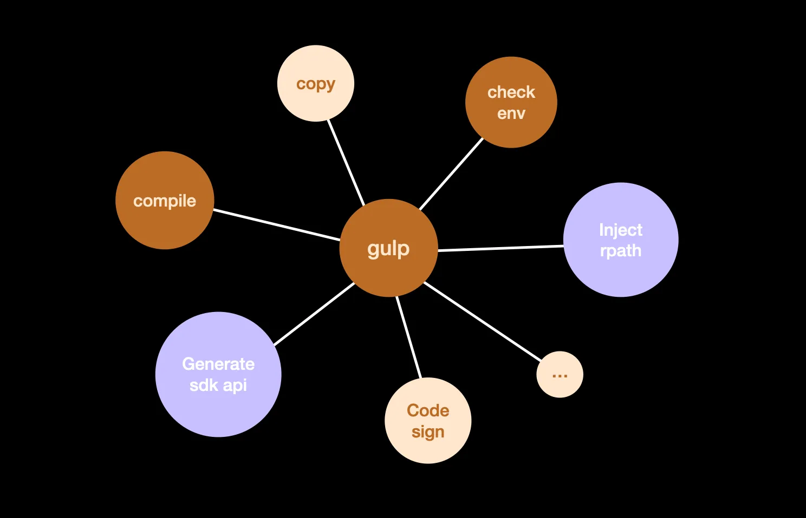

打包则是基于 electron-builder + 字节码加密，使用蓝盾流水线构建 Windows、Mac Universal（x64 & arm64 双架构）、Linux 多架构版本，并上传到热更新服务器。跨平台支持和代码安全都能够得到保证。

加密方案对比： 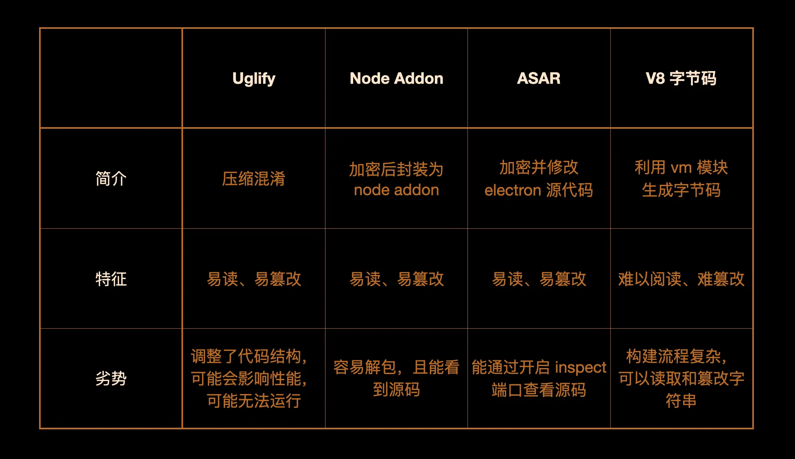

## 来看看新特性吧

#### 音视频

新版 QQ 的音视频包括语音通话和视频通话，也支持群语音和群视频。

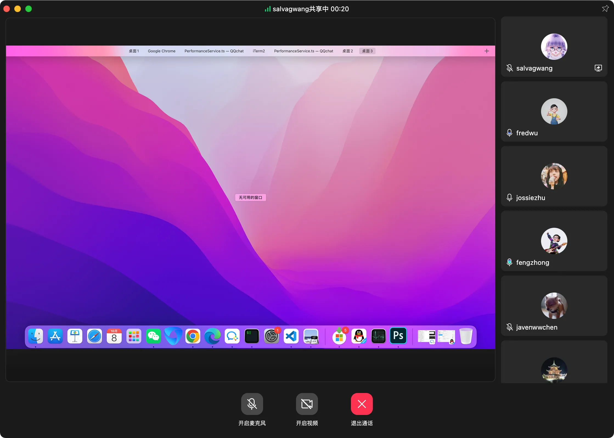 

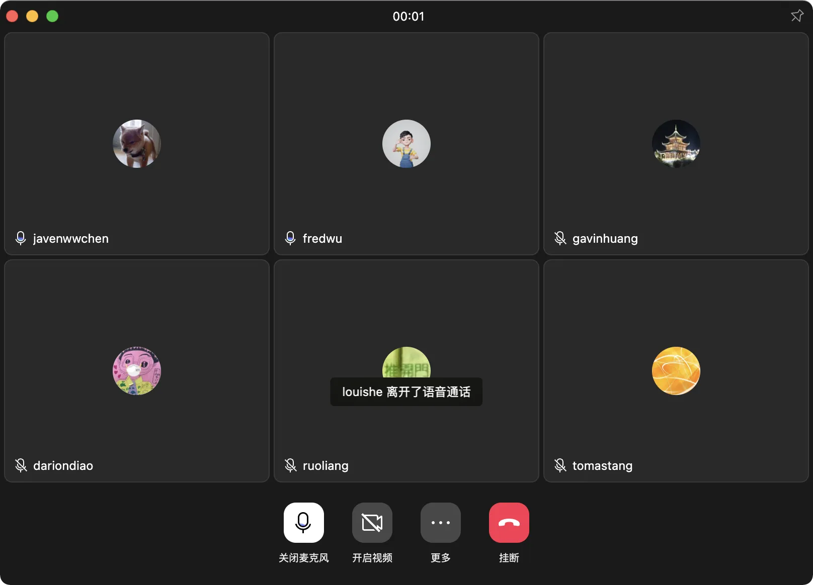

界面重新设计后，更加清爽。

#### 图片视频查看器

新版 QQ 也实现了一套图片视频查看器，并且支持 OCR（光学文字识别）和边下边播。

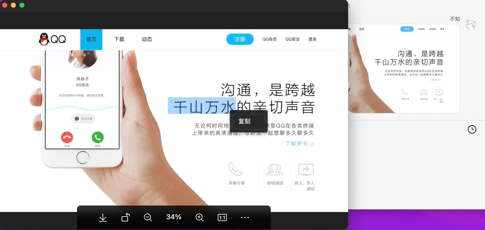

#### 消息管理器

消息管理器支持多维度过滤，可转发，可定位，视觉也做了优化。后续还会支持日期、联合搜索等更多筛选功能。


#### 主题

夜间模式一直是大家的诉求，新版 QQ 目前也可以支持手动切换白天和夜间模式，也可以支持跟随系统。

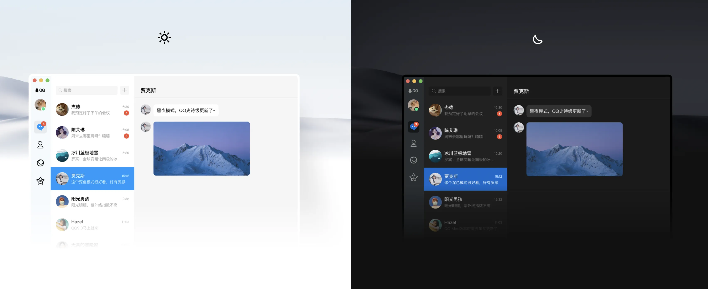

#### 随航

这个功能是 Mac 系统特供的增强能力，可以插入苹果设备相机拍摄的照片，或者 Apple Pencil 绘制的手稿。


## 总结

文字很多，感谢读完这篇文章的同学。新版 QQ 真的很有挑战，从构建到架构设计，从进程通信到热更新，开发过程中我们也一直在不断的进行优化。能够参与到其中来，也算是我人生中的高光时刻了。这些宝贵的经验，后面我也会一一梳理，和大家一起共同见证新版 QQ 的成长。

<hr>

### <p>原文出处：<a href='https://km.woa.com/knowledge/7516/node/3' target='blank'>QQ NT 的跨平台重构之旅 - 架构设计</a></p>

随着前端领域的不断拓展，使用web技术搭建复杂桌面端项目成为可能。在过去约一年期间，本团队采用Electron框架，基于当前版本的桌面QQ开发了全新的频道功能，并对桌面QQ本身（包含PC/Mac/Linux端）进行了翻新重构。

使用Electron做桌面开发有很多优势，如天然的跨平台能力，UI层面便于使用vue等成熟框架，上手成本低，便于组件化等等。但也有很多难点，如工具链不完备，底层封装度低，js语言执行效率有天然劣势，代码易破解和逆向，等等。而QQ和频道作为IM软件，本身业务场景也很复杂，如何能够协调多人团队，敏捷、高效地进行产品迭代，是我们必须面对的挑战。

在开发过程中，笔者所在团队做了很多架构上的创新与尝试，也遇到过需要推翻重构的挫折，经过反复打磨，积累了一些实践经验。具有一定通用性，可以推广到其他采用类似技术栈的项目中。

本文将对团队积累的架构经验进行总结，欢迎感兴趣的同学讨论拍砖。

## 一、大型Electron项目面临的挑战

### 1. 多窗口调度的问题

Electron是基于nodejs和chromium内核浏览器混合而成的。从node进程创建浏览器，由浏览器渲染UI界面。

对于简单的小型项目，可能只需要开启一个窗口，加载一个页面，类似于给web页换了个壳，对框架的依赖度不高，也就不需要额外的封装设计。

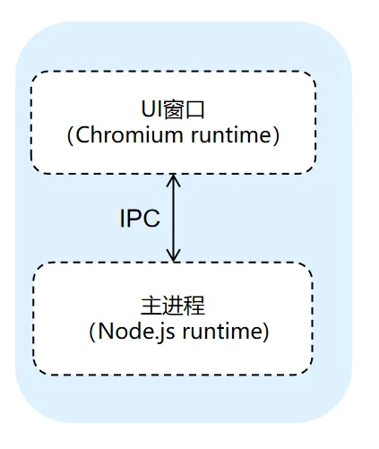

但复杂项目通常都是多窗口的，并且窗口的行为也很复杂，例如：

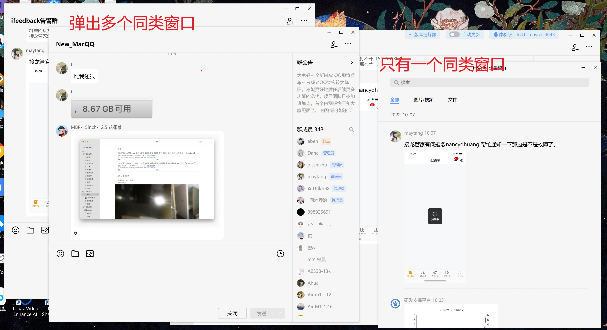  

有些场景需要弹出多个窗口，有些场景则只弹出一个，并且覆盖前一个的场景。  

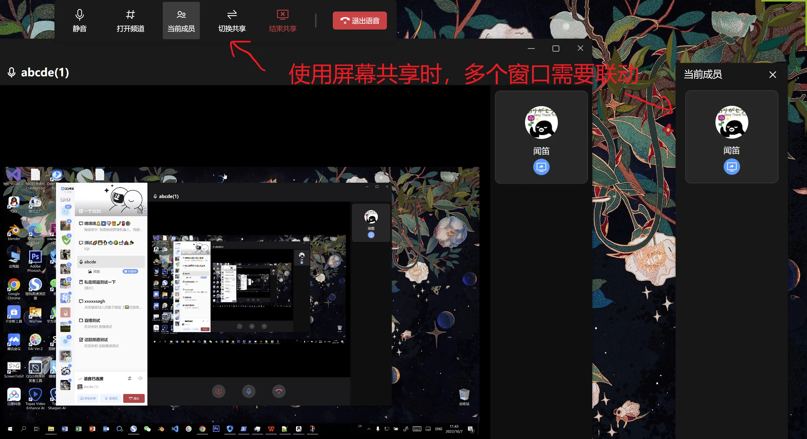  

有些窗口功能是联动的，特定场景下，需要同时被开启&关闭&操作

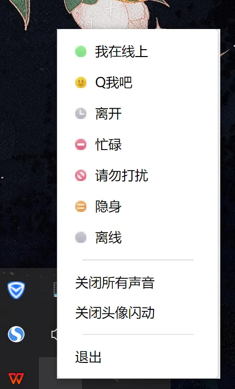

有时需要模拟一些系统操作，如右键菜单也是一个窗口，还需要改变系统默认行为，例如QQ主面板关闭的时候，进程不能一起退出，只有在右键菜单点击退出才能退出进程。

Electron本身只提供了一个BrowserWindow对象，我们需要更高层次的架构来容纳特定的业务逻辑。

### 2. 跨进程的数据传输问题

在Electron的架构下，每个窗口都是一个独立运行的渲染进程，同时还有一个独立运行的node进程来调度它们。但业务中难免需要跨窗口共享数据和状态。


比如图片查看器，翻页发生在窗口内，但翻页的目标来自于主窗口的AIO动态拉取的内容，并且随着聊天内容刷新。

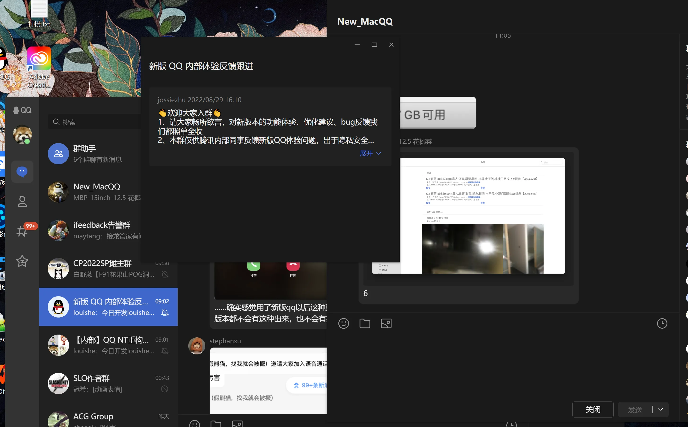

比如颜色模式，一旦设置，对所有窗口都要生效（图为设置了深色模式后的QQ各个窗口）

这就需要我们设计跨进程的数据传输通道。

### 3. 更复杂的系统调用

桌面软件涉及到文件存取，快捷键拦截，硬件检测，系统设置获取等等。我们同样需要搭建桥梁，把这些功能更好地交给UI层调用。

### 4. 性能与安全性

js是未编译的脚本语言，执行效率天然会比native语言差，而窗口又是独立进程，调度的成本也更大。当我们是一个用浏览器“伪装”的桌面应用，我们希望尽可能让用户得到近似于native的体验。

同时，脚本语言也是更加容易破解和攻击的，如何能够保护代码，避免被黑产利用，也是我们必须思考的问题。  

## 二、架构设计的原点——窗口

从最顶层看，整个项目的代码分成可见的部分，和不可见的部分。

可见的部分，就是和用户交互的UI层，对于一个桌面应用，它是承载于一个个窗口里的，我们称之为渲染进程。

不可见的部分，则是管理和调度这些窗口，并组织数据交换，系统调用的nodejs进程，我们称为主进程。

渲染进程采用vue组件化的方式开发，这是前端同学都很熟悉的领域，无需赘述。封装架构主要针对不可见的部分，也就是nodejs主进程。

这部分框架提供的能力都非常底层，并且很多概念对前端开发同学是陌生的。所以这里也是我们封装设计的关键所在。我们需要对其中的模块进行抽象封装，以满足复杂的业务场景。同时也希望它尽可能薄一些，既能够提供UI所需的能力，又不要太过笨重，以免增加开发同学的学习成本。

经过几次打磨，我们确定了围绕窗口展开的架构模式，一切封装都为窗口服务。

### 1. 窗口通用基类BaseWindow

盘点业务中的场景，我们发现大部分窗口都有一些共性的特点，比如标题栏，颜色模式，数据通道等等。所以我们抽象出一个BaseWindow的基类，并提供一些基础通用方法，其他业务窗口只要派生这个基类，无需重复实现通用逻辑。

基类的另一个好处可以隔离原始对象，因为BrowserWindow对象的创建是在node层，但销毁通常是在上层（当用户点击关闭时，会触发node进程的事件钩子，执行完毕后自动销毁）两个过程并不对称，当开发者没有及时释放引用，就会成一些不必要的麻烦。我们把原始对象隔离在BaseWindow内部，避免暴露给业务层，并把销毁后的窗口指向一个虚构的Proxy（DestroyWindow），在里面提供一些基础方法的mock，就能避免误用引发的异常，增加代码的健壮性。

摘取部分关键代码作为示例：

```js
class BaseWindow {

  /** BrowserWindow 对象句柄 */
  public win!: BrowserWindow;
  
  /** 窗口名称（业务属性） */
  public windowName: WindowNames;
  
  /** BrowserWindow 窗口配置 */
  protected windowOptions: TWindowOptions;
  
  /** 一些需要拓展的业务属性 */
  private shouldClose = true;
  private autoShow = true;
  private autoAdjust = true;
  private isFrameFlashed: Boolean = false;

  ……
  
  /** 拓展窗口事件，改变默认的窗口行为 */
  private bindWindowEvents() {
    this.win.on('close', async (e) => {
      if (this.shouldClose) {
      // shouldClose会在用户右键退出时被设置，此时做一些清理工作并退出
      this.destroyWindow();
      return;
      }
      // 否则只隐藏，不退出
      this.win?.hide();
      e.preventDefault();
    });
    this.win.once('closed', () => {
      // closed触发后，把win对象指向一个Proxy，避免引用出错
      this.win = destroyedWindow;
    });
    ……
  }
}

const destroyedWindow = new Proxy(
  {
    isDestroyed() {
      return true;
    }
  // 拓展其他需要mock的属性
  ……
  
  },
  {
  // 统一处理属性引用并抛出错误
    get(t, p) {
      // @ts-ignore
      if (t[p]) {
        // @ts-ignore
        return t[p];
      }
      console.error('[error] window has been destroyed.');
    },
  },
);  
```

### 2. 窗口池WindowPool

窗口池是为了解决Electron本身的性能问题而做的设计。

性能问题来自于窗口的创建机制，在Electron里，创建窗口的动作是在node进程发起的。在执行 new BrowserWindow()之后，node会创建一个新的进程，并拉起浏览器内核环境，加载我们的js代码并执行，这其中又包括执行在独立上下文的preload脚本代码，和执行在dom上下文的渲染进程代码。

经过打点测试（以频道主窗口在Win平台的表现为例），创建窗口的时间就占据了1.7s左右。在这段时间里，用户将看到一个糟糕的白屏界面。

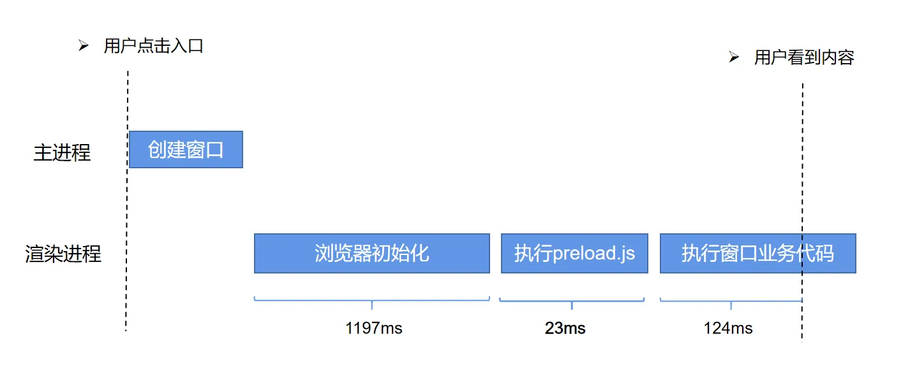

白屏界面还会引发其他的体验问题，比如我们给QQ界面设置了深色模式，这是通过页面CSS来实现的，但是启动阶段页面代码尚未加载，css属性自然也没有应用，在看到皮肤颜色之前，窗口会先闪白，体验很差。

我们固然可以用主进程提供的背景色，作为创建窗口的初始化参数，但假如后续要做复杂图案的皮肤主题，单靠一个颜色属性是不够的。

我们还可以把窗口默认隐藏，等到UI代码加载并设置好CSS属性之后，再展示给用户看。但这会造成用户等待时间变长。表现为操作几秒之后才有窗口弹出，体验也是不佳的。

既然这段时间损耗无法消除，我们很容易想到，能否通过预拉取的方式来提前创建窗口，藏在后台等待激活。为此，我们需要把渲染进程切分成两个阶段。其一是通用阶段，包含各种初始化操作（如vue plugin，页面皮肤css，IPC通信注册），不论我们创建的是搜索窗口还是聊天窗口，这段逻辑都是一致的。其二是业务阶段，根据不同的业务场景，执行不同的内容。

为了实现切分，我们把窗口场景和vue route绑定概念，把差异化的业务逻辑放在不同的Page里，并使用vue router来分发管理。在通用阶段我们执行preload脚本和vue app的创建。在业务阶段，我们切换路由，并渲染特定的Page。

把通用阶段和业务剥离，就能提前执行了。为此我们引入窗口池（WindowPool）的概念。

摘取部分关键代码示例：

```js
class WindowPool {
  private pool: BrowserWindow[] = [];

  private poolSize: IWindowPoolOptions['size'];

  private baseUrl: string;
  
  public constructor(options: IWindowPoolOptions) {
    this.poolSize = options.size;
    this.windowFactory = options.windowFactory;
    this.baseUrl = options.baseUrl ? options.baseUrl : getMainWindowUrl();
  }
  
  // 供外部调用，从窗口池中获取一个缓存窗口，如没有则创建一个新的
  public getWindow(): BrowserWindow {
      const cachedWindow = this.pool.shift() || this.createWindow();
    this.isWindowReady(cachedWindow).then(() => {
    // 前一个窗口创建完毕后，刷新池子，根据池子尺寸创建新的备选窗口（默认size为1）
        while (this.pool.length < this.poolSize) {
      this.pool.push(this.createWindow());
    }
      });
  }
  // 供外部调用，初始化窗口池，可以在合适的空闲时机调用
  public init() {
    const firstWin = this.createWindow();
    this.pool.push(firstWin);
    return this.isWindowReady(firstWin);
  }
  
  private createWindow(): BrowserWindow {
    const win = new BrowserWindow();
    win.loadURL(this.baseUrl);
    this.lifecycle.ready.register(win);
    win.once('ready-to-show', () => {
      this.lifecycle.ready.resolve(win);
    });
    return win;
  }
  
  private isWindowReady(win: BrowserWindow) {
    return this.lifecycle.ready.onResolve(win);
  }
  
  ……
}
```

在第一个窗口（对于QQ来说是登录窗口）弹出之后，立刻初始化窗口池，预拉起窗口并执行通用阶段，在后台等待。

等到需要激活某个业务窗口时，抛一个事件给窗口池里的备选窗口，通过路由切换，把它“变”成特定的业务窗口，并展示到前台。（事件抛接需要借助IPC通信的能力，将在后文叙述）

整体流程变成：

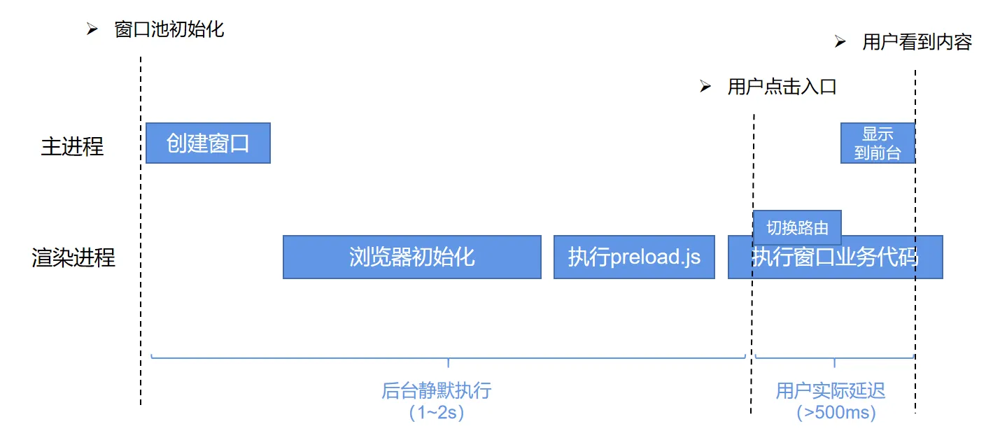

预拉取渲染进程会消耗一定的内存，是一种空间换时间的操作，但可以极大地缩短窗口创建的等待时间，提升体验。根据实验观察，win平台一个空窗口大约在30M左右，而通用阶段的js代码也可以通过打包分片，和业务阶段隔离开，从而减少尺寸。根据QQ和频道实践，窗口池的尺寸设置为1就够用了（因为很少需要同时弹出多个窗口），带来的内存损耗也在可接受的范围。

并且，我们最近的版本还对Electron框架本身进行了一些改造，通过特定参数把渲染进程合并起来，进一步减少渲染进程的内存占用。这部分内容可以期待客户端开发同学的分享。

### 3. 窗口管理WindowManager

尽管有了BaseWindow做基类，但窗口的管理仍旧是冗杂的。举个例子，QQ里有个常见的IM交互，在联系人列表上右键，把当前会画弹出到一个独立窗口（Chat Window）中。

在不同的联系人上右键，可以弹出多个窗口。但对于同一个联系人，多次右键也不会重复弹出，只会把已经弹出的结果拉到前台。

实现这个需求，需要在主窗口UI层去判断和记录一个ChatWindow的列表，用来标识哪个联系人已经被弹出过，但创建操作又是在主进程进行的，需要UI开发也要理解主进程的逻辑，并且在两个进程里同步状态，这显然是很繁琐的。

而且窗口调度的入口散落在各个业务场景里，那么窗口的状态也会散落在不同的UI组件里，难以规范化。

为了简化窗口操作，我们设计了统一的WindowManager和配套的Window API。

业务窗口类在声明时，需要向Manager注册自己的类型，分为三种

单例窗口：全局唯一，如果在不同的入口打开，则在窗口内刷新数据。比如搜索面板，加好友窗口，图片查看窗口，都是这一类。

多例窗口：全局不唯一，每次打开都创建一个新的，比如举报窗口。

多例带Key的窗口：全局不唯一，但有唯一的Key作为标识，Key相同则不重复创建。如上面提到的聊天独立窗口，还有群公告窗口等等。

事实上这三类窗口就可以涵盖大部分桌面应用的场景，实际编码时，我们使用了修饰器语法，只要一行代码就能轻松地声明一个窗口的类型。  

```js
// 把DiscoverWindow（搜索窗口）声明为单例
@singletonWindow(WindowNames.DiscoverWindow)
export default class DiscoverWindow extends BaseWindow {
  ……
}

// 把ChatWindow（独立聊天窗口）声明为多例带key
@multipleWindow(WindowNames.ChatWindow, 'peerUid')
export default class DiscoverWindow extends BaseWindow {
  ……
}
````
WindowManager负责解析装饰器，并且内部维护所有现存窗口实例的列表。而暴露给UI层的Window API，只需要传入窗口名称和Key（可选），即可发起窗口创建，并执行一些操作

```js
const discoverWin = windowManager.getConcreteWindow(WindowNames.DiscoverWindow);
discoverWin.setTop();

const chatWin = windowManager.getConcreteWindow(WindowNames.ChatWindow,{peerUid:xxxx});
chatWin.open()
```
  
对于单例窗口，没有则创建，有则抛送一个通用的事件，改变UI层的启动参数。  

对于多例窗口，如果没有Key则打开新的，如果有Key则比对Key来执行不同的逻辑（打开新的or抛送变更事件）

状态流转如图所示：

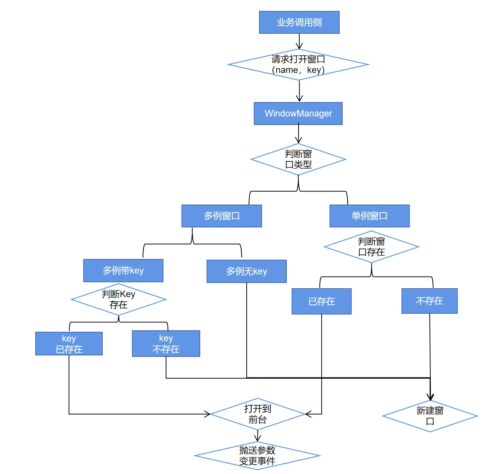

无论哪种情况，最后都会收归为“新建”和“改变参数”两种结果，对窗口开发侧，只需要声明窗口类型，并且在UI入口监听变更事件，做对应的处理。而对于窗口使用侧，无需关注后续细节，只需要通过WindowAPI发起请求即可。

由于使用现有窗口的场景远多于开发一个新窗口，所以这套封装可以降低开发成本。

WindowManager的另一个好处是收归了所有窗口实例，当我们需要遍历的时候，就会很方便。比如统计整个应用内存cpu占用情况的时候，只需要通过WindowManager提供的遍历方法，即可拿到所有窗口实例，逐个进行统计。

```js
windowManager.getAllConcreteWindows().forEach((concreteWindows) => {
    if (!concreteWindows.isDestroyed()) {
      // 统计窗口的cpu和内存占用
    ……
    }
});
```

### 4. 窗口架构总结

BaseWindow、WindowManager、WindowPool三者的引用关系如下。  

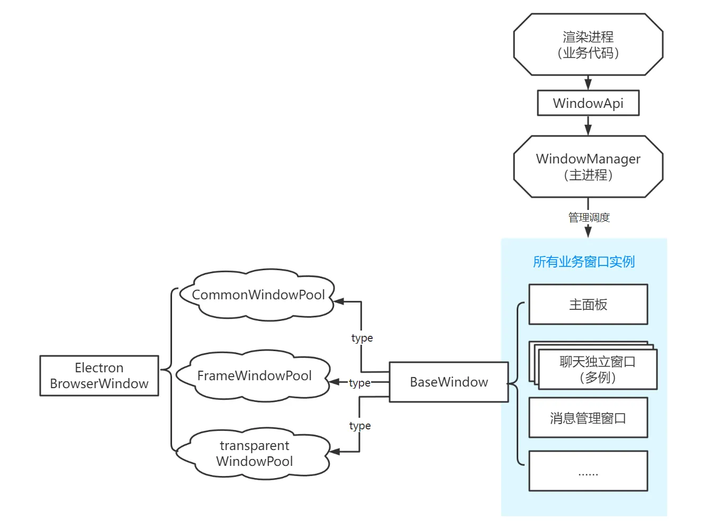

通过这三层概念的封装，把上层业务和Electron底层对象隔离开，可以降低开发者的上手门槛，尽可能收归平台相关的通用逻辑（包括一些框架缺陷导致的迫不得已的hack代码），从而减少bug的发生。  

## 三、IPC通信封装

前面我们几次提到跨进程通信，其中包括了渲染进程向主进程发起请求，也包括了主进程向渲染进程抛送事件。事实上在一个大型桌面系统里，这几乎是绕不开的环节。除了窗口调度之外，很多数据也需要放在主进程管理和共享，很多系统调用也需要发送给主进程来执行。所以，一套完备的跨进程通信封装是很必要的。

Electron提供了两个原生对象来支持跨进程的通信——ipcMain和ipcRenderer

其中ipcRenderer不能够直接在渲染进程上下文使用，而需要通过preload脚本注入。

渲染进程可以通过ipcRenderer.invoke向主进程请求数据，主进程通过ipcMain.handle来处理渲染进程的请求，并返回结果，返回值可以是任何类型，包括promise对象，这个特性对我们是个好消息，我们可以向使用异步http请求一样去使用异步的IPC请求。

同时官方也提供了从主进程向渲染进程抛事件的方法，通过webContents.send发送，通过ipcRenderer.on来监听，这里的细节本文不再赘述，可以参考官方文档。

但原生的封装也有很多不足

- 字符串式的事件名划分  
- 繁冗的语法  
- 参数完全自由，没有跨进程的一致性校验机制  
- 双向不对称，只提供了渲染进程异步主调，没有反向的异步主调。  

事实上，几乎不太可能直接使用原生封装。为了适应复杂的业务场景，我们需要一套更好的上层设计，它最好能具备以下优势：

- 基于类而不是字符串的命名空间  
- 更简洁、更对称的语法  
- 跨进程的语法提示和参数校验  
- 双向主调的能力  
- 窗口对窗口互调的能力

我们选择的工具是Proxy+TS泛型。

这是一个小小的trick，从根本上说，IPC的代码本来就是跨进程的，无法复用同一个实例，也就无法实现真正的同构。但ts语法可以模拟我们想要的对称性。

首先，我们根据业务属性来把API划分成不同的命名空间，如操作系统调用放在OsApi，窗口相关调用放在WindowApi，视频相关调用VideoApi等等，当UI层的功能随着需求迭代而拓展，Api也可以持续拓展。

之后，我们为每个API都提供一个d.ts定义文件，放在两个进程通用的文件夹里，其中包括了对所有可用方法及事件的类型声明，以WindowAPI为例，列举部分关键代码：  

```js
export interface WindowApi extends IPCApi {
  invoker: {
    max(): void;
    unmax(): void;
    min(): void;
    hide(): void;
    show(): void;
    close(): void;
    setTitle(title: string): void;
    setAlwaysOnTop(...args: Parameters<BrowserWindow['setAlwaysOnTop']>): void;
    /**
     * 打开外部窗口
     * @param {WindowNames} name 外部窗口名称（枚举）
     * @param {any} params 开启窗口的场景参数（与窗口具体业务类型有关）
     * @param {any} key 开启多例窗口时，作为唯一标识的key（选填）
     */
    openExternalWindow(windowName: WindowNames, params?: any, key?: string | number): void;
    /**
     * 关闭外部窗口（如正常关闭则返回true，如外部窗口不存在则返回false）
     * @param {WindowNames} name 外部窗口名称（枚举）
     * @param {any} key 关闭多例窗口时，作为唯一标识的key（选填）
     */
    closeExternalWindow(windowName: WindowNames, key?: string | number): boolean;

    /**
     * 设置左边窗口栏是否可见
     * @param visible
     */
    setControlsVisible(visible: boolean): boolean;
  ……
  };

  listener: {
    onShow(): void;
    onHide(): void;
    onBlur(): void;
    onFocus(): void;
    onOpenParamChange(params?: unknown): void;
  ……
  };
}
```
  
同时在两个进程分别定义工厂函数makeInstance，用来创建IPC对象实例。d.ts就可以当做公共的头文件，被两个进程引用。

工厂函数内部，invoke属性实际上是一个Proxy代理，它会读取setTitle属性，并且把他转成一个由webContentsId+namespace+method拼装的字符串，转发给原生的ipcRenderer对象。底层是字符串传输，但上层可以依靠类型约束来得到代码提示和参数校验。

提取部分关键代码（渲染进程）：

```js
// 在渲染进程创建WindowApi
import { WindowApi } from '@shared/types/ipc-apis/windowApi';
const windowApi = makeInstance<WindowApi>(IPCChannelIdentifies.Window);

function makeInstance<ApiShape extends IPCApi>(
  const invoker = {};
  const listener = {};
  const channelName = `ns-${namespace}-${webContentId}`;
  let listenersRecord: Record<string, Map<string, Function>> = {};

  
  // 代理主调请求，转发成底层的ipc invoke方法
  const invokeProxyHandler = {
    get(target: any, prop: any): any {
      const curProp = prop.toString();
      return async (...params: any) => {
        try {
          return await ipcRenderer.invoke(channelName, curProp, ...params);
        } catch (err) {
          logger.error('[IPCClient]error:', namespace, err);
          return Promise.reject(err);
        }
      };
    },
 };
 
 // 代理事件监听，把回调函数加入队列
 const bindProxyHandler = {
    get(target: any, prop: any): any {
      const curProp = prop.toString();
      return (cb: Function): Function => {
        if (listenersRecord[curProp] === undefined) {
          listenersRecord[curProp] = new Map<string, Function>();
        }
        const cbId = uuid();

        listenersRecord[curProp].set(cbId, cb);

        return disposer.bind(this, curProp, cbId);
      };
    },
 };
 
 // 监听主进程抛送的事件，挨个执行回调函数
 ipcRenderer.on(channelName, async (event: any, params: any) => {
      const eventListeners = listenersRecord[params.cmdName];

      const promises = [];

      eventListeners.forEach((listener) => {
        listener.call(null, params.payload);
      });
 });
  
  
 return {
    invoke: new Proxy<any>(invoker, invokeProxyHandler),
    bind: new Proxy<any>(listener, bindProxyHandler),
 };
}

// 在渲染进程使用WindowApi

windowApi.invoke.setTitle({title:'xxx'})。
windowApi.bind.onShow(()=>{
  // 业务处理窗口显示事件的逻辑
  ……
})
```
  
而在主进程，则需要提供对应方法的实现，同样由于泛型的存在，代码实现也要遵守类型约束，一旦两侧不一致，就会报错。在实例内部，这些实现实际上会被代理成事件监听的处理器。

提取部分关键代码（主进程）：

```js
// 在主进程定义Helper提供每个方法的实现
class WindowApiHelper implements IpcApiHelper<WindowApi> {
  public handlers = {
    max(ctx: IpcContext) {
      if (ctx?.winContainer) {
      return ctx?.winContainer?.max();
      }

      return ctx?.win.maximize();
    },
    ……
  }
}

const windowApi = makeInstance(IPCChannelIdentifies.Window, new WindowApiHelper());

public makeInstance<API extends IPCApi>(namespace: IPCChannelIdentifies, helper: any): IPCLinkServerInstance<API> {
    const handler = {};
    const emitter = {};
    const channelName = `ns-${namespace}-${this.win.webContents.id}`;
  
  // 监听渲染进程发来的事件，转发给helper对应的处理器方法，并把发送者win对象的上下文传递给处理器
  ipcMain.handle(channelName, async (event: IpcMainInvokeEvent, eventName: any, ...payload) => {
          if (helper.handlers[eventName]) {
            return await helper.handlers[eventName](
              { ...event, win: this.win, winContainer: this.winContainer },
              ...payload,
            );
          }
        },
    );
  
  // 代理事件抛送器，给渲染进程发送特定的事件
  const emitterHandler = {
      win: this.win,
      get(target: any, prop: any): any {
        const curProp = prop.toString();
        return (payload: any) => {
          try {
              return this.win.webContents.send(channelName, { cmdName: curProp, payload });
            }
          } catch (err: any) {
            
          }
        };
      },
    };
  const instance = {
      emitter: new Proxy<any>(emitter, emitterHandler)
   };
}

// 在主进程使用windowApi向渲染进程抛事件
windowApi.emitter.onShow()
```

整体流程如图所示：

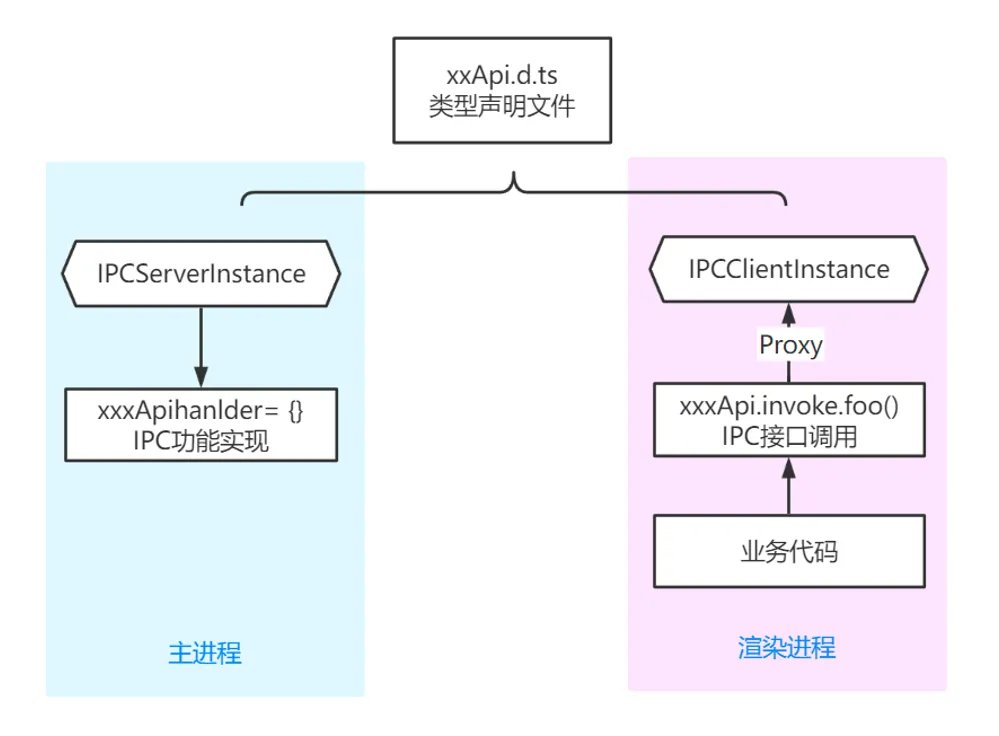

实际项目中，我们还做了更多的优化，比如渲染进程要处理事件的注销，以及在主进程维护某个窗口注册过的所有事件列表，不抛送未被监听的冗余事件，这些都是为了减少不必要的IPC通信，降低通信频率来获取更好的性能。具体的实现也封装在Proxy内部，此处不再赘述。

为了管理所有窗口的IPC通道，我们设计了IPCManager模块，它和BaseWindow协作，在窗口池创建的通用阶段就把现有的服务注册好，以供渲染进程随时调用。

d.ts在编译构建之后就会蒸发掉，不影响最终的执行，但在开发阶段，特别是多人并行开发的场景下，是很有用的。由于IPC通信过于底层，经常引发一些疑难杂症的bug，这套体系可以帮助我们及时发现问题，并且通过自动化检查工具来找出对公共模块的不规范修改。

那么如何实现反向通信呢？我们进一步抽象出了IPCPeer，并在内部通过维护一套自增的callbackid（类似于jsonp的写法）来把注册和监听转换成调用，从而实现主进程对渲染进程的异步主调。

如何实现窗口对窗口的主调？也和上面的方式类似，只不过主进程还要维护双方的webContentsId，通过转发来建立“虚拟通道”。

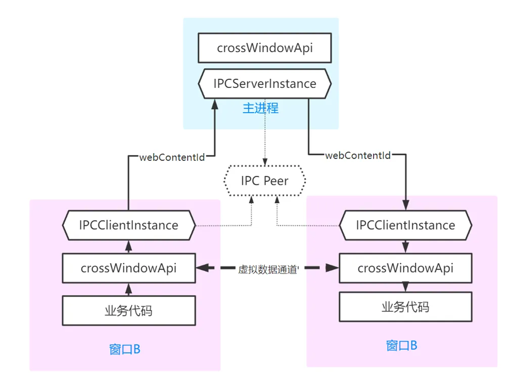

callbackId和转发都是较为常规的做法，这里就不再展开细节。

除去NT模块之外，QQ和频道目前有十余类api，数百个方法和事件，在各自划定的命名空间里工作，极大地拓展了渲染进程的业务能力。

所谓NT模块，是QQ和频道的一个特色架构，由于IM和后台的实时通信量大，并且需要维护本地的资源文件和db文件，所以我们把大部分消息相关的功能放在一个c++实现的模块里，并且和移动端完全同构，以node addon的方式引入项目。这样做的优势是获得更高的通信和数据处理效率，并且方便跨窗口共享数据，但劣势是引入了极为频繁的IPC通信。

针对大IPC通信量的IM业务场景，有必要通过一些手段来优化信道的效率，避免冗余的事件影响整体体验。

这里我们也做了很多尝试，包括主调方法的分流，以及事件监听的动态注册队列等等，详情可以参见我之前的文章：

[【QQ频道桌面版】基于Electron的复杂工程项目的性能优化实践](https://km.woa.com/group/52128/articles/show/510808) 

综合上述方案，整体nodejs主进程的架构如图所示

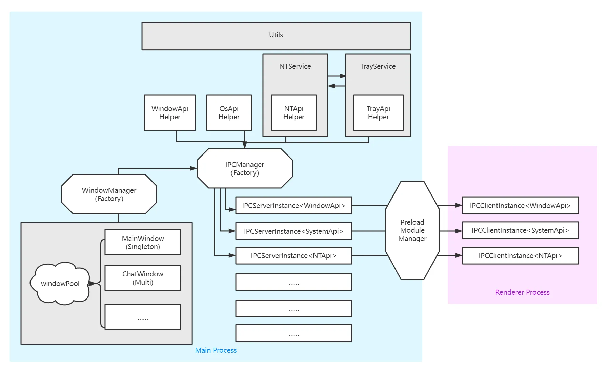

WindowManager作为窗口调度的核心，维护所有业务窗口，而业务窗口都继承自BaseWindow，并从预创建的WindowPool中获取。窗口创建时，由IPCManager提前注册IPC通道，以便业务使用。而每个用作IPC的模块，都可以抽象成一个服务（service）

封装层级既不会太深，概念不会太多，又能够满足现阶段上层业务调用的需求。

## 四、调试开发环境搭建

基于上述架构，我们的项目目录大致划分如下

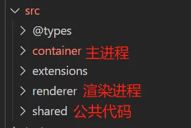

在构建开发时，也不同于一般的web项目，需要启动多个进程，并唤起Electron的可执行程序（外壳）

同时，由于QQ和频道内存在大量音视频功能，依赖一些二进制node文件，以及dll、dylib文件，这些是不能被webpack识别的，需要我们手动放置在运行目录里。

为了方便调试开发，我们使用gulp来管理构建任务。构建大致分为三个阶段

  1. 准备阶段：检查依赖，复制二进制文件
  2. 编译阶段：分别编译渲染进程，preload脚本，主进程的代码
  3. 框架阶段：唤起Electron可执行文件并加载编译后的产物运行

其中准备阶段的脚本和业务强相关，需要手动编写脚本完成。  
编译阶段则并行启动多个webpack进程执行编译，并监听对应的目录。  
框架阶段，可以借助Electron官方提供的Electron-builder，配合配置文件来完成（详细的配置方式可以查阅文档）

注意，需要把主进程编译的目录配置成加载入口。  

```js
// 给webpack使用的配置
export const nodeConfig: Configuration = merge(baseConfig, {
  entry: {
    index: path.resolve(ContainerPath.DESKTOP, './index.ts'),
  },
  output: {
    filename: 'background.js',
    path: path.resolve(PACKAGE_ROOT, './dist'),
  },
  ……
}
// 给electron-builder使用的配置
module.exports = {
  ……
  productName: PROJECT_NAME,
  copyright: `Copyright (C) 1999-${new Date().getFullYear()} Tencent. All Rights Reserved`,
  directories: {
    app: 'dist',
    // 输出文件夹
    output: 'dist_electron',
  },
  ……
}
```

而在主进程的窗口代码里，需要区分是开发环境还是生产环境，加载不同的对象。生产环境直接加载构建产物（注册私有协议），开发环境则加载渲染进程devserver的localhost地址（http协议）  

```js
// 导出给WindowPool使用
export const getMainWindowUrl = () => {
  return process.env.NODE_ENV !== 'production' ? `${process.env.WEBPACK_DEV_SERVER_URL}` : 'app://./index.html';
};
```

可以发现，每次调试构建，流程都是很长的，所以很需要热重载的能力来提升开发效率。

渲染进程热重载比较简单，因为每个窗口的都是一个独立的浏览器，可以依赖标准的devserver的热重载功机制，不过由于preload脚本是单独编译的，所以需要监听window对象的domreload事件，做一些清理和重置工作（通常是指清理IPC通道和动态订阅名单，避免重复注册）

主进程热重载要绕一些，首先webpack配置监听源码目录，再使用nodemon来监听编译输出目录的文件

```
nodemon --exec electron --inspect ./dist/
```

不过窗口的状态都保存在主进程，在热重载时会丢失，所以每次重载之后，窗口也会被重置，调试体验稍差一些。

## 五、安全性

桌面应用面临的安全问题比网页更加复杂，也需要我们额外地关注。QQ和频道项目主要做了以下几点：

**1. 关闭窗口的node集成**  

在创建BrowserWindow时，将nodeIntergration属性设置为false，可以避免浏览器直接使用node api，从而引发风险。所有和系统相关的操作，都应该通过IPC通道来下发给主进程。

**2. 增强IPC请求的校验**  

由于所有的IPC请求都要经过IPCRenderer对象发送到主进程，而IPCRenderer又是经preload上下文暴露给dom上下文的，所以可以在这一层对请求做合法性校验，保证上层只能够调用到我们允许的内容。

同时对于涉及系统操作api（如openShell等等），还应该在执行前校验输入参数的合法性（如文件格式），避免意外的注入风险。

**3. 生产环境使用安全的协议**

对于本地编译的渲染进程代码，在主进程注册私有协议加载，可以防止嗅探抓包。  
对于第三方嵌入的业务（如嵌入QQ的小世界业务等等），使用更安全的https协议加载。

**4. 代码加密**

由于js是脚本语言，即便经过压缩混淆，也具备一定的可读性。而且涉及到IPC通信的调用，以及对c++模块的调用，相关的事件名和参数无法在编译混淆中蒸发，一旦被黑产逆向解析，也会造成一定安全风险。

所以在我们定制的electron版本中，初步实现了代码的字节码加密功能，将关键代码压缩为字节码文件，js文件仅保留无语义的入口。

详细压缩的方案，可以期待客户端同学的分享。

## 六、总结

本文以新版QQ和频道为样本，探讨了大型Electron项目的架构设计实践，其中一部分内容虽然是基于我们的项目设计，但也具备通用性，所以在这里梳理沉淀，希望能够对同样探索桌面技术的前端小伙伴有所启发。
