<!--BEGIN_DATA
{
    "create_date": "2023-06-18 17:34", 
    "modify_date": "2023-06-18 17:34", 
    "is_top": "0", 
    "summary": "QQ NT的跨平台重构之旅 - IPC通信设计<br/>QQ NT的跨平台重构之旅 - 小头像，大讲究", 
    "tags": "Web", 
    "file_name": "QQ NT的跨平台重构之旅2.md"
}
END_DATA-->

#### <p>原文出处：<a href='https://km.woa.com/knowledge/7516/node/4' target='blank'>QQ NT的跨平台重构之旅 - IPC通信设计</a></p>

## 一.项目背景

PC 频道是使用 electron +vue 搭建的桌面应用程序。**electron进程分为渲染进程和主进程，一个主进程对应多个渲染进程。进程间通信通常分为两类，主调和被调。在主进程和渲染进程可以分别使用 electron 提供的 ipcMain 和 ipcRender 模块，注册对应的 invoke 和 handle 方法，就可以进行双向通信。**其中，invoke表示主调，即主进程可以发送请求主动调用渲染进程的方法；handle 表示被调，即主进程可以接收渲染进程的调用通知。同样，渲染进程也拥有这种能力。

**渲染进程和主进程通信原理如下所示：**

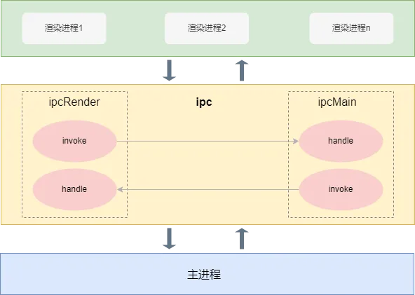

**由于 electron 提供的原生能力比较有限，而且在 PC 频道项目搭建前，移动端频道已经搭建完成，存在现成的用 c++ 编写的模块可以使用，再加上 c++ 维护本地文件更快，对于多线程处理更方便，node 在这方面的处理能力稍显麻烦。因此，PC 频道没有像传统的 web 程序直接与后台进行通信，而是增加一个中间层，中间层由 c++ 编写，负责与后台通信，并将结果返回给上层。**node 提供了一种调用 c++ 写的库的方式，叫 addon。由客户端同学提供 c++ wrapper，并暴露相关 api 给 node 使用。主进程与 addon 进行通信，addon 去做一些系统能力以及与后台通信。

主进程与 addon 的通信也分为两类，当主进程主调时，可以调用 addon wrapper 对应 service 下面的方法，该方法由 addon 实现，提供相应能力，返回操作结果；当 addon 有变更需要 push 给主进程时，也会调用对应 service 下面的方法，该方法是主进程提前通过 addon 提供的 addListener 方法注册的 listener，上层可以在该 listener 中写入具体的实现，比如将事件和调用参数广播出去。

**主进程和 addon 通信原理如下所示：**

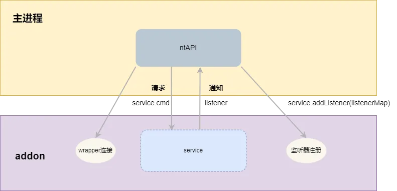

频道项目有多个窗口，每个窗口都是一个渲染进程，只有一个主进程，渲染进程和主进程间通过 ipc 通道进行通信。可以创建多个 ipc 通道负责不同的功能，比如 fsApi 负责文件相关功能，windowApi 负责窗口相关功能，ntApi 负责数据获取和变更监听相关功能。主进程不是直接与后台通过 http 交换数据，主进程与 addon 进行通信，addon 与后台通信，处理维护数据。

**项目整体的通信模型如下所示：**

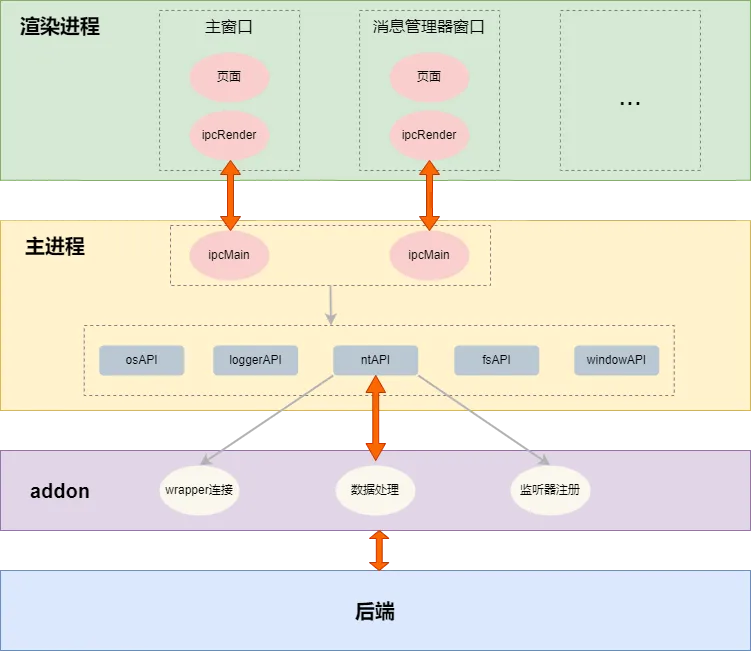

可以看到，通信模型搭建主要涉及两条路径：1.渲染进程和主进程的双向通信；2.主进程与 addon 的双向通信。

现阶段频道需要被嵌入 qq 中，作为一个独立的进程启动，同时需要关注 qq 的状态，与 qq 进行交互。目前 pcqq 改版项目正在进行中，新版 qq 采用和频道类似的技术栈，也是 electron+vue 搭建的桌面应用程序。由于新版 qq 和旧版 qq 会同时存在一段时间，频道需要做好与新旧 qq 的融合和兼容。

接下来将分两部分进行介绍：通信模型的搭建；频道与新旧 qq 的融合。

## 二.渲染进程和主进程的双向通信

渲染进程和主进程通过 ipc 通道进行通信。每个窗口就是一个渲染进程，ipc 通道应该是和窗口强绑定的，而不是杂乱无章的。因此，在初始化窗口时给窗口创建 ipc 通道，绑定 ipcMain 和 ipcRender 的 handle 方法。也可以根据不同的功能给窗口创建多个 ipc 通道，不同的 ipc 通道使用模块名和 webContendId 命名，其中 webContentId 是主进程创建窗口时得到的，渲染进程独一无二的标识，主进程将该变量暴露给渲染层使用。

设计之初（以下统称为旧版通信模型）实现了一对 ipc 管理器，管理器在创建时会绑定 ipcMain 和 ipcRender 的 handle 方法，暴露invoke、on、off 方法给上层使用，上层通过类 eventBus 的方式触发、监听、注销事件。主进程的管理器内部并没有具体实现 handle 方法，而是交由业务自身定义类来实现。虽然定义了一对主进程和渲染进程的管理器，但管理器全部放在了主进程，暴露全局变量给渲染层使用。渲染进程还需要另外实现 ipc 通道的 invoke、on、off 方法。旧版通信模型定义了一个名为 gproApi 的 ipc 通道负责数据处理，渲染层通过 gproApi.invoke 和 gproApi.on 分别触发和监听主进程的事件。以消息模块为例，消息的发送如下所示：

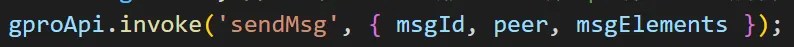

消息的接收如下所示：

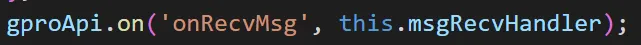

可以看到，该模型结构相对简单，方便快速搭建。但随着项目越来越大，该模型的弊端也慢慢显现出来，主要体现为以下几点：

**1.参数没有类型校验：方法的参数是由开发者手动定义和传入，容易出错；参数没有类型校验，出错时比较难排查到问题。**

**2.方法调用没有代码提示和类型检查：渲染层通过类 eventBus 的方式调用主进程方法，没有代码提示和类型检查。**

**3.每新增一个 ipc 通道，渲染进程需要将 invoke、on、off 方法都手动调用一遍；主进程都需要实现自定义的 invoke 方法，存在冗余。**

导致上述问题的原因有两个：使用了类 eventBus 方法实现主调和被调，不容易实现 ts 类型校验；管理器内部实现没有高内聚。为了解决上述问题，新版通信模型应运而生。

新版通信模型也定义了一对 ipc 通道管理器，新管理器在主进程和渲染进程都存在一份。管理器提供 makeInstance 方法给上层创建 ipc 通道实例，窗口初始化时创建主进程 ipc 通道实例，页面在引入 api 时创建渲染进程的 ipc 通道实例。上层通过调用通道实例的 invoke 和 bind 方法实现主调和被调。makeInstance 方法支持传递 ipc 通道方法的定义，同时也指定了方法的返回类型。通过 ts 类型定义实现了参数校验和代码提示。如下所示：

```js
function makeInstance<ApiShape extends IPCApi>(
  namespace: string,
  options?: MakeInstanceOptions,
): IPCLinkClientInstance<ApiShape> {
……
}

interface IPCLinkClientInstance<API extends IPCApi> {
  invoke: API['invoker'];
  bind: { [K in keyof API['listener']]: (cb: API['listener'][K]) => unbindFn };
}

type IPCApiInvoker = Record<string, (...args: any) => any>;

type IPCApiListener = Record<string, (...args: any) => any>;

interface IPCApi {
  invoker: IPCApiInvoker;
  listener: IPCApiListener;
}
```

新管理器内部高内聚，将 handle 方法和 invoke 方法的处理都内聚在了管理器内部，上层不用再额外实现一次。渲染进程主调时，会执行 ipcRender.invoke，主进程 handle 请求后，会调用主进程创建 ipc 实例时传入的 helper 对应的方法，该 helper 是规定形状的类，类的属性 handlers 对象包含该 ipc 的所有 invoke 方法的实现定义；使用 bind 被调时，会通知主进程注册事件，并将 callback 放入到被调列表中。主进程主调时，会执行 ipcMain.invoke，渲染进程 handle 请求后，会取出对应事件的回调列表并执行。原理如下所示：

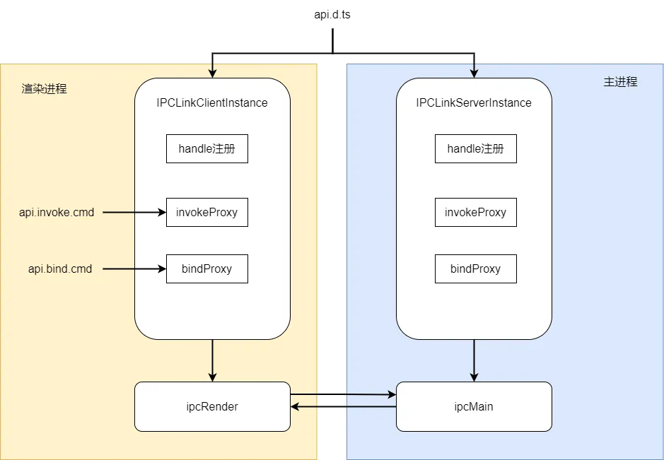

**ntApi 是特殊的 ipc 通道，负责数据处理，与 addon 进行通信。由于 addon 的方法有命名空间，如果使用一般 ipc 通道的调用方法，则变为 ntApi.invoke.service.cmd 和 ntApi.bind.service.cmd，调用方式显得繁琐。而且还需要另外在 invokeProxy 和 bindProxy 中针对 ntApi 特殊处理。很明显，这样做是没有必要的，ipc 通道管理器的出现是为了统一封装处理，降低上层理解和调用难度，增加 ts 类型校验和代码提示，提高代码健壮性。对于这种特殊的 api，可以再额外加一层处理，满足上述条件即可。**ntApi 的设计将在下一部分统一讲解。

## 三.主进程和 addon 的双向通信

从上面的介绍中可以看到，主进程通过 wrapper.Service.cmd 调用 addon 底层方法，通过 wrapper.Service.addListener(listenerMap) 将 listener 注册给 addon 调用。因此，只要在主进程中分别实现对应的 invoke 方法和 listener 方法，在 invoke 中调用 addon 方法，在 listener 中将事件广播出去，就可以实现与 addon 的通信。

旧版通信模型在主进程分别定义了 invoker 和 listener 文件，文件导出了对象，包含 service 和下面所有方法的定义与实现。

invoker 文件如下所示：

```js
const MessageApi = {
   // 发送消息
  async sendMsg({ msgId, peer, msgElements }) {
    const result = await wrapper?.getMsgService()?.sendMsg(msgId, peer, msgElements);
    return result;
  },
  // 取消发送消息
  cancelSendMsg({ peer, msgId }) {
    return wrapper?.getMsgService()?.cancelSendMsg(peer, msgId);
  },
……
}

export const sdkInvoker = {
  ...Api,
  ...StorageApi,
  ...MessageApi,
……
}
```

listener 文件如下所示：


```js
class GProSdkListenerImpl {
  constructor() {
    this.msgListenerImp = new MsgListenerImp(this);
……
  }

  /** 供外部监听某个事件 */
  addEventListener(callback: ListenerCallback) {
……
  }

  /** 移除监听器 */
  removeEventListener(callback: ListenerCallback) {
……
  }

  triggerEvent(eventName, payload) {
……
  }
}

class MsgListenerImp {
  mainImp;
  constructor(mainImp) {
    this.mainImp = mainImp;
  }
  /** 收到消息通知 */
  onRecvMsg(msgList) {
    this.mainImp.triggerEvent('onRecvMsg', { msgList });
  }
  /** 收到系统消息 */
  onRecvSysMsg(msgBuf) {}
……
}

export const sdkListener = new GProSdkListenerImpl();
```

上面的代码中展示了消息模块的主调和被调，主进程主调方法很好理解，直接调用了 addon 对应的方法。被调方法在收到 addon 的调用后，会调用triggerEvent 方法，该方法会在动态收集的回调 map 中，取出对应方法名的回调列表，执行回调列表方法。

与渲染进程调用 addon 的方式不同，主进程并没有定义同样的 gproApi 通道，当主调时，需要开发者手动调用 invoker 文件中对应的 cmd；当被调时，需要开发者手动调用 listener 文件中对应的 addListener 方法，将回调函数加入进去。

可以看到，除了前面提到过的旧版通信模型的通病——没有类型校验和代码提示外，旧版通信模型还存在以下几个问题：

**1.冗余定义：每新增一个方法（无论是主调还是被调），都需要开发者手动将实现写一遍，即使里面并没有进行业务逻辑拓展，也需要手动调用 addon 或者 将事件广播出去，过于繁琐。**

**2.主进程和渲染进程调用方式不一致：主进程调用 addon 的方法，需要使用一套和渲染层不同的方式，开发者要手动去调用 invoker 文件和 listener 文件对应的方法。**

**为了解决冗余定义的问题，考虑使用自动脚本生成方法实现，实现中仅包含通用逻辑部分，调用 addon 或者转发 addon 事件。这样做虽然不用再人工手动增加定义，但是自动生成所有方法的实现，存在冗余，且这部分代码在编译构建后也不会被蒸发掉，会占用内存。由于方法的实现一般都是通用逻辑，只要将出口收归到一处统一处理，就不需要定义所有方法的实现。**

因为 addon 的方法有命名空间，主调方法命名空间通常以 Service 结尾，被调方法命名空间通常以 Listener 结尾，因此可以直接根据命名空间判断方法类型。**新版通信模型中，用 api.Service.cmd 代替了老版模型中的 gproApi.invoke(method) 方法，用 api.Listener.cmd 代替了老版模型中的 gproApi.on(method)方法，且渲染进程和主进程可以使用同一套方式。**

为了解决主进程和渲染进程调用方式不一致的问题，在主进程和渲染进程实现了一套对应的 api。该套 api 使用了代理拦截的方式，通过层层 proxy 拦截，可以将 api 的入口和出口都收归到一处，结构简单明了，且方便带上类型定义。渲染进程主调，最终都会走到 ipcRender.invoke，向主进程发消息。主进程主调，最终都会走到 wrapper.service.cmd，调用底层 addon 对应的方法；渲染进程被调，最终都会走到 ipcRender.handle，监听主进程的消息。主进程被调，最终都会走到绑定事件监听器 eventBus.on，等待之前提供给底层 addon 的 listener 被触发，该 listener 会执行 eventBus.emit，将回调函数触发并传入参数。原理如下所示：

渲染进程：


主进程：

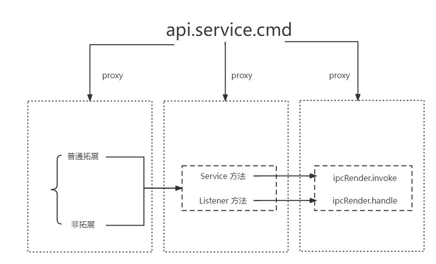

经过上述改造，开发者在调用 addon 时不用再区分调用环境，也不用再手动额外实现一遍接口调用。

除了写法的统一外，为了保证代码的可靠性，增强代码的可编写性，新版通信模型利用 typescript 增加了代码提示和参数校验功能。ts 是 js 的类型化超集，可以在静态时就确定变量类型，方便提前发现错误，静态类型检查或编译时发现问题，不用等到运行。而且可以通过类型定义，结合 vscode 可以方便实现代码提示功能。而且类型定义会在代码编译构建后会蒸发掉，不用担心占用内存。

**为了实现代码提示与参数校验，首先需要得到 api 下面所有的 service，以及 service 下面所有 cmd 的定义，并将这些处理为interface 来定义 api 的返回类型。** 实际上，addon 提供了 service 和下面 cmd 的类型定义文件，该定义文件结构如下所示：

```js
export class NodeIKernelGuildService
{
    addKernelGuildListener(listener: NodeIKernelGuildListener);
    removeKernelGuildListener(listener: NodeIKernelGuildListener);
    initGuildAndChannelListWithId(): Promise<{guildList: Array<GProGuild>, guildInitList: Array<GProGuildInit>, guildSortList: GProGuildListSortInfo, cookie: String}>;
    refreshGuildList(isForce: boolean);
}

export class NodeIKernelGuildListener
{
……
}
```

可以看到，该文件中已经包含了对应的定义，只需要包裹一层转换为我们需要的形式，就可以用于 api 的定义。如下所示：

```js
export class NodeIKernelGuildService
{
    addKernelGuildListener(listener: NodeIKernelGuildListener);
    removeKernelGuildListener(listener: NodeIKernelGuildListener);
    initGuildAndChannelListWithId(): Promise<{guildList: Array<GProGuild>, guildInitList: Array<GProGuildInit>, guildSortList: GProGuildListSortInfo, cookie: String}>;
    refreshGuildList(isForce: boolean);
}

export class NodeIKernelGuildListener
{
……
}

export interface api{
  nodeIKernelGuildService: NodeIKernelGuildService,
  nodeIKernelGuildListener:NodeIKernelGuildListener
  ……
}
```

**由于 addon 提供的定义文件是采取参数平铺的方式，平铺参数对调用是不太友好的，需要记忆位置，很容易传错。因此，我们可以多处理一层，将参数转换为前端熟悉的对象形式。除此之外，还可以增加自定义参数 optionalConfig，主要用于一些额外的拓展，比如定义请求超时时间、上报参数携带等。然后在主进程做相应处理，这样就可以实现既可以拓展功能又可以不改变原有的接口形状。**处理后的方法定义如下所示：

```js
export interface NodeIKernelGuildService {
  refreshGuildList(params: { isForce: boolean }, optionalConfig?: OptionalConfigType): Promise<unknown>;
  refreshGuildInfo(
    params: { guildId: string; isForce: boolean; sourceType: number },
    optionalConfig?: OptionalConfigType,
  ): Promise<unknown>;
……
}
```

其中 OptionalConfigType 是上层自己定义的可选参数类型。这些定义文件的生成都可以通过自动化脚本实现。

对于一些特殊需求，单纯的统一处理逻辑可能无法满足，需要对接口进行拓展。比如未读计数模块，addon 可能会向上层 push 很多的 update 事件，但有些 update 类型，比如频道总未读计数的变化，对于上层来说是不需要关心的，可以屏蔽。尤其是在频道启动之初，抛的冗余 update 事件过多会导致主进程和渲染进程的 ipc 通信通道阻塞，影响其他关键事件的请求，适当拓展 addon 逻辑是很有必要的。

由于新版通信模型全部将出口逻辑收归到一处，不用自己手动再去实现主调和被调方法，对于逻辑的拓展不能像旧版通信模型那样直接加在对应的方法中。需要拦截 api 的第一层调用，判断如果是拓展方法，则调用拓展方法，否则继续调用 addon。因为加入了拓展方法，拓展方法也需要 ts 校验，因此需要对 api 的定义进行拓展。以渲染层为例，最开始渲染层的 api 设计如下所示：

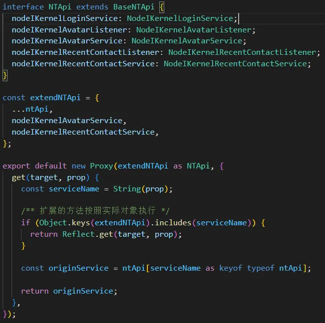

文件目录如下所示：

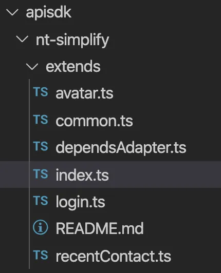

其中，只有 extends/avatar 文件中有实际的拓展逻辑。

可以看到，该 api 的定义有点晦涩难懂，非该 api 的开发者一般比较难理解。既有 extendNTApi，又有 interface NTApi，两者的定义不太一致，往往 interface NTApi中有许多方法都是渲染层没有进行过拓展的。为什么要做看起来冗余繁杂的操作呢？实际上，extendNTApi 才是渲染层拓展的接口，interface NTApi 中许多方法都是主进程进行过拓展的，渲染层需要调用，所以需要重新定义，这样渲染层进行调用时才会有 ts 校验。

**这种设计的缺点很明显，主进程拓展和渲染层拓展定义耦合在一起，开发者仅仅是想在渲染层调用一个拓展接口，还需要去额外关注主进程是否有对该接口进行拓展，如果有，还需要将定义复制到渲染进程中，增加了冗余定义和开发者的理解成本。除了冗余定义外，这种设计还存在冗余实现的问题**，以 nodeIKernelRecnerContactService 为例，渲染层的实现如下所示：

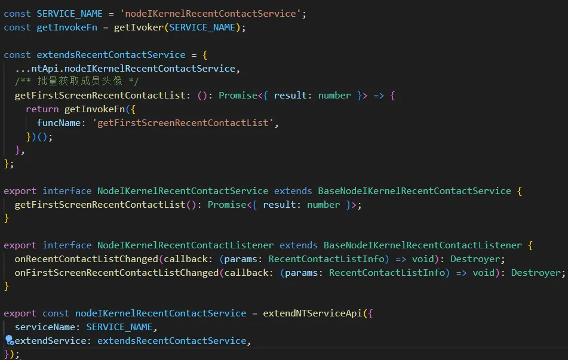

可以看到，渲染层仅仅是加了垫片，对方法进行了转发（底层调用了 ipcRender.invoke），并没有具体的实现，具体的实现在主进程中进行。

为了解决上述问题，考虑在公共文件夹中定义一对主进程和渲染进程的拓展接口的类型定义，在哪端实现的拓展方法就将定义写在哪端的定义文件中。考虑到 addon 方法调用路径是：渲染进程——> 主进程 ——> addon，渲染进程的调用域大于主进程的，因此定义主进程拓展接口定义 ntExtendsServer extends BaseNTApi，渲染进程拓展接口定义 ntExtendClient extends ntExtendsServer。这样无论是哪方的拓展，只要将定义写到对应端的文件中即可。

改造后的渲染层 api 设计如下：

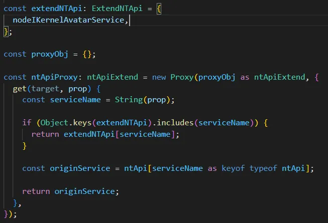

渲染层拓展接口定义文件 ntExtendClient 如下：

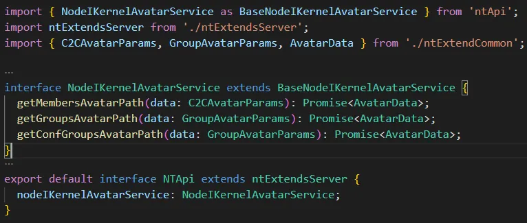

主进程拓展接口定义文件 ntExtendServer 如下：

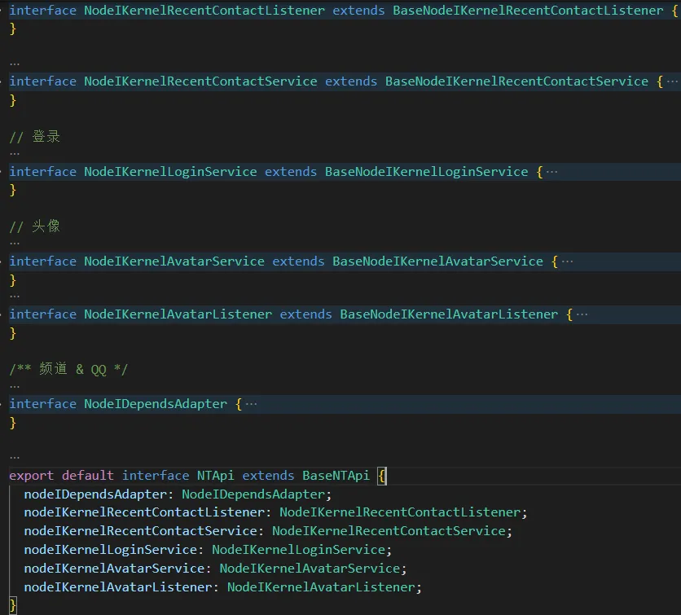

文件目录如下所示：

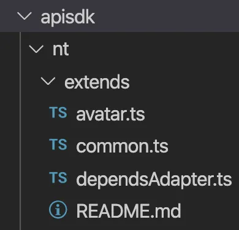

可以看到，只有渲染层实际拓展的 api 才需要写入 extendNTApi 中，渲染层不用再新增文件实现主进程拓展方法的定义和垫片，这样去除了冗余定义和冗余实现，大大降低了开发理解成本，增加了开发效率。

从前面的介绍中可以看到，调用 addon 进行 proxy 拦截时，需要区分是主调方法还是被调方法，这样才能找到出口。大多数情况下 addon 提供的service 命名区别了这两种场景，如果是主调方法，则以 Service 结尾，如果是被调方法，则以 Listener 结尾。但是，存在特别的service是任意命名，命名空间下可能既有主调方法也有被调方法，无法区分方法类型。为了实现上层调用特殊 service 的方法也能像调用普通service 的方法一样，需要对特殊 service 进行拓展。最开始的设计需要人为加上垫片，对方法进行转发。如下所示：

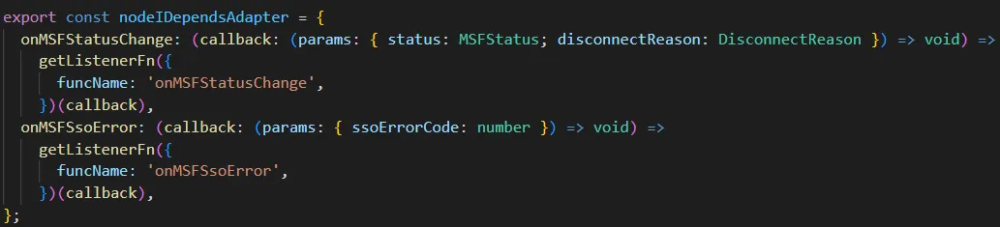

实际上，对于这种特殊 service，往往渲染层只是调用，不涉及具体实现，也不建议在渲染层拓展具体实现。之所以需要对特殊 service 进行拓展，是因为渲染层向主进程转发请求时，无法判断是主调方法还是被调方法。因此，只要能判断方法类型，根据类型进行转发，不用再额外新增文件加上转发垫片。

在原来的 extendNTApi 的基础上，分化出 baseExtendNTApi 和 specialExtendApi ，分别表示普通拓展和特殊拓展。特殊拓展也是采用层层 proxy 拦截的方式，根据开发者提供的定义文件，区分是主调方法还是被调方法。

改造后 api 定义如下所示：

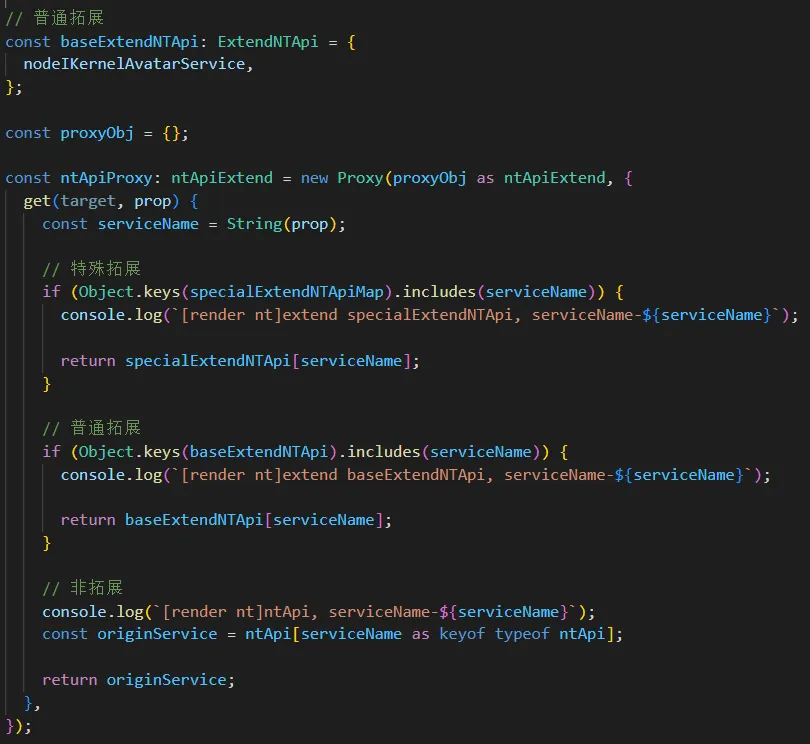

其中 specialExtendNTApiMap 定义如下：

```js
export const specialExtendNTApiMap: specialExtendNTApiMapInterface = {
  nodeIDependsAdapter: {
    onMSFStatusChange: methodTypeEnum.LISTEN,
    onMSFSsoError: methodTypeEnum.LISTEN,
  },
……
};
```

改造后的文件目录如下所示：

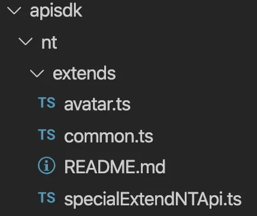

改造后开发者仅仅需要在 specialExtendNTApiMap 中定义特殊 service 下需要拓展方法的类型，就可以实现渲染层对特殊 service 方法的调用，而不用再去理解该 api 的垫片逻辑。除了在渲染层需要实际拓展接口逻辑，需要新增文件外，其余情况一概不需要再手动新增文件实现方法的转发。

原理如下所示：

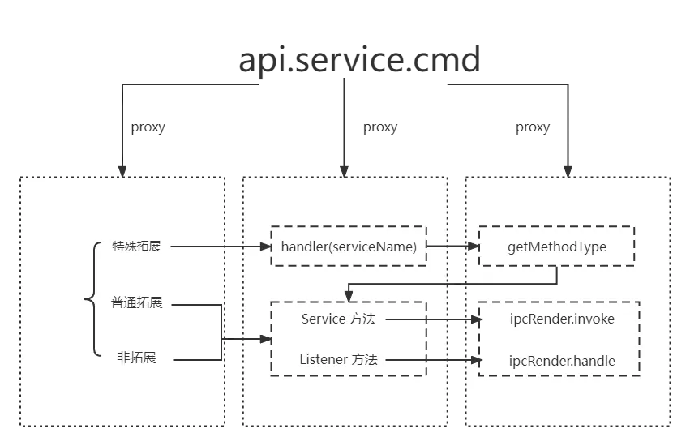

## 三.频道和新版 qq 的融合

老版 qq 是 native 应用，频道是 electron 应用，两者进程独立。如下所示：

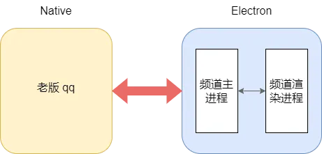

老版 qq 中频道作为独立的 electron 应用启动，和老版 qq 通过 nt 进行通信。

新版 qq 和频道一样，都是 electron 应用，如下所示：

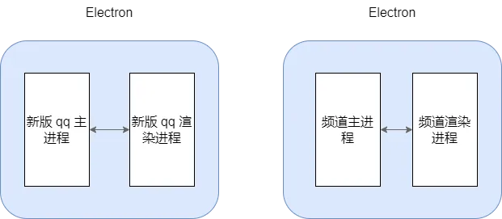

如果在新版 qq 中将频道作为单独的 electron 应用启动，可能需要额外做很多复杂的操作，而且新版 qq 和频道的主进程有许多相同逻辑，搭建两个独立的 electron 应用是没有必要的。再者从长远考虑来看，之后可能存在其他功能加入 qq，比如小世界、空间等。如果能将主进程统一成一个，做为通用底座，统一提供 jsApi 给上层调用，这样可以轻松实现功能的插拔，而不会使 qq 变得笨重。

**不管宿主环境如何，频道渲染层逻辑都是一致的，只是可能存在加载方式的不同。因此，如果将新版 qq 和频道的主进程统一成一个，新版 qq 和频道都使用通用主进程。老版 qq 加载频道方式不用变，新版 qq 中将频道当作窗口加载，频道的渲染进程入口为窗口的加载入口，那么就可以实现既能在新版 qq 中打开频道，也可以让频道继续在老版 qq 中运行。**融合后的架构如下所示：

旧版 qq 和频道：

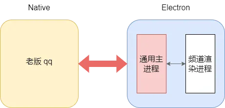

新版 qq 和频道：

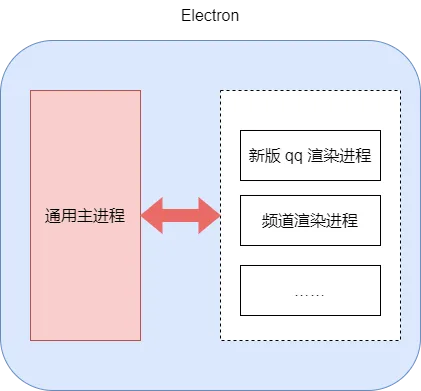

频道和新旧 qq 的融合有许多需要适配的地方，接下来将会逐一讲解。

### 1.频道与 addon 通信通道的搭建

#### （1）老版 qq 和频道

老版 qq 中，频道与 addon 的通信通道的搭建由频道独立完成，频道作为独立的 electron 进程启动。

#### （2）新版 qq 和频道

新版 qq 中，频道与 addon 的通信通道的搭建由新版 qq 完成，频道只是作为附属窗口启动。

通信通道搭建主体不同造成了一些差异，考虑将公共逻辑抽离成公共类，新版 qq 和频道各自继承后实现异化部分，再在外层出口中，将提供给外部使用的逻辑暴露出来。这样异化由内部抹平，外部不用理解，可以直接使用。文件结构如下所示：

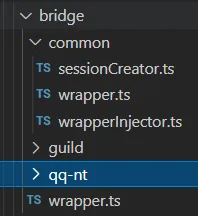

bridge为通信通道文件夹，bridge/wrapper为主入口，提供外部需要使用的逻辑，比如开启 wrapper 连接，注册监听器，获取 wrapper 实例等，根据当前宿主环境调用对应宿主的方法；bridge/common 为公共实现，包括注册 addon 业务监听器，开启 wrapper 连接等；bridge/guild 和 bridge/qq-nt 为频道和新版 qq 的异化实现，包括提供连接参数，提供注册业务监听器 map 等。

### 2.频道的初始化时序

#### （1）老版 qq 和频道

**展示频道 tab 的时机由 addon 控制。qq 启动后，addon 会去拉取用户的频道配置，当存在频道入口时，会先拉起频道的主进程，频道主进程会建立与 addon 的通信通道。为了加快用户打开频道的速度，频道主进程会创建窗口池，且预加载主窗口的渲染进程。等频道的初始化操作完成后，会通知 addon 展示频道 tab。**时序如下所示：

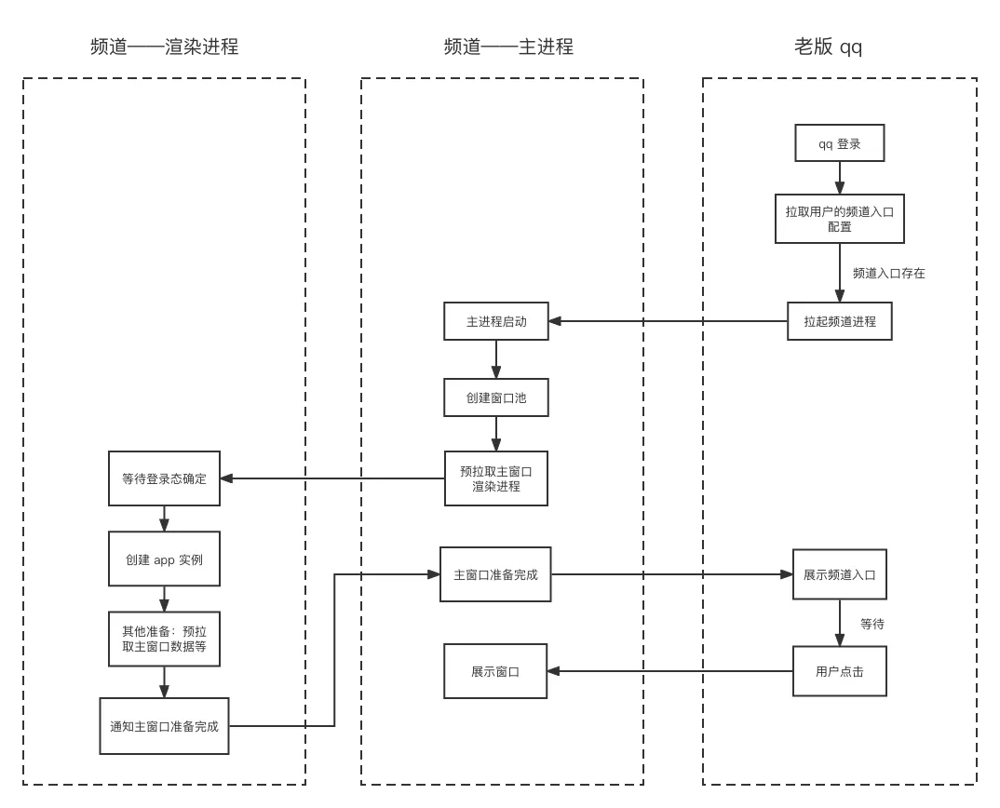

#### （2）新版 qq 和频道

**展示频道 tab 的时机由新版 qq 控制。新版 qq 登录完成后，需要去拉取用户的频道配置，当存在频道入口时，创建频道专用窗口池，窗口池初始化完成后，通知渲染层展示频道 tab。因为新版 qq 是由 electron 开发，不是原生的实现，在性能上可能稍稍逊色。因此为了减少对 qq 的影响，频道预渲染只是创建了频道窗口池，而不是像老版 qq 直接预加载了频道的主窗口。**时序如下所示：

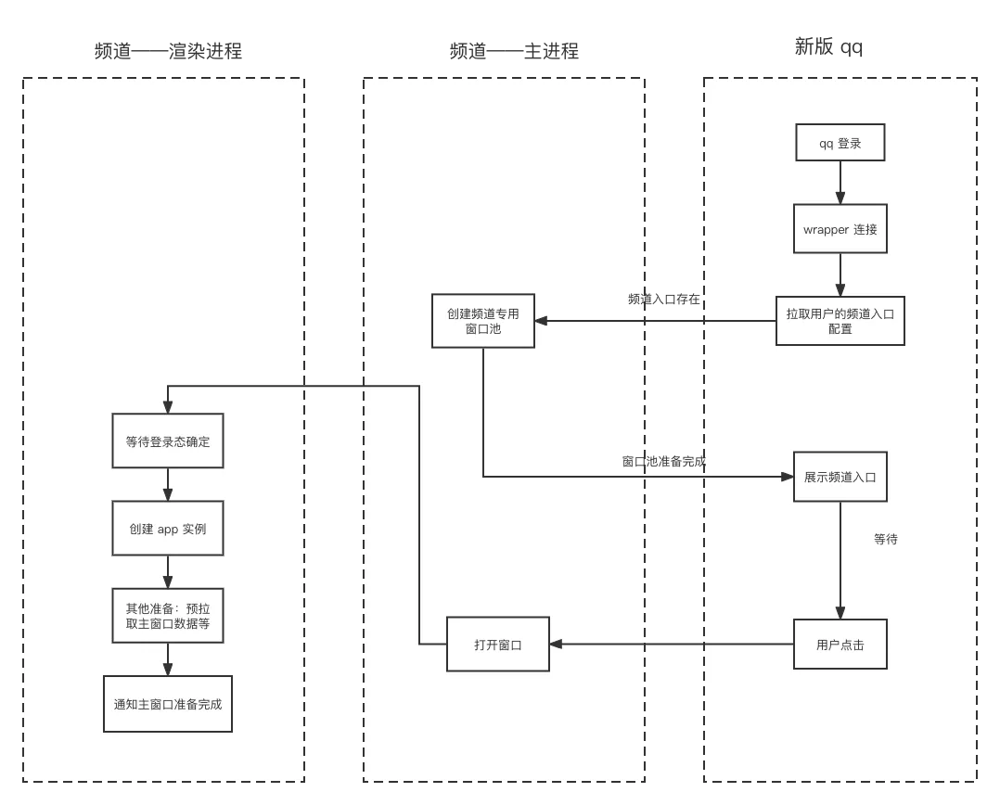

**从时序图中可以看到，频道在新版 qq 和旧版 qq 中，都需要：等待登录态获取、频道初始化、通知宿主初始化完成这 3 个关键步骤。**因此，定义一个 interface，为基类的类型定义，如下所示：

```js
export default interface BaseGuildInit {
  guildInit(): Promise<any>;
  ensureLoginInfo(): Promise<LoginInfo | void>;
  mainWindowReady(): Promise<GuildOpenParams | undefined>;
}
```

不同的宿主环境频道分别去 implements 这几个方法，目录结构如下所示：

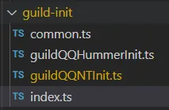

### 3.频道登录态的获取

#### （1）老版 qq 和频道

老版 qq 的登录由 qq 桌面端主动触发和维护 ，addon 没有提供登录模块，只有 wrapper 模块。老版 qq 在频道主进程拉起，wrapper 模块通信通道建立后，addon 会主动向主进程 push 登录态，包括 uid 和 tinyId，uid 为用户的 qq 号，tinyId 为通信标识。频道主窗口的渲染进程也会等待登录态获取成功后，才会开始挂载实例。频道与 addon 的交互如下所示：

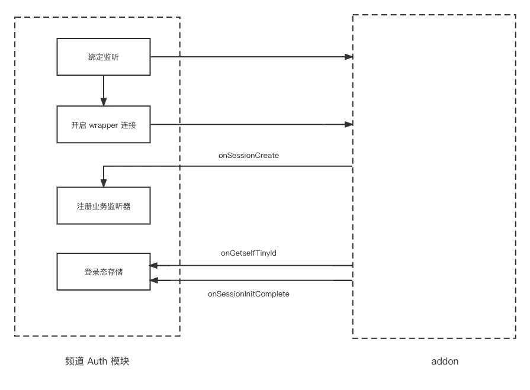

#### （2）新版 qq 和频道

新版 qq 的登录由主进程主动触发和维护，addon 提供 login 模块和 wrapper 模块。login 模块和 wrapper 模块是两条不同的通道。主进程启动后，会先进行 login 模块的连接。用户登录成功后，addon 主动向主进程 push 登录态，包括 uin 、uid，uin 为用户的 qq 号，uid 为新版 qq 通信标识。之后才会开始搭建 wrapper 通道。频道主窗口的渲染进程也会等待登录态获取成功后，才会开始挂载实例。新版 qq 登录与 addon 的交互如下所示：  

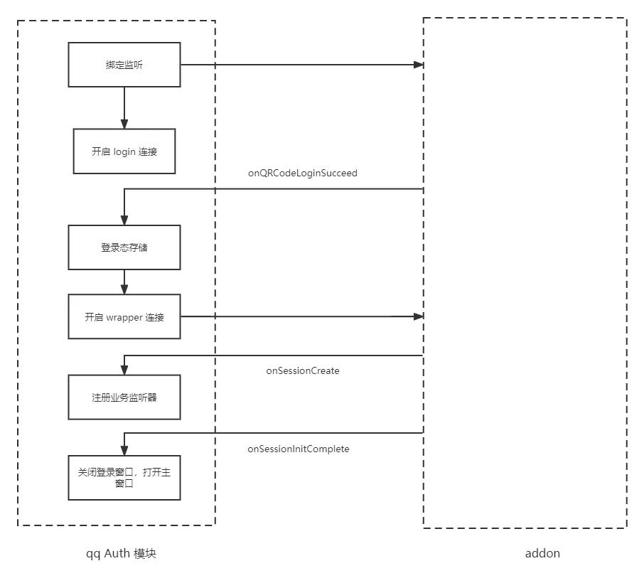

可以看到，虽然频道和新版 qq 使用的一套登录态不同，但新版 qq 中，addon 也会 push 频道登录态事件，只要做好频道登录事件的监听，拓展频道的登录态，即无论新版 qq 还是老版 qq，频道都保存 uid、uin、tinyId，这样频道初始化时ensureLoginnfo 验证三者都存在，就可以实现登录态的兼容。

### 4.频道与 qq 的其他通信

频道需要关注 qq 的一些状态，与 qq 进行通信。在频道与 addon 建立通信通道前，需要先绑定好监听事件，比如 qq 面板的显示隐藏状态、用户点击频道入口等。  

#### （1）老版 qq 和频道

老版 qq 和频道需要通过 addon 进行通信。

#### （2）新版 qq 和频道

新版 qq 和频道属于同一个主进程，不用再经过 addon，可以直接使用 eventBus 通信。

因此，该部分的通信可以将公共处理事件抽离到 common 中，对于不同的宿主环境，事件监听使用不同的方式注册。对于新版 qq，还需要在主进程触发事件的地方抛出对应事件。

## 四.总结与展望

本文通过一步步探索，介绍了如何优雅地搭建通信模型。新版通信模型统一了主进程和渲染进程调用 addon 的方式，提供了方法提示和参数校验功能，也支持方法拓展，提高了可靠性和可维护性。其中重点介绍了拓展方法的设计，通过一步步优化拓展方法的设计，减少了冗余定义和冗余实现，更方便开发者理解，提高了开发效率。由于拓展方法会改变 调用 addon 底层方法的逻辑，对于不同的开发者，可能存在不同的拓展需求。因此，拓展方法应该是有节制的，非必要不拓展，对于拓展方法也可以考虑使用另外一种形式，通过增加新的 ipc 通道来实现（项目中已经支持了创建不同的 ipc 通道），降低拓展方法的全局影响。

本文还介绍了频道与新版 qq 的融合，介绍了主进程融合过程中相关模块的处理，通过模块高内聚低耦合结构，降低了理解成本和耦合度，实现了频道在不同宿主环境中的正常启动。

<hr>

### <p>原文出处：<a href='https://km.woa.com/knowledge/7516/node/5' target='blank'>QQ NT的跨平台重构之旅 - 小头像，大讲究</a></p>

## 一、背景

### 使用场景

对于一个社交软件来说，大部分的功能模块都少不了头像的堆砌，头像往往能给到用户最快的社交对象信息。头像内容属于媒体文件，往往它的加载效果，就决定了用户对这项产品的体验好感度。

新版pcqq也不例外，可以看到在一整个的界面中，头像数量多且分布广，占据了一个页面几乎所有最重要的位置：

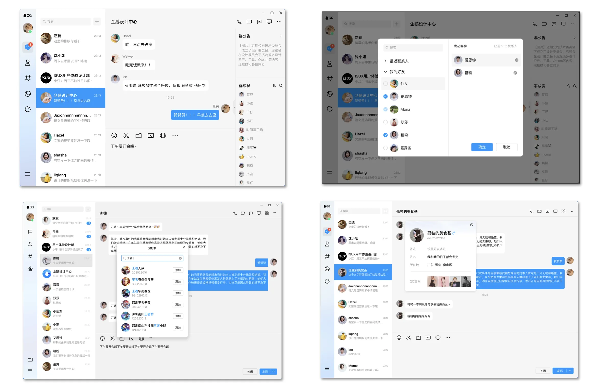

新版 pcqq 目前已有32个场景需要展示头像，基本每个复杂模块都少不了头像的组件：


### 使用方式

作为基础组件，一定以**“使用更简单”、“功能更全面”**的原则设计，使得上层使用者以最少的代码无脑接入。

#### 高频方式

在项目90%的场景中，size、contact uid 即可完成所有对头像的展示需求，使用者无需关心头像地址的获取以及默认底图的展示逻辑。

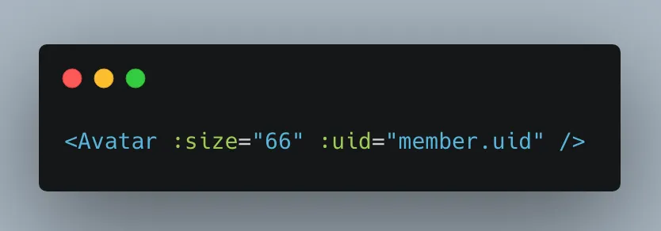

#### 高阶用法

对于一些特殊模块，基本功能已不不能完全满足。

以最近联系人为例，即使需要覆盖头像所有的功能，也只需要提供相关属性即可：会话类型、自定义上屏地址、群信息等。可实现普通头像展示、系统头像展示、初创群头像拼接、清晰度选择等所有 功能。

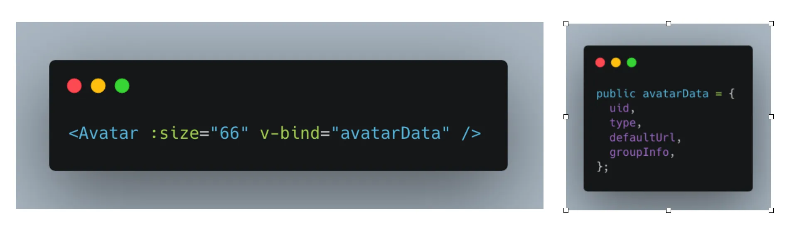

## 二、设计思路

由于 PCQQ 是在 Electron 的基础上完成的，与后台之间的数据连接均需要经过NT 内核中间层，而我们与NT之间只能通过主进程去调用 NT SDK。在渲染进程获取头像地址上屏，必须通过 ipc 实现渲染进程与主进程的跨进程通信。

Renderer 主要负责数据缓存、功能展示；

Main 主要负责询问NT头像地址、下载头像（O、I）、返回数据；

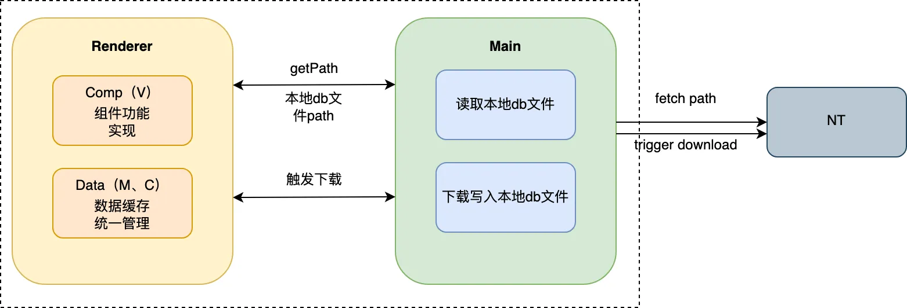

### 2.1 普通头像


#### 2.1.1 上屏渲染的方式与策略

**1. img or background-image ？**  

当前头像的渲染是通过background-image实现的，不使用 img 标签的原因如下：

  * 图片作为页面构成的一部分才会使用img
  * 在图片未加载或加载失败时，会展示图裂图标
  * 在需要给头像上加标识（状态、蒙层等）时，不能用伪类，从而多出dom 
  * 减少一个container div 的dom
  * `img`是`html`结构的一部分，若后面还有js加载，会阻塞html加载渲染

**2. 加载过程**

**默认头像**

在渲染进程获取数据、浏览器加载图片的过程中，设计需要展示默认头像，告诉用户这里是个头像占位并且正在加载中。


由于头像默认底图是由背景颜色、icon组成的，设计需要根据当前主题，通过css变量控制默认头像的颜色，所以这里默认头像得用svg组件展示，与头像的切换则用v-if控制（注：这里在后续的优化中会被更改）。

**顿感加载**

在浏览器加载图片的过程中，易给用户展示这样的加载效果：

  * 七拼八凑
  * 卡顿感

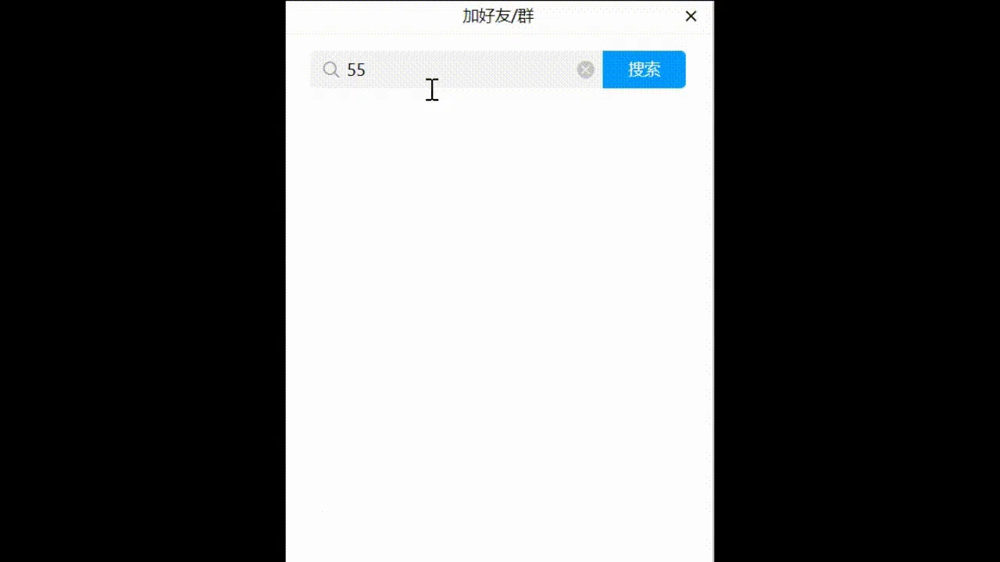

所以，我们需要在头像上屏前，让浏览器先默默加载完并保有缓存，在此之后，才让图片上屏，去除这种卡顿感。（注：此操作在后续仍有优化）

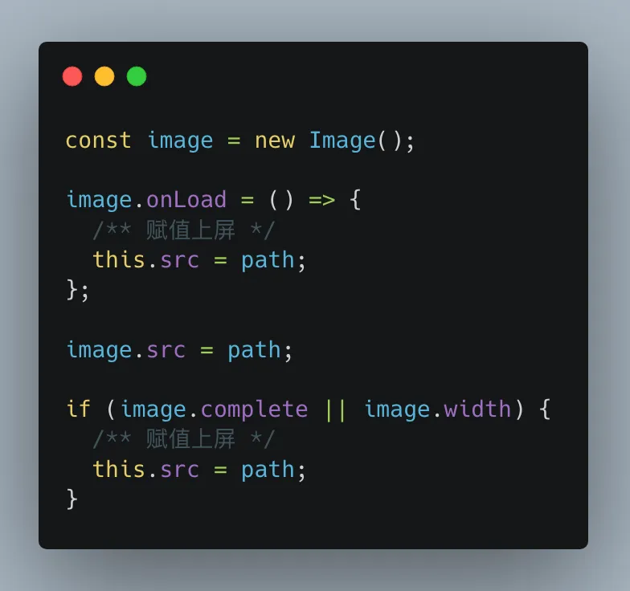

**3. 更新策略**

在用户更新头像后，NT 会上抛 onAvatarChanged 的push，但针对每个联系人，每次下载的路径都是一样的，而浏览器又保有文件缓存机制，无法强制重新渲染新图片。

所以，为了保证头像在文件重新下载替换的情况下，能更新上屏的图片，我们在数据store中执行路径版本控制。

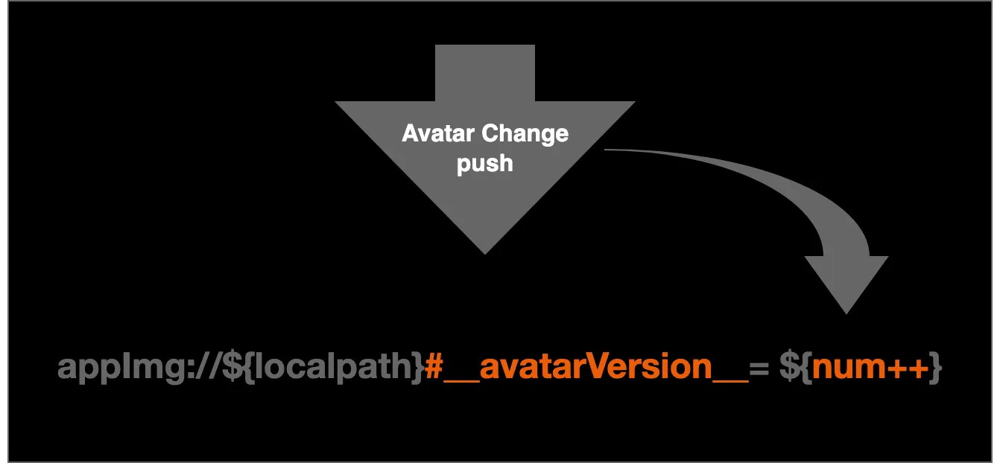

#### 2.1.2 获取数据策略

通过组件，将数据相关配置均传递给 store 处理。头像图片的路径均为本地下载的文件路径。

  1. 对于不同类型的头像，通过type区分即将需要调用的请求接口
  2. 发送获取当前头像本地路径的接口。 
    1. 若文件存在，则直接放入缓存，触发头像组件快速上屏渲染；
    2. 若文件不存在，则仍需触发下载
  3. 全程贯穿监听 onDownloadFinish，作为图片下载成功、图片文件替换完成的接收端，将数据放入缓存

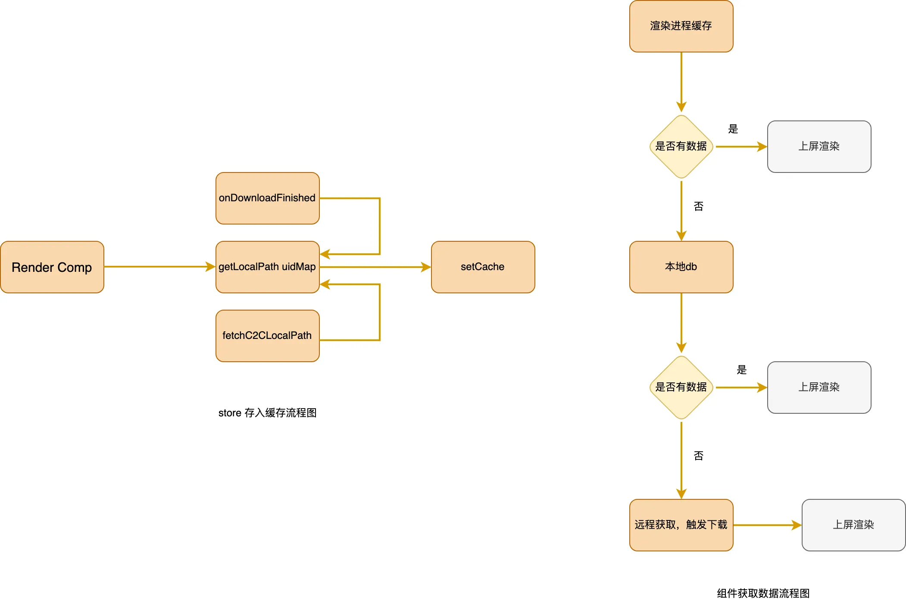

### 2.2 拼接头像


不同于普通头像，对于初创群，拼接头像的展示需要我们上层实现。拼接规则如下：

  1. 群内一人，则只展示该人头像
  2. 群内两人，则按照成员顺序，从左至右拼接，并选取横向中间部分
  3. 群内三人，则按照成员顺序，从左、右上、右下拼接，左边头像选取横向中间部分
  4. 群内私人，则按照成员顺序，从左上、右上、左下、右下拼接

#### 2.2.1 canvas or node ？

我们最终选择在node侧拼接，原因如下：

  * 在登陆后首页，当初创群数量较多时，runtime 拼接耗时又耗力（render cpu）
  * 无法缓存，在当前头像卸载后重新挂载，则需重新执行拼接，使得拼接逻辑贯穿使用全程，造成cpu占用过高

在node侧拼接，优势如下：

  * 可将文件放置本地db，拼接后即使重新登陆也无需重拼，并一直保留
  * 可将本地路径保存在渲染进程缓存中，即使该头像销毁重新挂载，也只需直接从缓存读本地路径，快速上屏

#### 2.2.2 拼接策略

_**获取拼接图片数据**_

为了与普通头像 NT 接口保持一致的逻辑，在主进程我们也提供了getLocalPath、forceDownload的api，让渲染进程只需关心不同类型头像的接口调用。

getLocalPath：询问 NT ，获取当前拼接群头像的本地db地址；

forceDownload：

  1. 询问NT，获取当前群初创成员
  2. 询问NT，获取初创群成员前四位头像
  3. 利用第三方工具拼接
  4. 询问NT，获取即将可写入头像文件的地址
  5. 将拼接头像文件写入本地
  6. 与普通头像一致，触发onDownloadFinish，告知渲染进程下载完成；

**使用native sharp 拼接图像能力**

在node侧拼接，在对比市场目前维护的多个第三包后，我们选用了sharp。该模块由速度极快的[l](https://github.com/libvips/libvips)ibvips 图像处理库提供支持，高性能、高系统兼容性。该库最初于 1989 年在伯克贝克学院创建，目前由 [John Cupitt ](https://github.com/jcupitt)领导的一个小团队维护。

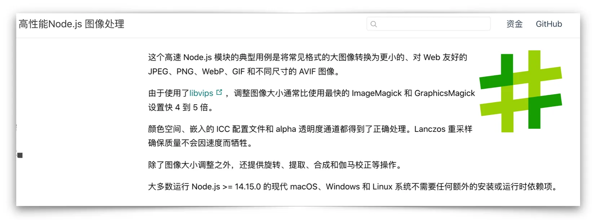

### 3、系统头像


在 QQ 中，除了正常的联系人外，还有很多系统通知会话，如：我的手机、好友通知、群通知等。这类头像，则具有以下特征：

  * 固定背景色
  * 以icon图标作为标识内容
  * icon比例大小一致
  * 背景色、icon颜色/内容需要根据主题可配置

所以，对于这一类头像，我们采用svg组件的方式合成。当然对于会话类型展示的icon内容也不同，对应的映射关系则放入 Avatar 组件维护。上层也只需传入对应会话type，即可匹配上系统头像的渲染。

## 三、究极优化

头像作为 IM 中展示及其重要的一环，是用户体验感受最直接的一部分，速度、质量、体验都得是第一高标准；同时，头像作为媒体文件，也属于cpu、内存重度使用者，对于这2部分的优化也能起到关键作用。

以下优化**按照模块划分**，**对应模块以红框标明**，未按照优化顺序先后。

### 3.1 跨进程通信

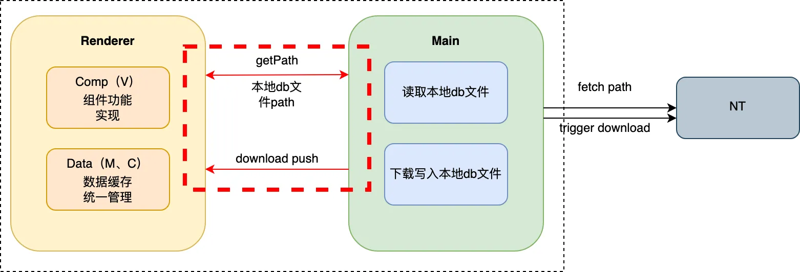

ipc 数据传递是头像avatar渲染进程获取数据的唯一通道，它决定了数据传输的时间、在当下cpu的占有率。众所周知，并行传输的数量、数据大小直接影响ipc的速度，同时ipc的传输数量与cpu的使用率也是成正比的趋势。

根据开篇的介绍，头像的使用场景，大多是成批量的列表，在同一个页面下，展示的头像多有几百个。

而后台提供的接口，均是以**一个**头像为单位，也就是说，**每一个头像**的数据获取，在最坏的情况下，都会有4次的ipc传输：

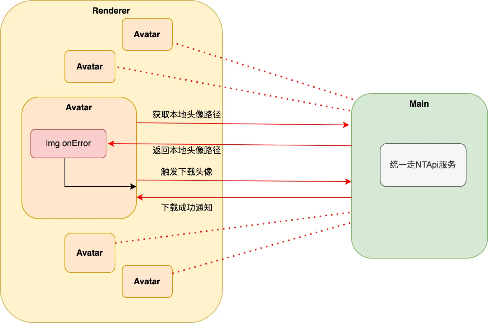

这样算下来，**若一页有100个头像，则一次性会有400次ipc通信**，这对于ipc和cpu而言，都是巨大的考验。

#### 3.1.1 主进程收归功能

从以上的流程图就可以看到，其实其中有些步骤，是可以都收归到主进程的服务去做的，于是便有了主进程的avatarService。

在avatarService中，将判断文件是否可用、触发下载时机收归，不再浪费2次ipc的次数，而对于整页，则是**减少一半的ipc**请求。

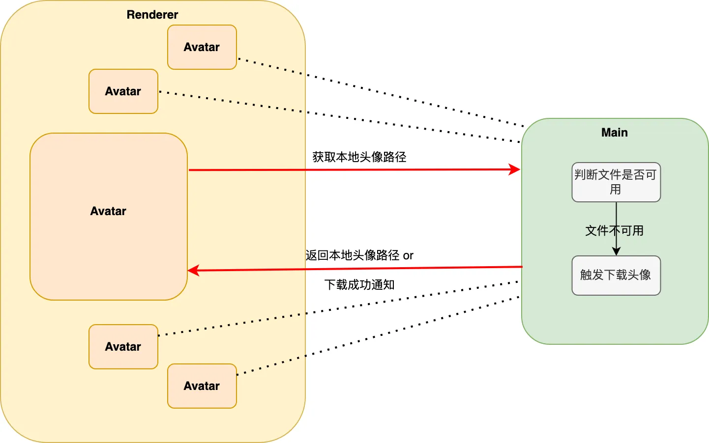

#### 3.1.2 聚合发送

在以上操作下，ipc的请求数量也是极为庞大的，avatarCount * 2。那么，我们就需要从底数count下手，才能实现质的飞跃。

已知，目前在渲染进程获取头像的主要2个接口为：getAvatarPath（renderer => main），onAvatarChange（main => renderer）。该2个接口均是针对一个头像而言的数据，初始端分别为renderer、main。

所以，可以分别在这2个进程发送ipc时进行拦截，以时间为单位进行聚合，将50ms发送100个的请求，**收归至1个ipc，实现了200 => 2的次数优化**。

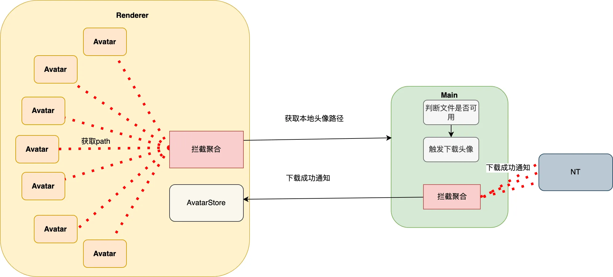

**聚合策略**

对于不同的ipc通道接口而言，是否聚合的需求是不一样的、合并数据结构规则是不一样的，所以，我们只提供了异步聚合、监听聚合的共有方法，具体的mergeFn则是需要上层传递。在这里就不详述了，感兴趣的可以看下代码。

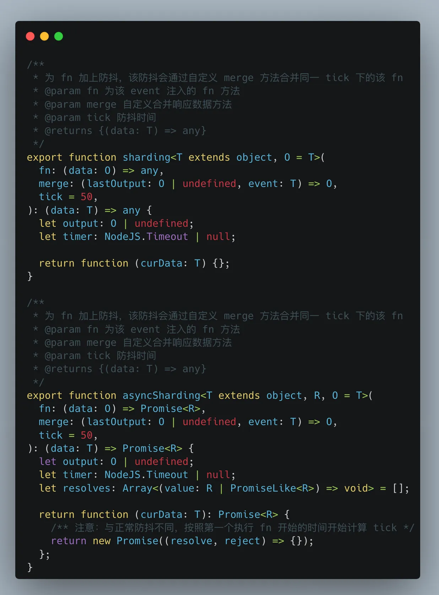

#### 3.1.3 对比效果

聚合ipc之后，可以看到登录后并行的其他ipc请求时间都有了明显的下降，这里直接影响到首页最近联系人数据的上屏时间。

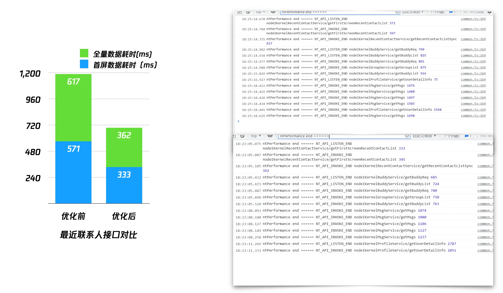

### 3.2 上屏加载

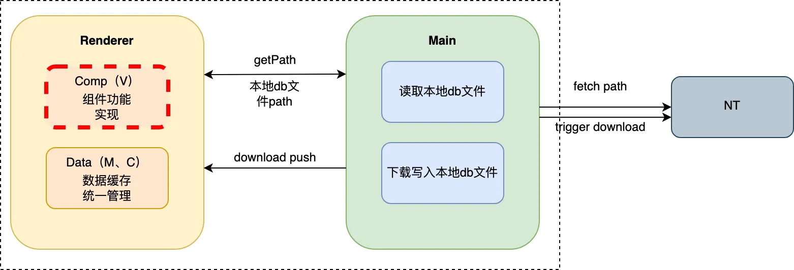

渲染进程拿到数据后，既要保证加载体验，也要保证上屏的速度。

#### 3.2.1 加载时间优化

在以上策略上架后，发现头像的加载仍然耗时，在登录后的最近联系人头像加载，在Network上看只有149ms，然后实际体感却远不止这些时间。

于是，在组件里以其中一个群头像作为研究对象，进行多次打点，发现在执行上述预加载逻辑，等待onLoad耗时明显，多在400ms-1200ms之间不等：

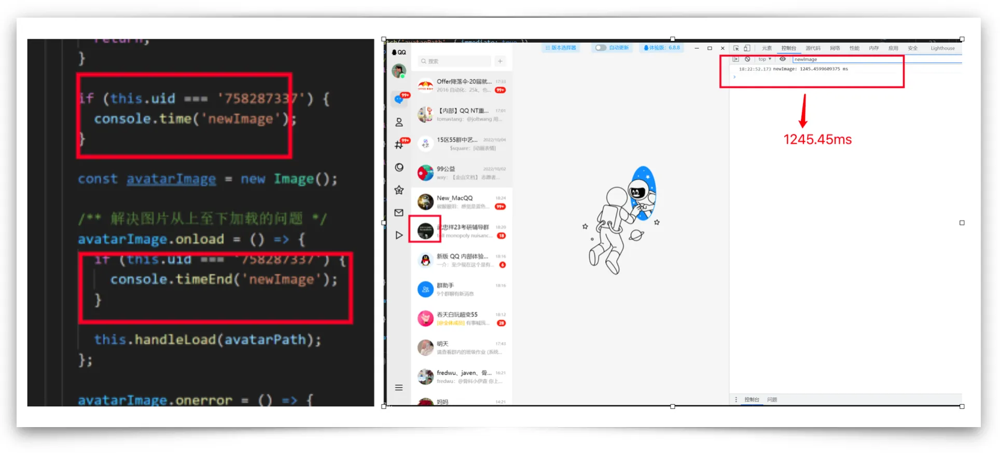

可是，onLoad也仅仅是图片的加载过程，却与network图片加载时间差距太多，这是为啥呢？

通过performance记录可以看到，最近联系人是以15个联系人为一页分片的，此为一个长任务就有200ms了，中间又执行了onMessage相关任务、摘要计算任务，onLoad是个异步监听，过了500ms后才执行onLoad的任务。

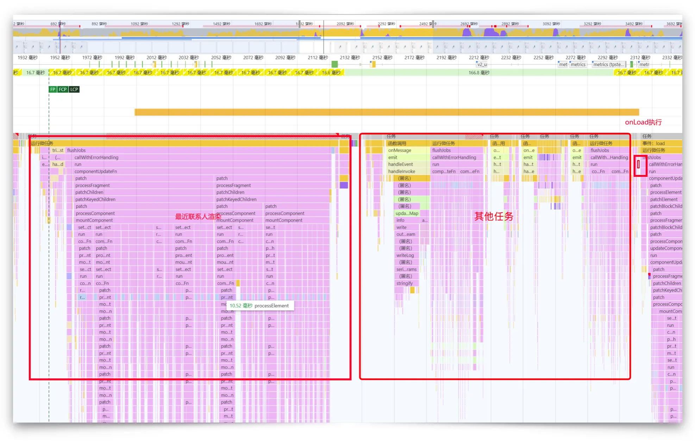

然而，去控制这些任务的顺序，对于这么多个头像onLoad显然是不可能的。所以，等待onLoad之后才赋值的策略就不可取了。

通过network检查，发现我们下载下来的小图头像也只有3k，大图也只有30k，其大小与图片的缩略图差不多，对于图片直接赋值渲染是不会出现从上至下的加载过程的。**所以，对于正常的头像，直接在内部赋值src上屏，速度和体验其实也是足够了。**

然而，对于加好友模块的头像则是属于陌生人，NT 不会提供 uid 下载图片，只能加载http的地址，这块的图片则会有100-200k的大小，直接赋值渲染必然出现卡顿的加载效果，所以之前的onLoad策略为smoothRender 组件属性保留。

#### 3.2.2 减少 dom 数量

在以上的修改后，会发现直接赋值时，即使不会出现卡顿的加载效果，也会感知到先白了一下，再出现图片的过程，这其实也是149-200ms的头像加载过程。

再者，在头像还未获取到数据时，展示的底图是一个svg，这对于数量比较大的头像来说，无疑也是一个内存消耗、dom数量渲染秤砣。

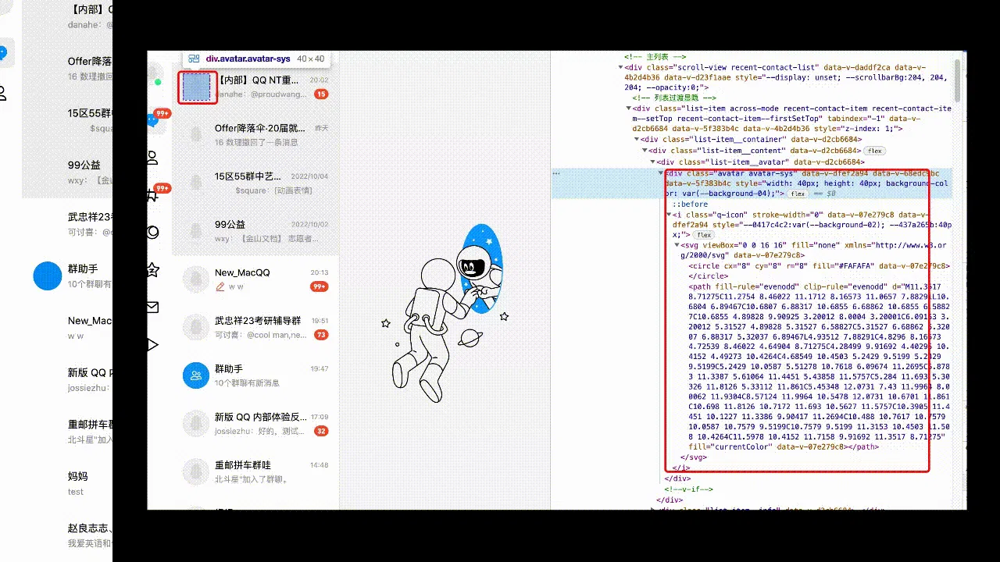

所以，将底图从svg切为背景图片，它的收益肯定要比可配置颜色要多的多的。

背景图片是可以设置多张图片的，**将底图放置最下面一层，实际图片放在上面一层**，就可以在空白的时间内展示底图内容了，同时减少了3倍的dom数量

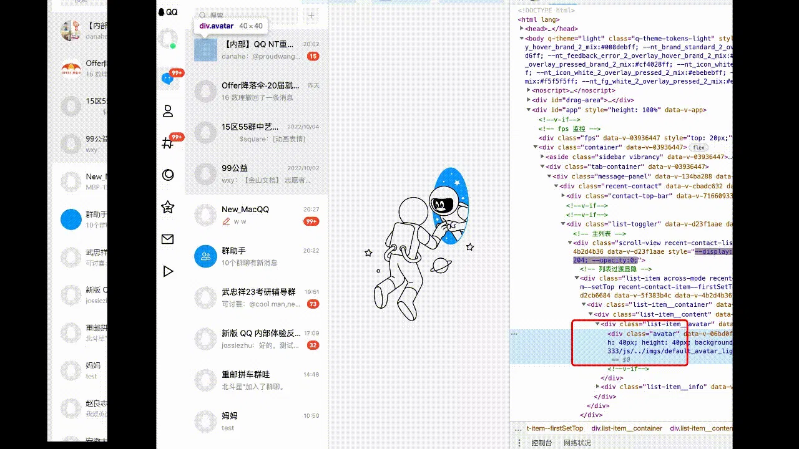

#### 3.2.3 对比效果

从肉眼来看确实快不少，从数据上看，这里节省了等待onLoad的时间400ms-1200ms。

dom数量上：4 * count => 1 * count。

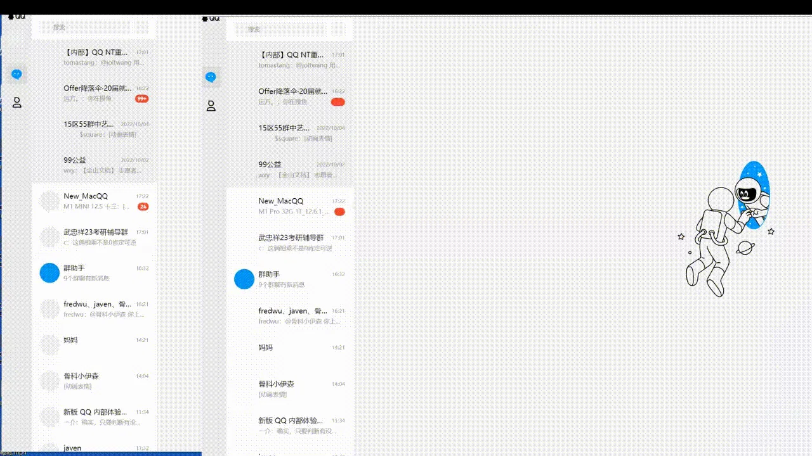

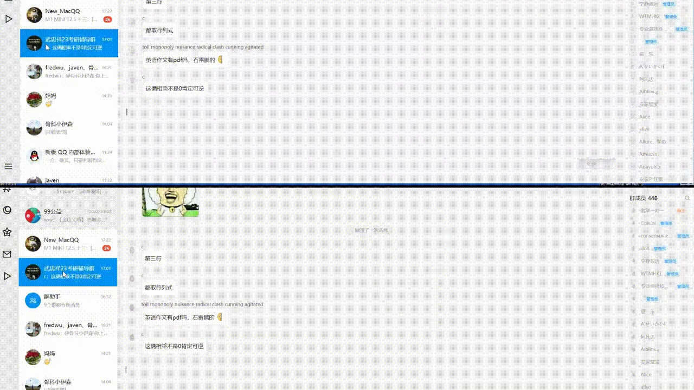

### 3.3 缓存管理

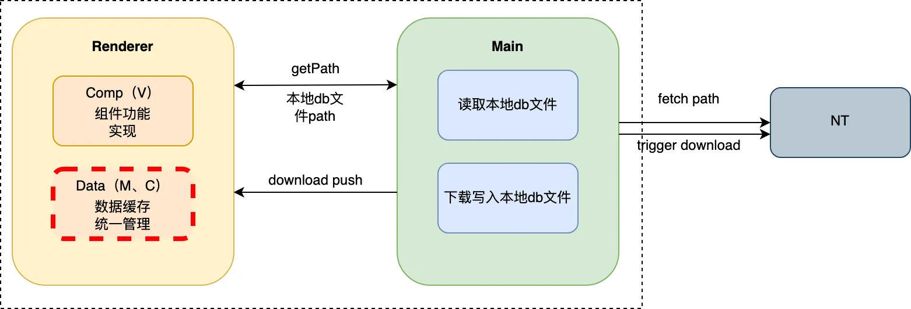

以头像使用场景来看，同一 uid 的头像必定是要可复用的，所以以uid为key的头像数据map 的avatarStore肯定是必不可少的。同时监听某一头像的下载成功信息，则可在store内全局只监听一次，来维护头像地址数据，无需出现有多少个头像就监听多少次的恶心场面。

#### 3.3.1 LRU 缓存策略

一个头像的地址占有158byte左右，头像的数量是无穷尽的，所以头像的缓存也需要及时释放。

这里封装了Cache基类，主要实现LRU的销毁算法，这里比较符合头像的使用场景。maxSize是2000个，以set进去生成一个队列，先set进去的，在recycle中先被删除，被get获取后，在缓存中的顺序则被刷新。

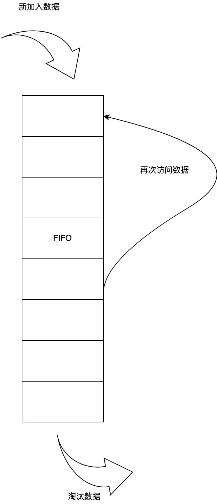

这里即可节省（showAvatarCount - 2000）* 158 byte的空间。

#### 3.3.2 LRU + Lock Uid 缓存策略

其次头像数据缓存中，可分为头像使用等级，像最近联系人里的头像则是频繁展示的。

所以在基类缓存的基础之上，扩展了回收机制，增加了lockUid的概念，对于这其中的uid则是**永远不会删除**。

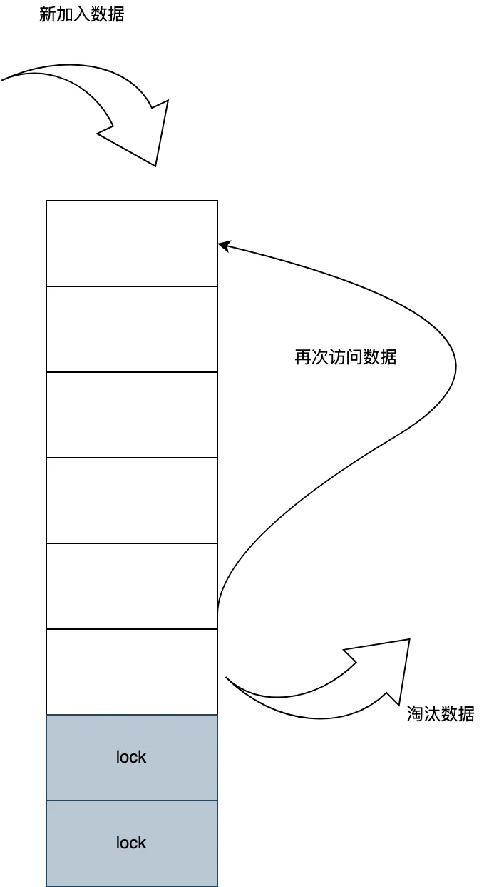

#### 3.3.3 删除缓存后的头像展示

当头像缓存被LRU算法删除后，如果此时该头像仍然还在当前界面，若不做任何处理，则会被重新渲染，展示空白底图头像。

所以，此时可在组件做特殊处理，当当前组件头像地址为空时，阻断渲染，使得浏览器仍然保留该图片的展示。直到当前组件被销毁重新挂载设置缓存队列顺序，或者监听该人头像发生变化时重新回到缓存中去。

这样既保证了内存的及时释放，也保证了用户的体验。

### 3.4 主进程CPU

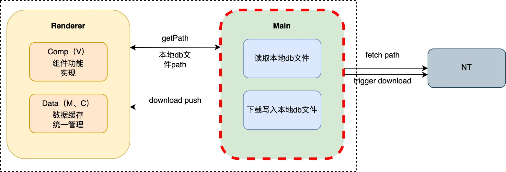

#### 3.4.1 躲避高峰拼接头像

在首屏的性能分析中，发现在登录后进入首页，此时任务管理器主进程的cpu与内存直线飙升，同竞品相比，高了2倍不止。生产包主进程cpu在394.2-500不等。

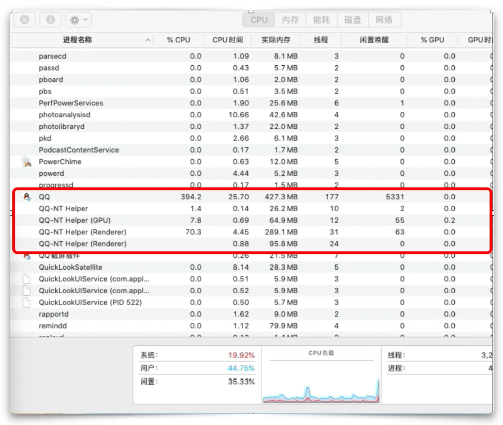

拼接头像为初创群的前4位成员头像拼接而成。由于在离线期间，初创群的成员变动、头像变化，在NT SDK也是无法知晓的，所以在登录后无法获取到真正该群的拼接头像，并且永不可变。于是在登录初期，在获取到初创群本地拼接头像快速上屏后，仍然会在主进程主动获取初创前4位成员和头像，进行重新拼接并写入本地db。在主进程拼接头像写入文件，均是有第三方包sharp完成。

在我的最近联系人中，有57个初创群，其cpu占比如下：

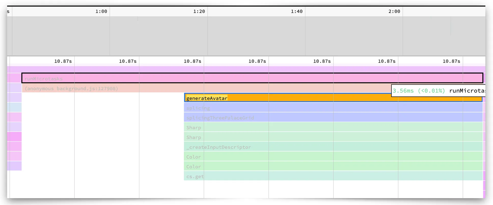

一个头像的拼接微任务cpu占有3ms，在最近联系人有57个初创群的情况下，自然就有171ms了，

与产品对接后，初创群一登录后，对于离线期间到前四成员变动的概率其实是很小的，其次对于其实时变化的需求不是很高，反而在此却耗费很多cpu占比，其实是不值当的。所以对于此耗性能的步骤，则后移至进入aio、打开资料卡等操作时才重新拼接该群。

所以，此次改动将拼接小图返回本地db路径、下载拼接头像的逻辑分开。在渲染进程提供重新拼接的方法，在store维护拼接次数，使得在渲染进程，从始至终该初创群只会重新拼接一次。而触发重新拼接的地方，可在上层自定义调用：进入aio、进入资料、打开资料卡等。

#### 3.4.2 避免高消耗操作

在实际使用当中，会有用户发现某头像永远展示不出来，其原因则是该头像存在且不会重新下载，但已造成损坏。为了避免这类不可逆的问题，则使用getImageSizeFromPath方法判断图片是否有效。

但是在cpu profile的分析中发现，getImageSizeFromPath占用cpu总时间长，消耗大。

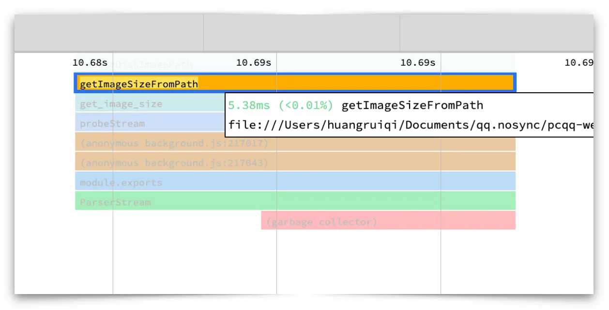

一个头像的拼接微任务cpu占有5ms，在最近联系人有100个联系人的情况下，自然就有500ms了。

为了避免小概率事件，造成cpu的浪费，实在得不偿失，所以这里先将该逻辑去除，在渲染进程onError的时候再去hack此类小概率的情况。

#### 3.4.3 对比效果

此次的优化，将登陆后的cpu峰值降有一半有余！

#### 生产包选取其中3次比对

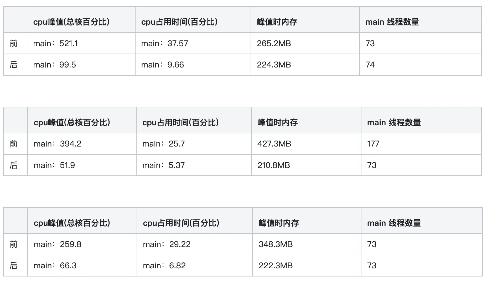

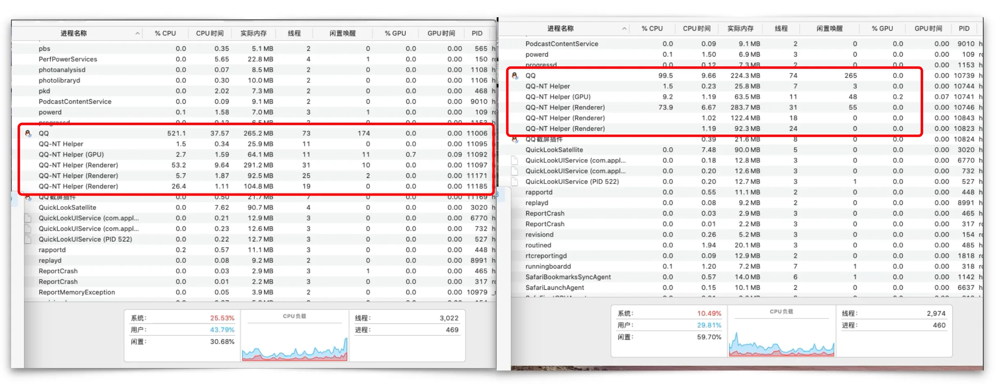

#### 现网包比对

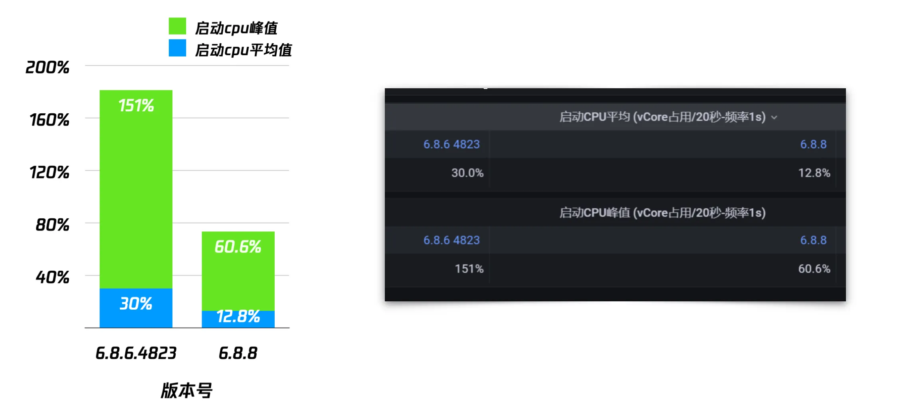

### 3.5 前端上层辅助优化

对于一些关键模块的头像展示，要求会更严格。比如最近联系人、群成员列表的头像，它其实决定了首屏渲染完成的节点、进入aio渲染完成的节点。那这些模块为了实现极度速度上屏，也需要上层模块的辅助。

在登录初期，是nt 主动抛消息、渲染进程 ipc 高发时期，cpu本身占比就高，如果在此时间段，还要挤占获取头像地址并加载，一定是非常慢的。

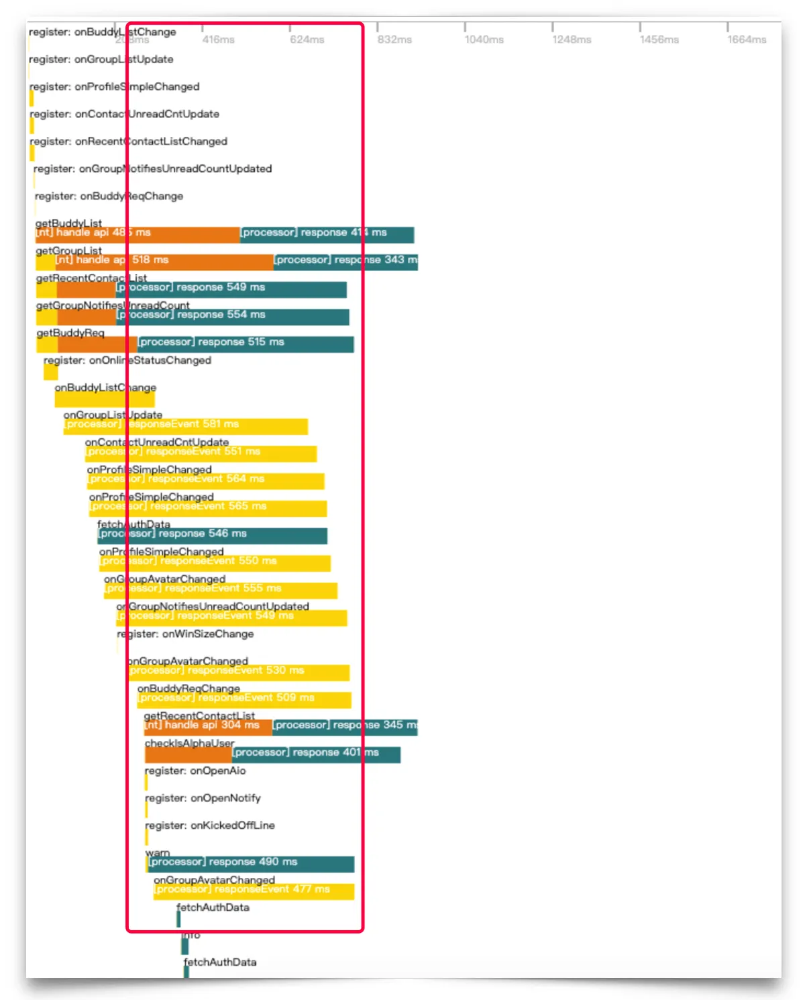

#### 3.5.1 默认地址

获取一个头像本地db的地址，要经过1次进程间来回的通信，与最近联系人、联系人、资料、消息等大数据抢占ipc，肯定会头破血流，所以在与NT同学商量后，直接在最近联系人接口将头像地址返回，在渲染进程头像上屏前只需要一个加载过程。

在Avatar Comp中，只需提供defaultUrl属性，供上层传递直接夹在即可。然后继续将该头像的uid加入avatarStore的监听队列中。

#### 3.5.2 分片上屏

最近联系人的上限数据是200个，目前是没有做虚拟列表的，也就是说，这100多个最近联系人是同时加载图片的，在登录后cpu占用高的case下，可以看下浏览器加载的效果：

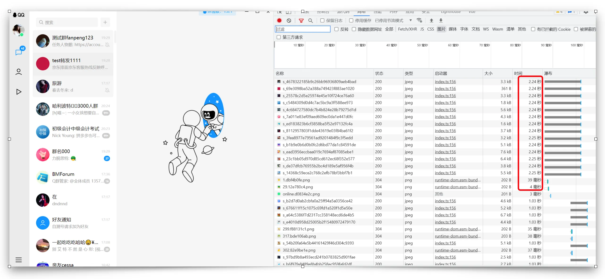

首屏的头像在慢的时候，需要加载2s，无疑这对首屏性能是致命伤害。

所以绝对不能让上百个图片在这cpu繁忙阶段并行加载。这就需要最近联系人的列表做切片上屏处理。

  * 将列表渲染切片任务执行
  * 将最近联系人划分首页、非首页，在Avatar组件提供@load的方法，在上层收到首屏头像均下载完成后，才渲染非首页数据，保证首页图片的高效加载。当然，这里有兜底超时时间5s。

再看下现在的首页头像图片加载耗时，实现了质的飞跃。

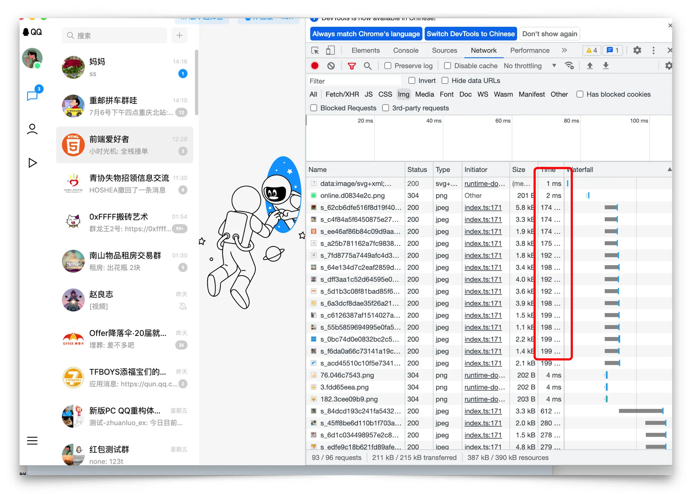

#### 3.5.3 对比效果

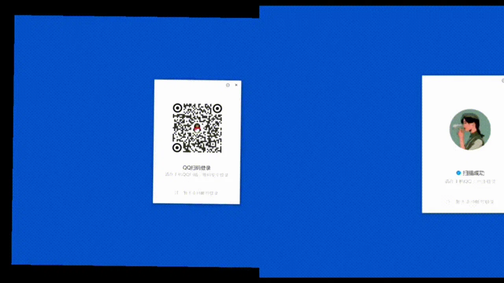

### **最终效果展示**

mac：


windows:


**写在最后**

当初用1天的时间完成了头像最初的需求，累积一周的时间完成复杂的功能拓展，优化的时间却断断续续持续了1-2个月。

完成一件小事很简单，但精益求精却是任重而道远。头像虽小，但其中的讲究可不小，我相信头像仍然还有优化的空间，持续加载中。。。
