<!--BEGIN_DATA
{
    "create_date": "2021-12-12 21:40", 
    "modify_date": "2021-12-12 21:40", 
    "is_top": "0", 
    "summary": "RSFEC原理分析", 
    "tags": "WebRTC", 
    "file_name": "RSFEC原理分析.md"
}
END_DATA-->

#### 
原文出处：<a href='https://mp.weixin.qq.com/s?__biz=MzIzMjY3MjYyOA==&mid=2247494736&idx=2&sn=b30eb8662329d98e316bd1b1c964659d&chksm=e893f04bdfe4795db9582bdfd92809234f3991845aedb8eff99e5b03f05893d46369c06c8857&scene=178&cur_album_id=1436879410820644867#rd' target='blank'>RSFEC原理分析</a>

> 今天向大家介绍下RSFEC的原理，它通过生成冗余数据来恢复丢失的信息，首先介绍下背景，之后重点介绍RSFEC如何计算冗余和恢复数据的，分为异或方式和矩阵方式，异或方式可以认为是矩阵方式的特殊形式，最后做下总结。

 

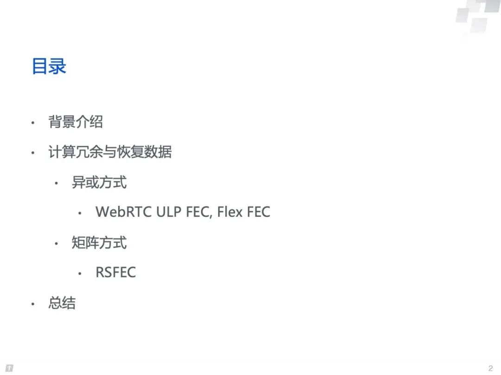

## 背景介绍

RSFEC广泛应用于存储、通信、二维码等领域，比如RAID利用它生成冗余盘提升容错性，视频通话中利用它生成冗余数据对抗网络丢包，太空中远距离传输数据时也用到它，第三张图片是旅行者一号应用RSFEC将太空中拍摄的照片传回地球，二维码中也有使用，下面的二维码缺了一个角，还是可以扫出来。

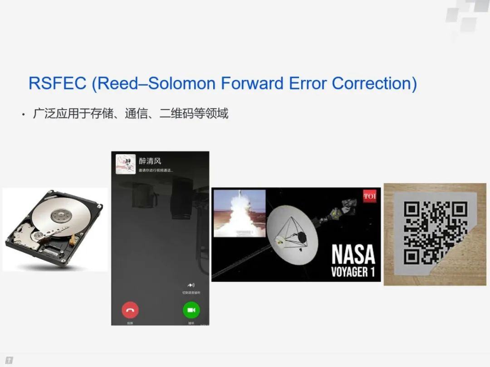

下面以视频通话场景为例，大家用过微信的视频通话吧，有时网络不佳会感觉卡顿。画幅图说明，发送端发了3个数据包，不加任何处理，经过网络传输丢失其中一个数据包，接收端只收到两个，就可能引起卡顿。一种简单的做法是将它们重复发一遍使接收端尽量得到3个包，但这样比较费流量，有没有办法尽量少发包并达到相同的效果？

可以在发送前根据3个数据包的特点，计算出一个FEC包，当3个包**任意**一个丢失，可以通过FEC包和剩余的两个计算出丢失的包。下面将介绍怎么计算冗余包，并讲解如何恢复数据。

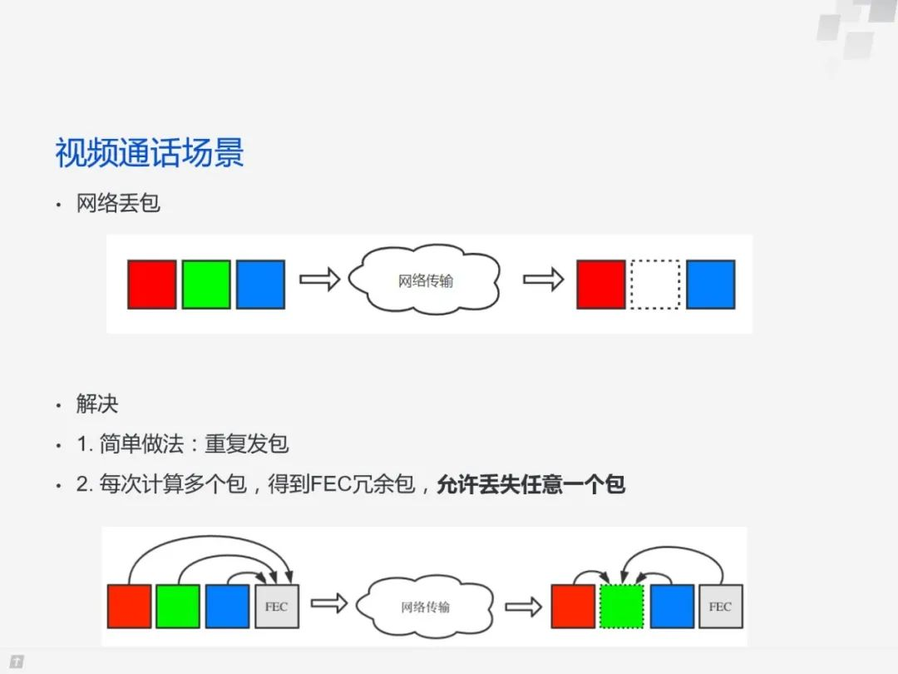

## 异或方式编码与恢复

假设发送端要发的数据是a, b, c，用异或方式编码生成一个冗余包r，将4个包发送出去，网络传输过程中b丢失了，a, c, r成功到达，接受端将收到的3个包异或，计算回b，这样就恢复了数据。

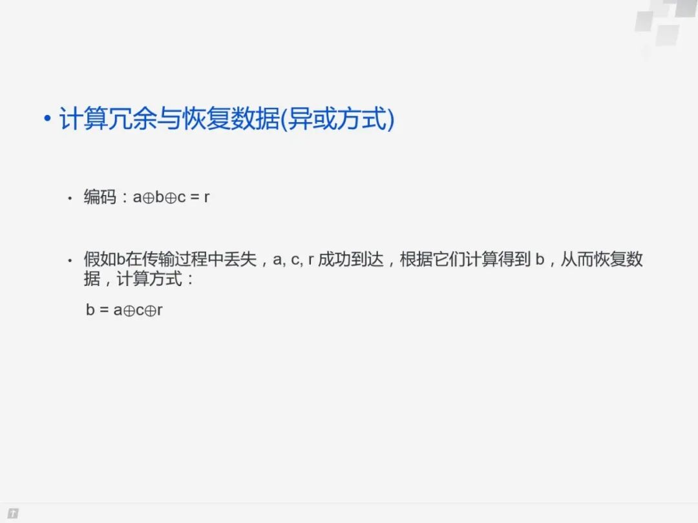  

同样的计算，用矩阵方式表达，其中加法是异或，这里为什么要将这个简单的例子用矩阵这种看似复杂的方式重新算一遍呢？因为这个例子是RSFEC的简化版，用矩阵方式计算的过程基本涵盖了RSFEC的过程，这里用简单例子说明方便理解。

下面等式右边是接收端应该收到的数据，现在b丢失了，将b这一行删掉，相应地删掉等式左边的矩阵的第二行，形式化的表达就是左乘下方左边的矩阵，得到右下角的等式。

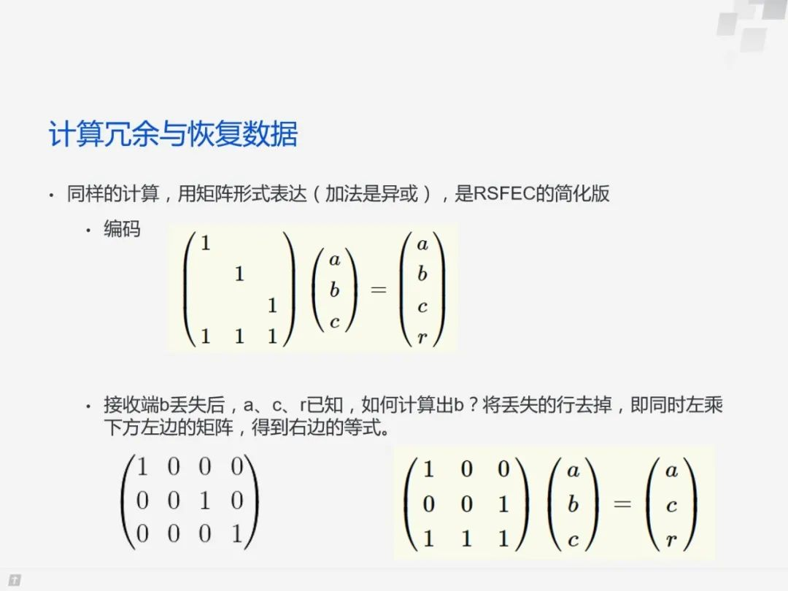  

下面用高斯消元法解方程组，先将待解方程组的系数矩阵和未知数写成增广矩阵（augmented matrix）形式，用行初等变换进行前向替换（forward substitution），目的是将矩阵化为上三角矩阵，先交换第二行和第三行，再将第一行加到第二行上，注意加法是异或，1+1=0。第二步是后向替换（back substitution），将第三行加到第二行，将右上角全化为0，最终得到解。

这里再强调下，对于这个简单的例子，我们肉眼可以直接看出解，但计算机是用程序化的方式求解，如果方程变得复杂了之后我们肉眼是看不出解的，而计算机的程序化方式能应对复杂的计算，这里演示了整个生成冗余和恢复数据的过程。

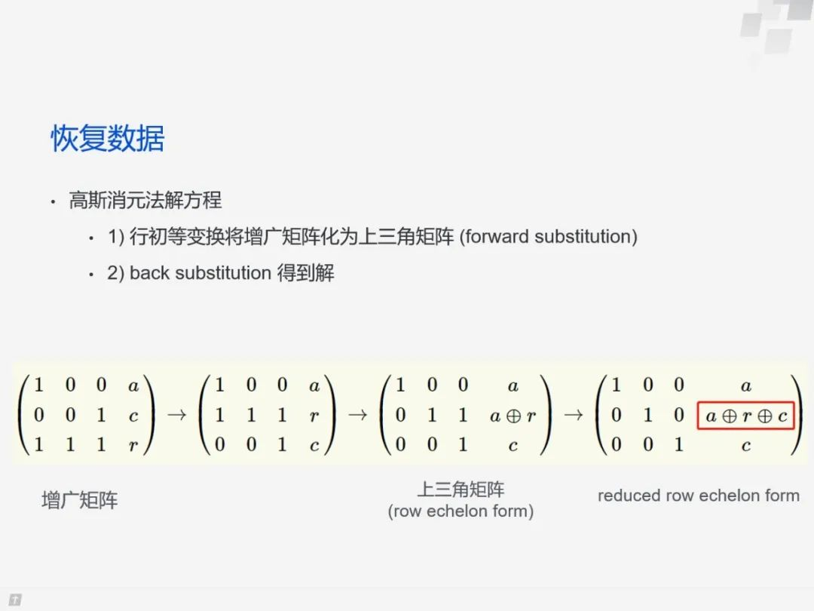  

## WebRTC中的实现

WebRTC是浏览器中进行RTC实时通信的一个框架，其中有两种基于异或的编码方式，ULP FEC和Flex FEC。下面先介绍ULP FEC，非均等级别的保护，顾名思义，它对不同的数据提供不同程度的保护。通常数据的前段部分比较重要，所以这里用一个FEC包保护A、B的前边部分，用另外一个FEC包保护C、D的前边部分，每个FEC包保护两个数据包，也就是加了50%的FEC。再看A、B、C、D的后边部分，用了L1级别的包保护这四段数据，加了25%的FEC。前后段保护程度不同。

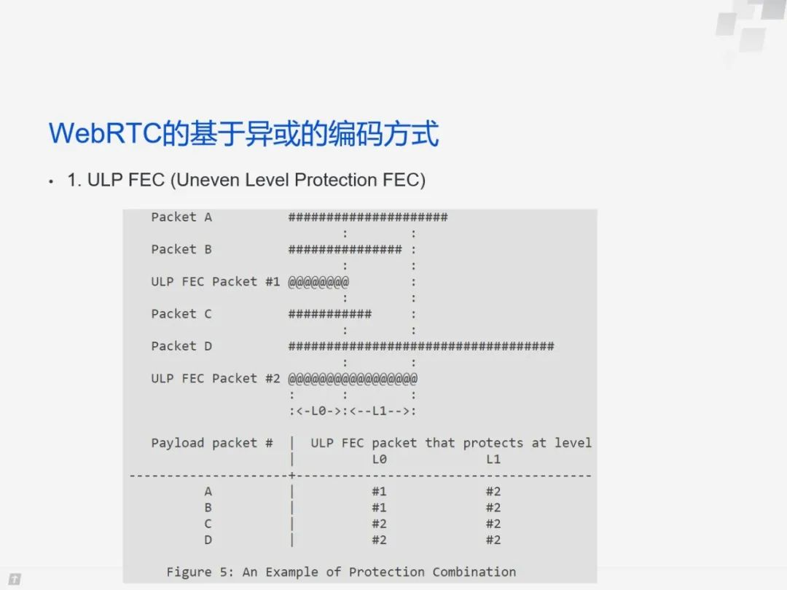

第二种是Flex FEC，分为非交错模式和交错模式，把它们叫行模式和列模式更好理解。这里的发包顺序是S1, S2到SL，SL+1，SL+2一行一行地发送，对每一行进行异或运算生成冗余包，第一行生成R1，第二行生成R2一直到RD。数据包有D行L列，生成D个冗余包。这种生成方式可以抗随机丢包，没法抗连续丢包，比如第一行连续丢包，数量过多后将无法恢复，如果随机丢也就是把丢失包分摊到各行上，每一行就容易恢复数据。

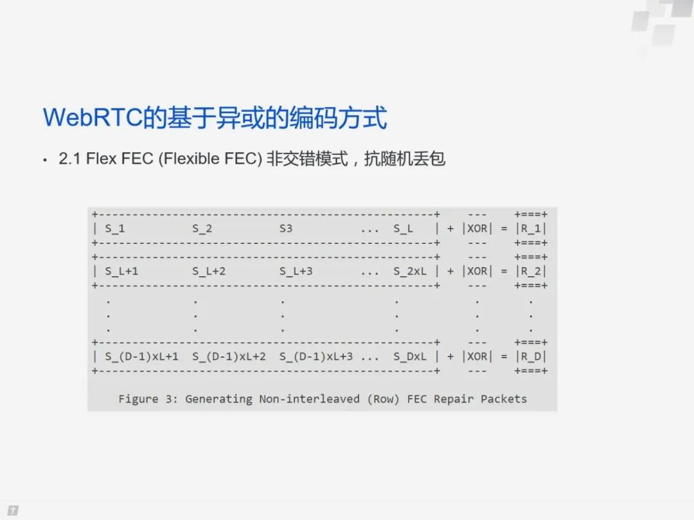  

下面这种是交错模式，或者称列模式，每一列计算生成冗余包，计算冗余包的数据包是交错的，假如发生连续丢包，它们分摊在各列上，每一列丢失地不多容易恢复，所以它能够抗连续丢包，或者说burst突发丢包。

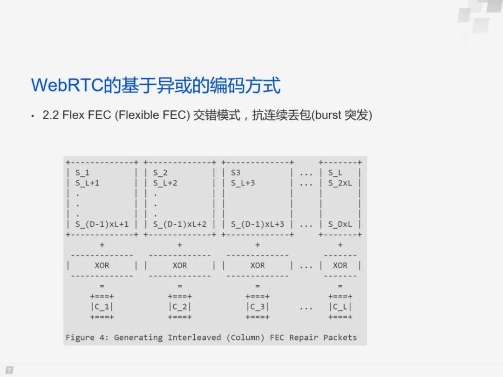  

上面说的行列模式被保护的包位置是固定的，还有保护包位置不固定的模式，下面举例说明，使用Flexible mask n=7个数据包，m=3个冗余包展示随机和连续两种模式下的编码和恢复情况。左边是抗随机丢包的mask，右边是抗连续丢包的mask，源码在下面。

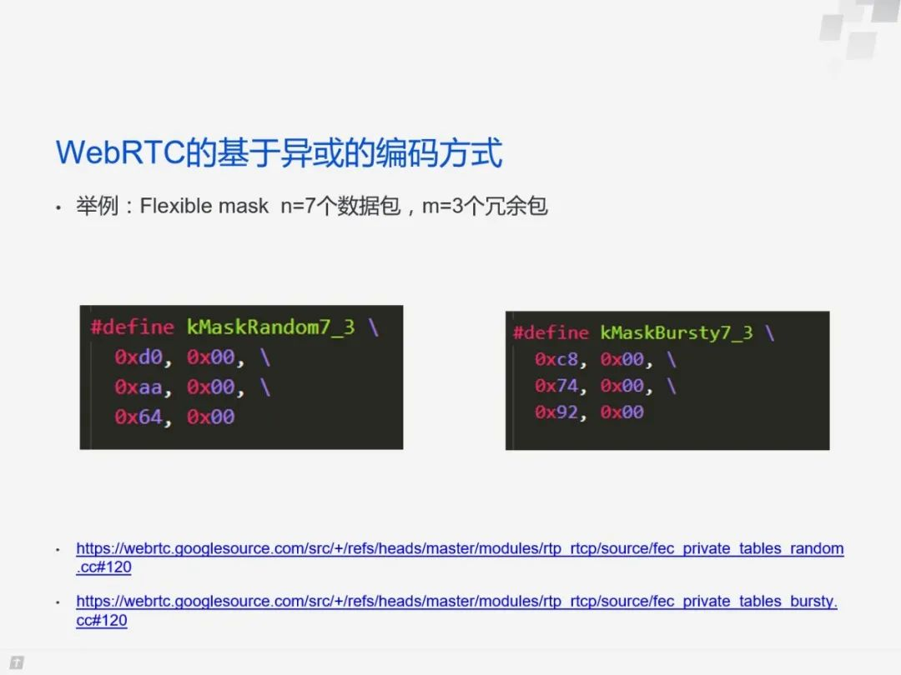

先看抗随机丢包的mask，7个数据包用a到g 7个字母表示，使用这个mask编码就是把相应位置的数据包异或得到冗余包，注意代码中的宏定义每行是两个字节16位，实际用到了7位，因为有7个数据包。  

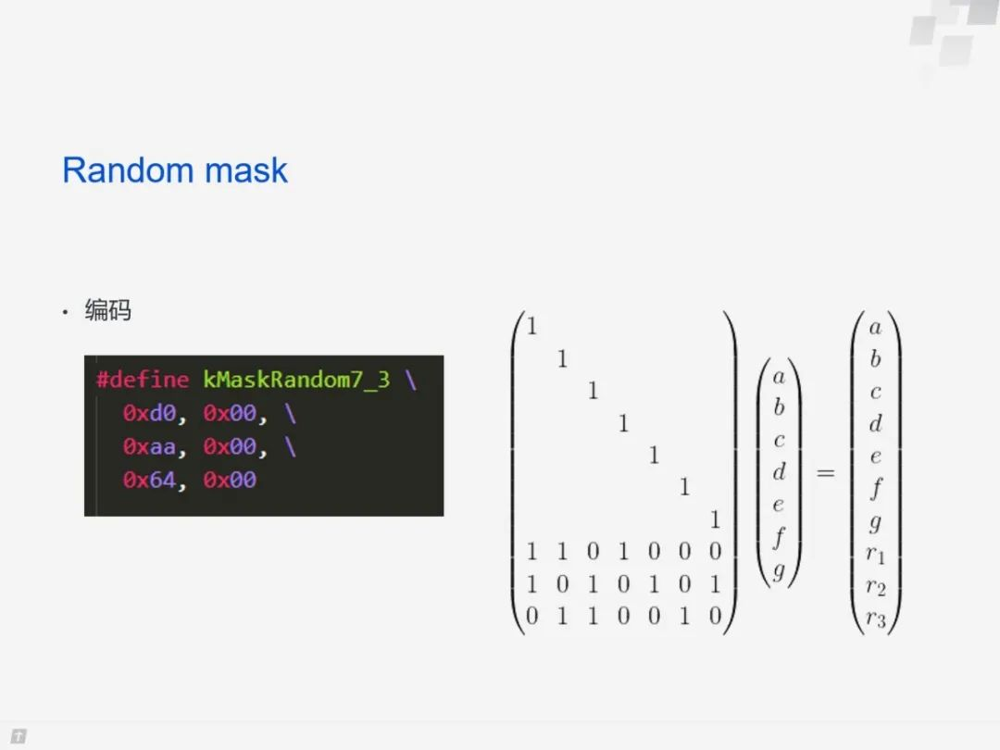

假如a、b、c三个包丢失，即连续丢包，这个mask代表的编码方式只是抗随机丢包，我们看下为什么没法抗连续丢包。发送端将a ~ g、r1、r2、r3发送出去，接受端收到d ~ g、r1、r2、r3，丢失了前三个包，相应地删除编码矩阵的前三行，得到方阵，由于这个矩阵是不可逆的，所以无法将a ~ g全部解出，为什么不可逆？我们可以对编码矩阵进行高斯消元法，用上方的4个1往下加，剩余红框中的小方阵，将小方阵的第三行加到第二行，第二行变为1 1 0，与第 一行相同，两者线性相关所以不可逆。用中学数学的观点看，就是下方的方程组无解，每行都有a、b、c中的两个未知数，无论怎么消元都解不出，所以无法恢复。

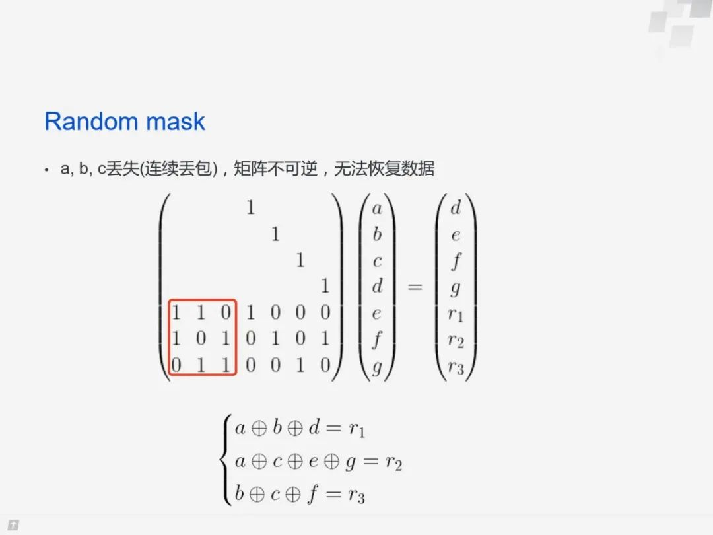

再看busty抗突发丢包的编码方式，和前面一样先写出编码的式子。

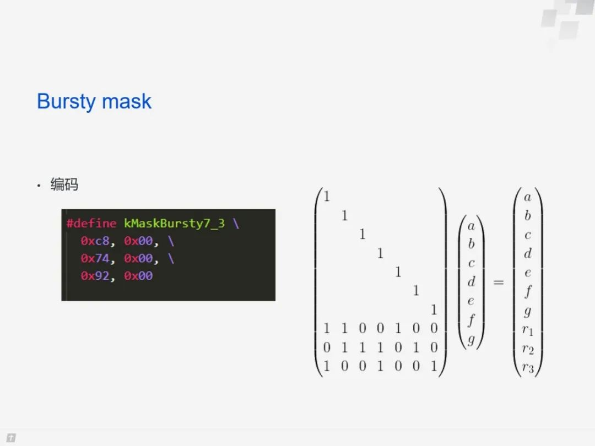

将a、b、c和相应行删掉，这个系数矩阵是可逆的，可以用高斯消元法验证，所以可以恢复丢失的包。用中学数学的观点看，解下方的方程组，观察到最后一个方程只含a一个未知数，先解出，然后代到第一个方程，求出b，再求出第二个方程得到c。用高等数学的观点看，就是用高斯消元法求解方程组，它是一种程序化的手段，也是计算机所使用的。

这两种mask适用于各自特定的场景，有时不能恢复数据，因为矩阵不可逆。是否有一种方法，丢失任意m个包都可恢复呢？

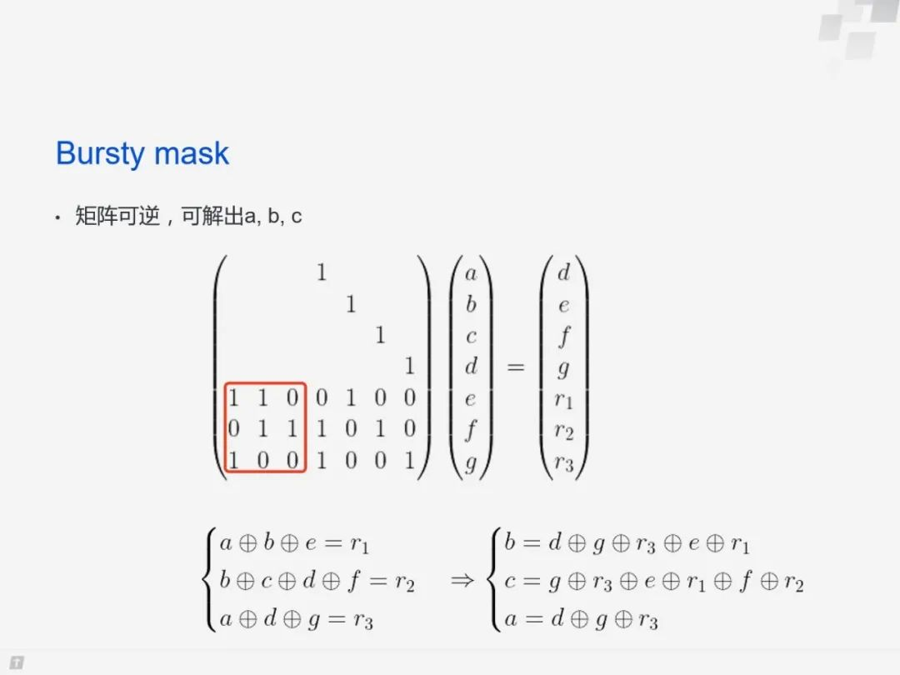

## RSFEC矩阵方式

前面说过，要想恢复数据，矩阵需要可逆，而范德蒙矩阵具有这样良好的性质，删除任意行列得到的方阵都是可逆的。下面红框中的矩阵是范德蒙矩阵，它是一个m行n列的矩阵，n是媒体数据包数量，m是冗余包数量，它的第一行全是1，第二行1、2、3到n，第三行是1、2^2 、3^2 到n^2，每一行在上一行的基础上乘以一个数，最后一行是1、2^(m-1) 、3^(m-1) 到n^(m-1)。m=1时就是PPT开头举的那个最简单的例子。

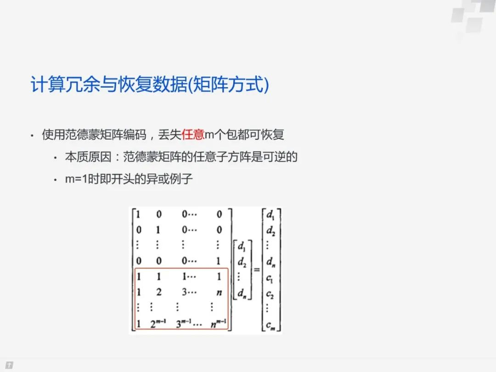

前面介绍的矩阵运算要在计算机上落地实现，会碰到什么问题？运算是在实数域上进行的，加减乘除可能会溢出，浮点数的计算可能损失精度。假设编程语言中有一种数据类型是`uint3_t`，即3比特位，它可以表示8种状态(0~7)。如果是普通意义上的四则运算，比如`3*7=21`会溢出，1/3也无法用`uint3_t`表示，而有限域上的“加减乘除”没这些问题，运算结果仍然在该域(0~7)上。

这里为什么要造一种奇怪的数据类型`uint3_t`呢？是为了方便讲解，因为后面会将它的所有8种状态列出来，如果用常见的`uint8_t`举例，要列出256种状态不方便。`uint3_t`和`uint8_t`的原理是类似的。

有限域是一门通用的技术，这部分内容相对独立，不仅解决RSFEC的运算问题，还运用于密码学等领域，有兴趣的同学可以参考《密码编码学与网络安全》的有限域一章。

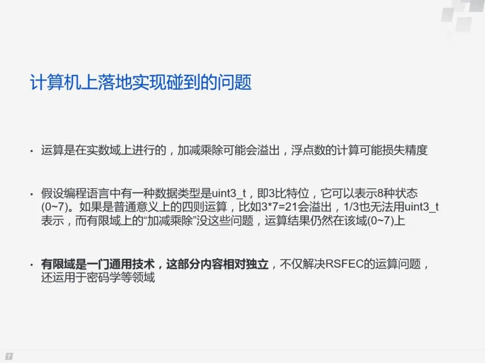

`uint3_t`上共8个元素，这里要抽象看待，看成8种状态或者8个符号，我们定义一种运算规则，运算对象是多项式。看下多项式怎么得到的，将8个数字写成二进制形式，比如3的二进制是011，某位上是1，相应地有一个x的次方，最低位是x^0 即1，011就是x+1，或者说g+1，取什么符号没有关系。再比如101对应x^2+1。先关注表格中红框的三列，其他两列后面介绍。得到8个多项式后，我们定义一种多项式运算。

使用代数基本规则的普通多项式运算。比如`x+x=2x，x*x=x^2`。

系数运算是模2运算的多项式运算，即系数在GF(2)={0, 1}中。比如x+x=2x，系数再模2，最终结果是0。

系数在GF(2)中，且多项式被定义为模一个3次多项式prime polynomial `x^3+x+1` 的多项式运算。prime polynomial不能被`uint3_t`上8个多项式中的两个相乘得到，也就是不可约（irreducible），可以理解为多项式的“素数”。

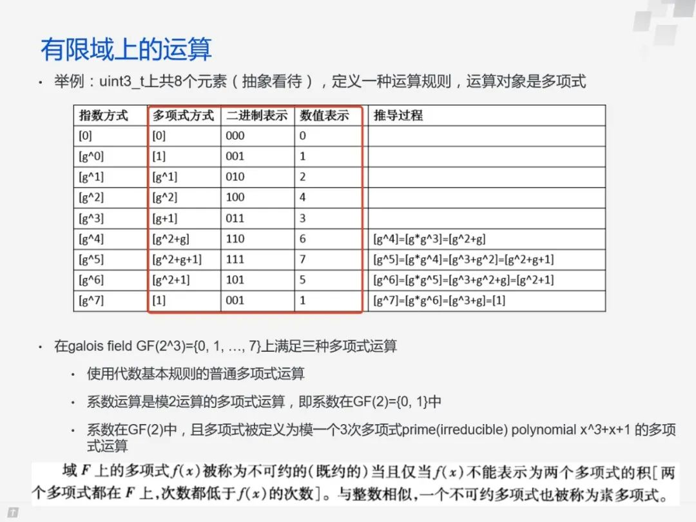

举个例子，计算3乘以7，先将它们写成相应的多项式，x+1和x^2+x+1，运用第一条规则展开，同类项合并，比如 x^2 + x^2=2x^2，运用第二条规则，系统模2后为0，同理x+x=0，得到 x^3+1 ，此时它“溢出”了，因为那八个多项式最高次数就是2，再运用第三条规则，将次数降下来，目的是使它落到8个多项式中。模一个多项式怎么计算呢？我们知道整数中比如a模b就是a减去整倍数个b，使最终结果小于b就行，同理，这里可以将x^3+1减去prime polynomial x^3+x+1，得到-x，系数模2得到x，对应的二进制是010，十进制是2。这样原本普通意义上的3乘以7=21溢出了，用我们定义的规则得到2，称作运算是封闭的。

用同样的方法对`uint3_t`上的所有元素进行四则运算，得到下表。其中减法用加法逆元表示，比如a-b等于a+(-b)，除法用乘法逆元表示，a/b等于`a*b^(-1)`。

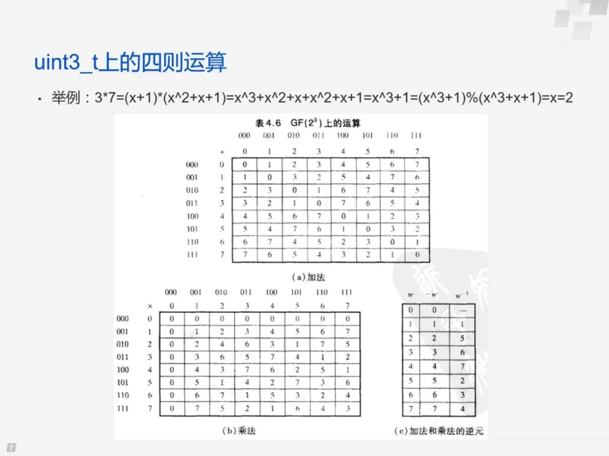

前面的乘除法计算过程还是比较复杂的，有限域有一个良好的性质是所有元素可以用generator的指数次方表示，generator为primitive polynomial的根，比如g^3+g+1=0 ，不用求出具体值，只是一种表示，要抽象看待。由于异或性质，g^3=-(g+1)=g+1，看表格中的元素3，它的二进制是011，即g+1，也等于g^3，其他元素都可以化成指数形式，可以看下右边的推导过程。

每个元素都表示为g的指数次方后，可以将它们用表格形式列出来，比如g^3=3, g^6=5 。同时将对数列出来，比如g^6=5，也就是log5=6。接下来重新计算`3*7`，查表找到对数和指数结果，进行加法和模运算就可以得到结果，这样就将乘除法转化成加减法，提升了运算效率。

现在我们知道怎么对`uint3_t`上的元素进行运算了，计算机上实现矩阵运算时每个元素用一个字节`uint8_t`表示，计算原理与`uint3_t`是类似的，只是在GF(2^8)上进行，四则运算的结果仍可以用一个字节表示。

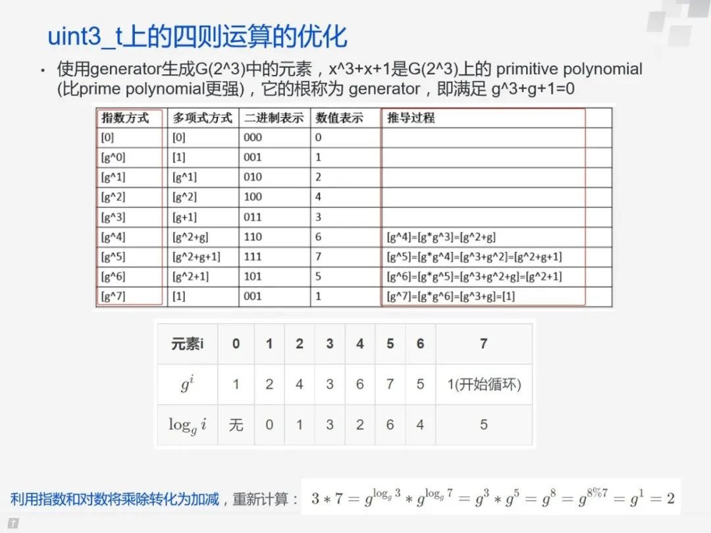

## 总结

总结下RSFEC用到的两个核心技术，第一个是利用范德蒙矩阵任意子方阵可逆的性质，允许丢失任意m个包。第二个是解决计算机上落地时碰到的溢出、浮点数精度问题，离散数学中的有限域恰好搭建了连续数学与计算机间的桥梁，利用有限域上的运算封闭性质落地。

关于RSFEC还有很多值得探讨的点，柯西矩阵是与范德蒙矩阵性质类似的一种矩阵，也是任意子方阵可逆，它和范德蒙矩阵比有哪些优势，感兴趣的同学可以看下参考资料，这里就不展开了；前面提到恢复数据时需要求逆或者说高斯消元法，它的普通算法的时间复杂度是O(n^3)，可以利用范德蒙矩阵、柯西矩阵的结构特点优化求逆，将时间复杂度降为O(n^2)；另外矩阵运算时可以利用SIMD单指令多数据加速计算，具体可以看看参考资料。

以上就是今天的分享内容，欢迎大家线下交流探讨。

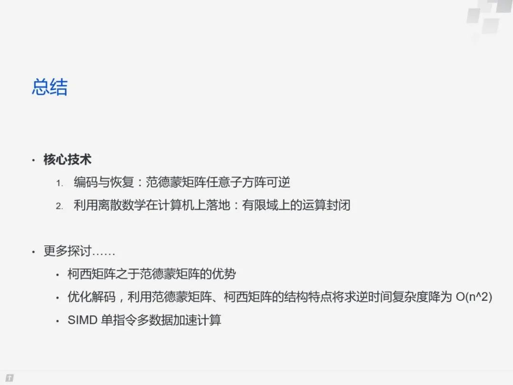

## 参考资料

* [ULP FEC 标准](https://datatracker.ietf.org/doc/html/rfc5109)
* [Flex FEC 标准](https://datatracker.ietf.org/doc/html/rfc8627)
* [谈谈有限域那些事儿](https://blog.csdn.net/qmickecs/article/details/77281602)
* [离散对数和椭圆曲线加密原理，讲了有限域在加密中的应用](https://blog.csdn.net/qmickecs/article/details/76585303)
* William Stallings 《密码编码学与网络安全：原理与实践》
* Cryptography and Network Security: Principles and Practice
* [音视频通信中FEC的数学原理](http://justme0.com/archive/fec.html)
* [WebRTC FEC 解读](https://xjsxjtu.github.io/2017-07-16/LearningWebRTC-fec/)
* [FEC各种编码](https://zhuanlan.zhihu.com/p/93684856)
* [FEC解码优化](https://patents.google.com/patent/CN103780352B/zh)
* [柯西矩阵之于范德蒙矩阵的优势](http://abcdxyzk.github.io/blog/2018/04/16/isal-erase-2/)
