<!--BEGIN_DATA
{
    "create_date": "2023-07-24 17:30", 
    "modify_date": "2023-07-24 17:30", 
    "is_top": "0", 
    "summary": "RTC在不同业务场景下的最佳音质实践", 
    "tags": "WebRTC", 
    "file_name": "RTC在不同业务场景下的最佳音质实践.md"
}
END_DATA-->

#### <p>原文出处：<a href='https://mp.weixin.qq.com/s/23b03vNYnWRXllPZYF60Og' target='blank'>RTC在不同业务场景下的最佳音质实践</a></p>

## 背景介绍  

WebRTC是目前实时音视频领域最流行的开源框架。2010年Google收购GIPS引擎后，将其纳入Chrome体系且开源后，命名为“WebRTC”。WebRTC获得各大浏览器厂商的支持并纳入W3C标准，促进了实时音视频在移动互联网应用中的普及。2021年1月，W3C和IETF两大标准制定组织宣布WebRTC成为官方标准，用户无需下载额外组件或单独的应用程序，便可以支持在网络上的实时音视频通信。尽管WebRTC具有免费开源的特性，但其庞大、繁杂，学习门槛高，又缺乏服务器方案的设计和部署，为基于WebRTC搭建的商用方案留下了发展空间。第三方的RTC PaaS厂商凭借规模效应和技术优势成为开发者的首选，推动实时音视频行业进入发展的快车道。

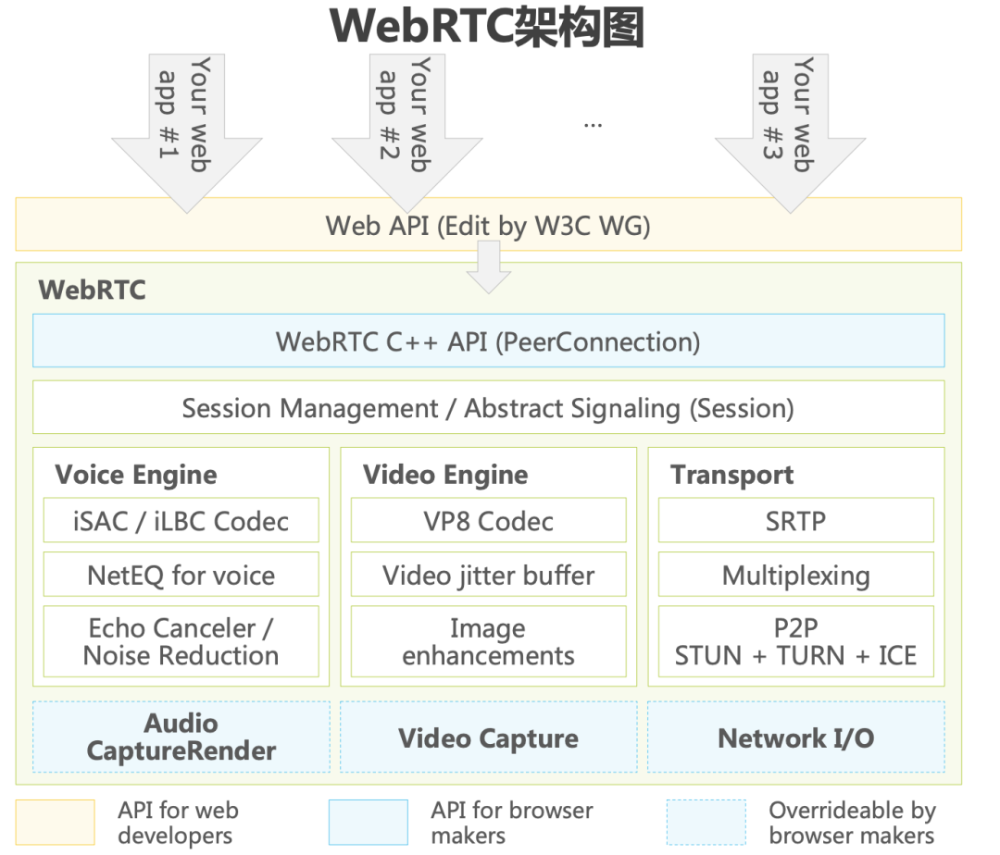

本篇将重点结合webrtc的音频引擎架构，分析其背后影响音质的关键技术点，并将介绍目前业内主流RTC厂商的不同业务场景背后的差异化技术方案下的选型思考，揭秘全链路场景下的最佳音质提升方案。

## 1.webrtc音频架构介绍

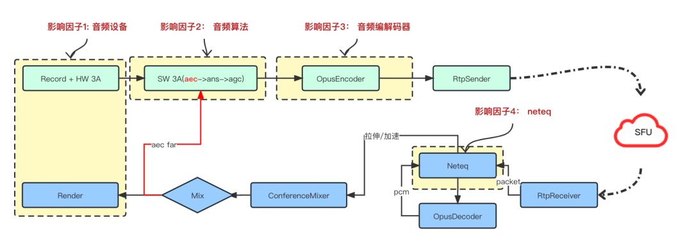

整个RTC的音频架构如上图所示：

  * **上行链路：**音频信号经过设备采集回调后，会经过软件3A(声学回声消除（aec）, 自动噪声抑制（ANS），自动增益控制（AGC）) 处理后，再经过音频编码器编码，编码后做RTP打包发送到SFU; 发送端是采集线程驱动，采集设备启动后，即10ms一次回调音频数据，数据需要及时取走不阻塞采集线程，是push模式，通常采集线程和软件3A都在采集线程处理，到音频编码环节则是异步线程；

  * **下行链路：**接收端，由于网络丢包，延迟，抖动，乱序等因素，在收到音频RTP包后，会放入neteq做解析排序等处理，解析后会调用音频解码器（Decoder）做解码，解码后的pcm数据，根据neteq的不同判断策略，会做丢包补偿（PLC）或者加速播放等后处理，处理后的不同路的音频数据流，会经过混音器（Mixer）混音为适合Render播放的格式播放，在Mix后送给Render之前，还会送给软件3A的AEC模块，做远端参考信号用来消除回声，避免对端用户听到自己讲话的声音。和采集线程不同的是，下行链路是Render（播放）线程驱动，render线程启动后，10ms一帧定时回调向播放buffer要数据，是采用pull模式驱动。

## 2.影响rtc音质的因素

根据1中音频架构描述，影响rtc端到端音质体验的全链路因素，集中在四个方面，也即：音频设备，音频3A, 音频编码器，Neteq。  

### 2.1 音频设备

音频设备是影响音质的源头，但不同端的音频设备特性不同，表现也不同，因此，提高音质的第一步，就是要深入了解各个端的音频设备的差异性；

#### 2.1.1 Android端

  * 音频驱动：Android端提供了不同的音频采集播放驱动。目前主流的音频采集播放驱动是基于Java的AudioRecord和AudioTrack等模式，以及基于C++的Opensles驱动；此外，Google在Android O 版本中引入了全新 Android C API——AAudio, [相关资料](https://developer.android.com/ndk/guides/audio/aaudio/aaudio)， 官方说法此API 专为需要低延迟的高性能音频应用而设计；

Java: AudioRecord/AudioTrack

Opensles: C++ ———— （低延迟，业内主流）

AAudio———问题较多，待完善

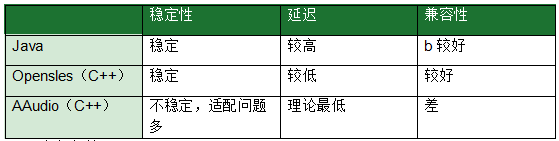

  * 音频参数：

AudioMode:

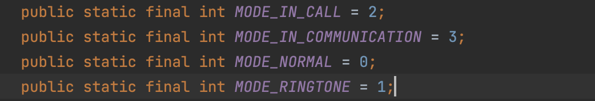

AudioSource：

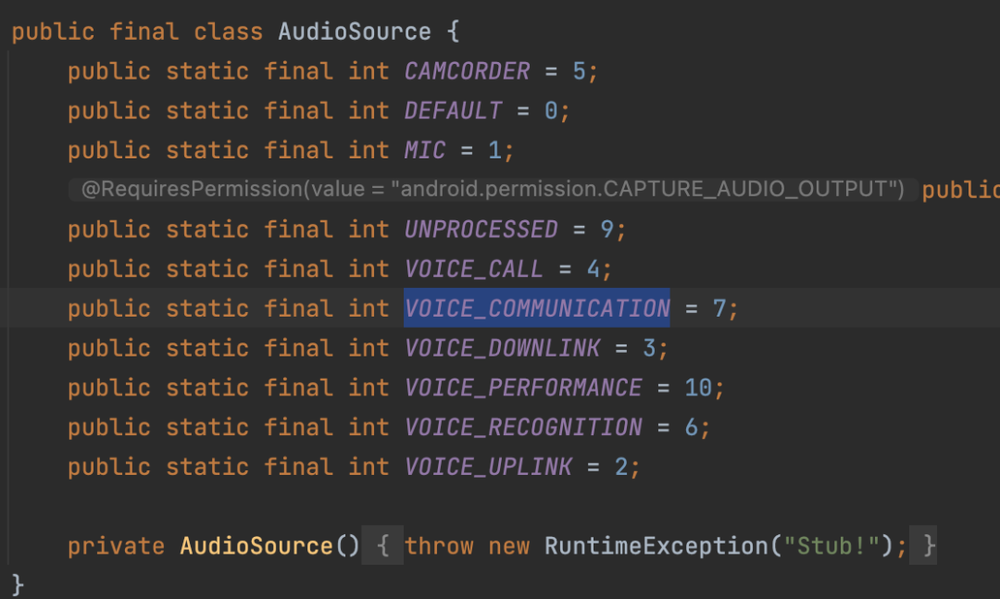

StreamType: 影响音量条

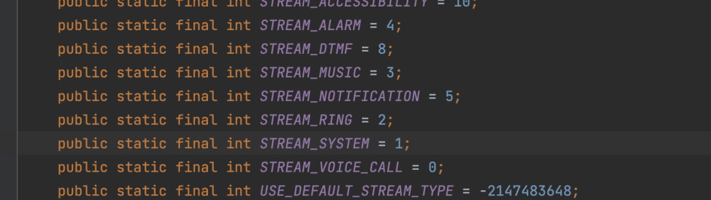

  * RTC的软硬件3A参数设置：`AudioMode/AudioSource/StreamType`

  * 硬件3A: `audioMode = MODE_IN_COMMUNICATION` `audioSource = VOICE_COMMUNICATION`， `streamType = STREAM_VOICE_CALL`;

  * 软件3A: `audioMode = MODE_NORMAL`; `audioSource = MIC`; `streamType = STREAM_MUSIC`;

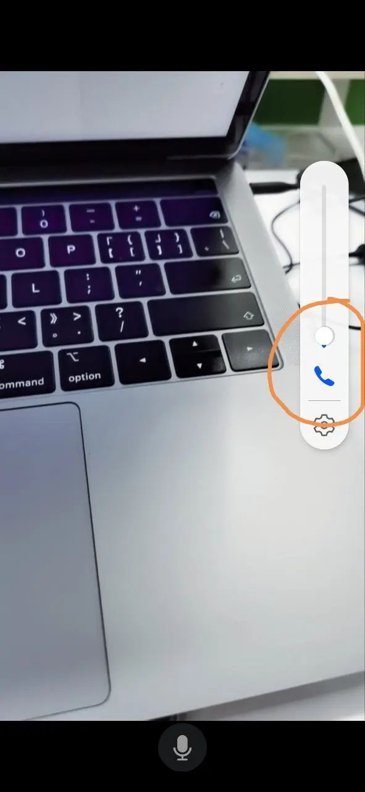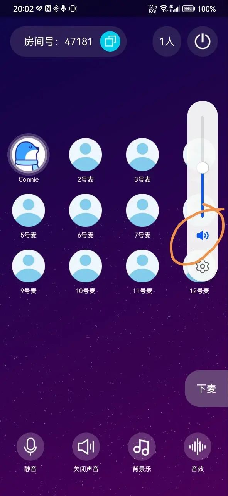

  * 硬件3A模式和软件3A模式下的区别：

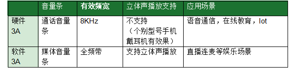

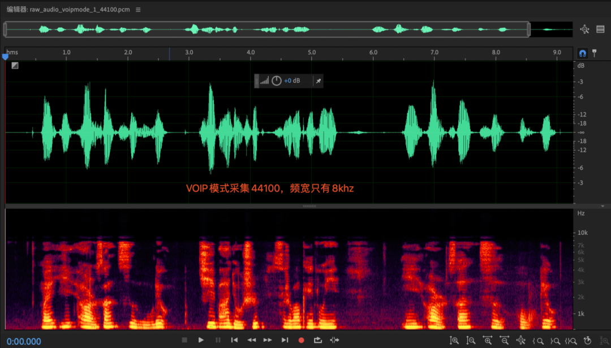

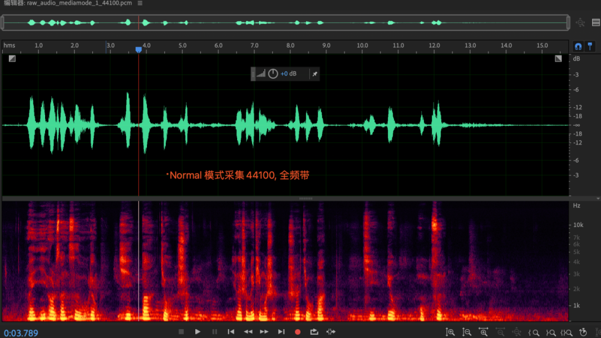

业内通常做法：由于Android的碎片化问题，不同的手机厂商，对不同音频驱动的支持能力不同，兼容性差异较大，即使是最常见的Java模式和Opensles模式，也存在适配问题；因此，**rtc厂商在Android端通常都会针对上面参数结合不同Android机型做配置下发来解决稳定性问题和可用性问题**；如下所示，是典型的一种配置下发的参数：

```
{
  "audioMode": 3,
  "audioSampleRate": 48000,
  "audioSource": 7,
  "query": "oneplus/default ",
  "useHardwareAEC": true,
  "useJavaAudioClass": true
}
```

目前RTC领域，opensles大量使用，其中一个原因，从架构上看，ADM（AudioDeviceModule）是C++层统一管理，c++层数据回调方便减少从java->jni->c++的数据回调耗时；

声道对采集音质的影响：通常来说，双声道采集下的频谱成分相比较单声道采集更丰富

**Android硬件3A，原生Android支持硬件AEC和ANS开启和关闭，但由于目前国内Android手机厂商定制Rom修改，导致大部分android手机厂商在硬件3A下强制开启硬件AEC和ANS， 无法真正关闭；**  

  * https://developer.android.com/reference/android/media/audiofx/AcousticEchoCanceler

  * https://developer.android.com/reference/android/media/audiofx/NoiseSuppressor

  * **Android AudioKit**

  * [华为AudioKit](https://developer.huawei.com/consumer/cn/codelab/HMSAudioKit/#0；https://developer.huawei.com/consumer/cn/doc/development/Media-Guides/introduction_services-0000001053333356)；

  * 集成收益：可以解决部分A厂手机采集信号掉频宽的问题

  * 限制条件：

  1. 鸿蒙系统

  2. 麒麟芯片

  3. 播放线程先于采集线程启动  

  * 除了频宽的问题，Andorid设备的采样率，在不同设备上表现的差异性也很大，通常用44100或者48000Hz的采样率兼容性更好，在不同的设备上，可能对这两种采样率的支持表现不一样，比如会出现硬件3A回声消除效果不好，或者采集回调数据不稳定等情况，因此也需要针对采样率做机型适配；

#### 2.1.2 IOS端

  * 音量条：

  * IOS端也分为通话音量条和媒体音量条，不过ios系统的UI显示上未做区分，UI图标显示都是一样的，区分的方式就是如下图所示，如果是通话音量条，音量条不可以调节到0，媒体音量条，音量条可以调节到0；  

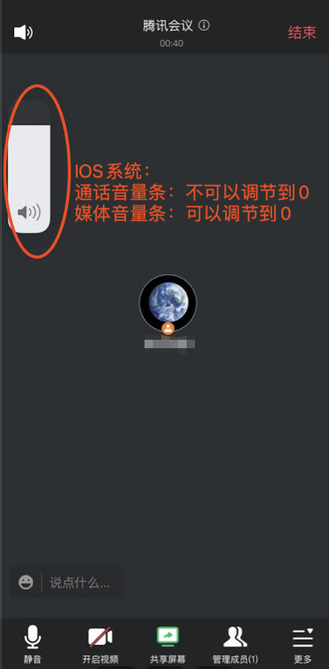

  * 软硬件3A:

  * 在IOS系统下，同样和Android系统类似的现象：


  * RTC场景下，IOS系统软硬件3A的参数搭配：

  * 硬件3A: `kAudioUnitSubType_VoiceProcessingIO + AVAudioSessionModeVoiceChat`

  * 软件3A: `kAudioUnitSubType_RemoteIO + AVAudioSessionModeDefault`

  * 下面是ios相关系统接口说明：

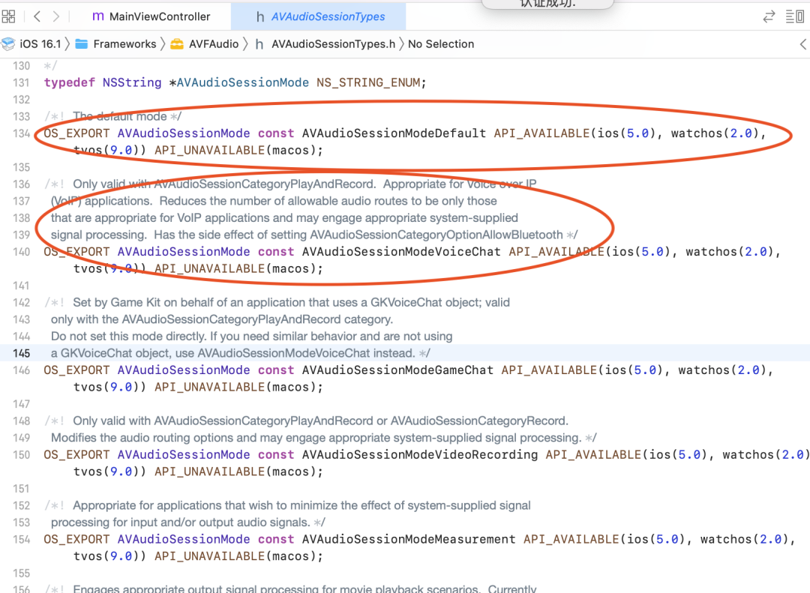

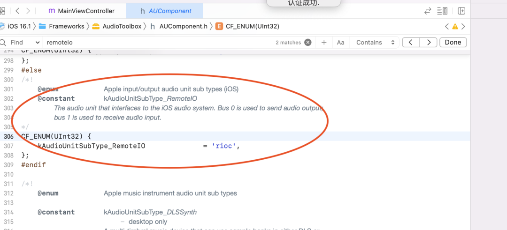

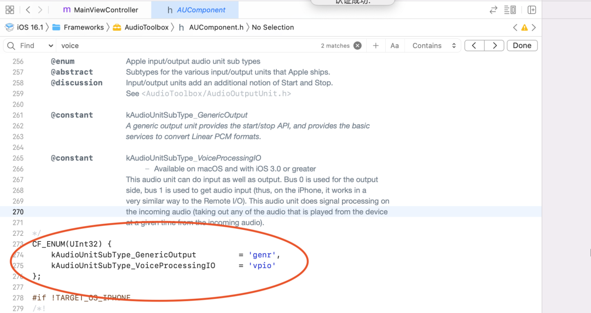

  * WebRTC 在 iOS 平台用的是 AudioUnit 采集，相关代码如下：

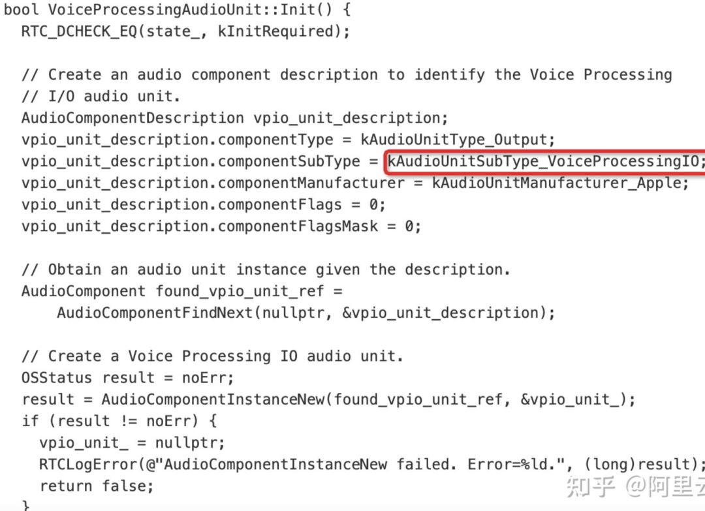

  * 根据苹果的 API 说明，iOS 提供了三个 I/O units，其中 Remote I/O unit 是最常用的。连接输入输出音频硬件，对传入和传出的样本值低延迟访问，提供硬件音频格式和应用音频格式之间的格式转化。Voice-Processing I/O unit 是对 Remote I/O unit 的拓展，添加了语音聊天中的回声消除，还提供了自动增益矫正，语音质量调整，静音等特性。Generic Output unit 不连接音频硬件，而是提供了一种将处理链的输出发送到应用程序的机制。通常会使用做离线音频处理。

#### 2.1.3 Windows端

  * windows端，通常有三套音频设备驱动：dsound, CoreAudio, Wav  

  * Dsound——兼容性最好，台式机更多使用

  * CoreAudio——兼容性其次

  * Wav——较少使用

  * 当前很多 Windows 设备会在屏幕顶端内置麦克风阵列，提供音频增强功能，开启方式如下图。这个功能默认屏幕正前方夹角区域为拾音区域，通过麦克风阵列技术可以有效的增强拾音区域内发言人语音，“隔离” 拾音区域以外的 “噪声”，其主要的弊端就在于开启此功能后仅支持 8k 频谱，且各厂家增强算法存在差异，效果也参差不齐。因此，软件需要具备能够 bypass 硬件自带音频增强功能的能力，为高音质做保障。

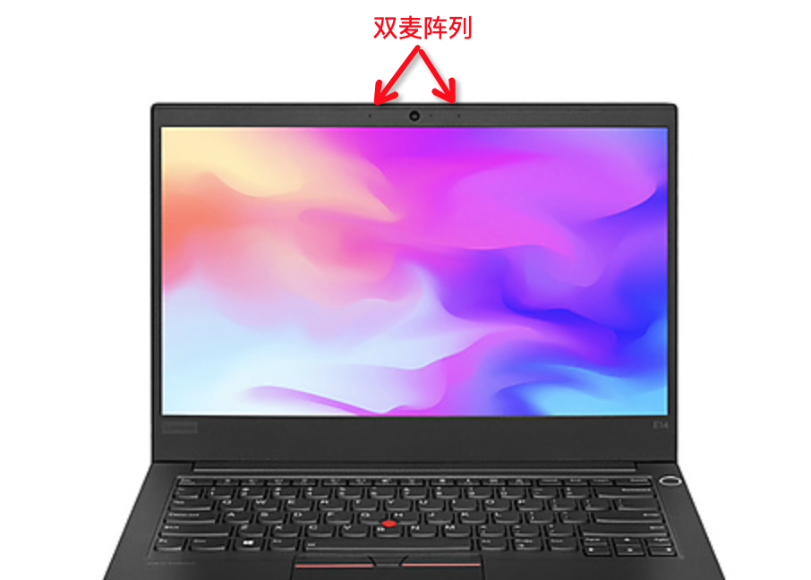

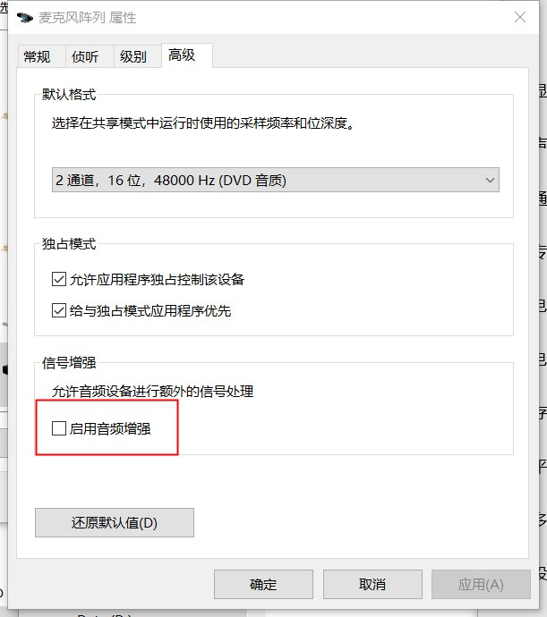

<音频设置中的增强功能开关>

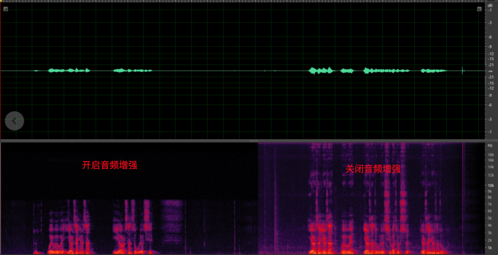

<开启音频增强后，带来的频谱缺失>

  * 音量方面，PC 端设备都支持模拟增益调节，大多数带有阵列的 Windows 设备都有额外的麦克风加强（如下图）。软件算法层面（3A 中的 AGC）需要具备自适应调节他们的能力，保障音频采集音量的平稳以控制采集底噪水平。初值设置或自适应调节不当都会导致音量小和爆音等问题，严重的会影响回声消除和降噪的效果，带来影响可用性的风险。

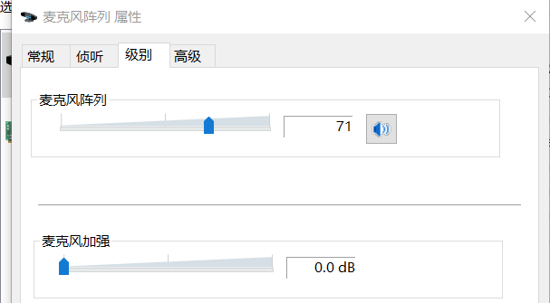

<模拟增益与麦克风加强>

#### 2.1.4 Mac端

  * Mac端使用量较少，此处暂不做详细介绍；

  * Mac端支持类似Windows端的模拟音量动态调节；

#### 2.1.5 音频设备常见的问题及解决方案

  * 由于硬件厂商的不同，不同端的音频采集解决方案参差不齐，因此采集到的音频质量的好坏直接影响着 3A 算法拿到的生产资料的可用性，同时也决定这最终用户接收到音频信号质量的上限。根据实际工作中遇到的音频问题，因为设备采集引起的问题基本可以归纳为如下几类：

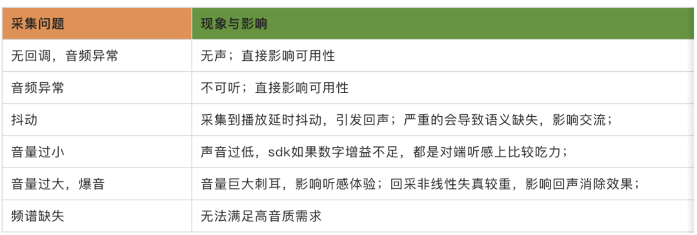

举几个例子：

**（1）采集异常：**

采集异常主要体现在频谱 “模糊”，严重的会导致无法听懂语义，影响正常交流。如下语谱图。

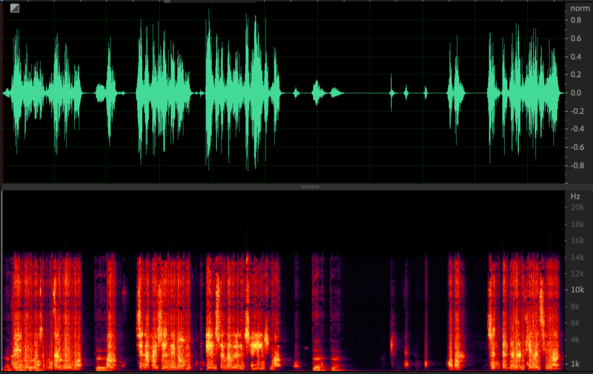

另外，采集异常后，播放的信号被麦克风采集后也会表现出异常，从而引起严重的非线性失真，影响回声消除效果，如下图。

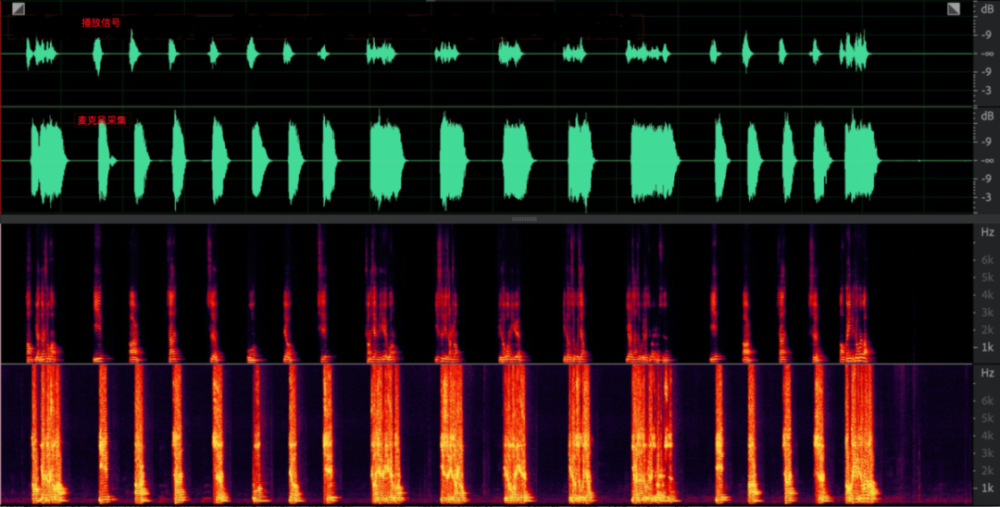

**（2）采集抖动**

常见的就是采集丢数据，听感上会听到有很多高频噪点（下图为上图中噪点放大后的局部图），严重的会影响 AEC 算法中对延时估计准确性和远近端非因果问题，严重的会导致漏回声。

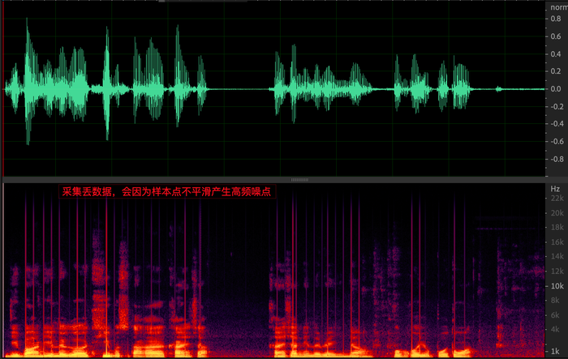

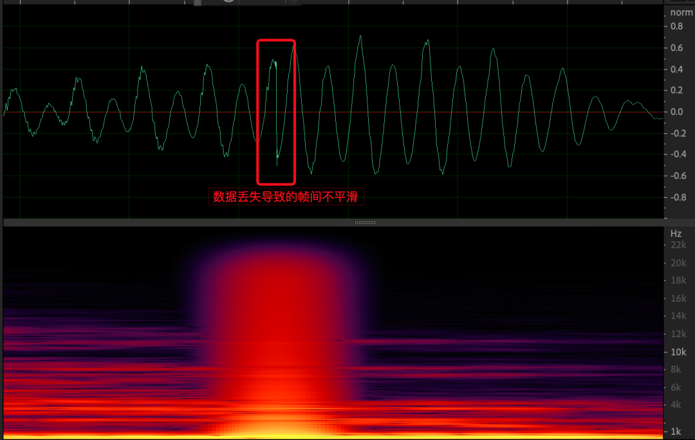

**（3）爆音和音量小问题**

采集爆音问题主要发生在 PC，也是 PC 端设备最应该避免的问题，影响较大，除了截顶导致的频谱失真之外，严重的非线性失真会影响回声消除效果。爆音问题需要 AGC 算法通过自适应调节 PC 端模拟增益以及麦克风加强解决。

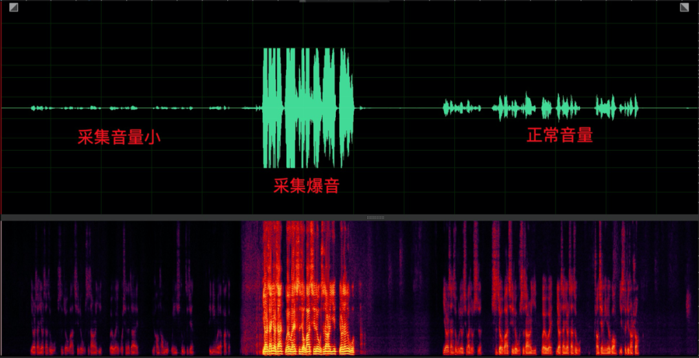

**（4）频谱缺失**

设备采集侧的频谱缺失主要是硬件回调的音频采样率与实际的频谱分布不一致，即使编码器给到很高的编码码率，听感上也没有高音质的效果，此处上面已经介绍过；

**（5）解决方案：**

为了解决各种业务场景下的设备可用性，提高设备采集数据的准确性，常用的策略如下：

  * 设备适配：

Android通过配置下发，针对不同机型，适配合适的采集采样率samplerate，audiomode, audiosource以及采用java还是opensles；

  * 业务层配合策略：

windows: 钉钉会议，用户可以选择采用dsound还是coreaudio

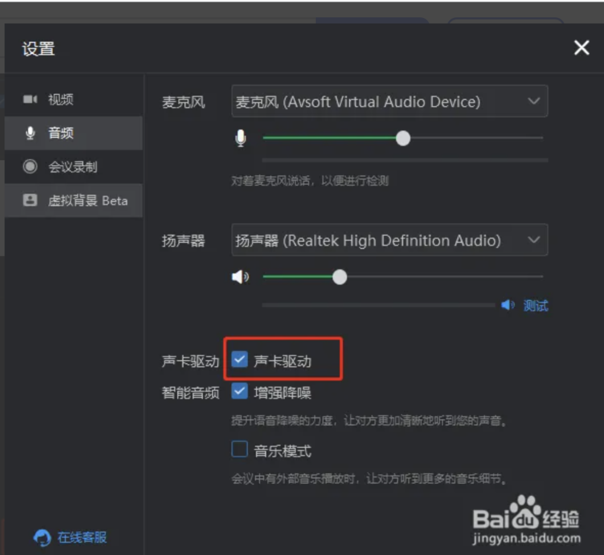

  * sdk自适应策略，通过devicemonitor监测设备是否可用或者出现异常，一旦出现异常后， sdk内部可以采用如下策略：

自动重启音频采集/播放设备；  
自动降级切换音频驱动；

### 2.2 音频3A

音频的前处理是整个音频处理链路中的关键。麦克风采集到的原始音频数据会存在噪声、回声等各种问题，如在多人视频会议场景中，同地多设备同时开麦会造成强烈的啸声，发言者离麦克风较远会导致收音效果不佳。为提高音频质量，需要 在发送端对发送信号依次进行回声消除、降噪和音量均衡的操作，即AEC回声消除、ANS噪声抑制和AGC自动增益控制的3A处理。在通话、语聊、教学、游戏等不同场景中，实时音视频厂商需考虑场景的实际需求，对3A算法进行对应的调 整，以实现良好的音频效果。

在webrtc开源代码中，以Android端为例，webrtc会访问硬件是否有硬件ANS和硬件AEC的能力，如果有，就不启用软件aec；**在实际的商业化的rtc业务场景中，无论硬件3A是否支持，软件3A都会同时开启作为兜底方案，其中主要的原因就是不同设备的硬件3A能力差异化比较大，依赖硬件3A无法做到完全可靠稳定的效果，下面重点分析下3A的原理和对音质的影响；**

#### （1）AEC(声学回声消除)

  * 原理：如下图所示，Room1的用户讲话，通过rtc到对端Room2，经过对端的扬声器播放后被对端的mic采集进来后，再次编码传输到Room1 ,从而Room1可以听到自己的声音，也就是所谓的“回声”，AEC要解决的问题，就是消除回声信号，从而避免对端听到自己的声音；所以，在音视频通信中，常见的问题，“我能听到我的声音”的问题原因，并不是“我”的手机端出了问题，而是与“我”通信的其他人回声消除没有处理好，从而导致“我听到了我自己的声音”。

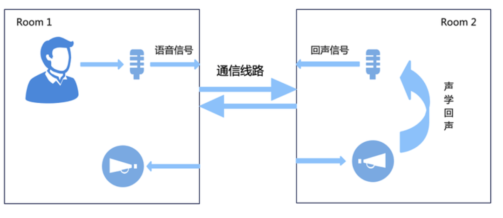

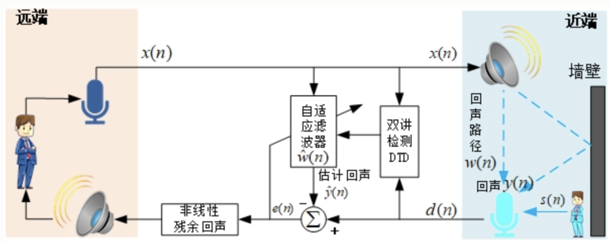

  * 回声消除的基本原理，就是利用近端信号（mic）采集到的包含回声的信号，和远端参考信号（接收到的播放前的对端语音信号）之间的相关性，根据扬声器信号与其产生回声信号相关性为基础，建立远端信号模型，模拟回声路径，通过自适应算法调整，使其冲击响应和真实回声路径相逼近。然后将麦克风接收到的信号减去估计值，即可实现回声消除功能。

  * rtc场景回声消除的几个难点：

  * 硬件aec效果差异性比较大；

  * 双讲问题；

  * 延时估计；

  * 漏回声等；

  * [参考文章](https://developer.aliyun.com/article/781449?spm=a2c6h.14164896.0.0.70a21f36aoEDj7)

#### （2）ANS(自动噪声抑制)


  * webRTC中的ANS是基于维纳滤波来降噪的，对接收到的每一帧带噪语音信号，以对该帧的初始噪声估计为前提，定义语音概率函数，测量每一帧带噪信号的分类特征，使用测量出来的分类特征，计算每一帧基于多特征的语音概率，在对计算出的语音概率进行动态因子（信号分类特征和阈值参数）加权，根据计算出的每帧基于特征的语音概率，修改多帧中每一帧的语音概率函数，以及使用修改后每帧语音概率函数，更新每帧中的初始噪声（连续多帧中每一帧的分位数噪声）估计。

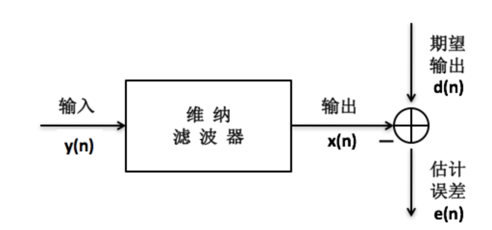

  * 降噪对于音质的影响：

降噪对信号音质的影响大于回声消除模块，这一点源自于在降噪算法的设计之初，我们先验的假设底噪都是平稳信号（至少是短时平稳的），而根据这个假设，音乐跟底噪的区分度明显弱于语音跟底噪的区分度。一段悦耳的音乐，在每个频段上（尤其是高频部分）都有着丰富的细节，任何频段的损失都可能影响听感。但是，音乐在中高频（尤其是高频）部分的能量往往较低，这就导致叠加噪声之后，信噪比很小，给ANS处理带来难度。中高频的音乐细节很可能被误当做噪声处理掉，造成损伤。相比之下，人声一般集中在中低频，能量、信噪比也较高，在 ANS 处理中的损伤会相对少。

**综上，音乐更容易被 ANS 误伤，在有高音质要求的音乐场景，建议降低降噪等级，甚至关闭降噪处理，尽可能从环境层面降低噪声干扰。**

  * 录音音频：

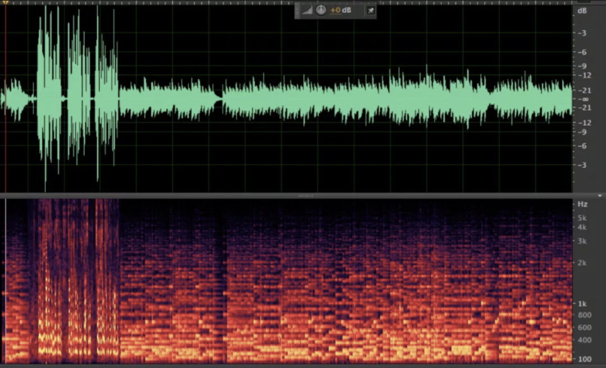

  * ANS后音频：

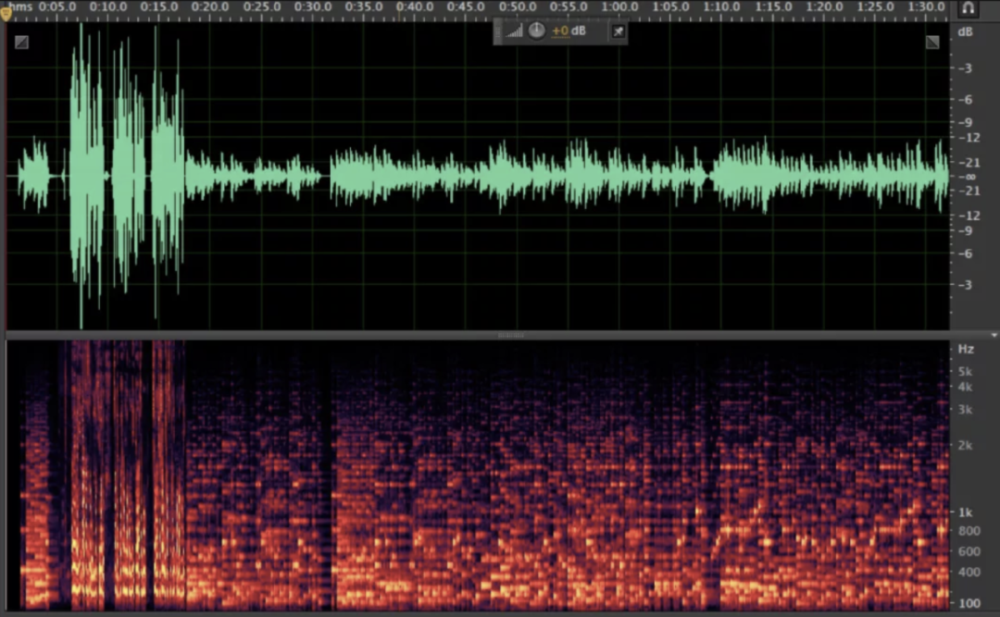

#### （3）AGC(自动增益控制)

  * 并不是所有信号都要进行音量增益控制的，和 ANS/AEC 只抑制噪声/远端回声、要保留近端语音一样，AGC 也要针对采集信号中的近端语音做甄别，避免对噪声、回声等无关信号的增益。考虑这点，把 AGC 模块放在 AEC、ANS 处理之后就比较合适，因为此时信号中的噪声和回声已经被极大的削减。但位置的“优势”，不代表 AGC 就可以毫无顾虑的开展工作。为避免漏网之鱼，往往需要进行人声检测（VAD），进一步区分语音段和无话段。

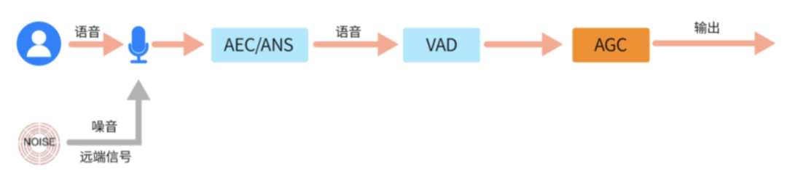

AGC有几个关键的参数：

**目标音量 - targetLevelDbfs：**表示音量均衡结果的目标值，如设置为 1 表示输出音量的目标值为 - 1dB;

**增益能力 - compressionGaindB：**表示音频最大的增益能力，如设置为 12dB，最大可以被提升 12dB；

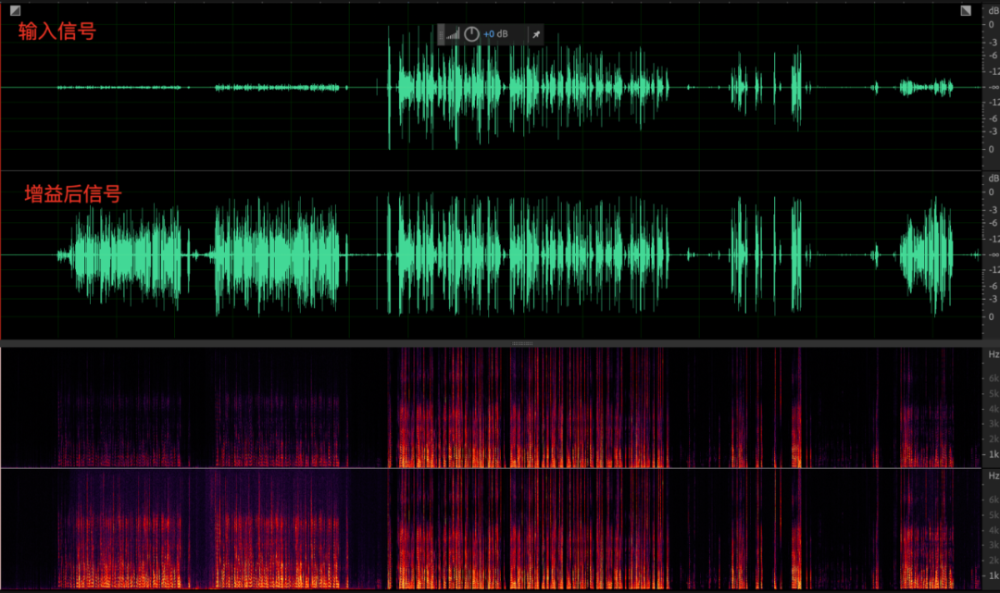

  * **AGC的三种模式：**

```c
enum {
  kAgcModeUnchanged,
  kAgcModeAdaptiveAnalog, // 自适应模拟模式
  kAgcModeAdaptiveDigital, // 自适应数字增益模式
  kAgcModeFixedDigital // 固定数字增益模式
};
```

PC端支持模拟增益调节，在PC端通常会采用kAgcModeAdaptiveAnalog，即模拟增益与数字增益共同调节的方式调节音量；

### 2.3 编码器

**Opus编码器**

Opus 是由 SILK+CELT 混合的编码器，学术上的叫法叫做 USAC，Unify Speech and Audio Coding，不区分音乐语音的编解码器。这个编解码器内有个 Music detector 去判断当前帧是语音还是音乐，语音选择 silk 框架编码，音乐选择 celt 框架编码，通常建议不限制编码器固定采用哪种模式编码。

目前 WebRTC 采用 Application 是 kvoip，默认开启混合编码模式；

编码器内混合编码模式下的音乐与语音编码算法判决：

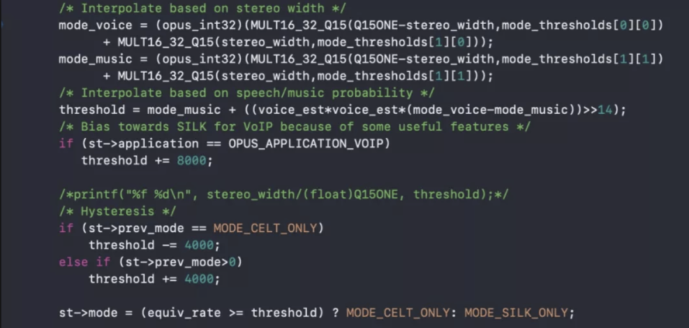

Opus编码具备以下特点：

  * 6 kb /秒到510 kb / s的比特率

  * 采样率从8 kHz（窄带）到48 kHz（全频）

  * 帧大小从2.5毫秒到60毫秒

  * 支持恒定比特率（CBR）和可变比特率（VBR）

  * 从窄带到全频段的音频带宽

  * 支持语音和音乐

  * 支持单声道和立体声

  * 支持多达255个频道（多数据流的帧）

  * 可动态调节比特率，音频带宽和帧大小

  * 良好的鲁棒性丢失率和数据包丢失隐藏（PLC

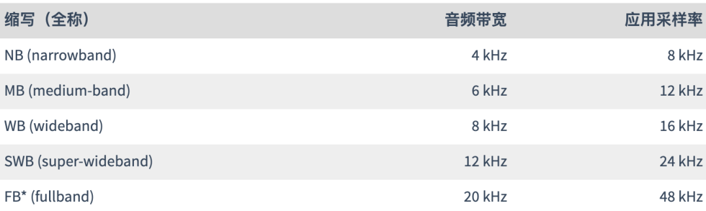

  * 甜点码率：

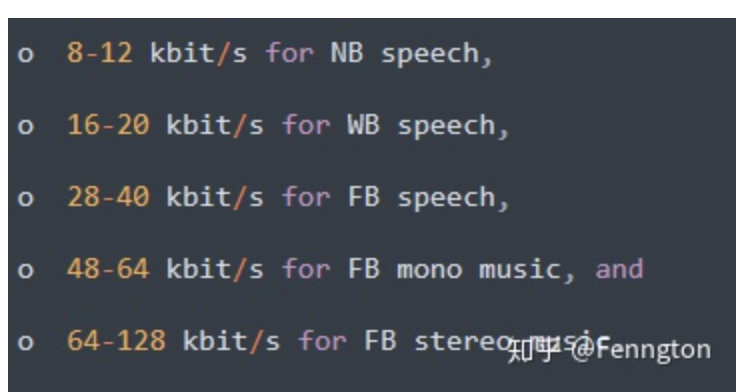

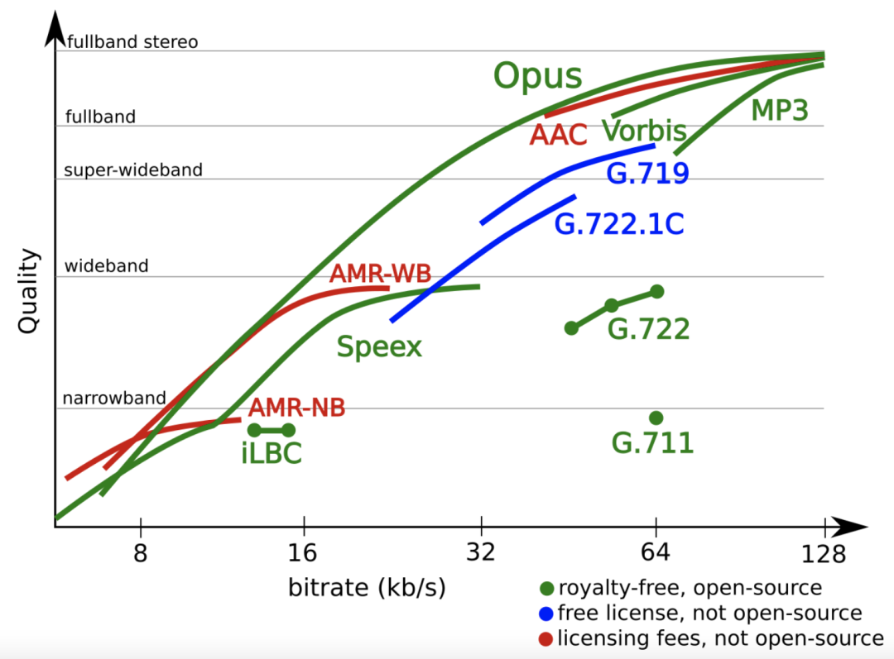

  * 总结：在音乐场景等对音质要求高的场景下，可以采用更高复杂度的Celt编码配合更高的码率，实现音乐高音质体验；在语音场景下，可以采用Silk编码即可；另外，**编码器的码率也很重要，码率过低后，Opus会自动从FB编码降级到WB甚至NB编码，从而导致编码器侧的“频谱截断”效应， AAC也有类似现象，这部分可以结合本文3.6里的案例分析来看。**

### 2.4 Neteq

Neteq是webrtc的一项重要技术，主要是为了抗网络抖动，丢包等；抖动是指由于网络原因，到达接收端的数据在不同时间段，表现出的不均衡；或者说接收端接收数据包的时间间隔有大有小；而丢包是数据包经过网络传输，因为各种原因被丢掉了，经过几次重传后被成功收到是恢复包，重传也失败的或者恢复包过时的，都会形成真正的丢包，需要丢包恢复 PLC算法来无中生有的产生一些假数据来补偿。丢包和抖动从时间维度上又是统一的，在等待周期内等来了的是抖动，迟到很久才来的是重传包，超过等待周期也没等到的就是“真丢包”，neteq优化的目标之一就是要尽量降低数据包变成 “真丢包” 的概率。

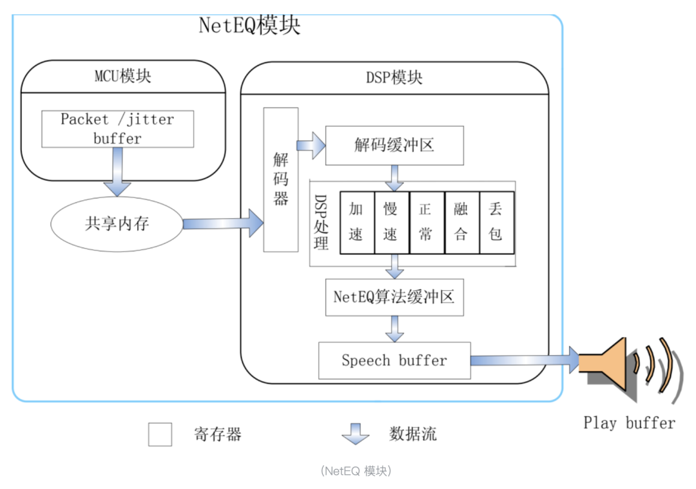

NetEQ 核心模块有 MCU 模块和DSP 模块，MCU 模块负责往 jitter buffer 缓存中插入数据和取数据，以及给 DSP 的操作；DSP模块负责语音信息号的处理，包括解码、加速、减速、融合、PLC 等。同时 MCU 模块从 jitter buffer 中取包受到 DSP 模块相关反馈影响。MCU 模块包括音频包进入到 buffer，音频包从 buffer 中取出，通过语音包到达间隔评估网络传输时间延时，以及对 DSP 模块执行何种操作（加速、减速、PLC、merge）等。DSP 模块包括解码，对解码后的语音 PCM 数据进行相关操作，评估网络抖动 level，向 play buffer 传递可播放的数据等等。

Neteq当发生真正的丢包时，会采用丢包补偿 (Packet Loss Concealment，PLC) 算法。PLC 算法可以通过利用所有已得到的信息对丢失的音频包进行恰当的补偿，使之不易被察觉，从而保证了接收侧音频的清晰度和流畅度，给用户带来更好的通话体验。

在整个rtc链路中，丢包是数据在网络中进行传输时会经常遇到的一种现象，也是引起 VOIP(Voice Over Internet Phone, VOIP)通话中语音质量下降的主要原因之一。传统的 PLC 解决方案主要基于信号处理原理，基本原理是利用丢包前的解码参数信息来重构出丢失的语音信号。**传统的 PLC方法最大的优点是计算简单，可在线补偿；缺点是补偿的能力有限，只能有效对抗 40ms 左右的丢包。**应对长时连续突发丢包时，传统算法会出现机械音，波形快速衰减等无法有效补偿的情况；

如下图所示，在固定丢包 120ms 时，`neteq_plc` 算法通过简单的基因周期的重复和衰减完成丢包补偿，在长时丢包发生时，听起来有很重的机械音，而且会影响未丢包部分的波形；`opus_plc` 算法的补偿能力有限，只能有效补偿 40ms 左右，多于 40ms 的丢包会被衰减为静音。

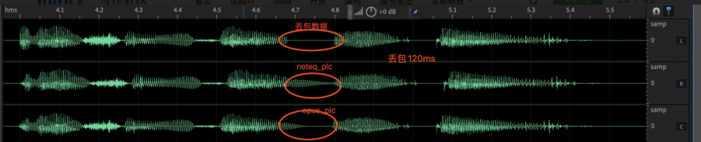

因此，全链路提高音质，在网络和neteq侧，有两个技术方向可以优化：

  * 通过Red/FEC+Nack提高抗弱网能力；

  * 通过接收端PLC算法优化提高“真丢包”下的听感；

## 3.不同的业务场景玩法及背后的技术选型思考

### 3.1 直播场景

  * 直播场景通常是以娱乐为主的场景，主播通常会在手机上外接声卡播放音乐，这类场景的特点是对音质要求高，尤其是音乐音质，因此技术方案上，通常采用软件3A+媒体音量条+音乐编码的方案，并且rtc在外接声卡时通常不对声音做3A处理，在不接声卡的时候，也采用弱模式的降噪或者直接关闭降噪；

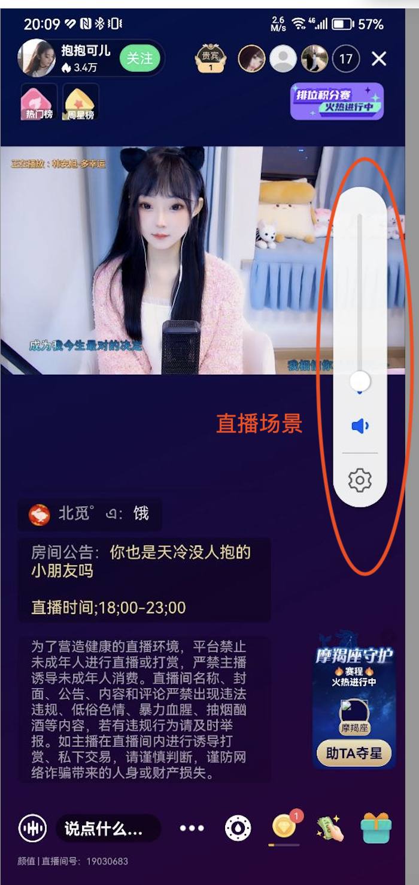

### 3.2 会议场景

  * 会议场景是典型的语音通话为主的场景，因此，腾讯会议，钉钉会议等普遍采用的是**硬件3A的模式，通话音量条，语音编码，**下图是钉钉会议移动端， **其中的“高保真音乐模式”实际对应的做法，就是关闭软件降噪（ANS）算法；**不过这个方案的弊端也比较明显，那就是采集的声源有效频宽已经很低并且经过了硬件3A处理，后面再关闭软件3A已经收益不大了；

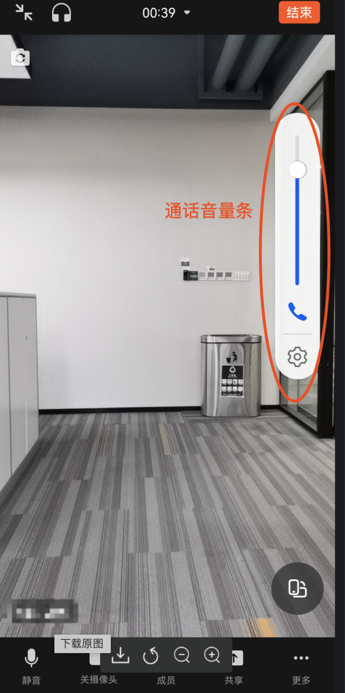

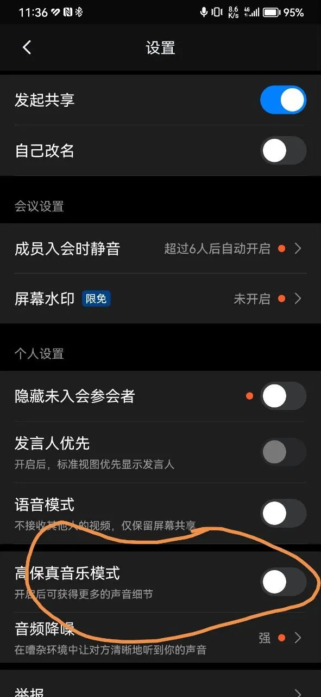

腾讯会议的客户端，是同样的方案：

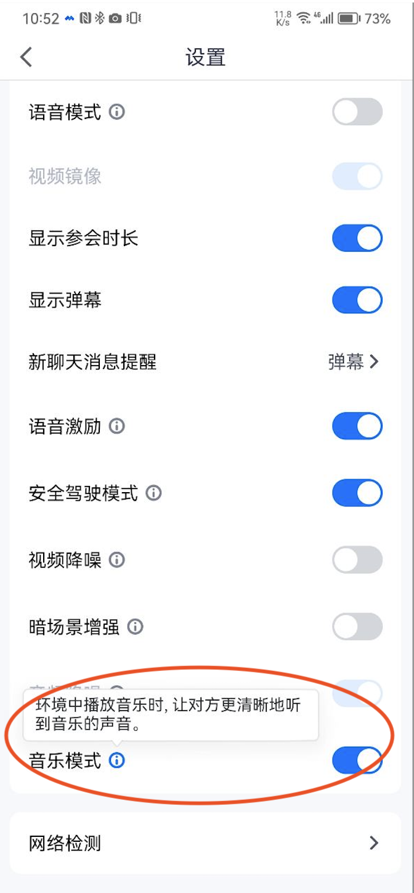

### 3.3 通信场景

  * 以微信视频通话为例，是典型的通信场景，通信场景和会议场景下的音质技术选型上是一样的方案，也即是硬件3A+通话音量条的方案，但微信通话不提供设置会议中音乐模式的功能；

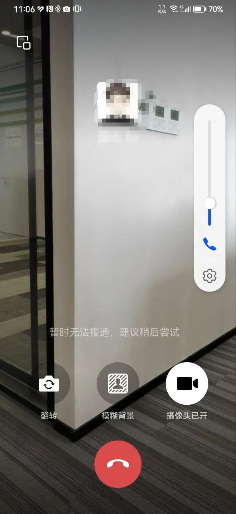

### 3.4 在线教育场景

在线教育场景，从细分领域来说，又分为普通的在线教育场景和音乐类教育场景，前者以授课内容以语音讲授为主，后者以乐器演奏为主，比如钢琴教育等；

  * 普通教育场景：

普通教育场景，从音质的角度来说，以保语音音质清晰可懂为主，因此，常见的方案，是采用与通信场景类似的硬件3A的解决方案；

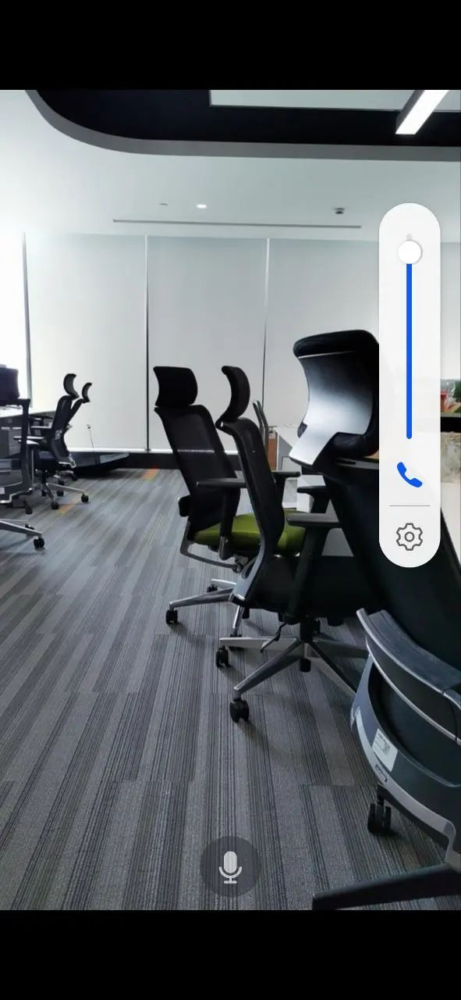

  * 音乐教育场景：

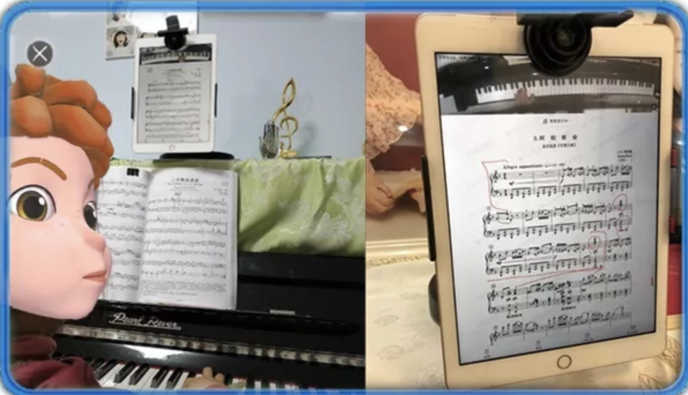

**音乐教育场景本质上与直播场景类似，也是归于泛娱乐场景的一种，这类场景的背后技术选型也需要以音质为主，需要从采集源到3A，编码器等全链路保音乐为主，即以软件3A采集+音乐降噪+音乐编码的方案；**

### 3.5 "一起看"场景

"一起看"场景是指在多人在一个房间实时语音聊天的场景下，同时一起观看同一个视频，这类应用场景以及其延伸场景包括“一起看电影”，或者在教育课堂老师放视频课件给线上同学一起观看，或者线上穿插视频剧情的剧本杀游戏等场景中。

下图是典型的目前该场景的Top1 APP "微光"：


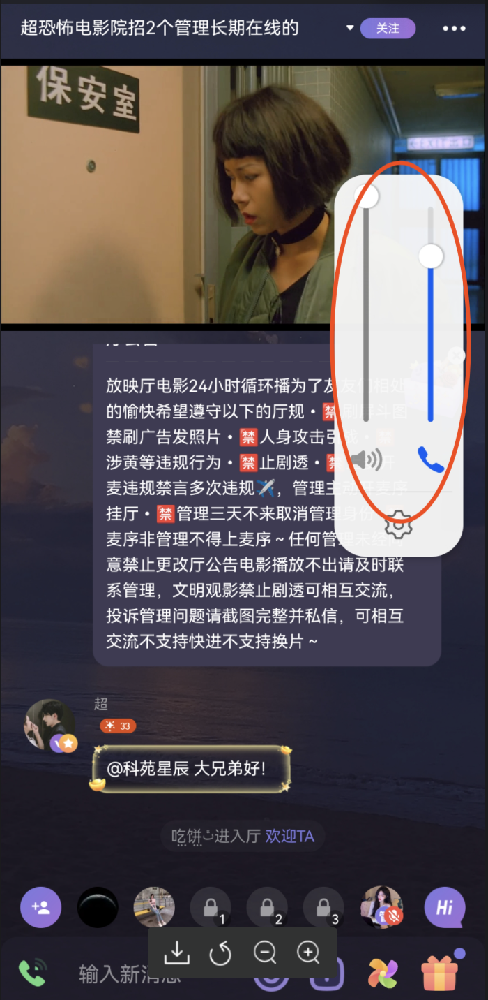

该场景下的技术难点在于，播放器的播放sdk，与rtc的sdk，是两个sdk，如何解决播放器的声音的回声消除问题，否则会议中的人，会听到两遍电影的声音，并且由于回声的存在，播放器再播放中，电影中的人声会触发语音激励，导致UI上即使上麦用户不说话，UI的音浪也会随着电影中人物说话声音而振动，因此，该场景下的难点在于消除电影回声；针对这个场景，目前有三种解决方案：

  * 方案一：硬件3A，该方案实现简单，依靠硬件3A来消除电影回声，目前微光的线上版本用的就是该方案；但该方案有几个问题：

  1. Android有双音量条；播放器是媒体音量条，语聊的rtcsdk是通话音量条，因此用户体验不太好，麦上用户默认调节的是通话音量，媒体音量需要单独调节；

  2. Android硬件3A不同机型的aec效果不一致，存在个别android机型回声消除不好导致的漏回声问题，无法解决，体验不好；

  3. IOS端虽然也可以采用硬件3A方案，但ios端在ios14以上，由于ios在硬件3A和媒体音量同时存在时，优先保证通话音量，会出现即使播放器音量调到最大，实际电影声音仍然很小的情况，严重影响用户体验；

  * 方案二：方案二和方案三的核心思想，就是拿到播放器渲染前的音频参考信号，送给软件aec做远端参考信号做回声消除，从而消除回声；并且方案二和方案三都可以统一使用媒体音量条，rtc都用纯软3A的方案接入，可以很好的解决方案一中的三个体验问题。

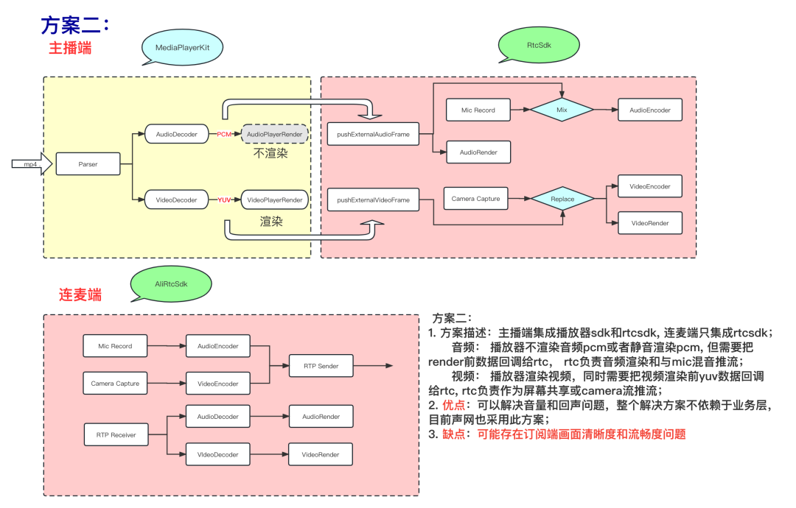

  * 方案三：

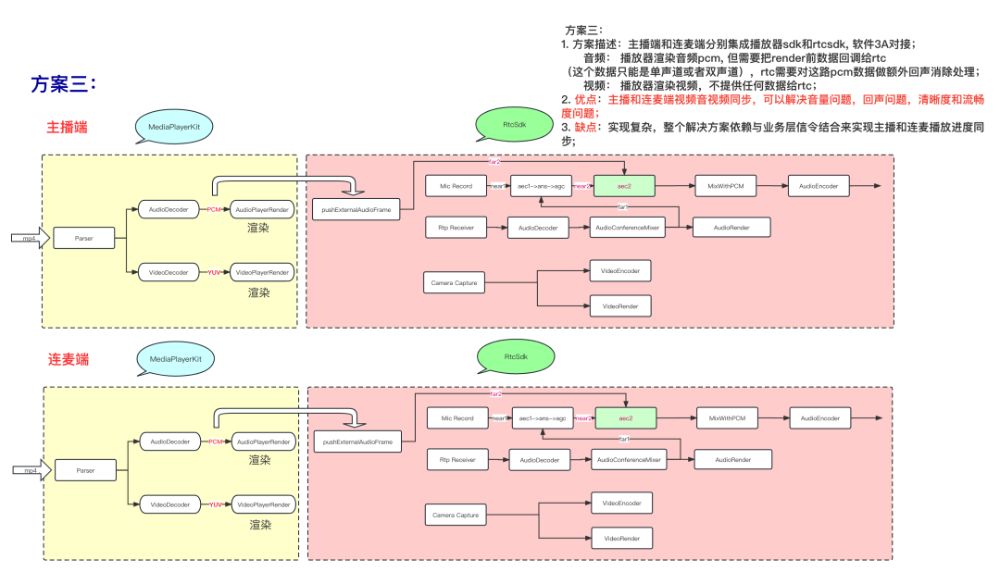

方案三更进一步的演进方案，也可以通过rtc的信令通道，将主播的播放进度操作同步到连麦端，从而做到播放进度同步，业务层逻辑可以做到最简化，性能也可以做到最优。

### 3.6 案例分析

  * 背景：某头部娱乐场景，接入rtcsdk后主播反馈外接声卡播放音乐，音质不好，观众侧听到的音质也不好

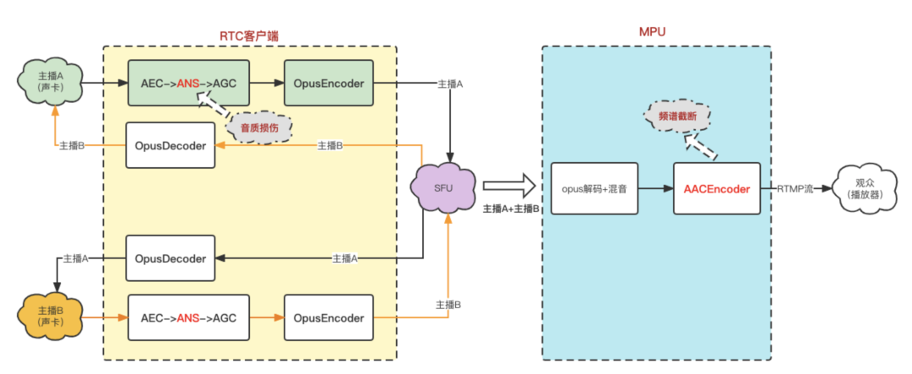

  * 原因分析：

  * sdk端侧：主播A用外接声卡推背景音乐时，主播B听到的音乐音质不好，主要原因是与3A算法库里的ANS（自动降噪算法）存在部分场景下自测对音乐有损伤导致，但不会导致频谱截断，经过优化后解决；

  * 服务端侧：mpu在拉到两个主播的流混音后转码为AAC流的过程中，设置的AAC Audioprofile参数是LC, 64kbps，1ch；这组参数的码率下会导致AAC的频宽只有16kHz， 也就是频谱截断。输入为单声道、48000的音频、码率为64kbps的情况下，AAC LC模式从频宽和听感上相较于AAC HEv1/HEv2模式都要差。

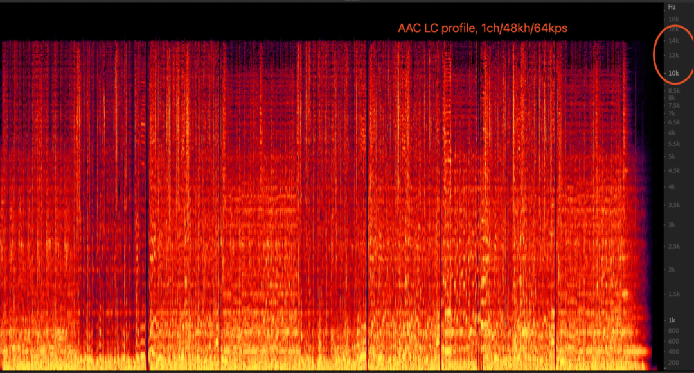

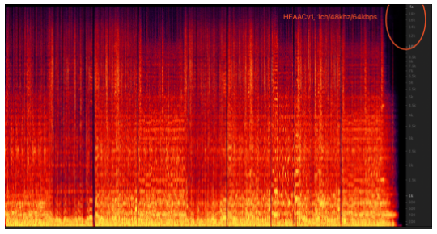

### 3.7 行业演进趋势

由于硬件3A的实现简单，功耗比较低，在rtc领域长期处于主要的技术方案，但由于软件3A技术的发展越来越成熟，目前前沿的软件3A整体解决方案已经可以根据语音和音乐内容自适应调节算法策略，加上硬件3A下的“致命伤”——采集音质较低并且不同的android设备体验差异化较大带来了较大的适配成本，**rtc的前沿技术趋势已经逐步向纯软件3A演进了。**纯软件3A可以在各种场景下给用户带来体验更一致的高音质体验，并且大幅减少rtc厂商的适配人力和技术成本，但也同时需要足够的3A算法能力支撑。

为了一套 sdk满足不同业务场景下的不同音质需求，rtc厂商会提供不同的AudioProfile来做区分给用户提供设置，详见附录二。

## 4.总结

本文结合RTC场景下常见的的音频引擎架构，从音频设备采集，3A处理，到编码器和neteq等各个环节，对影响音质的因素从技术纬度逐个做了解析。文中结合会议，教育，娱乐等各种场景下的对音质的不同要求，阐述了不同业务场景下的音频策略和方案选型思考，并最后对行业演进趋势做了基于个人的分析和预测。

### 附录一：VOIP模式下采集频宽只有8Khz的探索

现象：

  * APP层在创建AudioRecord采集时，同样的采样率设置，不通的audiomode采集到的有效频宽不同，voip模式下，采集到的有效频宽只有8khz, 而normal模式下的频宽是正常的全频带数据；（这个现象ios平台也存在），与手机和芯片都无关；


原因

  * voip下频宽8khz的rootcase在哪里？（疑似硬件3a支持16khz，硬件3a前后做了resample）

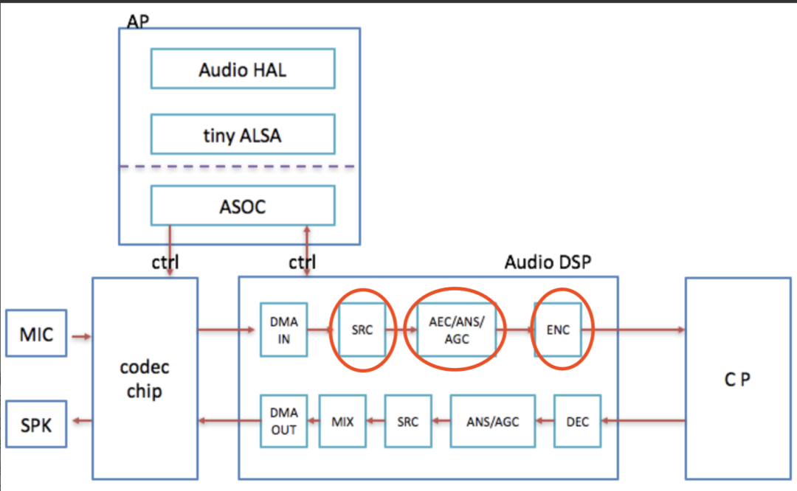

  * 原因：高通芯片为例，SRC在AudioDSP内部，voip模式下, enc是可选的，前面的SRC会降采样到16khz，audiodsp再升采样到48khz，给到AP层是48khz数据；MTK芯片的SRC逻辑在AudioDSP外面；核心原因在与硬件3A只支持16khz， 一方面是出于dsp功耗考虑（aec算法复杂度比较高），另一方面是由于voip的语音编码通常只支持8khz/16khz语音编码；

  * 相关资料：

  1. https://www.cnblogs.com/talkaudiodev/p/8996338.html

  2. https://www.cnblogs.com/talkaudiodev/p/8733968.html

**解决方案探索**

  * 方案一：可以考虑引入类似ios上的bypass mode：`kAUVoiceIOProperty_BypassVoiceProcessing`

  * `https://developer.apple.com/documentation/audiotoolbox/1534007-voice-processing_i_o_audio_unit_proper`

  * ios的bypass mode解决的问题：在voip模式下，通话音量条下，不启用硬件3A；

  * 方案二：适配原生Android系统对于硬件3A开关的控制逻辑

**收益**

  * 硬件3A策略可以单独控制，在一个音量条（通话音量条）下实现音质最佳配置，给APP开发者提供更多玩法；

  * 具体应用场景：对音量条有要求（不能调节到0），同时对高音质也有要求的场景；例如：音乐教育场景；

**设备差异性**

  * 华为mate30:

  * audiomode: `MODE_IN_COMMUNICATION + audiosouce`: `VOICE_COMMUNICATION`录音就是8khz频宽，（可能出于功耗考虑）

  * Oneplus 10R 5G：

  * audiomode: `MODE_IN_COMMUNICATION + audiosouce`: `VOICE_COMMUNICATION`, 开硬件aec，频宽不受损，但如果有audiotrack线程启动，会触发aec逻辑，导致频宽降低；

### 附录二：AudioProfile的相关定义

[参考声网相关接口文档](https://docportal.shengwang.cn/cn/All/API%20Reference/java_ng/API/toc_audio_process.html#ariaid-title36)

```
public abstract int setAudioProfile(int profile, int scenario);
```

** 编码模式（profile）**

  * 瞬时发送码率对应关系只是个大概区间范围，仅供参考用，通常情况下qos会根据网络情况动态调整冗余包数量和编码目标码率

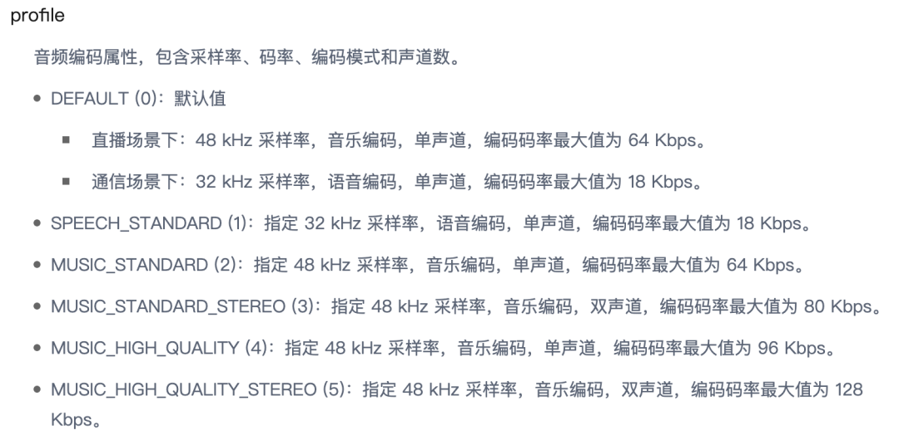

**场景模式：**

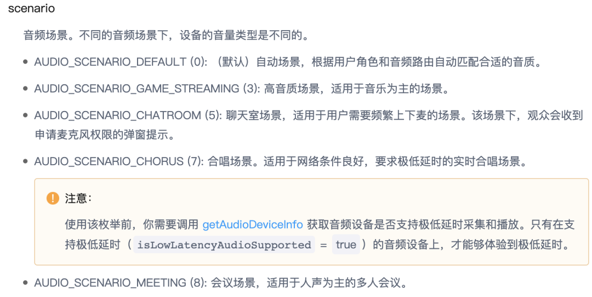

场景模式（scenario）会影响音频设备参数，软件3A策略以及相关的Qos策略等，与编码码率无关；不同的场景模式，对音频数据的处理侧重点不同，以及对应不同的音量条，需要根据不同的业务场景和对音质和相关技术指标不同来做选型。

### 附录三：参考文献：

  1. [深入浅出 WebRTC AEC 声学回声消除](https://developer.aliyun.com/article/781449?spm=a2c6h.14164896.0.0.70a21f36aoEDj7)
  2. [白话解读 WebRTC 音频 NetEQ 及优化实践](https://developer.aliyun.com/article/782756)
  3. [提升 RTC 音频体验 - 从搞懂硬件开始](https://developer.aliyun.com/article/808257)
  4. [详解低延时高音质｜回声消除与降噪篇](https://www.rtcdeveloper.cn/cn/community/blog/21147)

  

  

  

  

