<!--BEGIN_DATA
{
    "create_date": "2023-12-01 18:37", 
    "modify_date": "2023-12-01 18:37", 
    "is_top": "0", 
    "summary": "RTP时间戳的作用<br/>WebRTC视频数据统计之延时、抖动与丢包", 
    "tags": "WebRTC", 
    "file_name": "RTP时间戳的作用与视频数据统计之延时、抖动与丢包.md"
}
END_DATA-->

#### <p>原文出处：<a href='https://mp.weixin.qq.com/s/O_gvg3_xZmIKYz22snElHQ' target='blank'>音视频问答--RTP时间戳的作用</a></p>

## 背景介绍

### 在知乎上收到这样一个问题邀请：


### RTP传输中时间戳字段在任何情况下都是必要的吗？

刚开始学习RTP协议，以传输视频为例，播放端可以根据时间戳，将每一帧在适当的时间点播放出来。

我的疑惑是，播放端可以提前与发送端沟通帧率，也就知道每一帧播放后，下一帧应该在多久后开始播放，那么这种情况下时间戳还有用处吗？

该问题也是最近一两个月做校招时候考核面试者的一道拓展题，看看面试者是否真正理解RTP协议。

## Spec规定

RTP的协议可以参考RFC3550：https://datatracker.ietf.org/doc/html/rfc3550

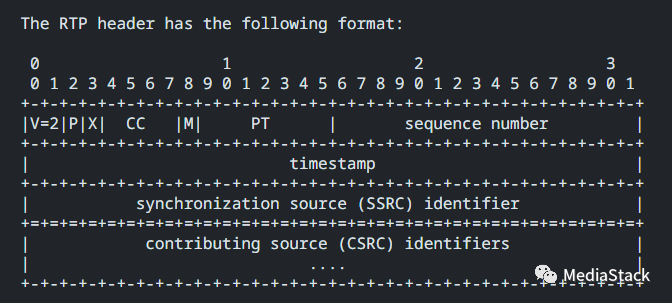

时间戳戳(Timestamp)：占32位，必须使用90 kHz 时钟频率。时戳反映了该RTP报文的第一个八位组的采样时刻。接收者使用时戳来计算延迟和延迟抖动，并进行同步控制。

RTP时间戳是实时多媒体通信中的关键工具，它对于媒体流的同步、抖动控制和丢包检测等都起到了至关重要的作用。时间戳可以标记数据块的先后顺序，帮助接收端恢复原始的播放顺序和速度。而且，由于时间戳的单位是采样频率的倒数，因此它能够直接反映出数据的物理产生时间，使得处理过程不受网络延迟和抖动的影响。

在实际操作中，采集的数据会即刻传递到RTP模块进行发送，这个过程中，数据块的采集时间戳就被直接用作RTP包的时间戳。这种设计使得接收端能够根据时间戳准确知道应当在什么时间还原哪一个数据块，从而消除传输中的抖动。

值得注意的是，RTP时间戳的粒度取决于有效载荷的类型，也就是说，不同类型的媒体有不同的时间戳粒度。例如，对于8kHz采样的话音信号，每个数据块包含有160个
样本（0.02×8000=160），因此每发送一个RTP分组，其时间戳的值就增加160。

在此也简单列举一些 RTP 时间戳的主要应用场景：

**抖动缓冲区计算**：RTP 时间戳也可以用于计算网络抖动差值，来帮助创建和管理抖动缓冲区以减轻网络延迟变化所造成的影响。

**丢包检测**：接收器可以利用连续的 RTP 时间戳来检测丢包情况。如果从一个包到下一个包之间的时间戳增量大于预期，那么就可能发生了丢包现象。

**延迟测量**：在回音消除等应用中，RTP 时间戳可以用于测量延迟。

**媒体同步**：在接收端，RTP 时间戳可以用来为不同的媒体流（例如音频和视频）提供同步。通过比较不同流的时间戳，接收器可以确定何时呈现每个媒体样本以确保音频与视频同步。

**播放速率控制**：RTP 时间戳可以帮助接收器确定原始的采样率并据此控制播放速度。

## 网络检测

即使接收端提前知道帧速率，RTP 时间戳在这种情况下仍然有用。时间戳允许接收端与发送者同步视频的播放，即使存在网络抖动或丢包。

例如，假设接收端知道视频正在以每秒 30 帧的速度进行编码。这意味着接收端期望每 33.33 毫秒收到一个新帧。然而，由于网络抖动，接收端可能无法准确按时接收每一帧。RTP 时间戳允许接收端补偿这种抖动。当接收端收到新帧时，会将帧的时间戳与预期时间戳进行比较。如果时间戳高于预期时间戳，则接收端知道该帧被延迟。然后接收端可以延迟帧的播放，直到预期的时间戳。这可以确保即使存在网络抖动，视频也能以正确的速度播放。

除了补偿网络抖动之外，RTP 时间戳还可用于从数据包丢失中恢复。如果接收端没有收到帧，则可以使用前一帧的时间戳来计算丢失帧的时间戳。然后，接收端可以向发送者请求丢失的帧。这允许接收端从数据包丢失中恢复，而无需重新启动视频播放。

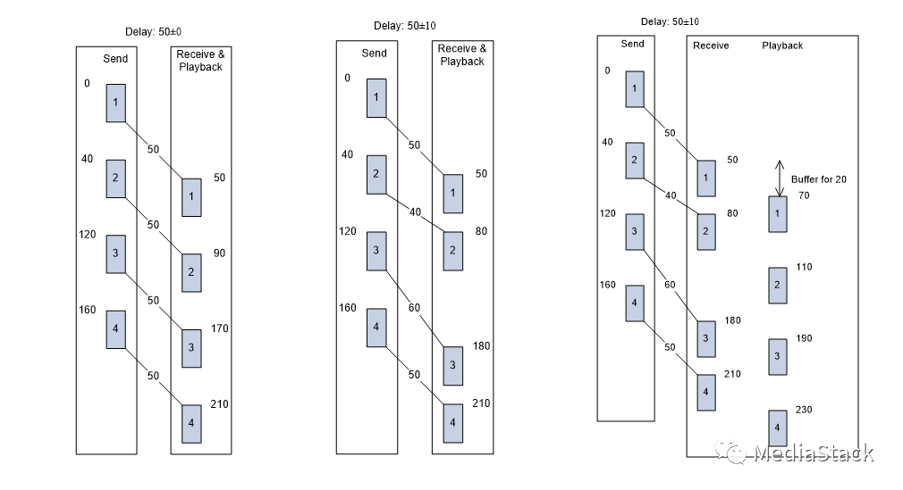  

抖动是核心网络指标之一，它可以让您了解网络性能，并且还可以对最终用户体验产生巨大影响。

测量抖动的原因有很多。原因如下：

  1. **监控网络性能**：测量网络抖动非常重要，因为它可以帮助您了解网络性能的质量，特别是对于 VoIP 和视频会议等时间关键型应用程序。

  2. **识别网络问题**：通过测量抖动，您可以识别可能导致网络流量故障或延迟的任何计时问题。这可以帮助您在问题影响您的应用程序或最终用户之前主动排除故障并解决问题。

  3. **优化网络性能**：此外，测量网络抖动还可以通过确定可以优先考虑网络流量或升级网络硬件以减少抖动的区域来帮助您优化网络性能。这有助于确保您的网络高效运行并满足应用程序和用户的性能需求。

https://blog.csdn.net/Chengzi_comm/article/details/89526935

文中详细介绍了webrtc的统计信息获取流程：

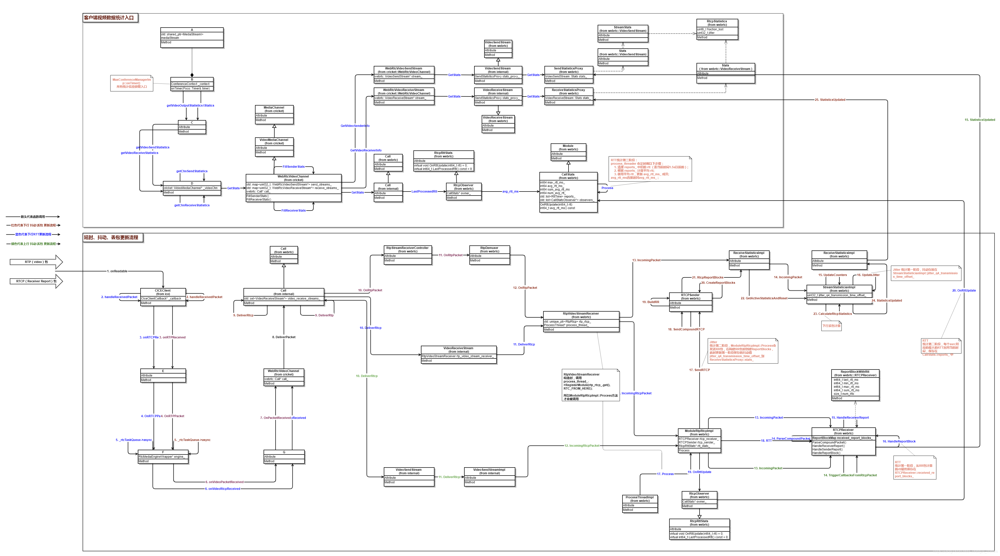

## 音画同步

根据RTP规范，每一个RTP媒体流都有自己独立的时间戳，它们以各自的采样率为基础来进行计算。例如，对于视频，通常的采样率是90KHz，而对于音频，则可能是8KHz或16KHz。因此，虽然两个流在物理传输上是分离的，但它们可以通过各自的时间戳来实现自身的同步。

具体来说，在视频流中，每一帧都会被赋予一个时间戳。这个时间戳表示了该帧在源中产生的绝对时间。接收器可以根据这些时间戳来计算出相邻帧之间的间隔，从而推断出视频帧的播放顺序和速度。按照预定的间隔去呈现视频，就可以获得与原始流相符合的效果，实现所谓的“内部同步”。

对于音频流，情况也是类似的。每个音频样本都由其自身的时间戳标识，用来指示样本应该被播放的时间。接收器可以使用这些时间戳来计算出音频的正确播放顺序和速度。

然而，需要注意的是，虽然视频和音频流各自可以实现内部同步，但在实际应用中，我们还需要让它们之间也能保持同步。也就是说，某个特定的视频帧应该与特定的音频样本同时呈现。这通常是通过将RTP时间戳与RTCP（实时传输控制协议）报告结合起来，进行“外部同步”。

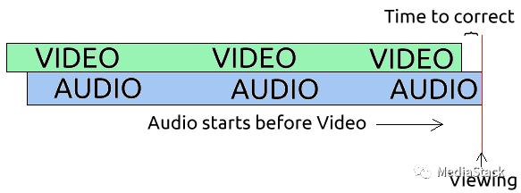

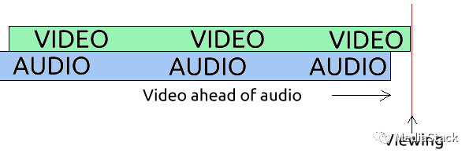

RTCP报告包括了发送端的NTP（网络时间协议）时间戳，以及与其相对应的RTP时间戳。接收端可以利用这些信息来将不同媒体流的时间戳映射到同一全局时间轴上，从而实现音频和视频流之间的同步。

之前也有个更新文章介绍，有兴趣的也可以查阅：  

[音视频学习--音画同步](http://mp.weixin.qq.com/s?__biz=MzUwOTk2Njg5NA==&mid=2247489241&idx=1&sn=b01f233fc790d3b27a39eca16d7dc5a1&chksm=f90b7998ce7cf08eb614d09fd3dc6d7ab0a61f5c15b6e2617bb70e3e673b6855d4c6e015d7f8&scene=21#wechat_redirect)  

## 倍速播放

倍速播放的基本原理：

当我们调整播放速度时，实际上是在改变解码和展示每一帧的间隔时间。举例来说，如果我们将播放速度设置为2倍速，那么每一帧的展示时间将会减半。这样，虽然每一帧的时间戳并没有改变，但由于播放器按照加快的速度进行解码和展示，就实现了倍速播放。

在流媒体播放中，时间戳（Timestamp）起着至关重要的角色，尤其在倍速播放时。倍速播放指的是播放速度快于（或慢于）正常速度的播放模式，例如，2倍速表示播放速度是正常速度的两倍，而0.5倍速则表示播放速度只有正常速度的一半。

时间戳在流媒体播放中的作用：时间戳标记了视频和音频帧的产生时间，它是确定每一帧何时被展示的关键。接收端可以通过时间戳恢复出原始的播放顺序和速度，以实现音频和视频的同步播放。

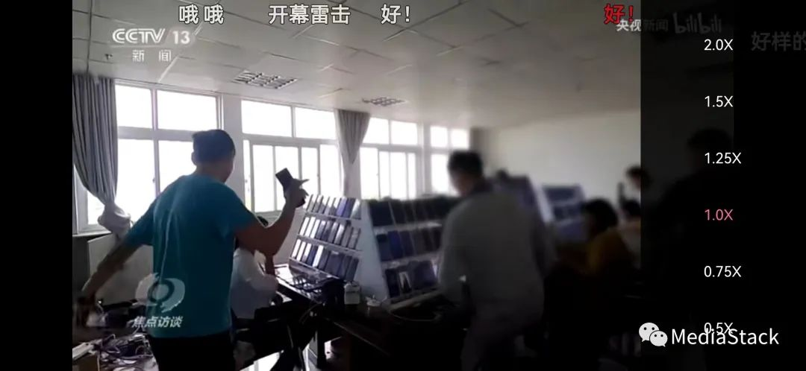

需要注意的是，在倍速播放时，音频的处理比视频更复杂一些。因为简单地加快音频的播放速度可能会导致音频的音调发生变化。为了解决这个问题，播放器通常会使用一些算法（如时间伸缩技术）来调整音频的播放速度，同时保持音调不变。

时间戳在倍速播放中的作用：在倍速播放时，时间戳依然是确定每一帧何时被展示的关键。只不过此时，播放器需要根据设置的播放速度来调整展示的间隔时间。例如，对于2倍速的播放，播放器将会以两倍的速度读取和处理时间戳，从而实现音视频数据的快速播放。同样，对于0.5倍速的播放，播放器将会以半倍的速度读取和处理时间戳，从而实现音视频数据的慢速播放。

https://blog.csdn.net/weixin_40777510/article/details/110120990

https://trac.ffmpeg.org/wiki/How%20to%20speed%20up%20/%20slow%20down%20a%20video

然而，尽管时间戳为我们提供了强大的工具来处理实时多媒体数据，但它并不是万能的。例如，在丢包的情况下，单独依赖时间戳可能无法完全恢复出原始的数据流，这就需要借助其他的机制，如序列号和重传请求等。此外，虽然RTP协议并没有规定时间戳的粒度，但是如果粒度选择得过大或过小，都可能导致同步精度的降低或者计算量的增加。

<hr>

#### <p>原文出处：<a href='https://blog.csdn.net/Chengzi_comm/article/details/89526935' target='blank'>WebRTC视频数据统计之延时、抖动与丢包</a></p>

## 一、前言

这篇文章主要想说明的是WebRTC内部对视频`上下行延时、抖动、丢包`如何更新，上层又怎么获取到这些统计信息的。对应的`WebRTC版本：63`。

## 二、背景

> 最近在内网情况下测试视频会议，视频下行延时很大，很多时候超过`100ms`。另外，视频的上下行抖动总是稳定在`30~40ms`这个区间。这些统计在内网环境下是不正常的，于是决定看看是哪里导致这些问题的。

在解决这些问题的过程中，也对WebRTC内部视频统计数据做了一次梳理。

> 阅读这篇文章之前，最好对RTP、RTCP、SR、RR有一些了解。这里就不过多展开，可以参考以下文章：
>
> * [RTP Data Transfer Protocol](https://tools.ietf.org/html/rfc3550#section-5)
> * [RTP Control Protocol – RTCP](https://tools.ietf.org/html/rfc3550#section-6)
> * [RTP/RTSP/RTCP有什么区别](https://www.zhihu.com/question/20278635/answer/14590945)

## 三、综述

下图是WebRTC内部获取视频统计信息和统计信息如何被更新的流程图：（其中的箭头代表函数调用）  

  

上图中的类A~G属于公司内部代码，不便公开，还请见谅。总体共有两个大的模块，**如何取**和**如何更新**：  

（**`ps: 下文关于流程图细节部分都取自于该图，读者可根据相关文字在总图中找到对应的位置`** 在这里下载上图的电子版： [webrtc-statistics.gliffy](https://download.csdn.net/download/chengzi_comm/11144373)）

### 1. 如何取

上面部分“客户端视频数据统计入口”中，左下角的`WebRtcVideoChannel::GetStats`是WebRTC对外暴露的获取统计信息的入口，视频的上下行统计数据最终分别使用右上角`SendStatisticsProxy::stats_`、`ReceiveStatisticsProxy::stats_`和`CallStats::avg_rtt_ms_`来填充返回。

### 2. 如何更新

下面部分“延时、抖动、丢包更新流程”部分，从网络接收到RTP/RTCP之后，使用三个不同颜色代表三种统计信息的更新流程，比如红色代表下行抖动/丢包更新流程、蓝色代表RTT的更新流程等。

统计信息大多不是由一条调用流程完成的（这就是下文会说到的“阶段”），会有几次类似缓冲区的“中转”，然后由另外的线程或函数继续做统计信息的整理，最终达到上一步的`SendStatisticsProxy::stats_`、`ReceiveStatisticsProxy::stats_`和`CallStats::avg_rtt_ms_`，等待上层获取。

## 四、几个统计信息详细介绍

### 1、延时

> 这里统计的延时指的是往返延时 rtt。`WebRTC使用SR/RR来计算rtt`。

#### (1) 延时的计算

##### 1) SR和RR报文格式

Sender Report RTCP PacketReceiver Report RTCP Packet

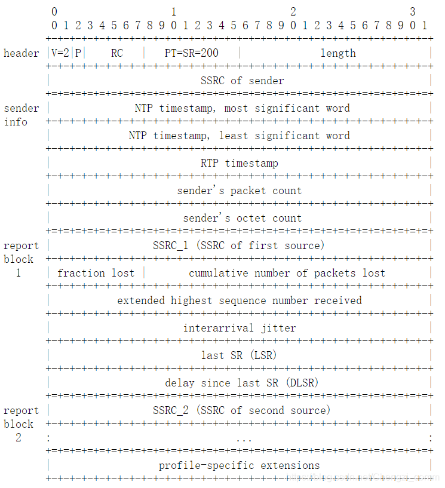

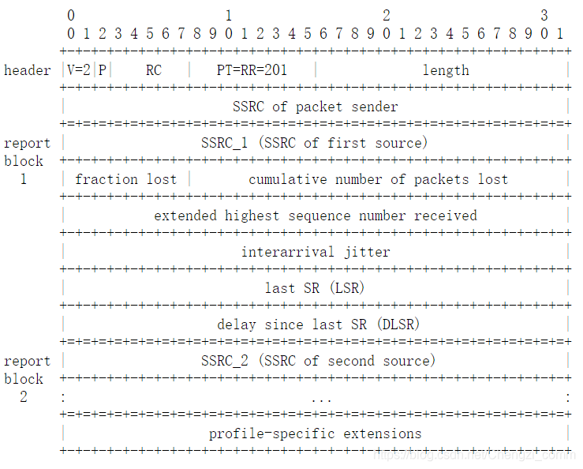

##### 2) 计算rtt

> 以下流程通过结合SR/RR包报文格式，浏览`RTCPReceiver::HandleReceiverReport`、`RTCPReceiver::HandleReportBlock`、`ModuleRtpRtcpImpl::SendCompoundRTCP`、`RTCPSender::BuildSR`、`RTCPSender::BuildRR`函数。前面2个函数是接收端计算rtt，后面3个函数是对端在构造RR时LSR/DLSR如何设置的。

   * 首先，发送端构造SR时，`sender info`部分的NTP字段被设置为当前ntp时间戳；
   * 接收端收到最新的SR之后，使用`last_received_sr_ntp_`字段记录当前ntp时间戳；
   * 接收端构造RR时，设置RR的DLSR字段为`当前ntp时间戳 - last_received_sr_ntp_`，之后发出RR包；
   * 发送端在接收到RR包之后，记录RR包到达时间`A`；
   * 使用公式 `A - LSR - DLSR` 计算rtt。

##### 3) 用一个图描述上述RTT计算流程

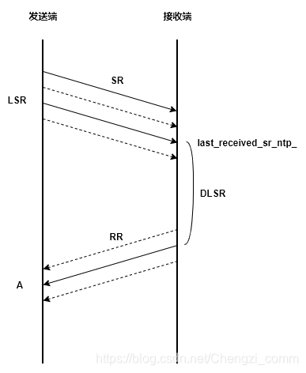

> SR与RR的个数并不完全相同，因为RR并不是对SR的回应，它们的发送各自独立；另外丢包也会导致一部分SR/RR没有被对方接收。因此上图中，SR和RR传输中，实线代表发了一次SR/RR，并且被被对方接收了。这里想说明的是：**即便SR或RR丢失一部分，只要发送端收到了RR，它总能计算出rtt，因为RR中使用的LSR和DLSR字段都是从最近一次收到的SR中取到的。**

#### (2) 延时的更新流程

> 下文所说的第一阶段、第二阶段等，都是指 **数据从一个位置转移到另一个位置的过程，或者说是一次`推`或`拉`模式**。比如：F1函数把数据从A点转移到B点就返回了，F2函数把数据从B点转移到C点就返回了，那A->B就是第一阶段，B->C就是第二阶段。如下：


##### 1) rtt统计第一阶段

由上文可知：从RR可以计算出往返延时rtt，这个rtt最终保存在`RTCPReceiver::received_report_blocks_`。  

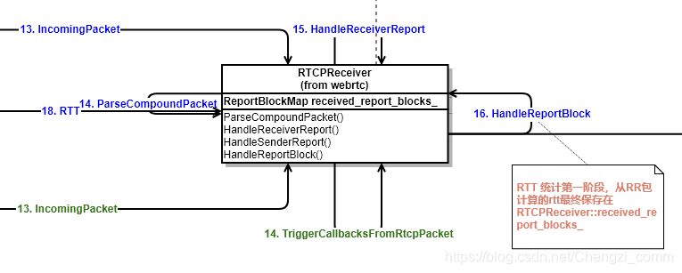

##### 2) rtt统计第二阶段

`ModuleRtpRtcpImpl::Process`会定时把rtt从`RTCPReceiver::received_report_blocks_`更新到`CallStats::reports_`，这个更新过程，`CallStats::reports_`中每个rtt都会与一个更新时间戳绑定。参考`CallStats::OnRttUpdate` 函数。  

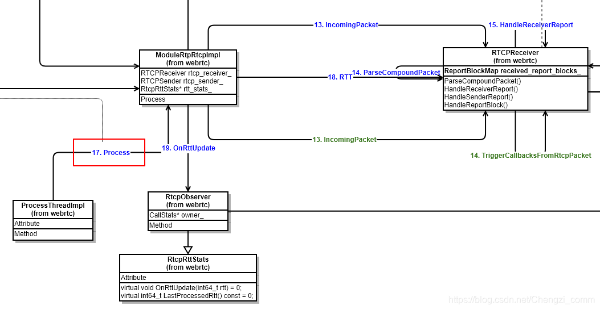

##### 3) rtt统计第三阶段

`CallStats`继承`Module`，`CallStats::Process`函数会定时做以下三个步骤：

* 根据第二阶段绑定的时间戳，清理掉 `reports_` 中距当前时间1.5s以前的rtt；
* 计算1.5s内的平均rtt；
* 使用平均rtt，更新 `avg_rtt_ms_` 成员；

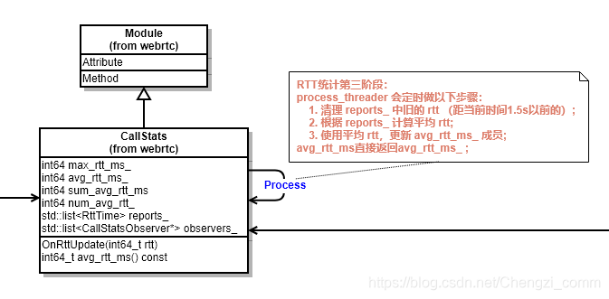

#### (3) 获取延时

调用`CallStats::avg_rtt_ms`函数获取rtt时，直接返回`avg_rtt_ms_ `;

### 2、下行抖动和丢包

> 下行抖动和丢包，通过在接收端根据收到的RTP包来计算和更新。

#### (1) 抖动和丢包的计算

##### 1) 抖动定义

抖动被定义为：一对数据包在接收端与发送端的数据包时间间距之差。如下：  

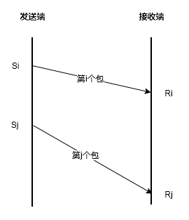  

如果Si代表第i个包的发送时间戳，Ri代表第i个包的接收时间戳。Sj、Rj同理。  

`抖动(i, j) = |(Rj - Ri) - (Sj - Si)| = |(Rj - Sj) - (Ri - Si)|`

WebRTC为了统一抖动，并且为了很好的降噪、降低突发抖动的影响，把上面的`抖动(i, j)`定义为`D(i, j)`，`抖动J(i)`定义为:  `J(i) = J(i-1) + (|D(i-1, i)| - J(i - 1)) / 16`

我虽然看不出J(i)和D(i)的关系，但是`D(i-1, j)`是唯一引起`J(i)`变化的因素，是需要重点关注的。

##### 2) 抖动计算存在的问题：

RTP报文头部，有timestamp字段，该字段用来表示该RTP包所属帧的`capture time`。接收RTP包时如果记录接收时间戳，再根据头部的`timestamp`字段，D(i, j)就可以计算出来，J也就有了。（事实上webrtc原本也是这样干的，而且这种方式计算的抖动还对外暴露，可以参考`StreamStatisticianImpl::UpdateJitter`函数）

但是这样计算抖动是存在问题的：**每一帧的视频数据放进多个RTP包之后，这些RTP包的头部timestamp字段都是一样的（都是帧的capture time），但是实际发送时间不一样，到达时间也不同。**

##### 3) 如何正确计算抖动：

计算D(i, j)时，Si不能只使用RTP timestamp，而是应该使用该RTP实际发送到网络的时间戳。这种抖动被命名为`jitter_q4_transmission_time_offset`，意为考虑了`transmission_time_offset`的`jitter`。

* **a. transmission_time_offset是什么?**

> transmission_time_offset是一段时间间隔，该时间间隔代表属于同一帧的RTP的`实际发送时间`距离帧的`capture time`的**偏移量** 。下图是对`transmission_offset_time`的解释：

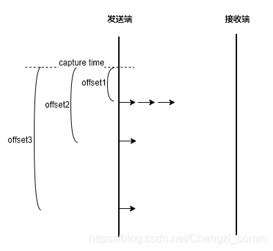

> 其中，箭头代表一个RTP，发送端的竖线代表时间轴，虚线代表帧的capture time。

最开始三个RTP包在距离capture time `offset1`时间之后发送到网络，因此这三个RTP包的`transmission_time_offset`应该是offset1。同理第四个RTP包的`transmission_time_offset`应该是offset2，第五个RTP包的`transmission_time_offset`应该是offset3。

* **b. transmission_time_offset在RTP包的哪里放着?**

`transmission_time_offset`存在于RTP的扩展头部，设置该扩展头可以参考`RTPSender::SendToNetwork`函数，但使用之前该扩展头之前需要注册，否则在设置`transmission_time_offset`扩展头会失败。

下面的代码段是WebRTC中`D(i, j)`的计算：

```cpp
// Extended jitter report, RFC 5450.
// Actual network jitter, excluding the source-introduced jitter.
int32_t time_diff_samples_ext =
  (receive_time_rtp - last_receive_time_rtp) -
  ((header.timestamp +
    header.extension.transmissionTimeOffset) -
   (last_received_timestamp_ +
    last_received_transmission_time_offset_));
```

其中：

> * `receive_time_rtp` 代表当前RTP的到达时间戳；
> * `last_receive_time_rtp` 是上一个RTP到达时记录的时间戳；
> * `header.timestamp + header.extension.transmissionTimeOffset` 前者是capture time，后者是对应的transmission time offset，两者相加代表该RTP实际发送到网络的时间戳；
> * `last_received_timestamp_ + last_received_transmission_time_offset_` 含义同上，但是代表的是**上一个**RTP的实际发送到网络的时间戳；

#### (2) 下行抖动的更新流程

##### 1) 抖动统计第一阶段

接收端收到的RTP包，会经过`StreamStatisticianImpl::UpdateJitter`函数，该函数内部会计算经过这个RTP包之后的抖动值，并更新到成员`jitter_q4_transmission_time_offset_`成员中。  

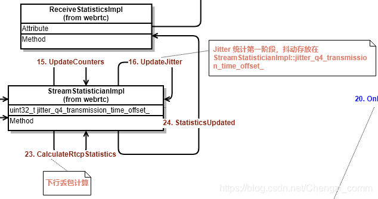

##### 2) 抖动统计第二阶段

`ModuleRtpRtcpImpl::Process`会定时发送RR，在构建RR的Report Block时，会搜集本地接收报告并把第一阶段保存的`jitter_q4_transmission_time_offset_`信息更新到`ReceiveStatisticsProxy::stats_` 。  

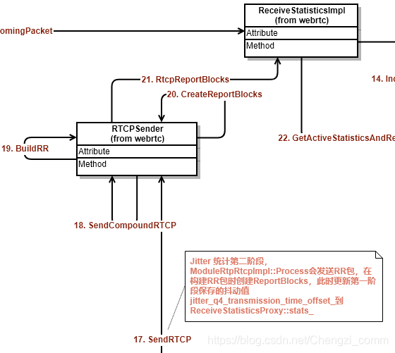

#### (3) 下行丢包的更新流程

##### 1) 丢包统计第一阶段

接收端收到的RTP包，会经过`StreamStatisticianImpl::UpdateCounters`函数，在该函数内部，会累加接收到的RTP包的个数和重传包的个数，以及当前收到的最大的sequence。

##### 2) 丢包统计第二阶段

下图是WebRTC内部计算`下行丢包`：  

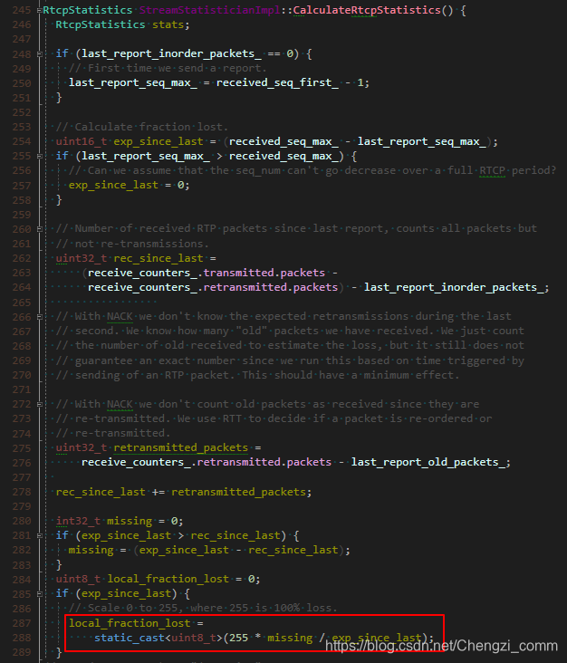  

丢包率更新的周期是发送一次RR，在发送RR时，会根据第一阶段记录的数据统计丢包，丢包根据下面的公式：

`fraction_lost = RTP包丢失个数 / 期望接收的RTP包个数`

> 其中：
>
> * `包丢失个数 = 期望接收的RTP包个数 - 实际收到的RTP包个数`
>
> * `期望接收的RTP包个数 = 当前最大sequence - 上次最大sequence`
>
> * `实际收到的RTP包个数 = 正常有序RTP包 + 重传包`

计算出来的丢包，连同抖动一起被更新到`ReceiveStatisticsProxy::stats_`。  

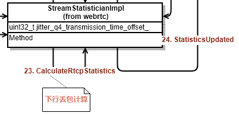

#### (3) 获取下行抖动和丢包

下行抖动和丢包最终会从`ReceiveStatisticsProxy::stats_` 获取。

### 3、上行抖动和丢包

> 下行抖动和丢包，从对方发来的RR包中获取。RR包格式参考上文链接。

#### (1) 上行抖动和丢包的更新流程

本地上行抖动和丢包，就是对端下行抖动和丢包，对端按照上面介绍的方式计算下行抖动和丢包，然后通过RR返回。

从RR获取抖动和丢包，没有太多阶段，只有一次`推`过程。接收端在收到RR之后，就把内部的抖动和丢包更新到`SendStatisticsProxy::stats_`中，这里就是客户端主动获取上行抖动和丢包时最终的数据源。

#### (2) 获取上行抖动和丢包

上行抖动和丢包最终会从`SendStatisticsProxy::stats_` 获取。

## 五、最后

以上是最近对WebRTC视频统计数据的了解，希望能对有需要的人有所帮助。如有不对的地方，欢迎指正！！