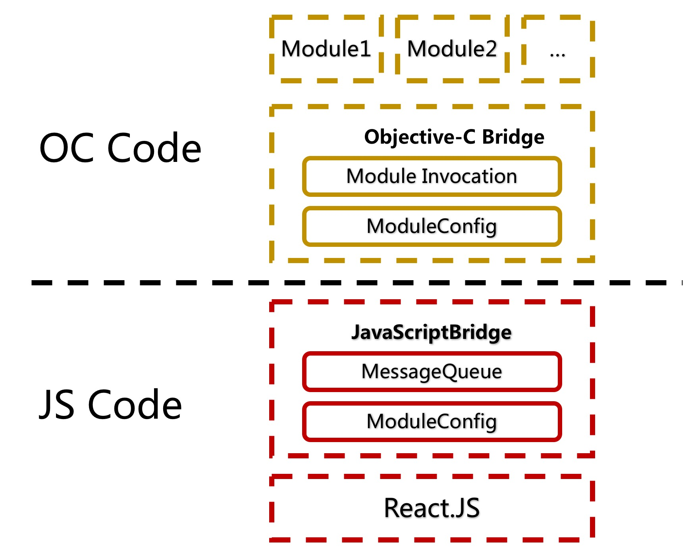
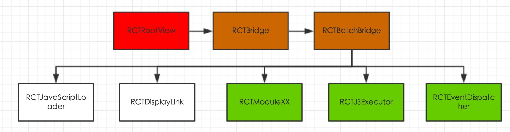

 
<!--BEGIN_DATA
{
    "create_date": "2016-07-04 15:45", 
    "modify_date": "2016-07-04 15:45", 
    "is_top": "0", 
    "summary": "ReactNative iOS源码解析", 
    "tags": "iOS", 
    "file_name": "ReactNative iOS源码解析.md"
}
END_DATA-->

####<p>原文出处：<a href='http://awhisper.github.io/2016/06/24/ReactNative%E6%B5%81%E7%A8%8B%E6%BA%90%E7%A0%81%E5%88%86%E6%9E%90/' target='blank'>ReactNative iOS源码解析（一）</a></p>

前两部分内容简单介绍一下ReactNative，后面的章节会把整个RN框架的iOS部分，进行代码层面的一一梳理

全文是不是有点太长了，我要不要分拆成几篇文章

函数栈代码流程图，由于采用层次缩进的形式，层次关系比较深的话，不是很利于手机阅读，

##ReactNative概要

ReactNative，动态，跨平台，热更新，这几个词现在越来越火了，一句`使用JavaScript写源生App`吸引力了无数人的眼球，并且诞生了这么久也逐
渐趋于稳定，`携程`,`天猫`,`QZone`也都在大产品线的业务上，部分模块采用这个方案上线，并且效果得到了验证[（见2016 GMTC资料PPT）](http://ppt.geekbang.org/gmtc)

我们把这个单词拆解成2部分

  * React

熟悉前端的朋友们可能都知道`React.JS`这个前端框架，没错整个RN框架的JS代码部分，就是React.JS，所有这个框架的特点，完完全全都可以在RN里
面使用（这里还融入了Flux，很好的把传统的MVC重组为dispatch，store和components，[Flux架构](http://reactjs.
cn/react/docs/flux-overview.html)）

所以说，写RN哪不懂了，去翻React.JS的文档或许都能给你解答

以上由@彩虹 帮忙修正

  * Native

顾名思义，纯源生的native体验，纯源生的UI组件，纯原生的触摸响应，纯源生的模块功能

**那么这两个不相干的东西是如何关联在一起的呢？**

React.JS是一个前端框架，在浏览器内H5开发上被广泛使用，他在渲染render()这个环节，在经过各种flexbox布局算法之后，要在确定的位置去绘制
这个界面元素的时候，需要通过浏览器去实现。他在响应触摸touchEvent()这个环节，依然是需要浏览器去捕获用户的触摸行为，然后回调React.JS

上面提到的都是纯网页，纯H5，但如果我们把render()这个事情拦截下来，不走浏览器，而是走native会怎样呢？

当React.JS已经计算完每个页面元素的位置大小，本来要传给浏览器，让浏览器进行渲染，这时候我们不传给浏览器了，而是通过一个JS/OC的桥梁，去通过`[[
UIView
alloc]initWithFrame:frame]`的OC代码，把这个界面元素渲染了，那我们就相当于用React.JS绘制出了一个native的View

拿我们刚刚绘制出得native的View，当他发生native源生的`\- (void)touchesBegan:(NSSet *)touches
withEvent:(UIEvent *)event`触摸事件的时候，通过一个OC/JS的桥梁，去调用React.JS里面写好的点击事件JS代码

这样React.JS还是那个React.JS，他的使用方法没发生变化，但是却获得了纯源生native的体验，native的组件渲染，native的触摸响应

于是，这个东西就叫做React-Native

##ReactNative 结构

大家可以看到，刚才我说的核心就是一个桥梁，无论是JS=>OC，还是OC=>JS。

刚才举得例子，就相当于把纯源生的UI模块，接入这个桥梁，从而让源生UI与React.JS融为一体。

那我们把野心放长远点，我们不止想让React.JS操作UI，我还想用JS操作数据库！无论是新玩意Realm，还是老玩意CoreData，FMDB，我都希望能
用JS操作应该怎么办？好办，把纯源生的DB代码模块，接入这个桥梁

如果我想让JS操作Socket做长连接呢？好办，把源生socket代码模块接入这个桥梁。如果我想让JS能操作支付宝，微信，苹果IAP呢？好办，把源生支付代码
模块接入这个桥梁

由此可见RN就是由一个bridge桥梁，连接起了JS与na的代码模块

  * 链接了哪个模块，哪个模块就能用JS来操作，就能动态更新
  * 发现现有RN框架有些功能做不到了？扩展写个na代码模块，接入这个桥梁

这是一个极度模块化可扩展的桥梁框架，不是说你从facebook的源上拉下来RN的代码，RN的能力就固定一成不变了，他的模块化可扩展，让你缺啥补上啥就好了

**ReactNative 结构图**



大家可以看这个结构图，整个RN的结构分为四个部分，上面提到的，RN桥的模块化可扩展性，就体现在JSBridge/OCBridge里的ModuleConfig
，只要遵循RN的协议`RCTBridgeModule`去写的OC
Module对象，使用`RCT_EXPORT_MODULE()`宏注册类，使用`RCT_EXPORT_METHOD()`宏注册方法，那么这个OC
Module以及他的OC Method都会被JS与OC的ModuleConfig进行统一控制



上面是RN的代码类结构图

  * 大家可以看到`RCTRootView`是RN的根试图，

    * 他内部持有了一个`RCTBridge`,但是这个RCTBridge并没有太多的代码，而是持有了另一个`RCTBatchBridge`对象，大部分的业务逻辑都转发给BatchBridge，BatchBridge里面写着的大量的核心代码

      * BatchBridge会通过`RCTJavaScriptLoader`来加载JSBundle，在加载完毕后，这个loader也没什么太大的用了

      * BatchBridge会持有一个`RCTDisplayLink`，这个对象主要用于一些Timer，Navigator的Module需要按着屏幕渲染频率回调JS用的，只是给部分Module需求使用

      * `RCTModuleXX`所有的RN的Module组件都是RCTModuleData，无论是RN的核心系统组件，还是扩展的UI组件，API组件

        * `RCTJSExecutor`是一个很特殊的RCTModuleData，虽然他被当做组件module一起管理，统一注册，但他是系统组件的核心之一，他负责单独开一个线程，执行JS代码，处理JS回调，是bridge的核心通道
        * `RCTEventDispatcher`也是一个很特殊的RCTModuleData，虽然他被当做组件module一起管理，统一注册，但是他负责的是各个业务模块通过他主动发起调用js，比如UIModule，发生了点击事件，是通过他主动回调JS的，他回调JS也是通过`RCTJSExecutor`来操作，他的作用是封装了eventDispatcher得API来方便业务Module使用。

后面我会详细按着代码执行的流程给大家细化OCCode里面的代码，JSCode由于我对前端理解还不太深入，这个Blog就不会去拆解分析JS代码了

ReactNative通信机制可以参考bang哥的博客 [ReactNative通信机制详解](http://blog.cnbang.net/tech/2698/)

##ReactNative 初始化代码分析

我会按着函数调用栈类似的形式梳理出一个代码流程表，对每一个调用环节进行简单标记与作用说明，在整个表梳理完毕后，我会一一把每个标记进行详细的源码分析和解释

下面的代码流程表，如果有类名+方法的，你可以直接在RN源码中定位到具体代码段

  * RCTRootView-initWithBundleURLXXX(**RootInit标记**)
    * RCTBridge-initWithBundleXXX
      * RCTBridge-createBatchedBridge（**BatchBridgeInit标记**）
        * New Displaylink（**DisplaylinkInit标记**）
        * New dispatchQueue (**dispatchQueueInit标记**)
        * New dispatchGroup (**dispatchGroupInit标记**)
        * group Enter（**groupEnterLoadSource标记**）
          * RCTBatchedBridge-loadSource (**loadJS标记**)
        * RCTBatchedBridge-initModulesWithDispatchGroup（**InitModule标记** 这块内容非常多，有个子代码流程表）
        * group Enter（**groupEnterJSConfig标记**）
          * RCTBatchedBridge-setUpExecutor（**configJSExecutor标记**）
          * RCTBatchedBridge-moduleConfig（**moduleConfig标记**）
          * RCTBatchedBridge-injectJSONConfiguration（**moduleConfigInject标记**）
        * group Notify（**groupDone标记**）
          * RCTBatchedBridge-executeSourceCode（**evaluateJS标记**）
          * RCTDisplayLink-addToRunLoop（**addrunloop标记**）

**RootInit标记**：所有RN都是通过init方法创建的不再赘述，URL可以是网络url，也可以是本地filepath转成URL

**BatchBridgeInit标记**：前边说过rootview会先持有一个RCTBridge，所有的module都是直接操作bridge所提供的接口，但是这个bridge基本上不干什么核心逻辑代码，他内部持有了一个batchbrdige，各种调用都是直接转发给RCTBatchBrdige来操作，因此batchbridge才是核心

RCTBridge在init的时候调用`[self setUp]`

RCTBridge在setUp的时候调用`[self createBatchedBridge]`

**DisplaylinkInit标记**：batchbridge会首先初始化一个`RCTDisplayLink`这个东西在业务逻辑上不会被所有的module调用，他的作用是以设备屏幕渲染的频率触发一个timer，判断是否有个别module需要按着timer去回调js，如果没有module，这个模块其实就是空跑一个displaylink，注意，此时只是初始化，并没有run这个displaylink

**dispatchQueueInit标记**：会初始化一个GCDqueue，后面很多操作都会被扔到这个队列里，以保证顺序执行

**dispatchGroupInit标记**：后面接下来进行的一些列操作，都会被添加到这个GCDgroup之中，那些被我做了group Enter标记的，当group内所有事情做完之后，会触发group Notify

**groupEnterLoadSource**标记：会把无论是从网络还是从本地，拉取jsbundle这个操作，放进GCDgroup之中，这样只有这个操作进行完了（还有其他group内操作执行完了，才会执行notify的任务）

**loadJS标记**：其实就是异步去拉取jsbundle，无论是本地读还是网络啦，`[RCTJavaScriptLoader loadBundleAtURL:self.bundleURL onComplete:onSourceLoad];`只有当回调完成之后会执行`dispatch_group_leave`，离开group

**InitModule标记**：这个函数是在主线程被执行的，但是刚才生成的GCD group会被当做参数传进内部，因为内部的一些逻辑是需要加入group的，这个函数内部很复杂 我会继续绘制一个代码流程表

  * 1）RCTGetModuleClasses() 

一个C函数，RCT_EXPORT_MODULE()注册宏会在`+load`时候把Module类都统一管理在一个static
NSArray里，通过RCTGetModuleClasses()可以取出来所有的Module

  * 2）RCTModuleData-initWithModuleClass 

此处是一个for循环，循环刚才拿到的array，对每一个注册了得module都循环生成RCTModuleData实例

  * 3）配置moduleConfig

每一个module在循环生成结束后，bridge会统一存储3分配置表，包含了所有的moduleConfig的信息，便于查找和管理
    
    //barchbridge的ivar  
      NSMutableDictionary<NSString *, RCTModuleData *> *_moduleDataByName;  
      NSArray<RCTModuleData *> *_moduleDataByID;  
      NSArray<Class> *_moduleClassesByID;  
    // Store modules  
      _moduleDataByID = [moduleDataByID copy];  
      _moduleDataByName = [moduleDataByName copy];  
      _moduleClassesByID = [moduleClassesByID copy];  
    

  * 4）RCTModuleData-instance

这是一个for循环，每一个RCTModuleData都需要循环instance一下，需要说明的是，RCTModuleData与Module不是一个东西，各类
Module继承自NSObject，RCTModuleData内部持有的instance实例才是各类Module，因此这个环节是初始化RCTModuleDa
ta真正各类Module实例的环节

通过`RCTModuleData-setUpInstanceAndBridge`来初始化创建真正的Module

    
    //SOME CODE  
    _instance = [_moduleClass new];  
    //SOME CODE  
    [self setUpMethodQueue];  
    

这里需要说明，每一个Module都会创建一个自己独有的专属的串行GCD queue，每次js抛出来的各个module的通信，都是dispatch_async
，不一定从哪个线程抛出来，但可以保证每个module内的通信事件是串行顺序的

每一个module都有个bridge属性指向，rootview的bridge，方便快速调用

  * 5）RCTJSCExecutor 

RCTJSCExecutor是一个特殊的module，是核心，所以这里会单独处理，生成，初始化，并且被bridge持有，方便直接调用

`RCTJSCExecutor初始化`做了很多事情，需要大家仔细关注一下

创建了一个全新的NSThread，并且被持有住，绑定了一个runloop，保证这个线程不会消失，一直在loop，所有与JS的通信，一定都通过RCTJSCEx
ecutor来进行，所以一定是在这个NSThread线程内，只不过各个模块的消息，会进行二次分发，不一定在此线程内

  * 6）RCTModuleData-gatherConstants

每一个module都有自己的提供给js的接口配置表，这个方法就是读取这个配置表，注意！这行代码执行在主线程，但他使用dispatch_async 到main
Queue上，说明他先放过了之前的函数调用栈，等之前的函数调用栈走完，然后还是在主线程执行这个循环的gatherConstants，因此之前传进来的GCD
group派上了用场，因为只有当所有module配置都读取并配置完毕后才可以进行 run js代码

**下面思路从子代码流程表跳出，回到大代码流程表的标记**

**groupEnterJSConfig标记**：代码到了这块会用到刚才创建，但一直没使用的GCD queue，并且这块还比较复杂，在这次enter group内部，又创建了一个子group，都放在这个GCD queue里执行

如果觉得绕可以这么理解他会在专属的队列里执行2件事情（后面要说的2各标记），当这2个事情执行完后触发子group
notify，执行第三件事情（后面要说的第三个标记），当第三个事情执行完后leave母group，触发母group notify
    
    dispatch_group_enter(initModulesAndLoadSource);  
      dispatch_async(bridgeQueue, ^{  
        dispatch_group_t setupJSExecutorAndModuleConfig = dispatch_group_create();  
      
        // Asynchronously initialize the JS executor  
        dispatch_group_async(setupJSExecutorAndModuleConfig, bridgeQueue, ^{  
          RCTPerformanceLoggerStart(RCTPLJSCExecutorSetup);  
          [weakSelf setUpExecutor];  
          RCTPerformanceLoggerEnd(RCTPLJSCExecutorSetup);  
        });  
      
        // Asynchronously gather the module config  
        dispatch_group_async(setupJSExecutorAndModuleConfig, bridgeQueue, ^{  
          if (weakSelf.valid) {  
            RCTPerformanceLoggerStart(RCTPLNativeModulePrepareConfig);  
            config = [weakSelf moduleConfig];  
            RCTPerformanceLoggerEnd(RCTPLNativeModulePrepareConfig);  
          }  
        });  
      
        dispatch_group_notify(setupJSExecutorAndModuleConfig, bridgeQueue, ^{  
          // We're not waiting for this to complete to leave dispatch group, since  
          // injectJSONConfiguration and executeSourceCode will schedule operations  
          // on the same queue anyway.  
          RCTPerformanceLoggerStart(RCTPLNativeModuleInjectConfig);  
          [weakSelf injectJSONConfiguration:config onComplete:^(NSError *error) {  
            RCTPerformanceLoggerEnd(RCTPLNativeModuleInjectConfig);  
            if (error) {  
              dispatch_async(dispatch_get_main_queue(), ^{  
                [weakSelf stopLoadingWithError:error];  
              });  
            }  
          }];  
          dispatch_group_leave(initModulesAndLoadSource);  
        });  
      });  
    

**configJSExecutor标记**：再次专门处理一些JSExecutor这个RCTModuleData

1）property context懒加载，创建了一个JSContext

2）为JSContext设置了一大堆基础block回调，都是一些RN底层的回调方法

**moduleConfig标记**：把刚才所有配置moduleConfig信息汇总成一个string，包括moduleID，moduleName，moduleExport接口等等

**moduleConfigInject标记**：把刚才的moduleConfig配置信息string，通过RCTJSExecutor，在他内部的专属Thread内，注入到JS环境JSContext里，完成了配置表传给JS环境的工作

**groupDone标记**:GCD group内所有的工作都已完成，loadjs完毕，配置module完毕，配置JSExecutor完毕，可以放心的执行JS代码了

**evaluateJS标记**：通过`[_javaScriptExecutor executeApplicationScript:script sourceURL:url onComplete:]`来在JSExecutor专属的Thread内执行jsbundle代码

**addrunloop标记**：最早创建的`RCTDisplayLink`一直都只是创建完毕，但并没有运作，此时把这个displaylink绑在JSExecutor的Thread所在的runloop上，这样displaylink开始运作

**小结**：

整个RN在bridge上面，单说OC侧，各种GCD，线程，队列，displaylink，还是挺复杂的，针对各个module也都是有不同的处理，把这块梳理清楚
能让我们更加清楚OC代码里面，RN的线程控制，更方便以后我们扩展编写更复杂的module模块，处理更多native的线程工作。

后面的 js call oc oc call js 我也会以同样的方式进行梳理，让大家清楚线程上是如何运作的

PS：JS代码侧其实bridge的设计也有一套，包括所有call oc
messageQueue会有个队列控制之类的，我对JS不是那么熟悉和理解，JS侧的代码我就不梳理了。

##ReactNative JS call OC 代码分析

既然整个RCTRootView都初始化完毕，并且执行了jsbundle文件了，整个RN就已经运作起来了，那么RN运作起来后，JS的消息通过JS代码的brid
ge发送出来之后，是如何被OC代码识别，分发，最重转向各个module模块的业务代码呢？我们接下来就会梳理，这个流程的代码

JS call OC 可以有很多个方法，但是所有的方法一定会走到同一个函数内，这个关键函数就是

`\- (void)handleBuffer:(id)buffer batchEnded:(BOOL)batchEnded`

需要说明的事，handleBuffer一定发生在RCTJSExecutor的Thread内

**正所谓顺藤摸瓜，我可以顺着他往上摸看看都哪里会发起js2oc的通信**

  * [RCTJSExecutor setUp]

可以看到这里面有很多JavaScriptCore的JSContext[“xxx”]=block的用法，这个用法就是JS可以把xxx当做js里面可以识别的fu
nction，object，来直接调用，从而调用到block得意思，可以看出来`nativeFlushQueueImmediate`当js主动调用这个jsf
unction的时候，就会下发一下数据，从而调用handleBuffer，可以确定的是，这个jsfunction，会在jsbunlde
run起来后立刻执行一次

这个方法要特别强调一下，这是唯一个一个JS会主动调用OC的方法，其他的js调用OC，都他由OC实现传给JS一个回调，让JS调用。

[JS侧主动调用nativeFlushQueueImmediate的逻辑](http://mini.eastday.com/a/160612151604890-15.html)

  * [RCTBatchBridge enqueueApplicationScript:]

可以看到这句代码只发生在执行jsbundle之后，执行之后会`[RCTJSExecutor flushedQueue:callback]`在callback
里调用handleBuffer，说明刚刚执行完jsbundle后会由OC主动发起一次flushedQueue，并且传给js一个回调，js通过这个回调，会ca
ll oc，进入handleBuffer

  * [RCTBatchBridge _actuallyInvokeCallback:]
  * [RCTBatchBridge _actuallyInvokeAndProcessModule:]

两个_actuallyInvoke开头的方法，用处都是OC主动发起调用js的时候，会传入一个call back block，js通过这个callback
block回调，这两个方法最后都会执行`[RCTJSExecutor _executeJSCall:]`

从上面可以看出JS只有一个主动调用OC的方法，其他都是通过OC主动调用JS给予的回调

**我们还可以顺着handleBuffer往下摸看看都会如何分发JS call OC的事件**

以handleBuffer为根，我们继续用函数站代码流程表来梳理

  * RCTBatchedBridge-handlebuffer
    * analyze Buffer(**analyze buffer标记**)
    * find module（**find modules标记**）
    * for 循环all calls
    * dispatch async（**dispatch async标记**）
      * [RCTBatchedBridge- handleRequestNumber:]
        * [RCTBridgeMethod invokeWithBridge:]（**invocation标记** 这个标记会复杂点，子流程表细说） 

**analyze buffer标记**：js传过来的buffer其实是一串calls的数组，一次性发过来好几个消息，需要OC处理，所以会解析buffer，分别识别出每一个call的module信息
    
    NSArray<NSNumber *> *moduleIDs = [RCTConvert NSNumberArray:requestsArray[RCTBridgeFieldRequestModuleIDs]];  
    NSArray<NSNumber *> *methodIDs = [RCTConvert NSNumberArray:requestsArray[RCTBridgeFieldMethodIDs]];  
    NSArray<NSArray *> *paramsArrays = [RCTConvert NSArrayArray:requestsArray[RCTBridgeFieldParams]];  
    

**find modules标记**：解析了buffer之后就要查找对应的module，不仅要找到RCTModuleData，同时还要取出RCTModuleData自己专属的串行GCD queue

**dispatch async标记**：每一个module和queue都找到了就可以for循环了，去执行一段代码，尤其要注意，此处RN的处理是直接dispatch_async到系统随机某一个空闲线程，因为有模块专属queue的控制，还是可以保持不同模块内消息顺序的可控

**invocation标记**：这个标记的作用就是真真正正的去调用并且执行对应module模块的native代码了，也就是JS最终调用了OC，这个标记内部还比较复杂，里面使用了NSInvocation去运行时查找module类进行反射调用

**invocation内部子流程如下**

解释一下，JS传给OC是可以把JS的回调当做参数一并传过来的，所以后面的流程中会特别梳理一下这种回调参数是如何实现的，

  * [RCTBridgeMethod-processMethodSignature]（**invocation预处理标记**）
    * argumentBlocks（**参数处理标记**）
  * 循环压参（**invocation压参标记**）
  * 反射执行Invocation调用oc

**invocation预处理标记**：RN会提前把即将反射调用的selector进行分析，分析有几个参数每个参数都是什么类型，每种类型是否需要包装或者转化处理。 

**参数处理标记**：argumentBlocks其实是包装或转化处理的block函数，每种参数都有自己专属的block，根据类型进行不同的包装转化策略

此处别的参数处理不细说了，单说一下JS回调的这种参数是怎么操作的

  * JS回调通过bridge传过来的其实是一个数字，是js回调function的id
  * 我们在开发module的时候，RN让你声明JS回调的时候是声明一个输入参数为NSArray的block
  * js回调型参数的argumentBlocks的作用就是，把jsfunctionid进行记录，包装生成一个输入参数为NSArray的block，这个block会自动的调用`[RCTBridge enqueueCallback:]`在需要的时候回调JS，然后把这个block压入参数，等待传给module

这块代码各种宏嵌套，还真是挺绕的，因为宏的形式，可读性非常之差，但是读完了后还是会觉得很风骚

`[RCTBridgeMethod processMethodSignature]`这个方法，强烈推荐

**invocation压参标记**：argumentBlocks可以理解为预处理专门准备的处理每个参数的函数，那么预处理结束后，就该循环调用argumentBlocks把每一个参数处理一下，然后压入invocation了

后面就会直接调用到你写的业务模块的代码了，业务模块通过那个callback回调也能直接calljs了

##ReactNative OC call JS EventDispatcher代码分析

我们编写module，纯源生native模块的时候，有时候会有主动要call js的需求，而不是通过js给的callback calljs

这时候就需要`RCTEventDispatcher`了，可以看到他的头文件里都是各种sendEvent，sendXXXX的封装，看一下具体实现就会发现，无论
是怎么封装，最后都走到了`[RCTJSExecutor enqueueJSCall:]`，追中还是通过RCTJSExecutor，主动发起调用了JS

他有两种方式

  * 直接立刻发送消息主动callJS
  * 把消息add进一个Event队列，然后通过flushEventsQueue一次性主动callJS

##ReactNative Displaylink 代码分析

之前我们提到过一个`RCTDisplayLink`，没错他被添加到RCTJSExecutor的Thread所在的runloop之上，以渲染频率触发执行代码，
执行frameupDate

`[RCTDisplaylink _jsThreadUpdate]`

在这个方法里，会拉取所有的需要执行frameUpdate的module，在module所在的队列里面dispatch_async执行didUpdateFra
me方法

在各自模块的didUpdateFrame方法内，会有自己的业务逻辑，以DisplayLink的频率，主动call js

比如：RCTTimer模块

##RCTJSExecutor

最后在强调下JSBridge这个管道的线程控制的情况

刚才提到的无论是OC Call JS还是JS call OC，都只是在梳理代码流程，让你清楚，所有JS/OC之间的通信，都是通过RCTJSExecutor，
都是在RCTJSExecutor内部所在的Thread里面进行

如果发起调用方OC，并不是在JSThread执行，RCTJSExecutor就会把代码perform到JSThread去执行

发起调用方是JS的话，所有JS都是在JSThread执行，所以handleBuffer也是在JSThread执行，只是在最终分发给各个module的时候，才
进行了async+queue的控制分发。


<hr>


 

####<p>原文出处：<a href='http://awhisper.github.io/2016/07/02/ReactNative%E6%BA%90%E7%A0%81%E5%88%86%E6%9E%902/' target='blank'>ReacNative iOS源码解析（二）</a></p>


上一篇了解了 ReactNative是如何初始化一整套JS/OC通信机制，是如何相互通信的。通篇在讲JS/OC的通信的源代码流程，解释了为什么JS可以调用O
C，为什么OC可以调用JS，这相互之间的通信，是如何通过代码进行控制与管理的

但是上一篇讲的内容有一点太抽象了，全都是底层通信，我们依然不知道：

**上层的业务module是如何一步步用js搭建出一款app的？**

于是就进入了今天的环节，ReactNative中的Native，具体讲讲各种各样的Module是如何工作的，官方写好的Module以及我们可以自行扩展的Mo
dule

这里面分为2种module

  * 源生API模块 - RCTModuleData 

（说明，官方文档把这个起名就叫源生模块，英文Module，我这里先中二的起名叫APIModule，为了和另一个区别起名一下，瞎起的名字，大家凑合一下）

  * 源生UI组件模块 - RCTComponentData

（说明，官方文档把这个起名就叫源生UI组件，英文Component，我这里先中二的起名叫UIModule，为了和另一个区别起名，瞎起的名字，大家凑合一下）

API模块阐述了JS是如何调用native各个模块的逻辑

UI组件阐述了JS是如何创建出native的UI界面

本文在源码分析部分，对照前文的代码流程可以加深理解

##源生API型模块

什么叫APIModule？

APIModule是一种面向过程式的模块调用

JS只需要用一个模块名，一个API名，就能通过bridge找到对应的native的方法进行调用，JS Call OC Method

这个过程就是一个函数调用而已，不存在操作某个实例对象，只是传递参数，操作参数，处理逻辑，返回数值 OC Call
JS（通过前文知道，bridge都是异步的，通过callback block返回）

举个例子好了，对于系统alert弹框，分享微信朋友圈，这种功能是最适合使用APIModule的

###如何使用APIModule呢？

其实[ReactNative原生模块 中文文档](http://reactnative.cn/docs/0.26/native-modules-
ios.html#content)上面详细介绍了如何使用APIModule，因为一会我们还要详细看源码，我这里还会再简单复数一遍。

假如我们想让RN拥有，iOS系统弹框这一个功能：

第一步，先写一个APIModule对象，遵从RCTBridgeModule协议
    
    
    #import "RCTBridgeModule.h"  
      
    @interface VKAlertModule : NSObject<RCTBridgeModule>  
      
    @end  
    

第二步，在实现文件里写一个宏`RCT_EXPORT_MODULE()`

第三步，实现这个Module能为RN提供的API。

如果我打算写这样一个函数

`-(void)nativeAlert:(NSString *)content withButton:(NSString *)name`

让RN去调用，那么按着文档我需要去掉-(void)后的所有内容，写进一个宏里面`RCT_EXPORT_METHOD(xxx)`

整个代码就会是这样

    @implementation VKAlertModule  
      
    RCT_EXPORT_MODULE()  
      
    RCT_EXPORT_METHOD(nativeAlert:(NSString *)content withButton:(NSString *)name){  
          
       // Use UIAlertView create a alert  
    }  
    @end  
    

一个最简单的APIModule就写好了，在JS里面想要使用这个APIModule，只需要这样写就OK了
    
    import { NativeModules } from 'react-native';  
    var VKAlertModule = VKAlertModule;  
      
    //然后在需要调用的地方  
    VKAlertModule.nativeAlert('这是一个系统弹框','确定')  
    

可以看到，在JS中模块名就是我们创建的类名，function名就是我们写的OC函数中，第一个参数以前的那一部分（只保留第一个参数前的nativeAlert为
名字，后面的withButton什么的都不算了）

我们之前在源码中提到，JS是可以把回调传回来的，那我们就改两笔，加入回调的形式

    //OC侧代码  
    @implementation VKAlertModule  
      
    RCT_EXPORT_MODULE()  
      
    RCT_EXPORT_METHOD(nativeAlert:(NSString *)content withButton:(NSString *)name callback:(RCTResponseSenderBlock)callback)）{  
       // Use UIAlertView create a alert  
       // show alert  
       // 持有 block  
       // when alert button click ok  
       // use block callback  
    }  
    @end  
      
    //JS侧代码  
    import { NativeModules } from 'react-native';  
    var VKAlertModule = VKAlertModule;  
      
    //然后在需要调用的地方  
    VKAlertModule.nativeAlert('这是一个系统弹框','确定',function(){  
    	console.log('clickok');  
    })  
    

此时我们虽然不知道是怎么回事，只是照着文档做了，但看起来，JS已经完全能任意的调用APIModule提供的native能力了

使用RN写一个系统alert要做这么多工作么？当然不是，facebook已经帮你写好了一个非常大而全的Alert的APIModule，`RCTAlertMa
nager`，所以你完全可以按着上面的思路去打开RN源码里面的RCTAlertManager类，去看看和学习如何写一个功能强大的APIModule

系统alert这种通用型的需求，facebook帮你写好了，但是如果是分享微信微博朋友圈之类的，facebook当然就不可能把这么独特的中国化的需求提前给你
做好，但是不用慌，相信你也能自己写出来一样强大的shareManager-APIModule

###APIModule的源码是如何运作的呢？

**知其然知其所以然**

我们只清楚了，如何按着文档写一个APIModule，如何直接让JS去使用module，但为什么会这样，这里面代码是怎么运作的，完全是一头雾水，那么就深入源码
，看看这几个宏是怎么样能产生这样神奇的功效的

**RCT_EXPORT_MODULE() 注册APIModule宏**

这是一个宏套函数的过程，完全展开一下可以看到
    
    //宏展开  
    RCT_EXTERN void RCTRegisterModule(Class); \  
    + (NSString *)moduleName { return @#js_name; } \  
    + (void)load { RCTRegisterModule(self); }  
    //宏里面调用的函数  
    void RCTRegisterModule(Class moduleClass)  
    {  
      static dispatch_once_t onceToken;  
      dispatch_once(&onceToken, ^{  
        RCTModuleClasses = [NSMutableArray new];  
      });  
      
      RCTAssert([moduleClass conformsToProtocol:@protocol(RCTBridgeModule)],  
                @"%@ does not conform to the RCTBridgeModule protocol",  
                moduleClass);  
      
      // Register module  
      [RCTModuleClasses addObject:moduleClass];  
    }  
    

可以看到写了这个宏就自动帮你写好了2个method实现

一个是自动写好了`+moduleName`的实现，返回了`@#js_name`，`@#`的意思是自动把宏的参数js_name转成字符，但我们刚才的样例里，都
是直接不写参数的注册宏，所以说如果注册的时候不写参数，`+moduleName`会返回空，此处先不细说，后面会提到

另一个是自动写了`+load`的实现，+load大家都知道，app一运行就会执行一次，所有的类都会执行一次，所以在app运行的时候，你写的这个module类
就会自动的执行了`RCTRegisterModule`这个函数，这个函数干了些什么事情呢？首先在内存中创建了一个单例RCTModuleClasses表（上一
篇中提到过），然后判断你写的类是否遵从RCTBridgeModule协议（这也是为什么要求你在写module定义的时候一定要组从协议），然后把你写的modu
leClass放入内从的单例RCTModuleClasses表中

**RCT_EXPORT_METHOD() 导出方法宏**

这又是一个宏套宏，看着会有一点晦涩
    
    //最外层宏  
    #define RCT_EXPORT_METHOD(method) \  
      RCT_REMAP_METHOD(, method)  
        
    //内一层  
    #define RCT_REMAP_METHOD(js_name, method) \  
      RCT_EXTERN_REMAP_METHOD(js_name, method) \  
      - (void)method  
      
    //内二层  
    #define RCT_EXTERN_REMAP_METHOD(js_name, method) \  
      + (NSArray<NSString *> *)RCT_CONCAT(__rct_export__, \  
        RCT_CONCAT(js_name, RCT_CONCAT(__LINE__, __COUNTER__))) { \  
        return @[@#js_name, @#method]; \  
      }  
    

可以看一下我们把`-(void)nativeAlert:(NSString *)content withButton:(NSString
*)name`这么长一串剪裁掉`-(void)`都扔进最外层宏当做参数了，最外层基本上没处理什么，直接调用内一层宏，第一个参数传空，第二个参数透传

看一下内一层宏干了啥，内一层宏除了2个参数透传给内二层宏之外，还重新补全了`-(void)`，恢复了一个完整OC语法的函数定义，这样才使得RCT_EXPOR
T_METHOD(xxx)这样写一个函数编译器不会报错

最重要的内二层我们看看都做了啥，RCT_CONCAT又是一个宏，这个宏我就不展开了，他基本上就是实现了一个宏的拼接，最先把`__LINE__`与`__COU
NTER__`进行拼接，这是两个C语言宏，分别代表着行号与一个内置计数器，我没有详细去跟这两个数字的具体表现，大概意思就是为每一个RCT_EXPORT_ME
THOD生成一个唯一识别的数字tag在将这个tag与js_name拼接（此处其实js_name为空字符串），然后在前面拼接上一个`__rct_export_
_`，用宏生成了一个返回NSArray的方法

说这有点绕举个例子就好了，假设我们写`RCT_EXPORT_METHOD(nativeAlert:xxx)`的时候，`__LINE__`与`__COUNTE
R__`组合起来的数字tag如果是123456，那么这个内二层宏还会自动生成一个这样的函数
    
    + (NSArray<NSString *> *)__rct_export__123456{   
        return @[@"", @"nativeAlert:xxx"];   
      }  
    

换句话说，一行RCT_EXPORT_METHOD(xxxx)，等于生成了2个函数的实现。

  * `-(void)nativeAlert:(NSString *)content withButton:(NSString *)name`
  * `+(NSArray<NSString *> *)__rct_export__123456`

**我们native注册的这些modules表，导出的这些自动生成的方法，JS是怎么知道的？怎么调用的？**

这就紧密联系前一篇文章提到的RCTRootView的初始化环节中的几个重要标记了

  * InitModule标记
  * moduleConfig标记
  * moduleConfigInject标记
  * evaluateJS标记

**InitModule的时候**,就会从单例RCTModuleClasses表中拿出所有的APIModule的class对象，循环去创建RCTModuleData实例（上文提到过RCTModuleData不是APIModule，而是包装了一下APIModule，RCTModuleData.instance才是APIModule），并且一一保存在RCTBatchBridge对象的三个表中

  * moduleClassesByID数组表，枚举APIModule的class，添加进入数组
  * moduleDataByID数组表，枚举由APIModule生成的RCTModuleData对象，添加进入数组
  * moduleDataByName字典表，以`+methodName`方法的返回值为key，枚举由APIModule生成的RCTModuleData对象，添加进入字典  
（刚才不是说注册宏我们从来都不填参数，导致+methodName返回为空字符串么，这里通过RCTBridgeModuleNameForClass方法，如果是
空字符串会自动返回类名字符串）

**moduleConfig的时候**，RCTBatchBridge会循环moduleDataByID数组表，把每一个APIModule的name都写进数组，然后写进key为remoteModuleConfig的字典，最后序列化成JS，形成类似这样的json，所有的RCT开头的都是facebook官方写好的APIModule
    
    {"remoteModuleConfig":[["VKAlertModule"],  
    ["RCTFileRequestHandler"],  
    ["RCTDataRequestHandler"],  
    ...]}  
    

**moduleConfigInject的时候**，会通过RCTJSExecutor，把这个json注入JSContext，在JS的global全局变量里面加入一个`__fbBatchedBridgeConfig`对象，是一个数组，里面记录着所有APIModule的name，这样相当于告知了JS，OC这边有多少个APIModule分别都叫做什么，可以被JS调用，但此时还没有告诉JS，每一个APIModule，都可以使用哪些方法

上一篇还提到了一个JS Call OC的方案，`[RCTJSExecutor setUp]`中设置了一大堆`JSContext[“xxx”]=block`的
方法，这里面有一个名为`nativeRequireModuleConfig`的JSContext的block注入

**当evaluateJS标记的时候**,JS就会主动call`nativeRequireModuleConfig`这个方法，从而调用了这个blck，从名字可以猜出来，前面我们把所有的APIModule的名字列表发给了JS，这下JS开始用名字，找OC一一确认每一个APIModule里面都有啥具体信息，具体Method方法。

通过名字，block会找到对应的RCTModuleData，从而调用RCTModuleData-Config方法

  * 会调用RCTModuleData的methods方法拿到一个所有方法的数组
    * 运行时获取RCTModuleData的APIModule类的所有MethodList
    * 循环找到以`__rct_export__`开头的方法（上文提到过）
      * 从这个方法中得到字符串`nativeAlert:(NSString *)content xxxx`
      * 截取：前面的字符串`nativeAlert`作为JS简写方法名
      * 生成RCTModuleMethod
      * 保存在RCTModuleData内
    * 生成JS简写方法名数组
  * 有类名+类的简写方法名数组，生成APIModule的info信息，转换成json，通过block返回给JS

`["VKAlertModule",["nativeAlert"]]`

这样JS就完全知晓，Native所有APIModule的名字，每个APIModule下所有的Method的名字了

**JS Call NA的时候**

除了主动的block式callNA以外，前一篇文章提到了`nativeFlushQueueImmediate`这个JS主动call OC的方法，通过[nat
iveFlushQueueImmediate的逻辑](http://mini.eastday.com/a/160612151604890-15.html)可
以看出，当JS每次想主动调用OC的时候，会把所有JS消息都扔到JS的messagequeue的队列里，然后每个5毫秒，会触发`nativeFlushQueu
eImmediate`的block，让OC主动去发起一次`flushedQueue`来把这段时间内所有的JS消息都拉去过来，这就走到了前一篇文章提到过的

`\- (void)handleBuffer:(id)buffer batchEnded:(BOOL)batchEnded`

再往后就是上文介绍过的 **handleBuffer分发逻辑**

>   * RCTBatchedBridge-handlebuffer

>     * analyze Buffer(**analyze buffer标记**)

>     * find module（**find modules标记**）

>     * for 循环all calls

>     * dispatch async（**dispatch async标记**）

>       * [RCTBatchedBridge- handleRequestNumber:]

>         * [RCTBridgeMethod invokeWithBridge:]（**invocation标记**
这个标记会复杂点，子流程表细说）

基本上就是，找到对应的RCTModuleData，找到对应的APIModule，找到对应的RCTModuleMethod，执行invocation，完成了调
用

###APIModule小结

以上就是一整个JS Call Native APIModule的源码流程交互图，那种API型的功能，比如系统弹框，比如社交分享，都是通过这样的运作流程，才能
让React在JS环境中自由的调用native源生API模块

**这里提一个遇到的坑**

当我们写RCT_EXPORT_METHOD()宏的时候，写导出给JS的函数的时候，如果参数中含有successcallback，errorcallback，
切记把这种callback block放在最后，千万不要，把其他类型的参数放在block之后。

原因是在JS代码一侧有last arg，second arg的判断，当callbackblock
不是以倒数第二第一的位置出现的时候，JS会报exception  

    //正确的做法  
    RCT_EXPORT_METHOD(nativeAlert:(NSString *)content withButton:(NSString *)name callback:(RCTResponseSenderBlock)callback)）  
      
    //错误的做法  
    RCT_EXPORT_METHOD(nativeAlert:(NSString *)content withCallback:(RCTResponseSenderBlock)callback) withButton:(NSString *)name）  
    

能让React在JS环境中自由的调用native源生API模块，只是实现一个app很小的一部分，如果能React在JS环境中自由的创建Native源生的UI
界面，自由的修改，变化每一个UI界面的展现效果，才是实现一个app最重要的一环，于是我们进入了下一部分  
源生UI组件模块

##源生UI组件模块

**什么叫UIModule？**

UIModule是一种面向对象式的UI组件调用

每一个React的Component都是一个独立的UI组件，经过React的flexbox排版计算，有自己的大小，形状，样式。

每一个被RN渲染出来的RCTView都是继承自UIView的纯源生UI组件，他是根据React的Component的计算结果（大小，形状，样式）从而创建出来
的。

RCTView与Component是一一对应的

当一个JS Component对象想要创建/改变自己的颜色，大小，样式的时候，就需要通过brdige找到自己所对应的那个RCTView，传递过去相应的数据参
数，对RCTView生效传来的数据 JS CALL OC

当RCTView发生了触摸等源生事件响应的时候，通过brdige找到自己所对应的JS
Component，把触摸的事件和数据参数传过去，让React.JS根据数据进行JS Component的重新布局或者界面响应

###我把UIModule比作iOS开发中的UIKit的子类扩展

UIModule 其实由2部分组成，RCTView与RCTViewManager，就好像v与c的关系一样，每个UIModule都会有一个RCTCompone
ntData与之配合（就好像APIModule与RCTModuleData一样）

  * UIView 对应RCTView（继承UIView）与RCTViewManager
  * UIImage 对应RCTImageView（继承UIImageView）与RCTImageViewManager
  * UILabel 对应RCTTextView（继承RCTView）与RCTTextViewManager
  * UIScrolView 对应RCTScrolView（继承RCTView）与RCTScrolViewManager

正式因为每一个JS的Component都是与一个UIModule建立了一一对应的关系，所以当发生渲染的时候，JS
Component的渲染信息，就会通过brdige，生成继承自纯源生iOS UIKit的UIModule

每一个JS的Component与之直接配合的都是RCTViewManager，这是一个继承自NSObject遵从RCTBridgeModule协议的类，如果
你打算自己写一个自定义的UIModule，也是需要继承自RCTViewManager，他只是一个控制器的角色，因此RCTViewManager还需要决定他采
用什么方案进行绘制，所以在RCTViewManager可以选择使用不同的UIView来实现真正的视图角色。

###如何使用UIModule呢？

老规矩，[ReactNative原生UI组件 中文文档](http://reactnative.cn/docs/0.26/native-component-ios.html#content)上面详细介绍了如何使用UIModule，因为一会我们还要详细看源码，我这里还会再简单复数一遍。由于UIModule要处理的
东西，官方文档源码都比较详细了，所以我不会太细致的介绍。

**自定义一个UIModule组件**

  * 创建RCTViewManager子类
    * RCT_EXPORT_MODULE()注册宏
    * `-(UIView *)view` 指定视图真正实现
    * requireNativeComponent导入JS源生组件
  * 创建属性
    * oc 属性导出宏（普通属性，复杂属性）
    * JS Component封装 属性propTypes声明
  * 创建事件
    * oc定义eventblock 属性
    * oc call eventblock
    * js component 同名function 响应
  * 创建样式常亮（不是很常用）
    * oc的constantsToExport 方法返回字典
    * JS通过UIManager.XXUIModule.Constants 得到字典

上面全都是按着文档的流程去操作，你就可以在JS中以React.JS的方式去构建一个纯源生native组件了

    ...  
      render: function() {  
        return (  
          <View style={this.props.style}>  
            <XXUIModule  
              ...  
            />  
          </View>  
        );  
      }  
    });  
    

###UIModule源码是如何运作的

**知其然知其所以然**

我们只清楚了，如何按着文档写一个UIModule，如何直接让JS去使用这个UIModule对应的JS
Component，但为什么会这样，这里面代码是怎么运作的，依然是一头雾水，那么就深入源码，看看这几个宏，这几个native oc方法是怎么运作的

**RCT_EXPORT_MODULE() 注册Module宏**

跟APIModule注册是同一个宏，都是在一个单例RCTModuleClasses表中把xxRCTViewManager添加进去，不做多解释

**`-(UIView *)view`方法**

`RCTComponentData-createViewWithTag`这个方法会调用RCTViewManager的view方法，前边讲过RCTComponentData的角色

而`RCTComponentData-createViewWithTag`这个方法会被一个`RCTUIManager`调用，当真正需要渲染的时候，RCTUI
Manager会通过这个方式决定，到底应该alloc，init出一个什么样的UIView（RCTView？MKMapView？UIImageView？）

这里提到了一个关键词`RCTUIManager`，先按下不表，后面我们会详细说明

**requireNativeComponent为React.JS导入源生component**

这块就得看JS的源码了，就是下面这个文件

`node_modules/react-native/Libiraries/ReactIOS/requireNativeComponent.js`

我对JS没那么深的了解，大致看了下这里一直在操作一个叫做`UIManager`，从UIManager按名字取出ViewConfig的配置，然后配置了一大堆内
容，那我们就打开这个文件

`node_modules/react-native/Libiraries/Utilities/UIManager.js`

看到了这样一行代码`var UIManager = require('NativeModules').UIManager;`眼熟么？没错，这就是APIMod
ule在JS文件中使用的时候，需要的require，换句话说，这个UIManager操作的就是`RCTUIManager`，RCTUIManager先按下不
表，后面我们会详细说明

**OC属性导出宏**

  * RCT_EXPORT_VIEW_PROPERTY(name,type)
  * RCT_CUSTOM_VIEW_PROPERTY(name,type,class)
    
```
    
//常规导出宏  
#define RCT_EXPORT_VIEW_PROPERTY(name, type) \  
+ (NSArray<NSString *> *)propConfig_##name { return @[@#type]; }  
//自定义导出内置宏  
#define RCT_REMAP_VIEW_PROPERTY(name, keyPath, type) \  
+ (NSArray<NSString *> *)propConfig_##name { return @[@#type, @#keyPath]; }  
//自定义导出宏  
#define RCT_CUSTOM_VIEW_PROPERTY(name, type, viewClass) \  
RCT_REMAP_VIEW_PROPERTY(name, __custom__, type)         \  
- (void)set_##name:(id)json forView:(viewClass *)view withDefaultView:(viewClass *)defaultView  
```

看常规导出宏，##在宏里面的用法就是字符串拼接，@#在宏里面的用法就是参数转字符，换句话说`RCT_EXPORT_VIEW_PROPERTY(isHidde
n, BOOL)`的作用就是生成了一个方法
    
    + (NSArray<NSString *> *)propConfig_isHidden {   
     	return @[@"BOOL"];   
    }  
    
propConfig_isHidden这个函数被谁调用了呢？RCTComponentData的`setProps:forView:`方法，这个方法被谁调用了
呢？RCTUIManger，嗯，一会细说

看自定义导出宏，这个宏被用来导出一些非常规类型的属性，一些自定义的结构体，对象类型的属性，他首先调用了自定义导出内置宏，着红看起来和刚才的宏差不多，只不过返
回的字符串数组多了一个值，他还又单独创建了一个新函数，举例说明，如果我们写了一行`RCT_CUSTOM_VIEW_PROPERTY(region,
MKCoordinateRegion, RCTMap)`(官方文档的例子)，就相当于自动添加了2个方法，第一个方法已经在宏里实现了，第二个方法写完宏后自动生
成了声明，但实现需要使用者跟着马上补上（如同RCT_EXPORT_METHOD）

    + (NSArray<NSString *> *)propConfig_region {   
     	return @[@"MKCoordinateRegion",@"__custom__"];  
    }  
      
    - (void)set_region:(id)json forView:(RCTMap *)view withDefaultView:(RCTMap *)defaultView  
    

第一个方法方法和常规属性导出宏作用一样，都会被RCTComponentData，RCTUIManger调用，详细内容后续说明

第二个方法在哪调用呢？调用的位置紧紧挨着第一个方法执行，在第一个方法propConfig_xx执行过后，会判断是否还有@”**custom**“标记，如果含
有就会调用第二个方法，详细内容还是属于RCTComponentData，RCTUIManger，后续会说明

至于JS Component封装，属性propTypes声明，这就属于React.JS的特性了，反正最后还是通过JS的UIManager去操作Native

**OC用属性导出宏创建事件**

一个UIView必须具备一个RCTBubblingEventBlock型的block属性，才可以被当做事件导出

这个block属性导出和常规属性导出，都是同一个宏`RCT_EXPORT_VIEW_PROPERTY`只不过type必须是RCTBubblingEventB
lock，宏的工作流程是一致的，区别只是RCTComponentData，RCTUIManger在处理上的不同而已，后续说明

**创建常量**

这个constantsToExport方法会返回一个字典，在RCTModuleData的gatherConstants函数中被调用，而这个函数会被RCTMo
duleData的config方法调用

这个在APIModule的时候提到过，在injectModuleConfig的时候，获取config，转成json，最后会注入js，成为js可以获取到得常量

###RCTUIManager与RCTComponentData

终于来说`RCTUIManager`与`RCTComponentData`，上面提到了无数次，这两个东西加上`UIManager.js`构成了整个RN可以通
过js创建native界面的核心

**首先强调一点，RCTUIManager是一个APIModule，RCTUIManager是一个APIModule，RCTUIManager是一个APIModule，重要的事情说三遍**

这个东西就有意思了，这是一个APIModule，因此就像其他所有APIModule一样，他会被RCTModuleData管理着，最重被RCTBatchBrd
ige持有着，时刻等待着JS`UIManager.js`的调用

但是他就像RCTBridge一样内部也维护了不止一个字典，管理着所有的UIModule，以及所有的View，他在初始化的时候`RCTUIManager-
setBridge`

  * 会循环所有的RCTBatchBrdige已登记在册的Module，循环寻找其中继承自RCTViewModule的对象
  * 录入`_componentDataByName`这个内部字典表，以ModuleName为Key
  * 此时还创建了一些其他的表包括以下等等，这里先不提，后面说道了会再解释
    * _viewRegistry字典
    * _rootViewTags数组
    * _pendingUIBlocks字典

让我们看看，当ReactNative开始创建界面的时候，都会发生什么事情？当进过上一篇提到的**evaluateJS标记**之后，并不会立刻开始绘制RN界面
，为啥？输入了JSBundle以后，整个JS环境就已经完全配置完毕，ready就位了，但是并不会真正开始绘制界面，绘制界面会通过开发者，自行创建RCTRoo
tView，并且执行initWithBridge后开始（这里我并没有说initWithBundleURL，二者流程是一模一样的，但是initWithBund
leURL与initWithBridge的区别我在下一环节会特别说明）

  * RCTRootView-initWithBridge
    * (如果此时JS环境已经搭建完毕) RCTRootView-bundleFinishedLoading
      * RCTContentRootView-initWithFrame:bridge:reactTag:
        * reactTag getter
          * RCTUIManager-allocateRootTag
        * RCTContentRootView-registerRootView
      * RCTContentRootView-addsubview
      * RCTRootView-runApplication
        * RCTBridge-enqueueJSCall

因为不是很长，我就不安着这标记那标记的解释了，顺着说一下。

首先创建RCTRootView的时候如果bridge已经搭建完毕，JS环境已经就位，那么就会直接出发`bundleFinishedLoading`，如果JS
环境没有就位，那么就会等待JS环境运行完毕Ready后，通过通知触发`bundleFinishedLoading`

在开始正式创建RCTRootView的时候会创建一个subview`RCTContentRootView`这个东西创建的时候需要一个reactTag，这个t
ag是一个很关键的东西，此时通过`allocateRootTag`方法创建了root得reactTag，规则是从1开始，每次创建一个RootView实例都会
累加10，1，11，21，31，以此类推。创建完RCTContentRootView后还要去UIManager用这个reactTag注册View，也就是以T
ag为Key，登记进入_viewRegistry字典表

然后将RCTContentRootView添加到RCTRootView上面，执行了runApplication，这里面真正的意义是执行了一行JS代码，告诉J
S你要开始绘制这个参数params的界面了！

`AppRegistry.runApplication(params)`

再往后就是React.JS的工作了，React.JS会着手把JS中的页面进行计算，排版，生成对应的JS
Component，准备组织绘制界面了，包含着无数个JS
Component的相互嵌套。最重通过`UIManager.js`这个APIModule的JS接口，开始call oc去创建界面

**RCTUIManager**都有哪些API提供给了JS呢？

  * createView
  * updateView
  * setChildren
  * removeRootView
  * manageChildren
  * findSubviewIn
  * measure
  * dispatchViewManagerCommand

我们可以想象一下，当React.JS开始工作的时候，JS把所有布局好的Component，一层套一层的JS界面数据，通过UIManager，调用create
View，updateView，setChildren等接口API，来创建一个个纯iOS native的UIKit的界面。

有兴趣的话，完全可以在`runApplication`，`createView`，`updateView`，`setChildren`等处打上断点，看看是不
是像我说的一样。

  * createView的作用是创建一个个的UIView，RCTView，各种nativeView，并且把传过来的JS的属性参数，一一赋值给nativeView
  * updateView的作用是，当JSComponent的布局信息，界面样子发生变化，JS来通知nativeView来更新对应的属性变化，样子变化
  * setChildren的作用是，告诉OC，那个tag的View是另一个tag的view的子view，需要执行addsubview，insertsubview等

这样一来，基本上就完成了React.JS创建一个纯native界面的过程，但我们还是具体以createView举例，深入分析一下这里面的源码，这里面有很多我
们在前文提到的未解之谜（各种RCTComponentData去调用ViewManager的过程）

  * RCTUIManager-createView
    * js传来viewName，通过初始化的_componentDataByName表获取RCTComponentData
    * dispatch_async(mainqueue)从JS通信线程抛到主线程创建UI
      * js传来了ReactTag，通过RCTComponentData-createViewWithTag，创建界面
      * js传来了属性props，通过RCTComponentData-setProps:forView:进行属性赋值
        * （只运行一次）循环每一个属性，创建属性赋值block函数
          * 通过`propConfig`拼接props的名字来确认，此property是否已经使用EXPORT宏注册过属性（上面提到过）
          * 如果此属性已经注册，通过运行时invocation的方式，生成了一个block函数，每次调用这个block，就会以运行时的方式，setter给对应属性
        * 通过属性赋值block函数，直接输入参数赋值属性
      * _viewRegistry字典表里讲创建的View录入以reactTag为Key

看到这个过程没有，整个过程有一个最核心的点ReactTag，为什么说这个tag核心呢？因为我们都知道APIModule的特点就是面向过程的，他是不存在对象s
elf这个概念的，所以必须通过这个tag，在JS里面有一个所有JSComponent的tag表，在OC里面依然也有这么一个所有nativeView的Tag表
`_viewRegistry`，只有通过唯一指定的tag，这样APIModule-RCTUIManager，才能知道到底应该操作哪一个nativeView

我们顺带来看一看JS侧的代码吧~看看JS那边是怎么操作和读取这个tag的吧~比较简便的方式是，查JS源码代码，看看各处都是如何调用`UIManager.js
`的，我对JS没那么熟，不细说了，怕说错，大家可以自己看看。

这里要介绍一下JS那边tag是如何管理的，有个`ReactNativeTagHandles.js`的JS模块，require了ReactNativeTagH
andles以后在Chrome内存中可以看看ReactNativeTagHandles这个对象都有什么内容，你会发现，它内部存着一大堆的表格

  * tagToRootNodeID
  * rootNodeIDToTag

你会发现他里面存着这样的东西  
    
    rootNodeIDToTag:Object  
    .r[1]{TOP_LEVEL}:1  
    .r[1]{TOP_LEVEL}[0]:2  
    .r[1]{TOP_LEVEL}[0].1:27  
    .r[1]{TOP_LEVEL}[0].$1:3  
    .r[1]{TOP_LEVEL}[0].$1.0:4  
    .r[1]{TOP_LEVEL}[0].$1.0.0:5  
    ...  
    

这里面不仅保存着tag信息，还保存着相当多的层级信息，还有其他信息，简单的发现最后一个数字大概代表着reactTag，r[n]中的那个n代表着，compon
ent所在的rootView的tag

因为这样的内容肯定不方便读写操作，所以ReactNativeTagHandles还提供了很多方法可以用

  * getNativeTopRootIDFromNodeID()
  * reactTagIsNativeTopRootID()
  * balabalabal好多函数

我JS不是很熟悉，这部分就细细解读了

###由APIModule与UIModule引发的半RN半源生开发的坑

这里就简单的说一下，我们因为业务员因，注定不可能以单一RCTRootView去实现整个APP功能，注定了大部分保留现有native功能，个别动态性较强的新功
能采用ReactNative去开发

所以我们采用的是多RCTRootView得方式，什么意思呢，创建一个RNViewController类，这个类内部有一个RCTRootView当做界面，但是
整个RNViewController被当做其他natve的UIViewControler一样，去push，去present，去pop，并没有使用ReactN
ative里面的navigator组件

既然选择了这种模式就要注意一个问题，facebook其实也在源码的注释中强调，如果你还有多个RCTRootView，推荐让所有的RCTRootView共享同
一个RCTBridge，毕竟上一篇文章我们就讲了，整个RCTBridge的初始化流程还是相当的复杂，挺耗性能的，既然是一个JS环境，干脆所有的rootvie
w公用同一个JS环境，也就是JSBridge

这就引发了我前面提到过的，RCTRootView创建的时候，跟常规开发文档demo都不同的方式initWithBridge，首先我选择在app启动的时候，就
创建初始化整个JS环境，JSBridge，（上一篇分析过，这里面有很多异步处理，不用担心卡主线程UI），等到用户要点击弹出RN页面的时候，再去构建RCTRo
otView，使用initWithBridge的方式。

常规的开发文档demo都选择initWithBundleURL的方式，这个方法其实就是，把initJSBridge，与initRootView打包处理了，很
适合整个app都是reactnative的开发模式，但是我们就不适用了

**从自定义的APIModule中JS call OC，OC如何知道这个JS Call来自哪个RootView**

我就碰到了这样的一个坑，发现坑了后，读了RCTUIManager的源码才按着UIManager的思路解决了问题，没错就是reactTag，当你希望JS通过A
PIModule调用na的时候，在JS调用前先找到自己component所在的rootViewTag，把这个tag随着API的参数一起发过来，然后直接通过R
CTBridge.uimanager的方法获取RCTUIManager，从而查找整个`_viewRegistry[tag]`表，最终快速定位到，JSCall
来自哪个RootView

