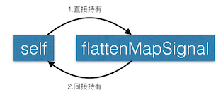
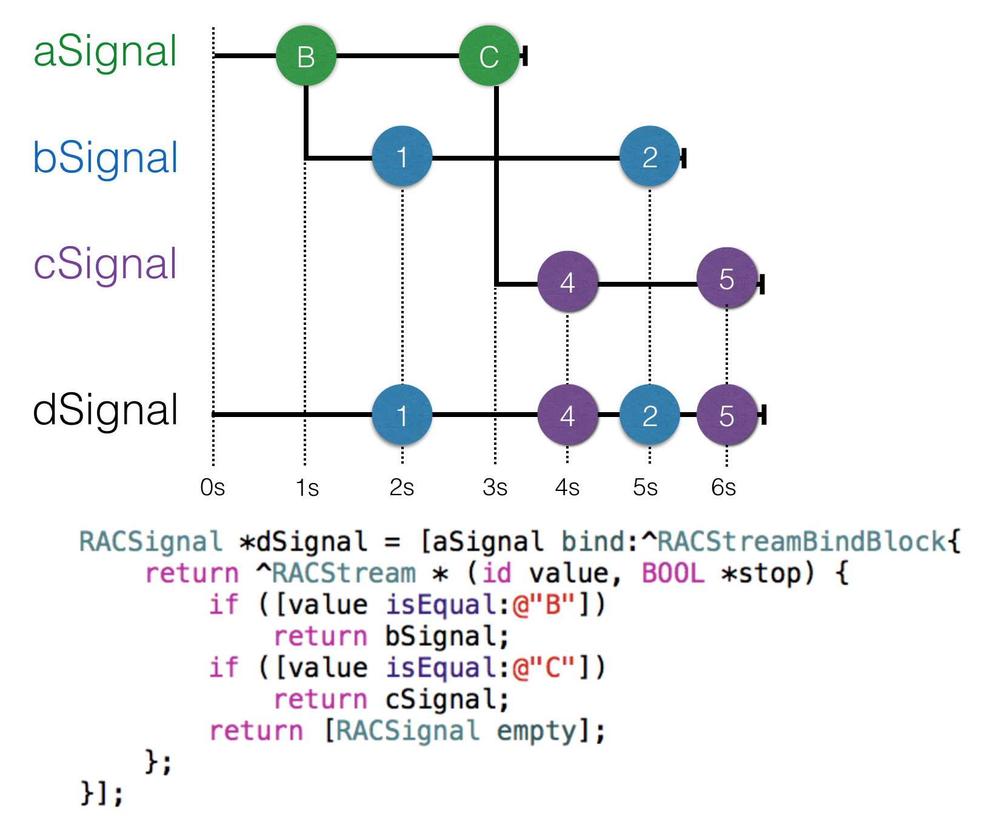
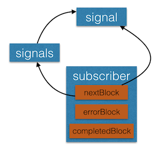
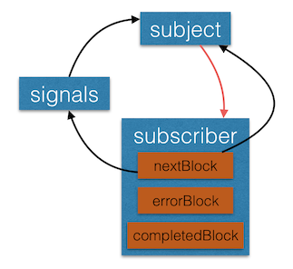

 
<!--BEGIN_DATA
{
    "create_date": "2016-08-19 19:17", 
    "modify_date": "2016-08-19 19:17", 
    "is_top": "0", 
    "summary": "ReactiveCocoa中潜在的内存泄漏及解决方案", 
    "tags": "iOS", 
    "file_name": "ReactiveCocoa中潜在的内存泄漏及解决方案.md"
}
END_DATA-->

####
原文出处：<a href='http://tech.meituan.com/potential-memory-leak-in-reactivecocoa.html' target='blank'>ReactiveCocoa中潜在的内存泄漏及解决方案</a>

##ReactiveCocoa中潜在的内存泄漏及解决方案

高君 ·2016-08-19 12:09

[ReactiveCocoa](http://www.github.com/ReactiveCocoa/ReactiveCocoa)是[GitHub](ht
tps://github.com/)开源的一个函数响应式编程框架，目前在美团App中大量使用。用过它的人都知道很好用，也确实为我们的生活带来了很多便利，特别是跟MVVM模式结合使用，更是如鱼得水。不过刚开始使用的时候，可能容易疏忽掉一些隐藏的细节，从而导致内存泄漏等问题。本文就带大家深入了解下ReactiveCocoa中隐藏的一些细节，帮助大家以更加正确的姿势使用ReactiveCocoa。

以下代码和示例基于[ReactiveCocoa v2.5](https://github.com/ReactiveCocoa/ReactiveCocoa/releases/tag/v2.5)。

###RACObserve引发的血案

[RACObserve](https://github.com/ReactiveCocoa/ReactiveCocoa/blob/v2.5/Reactive
Cocoa/NSObject%2BRACPropertySubscribing.h)是ReactiveCocoa中一个相当常用也相当好用的宏，它可以用来监听属性值的改变，然后传递给订阅者。不过在使用的时候有一点需要稍微注意一下，为了直观说明，先上一个小Demo。

    
    
    - (void)viewDidLoad
    {
        [super viewDidLoad];
        RACSignal *signal = [RACSignal createSignal:^RACDisposable *(id<RACSubscriber> subscriber) { //1
            MTModel *model = [[MTModel alloc] init]; // MTModel有一个名为的title的属性
            [subscriber sendNext:model];
            [subscriber sendCompleted];
            return nil;
        }];
        self.flattenMapSignal = [signal flattenMap:^RACStream *(MTModel *model) { //2
            return RACObserve(model, title);
        }];
        [self.flattenMapSignal subscribeNext:^(id x) { //3
            NSLog(@"subscribeNext - %@", x);
        }];
    }
    

  1. 创建一个signal，该signal被订阅后会发送一个MTModel的实例；
  2. 对第一步创建的signal进行flattenMap操作，并将返回的信号保留（之所以要保留，是因为可能希望在其它地方订阅，不过这里为了简单，就直接在第三步进行订阅）；
  3. 对第二步产生的信号（self.flattenMapSignal）进行订阅。

这段代码看起来很正常，工作也相当良好，但是当从添加了这段代码的控制器返回时，控制器并没有被释放。这又是为啥呢？看下RACObserve的定义：

    
    
    #define RACObserve(TARGET, KEYPATH) \
        ({ \
            _Pragma("clang diagnostic push") \
            _Pragma("clang diagnostic ignored \"-Wreceiver-is-weak\"") \
            __weak id target_ = (TARGET); \
            [target_ rac_valuesForKeyPath:@keypath(TARGET, KEYPATH) observer:self]; \
            _Pragma("clang diagnostic pop") \
        })
    

注意这一句：`[target_ rac_valuesForKeyPath:@keypath(TARGET, KEYPATH)
observer:self];`  
如果将宏简单展开就变成了下面这样：

    
    
    - (void)viewDidLoad
    {
        [super viewDidLoad];
        RACSignal *signal = [RACSignal createSignal:^RACDisposable *(id < RACSubscriber > subscriber) { //1
            GJModel *model = [[GJModel alloc] init];
            [subscriber sendNext:model];
            [subscriber sendCompleted];
            return nil;
        }]; 
        self.flattenMapSignal = [signal flattenMap:^RACStream *(GJModel *model) {//2
            __weak GJModel *target_ = model;
            return [target_ rac_valuesForKeyPath:@keypath(target_, title) observer:self];
        }];
        [self.flattenMapSignal subscribeNext:^(id x) {//3
            NSLog(@"subscribeNext - %@", x);
        }];
    }
    

看到这里，应该发现哪里不对了吧？没错，flattenMap操作接收的block里面出现了self，对self进行了持有，而flattenMap操作返回的信号又由self的属性flattenMapSignal进行了持有，这就造成了循环引用。

注意：2是间接持有，从逻辑上来讲，flattenMapSignal会有一个didSubscribeBlock，为了让传递给flattenMap操作的block有意义，didSubscribeBlock会对该block进行持有，从而也就间接持有了self，感兴趣的读者可以去看下相关源码。

OK，找到了问题所在，解决起来也就简单了，使用@weakify和@strongify即可：

    
    
    - (void)viewDidLoad
    {
        [super viewDidLoad];
        RACSignal *signal = [RACSignal createSignal:^RACDisposable *(id < RACSubscriber > subscriber) {
            GJModel *model = [[GJModel alloc] init];
            [subscriber sendNext:model];
            [subscriber sendCompleted];
            return nil;
        }];
        @weakify(self); //
        self.signal = [signal flattenMap:^RACStream *(GJModel *model) {
            @strongify(self); //
            return RACObserve(model, title);
        }];
        [self.signal subscribeNext:^(id x) {
            NSLog(@"subscribeNext - %@", x);
        }];
    }
    

这里之所以容易疏忽，是因为在block里没有很直观的看到self，但是RACObserve的定义里面却用到了self。  
其实RACObserve的解释中已经很明确地说明了这个问题。

    
    
    /// Creates a signal which observes `KEYPATH` on `TARGET` for changes.
    ///
    /// In either case, the observation continues until `TARGET` _or self_ is
    /// deallocated. If any intermediate object is deallocated instead, it will be
    /// assumed to have been set to nil.
    ///
    /// Make sure to `@strongify(self)` when using this macro within a block! The
    /// macro will _always_ reference `self`, which can silently introduce a retain
    /// cycle within a block. As a result, you should make sure that `self` is a weak
    /// reference (e.g., created by `@weakify` and `@strongify`) before the
    /// expression that uses `RACObserve`.
    ///
    /// Examples
    ///
    ///    // Observes self, and doesn't stop until self is deallocated.
    ///    RACSignal *selfSignal = RACObserve(self, arrayController.items);
    ///
    ///    // Observes the array controller, and stops when self _or_ the array
    ///    // controller is deallocated.
    ///    RACSignal *arrayControllerSignal = RACObserve(self.arrayController, items);
    ///
    ///    // Observes obj.arrayController, and stops when self _or_ the array
    ///    // controller is deallocated.
    ///    RACSignal *signal2 = RACObserve(obj.arrayController, items);
    ///
    ///    @weakify(self);
    ///    RACSignal *signal3 = [anotherSignal flattenMap:^(NSArrayController *arrayController) {
    ///        // Avoids a retain cycle because of RACObserve implicitly referencing
    ///        // self.
    ///        @strongify(self);
    ///        return RACObserve(arrayController, items);
    ///    }];
    ///
    /// Returns a signal which sends the current value of the key path on
    /// subscription, then sends the new value every time it changes, and sends
    /// completed if self or observer is deallocated.
    #define RACObserve(TARGET, KEYPATH) \
        ({ \
            _Pragma("clang diagnostic push") \
            _Pragma("clang diagnostic ignored \"-Wreceiver-is-weak\"") \
            __weak id target_ = (TARGET); \
            [target_ rac_valuesForKeyPath:@keypath(TARGET, KEYPATH) observer:self]; \
            _Pragma("clang diagnostic pop") \
        })
    

通过这个例子，相信你已经知道了RACObserve的正确使用姿势，也意识到了阅读文档的重要性。  
如果说RACObserve潜在的内存泄漏只要稍加留意，使用的时候查看下文档就能避免；那么下面的情况，就相当隐蔽了，就算是看了文档也不一定能看出来。  
不信？接着往下看。

###RACSubject带来的悲剧

[RACSubject](https://github.com/ReactiveCocoa/ReactiveCocoa/blob/v2.5/Reactive
Cocoa/RACSubject.h)是非RAC到RAC的一个桥梁，使用起来也很简单方便，基本的用法如下：

    
    
    - (void)viewDidLoad {
        [super viewDidLoad];
        RACSubject *subject = [RACSubject subject]; //1
        [subject.rac_willDeallocSignal subscribeCompleted:^{ //2
            NSLog(@"subject dealloc");
        }];
        [subject subscribeNext:^(id x) { //3
            NSLog(@"next = %@", x);
        }];
        [subject sendNext:@1]; //4
    }
    

  1. 创建一个RACSubject的实例；
  2. 订阅subject的dealloc信号，在subject被释放的时候会发送完成信号；
  3. 订阅subject；
  4. 使用subject发送一个值。

接下来看一下输出的结果：

    
    
    2016-06-13 09:15:25.426 RAC[5366:245360] next = 1
    2016-06-13 09:15:25.428 RAC[5366:245360] subject dealloc
    

工作相当良好，接下来改造下程序，要求对subject发送的所有值进行乘3，这用map很容易就实现了。

    
    
    - (void)viewDidLoad {
        [super viewDidLoad];
        RACSubject *subject = [RACSubject subject]; 
        [subject.rac_willDeallocSignal subscribeCompleted:^{ 
            NSLog(@"subject dealloc");
        }];
        [[subject map:^id(NSNumber *value) { 
            return @([value integerValue] * 3);
        }] subscribeNext:^(id x) { 
            NSLog(@"next = %@", x);
        }];
        [subject sendNext:@1]; 
    }
    

跟之前大体不变，只是对subject进行了map操作然后再订阅，看下输出结果：

    
    
    2016-06-13 09:21:42.450 RAC[5404:248584] next = 3
    

的确是进行了乘3操作，符合预期，但是这里有一个很严重的问题，subject dealloc没有输出，也就是说subject没有释放。  
这不科学啊！subject看上去没有被任何对象持有。  
那究竟是什么情况？下面我们将RACSubject换成[RACSignal](https://github.com/ReactiveCocoa/ReactiveCocoa/blob/v2.5/ReactiveCocoa/RACSignal.h)试试：

    
    
    - (void)viewDidLoad {
        [super viewDidLoad];
        RACSignal *signal = [RACSignal createSignal:^RACDisposable *(id<RACSubscriber> subscriber) {
            [subscriber sendNext:@1];
            return nil;
        }];
        [signal.rac_willDeallocSignal subscribeCompleted:^{
            NSLog(@"signal dealloc");
        }];
        [[signal map:^id(NSNumber *value) {
            return @([value integerValue] * 3);
        }] subscribeNext:^(id x) {
            NSLog(@"next = %@", x);
        }];
    }
    

逻辑跟之前一样，看一下输出结果：

    
    
    2016-06-12 23:32:31.669 RACDemo[5085:217082] next = 3
    2016-06-12 23:32:31.674 RACDemo[5085:217082] signal dealloc
    

很明显，signal被释放了。同样的逻辑，signal能正常释放，subject却不能正常释放，太神奇了！  
细心的读者看到这里，应该会发现一个问题：上面的几次试验，不管是RACSubject还是RACSignal都没有调用sendCompleted。  
难道跟这个有关系？带着这个疑问，再进行如下试验，给RACSubject发送一个完成信号：

    
    
    - (void)viewDidLoad {
        [super viewDidLoad];
        RACSubject *subject = [RACSubject subject]; 
        [subject.rac_willDeallocSignal subscribeCompleted:^{ 
            NSLog(@"subject dealloc");
        }];
        [[subject map:^id(NSNumber *value) { 
            return @([value integerValue] * 3);
        }] subscribeNext:^(id x) { 
            NSLog(@"next = %@", x);
        }];
        [subject sendNext:@1]; 
        [subject sendCompleted];
    }
    

输出结果：

    
    
    2016-06-12 23:40:19.148 RAC_bindSample[5168:221902] next = 3
    2016-06-12 23:40:19.153 RAC_bindSample[5168:221902] subject dealloc
    

subject被释放了，确实修正了内存泄漏问题。到这里，我们可以得出结论：  
使用RACSubject，如果进行了map操作，那么一定要发送完成信号，不然会内存泄漏。

虽然得出了结论，但是留下的疑问也是不少，如果你希望知道这其中的缘由，请继续往下看。  
简单来说，留下的疑问有：

  1. 为什么对RACSubject的实例进行map操作之后会产生内存泄漏？
  2. 为什么RACSignal不管是否有map操作，都不会产生内存泄漏？
  3. 针对第一个问题，为什么发送完成可以修复内存泄漏？

带着疑问，咱们继续一探究竟。  
讲道理，`RACSignal`和`RACSubject`虽然都是信号，但是它们有一个本质的区别：  
**RACSubject会持有订阅者（因为RACSubject是热信号，为了保证未来有事件发送的时候，订阅者可以收到信息，所以需要对订阅者保持状态，做法就是持有订阅者），而RACSignal不会持有订阅者。**  
关于这一点，更详细的说明请看[《细说ReactiveCocoa的冷信号与热信号（三）：怎么处理冷信号与热信号》](http://tech.meituan.com/talk-about-reactivecocoas-cold-signal-and-hot-signal-part-3.html)。  
那么持不持有订阅者，跟内存无法释放又有啥关系呢？不急，先记着有这样一个特性，咱们看看实现。

从上面提出第一个问题可以发现，关键点在于map操作，那么map操作究竟干了什么事情，看下map的实现：

    
    
    - (instancetype)map:(id (^)(id value))block {
        NSCParameterAssert(block != nil);
        Class class = self.class;
        return [[self flattenMap:^(id value) {
            return [class return:block(value)];
        }] setNameWithFormat:@"[%@] -map:", self.name];
    }
    

很简单，只是调用了一下flattenMap，再看下flattenMap怎么实现的：

    
    
     - (instancetype)flattenMap:(RACStream * (^)(id value))block {
        Class class = self.class;
        return [[self bind:^{
            return ^(id value, BOOL *stop) {
                id stream = block(value) ?: [class empty];
                NSCAssert([stream isKindOfClass:RACStream.class], @"Value returned from -flattenMap: is not a stream: %@", stream);
                return stream;
            };
        }] setNameWithFormat:@"[%@] -flattenMap:", self.name];
    }
    

也很简单，只是调用了一下bind，再看看bind的实现，bind的实现位于RACSignal.m的92行左右。

    
    
     - (RACSignal *)bind:(RACStreamBindBlock (^)(void))block {
        NSCParameterAssert(block != NULL);
        /*
         * -bind: should:
         * 
         * 1. Subscribe to the original signal of values.
         * 2. Any time the original signal sends a value, transform it using the binding block.
         * 3. If the binding block returns a signal, subscribe to it, and pass all of its values through to the subscriber as they're received.
         * 4. If the binding block asks the bind to terminate, complete the _original_ signal.
         * 5. When _all_ signals complete, send completed to the subscriber.
         * 
         * If any signal sends an error at any point, send that to the subscriber.
         */
        return [[RACSignal createSignal:^(id<RACSubscriber> subscriber) {
            RACStreamBindBlock bindingBlock = block();
            NSMutableArray *signals = [NSMutableArray arrayWithObject:self];
            // 此处省略了80行代码
            // ...
        }] setNameWithFormat:@"[%@] -bind:", self.name];
    }
    

如果你下载了源代码（不想下源码的话，也可以[在线查看](https://github.com/ReactiveCocoa/ReactiveCocoa/blob/v2.5/ReactiveCocoa/RACSignal.m)），并且看到了这里，相信你的感觉一定是一脸懵逼的，不要激动，虽然这个方法很长，看上去也不那么好懂，但是关键点就那么几个地方，掌握了关键点就基本能get了。  
ReactiveCocoa的作者更是罕见地在实现文件了写了一大段注释来说明bind方法的用途，根据作者的注释再去理解这个方法会轻松很多。  
这里贴一个图，方便大家理解：

OK，了解了bind操作的用途，也是时候回归主题了——内存是怎么泄露的。  
首先我们看到，在didSubscribe的开头，就创建了一个数组signals，并且持有了self，也就是源信号：

    
    
    NSMutableArray *signals = [NSMutableArray arrayWithObject:self];
    

(p.s. 如果你不知道didSubscribe是什么，也不了解ReactiveCocoa中信号的订阅过程，可以先看下[《RACSignal的Subscri ption深入分析》](http://tech.meituan.com/RACSignalSubscription.html))

接下来会对源信号进行订阅：

    
    
    RACDisposable *bindingDisposable = [self subscribeNext:^(id x) {
        // Manually check disposal to handle synchronous errors.
        if (compoundDisposable.disposed) return;
        BOOL stop = NO;
        id signal = bindingBlock(x, &stop);
        @autoreleasepool {
            if (signal != nil) addSignal(signal);
            if (signal == nil || stop) {
                [selfDisposable dispose];
                completeSignal(self, selfDisposable);
            }
        }
    } error:^(NSError *error) {
        //...
    } completed:^{
        //...
    }];
    

订阅者会持有nextBlock、errorBlock、completedBlock三个block，为了简单，我们只讨论nextBlock。  
从nextBlock中的`completeSignal(self, selfDisposable);`这一行代码可以看出，nextBlock对self，也就是源信号进行了持有，再看到`if (signal != nil) addSignal(signal);`这一行，nextBlock对addSignal进行了持有，addSignal是在订阅self之前定义的一个block。

    
    
    void (^addSignal)(RACSignal *) = ^(RACSignal *signal) {
        @synchronized (signals) {
            [signals addObject:signal];
        }
        //...
    };
    

addSignal这个block里面对一开始创建的数组signals进行了持有，用一幅图来描述下刚才所说的关系：

如果这个signal是一个RACSignal，那么是没有任何问题的；如果是signal是一个RACSubject，那问题就来了。还记得前面说过的RACSignal和RACSubject的区别吗？RACSubject会持有订阅者，而RACSignal不会持有订阅者，如果signal是一个RACSubject，那么图应该是这样的：

很明显，产生了循环引用！！！到这里，也就解答了前面提出的三个问题的前两个：  
对一个信号进行了map操作，那么最终会调用到bind。  
如果源信号是RACSubject，由于RACSubject会持有订阅者，所以产生了循环引用(内存泄漏)；  
如果源信号是RACSignal，由于RACSignal不会持有订阅者，那么也就不存在循环引用。

还剩下最后一个问题：如果源信号是RACSubject，为什么发送完成可以修复内存泄漏？  
来看下订阅者收到完成信号之后干了些什么：

    
    
    RACDisposable *bindingDisposable = [self subscribeNext:^(id x) {
        //...
    } error:^(NSError *error) {
        //...
    } completed:^{
        @autoreleasepool {
            completeSignal(self, selfDisposable);
        }
    }];
    

很简单，只是调用了一下completeSignal这个block。再看下这个block内部在干嘛：

    
    
    void (^completeSignal)(RACSignal *, RACDisposable *) = ^(RACSignal *signal, RACDisposable *finishedDisposable) {
        BOOL removeDisposable = NO;
        @synchronized (signals) {
            [signals removeObject:signal]; //1
            if (signals.count == 0) {
                [subscriber sendCompleted]; //2
                [compoundDisposable dispose]; //3
            } else {
                removeDisposable = YES;
            }
        }
        if (removeDisposable) [compoundDisposable removeDisposable:finishedDisposable]; //4
    };
    

//1这里从signals这个数组中移除传入的signal，也就断掉了signals持有subject这条线。  
//2、//3、//4其实干的事情差不多，都是拿到对应的disposable调用dispose，这样资源就得到了回收，subject就不会再持有subscriber，subscriber也会对自己的nextBlock、errorBlock、completedBlock三个block置为nil，就不会存在引用关系
，所有的对象都得到了释放。  有兴趣的同学可以去了解下[RACDisposable](https://github.com/ReactiveCocoa/ReactiveCocoa/blob/v2.5/ReactiveCocoa/RACDisposable.h)，它也是ReactiveCocoa中的重要一员，对理解源码有很大的帮助。  
map只是一个很典型的操作，其实在ReactiveCocoa的实现中，几乎所有的操作底层都会调用到bind这样一个方法，包括但不限于：  
`map、filter、merge、combineLatest、flattenMap ……`

所以在使用ReactiveCocoa的时候也一定要仔细，对信号操作完成之后，记得发送完成信号，不然可能在不经意间就导致了内存泄漏。

RACSubject就是一个比较典型直接的例子。除此之外，如果在对一个信号进行类似replay这样的操作之后，也一定要保证源信号发送完成；不然，也是会有内存
泄漏的。

    
    
    RACSignal *signal = [RACSignal createSignal:^RACDisposable *(id<RACSubscriber> subscriber) {
        [subscriber sendNext:@1];
        [subscriber sendCompleted]; // 保证源信号发送完成
        return nil;
    }];
    RACSignal *replaySignal = [signal replay]; // 这里返回的其实是一个RACReplaySubject
    [[replaySignal map:^id(NSNumber *value) {
        return @([value integerValue] * 3);
    }] subscribeNext:^(id x) {
        NSLog(@"subscribeNext - %@", x);
    }];
    

总之，一句话：使用ReactiveCocoa必须要保证信号发送完成或者发送错误。

###参考资料

  * 美团点评技术博客，[《细说ReactiveCocoa的冷信号与热信号系列文章》](http://tech.meituan.com/talk-about-reactivecocoas-cold-signal-and-hot-signal-part-1.html)。
  * 美团点评技术博客，[《RACSignal的Subscription深入分析》](http://tech.meituan.com/RACSignalSubscription.html)。
  * GitHub，[ReactiveCocoa官方文档](https://github.com/ReactiveCocoa/ReactiveCocoa/tree/v2.5/Documentation)。

