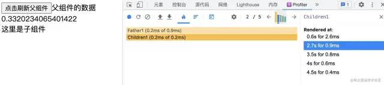
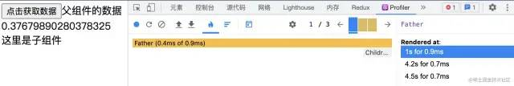

<!--BEGIN_DATA
{
    "create_date": "2022-12-01 20:44", 
    "modify_date": "2022-12-01 20:44", 
    "is_top": "0", 
    "summary": "React性能优化的那些事儿", 
    "tags": "Web", 
    "file_name": "React性能优化的那些事儿.md"
}
END_DATA-->

#### <p>原文出处：<a href='https://mp.weixin.qq.com/s/qGNfA_c9feYz5gRZMq7j9Q' target='blank'>React性能优化的那些事儿</a></p>

> 作者：雨飞飞雨
>
> https://juejin.cn/post/7146846541846675492
> 
> 要讲清楚性能优化的原理，就需要知道它的前世今生，需要回答如下的问题：
>
>   * React 是如何进行页面渲染的？
>   * 造成页面的卡顿的罪魁祸首是什么呢？
>   * 我们为什么需要性能优化？
>   * React 有哪些场景会需要性能优化？
>   * React 本身的性能优化手段？
>   * 还有哪些工具可以提升性能呢？

## 为什么页面会出现卡顿的现象？

为什么浏览器会出现页面卡顿的问题？是不是浏览器不够先进？这都 2202 年了，怎么还会有这种问题呢？

实际上问题的根源来源于浏览器的刷新机制。

我们人类眼睛的刷新率是 60Hz，浏览器依据人眼的刷新率 计算出了

1000 Ms / 60 = 16.6ms

也就是说，浏览器要在16.6Ms 进行一次刷新，人眼就不会感觉到卡顿，而如果超过这个时间进行刷新，就会感觉到卡顿。

而浏览器的主进程在仅仅需要页面的渲染，还需要做解析执行Js，他们运行在一个进程中。

如果js的在执行的长时间占用主进程的资源，就会导致没有资源进行页面的渲染刷新，进而导致页面的卡顿。

那么这个又和 React 的性能优化又有什么关系呢？

## React 到底是在哪里出现了卡顿？

基于我们上的知识，js 长期霸占浏览器主线程造成无法刷新而造成卡顿。

那么 React 的卡顿也是基于这个原因。

React 在render的时候，会根据现有render产生的新的jsx的数据和现有fiberRoot进行比对，找到不同的地方，然后生成新的workInProgress，进而在挂载阶段把新的workInProgress交给服务器渲染。

在这个过程中，React 为了让底层机制更高效快速，进行了大量的优化处理，如设立任务优先级、异步调度、diff算法、时间分片等。

整个链路就是了高效快速的完成从数据更新到页面渲染的整体流程。

为了不让递归遍历寻找所有更新节点太大而占用浏览器资源，React 升级了fiber架构，时间分片，让其可以增量更新。

为了找出所有的更新节点，设立了diff算法，高效的查找所有的节点。

为了更高效的更新，及时响应用户的操作，设计任务调度优先级。

而我们的性能优化就是为了不给 React 拖后腿，让其更快，更高效的遍历。

那么性能优化的奥义是什么呢？？

**就是控制刷新渲染的波及范围，我们只让改更新的更新，不该更新的不要更新，让我们的更新链路尽可能的短的走完，那么页面当然就会及时刷新不会卡顿了。**

## React 有哪些场景会需要性能优化？

  * 父组件刷新，而不波及子组件
  * 组件自己控制自己是否刷新
  * 减少波及范围，无关刷新数据不存入state中
  * 合并 state,减少重复 setState 的操作
  * 如何更快的完成diff的比较，加快进程

我们分别从这些场景说一下：·

### 一：父组件刷新，而不波及子组件。

我们知道 React 在组件刷新判定的时候，如果触发刷新，那么它会深度遍历所有子组件，查找所有更新的节点，依据新的jsx数据和旧的 fiber，生成新的workInProgress，进而进行页面渲染。

所以父组件刷新的话，子组件必然会跟着刷新，但是假如这次的刷新，和我们子组件没有关系呢？怎么减少这种波及呢？

如下面这样：

```js
export default function Father1 (){  
    let [name,setName] = React.useState('');  
    return (  
        <div>  
            <button onClick={()=>setName("获取到的数据")}>点击获取数据</button>  
            {name}  
            <Children/>  
        </div>  
    )  
}  

function Children(){  
    return (  
        <div>  
            这里是子组件  
        </div>  
    )  
}  
```

运行结果：


可以看到我们的子组件被波及了，解决办法有很多，总体来说分为两种。

  * 子组件自己判断是否需要更新 ,典型的就是 PureComponent，shouldComponentUpdate，memo
  * 父组件对子组件做个缓冲判断

#### 第一种：使用 PureComponent

使用 PureComponent 的原理就是它会对state 和props进行浅比较，如果发现并不相同就会更新。

```js
export default function Father1 (){  
    let [name,setName] = React.useState('');  
    return (  
        <div>  
            <button onClick={()=>setName("父组件的数据")}>点击刷新父组件</button>  
            {name}  
            
            <Children1/>  
        </div>  
    )  
}  

class Children extends React.PureComponent{  
    render() {  
        return (  
            <div>这里是子组件</div>  
        )  
    }  
}  
```

执行结果：


实际上`PureComponent`就是在内部更新的时候调用了会调用如下方法来判断 新旧state和props

```js
function shallowEqual(objA: mixed, objB: mixed): boolean {  
  if (is(objA, objB)) {  
    return true;  
  }  

  if (  
    typeof objA !== 'object' ||  
    objA === null ||  
    typeof objB !== 'object' ||  
    objB === null  
  ) {  
    return false;  
  }  

  const keysA = Object.keys(objA);  
  const keysB = Object.keys(objB);  
  if (keysA.length !== keysB.length) {  
    return false;  
  }  

  // Test for A's keys different from B.  
  for (let i = 0; i < keysA.length; i++) {  
    const currentKey = keysA[i];  
    if (  
      !hasOwnProperty.call(objB, currentKey) ||  
      !is(objA[currentKey], objB[currentKey])  
    ) {  
      return false;  
    }  
  }  

  return true;  
}  
```

它的判断步骤如下：

  * 第一步，首先会直接比较新老 `props` 或者新老 `state` 是否相等。如果相等那么不更新组件。
  * 第二步，判断新老 `state` 或者 `props` ，有不是对象或者为 `null` 的，那么直接返回 false ，更新组件。
  * 第三步，通过 `Object.keys` 将新老 `props` 或者新老 `state` 的属性名 `key` 变成数组，判断数组的长度是否相等，如果不相等，证明有属性增加或者减少，那么更新组件。
  * 第四步，遍历老 `props` 或者老 `state` ，判断对应的新 `props` 或新 `state` ，有没有与之对应并且相等的（这个相等是浅比较），如果有一个不对应或者不相等，那么直接返回 `false` ，更新组件。 到此为止，浅比较流程结束， `PureComponent` 就是这么做渲染节流优化的。

##### 在使用PureComponent时需要注意的细节：

由于`PureComponent` 使用的是浅比较判断`state`和`props`，所以如果我们在父子组件中，子组件使用`PureComponent`,在
父组件刷新的过程中不小心把传给子组件的回调函数变了，就会造成子组件的误触发，这个时候`PureComponent`就失效了。

##### 细节一：函数组件中，匿名函数，箭头函数和普通函数都会重新声明

下面这些情况都会造成函数的重新声明：

###### 箭头函数

```js
<Children1 callback={(value)=>setValue(value)}/>  
```

###### 匿名函数

```js
<Children1 callback={function (value){setValue(value)}}/>  
```

###### 普通函数

```js
export default function Father1 (){  
    let [name,setName] = React.useState('');  
    let [value,setValue] = React.useState('') 

    const setData=(value)=>{  
        setValue(value)  
    }  

    return (  
        <div>  
            <button onClick={()=>setName("父组件的数据"+Math.random())}>点击刷新父组件</button>  
            {name}  
            <Children1 callback={setData}/>  
        </div>  
    )  
}  

class Children1 extends React.PureComponent{  
    render() {  
        return (  
            <div>这里是子组件</div>  
        )  
    }  
}  
```

执行结果：



可以看到子组件的 PureComponent 完全失效了。这个时候就可以使用useMemo或者 useCallback 出马了，利用他们缓冲一份函数，保证不会出现重复声明就可以了。

```js
export default function Father1 (){  
    let [name,setName] = React.useState('');  
    let [value,setValue] = React.useState('')  

    const setData= React.useCallback((value)=>{  
        setValue(value)  
    },[])  
      
    return (  
        <div>  
            <button onClick={()=>setName("父组件的数据"+Math.random())}>点击刷新父组件</button>  
            {name}  
            <Children1 callback={setData}/>  
        </div>  
    )  
}  
```

看结果：


可以看到我们的子组件这次并没有参与父组件的刷新，在`React Profiler`中也提示，`Children1`并没有渲染。

##### 细节二：class组件中不使用箭头函数，匿名函数

原理和函数组件中的一样，class组件中每一次刷新都会重复调用`render`函数，那么`render`函数中使用的匿名函数，箭头函数就会造成重复刷新的问题。

```js
export default class Father extends React.PureComponent{  
    constructor(props) {  
        super(props);  
        this.state = {  
            name:"",  
            count:"",  
        }  
    }  

    render() {  
        return (  
            <div>  
                <button onClick={()=>this.setState({name:"父组件的数据"+Math.random()})}>点击获取数据</button>  
                {this.state.name}  
                <Children1 callback={()=>this.setState({count:11})}/>  
            </div>  
        )  
    }  
}  
```

执行结果：


而优化这个非常简单，只需要把函数换成普通函数就可以。

```js
export default class Father extends React.PureComponent{  
    constructor(props) {  
        super(props);  
        this.state = {  
            name:"",  
            count:"",  
        }  
    } 

    setCount=(count)=>{  
        this.setState({count})  
    }  

    render() {  
        return (  
            <div>  
                <button onClick={()=>this.setState({name:"父组件的数据"+Math.random()})}>点击获取数据</button>  
                {this.state.name}  
                <Children1 callback={this.setCount(111)}/>  
            </div>  
        )  
    }  
}  
```

执行结果：



##### 细节三：在 class 组件的render函数中调用bind 函数

这个细节是我们在class组件中，没有在`constructor`中进行`bind`的操作，而是在`render`函数中，那么由于`bind`函数的特性，它的每一次调用都会返回一个新的函数，所以同样会造成`PureComponent`的失效

```js
export default class Father extends React.PureComponent{  
    //...  
    setCount(count){  
        this.setCount({count})  
    }  

    render() {  
        return (  
            <div>  
                <button onClick={()=>this.setState({name:"父组件的数据"+Math.random()})}>点击获取数据</button>  
                {this.state.name}  
                <Children1 callback={this.setCount.bind(this,"11111")}/>  
            </div>  
        )  
    }  
}  
```

看执行结果：


优化的方式也很简单，把`bind`操作放在`constructor`中就可以了。

```js
constructor(props) {  
    super(props);  
    this.state = {  
        name:"",  
        count:"",  
    }  
    this.setCount= this.setCount.bind(this);  
}  
```

执行结果就不在此展示了。

而实际上上诉所说的三个细节同样对`React.memo`有效，它同样也会浅比较传入的`props`.

#### 第二种：shouldComponentUpdate

class 组件中 使用 shouldComponentUpdate是主要的优化方式，它不仅仅可以判断来自父组件的`nextprops`，还可以根据`nextState`和最新的`nextContext`来决定是否更新。

```js
class Children2 extends React. PureComponent{  
    shouldComponentUpdate(nextProps, nextState, nextContext) {  
        //判断只有偶数的时候，子组件才会更新  
        if(nextProps !== this.props && nextProps.count  % 2 === 0){  
            return true;  
        }else{  
            return false;  
        }  
    }  

    render() {  
        return (  
            <div>  
                只有父组件传入的值等于 2的时候才会更新  
                {this.props.count}  
            </div>  
        )  
    }  
}  
```

它的用法也是非常简单，就是如果需要更新就返回true，不需要更新就返回false.

#### 第三种：函数组件如何判断props的变化的更新呢？ 使用 React.memo函数

`React.memo`的规则是如果想要复用最后一次渲染结果，就返回`true`，不想复用就返回`false`。

所以它和`shouldComponentUpdate`的正好相反，`false`才会更新，`true`就返回缓冲。

```js
const Children3 = React.memo(function ({count}){  
    return (  
        <div>  
            只有父组件传入的值是偶数的时候才会更新  
            {count}  
        </div>  
    )  
},(prevProps, nextProps)=>{  
    if(nextProps.count % 2 === 0){  
        return false;  
    }else{  
        return true;  
    }  
})  
```

如果我们不传入第二个函数，而是默认让 `React.memo`包裹一下，那么它只会对`props`浅比较一下，并不会有比较`state`之类的逻辑。

以上三种都是我们为了应对父组件更新触发子组件，子组件决定是否更新的实现。 下面我们讲一下父组件对子组件缓冲实现的情况：

#### 使用 React.useMemo来实现对子组件的缓冲

看下面这段逻辑，我们的子组件只关心`count`数据，当我们刷新`name`数据的时候，并不会触发刷新`Children1`子组件，实现了我们对组件的缓冲控制。

```js
export default function Father1 (){  
    let [count,setCount] = React.useState(0);  
    let [name,setName] = React.useState(0);  
    const render = React.useMemo(()=><Children1 count = {count}/>,[count])  
    return (  
        <div>  
            <button onClick={()=>setCount(++count)}>点击刷新count</button>  
            <br/>  
            <button onClick={()=>setName(++name)}>点击刷新name</button>  
            <br/>  
            {"count"+count}  
            <br/>  
            {"name"+name}  
            <br/>  
            {render}  
        </div>  
    )  
}  

class Children1 extends React.PureComponent{  
    render() {  
        return (  
            <div>  
                子组件只关系count 数据  
                {this.props.count}  
            </div>  
        )  
    }  
}  
```

执行结果： 当我们点击刷新name数据时，可以看到没有子组件参与刷新


当我们点击刷新count 数据时，子组件参与了刷新


### 二：组件自己控制自己是否刷新

这里就需要用到上面提到的`shouldComponentUpdate`以及`PureComponent`,这里不再赘述。

### 三：减少波及范围，无关刷新数据不存入state中

这种场景就是我们有意识的控制，如果有一个数据我们在页面上并没有用到它，但是它又和我们的其他的逻辑有关系，那么我们就可以把它存储在其他的地方，而不是state中。

#### 场景一：无意义重复调用setState，合并相关的state

```js
export default class Father extends React.Component{  
    state = {  
        count:0,  
        name:"",  
    }

    getData=(count)=>{  
        this.setState({count});  
        //依据异步获取数据  
        setTimeout(()=>{  
            this.setState({  
                name:"异步获取回来的数据"+count  
            })  
        },200)  
    }

    componentDidUpdate(prevProps, prevState, snapshot) {  
        console.log("渲染次数,",++count,"次")  
    }  

    render() {  
        return (  
            <div>  
                <button onClick={()=>this.getData(++this.state.count)}>点击获取数据</button>  
                {this.state.name}  
            </div>  
        )  
    }  
}  
```

`React Profiler`的执行结果：


可以看到我们的父组件执行了两次。
其中的一次是无意义的先`setState`保存一次数据，然后又根据这个数据异步获取了数据以后又调用了一次`setState`，造成了第二次的数据刷新.

而解决办法就是把这个数据合并到异步数据获取完成以后，一起更新到state中。

```js
getData=(count)=>{  
        //依据异步获取数据  
        setTimeout(()=>{  
            this.setState({  
                name:"异步获取回来的数据"+count,  
                count  
            })  
        },200)  
}  
```

看执行结果：只渲染了一次。


#### 场景二：和页面刷新没有相关的数据，不存入state中

实际上我们发现这个数据在页面上并没有展示，我们并不需要把他们都存放在state 中，所以我们可以把这个数据存储在state之外的地方。

```js
export default class Father extends React.Component{  
    constructor(props) {  
        super(props);  
        this.state = {  
            name:"",  
        }  
        this.count = 0;  
    }  

    getData=(count)=>{  
        this.count = count;  
        //依据异步获取数据  
        setTimeout(()=>{  
            this.setState({  
                name:"异步获取回来的数据"+count,  
            })  
        },200)  
    }  

    componentDidUpdate(prevProps, prevState, snapshot) {  
        console.log("渲染次数,",++count,"次")  
    }  

    render() {  
        return (  
            <div>  
                <button onClick={()=>this.getData(++this.count)}>点击获取数据</button>  
                {this.state.name}  
            </div>  
        )  
    }  
}  
```

这样的操作并不会影响我们对它的使用。 在`class`组件中我们可以把数据存储在`this`上面，而在`Function`中，则我们可以通过利用`useRef` 这个 `Hooks` 来实现同样的效果。

```js
export default function Father1 (){  
    let [name,setName] = React.useState('');  
    const countContainer = React.useRef(0); 

    const getData=(count)=>{  
        //依据异步获取数据  
        setTimeout(()=>{  
            setName("异步获取回来的数据"+count)  
            countContainer.current = count++;  
        },200)  
    }  

    return (  
        <div>  
            <button onClick={()=>getData(++countContainer.current)}>点击获取数据</button>  
            {name}  
        </div>  
    )  
}  
```

#### 场景三：通过存入useRef的数据中，避免父子组件的重复刷新

假设父组件中有需要用到子组件的数据，子组件需要把数据回到返回给父组件，而如果父组件把这份数据存入到了 `state` 中，那么父组件刷新，子组件也会跟着刷新。 这种的情况我们就可以把数据存入到 `useRef` 中，以避免无意义的刷新出现。或者把数据存入到class的`this` 下。

### 四：合并 state,减少重复 setState 的操作

合并 `state` ,减少重复 `setState` 的操作,实际上 `React`已经帮我们做了，那就是批量更新，在`React18`之前的版本中，批量更新只有在 React自己的生命周期或者点击事件中有提供，而异步更新则没有，例如`setTimeout`，`setInternal`等。

所以如果我们想在`React18` 之前的版本中也想在异步代码添加对批量更新的支持，就可以使用`React`给我们提供的`api`。

```js
import ReactDOM from 'react-dom';  
const { unstable_batchedUpdates } = ReactDOM;  
```

使用方法如下：

```js
componentDidMount() {  
    setTimeout(()=>{  
        unstable_batchedUpdates(()=>{  
            this.setState({ number:this.state.number + 1 })  
            console.log(this.state.number)  
            this.setState({ number:this.state.number + 1})  
            console.log(this.state.number)  
            this.setState({ number:this.state.number + 1 })  
            console.log(this.state.number)  
        })  
    })  
}  
```

而在 React 18中的话，就不需要我们这样做了，它 对settimeout、promise、原生事件、react事件、外部事件处理程序进行自动批量处理。

### 五：如何更快的完成diff的比较，加快进程

`diff`算法就是为了帮助我们找到需要更新的异同点，那么有什么办法可以让我们的`diff`算法更快呢？

那就是合理的使用`key`

`diff`的调用是在`reconcileChildren`中的`reconcileChildFibers`，当没有可以复用`current` `fiber`节点时，就会走`mountChildFibers`，当有的时候就走`reconcileChildFibers`。

而`reconcilerChildFibers`的函数中则会针`render`函数返回的新的`jsx`数据进行判断，它是否是对象，就会判断它的`newChild.$$typeof`是否是`REACT_ELEMENT_TYPE`，如果是就按单节点处理。如果不是继续判断是否是`REACT_PORTAL_TYPE`或者`REACT_LAZY_TYPE`。

继续判断它是否为数组，或者可迭代对象。

而在单节点处理函数`reconcileSingleElement`中，会执行如下逻辑：

  * 通过 `key`,判断上次更新的时候的 `Fiber` 节点是否存在对应的 `DOM` 节点。 如果没有 则直接走创建流程，新生成一个 Fiber 节点，并返回

  * 如果有，那么就会继续判断，`DOM` 节点是否可以复用？

  * 如果有，就将上次更新的 `Fiber `节点的副本作为本次新生的`Fiber` 节点并返回

  * 如果没有，那么就标记 `DOM` 需要被删除，新生成一个 `Fiber` 节点并返回。

```js
function reconcileSingleElement(  
    returnFiber: Fiber,  
    currentFirstChild: Fiber | null,  
    element: ReactElement  
): Fiber {  
    const key = element.key; //jsx 虚拟 DOM 返回的数据  
    let child = currentFirstChild;//当前的fiber   
      
    // 首先判断是否存在对应DOM节点  
    while (child !== null) {  
        // 上一次更新存在DOM节点，接下来判断是否可复用  
          
        // 首先比较key是否相同  
        if (child.key === key) {  
              
            // key相同，接下来比较type是否相同  
              
            switch (child.tag) {  
                // ...省略case  
                  
                default: {  
                    if (child.elementType === element.type) {  
                        // type相同则表示可以复用  
                        // 返回复用的fiber  
                        return existing;  
                    }  
                      
                    // type不同则跳出switch  
                    break;  
                }  
            }  
            // 代码执行到这里代表：key相同但是type不同  
            // 将该fiber及其兄弟fiber标记为删除  
            deleteRemainingChildren(returnFiber, child);  
            break;  
        } else {  
            // key不同，将该fiber标记为删除  
            deleteChild(returnFiber, child);  
        }  
        child = child.sibling;  
    }  
      
    // 创建新Fiber，并返回 ...省略  
}  
```

从上面的代码就可以看出，`React` 是如何判断一个 `Fiber` 节点是否可以被复用的。

  * 第一步：判断`element`的 `key` 和` fiber` 的`key` 是否相同

  * 如果不相同，就会创建新的 `Fiber`,并返回

  * 第二步：如果相同，就判断`element.type`和`fiber`的 `type` 是否相同，`type` 就是他们的类型，比如`p`标签就是`p，div `标签就是`div`.如果 `type` 不相同，那么就会标识删除。

  * 如果相同，那就可以可以判断可以复用了，返回`existing`。

而在多节点更新的时候，`key`的作用则更加重要，`React` 会通过遍历新旧数据，数组和链表来通过按个判断它们的`key`和 `type` 来决定是否复用。

所以我们需要合理的使用`key`来加快`diff`算法的比对和`fiber`的复用。

那么如何合理使用`key`呢。

其实很简单，只需要每一次设置的值和我们的数据一直就可以了。不要使用`数组`的下标，这种`key`和数据没有关联，我们的数据发生了更新，结果 `React` 还指望着复用。

## 还有哪些工具可以提升性能呢？

实际的开发中还有其他的很多场景需要进行优化：

  * 频繁输入或者滑动滚动的防抖节流
  * 针对大数据展示的虚拟列表，虚拟表格
  * 针对大数据展示的时间分片 等等
