 
<!--BEGIN_DATA
{
    "create_date": "2017-01-10 21:45", 
    "modify_date": "2017-01-10 21:45", 
    "is_top": "0", 
    "summary": "RecyclerView 必知必会", 
    "tags": "Android", 
    "file_name": "RecyclerView必知必会.md"
}
END_DATA-->

####
原文出处：<a href='http://www.cnblogs.com/bugly/p/6264751.html' target='blank'>RecyclerView 必知必会</a>

本文来自于**腾讯Bugly**公众号（**weixinBugly**），未经作者同意，请勿转载，原文地址：<http://mp.weixin.qq.com/s/CzrKotyupXbYY6EY2HP_dA>

###导语

RecyclerView是Android 5.0提出的新UI控件，可以用来代替传统的ListView。

Bugly之前也发过一篇相关文章，讲解了 RecyclerView 与 ListView 在缓存机制上的一些区别：

> [Android ListView 与 RecyclerView 对比浅析--缓存机制](http://mp.weixin.qq.com/s/-CzDkEur-iIX0lPMsIS0aA)

今天精神哥来给大家详细介绍关于 RecyclerView，你需要了解的方方面面。

> 本文来自腾讯 天天P图团队——damonxia(夏正冬)，Android工程师

###前言

下文中Demo的源代码地址：[RecyclerViewDemo](https://github.com/xiazdong/RecyclerViewDemo)。

  * Demo1: RecyclerView添加HeaderView和FooterView，ItemDecoration范例。
  * Demo2: ListView实现局部刷新。
  * Demo3: RecyclerView实现拖拽、侧滑删除。
  * Demo4: RecyclerView闪屏问题。
  * Demo5: RecyclerView实现`setEmptyView()`。
  * Demo6: RecyclerView实现万能适配器，瀑布流布局，嵌套滑动机制。

###基本概念

RecyclerView是Android 5.0提出的新UI控件，位于support-v7包中，可以通过在build.gradle中添加`compile 'com.android.support:recyclerview-v7:24.2.1'`导入。

RecyclerView的官方定义如下：

> A flexible view for providing a limited window into a large data set.

从定义可以看出，flexible（可扩展性）是RecyclerView的特点。不过我们发现和ListView有点像，本文后面会介绍RecyclerView和ListView的区别。

###为什么会出现RecyclerView？

RecyclerView并不会完全替代ListView（[这点从ListView没有被标记为@Deprecated可以看出](mailto:%E8%BF%99%E7%82%B9%E4%BB%8EListView%E6%B2%A1%E6%9C%89%E8%A2%AB%E6%A0%87%E8%AE%B0%E4%B8%BA@deprecated可以看出)），两者的使用场景不一样。但是RecyclerView的出现会让很多开源项目被废弃，例如[横向滚动的ListView]
(https://github.com/MeetMe/Android-HorizontalListView),
[横向滚动的GridView](https://github.com/jess-anders/two-way-gridview), [瀑布流控件](https://github.com/maurycyw/StaggeredGridView)，因为RecyclerView能够实现所有这些功能。

比如有一个需求是屏幕竖着的时候的显示形式是ListView，屏幕横着的时候的显示形式是2列的GridView，此时如果用RecyclerView，则通过设置LayoutManager一行代码实现替换。

###ListView vs RecyclerView

ListView相比RecyclerView，有一些优点：

  * `addHeaderView()`, `addFooterView()`添加头视图和尾视图。
  * 通过"android:divider"设置自定义分割线。
  * `setOnItemClickListener()`和`setOnItemLongClickListener()`设置点击事件和长按事件。

这些功能在RecyclerView中都没有直接的接口，要自己实现（虽然实现起来很简单），因此如果只是实现简单的显示功能，ListView无疑更简单。

RecyclerView相比ListView，有一些明显的优点：

  * 默认已经实现了View的复用，不需要类似`if(convertView == null)`的实现，而且回收机制更加完善。
  * 默认支持局部刷新。
  * 容易实现添加item、删除item的动画效果。
  * 容易实现拖拽、侧滑删除等功能。

RecyclerView是一个插件式的实现，对各个功能进行解耦，从而扩展性比较好。

###ListView实现局部刷新

我们都知道ListView通过`adapter.notifyDataSetChanged()`实现ListView的更新，这种更新方法的缺点是全局更新，即对每个Item View都进行重绘。但事实上很多时候，我们只是更新了其中一个Item的数据，其他Item其实可以不需要重绘。

这里给出ListView实现局部更新的方法：

    
    
    public void updateItemView(ListView listview, int position, Data data){
        int firstPos = listview.getFirstVisiblePosition();
        int lastPos = listview.getLastVisiblePosition();
        if(position >= firstPos && position <= lastPos){  //可见才更新，不可见则在getView()时更新
            //listview.getChildAt(i)获得的是当前可见的第i个item的view
            View view = listview.getChildAt(position - firstPos);
            VH vh = (VH)view.getTag();
            vh.text.setText(data.text);
        }
    }

可以看出，我们通过ListView的`getChildAt()`来获得需要更新的View，然后通过`getTag()`获得ViewHolder，从而实现更新。

###标准用法

RecyclerView的标准实现步骤如下：

  * 创建Adapter：创建一个继承`RecyclerView.Adapter<VH>`的Adapter类（VH是ViewHolder的类名），记为NormalAdapter。
  * 创建ViewHolder：在NormalAdapter中创建一个继承`RecyclerView.ViewHolder`的静态内部类，记为VH。ViewHolder的实现和ListView的ViewHolder实现几乎一样。
  * 在NormalAdapter中实现： 
    * `VH onCreateViewHolder(ViewGroup parent, int viewType)`: 映射Item Layout Id，创建VH并返回。
    * `void onBindViewHolder(VH holder, int position)`: 为holder设置指定数据。
    * `int getItemCount()`: 返回Item的个数。

可以看出，RecyclerView将ListView中`getView()`的功能拆分成了`onCreateViewHolder()`和`onBindViewHolder()`。

基本的Adapter实现如下：

    
    
    public class NormalAdapter extends RecyclerView.Adapter<NormalAdapter.VH>{
        private List<String> mDatas;
        public NormalAdapter(List<String> data) {
            this.mDatas = data;
        }
        @Override
        public void onBindViewHolder(VH holder, int position) {
            holder.title.setText(mDatas.get(position));
            holder.itemView.setOnClickListener(new View.OnClickListener() {
                @Override
                public void onClick(View v) {
                    //item 点击事件
                }
            });
        }
        @Override
        public int getItemCount() {
            return mDatas.size();
        }
        @Override
        public VH onCreateViewHolder(ViewGroup parent, int viewType) {
            View v = LayoutInflater.from(parent.getContext()).inflate(R.layout.item_1, parent, false);
            return new VH(v);
        }
        public static class VH extends RecyclerView.ViewHolder{
            public final TextView title;
            public VH(View v) {
                super(v);
                title = (TextView) v.findViewById(R.id.title);
            }
        }
    }

创建完Adapter，接着对RecyclerView进行设置，一般来说，需要为RecyclerView进行四大设置，也就是后文说的四大组成：Adapter(必选),Layout Manager(必选),Item Decoration(可选，默认为空), Item Animator(可选，默认为DefaultItemAnimator)。

需要注意的是在`onCreateViewHolder()`中，映射Layout必须为
 
    
    View v = LayoutInflater.from(parent.getContext()).inflate(R.layout.item_1, parent, false);

而不能是：
    
    
    View v = LayoutInflater.from(parent.getContext()).inflate(R.layout.item_1, null);

如果要实现ListView的效果，只需要设置Adapter和Layout Manager，如下：   
    
    List<String> data = initData();
    RecyclerView rv = (RecyclerView) findViewById(R.id.rv);
    rv.setLayoutManager(new LinearLayoutManager(this));
    rv.setAdapter(new NormalAdapter(data));

ListView只提供了`notifyDataSetChanged()`更新整个视图，这是很不合理的。RecyclerView提供了`notifyItemInserted()`,`notifyItemRemoved()`,`notifyItemChanged()`等API更新单个或某个范围的Item视图。

###四大组成

RecyclerView的四大组成是：

  * Adapter：为Item提供数据。
  * Layout Manager：Item的布局。
  * Item Animator：添加、删除Item动画。
  * Item Decoration：Item之间的Divider。

####Adapter

Adapter的使用方式前面已经介绍了，功能就是为RecyclerView提供数据，这里主要介绍万能适配器的实现。其实万能适配器的概念在ListView就已经存在了，即[base-adapter-helper](https://github.com/JoanZapata/base-adapter-helper)。

这里我们只针对RecyclerView，聊聊万能适配器出现的原因。为了创建一个RecyclerView的Adapter，每次我们都需要去做重复劳动，包括重写
`onCreateViewHolder()`,`getItemCount()`、创建ViewHolder，并且实现过程大同小异，因此万能适配器出现了，他能通过以下方式快捷地创建一个Adapter：

    
    
    mAdapter = new QuickAdapter<String>(data) {
        @Override
        public int getLayoutId(int viewType) {
            return R.layout.item;
        }
        @Override
        public void convert(VH holder, String data, int position) {
            holder.setText(R.id.text, data);
            //holder.itemView.setOnClickListener(); 此处还可以添加点击事件
        }
    };

是不是很方便。当然复杂情况也可以轻松解决。

    
    
    mAdapter = new QuickAdapter<Model>(data) {
        @Override
        public int getLayoutId(int viewType) {
            switch(viewType){
                case TYPE_1:
                    return R.layout.item_1;
                case TYPE_2:
                    return R.layout.item_2;
            }
        }
        public int getItemViewType(int position) {
            if(position % 2 == 0){
                return TYPE_1;
            } else{
                return TYPE_2;
            }
        }
        @Override
        public void convert(VH holder, Model data, int position) {
            int type = getItemViewType(position);
            switch(type){
                case TYPE_1:
                    holder.setText(R.id.text, data.text);
                    break;
                case TYPE_2:
                    holder.setImage(R.id.image, data.image);
                    break;
            }
        }
    };

这里讲解下万能适配器的实现思路。

我们通过`public abstract class QuickAdapter<T> extends RecyclerView.Adapter<QuickAdapter.VH>`定义万能适配器QuickAdapter类，T是列表数据中每个元素的类型，QuickAdapter.VH是QuickAdapter的ViewHolder实现类，称为万能ViewHolder。

首先介绍QuickAdapter.VH的实现：

    
    
    static class VH extends RecyclerView.ViewHolder{
        private SparseArray<View> mViews;
        private View mConvertView;
        private VH(View v){
            super(v);
            mConvertView = v;
            mViews = new SparseArray<>();
        }
        public static VH get(ViewGroup parent, int layoutId){
            View convertView = LayoutInflater.from(parent.getContext()).inflate(layoutId, parent, false);
            return new VH(convertView);
        }
        public <T extends View> T getView(int id){
            View v = mViews.get(id);
            if(v == null){
                v = mConvertView.findViewById(id);
                mViews.put(id, v);
            }
            return (T)v;
        }
        public void setText(int id, String value){
            TextView view = getView(id);
            view.setText(value);
        }
    }

其中的关键点在于通过`SparseArray<View>`存储item view的控件，`getView(int id)`的功能就是通过id获得对应的View（首先在mViews中查询是否存在，如果没有，那么`findViewById()`并放入mViews中，避免下次再执行`findViewById()`）。

QuickAdapter的实现如下：

    
    
    public abstract class QuickAdapter<T> extends RecyclerView.Adapter<QuickAdapter.VH>{
        private List<T> mDatas;
        public QuickAdapter(List<T> datas){
            this.mDatas = datas;
        }
        public abstract int getLayoutId(int viewType);
        @Override
        public VH onCreateViewHolder(ViewGroup parent, int viewType) {
            return VH.get(parent,getLayoutId(viewType));
        }
        @Override
        public void onBindViewHolder(VH holder, int position) {
            convert(holder, mDatas.get(position), position);
        }
        @Override
        public int getItemCount() {
            return mDatas.size();
        }
        public abstract void convert(VH holder, T data, int position);
        static class VH extends RecyclerView.ViewHolder{...}
    }

其中：

  * `getLayoutId(int viewType)`是根据viewType返回布局ID。
  * `convert()`做具体的bind操作。

就这样，万能适配器实现完成了。

####Item Decoration

RecyclerView通过`addItemDecoration()`方法添加item之间的分割线。Android并没有提供实现好的Divider，因此任何分割线样式都需要自己实现。

方法是：创建一个类并继承RecyclerView.ItemDecoration，重写以下两个方法：

  * onDraw(): 绘制分割线。
  * getItemOffsets(): 设置分割线的宽、高。

Google在sample中给了一个参考的实现类：[DividerItemDecoration](https://android.googlesource.com/platform/development/%2B/master/samples/Support7Demos/src/com/example/android/supportv7/widget/decorator/DividerItemDecoration.java)，这里我们通过分析这个例子来看如何自定义Item Decoration。

首先看构造函数，构造函数中获得系统属性`android:listDivider`，该属性是一个Drawable对象。

因此如果要设置，则需要在value/styles.xml中设置：

    
    

接着来看`getItemOffsets()`的实现：

    
    public void getItemOffsets(Rect outRect, int position, RecyclerView parent) {
        if (mOrientation == VERTICAL_LIST) {
            outRect.set(0, 0, 0, mDivider.getIntrinsicHeight());
        } else {
            outRect.set(0, 0, mDivider.getIntrinsicWidth(), 0);
        }
    }

这里只看`mOrientation == VERTICAL_LIST`的情况，outRect是当前item四周的间距，类似margin属性，现在设置了该item下间距为`mDivider.getIntrinsicHeight()`。

那么`getItemOffsets()`是怎么被调用的呢？

RecyclerView继承了ViewGroup，并重写了`measureChild()`，该方法在`onMeasure()`中被调用，用来计算每个child的大小，计算每个child大小的时候就需要加上`getItemOffsets()`设置的外间距：

    
    
    public void measureChild(View child, int widthUsed, int heightUsed){
        final Rect insets = mRecyclerView.getItemDecorInsetsForChild(child);//调用getItemOffsets()获得Rect对象
        widthUsed += insets.left + insets.right;
        heightUsed += insets.top + insets.bottom;
        //...
    }

这里我们只考虑`mOrientation == VERTICAL_LIST`的情况，DividerItemDecoration的`onDraw()`实际上调用了`drawVertical()`：

    
    
    public void drawVertical(Canvas c, RecyclerView parent) {
        final int left = parent.getPaddingLeft();
        final int right = parent.getWidth() - parent.getPaddingRight();
        final int childCount = parent.getChildCount();
        /**
         * 画每个item的分割线
         */
        for (int i = 0; i < childCount; i++) {
            final View child = parent.getChildAt(i);
            final RecyclerView.LayoutParams params = (RecyclerView.LayoutParams) child
                    .getLayoutParams();
            final int top = child.getBottom() + params.bottomMargin + Math.round(ViewCompat.getTranslationY(child));
            final int bottom = top + mDivider.getIntrinsicHeight();
            mDivider.setBounds(left, top, right, bottom);/*规定好左上角和右下角*/
            mDivider.draw(c);
        }
    }

那么`onDraw()`是怎么被调用的呢？还有ItemDecoration还有一个方法`onDrawOver()`，该方法也可以被重写，那么`onDraw()`和`onDrawOver()`之间有什么关系呢？

我们来看下面的代码：

    
    
    class RecyclerView extends ViewGroup{
        public void draw(Canvas c) {
            super.draw(c); //调用View的draw()，该方法会先调用onDraw()，再调用dispatchDraw()绘制children
            final int count = mItemDecorations.size();
            for (int i = 0; i < count; i++) {
                mItemDecorations.get(i).onDrawOver(c, this, mState);
            }
            ...
        }
        public void onDraw(Canvas c) {
            super.onDraw(c);
            final int count = mItemDecorations.size();
            for (int i = 0; i < count; i++) {
                mItemDecorations.get(i).onDraw(c, this, mState);
            }
        }
    }

根据[View的绘制流程](http://a.codekk.com/detail/Android/lightSky/%E5%85%AC%E5%85%B1%E6%8A%80%E6%9C%AF%E7%82%B9%E4%B9%8B%20View%20%E7%BB%98%E5%88%B6%E6%B5%81%E7%A8%8B)，首先调用RecyclerView重写的`draw()`方法，随后`super.draw()`即调用View的`draw()`，该方法会先调用`onDraw()`（这个方法在RecyclerView重写了），再调用`dispatchDraw()`绘制children。因此：ItemDecoration的`onDraw()`在绘制Item之前调用，ItemDecoration的`onDrawOver()`在绘制Item之后调用。

当然，如果只需要实现Item之间相隔一定距离，那么只需要为Item的布局设置margin即可，没必要自己实现ItemDecoration这么麻烦。

####Layout Manager

LayoutManager负责RecyclerView的布局，其中包含了Item
View的获取与回收。这里我们简单分析LinearLayoutManager的实现。

对于LinearLayoutManager来说，比较重要的几个方法有：

  * `onLayoutChildren()`: 对RecyclerView进行布局的入口方法。
  * `fill()`: 负责填充RecyclerView。
  * `scrollVerticallyBy()`:根据手指的移动滑动一定距离，并调用`fill()`填充。
  * `canScrollVertically()`或`canScrollHorizontally()`: 判断是否支持纵向滑动或横向滑动。

`onLayoutChildren()`的核心实现如下：

    
    
    public void onLayoutChildren(RecyclerView.Recycler recycler, RecyclerView.State state) {
        detachAndScrapAttachedViews(recycler); //将原来所有的Item View全部放到Recycler的Scrap Heap或Recycle Pool
        fill(recycler, mLayoutState, state, false); //填充现在所有的Item View
    }

RecyclerView的回收机制有个重要的概念，即将回收站分为Scrap Heap和Recycle Pool，其中Scrap Heap的元素可以被直接复用，而不需要调用`onBindViewHolder()`。`detachAndScrapAttachedViews()`会根据情况，将原来的ItemView放入Scrap Heap或Recycle Pool，从而在复用时提升效率。

`fill()`是对剩余空间不断地调用`layoutChunk()`，直到填充完为止。`layoutChunk()`的核心实现如下：

    
    
    public void layoutChunk() {
        View view = layoutState.next(recycler); //调用了getViewForPosition()
        addView(view);  //加入View
        measureChildWithMargins(view, 0, 0); //计算View的大小
        layoutDecoratedWithMargins(view, left, top, right, bottom); //布局View
    }

其中`next()`调用了`getViewForPosition(currentPosition)`，该方法是从RecyclerView的回收机制实现类Recycler中获取合适的View，在后文的回收机制中会介绍该方法的具体实现。

如果要自定义LayoutManager，可以参考：

  * [创建一个 RecyclerView LayoutManager – Part 1](https://github.com/hehonghui/android-tech-frontier/blob/master/issue-9/%E5%88%9B%E5%BB%BA-RecyclerView-LayoutManager-Part-1.md)
  * [创建一个 RecyclerView LayoutManager – Part 2](https://github.com/hehonghui/android-tech-frontier/blob/master/issue-13/%E5%88%9B%E5%BB%BA-RecyclerView-LayoutManager-Part-2.md)
  * [创建一个 RecyclerView LayoutManager – Part 3](https://github.com/hehonghui/android-tech-frontier/blob/master/issue-13/%E5%88%9B%E5%BB%BA-RecyclerView-LayoutManager-Part-3.md)

####Item Animator

RecyclerView能够通过`mRecyclerView.setItemAnimator(ItemAnimator animator)`设置添加、删除、移动、改变的动画效果。RecyclerView提供了默认的ItemAnimator实现类：DefaultItemAnimator。这里我们通过分析DefaultItemAnimator的源码来介绍如何自定义Item Animator。

DefaultItemAnimator继承自SimpleItemAnimator，SimpleItemAnimator继承自ItemAnimator。

首先我们介绍ItemAnimator类的几个重要方法：

  * _animateAppearance()_: 当ViewHolder出现在屏幕上时被调用（可能是add或move）。
  * _animateDisappearance()_: 当ViewHolder消失在屏幕上时被调用（可能是remove或move）。
  * _animatePersistence()_: 在没调用`notifyItemChanged()`和`notifyDataSetChanged()`的情况下布局发生改变时被调用。
  * _animateChange()_: 在显式调用`notifyItemChanged()`或`notifyDataSetChanged()`时被调用。
  * runPendingAnimations(): RecyclerView动画的执行方式并不是立即执行，而是每帧执行一次，比如两帧之间添加了多个Item，则会将这些将要执行的动画Pending住，保存在成员变量中，等到下一帧一起执行。该方法执行的前提是前面`animateXxx()`返回true。
  * isRunning(): 是否有动画要执行或正在执行。
  * dispatchAnimationsFinished(): 当全部动画执行完毕时被调用。

上面用斜体字标识的方法比较难懂，不过没关系，因为Android提供了SimpleItemAnimator类（继承自ItemAnimator），该类提供了一系列更易懂的API，在自定义Item Animator时只需要继承SimpleItemAnimator即可：

  * animateAdd(ViewHolder holder): 当Item添加时被调用。
  * animateMove(ViewHolder holder, int fromX, int fromY, int toX, int toY): 当Item移动时被调用。
  * animateRemove(ViewHolder holder): 当Item删除时被调用。
  * animateChange(ViewHolder oldHolder, ViewHolder newHolder, int fromLeft, int fromTop, int toLeft, int toTop): 当显式调用`notifyItemChanged()`或`notifyDataSetChanged()`时被调用。

对于以上四个方法，注意两点：

  * 当Xxx动画开始执行前（在`runPendingAnimations()`中）需要调用`dispatchXxxStarting(holder)`，执行完后需要调用`dispatchXxxFinished(holder)`。
  * 这些方法的内部实际上并不是书写执行动画的代码，而是将需要执行动画的Item全部存入成员变量中，并且返回值为true，然后在`runPendingAnimations()`中一并执行。

DefaultItemAnimator类是RecyclerView提供的默认动画类。我们通过阅读该类源码学习如何自定义Item Animator。我们先看DefaultItemAnimator的成员变量：

    
    
    private ArrayList<ViewHolder> mPendingAdditions = new ArrayList<>();//存放下一帧要执行的一系列add动画
    ArrayList<ArrayList<ViewHolder>> mAdditionsList = new ArrayList<>();//存放正在执行的一批add动画
    ArrayList<ViewHolder> mAddAnimations = new ArrayList<>(); //存放当前正在执行的add动画
    private ArrayList<ViewHolder> mPendingRemovals = new ArrayList<>();
    ArrayList<ViewHolder> mRemoveAnimations = new ArrayList<>();
    private ArrayList<MoveInfo> mPendingMoves = new ArrayList<>();
    ArrayList<ArrayList<MoveInfo>> mMovesList = new ArrayList<>();
    ArrayList<ViewHolder> mMoveAnimations = new ArrayList<>();
    private ArrayList<ChangeInfo> mPendingChanges = new ArrayList<>();
    ArrayList<ArrayList<ChangeInfo>> mChangesList = new ArrayList<>();
    ArrayList<ViewHolder> mChangeAnimations = new ArrayList<>();

DefaultItemAnimator实现了SimpleItemAnimator的`animateAdd()`方法，该方法只是将该item添加到mPendingAdditions中，等到`runPendingAnimations()`中执行。

    
    
    public boolean animateAdd(final ViewHolder holder) {
        resetAnimation(holder);  //重置清空所有动画
        ViewCompat.setAlpha(holder.itemView, 0); //将要做动画的View先变成透明
        mPendingAdditions.add(holder);
        return true;
    }

接着看`runPendingAnimations()`的实现，该方法是执行remove,move,change,add动画，执行顺序为：remove动画最先执行，随后move和change并行执行，最后是add动画。为了简化，我们将remove,move,change动画执行过程省略，只看执行add动画的过程，如下：

    
    
    public void runPendingAnimations() {
        //1、判断是否有动画要执行，即各个动画的成员变量里是否有值。
        //2、执行remove动画
        //3、执行move动画
        //4、执行change动画，与move动画并行执行
        //5、执行add动画
        if (additionsPending) {
            final ArrayList<ViewHolder> additions = new ArrayList<>();
            additions.addAll(mPendingAdditions);
            mAdditionsList.add(additions);
            mPendingAdditions.clear();
            Runnable adder = new Runnable() {
                @Override
                public void run() {
                    for (ViewHolder holder : additions) {
                        animateAddImpl(holder);  //***** 执行动画的方法 *****
                    }
                    additions.clear();
                    mAdditionsList.remove(additions);
                }
            };
            if (removalsPending || movesPending || changesPending) {
                long removeDuration = removalsPending ? getRemoveDuration() : 0;
                long moveDuration = movesPending ? getMoveDuration() : 0;
                long changeDuration = changesPending ? getChangeDuration() : 0;
                long totalDelay = removeDuration + Math.max(moveDuration, changeDuration);
                View view = additions.get(0).itemView;
                ViewCompat.postOnAnimationDelayed(view, adder, totalDelay); //等remove，move，change动画全部做完后，开始执行add动画
            }
        }
    }

为了防止在执行add动画时外面有新的add动画添加到mPendingAdditions中，从而导致执行add动画错乱，这里将mPendingAdditions的内容移动到局部变量additions中，然后遍历additions执行动画。

在`runPendingAnimations()`中，`animateAddImpl()`是执行add动画的具体方法，其实就是将itemView的透明度从0变到1（在`animateAdd()`中已经将view的透明度变为0），实现如下：

    
    
    void animateAddImpl(final ViewHolder holder) {
        final View view = holder.itemView;
        final ViewPropertyAnimatorCompat animation = ViewCompat.animate(view);
        mAddAnimations.add(holder);
        animation.alpha(1).setDuration(getAddDuration()).
                setListener(new VpaListenerAdapter() {
                    @Override
                    public void onAnimationStart(View view) {
                        dispatchAddStarting(holder);  //在开始add动画前调用
                    }
                    @Override
                    public void onAnimationCancel(View view) {
                        ViewCompat.setAlpha(view, 1);
                    }
                    @Override
                    public void onAnimationEnd(View view) {
                        animation.setListener(null);
                        dispatchAddFinished(holder); //在结束add动画后调用
                        mAddAnimations.remove(holder);
                        if (!isRunning()) {
                            dispatchAnimationsFinished(); //结束所有动画后调用
                        }
                    }
                }).start();
    }

从DefaultItemAnimator类的实现来看，发现自定义Item
Animator好麻烦，需要继承SimpleItemAnimator类，然后实现一堆方法。别急，[recyclerview-animators](https://github.com/wasabeef/recyclerview-animators)解救你，原因如下：

首先，[recyclerview-animators](https://github.com/wasabeef/recyclerview-animators)提供了一系列的Animator，比如FadeInAnimator,ScaleInAnimator。其次，如果该库中没有你满意的动画，该库提供了BaseItemAnimator类，该类继承自SimpleItemAnimator，进一步封装了自定义Item Animator的代码，使得自定义Item Animator更方便，你只需要关注动画本身。如果要实现DefaultItemAnimator的代码，只需要以下实现：

    
    
    public class DefaultItemAnimator extends BaseItemAnimator {
      public DefaultItemAnimator() {
      }
      public DefaultItemAnimator(Interpolator interpolator) {
        mInterpolator = interpolator;
      }
      @Override protected void animateRemoveImpl(final RecyclerView.ViewHolder holder) {
        ViewCompat.animate(holder.itemView)
            .alpha(0)
            .setDuration(getRemoveDuration())
            .setListener(new DefaultRemoveVpaListener(holder))
            .setStartDelay(getRemoveDelay(holder))
            .start();
      }
      @Override protected void preAnimateAddImpl(RecyclerView.ViewHolder holder) {
        ViewCompat.setAlpha(holder.itemView, 0); //透明度先变为0
      }
      @Override protected void animateAddImpl(final RecyclerView.ViewHolder holder) {
        ViewCompat.animate(holder.itemView)
            .alpha(1)
            .setDuration(getAddDuration())
            .setListener(new DefaultAddVpaListener(holder))
            .setStartDelay(getAddDelay(holder))
            .start();
      }
    }

是不是比继承SimpleItemAnimator方便多了。

对于RecyclerView的Item Animator，有一个常见的坑就是"闪屏问题"。这个问题的描述是：当Item视图中有图片和文字，当更新文字并调用`notifyItemChanged()`时，文字改变的同时图片会闪一下。这个问题的原因是当调用`notifyItemChanged()`时，会调用DefaultItemAnimator的`animateChangeImpl()`执行change动画，该动画会使得Item的透明度从0变为1，从而造成闪屏。

解决办法很简单，在`rv.setAdapter()`之前调用`((SimpleItemAnimator)rv.getItemAnimator()).setSupportsChangeAnimations(false)`禁用change动画。

###拓展RecyclerView

####添加setOnItemClickListener接口

RecyclerView默认没有像ListView一样提供`setOnItemClickListener()`接口，而[RecyclerView无法添加onItemClickListener最佳的高效解决方案](http://blog.csdn.net/liaoinstan/article/details/51200600)这篇文章给出了通过`recyclerView.addOnItemTouchListener(...)`添加点击事件的方法，但我认为根本没有必要费这么大劲对外暴露这个接口，因为我们完全可以把点击事件的实现写在Adapter的`onBindViewHolder()`中，不暴露出来。具体方法就是通过：

    
    
    public void onBindViewHolder(VH holder, int position) {
        holder.itemView.setOnClickListener(...);
    }

####添加HeaderView和FooterView

RecyclerView默认没有提供类似`addHeaderView()`和`addFooterView()`的API，因此这里介绍如何优雅地实现这两个接口。

如果你已经实现了一个Adapter，现在想为这个Adapter添加`addHeaderView()`和`addFooterView()`接口，则需要在Adapter中添加几个Item Type，然后修改`getItemViewType()`,`onCreateViewHolder()`,`onBindViewHolder()`,`getItemCount()`等方法，并添加switch语句进行判断。那么如何在不破坏原有Adapter实现的情况下完成呢？

这里引入装饰器（Decorator）设计模式，该设计模式通过组合的方式，在不破话原有类代码的情况下，对原有类的功能进行扩展。

这恰恰满足了我们的需求。我们只需要通过以下方式为原有的Adapter（这里命名为NormalAdapter）添加`addHeaderView()`和`addFooterView()`接口：

    
    
    NormalAdapter adapter = new NormalAdapter(data);
    NormalAdapterWrapper newAdapter = new NormalAdapterWrapper(adapter);
    View headerView = LayoutInflater.from(this).inflate(R.layout.item_header, mRecyclerView, false);
    View footerView = LayoutInflater.from(this).inflate(R.layout.item_footer, mRecyclerView, false);
    newAdapter.addFooterView(footerView);
    newAdapter.addHeaderView(headerView);
    mRecyclerView.setAdapter(newAdapter);

是不是看起来特别优雅。具体实现思路其实很简单，创建一个继承`RecyclerView.Adapter<RecyclerView.ViewHolder>`的类，并重写常见的方法，然后通过引入ITEM TYPE的方式实现：

    
    
    public class NormalAdapterWrapper extends RecyclerView.Adapter<RecyclerView.ViewHolder>{
        enum ITEM_TYPE{
            HEADER,
            FOOTER,
            NORMAL
        }
        private NormalAdapter mAdapter;
        private View mHeaderView;
        private View mFooterView;
        public NormalAdapterWrapper(NormalAdapter adapter){
            mAdapter = adapter;
        }
        @Override
        public int getItemViewType(int position) {
            if(position == 0){
                return ITEM_TYPE.HEADER.ordinal();
            } else if(position == mAdapter.getItemCount() + 1){
                return ITEM_TYPE.FOOTER.ordinal();
            } else{
                return ITEM_TYPE.NORMAL.ordinal();
            }
        }
        @Override
        public int getItemCount() {
            return mAdapter.getItemCount() + 2;
        }
        @Override
        public void onBindViewHolder(RecyclerView.ViewHolder holder, int position) {
            if(position == 0){
                return;
            } else if(position == mAdapter.getItemCount() + 1){
                return;
            } else{
                mAdapter.onBindViewHolder(((NormalAdapter.VH)holder), position - 1);
            }
        }
        @Override
        public RecyclerView.ViewHolder onCreateViewHolder(ViewGroup parent, int viewType) {
            if(viewType == ITEM_TYPE.HEADER.ordinal()){
                return new RecyclerView.ViewHolder(mHeaderView) {};
            } else if(viewType == ITEM_TYPE.FOOTER.ordinal()){
                return new RecyclerView.ViewHolder(mFooterView) {};
            } else{
                return mAdapter.onCreateViewHolder(parent,viewType);
            }
        }
        public void addHeaderView(View view){
            this.mHeaderView = view;
        }
        public void addFooterView(View view){
            this.mFooterView = view;
        }
    }

####添加setEmptyView

ListView提供了`setEmptyView()`设置Adapter数据为空时的View视图。RecyclerView虽然没提供直接的API，但是也可以很简单地实现。

  * 创建一个继承RecyclerView的类，记为EmptyRecyclerView。
  * 通过`getRootView().addView(emptyView)`将空数据时显示的View添加到当前View的层次结构中。
  * 通过AdapterDataObserver监听RecyclerView的数据变化，如果adapter为空，那么隐藏RecyclerView，显示EmptyView。

具体实现如下：

    
    
    public class EmptyRecyclerView extends RecyclerView{
        private View mEmptyView;
        private AdapterDataObserver mObserver = new AdapterDataObserver() {
            @Override
            public void onChanged() {
                Adapter adapter = getAdapter();
                if(adapter.getItemCount() == 0){
                    mEmptyView.setVisibility(VISIBLE);
                    EmptyRecyclerView.this.setVisibility(GONE);
                } else{
                    mEmptyView.setVisibility(GONE);
                    EmptyRecyclerView.this.setVisibility(VISIBLE);
                }
            }
            public void onItemRangeChanged(int positionStart, int itemCount) {onChanged();}
            public void onItemRangeMoved(int fromPosition, int toPosition, int itemCount) {onChanged();}
            public void onItemRangeRemoved(int positionStart, int itemCount) {onChanged();}
            public void onItemRangeInserted(int positionStart, int itemCount) {onChanged();}
            public void onItemRangeChanged(int positionStart, int itemCount, Object payload) {onChanged();}
        };
        public EmptyRecyclerView(Context context, @Nullable AttributeSet attrs) {
            super(context, attrs);
        }
        public void setEmptyView(View view){
            this.mEmptyView = view;
            ((ViewGroup)this.getRootView()).addView(mEmptyView); //加入主界面布局
        }
        public void setAdapter(RecyclerView.Adapter adapter){
            super.setAdapter(adapter);
            adapter.registerAdapterDataObserver(mObserver);
            mObserver.onChanged();
        }
    }   

####拖拽、侧滑删除

Android提供了ItemTouchHelper类，使得RecyclerView能够轻易地实现滑动和拖拽，此处我们要实现上下拖拽和侧滑删除。首先创建一个继承自`ItemTouchHelper.Callback`的类，并重写以下方法：

  * `getMovementFlags()`: 设置支持的拖拽和滑动的方向，此处我们支持的拖拽方向为上下，滑动方向为从左到右和从右到左，内部通过`makeMovementFlags()`设置。
  * `onMove()`: 拖拽时回调。
  * `onSwiped()`: 滑动时回调。
  * `onSelectedChanged()`: 状态变化时回调，一共有三个状态，分别是ACTION_STATE_IDLE(空闲状态)，ACTION_STATE_SWIPE(滑动状态)，ACTION_STATE_DRAG(拖拽状态)。此方法中可以做一些状态变化时的处理，比如拖拽的时候修改背景色。
  * `clearView()`: 用户交互结束时回调。此方法可以做一些状态的清空，比如拖拽结束后还原背景色。
  * `isLongPressDragEnabled()`: 是否支持长按拖拽，默认为true。如果不想支持长按拖拽，则重写并返回false。

具体实现如下：

    
    
    public class SimpleItemTouchCallback extends ItemTouchHelper.Callback {
        private NormalAdapter mAdapter;
        private List<ObjectModel> mData;
        public SimpleItemTouchCallback(NormalAdapter adapter, List<ObjectModel> data){
            mAdapter = adapter;
            mData = data;
        }
        @Override
        public int getMovementFlags(RecyclerView recyclerView, RecyclerView.ViewHolder viewHolder) {
            int dragFlag = ItemTouchHelper.UP | ItemTouchHelper.DOWN; //s上下拖拽
            int swipeFlag = ItemTouchHelper.START | ItemTouchHelper.END; //左->右和右->左滑动
            return makeMovementFlags(dragFlag,swipeFlag);
        }
        @Override
        public boolean onMove(RecyclerView recyclerView, RecyclerView.ViewHolder viewHolder, RecyclerView.ViewHolder target) {
            int from = viewHolder.getAdapterPosition();
            int to = target.getAdapterPosition();
            Collections.swap(mData, from, to);
            mAdapter.notifyItemMoved(from, to);
            return true;
        }
        @Override
        public void onSwiped(RecyclerView.ViewHolder viewHolder, int direction) {
            int pos = viewHolder.getAdapterPosition();
            mData.remove(pos);
            mAdapter.notifyItemRemoved(pos);
        }
        @Override
        public void onSelectedChanged(RecyclerView.ViewHolder viewHolder, int actionState) {
            super.onSelectedChanged(viewHolder, actionState);
            if(actionState != ItemTouchHelper.ACTION_STATE_IDLE){
                NormalAdapter.VH holder = (NormalAdapter.VH)viewHolder;
                holder.itemView.setBackgroundColor(0xffbcbcbc); //设置拖拽和侧滑时的背景色
            }
        }
        @Override
        public void clearView(RecyclerView recyclerView, RecyclerView.ViewHolder viewHolder) {
            super.clearView(recyclerView, viewHolder);
            NormalAdapter.VH holder = (NormalAdapter.VH)viewHolder;
            holder.itemView.setBackgroundColor(0xffeeeeee); //背景色还原
        }
    }

然后通过以下代码为RecyclerView设置该滑动、拖拽功能：

    
    
    ItemTouchHelper helper = new ItemTouchHelper(new SimpleItemTouchCallback(adapter, data));
    helper.attachToRecyclerView(recyclerview);

前面拖拽的触发方式只有长按，如果想支持触摸Item中的某个View实现拖拽，则核心方法为`helper.startDrag(holder)`。首先定义接口：

    
    
    interface OnStartDragListener{
        void startDrag(RecyclerView.ViewHolder holder);
    }

然后让Activity实现该接口：

    
    
    public MainActivity extends Activity implements OnStartDragListener{
        ...
        public void startDrag(RecyclerView.ViewHolder holder) {
            mHelper.startDrag(holder);
        }
    }

如果要对ViewHolder的text对象支持触摸拖拽，则在Adapter中的`onBindViewHolder()`中添加：

    
    
    holder.text.setOnTouchListener(new View.OnTouchListener() {
        @Override
        public boolean onTouch(View v, MotionEvent event) {
            if(event.getAction() == MotionEvent.ACTION_DOWN){
                mListener.startDrag(holder);
            }
            return false;
        }
    });

其中mListener是在创建Adapter时将实现OnStartDragListener接口的Activity对象作为参数传进来。

###回收机制

####ListView回收机制

ListView为了保证Item View的复用，实现了一套回收机制，该回收机制的实现类是RecycleBin，他实现了两级缓存：

  * `View[] mActiveViews`: 缓存屏幕上的View，在该缓存里的View不需要调用`getView()`。
  * `ArrayList<View>[] mScrapViews;`: 每个Item Type对应一个列表作为回收站，缓存由于滚动而消失的View，此处的View如果被复用，会以参数的形式传给`getView()`。

接下来我们通过源码分析ListView是如何与RecycleBin交互的。其实ListView和RecyclerView的layout过程大同小异，ListView的布局函数是`layoutChildren()`，实现如下：

    
    
    void layoutChildren(){
        //1. 如果数据被改变了，则将所有Item View回收至scrapView  
      //（而RecyclerView会根据情况放入Scrap Heap或RecyclePool）；否则回收至mActiveViews
        if (dataChanged) {
            for (int i = 0; i < childCount; i++) {
                recycleBin.addScrapView(getChildAt(i), firstPosition+i);
            }
        } else {
            recycleBin.fillActiveViews(childCount, firstPosition);
        }
        //2. 填充
        switch(){
            case LAYOUT_XXX:
                fillXxx();
                break;
            case LAYOUT_XXX:
                fillXxx();
                break;
        }
        //3. 回收多余的activeView
        mRecycler.scrapActiveViews();
    }

其中`fillXxx()`实现了对Item View进行填充，该方法内部调用了`makeAndAddView()`，实现如下：

    
    
    View makeAndAddView(){
        if (!mDataChanged) {
            child = mRecycler.getActiveView(position);
            if (child != null) {
                return child;
            }
        }
        child = obtainView(position, mIsScrap);
        return child;
    }

其中，`getActiveView()`是从mActiveViews中获取合适的View，如果获取到了，则直接返回，而不调用`obtainView()`，这也印证了如果从mActiveViews获取到了可复用的View，则不需要调用`getView()`。

`obtainView()`是从mScrapViews中获取合适的View，然后以参数形式传给了`getView()`，实现如下：

    
    
    View obtainView(int position){
        final View scrapView = mRecycler.getScrapView(position);  //从RecycleBin中获取复用的View
        final View child = mAdapter.getView(position, scrapView, this);
    }

接下去我们介绍`getScrapView(position)`的实现，该方法通过position得到Item Type，然后根据ItemType从mScrapViews获取可复用的View，如果获取不到，则返回null，具体实现如下：

    
    
    class RecycleBin{
        private View[] mActiveViews;    //存储屏幕上的View
        private ArrayList<View>[] mScrapViews;  //每个item type对应一个ArrayList
        private int mViewTypeCount;            //item type的个数
        private ArrayList<View> mCurrentScrap;  //mScrapViews[0]
        View getScrapView(int position) {
            final int whichScrap = mAdapter.getItemViewType(position);
            if (whichScrap < 0) {
                return null;
            }
            if (mViewTypeCount == 1) {
                return retrieveFromScrap(mCurrentScrap, position);
            } else if (whichScrap < mScrapViews.length) {
                return retrieveFromScrap(mScrapViews[whichScrap], position);
            }
            return null;
        }
        private View retrieveFromScrap(ArrayList<View> scrapViews, int position){
            int size = scrapViews.size();
            if(size > 0){
                return scrapView.remove(scrapViews.size() - 1);  //从回收列表中取出最后一个元素复用
            } else{
                return null;
            }
        }
    }

####RecyclerView回收机制

RecyclerView和ListView的回收机制非常相似，但是ListView是以View作为单位进行回收，RecyclerView是以ViewHolder作为单位进行回收。Recycler是RecyclerView回收机制的实现类，他实现了四级缓存：

  * mAttachedScrap: 缓存在屏幕上的ViewHolder。
  * mCachedViews: 缓存屏幕外的ViewHolder，默认为2个。ListView对于屏幕外的缓存都会调用`getView()`。
  * mViewCacheExtensions: 需要用户定制，默认不实现。
  * mRecyclerPool: 缓存池，多个RecyclerView共用。

在上文LayoutManager中已经介绍了RecyclerView的layout过程，但是一笔带过了`getViewForPosition()`，因此此处介绍该方法的实现。

    
    
    View getViewForPosition(int position, boolean dryRun){
        if(holder == null){
            //从mAttachedScrap,mCachedViews获取ViewHolder
            holder = getScrapViewForPosition(position,INVALID,dryRun); //此处获得的View不需要bind
        }
        final int type = mAdapter.getItemViewType(offsetPosition);
        if (mAdapter.hasStableIds()) { //默认为false
            holder = getScrapViewForId(mAdapter.getItemId(offsetPosition), type, dryRun);
        }
        if(holder == null && mViewCacheExtension != null){
            final View view = mViewCacheExtension.getViewForPositionAndType(this, position, type); //从
            if(view != null){
                holder = getChildViewHolder(view);
            }
        }
        if(holder == null){
            holder = getRecycledViewPool().getRecycledView(type);
        }
        if(holder == null){  //没有缓存，则创建
            holder = mAdapter.createViewHolder(RecyclerView.this, type); //调用onCreateViewHolder()
        }
        if(!holder.isBound() || holder.needsUpdate() || holder.isInvalid()){
            mAdapter.bindViewHolder(holder, offsetPosition);
        }
        return holder.itemView;
    }

从上述实现可以看出，依次从mAttachedScrap, mCachedViews, mViewCacheExtension, mRecyclerPool寻找可复用的ViewHolder，如果是从mAttachedScrap或mCachedViews中获取的ViewHolder，则不会调用`onBindViewHolder()`，mAttachedScrap和mCachedViews也就是我们所说的Scrap Heap；而如果从mViewCacheExtension或mRecyclerPool中获取的ViewHolder，则会调用`onBindViewHolder()`。

RecyclerView局部刷新的实现原理也是基于RecyclerView的回收机制，即能直接复用的ViewHolder就不调用`onBindViewHolder()`。

###嵌套滑动机制

Android 5.0推出了嵌套滑动机制，在之前，一旦子View处理了触摸事件，父View就没有机会再处理这次的触摸事件，而嵌套滑动机制解决了这个问题，能够实现如下效果：

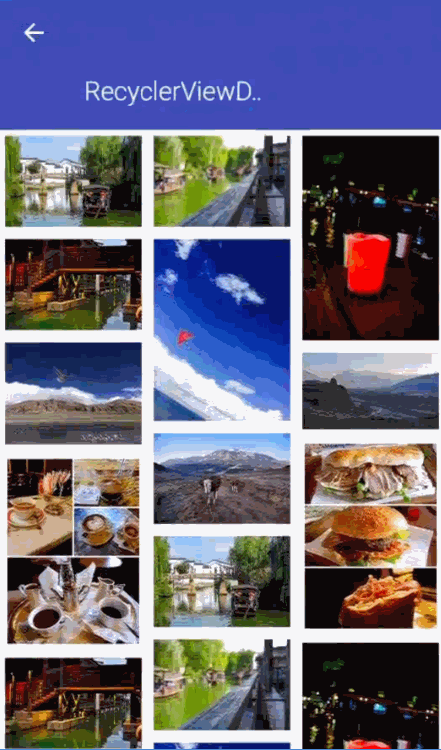

为了支持嵌套滑动，子View必须实现NestedScrollingChild接口，父View必须实现NestedScrollingParent接口，而RecyclerView实现了NestedScrollingChild接口，而CoordinatorLayout实现了NestedScrollingParent接口，上图是实现CoordinatorLayout嵌套RecyclerView的效果。

为了实现上图的效果，需要用到的组件有：

  * CoordinatorLayout: 布局根元素。
  * AppBarLayout: 包裹的内容作为应用的Bar。
  * CollapsingToolbarLayout: 实现可折叠的ToolBar。
  * ToolBar: 代替ActionBar。

实现中需要注意的点有：

  * 我们为ToolBar的`app:layout_collapseMode`设置为pin，表示折叠之后固定在顶端，而为ImageView的`app:layout_collapseMode`设置为parallax，表示视差模式，即渐变的效果。
  * 为了让RecyclerView支持嵌套滑动，还需要为它设置`app:layout_behavior="@string/appbar_scrolling_view_behavior"`。
  * 为CollapsingToolbarLayout设置`app:layout_scrollFlags="scroll|exitUntilCollapsed"`，其中scroll表示滚动出屏幕，exitUntilCollapsed表示退出后折叠。

具体实现参见Demo6。

###回顾

回顾整篇文章，发现我们已经实现了RecyclerView的很多扩展功能，包括：打造万能适配器、添加Item事件、添加头视图和尾视图、设置空布局、侧滑拖拽。[BaseRecyclerViewAdapterHelper](http://www.recyclerview.org/)是一个比较火的RecyclerView扩展库，仔细一看发现，这里面80%的功能在我们这篇文章中都实现了。

###扩展阅读

  * [Google I/O 2016: RecyclerView Ins and Outs](http://v.youku.com/v_show/id_XMTU4MTQ1ODg2NA==.html?f=27314446)
  * [RecyclerView优秀文章集](https://github.com/CymChad/CymChad.github.io)

####
原文出处：<a href='http://dev.qq.com/topic/5811d3e3ab10c62013697408' target='blank'>Android ListView与RecyclerView对比浅析--缓存机制
</a>

###**一，背景**

RecyclerView是谷歌官方出的一个用于大量数据展示的新控件，可以用来代替传统的ListView，更加强大和灵活。

最近，自己负责的业务，也遇到这样的一个问题，关于是否要将ListView替换为RecyclerView？

秉承着实事求是的作风，弄清楚RecyclerView是否有足够的吸引力替换掉ListView，我从性能这一角度出发，研究RecyclerView和ListView二者的缓存机制，并得到了一些较有益的”结论”，待我慢慢道来。

同时也希望能通过本文，让大家快速了解RecyclerView与ListView在缓存机制上的一些区别，在使用上也更加得心应手吧。

PS：相关知识：

ListView与RecyclerView缓存机制原理大致相似，如下图所示：

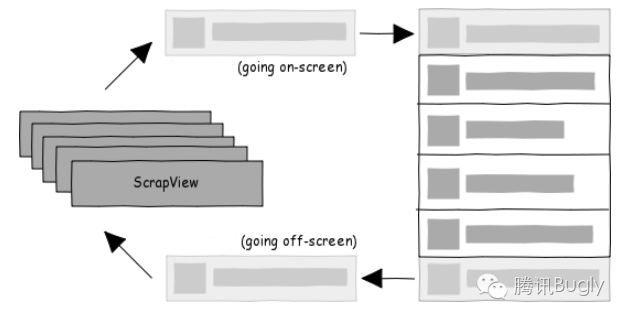

过程中，离屏的ItemView即被回收至缓存，入屏的ItemView则会优先从缓存中获取，只是ListView与RecyclerView的实现细节有差异.（这只是缓存使用的其中一个场景，还有如刷新等）

PPS：本文不贴出详细代码，结合源码食用更佳！

###**二. 正文**

**2.1 缓存机制对比**

**1. 层级不同：**

RecyclerView比ListView多两级缓存，支持多个离ItemView缓存，支持开发者自定义缓存处理逻辑，支持所有RecyclerView共用同一个RecyclerViewPool(缓存池)。

具体来说：

ListView(两级缓存)：

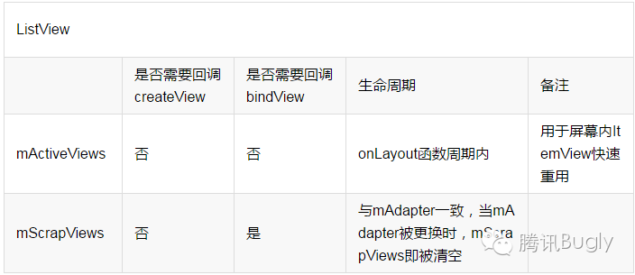

RecyclerView(四级缓存)：

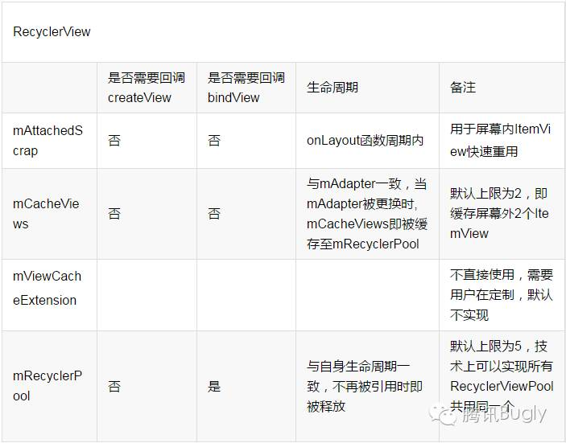

ListView和RecyclerView缓存机制基本一致：

1). mActiveViews和mAttachedScrap功能相似，意义在于快速重用屏幕上可见的列表项ItemView，而不需要重新createView和bindView；

2). mScrapView和mCachedViews + mReyclerViewPool功能相似，意义在于缓存离开屏幕的ItemView，目的是让即将进入屏幕的ItemView重用.

3). RecyclerView的优势在于a.mCacheViews的使用，可以做到屏幕外的列表项ItemView进入屏幕内时也无须bindView快速重用；b.mRecyclerPool可以供多个RecyclerView共同使用，在特定场景下，如viewpaper+多个列表页下有优势.客观来说，RecyclerView在特定场景下对ListView的缓存机制做了补强和完善。

**2. 缓存不同：**

1). RecyclerView缓存RecyclerView.ViewHolder，抽象可理解为：

View + ViewHolder(避免每次createView时调用findViewById) + flag(标识状态)；

2). ListView缓存View。

缓存不同，二者在缓存的使用上也略有差别，具体来说：

ListView获取缓存的流程：

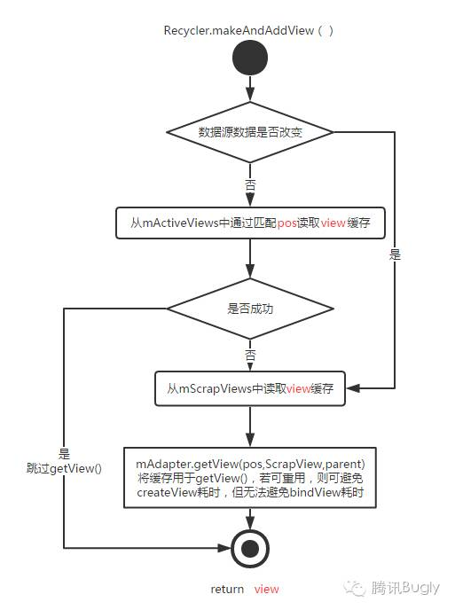

RecyclerView获取缓存的流程：

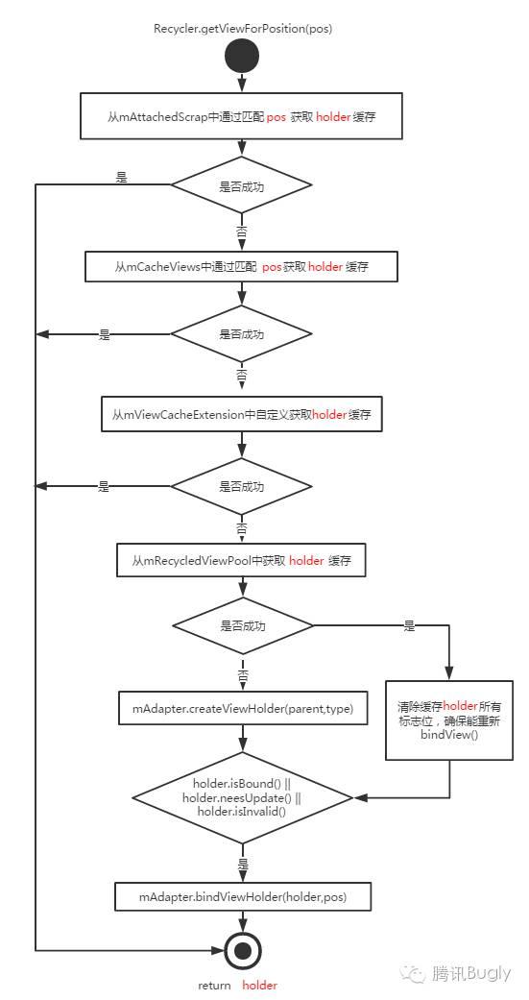

1). RecyclerView中mCacheViews(屏幕外)获取缓存时，是通过匹配pos获取目标位置的缓存，这样做的好处是，当数据源数据不变的情况下，无须重新bindView：

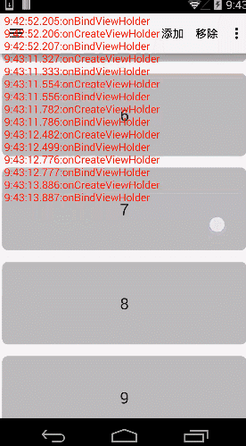

而同样是离屏缓存，ListView从mScrapViews根据pos获取相应的缓存，但是并没有直接使用，而是重新getView（即必定会重新bindView），相关代码如下：

    
    
    
    //AbsListView源码：line2345
    //通过匹配pos从mScrapView中获取缓存
    final View scrapView = mRecycler.getScrapView(position);
    //无论是否成功都直接调用getView,导致必定会调用createView
    final View child = mAdapter.getView(position, scrapView, this);
    if (scrapView != null) {    if (child != scrapView) {
            mRecycler.addScrapView(scrapView, position);
        } else {
            ...
        }
    }

2). ListView中通过pos获取的是view，即pos→view；

RecyclerView中通过pos获取的是viewholder，即pos → (view，viewHolder，flag)；

从流程图中可以看出，标志flag的作用是判断view是否需要重新bindView，这也是RecyclerView实现局部刷新的一个核心.

**2.2 局部刷新**

由上文可知，RecyclerView的缓存机制确实更加完善，但还不算质的变化，RecyclerView更大的亮点在于提供了局部刷新的接口，通过局部刷新，就能避免调用许多无用的bindView.

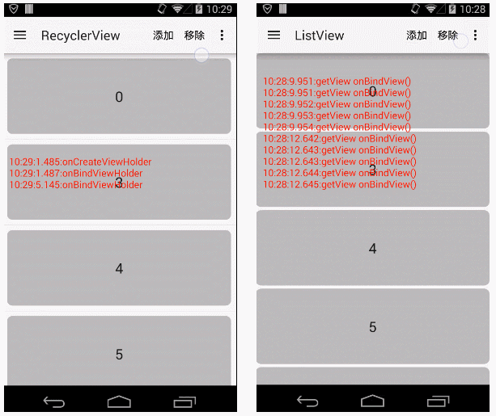

(RecyclerView和ListView添加，移除Item效果对比)

结合RecyclerView的缓存机制，看看局部刷新是如何实现的：

以RecyclerView中notifyItemRemoved(1)为例，最终会调用requestLayout()，使整个RecyclerView重新绘制，过程为：

onMeasure()→onLayout()→onDraw()

其中，onLayout()为重点，分为三步：

  1. dispathLayoutStep1()：记录RecyclerView刷新前列表项ItemView的各种信息，如Top,Left,Bottom,Right，用于动画的相关计算；

  2. dispathLayoutStep2()：真正测量布局大小，位置，核心函数为layoutChildren()；

  3. dispathLayoutStep3()：计算布局前后各个ItemView的状态，如Remove，Add，Move，Update等，如有必要执行相应的动画.

其中，layoutChildren()流程图：

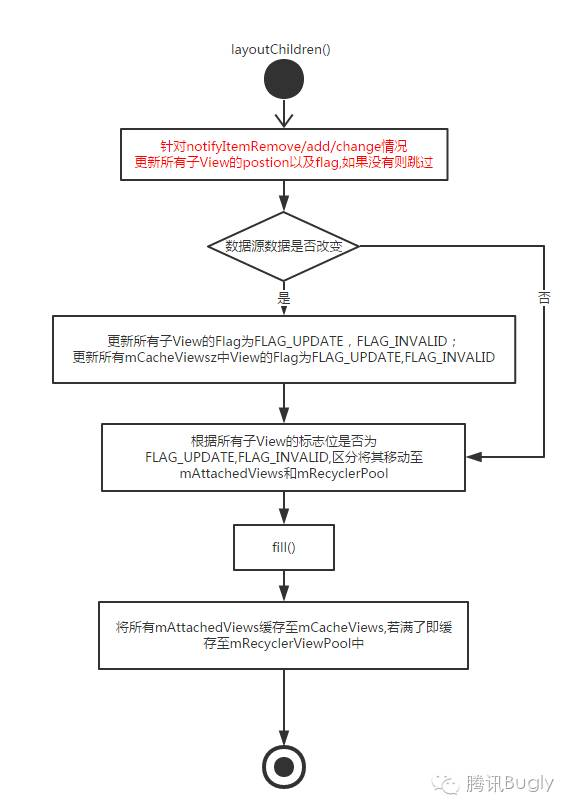

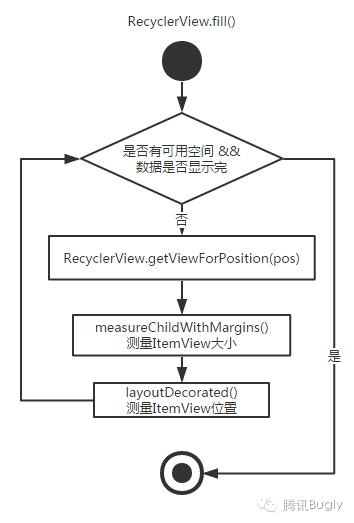

当调用notifyItemRemoved时，会对屏幕内ItemView做预处理，修改ItemView相应的pos以及flag(流程图中红色部分)：

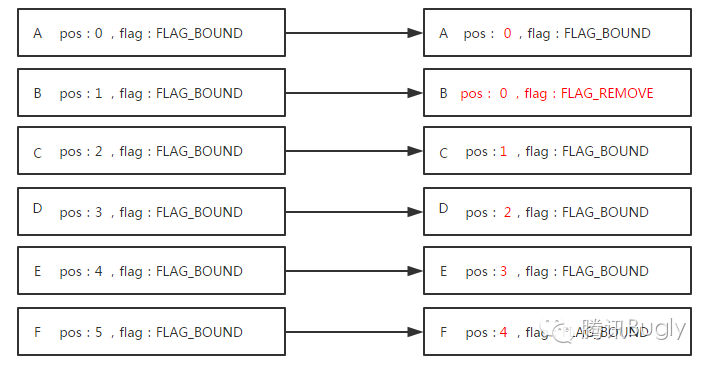

当调用fill()中RecyclerView.getViewForPosition(pos)时，RecyclerView通过对pos和flag的预处理，使得bindview只调用一次.

需要指出，ListView和RecyclerView最大的区别在于数据源改变时的缓存的处理逻辑，ListView是”一锅端”，将所有的mActiveViews都移入了二级缓存mScrapViews，而RecyclerView则是更加灵活地对每个View修改标志位，区分是否重新bindView。

###**三.结论**

  1. 在一些场景下，如界面初始化，滑动等，ListView和RecyclerView都能很好地工作，两者并没有很大的差异：

文章的开头便抛出了这样一个问题，微信Android客户端卡券模块，大部分UI都是以列表页的形式展示，实现方式为ListView，是否有必要将其替换成RecyclerView呢？

答案是否定的，从性能上看，RecyclerView并没有带来显著的提升，不需要频繁更新，暂不支持用动画，意味着RecyclerView优势也不太明显，没有太大的吸引力，ListView已经能很好地满足业务需求。

  1. 数据源频繁更新的场景，如弹幕： http://www.jianshu.com/p/2232a63442d6等RecyclerView的优势会非常明显；

进一步来讲，结论是：

**列表页展示界面，需要支持动画，或者频繁更新，局部刷新，建议使用RecyclerView，更加强大完善，易扩展；其它情况(如微信卡包列表页)两者都OK，但ListView在使用上会更加方便，快捷。**

Ps：仅从一个角度做了对比，盲人摸象， **有误跪求指正。**

###**四.参考资料**

**1. ListView**

a. Android-23源码

b. [Android ListView工作原理解析，带你从源码的角度彻底理解]
(http://blog.csdn.net/guolin_blog/article/details/44996879)

c. [Android自己动手写ListView学习其原理：]
(http://blog.csdn.net/androiddevelop/article/details/8734255)

**2. RecyclerView**

a. RecyclerView-v7-23.4.0源码

b. [RecyclerView剖析：](http://blog.csdn.net/qq_23012315/article/details/50807224)

c. [RecyclerView剖析：]
(http://blog.csdn.net/qq_23012315/article/details/51096696)

