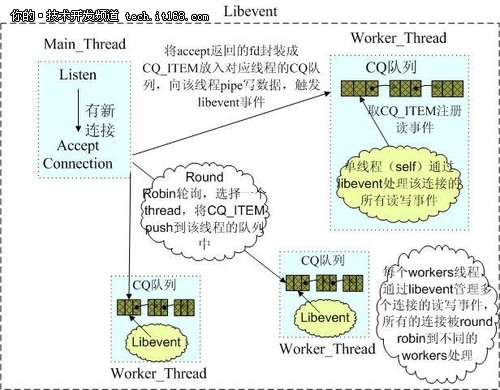

 
<!--BEGIN_DATA
{
    "create_date": "2017-08-05 18:43", 
    "modify_date": "2017-08-05 18:43", 
    "is_top": "0", 
    "summary": "Redis与Memcached的区别", 
    "tags": "数据库", 
    "file_name": "Redis与Memcached的区别.md"
}
END_DATA-->

####
原文出处：<a href='http://blog.csdn.net/tonysz126/article/details/8280696/' target='blank'>Redis与Memcached的区别</a>

    

传统MySQL+ Memcached架构遇到的问题

　　实际MySQL是适合进行海量数据存储的，通过Memcached将热点数据加载到cache，加速访问，很多公司都曾经使用过这样的架构，但随着业务数据量的不断增加，和访问量的持续增长，我们遇到了很多问题：

　　1.MySQL需要不断进行拆库拆表，Memcached也需不断跟着扩容，扩容和维护工作占据大量开发时间。

　　2.Memcached与MySQL数据库数据一致性问题。

　　3.Memcached数据命中率低或down机，大量访问直接穿透到DB，MySQL无法支撑。

　　4.跨机房cache同步问题。

　　众多NoSQL百花齐放，如何选择

　　最近几年，业界不断涌现出很多各种各样的NoSQL产品，那么如何才能正确地使用好这些产品，最大化地发挥其长处，是我们需要深入研究和思考的问题，实际归根结底最重要的是了解这些产品的定位，并且了解到每款产品的tradeoffs，在实际应用中做到扬长避短，总体上这些NoSQL主要用于解决以下几种问题

　　1.少量数据存储，高速读写访问。此类产品通过数据全部in-momery
的方式来保证高速访问，同时提供数据落地的功能，实际这正是Redis最主要的适用场景。

　　2.海量数据存储，分布式系统支持，数据一致性保证，方便的集群节点添加/删除。

　　3.这方面最具代表性的是dynamo和bigtable 2篇论文所阐述的思路。前者是一个完全无中心的设计，节点之间通过gossip方式传递集群信息，数据保证最终一致性，后者是一个中心化的方案设计，通过类似一个分布式锁服务来保证强一致性,数据写入先写[内存](http://product.it168.com/list/b/0205_1.shtml)和redo log，然后定期compat归并到磁盘上，将随机写优化为顺序写，提高写入性能。

　　4.Schema free，auto-sharding等。比如目前常见的一些文档数据库都是支持schema-free的，直接存储json格式数据，并且支持auto-sharding等功能，比如mongodb。

　　面对这些不同类型的NoSQL产品,我们需要根据我们的业务场景选择最合适的产品。

　　Redis适用场景，如何正确的使用

　　前面已经分析过，Redis最适合所有数据in-momory的场景，虽然Redis也提供持久化功能，但实际更多的是一个disk-backed的功能，跟传统意义上的持久化有比较大的差别，那么可能大家就会有疑问，似乎Redis更像一个加强版的Memcached，那么何时使用Memcached,何时使用Redis呢
?

如果简单地比较Redis与Memcached的区别，大多数都会得到以下观点：  
  
1  Redis不仅仅支持简单的k/v类型的数据，同时还提供list，set，zset，hash等数据结构的存储。  
  
2  Redis支持数据的备份，即master-slave模式的数据备份。  
  
3  Redis支持数据的持久化，可以将内存中的数据保持在磁盘中，重启的时候可以再次加载进行使用。  
  
抛开这些，可以深入到Redis内部构造去观察更加本质的区别，理解Redis的设计。  
  
在Redis中，并不是所有的数据都一直存储在内存中的。这是和Memcached相比一个最大的区别。Redis只会缓存所有的key的信息，如果Redis发现内存的使用量超过了某一个阀值，将触发swap的操作，Redis根据“swappability = age*log(size_in_memory)”计算出哪些key对应的value需要swap到磁盘。然后再将这些key对应的value持久化到磁盘中，同时在内存中清除。这种特性使得Redis可以保持超过其机器本身内存大小的数据。当然，机器本身的内存必须要能够保持所有的key，毕竟这些数据是不会进行swap操作的。同时由于Redis将内存中的数据swap到磁盘中的时候，提供服务的主线程和进行swap操作的子线程会共享这部分内存，所以如果更新需要swap的数据，Redis将阻塞这个操作，直到子线程完成swap操作后才可以进行修改。  
  
使用Redis特有内存模型前后的情况对比：  
VM off: 300k keys, 4096 bytes values: 1.3G used  
VM on:  300k keys, 4096 bytes values: 73M used  
VM off: 1 million keys, 256 bytes values: 430.12M used  
VM on:  1 million keys, 256 bytes values: 160.09M used  
VM on:  1 million keys, values as large as you want, still: 160.09M used  
  
当 从Redis中读取数据的时候，如果读取的key对应的value不在内存中，那么Redis就需要从swap文件中加载相应数据，然后再返回给请求方。
这里就存在一个I/O线程池的问题。在默认的情况下，Redis会出现阻塞，即完成所有的swap文件加载后才会相应。这种策略在客户端的数量较小，进行批量操作的时候比较合适。但是如果将Redis应用在一个大型的网站应用程序中，这显然是无法满足大并发的情况的。所以Redis运行我们设置I/O线程池的大小，对需要从swap文件中加载相应数据的读取请求进行并发操作，减少阻塞的时间。  
  
如果希望在海量数据的环境中使用好Redis，我相信理解Redis的内存设计和阻塞的情况是不可缺少的。

补充的知识点：

memcached和redis的比较

1 网络IO模型

　　Memcached是多线程，非阻塞IO复用的网络模型，分为监听主线程和worker子线程，监听线程监听网络连接，接受请求后，将连接描述字pipe
传递给worker线程，进行读写IO, 网络层使用libevent封装的事件库，多线程模型可以发挥多核作用，但是引入了cache coherency和锁的问题，比如，Memcached最常用的stats命令，实际Memcached所有操作都要对这个全局变量加锁，进行计数等工作，带来了性能损耗。

(Memcached网络IO模型)

　　Redis使用单线程的IO复用模型，自己封装了一个简单的AeEvent事件处理框架，主要实现了epoll、kqueue和select，对于单纯只有IO操
作来说，单线程可以将速度优势发挥到最大，但是Redis也提供了一些简单的计算功能，比如排序、聚合等，对于这些操作，单线程模型实际会严重影响整体吞吐量，[CPU](http://product.it168.com/list/b/0217_1.shtml)计算过程中，整个IO调度都是被阻塞住的。

　　2.[内存](http://product.pcpop.com/Memory/10734_1.html)管理方面

　　Memcached使用预分配的内存池的方式，使用slab和大小不同的chunk来管理内存，Item根据大小选择合适的chunk存储，内存池的方式可以省去申请/释放内存的开销，并且能减小内存碎片产生，但这种方式也会带来一定程度上的空间浪费，并且在内存仍然有很大空间时，新的数据也可能会被剔除，原因可以参考Timyang的文章：http://timyang.net/data/Memcached-lru-evictions/

　　Redis使用现场申请内存的方式来存储数据，并且很少使用free-list等方式来优化内存分配，会在一定程度上存在内存碎片，Redis跟据存储命令参数，会把带过期时间的数据单独存放在一起，并把它们称为临时数据，非临时数据是永远不会被剔除的，即便物理内存不够，导致swap也不会剔除任何非临时数据(但会尝试剔除部分临时数据)，这点上Redis更适合作为存储而不是cache。

　　3.数据一致性问题

　　Memcached提供了cas命令，可以保证多个并发访问操作同一份数据的一致性问题。 Redis没有提供cas命令，并不能保证这点，不过Redis提供了事务的功能，可以保证一串 命令的原子性，中间不会被任何操作打断。

　　4.存储方式及其它方面

　　Memcached基本只支持简单的key-value存储，不支持枚举，不支持持久化和复制等功能

　　Redis除key/value之外，还支持list,set,sorted set,hash等众多数据结构，提供了KEYS

　　进行枚举操作，但不能在线上使用，如果需要枚举线上数据，Redis提供了工具可以直接扫描其dump文件，枚举出所有数据，Redis还同时提供了持久化和复制等功能。

　　5.关于不同语言的客户端支持

　　在不同语言的客户端方面，Memcached和Redis都有丰富的第三方客户端可供选择，不过因为Memcached发展的时间更久一些，目前看在客户端支持方面，Memcached的很多客户端更加成熟稳定，而Redis由于其协议本身就比Memcached复杂，加上作者不断增加新的功能等，对应第三方客户端跟进速度可能会赶不上，有时可能需要自己在第三方客户端基础上做些修改才能更好的使用。

　　根据以上比较不难看出，当我们不希望数据被踢出，或者需要除key/value之外的更多数据类型时，或者需要落地功能时，使用Redis比使用Memcached更合适。

　　关于Redis的一些周边功能

　　Redis除了作为存储之外还提供了一些其它方面的功能，比如聚合计算、pubsub、scripting等，对于此类功能需要了解其实现原理，清楚地了解到它的局限性后，才能正确的使用，比如pubsub功能，这个实际是没有任何持久化支持的，消费方连接闪断或重连之间过来的消息是会全部丢失的，又比如聚合计算和scripting等功能受Redis单线程模型所限，是不可能达到很高的吞吐量的，需要谨慎使用。

　　总的来说Redis作者是一位非常勤奋的开发者，可以经常看到作者在尝试着各种不同的新鲜想法和思路，针对这些方面的功能就要求我们需要深入了解后再使用。

总结：

　　1.Redis使用最佳方式是全部数据in-memory。

　　2.Redis更多场景是作为Memcached的替代者来使用。

　　3.当需要除key/value之外的更多数据类型支持时，使用Redis更合适。

　　4.当存储的数据不能被剔除时，使用Redis更合适。
                                                                                                                 **谈谈Memcached与Redis(一)**  

**1. Memcached简介**

Memcached是以LiveJurnal旗下Danga Interactive公司的Bard Fitzpatric为首开发的高性能分布式内存缓存服务器。其本质上就是一个内存key-value数据库，但是不支持数据的持久化，服务器关闭之后数据全部丢失。Memcached使用C语言开发，在大多数像Linux、BSD和Solaris等POSIX系统上，只要安装了libevent即可使用。在Windows下，它也有一个可用的非官方版本(http://code.jellycan.com/memcached/)。Memcached的客户端软件实现非常多，包括C/C++, PHP, Java, Python, Ruby,Perl, Erlang, Lua等。当前Memcached使用广泛，除了LiveJournal以外还有Wikipedia、Flickr、Twitter、Youtube和WordPress等。

在Window系统下，Memcached的安装非常方便，只需从以上给出的地址下载可执行软件然后运行memcached.exe –dinstall即可完成安装。在Linux等系统下，我们首先需要安装libevent，然后从获取源码，make && make install即可。默认情况下，Memcached的服务器启动程序会安装到/usr/local/bin目录下。在启动Memcached时，我们可以为其配置不同的启动参数。

1.1 Memcache配置

Memcached服务器在启动时需要对关键的参数进行配置，下面我们就看一看Memcached在启动时需要设定哪些关键参数以及这些参数的作用。

1）-p <num> Memcached的TCP监听端口，缺省配置为11211；

2）-U <num> Memcached的UDP监听端口，缺省配置为11211，为0时表示关闭UDP监听；

3）-s <file> Memcached监听的UNIX套接字路径；

4）-a <mask> 访问UNIX套接字的八进制掩码，缺省配置为0700；

5）-l <addr> 监听的服务器IP地址，默认为所有网卡；

6）-d 为Memcached服务器启动守护进程；

7）-r 最大core文件大小；

8）-u <username> 运行Memcached的用户，如果当前为root的话需要使用此参数指定用户；

9）-m <num> 分配给Memcached使用的内存数量，单位是MB；

10）-M 指示Memcached在内存用光的时候返回错误而不是使用LRU算法移除数据记录；

11）-c <num> 最大并发连数，缺省配置为1024；

12）-v –vv –vvv 设定服务器端打印的消息的详细程度，其中-v仅打印错误和警告信息，-vv在-v的基础上还会打印客户端的命令和相应，-vvv在-vv的基础上还会打印内存状态转换信息；

13）-f <factor> 用于设置chunk大小的递增因子；

14）-n <bytes> 最小的chunk大小，缺省配置为48个字节；

15）-t <num> Memcached服务器使用的线程数，缺省配置为4个；

16）-L 尝试使用大内存页；

17）-R 每个事件的最大请求数，缺省配置为20个；

18）-C 禁用CAS，CAS模式会带来8个字节的冗余；

2\. Redis简介

Redis是一个开源的key-value存储系统。与Memcached类似，Redis将大部分数据存储在内存中，支持的数据类型包括：字符串、哈希表、链表、集合、有序集合以及基于这些数据类型的相关操作。Redis使用C语言开发，在大多数像Linux、BSD和Solaris等POSIX系统上无需任何外部依赖就可以使用。Redis支持的客户端语言也非常丰富，常用的计算机语言如C、C#、C++、Object-C、PHP、Python、Java、Perl、Lua、Erlan
g等均有可用的客户端来访问Redis服务器。当前Redis的应用已经非常广泛，国内像新浪、淘宝，国外像Flickr、Github等均在使用Redis的缓存服务。

Redis的安装非常方便，只需从http://redis.io/download获取源码，然后make && make install即可。默认情况下，Redis的服务器启动程序和客户端程序会安装到/usr/local/bin目录下。在启动Redis服务器时，我们需要为其指定一个配置文件，缺省情况下配置文件在Redis的源码目录下，文件名为redis.conf。

2.1 Redis配置文件

为了对Redis的系统实现有一个直接的认识，我们首先来看一下Redis的配置文件中定义了哪些主要参数以及这些参数的作用。

1）daemonize no 默认情况下，redis不是在后台运行的。如果需要在后台运行，把该项的值更改为yes；

2）pidfile /var/run/redis.pid当Redis在后台运行的时候，Redis默认会把pid文件放在/var/run/redis.pid，你可以配置到其他地址。当运行多个redis服务时，需要指定不同的pid文件和端口；

3）port 6379指定redis运行的端口，默认是6379；

4）bind 127.0.0.1 指定redis只接收来自于该IP地址的请求，如果不进行设置，那么将处理所有请求。在生产环境中最好设置该项；

5）loglevel debug 指定日志记录级别，其中Redis总共支持四个级别：debug、verbose、notice、warning，默认为verbose。debug表示记录很多信息，用于开发和测试。verbose表示记录有用的信息，但不像debug会记录那么多。notice表示普通的verbose，常用于生产环境。warning 表示只有非常重要或者严重的信息会记录到日志；

6）logfile /var/log/redis/redis.log 配置log文件地址，默认值为stdout。若后台模式会输出到/dev/null；

7）databases 16 可用数据库数，默认值为16，默认数据库为0，数据库范围在0-（database-1）之间；

8）save 900 1保存数据到磁盘，格式为save <seconds> <changes>，指出在多长时间内，有多少次更新操作，就将数据同步到数据文件rdb。相当于条件触发抓取快照，这个可以多个条件配合。save 900
1就表示900秒内至少有1个key被改变就保存数据到磁盘；

9）rdbcompression yes 存储至本地数据库时（持久化到rdb文件）是否压缩数据，默认为yes；

10）dbfilename dump.rdb本地持久化数据库文件名，默认值为dump.rdb；

11）dir ./ 工作目录，数据库镜像备份的文件放置的路径。这里的路径跟文件名要分开配置是因为redis在进行备份时，先会将当前数据库的状态写入到一个临时文件中，等备份完成时，再把该临时文件替换为上面所指定的文件。而这里的临时文件和上面所配置的备份文件都会放在这个指定的路径当中，AOF文件也会存放在这个目录下面。注意这里必须指定一个目录而不是文件；

12）slaveof <masterip> <masterport> 主从复制，设置该数据库为其他数据库的从数据库。设置当本机为slave服务时，设置master服务的IP地址及端口。在Redis启动时，它会自动从master进行数据同步；

13）masterauth <master-password>当master服务设置了密码保护时(用requirepass制定的密码)slave服务连接master的密码；

14）slave-serve-stale-data yes 当从库同主机失去连接或者复制正在进行，从机库有两种运行方式：如果slave-serve-stale-data设置为yes(默认设置)，从库会继续相应客户端的请求。如果slave-serve-stale-data是指为no，除去INFO和SLAVOF命令之外的任何请求都会返回一个错误"SYNC with master in progress"；

15）repl-ping-slave-period 10从库会按照一个时间间隔向主库发送PING，可以通过repl-ping-slave-period设置这个时间间隔，默认是10秒；

16）repl-timeout 60 设置主库批量数据传输时间或者ping回复时间间隔，默认值是60秒，一定要确保repl-timeout大于repl-ping-slave-period；

17）requirepass foobared 设置客户端连接后进行任何其他指定前需要使用的密码。因为redis速度相当快，所以在一台比较好的服务器下，一个外部的用户可以在一秒钟进行150K次的密码尝试，这意味着你需要指定非常强大的密码来防止暴力破解；

18）rename-command CONFIG ""命令重命名，在一个共享环境下可以重命名相对危险的命令，比如把CONFIG重名为一个不容易猜测的字符：##rename-command CONFIG b840fc02d524045429941cc15f59e41cb7be6c52。如果想删除一个命令，直接把它重命名为一个空字符""即可：rename-command CONFIG ""；

19）maxclients
128设置同一时间最大客户端连接数，默认无限制。Redis可以同时打开的客户端连接数为Redis进程可以打开的最大文件描述符数。如果设置
maxclients 0，表示不作限制。当客户端连接数到达限制时，Redis会关闭新的连接并向客户端返回max number of clients
reached错误信息；

20）maxmemory <bytes> 指定Redis最大内存限制。Redis在启动时会把数据加载到内存中，达到最大内存后，Redis会先尝试清除已到期或
即将到期的Key，Redis同时也会移除空的list对象。当此方法处理后，仍然到达最大内存设置，将无法再进行写入操作，但仍然可以进行读取操作。注意：Redis新的vm机制，会把Key存放内存，Value会存放在swap区；

21）maxmemory-policy volatile-lru 当内存达到最大值的时候Redis会选择删除哪些数据呢？有五种方式可供选择：volatile-lru代表利用LRU算法移除设置过过期时间的key (LRU:最近使用 Least Recently Used )，allkeys-lru代表利用LRU算法移除任何key，volatile-random代表移除设置过过期时间的随机key，allkeys_random代表移除一个随机的key，volatile-ttl代表移除即将过期的key(minor TTL)，noeviction代表不移除任何key，只是返回一个写错误。

注意：对于上面的策略，如果没有合适的key可以移除，写的时候Redis会返回一个错误；

22）appendonly no 默认情况下，redis会在后台异步的把数据库镜像备份到磁盘，但是该备份是非常耗时的，而且备份也不能很频繁。如果发生诸如拉闸限电、拔插头等状况，那么将造成比较大范围的数据丢失，所以redis提供了另外一种更加高效的数据库备份及灾难恢复方式。开启append only模式之后，redis会把所接收到的每一次写操作请求都追加到appendonly.aof文件中。当redis重新启动时，会从该文件恢复出之前的状态，但是这样会造成appendonly.aof文件过大，所以redis还支持了BGREWRITEAOF指令对appendonly.aof进行重新整理，你可以同时开启asynchronous dumps 和 AOF；

23）appendfilename appendonly.aof  AOF文件名称,默认为"appendonly.aof";

24）appendfsync everysec  Redis支持三种同步AOF文件的策略: no代表不进行同步，系统去操作，always代表每次有写操作都进
行同步，everysec代表对写操作进行累积，每秒同步一次，默认是"everysec"，按照速度和安全折中这是最好的。

25）slowlog-log-slower-than 10000记录超过特定执行时间的命令。执行时间不包括I/O计算，比如连接客户端，返回结果等，只是命令执行时间。可以通过两个参数设置slow log：一个是告诉Redis执行超过多少时间被记录的参数slowlog-log-slower-than(微妙)，另一个是slow log 的长度。当一个新命令被记录的时候最早的命令将被从队列中移除，下面的时间以微妙微单位，因此1000000代表一分钟。注意制定一个负数将关闭慢日志，而设置为0将强制每个命令都会记录；

26）hash-max-zipmap-entries 512 && hash-max-zipmap-value 64当hash中包含超过指定元素个数并且最大的元素没有超过临界时，hash将以一种特殊的编码方式（大大减少内存使用）来存储，这里可以设置这两个临界值。RedisHash对应Value内部实际就是一个HashMap，实际这里会有2种不同实现。这个Hash的成员比较少时Redis为了节省内存会采用类似一维数组的方式来紧凑存储，而不会采用真正的HashMap结构，对应的value redisObject的encoding为zipmap。当成员数量增大时会自动转成真正的HashMap，此时encoding为ht；

27）list-max-ziplist-entries 512 list数据类型多少节点以下会采用去指针的紧凑存储格式；

28）list-max-ziplist-value 64数据类型节点值大小小于多少字节会采用紧凑存储格式；

29）set-max-intset-entries 512 set数据类型内部数据如果全部是数值型，且包含多少节点以下会采用紧凑格式存储；

30）zset-max-ziplist-entries 128 zsort数据类型多少节点以下会采用去指针的紧凑存储格式；

31）zset-max-ziplist-value 64 zsort数据类型节点值大小小于多少字节会采用紧凑存储格式。

32）activerehashing yes Redis将在每100毫秒时使用1毫秒的CPU时间来对redis的hash表进行重新hash，可以降低内存的使用。当你的使用场景中，有非常严格的实时性需要，不能够接受Redis时不时的对请求有2毫秒的延迟的话，把这项配置为no。如果没有这么严格的实时性要求，可以设置为yes，以便能够尽可能快的释放内存；

2.2 Redis的常用数据类型

与Memcached仅支持简单的key-value结构的数据记录不同，Redis支持的数据类型要丰富得多。最为常用的数据类型主要由五种：String、Hash、List、Set和SortedSet。在具体描述这几种数据类型之前，我们先通过一张图来了解下Redis内部内存管理中是如何描述这些不同数据类型的。

图1 Redis对象

Redis内部使用一个redisObject对象来表示所有的key和value。redisObject最主要的信息如图1所示：type代表一个value对象具体是何种数据类型，encoding是不同数据类型在redis内部的存储方式，比如：type=string代表value存储的是一个普通字符串，那么对应的e
ncoding可以是raw或者是int，如果是int则代表实际redis内部是按数值型类存储和表示这个字符串的，当然前提是这个字符串本身可以用数值表示，比如:"123" "456"这样的字符串。这里需要特殊说明一下vm字段，只有打开了Redis的虚拟内存功能，此字段才会真正的分配内存，该功能默认是关闭状态的。通过Figure1我们可以发现Redis使用redisObject来表示所有的key/value数据是比较浪费内存的，当然这些内存管理成本的付出主要也是为了给Redis不同数据类型提供一个统一的管理接口，实际作者也提供了多种方法帮助我们尽量节省内存使用。下面我们先来逐一的分析下这五种数据类型的使用和内部实现方式。

1）String

常用命令：set/get/decr/incr/mget等；

应用场景：String是最常用的一种数据类型，普通的key/value存储都可以归为此类；

实现方式：String在redis内部存储默认就是一个字符串，被redisObject所引用，当遇到incr、decr等操作时会转成数值型进行计算，此时redisObject的encoding字段为int。

2）Hash

常用命令：hget/hset/hgetall等

应用场景：我们要存储一个用户信息对象数据，其中包括用户ID、用户姓名、年龄和生日，通过用户ID我们希望获取该用户的姓名或者年龄或者生日；

实现方式：Redis的Hash实际是内部存储的Value为一个HashMap，并提供了直接存取这个Map成员的接口。如图2所示，Key是用户ID, value是一个Map。这个Map的key是成员的属性名，value是属性值。这样对数据的修改和存取都可以直接通过其内部Map的Key(Redis里称内部Map的key为field), 也就是通过 key(用户ID) + field(属性标签) 就可以操作对应属性数据。当前HashMap的实现有两种方式：当HashMap的成员比较少时Redis为了节省内存会采用类似一维数组的方式来紧凑存储，而不会采用真正的HashMap结构，这时对应的value的redisObject的encoding为zipmap，当成员数量增大时会自动转成真正的HashMap,此时encoding为ht。

图2 Redis的Hash数据类型

3）List

常用命令：lpush/rpush/lpop/rpop/lrange等；

应用场景：Redis

list的应用场景非常多，也是Redis最重要的数据结构之一，比如twitter的关注列表，粉丝列表等都可以用Redis的list结构来实现；

实现方式：Redis list的实现为一个双向链表，即可以支持反向查找和遍历，更方便操作，不过带来了部分额外的内存开销，Redis内部的很多实现，包括发送缓冲队列等也都是用的这个数据结构。

4）Set

常用命令：sadd/spop/smembers/sunion等；

应用场景：Redis set对外提供的功能与list类似是一个列表的功能，特殊之处在于set是可以自动排重的，当你需要存储一个列表数据，又不希望出现重复数据时，set是一个很好的选择，并且set提供了判断某个成员是否在一个set集合内的重要接口，这个也是list所不能提供的；

实现方式：set 的内部实现是一个value永远为null的HashMap，实际就是通过计算hash的方式来快速排重的，这也是set能提供判断一个成员是否在集合内的原因。

5）Sorted Set

常用命令：zadd/zrange/zrem/zcard等；

应用场景：Redis sorted set的使用场景与set类似，区别是set不是自动有序的，而sorted set可以通过用户额外提供一个优先级(score)的参数来为成员排序，并且是插入有序的，即自动排序。当你需要一个有序的并且不重复的集合列表，那么可以选择sorted set数据结构，比如twitter
的public timeline可以以发表时间作为score来存储，这样获取时就是自动按时间排好序的。

实现方式：Redis sorted set的内部使用HashMap和跳跃表(SkipList)来保证数据的存储和有序，HashMap里放的是成员到score
的映射，而跳跃表里存放的是所有的成员，排序依据是HashMap里存的score,使用跳跃表的结构可以获得比较高的查找效率，并且在实现上比较简单。

2.3 Redis的持久化

Redis虽然是基于内存的存储系统，但是它本身是支持内存数据的持久化的，而且提供两种主要的持久化策略：RDB快照和AOF日志。我们会在下文分别介绍这两种不同的持久化策略。

2.3.1 Redis的AOF日志

Redis支持将当前数据的快照存成一个数据文件的持久化机制，即RDB快照。这种方法是非常好理解的，但是一个持续写入的数据库如何生成快照呢？Redis借助了fork命令的copy on write机制。在生成快照时，将当前进程fork出一个子进程，然后在子进程中循环所有的数据，将数据写成为RDB文件。

我们可以通过Redis的save指令来配置RDB快照生成的时机，比如你可以配置当10分钟以内有100次写入就生成快照，也可以配置当1小时内有1000次写入就生成快照，也可以多个规则一起实施。这些规则的定义就在Redis的配置文件中，你也可以通过Redis的CONFIGSET命令在Redis运行时设置规则，不需要重启Redis。

Redis的RDB文件不会坏掉，因为其写操作是在一个新进程中进行的，当生成一个新的RDB文件时，Redis生成的子进程会先将数据写到一个临时文件中，然后通过原子性rename系统调用将临时文件重命名为RDB文件，这样在任何时候出现故障，Redis的RDB文件都总是可用的。同时，Redis的RDB文件也是Redis主从同步内部实现中的一环。

但是，我们可以很明显的看到，RDB有他的不足，就是一旦数据库出现问题，那么我们的RDB文件中保存的数据并不是全新的，从上次RDB文件生成到Redis停机这段时间的数据全部丢掉了。在某些业务下，这是可以忍受的，我们也推荐这些业务使用RDB的方式进行持久化，因为开启RDB的代价并不高。但是对于另外一些对数据安全性要求极高的应用，无法容忍数据丢失的应用，RDB就无能为力了，所以Redis引入了另一个重要的持久化机制：AOF日志。

2.3.2 Redis的AOF日志

AOF日志的全称是append only file，从名字上我们就能看出来，它是一个追加写入的日志文件。与一般数据库的binlog不同的是，AOF文件是可识
别的纯文本，它的内容就是一个个的Redis标准命令。当然，并不是发送发Redis的所有命令都要记录到AOF日志里面，只有那些会导致数据发生修改的命令才会追加到AOF文件。那么每一条修改数据的命令都生成一条日志，那么AOF文件是不是会很大？答案是肯定的，AOF文件会越来越大，所以Redis又提供了一个功能，叫做AOF rewrite。其功能就是重新生成一份AOF文件，新的AOF文件中一条记录的操作只会有一次，而不像一份老文件那样，可能记录了对同一个值的多次操作。其生成过程和RDB类似，也是fork一个进程，直接遍历数据，写入新的AOF临时文件。在写入新文件的过程中，所有的写操作日志还是会写到原来老的AOF文件中，同时还会记录在内存缓冲区中。当重完操作完成后，会将所有缓冲区中的日志一次性写入到临时文件中。然后调用原子性的rename命令用新的AOF文件取代老的AOF文件。

AOF是一个写文件操作，其目的是将操作日志写到磁盘上，所以它也同样会遇到我们上面说的写操作的5个流程。那么写AOF的操作安全性又有多高呢。实际上这是可以设置的，在Redis中对AOF调用write(2)写入后，何时再调用fsync将其写到磁盘上，通过appendfsync选项来控制，下面appendfsync的三个设置项，安全强度逐渐变强。

1）appendfsync no

当设置appendfsync为no的时候，Redis不会主动调用fsync去将AOF日志内容同步到磁盘，所以这一切就完全依赖于操作系统的调试了。对大多数Linux操作系统，是每30秒进行一次fsync，将缓冲区中的数据写到磁盘上。

2）appendfsync everysec

当设置appendfsync为everysec的时候，Redis会默认每隔一秒进行一次fsync调用，将缓冲区中的数据写到磁盘。但是当这一次的fsync调用时长超过1秒时。Redis会采取延迟fsync的策略，再等一秒钟。也就是在两秒后再进行fsync，这一次的fsync就不管会执行多长时间都会进行。这时候由于在fsync时文件描述符会被阻塞，所以当前的写操作就会阻塞。所以结论就是，在绝大多数情况下，Redis会每隔一秒进行一次fsync。在最坏的情况下，两秒钟会进行一次fsync操作。这一操作在大多数数据库系统中被称为group commit，就是组合多次写操作的数据，一次性将日志写到磁盘。

3）appednfsync always

当设置appendfsync为always时，每一次写操作都会调用一次fsync，这时数据是最安全的，当然，由于每次都会执行fsync，所以其性能也会受到影响。

3\. Memcached和Redis关键技术对比

作为内存数据缓冲系统，Memcached和Redis均具有很高的性能，但是两者在关键实现技术上具有很大差异，这种差异决定了两者具有不同的特点和不同的适用条件。下面我们会对两者的关键技术进行一些对比，以此来揭示两者的差异。

3.1 Memcached和Redis的内存管理机制对比

对于像Redis和Memcached这种基于内存的数据库系统来说，内存管理的效率高低是影响系统性能的关键因素。传统C语言中的malloc/free函数是最常用的分配和释放内存的方法，但是这种方法存在着很大的缺陷：首先，对于开发人员来说不匹配的malloc和free容易造成内存泄露；其次，频繁调用会造成大量内存碎片无法回收重新利用，降低内存利用率；最后，作为系统调用，其系统开销远远大于一般函数调用。所以，为了提高内存的管理效率，高效的内存管理方案都不会直接使用malloc/free调用。Redis和Memcached均使用了自身设计的内存管理机制，但是实现方法存在很大的差异，下面将会对两者的内存管理机制分别进行介绍。

3.1.1 Memcached的内存管理机制

Memcached默认使用Slab Allocation机制管理内存，其主要思想是按照预先规定的大小，将分配的内存分割成特定长度的块以存储相应长度的key-
value数据记录，以完全解决内存碎片问题。Slab Allocation机制只为存储外部数据而设计，也就是说所有的key-value数据都存储在Slab 
Allocation系统里，而Memcached的其它内存请求则通过普通的malloc/free来申请，因为这些请求的数量和频率决定了它们不会对整个系统的性
能造成影响

Slab Allocation的原理相当简单。

如图3所示，它首先从操作系统申请一大块内存，并将其分割成各种尺寸的块Chunk，并把尺寸相同的块分成组Slab Class。其中，Chunk就是用来存储key-value数据的最小单位。每个Slab Class的大小，可以在Memcached启动的时候通过制定Growth Factor来控制。假定Figure 1中Growth Factor的取值为1.25，所以如果第一组Chunk的大小为88个字节，第二组Chunk的大小就为112个字节，依此类推。

图3 Memcached内存管理架构

当Memcached接收到客户端发送过来的数据时首先会根据收到数据的大小选择一个最合适的Slab Class，然后通过查询Memcached保存着的该Slab Class内空闲Chunk的列表就可以找到一个可用于存储数据的Chunk。当一条数据库过期或者丢弃时，该记录所占用的Chunk就可以回收，重新添加到空闲列表中。从以上过程我们可以看出Memcached的内存管理制效率高，而且不会造成内存碎片，但是它最大的缺点就是会导致空间浪费。因为每个Chunk都分配了特定长度的内存空间，所以变长数据无法充分利用这些空间。如图4所示，将100个字节的数据缓存到128个字节的Chunk中，剩余的28个字节就浪费掉了。

  
图4 Memcached的存储空间浪费

3.1.2 Redis的内存管理机制

Redis的内存管理主要通过源码中zmalloc.h和zmalloc.c两个文件来实现的。Redis为了方便内存的管理，在分配一块内存之后，会将这块内存的大小存入内存块的头部。如图 5所示，real_ptr是redis调用malloc后返回的指针。redis将内存块的大小size存入头部，size所占据的内存大
小是已知的，为size_t类型的长度，然后返回ret_ptr。当需要释放内存的时候，ret_ptr被传给内存管理程序。通过ret_ptr，程序可以很容易的算出real_ptr的值，然后将real_ptr传给free释放内存。

图5 Redis块分配

Redis通过定义一个数组来记录所有的内存分配情况，这个数组的长度为ZMALLOC_MAX_ALLOC_STAT。数组的每一个元素代表当前程序所分配的内存块的个数，且内存块的大小为该元素的下标。在源码中，这个数组为zmalloc_allocations。zmalloc_allocations[16]代表已经分配
的长度为16bytes的内存块的个数。zmalloc.c中有一个静态变量used_memory用来记录当前分配的内存总大小。所以，总的来看，Redis采用的是包装的mallc/free，相较于Memcached的内存管理方法来说，要简单很多。

3.2 Redis和Memcached的集群实现机制对比

Memcached是全内存的数据缓冲系统，Redis虽然支持数据的持久化，但是全内存毕竟才是其高性能的本质。作为基于内存的存储系统来说，机器物理内存的大小就是系统能够容纳的最大数据量。如果需要处理的数据量超过了单台机器的物理内存大小，就需要构建分布式集群来扩展存储能力。

3.2.1 Memcached的分布式存储

Memcached本身并不支持分布式，因此只能在客户端通过像一致性哈希这样的分布式算法来实现Memcached的分布式存储。图6 给出了Memcached的
分布式存储实现架构。当客户端向Memcached集群发送数据之前，首先会通过内置的分布式算法计算出该条数据的目标节点，然后数据会直接发送到该节点上存储。但客户端查询数据时，同样要计算出查询数据所在的节点，然后直接向该节点发送查询请求以获取数据。

图6 Memcached客户端分布式存储实现

3.2.2 Redis的分布式存储

相较于Memcached只能采用客户端实现分布式存储，Redis更偏向于在服务器端构建分布式存储。尽管Redis当前已经发布的稳定版本还没有添加分布式存储功能，但Redis开发版中已经具备了Redis Cluster的基本功能。预计在2.6版本之后，Redis就会发布完全支持分布式的稳定版本，时间不晚于2012年底。下面我们会根据开发版中的实现，简单介绍一下Redis Cluster的核心思想。

Redis Cluster是一个实现了分布式且允许单点故障的Redis高级版本，它没有中心节点，具有线性可伸缩的功能。图7给出Redis Cluster的分布式存储架构，其中节点与节点之间通过二进制协议进行通信，节点与客户端之间通过ascii协议进行通信。在数据的放置策略上，Redis
Cluster将整个key的数值域分成4096个哈希槽，每个节点上可以存储一个或多个哈希槽，也就是说当前Redis Cluster支持的最大节点数就是4096。Redis Cluster使用的分布式算法也很简单：crc16( key ) %
HASH_SLOTS_NUMBER。

图7 Redis分布式架构

为了保证单点故障下的数据可用性，Redis Cluster引入了Master节点和Slave节点。如图4所示，在Redis Cluster中，每个Master节点都会有对应的两个用于冗余的Slave节点。这样在整个集群中，任意两个节点的宕机都不会导致数据的不可用。当Master节点退出后，集群会自动选择一个Slave节点成为新的Master节点。

图8 Redis Cluster中的Master节点和Slave节点

3.3 Redis和Memcached整体对比

Redis的作者Salvatore Sanfilippo曾经对这两种基于内存的数据存储系统进行过比较，总体来看还是比较客观的，现总结如下：

1）性能对比：由于Redis只使用单核，而Memcached可以使用多核，所以平均每一个核上Redis在存储小数据时比Memcached性能更高。而在100
k以上的数据中，Memcached性能要高于Redis，虽然Redis最近也在存储大数据的性能上进行优化，但是比起Memcached，还是稍有逊色。

2）内存使用效率对比：使用简单的key-value存储的话，Memcached的内存利用率更高，而如果Redis采用hash结构来做key-value存储，由于其组合式的压缩，其内存利用率会高于Memcached。

3）Redis支持服务器端的数据操作：Redis相比Memcached来说，拥有更多的数据结构和并支持更丰富的数据操作，通常在Memcached里，你需要将
数据拿到客户端来进行类似的修改再set回去。这大大增加了网络IO的次数和数据体积。在Redis中，这些复杂的操作通常和一般的GET/SET一样高效。所以，如果需要缓存能够支持更复杂的结构和操作，那么Redis会是不错的选择。

