 
<!--BEGIN_DATA
{
    "create_date": "2022-06-15 21:20", 
    "modify_date": "2022-06-15 21:20", 
    "is_top": "0", 
    "summary": "Redis多线程架构的演进", 
    "tags": "数据库", 
    "file_name": "Redis多线程架构的演进.md"
}
END_DATA-->

#### <p>原文出处：<a href='https://juejin.cn/post/6949929673615179789' target='blank'>Redis多线程架构的演进</a></p>

Redis真的是单线程吗？网上有很多关于这个问题的讨论，得出的结论也几乎是一致的。本文在讨论这个问题之前，先定义好问题中“单线程”的概念边界：

  * 1.单线程指的是“核心网络模型”
  * 2.单线程指的是Redis整个服务端架构的设计

对于边界1，那么答案是肯定的，在Redis v6.0 版本以前，Redis的网络模型一直都是单线程模式的，即使到了v6.0版本，所有客户端命令的执行依然是在主线程上完成的；对于边界2，答案是否定的，Redis从发布之出就有两个`BIO(background I/O service)`线程来异步处理aof持久化、关闭文件的任务，在Redis v4.0版本中又添加了一个BIO线程，将比较耗时的命令异步化，到了Redis v6.0，Redis核心的网络模型也被改造成了多线程。


在概念边界2的限制下，我们可以得出结论：**Redis从来都不是单线程工作的**！在Redis发布近十年来，在系统架构演进过程中都遇到了哪些问题？作者antirez对这些问题是怎样思考的？采取了什么样的方案来改进？探索这些问题对于开发者的成长很有价值，也是本文的写作目的，笔者会结合相关源码与读者共同解答这些问题。

## 1. Redis基础架构设计

性能优异的服务离不开好的架构设计，Redis使用 `I/O multiplexing` 实现了单线程接收海量客户端请求；通过单线程`Reactor`模型实现了高性能的事件处理；基于条件变量实现的生产者消费者模型构建了自己的`BIO系统`。本节先简单介绍一下这些从Redis诞生以来就一直使用的基础架构设计。

### 1.1 Redis对 I/O multiplexing 的封装

I/O multiplexing 指的是多个网络socket I/O 复用同一个线程，它解决了[C10K](http://www.kegel.com/c10k.html)的问题。Redis将不同的 I/O 多路复用函数封装成相同的 API 提供给上层使用，仅仅以单线程处理网络I/O，就可以为成千上万的客户端提供服务。

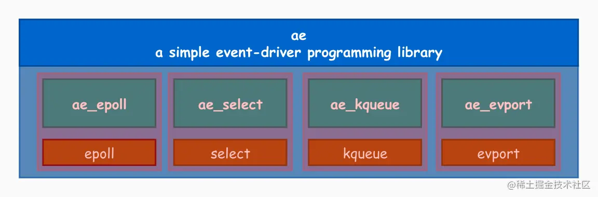

Redis的I/O多路复用模块提供的API:

```c
//下面的方法不同版本的redis在src目录下的ae_epoll.c、ae_evport.c、ae_kqueue.c、ae_select.c代码文件中都有实现
static int aeApiCreate(aeEventLoop *eventLoop)
static int aeApiResize(aeEventLoop *eventLoop, int setsize)
static void aeApiFree(aeEventLoop *eventLoop)
static int aeApiAddEvent(aeEventLoop *eventLoop, int fd, int mask)
static void aeApiDelEvent(aeEventLoop *eventLoop, int fd, int mask)
static int aeApiPoll(aeEventLoop *eventLoop, struct timeval *tvp)
```

Redis可以在多个平台上运行，所以会通过宏定义，根据编译平台的不同，选择不同的I/O多路复用函数作为子模块，提供给上层接口做封装。

```c
/*下面代码在Redis不同版本的ae.c源码文件中均包含
 *Include the best multiplexing layer supported by this system.
 * The following should be ordered by performances, descending. */
#ifdef HAVE_EVPORT
#include "ae_evport.c"
#else
    #ifdef HAVE_EPOLL
    #include "ae_epoll.c"
    #else
        #ifdef HAVE_KQUEUE
        #include "ae_kqueue.c"
        #else
        #include "ae_select.c"
        #endif
    #endif
#endif
```

Redis 会优先选择时间复杂度为 𝑂(1) 的 I/O 多路复用函数作为底层实现，包括 Solaries 10 中的 evport、Linux 中的 epoll 和 macOS/FreeBSD 中的 kqueue。select 函数是作为 POSIX
标准中的系统调用，在不同版本的操作系统上都会实现，所以将其作为保底方案。

### 1.2 单线程事件循环 —— Reactor网络模型

在服务端架构设计中，Reactor是一种基于事件驱动的设计模式。目前Linux平台上主流的高性能网络库/框架中，大都采用这种设计模式，比如netty、libevent、libev、ACE，POE(Perl)、Twisted(Python)等。

Reactor 模式本质上指的是使用 `I/O 多路复用(I/O multiplexing) + 非阻塞 I/O(non-blocking I/O)`的模式。通常设置一个主线程负责做 event-loop 事件循环和 I/O 读写，通过 select/poll/epoll_wait 等系统调用监听I/O 事件，业务逻辑提交给其他工作线程去做。而所谓『非阻塞 I/O』的核心思想是指避免阻塞在 read() 或者 write() 或者其他的 I/O 系统调用上，这样可以最大限度的复用 event-loop 线程，让一个线程能服务于多个 sockets。在 Reactor 模式中，I/O 线程只能阻塞在 I/O multiplexing 函数上（select/poll/epoll_wait）。单线程的Reactor网络模型是这样的：

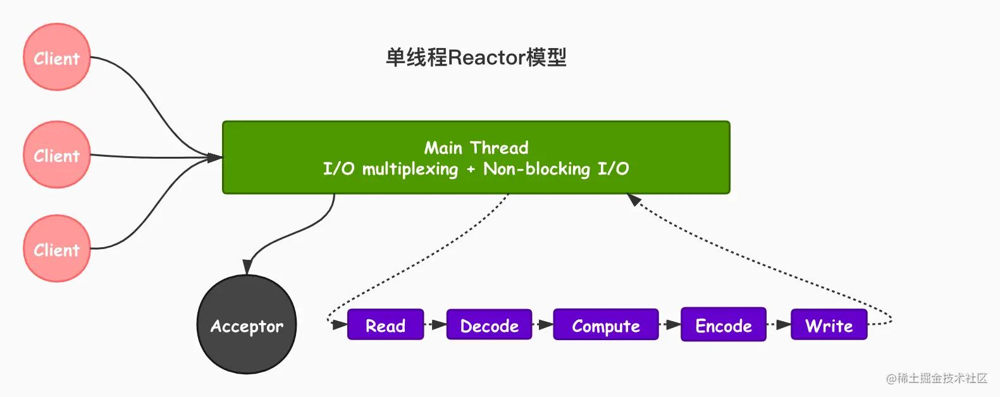

Redis在 6.0 版本之前的单事件循环模型，实际上就是一个非常经典的Reactor模型，看下图：

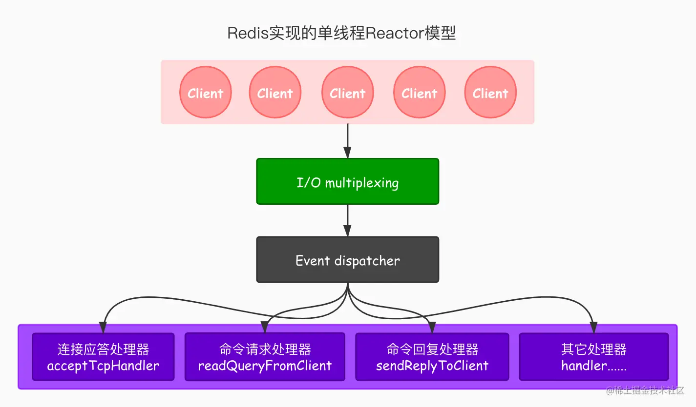

Redis的单线程Reactor大体是这样工作的：“I/O 多路复用模块”会监听多个 FD ，当这些FD产生，accept，read，write 或 close 的文件事件。会向“文件事件分发器（dispatcher）”传送事件。文件事件分发器（dispatcher）在收到事件之后，会根据事件的类型将事件分发给对应的 handler。后边的章节我们会对这一过程再展开详述。

### 1.3 基于条件变量实现的生产者消费者模型

我们前边提到，Redis从发版之出就自带BIO线程，主要用来处理一些比较耗时的后台任务。redis使用的是一个基于条件变量实现生产者消费者模型来设计BIO系统。Redis使用C语言开发，我们以Linux C为例子，先来介绍一下锁与共享变量的使用方法，再总结一下这一模型的设计。

#### 1.3.1 锁

多线程情况下， 锁的使用主要涉及以下5个函数， 它们都包含在pthread.h头文件中。

```c
pthread_mutex_init(pthread_mutex_t mutex,const pthread_mutexattr_t attr)
pthread_mutex_lock(pthread_mutex_t *mutex)
pthread_mutex_trylock(pthread_mutex_t *mutex)
pthread_mutex_unlock(pthread_mutex_t *mutex)
pthread_mutex_destroy(pthread_mutex_t *mutex)
```

其中锁变量类型为`pthread_mutex_t`，锁的使用包含三个步骤:锁的初始化、加锁、以及释放锁。

#### 1.3.2 锁初始化

`pthread_mutex_init`该函数用于锁的初始化，要使用锁，首先需要声明一个`pthread_mutex_t`变量,然后用该函数进行初始化，如下：

```c
pthread_mutex_t mutex;
pthread_mutex_init(&mutex,NULL);
```

初始化的时候，第二个参数可以用于设置锁的性质。经过这一步, 我们完成了锁的初始化，在第二个参数设置NULL的时候，一个线程加锁，另外一个线程再执行加锁操作就会阻塞，直到另外的线程释放锁。

#### 1.3.3 加锁、释放锁与资源回收

`pthread_mutex_lock`与`pthread_mutex_trylock`这两个函数可以用于加锁。这两个函数都完成了加锁的功能，在获得了变量初始化后的mutex以后，直接调用函数即可完成加锁功能。其中第一个函数在另外一个线程已经获得锁的情况下会一直阻塞，而第二个函数则会直接返回，不会阻塞。

`pthread_mutex_unlock`函数可以用于释放锁。

`pthread_mutex_destroy`函数用于释放资源，在使用`pthread_mutex_init`函数进行锁初始化的情况下，使用结束以后，需要使用该函数释放资源。

#### 1.3.4 共享变量

共享变量应用于这样一种场景：一个线程先对某一条件进行判断，如果条件不满足则进入等待，条件满足的时候，该线程被通知条件满足，继续执行任务。共享变量涉及的函数有如下6个：

```c
int pthread_cond_init(pthread_cond_t cond, pthread_condattr_t cond_attr)
int pthread_cond_wait(pthread_cond_t cond, pthread_mutex_t mutex)
int pthread_cond_signal(pthread_cond_t *cond)
int pthread_cond_broadcast(pthread_cond_t *cond)
int pthread_cond_timedwait(pthread_cond_t cond, pthread_mutex_t mutex, const struct timespec *abstime)
```

#### 1.3.5 共享变量的初始化与条件等待

共享变量使用函数`pthread_cond_init`初始化，要使用条件变量，首先要声明一个`pthread_cond_t`变量，然后用该函数进行初始化。第二个参数使用NULL，可以进行具体的参数设置。初始化完成后，需要通过`pthread_cond_wait`或`pthread_cond_timedwait`等待条件成立；在条件不满足的时候，函数进入等待；当条件满足的时候，该函数会停止等待，继续执行。该函数的第二个参数是`pthread_mutex_t`类型，这是因为在条件判断的时候，需要先进行加锁来防止出现错误，在执行改函数前需要主动对这个变量执行加锁操作，**进入这个函数以后，其内部会对mutex进行解锁操作；而函数执行完以后(也就是停止阻塞以后)，又会重新加锁**，具体原因在介绍完本组函数以后进行说明，其中第二个函数可以指定等待的时间，而不是一直在阻塞。

#### 1.3.6 条件满足通知

上面说到，在条件不满足的时候，一个线程会调用`pthread_cond_wait`函数阻塞等待；而此时如果其他线程检查到条件满足，则可以调用`pthread_cond_signal`、`pthread_cond_broadcast`，让处于等待状态的线程重新开始执行。当有多个线程在等待的时候，则可以调用`pthread_cond_signal`函数会唤醒其中一个线程，而`pthread_cond_broadcast`函数会唤醒所有的等待的线程。

#### 1.3.7 实现生产者消费者模型的正确方法

上边我们介绍完了锁与共享变量的基本函数，接下来介绍这两套函数配合使用的一个常见场景：有两个线程，其中一个线程先对一个条件进行检查，这个检查动作需要先加锁。如果条件成立则执行操作，否则阻塞等待，直到条件成立这个线程才会被通知继续执行；另一个线程先做加锁处理，然后置条件为真，并通知其他等待的线程条件已经满足，可以继续执行。

上面说在检查共享变量的时候要加锁，其原因通过以下伪代码来说明。

第一种情况：

```c
线程1
pthread_mutex_lock(&mutex); 
while (condition == FALSE) {
    pthread_cond_wait(&cond, &mutex); 
}
pthread_mutex_unlock(&mutex);

线程2
condition = TRUE;
pthread_cond_signal(&cond);
```

可以看到线程1先检查一个条件是否成立，在不成立的情况下就调用wait函数进行等待，而在这之前，先对这步过程进行了加锁操作。线程2则是把条件设置为true(假设其通过某种方式知道了这个时候该条件应当为true)，然后用`pthread_cond_signal`函数通知线程1停止阻塞继续执行。上面的程序在多个线程并发执行的时候有如下的问题： 如果线程1先判断，发现条件不满足，准备进入等待，在这个时候线程2中条件被置为真，且发送通知，然后线程1才阻塞等待，这样的话线程1错过了一次通知，导致其在条件满足的情况下依然在阻塞等待。

```c
        线程1                               线程2
pthread_mutex_lock(&mutex);
while (condition == FALSE)
                                      condition = TRUE;
                                      pthread_cond_signal(&cond);
pthread_cond_wait(&cond, &mutex);
```

为了解决上面说的问题，对程序进行了如下的改进。通过线程2的加锁操作，避免了这样的问题。这也解释了为什么`pthread_cond_wait`函数在进入以后要进行解锁操作，如果起不解锁，那么线程2在进行条件置为true的操作就没有办法执行，因为线程1在进入等待之前已经对这个变量加锁了，这样线程1会一直等待，而线程2也会等待，导致死锁。

```c
线程1                                       线程2
pthread_mutex_lock(&mutex);           pthread_mutex_lock(&mutex);
while (condition == FALSE) {          condition = TRUE;
 pthread_cond_wait(&cond, &mutex);    pthread_cond_signal(&cond);
}                                     pthread_mutex_unlock(&mutex);
pthread_mutex_unlock(&mutex);
```

因为wait重新执行的时候需要再次加锁，所以上面的`pthread_cond_signal`调用以后，必须释放锁才能够完成wait。另外，也可以先解锁，然后调用`pthread_cond_signal`，这两种写法都是正确的。虽然共享变量的访问一般需要加锁，但在这个场景下不加锁造成的竞争不会产生错误，只是会造成线程调度效率上的问题，所以也可以这么写，但是一般推荐标准的写法。

对于条件变量，其基本的使用场景是，某些线程对条件进行判断，如果不满足条件，就进入等待状态。在进行条件判断之前，先进行加锁操作，另外一些线程则是负责对条件赋值为真，然后通知等待的线程继续执行，线程被唤醒后，继续进入判断的环节以及后续的操作。

总结一下本节介绍的基于条件变量实现的生产者消费者模型：A类线程依次执行加锁、检查(条件不成立则等待,知道成立再次进入检查阶段)、执行、解锁；同时B类线程依次执行加锁、条件置为真、通知、解锁。

## 2. Redis核心网络模型架构的演进

从Redis的发展历史我们可以看出，其核心网络模型经历了从单线程到多线程的演进。那么Redis单线程的I/O模型是怎样实现的？单线程存在什么问题？Redis 的多线程的I/O又是怎样实现的？为什么要这么做? 本节我们就来探索这些问题。

### 2.1 单线程I/O的工作流程

我们前边有说到，Redis在 6.0 版本以前，其核心的网络模型一直是单线程Reactor模型，利用 epoll/select/kqueue 等多路复用技术，在单线程的事件循环中不断去处理客户端请求，最后回写响应数据到客户端：

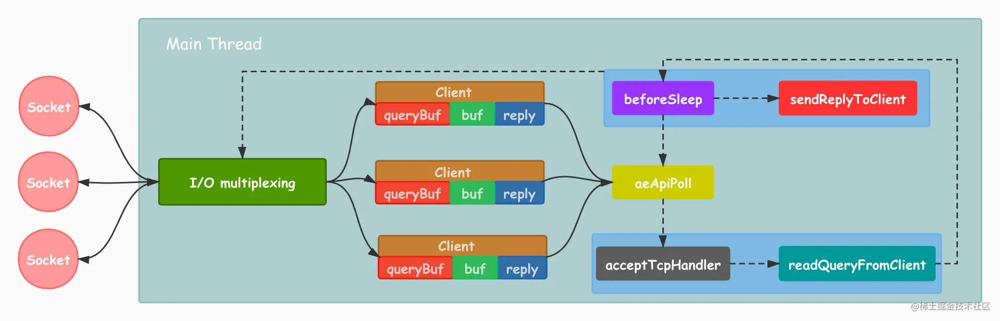

我们先来学习一下redis网络模型中的一些核心概念：

  * `client` ：客户端对象，Redis 是典型的 CS 架构（Client <---> Server），客户端通过 socket 与服务端建立网络通道然后发送请求命令，服务端执行请求的命令并回复。Redis 使用结构体 client 存储客户端的所有相关信息，包括但不限于封装的套接字连接 `*conn`，当前选择的数据库指针 `*db`，读入缓冲区 querybuf，写出缓冲区 buf，写出数据链表 reply等。

```c
/* client对象在redis不同版本的redis.h中均有定义
 * With multiplexing we need to take per-client state.
 * Clients are taken in a linked list. */
typedef struct client {
    uint64_t id;            /* Client incremental unique ID. */
    int fd;                 /* Client socket. */
    redisDb *db;            /* Pointer to currently SELECTed DB. */
    robj *name;             /* As set by CLIENT SETNAME. */
    sds querybuf;           /* Buffer we use to accumulate client queries. */
    size_t qb_pos;          /* The position we have read in querybuf. */
    sds pending_querybuf;   /* If this client is flagged as master, this buffer
                               represents the yet not applied portion of the
                               replication stream that we are receiving from
                               the master. */
    size_t querybuf_peak;   /* Recent (100ms or more) peak of querybuf size. */
    int argc;               /* Num of arguments of current command. */
    robj **argv;            /* Arguments of current command. */
    struct redisCommand *cmd, *lastcmd;  /* Last command executed. */
    ...... //此处省略很多其它的属性
    /* Response buffer */
    int bufpos;
    char buf[PROTO_REPLY_CHUNK_BYTES];
} client;
```

  * `aeApiPoll`：这个我们前边提到过，I/O 多路复用 API，是基于 `epoll_wait/select/kevent` 等系统调用的封装，监听等待读写事件触发，然后处理，它是事件循环（Event Loop）中的核心函数，是事件驱动得以运行的基础。
  * `acceptTcpHandler`：连接应答处理器，底层使用系统调用 accept 接受来自客户端的新连接，并为新连接注册绑定命令读取处理器，以备后续处理新的客户端 TCP 连接；除了这个处理器，还有对应的 acceptUnixHandler 负责处理 Unix Domain Socket 以及 acceptTLSHandler 负责处理 TLS 加密连接。
  * `readQueryFromClient`：命令读取处理器，解析并执行客户端的请求命令。
  * `beforeSleep`：事件循环中进入 aeApiPoll 等待事件到来之前会执行的函数，其中包含一些日常的任务，比如把 client->buf 或者 client->reply （后面会解释为什么这里需要两个缓冲区）中的响应写回到客户端，持久化 AOF 缓冲区的数据到磁盘等，相对应的还有一个 afterSleep 函数，在 aeApiPoll 之后执行。
  * `sendReplyToClient`：命令回复处理器，当一次事件循环之后写出缓冲区中还有数据残留，则这个处理器会被注册绑定到相应的连接上，等连接触发写就绪事件时，它会将写出缓冲区剩余的数据回写到客户端。

然后，笔者再描述一下Redis服务端的工作流程：

  1. Redis 服务器启动，开启主线程事件循环（Event Loop），注册 acceptTcpHandler 连接应答处理器到用户配置的监听端口对应的文件描述符，等待新连接到来；
  2. 客户端和服务端建立网络连接；
  3. acceptTcpHandler 被调用，主线程使用 AE 的 API 将 readQueryFromClient 命令读取处理器绑定到新连接对应的文件描述符上，并初始化一个 client 绑定这个客户端连接；
  4. 客户端发送请求命令，触发读就绪事件，主线程调用 readQueryFromClient 通过 socket 读取客户端发送过来的命令存入 client->querybuf 读入缓冲区；
  5. 接着调用 processInputBuffer，在其中使用 processInlineBuffer 或者 processMultibulkBuffer 根据 Redis 协议解析命令，最后调用 processCommand 执行命令；
  6. 根据请求命令的类型（SET, GET, DEL, EXEC 等），分配相应的命令执行器去执行，最后调用 addReply 函数族的一系列函数将响应数据写入到对应 client 的写出缓冲区：client->buf 或者 client->reply ，client->buf 是首选的写出缓冲区，固定大小 16KB，一般来说可以缓冲足够多的响应数据，但是如果客户端在时间窗口内需要响应的数据非常大，那么则会自动切换到 client->reply 链表上去，使用链表理论上能够保存无限大的数据（受限于机器的物理内存），最后把 client 添加进一个 LIFO 队列 `clients_pending_write`；
  7. 在事件循环（Event Loop）中，主线程执行 beforeSleep --> handleClientsWithPendingWrites，遍历 `clients_pending_write` 队列，调用 writeToClient 把 client 的写出缓冲区里的数据回写到客户端，如果写出缓冲区还有数据遗留，则注册 sendReplyToClient 命令回复处理器到该连接的写就绪事件，等待客户端可写时在事件循环中再继续回写残余的响应数据。

笔者整理了一张更详细的redis单线程I/O的工作流程图，感兴趣的读者可以结合上边的描述过程看一下。

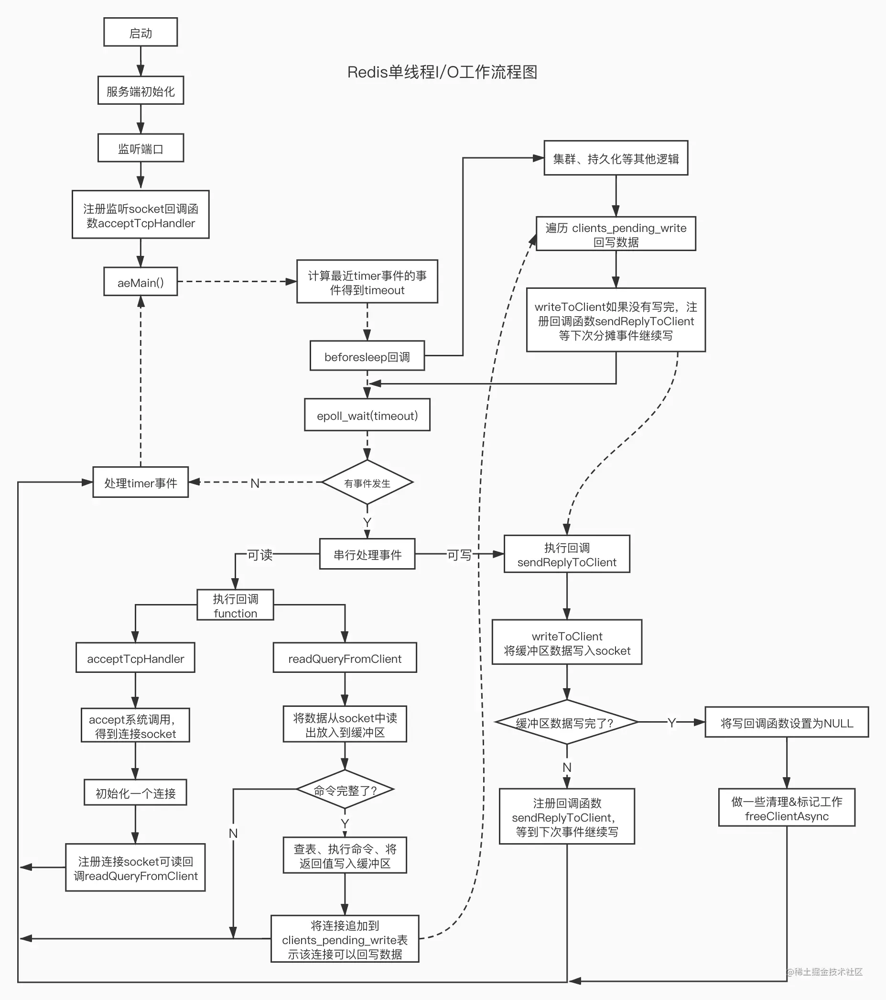

### 2.2 单线程存在什么问题？

我们都知道单线程的程序是无法利用服务器的多核CPU的，那么早期的Redis为什么还要使用单线程呢？我们不妨先看一下`Redis`官方给出的[FAQ](https://redis.io/topics/faq)

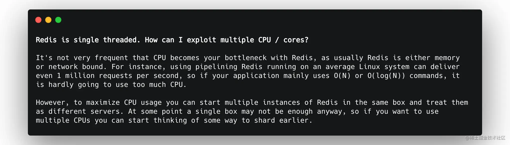

核心意思是：CPU并不是制约`Redis`性能表现的瓶颈所在，更多情况下是受到内存大小和网络I/O的限制，所以Redis核心网络模型使用单线程并没有什么问题，如果你想要使用服务的多核CPU，可以在一台服务器上启动多个实例或者采用分片集群的方式。

通过上一节对Redis单线程Reactor模型的分析，我们知道Redis的I/O线程除了在等待事件，其它的事件都是非阻塞的，没有浪费任何的CPU时间，这也是 Redis能够提供高性能服务的原因。不过除了我们上边说的只能使用一个CPU核心外，这个模型还有两个缺陷：

  * 在value比较大的情况下会阻塞Redis服务
  * QPS难以更上一层楼

redis主线程的时间主要消耗在两个地方：逻辑计算的消耗(CPU计算)和由于同步IO(I/O multiplexing)的读写，内核态和用户态相互拷贝数据。当value很大时，Redis的瓶颈会首先出现在同步IO这里，如果能有多个线程来分担这部分压力，那Redis的QPS还能有大幅度的提升，这就是Redis多线程网络模型的实现思路。

### 2.3 Redis多线程网络模型的实现

Redis在 6.0 版本之后正式在核心网络模型中引入了多线程，前边我们提到Redis在 6.0版本之前，使用的是经典的单线程Reactor模型，通常来说，单线程的Reactor架构模型在引入了多线程之后会进化为 Multi-Reactors模式，它的工作模式是这样的：

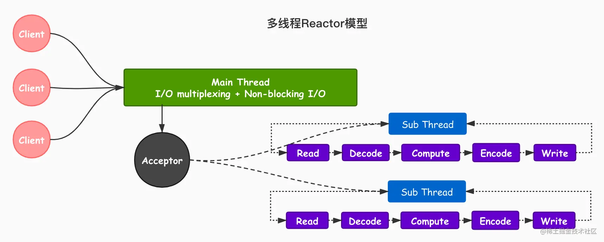

区别于单 Reactor 模式，这种模式不再是单线程的事件循环，而是有多个线程（Sub Reactors）各自维护一个独立的事件循环，由 Main Reactor 负责接收新连接并分发给 Sub Reactors 去独立处理，最后 Sub Reactors 回写响应给客户端。

Multiple Reactors 模式通常也可以等同于 Master-Workers 模式，比如 Nginx 和 Memcached 等就是采用这种多线程模型，虽然不同的项目实现细节略有区别，但总体来说模式是一致的。

#### 2.3.1 多线程网络模型的工作流程

Redis 虽然也实现了多线程，但是却不是标准的 Multi-Reactors/Master-Workers 模式，我们先看一下 Redis 多线程网络模型的总体设计：

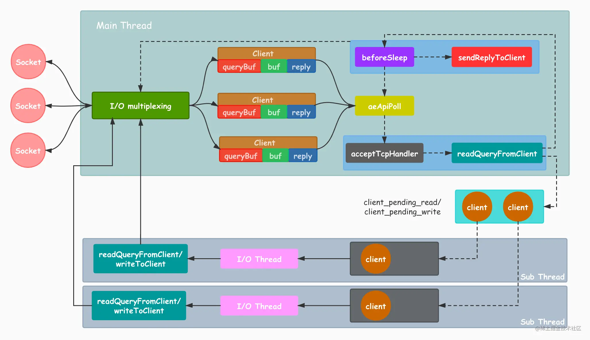

  1. Redis 服务器启动，开启主线程事件循环（Event Loop），注册 acceptTcpHandler 连接应答处理器到用户配置的监听端口对应的文件描述符，等待新连接到来；
  2. 客户端和服务端建立网络连接；
  3. acceptTcpHandler 被调用，主线程使用 AE 的 API 将 readQueryFromClient 命令读取处理器绑定到新连接对应的文件描述符上，并初始化一个 client 绑定这个客户端连接；
  4. 客户端发送请求命令，触发读就绪事件，服务端主线程不会通过 socket 去读取客户端的请求命令，而是先将 client 放入一个 LIFO 队列 `clients_pending_read`；
  5. 在事件循环（Event Loop）中，主线程执行 beforeSleep -->handleClientsWithPendingReadsUsingThreads，利用 Round-Robin 轮询负载均衡策略，把 clients_pending_read队列中的连接均匀地分配给 I/O 线程各自的本地 FIFO 任务队列 io_threads_list[id] 和主线程自己，I/O 线程通过 socket 读取客户端的请求命令，存入 client->querybuf 并解析第一个命令，但不执行命令，主线程忙轮询，等待所有 I/O 线程完成读取任务；
  6. 主线程和所有 I/O 线程都完成了读取任务，主线程结束忙轮询，遍历 `clients_pending_read` 队列，执行所有客户端连接的请求命令，先调用 processCommandAndResetClient 执行第一条已经解析好的命令，然后调用 processInputBuffer 解析并执行客户端连接的所有命令，在其中使用 processInlineBuffer 或者 processMultibulkBuffer 根据 Redis 协议解析命令，最后调用 processCommand 执行命令；
  7. 根据请求命令的类型（SET, GET, DEL, EXEC 等），分配相应的命令执行器去执行，最后调用 addReply 函数族的一系列函数将响应数据写入到对应 client 的写出缓冲区：client->buf 或者 client->reply ，client->buf 是首选的写出缓冲区，固定大小 16KB，一般来说可以缓冲足够多的响应数据，但是如果客户端在时间窗口内需要响应的数据非常大，那么则会自动切换到 client->reply 链表上去，使用链表理论上能够保存无限大的数据（受限于机器的物理内存），最后把 client 添加进一个 LIFO 队列 `clients_pending_write；`
  8. 在事件循环（Event Loop）中，主线程执行 beforeSleep --> handleClientsWithPendingWritesUsingThreads，利用 Round-Robin 轮询负载均衡策略，把 `clients_pending_write` 队列中的连接均匀地分配给 I/O 线程各自的本地 FIFO 任务队列 `io_threads_list[id]` 和主线程自己，I/O 线程通过调用 writeToClient 把 client 的写出缓冲区里的数据回写到客户端，主线程忙轮询，等待所有 I/O 线程完成写出任务；
  9. 主线程和所有 I/O 线程都完成了写出任务， 主线程结束忙轮询，遍历 `clients_pending_write` 队列，如果 client 的写出缓冲区还有数据遗留，则注册 sendReplyToClient 到该连接的写就绪事件，等待客户端可写时在事件循环中再继续回写残余的响应数据。

这里大部分逻辑和之前的单线程模型是一致的，变动的地方仅仅是把读取客户端请求命令和回写响应数据的逻辑异步化了，交给 I/O 线程去完成，这里需要特别注意的一点是：**I/O 线程仅仅是读取和解析客户端命令而不会真正去执行命令，客户端命令的执行最终还是要回到主线程上完成。**

笔者也同样整理了一张更详细的redis多线程I/O的工作流程图，感兴趣的读者可以结合上边的描述过程看一下。

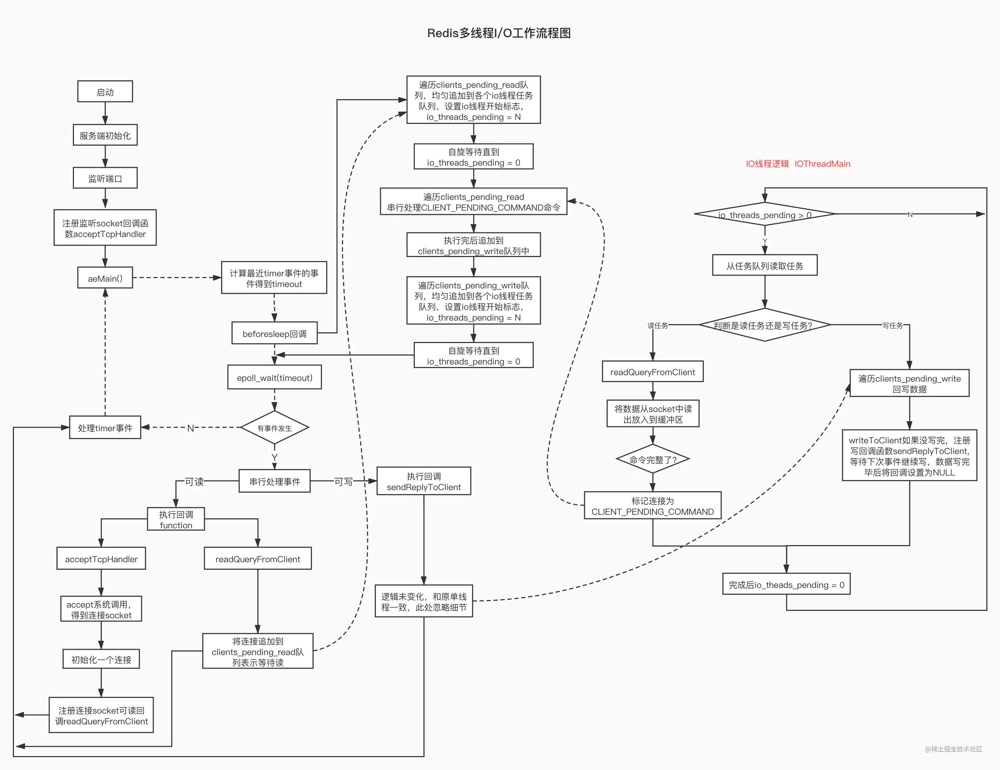

#### 2.3.2 多线程I/O源码剖析

接下里，笔者以 Redis v6.0.1版本，对多线程I/O实现中比较重要的源码进行分析。

先来看多线程的初始化：

```c
/* Initialize the data structures needed for threaded I/O. */
void initThreadedIO(void) {
    io_threads_active = 0; /* We start with threads not active. */
    //如果只配置了一个线程,则所有的I/O放到主线程上执行
    if (server.io_threads_num == 1) return;
    //最多配置的线程数量不超过128
    if (server.io_threads_num > IO_THREADS_MAX_NUM) {
        serverLog(LL_WARNING,"Fatal: too many I/O threads configured. "
                             "The maximum number is %d.", IO_THREADS_MAX_NUM);
        exit(1);
    }

    //启动线程，线程数量为配置中的线程数
    for (int i = 0; i < server.io_threads_num; i++) {   
        //创建I/O线程的本地任务队列
        io_threads_list[i] = listCreate();
        if (i == 0) continue; //0号线程是主线程
        //初始化 I/O 线程并启动。
        pthread_t tid;
        // 每个 I/O 线程会分配一个本地锁，用来休眠和唤醒线程。
        pthread_mutex_init(&io_threads_mutex[i],NULL); 
        // 每个 I/O 线程分配一个原子计数器，用来记录当前遗留的任务数量。
        io_threads_pending[i] = 0;
        // 主线程在启动 I/O 线程的时候会默认先锁住它，直到有 I/O 任务才唤醒它。
        pthread_mutex_lock(&io_threads_mutex[i]);
        // 启动线程，进入 I/O 线程的主逻辑函数 IOThreadMain
        if (pthread_create(&tid,NULL,IOThreadMain,(void*)(long)i) != 0) {
            serverLog(LL_WARNING,"Fatal: Can't initialize IO thread.");
            exit(1);
        }
        io_threads[i] = tid;
    }
}
```

`initThreadedIO`会在Redis服务器启动的末尾被调用，进行I/O多线程的初始化工作。Redis的多线程模式是关闭的，需要用户在 redis.conf 配置文件中开启并设置：

```c
io-threads 2
io-threads-do-reads yes
```

注意通过配置io-theads设置的I/O线程数量也包括主线程在内，io-threads-do-reads标识I/O线程是否参与读I/O的处理，提供这个配置的原因是因为，读I/O的并行处理对于Redis的性能提升并不明显。

我们再来看读取请求的源代码。当客户端发送请求命令之后，会触发 Redis 主线程的事件循环，命令处理器 readQueryFromClient被回调，在以前的单线程模型下，这个方法会直接读取解析客户端命令并执行，但是多线程模式下，则会把 client 加入到`clients_pending_read` 任务队列中去，后面主线程再分配到 I/O 线程去读取客户端请求命令：

```c
void readQueryFromClient(connection *conn) {
    client *c = connGetPrivateData(conn);
    int nread, readlen;
    size_t qblen;
    //如果开启了多线程，将client加入到异步队列之后返回
    if (postponeClientRead(c)) return;
    ...... //省略代码，逻辑同单线程版本几乎一样
}

/* Return 1 if we want to handle the client read later using threaded I/O.
 * This is called by the readable handler of the event loop.
 * As a side effect of calling this function the client is put in the
 * pending read clients and flagged as such. */
int postponeClientRead(client *c) {
    //当多线程 I/O 模式开启、主线程没有在处理阻塞任务时，将 client 加入异步队列。
    if (io_threads_active &&
        server.io_threads_do_reads &&
        !ProcessingEventsWhileBlocked &&
        !(c->flags & (CLIENT_MASTER|CLIENT_SLAVE|CLIENT_PENDING_READ)))
    {
        // 给 client 打上 CLIENT_PENDING_READ 标识，表示该 client 需要被多线程处理，
        // 后续在 I/O 线程中会在读取和解析完客户端命令之后判断该标识并放弃执行命令，让主线程去执行。
        c->flags |= CLIENT_PENDING_READ;
        listAddNodeHead(server.clients_pending_read,c);
        return 1;
    } else {
        return 0;
    }
}
```

主线程会在事件循环的 beforeSleep() 方法中，调用 handleClientsWithPendingReadsUsingThreads：

```c
/* When threaded I/O is also enabled for the reading + parsing side, the
 * readable handler will just put normal clients into a queue of clients to
 * process (instead of serving them synchronously). This function runs
 * the queue using the I/O threads, and process them in order to accumulate
 * the reads in the buffers, and also parse the first command available
 * rendering it in the client structures. */
int handleClientsWithPendingReadsUsingThreads(void) {
    if (!io_threads_active || !server.io_threads_do_reads) return 0;
    int processed = listLength(server.clients_pending_read);
    if (processed == 0) return 0;
    if (tio_debug) printf("%d TOTAL READ pending clients\n", processed);

    // 遍历待读取的 client 队列 clients_pending_read，
    // 通过 RR 轮询均匀地分配给 I/O 线程和主线程自己（编号 0）。
    listIter li;
    listNode *ln;
    listRewind(server.clients_pending_read,&li);
    int item_id = 0;
    while((ln = listNext(&li))) {
        client *c = listNodeValue(ln);
        int target_id = item_id % server.io_threads_num;
        listAddNodeTail(io_threads_list[target_id],c);
        item_id++;
    }

    // 设置当前 I/O 操作为读取操作，给每个 I/O 线程的计数器设置分配的任务数量，
    // 让 I/O 线程可以开始工作：只读取和解析命令，不执行。
    io_threads_op = IO_THREADS_OP_READ;
    for (int j = 1; j < server.io_threads_num; j++) {
        int count = listLength(io_threads_list[j]);
        io_threads_pending[j] = count;
    }

     // 主线程自己也会去执行读取客户端请求命令的任务，以达到最大限度利用 CPU。
    listRewind(io_threads_list[0],&li);
    while((ln = listNext(&li))) {
        client *c = listNodeValue(ln);
        readQueryFromClient(c->conn);
    }
    listEmpty(io_threads_list[0]);

    // 忙轮询，累加所有 I/O 线程的原子任务计数器，直到所有计数器的遗留任务数量都是 0，
    // 表示所有任务都已经执行完成，结束轮询。
    while(1) {
        unsigned long pending = 0;
        for (int j = 1; j < server.io_threads_num; j++)
            pending += io_threads_pending[j];
        if (pending == 0) break;
    }
    if (tio_debug) printf("I/O READ All threads finshed\n");

    // 遍历待读取的 client 队列，清除 CLIENT_PENDING_READ 和 CLIENT_PENDING_COMMAND 标记，
    // 然后解析并执行所有 client 的命令。
    while(listLength(server.clients_pending_read)) {
        ln = listFirst(server.clients_pending_read);
        client *c = listNodeValue(ln);
        c->flags &= ~CLIENT_PENDING_READ;
        listDelNode(server.clients_pending_read,ln);
        if (c->flags & CLIENT_PENDING_COMMAND) {
            c->flags &= ~CLIENT_PENDING_COMMAND;
            // client 的第一条命令已经被解析好了，直接尝试执行。
            if (processCommandAndResetClient(c) == C_ERR) {
                /* If the client is no longer valid, we avoid
                 * processing the client later. So we just go
                 * to the next. */
                continue;
            }
        }
        // 继续解析并执行 client 命令。
        processInputBuffer(c);
    }

    return processed;
}
```

这里主线程所做的核心工作就是：

  * 遍历待读取的 client 队列 `clients_pending_read`，通过 RR 策略把所有任务分配给 I/O 线程和主线程去读取和解析客户端命令。
  * 忙轮询等待所有 I/O 线程完成任务。
  * 等主线程和其它I/O吓成一起完成了读请求处理以后，最后再遍历 `clients_pending_read`，执行所有 client 的命令。

与读取相求相对应的自然是写回响应了，完成命令的读取、解析以及执行之后，客户端命令的响应数据已经存入 client->buf 或者 client->reply中了，接下来就需要把响应数据回写到客户端了，还是在 beforeSleep 中， 主线程调用handleClientsWithPendingWritesUsingThreads：

```c
int handleClientsWithPendingWritesUsingThreads(void) {
    int processed = listLength(server.clients_pending_write);
    if (processed == 0) return 0; /* Return ASAP if there are no clients. */

    // 如果用户设置的 I/O 线程数等于 1 或者当前 clients_pending_write 队列中待写出的 client
    // 数量不足 I/O 线程数的两倍，则不用多线程的逻辑，让所有 I/O 线程进入休眠，
    // 直接在主线程把所有 client 的相应数据回写到客户端。
    if (server.io_threads_num == 1 || stopThreadedIOIfNeeded()) {
        return handleClientsWithPendingWrites();
    }

   // 唤醒正在休眠的 I/O 线程（如果有的话）。
    if (!io_threads_active) startThreadedIO();
    if (tio_debug) printf("%d TOTAL WRITE pending clients\n", processed);

    // 遍历待写出的 client 队列 clients_pending_write，
    // 通过 RR 轮询均匀地分配给 I/O 线程和主线程自己（0号线程）。
    listIter li;
    listNode *ln;
    listRewind(server.clients_pending_write,&li);
    int item_id = 0;
    while((ln = listNext(&li))) {
        client *c = listNodeValue(ln);
        c->flags &= ~CLIENT_PENDING_WRITE;
        int target_id = item_id % server.io_threads_num;
        listAddNodeTail(io_threads_list[target_id],c);
        item_id++;
    }

    // 设置当前 I/O 操作为写出操作，给每个 I/O 线程的计数器设置分配的任务数量，
    // 让 I/O 线程可以开始工作，把写出缓冲区（client->buf 或 c->reply）中的响应数据回写到客户端。
    io_threads_op = IO_THREADS_OP_WRITE;
    for (int j = 1; j < server.io_threads_num; j++) {
        int count = listLength(io_threads_list[j]);
        io_threads_pending[j] = count;
    }

    // 主线程自己也会去执行读取客户端请求命令的任务，以达到最大限度利用 CPU。
    listRewind(io_threads_list[0],&li);
    while((ln = listNext(&li))) {
        client *c = listNodeValue(ln);
        writeToClient(c,0);
    }
    listEmpty(io_threads_list[0]);

    // 忙轮询，累加所有 I/O 线程的原子任务计数器，直到所有计数器的遗留任务数量都是 0。
    // 表示所有任务都已经执行完成，结束轮询。
    while(1) {
        unsigned long pending = 0;
        for (int j = 1; j < server.io_threads_num; j++)
            pending += io_threads_pending[j];
        if (pending == 0) break;
    }
    if (tio_debug) printf("I/O WRITE All threads finshed\n");

    // 最后再遍历一次 clients_pending_write 队列，检查是否还有 client 的中写出缓冲区中有残留数据，
    // 如果有，那就为 client 注册一个命令回复器 sendReplyToClient，等待客户端写就绪再继续把数据回写。
    listRewind(server.clients_pending_write,&li);
    while((ln = listNext(&li))) {
        client *c = listNodeValue(ln);
        // 检查 client 的写出缓冲区是否还有遗留数据。
        if (clientHasPendingReplies(c) &&
                connSetWriteHandler(c->conn, sendReplyToClient) == AE_ERR)
        {
            freeClientAsync(c);
        }
    }

    listEmpty(server.clients_pending_write);

    return processed;
}
```

与读取请求相似，主线程处理写回响应的核心工作是：

  * 检查当前任务负载，如果当前的任务数量不足以用多线程模式处理的话，则休眠 I/O 线程并且直接同步将响应数据回写到客户端。
  * 唤醒正在休眠的 I/O 线程（如果有的话）。
  * 遍历待写出的 client 队列 `clients_pending_write`，通过 RR 策略把所有任务分配给 I/O 线程和主线程去将响应数据写回到客户端。
  * 忙轮询等待所有 I/O 线程完成任务。
  * 最后再遍历 `clients_pending_write`，为那些还残留有响应数据的 client 注册命令回复处理器 sendReplyToClient，等待客户端可写之后在事件循环中继续回写残余的响应数据。

上边我们分析了主线程的工作，下边我们再来看一下I/O线程的主逻辑都做了些什么：

```c
void *IOThreadMain(void *myid) {
    /* The ID is the thread number (from 0 to server.iothreads_num-1), and is
     * used by the thread to just manipulate a single sub-array of clients. */
    long id = (unsigned long)myid;
    char thdname[16];
    snprintf(thdname, sizeof(thdname), "io_thd_%ld", id);
    redis_set_thread_title(thdname);
    while(1) {
        // 忙轮询，100w 次循环，等待主线程分配 I/O 任务。
        for (int j = 0; j < 1000000; j++) {
            if (io_threads_pending[id] != 0) break;
        }
        // 如果 100w 次忙轮询之后如果还是没有任务分配给它，则通过尝试加锁进入休眠，
        // 等待主线程分配任务之后调用 startThreadedIO 解锁，唤醒 I/O 线程去执行。
        if (io_threads_pending[id] == 0) {
            pthread_mutex_lock(&io_threads_mutex[id]);
            pthread_mutex_unlock(&io_threads_mutex[id]);
            continue;
        }
        serverAssert(io_threads_pending[id] != 0);
        if (tio_debug) printf("[%ld] %d to handle\n", id, (int)listLength(io_threads_list[id]));
        // 注意：主线程分配任务给 I/O 线程之时，
        // 会把任务加入每个线程的本地任务队列 io_threads_list[id]，
        // 但是当 I/O 线程开始执行任务之后，主线程就不会再去访问这些任务队列，避免数据竞争。
        listIter li;
        listNode *ln;
        listRewind(io_threads_list[id],&li);
        while((ln = listNext(&li))) {
            client *c = listNodeValue(ln);
            // 如果当前是写出操作，则把 client 的写出缓冲区中的数据回写到客户端。
            if (io_threads_op == IO_THREADS_OP_WRITE) {
                writeToClient(c,0);
            // 如果当前是读取操作，则socket 读取客户端的请求命令并解析第一条命令。    
            } else if (io_threads_op == IO_THREADS_OP_READ) {
                readQueryFromClient(c->conn);
            } else {
                serverPanic("io_threads_op value is unknown");
            }
        }
        listEmpty(io_threads_list[id]);
        // 所有任务执行完之后把自己的计数器置 0，主线程通过累加所有 I/O 线程的计数器
        // 判断是否所有 I/O 线程都已经完成工作。
        io_threads_pending[id] = 0;
        if (tio_debug) printf("[%ld] Done\n", id);
    }
}
```

I/O 线程启动之后，会先进入忙轮询，判断原子计数器中的任务数量，如果是非 0 则表示主线程已经给它分配了任务，开始执行任务，否则就一直忙轮询一百万次等待，忙轮询结束之后再查看计数器，如果还是 0，则尝试加本地锁，因为主线程在启动 I/O 线程之时就已经提前锁住了所有 I/O 线程的本地锁，因此 I/O 线程会进行休眠，等待主线程唤醒。

主线程会在每次事件循环中尝试调用 startThreadedIO 唤醒 I/O 线程去执行任务，如果接收到客户端请求命令，则 I/O 线程会被唤醒开始工作，根据主线程设置的 `io_threads_op` 标识去执行命令读取和解析或者回写响应数据的任务，I/O 线程在收到主线程通知之后，会遍历自己的本地任务队列 `io_threads_list[id]`，取出一个个 client 执行任务：

  * 如果当前是写出操作，则调用 writeToClient，通过 socket 把 client->buf 或者 client->reply 里的响应数据回写到客户端。
  * 如果当前是读取操作，则调用 readQueryFromClient，通过 socket 读取客户端命令，存入 client->querybuf，然后调用 processInputBuffer 去解析命令，这里最终只会解析到第一条命令，然后就结束，不会去执行命令。
  * 在全部任务执行完之后把自己的原子计数器置 0，以告知主线程自己已经完成了工作。

至此，我们就分析完了多线程I/O工作的核心源码。

#### 2.3.3 I/O多线程lock-free的设计亮点

细心的读者可能会发现，Redis的多线程I/O设计是无锁化的，lock-free一直是多线程设计中的一个特色，Redis是通过原子操作+交错访问来实现的，主线程和 I/O
线程之间共享的变量有三个：`io_threads_pending` 计数器、`io_threads_op` I/O 标识符和 `io_threads_list` 线程本地任务队列。

`io_threads_pending` 是原子变量，不需要加锁保护，`io_threads_op` 和 `io_threads_list` 这两个变量则是通过控制主线程和 I/O 线程交错访问来规避共享数据竞争问题：I/O
线程启动之后会通过忙轮询和锁休眠等待主线程的信号，在这之前它不会去访问自己的本地任务队列 `io_threads_list[id]`，而主线程会在分配完所有任务到各个 I/O 线程的本地队列之后才去唤醒 I/O 线程开始工作，并且主线程之后在 I/O 线程运行期间只会访问自己的本地任务队列 `io_threads_list[0]` 而不会再去访问 I/O 线程的本地队列，这也就保证了主线程永远会在 I/O 线程之前访问 `io_threads_list` 并且之后不再访问，保证了交错访问。`io_threads_op` 同理，主线程会在唤醒 I/O 线程之前先设置好`io_threads_op` 的值，并且在 I/O 线程运行期间不会再去访问这个变量。

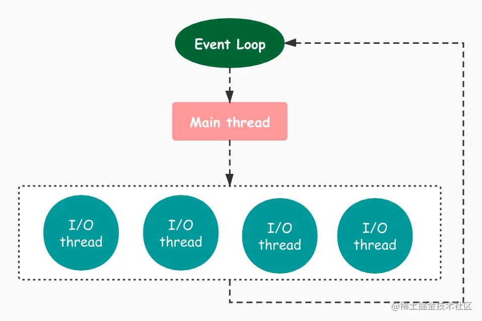

#### 2.3.4 多线程I/O的性能提升与设计缺陷

事实上，`Redis`通过多线程来提升性能达到的效果可能比你想象中的还要好，下边是从ITNEXT平台提取的一张压测结果报告图，更详细的内容可参考：[对实验性Redis多线程I / O进行基准测试](https://itnext.io/benchmarking-the-experimental-redis-multi-threaded-i-o-1bb28b69a314)

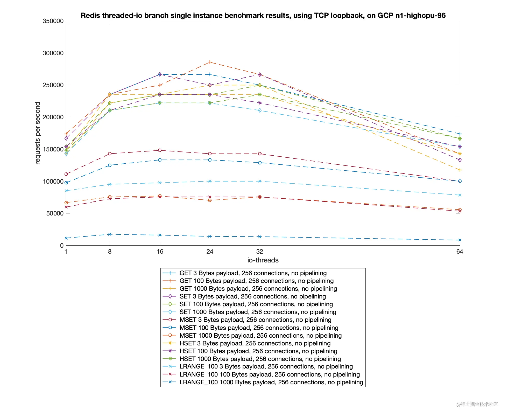

可以看到，在配置24个IO-threads时，执行普通的GET、SET指令，`Redis`能够达到20W+的QPS，相比较于单线程，性能提升了将近一倍。

我们前边提到，Redis的多线程网络模型为了保持与旧版本的兼容性，并没有使用标准的Multi-Reactors/Master-Workers 模型。客户端命令的执行还是在主线程上完成的。并且主线程和I/O线程的通信也是通过忙轮询和锁粗暴解决的，这会导致Redis在服务期间有CPU的空转问题，后边我们研究BIO系统的实现之后，会发现BIO线程与主线程之间的通信，相比较与Redis的核心多线程网络模型中通信的实现，要优雅很多。相信之后Redis的作者会对目前的方案进行改进。

## 3. Redis BIO系统的演进

本文一开始就给出了结论：对于整个服务端架构的设计而言，Redis从来都不是单线程的。我们讨论的单线程，只是针对Redis的核心网络模型而言，这部分的内容我们在上一节已经深入剖析过了。对于Redis的BIO系统，也就是这些所谓的后台线程，也经历了一个演进的过程，在这个过程中都发生了哪些事？Redis的作者antirez对BIO系统做了哪些优化呢？本节我们就来一起探索下这两个问题。

### 3.1 早期的BIO系统设计与实现

早期的Redis通过bio系统完成两件事，一是进行Aof持久化，也就是将写入到系统的page cache的数据fsync到磁盘中；二是关闭文件。为了完成这件任务，其采用了任务队列的方式，每个任务都是一个线程来完成，任务会被放到任务队列中，然后由执行任务线程取走，如果队列空，则阻塞等待，如果队列里有任务，就通知工作线程，这通过条件变量来实现。后面以任务初始化，任务放入队列，任务出队列三个方面进行介绍，并且以aof持久化为例说明其在系统中的使用方式，本节的内容与代码分析基于redis的 3.2.3 版本。

#### 3.1.1 任务初始化

对于一个任务，比如aof持久化任务，首先要初始化一个队列，在redis里面使用了redis自己的链表结构建立这个队列。这个队列需要满足以下特点：

  * 生产者放任务到队列中。
  * 如果队列不为空，消费者从队列中取任务；否则消费者进入等待状态。

这里的消费者就是服务线程，而为了完成队列为空则等待的功能，redis使用了条件变量机制。其初始化代码如下。

```c
static pthread_t bio_threads[BIO_NUM_OPS];
static pthread_mutex_t bio_mutex[BIO_NUM_OPS];
static pthread_cond_t bio_condvar[BIO_NUM_OPS];
static list *bio_jobs[BIO_NUM_OPS];
```

上面的常量`BIO_NUM_OPS = 2`,表示支持两种任务。对于每种任务，对应一个list用于放置任务，一个`pthread_cond_t`和`pthread_mutex_t`变量用于并发控制，以及一个`pthread_t` 用于后台服务线程。 初始化使用了bioInit函数，部分代码如下：

```c
for (j = 0; j < BIO_NUM_OPS; j++) {
    pthread_mutex_init(&bio_mutex[j],NULL);
    pthread_cond_init(&bio_condvar[j],NULL);
    bio_jobs[j] = listCreate();
    bio_pending[j] = 0;
}//初始化锁与条件变量
......
......
for (j = 0; j < BIO_NUM_OPS; j++) { 
    void *arg = (void*)(unsigned long) j;
    //这里的函数参数是arg = j，也就是每个线程传入一个编号j，0代表关闭文件，1代表aof初始化 
    if (pthread_create(&thread,&attr,bioProcessBackgroundJobs,arg) != 0) {    
        serverLog(LL_WARNING,"Fatal: Can't initialize Background Jobs."); 
        exit(1); 
    } 
    bio_threads[j] = thread; 
}//初始化线程
```

在完成初始化任务以后，我们有了BIO_NUM_OPS(其值为2)个链表表示任务队列，有两个线程调用bioProcessBackgroundJobs函数，参数是一个编号j，并且每个队列都初始化了锁与条件变量做并发控制。

#### 3.1.2 任务入队列

任务入队列就是把一个任务放到链表的头部,并且把相应任务的pending值+1,表示这个队列里面未完成的任务多了一个。 其中任务的结构如下：

```c
struct bio_job {
    time_t time;
    void *arg1, *arg2, *arg3;
};
```

可以看到，任务不是很复杂，只记录一个时间和参数就可以了，后面讲任务执行的时候，会讲到这样一个简单的结构记录的任务怎么执行。任务入队列的代码如下：

```c
void bioCreateBackgroundJob(int type, void *arg1, void *arg2, void *arg3) {
    struct bio_job *job = zmalloc(sizeof(*job));
    job->arg1 = arg1;
 ...
    pthread_mutex_lock(&bio_mutex[type]);
    listAddNodeTail(bio_jobs[type],job);
    bio_pending[type]++;
    pthread_cond_signal(&bio_condvar[type]);
    pthread_mutex_unlock(&bio_mutex[type]);
}
```

这段入队列的代码先为任务结构分配空间，然后使用listAddNodeTail函数把任务放到链表的头部。这里使用的是redis自己实现的链表。可以看到，进行链表操作的时候，要先加锁，这是因为这里的链表是共享资源。在任务成功加入队列以后，调用`pthread_cond_signal`函数，通知阻塞等待的线程继续执行。上面这个过程是共享变量使用的基本模式:加锁、置条件为真(这里是任务入队列)、通知、解锁。

#### 3.1.3 任务出队列

我们已经做好了任务初始化的工作，并且可以在队列里面放置新的任务，那么当队列里面有任务的时候，我们在第一步初始化的时候开启的后台线程就会调用bioProcessBackgroundJobs函数进行任务处理，其处理主要代码如下：

```c
void *bioProcessBackgroundJobs(void *arg) {
    unsigned long type = (unsigned long) arg;
    struct bio_job *job;
    while(1) {
        listNode *ln;
        pthread_mutex_lock(&bio_mutex[type]);        
        if (listLength(bio_jobs[type]) == 0) {
            //条件不成立,等待
            pthread_cond_wait(&bio_condvar[type],&bio_mutex[type]);
            //被通知以后,停止阻塞,重新判断条件
            continue;
        }
        //条件成立,直接执行
        ln = listFirst(bio_jobs[type]);
        job = ln->value;
        //取走值以后,解锁
        pthread_mutex_unlock(&bio_mutex[type]);
        //完成队列处理以后，根据类型调用close函数或者fsync函数。
        if (type == BIO_CLOSE_FILE) {
            close((long)job->arg1);
        } else if (type == BIO_AOF_FSYNC) {
            fsync((long)job->arg1);
        } else {
            serverPanic("Wrong job type in bioProcessBackgroundJobs().");
        }
        pthread_mutex_lock(&bio_mutex[type]);
        listDelNode(bio_jobs[type],ln);
        bio_pending[type]--;
    }
}
```

上面的代码主要流程是，先判断当前的队列是不是空的，如果是空的，则等待。否则，从队列中取出一个job结构，并且根据线程的类型决定调用什么函数。这里的类型通过创建线程是传如的参数获得，可以是0 或者 1。获得类型以后，从job里面取出arg1作为参数，调用close函数或者fsync函数。arg1是一个文件描述符，所以，在任务加入队列的时候，只是需要放一个文件描述符如队列，这也就是为什么`bio_job`结构体会设置得如此简单。

#### 3.1.4 Aof持久化的例子

Aof 持久化是redis的两大持久化方式之一，其会以字符串的形式把对redis的每一个操作都先记录在内存的一个buffer中，然后写入文件，并且在适当的时间使用fsync将数据刷入磁盘，而调用fsync的其中一种方式就是使用上面介绍的bio系统，其使用的方式遵循了上面说的三个步骤。

首先，在server.c中的main函数里面，有一个initServer函数，其内部调用了bioInit函数，完成了bio系统的初始化，这样，相关的队列结构被建立，后台线程也被创建了。在redis主循环被启动以后，会进入持久化的时机，调用flushAppendOnlyFile函数，完成aof持久化工作。这个函数会处理aof相关的配置以及优化等各类问题，在本文只关注对bio系统的使用，其相关代码如下：

```c
if (server.aof_fsync == AOF_FSYNC_EVERYSEC)
    sync_in_progress = bioPendingJobsOfType(BIO_AOF_FSYNC) != 0;
......
......
if (!sync_in_progress) aof_background_fsync(server.aof_fd);

void aof_background_fsync(int fd) {
    bioCreateBackgroundJob(BIO_AOF_FSYNC,(void*)(long)fd,NULL,NULL);
}
```

可以看到，其通过bioPendingJobsOfType来检查当前队列处理的情况，并且调用bioCreateBackgroundJob来将aof任务加入队列。由于在前面已经完成了线程的创建，在队列中有任务的时候，线程就会启动，并且通过上面讲的fsync函数完成持久化操作。

Redis的Bio是一个非常好的在实际系统中使条件变量的例子。

### 3.2 令人头痛的问题:大key应该如何删除?

我们知道Redis的DEL命令用来删除一个或多个KEY存储的值，它是一个阻塞的命令，有的时候你要删除一个超大的键值对，比如一个有上百万的对象，这条命令可能就会被阻塞好几秒了；又因为Redis执行指令都是在主线程上执行的，所以整个服务必然会有大量慢查询，吞吐量急剧下降！Redis的作者antirez也遇到了这个问题。

那么针对这个问题怎么优化呢？研究过Redis源码的读者可能会想到了：使用渐进式rehash的方案，利用定时器和数据游标，每次删除一部分数据怎么样呢？其实这种思路，antirez并不是没有考虑过，但是最终antirez采取的方案是在原有的BIO系统中再增加一个成员。那么我们想到的渐进式删除方案有什么问题呢？问题的答案要从antriez在2015年发表的一篇博客中查找了：[Lazy Redis is better Redis](http://antirez.com/news/93)

笔者截取了antirez举的一个例子：

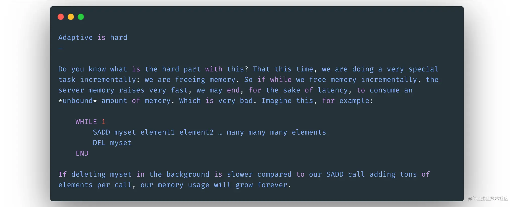

为什么说渐进式懒删除很难做呢？作者说当我们删除一个集合的时候，可能我们删除集合中元素的速度还没有客户端向集合中添加元素的速度快，那我们的删除工作看起来是永远也无法完成了。

### 3.3 BIO系统再添新成员——lazyfree

上一小节我们分析了使用DEL命令删除大key时会造成redis服务端阻塞，除此之外，在使用 FLUSHDB 和 FLUSHALL 删除包含大量键的数据库时，或者redis在清理过期数据和淘汰内存超限的数据时，如果碰巧撞到了大体积的键也会造成服务器阻塞。

为了解决以上问题， redis 4.0 引入了lazyfree的机制，它可以将删除键或数据库的操作放在后台线程里执行， 从而尽可能地避免服务器阻塞。

lazyfree的原理不难想象，就是在删除对象时只是进行逻辑删除，然后把对象丢给后台，让后台线程去执行真正的destruct，避免由于对象体积过大而造成阻塞。

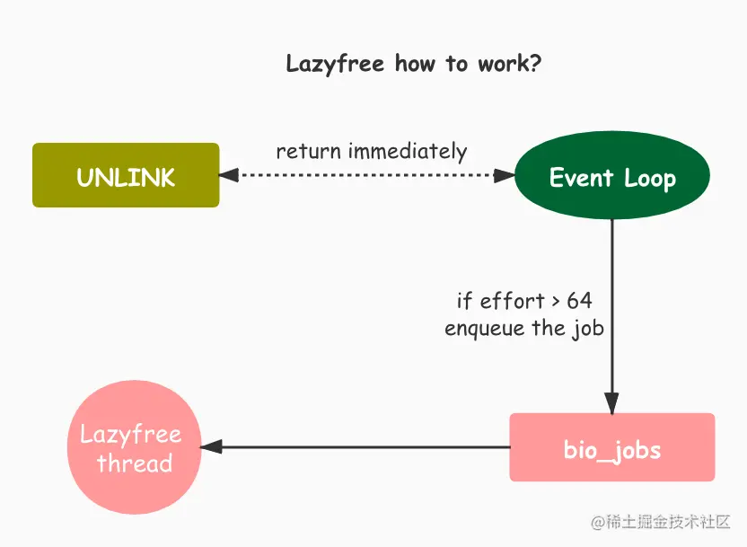

redis的lazyfree实现即是如此，下面我们主要看一下unlink命令的实现(以下代码是基于Redis 4.0的)：

```c
void unlinkCommand(client *c) {
    delGenericCommand(c, 1);
}
```

入口很简单，就是调用delGenericCommand，第二个参数为1表示需要异步删除。

```c
/* This command implements DEL and LAZYDEL. */
void delGenericCommand(client *c, int lazy) {
    int numdel = 0, j;
    for (j = 1; j < c->argc; j++) {
        expireIfNeeded(c->db,c->argv[j]);
        int deleted  = lazy ? dbAsyncDelete(c->db,c->argv[j]) :
                              dbSyncDelete(c->db,c->argv[j]);
        if (deleted) {
            signalModifiedKey(c->db,c->argv[j]);
            notifyKeyspaceEvent(REDIS_NOTIFY_GENERIC,
                "del",c->argv[j],c->db->id);
            server.dirty++;
            numdel++;
        }
    }
    addReplyLongLong(c,numdel);
}
```

delGenericCommand函数根据lazy参数来决定是同步删除还是异步删除，同步删除的逻辑没有什么变化就不细讲了，我们重点看下新增的异步删除的实现。

```c
#define LAZYFREE_THRESHOLD 64
// 首先定义了启用后台删除的阈值，对象中的元素大于该阈值时才真正丢给后台线程去删除，如果对象中包含的元素太少就没有必要丢给后台线程，因为线程同步也要一定的消耗。
int dbAsyncDelete(redisDb *db, robj *key) {
    if (dictSize(db->expires) > 0) dictDelete(db->expires,key->ptr);
    //清除待删除key的过期时间
    dictEntry *de = dictUnlink(db->dict,key->ptr);
    //dictUnlink返回数据库字典中包含key的条目指针，并从数据库字典中摘除该条目（并不会释放资源）
    if (de) {
        robj *val = dictGetVal(de);
        size_t free_effort = lazyfreeGetFreeEffort(val);
        //lazyfreeGetFreeEffort来获取val对象所包含的元素个数
        if (free_effort > LAZYFREE_THRESHOLD) {
            atomicIncr(lazyfree_objects,1);
            //原子操作给lazyfree_objects加1，以备info命令查看有多少对象待后台线程删除
            bioCreateBackgroundJob(BIO_LAZY_FREE ,val,NULL,NULL);
            //此时真正把对象val丢到后台线程的任务队列中
            dictSetVal(db->dict,de,NULL);
            //把条目里的val指针设置为NULL，防止删除数据库字典条目时重复删除val对象
        }
    }
    if (de) {
        dictFreeUnlinkedEntry(db->dict,de);
        //删除数据库字典条目，释放资源
        return 1;
    } else {
        return 0;
    }
}
```

以上便是异步删除的逻辑，首先会清除过期时间，然后调用dictUnlink把要删除的对象从数据库字典摘除，再判断下对象的大小（太小就没必要后台删除），如果足够大就丢给后台线程，最后清理下数据库字典的条目信息。

由以上的逻辑可以看出，当unlink一个体积较大的键时，实际的删除是交给后台线程完成的，所以并不会阻塞redis。

## 4. 小结

本文内容确实太过于冗长了，如果读者将文章仔细看到了这里，我相信您一定是对这篇文章非常感兴趣了。笔者使用GDB调试Redis6.0版本代码时，输出了Redis启动后的线程信息，我们就从下面这张图结合本文的内容做一个总结吧：

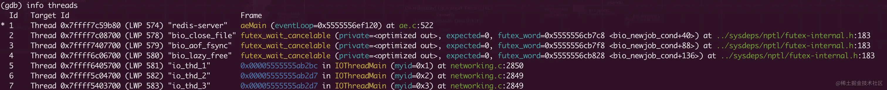

可以看到笔者的调试信息中，Redis启动了6个线程，它们分别是：

  * `redis-server` ： redis的主线程，通过 I/O multiplexing 接收客户端请求，执行CPU指令，从redis发版之出就已经存在并一直作为Redis核心网络模型的主线程。

  * `bio_close_file、bio_aof_fsync` ：Redis BIO系统的老成员，`bio_close_file`用来异步的关闭服务端文件，`bio_aof_fsync`用来异步的同步日志，它们也是从Redis发版之出就一直存在了。

  * `bio_lazy_free` ： Redis在4.0版本BIO系统增加的新成员，它主要将删除键或数据库的操作放在后台线程里执行， 从而尽可能地避免服务器阻塞。

  * `io_thd_1、io_thd_2、io_thd_3` ： Redis在6.0版本提供了I/O工作线程的配置，它们用来分担Redis主线程的I/O压力，使主线程更高效的进行CPU指令执行的工作。

以上就是笔者对Redis各个线程的功能和发展历史的总结，脉络很清晰！希望读者不仅限于了解Redis多线程的演进过程，还能清楚的知道这个过程中Redis都遇到了哪些问题，并对这些问题进行自己的思考，要知道作者antirez最终采取了什么样方案，他又是基于哪些因素考虑的。此外，本文分析了Redis架构设计的很多模型和源码，比如基于锁和共享变量实现的多线程生产者消费者模型、redis多线程I/O做到了lock-free，这些也都是我们在系统设计和编码中值得学习和借鉴的地方。最后，再次感谢坚持到最后的读者！

## 参考 & 延伸阅读

  * Lazy Redis is better Redis ：[antirez.com/news/93](http://antirez.com/news/93)
  * The C10K problem ： [www.kegel.com/c10k.html](http://www.kegel.com/c10k.html)
  * redis FAQ ：[redis.io/topics/faq](https://redis.io/topics/faq)
  * Benchmarking the experimental Redis Multi-Threaded I/O ：[itnext.io/benchmarkin…](https://itnext.io/benchmarking-the-experimental-redis-multi-threaded-i-o-1bb28b69a314)
  * Redis和I/O 多路复用 ：[draveness.me/redis-io-mu…](https://draveness.me/redis-io-multiplexing/)
  * Redis 多线程网络模型全面揭秘 ：[mp.weixin.qq.com/s/pm2NsPzTO…](https://mp.weixin.qq.com/s/pm2NsPzTO4lJQfGUC4-sJQ)
  * 条件变量与锁 ：[yiwenshao.github.io/2016/11/05/…](https://yiwenshao.github.io/2016/11/05/%25E6%259D%25A1%25E4%25BB%25B6%25E5%258F%2598%25E9%2587%258F%25E4%25B8%258E%25E9%2594%2581/)
  * Redis 6.0 多线程 IO 处理过程详解 ：[ruby-china.org/topics/3992…](https://ruby-china.org/topics/39925)
  * Redis · lazyfree · 大key删除的福音 ：[mysql.taobao.org/monthly/201…](http://mysql.taobao.org/monthly/2018/10/05/)
