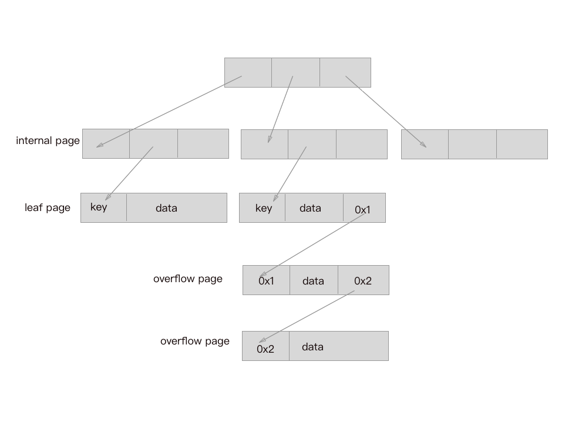
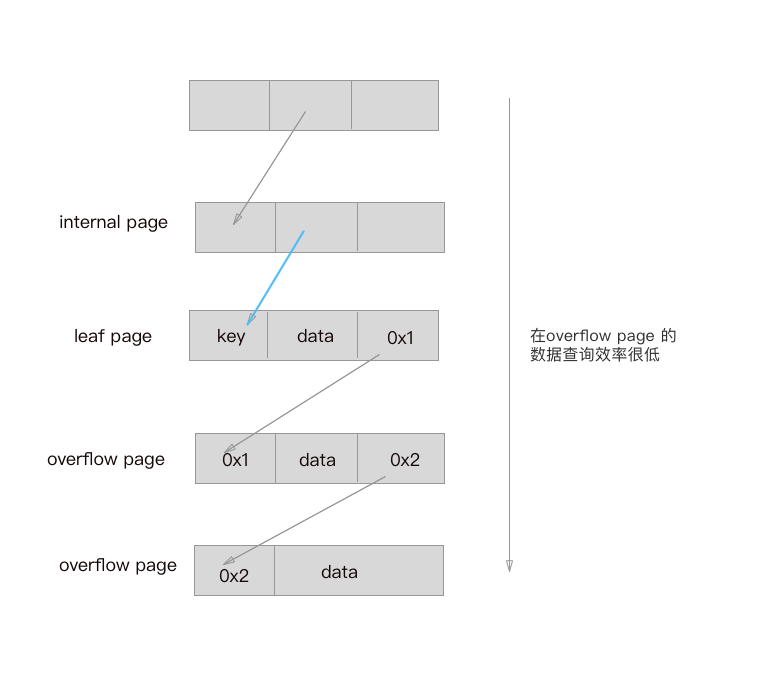
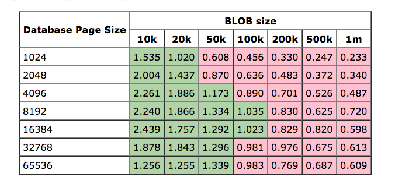

 
<!--BEGIN_DATA
{
    "create_date": "2017-03-30 17:26", 
    "modify_date": "2017-03-30 17:26", 
    "is_top": "0", 
    "summary": "SQLite知识摘要---存储", 
    "tags": "iOS", 
    "file_name": "SQLite知识摘要---存储.md"
}
END_DATA-->

####
原文出处：<a href='http://www.jianshu.com/p/df0bcb2b5ba9' target='blank'>SQLite知识摘要---存储</a>

最近在做HttpURLCache 的缓存管理，每个response 对应一个网页Cache索引,由数据库管理网页索引，response 使用Protobuf替换NSCoding 做序列化。发现在SQLite 方面的知识实在欠缺，虽然之前接触过，但是并没有深入的学习和研究，因此最近又翻阅了一些文档，温故而知新嘛，我也是初学者，欢迎大家踊跃吐槽。今天主要聊一聊SQLite的数据存储。

####SQLite的储存

SQLite 的一个DB对应一个物理文件，文件中的数据被分成若干个大小相等的Page进行存储，这些Page之间的关系由树形结构来组织管理。

为了方便管理，每个Page的大小是相同的，默认为1024，也可在创建时设置，大小范围是512~32768。那么整个数据库文件在物理上我们其实可以理解为一个P
age数组，下标从1开始上限是2^31-1（当然实际使用中还受到操作系统对文件大小的限制）。Page主要分为三类：

>   * **Btree页面**：Btree页又包括**叶子页**和**内部页**，叶子页是树形结构的叶子节点，实际存储数据的页面，内部页是树形结构的中间
节点，并不存储实际的数据，存储了下一层Page的索引列表；
>   * **溢出页面**：当某一条记录数据特别大，单个Page无法容纳时，SQLite会选择在这个叶子页面存放一部分数据，然后新建一个Page来存放剩余
的数据，这个新建的页面就是溢出页面；
>   * **空闲页面**：当某个Page上的数据被删除时，[物理空间可能并没有删除](http://www.sqlite.org/faq.html#q1
2)，SQLite会将其添加到空闲页面列表中（该链表头在db文件头部），以便后续插入数据时可再次使用。

Btree页面的内部以单元为单位来组织数据，对于叶子页面而言，一个单元存储的就是一条数据记录，而对于内部页面而言，一个单元对应一个子页面，里面存储着该页面的
页号以及该页面关键字的最大值。**当单个页面无法存放一条记录的时候，则会将部分内容存放在本单元，然后将剩下的部分存放在新开辟的溢出页面，在本单元结尾会记录下对应溢出页的索引。**一个溢出页不够还可以再开辟新的，依次类推。存储大数据的时候，最后都采用页链接链表来存储，注意了，这种方式是很低效率的。

  

Screen Shot 2017-03-28 at 10.27.53 PM.png

###存储空间的优化点

>   * 释放碎片空间。
>   * 合理设置page大小
>   * 调整缓存大小，提高事务效率

###释放碎片空间

  * 在默认情况下，当SQLite执行一个数据删除的事务的时候，并不会将DB文件中对应的内容删除，然后调整位置释放那些Page的空间，而只是简单地将这些页置为空闲页，然后添加到空闲页列表，以此来换取极高的效率。这是一种牺牲空间换取效率的方法，尽管空闲页到后面也会被再次使用，但是会带来不少碎片，导致文件所占用的大小比时机储存数据大小要大。

SQLite中的VACUUM命令可以达到释放空白空间的需求。它的执行原理是先将原数据库文件复制到临时数据库，再从临时数据库将数据重新载入原数据库，这中间会将那些空白页去除，使表数据彼此相邻排列，并整理数据库文件。这一番操作，对查询效率也会有所帮助。但是需要注意的是，VACUUM本身操作的效率非常低。

    
    
    PRAGMA auto_vacuum = (0 | NONE) | (1 | FULL) | ( 2| INCREMENTAL);
    (0 | NONE)表示关闭自动清理；
    (1 | FULL)表示完全开启auto-vacuum，每次执行事务都会进行自动收缩操作，但是会影响事务处理性能；
    (2 | INCREMENTAL)情况下，不会自动触发收缩操作，需要额外的incremental_vacuum语句来触发。
    auto-vacuum的效果没有VACUUM命令彻底，而且这个模式只有在还没创建表的数据库或者执行了VACUUM命令的情况下设置才能生效。

这边需要找到一个时间和空间的平衡点，对于不在乎存储开销的情况（比如PC程序，硬盘根本不值钱...），完全不需要用这个清理功能。如果有清理空间的需求，建议采用
VACUUM命令或者开INCREMENTAL，在需要清理的时机清理，不推荐开FULL模式。

###合理设置page大小

前面讲到，表的记录数据最终是存储在Btree叶子页，每个页面容纳一条或者多条记录，庞大的记录会开辟溢出页来存储。

这里有两点需要关注：

>   * 大数据字段，新增了溢出页，但是溢出页的使用率并不是非常高（同一个溢出页不会存储两条记录的溢出内容）
>
>   * 查询使用概率很高的字段被放到了溢出页。

第一种情况造成了空间上的一点浪费，而第二种情况，则会影响常用字段的查询效率，因为需要额外加载溢出页才能拿到字段值，且溢出页并不一定就在下一个连续的页，这对查
询的影响可想而知。

  

Screen Shot 2017-03-28 at 10.35.45 PM.png

因此pageSize 的大小设置至关重要，从[SQLite 官网](http://www.sqlite.org/intern-v-extern-blob.html)可知，关于大文件究竟是直接存储在db,还是将文件持久化到本地，然后将数据索引添加到数据库呢？

  

Screen Shot 2017-03-28 at 9.35.45 PM.png

官方给出的答案是：

>   * pageSize 为8192 或者16384 ，对于大文件的存储能达到最好的性能
>   * 大于100 kb 的文件建议用外部存储，小于100kb 的直接写db就好。

第三方库YYCache 就选择当单条数据大于20k 的时候，会直接写外部文件。小于则存db。  
**那么，如何选择适合自己的pageSize 呢？**

假设有一个字段，存储数据平均大小为M，我们只要确保尽量不要出现溢出就好。也就是pageSize尽量比M 大一点，避免开辟溢出页。
当存在很大的数据，那么直接用外部存储吧，数据库用来存外部数据索引就好。对于第二个问题，很简单，把经常查询需要用到的字段安排在前面，避免存到溢出页。

pageSize默认值是1024，理论上的设置范围是512~65536（必须是2的幂），之所以称之为理论值，是因为它还受到SQLITE_MAX_DEFAULT_PAGE_SIZE的限制。需要注意的是，page_size的设置需要在数据库创建之前才能生效！

###调整缓存大小，提高事务效率

当SQLite打开一个数据库连接执行事务的时候，会在内存中缓存部分页面数据以提高执行效率。如果Cache中缓存的页面多，命中概率就会增大，对事务的执行效率自然也会有很大的帮助。

对于经常会执行多行查询或者增删改操作的情况，我们可以适当增加缓存页数来提高事务执行效率。当然也要考虑到用户普遍的硬件条件，缓存页数乘以每页大小就是缓存总共占用的内存（page_size*cache_size）。设置缓存页数可以通过如下的命令实现

    
    
    PRAGMA cache_size = pages | -kibibytes;

默认是缓存2000页，cache_size的值可以正也可以负，正数代表页数，负数代表大小（单位是KB）。例如1000代表缓存1000页，那么所占用的大小为1000

  * page_size，-1000代表缓存可占用大小为1000 * 1024 bytes，也可以倒过来计算出可缓存的页数。page_size命令只对当前连接生效，下次连接需要重新设置。如果想设置所有连接都生效，可以使用default_cache_size命令。

建议：如果硬件条件允许SQLite使用更多的内存，可以适当将缓存页数调大，来换取大量或多行事务的效率。最好在开发前对用户群体的情况做一个大概的了解来估算这个值。

