 
<!--BEGIN_DATA
{
    "create_date": "2024-01-29 20:00", 
    "modify_date": "2024-01-29 20:00", 
    "is_top": "0", 
    "summary": "STL哈希表详解与erase性能优化", 
    "tags": "C/C++", 
    "file_name": "STL哈希表详解与erase性能优化.md"
}
END_DATA-->

#### <p>原文出处：<a href='https://km.woa.com/articles/show/596865' target='blank'>STL哈希表详解与erase性能优化——C++ STL贡献经历</a></p>

## 一、STL哈希表

C++程序员使用最频繁的库，大概就是STL了。STL是集成在GNU C++项目里的标准库。该项目提供C++编译器的同时，也提供了STL。另外，该项目提供的C++编译器针对STL库的实现做了很多编译器级别的优化。

STL里提供很多类型的容器。其中，最常用的KV类型容器就是map与`unordered_map`。由于`unordered_map`查找性能是O(1)，所以在不需要排序的高性能场景下，`unordered_map`更多被使用。

为什么`unorderd_map`能查找性能是O(1)，因为其底层实现是哈希表。另外，`unorderd_set`作为进行了Value为空特化后的KV容器，底层也是相同的哈希表实现。

下面从教科书上的哈希表开始，介绍STL哈希表的演化过程，以及目前的最终形态。

### 教科书上的哈希表

哈希表（hashtable）的原理：使用哈希算法（hash function）将Key映射到定长数组的下标，通过下标访问数组。因此是O(1)时间复杂度。

然而，数组大小有限，不同Key通过哈希算法得到下标可能相同，从而引发哈希冲突（hash collision）。哈希冲突的处理方式主要分为：开放寻址（open addressing）、拉链（seperate chaining）。

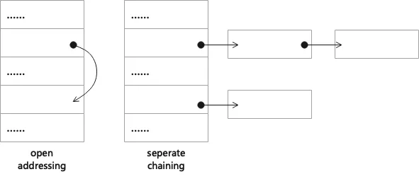

开放寻址，在发生哈希冲突时，使用固定算法在数组里重新找一个地址，作为item的入口。

拉链法，将数组槽位内容从单个item，改为链表。由于链表可以存储0～多个item，从而容许出现哈希冲突。

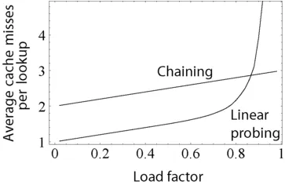

这两类冲突方法各有所长。由于拥有比较低的cache miss，当哈希算法和开放寻址算法与数据分布合适时，哈希表能表现出非常高的性能。而拉链法，在负载因子（load factor）高时，也不会出现极大的性能恶化，且链表节点在rehash时能够复用，因此在内存与性能的平衡上表现较好。

STL哈希表为了通用型，选用了拉链法。此外，Redis的数据库表、大型Set类型值、大型Hash类型值，也都是拉链法。

### STL哈希表的演化过程

#### 数组内仅存指针

上文说到，STL哈希表选用拉链法，拉链法哈希表的数组槽位存储的是链表。而这链表有2种实现，一种是数组内存链表的首节点，一种是数组内存链表的首节点的地址。STL哈希表选择了后者。

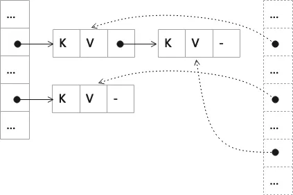

数组内仅存指针的优势在于所有item都在链表内。因此，rehash时所有item都保持不动，仅数组部分发生变化，这可以避免item的移动/拷贝构造、析构。同时，这也带来特性——允许保存哈希表的iterator，只要item没删除，iterator就一直有效——这特性在LRU等场景很有用。此外，数组内不存item，避免了空item对内存的浪费，毕竟即使在负载因子为1时，也有约36.8%(=1/e)的空槽。

但这也牺牲了一定的查找性能——多进行一次会带来cache miss的指针跳转。因此，比如brpc的flatmap，就选择数组内存链表的首节点以加快查找的效率。

#### 遍历迭代begin的优化

上述哈希表在遍历场景需要遍历整个数组，才能找到每一个item，但数组内空槽占比最少也在约36.8%以上，存在浪费。尤其在负载因子低的时候，影响突出。

首先考虑查找begin的优化。上述哈希表在查找begin，需要从头遍历数组，最大O(N)时间复杂度。

STL哈希表采用缓存begin所在的数组下标的方式进行优化。而begin所在的数组下标，可以在每次插入的时候，增加O(1)时间复杂度进行更新；删除begin并导致其链表清空时，增加最大O(N)时间复杂度进行更新。

演化至此，这就是**GCC V4.6之前的STL哈希表**实现。

#### 遍历迭代过程的优化

然后考虑遍历过程的优化。考虑到每个链表尾item的next都为空，比较浪费，可以用来加快遍历性能。最朴素的想法，就是将尾item的next指向下一个有item的链表的首item，这样就可加快遍历。然而，这在删除链表首item时，会出现问题。如下图，删除C时，需要更新B的next。而要找到B，必须进行哈希表遍历，开销较大。

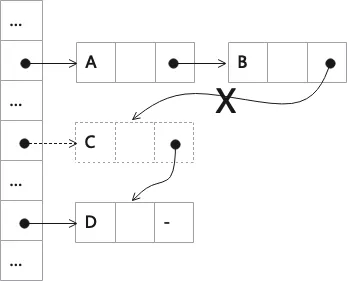

既然删除无头节点的单链表的首item会导致问题，那么把链表改成**带头节点的单链表**不就好了。正好数组里存放的指针可以当作头节点，那么将尾item的next指向下一个有item的链表在数组里的地址。如下图，删除C时，将C所在数组里的指针指向C的next。  

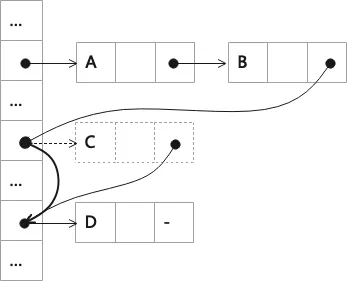

这确实能解决上面遇到的问题，但又会带来2个小问题：

  1. 额外的标记：数组里在存放指针的同时，需要标记链表是否为空（非空但有），并标记这是数组里的指针（遍历时遇到该标记则继续next）。
  2. 无用的中继：每当删除链表里唯一item（且item不是哈希表的最后item）时，都会造成该链表所在数组的指针变成一个无用的中继（如上图，删除C后，B的next本可直接指向D在数组里的地址，但却需要通过C这个中继）。随着中继变多，会让遍历效率退化成优化前。

使用数组里存放的指针当作头节点会造成以上问题，那么直接把每个链表的尾item当作下一个链表的头节点，怎么样？

这就是GCC v4.7以后，STL哈希表的做法。

### STL哈希表的最终形态

当前线上广泛使用的STL哈希表是GCC v4.7之后实现的版本。  

其实现的主要完成时间是2011～2012年，发布则是在2014年。

#### 整体结构

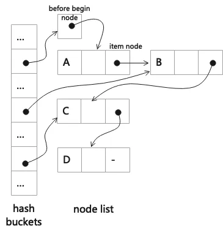

分为2部分，hash buckets（数组）与一个带头节点的总链表。

总链表的头节点，叫before begin node，不存储数据。其余节点叫item node，存储KV数据等。

区分总链表，属于每个bucket的链表称呼为分链表。如上文所述，bucket指向属于该bucket的首item的前置节点，作为分链表的头节点。

这个设计，因为不需要利用hash buckets做每个分链表的头节点，所以可以解决上面遇到2个问题。并且，遍历操作等同于总链表的遍历，在拉链式哈希表中属效率最高。

然而，这再次牺牲查找性能——又增加了一次指针跳转。另外，由于所有分链表之间没有分段，需要通过判断item node的hash值是否属于当前bucket，来确定是否已经遍历完当前分链表。

#### 节点结构

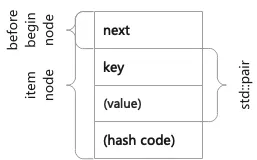

分为next、key、value、hash code。

因为before begin node只有next，所以item node里也将next字段放在节点头部。

item node在next后紧接着是存放数据的字段。`unordered_set`只存Key；`unordered_map`存储一个std::pair，里面包含Key与Value。

最后，因为需要频繁使用hash值来判断当前分链表的结尾，所以在一些时候需要存储hash值结果。（但如果key是整数，且哈希算法是std::hash，因为哈希计算结果就是本身，所以不需要记录。）

#### 插入

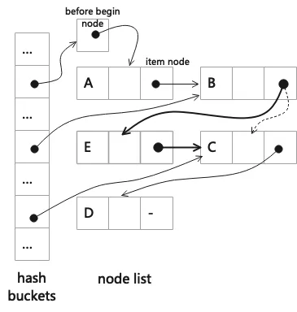

插入的item所在bucket非空时。

更新链表：只需要在分链表的头部插入即可。如上图，E节点所属分链表，其头节点是B，所以在头节点B后面插入E。

更新buckets：由于在分链表头部插入，不会增加分链表，也不会修改其他分链表的头节点。所以无需操作。

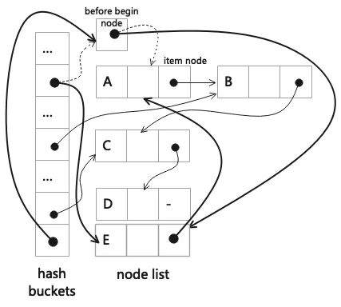

插入的item所在bucket为空时。

更新链表：因为需要产生新的分链表，所以直接在总链表的头部插入item，得到以before begin node为头节点的分链表。如上图，在before begin node后插入E。

更新buckets：新增了分链表，所以item所在的bucket，指向其分链表的头节点，即before begin node。同时，还要更新原来以before begin node为分链表头节点的bucket，指向新的头节点，即刚插入的item node。如上图，E所在bucket指向before beigin node，而A所在bucket则指向E。

#### 删除

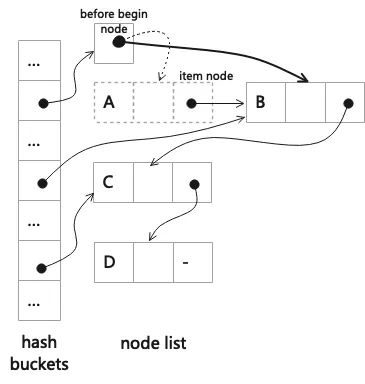

更新链表：直接在总链表里删除item即可。如图，因为不需改变buckets时，所以只在总链表里删除A。

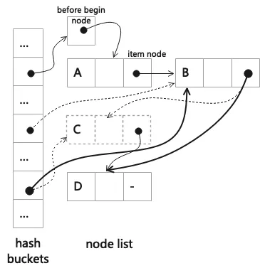

更新buckets：当item是分链表唯一元素时，删除后分链表消失，所以需要更新item所在bucket，指向空；当item是分链表尾item时，因为item会是其他分链表的头节点，所以需要更新其所在bucket指向item的前置，作为新的头节点。如图，因为C是分链表唯一元素，所以C所在bucket更新为空；同时，C也是分链表尾item，所以更新C的next，即D，所在bucket指向C的前置，即B。

#### 查找

通过hash值，得到bucket，从而找到分链表的头节点，然后遍历分链表。

遍历分链表的结束条件：节点的hash值并不属于当前bucket（或链表结束）。

### STL哈希表特点总结

哈希冲突的应对：拉链法

相比数组内存储item的教科书上的哈希表，STL哈希表有如下优劣势。

优势：

  1. 数据节点地址稳定，迭代器不会因为rehash而失效  
  2. 节约内存（拉链法，数组内无空item）
  3. 遍历性能极佳（等同于遍历链表）
  4. rehash性能好（无item的构造与析构，遍历性能好，hash值缓存）

劣势：

  1. 查找性能较弱（多2次指针跳转，需要通过hash值判断分链表结尾）
  2. 在空bucket里进行插入时，需要额外修改其他bucket。
  3. 删除分链表尾item时，需要额外修改其他bucket。

## 二、erase实现的性能bug

删除item时，如果item是分链表的首item，会有不必要的判断和赋值。

### bug代码

```cpp
void
_Hashtable<_Key, _Value, _Alloc, _ExtractKey, _Equal,
           _H1, _H2, _Hash, _RehashPolicy, _Traits>::
_M_remove_bucket_begin(size_type __bkt, __node_type* __next,
                       size_type __next_bkt)
{
  if (!__next || __next_bkt != __bkt)
    {
      // Bucket is now empty
      // First update next bucket if any
      if (__next)
        _M_buckets[__next_bkt] = _M_buckets[__bkt];

      // Second update before begin node if necessary
      if (&_M_before_begin == _M_buckets[__bkt])
        _M_before_begin._M_nxt = __next;
      _M_buckets[__bkt] = nullptr;
    }
}
```

```cpp
template<typename _Key, typename _Value,
           typename _Alloc, typename _ExtractKey, typename _Equal,
           typename _H1, typename _H2, typename _Hash, typename _RehashPolicy,
           typename _Traits>
auto
_Hashtable<_Key, _Value, _Alloc, _ExtractKey, _Equal,
           _H1, _H2, _Hash, _RehashPolicy, _Traits>::
_M_erase(size_type __bkt, __node_base* __prev_n, __node_type* __n)
-> iterator
{
  if (__prev_n == _M_buckets[__bkt])
    _M_remove_bucket_begin(__bkt, __n->_M_next(),
       __n->_M_nxt ? _M_bucket_index(__n->_M_next()) : 0);
  else if (__n->_M_nxt)
    {
      size_type __next_bkt = _M_bucket_index(__n->_M_next());
      if (__next_bkt != __bkt)
        _M_buckets[__next_bkt] = __prev_n;
    }

  __prev_n->_M_nxt = __n->_M_nxt;
  iterator __result(__n->_M_next());
  this->_M_deallocate_node(__n);
  --_M_element_count;

  return __result;
}
```

其中，如下代码，是一个多余的判断。

```cpp
// Second update before begin node if necessary
if (&_M_before_begin == _M_buckets[__bkt])
  _M_before_begin._M_nxt = __next;
```

`_M_remove_bucket_begin`是一个辅助函数，`_M_erase`和`_M_extract`里，当正在删除节点是分链表首item时，调用此函数。此函数里，会在当前bucket要被清空时，判断当前分链表是否以before begin node为头节点。如果是，则需要更新before begin node为下一个分链表的头节点。

然而，这个操作是多余的。因为，前文中讲述过，删除item对于总链表来说，永远都是从总链表里删除这一种操作。所以，`_M_erase`和`_M_extract`里集中从总链表删除了item，如下代码。

```cpp
__prev_n->_M_nxt = __n->_M_nxt;
```

即使这个item是begin也不例外——这时`__prev_n`就是before begin node。所以，从单链表里删除item，已经涵盖了before begin node的修改。因而无需在`_M_remove_bucket_begin`里再做一次判断。

### bug考察

#### 引入时间

该Bug在2012年1月13日，由该版本的哈希表作者François Dumont在实现时就引入了，并12年来未被发现。

https://github.com/gcc-mirror/gcc/commit/f86b266c7cc7e5704f3e6f3260cde43c511bb178

#### 引入原因

该bug的引入原因，与GCC V4.6之前的哈希表实现有一定关系。

前文说过，GCC V4.6之前的哈希表，通过记录begin所在的数组下标，来优化begin的性能。

这个值，在删除item，且删除之后item所在bucket被清空时，需要判断当前bucket是不是就是begin所在的bucket。如果是，则更新begin所在的数组下标为下一个非空bucket的下标。如下代码。

```cpp
// If _M_begin_bucket_index no longer indexes the first non-empty
// bucket - its single node is being erased - update it.
if (!_M_buckets[_M_begin_bucket_index])
  _M_begin_bucket_index = __result._M_cur_bucket - _M_buckets;
```

在实现新版哈希表的过程中，这段逻辑做了平移，就变成前文指出的多余判断。因为新版哈希表实际并不需要这一步骤。

#### 12年未被发现的原因——可读性 & 注释

首先，必须说`_M_erase`代码的可读性比较差。

if-else语句里，判断成功的代码抽成了`_M_remove_bucket_begin`函数，判断失败的代码却是具体实现。另外，if-else语句后续也都是具体实现。这是抽象层级不一致的可读性问题。

如果把判断失败的代码块抽成`_M_remove_bucket_not_begin`函数，把if-else后续的代码抽成函数`_M_remove_item_from_list`函数。那么，可以通过对比`_M_remove_bucket_not_begin`函数与`_M_remove_bucket_begin`函数，发现`_M_remove_bucket_begin`会进行链表的更新；再看到`_M_remove_item_from_list`函数，就能发现`_M_remove_bucket_begin`函数里并不需要对链表进行更新。

然后，注释模糊也是问题。

"if necessary"这句话非常模糊，具体什么是"necessary"？如果像GCC V4.6之前那样，注释详细，改成"if before begin node is the prev-node, update it"。那就能发现，这个修改和`_M_erase`里对prev-node的修改重复。

另外，注释模糊比没有注释更容易隐藏问题。在有注释的时候，读者会更在意注释，而不是代码。

### 修复方法

#### 修复代码

直接删除多余的判断。我修改后的代码：

```cpp
void
_M_remove_bucket_begin(size_type __bkt, __node_type* __next,
                       size_type __next_bkt)
{
  if (!__next || __next_bkt != __bkt)
    {
      // Bucket is now empty
      // Update next bucket if any
      if (__next)
        _M_buckets[__next_bkt] = _M_buckets[__bkt];

      _M_buckets[__bkt] = nullptr;
    }
}
```

提交给官方后，官方的合作者Théo Papadopoulo发现并认为`__next`不需要判断2次。于是继续做了简化，最终修改的代码：

```cpp
void
_M_remove_bucket_begin(size_type __bkt, __node_ptr __next_n,
                       size_type __next_bkt)
{
  if (!__next_n)
    _M_buckets[__bkt] = nullptr;
  else if (__next_bkt != __bkt)
    {
      _M_buckets[__next_bkt] = _M_buckets[__bkt];
      _M_buckets[__bkt] = nullptr;
    }
}
```

最终官方修复的commit：<https://github.com/gcc-mirror/gcc/commit/ec0a68b9ee3e4b3de84816ea22c82214f8a8ceb0>

#### 如何在生产环境中修复

上述修复只会在官方GCC里修复，应用到生产环境，又不想升级编译环境的GCC，可以采用如下方式手动修复。

由于所有改动都只涉及_Hashtable模版类的修改，所以只需要修改编译环境中C++库的头文件，即可生效。

以采取编译镜像作为编译环境的情况为例，具体方法如下：

  1. 进入编译镜像，找到C++库里hashtable.h文件（一般在 /usr/include/c++/8/bits/hashtable.h ）
  2. 按照 [修复commit](https://github.com/gcc-mirror/gcc/commit/ec0a68b9ee3e4b3de84816ea22c82214f8a8ceb0) 里的方式，进行修改，生成修复后的hashtable.h文件并导出
  3. 修改编译镜像，在最后一步拉取修复后的hashtable.h文件，替换原文件
  4. 使用新的编译镜像编译业务代码。

### 性能影响

影响`unordered_map`、`unordered_set`的erase（或extract）操作。

性能数据显示，对单元素进行erase（或extract）耗时下降0.6~1.2%，对连续iter进行erase耗时下降1.2%～2.4%。

## 三、贡献C++ STL的流程

C++ STL属于GNU GCC仓库，该仓库由GNU GCC的官方组织进行管理，github上的仓库是个只读镜像，不接受修改。另外，GNU GCC仓库只有官方认证的维护者有写权限，所以要么成为维护者，要么把Patch发邮件给维护者，由维护者帮忙提交。

贡献GNU GCC仓库的方法：<https://gcc.gnu.org/wiki/GettingStarted>

C++ STL仓库有额外的家规，参考：<https://gcc.gnu.org/onlinedocs/libstdc++/manual/appendix_contributing.html>

### 编译GCC

参考：<https://gcc.gnu.org/wiki/InstallingGCC>

编译过程中遇到过的问题：

  1. 找不到一些库文件。这些库文件在/usr/lib64/下，在/usr/lib/下没有。解决方法：运行configure时增加选项 --disable-multilib，这样只编译64位版本。
  2. 找不到一些执行命令。解决方法：安装dejagnu.noarch。

### 修改并运行单测

在编译GCC的流程中，configure后，不直接执行make，而是执行make check。

STL的单测结果在 ./x86_64-pc-linux-gnu/libstdc++-v3/testsuite/libstdc++.sum

本Bug修复已被现有单测覆盖。通过故意将修改部分改成报错，可以发现单测执行失败，具体见<https://gcc.gnu.org/pipermail/gcc-patches/2024-January/643208.html>

因为已被现有单测覆盖，所以修改后的单测结果与修改前一样就代表单测通过。

### 发送邮件

#### 收件人

gcc-patches@gcc.gnu.org——所有PATCH都需要发此邮箱

libstdc++@gcc.gnu.org——STL的PATCH需要带上此邮箱

#### 内容

需要包含说明、单测结果、Change Log、Patch（Diff）。Change Log的格式可以直接从其他人邮件里拷贝。Patch内容通过git diff命令生成。

可以通过查看其他人发的邮件，做为参考。

发给gcc-patches的邮件列表：<https://gcc.gnu.org/pipermail/gcc-patches/2024-January/subject.html>

发给libstdc++的邮件列表：<https://gcc.gnu.org/pipermail/libstdc++/2024-January/subject.html>

我的邮件：<https://gcc.gnu.org/pipermail/gcc-patches/2024-January/643208.html>

### 邮件沟通

发送完邮件后，相关代码的作者或者管理者会进行回复，需要进行沟通。

我的修改得到作者的肯定，并期望给个性能数据。于是做了个简易的性能测试，并回复。

我的邮件沟通记录，可以查看上一节里的邮件列表。

### 等待通知

最后会收到邮件通知。如果通过，可以在git仓库上查看到维护者帮忙做的提交，提交内容是邮件中的Change Log（可能被维护者修改）。

我收到了已经提交的[通知](https://gcc.gnu.org/pipermail/libstdc++/2024-January/058162.html)，并在github上的只读镜像里查到了[维护者帮忙做的提交](https://github.com/gcc-mirror/gcc/commit/ec0a68b9ee3e4b3de84816ea22c82214f8a8ceb0)。

