 
<!--BEGIN_DATA
{
    "create_date": "2016-07-20 19:52", 
    "modify_date": "2016-07-20 19:52", 
    "is_top": "0", 
    "summary": "STL\"源码\"剖析-重点知识总结", 
    "tags": "C/C++", 
    "file_name": "STL\"源码\"剖析-重点知识总结.md"
}
END_DATA-->

####
原文出处：<a href='http://www.cnblogs.com/luoxn28/p/5671988.html' target='blank'>STL"源码"剖析-重点知识总结</a>

STL是C++重要的组件之一，大学时看过《STL源码剖析》这本书，这几天复习了一下，总结出以下LZ认为比较重要的知识点，内容有点略多 :)

##1、STL概述

STL提供六大组件，彼此可以组合套用：

  * 容器（Containers）：各种数据结构，如：vector、list、deque、set、map。用来存放数据。从实现的角度来看，STL容器是一种class template。
  * 算法（algorithms）：各种常用算法，如：sort、search、copy、erase。从实现的角度来看，STL算法是一种 function template。
  * 迭代器（iterators）：容器与算法之间的胶合剂，是所谓的"泛型指针"。共有五种类型，以及其他衍生变化。从实现的角度来看，迭代器是一种将 operator*、operator->、operator++、operator- - 等指针相关操作进行重载的class template。所有STL容器都有自己专属的迭代器，只有容器本身才知道如何遍历自己的元素。原生指针(native pointer)也是一种迭代器。
  * 仿函数（functors）：行为类似函数，可作为算法的某种策略（policy）。从实现的角度来看，仿函数是一种重载了operator()的class或class template。一般的函数指针也可视为狭义的仿函数。
  * 配接器（adapters）：一种用来修饰容器、仿函数、迭代器接口的东西。例如：STL提供的queue 和 stack，虽然看似容器，但其实只能算是一种容器配接器，因为它们的底部完全借助deque，所有操作都由底层的deque供应。改变 functors接口者，称为function adapter；改变 container 接口者，称为container adapter；改变iterator接口者，称为iterator adapter。
  * 配置器（allocators）：负责空间配置与管理。从实现的角度来看，配置器是一个实现了动态空间配置、空间管理、空间释放的class template。

**STL****六大组件的交互关系**

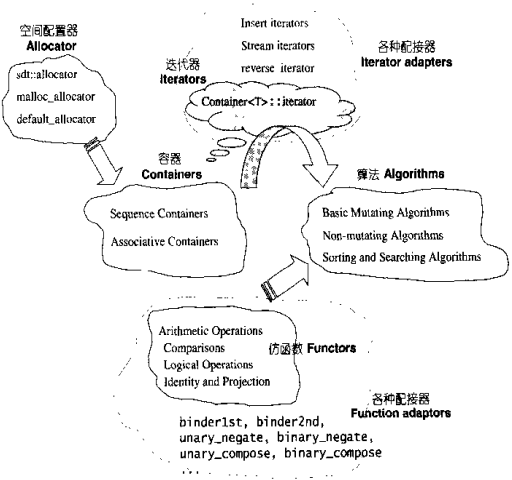

**一些可能令人困惑的C++语法糖：**

  1. 静态常量整数成员(double就不行)在class内部直接初始化
  2. 静态成员只能在类外初始化，且初始化时不加static
  3. 基类够构造函数中调用virtual函数实际调用的是基类中的virtual函数(这点和Java不同)
  4. 任何一个STL算法，都需要获得有一对迭代器(泛型指针)所指示的区间用以表示操作的范围。这一对迭代器表示的就是前闭后开区间

###泛型指针、原生指针和智能指针

  * 泛型指针有多种含义。指void*指针，可以指向任意数据类型，因此具有"泛型"含义。指具有指针特性的泛型数据结构，包含泛型的迭代器、智能指针等。广义的迭代器是一种不透明指针，能够实现遍历访问操作。通常所说的迭代器是指狭义的迭代器，即基于C++的STL中基于泛型的iterator_traits实现的类的实例。总体来说，泛型指针和迭代器是两个不同的概念，其中的交集则是通常提到的迭代器类。
  * 原生指针就是普通指针，与它相对的是使用起来行为上像指针，但却不是指针。说"原生"是指"最简朴最基本的那一种"。因为现在很多东西都抽象化理论化了，所以"以前的那种最简朴最基本的指针"只是一个抽象概念（比如iterator）的表现形式之一。
  * 智能指针是C++里面的概念：由于 C++ 语言没有自动内存回收机制，程序员每次得自己处理内存相关问题，但用智能指针便可以有效缓解这类问题。引入智能指针可以防止出现悬垂指针的情况，一般是把指针封装到一个称之为智能指针类中，这个类中另外还封装了一个使用计数器，对指针的复制等操作将导致该计数器的值加1，对指针的delete操作则会减1，值为0时，指针为NULL

##2、迭代器

　　STL的中心思想是：将数据容器和算法分隔开，彼此独立设计，最后再用黏合剂将它们撮合在一起。容器和算法的泛型化，可以用C++的class
template和function template来实现，而二者的黏合剂就是迭代器了。

###迭代器是一种智能指针

　　与其说迭代器是一种指针，不如说迭代器是一种智能指针，它将指针进行了一层封装，既包含了原生指针的灵活和强大，也加上很多重要的特性，使其能发挥更大的作用以及
能更好的使用。迭代器对指针的一些基本操作如*、->、++、==、!=、=进行了重载，使其具有了遍历复杂数据结构的能力，其遍历机制取决于所遍历的数据结构。下面
上一段代码，了解一下迭代器的"智能"：

    
    template<typename T>  
    class Iterator  
    {  
    public:  
        Iterator& operator++();  
        //...  
    private:   
        T *m_ptr;  
    };  

　　对于不同的数据容器，以上Iterator类中的成员函数operator++的实现会各不相同，例如，对于数组的可能实现如下：

    
    
    //对于数组的实现  
    template<typename T>  
    Iterator& operator++()  
    {   
       ++m_ptr;   
       retrun *this;  
    }

对于链表，它会有一个类似于next的成员函数用于获取下一个结点，其可能实现如下：

    
    
    //对于链表的实现  
    template<typename T>  
    Iterator& operator++()  
    {  
       m_ptr = m_ptr->next();//next()用于获取链表的下一个节点   
       return *this;  
    }  

iterator首先要对iterator指向对象的实现细节有非常丰富的了解，所以iterator为了不暴露所指向对象的信息，干脆就将iterator的实现由各个容器的设计者来实现好了。STL将迭代器的实现交给了容器，每种容器都会以嵌套的方式在内部定义专属的迭代器。各种迭代器的接口相同，内部实现却不相同，这也直接体现了泛型编程的概念。

###迭代器使用示例

    #include <iostream>  
    #include <vector>  
    #include <list>  
    #include <algorithm>  
    using namespace std;
    int main(int argc, const char *argv[])
    {
        int arr[5] = { 1, 2, 3, 4, 5 };
        vector<int> iVec(arr, arr + 5);//定义容器vector  
        list <int> iList(arr, arr + 5);//定义容器list  
        //在容器iVec的头部和尾部之间寻找整形数3  
        vector<int>::iterator iter1 = find(iVec.begin(), iVec.end(), 3);
        if (iter1 == iVec.end())
            cout << "3 not found" << endl;
        else
            cout << "3 found" << endl;
        //在容器iList的头部和尾部之间寻找整形数4  
        list<int>::iterator iter2 = find(iList.begin(), iList.end(), 4);
        if (iter2 == iList.end())
            cout << "4 not found" << endl;
        else
            cout << "4 found" << endl;
        system("pause");
        return 0;
    }

从上面迭代器的使用中可以看到，迭代器依附于具体的容器，即不同的容器有不同的迭代器实现，同时，我们也看到，对于算法find来说，只要给它传入不同的迭代器，即可对不同的容器进行查找操作。通过迭代器的穿针引线，有效地实现了算法对不同容器的访问，这也是迭代器的设计目的。

##3、序列式容器

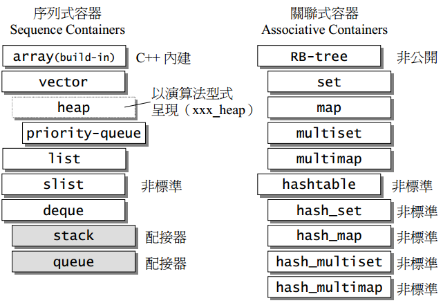

所谓序列式容器，其中的元素都可序，但未必有序，C++本身内建了一个序列式容器array，STL另外提供了vector、list、deque、stack、queue、priority-queue等序列式容器。其中stack和queue由于只是deque改头换面而来，技术上被归为一种配接器 (adapter)。

###vector

vector采用的数据结构非常简单：线性连续空间。它以两个迭代器start和finish分别指向配置得来的连续空间中目前已被使用的范围，并以迭代器end
_of_storage指向整块连续空间(含备用空间)的尾端。

    
    template <class T, class Alloc = alloc>
    class vector {
        ...
    protected:
        iterator start;    //表示
        iterator finish;
        iterator end_of_storage;
        ...
    };

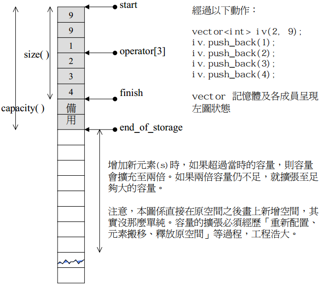

　　**注意**：所谓动态增加大小，并不是在原来空间之后接续新空间(因为无法保证原空间之后尚有可供分配的空间)，而是以原来大小的的两倍另外分配一块较大空间，然后将原内容拷贝过来，然后才开始在原内容之后构造新元素，并释放原空间。因此，对vector的任何操作，一旦引起空间重新配置，指向原vector的所有迭代器就都失效啦。

**vector****变量的大小分析**

vector类中有3个迭代器域(也就是指针域)，所以大小至少为12字节。

测试环境：win7 64位 VS2013

测试代码：
    
    #include <iostream>
    #include <vector>
    using namespace std;
    int main(void)
    {
        vector<int> a(5, 0); //16
    
        cout << sizeof(a) << endl;
        cout << (int)(void *)&a << endl;
        cout << (int)(void *)&a[0] << endl;
        cout << (int)(void *)&a[a.size() - 1] << endl;
        cout << endl;
        cout << *((int *)&a) << endl;
        cout << *(((int *)&a) + 1) << endl;
        cout << *(((int *)&a) + 2) << endl;
        cout << *(((int *)&a) + 3) << endl;
        cout << endl;
        cout << a.size() << endl;
        cout << a.capacity() << endl;
        system("pause");
        return 0;
    }

测试结果显示此时vector的大小为16字节，分别包括start、finish、end_of_storage成员，剩下的4个字节暂时不知道代表什么意思…:(

测试环境：Ubuntu12.04 codeblocks10.05

测试代码：

    
    #include <iostream>
    #include <vector>
    using namespace std;
    int main(void)
    {
        vector<int> a(5, 0); //12
    
        cout << sizeof(a) << endl;
        cout << (int)(void *)&a << endl;
        cout << (int)(void *)&a[0] << endl;
        cout << (int)(void *)&a[a.size() - 1] << endl;
        cout << endl;
        cout << *((int *)&a) << endl;
        cout << *(((int *)&a) + 1) << endl;
        cout << *(((int *)&a) + 2) << endl;
        cout << *(((int *)&a) + 3) << endl;
        cout << endl;
        cout << a.size() << endl;
        cout << a.capacity() << endl;
        return 0;
    }

测试结果显示此时vector的大小为12字节，包括start、finish、end_of_storage成员

小结

win和Ubuntu所用的STL的版本是不一样的，不同的STL所使用的vector类也不同，有着不同的容器管理方式。

###list

相对于vector的连续线性空间，list就显得复杂许多，它的好处就是插入或删除一个元素，就配置或删除一个元素空间。对于任何位置的元素的插入或删除，list永远是常数时间。

list本身和节点是不同的结构，需要分开设计。以下是STL list的节点node结构：

    
    template <class T>
    class __list_node {
        typedef void* void_pointer;
        void_pointer prev;
        void_pointer next;
        T data;
    };

这是一个双向链表

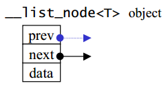

list数据结构

>SGI list不仅是一个双向链表，而且是一个环状双向链表。只需一个指针就可遍历整个链表。

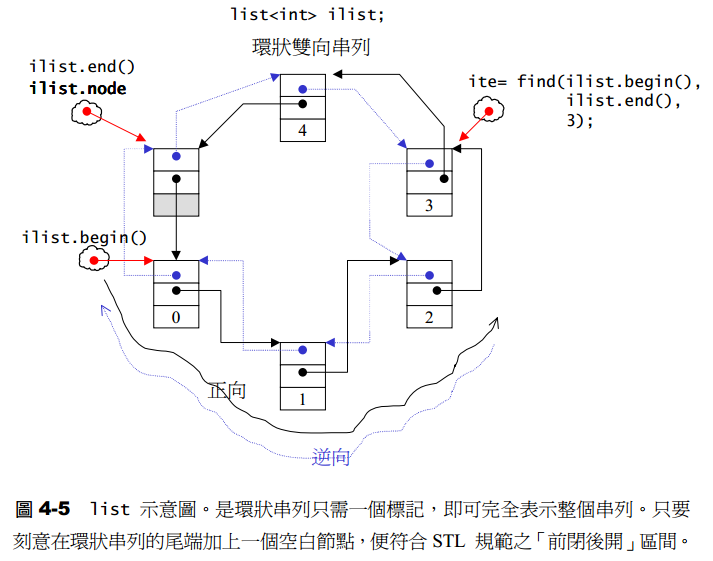

###deque

deque和vector的最大差异，一在于deque允许常数时间内对起头端进行插入或移除操作，二在于deque没有所谓容量(capacity)概念，因为它是以分段连续空间组合而成，随时可以增加一段新的空间连接起来。

deque由一段一段连续空间组成，一旦有必要在deque的前端或尾端增加新空间，便配置一段连续空间，串接在整个deque的前端或尾端。deque的最大任务，便是在这些分段的连续空间上，维护其整体连续的假象，并提供随机存取的接口，避开了"重新配置、复制、释放"的轮回，代价是复杂的迭代器结构。

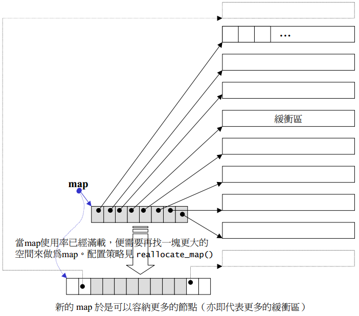

####deque迭代器

迭代器首先必须指出分段连续空间在哪里，其次它必须能够判断自己是否已经处在缓冲区的边缘，如果是，一旦前进或后退就必须跳跃下一个缓冲区，为了能够正常跳跃，deque必须随时掌握管控中心。

迭代器结构：

    template <class T, class Ref, class Ptr, size_t BufSiz>
    struct __deque_iterator { // 未继承 std::iterator
        // 保持迭代器的连接
        T* cur; // 此迭代器所指之缓冲区的现行（ current）元素
        T* first; // 此迭代器所指之缓冲区的的头
        T* last; // 此迭代器所指之缓冲区的的尾（含备用空间）
        map_pointer node; // 指向管控中心
        ...
    };

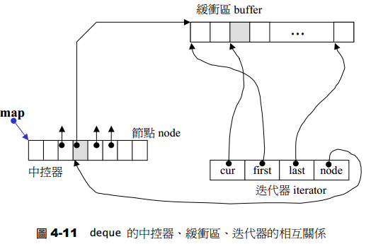

　　假如deque中已经包含了20个元素了，缓冲区大小为8，则内存布局如下：

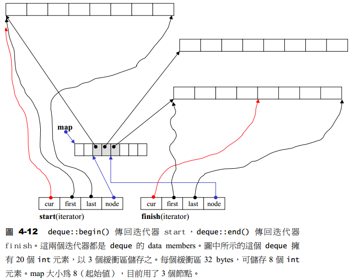

注意：deque最初状态(无任何元素)保有一个缓冲区，因此，clear()完成之后回到初始状态，也一样会保留一个缓冲区。

###stack

stack是一种**先进后出**(First In Last Out，FILO)的数据结构，它只有一个出口。stack允许增加元素、移除元素、取得最顶端元
素。但除了最顶端外，没有任何其他方法可以存取，stack的其他元素，换言之，stack不允许有遍历行为。stack默认以deque为底层容器。

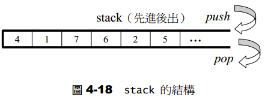

###queue

queue是一种先进先出(First In First Out，FIFO)的数据结构，它有两个出口，允许增加元素、移除元素、从最底端加入元素、取得最顶端元素。但除了最底端可以加入、最顶端可以取出外，没有任何其他方法可以存取queue的其他元素，换言之，queue不允许有遍历行为。queue默认以deque为底层容器。

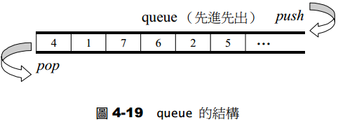

###heap

heap并不归属于STL容器组件，它是个幕后英雄，扮演prority queue的助手。priority
queue允许用户以任何次序将任何元素推入容器内，但取出时一定是按照优先级最高的元素开始取。binary max heap正好具有这样的特性，适合作为priority queue的底层机制。**heap****默认建立的是大堆**。

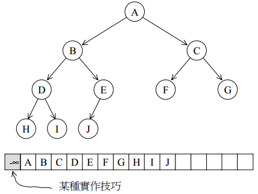

heap测试用例：

    
    #include <iostream>
    #include <queue>
    #include <algorithm>
    using namespace std;
    template <class T>
    struct display
    {
        void operator()(const T &x)
        {
            cout << x << " ";
        }
    };
    /// heap默认为大堆，以下设置为建立小堆
    template <typename T>
    struct greator
    {
        bool operator()(const T &x, const T &y)
        {
            return x > y;
        }
    };
    int main(void)
    {
        int ia[9] = { 0, 1, 2, 3, 4, 8, 9, 3, 5 };
        vector<int> ivec(ia, ia + 9);
        make_heap(ivec.begin(), ivec.end(), greator<int>()); //注意：此函数调用时，新元素应已止于底部容器的尾端
        for_each(ivec.begin(), ivec.end(), display<int>());
        cout << endl;
        ivec.push_back(7);
        push_heap(ivec.begin(), ivec.end(), greator<int>());
        for_each(ivec.begin(), ivec.end(), display<int>());
        cout << endl;
        pop_heap(ivec.begin(), ivec.end(), greator<int>());
        cout << ivec.back() << endl;
        ivec.pop_back();
        for_each(ivec.begin(), ivec.end(), display<int>());
        cout << endl;
        sort_heap(ivec.begin(), ivec.end(), greator<int>());
        for_each(ivec.begin(), ivec.end(), display<int>());
        cout << endl;
        system("pause");
        return 0;
    }

###priority_queue

priority_queue是一个拥有权值的queue，它允许加入新元素、移除旧元素、审视元素值等功能。由于是一个queue，所以只允许在底端加入元素，从顶端取出元素，除此之外别无其他存取元素方法。priority_queue内的元素并非按照被推入的顺序排列，而是自动按照元素的权值排列。权值最高者排在前面。

默认情况下priority_queue利用max-heap按成，后者是一个以vector为底层容器的complate binary tree。

priority_queue测试用例：
    
    #include <iostream>
    #include <queue>
    #include <algorithm>
    using namespace std;
    int main(void)
    {
        int ia[9] = { 0, 1, 2, 3, 4, 8, 9, 3, 5 };
        vector<int> ivec(ia, ia + 9);
        priority_queue<int> ipq(ivec.begin(), ivec.end());
        ipq.push(7);
        ipq.push(23);
        while (!ipq.empty())
        {
            cout << ipq.top() << " ";
            ipq.pop();
        }
        cout << endl;
        system("pause");
        return 0;
    }

##4、关联性容器

set和map底层数据结构都是红黑树，**红黑树**的data域段为**pair<key, value>**类型。关于红黑树更多知识请点击：[深入理解红黑树](http://www.cnblogs.com/luoxn28/p/5540638.html)。

###set

set的所有元素都会根据元素的键值自动排序。set的元素不像map那样可以同时拥有**实值****(value)**和**键值****(key)**，s
et元素的键值就是实值，实值就是键值，set不允许有两个相同的元素。Set元素不能改变，在set源码中，set<T>::iterator被定义为底层TB-tree的const_iterator，杜绝写入操作，也就是说，set iterator是一种constant iterators(相对于mutable iterators)

测试用例(让set从大到小存放元素)：
  
    
    #include <iostream>
    #include <set>
    #include <functional>
    using namespace std;
    /// set默认是从小到大排列，以下是让set从大到小排列
    template <typename T>
    struct greator
    {
        bool operator()(const T &x, const T &y)
        {
            return x > y;
        }
    };
    int main(void)
    {
        set<int, greator<int>> iset;
        iset.insert(12);
        iset.insert(1);
        iset.insert(24);
        for (set<int>::const_iterator iter = iset.begin(); iter != iset.end(); iter++)
        {
            cout << *iter << " ";
        }
        cout << endl;
        system("pause");
        return 0;
    }

###map

map的所有元素都会根据元素的键值自动排序。map的所有元素都是pair，同时拥有实值(value)和键值(key)。pair的第一元素为键值，第二元素为实值。map不允许有两个相同的键值。

如果通过map的迭代器改变元素的键值，这样是不行的，因为map元素的键值关系到map元素的排列规则。任意改变map元素键值都会破坏map组织。如果修改元素的实值，这是可以的，因为map元素的实值不影响map元素的排列规则。因此，map iterator既不是一种constant iterators，也不是一种mutable iterators。

测试用例(map从大到小存放元素)：

    
    #include <iostream>
    #include <string>
    #include <map>
    #include <functional>
    using namespace std;
    /// map默认是从小到大排列，以下是让map从大到小排列
    template <typename T>
    struct greator
    {
        bool operator()(const T x, const T y)
        {
            return x > y;
        }
    };
    int main(void)
    {
        map<int, string, greator<int>> imap;
        imap[3] = "333";
        imap[1] = "333";
        imap[2] = "333";
        for (map<int, string>::const_iterator iter = imap.begin(); iter != imap.end(); iter++)
        {
            cout << iter->first << ": " << iter->second << endl;
        }
        system("pause");
        return 0;
    }

###multiset/multimap

multiset的特性以及用法和set完全相同，唯一的差别在于它允许键值重复，因此它的插入操作采用的是底层机制RB-tree的insert_equal()而非insert_unique()。

multimap的特性以及用法和map完全相同，唯一的差别在于它允许键值重复，因此它的插入操作采用的是底层机制RB-tree的insert_equal()而非insert_unique()。

###hashtable (底层数据结构)

二叉搜索树具有对数平均时间表现，但这样的表现构造在一个假设上：输入数据有足够的随机性。hashtable这种结构在插入、删除、查找具有"常数平均时间"，而且这种表现是以统计为基础，不需依赖元素的随机性。

hashtable底层数据结构为分离连接法的hash表，如下所示：

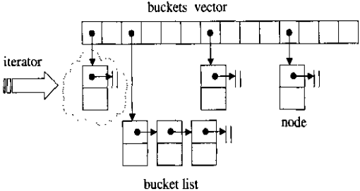

hashtable中的buckets使用的是vector数据结构，当插入一个元素时，找到该插入哪个buckets的插槽，然后遍历该插槽指向的链表，如果有相同的元素，就返回；否则的话就将该元素插入到该链表的头部。(当然，如果是multi版本的话，是可以插入重复元素的，此时插入过程为：当插入一个元素时，找到该插入哪个buckets的插槽，然后遍历该插槽指向的链表，如果有相同的元素，就将新节点插入到该相同元素的后面；如果没有相同的元素，产生新节点，插入到链表头部)

当调用成员函数clear()后，buckets vector并未释放空间，仍保留原来大小，只是删除了buckets所连接的链表。

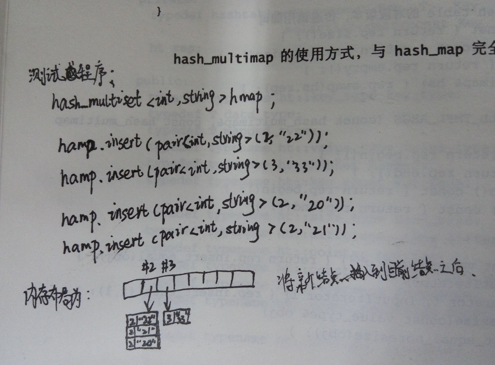

**hash_multimap****插入式的图示说明**

###hash_set

运用set，为的是快速搜寻元素。这一点，不论其底层是RB-tree或是hashtable，都可以完成任务，但是，RB-tree有自动排序功能而hashtable没有，即set的元素有自动排序功能而hash_set没有。

测试代码：

    
    #include <iostream>
    #include <hash_set>
    #include <cstring>
    using namespace std;
    using namespace __gnu_cxx; // gcc编译器要加上这一句，否则编译出错
    struct eqstr
    {
        bool operator()(const char *s1, const char *s2)
        {
            return strcmp(s1, s2) == 0;
        }
    };
    void lookup(const hash_set<const char *> &Set, const char *word)
    {
        hash_set<const char *>::const_iterator iter
            = Set.find(word);
        cout << word << ": " << (iter != Set.end() ? "present" : "not present") << endl;
    }
    int main(void)
    {
        hash_set<const char *> Set;
        Set.insert("kiwi");
        Set.insert("plum");
        Set.insert("apple");
        Set.insert("mango");
        Set.insert("apricot");
        Set.insert("banana");
        lookup(Set, "mango");
        lookup(Set, "apple");
        lookup(Set, "durian");
        hash_set<const char *>::const_iterator iter;
        for (iter = Set.begin(); iter != Set.end(); iter++)
            cout << *iter << " ";
        cout << endl;
        return 0;
    }

hash_set测试代码

###hash_map

hash_map以hashtable为底层结构，由于hash_map所提供的操作接口，hashtable都提供了，所以几乎所有的hash_map操作行为都是转调用hashtable的操作行为结果。RB-tree有自动排序功能而hashtable没有，反映出来的结果就是，map的元素有自动排序功能而hash_map没有。

测试代码：

    
    
    #include <iostream>
    #include <hash_map>
    #include <cstring>
    #include <algorithm>
    using namespace std;
    template <typename T>
    struct print
    {
        void operator()(const T &x)
        {
            cout << x.first << ": " << x.second << endl;
        }
    };
    int main(void)
    {
        hash_map<char *, int> days;
        days["january"] = 31;
        days["february"] = 28;
        days["march"] = 31;
        days["april"] = 30;
        days["may"] = 31;
        days["june"] = 30;
        cout << "march: " << days["march"] << endl;
        cout << "june: " << days["june"] << endl;
        cout << "the total elements of hash_map:" << endl;
        for_each(days.begin(), days.end(), print<pair<char *, int>>());
        system("pause");
        return 0;
    }

hash_map测试代码

###hash_multiset/hash_multimap

hash_multiset的特性与multiset完全相同，唯一的差别在于它的底层机制是hashtable，因此，hash_multiset的元素是不会自动排序的。

hash_multimap的特性与multimap完全相同，唯一的差别在于它的底层机制是hashtable，因此，hash_multimap的元素是不会自动排序的。

hash_multimap测试用例：

    
    #include <iostream>
    #include <hash_map>
    #include <cstring>
    #include <algorithm>
    #include <string>
    using namespace std;
    template <typename T>
    struct print
    {
        void operator()(const T &x)
        {
            cout << x.first << ": " << x.second << endl;
        }
    };
    int main(void)
    {
        hash_multimap<int, string> hmap;
        hmap.insert(pair<int, string>(2, "32"));
        hmap.insert(pair<int, string>(2, "22"));
        hmap.insert(pair<int, string>(2, "12"));
        hmap.insert(pair<int, string>(2, "2"));
        for_each(hmap.begin(), hmap.end(), print<pair<int, string>>());
        return 0;
    }

在vs2013(windows 7 64位)下运行结果为：

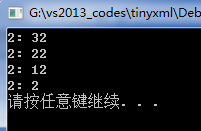

在Kali2.0中运行(程序需添加using namespace __gun_cxx)结果为：

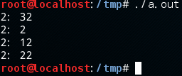

由运行结果可知，不同的系统所用的STL是有差别的，不同的STL的hash_table冲突解决方法不一样。

参考：

1、《STL源码剖析》

2、<http://blog.csdn.net/shudou/article/details/11099931>

3、<http://www.cplusplus.com/search.do?q=slist>

